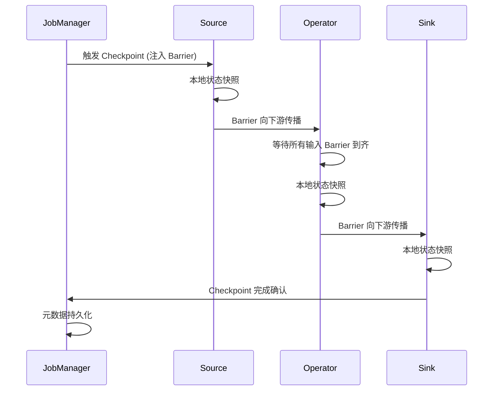
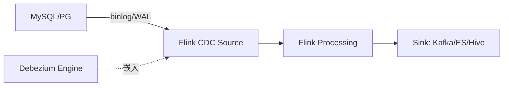
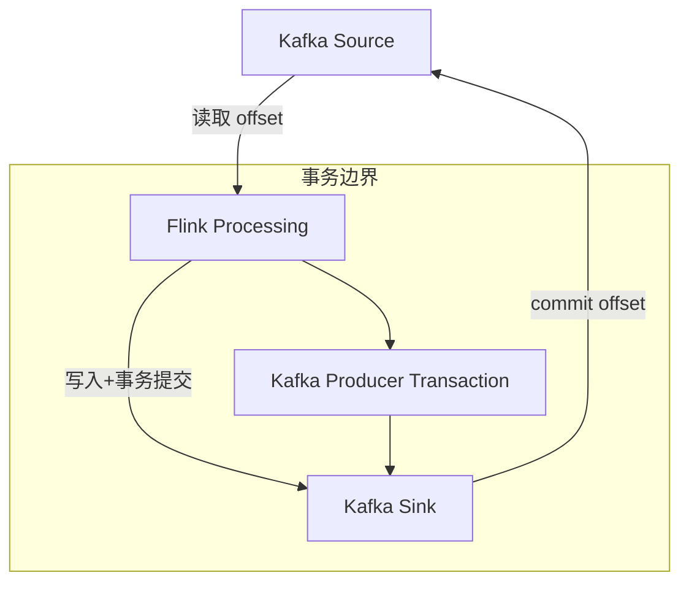
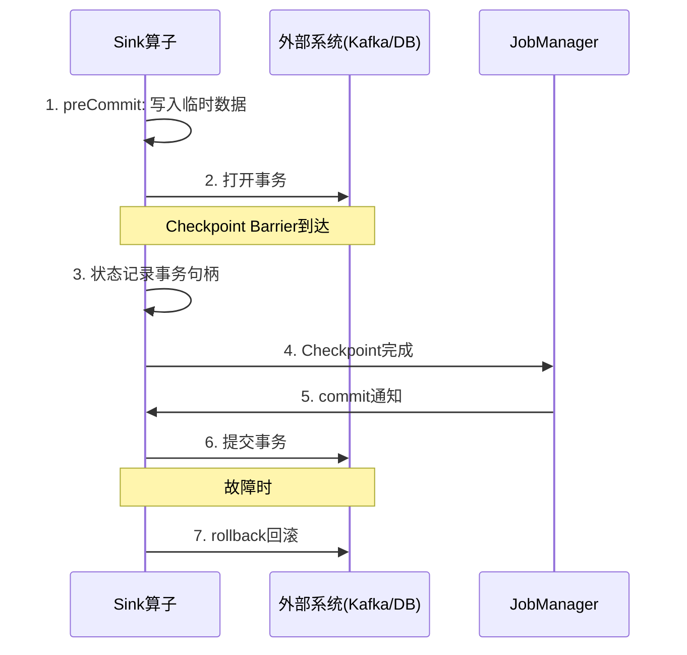

# Apache Flink（流处理引擎 / 批流一体）

> Flink 是新一代**流批一体**计算引擎：以流为核心，流是批的超集。相比 Spark Streaming（微批）的延迟高、Storm（纯流）的吞吐低，Flink 实现了**真正的逐事件低延迟 + 高吞吐 + Exactly-once**。本篇按「解决的问题 → 原理 → 特性 → 选型关注点」拆解。

---

## 一、Flink 要解决的问题

| 痛点 | 说明 |
|------|------|
| 流批割裂 | 同一份业务逻辑要写两套（实时 Flink + Spark 批），口径不一致 |
| 延迟 vs 吞吐 | Storm 低延迟但吞吐低；Spark Streaming 吞吐高但秒级延迟 |
| 乱序事件 | 分布式上游导致事件到达乱序，需要事件时间语义 + Watermark |
| 状态一致性 | 故障恢复后状态与输出要一致（不能多不能少） |
| 窗口复杂 | 滑动窗口/会话窗口/迟到数据处理繁琐 |
| 实时数仓 | 传统数仓 T+1 不能满足实时分析需求 |

> 核心认知：**Flink 把一切视为流（流是批的超集），用同一套 API/Runtime 处理实时与离线**。

---

## 二、Flink 核心原理

### 2.1 运行时架构

```
JobManager（Master）
  ├── JobGraph → ExecutionGraph 调度
  ├── Checkpoint 协调（Barrier 注入）
  ├── ResourceManager 资源申请
  └── Dispatcher（提交入口）

TaskManager（Worker）
  ├── Task Slot（资源隔离单位）
  ├── Operator Chain（算子链：相同并行度算子合并为一个 Task，减少序列化）
  ├── Network Buffer（数据传输缓冲）
  └── Task Slot Group（Slot 分配管理）
```

### 2.2 时间语义

| 时间类型 | 含义 | 适用场景 |
|----------|------|----------|
| Event Time | 事件产生的时间（数据自带时间戳） | 乱序/延迟事件，结果确定 |
| Ingestion Time | 进入 Flink Source 的时间 | 简单场景 |
| Processing Time | 算子处理时的系统时间 | 不关心乱序，最快 |

**选型关注点**：生产环境几乎都用 **Event Time + Watermark**（处理乱序），Processing Time 只用于对时序无要求的场景。

### 2.3 Watermark（水位线）

| 方面 | 说明 |
|------|------|
| 作用 | 衡量事件时间进展，告诉系统「时间 T 之前的数据到齐了，可以触发计算」 |
| 生成策略 | `Watermark = MaxEventTime - 最大乱序时间` |
| 传播 | Watermark 在算子间广播，多输入取最小值 |
| 风险 | 设太晚 → 延迟大；设太早 → 迟到数据需侧输出（Side Output） |
| 周期性 | 周期性生成（默认 200ms）或标点（Punctuated） |

### 2.4 窗口（Window）

| 窗口类型 | 说明 | 典型场景 |
|----------|------|----------|
| Tumbling Window | 固定大小、不重叠 | 每 5 分钟 PV/UV |
| Sliding Window | 固定大小、可滑动 | 最近 1 分钟每 10 秒 |
| Session Window | 按活跃间隔切分 | 用户会话分析 |
| Global Window | 不触发，自定义触发器 | 自定义逻辑 |
| Cumulative Window | 累积窗口 | 累计统计 |

### 2.5 Checkpoint（分布式快照，Exactly-once 基石）

**原理**：基于 **Chandy-Lamport 算法**的异步 Barrier 快照。

1. JobManager 定期触发 Checkpoint，Source 注入 Barrier 到数据流
2. Barrier 随数据流向下游传播，算子收到所有输入的 Barrier 后：
   - 将本地状态异步快照到状态后端（RocksDB/S3/HDFS）
   - 向下游转发 Barrier
3. 所有算子完成 → Checkpoint 完成（元数据存 JobManager）

**故障恢复**：从最近 Checkpoint 恢复状态 + 重放数据（Source 支持回放，如 Kafka offset 回退）

**选型关注点**：Checkpoint 间隔 = RTO 与吞吐的权衡（间隔越短恢复越快，但吞吐损失越大），生产通常 1~10 分钟。

### 2.6 状态后端（State Backend）

| 后端 | 存储位置 | 吞吐 | 适用场景 |
|------|----------|------|----------|
| HashMapStateBackend | TM 内存 | 最快 | 小状态、调试 |
| EmbeddedRocksDBStateBackend | 本地磁盘（RocksDB） | 慢但大 | 超大状态（生产首选） |

**选型关注点**：生产环境几乎都用 **RocksDB**（支持超大状态 + Incremental Checkpoint）。

### 2.7 Savepoint 与 Checkpoint

| 维度 | Checkpoint | Savepoint |
|------|-----------|-----------|
| 触发方式 | 自动（定期） | 手动触发 |
| 用途 | 故障恢复 | 升级/迁移/版本回退 |
| 格式 | 与 State Backend 相关 | 标准化格式 |
| 生命周期 | 自动管理（保留 N 个） | 手动管理 |

---

## 三、Flink API 层次

| API 层次 | 类/接口 | 说明 |
|----------|---------|------|
| SQL / Table API | `SELECT ... FROM` | 声明式，最上层，BI/分析师友好 |
| Process Function | `processElement` | 最底层，全控制（状态/定时器/侧输出） |
| DataStream API | `map/filter/keyBy/window` | 编程式，工程师首选 |
| Stateful Stream Processing | `KeyedProcessFunction` | 有状态流处理核心 |

**选型关注点**：团队有 SQL 背景 → Table API/SQL；复杂事件处理/精细控制 → DataStream + ProcessFunction。

---

## 四、Flink 生态与连接器

| 连接器 | 说明 |
|--------|------|
| Kafka Source/Sink | 实时管道核心（Kafka → Flink → Kafka/ES/HDFS） |
| JDBC Sink | 写关系库 |
| HDFS/S3 Sink | 批流统一落盘（数据湖） |
| HBase/Redis/ES | 维表 JOIN / 实时 Upsert |
| CDC（Debezium/Canal） | binlog → Flink → 实时数仓/ES |
| Pulsar Source/Sink | Pulsar 生态集成 |
| Elasticsearch Sink | 实时搜索写入 |
| DataGen Source | 测试数据生成 |

---

## 五、Flink vs Spark Streaming vs Storm

| 维度 | Flink | Spark Streaming | Storm |
|------|-------|-----------------|-------|
| 处理模型 | 逐事件（真流） | 微批（Micro-batch） | 逐事件 |
| 延迟 | 毫秒~秒 | 秒~分钟 | 毫秒 |
| 吞吐 | 高 | 最高 | 中 |
| 语义 | Exactly-once | Exactly-once | At-least-once（Trident 可 Exactly-once） |
| 批流一体 | 同一 Runtime | 不同引擎（Spark SQL / Spark Streaming） | 纯流 |
| 状态管理 | 完善（RocksDB） | 有限 | Trident |
| 窗口 | 丰富 | 有限 | 基础 |
| 生态 | 实时数仓/事件驱动 | 离线分析为主 | 纯实时计算 |

**选型关注点**：实时数仓/事件驱动/复杂事件处理 → **Flink**；离线分析为主 + 少量实时 → Spark 全家桶；纯实时简单计算 → Storm（已逐渐被替代）。

---

## 六、Flink 生产部署

### 6.1 部署模式

| 模式 | 说明 |
|------|------|
| Standalone | 自建集群，简单 |
| YARN | 共享 Hadoop 集群资源 |
| Kubernetes | 云原生部署（主流趋势） |
| 托管服务 | 阿里云 DataFlow / AWS Kinesis Data Analytics |

### 6.2 关键生产配置

| 配置 | 建议 |
|------|------|
| 并行度 | 按 Source（Kafka 分区数）定并行度 |
| 反压 | 下游处理慢 → 自动反压（Credit-based Flow Control） |
| Savepoint | 手动触发的全量快照（升级/迁移用） |
| 内存配置 | Managed Memory（排序/哈希表）+ Network Buffer + JVM 堆 |
| Checkpoint | 间隔 1~10 分钟，模式 EXACTLY_ONCE |
| 重启策略 | 固定延迟/故障率/无重启 |

---

## 七、选型速查

| 需求 | 首选 | 备选 |
|------|------|------|
| 实时数仓（实时 ETL） | Flink + Kafka | Spark Structured Streaming |
| 复杂事件处理（CEP） | Flink CEP | — |
| 实时大屏/聚合 | Flink + Redis/ClickHouse | Spark Streaming |
| 实时风控 | Flink + 规则引擎 | — |
| 实时推荐 | Flink + 特征工程 | — |
| 离线批处理 | Spark | Flink Batch |
| 流批一体 | Flink | Spark |

---

## 八、Flink State Backend 深入

### 8.1 HashMapStateBackend

```
存储位置：TaskManager JVM 堆内存
数据结构：ConcurrentHashMap<Key, Value>

优点：
  读写最快（纯内存操作）
  Checkpoint 直接序列化到外部存储

缺点：
  受 JVM 堆大小限制（GB 级）
  GC 压力大（大状态时 Full GC 频繁）
  不支持 Incremental Checkpoint

适用场景：
  状态较小（< 几 GB）
  开发测试环境
  低延迟要求极高
```

### 8.2 RocksDBStateBackend

```
存储位置：TaskManager 本地磁盘（嵌入式 RocksDB）
数据结构：LSM-Tree（有序持久化存储）

优点：
  支持超大状态（TB 级）
  支持 Incremental Checkpoint（增量快照）
  状态大小不受 JVM 堆限制

缺点：
  读写比内存慢（涉及磁盘 IO）
  序列化/反序列化开销

适用场景：
  生产环境首选（状态 > 几 GB）
  需要增量 Checkpoint
  超大状态场景
```

### 8.3 状态后端选型对比

| 维度 | HashMapStateBackend | RocksDBStateBackend |
|------|---------------------|---------------------|
| 存储 | JVM 堆内存 | 本地磁盘（LSM-Tree） |
| 速度 | 最快 | 慢（磁盘 IO） |
| 状态大小 | 受堆限制（GB） | TB 级 |
| Incremental Checkpoint | 不支持 | 支持 |
| GC 压力 | 大（大状态） | 小（数据在堆外） |
| 生产推荐 | 小状态/调试 | 生产首选 |

### 8.4 状态后端配置

```java
// HashMapStateBackend
env.setStateBackend(new HashMapStateBackend());
env.getCheckpointConfig().setCheckpointStorage("hdfs:///flink/checkpoints");

// RocksDBStateBackend（生产推荐）
RocksDBStateBackend rocksDB = new RocksDBStateBackend("hdfs:///flink/checkpoints", true);
env.setStateBackend(rocksDB);
```

---

## 九、Flink Checkpoint 深入

### 9.1 Checkpoint 执行流程



### 9.2 Checkpoint 关键配置

| 配置项 | 默认值 | 建议值 | 说明 |
|--------|--------|--------|------|
| `execution.checkpointing.interval` | 无 | 60000（1分钟） | Checkpoint 间隔 |
| `execution.checkpointing.mode` | EXACTLY_ONCE | EXACTLY_ONCE | 语义保证 |
| `execution.checkpointing.timeout` | 600000 | 600000 | 单次 Checkpoint 超时 |
| `execution.checkpointing.min-pause` | 500000 | 60000 | 两次 Checkpoint 最小间隔 |
| `execution.checkpointing.max-concurrent` | 1 | 1 | 并发 Checkpoint 数 |
| `state.backend.incremental` | false | true（RocksDB） | 增量快照 |
| `state.backend.rocksdb.memory.managed` | true | true | RocksDB 堆外内存管理 |

### 9.3 Checkpoint 失败常见原因

| 失败类型 | 原因 | 解决方案 |
|----------|------|----------|
| 超时 | 状态过大/网络慢 | 增大 timeout / 使用增量 Checkpoint |
| Barriers 对齐慢 | 反压/数据倾斜 | 解决反压 / 非对齐 Checkpoint |
| 外部存储失败 | HDFS/S3 不可用 | 检查存储系统健康 |
| Task 失败 | OOM/异常 | 调整内存 / 排查代码 |
| Checkpoint 过旧 | 频繁失败 | 检查重启策略 |

### 9.4 Unaligned Checkpoint（非对齐 Checkpoint）

```
传统对齐 Checkpoint：
  Barrier 必须对齐（等待所有输入到齐）
  反压时 Barrier 排队 → Checkpoint 超时

非对齐 Checkpoint（Flink 1.11+）：
  Barrier 不等待对齐，直接快照当前状态
  反压场景下 Checkpoint 不会超时
  代价：Checkpoint 数据量更大

适用场景：
  反压严重的复杂拓扑
  需要快速恢复的场景
```

---

## 十、Flink Window 内部机制

### 10.1 Window 分配器（Window Assigner）

| 分配器 | 说明 | 触发时机 |
|--------|------|----------|
| TumblingEventTimeWindows | 事件时间滚动窗口 | Watermark ≥ 窗口结束时间 |
| TumblingProcessingTimeWindows | 处理时间滚动窗口 | 系统时间到达 |
| SlidingEventTimeWindows | 事件时间滑动窗口 | 同上 |
| EventTimeSessionWindows | 事件时间会话窗口 | 间隔超时触发 |
| GlobalWindows | 全局窗口 | 自定义触发器 |

### 10.2 Window 触发器（Trigger）

| 触发器 | 说明 |
|--------|------|
| EventTimeTrigger | Watermark 到达触发 |
| ProcessingTimeTrigger | 处理时间到达触发 |
| CountTrigger | 计数达到阈值触发 |
| PurgingTrigger | 触发后清空窗口内容 |
| ContinuousEventTimeTrigger | 周期性事件时间触发 |

### 10.3 Window Function 类型

```java
// ReduceFunction（增量聚合，窗口内只保留聚合值）
window.reduce((a, b) -> a + b);

// AggregateFunction（增量聚合，更灵活）
window.aggregate(new AggregateFunction<Integer, Long, Long>() {
    public Long createAccumulator() { return 0L; }
    public Long add(Integer v, Long acc) { return acc + v; }
    public Long getResult(Long acc) { return acc; }
    public Long merge(Long a, Long b) { return a + b; }
});

// ProcessWindowFunction（全量处理，可访问窗口上下文）
window.process(new ProcessWindowFunction<Integer, String, String, TimeWindow>() {
    public void process(String key, Context ctx, Iterable<Integer> elements, Collector<String> out) {
        // elements 包含窗口内所有元素
    }
});
```

---

## 十一、Flink CDC Connector

### 11.1 Flink CDC 架构



### 11.2 Flink CDC 与 Debezium 关系

| 维度 | Flink CDC | Debezium |
|------|-----------|----------|
| 内核 | Debezium（嵌入式） | 独立 Kafka Connect |
| 输出 | Flink DataStream/SQL | Kafka |
| 部署 | Flink 集群 | Kafka Connect 集群 |
| SQL 支持 | Flink SQL 原生 | 需 Flink 二次消费 |
| 适用 | 实时数仓 SQL 管道 | Kafka 事件流 |

### 11.3 Flink CDC SQL 示例

```sql
CREATE TABLE mysql_cdc (
  id BIGINT,
  name STRING,
  amount DECIMAL(10,2),
  PRIMARY KEY (id) NOT ENFORCED
) WITH (
  'connector' = 'mysql-cdc',
  'hostname' = 'localhost',
  'port' = '3306',
  'username' = 'root',
  'password' = 'secret',
  'database-name' = 'shop',
  'table-name' = 'orders'
);

-- 实时同步到 Kafka
INSERT INTO kafka_sink SELECT * FROM mysql_cdc;
```

---

## 十二、Flink SQL 优化

### 12.1 常见优化手段

| 优化项 | 说明 | 效果 |
|--------|------|------|
| 谓词下推 | WHERE 条件下推到 Source | 减少数据读取 |
| 列裁剪 | 只读取需要的列 | 减少 IO |
| Mini-batch 聚合 | 延迟聚合减少状态写入 | 降低状态更新频率 |
| 维表 JOIN 优化 | Async I/O + LRU 缓存 | 减少维表查询延迟 |
| 窗口聚合优化 | 增量聚合 + 窗口裁剪 | 减少状态大小 |

### 12.2 Mini-batch 配置

```sql
-- 开启 Mini-batch
SET table.exec.mini-batch.enabled = true;
SET table.exec.mini-batch.allow-latency = '5s';
SET table.exec.mini-batch.size = '1000';

-- 开启状态TTL（自动清理过期状态）
SET table.exec.state.ttl = '24h';
```

### 12.3 Async I/O 维表 JOIN

```java
// 异步查询维表（Redis/MySQL）
AsyncDataStream.unorderedWait(
    stream,
    new AsyncFunction<Event, EnrichedEvent>() {
        public void asyncInvoke(Event event, ResultFuture<EnrichedEvent> resultFuture) {
            // 异步查询维表
        }
    },
    30, TimeUnit.SECONDS,  // 超时
    100                     // 最大并发请求
);
```

---

## 十三、Flink Exactly-once 与 Kafka

### 13.1 端到端 Exactly-once 实现



### 13.2 实现条件

| 组件 | 要求 |
|------|------|
| Source | 可重放（Kafka offset 回退） |
| Sink | 幂等 或 事务性（Kafka 事务） |
| Processing | Flink Checkpoint（状态一致性） |

### 13.3 Kafka 事务 Sink 配置

```java
KafkaSink<String> sink = KafkaSink.<String>builder()
    .setBootstrapServers("localhost:9092")
    .setRecordSerializer(...)
    .setDeliveryGuarantee(DeliveryGuarantee.EXACTLY_ONCE)
    .setTransactionalIdPrefix("flink-")
    .build();
```

---

## 十四、Flink vs Spark Streaming vs Kafka Streams

| 维度 | Flink | Spark Streaming | Kafka Streams |
|------|-------|-----------------|---------------|
| 处理模型 | 真流（逐事件） | 微批 | 真流（逐事件） |
| 延迟 | 毫秒 | 秒 | 毫秒 |
| 状态管理 | RocksDB/内存 | 有限 | RocksDB |
| 窗口 | 丰富（5种+） | 有限 | 4种 |
| Exactly-once | Checkpoint | WAL+Checkpoint | 事务 |
| 部署 | 独立集群 | 独立集群 | 库嵌入应用 |
| 运维 | 重 | 重 | 轻（零集群） |
| 复杂事件处理 | 强（CEP） | 无 | 无 |
| 批流一体 | 原生 | 微批 | 不支持 |
| SQL | Flink SQL | Spark SQL | ksqlDB |
| 适用规模 | 大 | 大 | 中小 |

**选型决策**：
- 复杂流处理/CEP/毫秒延迟 → Flink
- 批流一体/ML生态 → Spark
- 应用内轻量流处理 → Kafka Streams

---

## 十五、Flink on Kubernetes（Flink Operator）

### 15.1 部署模式

| 模式 | 说明 | 适用 |
|------|------|------|
| Session Mode | 共享集群，Job 动态提交 | 开发测试 |
| Application Mode | 每个 Application 独立集群 | 生产（资源隔离） |
| per-Job Mode | 每个 Job 独立集群 | 已废弃（推荐 Application） |

### 15.2 Flink Operator CRD

```yaml
apiVersion: flink.apache.org/v1beta1
kind: FlinkDeployment
metadata:
  name: my-flink-job
spec:
  image: flink:1.17
  flinkVersion: v1_17
  serviceAccount: flink
  jobManager:
    resource:
      memory: "2048m"
      cpu: 1
  taskManager:
    replicas: 4
    resource:
      memory: "4096m"
      cpu: 2
  job:
    jarURI: local:///opt/flink/examples/streaming/WindowJoin.jar
    parallelism: 8
    state: running
    upgradeMode: savepoint
```

### 15.3 K8s 部署关键配置

| 配置项 | 说明 |
|--------|------|
| `kubernetes.jobmanager.cpu` | JM CPU 请求 |
| `kubernetes.taskmanager.cpu` | TM CPU 请求 |
| `kubernetes.container.image.pull-policy` | 镜像拉取策略 |
| `kubernetes.pod.template-file` | 自定义 Pod 模板 |
| `high-availability: kubernetes` | K8s 高可用模式 |
| `kubernetes.config.maps` | ConfigMap 挂载 |

---

## 十五-2、Flink Watermark 三种策略

### 周期性生成（Periodic）

```
策略：定时器每隔固定间隔（默认 200ms）从当前最大事件时间生成 Watermark
配置：env.getConfig().setAutoWatermarkInterval(200)
特点：简单高效，适合均匀流；极端延迟事件可能在间歇期内漏判
```

### 对齐生成（Aligned）

```
策略：多输入算子中，Watermark 取所有输入的最小值
场景：双流 JOIN 时保证两侧数据到齐
风险：某输入流停滞 → 整体 Watermark 卡住 → 可用侧输出兜底
```

### 自定义生成（Punctuated）

```
策略：每条数据都检查，满足条件即生成 Watermark（如检测到特殊标记事件）
代码示例：
  stream.assignTimestampsAndWatermarks(
    WatermarkStrategy.forBoundedOutOfOrderness(Duration.ofSeconds(5))
      .withTimestampAssigner((event, ts) -> event.getTimestamp())
  )
```

## 十五-3、Side Output 使用场景与代码示例

```java
// 侧输出 = 从主流中分流出不符合主逻辑的数据
OutputTag<Event> lateTag = new OutputTag<Event>("late-data"){};
SingleOutputStreamOperator<Event> mainStream = stream
  .keyBy(...)
  .window(...)
  .allowedLateness(Time.minutes(1))
  .sideOutputLateData(lateTag)  // 迟到数据走侧输出
  .process(processFn);

// 读取侧输出
DataStream<Event> lateStream = mainStream.getSideOutput(lateTag);
lateStream.addSink(new AlertSink());  // 迟到告警或补数
```

| 场景 | 说明 |
|------|------|
| 迟到数据处理 | 超过 allowedLateness 的数据走侧输出，不丢弃 |
| 数据分流 | 正常数据走主流，异常/黑名单数据走侧输出 |
| 多路输出 | 一个算子产生多种结果（如订单流 + 告警流） |
| 异常日志采集 | 处理失败的数据输出到日志/告警 |

## 十五-4、Flink Async I/O 原理与连接池

```
Async I/O = 异步查询外部系统（如 Redis/MySQL），不阻塞算子线程

原理：
  1. 算子发起异步请求 → 注册回调
  2. 请求挂起期间线程处理其他数据
  3. 响应到达 → 回调触发 → 输出结果

连接池配置要点：
  - 最大并发请求数（capacity）：控制同时进行的异步请求量
  - 超时设置（timeout）：避免慢查询拖死管道
  - 连接池：Redis/DB 连接复用，避免每次创建新连接

代码示例：
  AsyncDataStream.unorderedWait(
    stream,
    new AsyncFunction<Event, Result>() {
      public void asyncInvoke(Event event, ResultFuture<Result> resultFuture) {
        CompletableFuture.supplyAsync(() -> redis.get(event.getKey()))
          .whenComplete((result, ex) -> {
            if (ex != null) resultFuture.completeExceptionally(ex);
            else resultFuture.complete(Collections.singleton(result));
          });
      }
    },
    30, TimeUnit.SECONDS,  // 超时
    100                      // 最大并发
  );
```

## 十五-5、Flink Exactly-once Sink 三步提交

```
Flink 两阶段提交（2PC）Sink 实现 Exactly-once：

Step 1 - 预提交（Pre-commit）：
  Checkpoint Barrier 到达 Sink 算子
  → 开启事务，写入数据到外部系统（未提交）
  → 状态后端记录事务句柄

Step 2 - 提交（Commit）：
  所有算子 Checkpoint 完成
  → JobManager 通知 Sink 提交事务
  → 外部系统正式提交数据

Step 3 - 回滚（Rollback）：
  Checkpoint 失败 → 回滚未提交事务
  → 下次 Checkpoint 重新预提交

适用场景：Kafka Sink（Transaction API）、数据库 Sink（XA 事务）
```

## 十五-6、Flink on K8s 三种模式对比

| 模式 | 说明 | 资源隔离 | 适用场景 |
|------|------|----------|----------|
| Session Mode | 共享 Flink 集群，Job 动态提交 | 弱（Job 间共享） | 开发测试、Job 数量多 |
| Per-Job Mode | 每个 Job 独立集群（已废弃） | 强 | 隔离性要求高 |
| Application Mode | 每个 Application 独立集群 | 强（推荐） | 生产环境首选 |

```
Application Mode 优势：
  1. Job Manager 在用户代码内执行（类路径隔离）
  2. 资源隔离：不同 Application 互不影响
  3. 弹性：Application 结束自动释放资源
  4. 不依赖 Session 集群的预热

配置示例：
  kubernetes.jobmanager.cpu: 1
  kubernetes.taskmanager.cpu: 2
  kubernetes.taskmanager.memory: 4096m
  kubernetes.high-availability: kubernetes
```

## 十五-7、Flink SQL Join 语义

| Join 类型 | 说明 | 示例 |
|-----------|------|------|
| Regular Join | 无时间限制，支持多版本 | `A JOIN B ON A.id = B.id` |
| Interval Join | 指定时间窗口内的关联 | `A JOIN B ON A.id = B.id AND A.ts BETWEEN B.ts - 10 AND B.ts + 10` |
| Temporal Join | 时间维度表关联（最新版本） | `A JOIN B FOR SYSTEM_TIME AS OF A.proc_time ON A.id = B.id` |
| Window Join | 窗口内关联 | `A JOIN B ON A.id = B.id WINDOW TUMBLE(A.ts, 10min)` |

```
Interval Join 示例：
  SELECT A.id, A.amount, B.status
  FROM orders A
  JOIN payments B
  ON A.id = B.order_id
  AND B.ts BETWEEN A.ts - INTERVAL '5' MINUTE AND A.ts + INTERVAL '5' MINUTE

Temporal Join（实时维表关联）：
  SELECT A.user_id, A.amount, B.user_level
  FROM orders A
  JOIN user_dims B
  FOR SYSTEM_TIME AS OF A.proc_time
  ON A.user_id = B.user_id
```

## Flink 深度运维与调优

### 水位线周期性Assigner实现

```java
// 周期性水位线生成器（Periodic Assigner）
public class BoundedOutOfOrdernessWatermark
        implements WatermarkGenerator<Event> {

    private long maxTimestamp = Long.MIN_VALUE;
    private final long outOfOrdernessMillis;

    public BoundedOutOfOrdernessWatermark(Duration outOfOrderness) {
        this.outOfOrdernessMillis = outOfOrderness.toMillis();
    }

    @Override
    public void onEvent(Event event, long eventTimestamp,
            WatermarkOutput output) {
        maxTimestamp = Math.max(maxTimestamp, event.getTimestamp());
    }

    @Override
    public void onPeriodicEmit(WatermarkOutput output) {
        output.emitWatermark(new Watermark(
            maxTimestamp - outOfOrdernessMillis - 1));
    }
}

// 配置周期性发射间隔
env.getConfig().setAutoWatermarkInterval(200); // 200ms
```

### 水位线对齐与Punctuation策略

| 策略 | 实现 | 优点 | 缺点 | 适用场景 |
|------|------|------|------|----------|
| 周期性（Periodic） | 定时器触发 | 简单高效 | 可能漏判延迟事件 | 通用流处理 |
| 对齐（Aligned） | 多输入取最小 | 保证数据到齐 | 一个流停滞卡住全局 | 双流JOIN |
| 自定义（Punctuated） | 每条数据检查 | 灵活 | CPU开销大 | 复杂事件 |

```java
// Punctuated策略：检测到特定标记时生成水位线
WatermarkStrategy<Event> strategy = WatermarkStrategy
    .<Event>forBoundedOutOfOrderness(Duration.ofSeconds(10))
    .withTimestampAssigner((event, ts) -> event.getTimestamp())
    .withIdleness(Duration.ofMinutes(1)); // 空闲流超时
```

### Side Output分流与延迟数据处理

```java
// 侧输出标签定义
OutputTag<Event> lateTag = new OutputTag<Event>("late-data"){};
OutputTag<Event> highTag = new OutputTag<Event>("high-priority"){};
OutputTag<Event> lowTag = new OutputTag<Event>("low-priority"){};

SingleOutputStreamOperator<Event> result = stream
    .keyBy(Event::getUserId)
    .window(TumblingEventTimeWindows.of(Time.minutes(5)))
    .allowedLateness(Time.minutes(1))
    .sideOutputLateData(lateTag)
    .process(new ProcessWindowFunction<Event, Event, String, TimeWindow>() {
        @Override
        public void process(String key, Context ctx,
                Iterable<Event> elements, Collector<Event> out) {
            for (Event e : elements) {
                if (e.getPriority() == Priority.HIGH) {
                    ctx.output(highTag, e);
                } else {
                    ctx.output(lowTag, e);
                }
                out.collect(e);
            }
        }
    });

// 获取侧输出
DataStream<Event> lateData = result.getSideOutput(lateTag);
lateData.addSink(new LateDataAlertSink());
```

| 场景 | 说明 |
|------|------|
| 迟到数据 | 超过allowedLateness的数据走侧输出 |
| 数据分流 | 正常/异常/黑名单数据多路输出 |
| 多路写入 | 一个算子产生多种结果到不同Sink |
| 监控告警 | 异常数据实时告警 |

### Async I/O异步请求与状态管理

```java
public class AsyncDimLookup
        extends RichAsyncFunction<Event, EnrichedEvent> {

    private transient RedisAsyncCommands<String, String> asyncCmd;
    private transient StateTtlConfig ttlConfig;

    @Override
    public void open(Configuration parameters) {
        // 连接池初始化
        StateTtlConfig ttl = StateTtlConfig.newBuilder(Time.hours(24))
            .setUpdateType(StateTtlConfig.UpdateType.OnCreateAndWrite)
            .cleanupFullSnapshot()
            .build();
    }

    @Override
    public void asyncInvoke(Event input,
            ResultFuture<EnrichedEvent> resultFuture) {
        CompletableFuture<Result> future =
            CompletableFuture.supplyAsync(() -> queryDim(input));
        future.whenComplete((result, ex) -> {
            if (ex != null) {
                // 超时降级：使用默认值
                resultFuture.complete(
                    Collections.singleton(defaultEnriched(input)));
            } else {
                resultFuture.complete(
                    Collections.singleton(merge(input, result)));
            }
        });
    }

    @Override
    public void timeout(Event input,
            ResultFuture<EnrichedEvent> resultFuture) {
        // 超时处理：侧输出或降级
        resultFuture.complete(
            Collections.singleton(defaultEnriched(input)));
    }
}

// 使用：最大并发100，超时30秒
AsyncDataStream.unorderedWait(stream,
    new AsyncDimLookup(), 30, TimeUnit.SECONDS, 100);
```

### Exactly-Once两阶段提交（TwoPhaseCommitSinkFunction）



```
两阶段提交流程：
  Step 1 - 预提交（Pre-commit）：
    Checkpoint Barrier到达Sink → 开启事务 → 写入数据（未提交）
    状态后端记录事务句柄（transaction handle）

  Step 2 - 提交（Commit）：
    所有算子Checkpoint完成 → JobManager通知Sink → 正式提交

  Step 3 - 回滚（Rollback）：
    Checkpoint失败 → 回滚未提交事务 → 下次Checkpoint重新预提交

支持TwoPhaseCommitSinkFunction的Sink：
  - Kafka Sink（TransactionalId）
  - JDBC Sink（XA事务）
  - 文件系统Sink（临时目录+原子重命名）
```

### Flink on K8s部署模式对比

| 模式 | 资源隔离 | 资源利用率 | 故障影响 | 适用场景 |
|------|----------|------------|----------|----------|
| Session Mode | 共享 | 高 | 全局影响 | 开发测试 |
| Per-Job Mode | 独立 | 中 | 单作业 | 已废弃 |
| Application Mode | 独立 | 高 | 单作业 | 生产首选 |

```yaml
# Flink Operator Application Mode配置
apiVersion: flink.apache.org/v1beta1
kind: FlinkDeployment
metadata:
  name: realtime-etl
spec:
  image: flink:1.17
  flinkVersion: v1_17
  serviceAccount: flink
  flinkConfiguration:
    taskmanager.numberOfTaskSlots: "4"
    state.backend: rocksdb
    state.checkpoints.dir: s3://bucket/checkpoints
    state.backend.incremental: "true"
    high-availability: kubernetes
    high-availability.storageDir: s3://bucket/ha
  jobManager:
    replicas: 1
    resource:
      memory: "2048m"
      cpu: 1
  taskManager:
    replicas: 3
    resource:
      memory: "8192m"
      cpu: 2
  job:
    jarURI: local:///opt/flink/etl-job.jar
    parallelism: 12
    upgradeMode: savepoint
```

### Flink SQL窗口Join语义

```sql
-- Interval Join：基于时间区间的关联
SELECT o.order_id, o.amount, p.pay_time
FROM orders o
JOIN payments p
  ON o.order_id = p.order_id
  AND p.pay_time BETWEEN o.order_time
    AND o.order_time + INTERVAL '24' HOUR;

-- Temporal Join：版本化维度表关联
SELECT o.order_id, o.amount, r.rate,
       o.amount * r.rate AS amount_usd
FROM orders o
JOIN exchange_rates FOR SYSTEM_TIME AS OF o.proc_time r
  ON o.currency = r.currency;

-- Window Join：相同窗口内的关联
SELECT o.order_id, p.payment_id
FROM (SELECT *, TUMBLE_START(ts, INTERVAL '1' HOUR) AS w FROM orders) o
JOIN (SELECT *, TUMBLE_START(ts, INTERVAL '1' HOUR) AS w FROM payments) p
  ON o.order_id = p.order_id AND o.w = p.w;
```

| Join类型 | 时间语义 | 状态管理 | 适用场景 |
|----------|----------|----------|----------|
| Interval Join | 时间区间 | 自动清理 | 事件关联 |
| Temporal Join | 版本化表 | 需TTL | 维度关联 |
| Window Join | 对齐窗口 | 窗口关闭清理 | 批量分析 |

### Flink运维：反压排查与Checkpoint超时处理

```
反压（Backpressure）排查流程：
  1. Flink Web UI → Backpressure标签 → 找到高反压算子
  2. 检查数据倾斜：某个分区数据量远超其他
  3. 检查外部系统：数据库/消息队列响应慢
  4. 检查资源：CPU/内存/网络使用率

解决方案：
  - 增加并行度
  - 优化数据分布（加盐/两阶段聚合）
  - 增加外部系统连接池/缓存
  - 启用非对齐Checkpoint

Checkpoint超时处理：
  原因：状态过大/网络慢/外部系统阻塞
  方案：
    1. 增大timeout（默认600s→1200s）
    2. 启用增量Checkpoint（RocksDB）
    3. 启用非对齐Checkpoint
    4. 减小Checkpoint间隔
```

### Flink OOM排查与处理

| 现象 | 可能原因 | 解决方案 |
|------|----------|----------|
| TaskManager频繁重启 | 堆内存不足 | 增加TM内存/使用RocksDB |
| Checkpoint失败 | 状态过大 | 增量Checkpoint+RocksDB |
| 数据倾斜 | Key分布不均 | 加盐/两阶段聚合 |
| GC频繁 | 堆过大/对象过多 | 调整堆大小/优化代码 |

```
OOM排查步骤：
  1. 查看TaskManager日志 → 找OutOfMemoryError
  2. 检查状态大小 → RocksDB+增量Checkpoint
  3. 检查数据倾斜 → 某分区数据量异常
  4. 检查外部调用 → Async I/O+连接池
  5. 调整内存配置：
     taskmanager.memory.process.size: 8192m
     taskmanager.memory.managed.fraction: 0.4
```

### Flink状态管理深入（Operator State/Keyed State）

| 状态类型 | 说明 | 使用场景 |
|----------|------|----------|
| Operator State | 算子级别，每个并行度独立 | Source Offset、Sink事务 |
| Keyed State | Key级别，按key分区 | 聚合、窗口、去重 |
| Broadcast State | 广播到所有并行度 | 规则引擎、配置表 |

```
Keyed State API：
  ValueState<T>         单值状态
  ListState<T>          列表状态
  ReducingState<T>      归约状态
  AggregatingState<I,O> 聚合状态
  MapState<K,V>         映射状态

Operator State API：
  ListState<T>          并行度变化时自动重分配
  UnionListState<T>     并行度变化时全量重分配

Checkpoint机制：
  1. JobManager定期触发Checkpoint
  2. Source注入Barrier到数据流
  3. Barrier随数据流向下游传播
  4. 算子收到所有Barrier后 → 本地状态快照
  5. 所有算子完成 → Checkpoint完成
  6. 故障恢复：从最近Checkpoint恢复+重放数据
```

### Flink优化策略

| 优化项 | 配置 | 效果 |
|--------|------|------|
| Mini-batch聚合 | table.exec.mini-batch.enabled=true | 降低状态更新频率 |
| 异步IO维表查询 | AsyncDataStream.unorderedWait | 减少IO等待 |
| 状态TTL | table.exec.state.ttl=24h | 自动清理过期状态 |
| 增量Checkpoint | state.backend.incremental=true | 减少Checkpoint数据量 |
| 非对齐Checkpoint | execution.checkpointing.unaligned=true | 反压下不超时 |
| 本地恢复 | state.backend.local-recovery=true | 故障快速恢复 |

```sql
-- Mini-batch + 状态TTL配置
SET table.exec.mini-batch.enabled = true;
SET table.exec.mini-batch.allow-latency = '5s';
SET table.exec.mini-batch.size = '1000';
SET table.exec.state.ttl = '24h';

-- 开启维表JOIN缓存
SET table.exec维表.cache.max-rows = 10000;
SET table.exec维表.cache.ttl = '10min';
```

## 十六、与其他板块的关系

- Kafka（Flink 的 Source/Sink 核心）见「[Kafka](./Kafka.md)」；
- 实时数仓/湖仓一体见「[云上数仓与大数据生态](./云上数仓与大数据生态.md)」；
- 大数据批处理见「[基础知识/大数据](../大数据/README.md)」；
- 云上中间件总览见「[云上中间件体系总览](./云上中间件体系总览.md)」。

---

## 八、Flink 生产配置清单

### 8.1 flink-conf.yaml 关键配置

```yaml
# 并行度
parallelism.default: 4
taskmanager.numberOfTaskSlots: 4

# Checkpoint
execution.checkpointing.interval: 60000
execution.checkpointing.mode: EXACTLY_ONCE
state.backend: rocksdb
state.checkpoints.dir: s3://bucket/checkpoints
state.backend.incremental: true

# 内存
taskmanager.memory.process.size: 4096m
taskmanager.memory.managed.fraction: 0.4

# 重启策略
restart-strategy.type: fixed-delay
restart-strategy.fixed-delay.attempts: 3
restart-strategy.fixed-delay.delay: 30s
```

### 8.2 监控指标

```
关键 Flink 指标：
  job_total_checkpoints            # 总 Checkpoint 数
  job_failed_checkpoints           # 失败 Checkpoint 数
  job_last_checkpoint_duration     # 最近 Checkpoint 耗时
  task_currentInputWatermark       # 当前输入 Watermark
  task_recordsSent                 # 发送记录数
  task_busyTimeMsPerSecond        # 忙碌时间占比
```

### 8.3 常见问题排查

| 问题 | 原因 | 解决 |
|------|------|------|
| 反压 | 下游处理慢 | 增加并行度/优化逻辑 |
| Checkpoint 超时 | 状态过大 | 增量 Checkpoint/RocksDB |
| 数据倾斜 | Key 分布不均 | 加盐/两阶段聚合 |
| 延迟高 | 窗口过大 | 减小窗口/增量聚合 |

---

## 九、Flink SQL 常用语法

```sql
-- 创建 Kafka 源表
CREATE TABLE kafka_source (
  user_id STRING,
  item_id STRING,
  behavior STRING,
  ts TIMESTAMP(3),
  WATERMARK FOR ts AS ts - INTERVAL '5' SECOND
) WITH (
  'connector' = 'kafka',
  'topic' = 'user_behavior',
  'properties.bootstrap.servers' = 'localhost:9092',
  'format' = 'json'
);

-- 创建 MySQL Sink 表
CREATE TABLE mysql_sink (
  user_id STRING,
  behavior_count BIGINT,
  PRIMARY KEY (user_id) NOT ENFORCED
) WITH (
  'connector' = 'jdbc',
  'url' = 'jdbc:mysql://localhost:3306/db',
  'table-name' = 'user_stats'
);

-- 实时统计
INSERT INTO mysql_sink
SELECT user_id, COUNT(*) as behavior_count
FROM kafka_source
WHERE behavior = 'buy'
GROUP BY user_id;
```

### 9.1 Flink CEP 示例

```java
Pattern<Event, ?> pattern = Pattern.<Event>begin("start")
    .where(new SimpleCondition<Event>() {
        @Override
        public boolean filter(Event value) {
            return value.getType().equals("login");
        }
    })
    .followedBy("middle")
    .where(new SimpleCondition<Event>() {
        @Override
        public boolean filter(Event value) {
            return value.getType().equals("browse");
        }
    })
    .within(Time.minutes(5));

PatternStream<Event> patternStream = CEP.pattern(dataStream, pattern);
```

---

## Flink 水位线三种策略

### 水位线（Watermark）生成器

| 策略 | API | 说明 | 适用场景 |
|------|-----|------|----------|
| 周期性 Assigner | assignTimestampsAndWatermarks(WatermarkStrategy) | 固定间隔生成 | 通用场景 |
| 对齐水位线 | BoundedOutOfOrderness | 允许固定延迟 | 有界乱序 |
| 自定义 | WatermarkStrategy | 自定义逻辑 | 复杂场景 |

```java
// 策略1：周期性 Assigner（推荐）
dataStream.assignTimestampsAndWatermarks(
    WatermarkStrategy.<Event>forBoundedOutOfOrderness(Duration.ofSeconds(5))
        .withTimestampAssigner((event, timestamp) -> event.getTimestamp())
);

// 策略2：自定义水位线
dataStream.assignTimestampsAndWatermarks(
    WatermarkStrategy.forCustomWatermark((event, timestamp) -> {
        if (event.isLate()) {
            return Watermark.now();
        }
        return new Watermark(event.getTimestamp() - 1000);
    })
);
```

### 乱序处理机制

```text
Flink 处理乱序的三种方式：
  1. 水位线延迟：允许一定延迟（5s-30s）
  2. 允许延迟（Allowed Lateness）：窗口关闭后继续等待
  3. 侧输出（Side Output）：收集超时数据

执行顺序：
  Watermark >= 窗口结束时间 → 触发窗口计算
  Allowed Lateness 期间 → 允许迟到数据触发更新
  超过 Allowed Lateness → 侧输出收集
```

## Side Output 使用场景与完整代码

### 分流 + 延迟数据处理

```java
// 定义侧输出标签
OutputTag<Event> highPriorityTag = new OutputTag<Event>("high-priority"){};
OutputTag<Event> lowPriorityTag = new OutputTag<Event>("low-priority"){};
OutputTag<Event> lateTag = new OutputTag<Event>("late-data"){};

SingleOutputStreamOperator<Event> result = dataStream
    .keyBy(Event::getUserId)
    .window(TumblingEventTimeWindows.of(Time.minutes(5)))
    .allowedLateness(Time.minutes(1))
    .sideOutputLateData(lateTag)
    .process(new ProcessWindowFunction<Event, Result, String, TimeWindow>() {
        @Override
        public void process(String key, Context context,
                Iterable<Event> elements, Collector<Result> out) {
            for (Event event : elements) {
                if (event.getPriority().equals("high")) {
                    context.output(highPriorityTag, event);
                } else {
                    context.output(lowPriorityTag, event);
                }
            }
        }
    });

// 获取侧输出
DataStream<Event> highPriority = result.getSideOutput(highPriorityTag);
DataStream<Event> lateData = result.getSideOutput(lateTag);
lateData.addSink(new LateDataSink());  // 存储或重试
```

## Flink Async I/O 原理

### 异步请求 + 状态管理 + 超时处理

```java
// 异步函数实现
public class AsyncDatabaseRequest extends RichAsyncFunction<Event, Result> {
    private transient Connection connection;

    @Override
    public void open(Configuration parameters) {
        connection = DriverManager.getConnection(DB_URL);
    }

    @Override
    public void asyncInvoke(Event input, ResultFuture<Result> resultFuture) {
        CompletableFuture.supplyAsync(() -> {
            return queryFromDB(input.getId());
        }).whenComplete((result, throwable) -> {
            if (throwable != null) {
                resultFuture.completeExceptionally(throwable);
            } else {
                resultFuture.complete(Collections.singleton(result));
            }
        });
    }

    @Override
    public void timeout(Event input, ResultFuture<Result> resultFuture) {
        // 超时处理：发送侧输出或重试
        resultFuture.complete(Collections.singleton(defaultResult));
    }
}

// 使用
AsyncDataStream.unorderedWait(dataStream,
    new AsyncDatabaseRequest(), 30, TimeUnit.SECONDS, 100);
```

## Flink exactly-once Sink 两阶段提交

### TwoPhaseCommitSinkFunction

```text
两阶段提交流程：
  1. 预提交（Pre-Commit）：
     - 写入数据到外部存储（未提交）
     - 记录事务ID到 Flink 状态
  
  2. 提交（Commit）：
     - Checkpoint 完成后触发
     - 调用外部存储的 commit 方法
  
  3. 回滚（Rollback）：
     - Checkpoint 失败时
     - 调用外部存储的 rollback 方法

支持两阶段提交的 Sink：
  - Kafka Producer（Transactional Kafka）
  - JDBC（支持 XA 事务）
  - 文件系统（HDFS/S3 写入临时目录）
```

```java
public class TwoPhaseCommitKafkaSink
        extends TwoPhaseCommitSinkFunction<String, ProducerRecord<String, String>, Void> {
    
    @Override
    protected void invoke(ProducerRecord<String, String> transaction,
            String value, Context context) throws Exception {
        producer.send(transaction);
    }

    @Override
    protected void preCommit(Void transactionId) throws Exception {
        producer.flush();
    }

    @Override
    protected void commit(Void transactionId) {
        producer.commitTransaction();
    }

    @Override
    protected void abort(Void transactionId) {
        producer.abortTransaction();
    }
}
```

## Flink on K8s 三种部署模式对比

| 特性 | Session Mode | Per-Job Mode | Application Mode |
|------|--------------|--------------|------------------|
| 资源隔离 | 共享 | 独立 | 独立 |
| 资源利用率 | 高（共享） | 中（独占） | 高（共享） |
| 故障影响 | 全局 | 单作业 | 单作业 |
| 资源申请 | 启动时一次性 | 运行时按需 | 运行时按需 |
| 适用场景 | 测试/开发 | 生产环境 | 生产环境（推荐） |
| JobManager | 共享 | 独立 | 独立 |

```yaml
# Application Mode 示例
apiVersion: flink.apache.org/v1beta1
kind: FlinkDeployment
metadata:
  name: word-count
spec:
  image: flink:1.17
  flinkVersion: v1_17
  serviceAccount: flink
  flinkConfiguration:
    taskmanager.numberOfTaskSlots: "4"
  jobManager:
    replicas: 1
    resource:
      memory: "2048m"
      cpu: 1
  taskManager:
    replicas: 2
    resource:
      memory: "4096m"
      cpu: 2
  job:
    jarURI: local:///opt/flink/examples/batch/WordCount.jar
    entryClass: org.apache.flink.examples.java.wordcount.WordCount
    parallelism: 8
```

## Flink SQL 窗口 Join 语义

### Interval Join

```sql
-- Interval Join：基于时间区间的 Join
SELECT *
FROM Orders o
JOIN Payments p ON o.order_id = p.order_id
WHERE p.payment_time BETWEEN o.order_time
    AND o.order_time + INTERVAL '24' HOUR;

-- 语义：Orders 的 order_time 到 order_time+24h 内
-- 支持的 Payments 记录
```

### Temporal Table Join

```sql
-- Temporal Table Join：基于版本化表的 Join
SELECT
    o.order_id,
    o.amount,
    r.currency,
    o.amount * r.rate AS amount_usd
FROM Orders o
JOIN LATERAL (
    SELECT rate, currency
    FROM ExchangeRates
    FOR SYSTEM_TIME AS OF o.order_time
) r ON o.currency = r.currency;

-- 语义：使用订单发生时的汇率进行转换
-- 支持历史时间点查询
```

> 一句话：**Flink = 流批一体 + Event Time/Watermark + Checkpoint Exactly-once + 丰富窗口；选型先看「延迟要求（毫秒/秒级）」，再定「状态大小（内存/RocksDB）」，最后定「部署模式（K8s/托管）」**。

## 三十、Flink Table API窗口Join深度解析

### 30.1 Interval Join（区间Join）

```sql
-- Interval Join：基于时间区间的Join
-- 语法：BETWEEN区间
SELECT
    o.order_id,
    o.amount,
    p.payment_id,
    p.pay_amount
FROM Orders o
JOIN Payments p
    ON o.order_id = p.order_id
    AND p.pay_time BETWEEN o.order_time AND o.order_time + INTERVAL '24' HOUR;

-- 语义：订单时间到订单时间+24小时内匹配的支付记录
-- 特点：
--   基于Event Time
--   支持处理时间+事件时间
--   状态自动清理（根据时间区间）
--   适用：订单-支付匹配、事件关联

-- 配置：
--   table.exec.emit.allow-unnamed: true（允许未命名的Join结果）
--   table.exec.state.ttl: 24h（状态保留时间）
```

### 30.2 Window Join（窗口Join）

```sql
-- Window Join：基于相同窗口的Join
SELECT
    o.order_id,
    o.amount,
    p.payment_id
FROM Orders o
JOIN Payments p
    ON o.order_id = p.order_id
WHERE o.order_time >= p.pay_time - INTERVAL '5' MINUTE
  AND o.order_time <= p.pay_time + INTERVAL '5' MINUTE;

-- 或使用窗口函数
SELECT
    o.order_id,
    o.amount,
    p.payment_id
FROM (
    SELECT *, TUMBLE_START(order_time, INTERVAL '1' HOUR) AS window_start
    FROM Orders
) o
JOIN (
    SELECT *, TUMBLE_START(pay_time, INTERVAL '1' HOUR) AS window_start
    FROM Payments
) p
ON o.order_id = p.order_id AND o.window_start = p.window_start;

-- 语义：相同时间窗口内的记录进行Join
-- 特点：
--   窗口对齐（TUMBLE/HOP/SESSION/CUMULATE）
--   窗口内数据进行Join
--   窗口关闭后结果输出
--   适用：批量关联分析
```

### 30.3 Temporal Table Join（时态表Join）

```sql
-- Temporal Table Join：基于版本化表的Join
SELECT
    o.order_id,
    o.amount,
    r.currency,
    o.amount * r.rate AS amount_usd
FROM Orders o
JOIN LATERAL (
    SELECT rate, currency
    FROM ExchangeRates
    FOR SYSTEM_TIME AS OF o.order_time
) r ON o.currency = r.currency;

-- 语义：使用订单发生时的汇率进行转换
-- 特点：
--   基于版本化表（Changelog Stream）
--   支持历史时间点查询
--   状态持续增长（需TTL）
--   适用：维度关联、汇率转换、SCD处理

-- 配置：
--   table.exec.state.ttl: 24h（状态保留时间）
--   table.exec.legacy-cast-behaviour: true（兼容模式）
```

### 30.4 三种Join对比

| 维度 | Interval Join | Window Join | Temporal Table Join |
|------|---------------|-------------|---------------------|
| 时间语义 | 基于时间区间 | 基于对齐窗口 | 基于版本化表 |
| 状态管理 | 自动清理（区间） | 窗口关闭清理 | 需要TTL |
| 结果输出 | 实时输出 | 窗口关闭输出 | 实时输出 |
| 适用场景 | 事件关联 | 批量关联 | 维度关联 |
| 典型用例 | 订单-支付匹配 | 统计分析 | 汇率转换 |

## 三十一、Flink JDBC Sink Exactly-Once实现

### 31.1 两阶段提交实现

```java
// Flink JDBC Sink两阶段提交实现
public class TwoPhaseCommitJdbcSink extends TwoPhaseCommitSinkFunction<Row> {
    
    private transient Connection connection;
    private transient PreparedStatement stmt;
    
    @Override
    protected void invoke(Row value, Context context) throws Exception {
        // 第一阶段：预提交（写入本地缓冲）
        if (stmt == null) {
            stmt = connection.prepareStatement("INSERT INTO orders VALUES (?, ?, ?)");
        }
        stmt.setLong(1, (Long) value.getField(0));
        stmt.setString(2, (String) value.getField(1));
        stmt.setDouble(3, (Double) value.getField(2));
        stmt.addBatch();
    }
    
    @Override
    protected void preCommit() throws Exception {
        // 预提交：执行批量写入
        stmt.executeBatch();
        connection.commit();
    }
    
    @Override
    protected void commit() throws Exception {
        // 第二阶段：正式提交
        connection.commit();
    }
    
    @Override
    protected void rollback() throws Exception {
        // 回滚
        if (connection != null && !connection.isClosed()) {
            connection.rollback();
        }
    }
}

// 使用JdbcSink
DataStream<Row> stream = ...;
stream.addSink(
    JdbcSink.sink(
        "INSERT INTO orders VALUES (?, ?, ?)",
        (ps, row) -> {
            ps.setLong(1, (Long) row.getField(0));
            ps.setString(2, (String) row.getField(1));
            ps.setDouble(3, (Double) row.getField(2));
        },
        JdbcExecutionOptions.builder()
            .withBatchSize(1000)
            .withBatchIntervalMs(5000)
            .withMaxRetries(3)
            .build(),
        new JdbcConnectionOptions.JdbcConnectionOptionsBuilder()
            .withUrl("jdbc:postgresql://localhost:5432/mydb")
            .withDriverName("org.postgresql.Driver")
            .build()
    ));
```

### 31.2 批量写入优化

```java
// 批量写入优化配置
JdbcExecutionOptions executionOptions = JdbcExecutionOptions.builder()
    .withBatchSize(1000)           // 批次大小
    .withBatchIntervalMs(5000)     // 批次间隔（毫秒）
    .withMaxRetries(3)             // 最大重试次数
    .build();

// 连接池配置
HikariConfig hikariConfig = new HikariConfig();
hikariConfig.setJdbcUrl("jdbc:postgresql://localhost:5432/mydb");
hikariConfig.setUsername("user");
hikariConfig.setPassword("password");
hikariConfig.setMaximumPoolSize(20);
hikariConfig.setMinimumIdle(5);
hikariConfig.setConnectionTimeout(30000);
hikariConfig.setIdleTimeout(600000);
hikariConfig.setMaxLifetime(1800000);

// 性能优化
//   1. 批量写入：减少网络往返
//   2. 连接池：复用数据库连接
//   3. 异步写入：非阻塞IO
//   4. 错误重试：自动重试失败批次
//   5. 幂等处理：唯一键冲突时更新
```

### 31.3 Exactly-Once保证

```text
Exactly-Once保证机制：

  两阶段提交：
    第一阶段：预提交（写入本地缓冲）
    第二阶段：正式提交（确认写入）
    回滚：失败时回滚所有操作

  幂等处理：
    唯一键冲突时更新（INSERT ON CONFLICT UPDATE）
    消费端幂等（消息ID去重）

  Checkpoint集成：
    Checkpoint时触发preCommit
    Checkpoint完成时触发commit
    Checkpoint失败时触发rollback

  故障恢复：
    从Checkpoint恢复
    重新处理未确认的数据
    保证数据不丢不重
```

## 三十二、Flink与Iceberg集成

### 32.1 IcebergCatalog配置

```java
// Flink IcebergCatalog配置
// 方式1：Hive Catalog
CatalogConfiguration catalogConfig = new CatalogConfiguration();
catalogConfig.setProperty("type", "hive");
catalogConfig.setProperty("uri", "thrift://hive-metastore:9083");
catalogConfig.setProperty("clients", "5");
catalogConfig.setProperty("property-version", "2");

// 方式2：Hadoop Catalog
CatalogConfiguration catalogConfig = new CatalogConfiguration();
catalogConfig.setProperty("type", "hadoop");
catalogConfig.setProperty("warehouse", "s3://my-bucket/iceberg/warehouse");

// 方式3：REST Catalog
CatalogConfiguration catalogConfig = new CatalogConfiguration();
catalogConfig.setProperty("type", "rest");
catalogConfig.setProperty("uri", "http://iceberg-rest:8181");

// 创建Catalog
CatalogContext context = CatalogContext.create(catalogConfig);
Catalog catalog = Catalogs.load(context);
```

### 32.2 Flink Sink写入Iceberg

```java
// Flink Sink写入Iceberg
DataStream<Row> stream = ...;

// 方式1：使用Iceberg Sink
stream.addSink(
    IcebergSink.forRow(stream, schema)
        .tableCatalog("iceberg")
        .tableCatalogLoader(new TableCatalogLoader("iceberg"))
        .writeParallelism(4)
        .build());

// 方式2：使用Flink SQL
// CREATE TABLE iceberg_sink (
//     order_id BIGINT,
//     order_time TIMESTAMP(3),
//     amount DOUBLE,
//     PRIMARY KEY (order_id) NOT ENFORCED
// ) WITH (
//     'connector' = 'iceberg',
//     'catalog-type' = 'hive',
//     'uri' = 'thrift://hive-metastore:9083',
//     'warehouse' = 's3://my-bucket/iceberg',
//     'table-identifier' = 'mydb.orders'
// );
//
// INSERT INTO iceberg_sink SELECT * FROM source_table;

// 配置选项：
//   write.format.default: parquet（文件格式）
//   write.target-file-size-bytes: 536870912（目标文件大小512MB）
//   write.parquet.compression-codec: zstd（压缩算法）
//   write.upsert.enabled: true（启用upsert）
```

### 32.3 Flink Source读取Iceberg

```java
// Flink Source读取Iceberg
// 方式1：使用Iceberg Source
DataStream<Row> stream = env.fromSource(
    IcebergSource.forRowData()
        .tableCatalog("iceberg")
        .tableIdentifier("mydb.orders")
        .streaming(true)
        .startSnapshotId(12345L)
        .build(),
    WatermarkStrategy.forMonotonousTimestamps(),
    "Iceberg Source");

// 方式2：使用Flink SQL
// SELECT * FROM iceberg_table
// WHERE order_time >= TIMESTAMP '2024-01-01 00:00:00'
//   AND order_time < TIMESTAMP '2024-01-02 00:00:00';

// 流式读取配置：
//   streaming: true（流式读取）
//   start-snapshot-id: 12345（起始快照ID）
//   start-timestamp: 2024-01-01T00:00:00（起始时间戳）
//   monitor-interval: 30s（监控间隔）

// 批量读取配置：
//   streaming: false（批量读取）
//   snapshot-id: 12345（指定快照ID）
//   as-of-timestamp: 2024-01-01T00:00:00（时间点查询）
```

### 32.4 Iceberg集成优势

```text
Flink + Iceberg集成优势：

  ACID事务：
    写入原子性：要么全部成功，要么全部失败
    并发写入：支持多Writer并发写入
    快照隔离：读写不阻塞

  Schema演进：
    添加列：安全添加新列
    删除列：安全删除列
    重命名列：安全重命名列

  时间旅行：
    历史快照查询：查询历史时间点数据
    数据回滚：回滚到历史快照
    审计追踪：查看数据变更历史

  分区演进：
    动态分区：自动创建分区
    分区合并：合并小分区
    分区删除：按时间删除旧分区

  性能优化：
    列式存储：Parquet/ORC格式
    压缩：Snappy/Zstd压缩
    谓词下推：过滤条件下推到存储层
```

## 三十三、Flink SQL Connector生态

### 33.1 Kafka Connector

```sql
-- Kafka Source
CREATE TABLE kafka_source (
    order_id BIGINT,
    order_time TIMESTAMP(3),
    amount DOUBLE,
    PRIMARY KEY (order_id) NOT ENFORCED
) WITH (
    'connector' = 'kafka',
    'topic' = 'orders',
    'properties.bootstrap.servers' = 'localhost:9092',
    'properties.group.id' = 'flink-consumer',
    'scan.startup.mode' = 'latest-offset',
    'format' = 'json',
    'json.timestamp-format.standard' = 'ISO-8601'
);

-- Kafka Sink
CREATE TABLE kafka_sink (
    order_id BIGINT,
    order_time TIMESTAMP(3),
    amount DOUBLE
) WITH (
    'connector' = 'kafka',
    'topic' = 'orders-output',
    'properties.bootstrap.servers' = 'localhost:9092',
    'format' = 'json',
    'json.timestamp-format.standard' = 'ISO-8601'
);
```

### 33.2 Elasticsearch Connector

```sql
-- Elasticsearch Source
CREATE TABLE es_source (
    order_id BIGINT,
    order_time TIMESTAMP(3),
    amount DOUBLE,
    PRIMARY KEY (order_id) NOT ENFORCED
) WITH (
    'connector' = 'elasticsearch',
    'hosts' = 'http://localhost:9200',
    'index' = 'orders',
    'document-id' = 'order_id',
    'format' = 'json'
);

-- Elasticsearch Sink
CREATE TABLE es_sink (
    order_id BIGINT,
    order_time TIMESTAMP(3),
    amount DOUBLE
) WITH (
    'connector' = 'elasticsearch',
    'hosts' = 'http://localhost:9200',
    'index' = 'orders',
    'document-id' = 'order_id',
    'format' = 'json'
);
```

### 33.3 JDBC Connector

```sql
-- JDBC Source
CREATE TABLE jdbc_source (
    order_id BIGINT,
    order_time TIMESTAMP(3),
    amount DOUBLE,
    PRIMARY KEY (order_id) NOT ENFORCED
) WITH (
    'connector' = 'jdbc',
    'url' = 'jdbc:postgresql://localhost:5432/mydb',
    'table-name' = 'orders',
    'username' = 'user',
    'password' = 'password',
    'driver' = 'org.postgresql.Driver'
);

-- JDBC Sink
CREATE TABLE jdbc_sink (
    order_id BIGINT,
    order_time TIMESTAMP(3),
    amount DOUBLE,
    PRIMARY KEY (order_id) NOT ENFORCED
) WITH (
    'connector' = 'jdbc',
    'url' = 'jdbc:postgresql://localhost:5432/mydb',
    'table-name' = 'orders',
    'username' = 'user',
    'password' = 'password',
    'driver' = 'org.postgresql.Driver'
);
```

### 33.4 Hive Connector

```sql
-- Hive Source
CREATE TABLE hive_source (
    order_id BIGINT,
    order_time TIMESTAMP(3),
    amount DOUBLE
) WITH (
    'connector' = 'hive',
    'table-identifier' = 'mydb.orders',
    'hivemetastore.uri' = 'thrift://hive-metastore:9083',
    'format' = 'parquet'
);

-- Hive Sink
CREATE TABLE hive_sink (
    order_id BIGINT,
    order_time TIMESTAMP(3),
    amount DOUBLE
) WITH (
    'connector' = 'hive',
    'table-identifier' = 'mydb.orders',
    'hivemetastore.uri' = 'thrift://hive-metastore:9083',
    'format' = 'parquet'
);
```

### 33.5 Iceberg Connector

```sql
-- Iceberg Source
CREATE TABLE iceberg_source (
    order_id BIGINT,
    order_time TIMESTAMP(3),
    amount DOUBLE
) WITH (
    'connector' = 'iceberg',
    'catalog-type' = 'hive',
    'uri' = 'thrift://hive-metastore:9083',
    'warehouse' = 's3://my-bucket/iceberg',
    'table-identifier' = 'mydb.orders'
);

-- Iceberg Sink
CREATE TABLE iceberg_sink (
    order_id BIGINT,
    order_time TIMESTAMP(3),
    amount DOUBLE
) WITH (
    'connector' = 'iceberg',
    'catalog-type' = 'hive',
    'uri' = 'thrift://hive-metastore:9083',
    'warehouse' = 's3://my-bucket/iceberg',
    'table-identifier' = 'mydb.orders'
);
```

## 三十四、Flink生产环境问题排查

### 34.1 背压/反压排查

```text
背压/反压（Backpressure）排查：

  现象：
    下游算子处理慢 → 上游算子数据积压
    Checkpoint时间变长
    吞吐量下降

  排查步骤：
    1. 检查Flink Web UI → Backpressure标签
       查看哪些算子有背压
    2. 检查数据倾斜
       某个分区数据量远超其他分区
    3. 检查外部系统
       数据库/消息队列响应慢
    4. 检查资源
       CPU/内存/网络使用率

  解决方案：
    1. 增加并行度
       提高算子并行度
    2. 优化数据分布
       重新分区避免数据倾斜
    3. 优化外部系统
       增加连接池/缓存/批量操作
    4. 调整Checkpoint参数
       增加Checkpoint间隔
       启用非对齐Checkpoint
```

### 34.2 Checkpoint超时排查

```text
Checkpoint超时排查：

  现象：
    Checkpoint频繁失败
    作业重启频繁
    数据处理延迟增加

  排查步骤：
    1. 检查Checkpoint历史
       查看Checkpoint失败原因
    2. 检查状态大小
       状态过大导致Checkpoint时间长
    3. 检查外部系统
       读写外部系统阻塞Checkpoint
    4. 检查资源
       CPU/内存不足

  解决方案：
    1. 调整Checkpoint参数
       checkpointing.interval: 60000（1分钟）
       checkpointing.timeout: 600000（10分钟）
       checkpointing.min-pause: 30000（30秒）
    2. 启用非对齐Checkpoint
       execution.checkpointing.unaligned: true
    3. 优化状态大小
       使用RocksDB状态后端
       启用状态TTL
    4. 增加资源
       增加TaskManager内存
       增加并行度
```

### 34.3 数据倾斜排查

```text
数据倾斜排查：

  现象：
    某个分区数据量远超其他分区
    某个Task处理时间远超其他Task
    吞吐量下降

  排查步骤：
    1. 检查数据分布
       查看各分区数据量
    2. 检查分区键
       分区键是否合理
    3. 检查业务逻辑
       是否有聚合操作导致倾斜

  解决方案：
    1. 重新分区
       选择更均匀的分区键
    2. 加盐打散
       给Key加随机后缀
    3. 两阶段聚合
       先局部聚合，再全局聚合
    4. 使用广播Join
       小表广播避免Shuffle
```

### 34.4 内存溢出排查

```text
内存溢出（OOM）排查：

  现象：
    TaskManager频繁重启
    作业频繁失败
    日志中有OutOfMemoryError

  排查步骤：
    1. 检查TaskManager日志
       查看OOM错误堆栈
    2. 检查状态大小
       状态过大导致内存不足
    3. 检查数据倾斜
       某个分区数据量过大
    4. 检查外部系统
       读写外部系统占用内存

  解决方案：
    1. 增加内存
       增加TaskManager内存
       增加网络缓冲内存
    2. 使用RocksDB状态后端
       状态存储在磁盘而非内存
    3. 启用增量Checkpoint
       减少Checkpoint内存占用
    4. 优化数据结构
       使用更高效的数据结构
       启用对象复用
```
