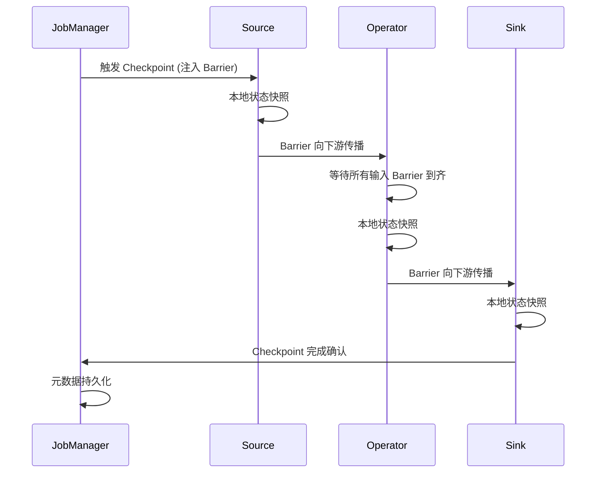
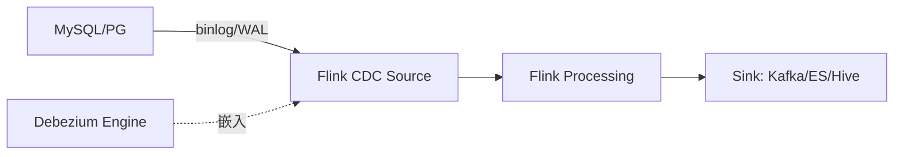
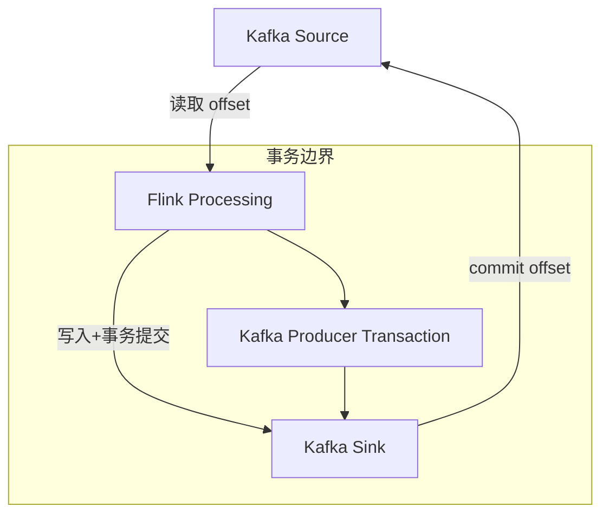

# Apache Flink（流处理引擎 / 批流一体）

> Flink 是新一代**流批一体**计算引擎：以流为核心，流是批的超集。相比 Spark Streaming（微批）的延迟高、Storm（纯流）的吞吐低，Flink 实现了**真正的逐事件低延迟 + 高吞吐 + Exactly-once**。本篇按「解决的问题 → 原理 → 特性 → 选型关注点」拆解。

---

## 一、Flink 要解决的问题

| 痛点 | 说明 |
|------|------|
| 流批割裂 | 同一份业务逻辑要写两套（实时 Flink + Spark 批），口径不一致 |
| 延迟 vs 吞吐 | Storm 低延迟但吞吐低；Spark Streaming 吞吐高但秒级延迟 |
| 乱序事件 | 分布式上游导致事件到达乱序，需要事件时间语义 + Watermark |
| 状态一致性 | 故障恢复后状态与输出要一致（不能多不能少） |
| 窗口复杂 | 滑动窗口/会话窗口/迟到数据处理繁琐 |
| 实时数仓 | 传统数仓 T+1 不能满足实时分析需求 |

> 核心认知：**Flink 把一切视为流（流是批的超集），用同一套 API/Runtime 处理实时与离线**。

---

## 二、Flink 核心原理

### 2.1 运行时架构

```
JobManager（Master）
  ├── JobGraph → ExecutionGraph 调度
  ├── Checkpoint 协调（Barrier 注入）
  ├── ResourceManager 资源申请
  └── Dispatcher（提交入口）

TaskManager（Worker）
  ├── Task Slot（资源隔离单位）
  ├── Operator Chain（算子链：相同并行度算子合并为一个 Task，减少序列化）
  ├── Network Buffer（数据传输缓冲）
  └── Task Slot Group（Slot 分配管理）
```

### 2.2 时间语义

| 时间类型 | 含义 | 适用场景 |
|----------|------|----------|
| Event Time | 事件产生的时间（数据自带时间戳） | 乱序/延迟事件，结果确定 |
| Ingestion Time | 进入 Flink Source 的时间 | 简单场景 |
| Processing Time | 算子处理时的系统时间 | 不关心乱序，最快 |

**选型关注点**：生产环境几乎都用 **Event Time + Watermark**（处理乱序），Processing Time 只用于对时序无要求的场景。

### 2.3 Watermark（水位线）

| 方面 | 说明 |
|------|------|
| 作用 | 衡量事件时间进展，告诉系统「时间 T 之前的数据到齐了，可以触发计算」 |
| 生成策略 | `Watermark = MaxEventTime - 最大乱序时间` |
| 传播 | Watermark 在算子间广播，多输入取最小值 |
| 风险 | 设太晚 → 延迟大；设太早 → 迟到数据需侧输出（Side Output） |
| 周期性 | 周期性生成（默认 200ms）或标点（Punctuated） |

### 2.4 窗口（Window）

| 窗口类型 | 说明 | 典型场景 |
|----------|------|----------|
| Tumbling Window | 固定大小、不重叠 | 每 5 分钟 PV/UV |
| Sliding Window | 固定大小、可滑动 | 最近 1 分钟每 10 秒 |
| Session Window | 按活跃间隔切分 | 用户会话分析 |
| Global Window | 不触发，自定义触发器 | 自定义逻辑 |
| Cumulative Window | 累积窗口 | 累计统计 |

### 2.5 Checkpoint（分布式快照，Exactly-once 基石）

**原理**：基于 **Chandy-Lamport 算法**的异步 Barrier 快照。

1. JobManager 定期触发 Checkpoint，Source 注入 Barrier 到数据流
2. Barrier 随数据流向下游传播，算子收到所有输入的 Barrier 后：
   - 将本地状态异步快照到状态后端（RocksDB/S3/HDFS）
   - 向下游转发 Barrier
3. 所有算子完成 → Checkpoint 完成（元数据存 JobManager）

**故障恢复**：从最近 Checkpoint 恢复状态 + 重放数据（Source 支持回放，如 Kafka offset 回退）

**选型关注点**：Checkpoint 间隔 = RTO 与吞吐的权衡（间隔越短恢复越快，但吞吐损失越大），生产通常 1~10 分钟。

### 2.6 状态后端（State Backend）

| 后端 | 存储位置 | 吞吐 | 适用场景 |
|------|----------|------|----------|
| HashMapStateBackend | TM 内存 | 最快 | 小状态、调试 |
| EmbeddedRocksDBStateBackend | 本地磁盘（RocksDB） | 慢但大 | 超大状态（生产首选） |

**选型关注点**：生产环境几乎都用 **RocksDB**（支持超大状态 + Incremental Checkpoint）。

### 2.7 Savepoint 与 Checkpoint

| 维度 | Checkpoint | Savepoint |
|------|-----------|-----------|
| 触发方式 | 自动（定期） | 手动触发 |
| 用途 | 故障恢复 | 升级/迁移/版本回退 |
| 格式 | 与 State Backend 相关 | 标准化格式 |
| 生命周期 | 自动管理（保留 N 个） | 手动管理 |

---

## 三、Flink API 层次

| API 层次 | 类/接口 | 说明 |
|----------|---------|------|
| SQL / Table API | `SELECT ... FROM` | 声明式，最上层，BI/分析师友好 |
| Process Function | `processElement` | 最底层，全控制（状态/定时器/侧输出） |
| DataStream API | `map/filter/keyBy/window` | 编程式，工程师首选 |
| Stateful Stream Processing | `KeyedProcessFunction` | 有状态流处理核心 |

**选型关注点**：团队有 SQL 背景 → Table API/SQL；复杂事件处理/精细控制 → DataStream + ProcessFunction。

---

## 四、Flink 生态与连接器

| 连接器 | 说明 |
|--------|------|
| Kafka Source/Sink | 实时管道核心（Kafka → Flink → Kafka/ES/HDFS） |
| JDBC Sink | 写关系库 |
| HDFS/S3 Sink | 批流统一落盘（数据湖） |
| HBase/Redis/ES | 维表 JOIN / 实时 Upsert |
| CDC（Debezium/Canal） | binlog → Flink → 实时数仓/ES |
| Pulsar Source/Sink | Pulsar 生态集成 |
| Elasticsearch Sink | 实时搜索写入 |
| DataGen Source | 测试数据生成 |

---

## 五、Flink vs Spark Streaming vs Storm

| 维度 | Flink | Spark Streaming | Storm |
|------|-------|-----------------|-------|
| 处理模型 | 逐事件（真流） | 微批（Micro-batch） | 逐事件 |
| 延迟 | 毫秒~秒 | 秒~分钟 | 毫秒 |
| 吞吐 | 高 | 最高 | 中 |
| 语义 | Exactly-once | Exactly-once | At-least-once（Trident 可 Exactly-once） |
| 批流一体 | 同一 Runtime | 不同引擎（Spark SQL / Spark Streaming） | 纯流 |
| 状态管理 | 完善（RocksDB） | 有限 | Trident |
| 窗口 | 丰富 | 有限 | 基础 |
| 生态 | 实时数仓/事件驱动 | 离线分析为主 | 纯实时计算 |

**选型关注点**：实时数仓/事件驱动/复杂事件处理 → **Flink**；离线分析为主 + 少量实时 → Spark 全家桶；纯实时简单计算 → Storm（已逐渐被替代）。

---

## 六、Flink 生产部署

### 6.1 部署模式

| 模式 | 说明 |
|------|------|
| Standalone | 自建集群，简单 |
| YARN | 共享 Hadoop 集群资源 |
| Kubernetes | 云原生部署（主流趋势） |
| 托管服务 | 阿里云 DataFlow / AWS Kinesis Data Analytics |

### 6.2 关键生产配置

| 配置 | 建议 |
|------|------|
| 并行度 | 按 Source（Kafka 分区数）定并行度 |
| 反压 | 下游处理慢 → 自动反压（Credit-based Flow Control） |
| Savepoint | 手动触发的全量快照（升级/迁移用） |
| 内存配置 | Managed Memory（排序/哈希表）+ Network Buffer + JVM 堆 |
| Checkpoint | 间隔 1~10 分钟，模式 EXACTLY_ONCE |
| 重启策略 | 固定延迟/故障率/无重启 |

---

## 七、选型速查

| 需求 | 首选 | 备选 |
|------|------|------|
| 实时数仓（实时 ETL） | Flink + Kafka | Spark Structured Streaming |
| 复杂事件处理（CEP） | Flink CEP | — |
| 实时大屏/聚合 | Flink + Redis/ClickHouse | Spark Streaming |
| 实时风控 | Flink + 规则引擎 | — |
| 实时推荐 | Flink + 特征工程 | — |
| 离线批处理 | Spark | Flink Batch |
| 流批一体 | Flink | Spark |

---

## 八、Flink State Backend 深入

### 8.1 HashMapStateBackend

```
存储位置：TaskManager JVM 堆内存
数据结构：ConcurrentHashMap<Key, Value>

优点：
  读写最快（纯内存操作）
  Checkpoint 直接序列化到外部存储

缺点：
  受 JVM 堆大小限制（GB 级）
  GC 压力大（大状态时 Full GC 频繁）
  不支持 Incremental Checkpoint

适用场景：
  状态较小（< 几 GB）
  开发测试环境
  低延迟要求极高
```

### 8.2 RocksDBStateBackend

```
存储位置：TaskManager 本地磁盘（嵌入式 RocksDB）
数据结构：LSM-Tree（有序持久化存储）

优点：
  支持超大状态（TB 级）
  支持 Incremental Checkpoint（增量快照）
  状态大小不受 JVM 堆限制

缺点：
  读写比内存慢（涉及磁盘 IO）
  序列化/反序列化开销

适用场景：
  生产环境首选（状态 > 几 GB）
  需要增量 Checkpoint
  超大状态场景
```

### 8.3 状态后端选型对比

| 维度 | HashMapStateBackend | RocksDBStateBackend |
|------|---------------------|---------------------|
| 存储 | JVM 堆内存 | 本地磁盘（LSM-Tree） |
| 速度 | 最快 | 慢（磁盘 IO） |
| 状态大小 | 受堆限制（GB） | TB 级 |
| Incremental Checkpoint | 不支持 | 支持 |
| GC 压力 | 大（大状态） | 小（数据在堆外） |
| 生产推荐 | 小状态/调试 | 生产首选 |

### 8.4 状态后端配置

```java
// HashMapStateBackend
env.setStateBackend(new HashMapStateBackend());
env.getCheckpointConfig().setCheckpointStorage("hdfs:///flink/checkpoints");

// RocksDBStateBackend（生产推荐）
RocksDBStateBackend rocksDB = new RocksDBStateBackend("hdfs:///flink/checkpoints", true);
env.setStateBackend(rocksDB);
```

---

## 九、Flink Checkpoint 深入

### 9.1 Checkpoint 执行流程



### 9.2 Checkpoint 关键配置

| 配置项 | 默认值 | 建议值 | 说明 |
|--------|--------|--------|------|
| `execution.checkpointing.interval` | 无 | 60000（1分钟） | Checkpoint 间隔 |
| `execution.checkpointing.mode` | EXACTLY_ONCE | EXACTLY_ONCE | 语义保证 |
| `execution.checkpointing.timeout` | 600000 | 600000 | 单次 Checkpoint 超时 |
| `execution.checkpointing.min-pause` | 500000 | 60000 | 两次 Checkpoint 最小间隔 |
| `execution.checkpointing.max-concurrent` | 1 | 1 | 并发 Checkpoint 数 |
| `state.backend.incremental` | false | true（RocksDB） | 增量快照 |
| `state.backend.rocksdb.memory.managed` | true | true | RocksDB 堆外内存管理 |

### 9.3 Checkpoint 失败常见原因

| 失败类型 | 原因 | 解决方案 |
|----------|------|----------|
| 超时 | 状态过大/网络慢 | 增大 timeout / 使用增量 Checkpoint |
| Barriers 对齐慢 | 反压/数据倾斜 | 解决反压 / 非对齐 Checkpoint |
| 外部存储失败 | HDFS/S3 不可用 | 检查存储系统健康 |
| Task 失败 | OOM/异常 | 调整内存 / 排查代码 |
| Checkpoint 过旧 | 频繁失败 | 检查重启策略 |

### 9.4 Unaligned Checkpoint（非对齐 Checkpoint）

```
传统对齐 Checkpoint：
  Barrier 必须对齐（等待所有输入到齐）
  反压时 Barrier 排队 → Checkpoint 超时

非对齐 Checkpoint（Flink 1.11+）：
  Barrier 不等待对齐，直接快照当前状态
  反压场景下 Checkpoint 不会超时
  代价：Checkpoint 数据量更大

适用场景：
  反压严重的复杂拓扑
  需要快速恢复的场景
```

---

## 十、Flink Window 内部机制

### 10.1 Window 分配器（Window Assigner）

| 分配器 | 说明 | 触发时机 |
|--------|------|----------|
| TumblingEventTimeWindows | 事件时间滚动窗口 | Watermark ≥ 窗口结束时间 |
| TumblingProcessingTimeWindows | 处理时间滚动窗口 | 系统时间到达 |
| SlidingEventTimeWindows | 事件时间滑动窗口 | 同上 |
| EventTimeSessionWindows | 事件时间会话窗口 | 间隔超时触发 |
| GlobalWindows | 全局窗口 | 自定义触发器 |

### 10.2 Window 触发器（Trigger）

| 触发器 | 说明 |
|--------|------|
| EventTimeTrigger | Watermark 到达触发 |
| ProcessingTimeTrigger | 处理时间到达触发 |
| CountTrigger | 计数达到阈值触发 |
| PurgingTrigger | 触发后清空窗口内容 |
| ContinuousEventTimeTrigger | 周期性事件时间触发 |

### 10.3 Window Function 类型

```java
// ReduceFunction（增量聚合，窗口内只保留聚合值）
window.reduce((a, b) -> a + b);

// AggregateFunction（增量聚合，更灵活）
window.aggregate(new AggregateFunction<Integer, Long, Long>() {
    public Long createAccumulator() { return 0L; }
    public Long add(Integer v, Long acc) { return acc + v; }
    public Long getResult(Long acc) { return acc; }
    public Long merge(Long a, Long b) { return a + b; }
});

// ProcessWindowFunction（全量处理，可访问窗口上下文）
window.process(new ProcessWindowFunction<Integer, String, String, TimeWindow>() {
    public void process(String key, Context ctx, Iterable<Integer> elements, Collector<String> out) {
        // elements 包含窗口内所有元素
    }
});
```

---

## 十一、Flink CDC Connector

### 11.1 Flink CDC 架构



### 11.2 Flink CDC 与 Debezium 关系

| 维度 | Flink CDC | Debezium |
|------|-----------|----------|
| 内核 | Debezium（嵌入式） | 独立 Kafka Connect |
| 输出 | Flink DataStream/SQL | Kafka |
| 部署 | Flink 集群 | Kafka Connect 集群 |
| SQL 支持 | Flink SQL 原生 | 需 Flink 二次消费 |
| 适用 | 实时数仓 SQL 管道 | Kafka 事件流 |

### 11.3 Flink CDC SQL 示例

```sql
CREATE TABLE mysql_cdc (
  id BIGINT,
  name STRING,
  amount DECIMAL(10,2),
  PRIMARY KEY (id) NOT ENFORCED
) WITH (
  'connector' = 'mysql-cdc',
  'hostname' = 'localhost',
  'port' = '3306',
  'username' = 'root',
  'password' = 'secret',
  'database-name' = 'shop',
  'table-name' = 'orders'
);

-- 实时同步到 Kafka
INSERT INTO kafka_sink SELECT * FROM mysql_cdc;
```

---

## 十二、Flink SQL 优化

### 12.1 常见优化手段

| 优化项 | 说明 | 效果 |
|--------|------|------|
| 谓词下推 | WHERE 条件下推到 Source | 减少数据读取 |
| 列裁剪 | 只读取需要的列 | 减少 IO |
| Mini-batch 聚合 | 延迟聚合减少状态写入 | 降低状态更新频率 |
| 维表 JOIN 优化 | Async I/O + LRU 缓存 | 减少维表查询延迟 |
| 窗口聚合优化 | 增量聚合 + 窗口裁剪 | 减少状态大小 |

### 12.2 Mini-batch 配置

```sql
-- 开启 Mini-batch
SET table.exec.mini-batch.enabled = true;
SET table.exec.mini-batch.allow-latency = '5s';
SET table.exec.mini-batch.size = '1000';

-- 开启状态TTL（自动清理过期状态）
SET table.exec.state.ttl = '24h';
```

### 12.3 Async I/O 维表 JOIN

```java
// 异步查询维表（Redis/MySQL）
AsyncDataStream.unorderedWait(
    stream,
    new AsyncFunction<Event, EnrichedEvent>() {
        public void asyncInvoke(Event event, ResultFuture<EnrichedEvent> resultFuture) {
            // 异步查询维表
        }
    },
    30, TimeUnit.SECONDS,  // 超时
    100                     // 最大并发请求
);
```

---

## 十三、Flink Exactly-once 与 Kafka

### 13.1 端到端 Exactly-once 实现



### 13.2 实现条件

| 组件 | 要求 |
|------|------|
| Source | 可重放（Kafka offset 回退） |
| Sink | 幂等 或 事务性（Kafka 事务） |
| Processing | Flink Checkpoint（状态一致性） |

### 13.3 Kafka 事务 Sink 配置

```java
KafkaSink<String> sink = KafkaSink.<String>builder()
    .setBootstrapServers("localhost:9092")
    .setRecordSerializer(...)
    .setDeliveryGuarantee(DeliveryGuarantee.EXACTLY_ONCE)
    .setTransactionalIdPrefix("flink-")
    .build();
```

---

## 十四、Flink vs Spark Streaming vs Kafka Streams

| 维度 | Flink | Spark Streaming | Kafka Streams |
|------|-------|-----------------|---------------|
| 处理模型 | 真流（逐事件） | 微批 | 真流（逐事件） |
| 延迟 | 毫秒 | 秒 | 毫秒 |
| 状态管理 | RocksDB/内存 | 有限 | RocksDB |
| 窗口 | 丰富（5种+） | 有限 | 4种 |
| Exactly-once | Checkpoint | WAL+Checkpoint | 事务 |
| 部署 | 独立集群 | 独立集群 | 库嵌入应用 |
| 运维 | 重 | 重 | 轻（零集群） |
| 复杂事件处理 | 强（CEP） | 无 | 无 |
| 批流一体 | 原生 | 微批 | 不支持 |
| SQL | Flink SQL | Spark SQL | ksqlDB |
| 适用规模 | 大 | 大 | 中小 |

**选型决策**：
- 复杂流处理/CEP/毫秒延迟 → Flink
- 批流一体/ML生态 → Spark
- 应用内轻量流处理 → Kafka Streams

---

## 十五、Flink on Kubernetes（Flink Operator）

### 15.1 部署模式

| 模式 | 说明 | 适用 |
|------|------|------|
| Session Mode | 共享集群，Job 动态提交 | 开发测试 |
| Application Mode | 每个 Application 独立集群 | 生产（资源隔离） |
| per-Job Mode | 每个 Job 独立集群 | 已废弃（推荐 Application） |

### 15.2 Flink Operator CRD

```yaml
apiVersion: flink.apache.org/v1beta1
kind: FlinkDeployment
metadata:
  name: my-flink-job
spec:
  image: flink:1.17
  flinkVersion: v1_17
  serviceAccount: flink
  jobManager:
    resource:
      memory: "2048m"
      cpu: 1
  taskManager:
    replicas: 4
    resource:
      memory: "4096m"
      cpu: 2
  job:
    jarURI: local:///opt/flink/examples/streaming/WindowJoin.jar
    parallelism: 8
    state: running
    upgradeMode: savepoint
```

### 15.3 K8s 部署关键配置

| 配置项 | 说明 |
|--------|------|
| `kubernetes.jobmanager.cpu` | JM CPU 请求 |
| `kubernetes.taskmanager.cpu` | TM CPU 请求 |
| `kubernetes.container.image.pull-policy` | 镜像拉取策略 |
| `kubernetes.pod.template-file` | 自定义 Pod 模板 |
| `high-availability: kubernetes` | K8s 高可用模式 |
| `kubernetes.config.maps` | ConfigMap 挂载 |

---

## 十六、与其他板块的关系

- Kafka（Flink 的 Source/Sink 核心）见「[Kafka](./Kafka.md)」；
- 实时数仓/湖仓一体见「[云上数仓与大数据生态](./云上数仓与大数据生态.md)」；
- 大数据批处理见「[基础知识/大数据](../大数据/README.md)」；
- 云上中间件总览见「[云上中间件体系总览](./云上中间件体系总览.md)」。

---

## 八、Flink 生产配置清单

### 8.1 flink-conf.yaml 关键配置

```yaml
# 并行度
parallelism.default: 4
taskmanager.numberOfTaskSlots: 4

# Checkpoint
execution.checkpointing.interval: 60000
execution.checkpointing.mode: EXACTLY_ONCE
state.backend: rocksdb
state.checkpoints.dir: s3://bucket/checkpoints
state.backend.incremental: true

# 内存
taskmanager.memory.process.size: 4096m
taskmanager.memory.managed.fraction: 0.4

# 重启策略
restart-strategy.type: fixed-delay
restart-strategy.fixed-delay.attempts: 3
restart-strategy.fixed-delay.delay: 30s
```

### 8.2 监控指标

```
关键 Flink 指标：
  job_total_checkpoints            # 总 Checkpoint 数
  job_failed_checkpoints           # 失败 Checkpoint 数
  job_last_checkpoint_duration     # 最近 Checkpoint 耗时
  task_currentInputWatermark       # 当前输入 Watermark
  task_recordsSent                 # 发送记录数
  task_busyTimeMsPerSecond        # 忙碌时间占比
```

### 8.3 常见问题排查

| 问题 | 原因 | 解决 |
|------|------|------|
| 反压 | 下游处理慢 | 增加并行度/优化逻辑 |
| Checkpoint 超时 | 状态过大 | 增量 Checkpoint/RocksDB |
| 数据倾斜 | Key 分布不均 | 加盐/两阶段聚合 |
| 延迟高 | 窗口过大 | 减小窗口/增量聚合 |

---

## 九、Flink SQL 常用语法

```sql
-- 创建 Kafka 源表
CREATE TABLE kafka_source (
  user_id STRING,
  item_id STRING,
  behavior STRING,
  ts TIMESTAMP(3),
  WATERMARK FOR ts AS ts - INTERVAL '5' SECOND
) WITH (
  'connector' = 'kafka',
  'topic' = 'user_behavior',
  'properties.bootstrap.servers' = 'localhost:9092',
  'format' = 'json'
);

-- 创建 MySQL Sink 表
CREATE TABLE mysql_sink (
  user_id STRING,
  behavior_count BIGINT,
  PRIMARY KEY (user_id) NOT ENFORCED
) WITH (
  'connector' = 'jdbc',
  'url' = 'jdbc:mysql://localhost:3306/db',
  'table-name' = 'user_stats'
);

-- 实时统计
INSERT INTO mysql_sink
SELECT user_id, COUNT(*) as behavior_count
FROM kafka_source
WHERE behavior = 'buy'
GROUP BY user_id;
```

### 9.1 Flink CEP 示例

```java
Pattern<Event, ?> pattern = Pattern.<Event>begin("start")
    .where(new SimpleCondition<Event>() {
        @Override
        public boolean filter(Event value) {
            return value.getType().equals("login");
        }
    })
    .followedBy("middle")
    .where(new SimpleCondition<Event>() {
        @Override
        public boolean filter(Event value) {
            return value.getType().equals("browse");
        }
    })
    .within(Time.minutes(5));

PatternStream<Event> patternStream = CEP.pattern(dataStream, pattern);
```

---

> 一句话：**Flink = 流批一体 + Event Time/Watermark + Checkpoint Exactly-once + 丰富窗口；选型先看「延迟要求（毫秒/秒级）」，再定「状态大小（内存/RocksDB）」，最后定「部署模式（K8s/托管）」**。
