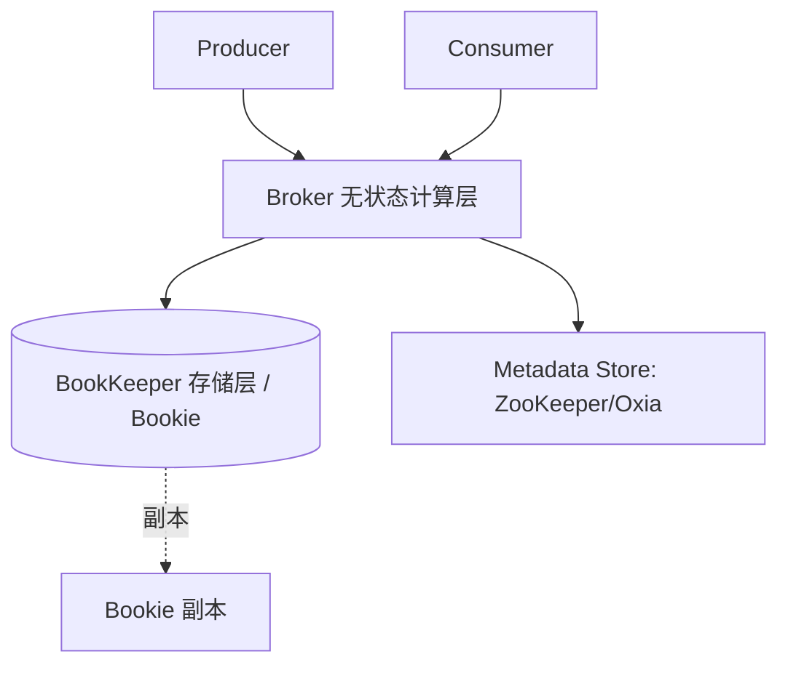
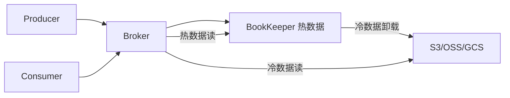
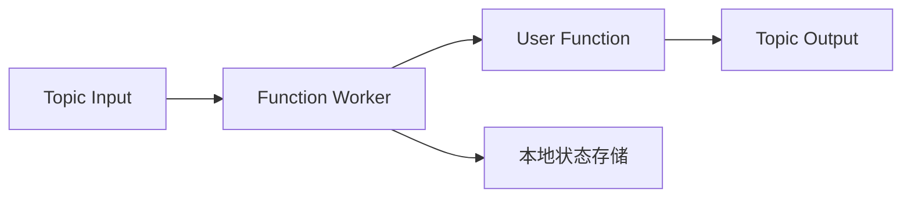
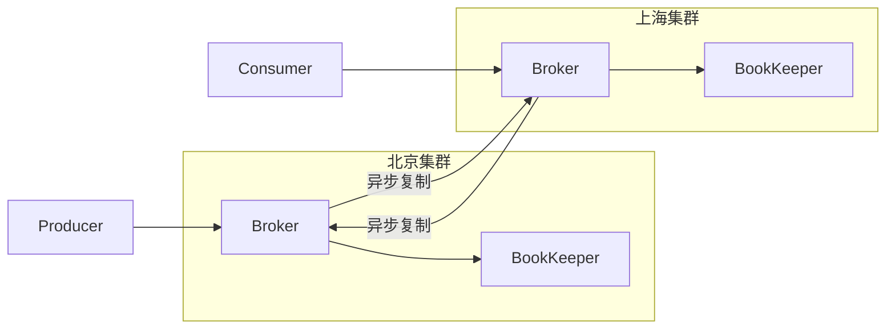
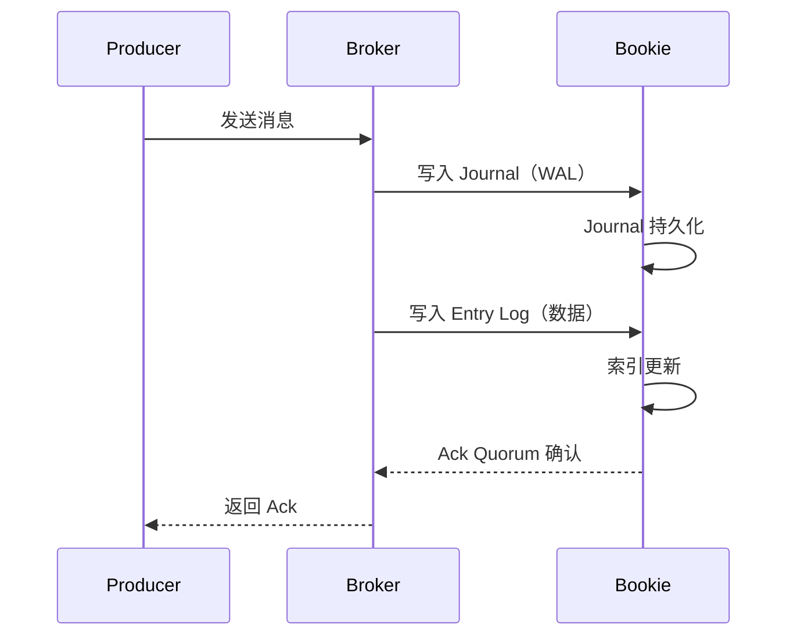
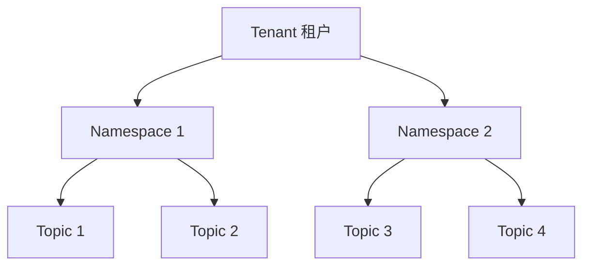
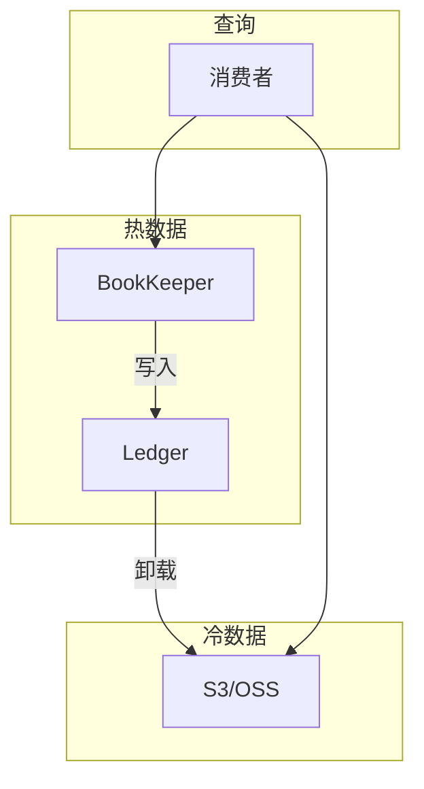
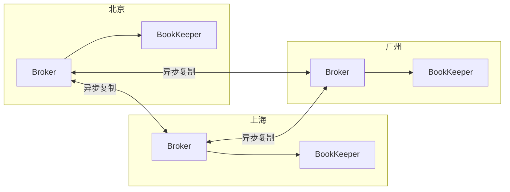
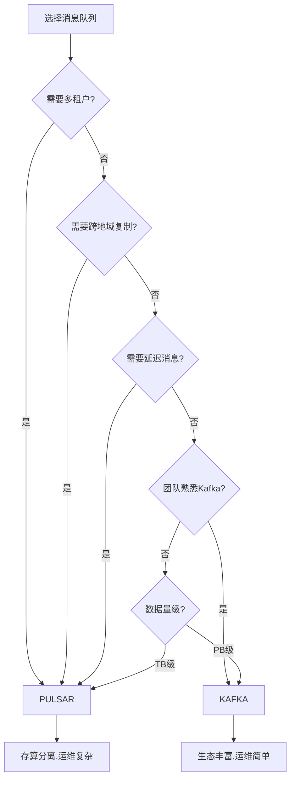
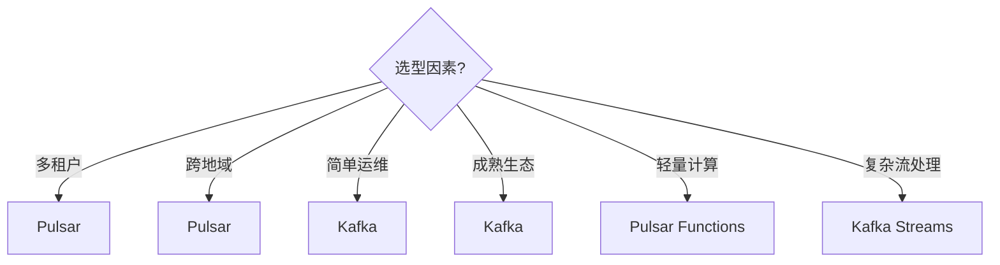

# Apache Pulsar（云原生消息与流平台）

> 存算分离的**统一消息 + 流处理平台**，Broker 无状态、存储交给 BookKeeper。
> 适合：云原生、多租户 SaaS、跨地域复制、事件驱动总线、需要「队列语义 + 流语义」统一。
> 不适合：小团队简单场景（两套组件，运维复杂度偏高，可能过度设计）。

---


## 〇、本体介绍（它是什么 / 适用场景 / 核心概念）

**它是什么**：Apache Pulsar 是 Yahoo 开源、现为 Apache 顶级项目的**云原生消息与流平台**，最大创新是「计算与存储分离」的分层架构：无状态 Broker + BookKeeper 存储层 + ZooKeeper 协调层。

**解决什么痛点**：Kafka 把消息存在 Broker 本地盘、计算存储耦合，扩容要迁数据、运维重。Pulsar 的 Broker 无状态，故障秒级接管、扩容无需搬数据；BookKeeper 提供条目级多副本持久化；天然支持多租户、跨地域复制、四种订阅模式。

**核心概念**：Tenant/Namespace（多租户）、Topic、Subscription（Exclusive/Shared/Failover/Key_Shared 四种）、Broker（无状态）、Bookie（BookKeeper 存储节点）、Ledger（账本/append-only）、Ensemble/Write Quorum/Ack Quorum、Geo-replication、Pulsar Functions、分层存储。

**适用场景**：云原生消息流、多租户 SaaS、需要弹性扩缩与跨地域复制、兼具队列与流处理的平台。
**不适用**：极简轻量单机消息（运维组件多，偏重）。

---

## 一、它解决什么问题

Kafka 是「存算一体」：分区日志物理绑定在 Broker 本地磁盘。痛点：
- **扩容要搬数据**：加 Broker 要 rebalance 分区，跨网络拷 TB 级数据，期间延迟抖动。
- **热点分区难解**：某分区流量大，宿主 Broker 被打爆。
- **多租户弱**：Kafka 无原生租户/命名空间隔离。

Pulsar 从设计上**把计算（Broker）和存储（BookKeeper）解耦**：
- Broker **无状态**，只做路由/协议/鉴权，挂了客户端重连另一个即可，无数据迁移。
- 存储由 **Apache BookKeeper**（Bookie 节点）承担，按 segment（ledger）分布、天然负载均衡。
- 因此扩容 Broker「秒级、不搬历史数据」；多租户、跨地域复制是原生一等公民。

> 仓库 `github.com/apache/pulsar`：ASF 顶级项目，Java/Go/C++/Python/C#/Node.js 多语言客户端，<10ms 延迟、百万 topic、百万 msg/s、geo-replication、分层存储。

---

## 二、整体架构（分层）



| 组件 | 角色 |
|------|------|
| **Broker** | 无状态，处理连接、路由、ACK、鉴权、配额；不存长期数据 |
| **BookKeeper（Bookie）** | 分布式日志存储，数据按 **Ledger（段）** 分片、默认 3 副本（Quorum 写） |
| **Metadata Store** | 存元数据（topic→broker 映射、ledger 列表），ZooKeeper 或 Oxia |
| **Topic** | 逻辑概念，分 partition，partition 由多个 ledger 组成 |

**Segment-Centric vs Partition-Centric**：Kafka 的 partition 是「绑定 Broker 的大日志」；Pulsar 的 partition 是「多个小 ledger 的逻辑集合」，新 ledger 直接写到不同 Bookie → 写压力自然打散，消除热点。

---

## 三、四种订阅模式（Pulsar 独特优势）

Pulsar 一个 topic 支持多种订阅，灵活兼顾「队列」和「流」：

| 模式 | 语义 | 场景 |
|------|------|------|
| **Exclusive** | 独占，一个消费者 | 单实例任务 |
| **Failover** | 主备，主挂切换 | 高可用消费 |
| **Shared** | 轮询分给多消费者（类似 Consumer Group） | 高并发、允许乱序 |
| **Key_Shared** | 同 Key 哈希到同消费者 | 局部有序（如订单状态） |

> Kafka 只有 Consumer Group 一种；Pulsar 的 Shared/Key_Shared 直接支持「竞争消费 + 局部有序」，无需额外设计。

---

## 四、Pulsar vs Kafka（核心对比）

| 维度 | Pulsar | Kafka |
|------|--------|-------|
| 架构 | 计算存储**分离**（Broker+BookKeeper） | 存算**一体**（Broker 自带存储） |
| 扩展 | Broker/存储独立扩，秒级无搬迁 | 扩 Broker 需 rebalance 搬数据 |
| 多租户 | ✅ 原生（Tenant + Namespace + 配额） | 需外部实现 |
| 延迟消息 | ✅ 原生（BookKeeper 暂存） | ❌ 需外部（时间轮/DB） |
| 订阅模型 | 4 种（含 Shared/Key_Shared） | 仅 Consumer Group |
| 跨地域 | ✅ 原生 Geo-replication + 客户端自动故障转移 | 需 MirrorMaker |
| 分层存储 | ✅ 冷数据自动卸载对象存储 | 有限（需 tiered storage 插件） |
| 运维复杂度 | 初期高（两套组件） | 成熟但扩容复杂 |
| 适用 | 云原生/多租户/SaaS/全球化 | 大数据/日志/已有 Kafka 生态 |

> 案例：腾讯将多租户、全球化流平台从 Kafka 迁到 Pulsar，核心诉求正是「租户隔离 + 免 rebalance 运维 + 金融级零丢失（BookKeeper Quorum 写）」。

---

## 五、关键特性

1. **多租户隔离**：Tenant → Namespace → Topic 三级，每层可配吞吐/存储/分发配额，防噪声邻居。
2. **Geo-replication**：跨集群异步复制，区域故障自动客户端切健康集群。
3. **分层存储（Tiered Storage）**：冷数据自动卸到 S3/OSS，降本且不影响热路径。
4. **Pulsar Functions**：原生 Serverless 函数，Java/Go/Python 直接处理消息，免部署额外应用。
5. **百万 Topic**：单集群支持 100 万 topic，不必把多流复用进一个 topic。
6. **统一消息+流**：既支持「逐条 ack 的队列语义」，也支持「按流消费」。

---

## 六、生产实践与避坑

1. **组件分离部署**：Broker 与 Bookie 分开资源规划，Bookie 重 I/O（SSD），Broker 重 CPU/连接。
2. **配额防噪**：给每个 Namespace 设吞吐/存储上限，避免单租户拖垮集群。
3. **延迟消息用原生**：别再引外部时间轮，Pulsar 原生支持。
4. **Subscription 选型**：需要顺序用 Key_Shared；需要并行用 Shared。
5. **Kubernetes**：官方 Pulsar Operator 管理集群，云原生友好。
6. **与 Kafka 抉择**：已有 Kafka 生态且是日志/大数据 → 留 Kafka；新建云原生多租户/全球化 → Pulsar。

---

## 七、Pulsar 分层存储（Tiered Storage）

### 7.1 架构原理



### 7.2 分层存储配置

| 配置项 | 说明 | 默认值 |
|--------|------|--------|
| `managedLedgerMaxSizeNoLedgerSwitch` | 触发 Ledger 切换的大小 | 10GB |
| `offloadThreshold` | 触发卸载的消息积压时间 | 14400s（4h） |
| `offloadDeletionLagMs` | 卸载后删除 BookKeeper 数据的延迟 | 14400s |
| `tieredStorageMaxFileSize` | 单文件最大大小 | 512MB |

### 7.3 分层存储工作流

```
写入流程：
  Producer → Broker → BookKeeper（热存储）

冷数据卸载（异步）：
  Ledger 不活跃 → 达到阈值 → 异步上传到 S3
  → BookKeeper 标记为已卸载

读取流程：
  Consumer → Broker → 检查本地/远程
    → 热数据：直接从 BookKeeper 读
    → 冷数据：从 S3 读取（延迟略高）

延迟消息存储：
  延迟消息暂存 BookKeeper → 时间到达后投递
  → 长延迟（天级）可卸载到 S3 节省成本
```

### 7.4 适用场景

| 场景 | 说明 |
|------|------|
| 长周期回溯 | 消息保留 30 天/90 天/1年 |
| 合规审计 | 法规要求长期保留事件日志 |
| 成本优化 | 冷数据降本 70%+ |
| 延迟消息 | 长延迟消息卸载到 S3 |

---

## 八、Pulsar Functions

### 8.1 架构



### 8.2 Function 类型

| 类型 | 说明 | 示例 |
|------|------|------|
| Producer Function | 消息生成/转换 | 数据增强/格式转换 |
| Consumer Function | 消息消费/处理 | 实时统计/过滤 |
| Window Function | 窗口聚合 | 滑动窗口计数 |

### 8.3 Function 示例

```java
// Java Function
public class ExclamationFunction implements Function<String> {
    @Override
    public void process(Record<String> record) {
        String value = record.getValue();
        // 处理逻辑
    }
}

// 部署命令
pulsar-admin functions create \
  --jar my-function.jar \
  --classname com.example.ExclamationFunction \
  --tenant public --namespace default \
  --name my-function \
  --input-topic input-topic \
  --output-topic output-topic
```

### 8.4 vs 外部流处理

| 维度 | Pulsar Functions | Flink |
|------|------------------|-------|
| 部署 | 无独立集群 | 独立集群 |
| 复杂度 | 简单转换/聚合 | 复杂流处理 |
| 状态 | 有限本地状态 | RocksDB 大状态 |
| 延迟 | 毫秒 | 毫秒 |
| 适用 | 轻量 ETL/过滤 | 复杂事件处理 |

---

## 九、Pulsar IO Connectors

### 9.1 内置连接器

| 连接器 | 方向 | 说明 |
|--------|------|------|
| Kafka Source/Sink | 双向 | Kafka 互操作 |
| JDBC Source/Sink | 双向 | MySQL/PG 等 |
| Elasticsearch Sink | 输出 | 实时写入 ES |
| MongoDB Sink | 输出 | 写入 MongoDB |
| Cassandra Sink | 输出 | 写入 Cassandra |
| HDFS Sink | 输出 | 写入 HDFS |
| AWS S3 Sink | 输出 | 写入 S3 |
| Google Cloud Storage Sink | 输出 | 写入 GCS |
| Twitter Firehose Source | 输入 | Twitter 流 |
| Splunk Sink | 输出 | 写入 Splunk |

### 9.2 连接器配置示例

```properties
# JDBC Sink 示例
configs:
  jdbcUrl: "jdbc:mysql://localhost:3306/db"
  tableName: "orders"
  userName: "root"
  password: "secret"
  batchSize: 100
```

### 9.3 自定义连接器开发

```
实现接口：
  SourceConnector / SinkConnector（Kafka Connect 兼容）

步骤：
  1. 实现 Connector 接口
  2. 实现 Task 接口
  3. 打包为 NAR 文件
  4. 通过 pulsar-admin 管理

优势：
  复用 Kafka Connect 生态（大量现成 Connector）
```

---

## 十、Pulsar 跨地域复制（Geo-replication）

### 10.1 架构



### 10.2 配置示例

```bash
# 创建集群
pulsar-admin clusters create cluster-bj --url http://bj:8080
pulsar-admin clusters create cluster-sh --url http://sh:8080

# 创建租户并配置跨地域
pulsar-admin tenants create my-tenant \
  --allowed-clusters cluster-bj,cluster-sh

# 配置 Namespace 复制策略
pulsar-admin namespaces set-clusters my-tenant/my-ns \
  --clusters cluster-bj,cluster-sh

# 设置复制消息的延迟
pulsar-admin namespaces set-retention my-tenant/my-ns \
  --size -1 --time 168h
```

### 10.3 复制模式

| 模式 | 说明 | 延迟 |
|------|------|------|
| 异步复制 | 默认，最终一致 | 秒级 |
| 同步复制 | 写入多个集群后才确认 | 高（跨地域） |

### 10.4 故障转移

```
区域故障处理：
  Broker 感知目标集群不可用 → 消息暂存本地
  目标集群恢复 → 自动重新复制

客户端自动切换：
  Pulsar Client 支持多集群配置
  当前集群不可用 → 自动切换到健康集群
  消费进度（Cursor）独立存储，不丢失
```

---

## 十一、BookKeeper 内部机制

### 11.1 数据写入流程



### 11.2 Ledger 管理

| 概念 | 说明 |
|------|------|
| Ledger | append-only 日志段，单写者 |
| Entry | Ledger 中的单条记录 |
| Ensemble | 写入 Ledger 时使用的 Bookie 集合 |
| Write Quorum | 写入副本数 |
| Ack Quorum | 需要确认的 Bookie 数 |

### 11.3 Journal 与 Entry Log

```
Journal（WAL）：
  每个 Bookie 一个 Journal 目录
  写入先持久化 Journal（保证持久性）
  Journal 文件按时间滚动

Entry Log：
  多个 Ledger 的数据合并存储
  单个 Entry Log 文件可能包含多个 Ledger 的数据
  减少文件数量，提升写入吞吐
```

### 11.4 读取路径

```
读取流程：
  Broker 收到读请求 → 查找 Ledger 所在 Bookie
  → 读取 Entry Log + 索引 → 返回数据

读取优化：
  Ledger 缓存（Broker 侧缓存 Ledger 元数据）
  热数据缓存（Bookie 侧缓存热点 Entry）
```

---

## 十二、Pulsar Schema Registry

### 12.1 Schema 类型

| 类型 | 说明 | 适用 |
|------|------|------|
| String | 纯字符串 | 简单场景 |
| JSON | JSON 格式 | 通用 |
| Avro | 二进制序列化 | 高性能 |
| Protobuf | Google 协议缓冲 | 跨语言 |
| Bytes | 原始字节 | 自定义序列化 |

### 12.2 Schema 演进策略

```bash
# 创建 Topic 并指定 Schema
pulsar-admin schemas upload my-topic \
  --schema-file schema.avsc \
  --type AVRO

# Schema 兼容性策略
pulsar-admin namespaces set-clusters my-tenant/my-ns \
  --clusters cluster-bj

# 兼容性类型
BACKWARD    # 新 Schema 可读旧数据
FORWARD     # 旧 Schema 可读新数据
FULL        # 双向兼容
```

### 12.3 Schema 注册流程

```
生产者发送消息：
  1. 检查 Topic 是否有 Schema
  2. 无 Schema → 自动注册（首次）
  3. 有 Schema → 检查兼容性
  4. 兼容 → 写入消息
  5. 不兼容 → 拒绝（抛异常）

消费者接收消息：
  1. 读取消息
  2. 根据 Schema 反序列化
  3. 类型不匹配 → 抛异常
```

---

## 十三、Pulsar 多租户实践

### 13.1 三级隔离模型



### 13.2 配额管理

| 资源 | 配置项 | 说明 |
|------|--------|------|
| 带宽 | `dispatchThrottlingRateInMsg` | 消息发送/消费速率 |
| 存储 | `maxSize` | 命名空间最大存储 |
| Topic 数 | `maxTopicsPerNamespace` | 每个 Namespace 最大 Topic 数 |
| 租户存储 | `storageQuotaInMB` | 租户级存储上限 |

### 13.3 多租户隔离策略

```bash
# 租户级隔离
pulsar-admin tenants create team-a \
  --allowed-clusters cluster-bj

# Namespace 级配额
pulsar-admin namespaces set-retention team-a/orders \
  --size 10GB --time 168h

# Topic 级限流
pulsar-admin topics set-dispatch-rate team-a/orders \
  --msg-rate 10000 --byte-rate 10485760
```

### 13.4 多租户最佳实践

| 实践 | 说明 |
|------|------|
| 按团队隔离 Namespace | 每个团队独立 Namespace |
| 设置存储配额 | 防止单租户耗尽资源 |
| 监控租户指标 | 消息速率/延迟/存储 |
| 网络策略 | VPC/网络隔离 |
| 认证授权 | JWT/OAuth2 多租户认证 |

---

## 十三-2、BookKeeper Write Quorum / Read Quorum 原理

```
BookKeeper Quorum 写入流程：

1. Broker 选择 Ensemble（参与写入的 Bookie 集合，如 3 个）
2. 数据并发写入 Write Quorum 个 Bookie（如 W=2）
3. 等待 Ack Quorum 个 Bookie 确认（如 A=2）
4. 返回 Producer 写入成功

参数关系：
  Ensemble (E) ≥ Write Quorum (W) ≥ Ack Quorum (A)
  容错 = W - A + 1（即 A 个确认后才返回）
  常见配置：E=3, W=3, A=2 → 容忍 1 个 Bookie 故障

示例：
  E=3, W=3, A=2 → 3 个 Bookie 都写入，2 个确认即返回
  容错：1 个 Bookie 故障不影响写入
```

## 十三-3、Pulsar Tiered Storage 热温冷分层配置

```bash
# 配置分层存储策略
pulsar-admin namespaces set-clipping-threshold my-tenant/my-ns \
  --size-threshold 10GB

# 启用 Offload 策略
pulsar-admin namespaces set-offload-threshold my-tenant/my-ns \
  --size-threshold 1GB

# 按消息时间卸载
pulsar-admin namespaces set-offload-deletion-lag my-tenant/my-ns \
  --deletion-lag 24h

# 热温冷数据流向：
# 热：BookKeeper（近 24h）
# 温：BookKeeper（24h~7d）→ S3 过渡
# 冷：S3/OSS（>7d）→ 降本 70%+
```

## 十三-4、Pulsar Functions 无状态处理模型

```
Pulsar Functions = 轻量 Serverless 消息处理

处理模型：
  Input Topic → Function 实例 → Output Topic
  每个 Function 实例无状态（或通过 State 存储简单 KV）

State 存储：
  本地状态：内存/文件（简单场景）
  外部状态：RocksDB（持久化）
  限制：不能做复杂事务

与 Flink 对比：
  Pulsar Functions：简单 ETL/过滤/聚合，无需独立集群
  Flink：复杂流处理，有状态管理，需要独立集群

部署命令：
  pulsar-admin functions create \
    --jar my-function.jar \
    --classname com.example.MyFunction \
    --input-topic orders --output-topic orders-processed
```

## 十三-5、Geo-replication 复制策略（sync/async）

| 策略 | 说明 | 延迟 | 一致性 |
|------|------|------|--------|
| 异步复制 | 默认，写入本地集群即返回 | 秒级 | 最终一致 |
| 同步复制 | 写入多个集群后才返回 | 高（跨地域） | 强一致 |
| 半同步 | 写入本地 + 一个远程集群 | 中等 | 准强一致 |

```
异步复制流程：
  Producer → 本地 Broker → BookKeeper
  → 后台异步复制到远程集群
  → 远程 Broker 接收并存储

同步复制流程：
  Producer → 本地 Broker → BookKeeper（本地）
  → 同步写远程 Broker → 远程 BookKeeper
  → 所有集群确认后返回

选择建议：
  金融级零丢失 → 同步复制（延迟高）
  一般业务 → 异步复制（延迟低）
  跨地域多活 → 异步复制 + 客户端故障转移
```

## 十三-6、Pulsar 消息去重机制

```
去重方式：
  1. Producer 端：设置 ProducerName + SequenceId
     → Broker 校验：同 Producer + 同 SequenceId 不重复投递

  2. Broker 端：开启去重配置
     brokerDeduplicationEnabled=true
     brokerDeduplicationSnapshotInterval=10000

  3. Consumer 端：幂等消费（业务层去重）

去重原理：
  Broker 维护已投递消息的 (ProducerName, SequenceId) 映射
  新消息到达时检查是否已存在
  → 存在则丢弃，不存在则写入
```

## 十三-7、Pulsar vs Kafka 吞吐/延迟基准对比

| 指标 | Pulsar | Kafka |
|------|--------|-------|
| 单机写入吞吐 | 10~30万 msg/s | 20~50万 msg/s |
| 端到端延迟（P99） | 5~20ms | 2~10ms |
| 消费延迟（P99） | 5~15ms | 1~5ms |
| 消息积压恢复 | 快（加 Bookie 即扩） | 中（需 rebalance） |
| 多租户隔离 | 原生强 | 弱 |

```
选择建议：
  极致吞吐/延迟 → Kafka（存算一体，本地盘快）
  云原生弹性/多租户 → Pulsar（存算分离，弹性好）
  跨地域复制 → Pulsar（原生支持）
  已有 Kafka 生态 → 留 Kafka
```

## 十四、BookKeeper Write Quorum / Read Quorum 原理详解

### 14.1 Quorum 写入流程

```
BookKeeper Quorum 写入：

  1. Broker 选择 Ensemble（参与写入的 Bookie 集合，如 3 个）
  2. 数据并发写入 Write Quorum 个 Bookie（如 W=3）
  3. 等待 Ack Quorum 个 Bookie 确认（如 A=2）
  4. 返回 Producer 写入成功

参数关系：
  Ensemble (E) ≥ Write Quorum (W) ≥ Ack Quorum (A)
  容错 = E - W + 1（最多允许 E-W 个 Bookie 故障）

常见配置：
  E=3, W=3, A=2 → 3 个 Bookie 都写入，2 个确认即返回
  容错：1 个 Bookie 故障不影响写入

  E=3, W=2, A=2 → 选 2 个 Bookie 写入，2 个都确认
  容错：1 个 Bookie 故障不影响，但写入副本少
```

### 14.2 Quorum 读取流程

```
读取一致性保证：
  读取时从 Ack Quorum 个 Bookie 读取
  对比版本号，返回最新版本的数据
  如果有不一致，触发 Read Repair（修复过期副本）
```

## 十五、Pulsar Tiered Storage 配置（S3/GCS/Azure Blob）

### 15.1 分层存储工作流

```
写入流程：
  Producer → Broker → BookKeeper（热存储）

冷数据卸载（异步）：
  Ledger 不活跃 → 达到阈值 → 异步上传到 S3
  → BookKeeper 标记为已卸载

读取流程：
  Consumer → Broker → 检查本地/远程
    → 热数据：直接从 BookKeeper 读
    → 冷数据：从 S3 读取（延迟略高）
```

### 15.2 S3 配置示例

```bash
# 配置 S3 分层存储
pulsar-admin namespaces set-offload-threshold my-tenant/my-ns \
  --size-threshold 1GB

# 按消息时间卸载
pulsar-admin namespaces set-offload-deletion-lag my-tenant/my-ns \
  --deletion-lag 24h

# 配置 S3 存储配置
pulsar-admin brokers get-broker-config | grep -i offload

# 热温冷数据流向：
# 热：BookKeeper（近 24h）
# 温：BookKeeper（24h~7d）→ S3 过渡
# 冷：S3/OSS（>7d）→ 降本 70%+
```

### 15.3 GCS / Azure Blob 配置

```bash
# GCS 配置
pulsar-admin namespaces set-offload-threshold my-tenant/my-ns \
  --size-threshold 1GB

# 需要在 broker.conf 中配置：
# offloadDriver=google-cloud-storage
# gcsCredentialPath=/path/to/credentials.json

# Azure Blob 配置
# offloadDriver=azure-blob-storage
# azureStorageAccountName=your-account
# azureStorageAccountKey=your-key
```

## 十六、Pulsar Functions 无状态处理模型与部署

### 16.1 处理模型

```
Pulsar Functions = 轻量 Serverless 消息处理

  Input Topic → Function 实例 → Output Topic
  每个 Function 实例无状态（或通过 State 存储简单 KV）

State 存储：
  本地状态：内存/文件（简单场景）
  外部状态：RocksDB（持久化）
  限制：不能做复杂事务
```

### 16.2 部署命令

```bash
# Java Function 部署
pulsar-admin functions create \
  --jar my-function.jar \
  --classname com.example.ExclamationFunction \
  --tenant public --namespace default \
  --name my-function \
  --input-topic input-topic \
  --output-topic output-topic \
  --processing-guarantee at-least-once

# Python Function 部署
pulsar-admin functions create \
  --py my_function.py \
  --classname MyFunction \
  --tenant public --namespace default \
  --name py-function \
  --input-topic input-topic \
  --output-topic output-topic
```

### 16.3 vs 外部流处理

| 维度 | Pulsar Functions | Flink |
|------|------------------|-------|
| 部署 | 无独立集群 | 独立集群 |
| 复杂度 | 简单转换/聚合 | 复杂流处理 |
| 状态 | 有限本地状态 | RocksDB 大状态 |
| 延迟 | 毫秒 | 毫秒 |
| 适用 | 轻量 ETL/过滤 | 复杂事件处理 |

## 十七、Geo-replication 复制策略详解

### 17.1 复制模式对比

| 策略 | 说明 | 延迟 | 一致性 |
|------|------|------|--------|
| 异步复制 | 默认，写入本地集群即返回 | 秒级 | 最终一致 |
| 同步复制 | 写入多个集群后才返回 | 高（跨地域） | 强一致 |
| 半同步 | 写入本地 + 一个远程集群 | 中等 | 准强一致 |

### 17.2 geo-replication-groups 配置

```bash
# 创建跨地域复制集群
pulsar-admin clusters create cluster-bj --url http://bj:8080
pulsar-admin clusters create cluster-sh --url http://sh:8080

# 创建租户并配置跨地域
pulsar-admin tenants create my-tenant \
  --allowed-clusters cluster-bj,cluster-sh

# 配置 Namespace 复制策略
pulsar-admin namespaces set-clusters my-tenant/my-ns \
  --clusters cluster-bj,cluster-sh

# 设置复制延迟
pulsar-admin namespaces set-retention my-tenant/my-ns \
  --size -1 --time 168h
```

### 17.3 故障转移

```
区域故障处理：
  Broker 感知目标集群不可用 → 消息暂存本地
  目标集群恢复 → 自动重新复制

客户端自动切换：
  Pulsar Client 支持多集群配置
  当前集群不可用 → 自动切换到健康集群
  消费进度（Cursor）独立存储，不丢失
```

## 十八、Pulsar 消息去重（Dedup）

```
去重方式：
  1. Producer 端：设置 ProducerName + SequenceId
     → Broker 校验：同 Producer + 同 SequenceId 不重复投递

  2. Broker 端：开启去重配置
     brokerDeduplicationEnabled=true
     brokerDeduplicationSnapshotInterval=10000

  3. Consumer 端：幂等消费（业务层去重）

去重原理：
  Broker 维护已投递消息的 (ProducerName, SequenceId) 映射
  新消息到达时检查是否已存在
  → 存在则丢弃，不存在则写入
```

## 十九、Pulsar vs Kafka 特定场景选型

| 场景 | 首选 | 原因 |
|------|------|------|
| 多租户 SaaS | Pulsar | 原生 Tenant/Namespace 隔离 |
| 跨地域复制 | Pulsar | 原生 Geo-replication |
| 队列模型 | Pulsar | Shared/Key_Shared 订阅 |
| 极致吞吐/延迟 | Kafka | 存算一体，本地盘快 |
| 已有 Kafka 生态 | Kafka | 迁移成本高 |
| 日志/大数据 | Kafka | 生态更丰富 |
| 弹性扩缩容 | Pulsar | Broker 无状态，秒级扩缩 |
| 延迟消息 | Pulsar | 原生支持 |

```
选择决策：
  已有 Kafka 生态 + 日志/大数据 → 留 Kafka
  新建云原生 + 多租户 + 跨地域 → Pulsar
  极致吞吐/延迟 → Kafka
  队列+流统一 → Pulsar
```

## 二十、与其他板块的关系

- 与 [RabbitMQ](RabbitMQ.md)、[消息队列 MQ](../MQ.md)、[MQTT](MQTT与消息broker.md)：同属消息家族。Pulsar 是「云原生统一消息流」，RabbitMQ 是「业务路由」，MQTT 是「设备协议」。
- 与 [注册中心与配置中心](注册中心与配置中心.md)：Pulsar 自带元数据层，不依赖外部注册中心。
- 与 [数据同步 CDC-Canal](数据同步CDC-Canal.md)：Pulsar 可作 CDC 事件的统一总线（多租户、跨地域）。

---

## 八、速查表

| 项 | 结论 |
|----|------|
| 类型 | 云原生消息 + 流平台 |
| 架构 | 计算存储分离（Broker 无状态 + BookKeeper） |
| 扩展 | 秒级、无数据搬迁 |
| 多租户 | ✅ 原生（Tenant/Namespace） |
| 订阅 | Exclusive/Failover/Shared/Key_Shared |
| 跨地域 | ✅ 原生 Geo-replication |
| 延迟消息 | ✅ 原生 |
| 适用 | 云原生/多租户/SaaS/全球化 |
| 一句话 | 「消息流统一 + 存算分离」，弹性与隔离的极致 |

---

## 面试高频问题（20+ 条）

1. **Pulsar 最大架构特点？** 计算与存储分离：无状态 Broker（路由/协议转换/负载均衡）+ BookKeeper 存储层（Bookie 节点，Ledger 账本持久化）+ ZooKeeper 协调层。Broker 不存数据，故障秒级接管。

2. **为什么存储计算分离是优势？** 弹性扩展：计算/存储独立扩缩，加 Broker 提吞吐、加 Bookie 提容量，无需迁数据；运维简化：Broker 无状态、恢复快；云原生友好（契合 K8s）。

3. **BookKeeper 与 Ledger 是什么？** BookKeeper 是分布式 WAL 存储系统，节点叫 Bookie；Ledger 是 append-only 日志（类似分布式日志段），每 Ledger 单写者、多副本、关闭后只读。Topic 由一个或多个 Ledger 组成。

4. **副本机制（Ensemble/Write/Ack Quorum）？** 每条 Entry 写 Ensemble 个 Bookie，Write Quorum 写几份，Ack Quorum 几个确认即返回。常见 E=3, W=2, A=2，容忍 1 个 Bookie 故障。

5. **四种订阅模式？** Exclusive（独占，单消费者）、Shared（共享，轮询分发、可扩消费者）、Failover（故障转移，主备）、Key_Shared（按 Key 哈希分组，保证同 Key 有序且可并行）。这是 Pulsar 相对 Kafka 的独特优势。

6. **消息回溯（Retention）？** 可配保留时间/大小，消费进度（Cursor）存 BookKeeper，支持重放历史消息，无需像 Kafka 那样受 offset 限制。

7. **Pulsar vs Kafka 核心差异？** 架构：Pulsar 存算分离，Kafka 存算耦合（Broker 本地盘）；扩展：Pulsar 加节点即生效无需 rebalance 搬数据，Kafka 分区迁移需复制数据（耗时）；消费进度：Pulsar 在 BookKeeper（与 Broker 解耦），Kafka 在 Broker/ZK。

8. **多租户怎么实现？** Tenant（租户）→ Namespace（命名空间）→ Topic 三级，天然支持 SaaS 多团队隔离、配额、鉴权。

9. **跨地域复制（Geo-replication）？** 原生支持跨集群异步复制，适合异地多活、容灾。

10. **Pulsar Functions 是什么？** 轻量级流处理（类似 Lambda），无需外部 Flink/Spark 即可在 Broker 侧做简单 ETL/过滤/聚合。

11. **Schema Registry？** 内置支持 Avro/JSON/Protobuf，保障生产消费数据格式一致，避免脏数据。

12. **延迟消息支持？** 原生支持延迟消息（无需插件/定时任务），相比 RabbitMQ 需插件或 DLX 更方便。

13. **分层存储（Tiered Storage）？** 冷数据自动卸载到对象存储（S3 等），热数据在 Bookie，降本且保留长周期回溯。

14. **写入流程与 ACK？** 消息并发写多个 Bookie，延迟取最慢节点；Journal 先 WAL 保持久，再异步写 Entry Log；Ack Quorum 多数确认即回客户端。

15. **消费进度为何比 Kafka 更稳？** Cursor 作为特殊 Ledger 存 BookKeeper，Broker 重启/切换不丢进度；Kafka offset 与分区绑定，Broker 故障可能需恢复。

16. **Pulsar 的运维代价？** 组件多（Broker + Bookie + ZooKeeper + 可能 BookKeeper 的元数据），比 Kafka 部署复杂，小团队需评估。

17. **何时选 Pulsar 而非 Kafka？** 需要弹性扩缩、多租户、跨地域复制、队列+流统一、消息回溯长周期、云原生场景。

18. **Pulsar 与 RabbitMQ 区别？** Pulsar 定位消息+流平台、云原生、超高扩展；RabbitMQ 偏服务端复杂路由/可靠投递，生态简单。二者场景不同。

19. **Pulsar 的协议支持？** 原生 Pulsar 协议（TCP/HTTP），也兼容 Kafka 协议（KoP）、AMQP、MQTT（通过协议处理器），便于迁移。

20. **BookKeeper 高可用如何保证？** 多 Bookie 副本 + Ack Quorum；单 Bookie 故障数据不丢；Ledger 关闭后只读保证一致性。

21. **Pulsar 的分区（Partition）？** Topic 可分多个分区提升并行度，分区内有序，类似 Kafka 分区概念，但底层仍由 Ledger 组成。

22. **Pulsar 在消息积压下的表现？** 存算分离使存储独立扩展，积压时加 Bookie 即可，不影响 Broker 计算；Kafka 积压需扩分区+迁数据更重。

---

## 九、Pulsar 生产配置清单

### 9.1 关键配置

```properties
brokerServicePort=6650
webServicePort=8080
numPartitionsPerBroker=4
defaultRetentionTimeInMinutes=10080
defaultRetentionSizeInMB=-1
bookieServerListenPort=3181
journalDirectory=/data/bookkeeper/journal
ledgerDirectories=/data/bookkeeper/ledgers
```

### 9.2 监控指标

```
Pulsar 关键指标：
  消息入队/出队速率
  订阅游标延迟
  BookKeeper 写入延迟
  Broker 内存使用
  Topic 数量
  消费者数量
```

### 9.3 常见问题排查

| 问题 | 原因 | 解决 |
|------|------|------|
| 写入延迟高 | BookKeeper 过载 | 扩容 Bookie |
| 消费积压 | 消费者不足 | 增加消费者 |
| Topic 过多 | 资源耗尽 | 合并 Topic |
| BookKeeper 故障 | 磁盘/网络问题 | 检查 Bookie 节点 |

---

## 十、Pulsar 调优清单

| 调优项 | 建议 |
|--------|------|
| Broker 数量 | CPU/内存密集，独立部署 |
| Bookie 数量 | IO 密集，SSD 存储 |
| 副本数 | E=3, W=2, A=2（默认） |
| 保留期 | 按业务需求（7天/30天） |
| 分区数 | 按并行度需求 |

---

## 十一、Pulsar 与 Kafka 选型决策

| 调优项 | 建议 |
|--------|------|
| Broker 数量 | CPU/内存密集，独立部署 |
| Bookie 数量 | IO 密集，SSD 存储 |
| 副本数 | E=3, W=2, A=2（默认） |
| 保留期 | 按业务需求（7天/30天） |
| 分区数 | 按并行度需求 |

---

## 十一、Pulsar 与 Kafka 选型决策

```
已有 Kafka 生态？
  ├── 是 + 日志/大数据 → 留 Kafka
  ├── 是 + 云原生多租户 → 考虑迁移 Pulsar
  └── 否 + 新建 → Pulsar（云原生优势）

关键决策点：
  需要多租户隔离 → Pulsar
  需要跨地域复制 → Pulsar
  需要队列+流统一 → Pulsar
  已有 Kafka 生态 → 留 Kafka
  极致吞吐 → Kafka
```

---

## 十一、Pulsar Spring Boot 集成示例

```java
// 生产者
@Service
public class OrderProducer {
    @Autowired
    private PulsarTemplate<Order> pulsarTemplate;
    
    public void sendOrder(Order order) {
        pulsarTemplate.send("persistent://public/default/orders", order);
    }
}

// 消费者
@Component
@PulsarListener(
    topics = "persistent://public/default/orders",
    subscriptionName = "order-service",
    subscriptionType = SubscriptionType.Shared
)
public class OrderConsumer {
    public void handleOrder(Order order) {
        // 处理订单
    }
}
```

---

## 十二、Pulsar 运维命令

```bash
# 查看集群状态
pulsar-admin clusters list

# 查看 topic 列表
pulsar-admin topics list persistent://public/default

# 查看 topic 状态
pulsar-admin topics stats persistent://public/default/orders

# 创建租户
pulsar-admin tenants create my-tenant

# 创建命名空间
pulsar-admin namespaces create my-tenant/my-ns
```

## Pulsar 分层存储配置

```bash
# 分层存储配置
pulsar-admin namespaces set-offload-threshold my-tenant/my-ns \
  --threshold 10G \
  --size 10G

# 配置S3卸载
pulsar-admin bookkeeper tiered-storage \
  --driver s3 \
  --s3-endpoint http://s3.amazonaws.com \
  --s3-bucket my-bucket \
  --s3-region us-east-1

# 手动卸载
pulsar-admin topics offload my-tenant/my-ns/my-topic
```

### 分层存储架构



### 分层存储配置参数

| 参数 | 说明 | 推荐值 |
|------|------|--------|
| offloadThreshold | 触发卸载阈值 | 10GB |
| offloadMaxThreads | 卸载线程数 | 4 |
| managedLedgerMaxSize | Ledger最大大小 | 1GB |
| offloaderLedgerRollover | 翻滚频率 | 每100MB |

## Pulsar 跨地域复制

```bash
# 配置跨地域复制
pulsar-admin namespaces set-clusters my-tenant/my-ns \
  --clusters us-east,us-west,eu-west

# 查看复制状态
pulsar-admin topics stats my-tenant/my-ns/my-topic | jq '.replication'

# 配置容灾切换
pulsar-admin topics get-clusters my-tenant/my-ns/my-topic
```

### 跨地域复制架构



### 跨地域复制策略

| 策略 | 说明 | 适用场景 |
|------|------|----------|
| 主从复制 | 一个主集群，多个从集群 | 读写分离 |
| 对等复制 | 多集群对等，双向复制 | 多活架构 |
| 级联复制 | A→B→C链式复制 | 跨地域部署 |

## Pulsar Functions 实战

```java
// Pulsar Functions 示例
public class WordCountFunction implements Function<byte[], Optional<Integer>> {
    
    @Override
    public Optional<Integer> process(byte[] input) {
        String word = new String(input);
        return Optional.of(word.length());
    }
}

// 部署Function
pulsar-admin functions create \
  --jar word-count.jar \
  --classname WordCountFunction \
  --topic my-input-topic \
  --output my-output-topic \
  --name word-count
```

### Functions 部署模式

| 模式 | 说明 | 适用场景 |
|------|------|----------|
| 进程内 | 运行在Broker进程 | 简单逻辑 |
| 独立 | 独立进程 | 复杂逻辑 |
| Kubernetes | 作为K8s Pod | 云原生部署 |

## Pulsar 与 Kafka 选型决策树



## 十三、Pulsar IO 连接器

### 13.1 Pulsar IO 架构

```text
Pulsar IO 架构：
  Source Connector：从外部系统读取数据 → Pulsar Topic
  Sink Connector：从 Pulsar Topic 写入外部系统
  
优点：
  - 无需编写代码，配置即可
  - 与 Pulsar 集成，支持精确一次语义
  - 支持多种外部系统
```

### 13.2 Pulsar IO 连接器列表

| 类型 | 连接器 | 说明 |
|------|--------|------|
| Source | Kafka Source | 从 Kafka 读取 |
| Source | JDBC Source | 从数据库读取 |
| Source | File Source | 从文件读取 |
| Sink | Kafka Sink | 写入 Kafka |
| Sink | JDBC Sink | 写入数据库 |
| Sink | Elasticsearch Sink | 写入 ES |
| Sink | HDFS Sink | 写入 HDFS |

### 13.3 Pulsar IO 使用示例

```bash
# 创建 Kafka Source
pulsar-admin sources create \
  --source-config-file kafka-source-config.yaml \
  --name kafka-source

# kafka-source-config.yaml
configs:
  bootstrapServers: "kafka1:9092,kafka2:9092"
  topic: "my-kafka-topic"
  consumerGroupName: "pulsar-group"
  ackType: "EXACTLY_ONCE"
  schemaType: "STRING"
```

---

## 十四、Pulsar Functions 深度实战

### 14.1 Functions 开发模式

```java
// 无状态 Function
public class TransformFunction implements Function<String, String> {
    @Override
    public Optional<String> process(String input) {
        return Optional.of(input.toUpperCase());
    }
}

// 有状态 Function
public class CountFunction implements Function<String, Optional<Long>> {
    private long count = 0;
    
    @Override
    public Optional<Long> process(String input) {
        count++;
        return Optional.of(count);
    }
}
```

### 14.2 Functions vs Kafka Streams vs Flink

| 维度 | Pulsar Functions | Kafka Streams | Flink |
|------|------------------|---------------|-------|
| 部署模式 | 内嵌/独立/K8s | 内嵌 | 独立/K8s |
| 状态管理 | 内置 | 内置 | 内置 |
| 复杂度 | 低 | 中 | 高 |
| 功能 | 轻量级 | 中等 | 丰富 |
| 适用场景 | 简单ETL | 中等复杂 | 复杂流处理 |

---

## 十五、Pulsar 分层存储

### 15.1 分层存储架构


### 15.2 分层存储配置

```bash
# 分层存储配置
pulsar-admin namespaces set-offload-threshold my-tenant/my-ns \
  --threshold 10G \
  --retention 7d

# S3 配置
broker.conf:
  managedLedgerOffloadDriver=s3
  s3ManagedLedgerOffloadRegion=us-east-1
  s3ManagedLedgerOffloadBucket=pulsar-offload
```

### 15.3 分层存储优势

| 维度 | 无分层 | 有分层 |
|------|--------|--------|
| 存储成本 | 高（BookKeeper） | 低（对象存储） |
| 查询性能 | 高 | 中（冷数据慢） |
| 数据保留 | 受限 | 无限 |
| 运维复杂度 | 低 | 中 |

---

## 十六、Pulsar 功能矩阵对比

### 16.1 Pulsar vs Kafka 功能对比

| 功能 | Pulsar | Kafka |
|------|--------|-------|
| 存算分离 | ✅ 原生 | ❌ 需要 KSQL |
| 多租户 | ✅ 原生 | ❌ 需要 Confluent |
| 延迟消息 | ✅ 原生 | ❌ 需要插件 |
| 死信队列 | ✅ 原生 | ❌ 需要开发 |
| 消息追踪 | ✅ 原生 | ❌ 需要开发 |
| 跨地域复制 | ✅ 原生 | ❌ 需要 MirrorMaker |
| 流处理 | Pulsar Functions | Kafka Streams/ksqlDB |

---

## 十七、Pulsar 多租户管理

### 17.1 多租户架构

```text
Pulsar 多租户层次：
  Tenant（租户）→ Namespace（命名空间）→ Topic（主题）
  
每个租户独立：
  - 认证授权
  - 配额管理
  - 消息保留策略
  - 访问控制
```

### 17.2 多租户配置

```bash
# 创建租户
pulsar-admin tenants create my-tenant

# 创建命名空间
pulsar-admin namespaces create my-tenant/my-namespace

# 设置命名空间策略
pulsar-admin namespaces set-retention my-tenant/my-namespace \
  --size 10G \
  --time 7d

# 设置配额
pulsar-admin namespaces set-dispatch-rate my-tenant/my-namespace \
  --msg-rate 10000 \
  --byte-rate 10485760
```

---

## 十八、Pulsar Geo-Replication 跨地域复制

### 18.1 Geo-Replication 架构


### 18.2 Geo-Replication 配置

```bash
# 设置集群
pulsar-admin clusters set my-cluster \
  --service-url http://cluster1:8080

# 设置租户的集群列表
pulsar-admin tenants update my-tenant \
  --allowed-clusters cluster1,cluster2,cluster3

# 设置命名空间的复制集群
pulsar-admin namespaces set-clusters my-tenant/my-namespace \
  --clusters cluster1,cluster2,cluster3
```

---

## 十二、Pulsar IO 连接器生态

### 常用连接器

| 连接器 | 类型 | 功能 | 适用场景 |
|--------|------|------|---------|
| kafka-connector | Source/Sink | Kafka互操作 | 集群迁移 |
| elasticsearch-connector | Sink | ES写入 | 日志分析 |
| cassandra-connector | Sink | Cassandra写入 | 时序数据 |
| mongodb-connector | Sink | MongoDB写入 | 文档存储 |
| s3-connector | Sink | S3写入 | 数据湖 |
| jdbc-connector | Sink | 数据库写入 | 关系型存储 |
| debezium-connector | Source | CDC采集 | 数据同步 |

### Pulsar Functions 轻量计算

```java
// 简单函数示例
public class WordCountFunction implements Function<String, Void> {
    @Override
    public Void process(String input) throws Exception {
        String[] words = input.split("\\s+");
        for (String word : words) {
            ctx.getOutputTopic().publish(word, "1");
        }
        return null;
    }
}

// 部署函数
pulsar-admin functions create \
  --jar word-count.jar \
  --classname WordCountFunction \
  --input-topic persistent://public/default/input \
  --output-topic persistent://public/default/output \
  --window-config '{"windowLengthCount":10,"slidingIntervalCount":5}'
```

### 分层存储（Tiered Storage）

| 存储层 | 介质 | 数据热度 | 访问延迟 | 成本 |
|--------|------|---------|---------|------|
| 热存储 | SSD | 最近24h | <1ms | 高 |
| 温存储 | HDD | 1-30天 | 1-10ms | 中 |
| 冷存储 | 对象存储 | >30天 | 100ms+ | 低 |

```
分层存储配置：
  broker.conf:
    managedLedgerDefaultEnsembleSize=3
    managedLedgerDefaultWriteQuorumSize=3
    managedLedgerDefaultAckQuorumSize=2
    offloadTieredStorageEnabled=true
    offloadDriver=s3

  分层策略：
    1. 新消息写入热存储(SSD)
    2. 24小时后自动降级到温存储(HDD)
    3. 30天后自动降级到冷存储(S3)
    4. 查询时自动从对应层读取
```

## 十三、Pulsar vs Kafka 功能矩阵深度对比

| 维度 | Pulsar | Kafka | 选型建议 |
|------|--------|-------|---------|
| 架构 | 存算分离 | 存算耦合 | 弹性→Pulsar |
| 多租户 | 原生支持 | 无 | 多团队→Pulsar |
| 地域复制 | 原生Geo-Replication | MirrorMaker | 跨地域→Pulsar |
| 消息语义 | At-least-once/Effectively-once | At-least-once/Exactly-once | 金融→Kafka |
| 吞吐量 | 极高 | 极高 | 基本持平 |
| 运维复杂度 | 高(Broker+BookKeeper+ZK) | 中(Broker+ZK) | 简单→Kafka |
| 社区生态 | 增长中 | 成熟 | 生态→Kafka |
| 流处理 | Pulsar Functions | Kafka Streams | 轻量→Pulsar |



## 十四、Pulsar 运维命令
