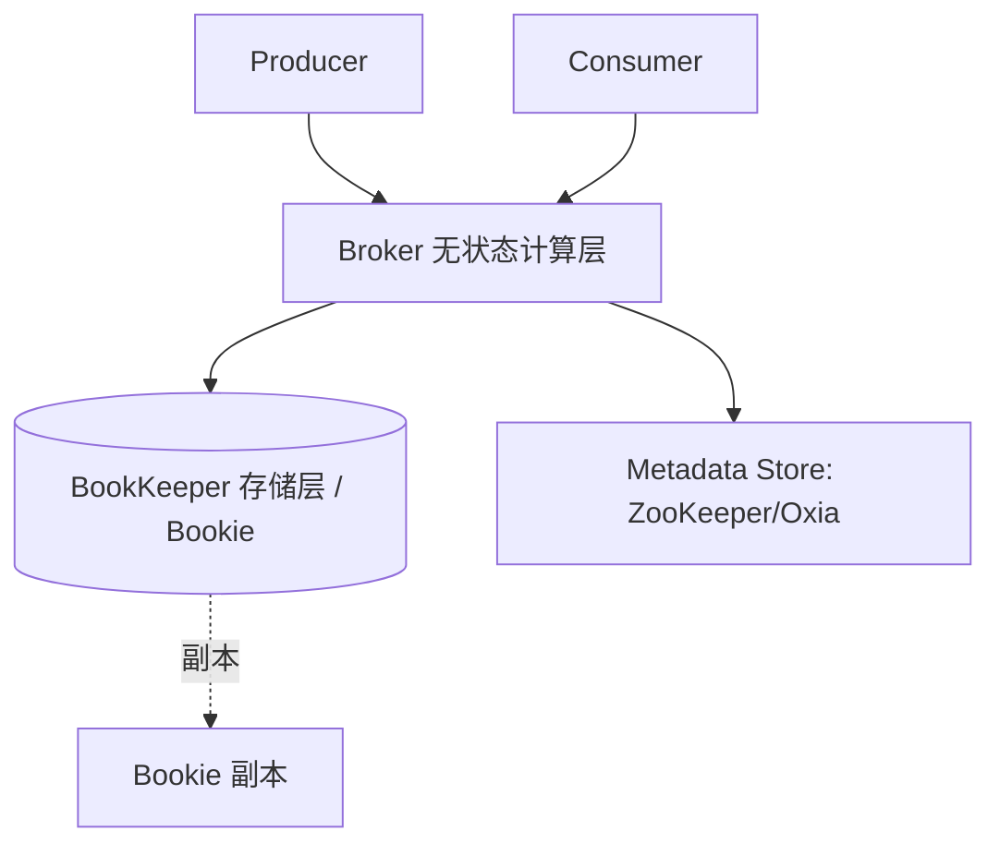

# Apache Pulsar（云原生消息与流平台）

> 存算分离的**统一消息 + 流处理平台**，Broker 无状态、存储交给 BookKeeper。
> 适合：云原生、多租户 SaaS、跨地域复制、事件驱动总线、需要「队列语义 + 流语义」统一。
> 不适合：小团队简单场景（两套组件，运维复杂度偏高，可能过度设计）。

---


## 〇、本体介绍（它是什么 / 适用场景 / 核心概念）

**它是什么**：Apache Pulsar 是 Yahoo 开源、现为 Apache 顶级项目的**云原生消息与流平台**，最大创新是「计算与存储分离」的分层架构：无状态 Broker + BookKeeper 存储层 + ZooKeeper 协调层。

**解决什么痛点**：Kafka 把消息存在 Broker 本地盘、计算存储耦合，扩容要迁数据、运维重。Pulsar 的 Broker 无状态，故障秒级接管、扩容无需搬数据；BookKeeper 提供条目级多副本持久化；天然支持多租户、跨地域复制、四种订阅模式。

**核心概念**：Tenant/Namespace（多租户）、Topic、Subscription（Exclusive/Shared/Failover/Key_Shared 四种）、Broker（无状态）、Bookie（BookKeeper 存储节点）、Ledger（账本/append-only）、Ensemble/Write Quorum/Ack Quorum、Geo-replication、Pulsar Functions、分层存储。

**适用场景**：云原生消息流、多租户 SaaS、需要弹性扩缩与跨地域复制、兼具队列与流处理的平台。
**不适用**：极简轻量单机消息（运维组件多，偏重）。

---

## 一、它解决什么问题

Kafka 是「存算一体」：分区日志物理绑定在 Broker 本地磁盘。痛点：
- **扩容要搬数据**：加 Broker 要 rebalance 分区，跨网络拷 TB 级数据，期间延迟抖动。
- **热点分区难解**：某分区流量大，宿主 Broker 被打爆。
- **多租户弱**：Kafka 无原生租户/命名空间隔离。

Pulsar 从设计上**把计算（Broker）和存储（BookKeeper）解耦**：
- Broker **无状态**，只做路由/协议/鉴权，挂了客户端重连另一个即可，无数据迁移。
- 存储由 **Apache BookKeeper**（Bookie 节点）承担，按 segment（ledger）分布、天然负载均衡。
- 因此扩容 Broker「秒级、不搬历史数据」；多租户、跨地域复制是原生一等公民。

> 仓库 `github.com/apache/pulsar`：ASF 顶级项目，Java/Go/C++/Python/C#/Node.js 多语言客户端，<10ms 延迟、百万 topic、百万 msg/s、geo-replication、分层存储。

---

## 二、整体架构（分层）



| 组件 | 角色 |
|------|------|
| **Broker** | 无状态，处理连接、路由、ACK、鉴权、配额；不存长期数据 |
| **BookKeeper（Bookie）** | 分布式日志存储，数据按 **Ledger（段）** 分片、默认 3 副本（Quorum 写） |
| **Metadata Store** | 存元数据（topic→broker 映射、ledger 列表），ZooKeeper 或 Oxia |
| **Topic** | 逻辑概念，分 partition，partition 由多个 ledger 组成 |

**Segment-Centric vs Partition-Centric**：Kafka 的 partition 是「绑定 Broker 的大日志」；Pulsar 的 partition 是「多个小 ledger 的逻辑集合」，新 ledger 直接写到不同 Bookie → 写压力自然打散，消除热点。

---

## 三、四种订阅模式（Pulsar 独特优势）

Pulsar 一个 topic 支持多种订阅，灵活兼顾「队列」和「流」：

| 模式 | 语义 | 场景 |
|------|------|------|
| **Exclusive** | 独占，一个消费者 | 单实例任务 |
| **Failover** | 主备，主挂切换 | 高可用消费 |
| **Shared** | 轮询分给多消费者（类似 Consumer Group） | 高并发、允许乱序 |
| **Key_Shared** | 同 Key 哈希到同消费者 | 局部有序（如订单状态） |

> Kafka 只有 Consumer Group 一种；Pulsar 的 Shared/Key_Shared 直接支持「竞争消费 + 局部有序」，无需额外设计。

---

## 四、Pulsar vs Kafka（核心对比）

| 维度 | Pulsar | Kafka |
|------|--------|-------|
| 架构 | 计算存储**分离**（Broker+BookKeeper） | 存算**一体**（Broker 自带存储） |
| 扩展 | Broker/存储独立扩，秒级无搬迁 | 扩 Broker 需 rebalance 搬数据 |
| 多租户 | ✅ 原生（Tenant + Namespace + 配额） | 需外部实现 |
| 延迟消息 | ✅ 原生（BookKeeper 暂存） | ❌ 需外部（时间轮/DB） |
| 订阅模型 | 4 种（含 Shared/Key_Shared） | 仅 Consumer Group |
| 跨地域 | ✅ 原生 Geo-replication + 客户端自动故障转移 | 需 MirrorMaker |
| 分层存储 | ✅ 冷数据自动卸载对象存储 | 有限（需 tiered storage 插件） |
| 运维复杂度 | 初期高（两套组件） | 成熟但扩容复杂 |
| 适用 | 云原生/多租户/SaaS/全球化 | 大数据/日志/已有 Kafka 生态 |

> 案例：腾讯将多租户、全球化流平台从 Kafka 迁到 Pulsar，核心诉求正是「租户隔离 + 免 rebalance 运维 + 金融级零丢失（BookKeeper Quorum 写）」。

---

## 五、关键特性

1. **多租户隔离**：Tenant → Namespace → Topic 三级，每层可配吞吐/存储/分发配额，防噪声邻居。
2. **Geo-replication**：跨集群异步复制，区域故障自动客户端切健康集群。
3. **分层存储（Tiered Storage）**：冷数据自动卸到 S3/OSS，降本且不影响热路径。
4. **Pulsar Functions**：原生 Serverless 函数，Java/Go/Python 直接处理消息，免部署额外应用。
5. **百万 Topic**：单集群支持 100 万 topic，不必把多流复用进一个 topic。
6. **统一消息+流**：既支持「逐条 ack 的队列语义」，也支持「按流消费」。

---

## 六、生产实践与避坑

1. **组件分离部署**：Broker 与 Bookie 分开资源规划，Bookie 重 I/O（SSD），Broker 重 CPU/连接。
2. **配额防噪**：给每个 Namespace 设吞吐/存储上限，避免单租户拖垮集群。
3. **延迟消息用原生**：别再引外部时间轮，Pulsar 原生支持。
4. **Subscription 选型**：需要顺序用 Key_Shared；需要并行用 Shared。
5. **Kubernetes**：官方 Pulsar Operator 管理集群，云原生友好。
6. **与 Kafka 抉择**：已有 Kafka 生态且是日志/大数据 → 留 Kafka；新建云原生多租户/全球化 → Pulsar。

---

## 七、与其他板块的关系

- 与 [RabbitMQ](RabbitMQ.md)、[消息队列 MQ](../MQ.md)、[MQTT](MQTT与消息broker.md)：同属消息家族。Pulsar 是「云原生统一消息流」，RabbitMQ 是「业务路由」，MQTT 是「设备协议」。
- 与 [注册中心与配置中心](注册中心与配置中心.md)：Pulsar 自带元数据层，不依赖外部注册中心。
- 与 [数据同步 CDC-Canal](数据同步CDC-Canal.md)：Pulsar 可作 CDC 事件的统一总线（多租户、跨地域）。

---

## 八、速查表

| 项 | 结论 |
|----|------|
| 类型 | 云原生消息 + 流平台 |
| 架构 | 计算存储分离（Broker 无状态 + BookKeeper） |
| 扩展 | 秒级、无数据搬迁 |
| 多租户 | ✅ 原生（Tenant/Namespace） |
| 订阅 | Exclusive/Failover/Shared/Key_Shared |
| 跨地域 | ✅ 原生 Geo-replication |
| 延迟消息 | ✅ 原生 |
| 适用 | 云原生/多租户/SaaS/全球化 |
| 一句话 | 「消息流统一 + 存算分离」，弹性与隔离的极致 |

---

## 面试高频问题（20+ 条）

1. **Pulsar 最大架构特点？** 计算与存储分离：无状态 Broker（路由/协议转换/负载均衡）+ BookKeeper 存储层（Bookie 节点，Ledger 账本持久化）+ ZooKeeper 协调层。Broker 不存数据，故障秒级接管。

2. **为什么存储计算分离是优势？** 弹性扩展：计算/存储独立扩缩，加 Broker 提吞吐、加 Bookie 提容量，无需迁数据；运维简化：Broker 无状态、恢复快；云原生友好（契合 K8s）。

3. **BookKeeper 与 Ledger 是什么？** BookKeeper 是分布式 WAL 存储系统，节点叫 Bookie；Ledger 是 append-only 日志（类似分布式日志段），每 Ledger 单写者、多副本、关闭后只读。Topic 由一个或多个 Ledger 组成。

4. **副本机制（Ensemble/Write/Ack Quorum）？** 每条 Entry 写 Ensemble 个 Bookie，Write Quorum 写几份，Ack Quorum 几个确认即返回。常见 E=3, W=2, A=2，容忍 1 个 Bookie 故障。

5. **四种订阅模式？** Exclusive（独占，单消费者）、Shared（共享，轮询分发、可扩消费者）、Failover（故障转移，主备）、Key_Shared（按 Key 哈希分组，保证同 Key 有序且可并行）。这是 Pulsar 相对 Kafka 的独特优势。

6. **消息回溯（Retention）？** 可配保留时间/大小，消费进度（Cursor）存 BookKeeper，支持重放历史消息，无需像 Kafka 那样受 offset 限制。

7. **Pulsar vs Kafka 核心差异？** 架构：Pulsar 存算分离，Kafka 存算耦合（Broker 本地盘）；扩展：Pulsar 加节点即生效无需 rebalance 搬数据，Kafka 分区迁移需复制数据（耗时）；消费进度：Pulsar 在 BookKeeper（与 Broker 解耦），Kafka 在 Broker/ZK。

8. **多租户怎么实现？** Tenant（租户）→ Namespace（命名空间）→ Topic 三级，天然支持 SaaS 多团队隔离、配额、鉴权。

9. **跨地域复制（Geo-replication）？** 原生支持跨集群异步复制，适合异地多活、容灾。

10. **Pulsar Functions 是什么？** 轻量级流处理（类似 Lambda），无需外部 Flink/Spark 即可在 Broker 侧做简单 ETL/过滤/聚合。

11. **Schema Registry？** 内置支持 Avro/JSON/Protobuf，保障生产消费数据格式一致，避免脏数据。

12. **延迟消息支持？** 原生支持延迟消息（无需插件/定时任务），相比 RabbitMQ 需插件或 DLX 更方便。

13. **分层存储（Tiered Storage）？** 冷数据自动卸载到对象存储（S3 等），热数据在 Bookie，降本且保留长周期回溯。

14. **写入流程与 ACK？** 消息并发写多个 Bookie，延迟取最慢节点；Journal 先 WAL 保持久，再异步写 Entry Log；Ack Quorum 多数确认即回客户端。

15. **消费进度为何比 Kafka 更稳？** Cursor 作为特殊 Ledger 存 BookKeeper，Broker 重启/切换不丢进度；Kafka offset 与分区绑定，Broker 故障可能需恢复。

16. **Pulsar 的运维代价？** 组件多（Broker + Bookie + ZooKeeper + 可能 BookKeeper 的元数据），比 Kafka 部署复杂，小团队需评估。

17. **何时选 Pulsar 而非 Kafka？** 需要弹性扩缩、多租户、跨地域复制、队列+流统一、消息回溯长周期、云原生场景。

18. **Pulsar 与 RabbitMQ 区别？** Pulsar 定位消息+流平台、云原生、超高扩展；RabbitMQ 偏服务端复杂路由/可靠投递，生态简单。二者场景不同。

19. **Pulsar 的协议支持？** 原生 Pulsar 协议（TCP/HTTP），也兼容 Kafka 协议（KoP）、AMQP、MQTT（通过协议处理器），便于迁移。

20. **BookKeeper 高可用如何保证？** 多 Bookie 副本 + Ack Quorum；单 Bookie 故障数据不丢；Ledger 关闭后只读保证一致性。

21. **Pulsar 的分区（Partition）？** Topic 可分多个分区提升并行度，分区内有序，类似 Kafka 分区概念，但底层仍由 Ledger 组成。

22. **Pulsar 在消息积压下的表现？** 存算分离使存储独立扩展，积压时加 Bookie 即可，不影响 Broker 计算；Kafka 积压需扩分区+迁数据更重。

---

## 九、Pulsar 生产配置清单

### 9.1 关键配置

```properties
brokerServicePort=6650
webServicePort=8080
numPartitionsPerBroker=4
defaultRetentionTimeInMinutes=10080
defaultRetentionSizeInMB=-1
bookieServerListenPort=3181
journalDirectory=/data/bookkeeper/journal
ledgerDirectories=/data/bookkeeper/ledgers
```

### 9.2 监控指标

```
Pulsar 关键指标：
  消息入队/出队速率
  订阅游标延迟
  BookKeeper 写入延迟
  Broker 内存使用
  Topic 数量
  消费者数量
```

### 9.3 常见问题排查

| 问题 | 原因 | 解决 |
|------|------|------|
| 写入延迟高 | BookKeeper 过载 | 扩容 Bookie |
| 消费积压 | 消费者不足 | 增加消费者 |
| Topic 过多 | 资源耗尽 | 合并 Topic |
| BookKeeper 故障 | 磁盘/网络问题 | 检查 Bookie 节点 |

---

## 十、Pulsar 调优清单

| 调优项 | 建议 |
|--------|------|
| Broker 数量 | CPU/内存密集，独立部署 |
| Bookie 数量 | IO 密集，SSD 存储 |
| 副本数 | E=3, W=2, A=2（默认） |
| 保留期 | 按业务需求（7天/30天） |
| 分区数 | 按并行度需求 |

---

## 十一、Pulsar 与 Kafka 选型决策

| 调优项 | 建议 |
|--------|------|
| Broker 数量 | CPU/内存密集，独立部署 |
| Bookie 数量 | IO 密集，SSD 存储 |
| 副本数 | E=3, W=2, A=2（默认） |
| 保留期 | 按业务需求（7天/30天） |
| 分区数 | 按并行度需求 |

---

## 十一、Pulsar 与 Kafka 选型决策

```
已有 Kafka 生态？
  ├── 是 + 日志/大数据 → 留 Kafka
  ├── 是 + 云原生多租户 → 考虑迁移 Pulsar
  └── 否 + 新建 → Pulsar（云原生优势）

关键决策点：
  需要多租户隔离 → Pulsar
  需要跨地域复制 → Pulsar
  需要队列+流统一 → Pulsar
  已有 Kafka 生态 → 留 Kafka
  极致吞吐 → Kafka
```

---

## 十一、Pulsar Spring Boot 集成示例

```java
// 生产者
@Service
public class OrderProducer {
    @Autowired
    private PulsarTemplate<Order> pulsarTemplate;
    
    public void sendOrder(Order order) {
        pulsarTemplate.send("persistent://public/default/orders", order);
    }
}

// 消费者
@Component
@PulsarListener(
    topics = "persistent://public/default/orders",
    subscriptionName = "order-service",
    subscriptionType = SubscriptionType.Shared
)
public class OrderConsumer {
    public void handleOrder(Order order) {
        // 处理订单
    }
}
```

---

## 十二、Pulsar 运维命令

```bash
# 查看集群状态
pulsar-admin clusters list

# 查看 topic 列表
pulsar-admin topics list persistent://public/default

# 查看 topic 状态
pulsar-admin topics stats persistent://public/default/orders

# 创建租户
pulsar-admin tenants create my-tenant

# 创建命名空间
pulsar-admin namespaces create my-tenant/my-ns
```
