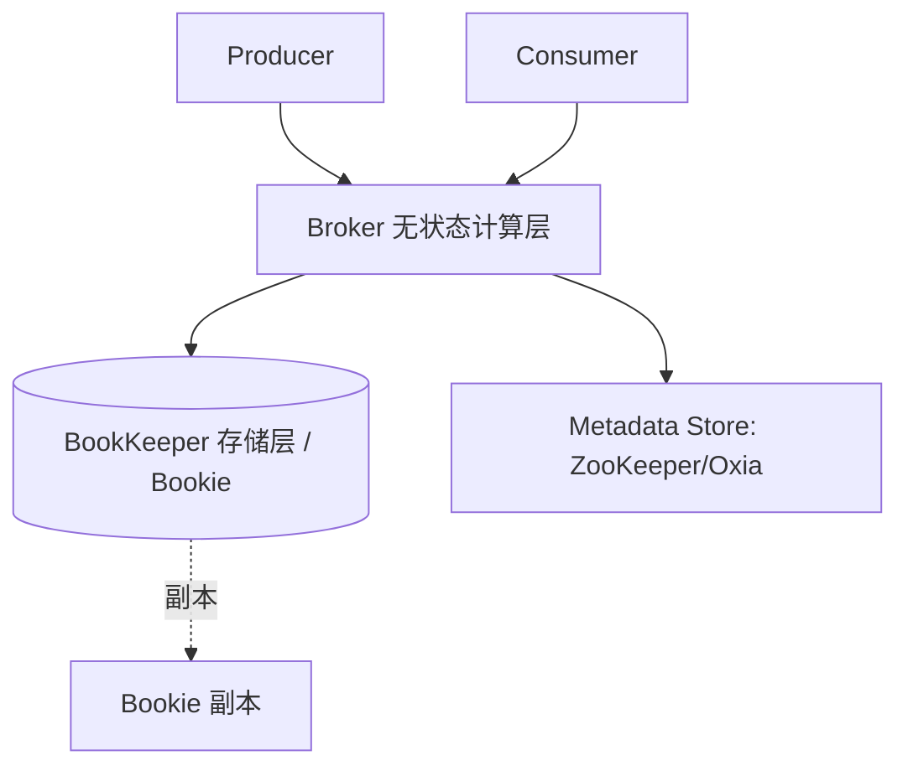

# Apache Pulsar（云原生消息与流平台）

> 存算分离的**统一消息 + 流处理平台**，Broker 无状态、存储交给 BookKeeper。
> 适合：云原生、多租户 SaaS、跨地域复制、事件驱动总线、需要「队列语义 + 流语义」统一。
> 不适合：小团队简单场景（两套组件，运维复杂度偏高，可能过度设计）。

---

## 一、它解决什么问题

Kafka 是「存算一体」：分区日志物理绑定在 Broker 本地磁盘。痛点：
- **扩容要搬数据**：加 Broker 要 rebalance 分区，跨网络拷 TB 级数据，期间延迟抖动。
- **热点分区难解**：某分区流量大，宿主 Broker 被打爆。
- **多租户弱**：Kafka 无原生租户/命名空间隔离。

Pulsar 从设计上**把计算（Broker）和存储（BookKeeper）解耦**：
- Broker **无状态**，只做路由/协议/鉴权，挂了客户端重连另一个即可，无数据迁移。
- 存储由 **Apache BookKeeper**（Bookie 节点）承担，按 segment（ledger）分布、天然负载均衡。
- 因此扩容 Broker「秒级、不搬历史数据」；多租户、跨地域复制是原生一等公民。

> 仓库 `github.com/apache/pulsar`：ASF 顶级项目，Java/Go/C++/Python/C#/Node.js 多语言客户端，<10ms 延迟、百万 topic、百万 msg/s、geo-replication、分层存储。

---

## 二、整体架构（分层）

| 组件 | 角色 |
|------|------|
| **Broker** | 无状态，处理连接、路由、ACK、鉴权、配额；不存长期数据 |
| **BookKeeper（Bookie）** | 分布式日志存储，数据按 **Ledger（段）** 分片、默认 3 副本（Quorum 写） |
| **Metadata Store** | 存元数据（topic→broker 映射、ledger 列表），ZooKeeper 或 Oxia |
| **Topic** | 逻辑概念，分 partition，partition 由多个 ledger 组成 |

**Segment-Centric vs Partition-Centric**：Kafka 的 partition 是「绑定 Broker 的大日志」；Pulsar 的 partition 是「多个小 ledger 的逻辑集合」，新 ledger 直接写到不同 Bookie → 写压力自然打散，消除热点。

---

## 三、四种订阅模式（Pulsar 独特优势）

Pulsar 一个 topic 支持多种订阅，灵活兼顾「队列」和「流」：

| 模式 | 语义 | 场景 |
|------|------|------|
| **Exclusive** | 独占，一个消费者 | 单实例任务 |
| **Failover** | 主备，主挂切换 | 高可用消费 |
| **Shared** | 轮询分给多消费者（类似 Consumer Group） | 高并发、允许乱序 |
| **Key_Shared** | 同 Key 哈希到同消费者 | 局部有序（如订单状态） |

> Kafka 只有 Consumer Group 一种；Pulsar 的 Shared/Key_Shared 直接支持「竞争消费 + 局部有序」，无需额外设计。

---

## 四、Pulsar vs Kafka（核心对比）

| 维度 | Pulsar | Kafka |
|------|--------|-------|
| 架构 | 计算存储**分离**（Broker+BookKeeper） | 存算**一体**（Broker 自带存储） |
| 扩展 | Broker/存储独立扩，秒级无搬迁 | 扩 Broker 需 rebalance 搬数据 |
| 多租户 | ✅ 原生（Tenant + Namespace + 配额） | 需外部实现 |
| 延迟消息 | ✅ 原生（BookKeeper 暂存） | ❌ 需外部（时间轮/DB） |
| 订阅模型 | 4 种（含 Shared/Key_Shared） | 仅 Consumer Group |
| 跨地域 | ✅ 原生 Geo-replication + 客户端自动故障转移 | 需 MirrorMaker |
| 分层存储 | ✅ 冷数据自动卸载对象存储 | 有限（需 tiered storage 插件） |
| 运维复杂度 | 初期高（两套组件） | 成熟但扩容复杂 |
| 适用 | 云原生/多租户/SaaS/全球化 | 大数据/日志/已有 Kafka 生态 |

> 案例：腾讯将多租户、全球化流平台从 Kafka 迁到 Pulsar，核心诉求正是「租户隔离 + 免 rebalance 运维 + 金融级零丢失（BookKeeper Quorum 写）」。

---

## 五、关键特性

1. **多租户隔离**：Tenant → Namespace → Topic 三级，每层可配吞吐/存储/分发配额，防噪声邻居。
2. **Geo-replication**：跨集群异步复制，区域故障自动客户端切健康集群。
3. **分层存储（Tiered Storage）**：冷数据自动卸到 S3/OSS，降本且不影响热路径。
4. **Pulsar Functions**：原生 Serverless 函数，Java/Go/Python 直接处理消息，免部署额外应用。
5. **百万 Topic**：单集群支持 100 万 topic，不必把多流复用进一个 topic。
6. **统一消息+流**：既支持「逐条 ack 的队列语义」，也支持「按流消费」。

---

## 六、生产实践与避坑

1. **组件分离部署**：Broker 与 Bookie 分开资源规划，Bookie 重 I/O（SSD），Broker 重 CPU/连接。
2. **配额防噪**：给每个 Namespace 设吞吐/存储上限，避免单租户拖垮集群。
3. **延迟消息用原生**：别再引外部时间轮，Pulsar 原生支持。
4. **Subscription 选型**：需要顺序用 Key_Shared；需要并行用 Shared。
5. **Kubernetes**：官方 Pulsar Operator 管理集群，云原生友好。
6. **与 Kafka 抉择**：已有 Kafka 生态且是日志/大数据 → 留 Kafka；新建云原生多租户/全球化 → Pulsar。

---

## 七、与其他板块的关系

- 与 [RabbitMQ](RabbitMQ.md)、[消息队列 MQ](MQ.md)、[MQTT](MQTT与消息broker.md)：同属消息家族。Pulsar 是「云原生统一消息流」，RabbitMQ 是「业务路由」，MQTT 是「设备协议」。
- 与 [注册中心与配置中心](注册中心与配置中心.md)：Pulsar 自带元数据层，不依赖外部注册中心。
- 与 [数据同步 CDC-Canal](数据同步CDC-Canal.md)：Pulsar 可作 CDC 事件的统一总线（多租户、跨地域）。

---

## 八、速查表

| 项 | 结论 |
|----|------|
| 类型 | 云原生消息 + 流平台 |
| 架构 | 计算存储分离（Broker 无状态 + BookKeeper） |
| 扩展 | 秒级、无数据搬迁 |
| 多租户 | ✅ 原生（Tenant/Namespace） |
| 订阅 | Exclusive/Failover/Shared/Key_Shared |
| 跨地域 | ✅ 原生 Geo-replication |
| 延迟消息 | ✅ 原生 |
| 适用 | 云原生/多租户/SaaS/全球化 |
| 一句话 | 「消息流统一 + 存算分离」，弹性与隔离的极致 |
