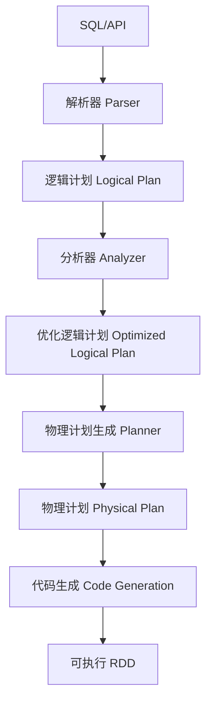
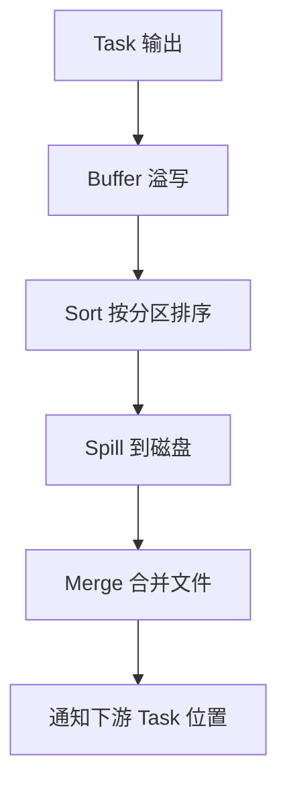
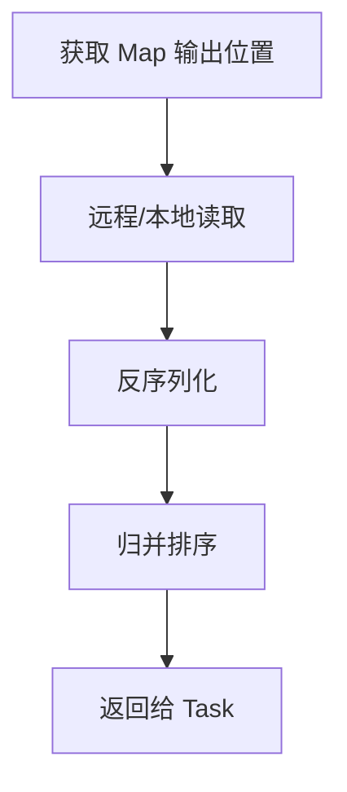
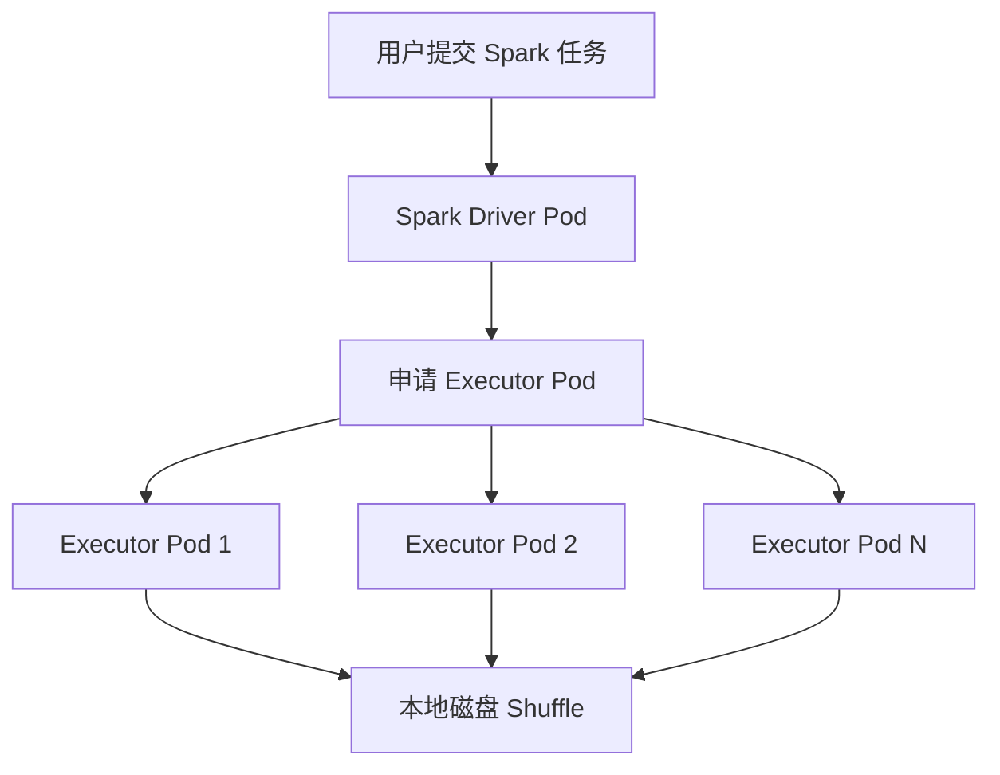

# Apache Spark（批处理引擎 / 大数据计算）

> Spark 是大数据**批处理**的事实标准：基于内存的 DAG 引擎，比 MapReduce 快 10~100 倍。相比 Flink（流为主）、Hive（MapReduce on Tez），Spark 以**批流统一（Structured Streaming）+ 生态丰富（SQL/ML/Graph）+ 内存计算**成为大数据首选。本篇按「解决的问题 → 原理 → 特性 → 选型关注点」拆解。

---

## 一、要解决的问题

| 痛点 | 说明 |
|------|------|
| MapReduce 慢 | 中间结果写磁盘，迭代计算（ML）极慢 |
| 批流割裂 | 离线 Spark + 实时 Flink 两套引擎 |
| 生态碎片化 | SQL/ML/Graph 各搞各的 API |
| 内存受限 | TB 级数据内存放不下 |

> 核心认知：**Spark = 内存计算 + DAG 调度 + 批流统一**——用内存换速度，用 DAG 优化执行。

---

## 二、Spark 核心原理

### 2.1 架构

```
Driver（驱动器）
  ├── SparkSession（入口）
  ├── DAG Scheduler（将 Job 切分为 Stage）
  ├── Task Scheduler（将 Stage 切分为 Task 调度到 Executor）
  └── Block Manager（块管理/缓存）

Executor（执行器）
  ├── Task（执行的最小单位）
  ├── Cache（内存缓存：persist/cache）
  └── Shuffle（跨节点数据重分配）

Cluster Manager（资源管理）
  ├── Standalone（Spark 自带）
  ├── YARN（Hadoop 生态）
  ├── Kubernetes（云原生）
  └── Mesos（少用）
```

### 2.2 核心抽象：RDD / DataFrame / Dataset

| 抽象 | 说明 | 性能 |
|------|------|------|
| RDD | 弹性分布式数据集（底层 API，类型不安全） | 中 |
| DataFrame | 命名列的分布式集合（DSL，Catalyst 优化） | 高 |
| Dataset | DataFrame + 类型安全（Scala/Java） | 高 |

**选型关注点**：生产几乎都用 **DataFrame/Dataset**（Catalyst 优化器自动优化），RDD 只在需要底层控制时用。

### 2.3 执行流程

```
1. 用户代码（DataFrame/Dataset 转换）
2. Catalyst 优化器
   ├── 解析 → 逻辑计划
   ├── 优化（谓词下推/列裁剪/常量折叠）
   → 优化的逻辑计划
3. 物理计划生成（选择 Join 策略/Shuffle 方式）
4. 代码生成（Whole-Stage Code Gen）→ 手写代码级别优化
5. DAG Scheduler → 按宽依赖切 Stage
6. Task Scheduler → 按数据本地性调度 Task
7. Executor 执行
```

**选型关注点**：Catalyst 优化器是 Spark 高性能的核心——自动谓词下推、列裁剪、Join 策略选择。

### 2.4 Shuffle（洗牌）

- **定义**：跨分区数据重分配（Join/GroupBy/OrderBy 触发）
- **代价**：网络传输 + 磁盘 IO + 排序
- **优化**：减少 Shuffle（broadcast join/预分区/Map 端预聚合）

**选型关注点**：Shuffle 是 Spark 最大性能瓶颈，减少 Shuffle 是第一优化原则。

### 2.5 内存管理

| 区域 | 说明 |
|------|------|
| Execution Memory | Shuffle/Join/Sort/Aggregation 的内存 |
| Storage Memory | cache/persist 的内存 |
| User Memory | 用户数据结构 |
| Reserved Memory | 系统预留（300MB） |

**选型关注点**：内存不足 → Spill 到磁盘（性能骤降），合理配置内存 + 减少 cache 是调优关键。

---

## 三、Spark 生态

| 组件 | 说明 |
|------|------|
| Spark SQL | 结构化数据查询（SQL + DataFrame API） |
| Spark Streaming | 微批流处理（DStream API） |
| Structured Streaming | 结构化流处理（DataFrame API，批流统一） |
| MLlib | 机器学习库（分类/回归/聚类/推荐） |
| GraphX | 图计算（PageRank/连通分量） |
| SparkR / PySpark | R/Python 接口 |

**选型关注点**：Structured Streaming 是 Spark 流处理的未来（与批处理统一 API），新项目推荐。

---

## 四、Spark vs Flink vs Hive vs Presto

| 维度 | Spark | Flink | Hive | Presto |
|------|-------|-------|------|--------|
| 处理模型 | 批（微批流） | 流（批是流的特例） | 批（MapReduce/Tez） | 批（MPP） |
| 延迟 | 秒（Structured Streaming） | 毫秒 | 分钟~小时 | 秒~分钟 |
| 吞吐 | 最高 | 高 | 高 | 中 |
| 内存 | 内存优先 | 内存+磁盘 | 磁盘 | 内存 |
| SQL | Spark SQL | Flink SQL | HiveQL | ANSI SQL |
| 流处理 | Structured Streaming | 原生流 | 不支持 | 不支持 |
| ML | MLlib | 无（需集成） | 无 | 无 |
| 生态 | 最丰富 | 丰富 | 丰富 | 中 |
| 交互查询 | 不支持（需 Spark Thrift） | 不支持 | 支持 | 支持 |

**选型关注点**：
- 离线批处理 + ML + SQL → **Spark**（生态最全）
- 实时流处理 → **Flink**
- 离线 SQL 报表 → **Spark SQL / Hive**
- 交互式 SQL 查询 → **Presto / Trino**
- 批流一体 → **Flink** 或 **Spark Structured Streaming**

---

## 五、Spark 生产部署

### 5.1 部署模式

| 模式 | 说明 |
|------|------|
| Standalone | Spark 自带集群管理 |
| YARN | 共享 Hadoop 集群 |
| Kubernetes | 云原生部署（主流趋势） |
| 托管服务 | AWS EMR / HDInsight / Dataproc / 阿里云 EMR |

### 5.2 关键调优

| 调优维度 | 建议 |
|----------|------|
| 并行度 | spark.sql.shuffle.partitions = 核心数 × 2~3 |
| 内存 | executor 内存 4~8GB，过多 GC 高 |
| 序列化 | Kryo 序列化（比 Java 快） |
| 数据本地性 | PROCESS_LOCAL > NODE_LOCAL > RACK_LOCAL |
| 广播 Join | 小表 < spark.sql.autoBroadcastJoinThreshold（默认 10MB） |
| 数据倾斜 | 加盐/Map Join/AQE |

### 5.3 AQE（Adaptive Query Execution，Spark 3.0+）

- **动态合并 Shuffle 分区**：自动减少小分区
- **动态切换 Join 策略**：运行时发现小表自动切 Broadcast Join
- **动态倾斜处理**：自动拆分倾斜分区

**选型关注点**：Spark 3.0+ 开启 AQE 是生产必备（大幅减少手动调优）。

---

## 六、选型速查

| 需求 | 首选 | 备选 |
|------|------|------|
| 离线批处理 | Spark | Hive/MapReduce |
| 实时流处理 | Flink | Spark Structured Streaming |
| SQL on Hadoop | Spark SQL | Hive/Presto |
| 交互式查询 | Presto/Trino | Spark Thrift |
| 机器学习 | Spark MLlib | Flink ML |
| 图计算 | Spark GraphX | Neo4j/JanusGraph |
| 批流一体 | Flink | Spark |
| 云原生部署 | Spark on K8s | — |

---

## 七、Spark Catalyst 优化器内部原理

### 7.1 优化流程



### 7.2 四大优化阶段

| 阶段 | 说明 | 示例 |
|------|------|------|
| 解析 | SQL → 未解析逻辑计划 | `SELECT * FROM t WHERE id=1` |
| 分析 | 解析元数据（表/列） | 确认 `t` 表存在，`id` 列类型 |
| 优化 | 谓词下推/列裁剪/常量折叠 | `WHERE id=1` 下推到 Scan |
| 物理 | 选择 Join 策略/ Shuffle 方式 | Broadcast Join vs Sort Merge Join |

### 7.3 核心优化规则

| 优化 | 说明 |
|------|------|
| 谓词下推 | `WHERE` 条件推到数据源 |
| 列裁剪 | 只读取需要的列 |
| 常量折叠 | `1+2` 编译期计算为 `3` |
| 消除子查询 | 子查询 → Join/Union |
| Join 重排序 | 小表放左侧/广播 |

### 7.4 Whole-Stage Code Generation

```
传统执行：
  算子 A → 行化接口 → 算子 B → 行化接口 → 算子 C
  每步都有虚函数调用/缓存未命中

Whole-Stage Code Generation：
  算子 A + B + C 合并为一个 Stage
  生成单个 Java 函数（无虚调用）
  类似手写代码性能

示例：
  Filter → Project → Aggregate
  编译为：单个循环 + 累加器
  性能提升 2~10x
```

---

## 八、Tungsten 执行引擎

### 8.1 内存管理

```
Tungsten 内存管理：
  堆外内存（Off-Heap）：避免 GC
  二进制格式：数据紧凑存储
  缓存友好：数据布局优化

内存布局：
  8 字节对齐 → CPU 缓存行命中
  紧凑编码 → 减少内存占用
  指针跳转少 → 减少间接寻址
```

### 8.2 排序优化

| 优化 | 说明 |
|------|------|
| Unsafe 排序 | 堆外内存直接排序 |
| Prefix 排序 | 多列排序只比较前缀 |
| Radix Sort | 整数排序用基数排序 |
| Page-Based 排序 | 按页排序减少内存分配 |

### 8.3 缓存感知计算

```
数据结构对齐 CPU 缓存行（64 字节）：
  行数据紧凑存储（不像 Java 对象有对象头）
  嵌套循环 Join 优化：内表按缓存行对齐
  Hash 聚合：桶数对齐缓存行

性能提升：
  减少 CPU Cache Miss
  减少 TLB Miss
  提升内存带宽利用率
```

---

## 九、Spark Shuffle 深入

### 9.1 Shuffle 写入流程



### 9.2 Shuffle 读取流程



### 9.3 Shuffle 优化策略

| 优化 | 说明 | 配置项 |
|------|------|--------|
| Broadcast Join | 小表广播避免 Shuffle | `spark.sql.autoBroadcastJoinThreshold` |
| 预分区 | 提前按 Join Key 分区 | `repartition()` |
| Map 端聚合 | 预聚合减少 Shuffle 数据量 | `spark.sql.mapKeyDedupPolicy` |
| Sort-Based Shuffle | 替代 Hash Shuffle | `spark.shuffle.manager=sort` |
| 外部 Shuffle 服务 | 跨 Executor 读取 Shuffle 数据 | `spark.shuffle.service.enabled` |

### 9.4 Shuffle 调优参数

| 参数 | 默认值 | 说明 |
|------|--------|------|
| `spark.sql.shuffle.partitions` | 200 | Shuffle 分区数 |
| `spark.shuffle.compress` | true | Shuffle 数据压缩 |
| `spark.shuffle.spill.compress` | true | 溢写数据压缩 |
| `spark.shuffle.file.buffer` | 32K | Shuffle 写缓冲 |
| `spark.reducer.maxSizeInFlight` | 48M | Shuffle 读缓冲 |

---

## 十、Spark on Kubernetes

### 10.1 部署架构



### 10.2 配置示例

```bash
spark-submit \
  --master k8s://https://k8s-master:6443 \
  --deploy-mode cluster \
  --name spark-job \
  --class com.example.Main \
  --conf spark.kubernetes.container.image=my-spark:latest \
  --conf spark.kubernetes.executor.instances=4 \
  --conf spark.kubernetes.executor.memory=8g \
  --conf spark.kubernetes.executor.cores=4 \
  --conf spark.kubernetes.driver.memory=4g \
  --conf spark.kubernetes.authenticate.driver.serviceAccountName=spark \
  --conf spark.kubernetes.driver.podTemplateFile=driver-pod.yaml \
  --conf spark.kubernetes.executor.podTemplateFile=executor-pod.yaml \
  local:///opt/spark/jars/app.jar
```

### 10.3 K8s 部署关键配置

| 配置项 | 说明 |
|--------|------|
| `spark.kubernetes.container.image` | Docker 镜像 |
| `spark.kubernetes.executor.instances` | Executor 数量 |
| `spark.kubernetes.executor.deleteOnTermination` | 结束后删除 Pod |
| `spark.kubernetes.submission.waitAppCompletion` | 等待完成 |
| `spark.kubernetes.allocation.batch.size` | 批量申请 Pod 数 |

### 10.4 动态资源分配

```properties
spark.dynamicAllocation.enabled=true
spark.dynamicAllocation.minExecutors=2
spark.dynamicAllocation.maxExecutors=20
spark.dynamicAllocation.executorIdleTimeout=60s
spark.shuffle.service.enabled=true
```

---

## 十一、Spark Structured Streaming

### 11.1 核心概念

| 概念 | 说明 |
|------|------|
| Input Table | 无限输入表（流数据视为表） |
| Result Table | 查询结果表 |
| Output Mode | 输出方式（Append/Complete/Update） |
| Trigger | 触发间隔（Processing Time/Event Time） |
| Watermark | 处理延迟数据 |

### 11.2 Output Mode 对比

| Mode | 说明 | 适用 |
|------|------|------|
| Append | 新行追加 | 无聚合/窗口聚合 |
| Complete | 全部结果覆盖 | 聚合查询 |
| Update | 只更新行 | 聚合查询（非全量） |

### 11.3 使用示例

```python
# 读取 Kafka 流
df = spark.readStream \
    .format("kafka") \
    .option("kafka.bootstrap.servers", "localhost:9092") \
    .option("subscribe", "orders") \
    .load()

# 处理
result = df.selectExpr("CAST(value AS STRING)") \
    .groupBy(window("timestamp", "5 minutes"), "value") \
    .count()

# 写入
query = result.writeStream \
    .outputMode("complete") \
    .format("console") \
    .start()
```

### 11.4 Structured Streaming vs Flink

| 维度 | Structured Streaming | Flink |
|------|---------------------|-------|
| 处理模型 | 微批 | 真流 |
| 延迟 | 秒级 | 毫秒级 |
| API | DataFrame | DataStream/SQL |
| 状态管理 | 有限 | RocksDB |
| 事件时间 | 支持 | 支持 |
| 适用 | 批流统一 | 复杂流处理 |

---

## 十二、Spark AQE 深入

### 12.1 AQE 三大优化

| 优化 | 说明 | 效果 |
|------|------|------|
| 动态合并分区 | 自动合并小分区 | 减少 Task 数 |
| 动态切换 Join | 运行时发现小表切 Broadcast | 避免 Shuffle |
| 动态倾斜处理 | 自动拆分倾斜分区 | 均衡负载 |

### 12.2 配置项

```properties
# 开启 AQE
spark.sql.adaptive.enabled=true
spark.sql.adaptive.coalescePartitions.enabled=true
spark.sql.adaptive.skewJoin.enabled=true

# 合并分区阈值
spark.sql.adaptive.coalescePartitions.minPartitionNum=1
spark.sql.adaptive.coalescePartitions.targetPostShuffleInputSize=64MB

# 倾斜处理
spark.sql.adaptive.skewJoin.skewedPartitionFactor=5
spark.sql.adaptive.skewJoin.skewedPartitionThresholdInBytes=256MB
```

### 12.3 AQE 工作原理

```
传统查询：
  编译期确定执行计划（静态）
  无法感知运行时数据分布

AQE：
  编译期生成多个可切换计划
  运行时采集统计信息
  动态调整执行计划
  Shuffle 后重新评估 Join 策略
  自动处理数据倾斜
```

---

## 十三、Spark 动态分区裁剪

### 13.1 原理

```
传统 JOIN：
  SELECT * FROM fact JOIN dim ON fact.id = dim.id
  → 全量扫描 fact 表

动态分区裁剪：
  编译期：识别 JOIN 中的等值条件
  运行时：dim 表的结果动态裁剪 fact 表分区
  → 只扫描相关分区

性能提升：
  分区数 × 裁剪比例 = 减少的扫描量
  通常提升 2~10x
```

### 13.2 触发条件

| 条件 | 说明 |
|------|------|
| JOIN 键 = 分区键 | 等值 JOIN 条件 |
| 分区表 | 目标表是分区表 |
| AQE 开启 | `spark.sql.adaptive.enabled=true` |

### 13.3 示例

```sql
-- 动态分区裁剪示例
SELECT * FROM sales s
JOIN products p ON s.product_id = p.product_id
WHERE p.category = 'electronics';

-- 传统：全量扫描 sales
-- 动态裁剪：只扫描 electronics 相关分区
```

---

## 十四、Spark vs Presto/Trino

| 维度 | Spark | Presto/Trino |
|------|-------|--------------|
| 处理模型 | 批处理（内存+磁盘） | MPP（纯内存） |
| 延迟 | 秒~分钟 | 秒 |
| 吞吐 | 最高 | 中 |
| SQL 标准 | Spark SQL | ANSI SQL |
| 生态 | 最丰富（SQL/ML/Graph） | 纯 SQL |
| 交互查询 | 不支持（需 Thrift） | 支持 |
| 内存 | 磁盘可溢写 | 纯内存（OOM 风险） |
| 适用 | 离线批处理/ML | 交互式 SQL 查询 |

**选型决策**：
- 交互式查询/BI 报表 → Presto/Trino
- 离线批处理/ML → Spark
- 大规模 ETL → Spark
- Ad-hoc 查询 → Presto/Trino

---

## 十四-2、AQE 自适应查询执行三阶段

### Stage 1：Shuffle 后动态合并分区

```
传统：编译期固定 200 个 Shuffle 分区
AQE：运行时根据数据量合并小分区

触发条件：
  spark.sql.adaptive.coalescePartitions.enabled=true
  targetPostShuffleInputSize=64MB（每个分区目标大小）

效果：小分区合并后减少 Task 数，避免资源浪费
```

### Stage 2：动态切换 Join 策略

```
运行时发现某表实际很小 → 自动切 Broadcast Join
无需预估表大小，避免手动调参

触发条件：
  spark.sql.adaptive.localShuffleReader.enabled=true
```

### Stage 3：动态倾斜处理（Skew Join）

```
检测到某分区数据量远大于其他 → 自动拆分倾斜分区

原理：
  1. 统计各分区数据量
  2. 识别倾斜分区（数据量 > 中位数 × skewFactor）
  3. 将倾斜分区拆分为多个子分区
  4. 子分区独立处理，避免单 Task 过载

配置：
  spark.sql.adaptive.skewJoin.enabled=true
  spark.sql.adaptive.skewJoin.skewedPartitionFactor=5
  spark.sql.adaptive.skewJoin.skewedPartitionThresholdInBytes=256MB
```

## 十四-3、Shuffle 外部排序器内存管理

```
UnsafeExternalSorter = Spark 的 Shuffle 写入排序器

内存管理：
  1. 首次使用堆内内存（On-Heap）
  2. 内存不足 → Spill 到磁盘（溢写）
  3. 多次溢写 → Merge 合并文件

排序优化：
  Prefix Sort：多列排序只比较前缀（减少比较次数）
  Radix Sort：整数排序用基数排序（O(n) 复杂度）
  Page-Based：按页排序减少内存分配

监控指标：
  shuffle_spill_count：溢写次数（突增=内存不足）
  shuffle_spill_disk_size：溢写磁盘大小
```

## 十四-4、Broadcast Join 触发阈值与副作用

```
触发条件：
  表大小 < spark.sql.autoBroadcastJoinThreshold（默认 10MB）
  AQE 开启时可动态切换

副作用：
  1. Driver 收集全表数据 → Driver 内存压力大
  2. 全量广播到所有 Executor → 网络开销
  3. 大表 Join 小表时如果阈值设错 → 全量广播 OOM

最佳实践：
  小表 < 10MB → Broadcast Join（最优）
  小表 10~100MB → 按内存评估是否广播
  小表 > 100MB → Sort-Merge Join

代码控制：
  spark.conf.set("spark.sql.autoBroadcastJoinThreshold", "50m")
  // 或 SQL 强制广播
  SELECT /*+ BROADCAST(dim) */ * FROM fact JOIN dim ON ...
```

## 十五、Spark on K8s Driver/Executor Pod 资源分配公式

```
资源分配公式：

Executor Pod：
  CPU = spark.executor.cores（如 4）
  Memory = spark.executor.memory（如 8G）
  JVM 堆 = memory × 0.75（约 6G）
  Off-Heap = memory × 0.25（约 2G）
  Pod Request = CPU + Memory

Driver Pod：
  CPU = spark.driver.cores（如 2）
  Memory = spark.driver.memory（如 4G）
  Driver 通常比 Executor 小

总资源 = Driver 内存 + Executor 数 × Executor 内存
  如 1 Driver(4G) + 4 Executor(8G) = 36G

K8s 资源请求/限制：
  resources.requests：调度依据（保证最低资源）
  resources.limits：硬限制（超限 OOM Kill）
  建议 requests ≈ limits（避免资源竞争）
```

## 十五-2、Spark 历史服务器排查

```
排查流程：
  1. 启动 History Server
     spark-history-server.sh start

  2. 访问 Web UI
     http://history-server:18080

  3. 查看关键信息：
     Job 执行时间（哪个 Stage 慢）
     Shuffle 读写量（数据倾斜）
     Task 处理记录数（是否分布不均）
     GC 时间（GC 停顿频繁）
     失败 Task（异常原因）

  4. 常见排查点：
     某 Stage 耗时远超其他 → 数据倾斜
     Task 处理时间差异大 → 分区不均
     Shuffle 写量突增 → 数据膨胀
     GC 占比 > 10% → 调整内存/GC
```

## 十六、AQE 自适应查询执行三阶段详解

### 16.1 Stage 1：Shuffle 后动态合并分区（Coalesce Partitions）

```
传统模式：编译期固定 200 个 Shuffle 分区（spark.sql.shuffle.partitions=200）
问题：数据量小时 200 个分区产生大量空/小分区，Task 启动开销占比过高

AQE 动态合并：
  触发条件：spark.sql.adaptive.coalescePartitions.enabled=true
  执行时机：Shuffle 完成后、下一 Stage 执行前
  合并策略：按 targetPostShuffleInputSize（默认 64MB）合并相邻小分区
  
  效果示例：
    原始：200 个分区，每个平均 5MB → 1000MB 总数据
    合并后：约 16 个分区，每个 64MB → Task 数从 200 降到 16
    Task 启动开销节省：200×50ms = 10s → 16×50ms = 0.8s

配置项：
  spark.sql.adaptive.coalescePartitions.minPartitionNum=1    # 最少分区数
  spark.sql.adaptive.coalescePartitions.targetPostShuffleInputSize=64MB
  spark.sql.adaptive.coalescePartitions.initialPartitionNum=200  # 初始分区数
```

| 场景 | 合并效果 | 调优建议 |
|------|---------|---------|
| 小表 Join | 大量空分区被合并 | 开启 AQE 即可 |
| 数据倾斜 | 合并后仍可能倾斜 | 配合 skewJoin |
| 动态分区表 | 分区数不可预测 | targetPostShuffleInputSize 按数据量调整 |

### 16.2 Stage 2：动态切换 Join 策略

```
传统问题：编译期基于统计信息估算表大小，可能误判
  如：维表实际 5MB，但统计信息过期显示 500MB → Sort-Merge Join（慢）

AQE 动态切换：
  执行时机：Shuffle 完成后重新评估表大小
  切换条件：某表实际大小 < spark.sql.autoBroadcastJoinThreshold
  效果：自动从 Sort-Merge Join 切换为 Broadcast Join
  
  流程：
    Stage 1 完成 → 统计 Shuffle 数据量
    → 发现 dim 表实际 5MB < 10MB 阈值
    → 重新生成物理计划：Broadcast Join
    → Stage 2 用 Broadcast Join 执行（无需 Shuffle）

配置项：
  spark.sql.adaptive.localShuffleReader.enabled=true  # 允许本地 Shuffle 读
  spark.sql.autoBroadcastJoinThreshold=10MB           # 广播阈值
```

### 16.3 Stage 3：动态倾斜处理（Skew Join）

```
数据倾斜：某个 Key 的数据量远超其他 Key → 单 Task 处理数据过多 → 瓶颈

AQE 倾斜检测与处理：
  1. Shuffle 后统计各分区数据量
  2. 识别倾斜分区：数据量 > 中位数 × skewedPartitionFactor（默认 5）
     且数据量 > skewedPartitionThresholdInBytes（默认 256MB）
  3. 将倾斜分区拆分为多个子分区（如 1 个大分区 → 4 个小分区）
  4. 子分区独立处理，避免单 Task 过载

配置项：
  spark.sql.adaptive.skewJoin.enabled=true
  spark.sql.adaptive.skewJoin.skewedPartitionFactor=5
  spark.sql.adaptive.skewJoin.skewedPartitionThresholdInBytes=256MB

效果：
  原始：1 个 Task 处理 2GB 倾斜数据 → 耗时 10 分钟
  拆分后：4 个 Task 各处理 500MB → 耗时 2.5 分钟
```

## 十七、Shuffle 内存管理与 Spill 策略

### 17.1 UnsafeExternalSorter 内存管理

```
UnsafeExternalSorter = Spark Shuffle 写入的核心排序器

内存使用流程：
  1. 首次分配堆内内存（On-Heap），用于排序和缓冲
  2. 内存不足时 Spill 到磁盘（溢写）
  3. 多次溢写后 Merge 合并所有溢写文件

Spill 触发条件：
  当前使用内存 > 申请的内存页（Page）数量 × 页大小
  页大小由 spark.shuffle.spill.initialBufferSize 控制（默认 1MB）

Spill 策略：
  ① 排序后溢写（Sorted Spill）：先按分区排序再写磁盘
  ② 直接溢写（Unsorted Spill）：内存满直接写（性能差，少用）
  
排序优化：
  Prefix Sort：多列排序只比较前缀字节，减少比较次数
  Radix Sort：整数排序用基数排序，O(n) 复杂度
  Page-Based：按页排序减少内存分配次数

监控指标：
  shuffle_spill_count：溢写次数（突增 = 内存不足）
  shuffle_spill_disk_size：溢写磁盘总大小
  shuffle_spill_memory_size：溢写时内存占用
```

### 17.2 内存配置调优

| 参数 | 默认值 | 说明 | 调优建议 |
|------|--------|------|---------|
| `spark.memory.fraction` | 0.6 | Execution+Storage 占堆比例 | 数据密集调到 0.8 |
| `spark.memory.storageFraction` | 0.5 | Storage 占 Execution+Storage 的比例 | cache 多调大 |
| `spark.shuffle.spill.initialBufferSize` | 1MB | 溢写初始缓冲 | 排序密集调大 |
| `spark.shuffle.sort.bypassMergeThreshold` | 400 | 分区数少于该值跳过排序 | 小分区多可调大 |

## 十八、Broadcast Join 触发条件与副作用详解

### 18.1 触发条件

```
自动触发：
  表大小 < spark.sql.autoBroadcastJoinThreshold（默认 10MB）
  AQE 开启时可运行时动态切换

手动强制：
  SQL Hint：SELECT /*+ BROADCAST(dim) */ * FROM fact JOIN dim ON ...
  代码设置：spark.conf.set("spark.sql.autoBroadcastJoinThreshold", "50m")

判断依据：
  表的统计信息（大小、行数）来自 Catalog
  未 ANALYZE TABLE 的表可能统计信息缺失 → 不触发广播
```

### 18.2 副作用与风险

| 副作用 | 说明 | 防范措施 |
|--------|------|---------|
| Driver 内存压力 | Driver 收集全表数据，大表会 OOM | 阈值不要设太大 |
| 网络开销 | 全量广播到所有 Executor | 内网环境可接受 |
| 序列化开销 | 大表序列化/反序列化耗时 | 大表慎用 |
| 统计信息不准 | 未 ANALYZE 导致误判 | 定期 ANALYZE TABLE |
| AQE 误切换 | 运行时数据量与编译期差异大 | 监控 Join 策略切换日志 |

### 18.3 最佳实践

```
小表 < 10MB：放心广播（最优）
小表 10~100MB：评估内存和网络后决定
小表 > 100MB：不用广播，走 Sort-Merge Join

生产建议：
  定期 ANALYZE TABLE 更新统计信息
  监控 broadcastHashJoin 算子使用情况
  大表 Join 小表场景优先考虑广播
  多表 Join 时注意广播顺序（小表先广播）
```

## 十九、Spark on K8s 资源分配公式

### 19.1 Executor Pod 资源计算

```
Executor Pod 资源分配：

  CPU：
    spark.executor.cores = 每个 Executor 的 CPU 核数
    Pod requests.cpu = executor.cores（保证调度）
    Pod limits.cpu = executor.cores × 1.5（允许突发）
    建议：CPU 密集型 = 物理核数/2，IO 密集型 = 物理核数

  内存：
    spark.executor.memory = Executor 总内存
    JVM 堆 = memory × 0.75（约 75%）
    Off-Heap = memory × 0.25（约 25%）
    Pod requests.memory = executor.memory + 1GB（系统开销）
    Pod limits.memory = executor.memory + 2GB

  计算公式：
    总资源 = Driver 内存 + Executor 数 × Executor 内存
    如：1 Driver(4G) + 4 Executor(8G) = 36G
    K8s 节点数 = 总资源 / 单节点可分配资源
```

### 19.2 Driver Pod 资源计算

```
Driver Pod 资源分配：

  spark.driver.memory = Driver 内存（通常 2~8GB）
  spark.driver.cores = Driver CPU 核数（通常 1~2）
  
  Driver 通常比 Executor 小：
    Driver 只做调度和状态维护
    重计算在 Executor 上执行
    
  特殊场景需加大 Driver：
    collect() 收集大量数据到 Driver
    broadcast 广播大表
    UDF 中在 Driver 做全局操作
```

### 19.3 K8s 资源请求/限制策略

| 策略 | requests | limits | 适用场景 |
|------|----------|--------|---------|
| 保证型 | CPU=实际值 | CPU=实际值 | 稳定负载 |
| 弹性型 | CPU=实际值×0.5 | CPU=实际值×2 | 波动负载 |
| 混合型 | CPU=实际值 | CPU=实际值×1.5 | 推荐 |

```
resources:
  requests:
    cpu: "4"        # 保证 4 核
    memory: "8Gi"   # 保证 8G
  limits:
    cpu: "6"        # 最多用 6 核
    memory: "10Gi"  # 最多用 10G（超限 OOM Kill）
```

## 二十、Spark 历史服务器排查步骤

```
排查流程（History Server）：

  Step 1：启动 History Server
    spark-history-server.sh start
    访问 http://history-server:18080

  Step 2：定位问题 Job
    找到耗时异常的 Job → 点击进入 Stage 列表

  Step 3：分析 Stage
    查看各 Stage 耗时 → 找到最慢的 Stage
    查看 Task 处理记录数 → 是否分布不均（数据倾斜）
    查看 Shuffle 读写量 → 是否数据膨胀

  Step 4：分析 Task
    查看 Task 处理时间分布 → 是否有长尾
    查看 GC 时间占比 → >10% 需调优内存
    查看失败 Task → 异常原因（OOM/网络/磁盘）

  Step 5：常见问题定位
    某 Stage 耗时远超其他 → 数据倾斜
    Task 处理时间差异大 → 分区不均
    Shuffle 写量突增 → 数据膨胀
    GC 占比 > 10% → 调整内存/GC
    Shuffle 读超时 → 网络/磁盘瓶颈
```

### 20.1 关键排查指标

| 指标 | 正常范围 | 异常处理 |
|------|---------|---------|
| Task 处理时间差异 | <2x | 加盐/两阶段聚合 |
| GC 时间占比 | <5% | 调小 Executor 内存/换 G1GC |
| Shuffle 写量 | 稳定 | 检查是否有数据膨胀 |
| Spill 次数 | 0 或很少 | 增加 Executor 内存 |
| Shuffle 读延迟 | <5s | 检查网络/磁盘 IO |

## 二十一、Spark 调优检查清单

| 调优项 | 检查点 | 优先级 |
|--------|--------|--------|
| AQE 开启 | spark.sql.adaptive.enabled=true | P0 |
| 广播阈值 | spark.sql.autoBroadcastJoinThreshold 合理 | P0 |
| 并行度 | spark.sql.shuffle.partitions = 核心数×2~3 | P0 |
| 序列化 | KryoSerializer（比 Java 快 10x） | P1 |
| 内存分配 | execution:storage = 7:3 | P1 |
| 数据本地性 | PROCESS_LOCAL > NODE_LOCAL | P1 |
| GC 调优 | G1GC + 合理堆大小 | P1 |
| Shuffle 压缩 | spark.shuffle.compress=true | P2 |
| 动态资源分配 | spark.dynamicAllocation.enabled=true | P2 |
| 磁盘 IO | 多磁盘分散 Shuffle 写入 | P2 |
| 数据倾斜 | 加盐/两阶段聚合/Broadcast Join | P0 |
| 小文件治理 | 合并小分区/文件 | P1 |

## 二十二、与其他板块的关系

- Flink（流处理对比）见「[Apache Flink 流处理](./ApacheFlink流处理.md)」；
- 大数据全链路见「[基础知识/大数据](../大数据/README.md)」；
- Hive（数据仓库）见「[基础知识/大数据](../大数据/README.md)」；
- 云上大数据见「[云上数仓与大数据生态](./云上数仓与大数据生态.md)」。

---

## 八、Spark 生产配置清单

### 8.1 spark-defaults.conf 关键配置

```properties
# 资源配置
spark.executor.instances=4
spark.executor.memory=8g
spark.executor.cores=4
spark.driver.memory=4g

# Shuffle 配置
spark.sql.shuffle.partitions=200
spark.sql.adaptive.enabled=true
spark.sql.adaptive.coalescePartitions.enabled=true

# 序列化
spark.serializer=org.apache.spark.serializer.KryoSerializer

# 内存
spark.memory.fraction=0.8
spark.memory.storageFraction=0.3
```

### 8.2 监控指标

```
Spark 关键指标：
  Job 成功/失败数
  Stage 执行时间
  Task 处理记录数
  Shuffle 读写量
  GC 时间占比
  内存使用（Execution/Storage）
```

### 8.3 常见问题排查

| 问题 | 原因 | 解决 |
|------|------|------|
| 数据倾斜 | Key 分布不均 | 加盐/两阶段聚合/Broadcast Join |
| OOM | 内存不足 | 增加 Executor 内存/减少 cache |
| Shuffle 慢 | 分区数太多/太少 | 调整 shuffle.partitions |
| GC 停顿 | 堆过大 | 减小 Executor 内存/用 G1GC |

---

## 九、Spark 性能调优清单

| 调优项 | 建议 |
|--------|------|
| 并行度 | shuffle.partitions = 核心数 × 2~3 |
| 序列化 | KryoSerializer（比 Java 快 10x） |
| 内存 | execution:storage = 7:3 |
| 广播 | 小表 < 10MB 自动广播 |
| 数据本地性 | PROCESS_LOCAL > NODE_LOCAL |

---

## 十、Spark SQL 常用语法

```sql
-- 创建数据源
CREATE TABLE spark_table (
  id INT,
  name STRING,
  ts TIMESTAMP
) USING parquet
LOCATION '/data/spark_table';

-- 窗口函数
SELECT id, name, 
  ROW_NUMBER() OVER (PARTITION BY id ORDER BY ts DESC) as rn
FROM spark_table;

-- 多表 JOIN
SELECT a.id, b.name
FROM table_a a
JOIN table_b b ON a.id = b.id;
```

---

## 十、Spark MLlib 常用算法

| 算法 | 说明 | 适用场景 |
|------|------|----------|
| LogisticRegression | 逻辑回归 | 二分类 |
| RandomForest | 随机森林 | 分类/回归 |
| GBTRegressor | 梯度提升树 | 回归 |
| KMeans | K 均值聚类 | 聚类 |
| ALS | 交替最小二乘 | 推荐系统 |

---

## 十一、Spark Streaming vs Structured Streaming

| 维度 | Spark Streaming（DStream） | Structured Streaming |
|------|---------------------------|----------------------|
| API | DStream（RDD） | DataFrame/Dataset |
| 处理模型 | 微批 | 微批（可调） |
| 容错 | RDD 血统 | WAL + Checkpoint |
| 事件时间 | 手动处理 | 原生支持 |
| SQL | 不支持 | 支持 |

---

## 十二、Spark on Kubernetes 部署

```yaml
# spark-submit 配置
spark-submit \
  --master k8s://https://k8s-master:6443 \
  --deploy-mode cluster \
  --name spark-job \
  --class com.example.Main \
  --conf spark.kubernetes.container.image=my-spark:latest \
  --conf spark.kubernetes.executor.instances=4 \
  --conf spark.kubernetes.executor.memory=8g \
  local:///opt/spark/jars/app.jar
```

---

> 一句话：**Spark = 内存计算 + DAG 调度 + Catalyst 优化 + 丰富生态（SQL/ML/Graph）；选型先看「计算类型（批→Spark，流→Flink）」，再定「规模（YARN/K8s/托管）」，最后开「AQE + 广播 Join + 减少 Shuffle」**。
