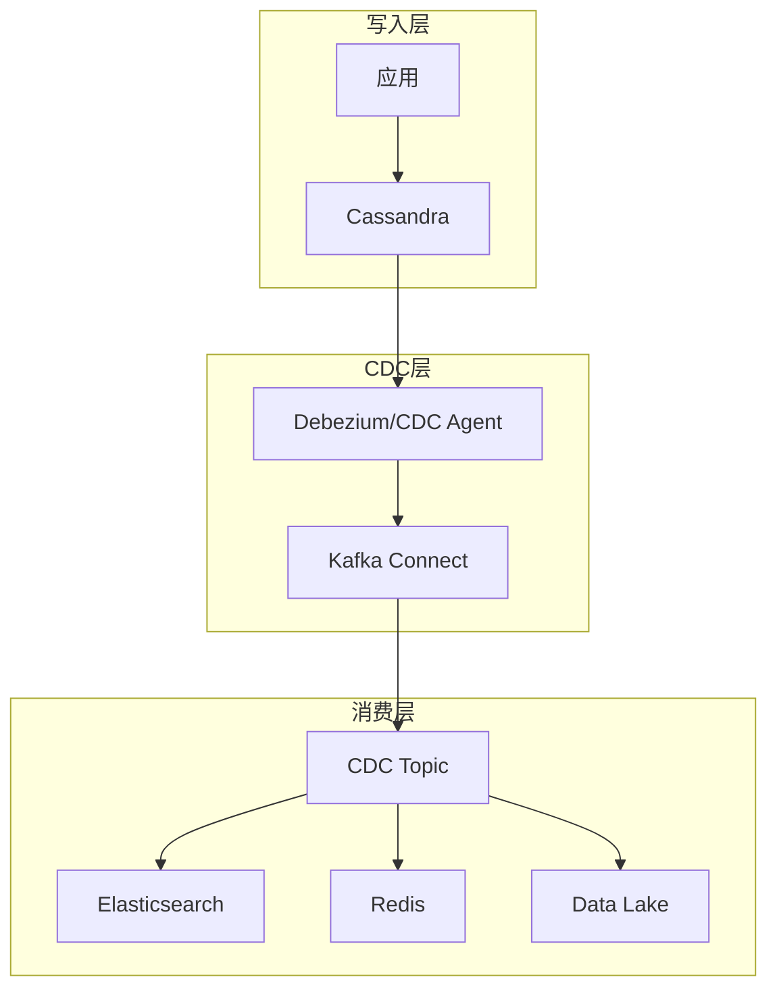
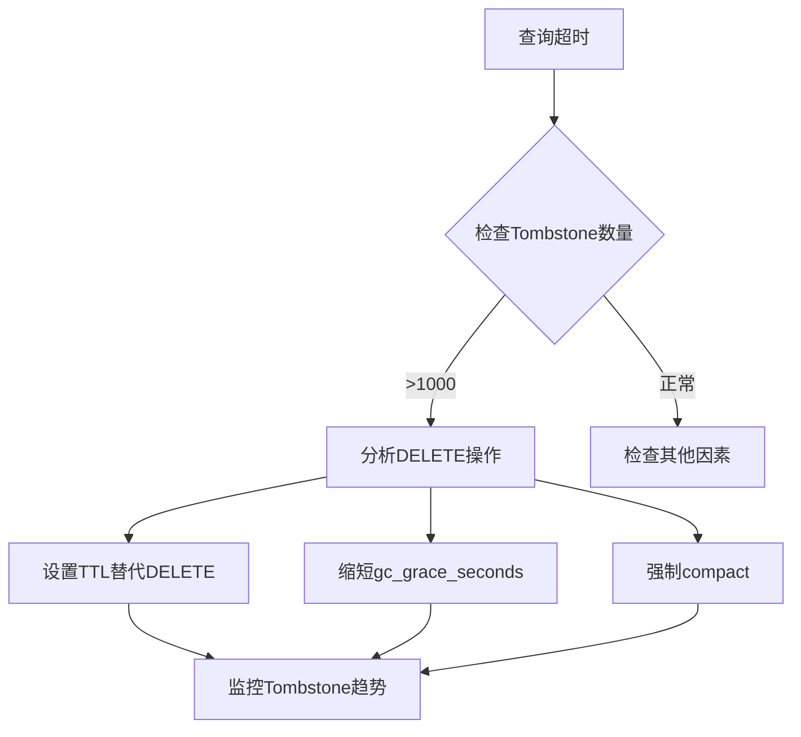
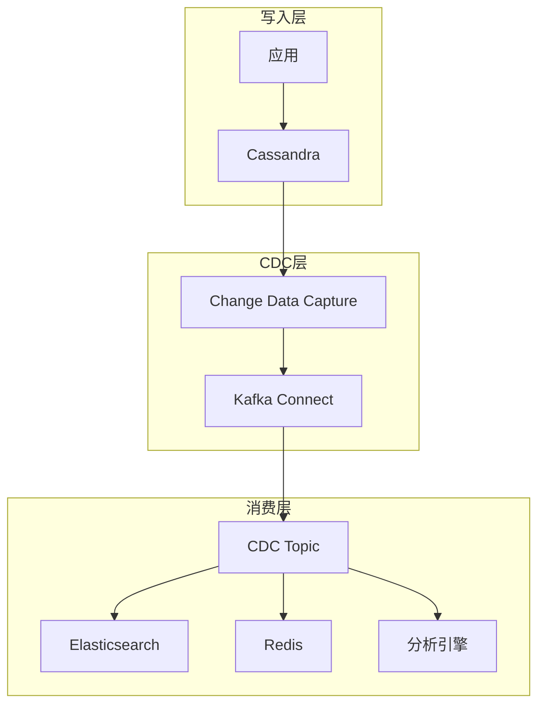
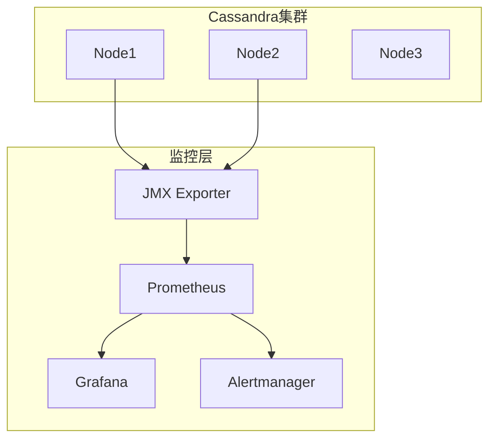
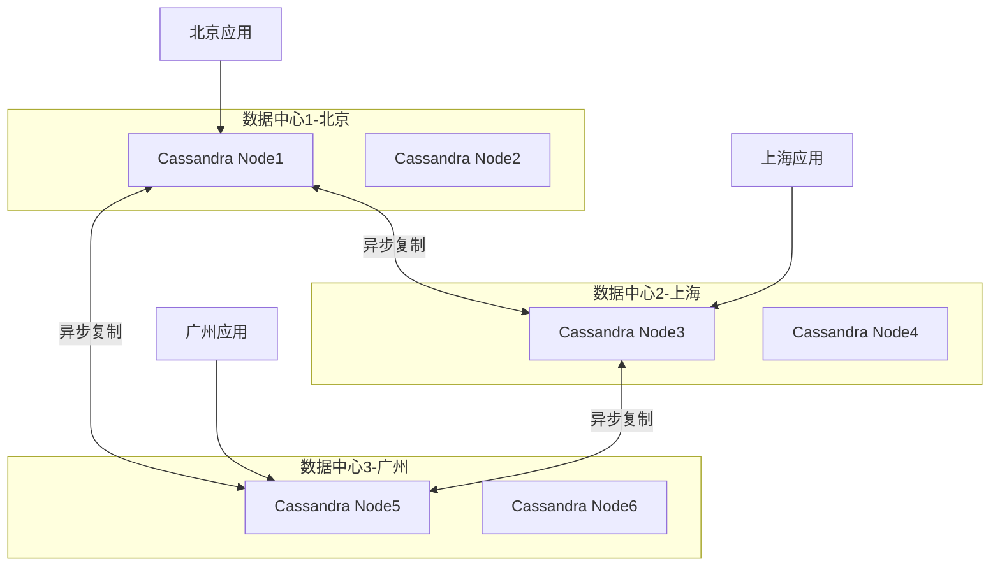
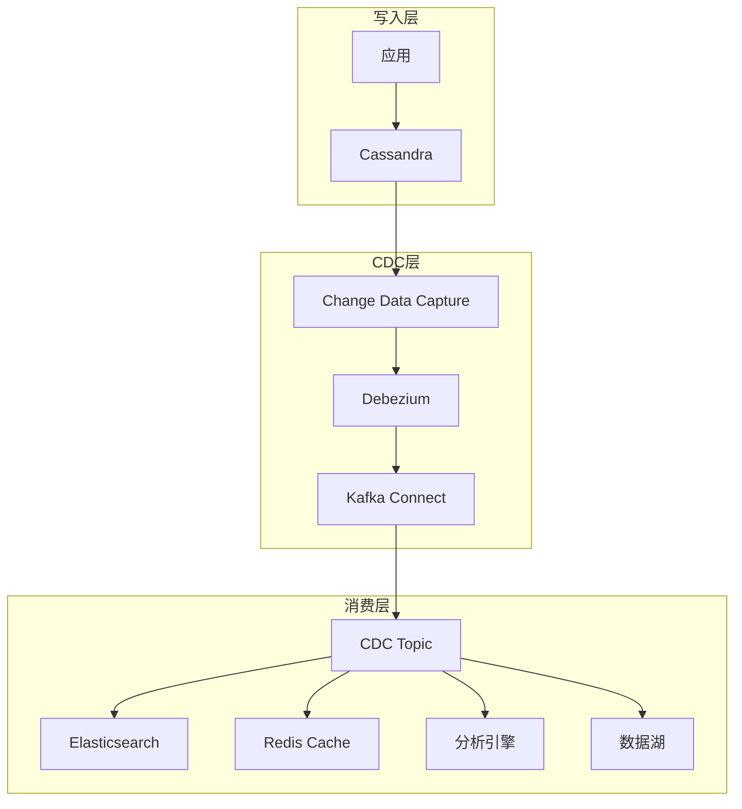
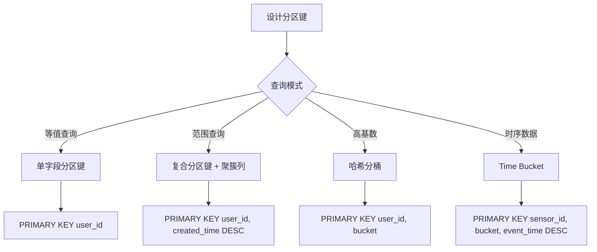
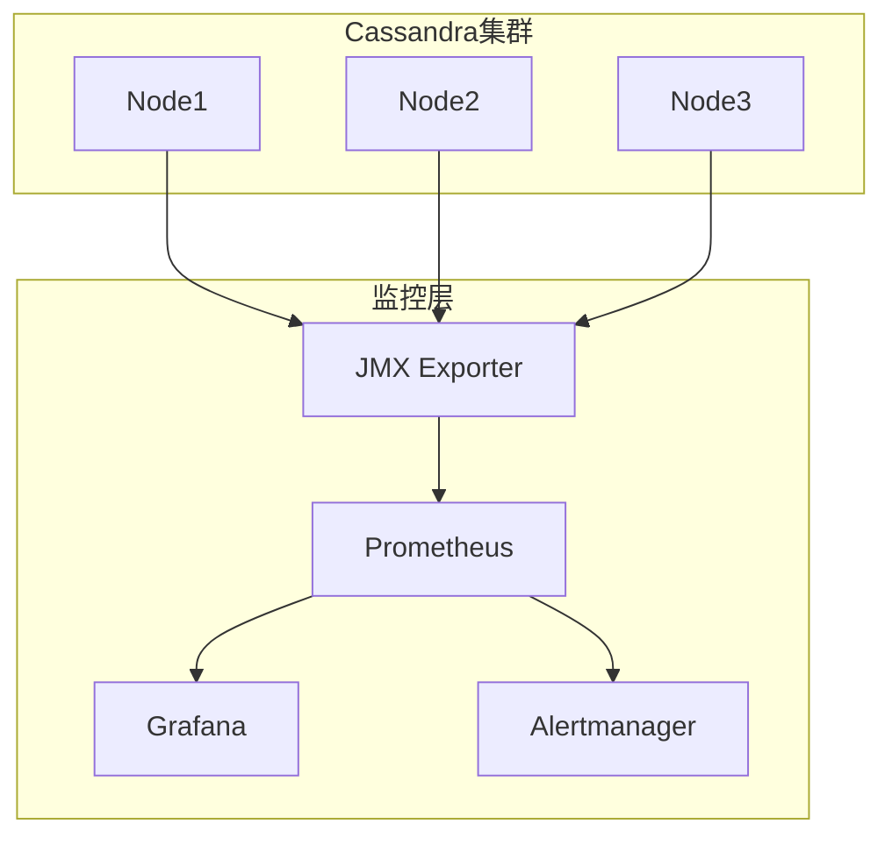

# Cassandra / ScyllaDB 深入（Compaction / Tombstone / 多DC复制 / 性能调优）

> Cassandra 是 **Dynamo 风格**的分布式宽列 NoSQL。本篇深入拆解：Compaction 策略选择、Tombstone 处理、多数据中心复制、性能调优、生产 Checklist。

---

## 一、核心原理

### 1.1 Dynamo 架构

```
P2P 环状无主节点，任意节点可读写（可调一致性）

写入流程：
  Client → 任意节点 → Gossip 发现副本 → 复制到 N 副本
  一致性级别决定需要多少副本确认

读取流程：
  Client → 任意节点 → 读取一致性级别决定读几个副本
  → 合并结果（反熵/读修复修复不一致）
```

### 1.2 数据模型

```
Keyspace(库) → Table(表) → Row(行)
  Partition Key(分区键): 决定数据存哪节点（哈希分布）
  Clustering Key(聚簇键): 行内排序

查询模型受限：
  必须按 Partition Key 查（单分区/等值）
  支持分区内范围查询
  不能随意二级索引/全表扫描
```

### 1.3 一致性级别

| 级别 | 写 | 读 | 一致性 |
|------|----|----|--------|
| ANY | 1 副本（含 Hint） | — | 最低 |
| ONE | 1 副本确认 | 1 副本返回 | 弱 |
| TWO | 2 副本确认 | — | 中 |
| QUORUM | ⌈N/2⌉+1 副本确认 | ⌈N/2⌉+1 副本返回 | 强 |
| ALL | 所有副本确认 | 所有副本返回 | 最强 |

> **读写一致公式**：W + R > N → 读写有交集 → 强一致

---

## 二、Compaction 策略（深入）

### 2.1 为什么需要 Compaction

```
SSTable 只追加不修改 → 同一个 key 可能出现在多个 SSTable
Compaction = 合并多个 SSTable → 去重/删除过期数据/Tombstone 清理

写放大 = Compaction 反复重写数据
空间放大 = 未合并的 SSTable 占用额外空间
```

### 2.2 三种策略

| 策略 | 原理 | 适用 |
|------|------|------|
| SizeTiered | 按大小合并（小文件合并成大文件） | 写密集、时序数据 |
| Leveled | 每层大小固定，合并保证层内无重叠 | 读密集、低空间放大 |
| TimeWindow | 按时间窗口合并（如每小时/每天） | **时序数据首选** |

### 2.3 选择指南

```
IoT 传感器/事件流 → TimeWindow（按时间窗口合并，写放大最低）
读多写少 → Leveled（空间放大低，读性能好）
写多读少 → SizeTiered（写放大低）
混合负载 → SizeTiered + 合理窗口

配置：
  compaction = {'class': 'TimeWindowCompactionStrategy',
                'compaction_window_size': 1,
                'compaction_window_unit': 'HOURS'}
```

---

## 三、Tombstone 处理

### 3.1 Tombstone 是什么

```
Cassandra 不支持物理删除（SSTable 只追加）
删除 = 写入一个 Tombstone 标记
Compaction 时清理 Tombstone + 被标记的数据

Tombstone 生命周期：
  1. 写入 Tombstone（标记删除）
  2. 传播到所有副本（gossip）
  3. GC Grace Seconds（默认 10 天）后清理
  4. Compaction 时物理删除
```

### 3.2 Tombstone 问题

```
问题：
  大量 Tombstone → 查询时扫描大量已删除数据 → 超时/OOM
  GC Grace 期内 Tombstone 未清理 → 数据"复活"（最坏情况）

常见坑：
  全表删除 → 大量 Tombstone → 查询超时
  Tombstone 超过阈值（默认 1000）→ 抛 Tombstone 异常
```

### 3.3 解决方案

| 方案 | 说明 |
|------|------|
| 调整 GC Grace | 缩短 GC Grace Seconds（如 1 天），但影响反熵修复窗口 |
| TTL | 设置 TTL 自动过期，避免手动删除 |
| 分区设计 | 避免大分区（减少 Tombstone 数量） |
| 后台清理 | `nodetool compact` 强制触发 Compaction |

---

## 四、多数据中心复制

### 4.1 架构

```
DC1（数据中心1）+ DC2（数据中心2）
  → 数据写入任意 DC → 异步复制到另一个 DC
  → 本地 QUORUM 优先（低延迟）
  → 跨 DC 异步（最终一致）

NetworkTopologyStrategy：
  定义每个 DC 的复制因子
  本地 DC 同步，跨 DC 异步

CREATE KEYSPACE mykeyspace
WITH replication = {
  'class': 'NetworkTopologyStrategy',
  'DC1': 3,
  'DC2': 3
};
```

### 4.2 多 DC 最佳实践

| 实践 | 说明 |
|------|------|
| 本地优先 | 查询走本地 DC（低延迟） |
| 跨 DC 异步 | 复制延迟可接受（秒级） |
| DC 故障 | 单 DC 挂了不影响另一个 DC |
| 数据本地化 | 按 DC 隔离数据（如按地域） |
| 负载均衡 | 读写均匀分布到多个 DC |

---

## 五、性能调优

### 5.1 写入优化

| 优化 | 说明 |
|------|------|
| 批量写 | 同一 Partition Key 的数据批量写（原子性） |
| 减少 Tombstone | 避免全表删除，用 TTL |
| 降低一致性 | 写 ONE（非 QUORUM） |
| 增加 Commit Log 缓冲 | commitlog_sync = batch（性能最好） |

### 5.2 读取优化

| 优化 | 说明 |
|------|------|
| 限制返回列 | SELECT 指定列，避免 SELECT * |
| 分区裁剪 | WHERE 带 Partition Key |
| 限制结果集 | LIMIT 限制返回行数 |
| 布隆过滤器 | 布隆过滤器拦截不存在的分区 |

### 5.3 JVM 调优

```
堆内存：
  -Xms = -Xmx（避免动态调整）
  推荐：数据量 10%~20%（如 16GB 数据 → 2~4GB 堆）
  堆外内存：offheapMemAllocatorTotal（索引缓存）

GC：
  G1GC（推荐）：-XX:+UseG1GC -XX:MaxGCPauseMillis=200
  避免 CMS（已废弃）

JVM 参数：
  -XX:MaxTenuringThreshold=0（减少晋升延迟）
  -XX:ParallelGCThreads=8（并行 GC 线程）
```

---

## 六、生产 Checklist

| 检查项 | 说明 |
|--------|------|
| 副本数 | 生产 ≥ 3（跨 3 个可用区） |
| 一致性级别 | 写 QUORUM + 读 ONE（或写 ONE + 读 QUORUM） |
| Compaction | 时序数据选 TimeWindow |
| Tombstone | 监控 Tombstone 数量，设置告警 |
| GC Grace | 根据网络延迟调整（跨 DC 适当延长） |
| 分区大小 | 单分区 < 100MB（避免大分区） |
| 节点监控 | CPU/内存/磁盘/延迟 |
| 备份 | 定期 Snapshot 备份 |

---

## Cassandra Consistent Hashing（VNode）

### 一致性哈希与虚拟节点

```
Cassandra 一致性哈希环：
  Token Range: 0 ──────────── 2^127
  │                              │
  Node A (token=100)           Node B (token=500)
  │                              │
  └─────── Node C (token=800) ──┘

虚拟节点（VNode）：
  每个物理节点 → 多个 Token（VNode）
  默认 256 VNode/节点
  
  优势：
  ├── 数据均匀分布（避免热点）
  ├── 增删节点影响范围小
  └── 异构硬件可分配不同 VNode 数

配置：
  cassandra.yaml:
    num_tokens: 256           # 每节点 VNode 数
    allocate_tokens_for_local_replication_factor: 3

扩容流程：
  1. 新节点加入集群
  2. Gossip 协议传播新节点信息
  3. 新节点从相邻节点接收数据（Streaming）
  4. 旧节点删除已迁移数据
  5. 集群达到新平衡（无需重启）
```

## Cassandra Read Path

### 读取路径详解

```
Client 读取流程：
  1. Coordinator 收到读请求
  2. 根据 Partition Key 计算 Token
  3. 路由到副本节点（按一致性级别）
  
  读一致性级别 = 读几个副本
    ONE: 读 1 个副本（最快，可能脏读）
    QUORUM: 读 ⌈N/2⌉+1 个副本（强一致）
    ALL: 读所有副本（最一致，最慢）
  
  4. 合并多个副本结果（反熵修复）
  5. 返回最新数据

反熵修复（Read Repair）：
  读取时发现副本数据不一致
  → 自动修复（将最新数据写回过期副本）
  
  配置：
    read_repair_chance: 0.1          # 读修复概率
    dclocal_read_repair_chance: 0.1  # 本地 DC 读修复
```

### Bloom Filter 加速

```
Bloom Filter = 快速判断分区是否存在

原理：
  写入时：每个 SSTable 的分区键 → N 个哈希函数 → 标记位数组
  读取时：检查位数组 → 全为 1（可能存在）→ 有 0（一定不存在）

作用：
  避免不存在的分区键扫描所有 SSTable
  误判率默认 10%（内存约 10 bytes/key）

配置：
  bloom_filter_fp_chance: 0.1  # 误判率（越低内存越大）
```

## Cassandra Write Path

### 写入路径详解

```
Client 写入流程：
  1. Coordinator 收到写请求
  2. 根据 Partition Key 计算 Token
  3. 路由到副本节点

  写一致性级别 = 需要几个副本确认
    ONE: 1 个副本确认（最快）
    QUORUM: ⌈N/2⌉+1 个副本确认
    ALL: 所有副本确认
  
  4. 每个副本节点：
     ├── 写 Commit Log（WAL，保证持久化）
     ├── 写 Memtable（内存缓存，写入最快）
     └── 返回确认

  5. Memtable 满 → Flush 到 SSTable（磁盘）
  6. 异步 Compaction 合并 SSTable

Commit Log 配置：
  commitlog_sync: batch          # 每次写入同步
  commitlog_sync_batch_window_in_ms: 2  # 批量同步窗口
  commitlog_total_space_in_mb: 8192      # Commit Log 总大小
```

## SSTable Structure

```
SSTable（Sorted String Table）= Cassandra 的磁盘存储格式

结构：
  Data.db     数据文件（实际数据）
  Index.db    分区索引（Partition Key → 数据位置）
  Filter.db   布隆过滤器
  Statistics.db 统计信息
  Compression.db 压缩信息

特点：
  只追加不修改（Immutable）
  按 Partition Key 排序
  压缩存储（LZ4/Snappy/Zstd）
  
读取流程：
  1. 检查 Bloom Filter → 可能存在
  2. 查 Index.db → 定位数据位置
  3. 读 Data.db → 获取数据
  4. 合并多个 SSTable 结果
```

## Compaction Strategies Deep

### STCS（SizeTiered Compaction Strategy）

```
STCS = 按大小合并 SSTable

原理：
  收集大小相近的 SSTable（4 个以上）
  合并成更大的 SSTable
  
写放大: 低（合并次数少）
空间放大: 高（合并期间占用额外空间）
读放大: 高（可能存在重叠数据）

适用场景：
  写密集（日志/事件流）
  时序数据（数据按时间追加）
  数据很少更新

配置：
  compaction = {'class': 'SizeTieredCompactionStrategy',
                'min_threshold': 4,
                'max_threshold': 32}
```

### LCS（Leveled Compaction Strategy）

```
LCS = 分层合并，保证层内无重叠

原理：
  Level 0: SSTable 可重叠（最大 4 个）
  Level 1: 大小 = 10MB，SSTable 无重叠
  Level 2: 大小 = 100MB，SSTable 无重叠
  Level 3: 大小 = 1GB，SSTable 无重叠
  
  每层合并：选一个 SSTable + 重叠的 SSTable 合并

写放大: 高（频繁合并）
空间放大: 低（层内无重叠）
读放大: 低（每层最多一个 SSTable 包含目标 Key）

适用场景：
  读密集
  数据频繁更新
  对空间敏感

配置：
  compaction = {'class': 'LeveledCompactionStrategy',
                'sstable_size_in_mb': 160}
```

### TWCS（TimeWindowCompaction Strategy）

```
TWCS = 按时间窗口合并

原理：
  按时间窗口分组（如 1 小时）
  窗口内数据 Flush 后不再合并
  只合并不同窗口的数据（如果时间跨度小）
  
写放大: 最低（几乎不合并）
空间放大: 中（窗口内可能有重叠）
读放大: 中（需要读多个窗口）

适用场景：
  时序数据（IoT/监控日志）
  数据按时间追加且很少更新
  TTL 自动过期

配置：
  compaction = {'class': 'TimeWindowCompactionStrategy',
                'compaction_window_size': 1,
                'compaction_window_unit': 'HOURS',
                'unsafe_aggressive_sstable_expiration': true}
```

## Secondary Indexes

```
Cassandra 二级索引：
  在非分区键字段上建索引
  
CREATE INDEX idx_status ON orders(status);

限制：
  索引存储在本地（每个节点只索引本地数据）
  高基数字段索引效率低（如 user_id）
  跨分区查询性能差（需要扫描所有节点）

最佳实践：
  用 SAI（Storage Attached Index）替代传统索引
  SAI 支持列式存储 + 更好的查询性能

CREATE CUSTOM INDEX idx_status ON orders(status)
USING 'org.apache.cassandra.index.sai.StorageAttachedIndex';
```

## Materialized Views

```
Materialized Views = 自动维护的查询视图

CREATE MATERIALIZED VIEW orders_by_status
AS SELECT order_id, user_id, status, amount
FROM orders
WHERE status IS NOT NULL AND order_id IS NOT NULL
PRIMARY KEY (status, order_id);

原理：
  写入 orders 表 → 自动更新 orders_by_status 视图
  查询 WHERE status = 'PAID' → 走视图（高效）

注意：
  视图更新是异步的（可能短暂不一致）
  不支持 UPDATE/DELETE（需通过原表操作）
  大量视图会影响写性能
```

## Cassandra Driver Pooling

```java
// Java Driver 配置
CqlSession session = CqlSession.builder()
    .addContactPoint(new InetSocketAddress("10.0.0.1", 9042))
    .withLocalDatacenter("dc1")
    .withConfigLoader(DriverConfigLoader.fromString(
        "advanced.connection.pool.local.size = 10\n" +
        "advanced.connection.pool.remote.size = 5\n" +
        "advanced.connection.max-requests-per-connection = 1024\n" +
        "advanced.connection.connect-timeout = 5s\n" +
        "advanced.reconnect-on-init = true"
    ))
    .build();

连接池策略：
  每个节点维护 N 个连接（local.size）
  每个连接最大请求数（max-requests-per-connection）
  超过限制 → 创建新连接
  空闲连接自动回收
```

## Cassandra vs HBase vs ScyllaDB

| 维度 | Cassandra | HBase | ScyllaDB |
|------|-----------|-------|----------|
| 架构 | 去中心化（P2P） | 主从（HMaster） | 去中心化（P2P） |
| 数据模型 | 宽列 | 宽列 | 宽列（CQL 兼容） |
| 一致性 | 可调（ONE/QUORUM） | 强一致 | 可调（CQL 兼容） |
| 写性能 | 极高（无锁追加） | 高（LSM-Tree） | 10x+ Cassandra |
| 读性能 | 中（需分区键） | 高（列族缓存） | 高（C++ 无 GC） |
| 扩展 | 线性扩展 | Region 拆分 | 线性扩展 |
| 运维 | 中（P2P 自愈） | 重（HDFS+ZK） | 更简单（C++） |
| 生态 | 成熟 | 大数据生态 | 兼容 Cassandra |
| 适用 | 时序/IoT/事件流 | Hadoop 生态 | 高性能 Cassandra 替代 |

## Cassandra in Time-Series

```
Cassandra + 时序数据：

数据模型设计：
  CREATE TABLE sensor_data (
      sensor_id UUID,
      event_time TIMESTAMP,
      temperature DOUBLE,
      humidity DOUBLE,
      PRIMARY KEY ((sensor_id), event_time)
  ) WITH CLUSTERING ORDER BY (event_time DESC)
    AND default_time_to_live = 7776000  -- 90 天 TTL
    AND compaction = {
      'class': 'TimeWindowCompactionStrategy',
      'compaction_window_size': 1,
      'compaction_window_unit': 'HOURS'
    };

查询模式：
  按 sensor_id + 时间范围查询（单分区范围查询）
  高效：只读一个分区的数据

写入优化：
  批量写同一 sensor_id（原子性）
  降低一致性（写 ONE）
  使用 TWCS（写放大最低）

TTL 自动过期：
  旧数据自动清理（无需手动删除）
  TWCS 优化过期数据的清理效率
```

## 六-2、Consistency Level 矩阵（读写一致性代价）

| 一致性级别 | 写确认数 | 读返回数 | 一致性 | 延迟 | 容错 |
|-----------|---------|---------|--------|------|------|
| ANY | 1（含 Hint） | — | 最弱 | 最低 | 最高 |
| ONE | 1 | 1 | 弱 | 低 | 高 |
| TWO | 2 | — | 中 | 中 | 中 |
| QUORUM | ⌈N/2⌉+1 | ⌈N/2⌉+1 | 强 | 较高 | 中 |
| ALL | N | N | 最强 | 最高 | 低 |
| LOCAL_QUORUM | 本地DC ⌈N/2⌉+1 | 本地DC ⌈N/2⌉+1 | 本地强 | 中 | 中 |

```
读写一致公式：W + R > N → 强一致

示例（RF=3）：
  W=QUORUM(2) + R=ONE(1) → 3 > 3? 否 → 弱一致
  W=QUORUM(2) + R=QUORUM(2) → 4 > 3? 是 → 强一致
  W=ONE(1) + R=QUORUM(2) → 3 > 3? 否 → 弱一致

生产建议：
  写多读少 → W=ONE + R=QUORUM
  读多写少 → W=QUORUM + R=ONE
  强一致 → W=QUORUM + R=QUORUM
```

## 六-3、Tombstone 堆积查询超时排查

```
Tombstone 堆积问题：
  大量删除 → 产生 Tombstone 标记 → 查询扫描大量 Tombstone → 超时

排查步骤：
  1. 检查查询日志：
     查找 "TombstoneAbortException" 或 "tombstone_error"

  2. 统计 Tombstone 数量：
     nodetool tablehistograms keyspace.table
     → 查看 tombstone_cells 计数

  3. 分析原因：
     - 大量 DELETE 操作未设 TTL
     - GC Grace Seconds 过长（默认 10 天）
     - Compaction 未及时清理

  4. 解决方案：
     - 设置 TTL 自动过期（避免手动删除）
     - 缩短 GC Grace Seconds（如 1 天）
     - 强制 Compact 清理
     - 调整 tombstone_failure_threshold（默认 1000）
```

## 六-4、Cassandra 权限控制（RBAC GRANT/REVOKE）

```sql
-- 创建角色
CREATE ROLE 'app_user' WITH PASSWORD = 'secret' AND LOGIN = true;

-- 授权
GRANT SELECT ON KEYSPACE shop TO 'app_user';
GRANT INSERT, UPDATE ON KEYSPACE shop TO 'app_writer';
GRANT ALL ON KEYSPACE shop TO 'admin';

-- 撤销权限
REVOKE INSERT ON KEYSPACE shop FROM 'app_writer';

-- 查看权限
LIST ALL PERMISSIONS OF 'app_user';

-- 角色继承
GRANT 'app_user' TO 'app_writer';

-- 认证配置
authenticator: PasswordAuthenticator
authorizer: CassandraAuthorizer
role_manager: CassandraRoleManager
```

## 六-5、Compaction 策略选择决策树

```
选择 Compaction 策略：

数据是时序数据？ → TWCS（TimeWindowCompactionStrategy）
  ├── 按小时/天/月分窗口
  ├── 写放大最低
  └── TTL 自动过期

读多写少？ → LCS（LeveledCompactionStrategy）
  ├── 层内无重叠，读性能好
  ├── 空间放大低
  └── 写放大较高

写多读少？ → STCS（SizeTieredCompactionStrategy）
  ├── 按大小合并
  ├── 写放大低
  └── 空间放大高

混合负载？ → STCS + 合理窗口
  └── 或按表粒度选择不同策略

配置示例：
  compaction = {'class': 'TimeWindowCompactionStrategy',
                'compaction_window_size': 1,
                'compaction_window_unit': 'HOURS'}
```

## 六-6、Cassandra 作为时序存储的设计模式（Time Bucket）

```
Time Bucket 模式：

数据模型：
  CREATE TABLE sensor_readings (
      sensor_id UUID,
      bucket TIMESTAMP,       -- 时间桶（如每小时）
      event_time TIMESTAMP,
      value DOUBLE,
      PRIMARY KEY ((sensor_id, bucket), event_time)
  ) WITH CLUSTERING ORDER BY (event_time DESC);

查询模式：
  按 sensor_id + 时间桶查询 → 单分区高效查询
  不跨桶查询 → 避免大分区

写入优化：
  批量写同一 sensor_id + bucket（原子性）
  降低一致性（写 ONE）
  TWCS 合并（窗口内不合并，写放大最低）

生命周期：
  TTL 自动过期（旧桶自动清理）
  TWCS 优化过期数据的清理效率
```

## 六-7、cqlsh COPY 命令批量导入性能优化

```bash
# 基本 COPY
COPY keyspace.table (col1, col2, col3) FROM 'data.csv';

# 性能优化选项
COPY keyspace.table FROM 'data.csv'
  WITH
    HEADER = true
    DELIMITER = ','
    MAXBATCHSIZE = 20      -- 批量大小（默认 20）
    INGESTRATE = 10000     -- 每秒导入行数（限流）
    MAXBATCHSIZE = 100     -- 增大批量大小
    CLIENT_ENCODING = 'UTF8'
    NULL = 'NULL'
    SKIPROWS = 0
    NUMPROCESSES = 4       -- 并行进程数（默认 1）

优化建议：
  1. 提前创建索引和表结构
  2. 使用 BATCH 写入同一分区
  3. 调大 MAXBATCHSIZE（100~1000）
  4. 调整 INGESTRATE（避免写爆）
  5. 先导入数据后建索引（快 5~10 倍）
  6. 单分区批量写入（原子性 + 性能）
```

## 七、Consistency Level 矩阵与读写一致性代价计算

### 7.1 一致性级别详解

| 一致性级别 | 写确认数 | 读返回数 | 一致性 | 延迟 | 容错 |
|-----------|---------|---------|--------|------|------|
| ANY | 1（含 Hint） | — | 最弱 | 最低 | 最高 |
| ONE | 1 | 1 | 弱 | 低 | 高 |
| TWO | 2 | — | 中 | 中 | 中 |
| QUORUM | ⌈N/2⌉+1 | ⌈N/2⌉+1 | 强 | 较高 | 中 |
| ALL | N | N | 最强 | 最高 | 低 |
| LOCAL_QUORUM | 本地DC ⌈N/2⌉+1 | 本地DC ⌈N/2⌉+1 | 本地强 | 中 | 中 |

### 7.2 读写一致公式

```
读写一致公式：W + R > N → 强一致

示例（RF=3）：
  W=QUORUM(2) + R=ONE(1) → 2+1=3 = 3? → 弱一致
  W=QUORUM(2) + R=QUORUM(2) → 2+2=4 > 3? → 强一致
  W=ONE(1) + R=QUORUM(2) → 1+2=3 = 3? → 弱一致
  W=ALL(3) + R=ONE(1) → 3+1=4 > 3? → 强一致

生产建议：
  写多读少 → W=ONE + R=QUORUM
  读多写少 → W=QUORUM + R=ONE
  强一致 → W=QUORUM + R=QUORUM
  低延迟 → W=ONE + R=ONE（最终一致）
```

## 八、Tombstone 堆积导致查询超时排查

### 8.1 Tombstone 问题根因

```
Tombstone 堆积问题：
  大量删除 → 产生 Tombstone 标记 → 查询扫描大量 Tombstone → 超时

常见原因：
  1. 大量 DELETE 操作未设 TTL
  2. GC Grace Seconds 过长（默认 10 天）
  3. Compaction 未及时清理
  4. 全表删除操作
```

### 8.2 排查步骤

```
排查四步法：
  1. 检查查询日志
     查找 "TombstoneAbortException" 或 "tombstone_error"

  2. 统计 Tombstone 数量
     nodetool tablehistograms keyspace.table
     → 查看 tombstone_cells 计数

  3. 分析原因
     - 哪些表有大量 DELETE 操作？
     - GC Grace Seconds 是否过长？
     - Compaction 策略是否合适？

  4. 解决方案
     - 设置 TTL 自动过期（避免手动删除）
     - 缩短 GC Grace Seconds（如 1 天）
     - 强制 Compact 清理
     - 调整 tombstone_failure_threshold（默认 1000）
```

### 8.3 预防措施

| 措施 | 说明 |
|------|------|
| TTL 替代 DELETE | 数据自动过期，不产生 Tombstone |
| 分区设计 | 避免大分区（减少 Tombstone 数量） |
| GC Grace 调优 | 跨 DC 适当延长，同 DC 可缩短 |
| 监控告警 | tombstone_cells > 1000 告警 |

## 九、Cassandra 权限控制（RBAC GRANT/REVOKE）

```sql
-- 创建角色
CREATE ROLE 'app_user' WITH PASSWORD = 'secret' AND LOGIN = true;

-- 授权
GRANT SELECT ON KEYSPACE shop TO 'app_user';
GRANT INSERT, UPDATE ON KEYSPACE shop TO 'app_writer';
GRANT ALL ON KEYSPACE shop TO 'admin';

-- 撤销权限
REVOKE INSERT ON KEYSPACE shop FROM 'app_writer';

-- 查看权限
LIST ALL PERMISSIONS OF 'app_user';

-- 角色继承
GRANT 'app_user' TO 'app_writer';

-- 认证配置（cassandra.yaml）
authenticator: PasswordAuthenticator
authorizer: CassandraAuthorizer
role_manager: CassandraRoleManager
```

## 十、Compaction 策略选择决策树

```
选择 Compaction 策略：

数据是时序数据？ → TWCS（TimeWindowCompactionStrategy）
  ├── 按小时/天/月分窗口
  ├── 写放大最低
  └── TTL 自动过期

读多写少？ → LCS（LeveledCompactionStrategy）
  ├── 层内无重叠，读性能好
  ├── 空间放大低
  └── 写放大较高

写多读少？ → STCS（SizeTieredCompactionStrategy）
  ├── 按大小合并
  ├── 写放大低
  └── 空间放大高

混合负载？ → STCS + 合理窗口
  └── 或按表粒度选择不同策略

配置示例：
  compaction = {'class': 'TimeWindowCompactionStrategy',
                'compaction_window_size': 1,
                'compaction_window_unit': 'HOURS'}
```

## 十一、Cassandra 作为时序存储的设计模式

### Time Bucket 模式

```sql
CREATE TABLE sensor_readings (
    sensor_id UUID,
    bucket TIMESTAMP,       -- 时间桶（如每小时）
    event_time TIMESTAMP,
    value DOUBLE,
    PRIMARY KEY ((sensor_id, bucket), event_time)
) WITH CLUSTERING ORDER BY (event_time DESC)
  AND default_time_to_live = 7776000  -- 90 天 TTL
  AND compaction = {
    'class': 'TimeWindowCompactionStrategy',
    'compaction_window_size': 1,
    'compaction_window_unit': 'HOURS'
  };
```

```
查询模式：
  按 sensor_id + 时间桶查询 → 单分区高效查询
  不跨桶查询 → 避免大分区

写入优化：
  批量写同一 sensor_id + bucket（原子性）
  降低一致性（写 ONE）
  TWCS 合并（窗口内不合并，写放大最低）

生命周期：
  TTL 自动过期（旧桶自动清理）
  TWCS 优化过期数据的清理效率
```

## 十二、CQL COPY 命令批量导入性能优化

```bash
# 基本 COPY
COPY keyspace.table (col1, col2, col3) FROM 'data.csv';

# 性能优化选项
COPY keyspace.table FROM 'data.csv'
  WITH
    HEADER = true
    DELIMITER = ','
    MAXBATCHSIZE = 100     -- 增大批量大小（默认 20）
    INGESTRATE = 10000     -- 每秒导入行数（限流）
    CLIENT_ENCODING = 'UTF8'
    NUMPROCESSES = 4       -- 并行进程数（默认 1）

优化建议：
  1. 提前创建索引和表结构
  2. 使用 BATCH 写入同一分区
  3. 调大 MAXBATCHSIZE（100~1000）
  4. 先导入数据后建索引（快 5~10 倍）
  5. 单分区批量写入（原子性 + 性能）
```

## 十三、Cassandra 分区键设计与性能调优

### 分区键设计原则

| 原则 | 说明 | 示例 |
|------|------|------|
| 高基数 | 分区键值应有足够多的唯一值 | user_id（好），status（差） |
| 均匀分布 | 避免热点分区 | 使用 Murmur3Hash 分布 |
| 查询友好 | 按查询模式设计分区键 | 时间序列：device_id + date |
| 分区大小 | 单分区 < 100MB | 大分区影响读写性能 |

### 性能调优参数

```
Cassandra 性能调优关键参数：

  读优化：
    - consistency_level: ONE（降低一致性换取性能）
    - speculative_retry: 99p（99百分位重试）
    - row_cache_size: 100MB（行缓存）

  写优化：
    - consistency_level: ONE
    - commitlog_sync: batch（批量提交）
    - memtable_heap_space_in_mb: 2048

  压缩优化：
    - compaction_strategy: TimeWindowCompactionStrategy
    - compaction_window_size: 1（天）
    - sstable_compression: LZ4Compressor
```

### Cassandra 多数据中心配置

```
多数据中心架构：
  DC1（北京） → DC2（上海） → DC3（广州）
  本地一致性：LOCAL_QUORUM（本地仲裁读写）
  跨数据中心复制：ASYNC（异步复制）
  读写路径：
    写：客户端 → 本地 DC（同步写入多数节点）→ 异步复制到其他 DC
    读：客户端 → 本地 DC（读取本地数据）→ 本地仲裁

  配置示例：
    keyspace replication = {
      'class': 'NetworkTopologyStrategy',
      'DC1': 3,
      'DC2': 3,
      'DC3': 3
    }
```

### Cassandra 监控与告警

| 指标 | 告警阈值 | 说明 |
|------|----------|------|
| Read Latency P99 | > 100ms | 读延迟过高 |
| Write Latency P99 | > 50ms | 写延迟过高 |
| Pending Compactions | > 10 | 压缩任务堆积 |
| Tombstone Warning | > 1000 | 墓碑过多 |
| Dropped Messages | > 0 | 消息丢失 |
| ThreadPool Blocked | > 0 | 线程池阻塞 |

### Cassandra 与 Kafka 集成模式

| 模式 | 架构 | 适用场景 |
|------|------|----------|
| Kafka → Cassandra | Kafka Connect Sink | 数据导入 |
| Cassandra → Kafka | CDC（Change Data Capture） | 数据导出 |
| 双向同步 | CDC + Sink | 数据迁移 |
| 事件溯源 | Kafka + Cassandra | 事件存储 |

## CDC与Kafka集成方案

### CDC集成架构



### Cassandra Kafka Connector配置

```json
{
  "name": "cassandra-source",
  "config": {
    "connector.class": "io.confluent.connect.cassandra.CassandraSourceConnector",
    "tasks.max": "3",
    "keyspace": "my_keyspace",
    "table": "user_events",
    "topic.prefix": "cdc_",
    "consistency.level": "LOCAL_QUORUM",
    "poll.interval.ms": "1000",
    "cassandra.contact.points": "cass1,cass2,cass3",
    "cassandra.port": "9042",
    "cassandra.ssl.enabled": "true",
    "cassandra.protocol.version": "4"
  }
}
```

| CDC方案 | 实时性 | 一致性 | 复杂度 | 适用场景 |
|---------|--------|--------|--------|----------|
| Kafka Connect Source | 秒级 | 最终一致 | 低 | 标准同步 |
| Debezium | 秒级 | 最终一致 | 中 | 多源汇聚 |
| 自定义CDC | 秒级 | 可控 | 高 | 特殊需求 |
| 定时全量 | 分钟级 | 强一致 | 低 | 离线分析 |

## 分区键设计与PACSCAL原则

### PACSCAL设计框架

```
PACSCAL = Partition + Access pattern + Clustering + Sort + Consistency + Application

设计步骤：
  1. Partition Key：决定数据分布（哈希/复合）
  2. Access Pattern：明确查询模式（等值/范围）
  3. Clustering Key：分区内排序（ASC/DESC）
  4. Sort：排序方向与查询匹配
  5. Consistency：一致性级别选择
  6. Application：业务约束（TTL/计数器）
```

| 设计原则 | 说明 | 示例 |
|----------|------|------|
| 高基数 | 分区键唯一值足够多 | user_id(好), status(差) |
| 均匀分布 | 避免热点分区 | Murmur3Hash分布 |
| 查询友好 | 按查询模式设计 | 时间序列: device_id+date |
| 分区大小 | 单分区<100MB | 拆分大分区 |

```sql
-- 错误：单调递增分区键（热点）
CREATE TABLE bad_design (
    user_id UUID PRIMARY KEY,
    created_time TIMESTAMP
);

-- 正确：复合分区键（分散）
CREATE TABLE good_design (
    user_id UUID,
    bucket INT,
    created_time TIMESTAMP,
    PRIMARY KEY ((user_id, bucket), created_time DESC)
);
-- bucket = user_id.hashCode() % 16

-- Time Bucket模式（时序推荐）
CREATE TABLE sensor_readings (
    sensor_id UUID,
    bucket TIMESTAMP,
    event_time TIMESTAMP,
    value DOUBLE,
    PRIMARY KEY ((sensor_id, bucket), event_time DESC)
) WITH default_time_to_live = 7776000  -- 90天TTL
  AND compaction = {
    'class': 'TimeWindowCompactionStrategy',
    'compaction_window_size': 1,
    'compaction_window_unit': 'HOURS'
  };
```

## TTL与墓碑机制深入

### gc_grace_seconds配置

```
gc_grace_seconds = Tombstone在被清理前保留的时间窗口

场景配置：
  生产环境：默认10天（864000秒）
  低延迟场景：3-5天（确保复制延迟<1天）
  开发环境：1天（便于测试）
  跨DC场景：适当延长（考虑网络延迟）

TTL自动过期：
  INSERT INTO data (k, v) VALUES ('key', 'value') USING TTL 3600;
  -- 1小时后自动删除，不产生Tombstone

墓碑处理：
  tombstone_warning_threshold: 1000
  tombstone_failure_threshold: 100000
  gc_grace_seconds: 864000 (10天)
```

### 墓碑问题排查流程



## 监控与运维

### nodetool运维命令

```bash
# 集群状态
nodetool status

# 线程池状态
nodetool tpstats

# Compaction状态
nodetool compactionstats

# 修复数据
nodetool repair keyspace.table

# 清理数据
nodetool cleanup keyspace

# 压缩表
nodetool compact keyspace.table

# 截断表（危险）
nodetool truncate keyspace.table

# 查看表 histograms
nodetool tablehistories keyspace.table
```

| 监控指标 | 告警阈值 | 说明 |
|----------|----------|------|
| Read Latency P99 | > 100ms | 读延迟过高 |
| Write Latency P99 | > 50ms | 写延迟过高 |
| Pending Compactions | > 10 | 压缩任务堆积 |
| Tombstone数量 | > 1000 | 墓碑过多 |
| Dropped Messages | > 0 | 消息丢失 |
| ThreadPool Blocked | > 0 | 线程池阻塞 |

## 多数据中心NetworkTopologyStrategy

### 一致性级别选择矩阵

| 场景 | 写一致性 | 读一致性 | 说明 |
|------|----------|----------|------|
| 写多读少 | ONE | QUORUM | 读保证最新 |
| 读多写少 | QUORUM | ONE | 写保证持久 |
| 强一致 | QUORUM | QUORUM | W+R>N |
| 低延迟 | ONE | ONE | 最终一致 |
| 灾备 | LOCAL_QUORUM | LOCAL_QUORUM | 本地DC优先 |

```sql
-- 多DC配置
CREATE KEYSPACE my_keyspace WITH replication = {
    'class': 'NetworkTopologyStrategy',
    'dc_bj': 3,
    'dc_sh': 3,
    'dc_gz': 3
};

-- 本地优先查询
CONSISTENCY LOCAL_QUORUM;
SELECT * FROM users WHERE user_id = 123;
```

## 性能调优

### 读写一致性调优

```
写优化：
  1. 同一分区内批量写（原子性+性能）
  2. 降低一致性：写ONE（非QUORUM）
  3. 增加Commit Log缓冲：commitlog_sync=batch
  4. 使用TWCS（写放大最低）

读优化：
  1. SELECT指定列，避免SELECT *
  2. WHERE带Partition Key（分区裁剪）
  3. LIMIT限制返回行数
  4. 布隆过滤器拦截不存在分区

压缩策略选择：
  STCS：写密集（按大小合并，写放大低）
  LCS：读密集（层内无重叠，读性能好）
  TWCS：时序数据（按时间窗口，写放大最低）
```

### 缓存与压缩配置

```
缓存配置：
  key_cache_size: 5% 堆内存（热键缓存）
  row_cache_size: 0（禁用，推荐用外部缓存）
  counter_cache_size: 5% 堆内存

压缩配置：
  sstable_compression: LZ4Compressor（默认）
  compaction_throughput_mb_per_sec: 16~64
  compaction_large_partition_warning_threshold_mb: 100
```

## Cassandra vs HBase vs MongoDB对比

| 维度 | Cassandra | HBase | MongoDB |
|------|-----------|-------|---------|
| 数据模型 | 宽列 | 宽列 | 文档 |
| 一致性 | 可调 | 强一致 | 最终一致 |
| 扩展性 | 线性扩展 | 区域扩展 | 分片 |
| 写性能 | 极高 | 高 | 中 |
| 读性能 | 中（需分区键） | 高 | 高 |
| 运维复杂度 | 中 | 高 | 低 |
| 适用场景 | 时序/日志 | 大数据宽表 | 文档存储 |

## Cassandra运维（repair/compact/truncate）

### 运维操作清单

| 操作 | 命令 | 频率 | 说明 |
|------|------|------|------|
| 修复 | nodetool repair | 每周 | 修复副本不一致 |
| 压缩 | nodetool compact | 按需 | 合并SSTable |
| 清理 | nodetool cleanup | 扩容后 | 清理旧节点数据 |
| 截断 | nodetool truncate | 慎用 | 清空表数据 |
| 快照 | nodetool snapshot | 每天 | 备份数据 |

### repair操作详解

```bash
# 全量修复
nodetool repair keyspace.table

# 并行修复
nodetool repair -pr keyspace.table

# 修复进度监控
nodetool tpstats | grep -i repair

# 修复最佳实践：
# 1. 生产环境每周执行一次
# 2. 避开业务高峰期
# 3. 使用-paralle选项加速
# 4. 监控修复期间的IO和网络
```

## Cassandra与Spark集成

### Spark Cassandra Connector配置

```scala
// Spark读取Cassandra
val rdd = sc.cassandraTable("keyspace", "table")
  .select("col1", "col2")
  .where("key = ?", value)

// Spark写入Cassandra
rdd.saveToCassandra("keyspace", "table",
  SomeColumns("col1", "col2"))

// DataFrame方式
val df = spark.read
  .format("org.apache.spark.sql.cassandra")
  .options(table="table", keyspace="keyspace")
  .load()

df.write
  .format("org.apache.spark.sql.cassandra")
  .options(table="output", keyspace="keyspace")
  .mode(SaveMode.Append)
  .save()
```

| 集成维度 | 配置 |
|----------|------|
| 连接池 | spark.cassandra.connection.pool.size |
| 批量写入 | spark.cassandra.output.batch.size |
| 并行度 | spark.cassandra.output.concurrent.writes |
| 压缩 | spark.cassandra.output.compression.level |

## 二十六、Cassandra 数据建模最佳实践

### 26.1 数据模型设计原则

| 原则 | 说明 | 示例 |
|------|------|------|
| 查询优先 | 按查询模式设计表 | 先确定查询，再设计表 |
| 最小化分区 | 控制分区大小<100MB | 避免大分区 |
| 反范式化 | 允许数据冗余 | 空间换时间 |
| 分区键设计 | 均匀分布数据 | 使用复合分区键 |

### 26.2 常见数据模型

```sql
-- 时序数据模型
CREATE TABLE sensor_data (
    sensor_id UUID,
    event_time TIMESTAMP,
    temperature DOUBLE,
    humidity DOUBLE,
    PRIMARY KEY (sensor_id, event_time)
) WITH CLUSTERING ORDER BY (event_time DESC);

-- 用户行为模型
CREATE TABLE user_events (
    user_id UUID,
    event_date DATE,
    event_time TIMESTAMP,
    event_type TEXT,
    event_data MAP<TEXT, TEXT>,
    PRIMARY KEY ((user_id, event_date), event_time)
) WITH CLUSTERING ORDER BY (event_time DESC);

-- 社交关系模型
CREATE TABLE user_friends (
    user_id UUID,
    friend_id UUID,
    created_at TIMESTAMP,
    PRIMARY KEY (user_id, friend_id)
);
```

### 26.3 反模式识别

| 反模式 | 问题 | 解决方案 |
|--------|------|----------|
| 高基数分区 | 分区过大 | 限制分区大小 |
| 时间戳作为分区键 | 数据倾斜 | 使用复合分区键 |
| 多表关联 | Cassandra不支持JOIN | 反范式化 |
| 全表扫描 | 性能极差 | 使用索引/物化视图 |

---

## 十四、与其他板块的关系

- HBase 对比见「[HBase 列式存储](./HBase列式存储.md)」；
- 大数据写入见「[大数据/06-分布式NoSQL与HBase](../大数据/06-分布式NoSQL与HBase.md)」；
- 云上对应见「[云上数据库与缓存生态](./云上数据库与缓存生态.md)」（AWS Keyspaces/ScyllaDB Cloud）。

> 一句话：**Cassandra = 写为王的去中心化宽列库：无主环 + 可调一致性 + vnode 免重分——生产关键：Compaction 策略选 TimeWindow + Tombstone 监控 + 多 DC 本地优先**。

---

## 六、Cassandra vs HBase vs DynamoDB

| 维度 | Cassandra | HBase | DynamoDB |
|------|-----------|-------|----------|
| 架构 | 去中心化（无主） | 主从（HMaster + RegionServer） | 全托管 |
| 数据模型 | 宽列 | 宽列 | KV + 文档 + 宽列 |
| 一致性 | 可调（ONE/QUORUM/ALL） | 强一致 | 最终/强一致 |
| 写性能 | 极高（无锁追加） | 高（LSM-Tree） | 高（托管） |
| 读性能 | 中（需分区键） | 高（列族缓存） | 高（索引） |
| 扩展 | 线性扩展 | Region 拆分 | 自动扩展 |
| 运维 | 中（P2P 自愈） | 重（HDFS + ZK） | 免运维 |
| 适用 | 时序/IoT/事件流 | 大数据宽表 | 通用 |

---

## 七、ScyllaDB（Cassandra 替代）

ScyllaDB 是用 C++ 重写的 Cassandra 替代品：

| 特性 | ScyllaDB | Cassandra |
|------|----------|-----------|
| 语言 | C++（无 GC） | Java（有 GC） |
| 性能 | 10x+ 提升 | 基准 |
| 延迟 | P99 更低 | 中等 |
| 兼容性 | 完全兼容 CQL | CQL |
| 资源占用 | 低 | 高（JVM） |
| 运维 | 更简单 | 中等 |

---

## 八、生产 Checklist（扩展）

| 检查项 | 说明 |
|--------|------|
| 副本数 | 生产 ≥ 3（跨 3 个可用区） |
| 一致性级别 | 写 QUORUM + 读 ONE（或写 ONE + 读 QUORUM） |
| Compaction | 时序数据选 TimeWindow |
| Tombstone | 监控 Tombstone 数量，设置告警 |
| GC Grace | 根据网络延迟调整（跨 DC 适当延长） |
| 分区大小 | 单分区 < 100MB（避免大分区） |
| 节点监控 | CPU/内存/磁盘/延迟 |
| 备份 | 定期 Snapshot 备份 |
| 多 DC | 本地优先读写，跨 DC 异步复制 |
| 扩容 | 原地扩容（加节点 + 重分 token） |

---

## 九、CQL（Cassandra Query Language）

```sql
-- 创建表
CREATE TABLE user_events (
    user_id UUID,
    event_time TIMESTAMP,
    event_type TEXT,
    event_data MAP<TEXT, TEXT>,
    PRIMARY KEY ((user_id), event_time)
) WITH CLUSTERING ORDER BY (event_time DESC);

-- 查询（必须带 Partition Key）
SELECT * FROM user_events WHERE user_id = ? AND event_time > '2026-01-01';

-- 插入
INSERT INTO user_events (user_id, event_time, event_type)
VALUES (uuid(), toTimestamp(now()), 'login');

-- 删除（写入 Tombstone）
DELETE FROM user_events WHERE user_id = ? AND event_time = ?;

-- TTL（自动过期）
INSERT INTO user_events (user_id, event_time, event_type)
VALUES (uuid(), toTimestamp(now()), 'session')
USING TTL 86400;
```

### CQL vs SQL 区别

| 特性 | CQL | SQL |
|------|-----|-----|
| WHERE | 必须带 Partition Key | 任意字段 |
| JOIN | 不支持 | 支持 |
| GROUP BY | 有限支持 | 完整支持 |
| 二级索引 | 支持但性能差 | 支持 |
| 事务 | 轻量事务（Paxos） | 完整事务 |

---

## 十、与其他板块的关系（扩展）

- HBase 对比见「[HBase 列式存储](./HBase列式存储.md)」；
- 大数据写入见「[大数据/06-分布式NoSQL与HBase](../大数据/06-分布式NoSQL与HBase.md)」；
- 云上对应见「[云上数据库与缓存生态](./云上数据库与缓存生态.md)」（AWS Keyspaces/ScyllaDB Cloud）；
- 时序场景见「[时序库](../时序库/README.md)」；
- 对比 MongoDB 见「[MongoDB](./MongoDB.md)」。

---

## 十、速查表（扩展）

| 项 | 结论 |
|----|------|
| 类型 | 去中心化宽列 NoSQL |
| 架构 | Dynamo 风格（无主、gossip 协议） |
| 一致性 | 可调（ONE/QUORUM/ALL） |
| 存储 | LSM-Tree（SSTable + Commit Log） |
| Compaction | SizeTiered / Leveled / TimeWindow |
| Tombstone | 删除标记，GC Grace 后清理 |
| 多 DC | NetworkTopologyStrategy（本地优先） |
| 查询 | 必须按 Partition Key 查 |
| 许可证 | Apache 2.0 |
| 一句话 | 「写为王的去中心化宽列库——时序/IoT/事件流首选」 |

## CDC + Kafka 数据同步方案



### CDC 方案对比

| 方案 | 实时性 | 数据一致性 | 复杂度 | 适用场景 |
|------|--------|------------|--------|----------|
| Kafka Connect Source | 秒级 | 最终一致 | 低 | 标准同步 |
| Debezium | 秒级 | 最终一致 | 中 | 多源汇聚 |
| 自定义CDC | 秒级 | 可控 | 高 | 特殊需求 |
| 定时全量 | 分钟级 | 强一致 | 低 | 离线分析 |

### Cassandra Kafka Connector 配置

```json
{
  "name": "cassandra-source",
  "config": {
    "connector.class": "io.confluent.connect.cassandra.CassandraSourceConnector",
    "tasks.max": "3",
    "keyspace": "my_keyspace",
    "table": "users",
    "topic.prefix": "cdc_",
    "consistency.level": "LOCAL_QUORUM",
    "poll.interval.ms": "1000"
  }
}
```

## 分区键设计最佳实践

```sql
-- 错误：单调递增分区键（热点）
CREATE TABLE bad_design (
    user_id UUID PRIMARY KEY,
    created_time TIMESTAMP
);
-- user_id 自增导致所有写入集中在一个节点

-- 正确：哈希分区键（分散）
CREATE TABLE good_design (
    user_id UUID,
    bucket INT,
    created_time TIMESTAMP,
    PRIMARY KEY ((user_id, bucket))
);
-- bucket = user_id.hashCode() % 16
```

### 分区键设计原则

| 原则 | 说明 | 示例 |
|------|------|------|
| 均匀分布 | 使用哈希或随机数 | bucket = hash(user_id) % 16 |
| 查询友好 | 支持等值查询 | PRIMARY KEY ((user_id)) |
| 聚簇有序 | 范围查询用聚簇列 | PRIMARY KEY ((user_id), created_time DESC) |
| 数据量控制 | 每个分区<100MB | 拆分大分区 |

## TTL 与墓碑机制

```sql
-- 设置TTL（自动过期）
INSERT INTO session_data (session_id, user_id, data)
VALUES ('abc', 123, '{}')
USING TTL 3600;  -- 1小时后自动删除

-- 更新TTL
UPDATE session_data USING TTL 7200
SET data = '{"new": true}'
WHERE session_id = 'abc';

-- 查看剩余TTL
SELECT session_id, TTL(data) as ttl_seconds
FROM session_data;
```

### 墓碑问题处理

| 问题 | 原因 | 解决方案 |
|------|------|----------|
| 墓碑堆积 | 删除操作产生墓碑 | 调整gc_grace_seconds |
| 查询变慢 | 墓碑过多影响扫描 | 定期compact |
| 数据复活 | gc_grace太短 | 保持默认10天 |
| 复制延迟 | 墓碑未同步 | 增大gc_grace |

### gc_grace_seconds 配置建议

```
生产环境：默认10天（864000秒）
低延迟场景：3-5天（需确保复制延迟<1天）
开发环境：1天（便于测试）
```

## Cassandra 监控指标



### 关键监控指标

| 指标分类 | 指标名 | 告警阈值 | 处理方案 |
|----------|--------|----------|----------|
| 读写 | 读延迟 | > 50ms | 检查磁盘/内存 |
| 读写 | 写延迟 | > 10ms | 检查CommitLog |
| 存储 | 磁盘使用率 | > 80% | 扩容/清理 |
| 存储 | Tombstone数量 | > 1000 | 调整gc_grace |
| 复制 | 复制延迟 | > 30s | 检查网络 |
| 请求 | 队列深度 | > 1000 | 增加节点 |

## 多数据中心部署



### 多DC配置示例

```sql
-- 创建多DC keyspace
CREATE KEYSPACE my_keyspace WITH replication = {
    'class': 'NetworkTopologyStrategy',
    'dc_bj': 3,
    'dc_sh': 3,
    'dc_gz': 3
};

-- 本地优先查询
CONSISTENCY LOCAL_QUORUM;
SELECT * FROM users WHERE user_id = 123;
-- 只查询本地DC，延迟最低

-- 跨DC查询
CONSISTENCY QUORUM;
SELECT * FROM users WHERE user_id = 123;
-- 需要多DC确认，延迟较高
```

### 多DC选型建议

| 场景 | 推荐策略 | 一致性级别 |
|------|----------|------------|
| 全球化应用 | NetworkTopologyStrategy | LOCAL_QUORUM |
| 灾备切换 | NetworkTopologyStrategy | EACH_QUORUM |
| 读多写少 | NetworkTopologyStrategy | LOCAL_ONE |
| 强一致要求 | SimpleStrategy | QUORUM |

## Cassandra 性能调优

### 24.1 JVM 调优

```
JVM 调优参数：
  -Xms8G -Xmx8G
  -XX:+UseG1GC
  -XX:MaxGCPauseMillis=300
  -XX:+ParallelRefProcEnabled
  -XX:+AlwaysPreTouch

  堆内存建议：
    数据量 < 1TB → 8GB
    数据量 1-10TB → 16GB
    数据量 > 10TB → 32GB

  注意：不要超过 32GB（压缩指针失效）
```

### 24.2 数据模型优化

| 优化项 | 说明 | 效果 |
|--------|------|------|
| 分区键设计 | 避免热分区 | 写入均衡 |
| 聚簇列排序 | 按查询设计 | 查询高效 |
| 数据压缩 | LZ4/Snappy | 减少存储 |
| TTL | 自动过期 | 数据清理 |

### 24.3 读写路径优化

```
写入优化：
  1. 批量写入（Batch）
     → 同一分区内的批量
     → 避免跨分区批量

  2. 一致性级别选择
     → 写多：ONE
     → 强一致：QUORUM

  3. 压缩策略
     → STCS：写密集
     → LCS：读密集
     → TWCS：时序数据

读取优化：
  1. 二级索引
     → 非分区键查询
     → 性能影响写入

  2. 物化视图
     → 多表查询
     → 自动同步

  3. 一致性级别
     → 读多：ONE
     → 强一致：QUORUM
```

## CDC + Kafka 数据同步方案详解

### CDC 架构模式



### CDC 方案对比

| 方案 | 实时性 | 数据一致性 | 复杂度 | 适用场景 |
|------|--------|------------|--------|----------|
| Kafka Connect Source | 秒级 | 最终一致 | 低 | 标准同步 |
| Debezium | 秒级 | 最终一致 | 中 | 多源汇聚 |
| 自定义 CDC | 秒级 | 可控 | 高 | 特殊需求 |
| 定时全量 | 分钟级 | 强一致 | 低 | 离线分析 |

### Cassandra Kafka Connector 配置

```json
{
  "name": "cassandra-source",
  "config": {
    "connector.class": "io.confluent.connect.cassandra.CassandraSourceConnector",
    "tasks.max": "3",
    "keyspace": "my_keyspace",
    "table": "users",
    "topic.prefix": "cdc_",
    "consistency.level": "LOCAL_QUORUM",
    "poll.interval.ms": "1000",
    "cassandra.contact.points": "cassandra1,cassandra2",
    "cassandra.port": "9042",
    "cassandra.ssl.enabled": "true"
  }
}
```

## Partition Key 设计最佳实践

### 设计原则

| 原则 | 说明 | 示例 |
|------|------|------|
| 高基数 | 分区键值应有足够多的唯一值 | user_id（好），status（差） |
| 均匀分布 | 避免热点分区 | 使用 Murmur3Hash 分布 |
| 查询友好 | 按查询模式设计分区键 | 时间序列：device_id + date |
| 分区大小 | 单分区 < 100MB | 大分区影响读写性能 |

### 常见设计模式

```sql
-- 错误：单调递增分区键（热点）
CREATE TABLE bad_design (
    user_id UUID PRIMARY KEY,
    created_time TIMESTAMP
);
-- user_id 自增导致所有写入集中在一个节点

-- 正确：哈希分区键（分散）
CREATE TABLE good_design (
    user_id UUID,
    bucket INT,
    created_time TIMESTAMP,
    PRIMARY KEY ((user_id, bucket))
);
-- bucket = user_id.hashCode() % 16

-- Time Bucket 模式（时序数据推荐）
CREATE TABLE sensor_readings (
    sensor_id UUID,
    bucket TIMESTAMP,
    event_time TIMESTAMP,
    value DOUBLE,
    PRIMARY KEY ((sensor_id, bucket), event_time)
) WITH CLUSTERING ORDER BY (event_time DESC);

-- 查询模式：
-- 按 sensor_id + 时间桶查询 → 单分区高效查询
-- 不跨桶查询 → 避免大分区
```

### 分区键设计决策树



## TTL 与墓碑机制深入

### TTL 使用场景

```sql
-- 会话数据（1小时过期）
INSERT INTO session_data (session_id, user_id, data)
VALUES ('abc', 123, '{}')
USING TTL 3600;

-- 更新 TTL
UPDATE session_data USING TTL 7200
SET data = '{"new": true}'
WHERE session_id = 'abc';

-- 查看剩余 TTL
SELECT session_id, TTL(data) as ttl_seconds
FROM session_data;
```

### 墓碑问题处理

| 问题 | 原因 | 解决方案 |
|------|------|----------|
| 墓碑堆积 | 删除操作产生墓碑 | 调整 gc_grace_seconds |
| 查询变慢 | 墓碑过多影响扫描 | 定期 compact |
| 数据复活 | gc_grace 太短 | 保持默认 10 天 |
| 复制延迟 | 墓碑未同步 | 增大 gc_grace |

### gc_grace_seconds 配置建议

```
生产环境：默认 10 天（864000 秒）
低延迟场景：3-5 天（需确保复制延迟 < 1 天）
开发环境：1 天（便于测试）

监控指标：
  tombstone_warning_threshold: 1000
  tombstone_failure_threshold: 100000
```

## 多数据中心部署详解

### 多 DC 架构


### 多 DC 配置

```sql
-- 创建多 DC keyspace
CREATE KEYSPACE my_keyspace WITH replication = {
    'class': 'NetworkTopologyStrategy',
    'dc_bj': 3,
    'dc_sh': 3,
    'dc_gz': 3
};

-- 本地优先查询
CONSISTENCY LOCAL_QUORUM;
SELECT * FROM users WHERE user_id = 123;
-- 只查询本地 DC，延迟最低

-- 跨 DC 查询
CONSISTENCY QUORUM;
SELECT * FROM users WHERE user_id = 123;
-- 需要多 DC 确认，延迟较高
```

### 多 DC 选型建议

| 场景 | 推荐策略 | 一致性级别 |
|------|----------|------------|
| 全球化应用 | NetworkTopologyStrategy | LOCAL_QUORUM |
| 灾备切换 | NetworkTopologyStrategy | EACH_QUORUM |
| 读多写少 | NetworkTopologyStrategy | LOCAL_ONE |
| 强一致要求 | SimpleStrategy | QUORUM |

## Cassandra 监控指标详解

### 关键监控指标

| 指标分类 | 指标名 | 告警阈值 | 处理方案 |
|----------|--------|----------|----------|
| 读写 | 读延迟 P99 | > 100ms | 检查磁盘/内存 |
| 读写 | 写延迟 P99 | > 50ms | 检查 CommitLog |
| 存储 | 磁盘使用率 | > 80% | 扩容/清理 |
| 存储 | Tombstone 数量 | > 1000 | 调整 gc_grace |
| 复制 | 复制延迟 | > 30s | 检查网络 |
| 请求 | 队列深度 | > 1000 | 增加节点 |
| Compaction | Pending Compactions | > 10 | 检查 IO |

### 监控架构



## Cassandra 性能调优详解

### JVM 调优

```
JVM 调优参数：
  -Xms8G -Xmx8G
  -XX:+UseG1GC
  -XX:MaxGCPauseMillis=300
  -XX:+ParallelRefProcEnabled
  -XX:+AlwaysPreTouch

  堆内存建议：
    数据量 < 1TB → 8GB
    数据量 1-10TB → 16GB
    数据量 > 10TB → 32GB

  注意：不要超过 32GB（压缩指针失效）
```

### 数据模型优化

| 优化项 | 说明 | 效果 |
|--------|------|------|
| 分区键设计 | 避免热分区 | 写入均衡 |
| 聚簇列排序 | 按查询设计 | 查询高效 |
| 数据压缩 | LZ4/Snappy | 减少存储 |
| TTL | 自动过期 | 数据清理 |

### 读写路径优化

```
写入优化：
  1. 批量写入（Batch）
     → 同一分区内的批量
     → 避免跨分区批量

  2. 一致性级别选择
     → 写多：ONE
     → 强一致：QUORUM

  3. 压缩策略
     → STCS：写密集
     → LCS：读密集
     → TWCS：时序数据

读取优化：
  1. 二级索引
     → 非分区键查询
     → 性能影响写入

  2. 物化视图
     → 多表查询
     → 自动同步

  3. 一致性级别
     → 读多：ONE
     → 强一致：QUORUM
```

## Cassandra 故障排查

### 常见故障处理

| 故障类型 | 排查步骤 | 解决方案 |
|----------|----------|----------|
| 节点宕机 | nodetool status | 重启节点 |
| 数据不一致 | nodetool repair | 修复数据 |
| 磁盘满 | nodetool cleanup | 清理数据 |
| 性能下降 | nodetool tpstats | 调整参数 |

### 故障排查命令

```bash
# 检查集群状态
nodetool status

# 检查节点信息
nodetool info

# 检查线程池
nodetool tpstats

# 修复数据
nodetool repair

# 清理数据
nodetool cleanup
```

## Cassandra 与其他存储对比

| 维度 | Cassandra | HBase | MongoDB |
|------|-----------|-------|---------|
| 数据模型 | 宽列 | 宽列 | 文档 |
| 一致性 | 可调 | 强一致 | 最终一致 |
| 扩展性 | 线性扩展 | 区域扩展 | 分片 |
| 适用场景 | 时序/日志 | 大数据 | 文档存储 |
| 运维复杂度 | 中 | 高 | 低 |

## Cassandra 版本对比

| 版本 | 功能 | 适用场景 | 许可证 |
|------|------|----------|--------|
| Cassandra 3.x | 稳定 | 生产环境 | Apache 2.0 |
| Cassandra 4.x | 新特性 | 新项目 | Apache 2.0 |
| Cassandra 5.x | 实验性 | 测试 | Apache 2.0 |

### 版本选择建议

```
版本选择：
  生产环境 → Cassandra 3.x
  新项目 → Cassandra 4.x
  测试 → Cassandra 5.x
  需要稳定性 → Cassandra 3.x
  需要新特性 → Cassandra 4.x
```

## Cassandra 最佳实践总结

### 实践清单

| 实践 | 说明 | 收益 |
|------|------|------|
| 合理设计分区键 | 避免热分区 | 写入均衡 |
| 使用批量写入 | 同一分区内批量 | 写入高效 |
| 合理设置TTL | 数据自动过期 | 存储优化 |
| 监控关键指标 | 读写/存储/复制 | 及时发现问题 |
| 定期维护 | repair/cleanup | 数据一致 |

### 常见问题处理

| 问题 | 排查步骤 | 解决方案 |
|------|----------|----------|
| 写入失败 | 检查连接/数据模型 | 修复连接/模型 |
| 查询慢 | 检查索引/数据量 | 优化查询/索引 |
| 存储满 | 检查TTL/清理 | 扩容/清理 |
| 高可用故障 | 检查节点状态 | 重启/恢复 |
