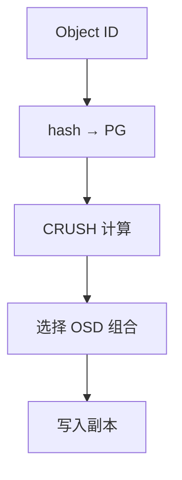
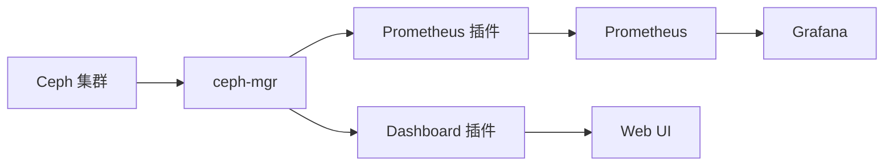
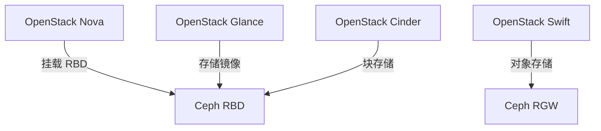
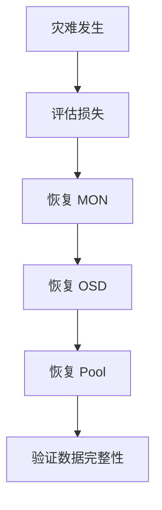

# Ceph 深入（CRUSH 算法 / PG 规划 / RBD 实践 / 故障恢复 / 性能调优）

> Ceph 是**开源的分布式统一存储**，一套集群提供对象（S3）、块（RBD）、文件（CephFS）三种接口。本篇深入拆解：CRUSH 数据分布算法、PG 数量规划、RBD 生产实践、故障恢复流程、性能调优。

---

## 一、要解决的问题

| 痛点 | 说明 |
|------|------|
| 存储种类割裂 | 对象/块/文件三套系统分别建设，管理成本高 |
| 硬件绑定 | 商业存储（EMC/NetApp）贵且绑定硬件 |
| 扩容困难 | 存储扩容要停机/换柜，规模受限 |
| 单点风险 | 集中存储控制器故障 = 数据不可用 |
| 数据可靠性 | 磁盘损坏需要自动修复（自愈） |

> 核心认知：**Ceph = 「软件定义的统一存储」**——普通 x86 服务器 + 千兆网络就能组成一个自我修复的存储集群，一套底座出三种接口（S3/RBD/CephFS）。

---

## 二、架构

```
应用层：S3/OSS（RGW 对象）/ 虚拟机磁盘（RBD 块）/ 文件（CephFS）

服务层：
  ├── RADOS Gateway（RGW）：S3/Swift 兼容对象存储网关
  ├── RBD：块设备（KVM/CephFS 虚拟机磁盘、K8s PVC）
  ├── CephFS：POSIX 文件系统（多活元数据服务器）

核心层（RADOS）：
  ├── OSD（Object Storage Daemon）：每磁盘一个，存数据 + 复制 + 自愈
  ├── MON（Monitor）：维护集群地图（Cluster Map），选举/一致性（Paxos）
  ├── MGR（Manager）：监控/调度/均衡（Prometheus 指标、Balancer）
  └── CRUSH 算法：数据分布（无需查表，确定性计算）
```

---

## 三、CRUSH 算法（深入）

### 3.1 核心思想

```
CRUSH = Controlled Replication Under Scalable Hashing

数据分布过程：
  对象 ID → hash → PG（Placement Group）→ CRUSH 映射（按集群地图确定性计算）
  → 选定 OSD 组合（如 3 副本）

确定性：
  同一对象在任何时刻任何节点计算 → 结果一致
  无需查表（无中心查询）→ 客户端直接定位数据
```

### 3.2 与一致性哈希/HDFS 对比

| 维度 | CRUSH | 一致性哈希 | HDFS |
|------|-------|-----------|------|
| 中心查询 | 无（客户端计算） | 无 | NameNode 集中记录 |
| 扩容迁移 | 只迁移受影响 PG | 只迁移受影响桶 | 需 rebalance |
| 故障域感知 | 原生（机架/机房） | 需扩展 | 需配置 |
| 权重 | 原生（按容量） | 需扩展 | 需配置 |

### 3.3 CRUSH Map 结构

```
CRUSH Map 组成：
  OSD 列表（每个 OSD 的权重/状态）
  故障域层级（host → rack → datacenter → root）
  规则（rule）：副本数 + 故障域约束

示例规则：
  rule replicated_ruleset {
    ruleset 0
    type replicated
    min_size 1
    max_size 10
    step take root        # 从根开始
    step chooseleaf firstn 3 type host  # 选 3 个不同 host
  }
```

### 3.4 权重与重均衡

```
权重 = 相对容量（如 2TB 磁盘权重 = 2.0）

Balancer（MGR 组件）：
  自动检测 PG 分布不均衡
  迁移 PG 到低负载 OSD（后台慢速）
  目标：PG 数按权重比例分布

手动重均衡（旧方式）：
  ceph osd reweight / reweight-by-utilization
```

---

## 四、PG 数量规划（关键实践）

### 4.1 PG 是什么

```
PG（Placement Group）= 对象的逻辑分组
  一个 PG 包含一组对象（默认每个 PG 数千~数万对象）
  PG 是复制/迁移/故障恢复的最小单位

规划原则：
  PG 总数 ≈ OSD 数 × 100（推荐范围 50~200/OSD）

公式：
  总 PG = OSD 数 × 100（每个 OSD 100 个 PG）

示例：
  10 个 OSD → 1000 个 PG
  100 个 OSD → 10000 个 PG
```

### 4.2 PG 数不当的后果

| 问题 | 原因 | 后果 |
|------|------|------|
| PG 太少 | 每个 PG 太大 | 数据分布不均、恢复慢 |
| PG 太多 | 每个 PG 元数据开销 | 内存/CPU 浪费、心跳开销大 |
| PG 数不可改 | 创建 pool 时定死 | 后续只能重建 pool |

### 4.3 PG 幂等法则

```
PG 数量固定后不能改变（pool 创建时决定）
  → 提前规划（考虑 3~5 年扩容）

Pool 相关配置：
  size（副本数）：默认 3
  min_size：最小可用副本（如 2，允许降级运行）
  pg_num：PG 数
  crush_rule：数据分布规则
```

---

## 五、数据可靠性机制

### 5.1 副本 vs 纠删码（EC）

| 方案 | 空间效率 | 计算开销 | 适用 |
|------|----------|----------|------|
| 3 副本 | 33% | 低 | 默认（可靠优先） |
| EC 2+1 | 66% | 中 | 容量敏感 |
| EC 8+3 | 73% | 高 | 大容量归档 |

```
EC（Erasure Coding）：
  数据切成 K 份 + M 份校验 = K+M 份
  任意 M 份丢失可恢复
  8+3 = 11 份，最多容忍 3 份丢失

对比副本：
  同样 3 份冗余 → EC 有效空间 73% vs 副本 33%
  EC 写开销大（计算校验）→ 归档/冷数据用
```

### 5.2 自愈（Self-healing）

```
OSD 故障检测：
  心跳（MON ↔ OSD 每秒）
  超时（默认 60s）→ 标记 down

恢复流程：
  1. OSD down → PG 进入 degraded（降级）状态
  2. 其他副本继续服务（min_size 满足则可写）
  3. 集群调度 → 在健康 OSD 重建缺失副本
  4. 恢复完成 → PG 回到 active+clean
```

### 5.3 Scrub（数据校验）

```
Scrub = 定期对比副本数据（防静默损坏）

类型：
  常规 Scrub：对比对象元数据 + 部分数据
  深度 Scrub：全量数据对比（耗时）

调度：
  默认每天轻量、每周深度
  低峰时段执行（IO 开销大）

发现不一致 → 标记错误 → 用健康副本修复
```

---

## 六、RBD 生产实践

### 6.1 创建与使用

```bash
# 创建 pool
ceph osd pool create rbd 512 512 replicated

# 创建 RBD 镜像
rbd create myvm --size 100G --pool rbd

# 映射到主机（KVM/裸机）
rbd map rbd/myvm

# K8s CSI：创建 StorageClass + PVC 自动创建
```

### 6.2 RBD 快照与克隆

```bash
# 快照
rbd snap create rbd/myvm@backup-20260819

# 克隆（写时复制，秒级创建新镜像）
rbd clone rbd/myvm@backup-20260819 rbd/myvm-clone

# 扁平化（解除父子关系）
rbd flatten rbd/myvm-clone
```

```
快照用途：
  虚拟机备份（定期快照 + 导出）
  灾难恢复（跨集群导出）
  开发环境克隆（秒级创建）

生产建议：
  快照定期清理（防空间膨胀）
  关键数据快照导出到对象存储
```

### 6.3 RBD 性能优化

| 优化 | 说明 |
|------|------|
| 客户端缓存 | librbd 缓存（rbd cache） |
| IO 队列 | rbd queue depth（默认 128） |
| 条带化 | 大块连续写调大条带 |
| 网络 | 集群网络万兆分离 |
| OSD 配置 | osd journal 放 SSD |

---

## 七、故障恢复与运维

### 7.1 集群健康检查

```bash
ceph status              # 集群状态
ceph health detail       # 详细健康信息
ceph osd tree            # OSD 拓扑
ceph pg stat             # PG 状态
ceph osd df              # 容量分布
```

### 7.2 常见故障处理

| 故障 | 现象 | 处理 |
|------|------|------|
| OSD down | 单 OSD 红 | 检查磁盘 → 重启 OSD → 确认恢复 |
| OSD 数据损坏 | PG inconsistent | 深度 Scrub → 标记错误 → 重建 |
| MON 失联 | 多数 MON 不可用 | 恢复 MON（先恢复多数） |
| 网络分区 | 大量 OSD 标记 down | 检查网络 → 恢复 → 等重均衡 |
| 磁盘写满 | OSD 近满告警 | 扩容/清理/权重调整 |

### 7.3 重要运维原则

```
1. 集群不健康时别操作（扩容/删池都受影响）
2. 升级按官方顺序（跨大版本先停）
3. 备份 MON 数据（集群地图）
4. 监控指标：OSD 健康/延迟/PG 状态/容量水位
5. 故障演练（定期模拟 OSD/节点故障）
```

---

## 八、性能调优

### 8.1 硬件配置

| 组件 | 建议 |
|------|------|
| OSD 磁盘 | SSD（热）/ HDD（温） |
| journal/WAL | NVMe（独立于数据盘） |
| 网络 | 万兆起步，集群/公网分离 |
| 内存 | 每 OSD 2~4GB（缓存） |

### 8.2 关键参数

| 参数 | 建议 |
|------|------|
| osd_max_backfills | 1~2（恢复限速防影响业务） |
| osd_recovery_max_active | 3~5 |
| osd_op_threads | 按 CPU 核数 |
| osd_journal_size | 10GB+（SSD） |
| mon_osd_down_out_interval | 600（延迟标记 out，防抖动） |
| Balancer | 开启自动均衡 |

### 8.3 性能瓶颈识别

```
监控指标：
  客户端 IOPS/带宽（per pool）
  OSD 延迟（commit/apply）
  PG 恢复速率
  网络吞吐（集群网络）

常见瓶颈：
  网络（复制流量 2~3 倍于写入）
  小文件随机写（Ceph 弱项）
  journal 磁盘（写路径瓶颈）
```

---

## 九、Ceph vs MinIO vs HDFS vs GlusterFS

| 维度 | Ceph | MinIO | HDFS | GlusterFS |
|------|------|-------|------|-----------|
| 类型 | 统一（对象+块+文件） | 对象 | 文件（大数据） | 文件 |
| 一致性 | 强（CRUSH 副本） | 强 | 强 | 强 |
| 去中心化 | 强（CRUSH） | 中（需控制面） | 弱（NameNode） | 中 |
| 自愈 | 强（自动重建） | 有（纠删码） | 有（副本恢复） | 弱 |
| 性能 | 中（元数据开销） | 高（小规模） | 高吞吐 | 中 |
| 部署复杂度 | 高 | 低 | 中 | 低 |
| 适用 | 私有云存储底座 | 轻量对象存储 | 大数据批处理 | 文件共享 |

**选型关注点**：
- 私有云/统一存储/生产底座 → **Ceph**；
- 轻量对象存储/快速落地 → **MinIO**；
- 大数据计算存储 → **HDFS**；
- 简单文件共享 → **GlusterFS/NFS**。

---

## 十、选型速查

| 需求 | 首选 | 备选 |
|------|------|------|
| 私有云统一存储 | Ceph | — |
| 轻量对象存储 | MinIO | Ceph RGW |
| K8s 持久化存储 | Ceph RBD/CSI | Longhorn |
| OpenStack 存储 | Ceph | — |
| 大数据批处理 | HDFS | CephFS |
| 备份归档 | S3 兼容（MinIO/Ceph） | 云 OSS |

---

## 十一、Ceph CRUSH 算法深入

### 11.1 CRUSH 映射流程



### 11.2 CRUSH Map 结构

```
CRUSH Map 组成：
  OSD 列表：每个 OSD 的 ID 和权重
  故障域层级：host → rack → datacenter → root
  规则（rule）：副本数 + 故障域约束

示例规则：
  rule replicated_ruleset {
    type replicated
    min_size 1
    max_size 10
    step take root
    step chooseleaf firstn 3 type host
  }
```

### 11.3 权重计算

```
权重类型：
  传统权重：基于容量（如 2TB = 2.0）
  CRUSH 权重：基于容量 + 性能

权重计算：
  权重 = 容量 / 参考容量
  参考容量通常是所有 OSD 的平均容量

自动均衡：
  Balancer（MGR 组件）自动检测不均衡
  后台慢速迁移 PG
```

### 11.4 CRUSH 与一致性哈希对比

| 维度 | CRUSH | 一致性哈希 |
|------|-------|-----------|
| 中心查询 | 无（客户端计算） | 无 |
| 扩容迁移 | 只迁移受影响 PG | 只迁移受影响桶 |
| 故障域感知 | 原生支持 | 需扩展 |
| 权重 | 原生支持 | 需扩展 |
| 确定性 | 同一对象结果一致 | 一致 |

---

## 十二、Ceph Pool 和 Placement Group

### 12.1 Pool 配置

```bash
# 创建 Pool
ceph osd pool create mypool 128 128 replicated

# 设置副本数
ceph osd pool set mypool size 3

# 设置最小副本数
ceph osd pool set mypool min_size 2

# 设置配额
ceph osd pool set-quota mypool max_bytes 100G
```

### 12.2 PG 数量规划

| OSD 数量 | 建议 PG 数 | 每 OSD PG 数 |
|----------|------------|--------------|
| 10 | 128 | 12.8 |
| 50 | 512 | 10.2 |
| 100 | 1024 | 10.2 |
| 200 | 2048 | 10.2 |

### 12.3 PG 状态

| 状态 | 说明 |
|------|------|
| active+clean | 正常状态 |
| active+clean+scrubbing | 正在 Scrub |
| active+degraded | 降级（部分副本丢失） |
| active+recovering | 正在恢复 |
| active+backfilling | 正在回填 |

### 12.4 PG 调优

| 参数 | 说明 | 建议 |
|------|------|------|
| `pg_num` | PG 数量 | OSD × 100 |
| `pgp_num` | PGP 数量 | 等于 pg_num |
| `pg_autoscale_mode` | 自动伸缩 | on |
| `target_size_ratio` | 目标比例 | 按需设置 |

---

## 十三、Ceph RBD/CephFS/RGW

### 13.1 RBD（RADOS Block Device）

```
特性：
  块设备接口（iSCSI/RBD 协议）
  快照（增量快照）
  克隆（写时复制）
  精简配置（Thin Provisioning）
  纠删码支持

使用场景：
  虚拟机磁盘（KVM/QEMU）
  K8s 持久化卷（CSI）
  数据库存储
```

### 13.2 CephFS（Ceph File System）

```
特性：
  POSIX 文件系统接口
  多活元数据服务器（MDS）
  快照（目录级）
  配额（目录/用户）
  NFS 导出

使用场景：
  共享文件存储
  大数据计算存储
  容器持久化卷
```

### 13.3 RGW（RADOS Gateway）

```
特性：
  S3/Swift 兼容接口
  对象存储（无限扩展）
  多租户
  生命周期管理
  跨区域复制

使用场景：
  对象存储服务
  备份归档
  静态资源存储
```

### 13.4 接口对比

| 接口 | 协议 | 适用场景 |
|------|------|----------|
| RBD | RBD/iSCSI | 虚拟机/容器存储 |
| CephFS | FUSE/Kernel | 文件共享/大数据 |
| RGW | S3/Swift | 对象存储 |

---

## 十四、Ceph 性能调优

### 14.1 硬件配置

| 组件 | 建议 |
|------|------|
| OSD 磁盘 | SSD（热数据）/ HDD（温数据） |
| journal/WAL | NVMe（独立于数据盘） |
| 网络 | 万兆起步，集群/公网分离 |
| 内存 | 每 OSD 2~4GB |
| CPU | 每 OSD 2~4 核 |

### 14.2 关键参数

| 参数 | 说明 | 建议 |
|------|------|------|
| `osd_max_backfills` | 恢复并发数 | 1~2 |
| `osd_recovery_max_active` | 活跃恢复 OSD 数 | 3~5 |
| `osd_op_threads` | 操作线程数 | 按 CPU 核数 |
| `osd_journal_size` | Journal 大小 | 10GB+（SSD） |
| `mon_osd_down_out_interval` | 延迟标记 out 时间 | 600s |

### 14.3 性能瓶颈识别

```
监控指标：
  客户端 IOPS/带宽（per pool）
  OSD 延迟（commit/apply）
  PG 恢复速率
  网络吞吐（集群网络）

常见瓶颈：
  网络（复制流量 2~3 倍于写入）
  小文件随机写（Ceph 弱项）
  journal 磁盘（写路径瓶颈）
```

---

## 十五、Ceph 监控（ceph-mgr）

### 15.1 监控架构



### 15.2 关键监控指标

| 指标 | 说明 | 阈值 |
|------|------|------|
| OSD 使用率 | 磁盘使用率 | <80% |
| PG 状态 | active+clean 比例 | 100% |
| OSD 延迟 | commit/apply 延迟 | <10ms |
| 复制带宽 | 副本同步带宽 | 按需设置 |
| 客户端 IOPS | 读写 IOPS | 按需设置 |

### 15.3 ceph-mgr 模块

| 模块 | 说明 |
|------|------|
| Prometheus | 指标导出 |
| Dashboard | Web 管理界面 |
| Balancer | 自动均衡 |
| PG Autoscaler | PG 自动伸缩 |
| Zabbix | Zabbix 集成 |

---

## 十六、Ceph 在 OpenStack

### 16.1 集成架构



### 16.2 集成配置

```ini
# Nova 配置
[libvirt]
images_rbd_pool=vms
images_rbd_ceph_conf=/etc/ceph/ceph.conf
images_type=rbd

# Glance 配置
[DEFAULT]
show_image_direct_url = True
[glance_store]
rbd_store_pool=images
```

### 16.3 OpenStack + Ceph 最佳实践

| 实践 | 说明 |
|------|------|
| 专用 Pool | Nova/Glance/Cinder/Swift 各自 Pool |
| 副本数 | 生产至少 3 副本 |
| 网络分离 | 集群网络/存储网络分离 |
| SSD 优化 | OSD 使用 SSD |
| 监控 | ceph-mgr + Prometheus |

---

## 十七、Ceph vs MinIO vs GlusterFS

| 维度 | Ceph | MinIO | GlusterFS |
|------|------|-------|-----------|
| 类型 | 统一（对象+块+文件） | 对象 | 文件 |
| 一致性 | 强（CRUSH 副本） | 强 | 强 |
| 去中心化 | 强（CRUSH） | 中（需控制面） | 中 |
| 自愈 | 强（自动重建） | 有（纠删码） | 弱 |
| 性能 | 中 | 高（小规模） | 中 |
| 部署复杂度 | 高 | 低 | 低 |
| 适用 | 私有云存储底座 | 轻量对象存储 | 文件共享 |

### 17.1 选型决策

```
场景选型：
  私有云/统一存储 → Ceph
  轻量对象存储 → MinIO
  文件共享 → GlusterFS/NFS
  大数据计算存储 → HDFS/CephFS
  K8s 持久化 → Ceph RBD/CSI
```

---

## 十八、Ceph 灾难恢复

### 18.1 备份策略

| 策略 | 说明 | 频率 |
|------|------|------|
| 全量备份 | 完整集群备份 | 每周 |
| 增量备份 | 变更数据备份 | 每天 |
| 快照 | Pool 快照 | 按需 |
| 跨集群复制 | 异地复制 | 实时 |

### 18.2 灾难恢复流程



### 18.3 恢复步骤

```bash
# 1. 恢复 MON
ceph-mon -i <id> --mkfs --monmap /path/to/monmap

# 2. 恢复 OSD
ceph-volume lvm activate <osd-id> <fsid>

# 3. 检查集群状态
ceph health detail
ceph -s

# 4. 恢复数据（如有需要）
ceph osd pool restore <pool-name> <backup>
```

### 18.4 灾难恢复最佳实践

| 实践 | 说明 |
|------|------|
| 定期备份 | 全量+增量 |
| 异地复制 | Geo-replication |
| 演练测试 | 定期恢复演练 |
| 监控告警 | 异常及时发现 |
| 文档维护 | 恢复流程文档化 |

---

## 二十、CRUSH 规则自定义

### 20.1 CRUSH 规则创建

```bash
# 创建自定义 CRUSH 规则（三副本，跨机架）
ceph osd crush rule create-replicated rule-3copy default host rack

# 查看 CRUSH 规则
ceph osd crush rule dump rule-3copy
```

### 20.2 CRUSH 故障域层级

| 故障域层级 | 作用 | 适用 |
|-----------|------|------|
| host | 节点级故障 | 基本容灾 |
| rack | 机架级故障 | 机房级容灾 |
| row | 机房行级 | 大规模集群 |
| datacenter | 数据中心级 | 异地容灾 |
| region | 区域级 | 跨地域容灾 |

```text
CRUSH Rule 设计原则：
  1. 副本数 × 故障域数 ≥ 可用域数
  2. 三机架部署：每机架放1副本
  3. 避免 all-in-one-host：副本不放同一节点
  4. 故障域越大，容灾能力越强，但性能下降
```

## 二十一、PG 数量计算

### 21.1 计算公式

```text
PG 数量 = (OSD 数 × 100) / 副本数

推荐值：
  - 每个 OSD 上的 PG 数控制在 100 左右
  - 最小 PG 数：128
  - 最大 PG 数：每个 Pool 32768

示例：
  - 20 OSD，3副本 → PG = (20 × 100) / 3 = 667 → 向上取 1024
  - 100 OSD，3副本 → PG = (100 × 100) / 3 = 3333 → 向上取 4096
```

### 21.2 PG 调优命令

```bash
# 设置 Pool PG 数
ceph osd pool set <pool-name> pg_num <pg-count>
ceph osd pool set <pool-name> pgp_num <pg-count>

# 查看 PG 分布
ceph osd pool stats
ceph pg stat
```

## 二十二、Thin Provisioning（精简配置）

```text
Thin Provisioning 原理：
  - OSD 按需分配容量，不预先占满磁盘
  - 允许超配（overcommit），提高利用率
  - 需监控实际使用量，避免超限

配置方式：
  ceph osd pool set <pool> target_size_ratio 0.8
  ceph osd pool set <pool> target_size_bytes 100G
```

| 策略 | 优点 | 风险 |
|------|------|------|
| 精简配置 | 提高利用率 | 可能超配导致不可用 |
| 厚配置 | 容量保证 | 利用率低 |
| 混合 | 关键Pool厚配置 | 需管理 |

## 二十三、BlueStore 调优

### 23.1 核心参数

```ini
# ceph.conf BlueStore 调优
[osd]
# WAL/DB 设备（SSD/NVMe）
bluestore_block_db_path = /dev/nvme0n1p1
bluestore_block_wal_path = /dev/nvme0n1p2

# 缓存
bluestore_cache_size_ssd = 3GB
bluestore_cache_size_hdd = 1GB

# Compaction
bluestore_compression_mode = aggressive
bluestore_compression_algorithm = snappy

# 日志
bluestore_log_op_age = 3600
bluestore_log_trim_age = 3600
```

### 23.2 SSD vs HDD 配置对比

| 参数 | SSD/NVMe | HDD |
|------|----------|-----|
| bluestore_cache_size | 2~4GB | 512MB~1GB |
| bluestore_compression | aggressive | none/Passive |
| bluestore_min_alloc_size | 4K | 16K |
| bluestore_prefer_deferred_size | 0 | 32K |

## 二十四、Ceph 与 OpenStack 集成

```text
OpenStack 组件 → Ceph 对接：
  Cinder（块存储）→ RBD（Ceph RBD）
  Glance（镜像服务）→ RBD（存储 VM 镜像）
  Nova（虚拟机）→ RBD（临时/持久化磁盘）

对接配置：
  1. 创建 OpenStack 专用 Pool
  2. 创建 Ceph 认证用户
  3. 配置 OpenStack 各组件的 ceph.conf
  4. 导入 keyring 文件
```

```bash
# 创建 OpenStack 专用 Pool
ceph osd pool create volumes 128
ceph osd pool create images 64
ceph osd pool create vms 128

# 创建认证用户
ceph auth get-or-create client.glance mon 'allow r' osd 'allow class-read,allow rwx pool=images'
ceph auth get-or-create client.cinder mon 'allow r' osd 'allow class-read,allow rwx pool=volumes,allow rwx pool=vms,allow rwx pool=images'
```

## 二十五、Ceph 性能基线与调优

### 25.1 性能基线

```bash
# 性能测试
rados bench -p <pool> 30 write      # 写入测试
rados bench -p <pool> 30 seq        # 顺序读测试
rados bench -p <pool> 30 rand       # 随机读测试

# 4K随机读写 IOPS 参考
# HDD: ~200 IOPS/OSD
# SSD: ~5000 IOPS/OSD
# NVMe: ~50000 IOPS/OSD
```

### 25.2 调优清单

| 调优点 | 方法 | 效果 |
|--------|------|------|
| 网络分离 | public/cluster 网络分开 | 减少干扰 |
| SSD WAL/DB | BlueStore 元数据放 SSD | 降低延迟 |
| 多 OSD | 每盘一个 OSD | 并行提升 |
| CRUSH 优化 | 均衡 PG 分布 | 避免热点 |
| 后台任务 | scrub/compact 限速 | 减少 IO 干扰 |

## 与其他板块的关系

- 对象存储对比见「[对象存储 MinIO/OSS](./对象存储MinIO-OSS.md)」；
- 大数据存储（HDFS）见「[大数据/04-分布式存储与HDFS](../大数据/04-分布式存储与HDFS.md)」；
- K8s 持久化（CSI）见「[云原生/Kubernetes 核心](../../云原生/Kubernetes核心.md)」；
- 云上存储生态见「[云上数据库与缓存生态](./云上数据库与缓存生态.md)」。

> 一句话：**Ceph = RADOS（去中心化）+ CRUSH（确定性分布/故障域感知）+ 三接口（RGW/RBD/CephFS）+ 自愈（副本重建/Scrub）——生产关键：PG 规划（OSD×100）+ 万兆分离网络 + 副本/EC 策略 + Balancer 均衡 + 故障演练**。