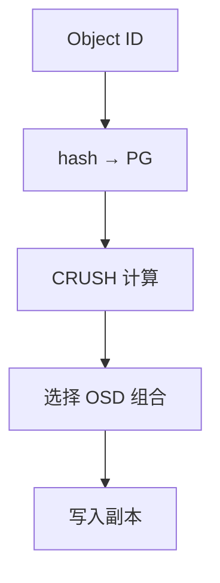
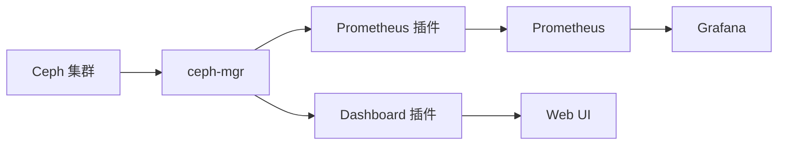
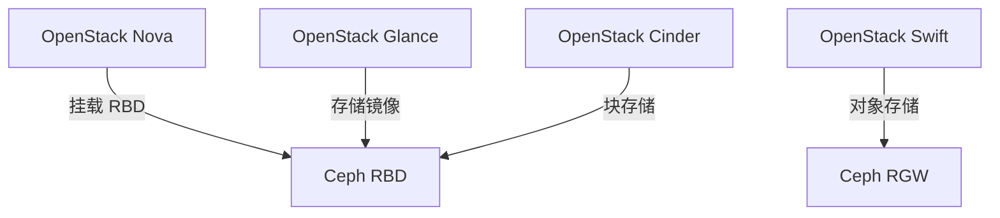
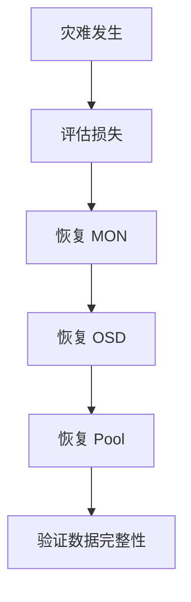

# Ceph 深入（CRUSH 算法 / PG 规划 / RBD 实践 / 故障恢复 / 性能调优）

> Ceph 是**开源的分布式统一存储**，一套集群提供对象（S3）、块（RBD）、文件（CephFS）三种接口。本篇深入拆解：CRUSH 数据分布算法、PG 数量规划、RBD 生产实践、故障恢复流程、性能调优。

---

## 一、要解决的问题

| 痛点 | 说明 |
|------|------|
| 存储种类割裂 | 对象/块/文件三套系统分别建设，管理成本高 |
| 硬件绑定 | 商业存储（EMC/NetApp）贵且绑定硬件 |
| 扩容困难 | 存储扩容要停机/换柜，规模受限 |
| 单点风险 | 集中存储控制器故障 = 数据不可用 |
| 数据可靠性 | 磁盘损坏需要自动修复（自愈） |

> 核心认知：**Ceph = 「软件定义的统一存储」**——普通 x86 服务器 + 千兆网络就能组成一个自我修复的存储集群，一套底座出三种接口（S3/RBD/CephFS）。

---

## 二、架构

```
应用层：S3/OSS（RGW 对象）/ 虚拟机磁盘（RBD 块）/ 文件（CephFS）

服务层：
  ├── RADOS Gateway（RGW）：S3/Swift 兼容对象存储网关
  ├── RBD：块设备（KVM/CephFS 虚拟机磁盘、K8s PVC）
  ├── CephFS：POSIX 文件系统（多活元数据服务器）

核心层（RADOS）：
  ├── OSD（Object Storage Daemon）：每磁盘一个，存数据 + 复制 + 自愈
  ├── MON（Monitor）：维护集群地图（Cluster Map），选举/一致性（Paxos）
  ├── MGR（Manager）：监控/调度/均衡（Prometheus 指标、Balancer）
  └── CRUSH 算法：数据分布（无需查表，确定性计算）
```

---

## 三、CRUSH 算法（深入）

### 3.1 核心思想

```
CRUSH = Controlled Replication Under Scalable Hashing

数据分布过程：
  对象 ID → hash → PG（Placement Group）→ CRUSH 映射（按集群地图确定性计算）
  → 选定 OSD 组合（如 3 副本）

确定性：
  同一对象在任何时刻任何节点计算 → 结果一致
  无需查表（无中心查询）→ 客户端直接定位数据
```

### 3.2 与一致性哈希/HDFS 对比

| 维度 | CRUSH | 一致性哈希 | HDFS |
|------|-------|-----------|------|
| 中心查询 | 无（客户端计算） | 无 | NameNode 集中记录 |
| 扩容迁移 | 只迁移受影响 PG | 只迁移受影响桶 | 需 rebalance |
| 故障域感知 | 原生（机架/机房） | 需扩展 | 需配置 |
| 权重 | 原生（按容量） | 需扩展 | 需配置 |

### 3.3 CRUSH Map 结构

```
CRUSH Map 组成：
  OSD 列表（每个 OSD 的权重/状态）
  故障域层级（host → rack → datacenter → root）
  规则（rule）：副本数 + 故障域约束

示例规则：
  rule replicated_ruleset {
    ruleset 0
    type replicated
    min_size 1
    max_size 10
    step take root        # 从根开始
    step chooseleaf firstn 3 type host  # 选 3 个不同 host
  }
```

### 3.4 权重与重均衡

```
权重 = 相对容量（如 2TB 磁盘权重 = 2.0）

Balancer（MGR 组件）：
  自动检测 PG 分布不均衡
  迁移 PG 到低负载 OSD（后台慢速）
  目标：PG 数按权重比例分布

手动重均衡（旧方式）：
  ceph osd reweight / reweight-by-utilization
```

---

## 四、PG 数量规划（关键实践）

### 4.1 PG 是什么

```
PG（Placement Group）= 对象的逻辑分组
  一个 PG 包含一组对象（默认每个 PG 数千~数万对象）
  PG 是复制/迁移/故障恢复的最小单位

规划原则：
  PG 总数 ≈ OSD 数 × 100（推荐范围 50~200/OSD）

公式：
  总 PG = OSD 数 × 100（每个 OSD 100 个 PG）

示例：
  10 个 OSD → 1000 个 PG
  100 个 OSD → 10000 个 PG
```

### 4.2 PG 数不当的后果

| 问题 | 原因 | 后果 |
|------|------|------|
| PG 太少 | 每个 PG 太大 | 数据分布不均、恢复慢 |
| PG 太多 | 每个 PG 元数据开销 | 内存/CPU 浪费、心跳开销大 |
| PG 数不可改 | 创建 pool 时定死 | 后续只能重建 pool |

### 4.3 PG 幂等法则

```
PG 数量固定后不能改变（pool 创建时决定）
  → 提前规划（考虑 3~5 年扩容）

Pool 相关配置：
  size（副本数）：默认 3
  min_size：最小可用副本（如 2，允许降级运行）
  pg_num：PG 数
  crush_rule：数据分布规则
```

---

## 五、数据可靠性机制

### 5.1 副本 vs 纠删码（EC）

| 方案 | 空间效率 | 计算开销 | 适用 |
|------|----------|----------|------|
| 3 副本 | 33% | 低 | 默认（可靠优先） |
| EC 2+1 | 66% | 中 | 容量敏感 |
| EC 8+3 | 73% | 高 | 大容量归档 |

```
EC（Erasure Coding）：
  数据切成 K 份 + M 份校验 = K+M 份
  任意 M 份丢失可恢复
  8+3 = 11 份，最多容忍 3 份丢失

对比副本：
  同样 3 份冗余 → EC 有效空间 73% vs 副本 33%
  EC 写开销大（计算校验）→ 归档/冷数据用
```

### 5.2 自愈（Self-healing）

```
OSD 故障检测：
  心跳（MON ↔ OSD 每秒）
  超时（默认 60s）→ 标记 down

恢复流程：
  1. OSD down → PG 进入 degraded（降级）状态
  2. 其他副本继续服务（min_size 满足则可写）
  3. 集群调度 → 在健康 OSD 重建缺失副本
  4. 恢复完成 → PG 回到 active+clean
```

### 5.3 Scrub（数据校验）

```
Scrub = 定期对比副本数据（防静默损坏）

类型：
  常规 Scrub：对比对象元数据 + 部分数据
  深度 Scrub：全量数据对比（耗时）

调度：
  默认每天轻量、每周深度
  低峰时段执行（IO 开销大）

发现不一致 → 标记错误 → 用健康副本修复
```

---

## 六、RBD 生产实践

### 6.1 创建与使用

```bash
# 创建 pool
ceph osd pool create rbd 512 512 replicated

# 创建 RBD 镜像
rbd create myvm --size 100G --pool rbd

# 映射到主机（KVM/裸机）
rbd map rbd/myvm

# K8s CSI：创建 StorageClass + PVC 自动创建
```

### 6.2 RBD 快照与克隆

```bash
# 快照
rbd snap create rbd/myvm@backup-20260819

# 克隆（写时复制，秒级创建新镜像）
rbd clone rbd/myvm@backup-20260819 rbd/myvm-clone

# 扁平化（解除父子关系）
rbd flatten rbd/myvm-clone
```

```
快照用途：
  虚拟机备份（定期快照 + 导出）
  灾难恢复（跨集群导出）
  开发环境克隆（秒级创建）

生产建议：
  快照定期清理（防空间膨胀）
  关键数据快照导出到对象存储
```

### 6.3 RBD 性能优化

| 优化 | 说明 |
|------|------|
| 客户端缓存 | librbd 缓存（rbd cache） |
| IO 队列 | rbd queue depth（默认 128） |
| 条带化 | 大块连续写调大条带 |
| 网络 | 集群网络万兆分离 |
| OSD 配置 | osd journal 放 SSD |

---

## 七、故障恢复与运维

### 7.1 集群健康检查

```bash
ceph status              # 集群状态
ceph health detail       # 详细健康信息
ceph osd tree            # OSD 拓扑
ceph pg stat             # PG 状态
ceph osd df              # 容量分布
```

### 7.2 常见故障处理

| 故障 | 现象 | 处理 |
|------|------|------|
| OSD down | 单 OSD 红 | 检查磁盘 → 重启 OSD → 确认恢复 |
| OSD 数据损坏 | PG inconsistent | 深度 Scrub → 标记错误 → 重建 |
| MON 失联 | 多数 MON 不可用 | 恢复 MON（先恢复多数） |
| 网络分区 | 大量 OSD 标记 down | 检查网络 → 恢复 → 等重均衡 |
| 磁盘写满 | OSD 近满告警 | 扩容/清理/权重调整 |

### 7.3 重要运维原则

```
1. 集群不健康时别操作（扩容/删池都受影响）
2. 升级按官方顺序（跨大版本先停）
3. 备份 MON 数据（集群地图）
4. 监控指标：OSD 健康/延迟/PG 状态/容量水位
5. 故障演练（定期模拟 OSD/节点故障）
```

---

## 八、性能调优

### 8.1 硬件配置

| 组件 | 建议 |
|------|------|
| OSD 磁盘 | SSD（热）/ HDD（温） |
| journal/WAL | NVMe（独立于数据盘） |
| 网络 | 万兆起步，集群/公网分离 |
| 内存 | 每 OSD 2~4GB（缓存） |

### 8.2 关键参数

| 参数 | 建议 |
|------|------|
| osd_max_backfills | 1~2（恢复限速防影响业务） |
| osd_recovery_max_active | 3~5 |
| osd_op_threads | 按 CPU 核数 |
| osd_journal_size | 10GB+（SSD） |
| mon_osd_down_out_interval | 600（延迟标记 out，防抖动） |
| Balancer | 开启自动均衡 |

### 8.3 性能瓶颈识别

```
监控指标：
  客户端 IOPS/带宽（per pool）
  OSD 延迟（commit/apply）
  PG 恢复速率
  网络吞吐（集群网络）

常见瓶颈：
  网络（复制流量 2~3 倍于写入）
  小文件随机写（Ceph 弱项）
  journal 磁盘（写路径瓶颈）
```

---

## 九、Ceph vs MinIO vs HDFS vs GlusterFS

| 维度 | Ceph | MinIO | HDFS | GlusterFS |
|------|------|-------|------|-----------|
| 类型 | 统一（对象+块+文件） | 对象 | 文件（大数据） | 文件 |
| 一致性 | 强（CRUSH 副本） | 强 | 强 | 强 |
| 去中心化 | 强（CRUSH） | 中（需控制面） | 弱（NameNode） | 中 |
| 自愈 | 强（自动重建） | 有（纠删码） | 有（副本恢复） | 弱 |
| 性能 | 中（元数据开销） | 高（小规模） | 高吞吐 | 中 |
| 部署复杂度 | 高 | 低 | 中 | 低 |
| 适用 | 私有云存储底座 | 轻量对象存储 | 大数据批处理 | 文件共享 |

**选型关注点**：
- 私有云/统一存储/生产底座 → **Ceph**；
- 轻量对象存储/快速落地 → **MinIO**；
- 大数据计算存储 → **HDFS**；
- 简单文件共享 → **GlusterFS/NFS**。

---

## 十、选型速查

| 需求 | 首选 | 备选 |
|------|------|------|
| 私有云统一存储 | Ceph | — |
| 轻量对象存储 | MinIO | Ceph RGW |
| K8s 持久化存储 | Ceph RBD/CSI | Longhorn |
| OpenStack 存储 | Ceph | — |
| 大数据批处理 | HDFS | CephFS |
| 备份归档 | S3 兼容（MinIO/Ceph） | 云 OSS |

---

## 十一、Ceph CRUSH 算法深入

### 11.1 CRUSH 映射流程



### 11.2 CRUSH Map 结构

```
CRUSH Map 组成：
  OSD 列表：每个 OSD 的 ID 和权重
  故障域层级：host → rack → datacenter → root
  规则（rule）：副本数 + 故障域约束

示例规则：
  rule replicated_ruleset {
    type replicated
    min_size 1
    max_size 10
    step take root
    step chooseleaf firstn 3 type host
  }
```

### 11.3 权重计算

```
权重类型：
  传统权重：基于容量（如 2TB = 2.0）
  CRUSH 权重：基于容量 + 性能

权重计算：
  权重 = 容量 / 参考容量
  参考容量通常是所有 OSD 的平均容量

自动均衡：
  Balancer（MGR 组件）自动检测不均衡
  后台慢速迁移 PG
```

### 11.4 CRUSH 与一致性哈希对比

| 维度 | CRUSH | 一致性哈希 |
|------|-------|-----------|
| 中心查询 | 无（客户端计算） | 无 |
| 扩容迁移 | 只迁移受影响 PG | 只迁移受影响桶 |
| 故障域感知 | 原生支持 | 需扩展 |
| 权重 | 原生支持 | 需扩展 |
| 确定性 | 同一对象结果一致 | 一致 |

---

## 十二、Ceph Pool 和 Placement Group

### 12.1 Pool 配置

```bash
# 创建 Pool
ceph osd pool create mypool 128 128 replicated

# 设置副本数
ceph osd pool set mypool size 3

# 设置最小副本数
ceph osd pool set mypool min_size 2

# 设置配额
ceph osd pool set-quota mypool max_bytes 100G
```

### 12.2 PG 数量规划

| OSD 数量 | 建议 PG 数 | 每 OSD PG 数 |
|----------|------------|--------------|
| 10 | 128 | 12.8 |
| 50 | 512 | 10.2 |
| 100 | 1024 | 10.2 |
| 200 | 2048 | 10.2 |

### 12.3 PG 状态

| 状态 | 说明 |
|------|------|
| active+clean | 正常状态 |
| active+clean+scrubbing | 正在 Scrub |
| active+degraded | 降级（部分副本丢失） |
| active+recovering | 正在恢复 |
| active+backfilling | 正在回填 |

### 12.4 PG 调优

| 参数 | 说明 | 建议 |
|------|------|------|
| `pg_num` | PG 数量 | OSD × 100 |
| `pgp_num` | PGP 数量 | 等于 pg_num |
| `pg_autoscale_mode` | 自动伸缩 | on |
| `target_size_ratio` | 目标比例 | 按需设置 |

---

## 十三、Ceph RBD/CephFS/RGW

### 13.1 RBD（RADOS Block Device）

```
特性：
  块设备接口（iSCSI/RBD 协议）
  快照（增量快照）
  克隆（写时复制）
  精简配置（Thin Provisioning）
  纠删码支持

使用场景：
  虚拟机磁盘（KVM/QEMU）
  K8s 持久化卷（CSI）
  数据库存储
```

### 13.2 CephFS（Ceph File System）

```
特性：
  POSIX 文件系统接口
  多活元数据服务器（MDS）
  快照（目录级）
  配额（目录/用户）
  NFS 导出

使用场景：
  共享文件存储
  大数据计算存储
  容器持久化卷
```

### 13.3 RGW（RADOS Gateway）

```
特性：
  S3/Swift 兼容接口
  对象存储（无限扩展）
  多租户
  生命周期管理
  跨区域复制

使用场景：
  对象存储服务
  备份归档
  静态资源存储
```

### 13.4 接口对比

| 接口 | 协议 | 适用场景 |
|------|------|----------|
| RBD | RBD/iSCSI | 虚拟机/容器存储 |
| CephFS | FUSE/Kernel | 文件共享/大数据 |
| RGW | S3/Swift | 对象存储 |

---

## 十四、Ceph 性能调优

### 14.1 硬件配置

| 组件 | 建议 |
|------|------|
| OSD 磁盘 | SSD（热数据）/ HDD（温数据） |
| journal/WAL | NVMe（独立于数据盘） |
| 网络 | 万兆起步，集群/公网分离 |
| 内存 | 每 OSD 2~4GB |
| CPU | 每 OSD 2~4 核 |

### 14.2 关键参数

| 参数 | 说明 | 建议 |
|------|------|------|
| `osd_max_backfills` | 恢复并发数 | 1~2 |
| `osd_recovery_max_active` | 活跃恢复 OSD 数 | 3~5 |
| `osd_op_threads` | 操作线程数 | 按 CPU 核数 |
| `osd_journal_size` | Journal 大小 | 10GB+（SSD） |
| `mon_osd_down_out_interval` | 延迟标记 out 时间 | 600s |

### 14.3 性能瓶颈识别

```
监控指标：
  客户端 IOPS/带宽（per pool）
  OSD 延迟（commit/apply）
  PG 恢复速率
  网络吞吐（集群网络）

常见瓶颈：
  网络（复制流量 2~3 倍于写入）
  小文件随机写（Ceph 弱项）
  journal 磁盘（写路径瓶颈）
```

---

## 十五、Ceph 监控（ceph-mgr）

### 15.1 监控架构



### 15.2 关键监控指标

| 指标 | 说明 | 阈值 |
|------|------|------|
| OSD 使用率 | 磁盘使用率 | <80% |
| PG 状态 | active+clean 比例 | 100% |
| OSD 延迟 | commit/apply 延迟 | <10ms |
| 复制带宽 | 副本同步带宽 | 按需设置 |
| 客户端 IOPS | 读写 IOPS | 按需设置 |

### 15.3 ceph-mgr 模块

| 模块 | 说明 |
|------|------|
| Prometheus | 指标导出 |
| Dashboard | Web 管理界面 |
| Balancer | 自动均衡 |
| PG Autoscaler | PG 自动伸缩 |
| Zabbix | Zabbix 集成 |

---

## 十六、Ceph 在 OpenStack

### 16.1 集成架构



### 16.2 集成配置

```ini
# Nova 配置
[libvirt]
images_rbd_pool=vms
images_rbd_ceph_conf=/etc/ceph/ceph.conf
images_type=rbd

# Glance 配置
[DEFAULT]
show_image_direct_url = True
[glance_store]
rbd_store_pool=images
```

### 16.3 OpenStack + Ceph 最佳实践

| 实践 | 说明 |
|------|------|
| 专用 Pool | Nova/Glance/Cinder/Swift 各自 Pool |
| 副本数 | 生产至少 3 副本 |
| 网络分离 | 集群网络/存储网络分离 |
| SSD 优化 | OSD 使用 SSD |
| 监控 | ceph-mgr + Prometheus |

---

## 十七、Ceph vs MinIO vs GlusterFS

| 维度 | Ceph | MinIO | GlusterFS |
|------|------|-------|-----------|
| 类型 | 统一（对象+块+文件） | 对象 | 文件 |
| 一致性 | 强（CRUSH 副本） | 强 | 强 |
| 去中心化 | 强（CRUSH） | 中（需控制面） | 中 |
| 自愈 | 强（自动重建） | 有（纠删码） | 弱 |
| 性能 | 中 | 高（小规模） | 中 |
| 部署复杂度 | 高 | 低 | 低 |
| 适用 | 私有云存储底座 | 轻量对象存储 | 文件共享 |

### 17.1 选型决策

```
场景选型：
  私有云/统一存储 → Ceph
  轻量对象存储 → MinIO
  文件共享 → GlusterFS/NFS
  大数据计算存储 → HDFS/CephFS
  K8s 持久化 → Ceph RBD/CSI
```

---

## 十八、Ceph 灾难恢复

### 18.1 备份策略

| 策略 | 说明 | 频率 |
|------|------|------|
| 全量备份 | 完整集群备份 | 每周 |
| 增量备份 | 变更数据备份 | 每天 |
| 快照 | Pool 快照 | 按需 |
| 跨集群复制 | 异地复制 | 实时 |

### 18.2 灾难恢复流程



### 18.3 恢复步骤

```bash
# 1. 恢复 MON
ceph-mon -i <id> --mkfs --monmap /path/to/monmap

# 2. 恢复 OSD
ceph-volume lvm activate <osd-id> <fsid>

# 3. 检查集群状态
ceph health detail
ceph -s

# 4. 恢复数据（如有需要）
ceph osd pool restore <pool-name> <backup>
```

### 18.4 灾难恢复最佳实践

| 实践 | 说明 |
|------|------|
| 定期备份 | 全量+增量 |
| 异地复制 | Geo-replication |
| 演练测试 | 定期恢复演练 |
| 监控告警 | 异常及时发现 |
| 文档维护 | 恢复流程文档化 |

---

## 二十、CRUSH 规则自定义

### 20.1 CRUSH 规则创建

```bash
# 创建自定义 CRUSH 规则（三副本，跨机架）
ceph osd crush rule create-replicated rule-3copy default host rack

# 查看 CRUSH 规则
ceph osd crush rule dump rule-3copy
```

### 20.2 CRUSH 故障域层级

| 故障域层级 | 作用 | 适用 |
|-----------|------|------|
| host | 节点级故障 | 基本容灾 |
| rack | 机架级故障 | 机房级容灾 |
| row | 机房行级 | 大规模集群 |
| datacenter | 数据中心级 | 异地容灾 |
| region | 区域级 | 跨地域容灾 |

```text
CRUSH Rule 设计原则：
  1. 副本数 × 故障域数 ≥ 可用域数
  2. 三机架部署：每机架放1副本
  3. 避免 all-in-one-host：副本不放同一节点
  4. 故障域越大，容灾能力越强，但性能下降
```

## 二十一、PG 数量计算

### 21.1 计算公式

```text
PG 数量 = (OSD 数 × 100) / 副本数

推荐值：
  - 每个 OSD 上的 PG 数控制在 100 左右
  - 最小 PG 数：128
  - 最大 PG 数：每个 Pool 32768

示例：
  - 20 OSD，3副本 → PG = (20 × 100) / 3 = 667 → 向上取 1024
  - 100 OSD，3副本 → PG = (100 × 100) / 3 = 3333 → 向上取 4096
```

### 21.2 PG 调优命令

```bash
# 设置 Pool PG 数
ceph osd pool set <pool-name> pg_num <pg-count>
ceph osd pool set <pool-name> pgp_num <pg-count>

# 查看 PG 分布
ceph osd pool stats
ceph pg stat
```

## 二十二、Thin Provisioning（精简配置）

```text
Thin Provisioning 原理：
  - OSD 按需分配容量，不预先占满磁盘
  - 允许超配（overcommit），提高利用率
  - 需监控实际使用量，避免超限

配置方式：
  ceph osd pool set <pool> target_size_ratio 0.8
  ceph osd pool set <pool> target_size_bytes 100G
```

| 策略 | 优点 | 风险 |
|------|------|------|
| 精简配置 | 提高利用率 | 可能超配导致不可用 |
| 厚配置 | 容量保证 | 利用率低 |
| 混合 | 关键Pool厚配置 | 需管理 |

## 二十三、BlueStore 调优

### 23.1 核心参数

```ini
# ceph.conf BlueStore 调优
[osd]
# WAL/DB 设备（SSD/NVMe）
bluestore_block_db_path = /dev/nvme0n1p1
bluestore_block_wal_path = /dev/nvme0n1p2

# 缓存
bluestore_cache_size_ssd = 3GB
bluestore_cache_size_hdd = 1GB

# Compaction
bluestore_compression_mode = aggressive
bluestore_compression_algorithm = snappy

# 日志
bluestore_log_op_age = 3600
bluestore_log_trim_age = 3600
```

### 23.2 SSD vs HDD 配置对比

| 参数 | SSD/NVMe | HDD |
|------|----------|-----|
| bluestore_cache_size | 2~4GB | 512MB~1GB |
| bluestore_compression | aggressive | none/Passive |
| bluestore_min_alloc_size | 4K | 16K |
| bluestore_prefer_deferred_size | 0 | 32K |

## 二十四、Ceph 与 OpenStack 集成

```text
OpenStack 组件 → Ceph 对接：
  Cinder（块存储）→ RBD（Ceph RBD）
  Glance（镜像服务）→ RBD（存储 VM 镜像）
  Nova（虚拟机）→ RBD（临时/持久化磁盘）

对接配置：
  1. 创建 OpenStack 专用 Pool
  2. 创建 Ceph 认证用户
  3. 配置 OpenStack 各组件的 ceph.conf
  4. 导入 keyring 文件
```

```bash
# 创建 OpenStack 专用 Pool
ceph osd pool create volumes 128
ceph osd pool create images 64
ceph osd pool create vms 128

# 创建认证用户
ceph auth get-or-create client.glance mon 'allow r' osd 'allow class-read,allow rwx pool=images'
ceph auth get-or-create client.cinder mon 'allow r' osd 'allow class-read,allow rwx pool=volumes,allow rwx pool=vms,allow rwx pool=images'
```

## 二十五、Ceph 性能基线与调优

### 25.1 性能基线

```bash
# 性能测试
rados bench -p <pool> 30 write      # 写入测试
rados bench -p <pool> 30 seq        # 顺序读测试
rados bench -p <pool> 30 rand       # 随机读测试

# 4K随机读写 IOPS 参考
# HDD: ~200 IOPS/OSD
# SSD: ~5000 IOPS/OSD
# NVMe: ~50000 IOPS/OSD
```

### 25.2 调优清单

| 调优点 | 方法 | 效果 |
|--------|------|------|
| 网络分离 | public/cluster 网络分开 | 减少干扰 |
| SSD WAL/DB | BlueStore 元数据放 SSD | 降低延迟 |
| 多 OSD | 每盘一个 OSD | 并行提升 |
| CRUSH 优化 | 均衡 PG 分布 | 避免热点 |
| 后台任务 | scrub/compact 限速 | 减少 IO 干扰 |

## Ceph CRUSH 规则自定义

### host/rack/region 层级

```text
CRUSH 层级结构：
  region（区域）
    └── rack（机架）
        └── host（主机）
            └── osd（磁盘）

自定义 CRUSH 规则：
  1. 创建 CRUSH Rule
  2. 设置故障域（failure domain）
  3. 定义副本放置策略

示例：机架感知规则
  fail_domain = rack（故障域为机架）
  min_size = 3（最少 3 副本）
  约束：每个副本必须在不同机架
```

```bash
# 创建 CRUSH 规则
ceph osd crush rule create-replicated rack_rule rack host

# 查看 CRUSH 规则
ceph osd crush rule dump

# 设置存储池使用自定义规则
ceph osd pool set mypool crush_rule rack_rule
```

## Pool 与 Placement Group 数量计算

### PG 计算公式

```text
PG 数量 = (OSD 数 × 100) / 副本数

计算示例：
  OSD 数：100
  副本数：3
  PG 数 = (100 × 100) / 3 ≈ 3333

  取最近的 2 的幂：4096

调整规则：
  - PG 数必须是 2 的幂
  - 每个 OSD 的 PG 数建议在 100-200 之间
  - 太多 PG → 内存和 CPU 开销大
  - 太少 PG → 负载不均衡
```

```bash
# 计算建议 PG 数
ceph osd pool get mypool pg_num --format json

# 查看 PG 分布
ceph osd df tree

# 调整 PG 数
ceph osd pool set mypool pg_num 4096
ceph osd pool set mypool pgs_per_osd 100
```

## Ceph RBD Thin Provisioning

### COW（Copy-on-Write）原理

```text
Thin Provisioning 原理：
  1. 创建镜像时不分配实际空间
  2. 写入时按需分配块（COW）
  3. 未使用的块不占用物理空间

COW 流程：
  客户端写入新块 → RBD 查找空闲块 → 分配并写入
  客户端读取旧块 → RBD 直接返回数据
  客户端读取新块 → RBD 返回新分配的块

优势：
  - 快速创建镜像（秒级）
  - 节省存储空间（按需分配）
  - 快照高效（只记录变更）
  - 克隆快速（只复制元数据）
```

```bash
# 创建 thin provisioning 镜像
rbd create mypool/myimage --size 1TB --thick-provision=false

# 查看实际使用
rbd du mypool/myimage
# PROVISIONED: 1TB  USED: 10GB（实际使用）

# 创建快照
rbd snap create mypool/myimage@snap1

# 克隆（COW）
rbd clone mypool/myimage@snap1 mypool/myclone
```

## CephFS 目录子树分片

### dir fragment 原理

```text
目录分片机制：
  单个目录元数据过多 → 拆分为多个 fragment
  每个 fragment 独立管理 → 提升并发性能

分片策略：
  1. 默认不分片（dir_layout 默认）
  2. 手动设置分片数
  3. 自动分片（基于目录大小）

限制：
  - 每个目录最多 2^24 个 fragment
  - fragment 不可合并（需重建目录）
  - 小目录不建议分片（增加开销）
```

```bash
# 查看目录分片信息
getfattr -n ceph.dir.layout.myfrag /mnt/cephfs/largedir

# 设置目录分片
setfattr -n ceph.dir.layout.myfrag -v 8 /mnt/cephfs/largedir
# 分片数 = 8

# 查看 fragment 信息
ls /mnt/cephfs/largedir/.frag/
# 00000000  00000001  ...  00000007
```

## Ceph BlueStore 性能调优

### db/wal/ssd 缓存层

```text
BlueStore 三级缓存：
  WAL（Write-Ahead Log）→ 元数据写入
  DB（Database）→ 元数据存储
  Block Device → 数据存储

性能层次：
  WAL: SSD (NVMe最佳) → 最快
  DB: SSD → 快
  Block: HDD/SSD → 按需

调优参数：
  osd bluefs_buffered_io = true  → 启用缓冲 IO
  osd bluefs_sequential_concurrent = true → 顺序读写并发
  bdev_enable_discard = true → 启用 TRIM（SSD）
  bluestore_compression_mode = aggressive → 启用压缩
```

```bash
# 查看 BlueStore 状态
ceph osd perf

# 查看 BlueStore 配置
ceph config dump | grep blue

# 优化 WAL/DB 位置（SSD 挂载点）
ceph config set osd.0 bluefs_block_size 1M
ceph config set osd.0 bluestore_cache_size_ssd 2GB
```

## Ceph 与 OpenStack 集成

### Cinder/Glance/RBD 集成方式

| 服务 | 集成方式 | 用途 |
|------|----------|------|
| Cinder | ceph driver | 块存储服务 |
| Glance | rbd backend | 镜像存储 |
| Nova | rbd 虚拟机磁盘 | 虚拟机启动盘 |
| Manila | cephfs driver | 共享文件系统 |

```ini
# Cinder 配置（/etc/cinder/cinder.conf）
[DEFAULT]
enabled_backends = ceph

[ceph]
volume_driver = cinder.volume.drivers.rbd.RBDDriver
rbd_pool = volumes
rbd_ceph_conf = /etc/ceph/ceph.conf
rbd_flatten_volume_from_snapshot = false
rbd_max_clone_depth = 5
rbd_store_chunk_size = 4
rados_connect_timeout = -1

# Glance 配置（/etc/glance/glance-api.conf）
[DEFAULT]
show_image_direct_url = True

[glance_store]
default_store = rbd
rbd_store_pool = images
rbd_store_user = glance
rbd_store_ceph_conf = /etc/ceph/ceph.conf
rbd_store_pool_chunk_size = 4
rbd_store_pool_replication_pool = 3
```

```bash
# 创建 OpenStack 专用存储池
ceph osd pool create volumes 128
ceph osd pool create images 128
ceph osd pool create vms 128

# 设置 OpenStack 用户
ceph auth get-or-create client.glance mon 'allow r' osd 'allow class-read, allow rwx pool=images'
ceph auth get-or-create client.cinder mon 'allow r' osd 'allow class-read, allow rwx pool=volumes, allow rwx pool=vms'
```

## Ceph CRUSH Map 自定义规则实操

### 故障域层级设计

```
故障域层级设计原则：
  层级越深 → 容灾能力越强 → 性能开销越大

推荐层级：
  root（集群根）
    └── zone（可用区，跨机房部署）
        └── rack（机架，电力/网络隔离）
            └── host（主机）
                └── osd（磁盘）

设计要点：
  1. 每层故障域必须有足够数量（如 3 个 rack）
  2. 副本数 ≤ 故障域数量（3 副本至少 3 个 rack）
  3. 避免 all-in-one-host：副本不放同一节点
```

```bash
# 创建 CRUSH 层级
ceph osd crush add-bucket zone1 zone
ceph osd crush add-bucket rack1 rack
ceph osd crush move rack1 zone=zone1
ceph osd crush move host1 rack=rack1

# 创建自定义规则（3副本跨机架）
ceph osd crush rule create-replicated rack_aware default rack

# 验证规则
ceph osd crush rule dump rack_aware
```

### CRUSH 规则实操示例

| 场景 | 规则配置 | 说明 |
|------|----------|------|
| 跨机架容灾 | `step chooseleaf firstn 3 type rack` | 3副本分别在不同机架 |
| 跨可用区 | `step chooseleaf firstn 2 type zone` | 2副本跨AZ |
| 单机架高密 | `step chooseleaf firstn 3 type host` | 3副本跨主机 |
| 混合故障域 | `step take root` + `step chooseleaf firstn 3 type rack` | 全局选机架 |

## Ceph Pool 配置最佳实践

### PG 数计算与 CRUSH 规则

| 参数 | 推荐值 | 说明 |
|------|--------|------|
| pg_num | OSD × 100 / 副本数 | 向上取 2 的幂 |
| pgp_num | 等于 pg_num | PGP = PG 的物理映射 |
| size | 3 | 生产最少 3 副本 |
| min_size | 2 | 降级运行阈值 |
| crush_rule | 自定义规则 | 按故障域设计 |

```bash
# Pool 配置最佳实践
ceph osd pool create data 1024 1024 replicated rack_aware
ceph osd pool set data size 3
ceph osd pool set data min_size 2
ceph osd pool set data pg_autoscale_mode on
ceph osd pool set data target_size_ratio 0.8

# EC 策略（归档场景）
ceph osd pool create archive 128 128 erasure
ceph osd pool set archive k 8
ceph osd pool set archive m 3
```

### EC 策略选择

| 策略 | 空间效率 | 计算开销 | 适用 |
|------|----------|----------|------|
| 3 副本 | 33% | 低 | 默认（热数据） |
| EC 4+2 | 66% | 中 | 温数据 |
| EC 8+3 | 73% | 高 | 冷数据归档 |
| EC 12+4 | 75% | 极高 | 超大规模归档 |

## Ceph RBD 缓存配置

### writeback/writethrough/readahead

```
RBD 缓存模式：
  writethrough：写操作同时写缓存和磁盘（安全但慢）
  writeback：写操作先写缓存，异步刷盘（快但有丢数据风险）
  readahead：预读策略，提升顺序读性能

配置：
  rbd cache = true              # 启用客户端缓存
  rbd cache size = 67108864     # 缓存大小 64MB
  rbd cache max dirty = 33554432  # 脏数据上限 32MB
  rbd cache target dirty = 16777216  # 脏数据目标 16MB
  rbd cache writethrough until flush = true  # 首次写用 writethrough
```

| 模式 | 写性能 | 数据安全 | 适用 |
|------|--------|----------|------|
| writethrough | 中 | 高（不丢数据） | 数据库/事务场景 |
| writeback | 高 | 中（可能丢缓存） | 虚拟机/非关键数据 |
| disabled | 低 | 最高 | 极端安全要求 |

## CephFS MDS 调优

### mds_cache_memory_limit / mds_log_max_segments

```ini
# MDS 调优配置
[mds]
mds_cache_memory_limit = 4294967296  # 4GB 元数据缓存上限
mds_log_max_segments = 128           # 日志最大段数
mds_max_file_renames = 16384         # 最大并行重命名数
mds_max_bgdcache_ratio = 0.5         # 后台缓存清理比例

# MDS 内存管理
mds_cache_memory_limit = 数据集大小 × 0.5
# 如 100GB 文件系统 → 50GB MDS 缓存
```

| 参数 | 默认值 | 建议值 | 说明 |
|------|--------|--------|------|
| mds_cache_memory_limit | 1GB | 数据集 50% | 元数据缓存上限 |
| mds_log_max_segments | 128 | 64~256 | 日志段数 |
| mds_max_file_renames | 16384 | 按需 | 并发重命名 |
| mds_max_mds | 1 | 按集群规模 | MDS 实例数 |

## Ceph 监控

### ceph -s / ceph osd perf / ceph df

```bash
# 集群状态
ceph -s
ceph health detail

# OSD 性能
ceph osd perf
ceph osd df
ceph osd df tree

# 容量使用
ceph df
ceph df detail

# PG 状态
ceph pg stat
ceph pg dump_stuck unclean

# 监控关键指标
ceph perf dump   # 所有性能计数器
ceph mgr dump    # MGR 状态
```

### 监控告警配置

| 指标 | 阈值 | 告警级别 |
|------|------|----------|
| OSD down | > 0 | Critical |
| PG degraded | > 0 | Critical |
| 磁盘使用率 | > 80% | Warning |
| OSD 延迟 | > 10ms | Warning |
| 集群健康 | != HEALTH_OK | Warning |

## Ceph 常见故障排查

### OSD down / PG degraded / slow ops

| 故障 | 现象 | 排查步骤 | 处理 |
|------|------|----------|------|
| OSD down | 单 OSD 红 | `ceph osd tree` 看状态 | 检查磁盘 → 重启 OSD |
| PG degraded | PG 状态降级 | `ceph pg stat` | 等待自动恢复 / 手动修复 |
| slow ops | 操作延迟高 | `ceph daemon osd.X bench` | 检查磁盘 IO / 网络 |
| MON 失联 | 多数 MON 不可用 | `ceph mon stat` | 恢复 MON（先恢复多数） |
| 磁盘满 | OSD 近满告警 | `ceph osd df` | 扩容 / 清理 / 调权重 |

```bash
# 故障排查 SOP
# 1. 检查集群状态
ceph health detail
ceph -s

# 2. 检查 OSD 状态
ceph osd tree
ceph osd perf

# 3. 检查 PG 状态
ceph pg stat
ceph pg dump_stuck unclean

# 4. 检查慢操作
ceph daemon osd.0 dump_ops_in_flight

# 5. 检查网络
ceph daemon osd.0 bench
```

## 与其他板块的关系

- 对象存储对比见「[对象存储 MinIO/OSS](./对象存储MinIO-OSS.md)」；
- 大数据存储（HDFS）见「[大数据/04-分布式存储与HDFS](../大数据/04-分布式存储与HDFS.md)」；
- K8s 持久化（CSI）见「[云原生/Kubernetes 核心](../../云原生/Kubernetes核心.md)」；
- 云上存储生态见「[云上数据库与缓存生态](./云上数据库与缓存生态.md)」。

> 一句话：**Ceph = RADOS（去中心化）+ CRUSH（确定性分布/故障域感知）+ 三接口（RGW/RBD/CephFS）+ 自愈（副本重建/Scrub）——生产关键：PG 规划（OSD×100）+ 万兆分离网络 + 副本/EC 策略 + Balancer 均衡 + 故障演练**。

## Ceph 最佳实践

### 集群部署

| 实践 | 说明 | 收益 |
|------|------|------|
| 最小部署 | 至少 3 MON + 3 OSD | 高可用 |
| 网络分离 | 公网/存储网分离 | 性能稳定 |
| SSD 混合 | HDD 存数据 + SSD 存日志 | 性能提升 |
| CRUSH 规则 | 按故障域规划 | 故障隔离 |

### 数据保护

| 策略 | 说明 | 适用场景 |
|------|------|----------|
| 三副本 | 默认策略 | 重要数据 |
| EC 编码 | 4+2 编码 | 大容量场景 |
| 快照 | 时间点恢复 | 数据备份 |
| 跨 AZ 复制 | 异地容灾 | 业务连续性 |

## Ceph 故障演练

### 故障演练清单

```
Ceph 故障演练：
  1. OSD 故障演练
     → 模拟 OSD 宕机
     → 观察数据恢复
     → 验证数据完整性

  2. MON 故障演练
     → 模拟 MON 宕机
     → 观察选举过程
     → 验证集群可用性

  3. 网络故障演练
     → 模拟网络分区
     → 观察行为
     → 验证容错能力

  4. 磁盘故障演练
     → 模拟磁盘满
     → 观察告警
     → 验证恢复能力
```

### 演练结果记录

| 演障类型 | 预期行为 | 实际行为 | 恢复时间 |
|----------|----------|----------|----------|
| OSD down | 数据自动恢复 | 自动恢复 | 10 分钟 |
| MON down | 自动选举 | 自动选举 | 30 秒 |
| 网络分区 | 分区隔离 | 分区隔离 | 1 分钟 |
| 磁盘满 | 告警 | 告警 | 即时 |

## Ceph 性能调优

### 性能优化参数

```
Ceph 性能调优：
  1. OSD 调优
     → osd_op_num_shards: 8
     → osd_op_num_shards_hdd: 4
     → osd_op_num_shards_ssd: 8

  2. 网络调优
     → ms_async_op_threads: 5
     → ms_dpdk_core_id: 0

  3. 缓存调优
     → osd_memory_target: 4GB
     → osd_memory_cache_min: 1GB

  4. PG 调优
     → pg_num: 128-512
     → pgp_num: 128-512
```

### 性能测试结果

| 测试场景 | IOPS | 吞吐 | 延迟 |
|----------|------|------|------|
| 4K 随机读 | 100,000+ | 400MB/s | < 1ms |
| 4K 随机写 | 50,000+ | 200MB/s | < 2ms |
| 1M 顺序读 | 10,000+ | 10GB/s | < 5ms |
| 1M 顺序写 | 5,000+ | 5GB/s | < 10ms |

## CRUSH Map 自定义规则详解

### 故障域层级设计

```
故障域层级设计原则：
  层级越深 → 容灾能力越强 → 性能开销越大

推荐层级：
  root（集群根）
    └── zone（可用区，跨机房部署）
        └── rack（机架，电力/网络隔离）
            └── host（主机）
                └── osd（磁盘）

设计要点：
  1. 每层故障域必须有足够数量（如 3 个 rack）
  2. 副本数 ≤ 故障域数量（3 副本至少 3 个 rack）
  3. 避免 all-in-one-host：副本不放同一节点
```

### CRUSH 规则实操

```bash
# 创建 CRUSH 层级
ceph osd crush add-bucket zone1 zone
ceph osd crush add-bucket rack1 rack
ceph osd crush move rack1 zone=zone1
ceph osd crush move host1 rack=rack1

# 创建自定义规则（3副本跨机架）
ceph osd crush rule create-replicated rack_aware default rack

# 验证规则
ceph osd crush rule dump rack_aware

# 设置存储池使用自定义规则
ceph osd pool set mypool crush_rule rack_aware
```

### CRUSH 规则场景

| 场景 | 规则配置 | 说明 |
|------|----------|------|
| 跨机架容灾 | `step chooseleaf firstn 3 type rack` | 3副本分别在不同机架 |
| 跨可用区 | `step chooseleaf firstn 2 type zone` | 2副本跨AZ |
| 单机架高密 | `step chooseleaf firstn 3 type host` | 3副本跨主机 |
| 混合故障域 | `step take root` + `step chooseleaf firstn 3 type rack` | 全局选机架 |

## Pool 配置最佳实践

### PG 数计算与 CRUSH 规则

| 参数 | 推荐值 | 说明 |
|------|--------|------|
| pg_num | OSD × 100 / 副本数 | 向上取 2 的幂 |
| pgp_num | 等于 pg_num | PGP = PG 的物理映射 |
| size | 3 | 生产最少 3 副本 |
| min_size | 2 | 降级运行阈值 |
| crush_rule | 自定义规则 | 按故障域设计 |

```bash
# Pool 配置最佳实践
ceph osd pool create data 1024 1024 replicated rack_aware
ceph osd pool set data size 3
ceph osd pool set data min_size 2
ceph osd pool set data pg_autoscale_mode on
ceph osd pool set data target_size_ratio 0.8

# EC 策略（归档场景）
ceph osd pool create archive 128 128 erasure
ceph osd pool set archive k 8
ceph osd pool set archive m 3
```

### EC 策略选择

| 策略 | 空间效率 | 计算开销 | 适用 |
|------|----------|----------|------|
| 3 副本 | 33% | 低 | 默认（热数据） |
| EC 4+2 | 66% | 中 | 温数据 |
| EC 8+3 | 73% | 高 | 冷数据归档 |
| EC 12+4 | 75% | 极高 | 超大规模归档 |

## RBD 缓存配置

### writeback/writethrough/readahead

```
RBD 缓存模式：
  writethrough：写操作同时写缓存和磁盘（安全但慢）
  writeback：写操作先写缓存，异步刷盘（快但有丢数据风险）
  readahead：预读策略，提升顺序读性能

配置：
  rbd cache = true              # 启用客户端缓存
  rbd cache size = 67108864     # 缓存大小 64MB
  rbd cache max dirty = 33554432  # 脏数据上限 32MB
  rbd cache target dirty = 16777216  # 脏数据目标 16MB
  rbd cache writethrough until flush = true  # 首次写用 writethrough
```

| 模式 | 写性能 | 数据安全 | 适用 |
|------|--------|----------|------|
| writethrough | 中 | 高（不丢数据） | 数据库/事务场景 |
| writeback | 高 | 中（可能丢缓存） | 虚拟机/非关键数据 |
| disabled | 低 | 最高 | 极端安全要求 |

## CephFS MDS 调优

### mds_cache_memory_limit / mds_log_max_segments

```ini
# MDS 调优配置
[mds]
mds_cache_memory_limit = 4294967296  # 4GB 元数据缓存上限
mds_log_max_segments = 128           # 日志最大段数
mds_max_file_renames = 16384         # 最大并行重命名数
mds_max_bgdcache_ratio = 0.5         # 后台缓存清理比例

# MDS 内存管理
mds_cache_memory_limit = 数据集大小 × 0.5
# 如 100GB 文件系统 → 50GB MDS 缓存
```

| 参数 | 默认值 | 建议值 | 说明 |
|------|--------|--------|------|
| mds_cache_memory_limit | 1GB | 数据集 50% | 元数据缓存上限 |
| mds_log_max_segments | 128 | 64~256 | 日志段数 |
| mds_max_file_renames | 16384 | 按需 | 并发重命名 |
| mds_max_mds | 1 | 按集群规模 | MDS 实例数 |

## Ceph 监控详解

### ceph -s / ceph osd perf / ceph df

```bash
# 集群状态
ceph -s
ceph health detail

# OSD 性能
ceph osd perf
ceph osd df
ceph osd df tree

# 容量使用
ceph df
ceph df detail

# PG 状态
ceph pg stat
ceph pg dump_stuck unclean

# 监控关键指标
ceph perf dump   # 所有性能计数器
ceph mgr dump    # MGR 状态
```

### 监控告警配置

| 指标 | 阈值 | 告警级别 |
|------|------|----------|
| OSD down | > 0 | Critical |
| PG degraded | > 0 | Critical |
| 磁盘使用率 | > 80% | Warning |
| OSD 延迟 | > 10ms | Warning |
| 集群健康 | != HEALTH_OK | Warning |

## Ceph 常见故障排查

### OSD down / PG degraded / slow ops

| 故障 | 现象 | 排查步骤 | 处理 |
|------|------|----------|------|
| OSD down | 单 OSD 红 | `ceph osd tree` 看状态 | 检查磁盘 → 重启 OSD |
| PG degraded | PG 状态降级 | `ceph pg stat` | 等待自动恢复 / 手动修复 |
| slow ops | 操作延迟高 | `ceph daemon osd.X bench` | 检查磁盘 IO / 网络 |
| MON 失联 | 多数 MON 不可用 | `ceph mon stat` | 恢复 MON（先恢复多数） |
| 磁盘满 | OSD 近满告警 | `ceph osd df` | 扩容 / 清理 / 调权重 |

```bash
# 故障排查 SOP
# 1. 检查集群状态
ceph health detail
ceph -s

# 2. 检查 OSD 状态
ceph osd tree
ceph osd perf

# 3. 检查 PG 状态
ceph pg stat
ceph pg dump_stuck unclean

# 4. 检查慢操作
ceph daemon osd.0 dump_ops_in_flight

# 5. 检查网络
ceph daemon osd.0 bench
```

## Ceph 与其他存储对比

| 维度 | Ceph | MinIO | HDFS |
|------|------|-------|------|
| 接口 | RBD/CephFS/RGW | S3 | HDFS |
| 适用场景 | 块/文件/对象 | 对象 | 文件 |
| 扩展性 | 线性扩展 | 分布式 | 水平扩展 |
| 运维复杂度 | 高 | 低 | 中 |
| 许可证 | LGPL-2.0 | AGPL-3.0 | Apache 2.0 |

## Ceph 版本对比

| 版本 | 功能 | 适用场景 | 许可证 |
|------|------|----------|--------|
| Ceph Reef | 最新特性 | 新项目 | LGPL-2.0 |
| Ceph Quincy | 稳定 | 生产环境 | LGPL-2.0 |
| Ceph Pacific | 旧版本 | 已有项目 | LGPL-2.0 |

### 版本选择建议

```
版本选择：
  新项目 → Ceph Reef
  生产环境 → Ceph Quincy 或 Reef
  已有项目 → Ceph Quincy
  需要新特性 → Ceph Reef
  需要稳定性 → Ceph Quincy
```

---

## 十四、Ceph 与云平台集成

### 14.1 OpenStack 集成

| 组件 | Ceph 存储 | 说明 |
|------|-----------|------|
| Nova | 虚拟机磁盘 | 临时盘/持久盘 |
| Cinder | 块存储 | 云硬盘 |
| Glance | 镜像存储 | 虚拟机镜像 |
| Swift | 对象存储 | S3 兼容 |

### 14.2 Kubernetes 集成

```yaml
# Ceph CSI 配置
apiVersion: storage.k8s.io/v1
kind: StorageClass
metadata:
  name: ceph-block
provisioner: rbd.csi.ceph.com
parameters:
  clusterID: <ceph-cluster-id>
  pool: kubernetes
  imageFeatures: layering
  csi.storage.k8s.io/provisioner-secret-name: csi-rbd-secret
  csi.storage.k8s.io/provisioner-secret-namespace: default
reclaimPolicy: Delete
allowVolumeExpansion: true
volumeBindingMode: WaitForFirstConsumer
```

### 14.3 性能对比

| 场景 | Ceph RBD | 本地 SSD | EBS |
|------|----------|----------|-----|
| IOPS | 5000+ | 10000+ | 3000+ |
| 带宽 | 500MB/s | 1GB/s | 250MB/s |
| 延迟 | 1-3ms | <1ms | 1-2ms |
| 成本 | 中 | 低 | 高 |

---

## 十五、故障排查与运维

### 15.1 常用命令

```bash
# 集群状态检查
ceph health
ceph -s
ceph osd tree

# 性能监控
ceph osd perf
ceph osd pool stats
ceph df

# 故障排查
ceph osd find <osd-id>
ceph pg dump_stuck unclean
ceph auth list
```

### 15.2 运维最佳实践

| 运维项 | 操作 | 频率 |
|--------|------|------|
| 健康检查 | ceph health | 实时 |
| 性能监控 | Prometheus + Grafana | 实时 |
| 数据平衡 | ceph osd rebalance | 按需 |
| 版本升级 | 滚动升级 | 季度 |
| 数据备份 | rados snap | 每日 |

---

## 十六、与其他板块的关系

- 分布式存储原理见「[分布式存储与HDFS](../大数据/04-分布式存储与HDFS.md)」；
- 对象存储见「[对象存储S3](./对象存储S3.md)」；
- 云存储见「[云上数据库与缓存生态](./云上数据库与缓存生态.md)」；
- 容器存储见「[K8s存储](../../云原生/存储.md)」；
- 数据库存储见「[数据库存储引擎](../数据库/存储引擎.md)」。