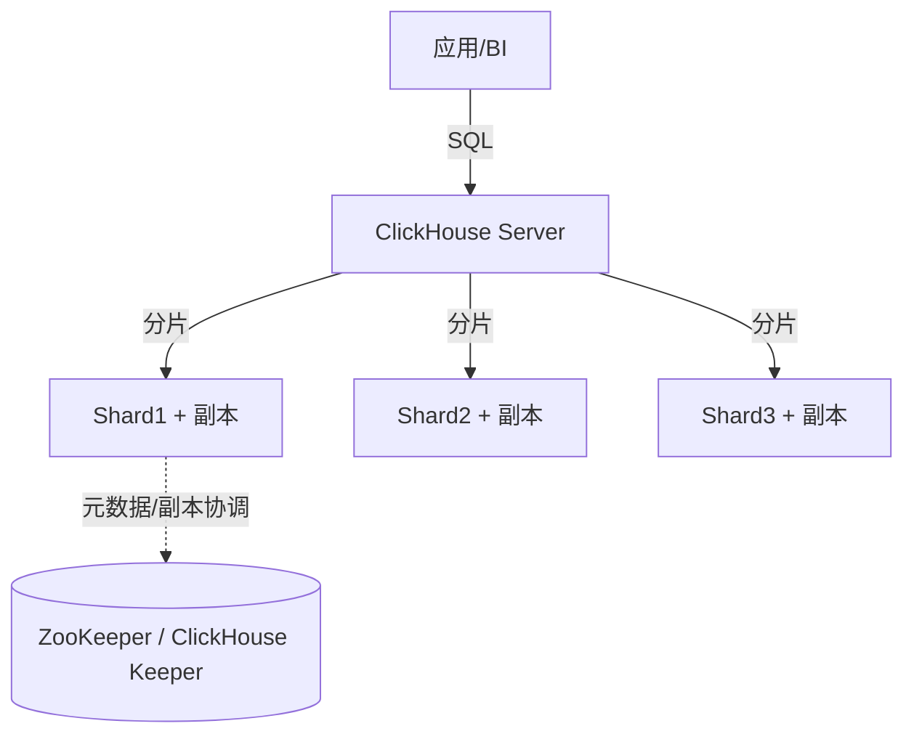

# ClickHouse（OLAP 列存实时分析数据库）

> 为「海量数据的分析查询」而生的列式数据库，单表聚合查询性能极致、压缩率高。
> 适合：日志/埋点分析、监控指标、用户行为（漏斗/路径）、实时 BI 报表、用户画像宽表。
> 不适合：高频事务更新（UPDATE/DELETE 是异步合并）、强事务、复杂多表 JOIN 实时性要求高的场景。

---

## 〇、本体介绍（它是什么 / 适用场景 / 核心概念）

**它是什么**：ClickHouse 是俄罗斯 Yandex 开源的列式（Columnar）OLAP 数据库，用 C++ 编写，主打「亿级数据亚秒聚合」，是实时分析、日志/埋点分析、BI 报表的利器。

**解决什么痛点**：传统行存数据库（MySQL）做聚合分析要扫全表、IO 爆炸；ES 存储成本高、吃内存。ClickHouse 用列存 + 向量化执行 + 稀疏索引，把「读多列、聚合」的分析场景性能拉满，且磁盘压缩比可达 10:1。

**核心概念**：MergeTree 表引擎家族（核心）、Order By（排序键/主键，决定稀疏索引）、Partition（分区，按天等）、Primary Key（稀疏索引）、Materialized View（物化视图/预聚合）、TTL（自动过期）、ReplicatedMergeTree（副本）。

**适用场景**：日志分析、用户行为分析、实时监控大盘、BI 即席查询、宽表聚合。
**不适用**：高并发点查、频繁单行更新删除、事务型 OLTP。

---

## 一、为什么快：OLAP vs OLTP

| 维度 | OLTP（MySQL） | OLAP（ClickHouse） |
|------|---------------|--------------------|
| 目标 | 日常事务，小批量读写 | 海量历史数据分析 |
| 数据量 | 千万~亿 | 十亿~万亿行 |
| 查询 | 点查/范围，少列 | 聚合、扫描多行少列 |
| 存储 | 行存 | **列存** |

**列存的核心优势**
1. **减少 I/O**：100 列的表只查 3 列，行存读 100 列、列存只读 3 列 → I/O 减 97%。
2. **高压缩**：同一列数据类型相同、相似度高，压缩率远优于行存。
3. **向量化执行**：以「列块」为单位批量处理，吃满 CPU 缓存与 SIMD 指令。

> 官方实测：1 亿行网络分析查询 92 毫秒（>10 亿行/秒）。仓库 `github.com/ClickHouse/ClickHouse`（C++/Rust，Apache-2.0 类，25 万+ commits，活跃度极高）。

---

## 二、整体架构

- **Shared-Nothing**：每个节点独立，查询并行分发、结果合并，可线性扩展。
- **数据分布**：按分片键分片，每分片多副本（高可用）。
- **元数据/副本协调**：依赖 ZooKeeper 或官方替代 **ClickHouse Keeper**（Raft 实现）。
- 单机也能跑，集群可到数百/数千节点。

---

## 三、核心：MergeTree 表引擎家族

ClickHouse 的「快」很大程度来自表引擎。Mergetree 系列是主力：

| 引擎 | 语义 |
|------|------|
| **MergeTree** | 通用，按主键排序，后台合并 part |
| **ReplacingMergeTree** | 按版本去重（后台合并时生效，非实时） |
| **SummingMergeTree** | 相同键自动求和预聚合 |
| **AggregatingMergeTree** | 预聚合（配合物化视图做实时指标） |
| **Collapsing / VersionedCollapsing** | 行折叠（正负抵消实现 UPDATE/DELETE 语义） |
| **Log / TinyLog** | 轻量小表 |

**写入模型**：数据先写内存 part → 落盘 → 后台异步 merge（类似 LSM）。因此 UPDATE/DELETE 不是即时生效，而是「标记 + 后台合并」，**不适合高频点更新**。

---

## 四、关键特性

1. **向量化执行引擎**：列块批量处理，吃满 SIMD。
2. **完备 SQL**：支持 JOIN、子查询、窗口函数、CTE，兼容大多数 ANSI SQL。
3. **数据跳过索引（Data Skipping Index）**：基于主键 + 跳数索引，大幅减少扫描。
4. **物化视图**：预计算常用聚合，查询直接读结果，加速 BI。
5. **Kafka Engine / S3 Engine**：原生消费 Kafka、读 S3，省 ETL。
6. **分层存储**：热数据本地盘、冷数据 S3（降本）。
7. **高写入吞吐**：追加写入友好，日志/埋点场景百万行/秒级导入。

---

## 五、ClickHouse vs 其他 OLAP（StarRocks / Doris）

来自 2025 年横向评测（TPC-H 100G 估算，典型场景）：

| 维度 | ClickHouse | StarRocks | Apache Doris |
|------|-----------|-----------|--------------|
| 定位 | 单表聚合无敌 | 高并发+复杂 JOIN | 易部署低成本 |
| 单表聚合 | ⭐ 极快 | 极快 | 快 |
| 多表 JOIN | 较弱（手动优化） | ⭐ 极快（CBO+向量化） | 中等 |
| 高并发 QPS | 一般（资源竞争） | ⭐ 优秀 | 中等 |
| 实时更新 | 异步合并（弱） | ⭐ 主键表实时 | 主键模型 |
| 运维复杂度 | 高（配置项多） | 中 | 低 |
| 存算分离 | S3 表引擎 | 支持 | 实验性 |

**选型建议**
- 日志/监控/用户行为（追加为主、单表聚合）→ **ClickHouse**
- 高并发 BI、频繁更新维度表、复杂 JOIN → **StarRocks / Doris**
- 中小团队快速上线低成本 → **Doris**

---

## 六、生产实践与避坑

1. **宽表优先**：ClickHouse 不擅长多表 JOIN，常把数据打成一张大宽表（如用户行为宽表），用空间换 JOIN 性能。
2. **分片键/排序键设计**：ORDER BY 决定主键排序与稀疏索引，直接影响查询裁剪。
3. **避免高频 UPDATE**：用 ReplacingMergeTree / Collapsing 表达「最终一致」的更新语义，别当 MySQL 用。
4. **物化视图预聚合**：大表上建物化视图承接实时指标，避免每次全表扫。
5. **Kafka 直读**：用 Kafka Engine 直接消费，省一层 Flink（简单场景）。
6. **监控**：Prometheus + Grafana，关注 merge 速度、part 数量、内存。
7. **与 Java 集成**：JDBC driver 或 `clickhouse-jdbc`，MyBatis 亦可，注意批量写入用 `INSERT ... SELECT` 或 Native 协议。

---

## 七、与其他板块的关系

- 与 [大数据/HBase](../大数据/06-分布式NoSQL与HBase.md)：HBase 是 KV 宽列、适合点查/随机读写；ClickHouse 是列存 OLAP、适合扫描聚合。二者场景不同。
- 与 [ES 体系](../ES体系.md)：ES 偏「搜索 + 明细检索 + 日志全文」，ClickHouse 偏「结构化聚合分析」。日志场景常 ClickHouse 做聚合 + ES 做检索，或 ClickHouse 取代部分 ES 聚合。
- 与 [数据同步 CDC-Canal](数据同步CDC-Canal.md)：MySQL binlog → Kafka → ClickHouse 是常见实时数仓链路。
- 与 [消息队列 MQ](../MQ.md)：ClickHouse 常作为 Kafka 下游消费端，承载实时分析。

---

## 八、速查表

| 项 | 结论 |
|----|------|
| 类型 | 列式 OLAP DBMS |
| 最快场景 | 单表大批量聚合扫描 |
| 存储 | 列存 + 高压缩 + 向量化 |
| 核心引擎 | MergeTree 家族 |
| 更新 | 异步合并（非实时） |
| 扩展 | Shared-Nothing，线性扩展 |
| 协调 | ZooKeeper / ClickHouse Keeper |
| 生态 | Kafka/S3 Engine、物化视图、BI |
| 许可证 | Apache-2.0 类 |
| 一句话 | 「单表聚合之王」，为分析而生 |

---

## 面试高频问题（20+ 条）

1. **ClickHouse 为什么快？** 列存（只扫查询列，IO 小）、向量化执行（SIMD，批量处理）、稀疏索引（跳块扫描）、压缩比高（LZ4/ZSTD）、单表大宽表聚合友好。

2. **MergeTree 是什么，核心机制？** ClickHouse 最核心的表引擎家族。数据按 Order By（主键）排序写入「数据部分（part）」，后台异步合并（merge）小 part；主键是稀疏索引，只记录每块首尾，不能做单点精确定位但能快速跳块。

3. **Order By / Primary Key 设计原则？** Order By 决定物理排序与稀疏索引，把最常用过滤字段放最前（如 (service_name, event_time)）；Primary Key 默认是 Order By 前缀；选错会导致扫描放大。

4. **写入优化（Batch 是王道）？** 极其讨厌单条 INSERT；应攒批（每批数千~数万行，或每秒一批）写入。单条插入会疯狂产生小 part，合并打满磁盘 IO。预排序数据可跳过排序步骤更快。

5. **物化视图（Materialized View）作用？** 空间换时间、预聚合。对高频聚合（如每分钟错误数）建物化视图落到 SummingMergeTree/AggregatingMergeTree，查询直接读预聚合结果，实现亚秒响应。注意物化视图是触发器，写入原表时自动写视图表。

6. **与 ES 怎么选？** CH 列存、有序、向量化，擅长大数据量聚合分析、压缩比高、不依赖大内存；ES 倒排索引+内存预热，擅长高并发全文检索与小结果返回。CH 不适合全文检索，ES 不适合超大量聚合扫描。日志分析场景 CH 成本更低。

7. **分区（Partition）与分片（Shard）？** 分区是单表内按天/业务切分（PARTITION BY），利于 DROP PARTITION 清历史；分片是集群级水平扩展（分机器）。两者不同维度。

8. **LowCardinality 类型有什么用？** 对低基数（重复率高）字段（如 service_name、log_level）做字典编码，极大减少内存与 IO，查询提速 2-5 倍。

9. **数据类型优化？** 用整数替字符串、IPv4 替 String 存 IP、Date/DateTime 替字符串、适当 CODEC 压缩（如 ZSTD）。

10. **TTL 用途？** 表/列级 TTL 自动过期或迁移冷数据，省磁盘、提升查询。

11. **首查慢、后台合并影响写入怎么办？** 调 background_merge_threads、控制合并阈值；合理设分区避免过多小 part；用 Buffer 表/攒批缓解。

12. **高并发与资源隔离？** max_concurrent_queries 限并发；per-user/per-role 配额；query_queue 优先级调度；大查询低优先级，关键业务高优先级。

13. **ClickHouse 的局限？** 不适合高并发点查、不支持完整事务（无 ACID）、UPDATE/DELETE 是异步 mutation 较重、Join 大表性能一般（小表 join 大表用 join 引擎）。

14. **Join 优化？** 优先「小表 broadcast join 大表」；用 join_algorithm=hash；避免大表 join 大表；可用字典（Dictionary）替 join。

15. **与 StarRocks / Doris 区别？** StarRocks/Doris 是 MPP 架构、支持更优的多表 Join 与实时更新、并发更好；CH 在单表聚合与生态成熟度上强，但 Join 与高并发偏弱。

16. **副本机制（ReplicatedMergeTree）？** 基于 ZooKeeper 协调多副本，保证数据冗余与高可用；写主副本同步到其他副本。

17. **稀疏索引 vs 稠密索引？** 稠密索引每行一个指针（MySQL B+ 树），稀疏索引每块一个（CH），更省空间但只能范围跳块，不适合点查。

18. **如何控制单分区数据量？** 按天分区 + TTL；单分区过大影响合并与查询，过小则 part 过多。

19. **客户端/写入接口？** 原生 TCP 接口（快）与 HTTP 接口；支持 70+ 种数据格式；异步插入（async insert）可缓解小批。

20. **监控指标看哪些？** 查询耗时、扫描行数/字节、内存使用、合并队列、part 数量、复制延迟。

21. **为何说 CH 是「写放大」友好但「更新」不友好？** 追加写+后台合并极适合日志类；UPDATE/DELETE 是异步 mutation，重写 part，频繁更新会拖性能。

22. **何时选 ClickHouse 而非传统数仓？** 需要实时（秒级）交互式分析、成本敏感、数据以追加为主、无需复杂事务时，CH 性价比极高。
