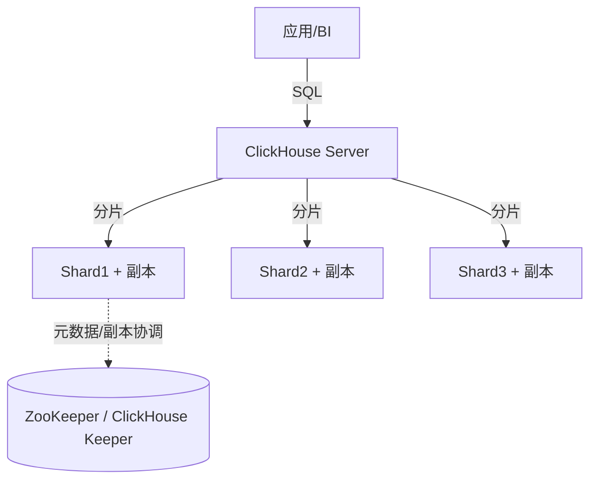

# ClickHouse（OLAP 列存实时分析数据库）

> 为「海量数据的分析查询」而生的列式数据库，单表聚合查询性能极致、压缩率高。
> 适合：日志/埋点分析、监控指标、用户行为（漏斗/路径）、实时 BI 报表、用户画像宽表。
> 不适合：高频事务更新（UPDATE/DELETE 是异步合并）、强事务、复杂多表 JOIN 实时性要求高的场景。

---

## 一、为什么快：OLAP vs OLTP

| 维度 | OLTP（MySQL） | OLAP（ClickHouse） |
|------|---------------|--------------------|
| 目标 | 日常事务，小批量读写 | 海量历史数据分析 |
| 数据量 | 千万~亿 | 十亿~万亿行 |
| 查询 | 点查/范围，少列 | 聚合、扫描多行少列 |
| 存储 | 行存 | **列存** |

**列存的核心优势**
1. **减少 I/O**：100 列的表只查 3 列，行存读 100 列、列存只读 3 列 → I/O 减 97%。
2. **高压缩**：同一列数据类型相同、相似度高，压缩率远优于行存。
3. **向量化执行**：以「列块」为单位批量处理，吃满 CPU 缓存与 SIMD 指令。

> 官方实测：1 亿行网络分析查询 92 毫秒（>10 亿行/秒）。仓库 `github.com/ClickHouse/ClickHouse`（C++/Rust，Apache-2.0 类，25 万+ commits，活跃度极高）。

---

## 二、整体架构

- **Shared-Nothing**：每个节点独立，查询并行分发、结果合并，可线性扩展。
- **数据分布**：按分片键分片，每分片多副本（高可用）。
- **元数据/副本协调**：依赖 ZooKeeper 或官方替代 **ClickHouse Keeper**（Raft 实现）。
- 单机也能跑，集群可到数百/数千节点。

---

## 三、核心：MergeTree 表引擎家族

ClickHouse 的「快」很大程度来自表引擎。Mergetree 系列是主力：

| 引擎 | 语义 |
|------|------|
| **MergeTree** | 通用，按主键排序，后台合并 part |
| **ReplacingMergeTree** | 按版本去重（后台合并时生效，非实时） |
| **SummingMergeTree** | 相同键自动求和预聚合 |
| **AggregatingMergeTree** | 预聚合（配合物化视图做实时指标） |
| **Collapsing / VersionedCollapsing** | 行折叠（正负抵消实现 UPDATE/DELETE 语义） |
| **Log / TinyLog** | 轻量小表 |

**写入模型**：数据先写内存 part → 落盘 → 后台异步 merge（类似 LSM）。因此 UPDATE/DELETE 不是即时生效，而是「标记 + 后台合并」，**不适合高频点更新**。

---

## 四、关键特性

1. **向量化执行引擎**：列块批量处理，吃满 SIMD。
2. **完备 SQL**：支持 JOIN、子查询、窗口函数、CTE，兼容大多数 ANSI SQL。
3. **数据跳过索引（Data Skipping Index）**：基于主键 + 跳数索引，大幅减少扫描。
4. **物化视图**：预计算常用聚合，查询直接读结果，加速 BI。
5. **Kafka Engine / S3 Engine**：原生消费 Kafka、读 S3，省 ETL。
6. **分层存储**：热数据本地盘、冷数据 S3（降本）。
7. **高写入吞吐**：追加写入友好，日志/埋点场景百万行/秒级导入。

---

## 五、ClickHouse vs 其他 OLAP（StarRocks / Doris）

来自 2025 年横向评测（TPC-H 100G 估算，典型场景）：

| 维度 | ClickHouse | StarRocks | Apache Doris |
|------|-----------|-----------|--------------|
| 定位 | 单表聚合无敌 | 高并发+复杂 JOIN | 易部署低成本 |
| 单表聚合 | ⭐ 极快 | 极快 | 快 |
| 多表 JOIN | 较弱（手动优化） | ⭐ 极快（CBO+向量化） | 中等 |
| 高并发 QPS | 一般（资源竞争） | ⭐ 优秀 | 中等 |
| 实时更新 | 异步合并（弱） | ⭐ 主键表实时 | 主键模型 |
| 运维复杂度 | 高（配置项多） | 中 | 低 |
| 存算分离 | S3 表引擎 | 支持 | 实验性 |

**选型建议**
- 日志/监控/用户行为（追加为主、单表聚合）→ **ClickHouse**
- 高并发 BI、频繁更新维度表、复杂 JOIN → **StarRocks / Doris**
- 中小团队快速上线低成本 → **Doris**

---

## 六、生产实践与避坑

1. **宽表优先**：ClickHouse 不擅长多表 JOIN，常把数据打成一张大宽表（如用户行为宽表），用空间换 JOIN 性能。
2. **分片键/排序键设计**：ORDER BY 决定主键排序与稀疏索引，直接影响查询裁剪。
3. **避免高频 UPDATE**：用 ReplacingMergeTree / Collapsing 表达「最终一致」的更新语义，别当 MySQL 用。
4. **物化视图预聚合**：大表上建物化视图承接实时指标，避免每次全表扫。
5. **Kafka 直读**：用 Kafka Engine 直接消费，省一层 Flink（简单场景）。
6. **监控**：Prometheus + Grafana，关注 merge 速度、part 数量、内存。
7. **与 Java 集成**：JDBC driver 或 `clickhouse-jdbc`，MyBatis 亦可，注意批量写入用 `INSERT ... SELECT` 或 Native 协议。

---

## 七、与其他板块的关系

- 与 [大数据/HBase](大数据/06-分布式NoSQL与HBase.md)：HBase 是 KV 宽列、适合点查/随机读写；ClickHouse 是列存 OLAP、适合扫描聚合。二者场景不同。
- 与 [ES 体系](ES体系.md)：ES 偏「搜索 + 明细检索 + 日志全文」，ClickHouse 偏「结构化聚合分析」。日志场景常 ClickHouse 做聚合 + ES 做检索，或 ClickHouse 取代部分 ES 聚合。
- 与 [数据同步 CDC-Canal](数据同步CDC-Canal.md)：MySQL binlog → Kafka → ClickHouse 是常见实时数仓链路。
- 与 [消息队列 MQ](MQ.md)：ClickHouse 常作为 Kafka 下游消费端，承载实时分析。

---

## 八、速查表

| 项 | 结论 |
|----|------|
| 类型 | 列式 OLAP DBMS |
| 最快场景 | 单表大批量聚合扫描 |
| 存储 | 列存 + 高压缩 + 向量化 |
| 核心引擎 | MergeTree 家族 |
| 更新 | 异步合并（非实时） |
| 扩展 | Shared-Nothing，线性扩展 |
| 协调 | ZooKeeper / ClickHouse Keeper |
| 生态 | Kafka/S3 Engine、物化视图、BI |
| 许可证 | Apache-2.0 类 |
| 一句话 | 「单表聚合之王」，为分析而生 |
