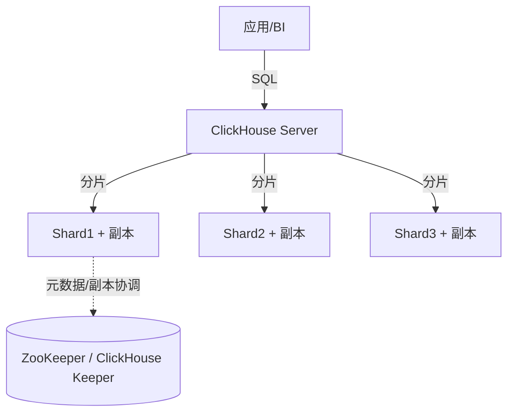
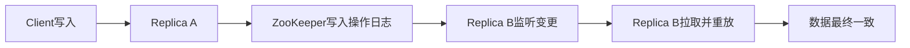
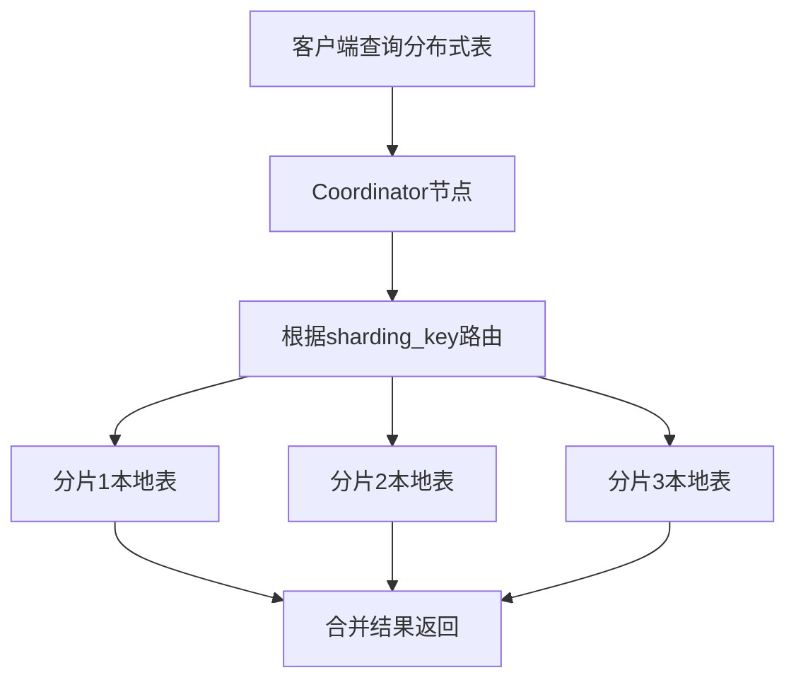
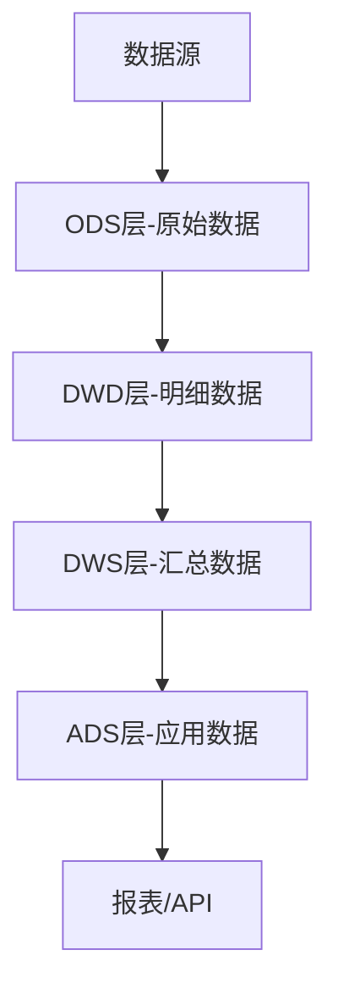

# ClickHouse（OLAP 列存实时分析数据库）

> 为「海量数据的分析查询」而生的列式数据库，单表聚合查询性能极致、压缩率高。
> 适合：日志/埋点分析、监控指标、用户行为（漏斗/路径）、实时 BI 报表、用户画像宽表。
> 不适合：高频事务更新（UPDATE/DELETE 是异步合并）、强事务、复杂多表 JOIN 实时性要求高的场景。
> 本文按「本体 → 为什么快 → 架构 → MergeTree 引擎 → 特性 → 对比 → 实践避坑」拆解。

---

## 〇、本体介绍

**它是什么**：ClickHouse 是俄罗斯 Yandex 开源的列式（Columnar）OLAP 数据库，用 C++ 编写，主打「亿级数据亚秒聚合」，是实时分析、日志/埋点分析、BI 报表的利器。

**解决什么痛点**：传统行存数据库（MySQL）做聚合分析要扫全表、IO 爆炸；ES 存储成本高、吃内存。ClickHouse 用列存 + 向量化执行 + 稀疏索引，把「读多列、聚合」的分析场景性能拉满，且磁盘压缩比可达 10:1。

**核心概念**：MergeTree 表引擎家族（核心）、Order By（排序键/主键，决定稀疏索引）、Partition（分区，按天等）、Primary Key（稀疏索引）、Materialized View（物化视图/预聚合）、TTL（自动过期）、ReplicatedMergeTree（副本）。

**适用场景**：日志分析、用户行为分析、实时监控大盘、BI 即席查询、宽表聚合。
**不适用**：高并发点查、频繁单行更新删除、事务型 OLTP。

---

## 一、为什么快：OLAP vs OLTP

| 维度 | OLTP（MySQL） | OLAP（ClickHouse） |
|------|---------------|--------------------|
| 目标 | 日常事务，小批量读写 | 海量历史数据分析 |
| 数据量 | 千万~亿 | 十亿~万亿行 |
| 查询 | 点查/范围，少列 | 聚合、扫描多行少列 |
| 存储 | 行存 | **列存** |

**列存的核心优势**
1. **减少 I/O**：100 列的表只查 3 列，行存读 100 列、列存只读 3 列 → I/O 减 97%。
2. **高压缩**：同一列数据类型相同、相似度高，压缩率远优于行存。
3. **向量化执行**：以「列块」为单位批量处理，吃满 CPU 缓存与 SIMD 指令。

### 1.1 查询执行管线

```
SQL → 解析/分析 → 查询计划优化（下推谓词/裁剪列）
  → 读列块（按需列 + 稀疏索引跳块 + 跳过索引）
  → 向量化执行（列块批量算子：filter/aggregate/join）
  → 合并中间结果 → 输出

关键：全链路"列块级"操作，避免逐行解释执行（对比 MySQL 逐行）
```

---

## 二、整体架构



- **Shared-Nothing**：每个节点独立，查询并行分发、结果合并，可线性扩展。
- **数据分布**：按分片键分片，每分片多副本（高可用）。
- **元数据/副本协调**：依赖 ZooKeeper 或官方替代 **ClickHouse Keeper**（Raft 实现）。
- 单机也能跑，集群可到数百/数千节点。

---

## 三、核心：MergeTree 表引擎家族

ClickHouse 的「快」很大程度来自表引擎。Mergetree 系列是主力：

| 引擎 | 语义 |
|------|------|
| **MergeTree** | 通用，按主键排序，后台合并 part |
| **ReplacingMergeTree** | 按版本去重（后台合并时生效，非实时） |
| **SummingMergeTree** | 相同键自动求和预聚合 |
| **AggregatingMergeTree** | 预聚合（配合物化视图做实时指标） |
| **Collapsing / VersionedCollapsing** | 行折叠（正负抵消实现 UPDATE/DELETE 语义） |
| **Log / TinyLog** | 轻量小表 |

### 3.1 写入与合并机制（LSM 风格）

```
写入模型：
  数据先写内存 part → 周期性落盘（flush）
  → 后台异步 merge 小 part 为大 part（类似 LSM）

因此：
  UPDATE/DELETE 不是即时生效，而是「标记 + 后台合并」
  不适合高频点更新；点查不如 MySQL/HBase
```

```
合并过程：
  多个小 part（part_0_0_0）→ 后台线程合并 → 大 part（part_0_99_1）
  合并是异步、有序的（按主键顺序），不阻塞读写
  监控合并队列深度（part 数过多说明写入批次过小）
```

### 3.2 Order By / 主键 / 分区

```
ORDER BY：决定物理排序 + 稀疏索引（primary key 默认是 order by 前缀）
  原则：最常用过滤字段放最前（如 service_name, event_time）
  查询只扫命中的稀疏索引区间 → 跳过无关块

PARTITION BY：单表内按天/业务切分
  利于 DROP PARTITION 快速清历史
  分区粒度：过大合并慢、过小 part 过多（通常按天）

主键（稀疏索引）：
  每 part 记录首尾 key（约 8192 行一个 granule）
  只能范围跳块，不能单点精确定位（适合扫描聚合，不适合点查）
```

---

## 四、关键特性

1. **向量化执行引擎**：列块批量处理，吃满 SIMD。
2. **完备 SQL**：支持 JOIN、子查询、窗口函数、CTE，兼容大多数 ANSI SQL。
3. **数据跳过索引（Data Skipping Index）**：基于主键 + 跳数索引（minmax/bloom/ngram），大幅减少扫描。
4. **物化视图**：预计算常用聚合，查询直接读结果，加速 BI。
5. **Kafka Engine / S3 Engine**：原生消费 Kafka、读 S3，省 ETL。
6. **分层存储**：热数据本地盘、冷数据 S3（降本）。
7. **高写入吞吐**：追加写入友好，日志/埋点场景百万行/秒级导入。
8. **LowCardinality / 字典编码**：低基数字段（service_name/log_level）字典编码，查询提速 2-5 倍。
9. **TTL 自动过期**：表/列级 TTL 自动删除或迁移冷数据。

---

## 五、ClickHouse vs 其他 OLAP（StarRocks / Doris）

| 维度 | ClickHouse | StarRocks | Apache Doris |
|------|-----------|-----------|--------------|
| 定位 | 单表聚合无敌 | 高并发+复杂 JOIN | 易部署低成本 |
| 单表聚合 | ⭐ 极快 | 极快 | 快 |
| 多表 JOIN | 较弱（手动优化） | ⭐ 极快（CBO+向量化） | 中等 |
| 高并发 QPS | 一般（资源竞争） | ⭐ 优秀 | 中等 |
| 实时更新 | 异步合并（弱） | ⭐ 主键表实时 | 主键模型 |
| 运维复杂度 | 高（配置项多） | 中 | 低 |
| 存算分离 | S3 表引擎 | 支持 | 实验性 |

**选型建议**
- 日志/监控/用户行为（追加为主、单表聚合）→ **ClickHouse**
- 高并发 BI、频繁更新维度表、复杂 JOIN → **StarRocks / Doris**
- 中小团队快速上线低成本 → **Doris**

---

## 六、生产实践与避坑

### 6.1 设计原则

1. **宽表优先**：ClickHouse 不擅长多表 JOIN，常把数据打成一张大宽表（如用户行为宽表），用空间换 JOIN 性能。
2. **分片键/排序键设计**：ORDER BY 决定主键排序与稀疏索引，直接影响查询裁剪。
3. **避免高频 UPDATE**：用 ReplacingMergeTree / Collapsing 表达「最终一致」的更新语义，别当 MySQL 用。
4. **物化视图预聚合**：大表上建物化视图承接实时指标，避免每次全表扫。
5. **Kafka 直读**：用 Kafka Engine 直接消费，省一层 Flink（简单场景）。

### 6.2 写入优化

```
Batch 是王道：
  极其讨厌单条 INSERT（疯狂产生小 part，合并打满磁盘 IO）
  应攒批：每批数千~数万行，或每秒一批
  预排序数据可跳过排序步骤更快
  async insert（异步插入）可缓解小批问题

监控：part 数量、合并队列、后台合并线程
```

### 6.3 查询优化

```
 尽量按分区/主键过滤（分区裁剪 + 稀疏索引跳块）
 小表 broadcast join 大表（join_algorithm=hash）
 用字典（Dictionary）替 join（低基数字段映射）
 避免大表 join 大表（先聚合再 join）
 LowCardinality 声明低基数字段
 数据类型优化：整数替字符串、IPV4 类型、Date 替字符串
```

### 6.4 高并发与资源隔离

```
max_concurrent_queries 限并发
per-user/per-role 配额（max_memory_usage）
query_queue 优先级调度（大查询低优先级，关键业务高优先级）
资源隔离：多业务分集群/分用户
```

### 6.5 监控与运维

```
Prometheus + Grafana
关键指标：查询耗时、扫描行数/字节、内存、合并队列、part 数量、复制延迟
调 background_merge_threads 控制合并对写入的影响
合理分区避免过多小 part
```

---

## 七、MergeTree 引擎家族深度解析

### 7.1 MergeTree 核心机制

```
MergeTree 写入流程：
  INSERT 数据 → 内存缓冲区（每表独立）
  → 按 block 大小（max_insert_block_size，默认 1048576 行）刷写到磁盘
  → 生成一个 data part（按 ORDER BY 排序的列文件集合）
  → 后台 merge 线程合并小 part 为大 part（基于 size_ratio 合并策略）

MergeTree 数据目录结构：
  /var/lib/clickhouse/data/{database}/{table}/
    ├── {partition_id}/
    │   ├── all_1_1_0/          # part 名：all_{min_block}_{max_block}_{level}
    │   │   ├── data.bin        # 列数据（压缩）
    │   │   ├── data.mrk3       # mark 文件（稀疏索引到数据偏移映射）
    │   │   ├── primary.idx     # 主键稀疏索引
    │   │   ├── count.txt       # 行数
    │   │   ├── columns.txt     # 列定义
    │   │   └── partition.dat   # 分区值
    │   └── all_2_2_0/
    └── detached/               # 分离的 part（ALTER DETACH）
```

### 7.2 MergeTree 变体引擎详解

| 引擎 | 核心机制 | 适用场景 | 关键配置 |
|------|----------|----------|----------|
| **ReplacingMergeTree** | 后台合并时按 ORDER BY 去重，保留最新版本行 | 维度表更新、CDC 写入 | `ver` 参数指定版本列 |
| **SummingMergeTree** | 合并时对 ORDER BY 以外的数值列自动求和 | 预聚合计数/求和 | 指定求和列或全部数值列 |
| **AggregatingMergeTree** | 合并时对列执行聚合函数（需配合 State 函数） | 复杂预聚合（avg/uniq/quantile） | 配合物化视图 + -State/-Merge 函数 |
| **CollapsingMergeTree** | 通过 sign 列（+1/-1）行折叠实现逻辑更新 | CDC 场景、订单状态变更 | `sign` 列，`version` 可选 |
| **VersionedCollapsingMergeTree** | 在 Collapsing 基础上增加 version 列保证折叠顺序 | 并发写入场景 | `sign` + `version` 列 |

### 7.3 ReplacingMergeTree 使用模式

```sql
-- 维度表：用户信息（CDC 写入）
CREATE TABLE user_dim ON CLUSTER cluster (
    user_id UInt64,
    name String,
    age UInt8,
    update_time DateTime,
    ver UInt32  -- 版本号（时间戳或自增）
) ENGINE = ReplacingMergeTree(ver)
PARTITION BY toYYYYMM(update_time)
ORDER BY (user_id);

-- 查询时需用 FINAL 去重（否则可能查到多个版本）
SELECT * FROM user_dim FINAL WHERE user_id = 123;

-- 不加 FINAL 的风险：查询可能返回旧版本行（合并尚未完成）
-- FINAL 的代价：查询时实时去重，性能下降
```

### 7.4 AggregatingMergeTree + 物化视图实时聚合

```sql
-- 原始日志表
CREATE TABLE access_log (
    service_name LowCardinality(String),
    event_time DateTime,
    status_code UInt16,
    response_time_ms Float32
) ENGINE = MergeTree()
PARTITION BY toYYYYMMDD(event_time)
ORDER BY (service_name, event_time);

-- 聚合物化视图（每分钟指标预聚合）
CREATE MATERIALIZED VIEW mv_service_metrics
ENGINE = AggregatingMergeTree()
PARTITION BY toYYYYMM(window_start)
ORDER BY (service_name, window_start)
AS SELECT
    service_name,
    toStartOfMinute(event_time) AS window_start,
    countState() AS request_count,
    avgState(response_time_ms) AS avg_latency,
    uniqState(status_code) AS status_codes
FROM access_log
GROUP BY service_name, window_start;

-- 查询聚合结果（必须用 -Merge 函数读取 State 列）
SELECT
    service_name,
    window_start,
    countMerge(request_count),
    avgMerge(avg_latency),
    uniqMerge(status_codes)
FROM mv_service_metrics
WHERE window_start > now() - INTERVAL 1 HOUR
GROUP BY service_name, window_start;
```

---

## 八、Projections（投影）与分布式表

### 8.1 Projections（投影）

```
Projection = 一份数据的「另一种物理排序/预聚合」副本
  随主表写入自动维护
  查询时自动选择最优投影（基于 WHERE/ORDER BY）
  代价：写放大（写一份数据，同时维护多个投影）

适用场景：
  - 同一表有多种查询模式（不同 ORDER BY）
  - 高频聚合查询
```

```sql
-- 创建投影：按不同维度排序
ALTER TABLE access_log ADD PROJECTION projection_by_status (
    SELECT *
    ORDER BY (status_code, event_time)
);

-- 创建投影：预聚合
ALTER TABLE access_log ADD PROJECTION projection_daily_metrics (
    SELECT
        service_name,
        toStartOfDay(event_time) AS day,
        count() AS cnt,
        avg(response_time_ms) AS avg_lat
    GROUP BY service_name, day
);

-- 激活已有投影
ALTER TABLE access_log MATERIALIZE PROJECTION projection_by_status;
```

### 8.2 分布式表（Distributed Engine）

```sql
-- 本地表（实际存储数据）
CREATE TABLE events_local ON CLUSTER cluster (
    event_time DateTime,
    user_id UInt64,
    event_type LowCardinality(String)
) ENGINE = MergeTree()
PARTITION BY toYYYYMM(event_time)
ORDER BY (user_id, event_time);

-- 分布式表（查询入口，自动路由到分片）
CREATE TABLE events ON CLUSTER cluster AS events_local
ENGINE = Distributed(cluster, default, events_local, xxHash64(user_id));
--                                        分片键：按 user_id 哈希路由

-- Distributed 引擎参数：
--   cluster: 集群名
--   database: 数据库名
--   local_table: 本地表名
--   sharding_key: 分片键（决定数据路由）

-- 查询分布式表：
SELECT count() FROM events WHERE event_time > now() - INTERVAL 1 DAY;
-- Coordinator 将查询分发到所有分片 → 并行执行 → 合并结果
```

### 8.3 全局表（Global Table）广播

```sql
-- 小表广播到所有节点（避免 JOIN 时跨网络拉取）
CREATE TABLE config_dict ON CLUSTER cluster (
    key String,
    value String
) ENGINE = ReplicatedReplacingMergeTree()
ORDER BY key
SETTINGS modes = 'global';  -- 全局表模式

-- JOIN 时自动使用本地副本
SELECT * FROM events e
JOIN config_dict c ON e.event_type = c.key;
-- 每个分片本地都有 config_dict 的完整副本，无需跨分片 JOIN
```

---

## 九、Kafka Engine 与 Buffer Engine

### 9.1 Kafka Engine 集成

```sql
-- 创建 Kafka 消费表（不存储数据，实时消费）
CREATE TABLE kafka_consumer (
    message String,
    topic LowCardinality(String),
    partition UInt32,
    offset UInt64
) ENGINE = Kafka()
SETTINGS
    kafka_broker_list = 'kafka1:9092,kafka2:9092',
    kafka_topic_list = 'access_log',
    kafka_group_name = 'clickhouse_consumer',
    kafka_format = 'JSONEachRow',
    kafka_num_consumers = 4,
    kafka_max_block_size = 1048576;

-- Kafka Engine 不存储数据！必须配合物化视图落地
CREATE MATERIALIZED VIEW kafka_to_local
ENGINE = MergeTree()
PARTITION BY toYYYYMM(event_time)
ORDER BY (event_time)
AS SELECT
    JSONExtractString(message, 'service') AS service_name,
    toDateTime(JSONExtractString(message, 'timestamp')) AS event_time,
    JSONExtractFloat(message, 'latency') AS latency
FROM kafka_consumer;

-- Kafka Engine 配置项：
--   kafka_num_consumers: 消费者数（≤ topic 分区数）
--   kafka_max_block_size: 每批最大行数（控制刷写频率）
--   kafka_skip_broken_messages: 跳过解析失败的消息数
```

### 9.2 Buffer Engine（缓冲写入）

```sql
-- Buffer 表：内存缓冲区，批量刷写到目标表
CREATE TABLE events_buffer AS events_local
ENGINE = Buffer(
    default,          -- 数据库
    events_local,     -- 目标表
    16,               -- 最小层数
    10,               -- 最大层数
    100,              -- 每层最小时间（秒）
    10000,            -- 每层最大行数
    10000000,         -- 每层最小字节
    100000000,        -- 每层最大字节
    10000000,         -- 目标缓冲行数
    1000000000        -- 目标缓冲字节
);

-- 写入 Buffer 表（高频小批量写入友好）
INSERT INTO events_buffer VALUES (...);

-- Buffer 表原理：
--   写入先到内存（多层缓冲）
--   达到阈值后批量 flush 到目标 MergeTree 表
--   服务重启会丢失未 flush 数据（非持久化）
--   适用：高频小批量写入，合并到目标表后自动清理
```

---

## 十、Sampling（采样）与 JOIN 算法

### 10.1 Sampling 采样查询

```sql
-- 创建采样表
CREATE TABLE events_sampled (
    event_time DateTime,
    user_id UInt64,
    event_type String
) ENGINE = MergeTree()
ORDER BY (user_id, event_time)
SAMPLE BY user_id;  -- 按 user_id 采样（同一 user_id 的所有行一起采样）

-- 采样查询：TABLESAMPLE SYSTEM SAMPLE 0.1（10% 采样）
SELECT count() / 0.1 AS estimated_total  -- 估算全量
FROM events_sampled
SAMPLE 0.1
WHERE event_type = 'click';

-- 采样要求：
--   采样键必须是 ORDER BY 的前缀
--   采样比例必须是 2 的幂倒数（1/2^n），如 0.1 不是合法值
--   合法值：1/1024, 1/512, 1/256, 1/128, 1/64, 1/32, 1/16, 1/8, 1/4, 1/2, 1
```

### 10.2 JOIN 算法详解

```
ClickHouse JOIN 算法：
  1. hash join（默认）：小表构建哈希表，大表探测
     - 适用：小表 < 几百 MB
     - 配置：join_algorithm = 'hash'

  2. partial_merge join：左右表都排序，归并式合并
     - 适用：大表 JOIN 大表，内存有限
     - 配置：join_algorithm = 'partial_merge'

  3. grace_hash join：分桶式哈希 JOIN（两阶段）
     - 适用：大表 JOIN 大表，内存充足
     - 配置：join_algorithm = 'grace_hash'

  4. cross_join（笛卡尔积）：Nested Loop
     - 性能极差，应避免

  最佳实践：
    小表 broadcast → hash join（最快）
    大表 JOIN 大表 → 先聚合再 JOIN（避免 shuffle）
    字典替代 JOIN → Dictionary 表（零 JOIN 开销）
```

```sql
-- 小表广播 JOIN（推荐）
SELECT
    u.name,
    count() AS order_count
FROM users_small u          -- 小表（< 几百 MB）
JOIN orders_large o ON u.id = o.user_id
GROUP BY u.name;

-- 字典表替代 JOIN
CREATE DICTIONARY user_dict (
    id UInt64,
    name String,
    age UInt8
) PRIMARY KEY id
SOURCE(CLICKHOUSE(HOST 'localhost' PORT 9000 DATABASE 'default' TABLE 'users'))
LIFETIME(MIN 300 MAX 3600)
LAYOUT(HASHED());

SELECT dictGet('user_dict', 'name', user_id) AS user_name
FROM orders_large;
```

---

## 十一、Dictionary（字典）表

```sql
-- 字典 = 内存中的 KV/映射表（极快的 lookup）
CREATE DICTIONARY region_dict (
    region_id UInt32,
    region_name String,
    parent_id UInt32
) PRIMARY KEY region_id
SOURCE(CLICKHOUSE(HOST 'localhost' PORT 9000 DATABASE 'default' TABLE 'regions'))
LIFETIME(MIN 600 MAX 3600)    -- 刷新间隔
LAYOUT(HASHED());              -- 内存布局：HASHED/FLAT/COMPLEX_KEY_HASHED/RANGE_HASHED

-- 字典布局：
--   FLAT: 最多 10000 行，数组存储
--   HASHED: 哈希表，任意行数
--   COMPLEX_KEY_HASHED: 复合键
--   RANGE_HASHED: 范围查找（如时间区间映射）

-- 使用 dictGet 查询（O(1) 复杂度）
SELECT
    dictGet('region_dict', 'region_name', region_id) AS region
FROM user_events;

-- 字典 vs JOIN 性能对比：
--   字典：O(1) 内存查找，无网络开销
--   JOIN：哈希表构建 + 探测，可能跨分片
--   结论：低基数映射优先用字典
```

---

## 十二、ClickHouse vs Doris vs StarRocks 详细对比

| 维度 | ClickHouse | Apache Doris | StarRocks |
|------|-----------|--------------|-----------|
| **架构** | Shared-Nothing，无中心调度 | FE（元数据）+ BE（计算存储） | FE + CN（计算）/BE（存储） |
| **MPP** | 查询级并行（无专门 Exchange） | 原生 MPP（Exchange 算子） | 原生 MPP（向量化 Pipeline） |
| **JOIN** | 小表 broadcast，大表需手动优化 | CBO 自动选择 JOIN 策略 | CBO + 向量化 JOIN（极快） |
| **高并发** | 一般（资源竞争） | 好（Pipeline 调度） | 极好（Pipeline + 槽位） |
| **实时更新** | 异步合并（弱） | 主键模型（MoW） | 主键模型（实时更新） |
| **数据湖** | 外部表（Hive/MySQL） | Catalog（Hive/Iceberg/Hudi） | Catalog（同 Doris） |
| **物化视图** | 强（多引擎支持） | 强（透明重写） | 强（同步异步） |
| **生态** | 最成熟（Apache 项目） | 国内社区活跃 | 商业公司主导 |
| **运维复杂度** | 高（配置项多） | 中 | 中 |
| **适用** | 日志/监控/单表聚合 | 通用 OLAP（国产首选） | 高并发 BI + 实时更新 |

### 选型决策矩阵

```
场景 → 选型：
  日志/监控/追加写 → ClickHouse（压缩+单表聚合极快）
  高并发 BI（>1000 QPS）→ StarRocks / Doris
  实时更新维度表 → StarRocks（主键表）/ Doris（MoW）
  复杂多表 JOIN → StarRocks（CBO 最优）/ Doris
  小团队低成本 → Doris（运维最简单）
  存算分离 → StarRocks（shared-nothing 模式）/ Doris（实验性）
  已有 ClickHouse → 保持 + StarRocks 补 JOIN 场景
```

---

## 十三、生产部署容量规划与备份策略

### 13.1 容量规划

```
单节点容量估算：
  磁盘 = 原始数据量 / 压缩比（通常 5~10x）
  内存 = 每查询最大内存 × 并发数 + 系统预留
  CPU 核 = 每查询 ~2~4 核 × 并发数

示例：10TB 原始数据，压缩后 1.5TB
  磁盘：2TB SSD（留 30% 余量）
  内存：128GB（32 查询并发 × 3GB + 32GB 系统）
  CPU：32 核
  网络：10Gbps（分片间 shuffle）

分片数估算：
  单分片数据量 < 5TB（避免合并慢）
  分片数 = 总数据量 / 单分片目标
  副本数 ≥ 2（高可用）
```

### 13.2 备份策略

```bash
# ClickHouse 备份工具：clickhouse-backup（官方推荐）
# 安装
curl https://clickhouse.com/ | sh
sudo clickhouse-backup install

# 备份命令
clickhouse-backup create daily_backup_$(date +%Y%m%d)
#   → 快速备份（利用 hardlink，秒级完成）
#   → 存储到 /var/lib/clickhouse/backup/

# 推送到 S3
clickhouse-backup upload daily_backup_20240101 --s3-bucket my-backup

# 恢复
clickhouse-backup restore daily_backup_20240101

# 备份策略：
#   全量备份：每天一次
#   增量备份：每小时（利用 part 级别增量）
#   保留策略：本地 7 天，S3 30 天
#   跨集群恢复：恢复到另一集群做数据迁移
```

### 13.3 监控查询（运维必备）

```sql
-- 慢查询监控
SELECT
    query_id,
    user,
    query_duration_ms,
    read_rows,
    formatReadableSize(memory_usage) AS mem
FROM system.query_log
WHERE type = 'QueryFinish'
  AND query_duration_ms > 10000
ORDER BY query_duration_ms DESC
LIMIT 20;

-- Part 数量告警
SELECT
    table,
    count() AS part_count,
    sum(rows) AS total_rows,
    formatReadableSize(sum(bytes_on_disk)) AS disk_size
FROM system.parts
WHERE active = 1
GROUP BY table
HAVING part_count > 100
ORDER BY part_count DESC;

-- 合并队列监控
SELECT
    table,
    count() AS parts_to_merge,
    sum(rows) AS total_rows
FROM system.parts
WHERE active = 1
GROUP BY table
ORDER BY parts_to_merge DESC;

-- 复制延迟
SELECT
    database,
    table,
    is_leader,
    future_parts,
    parts_to_check,
    queue_size,
    inserts_in_queue,
    merges_in_queue
FROM system.replicas
WHERE future_parts > 5 OR queue_size > 10;

-- 内存使用 Top 查询
SELECT
    query_id,
    user,
    formatReadableSize(memory_usage) AS mem,
    query
FROM system.processes
ORDER BY memory_usage DESC
LIMIT 10;

-- Kafka 消费延迟
SELECT
    table,
    comment,
    is_readonly,
    absolute_delay
FROM system.replicas
WHERE engine = 'Kafka';
```

---

## 十四、ClickHouse Async Insert

### 14.1 Async Insert 原理

```
Async Insert = 异步批量插入（缓解小批量写入问题）

  原理：
    1. 客户端发送 INSERT（不等待落盘）
    2. ClickHouse 将数据缓存在内存 buffer
    3. 达到阈值后批量 flush 到磁盘
    4. 返回成功

  配置：
    async_insert: 1                      # 开启异步插入
    wait_for_async_insert: 1             # 等待异步插入完成
    async_insert_max_data_size: 10485760 # buffer 大小 10MB
    async_insert_busy_timeout_ms: 200    # buffer 满时超时
    async_insert_use_adaptive_timeout: 1 # 自适应超时

  优势：
    ├── 减少小 part 产生
    ├── 提升写入吞吐（批量合并）
    └── 降低合并压力
```

### 14.2 Async Insert vs Buffer Engine

| 维度 | Async Insert | Buffer Engine |
|------|--------------|---------------|
| 实现方式 | 内存 buffer | 内存表 + flush |
| 数据安全 | 可能丢数据 | 重启丢数据 |
| 配置复杂度 | 低（参数级） | 中（建表级） |
| 适用场景 | 高频小批量写入 | 高频写入 + 低延迟 |
| 推荐 | 新项目首选 | 已有架构兼容 |

---

## 十五、ClickHouse Replication Protocol

### 15.1 ReplicatedMergeTree 复制流程

```
ClickHouse 复制流程（基于 ZooKeeper/Keeper）：

  写入流程：
    1. Client 写入 Replica A
    2. Replica A 将操作写入 ZooKeeper（Znode）
    3. 其他 Replica 监听 ZK 变更
    4. 其他 Replica 拉取操作日志并重放
    5. 数据最终一致

  ZooKeeper 存储：
    /clickhouse/tables/{cluster}/{table}/replicas/{replica_id}/
    ├── is_active        # Replica 是否活跃
    ├── parts            # 数据 part 信息
    ├── mutations        # 变更操作日志
    └── quorum           # 写入确认信息

  异步复制特点：
    ├── 写入不等待所有副本确认（性能高）
    ├── 副本间有短暂延迟（秒级）
    ├── 网络分区时可短暂不一致
    └── 自动恢复（故障副本重新同步）
```

### 15.2 副本配置

```sql
-- 创建复制表
CREATE TABLE events ON CLUSTER cluster (
    event_time DateTime,
    user_id UInt64,
    event_type LowCardinality(String)
) ENGINE = ReplicatedMergeTree('/clickhouse/tables/{cluster}/events', '{replica}')
PARTITION BY toYYYYMM(event_time)
ORDER BY (user_id, event_time);

-- {cluster} 和 {replica} 自动替换
-- /clickhouse/tables/production/events
-- /clickhouse/tables/production/events/replica_1
```

---

## 十六、ClickHouse Keeper（ZooKeeper 替代）

### 16.1 ClickHouse Keeper 架构

```
ClickHouse Keeper：
  ├── 基于 Raft 协议（非 ZAB）
  ├── 与 ZooKeeper API 兼容
  ├── 轻量级（资源消耗低）
  ├── C++ 实现（无 JVM 开销）
  └── 内置监控指标

  优势：
    ├── 部署简单（无需独立 ZK 集群）
    ├── 资源消耗低（1-2GB 内存）
    ├── 性能相当（Raft vs ZAB）
    └── 与 ClickHouse 深度集成
```

### 16.2 Keeper 部署配置

```xml
<!-- clickhouse 配置 -->
<keeper_server>
    <tcp_port>9181</tcp_port>
    <server_id>1</server_id>
    <raft_configuration>
        <server>
            <id>1</id>
            <hostname>node1</hostname>
            <port>9234</port>
        </server>
        <server>
            <id>2</id>
            <hostname>node2</hostname>
            <port>9234</port>
        </server>
        <server>
            <id>3</id>
            <hostname>node3</hostname>
            <port>9234</port>
        </server>
    </raft_configuration>
</keeper_server>
```

### 16.3 Keeper vs ZooKeeper

| 维度 | ClickHouse Keeper | ZooKeeper |
|------|-------------------|-----------|
| 协议 | Raft | ZAB |
| 语言 | C++ | Java |
| 资源消耗 | 低（1-2GB） | 高（2-4GB） |
| 部署复杂度 | 低（内置） | 高（独立集群） |
| 兼容性 | ZK API 兼容 | 原生 |
| 监控 | 内置 Prometheus | JMX |
| 推荐 | ClickHouse 集群 | 通用场景 |

---

## 十七、ClickHouse Dictionary 函数

### 17.1 字典函数详解

```sql
-- dictGet：获取字典值
SELECT dictGet('region_dict', 'region_name', region_id) AS region
FROM user_events;

-- dictGetOrDefault：获取字典值（默认值）
SELECT dictGetOrDefault('region_dict', 'region_name', region_id, '未知') AS region
FROM user_events;

-- dictHas：检查字典是否存在该键
SELECT dictHas('region_dict', region_id) AS exists
FROM user_events;

-- dictGetAllKeys：获取所有键
SELECT dictGetAllKeys('region_dict');

-- 字典在 JOIN 中使用（替代 JOIN）
SELECT
    e.user_id,
    dictGet('user_dict', 'name', e.user_id) AS user_name,
    dictGet('user_dict', 'age', e.user_id) AS user_age,
    count() AS cnt
FROM events e
GROUP BY e.user_id;
```

### 17.2 字典性能优化

```
字典性能优化：
  1. 选择合适的布局（LAYOUT）：
     FLAT：最多 10000 行，数组存储，O(1) 查找
     HASHED：哈希表，任意行数，O(1) 查找
     COMPLEX_KEY_HASHED：复合键
     RANGE_HASHED：范围查找

  2. 设置合理的刷新间隔：
     LIFETIME(MIN 60 MAX 3600)  # 1-60 分钟刷新

  3. 预加载字典：
    预热常用字典到内存

  4. 监控字典命中率：
     SYSTEM RELOAD DICTIONARY dict_name  # 手动刷新
```

---

## 十八、ClickHouse SQL 优化技巧

### 18.1 查询优化

```sql
-- 1. 使用 FINAL 去重（ReplacingMergeTree）
SELECT * FROM user_dim FINAL WHERE user_id = 123;

-- 2. 使用 PREWHERE 替代 WHERE（自动优化）
SELECT * FROM events WHERE user_id > 1000;  -- ClickHouse 自动用 PREWHERE

-- 3. 使用 SAMPLE 采样（加速大数据量查询）
SELECT count() * 10 AS estimated
FROM events SAMPLE 0.1
WHERE event_type = 'click';

-- 4. 使用 dictGet 替代 JOIN
SELECT
    e.user_id,
    dictGet('user_dict', 'name', e.user_id) AS name
FROM events e;

-- 5. 避免 SELECT *（列存只读需要的列）
SELECT user_id, event_type, count() FROM events GROUP BY user_id, event_type;

-- 6. 使用 LowCardinality（低基数字段编码）
CREATE TABLE logs (
    service LowCardinality(String),  -- 字典编码，查询快 2-5x
    level LowCardinality(String),
    message String
);
```

### 18.2 EXPLAIN 分析

```sql
-- 查看查询计划
EXPLAIN SELECT count() FROM events WHERE user_id > 1000;

-- 查看详细执行计划
EXPLAIN actions SELECT count() FROM events WHERE user_id > 1000;

-- 关注：
--   ReadFromStorage：是否命中索引
--   FilterStep：过滤条件
--   AggregationStep：聚合方式
```

---

## 十九、ClickHouse 物化视图模式

### 19.1 物化视图模式

```sql
-- 模式一：SummingMergeTree 物化视图（预聚合计数/求和）
CREATE MATERIALIZED VIEW mv_daily_stats
ENGINE = SummingMergeTree()
PARTITION BY toYYYYMM(day)
ORDER BY (service, day)
AS SELECT
    service,
    toStartOfDay(event_time) AS day,
    count() AS request_count,
    sum(response_time_ms) AS total_latency
FROM access_log
GROUP BY service, day;

-- 查询（自动合并）
SELECT service, day, sum(request_count) AS total
FROM mv_daily_stats
GROUP BY service, day;

-- 模式二：ReplacingMergeTree 物化视图（去重）
CREATE MATERIALIZED VIEW mv_user_profile
ENGINE = ReplacingMergeTree(update_time)
ORDER BY user_id
AS SELECT
    user_id,
    argMax(name, update_time) AS name,
    max(update_time) AS update_time
FROM user_events
GROUP BY user_id;

-- 模式三：AggregatingMergeTree 物化视图（复杂聚合）
CREATE MATERIALIZED VIEW mv_service_metrics
ENGINE = AggregatingMergeTree()
PARTITION BY toYYYYMM(window_start)
ORDER BY (service, window_start)
AS SELECT
    service,
    toStartOfMinute(event_time) AS window_start,
    countState() AS request_count,
    avgState(response_time_ms) AS avg_latency,
    uniqState(status_code) AS status_codes
FROM access_log
GROUP BY service, window_start;
```

### 19.2 物化视图最佳实践

| 场景 | 引擎选择 | 说明 |
|------|----------|------|
| 计数/求和 | SummingMergeTree | 简单聚合 |
| 去重/维度表 | ReplacingMergeTree | 最新版本 |
| 复杂聚合 | AggregatingMergeTree | avg/uniq/quantile |
| 实时指标 | AggregatingMergeTree + -State/-Merge | 生产首选 |

---

## 二十、ClickHouse 多租户

### 20.1 多租户隔离方案

```
ClickHouse 多租户隔离：

  方案一：数据库级隔离
    每个租户一个数据库
    CREATE DATABASE tenant_001
    优点：完全隔离
    缺点：管理复杂

  方案二：表级隔离
    所有租户共享数据库
    每个租户一个表（带 tenant_id 字段）
    优点：管理简单
    缺点：需查询时过滤

  方案三：Row-Level Security
    使用 Row Policy 限制行级访问
    CREATE ROW POLICY tenant_policy ON events
    FOR SELECT USING tenant_id = current_user()

  方案四：配额控制
    使用 Quota 限制资源使用
    CREATE QUOTA tenant_quota
    FOR INTERVAL 1 HOUR MAX queries = 1000
```

### 20.2 资源隔离

```sql
-- 创建角色（多租户角色隔离）
CREATE ROLE tenant_001_role;
GRANT SELECT ON DATABASE tenant_001 TO tenant_001_role;

-- 创建用户（绑定角色）
CREATE USER tenant_001 IDENTIFIED BY 'password';
GRANT tenant_001_role TO tenant_001;

-- 配额限制
CREATE QUOTA tenant_001_quota
FOR INTERVAL 1 HOUR MAX
    queries = 1000,
    result_rows = 10000000,
    read_rows = 100000000
TO tenant_001;
```

---

## 二十一、ClickHouse 在实时分析中的应用

### 21.1 实时分析架构

```
ClickHouse 实时分析架构：

  数据源
    ├── Kafka（实时流）
    ├── MySQL（业务数据）
    └── 日志文件

  数据处理
    ├── Kafka Engine（直接消费 Kafka）
    ├── Materialized View（实时预聚合）
    └── Buffer Engine（批量写入）

  数据存储
    ├── MergeTree（主表）
    ├── ReplacingMergeTree（维度表）
    └── AggregatingMergeTree（聚合表）

  数据查询
    ├── BI 工具（Grafana/Superset）
    ├── API 查询（REST）
    └── 交互式分析（ClickHouse Client）
```

### 21.2 实时大屏实现

```sql
-- 实时大屏数据源（每分钟刷新）
CREATE MATERIALIZED VIEW mv_realtime_dashboard
ENGINE = AggregatingMergeTree()
PARTITION BY toYYYYMM(window_start)
ORDER BY (service, window_start)
AS SELECT
    service,
    toStartOfMinute(event_time) AS window_start,
    countState() AS qps,
    avgState(response_time_ms) AS avg_latency,
    uniqState(user_id) AS uv
FROM access_log
WHERE event_time > now() - INTERVAL 1 DAY
GROUP BY service, window_start;

-- 查询（实时大屏数据）
SELECT
    service,
    window_start,
    countMerge(qps) AS qps,
    avgMerge(avg_latency) AS avg_latency,
    uniqMerge(uv) AS uv
FROM mv_realtime_dashboard
WHERE window_start > now() - INTERVAL 5 MINUTE
GROUP BY service, window_start
ORDER BY window_start;
```

---

## 二十二、ClickHouse MergeTree 排序键设计（ORDER BY vs PRIMARY KEY）

### 22.1 ORDER BY 与 PRIMARY KEY 的区别

```sql
-- ORDER BY 决定物理排序 + 稀疏索引
-- PRIMARY KEY 默认是 ORDER BY 前缀，可单独定义
CREATE TABLE events (
    event_time DateTime,
    service LowCardinality(String),
    user_id UInt64,
    message String
) ENGINE = MergeTree()
ORDER BY (service, event_time, user_id)
PRIMARY KEY (service, event_time);  -- 稀疏索引只覆盖前两列

-- 关键区别：
--   ORDER BY：决定数据物理排序顺序 + 稀疏索引 + 去重依据
--   PRIMARY KEY：稀疏索引的前缀（可以比 ORDER BY 短）
--   PRIMARY KEY 越短 → 稀疏索引粒度越粗 → 跳块越慢但索引越小
```

### 22.2 排序键设计原则

| 原则 | 说明 | 示例 |
|------|------|------|
| 高频过滤字段在前 | WHERE 条件最常用的列放最前 | `service, event_time` |
| 低基数在前 | 低基数列前置可提升压缩率 | `status, region, timestamp` |
| 时间字段靠后 | 时间通常范围查询，放后面 | `service, event_time` |
| 避免过多列 | ORDER BY 列数影响写入性能 | 3~5 列为宜 |

```sql
-- 反例：ORDER BY (user_id, event_time, service)
-- 查询 WHERE service = 'api' AND event_time > now() - 1h 无法利用索引

-- 正例：ORDER BY (service, event_time, user_id)
-- 查询 WHERE service = 'api' AND event_time > now() - 1h 可命中索引
```

## 二十三、ReplicatedMergeTree 副本同步机制

### 23.1 副本同步流程



### 23.2 副本同步配置

```sql
-- 创建3副本复制表
CREATE TABLE events ON CLUSTER cluster (
    event_time DateTime,
    service LowCardinality(String),
    user_id UInt64
) ENGINE = ReplicatedMergeTree(
    '/clickhouse/tables/{cluster}/events',  -- ZK 路径
    '{replica}'                             -- 副本标识（自动替换）
)
PARTITION BY toYYYYMM(event_time)
ORDER BY (service, event_time, user_id);

-- 副本同步参数
SET max_replicated_fetches_network_bandwidth = 100000000;  -- 限制同步带宽
SET replicated_dedup_window = 1000;  -- 去重窗口
```

### 23.3 副本状态监控

```sql
-- 查看副本同步状态
SELECT
    database,
    table,
    is_leader,
    is_readonly,
    future_parts,
    parts_to_check,
    queue_size,
    inserts_in_queue,
    merges_in_queue,
    log_max_index,
    log_pointer
FROM system.replicas
WHERE future_parts > 5 OR queue_size > 10;

-- 查看复制延迟
SELECT
    database,
    table,
    absolute_delay,
    last_queue_update
FROM system.replicas
WHERE absolute_delay > 60;
```

## 二十四、ClickHouse 物化视图（MaterializedView vs LiveView）

### 24.1 MaterializedView 原理

```sql
-- MaterializedView = 写入触发器 + 目标表
-- 数据写入源表时自动写入视图表
CREATE MATERIALIZED VIEW mv_service_metrics
ENGINE = AggregatingMergeTree()
PARTITION BY toYYYYMM(window_start)
ORDER BY (service, window_start)
AS SELECT
    service,
    toStartOfMinute(event_time) AS window_start,
    countState() AS request_count,
    avgState(response_time_ms) AS avg_latency
FROM access_log
GROUP BY service, window_start;

-- 查询时必须用 -Merge 函数
SELECT
    service,
    window_start,
    countMerge(request_count),
    avgMerge(avg_latency)
FROM mv_service_metrics
WHERE window_start > now() - INTERVAL 1 HOUR
GROUP BY service, window_start;
```

### 24.2 LiveView 原理

```sql
-- LiveView = 实时视图（支持增量查询）
CREATE LIVE VIEW lv_realtime_metrics WITH REFRESH INTERVAL 5 SECOND AS
SELECT
    service,
    count() AS request_count,
    avg(response_time_ms) AS avg_latency
FROM access_log
WHERE event_time > now() - INTERVAL 5 MINUTE
GROUP BY service;

-- LiveView 特点：
--   定期刷新（REFRESH INTERVAL）
--   支持增量查询
--   性能低于 MaterializedView（每次查询重新计算）
--   适合实时监控场景
```

### 24.3 MaterializedView vs LiveView 对比

| 维度 | MaterializedView | LiveView |
|------|------------------|----------|
| 数据写入 | 写入时自动触发 | 查询时计算 |
| 查询性能 | 极快（预计算） | 中等（增量计算） |
| 存储开销 | 需要额外存储 | 无需额外存储 |
| 实时性 | 取决于写入频率 | 取决于刷新间隔 |
| 适用场景 | 高频聚合查询 | 实时监控 |

## 二十五、ClickHouse 与 Kafka 集成（Kafka Engine 配置）

### 25.1 Kafka Engine 配置

```sql
-- Kafka 消费表（不存储数据，实时消费）
CREATE TABLE kafka_consumer (
    message String,
    topic LowCardinality(String),
    partition UInt32,
    offset UInt64
) ENGINE = Kafka()
SETTINGS
    kafka_broker_list = 'kafka1:9092,kafka2:9092',
    kafka_topic_list = 'access_log',
    kafka_group_name = 'clickhouse_consumer',
    kafka_format = 'JSONEachRow',
    kafka_num_consumers = 4,
    kafka_max_block_size = 1048576,
    kafka_skip_broken_messages = 100;

-- Kafka Engine 不存储数据！必须配合物化视图落地
CREATE MATERIALIZED VIEW kafka_to_local
ENGINE = MergeTree()
PARTITION BY toYYYYMM(event_time)
ORDER BY (event_time)
AS SELECT
    JSONExtractString(message, 'service') AS service_name,
    toDateTime(JSONExtractString(message, 'timestamp')) AS event_time,
    JSONExtractFloat(message, 'latency') AS latency
FROM kafka_consumer;
```

### 25.2 Kafka 集成最佳实践

| 实践 | 说明 |
|------|------|
| 消费者数 | kafka_num_consumers ≤ topic 分区数 |
| 批量大小 | kafka_max_block_size 控制刷写频率 |
| 错误处理 | kafka_skip_broken_messages 跳过解析失败 |
| 格式选择 | JSONEachRow/CSV/Avro/Protobuf |
| 监控消费延迟 | 监控 Kafka Consumer Group lag |

## 二十六、ClickHouse 分布式表（Distributed 引擎/本地表路由）

### 26.1 分布式表架构

```sql
-- 本地表（实际存储数据）
CREATE TABLE events_local ON CLUSTER cluster (
    event_time DateTime,
    user_id UInt64,
    event_type LowCardinality(String)
) ENGINE = MergeTree()
PARTITION BY toYYYYMM(event_time)
ORDER BY (user_id, event_time);

-- 分布式表（查询入口，自动路由到分片）
CREATE TABLE events ON CLUSTER cluster AS events_local
ENGINE = Distributed(cluster, default, events_local, xxHash64(user_id));

-- Distributed 引擎参数：
--   cluster: 集群名
--   database: 数据库名
--   local_table: 本地表名
--   sharding_key: 分片键（决定数据路由）

-- 查询分布式表：
SELECT count() FROM events WHERE event_time > now() - INTERVAL 1 DAY;
-- Coordinator 将查询分发到所有分片 → 并行执行 → 合并结果
```

### 26.2 本地表路由机制



## 二十七、ClickHouse 内存管理（max_memory_usage/max_threads 参数调优）

### 27.1 内存管理参数

| 参数 | 默认值 | 说明 | 调优建议 |
|------|--------|------|----------|
| max_memory_usage | 10GB | 单查询最大内存 | 按并发数调整 |
| max_threads | CPU核数 | 查询并行度 | 保持默认或减半 |
| max_insert_block_size | 1048576 | 写入批次大小 | 调整写入性能 |
| mark_cache_size | 10GB | 稀疏索引缓存 | SSD 可调小 |
| uncompressed_cache_size | 8MB | 解压缓存 | 默认即可 |

### 27.2 内存管理最佳实践

```sql
-- 设置用户级内存限制
CREATE USER analytics IDENTIFIED BY 'password'
SETTINGS max_memory_usage = 10000000000;  -- 10GB

-- 设置查询级内存限制
SET max_memory_usage = 5000000000;  -- 5GB

-- 监控内存使用
SELECT
    query_id,
    user,
    formatReadableSize(memory_usage) AS mem,
    query
FROM system.processes
ORDER BY memory_usage DESC
LIMIT 10;

-- 内存溢出保护
SET max_memory_usage_for_all_queries = 50000000000;  -- 50GB 全局限制
```

### 27.3 调优建议

| 场景 | 调优策略 |
|------|----------|
| 高并发查询 | 降低 max_memory_usage，增加 max_threads |
| 大查询 | 提高 max_memory_usage，降低并发 |
| 写入密集 | 增加 max_insert_block_size |
| 分析密集 | 增加 max_threads，启用并行查询 |

---

## 二十八、MergeTree 排序键深入

### 28.1 排序键设计原则

```
排序键设计原则：
  ① 高基数列在前：先放区分度高的列
  ② 查询模式匹配：按查询 WHERE/ORDER BY 设计
  ③ 时间列靠前：按时间范围查询时性能好
  ④ 避免过多列：排序键列数过多会增加索引大小

  示例：
    -- 用户行为分析表
    CREATE TABLE user_actions (
        user_id UInt64,
        action String,
        timestamp DateTime,
        properties String
    ) ENGINE = MergeTree()
    ORDER BY (user_id, timestamp)  -- 先用户再时间
    PARTITION BY toYYYYMM(timestamp);

    -- 日志分析表
    CREATE TABLE logs (
        service String,
        level String,
        timestamp DateTime,
        message String
    ) ENGINE = MergeTree()
    ORDER BY (service, level, timestamp)  -- 先服务再级别再时间
    PARTITION BY toYYYYMM(timestamp);
```

### 28.2 排序键 vs 主键

| 维度 | 排序键（ORDER BY） | 主键（PRIMARY KEY） |
|------|-------------------|---------------------|
| 作用 | 决定数据物理排序 | 稀疏索引（每 N 行一个索引） |
| 唯一性 | 不保证唯一 | 不保证唯一 |
| 性能 | 影响查询性能 | 影响索引大小和查询性能 |
| 建议 | 按查询模式设计 | 通常与排序键相同 |

---

## 二十九、ReplicatedMergeTree 副本同步深入

### 29.1 副本同步原理

```
ReplicatedMergeTree 副本同步原理：
  ① 数据写入：写入本地表（Leader）
  ② 日志复制：ZK/ClickHouse Keeper 同步操作日志
  ③ 异步拉取：Follower 从 ZK 拉取操作日志
  ④ 重放执行：Follower 重放日志，保持同步

  同步模式：
    同步：写操作在所有副本确认后返回
    异步：写操作在 Leader 确认后返回，Follower 异步同步

  监控命令：
    SELECT * FROM system.replicas;  -- 查看副本状态
    SELECT * FROM system.replication_queue;  -- 查看复制队列
```

### 29.2 副本同步配置

```sql
-- 创建带副本的表
CREATE TABLE user_actions_replicated ON CLUSTER '{cluster}'
(
    user_id UInt64,
    action String,
    timestamp DateTime
) ENGINE = ReplicatedMergeTree('/clickhouse/{cluster}/tables/{shard}/user_actions', '{replica}')
ORDER BY (user_id, timestamp)
PARTITION BY toYYYYMM(timestamp);

-- 副本状态监控
SELECT 
    database,
    table,
    is_leader,
    is_readonly,
    absolute_delay,
    queue_size,
    inserts_in_queue,
    merges_in_queue
FROM system.replicas;
```

---

## 三十、物化视图深入

### 30.1 物化视图原理

```
物化视图原理：
  ① 数据写入：写入源表
  ② 触发转换：物化视图触发器执行
  ③ 写入目标：转换后的数据写入目标表

  特点：
    异步执行：写入源表后立即返回
    实时更新：数据实时同步到目标表
    预聚合：支持 SUM/COUNT/AVG 等聚合

  适用场景：
    实时指标统计
    数据清洗转换
    数据分发
```

### 30.2 物化视图配置

```sql
-- 创建物化视图（实时统计每分钟用户行为）
CREATE MATERIALIZED VIEW user_actions_minute
ENGINE = AggregatingMergeTree()
ORDER BY (user_id, action, timestamp)
AS SELECT
    user_id,
    action,
    toStartOfMinute(timestamp) AS minute,
    countState() AS action_count,
    uniqState(user_id) AS unique_users
FROM user_actions
GROUP BY user_id, action, minute;

-- 查询物化视图
SELECT 
    user_id,
    action,
    minute,
    countMerge(action_count) AS total_count,
    uniqMerge(unique_users) AS unique_count
FROM user_actions_minute
GROUP BY user_id, action, minute;
```

---

## 三十一、Kafka Engine 深入

### 31.1 Kafka Engine 配置

```sql
-- 创建 Kafka Engine 表
CREATE TABLE kafka_queue (
    user_id UInt64,
    action String,
    timestamp DateTime
) ENGINE = Kafka()
SETTINGS
    kafka_broker_list = 'kafka1:9092,kafka2:9092',
    kafka_topic_list = 'user_actions',
    kafka_group_name = 'clickhouse_consumer',
    kafka_format = 'JSONEachRow',
    kafka_num_consumers = 3,
    kafka_max_block_size = 1048576;

-- 创建目标表
CREATE TABLE user_actions (
    user_id UInt64,
    action String,
    timestamp DateTime
) ENGINE = MergeTree()
ORDER BY (user_id, timestamp);

-- 创建物化视图（从 Kafka 到目标表）
CREATE MATERIALIZED VIEW user_actions_mv TO user_actions AS
SELECT * FROM kafka_queue;
```

### 31.2 Kafka 集成最佳实践

| 实践 | 说明 |
|------|------|
| 消费组 | 多个消费者共享消费组 |
| 批量写入 | 设置 kafka_max_block_size 控制批量大小 |
| 错误处理 | 配置 kafka_skip_broken_messages 跳过错误消息 |
| 监控 | 监控消费延迟和写入延迟 |

---

## 三十二、分布式表深入

### 32.1 分布式表架构

```
分布式表架构：
  ① 本地表：每个节点创建本地表
  ② 分布式表：创建分布式表，指定集群配置
  ③ 查询路由：分布式表自动路由查询到各节点
  ④ 结果合并：各节点返回结果，分布式表合并

  路由策略：
    随机：随机选择节点
    复制：查询所有节点
    分片：按分片键路由

  配置示例：
    <remote_servers>
        <my_cluster>
            <shard>
                <replica>
                    <host>node1</host>
                    <port>9000</port>
                </replica>
            </shard>
        </my_cluster>
    </remote_servers>
```

### 32.2 本地表路由配置

```sql
-- 创建分布式表
CREATE TABLE user_actions_distributed ON CLUSTER '{cluster}'
(
    user_id UInt64,
    action String,
    timestamp DateTime
) ENGINE = Distributed('{cluster}', 'default', 'user_actions', xxHash64(user_id));

-- 查询分布式表
SELECT * FROM user_actions_distributed
WHERE user_id = 12345;

-- 路由到特定分片
SELECT * FROM user_actions_distributed
WHERE _shard_num = 1;
```

---

## 三十三、内存管理深入

### 33.1 内存管理参数

| 参数 | 默认值 | 说明 | 调优建议 |
|------|--------|------|---------|
| max_memory_usage | 10GB | 单查询最大内存 | 按查询复杂度调整 |
| max_threads | CPU核心数 | 最大并行线程数 | 通常保持默认 |
| max_insert_block_size | 1048576 | 插入块大小 | 按数据量调整 |
| merge_tree_max_rows_to_use_cache | 1048576 | 合并缓存行数 | 按内存调整 |

### 33.2 内存管理最佳实践

```
内存管理最佳实践：
  ① 监控内存使用：
    SELECT * FROM system.processes;  -- 查看查询内存使用
    SELECT * FROM system.merges;  -- 查看合并内存使用

  ② 限制查询内存：
    SET max_memory_usage = 10000000000;  -- 10GB

  ③ 优化查询：
    减少 JOIN 表数量
    使用近似算法（uniqCombined）
    避免 SELECT *

  ④ 调整配置：
    增加 max_threads 提升并行度
    调整 max_memory_usage 限制内存
```

## ClickHouse 在实时数仓中的架构角色

### 实时数仓分层架构



### ClickHouse 与 Kafka 集成

```sql
-- Kafka Engine 表定义
CREATE TABLE kafka_queue (
    timestamp DateTime,
    level String,
    message String,
    service String
) ENGINE = Kafka
SETTINGS
    kafka_broker_list = 'kafka1:9092,kafka2:9092',
    kafka_topic_list = 'app_logs',
    kafka_group_name = 'clickhouse_consumer',
    kafka_format = 'JSONEachRow',
    kafka_num_consumers = 3;

-- 物化视图自动消费
CREATE MATERIALIZED VIEW kafka_logs TO logs_table AS
SELECT * FROM kafka_queue;
```

### ClickHouse 物化视图模式

| 引擎类型 | 聚合方式 | 适用场景 | 查询性能 |
|----------|----------|----------|----------|
| SummingMergeTree | 求和 | 计数/求和 | 极高 |
| AggregatingMergeTree | 聚合函数 | 复杂聚合 | 极高 |
|ReplacingMergeTree | 去重 | 最新状态 | 高 |
| CollapsingMergeTree | 折叠 | 更新/删除 | 高 |

```sql
-- SummingMergeTree 物化视图
CREATE MATERIALIZED VIEW daily_stats
ENGINE = SummingMergeTree()
ORDER BY (service, date)
AS SELECT
    service,
    toDate(timestamp) as date,
    count() as request_count,
    sum(duration) as total_duration
FROM raw_logs
GROUP BY service, date;
```

## 与其他板块的关系

- 与 [大数据/HBase](../大数据/06-分布式NoSQL与HBase.md)：HBase 是 KV 宽列、适合点查/随机读写；ClickHouse 是列存 OLAP、适合扫描聚合。二者场景不同。
- 与 [ES 体系](../ES体系.md)：ES 偏「搜索 + 明细检索 + 日志全文」，ClickHouse 偏「结构化聚合分析」。日志场景常 ClickHouse 做聚合 + ES 做检索，或 ClickHouse 取代部分 ES 聚合。
- 与 [数据同步 CDC-Canal](数据同步CDC-Canal.md)：MySQL binlog → Kafka → ClickHouse 是常见实时数仓链路。
- 与 [消息队列 MQ](../MQ.md)：ClickHouse 常作为 Kafka 下游消费端，承载实时分析。
- 与 [Doris与StarRocks](./Doris与StarRocks.md)：高并发/复杂 JOIN 场景选 StarRocks，单表聚合选 ClickHouse。

---

## 八、速查表

| 项 | 结论 |
|----|------|
| 类型 | 列式 OLAP DBMS |
| 最快场景 | 单表大批量聚合扫描 |
| 存储 | 列存 + 高压缩 + 向量化 |
| 核心引擎 | MergeTree 家族 |
| 更新 | 异步合并（非实时） |
| 扩展 | Shared-Nothing，线性扩展 |
| 协调 | ZooKeeper / ClickHouse Keeper |
| 生态 | Kafka/S3 Engine、物化视图、BI |
| 许可证 | Apache-2.0 类 |
| 一句话 | 「单表聚合之王」，为分析而生 |

---

## 面试高频问题（20+ 条）

1. **ClickHouse 为什么快？** 列存（只扫查询列，IO 小）、向量化执行（SIMD，批量处理）、稀疏索引（跳块扫描）、压缩比高（LZ4/ZSTD）、单表大宽表聚合友好。

2. **MergeTree 是什么，核心机制？** ClickHouse 最核心的表引擎家族。数据按 Order By（主键）排序写入「数据部分（part）」，后台异步合并（merge）小 part；主键是稀疏索引，只记录每块首尾，不能做单点精确定位但能快速跳块。

3. **Order By / Primary Key 设计原则？** Order By 决定物理排序与稀疏索引，把最常用过滤字段放最前（如 (service_name, event_time)）；Primary Key 默认是 Order By 前缀；选错会导致扫描放大。

4. **写入优化（Batch 是王道）？** 极其讨厌单条 INSERT；应攒批（每批数千~数万行，或每秒一批）写入。单条插入会疯狂产生小 part，合并打满磁盘 IO。预排序数据可跳过排序步骤更快。

5. **物化视图（Materialized View）作用？** 空间换时间、预聚合。对高频聚合（如每分钟错误数）建物化视图落到 SummingMergeTree/AggregatingMergeTree，查询直接读预聚合结果，实现亚秒响应。注意物化视图是触发器，写入原表时自动写视图表。

6. **与 ES 怎么选？** CH 列存、有序、向量化，擅长大数据量聚合分析、压缩比高、不依赖大内存；ES 倒排索引+内存预热，擅长高并发全文检索与小结果返回。CH 不适合全文检索，ES 不适合超大量聚合扫描。日志分析场景 CH 成本更低。

7. **分区（Partition）与分片（Shard）？** 分区是单表内按天/业务切分（PARTITION BY），利于 DROP PARTITION 清历史；分片是集群级水平扩展（分机器）。两者不同维度。

8. **LowCardinality 类型有什么用？** 对低基数（重复率高）字段（如 service_name、log_level）做字典编码，极大减少内存与 IO，查询提速 2-5 倍。

9. **数据类型优化？** 用整数替字符串、IPv4 替 String 存 IP、Date/DateTime 替字符串、适当 CODEC 压缩（如 ZSTD）。

10. **TTL 用途？** 表/列级 TTL 自动过期或迁移冷数据，省磁盘、提升查询。

11. **首查慢、后台合并影响写入怎么办？** 调 background_merge_threads、控制合并阈值；合理设分区避免过多小 part；用 Buffer 表/攒批缓解。

12. **高并发与资源隔离？** max_concurrent_queries 限并发；per-user/per-role 配额；query_queue 优先级调度；大查询低优先级，关键业务高优先级。

13. **ClickHouse 的局限？** 不适合高并发点查、不支持完整事务（无 ACID）、UPDATE/DELETE 是异步 mutation 较重、Join 大表性能一般（小表 join 大表用 join 引擎）。

14. **Join 优化？** 优先「小表 broadcast join 大表」；用 join_algorithm=hash；避免大表 join 大表；可用字典（Dictionary）替 join。

15. **与 StarRocks / Doris 区别？** StarRocks/Doris 是 MPP 架构、支持更优的多表 Join 与实时更新、并发更好；CH 在单表聚合与生态成熟度上强，但 Join 与高并发偏弱。

16. **副本机制（ReplicatedMergeTree）？** 基于 ZooKeeper/ClickHouse Keeper 协调多副本，保证数据冗余与高可用；写主副本同步到其他副本。

17. **稀疏索引 vs 稠密索引？** 稠密索引每行一个指针（MySQL B+ 树），稀疏索引每块一个（CH），更省空间但只能范围跳块，不适合点查。

18. **如何控制单分区数据量？** 按天分区 + TTL；单分区过大影响合并与查询，过小则 part 过多。

19. **客户端/写入接口？** 原生 TCP 接口（快）与 HTTP 接口；支持 70+ 种数据格式；异步插入（async insert）可缓解小批。

20. **监控指标看哪些？** 查询耗时、扫描行数/字节、内存使用、合并队列、part 数量、复制延迟。

21. **为何说 CH 是「写放大」友好但「更新」不友好？** 追加写+后台合并极适合日志类；UPDATE/DELETE 是异步 mutation，重写 part，频繁更新会拖性能。

22. **何时选 ClickHouse 而非传统数仓？** 需要实时（秒级）交互式分析、成本敏感、数据以追加为主、无需复杂事务时，CH 性价比极高。