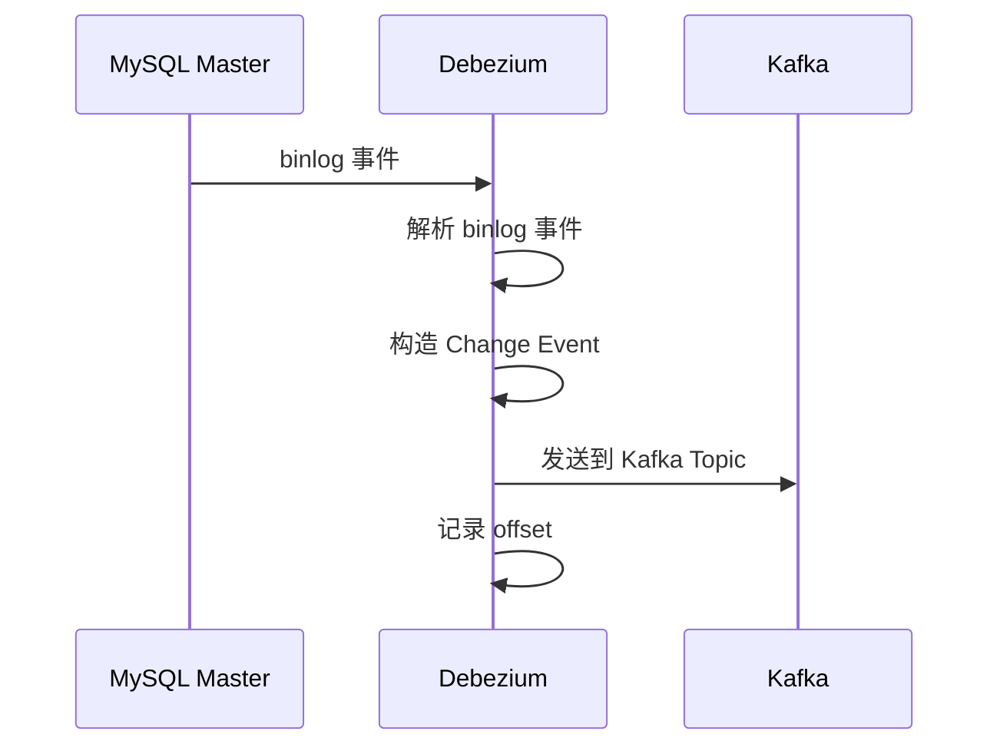
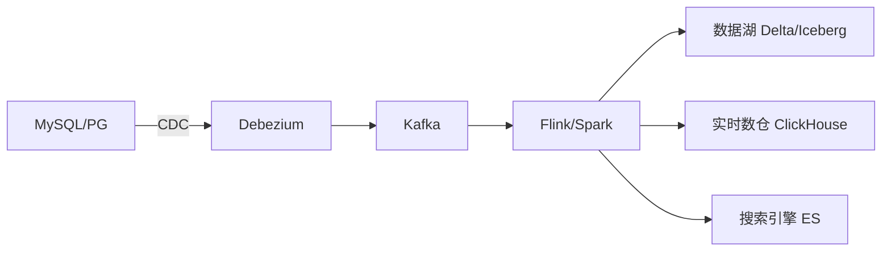
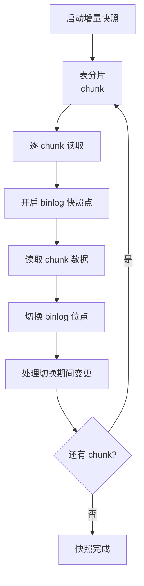
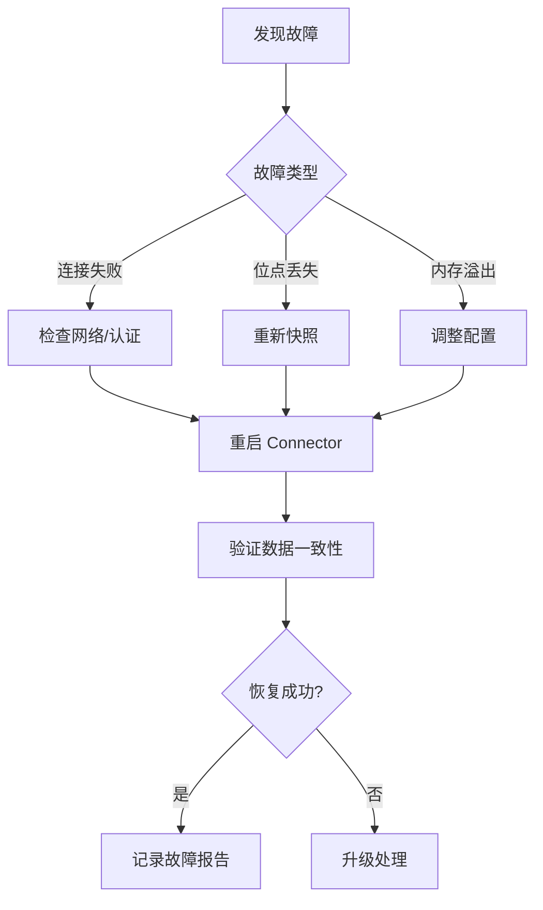

# Debezium（CDC 事件流 / 数据库变更捕获）

> Debezium 是 **Red Hat 开源的 CDC（Change Data Capture）框架**，基于 **Kafka Connect** 架构，把数据库的变更（insert/update/delete）实时变为**事件流**。相比 Canal（只支持 MySQL，阿里系）、Maxwell（只支持 MySQL，JSON 简单）、Flink CDC（计算引擎的 SQL 式 CDC）、AWS DMS（商业），Debezium 以「**多数据库（MySQL/PG/Oracle/SQL Server/MongoDB）+ Kafka 生态原生 + 快照+增量一体**」成为开源 CDC 事实标准。本篇按「解决的问题 → 原理 → 特性 → 选型关注点」拆解。

---

## 一、要解决的问题

| 痛点 | 说明 |
|------|------|
| 数据变更不可见 | 数据库的每次变更业务系统感知不到 |
| 同步时效差 | 定时批处理同步（T+1）不满足实时需求 |
| 双写不一致 | 业务代码同时写 DB 和缓存/ES，容易不一致 |
| 异构同步 | MySQL → ES/数仓/缓存/异构库需要实时管道 |
| 审计与事件 | 所有数据变更需要可追溯、可消费（数据事件化） |

> 核心认知：**CDC = 「把数据库变成消息源」**——数据库的 binlog/WAL 变化转成事件流，任何系统都能订阅消费，业务代码零侵入。

---

## 二、核心原理

### 2.1 架构

```
源数据库（MySQL binlog / PG WAL / Oracle LogMiner / MongoDB Oplog）
  └── Kafka Connect 集群
      └── Debezium Connector（每个数据源一个 Connector 任务）
          ├── 快照阶段（Snapshot）：首次全量读取已有数据
          └── 增量阶段：持续解析 binlog/WAL → 输出变更事件

Kafka（事件流落点，topic 按表命名：db.table）
  └── 消费者：实时数仓 / ES 同步 / 缓存失效 / 事件驱动业务 / 审计
```

### 2.2 变更事件结构（Change Event）

```json
{
  "payload": {
    "op": "c",                       // 操作类型：c=create u=update d=delete r=read
    "source": { "db": "order_db", "table": "orders", "ts_ms": 1690000000000, "snapshot": false },
    "before": { "id": 1001, "status": "PENDING" },   // 变更前（update/delete 有）
    "after":  { "id": 1001, "status": "PAID" }       // 变更后
  }
}
```

**选型关注点**：事件自带 before/after + 操作类型 + 来源元数据——下游可以做增量同步、审计、事件驱动，这是 CDC 的通用数据模型。

### 2.3 事件字段深入

```
op 字段：
  c（create）：新增 → 下游 INSERT/upsert
  u（update）：更新 → 下游 UPDATE
  d（delete）：删除 → 下游 DELETE/软删
  r（read）：快照阶段读取的历史数据（初始加载）

source 字段（溯源元数据）：
  version：Debezium 版本
  connector：连接器类型（mysql/postgres）
  db / schema / table：库表位置
  ts_ms：变更发生时间（数据库侧）
  pos / gtid / lsn：binlog/WAL 位置（精确位点）
  snapshot：是否为快照阶段数据
  file / row：binlog 文件名与偏移

用途：
  位点信息 → 重放/对齐/审计
  库表信息 → 多源多表分流路由
  before/after → 增量同步（upsert 直接拿新值）
```

### 2.4 快照 + 增量（增量快照机制）

```
首次启动：Snapshot 全量读取 → 同时记录 binlog 位点
增量阶段：从快照位点继续消费 binlog（无缝隙）
重试机制：Connector 崩溃后从 Kafka 已提交 offset 恢复
```

- **增量快照（Incremental Snapshot）**：大表快照分块进行，不阻塞线上写入；
- **Exactly-once 语义**：结合 Kafka 幂等/事务，保证下游不丢不重（配合 Sink 幂等）。

### 2.5 增量快照深入

```
传统快照问题：
  大表（亿级行）全量快照耗时长 → 期间 binlog 积压
  快照期间数据变更 → 快照数据与增量数据重复/错乱

Incremental Snapshot（Chunked Snapshot）：
  ① 表按主键范围分块（每块数千行）
  ② 每块快照完成 → 标记位点（水位线）
  ③ 块内数据 + 块间增量拼接（无缝隙、无重复）
  ④ 快照与增量并行推进（在线增量，不阻塞业务）

快照期间处理变更：
  块快照时记录水位（binlog 位置）
  块内变更：先快照后增量 → 用水位去重/覆盖
  全表快照完 → 纯增量模式
```

### 2.6 部署模型（Kafka Connect）

| 模式 | 说明 |
|------|------|
| 单机 Connect | 开发调试 |
| 分布式 Connect | 生产：多个 worker 自动负载均衡/故障恢复（REST API 管理） |
| 嵌入模式 | 直接嵌应用（不常用） |
| Debezium Server | 无 Kafka 场景：CDC → Pulsar/Kinesis/HTTP（轻量） |

**选型关注点**：生产用**分布式 Kafka Connect**（自带扩展/容错）；不想引 Kafka → Debezium Server 直出其他消息系统。

### 2.7 分布式 Connect 容错机制

```
分布式 Connect：
  多个 Worker 组成集群（同 group.id）
  Connector/Task 分布到各 Worker（均衡分配）
  Worker 故障 → 其上的 Task 自动迁移到其他 Worker（restart）
  配置/状态存 Kafka（config topic / status topic / offset topic）

Task 模型：
  一个 Connector 拆多个 Task（按表/分区分片）
  MySQL：Task 数 = 表分片数（chunk 并行）
  并行度提升 → 吞吐提升

Offset 管理：
  消费位点存 Kafka offset topic（提交）
  崩溃恢复 → 从提交位点继续（至少一次语义）
```

---

## 三、核心特性

| 特性 | 说明 |
|------|------|
| 多数据库 | MySQL/PostgreSQL/Oracle/SQL Server/MongoDB/Cassandra/DB2 |
| Kafka 原生 | 基于 Kafka Connect，无缝进 Kafka 生态 |
| 快照+增量 | 全量 + 增量一体，无缝隙 |
| 增量快照 | 大表分块快照，不阻塞业务 |
| 事件结构标准 | before/after/op/source 统一模型 |
| 变更数据脱敏 | 支持字段过滤/转换（单字段屏蔽） |
| Exactly-once | 配合 Kafka 事务语义 |
| 免侵入 | 不碰业务代码，只读 binlog/WAL |
| 高可用 | Connect 集群自动故障转移 |
| 转换器 | SMT（Single Message Transform）字段/格式处理 |

### 3.1 SMT（消息转换）

```
SMT = 在事件进入 Kafka 前做字段级处理（无需消费端处理）
  常见 SMT：
    字段重命名/过滤（RenameFields/FilterFields）
    字段裁剪（PruneFields：去掉敏感字段）
    时间戳转换（时间字段 → epoch/ISO）
    主题路由（TopicRouting：按条件分主题）
    值处理（ExtractNewRecordState：只保留 after 值）

典型用途：
  生产环境去掉身份证/手机号字段（脱敏前置）
  只同步需要的字段（减少流量）
  事件格式标准化（JSON/Avro 转换）
```

---

## 四、Debezium vs Canal vs Maxwell vs Flink CDC

| 维度 | Debezium | Canal | Maxwell | Flink CDC |
|------|----------|-------|---------|-----------|
| 支持数据库 | 多库（8+） | 仅 MySQL | 仅 MySQL | 多库（Debezium 内核） |
| 架构 | Kafka Connect | 自研（Server/Adapter） | 自研（binlog 行事件） | Flink 连接器 |
| 输出 | Kafka（多格式） | Kafka/DB/自定义 | JSON（Kafka） | Flink DataStream/SQL |
| 快照能力 | 强（增量快照） | 有 | 有 | 有（SQL 友好） |
| 运维成本 | 中（Connect） | 中 | 低 | 低（SQL 即管道） |
| 生态 | Kafka/多 Sink | 阿里生态 | 简单 JSON | 实时数仓 SQL |
| 社区 | 活跃（Red Hat） | 阿里，稳定 | 维护一般 | Flink 生态热 |

**选型关注点**：
- 多数据库 + Kafka 生态 → **Debezium**；
- 纯 MySQL + 阿里系 → **Canal**；
- 要 SQL 化实时数仓管道 → **Flink CDC**（内部就是 Debezium）；
- 简单 MySQL → JSON 事件 → **Maxwell**（最轻）。

---

## 五、生产实践

### 5.1 关键配置

| 配置 | 建议 |
|------|------|
| 数据库权限 | 需要 REPLICATION 权限（binlog 读） |
| binlog 格式 | MySQL 必须 ROW 模式（statement 拿不到 before/after） |
| 主键策略 | 表必须有主键（否则更新事件无行定位） |
| topic 分区 | 按主键分区保证单行有序 |
| 并发 | 大表多分区/分片 Connector（per-table 任务） |
| 幂等 Sink | 下游消费必须幂等（重放安全） |
| 监控 | Connect REST API + 指标（lag 关键指标） |
| 快照配置 | 增量快照开启 + 分块大小（chunk）调优 |

### 5.2 配置示例（MySQL Connector）

```json
{
  "name": "mysql-orders-connector",
  "config": {
    "connector.class": "io.debezium.connector.mysql.MySqlConnector",
    "database.hostname": "mysql-host",
    "database.port": "3306",
    "database.user": "debezium",
    "database.password": "debezium",
    "database.server.id": "184054",
    "database.server.name": "shop",
    "database.include.list": "order_db",
    "table.include.list": "order_db.orders,order_db.order_items",
    "database.history.kafka.bootstrap.servers": "kafka:9092",
    "database.history.kafka.topic": "schema-changes.shop",
    "topic.prefix": "shop",
    "snapshot.mode": "initial",
    "incremental.snapshot.chunk.size": "4096",
    "column.mask.with.length.chars": "4,card_no",
    "offset.storage.file.filename": ""
  }
}
```

### 5.3 下游消费注意事项

```
① 至少一次语义 → 下游必须幂等（按主键 upsert）
② delete 事件处理：物理删除 vs 软删（写删除标记）
③ 大事务：单事务修改万行 → 事件洪峰 → 下游批量消费
④ 顺序性：单主键事件按分区有序（同主键同分区）
⑤ Schema 变更：加列 → 事件结构变化（Avro Registry 兼容校验）
⑥ 位点监控：lag = 当前时间 - 最新事件时间（关键指标）
```

### 5.4 常见坑

- **DDL 变更**：表结构变更（加列）可能导致解析失败 → 升级 Connector 版本/兼容策略；
- **大事务阻塞**：超长事务的 binlog 解析延迟 → 关注 lag 告警；
- **无主键表**：无主键 update/delete 事件不可靠 → 强制补主键/唯一键；
- **版本兼容**：Debezium 版本与数据库小版本要匹配（尤其 PG/Oracle）；
- **Topic 无限增长**：按保留策略清理旧事件（否则 Kafka 磁盘爆）；
- **并行快照打爆源库**：增量快照 chunk 过小 + 并发高 → 源库 IO 压力 → chunk 调大/限流。

### 5.5 监控指标

```
关键指标（JMX/Prometheus）：
  lag（最新事件时间 vs 当前时间）—— 最核心
  快照进度（快照中/完成比例）
  已处理事件数/秒（吞吐）
  错误事件数（解析失败）
  Kafka Connect Task 状态（RUNNING/FAILED）
  binlog 位点与 Kafka offset 差距（积压）

告警：
  lag > 阈值（如 5 分钟）→ 告警（同步中断/变慢）
  Task FAILED → 立即告警
  快照异常/超时 → 告警
```

---

## 六、选型速查

| 需求 | 首选 | 备选 |
|------|------|------|
| 多数据库 CDC | Debezium | Flink CDC |
| MySQL → Kafka 实时管道 | Debezium/Canal | Maxwell |
| 实时数仓 SQL 化 | Flink CDC | Debezium + Flink |
| 缓存/ES 同步 | Debezium + Sink | Canal Adapter |
| 阿里云 RDS | Canal | DTS（商业） |
| 无 Kafka 场景 | Debezium Server | 云 DMS |
| 数据脱敏前置 | Debezium SMT | 消费端处理 |

### 6.1 决策树

```
数据库 > 1 种？→ 是 → Debezium（多库支持）
纯 MySQL + 阿里系？→ Canal
要 SQL 实时数仓？→ Flink CDC（SQL 友好）
无 Kafka 基础设施？→ Debezium Server（直出 Pulsar/HTTP）
简单 JSON 事件？→ Maxwell
```

---

## 七、Debezium Connector 内部机制

### 7.1 CDC 机制对比

| 数据库 | CDC 机制 | 说明 |
|--------|----------|------|
| MySQL | binlog | 基于 binlog 文件读取 |
| PostgreSQL | WAL | 基于 WAL 日志（Logical Decoding） |
| Oracle | LogMiner/ASM | 基于 Redo Log |
| SQL Server | LSN | 基于 Log Sequence Number |
| MongoDB | Oplog | 基于操作日志 |

### 7.2 MySQL CDC 内部流程



### 7.3 binlog 读取模式

| 模式 | 说明 | 适用 |
|------|------|------|
| Based on position | 指定 binlog 位点 | 迁移/恢复 |
| Based on GTID | 基于 GTID | 高可用集群 |
| Based on timestamp | 基于时间戳 | 简单场景 |

### 7.4 增量快照原理

```
传统快照问题：
  大表全量读取 → 阻塞 binlog 消费
  快照期间数据变更 → 不一致

Debezium 增量快照：
  表按主键分块（chunk）
  每块读取完成 → 标记水位线
  水位线前后的 binlog 事件去重
  快照与 binlog 并行推进
```

---

## 八、Debezium 与 MongoDB

### 8.1 MongoDB CDC 配置

```json
{
  "name": "mongo-connector",
  "config": {
    "connector.class": "io.debezium.connector.mongodb.MongoDbConnector",
    "mongodb.connection.mode": "replica_set",
    "mongodb.connection-string": "mongodb://mongo1:27017,mongo2:27017",
    "database.include.list": "shop",
    "collection.include.list": "shop.orders",
    "topic.prefix": "mongo"
  }
}
```

### 8.2 MongoDB 事件结构

```json
{
  "payload": {
    "op": "c",
    "source": { "connector": "mongodb", "db": "shop", "collection": "orders" },
    "after": { "_id": { "$oid": "..." }, "amount": 100, "status": "pending" }
  }
}
```

### 8.3 MongoDB 特殊处理

| 特性 | 说明 |
|------|------|
| Change Stream | MongoDB 4.0+ 原生变更流 |
| Oplog | 复制集 Oplog 作为 CDC 源 |
| 大文档 | 变更事件可能很大（需配置 max.size） |
| 数组操作 | 数组修改事件特殊处理 |
| 事务 | 多文档事务的变更合并 |

---

## 九、Debezium 快照模式

### 9.1 快照模式对比

| 模式 | 说明 | 适用 |
|------|------|------|
| `initial` | 全量快照 + 增量 | 首次启动 |
| `never` | 跳过快照，只消费 binlog | 已有位点 |
| `when_needed` | 需要时自动快照 | 自动恢复 |
| `no_data` | 只记录 Schema 不读数据 | Schema 同步 |
| `schema_only` | 只同步 Schema | 结构同步 |

### 9.2 增量快照配置

```json
{
  "snapshot.mode": "initial",
  "incremental.snapshot.enabled": "true",
  "incremental.snapshot.chunk.size": "4096",
  "snapshot.fetch.size": "1000"
}
```

### 9.3 快照调优

| 参数 | 说明 | 建议 |
|------|------|------|
| `incremental.snapshot.chunk.size` | 每块大小 | 4096~16384 |
| `snapshot.fetch.size` | 每次读取行数 | 1000~5000 |
| `snapshot.select.statement.overrides` | 自定义快照 SQL | 按需过滤 |
| `snapshot.mode` | 快照策略 | 根据场景选择 |

---

## 十、Debezium SMT（消息转换）

### 10.1 内置 SMT 列表

| SMT | 说明 | 示例 |
|-----|------|------|
| `InsertField` | 插入字段 | 添加时间戳字段 |
| `RemoveField` | 移除字段 | 去掉敏感字段 |
| `RenameField` | 重命名字段 | 统一字段名 |
| `ReplaceField` | 替换字段 | 字段格式转换 |
| `MaskField` | 字段脱敏 | 身份证/手机号 |
| `TimestampConverter` | 时间戳转换 | epoch → ISO |
| `TopicRouting` | 主题路由 | 按条件分 Topic |
| `ExtractNewRecordState` | 只保留 after 值 | 简化事件 |

### 10.2 SMT 配置示例

```json
{
  "transforms": "route,mask",
  "transforms.route.type": "org.apache.kafka.connect.transforms.TopicRouting",
  "transforms.route.route.topic.regex": "(.*)",
  "transforms.route.route.topic.replacement": "cdc.$1",
  "transforms.mask.type": "org.apache.kafka.connect.transforms.MaskField$Value",
  "transforms.mask.fields": "card_no,id_card",
  "transforms.mask.replacement": "******"
}
```

### 10.3 SMT 执行顺序

```
多个 SMT 按配置顺序执行：
  1. 字段插入（InsertField）
  2. 字段重命名（RenameField）
  3. 字段脱敏（MaskField）
  4. 主题路由（TopicRouting）
  5. 提取值（ExtractNewRecordState）

注意：
  SMT 在 Kafka Connect Worker 执行（非消费端）
  执行顺序影响结果
  复杂转换建议在消费端处理
```

---

## 十一、Debezium vs Canal vs Maxwell

### 11.1 核心对比

| 维度 | Debezium | Canal | Maxwell |
|------|----------|-------|---------|
| 支持数据库 | 8+（MySQL/PG/Oracle等） | 仅 MySQL | 仅 MySQL |
| 架构 | Kafka Connect | 自研 Server | 独立进程 |
| 输出 | Kafka（多格式） | Kafka/数据库/自定义 | JSON（Kafka） |
| 快照能力 | 强（增量快照） | 有 | 有 |
| Schema 变更 | 支持 | 支持 | 有限 |
| 事件格式 | 标准（before/after/op） | 自定义 | JSON |
| 运维成本 | 中 | 中 | 低 |
| 生态 | Kafka Connect 生态 | 阿里生态 | 简单 |
| 社区 | Red Hat 主导 | 阿里主导 | 社区维护 |

### 11.2 选型决策树

```
数据库种类？
  ├── 多种数据库 → Debezium（唯一选择）
  └── 仅 MySQL
      ├── 需要 Kafka 生态 → Debezium / Canal
      ├── 需要简单 JSON → Maxwell
      ├── 需要实时数仓 SQL → Flink CDC
      └── 阿里云环境 → Canal / DTS
```

### 11.3 迁移路径

| 从 | 到 | 方案 |
|----|-----|------|
| Canal → Debezium | 替换 Server 为 Connect |
| Maxwell → Debezium | 配置增量快照 |
| Debezium → Flink CDC | 内核一致，SQL 化 |

---

## 十二、Debezium 性能调优

### 12.1 源端调优

| 参数 | 说明 | 建议 |
|------|------|------|
| `snapshot.chunk.size` | 快照分块大小 | 4096~16384 |
| `max.batch.size` | 单次批量大小 | 2048 |
| `poll.interval.ms` | 轮询间隔 | 500 |
| `snapshot.fetch.size` | 快照读取行数 | 1000 |

### 12.2 Kafka Connect 调优

| 参数 | 说明 | 建议 |
|------|------|------|
| `tasks.max` | 任务数 | 按表数量 |
| `batch.size` | Kafka 批量大小 | 16384 |
| `linger.ms` | 发送延迟 | 10~100 |
| `buffer.memory` | 缓冲区大小 | 32MB |

### 12.3 性能基准

| 指标 | 典型值 |
|------|--------|
| MySQL binlog 吞吐 | 10~50 万事件/秒 |
| Kafka 写入吞吐 | 50~100 万事件/秒 |
| 端到端延迟 | 100ms~1s |
| 快照速度 | 1~5 万行/秒 |

### 12.4 性能监控

```
关键指标：
  Debezium connector lag（延迟）
  Kafka Connect task 状态
  binlog 读取速率
  Kafka 写入速率
  快照进度
```

---

## 十三、Debezium 错误处理策略

### 13.1 常见错误类型

| 错误类型 | 原因 | 处理 |
|----------|------|------|
| 连接失败 | 数据库不可达 | 重试 + 告警 |
| binlog 位点丢失 | binlog 被清理 | 重新快照 |
| Schema 变更 | 表结构变化 | 兼容处理 |
| 数据解析失败 | 数据类型不匹配 | Dead Letter Queue |
| 磁盘写满 | Kafka 磁盘满 | 扩容/清理 |

### 13.2 错误处理配置

```json
{
  "errors.log.enable": true,
  "errors.log.include.messages": true,
  "errors.tolerance": "all",
  "errors.deadletterqueue.topic.name": "dlq-debezium",
  "errors.deadletterqueue.topic.replication.factor": 3,
  "errors.deadletterqueue.context.headers.enable": true
}
```

### 13.3 重试策略

```
Debezium 重试机制：
  连接重试：exponential backoff（指数退避）
  Task 重试：Kafka Connect 自动重启
  消息重试：消费端幂等 + 死信队列

最佳实践：
  配置 dead-letter queue（死信队列）
  监控 DLQ 消息数量
  定期人工处理 DLQ 消息
```

---

## 十四、Debezium 在数据湖入湖

### 14.1 典型架构



### 14.2 入湖模式

| 模式 | 说明 | 延迟 |
|------|------|------|
| 批量入湖 | 定时批量写入湖格式 | 小时级 |
| 实时入湖 | 流式写入湖格式 | 分钟级 |
| CDC 入湖 | 增量合并到湖表 | 秒~分钟 |

### 14.3 入湖配置示例

```python
# Flink + Delta Lake 入湖
CREATE TABLE delta_sink (
  id BIGINT,
  amount DECIMAL(10,2),
  ts TIMESTAMP(3)
) WITH (
  'connector' = 'delta',
  'table-path' = 's3://lake/orders'
);

INSERT INTO delta_sink SELECT * FROM cdc_source;
```

### 14.4 入湖最佳实践

| 实践 | 说明 |
|------|------|
| 增量合并 | 定期 Merge 到 Delta/Iceberg |
| 分区策略 | 按时间分区 |
| Schema 演进 | 兼容性检查 |
| 数据质量 | 入湖前校验 |
| 元数据管理 | Glue/Hive Metastore |

---

## 补充：快照模式全家桶详解

### 快照模式对比

| 模式 | 说明 | 首次启动行为 | 增量阶段 | 适用场景 |
|------|------|------------|---------|---------|
| `initial` | 全量快照 + 增量 | 读全表 + 记录 binlog 位点 | 从位点继续消费 binlog | 首次上线（默认） |
| `never` | 跳过快照 | 不读表，直接消费 binlog | 从指定/最新位点开始 | 已有完整位点 |
| `when_needed` | 需要时自动快照 | 无位点则快照，有则跳过 | 自动判断 | 自动恢复 |
| `no_data` | 只记录 Schema | 只建表结构不读数据 | 仅消费 DDL | Schema 同步 |
| `schema_only` | 只同步 Schema | 类似 no_data | 仅 DDL 事件 | 结构同步 |
| `schema_only_recover` | Schema + 从头消费 | 不快照但记录 Schema | 从最早 binlog 开始 | 重新消费 |

### incremental 快照配置

```json
{
  "snapshot.mode": "initial",
  "incremental.snapshot.enabled": "true",
  "incremental.snapshot.chunk.size": "4096",
  "incremental.snapshot.watermarking.mode": "inserts",
  "snapshot.fetch.size": "1000"
}
```

### 水位线（Watermark）机制

```
增量快照水位线工作原理：
  1. 开始块快照 → 插入水位线信号表（signal data table）
  2. 块内数据读取完成 → 插入结束水位线
  3. binlog 中遇到水位线信号 → 确认该块快照完成
  4. 水位线前后的 binlog 事件去重
  5. 所有块完成 → 纯增量模式
```

## 补充：增量快照 Chunking 原理

### Chunk 分块策略

| 参数 | 默认值 | 说明 |
|------|--------|------|
| `incremental.snapshot.chunk.size` | 1024 | 每块行数 |
| `signal.data.collection` | — | 水位线信号表 |
| `snapshot.select.statement.overrides` | — | 自定义快照 SQL |
| `incremental.snapshot.window.size` | 1000 | binlog 窗口大小 |

### 大表首刷影响评估

| 表大小 | 首刷耗时（chunk=4096） | binlog 积压 | 评估 |
|--------|----------------------|------------|------|
| 100 万行 | ~5 分钟 | 可接受 | 低风险 |
| 1000 万行 | ~50 分钟 | 需关注 | 中风险 |
| 1 亿行 | ~8 小时 | 严重积压 | 高风险 |
| 10 亿行 | ~3 天 | 不可接受 | 需分批/限流 |

**大表首刷优化策略**：
1. 增大 chunk.size（4096→16384）减少水位线交互
2. 降低并发（tasks.max=1）避免源库 IO 压力
3. 选择业务低峰期
4. 对大表先做增量快照，小表先全量
5. 监控 binlog 积压（lag 告警）

## 补充：Postgres Slot 滞后与 WAL 堆积

### PostgreSQL WAL 管理

| 概念 | 说明 |
|------|------|
| WAL（Write-Ahead Log） | 预写日志，所有变更先写 WAL |
| Replication Slot | 通知 PG 哪些 WAL 已被消费 |
| Slot 滞后 | 消费者未及时消费 WAL，slot 位点落后 |
| WAL 堆积 | 滞后导致 WAL 文件不被清理，磁盘增长 |

### Slot 滞后排查

```sql
-- 查看 slot 状态
SELECT slot_name, active, restart_lsn, confirmed_flush_lsn,
       pg_wal_lsn_diff(pg_current_wal_lsn(), confirmed_flush_lsn) AS lag_bytes
FROM pg_replication_slots;

-- 查看 WAL 文件数量
SELECT count(*) FROM pg_ls_waldir();

-- 查看复制状态
SELECT * FROM pg_stat_replication;
```

### WAL 堆积处理

| 场景 | 处理 |
|------|------|
| 消费者慢 | 增加消费者并发/优化消费逻辑 |
| 消费者挂了 | 重启消费者（slot 未丢） |
| 需要丢弃积压 | 丢弃旧 slot + 重新快照 |
| 磁盘紧急 | `SELECT pg_drop_replication_slot('slot_name')` |

> **警告**：丢弃 slot 后需重新快照，否则数据不一致。

## 补充：大表首刷影响评估

### 评估框架

```
大表首刷评估维度：
  1. 源库影响：IO/CPU/内存/连接数
  2. binlog 积压：延迟时间 × 写入速率
  3. 下游消费：积压消息处理能力
  4. 业务影响：业务读写延迟是否增加
```

### 源库压力评估

| 指标 | 安全阈值 | 监控方式 |
|------|---------|---------|
| CPU 使用率 | < 70% | `SHOW PROCESSLIST` |
| IO 等待 | < 30% | `iostat` |
| 连接数 | < 80% max | `SHOW STATUS LIKE 'Threads%'` |
| 复制延迟 | < 30s | `SHOW SLAVE STATUS` |

## 补充：常用 SMT 转换链

### SMT 组合实战

```json
{
  "transforms": "route,mask,dedupe,timestamp",
  "transforms.route.type": "io.debezium.transforms.Router",
  "transforms.route.topic.expression": "cdc.${rdbms}.${database}.${table}",
  "transforms.route.topic.replacement": "cdc.mysql.order_db.orders",
  "transforms.mask.type": "io.debezium.transforms.masking.MaskField$Value",
  "transforms.mask.fields": "card_no,id_card,phone",
  "transforms.mask.replacement": "******",
  "transforms.dedupe.type": "io.debezium.transforms.deduplicate.DeduplicateFields$Value",
  "transforms.dedupe.fields": "id",
  "transforms.timestamp.type": "org.apache.kafka.connect.transforms.TimestampConverter$Value",
  "transforms.timestamp.target.type": "Timestamp",
  "transforms.timestamp.field": "event_time",
  "transforms.timestamp.format": "yyyy-MM-dd HH:mm:ss"
}
```

### SMT 执行顺序最佳实践

| 顺序 | SMT | 理由 |
|------|-----|------|
| 1 | TopicRouting | 先路由再处理 |
| 2 | InsertField | 插入元数据字段 |
| 3 | RenameField | 统一字段名 |
| 4 | MaskField | 脱敏（在字段名统一后） |
| 5 | ExtractNewRecordState | 简化事件 |
| 6 | TimestampConverter | 时间格式统一 |

## 补充：Debezium 与 Flink CDC 分工

### Debezium vs Flink CDC 分工

| 维度 | Debezium | Flink CDC |
|------|----------|-----------|
| **定位** | CDC 数据采集（管道） | 实时计算（引擎） |
| **输出** | Kafka（消息队列） | Flink DataStream/SQL |
| **内核** | 自研 binlog/WAL 解析 | 底层调用 Debezium |
| **SQL 友好** | 需 Kafka Connect | 原生 SQL 定义管道 |
| **状态管理** | 无（Kafka 负责） | Flink Checkpoint |
| **Exactly-once** | 依赖 Kafka 事务 | Flink Checkpoint + 两阶段提交 |
| **运维** | Kafka Connect 集群 | Flink 集群 |

### 推荐分工模式

```
模式 1：Debezium 采集 + Flink 消费（推荐）
  MySQL → Debezium → Kafka → Flink SQL → 数仓/ES
  优点：采集与计算解耦，各自独立扩展

模式 2：Flink CDC 直接采集（简单场景）
  MySQL → Flink CDC Source → Flink SQL → 数仓
  优点：架构简单，少一层 Kafka
  缺点：Flink 故障影响采集

模式 3：Debezium Server 直出（无 Kafka）
  MySQL → Debezium Server → HTTP/Pulsar → 消费端
  优点：无 Kafka 依赖
  缺点：无消息缓冲，消费端故障影响采集
```

> **选型口诀**：要解耦+高可用选"Debezium→Kafka→Flink"；要简单选"Flink CDC 直连"；无 Kafka 选"Debezium Server"。

## 附录 A：Snapshot 模式深度对比

### A.1 四种 Snapshot 模式

| 模式 | 首次快照 | 增量快照 | 停机影响 | 适用场景 |
|------|----------|----------|----------|----------|
| `initial` | ✅ | ❌ | 有锁 | 首次全量同步 |
| `never` | ❌ | ❌ | 无锁 | 已有 binlog 位点 |
| `when_needed` | 按需 | ❌ | 有锁 | 按需全量刷新 |
| `schema_only` | ❌ | ❌ | 无锁 | 仅 DDL 变更 |
| `incremental` | ✅ | ✅ | 低锁 | 大表在线同步 |

### A.2 增量快照工作原理



### A.3 PostgreSQL 相关注意事项

```text
PostgreSQL WAL 槽位管理：

① WAL 槽位必须预创建
   SELECT pg_create_physical_replication_slot('debezium_slot');

② 槽位膨胀监控
   SELECT slot_name, 
          pg_wal_lsn_diff(pg_current_wal_lsn(), restart_lsn) AS retained_bytes
   FROM pg_replication_slots;

③ 槽位清理（槽位堆积会导致磁盘空间问题）
   SELECT pg_drop_replication_slot('debezium_slot');

④ 关键配置
   wal_level = logical
   max_replication_slots = 10  (根据实际调整)
   max_wal_senders = 10
```

## 附录 B：大表增量同步影响评估

### B.1 资源消耗基线

| 表大小 | 初始快照时间 | 快照期间 IO 影响 | 快照期间 CPU 影响 |
|--------|-------------|------------------|------------------|
| 100MB | ~30s | 低 | 低 |
| 1GB | ~2min | 中 | 中 |
| 10GB | ~15min | 高 | 中 |
| 100GB | ~2h | 极高 | 高 |
| 1TB | ~20h | 极高 | 极高 |

### B.2 优化策略

```sql
-- 1. 调整快照抓取批量大小（默认 1000）
"snapshot.fetch.size": "5000"

-- 2. 并行读取（企业版）
"snapshot.max.threads": "4"

-- 3. 降低快照期间对源库影响
"snapshot.isolation.level": "read_uncommitted"

-- 4. 流式读取避免内存溢出
"snapshot.mode": "incremental"
"snapshot.incremental.allow.chunking": "true"
"snapshot.incremental.chunk.size": "1024"
```

### B.3 大表同步最佳实践

```text
分阶段同步方案：

阶段1：初始化
  - 创建 Debezium Connector
  - 设置 snapshot.mode = "initial"
  - 等待 snapshot 完成

阶段2：追赶 binlog
  - 监控 source connector lag
  - 等待消费到最新 binlog 位点

阶段3：增量同步
  - 切换为 snapshot.mode = "never"
  - 正常消费 binlog 变更

大表特殊处理：
  - 分批同步：按主键范围分多个 connector
  - 低峰执行：安排在业务低峰期
  - 读从库：从只读副本读取减少主库压力
```

## 附录 C：SMT（Single Message Transforms）实战

### C.1 常用 SMT 速查

| SMT | 功能 | 示例 |
|-----|------|------|
| `InsertField` | 添加字段 | 添加服务器名/时间戳 |
| `RemoveField` | 删除字段 | 去掉敏感列 |
| `ReplaceField` | 重命名/替换字段 | 字段名脱敏 |
| `MaskField` | 字段遮盖 | 手机号/身份证遮盖 |
| `ExtractField` | 提取嵌套字段 | JSON 内字段提取 |
| `TimestampConverter` | 时间格式转换 | Unix→ISO |
| `RegexRouter` | 路由到不同 Topic | 按表名路由 |
| `Flatten` | 扁平化嵌套结构 | JSON 展平 |
| `ContentBasedRouter` | 基于内容路由 | 按数据内容分发 |
| `Filter` | 过滤记录 | 按条件过滤 |

### C.2 SMT 配置示例

```json
{
  "transforms": "route,maskTime",
  "transforms.route.type": "org.apache.kafka.connect.transforms.RegexRouter",
  "transforms.route.regex": "([^.]+)\\.([^.]+)\\.([^.]+)",
  "transforms.route.replacement": "$3",
  "transforms.maskTime.type": "org.apache.kafka.connect.transforms.MaskField$Value",
  "transforms.maskTime.fields": "created_at,updated_at",
  "transforms.maskTime.replacement": "NULL"
}
```

### C.3 SMT 执行顺序问题

```text
SMT 执行顺序（按配置声明顺序）：

1. 首先应用 Route 类 SMT（影响 Topic 选择）
2. 然后应用 Field 类 SMT（修改字段内容）
3. 最后应用 Flatten/Filter 类 SMT（结构变换）

注意：
- Route SMT 在其他 SMT 之前执行
- 多个 SMT 之间可能产生冲突
- 测试时务必验证完整链路
```

## 附录 D：Debezium vs Flink CDC 对比

| 特性 | Debezium | Flink CDC |
|------|----------|-----------|
| 架构 | Connect 框架 | Flink 引擎 |
| 状态管理 | Kafka Connect | Flink Checkpoint |
| Exactly-Once | 依赖 Kafka | Flink Checkpoint |
| 流处理 | ❌（需配合 Flink） | ✅ 原生支持 |
| DDL 支持 | ✅ | ✅ |
| 全量+增量 | ✅ | ✅ |
| Schema 变更 | 自动同步 | 需手动处理 |
| 延迟 | 毫秒级 | 毫秒级 |
| 运维复杂度 | 中等 | 中等 |
| 社区生态 | 广泛 | 快速增长 |

```text
选型建议：

Debezium + Kafka + Flink：
  → 需要解耦的 CDC 场景
  → 多个消费者需要消费同一数据流
  → 已有 Kafka 基础设施

Flink CDC 直连：
  → 需要实时 ETL/流处理
  → 追求低延迟和简单架构
  → 无 Kafka 基础设施

组合方案：
  Debezium → Kafka → Flink → 目标
  → 兼顾解耦和流处理能力
  → 适合复杂的企业级场景
```

## 附录 E：Debezium 监控与告警

### E.1 关键监控指标

| 指标 | 说明 | 告警阈值 |
|------|------|----------|
| `debezium_source_connector_lag` | 源端延迟 | > 10s |
| `debezium_sink_connector_lag` | 目标端延迟 | > 30s |
| `kafka_connect_connector_status` | 连接器状态 | FAILED |
| `debezium_snapshot_completed` | 快照完成状态 | 未完成 |
| `debezium_event_count` | 事件处理量 | 异常波动 |
| `debezium_error_count` | 错误数量 | > 0 |

### E.2 告警配置示例

```yaml
# Prometheus 告警规则
groups:
  - name: debezium_alerts
    rules:
      - alert: DebeziumConnectorDown
        expr: kafka_connect_connector_status{state="FAILED"} > 0
        for: 1m
        labels:
          severity: critical
        annotations:
          summary: "Debezium 连接器故障"
          description: "连接器 {{ $labels.connector }} 失败超过 1 分钟"
      
      - alert: DebeziumReplicationLag
        expr: debezium_source_connector_lag > 10
        for: 5m
        labels:
          severity: warning
        annotations:
          summary: "CDC 复制延迟过高"
          description: "延迟 {{ $value }}s 超过 10s 阈值"
```

## 附录 F：Debezium 常见问题排查

### F.1 问题排查清单

| 问题 | 原因 | 解决方案 |
|------|------|----------|
| binlog 位点丢失 | binlog 被清理 | 重新做快照 |
| 内存溢出 | 快照数据量过大 | 启用增量快照 |
| 连接超时 | 网络/防火墙 | 检查网络和端口 |
| 表结构不一致 | DDL 变更 | 重启 connector |
| 数据重复 | 位点回退 | 检查位点提交逻辑 |
| 高延迟 | 消费能力不足 | 增加 task 数量 |

### F.2 故障恢复流程



## 十五、与其他板块的关系


- Canal 对比见「[数据同步 CDC（Canal）](./数据同步CDC-Canal.md)」；
- Kafka（事件落点）见「[Kafka](./Kafka.md)」；
- Flink（实时数仓消费 CDC）见「[Apache Flink 流处理](./ApacheFlink流处理.md)」；
- 分库分表（binlog 迁移）见「[分库分表 ShardingSphere](./分库分表ShardingSphere.md)」；
- 云上数据同步见「[云上数据库与缓存生态](./云上数据库与缓存生态.md)」。

> 一句话：**Debezium = Kafka Connect + 多数据库（binlog/WAL）+ 快照增量一体 + 标准变更事件（before/after/op）；选型先看「数据库（多库→Debezium，纯 MySQL→Canal）」，再定「出口（Kafka→Connect，SQL 数仓→Flink CDC）」，最后配「ROW 格式 + 增量快照 + 幂等 Sink + lag 监控」**。