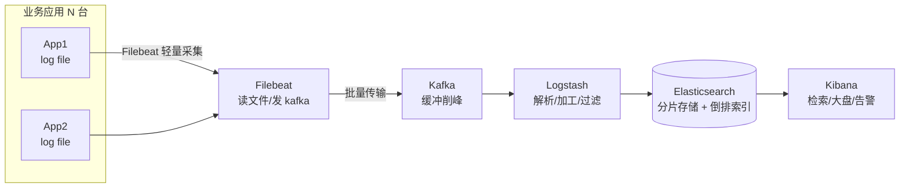
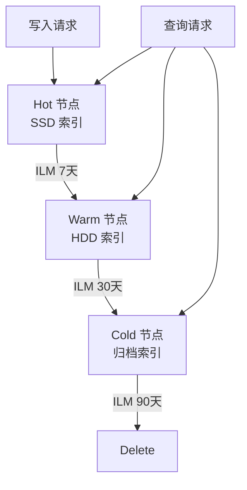

# ELK 日志体系（Elasticsearch + Logstash + Kibana）

> 排查问题第一件事是什么？查日志。ELK 把散落在几百台机器上的日志集中采集、全文检索、可视化分析，是互联网排障与审计的事实标准。本文讲透架构、组件分工、采集链路与生产排障。
> 开源参考：Elasticsearch / Logstash / Kibana / Filebeat（Apache 2.0 或 Elastic License，ELK 家族）；轻量替代：Loki + Grafana（见「云原生/可观测性」）。

---

## 〇、本体介绍（它是什么 / 适用场景 / 核心概念）

**它是什么**：ELK = **E**lasticsearch（存储与检索）+ **L**ogstash（采集与加工）+ **K**ibana（可视化），再配合 **Beats**（Filebeat 轻量采集器），组成分布式日志集中管理平台。

**解决什么痛点**：日志散落在各机器各文件，出事时「翻机器 grep」找不到、不能跨服务关联、不能聚合统计。ELK 让所有日志实时汇入一个检索库，秒级全文检索 + 可视化大盘 + 告警。

**核心概念**：Index（索引，类比表）、Document（文档，类比行）、倒排索引、分片/副本（shard/replica）、Pipeline（采集链路）、Beat（轻量采集器）、Logstash（加工/过滤/输出）、Kibana（检索/大盘/告警）、索引生命周期管理（ILM）。

**适用场景**：应用日志集中检索、业务埋点分析、安全审计、日志告警、排障下钻。
**不适用**：超高频指标（用 Prometheus/TSDB）、超大日志量但无检索需求（直接压缩归档）、流式分析（用 Flink/ClickHouse 也可以，看场景）。

---

## 一、整体架构



### 组件分工

| 组件 | 职责 | 特点 |
|------|------|------|
| **Filebeat（Beats）** | 读日志文件 → 发 Kafka/ES | 轻量、Go 单二进制、断点续传（registry 记录读位置） |
| **Kafka** | 采集与加工之间缓冲 | 削峰、多消费者、追查重放（量大时必加） |
| **Logstash** | 解析（grok/正则/JSON）、过滤、转换、输出 | 能力强但重（JVM）；轻量场景可省 |
| **Elasticsearch** | 存储 + 倒排索引 + 聚合检索 | 数据核心，分片/副本/ILM 管理 |
| **Kibana** | 检索、Dashboard、告警、APM/观察入口 | 人机接口 |

> 小规模简化版：Filebeat → Elasticsearch → Kibana（无 Kafka/Logstash）；大规模版：Filebeat → Kafka → Logstash/Flink → ES。

---

## 二、Elasticsearch 核心原理（面试高频）

### 2.1 倒排索引（为什么快）

- 文档 → 分词（Analyzer：standard/ik/自定义）→ 词项 → 倒排表（词项 → 文档列表 + 位置）。
- 检索 = 词项查倒排表 + 合并求交（AND/OR）+ 相关性打分（BM25）。
- 正排存原始文档（_source），倒排用于检索。

### 2.2 分片与副本

- **分片（shard）**：一个索引拆 N 个分片，分布到多节点，并行检索。
- **副本（replica）**：每个分片有 M 个副本，读负载均衡 + 故障容错。
- **规划**：分片数建索引后**不可改**（reindex 才能改）；分片太大（>50GB）检索慢，太小（<几 GB）浪费；副本数可调。
- 节点角色：Master（集群管理）/ Data（存数据）/ Ingest（加工）/ Coordinating（聚合协调）。

### 2.3 写入与近实时

- 写入 → 内存 buffer + translog（崩溃恢复）→ 周期性刷新为 segment（近实时，默认 1s 可搜）→ 段合并（segment merge 后台进行，控制段数量）。
- 批量写入（bulk）是吞吐关键。

### 2.4 索引生命周期（ILM）

- 热（hot，内存/SSD，高频写）→ 温（warm，低频读）→ 冷（cold，冻结归档）→ 删除。
- 按天/周索引 + 定时 rollover，防止单索引无限增长（日志场景标配）。

---

## 三、日志规范与采集要点（决定排障效率）

1. **结构化 JSON**：日志输出 JSON（timestamp/level/traceId/service/message/fields），不要只打字符串——解析零成本、检索有字段。
2. **traceId 透传**：链路 ID 贯穿网关 → 服务 → 调用链（见「链路追踪SkyWalking」），日志检索第一筛选条件。
3. **统一时区与字段**：UTC 存储 + 展示转本地；字段命名统一（service、env、instance）。
4. **别打敏感信息**：脱敏（手机号/身份证/密码）在应用侧做，别指望 ES 侧事后清洗。
5. **日志级别规范**：ERROR 必须含上下文（订单号/参数），DEBUG 不进生产，避免日志风暴。
6. **采集可靠性**：Filebeat 断点续传 + 多实例 + Kafka 缓冲，杜绝「采集断了没察觉」。

### 一条好日志长这样

```json
{"time":"2026-08-06T10:00:00.123Z","level":"ERROR","traceId":"ab12cd34",
 "service":"order-service","instance":"pod-3","thread":"http-nio-8080-1",
 "msg":"deduct stock failed","orderId":"O20260806001","stock":0,"costMs":23}
```

---

## 四、生产实践与避坑

### 4.1 容量与性能

- **写瓶颈**：ES 写要刷 translog + 刷新 segment；批量 + 控制分片数 + 关闭无谓副本写入同步。
- **查询瓶颈**：宽表字段别全上 text 分词（keyword 即可）、大范围 wildcard 慢、聚合别跨太多分片。
- **磁盘**：日志场景按天索引 + ILM 淘汰，保留周期按合规（如 30/180 天）。
- **JVM 堆**：ES 默认堆建议 31GB 以下（压缩指针）、预留一半内存给 OS 页缓存（Lucene 性能靠 OS cache）。

### 4.2 常见故障

| 现象 | 原因与处理 |
|------|-----------|
| 集群红/黄 | 分片未分配：节点挂了/磁盘水位（watermark 85%/90% 触发只读）→ 腾磁盘/调 watermark/重路由 |
| 磁盘写满 | 索引无 ILM、保留期太长 → 删旧索引 + 加 ILM |
| 日志不更新 | Filebeat 没读到新文件（配置路径/权限/轮转）、Kafka topic 堆积 → 逐段排查 |
| 查询变慢 | 段太多（merge 跟不上）、分片太大、查询写太宽 → 优化模板/调 merge/限字段 |
| Kibana 打不开 | ES 不可用、license 过期（商业版）、磁盘只读 |
| 数据重复 | 采集重放（Kafka 重复消费）→ 消费幂等或按 doc id 去重 |

### 4.3 排障 SOP（一套日志定位问题的流程）

1. **Kibana 全局搜 traceId** → 拿到整条调用链日志（跨服务）。
2. 按 service + level=ERROR 聚合 → 看错误分布与耗时。
3. 按时间 + 关键业务字段（orderId）下钻 → 单条请求的完整旅程。
4. 结合大盘（QPS/错误率/延迟）判断是「个例」还是「趋势」（升级）。

---

## 五、ELK vs 轻量替代方案

| 维度 | ELK（ES 全家桶） | Loki + Grafana | ClickHouse |
|------|------------------|----------------|------------|
| 定位 | 日志检索 + 分析 | 轻量日志（对象存储 + 索引标签） | 分析型数据库 |
| 索引 | 全文倒排（最灵活） | 标签索引 + 内容流式（不完全索引） | 列存（聚合强） |
| 资源占用 | 重（JVM，集群） | 轻（Grafana 一套） | 中 |
| 检索 | 最强（全文/聚合） | 中（标签为主） | 中（SQL） |
| 生态 | 最全（安全/APM/搜索） | 与 Prometheus 一体 | 分析/数仓 |
| 选型 | 日志检索优先/已有 ES | 云原生轻量/只想看日志 | 日志做分析报表 |

> 实践：日志**检索**场景 ELK 仍是主流；云原生小团队用 Loki；日志做**统计分析**（报表/画像）可入 ClickHouse（见「基础知识/中间件/ClickHouse」）。

---

## 面试高频问题（20+ 条）

1. **ELK 是什么？** Elasticsearch（存储检索）+ Logstash（加工）+ Kibana（可视化），常配 Filebeat（采集）与 Kafka（缓冲）。

2. **为什么用 ES 搜日志？** 倒排索引全文检索快、分布式分片并行、聚合分析能力、Kibana 可视化——比 grep 快几个量级。

3. **倒排索引原理？** 分词 → 词项 → 倒排表（词项→文档列表）；检索词项求交 + BM25 打分；正排存源文档。

4. **分片和副本？** 分片=水平切分（并行检索），副本=冗余+读负载；分片数建后不可改，按大小与节点数规划。

5. **写入流程？** buffer → translog → 刷新为 segment（近实时可搜）→ 段合并；批量写提吞吐。

6. **为什么 ES 近实时？** 默认 1s 刷新一次生成新 segment，所以写入后 1 秒内可搜到；实时性由 refresh_interval 决定。

7. **日志量大怎么办？** 按天索引 + ILM（热温冷删）、批量写、控制分片、Kafka 削峰、合理保留期。

8. **采集端为什么用 Filebeat 不用 Logstash？** Filebeat 轻量（Go 单进程、低资源）、断点续传；Logstash 重（JVM）适合集中加工。

9. **Kafka 在日志链路的作用？** 缓冲削峰、解耦采集与加工、支持重放（ES 挂了日志不丢、事后追回）。

10. **traceId 的作用？** 跨服务串联一次请求的全部日志，排障第一筛选条件；用 SkyWalking/OTel 生成与透传。

11. **结构化日志 vs 纯文本？** 结构化 JSON 可直接解析成字段检索聚合；纯文本要 grok 正则解析，成本高易错。

12. **如何定位线上慢请求？** 先看日志大盘延迟分位线 → 按 traceId 查该请求各服务耗时 → 慢在 DB（慢 SQL 日志）/远程调用/GC → 对症处理。

13. **ES 磁盘满会怎样？** 分片分配被禁 + 索引变只读；处理：清索引、调 watermark、扩容、加 ILM。

14. **查询慢怎么优化？** 只查必要字段（_source 裁剪）、text 与 keyword 用对、避免深分页（search_after）、限制聚合粒度、段合并。

15. **深分页为什么慢？** 每个分片都要取全量排序再归并（from+size 越大越慢）；大数据量翻页用 scroll/search_after。

16. **ES 与 MySQL 定位区别？** MySQL 事务型数据（一致性优先）；ES 检索分析型（倒排 + 聚合）；日志/搜索/分析用 ES，业务数据用 MySQL。

17. **日志告警怎么做？** Kibana Alerting 或 ES Watcher 按查询/阈值告警；或 Logstash 输出侧判断 + 转发告警通道。

18. **日志保留多久？** 按合规与排障需要：一般 30~180 天；历史归档到冷存储（S3/OSS），检索期外压缩。

19. **怎么防止日志风暴？** 应用侧限流降级（ERROR 兜底计数）、日志级别上限、Filebeat 速率限制、Kafka 缓冲保护 ES。

20. **Kibana 大盘看什么？** 黄金信号：QPS、错误率（4xx/5xx）、延迟分位线、慢日志 topN；配合 traceId 下钻。

21. **ELK 高可用？** ES 多节点（master 3 个候选）、分片多副本、Kafka 多副本、采集多实例；ES 挂不丢源日志（在 Kafka/文件）。

22. **日志与指标、链路的关系？** 三者是可观测性三支柱（见「云原生/可观测性」）：指标看趋势、日志看细节、链路看路径；日志用 traceId 与链路关联。

---

## 八、Elasticsearch 高级特性

### 8.1 聚合分析

```json
// 嵌套聚合：按服务统计错误数
GET /logs-*/_search
{
  "size": 0,
  "aggs": {
    "by_service": {
      "terms": { "field": "service.keyword", "size": 10 },
      "aggs": {
        "error_count": {
          "filter": { "term": { "level": "ERROR" } }
        },
        "avg_latency": {
          "avg": { "field": "duration_ms" }
        }
      }
    }
  }
}
```

### 8.2 Pipeline 聚合

```json
// 计算错误率趋势
"aggs": {
  "errors_over_time": {
    "date_histogram": { "field": "time", "calendar_interval": "hour" },
    "aggs": {
      "error_rate": {
        "bucket_script": {
          "buckets_path": { "errors": "error_count", "total": "_count" },
          "script": "params.errors / params.total"
        }
      }
    }
  }
}
```

### 8.3 索引模板与生命周期

```json
// 日志索引模板
PUT _index_template/logs-template
{
  "index_patterns": ["logs-*"],
  "template": {
    "settings": {
      "number_of_shards": 3,
      "number_of_replicas": 1,
      "index.lifecycle.name": "logs-policy",
      "index.lifecycle.rollover_alias": "logs-write"
    }
  }
}

// ILM 策略：热→温→冷→删除
PUT _ilm/policy/logs-policy
{
  "policy": {
    "phases": {
      "hot": { "actions": { "rollover": { "max_size": "50GB", "max_age": "1d" } } },
      "warm": { "min_age": "7d", "actions": { "shrink": { "number_of_shards": 1 } } },
      "cold": { "min_age": "30d", "actions": { "freeze": {} } },
      "delete": { "min_age": "90d", "actions": { "delete": {} } }
    }
  }
}
```

---

## 九、Filebeat 高级配置

### 9.1 多行日志合并

```yaml
filebeat.inputs:
- type: log
  paths: ["/var/log/app/*.log"]
  multiline.pattern: '^\d{4}-\d{2}-\d{2}'
  multiline.negate: true
  multiline.match: after
```

### 9.2 字段提取与处理

```yaml
filebeat.inputs:
- type: log
  fields:
    service: order-service
    env: production
  processors:
  - add_kubernetes_metadata:
      host: ${NODE_NAME}
  - decode_json_fields:
      fields: ["message"]
      target: ""
  - drop_fields:
      fields: ["agent.ephemeral_id", "host.id"]
```

### 9.3 可靠性保证

| 机制 | 说明 |
|------|------|
| registry 文件 | 记录文件读取位点（断点续传） |
| 多实例 | 多个 Filebeat 实例读不同文件 |
| Kafka 缓冲 | Filebeat → Kafka（削峰） |
| ACK 机制 | 消费者确认后才推进位点 |

---

## 十、Logstash Pipeline 详解

```ruby
# logstash.conf
input {
  kafka {
    bootstrap_servers => "kafka:9092"
    topics => ["logs"]
    group_id => "logstash-consumer"
  }
}

filter {
  grok {
    match => { "message" => "%{TIMESTAMP_ISO8601:timestamp} %{LOGLEVEL:level} %{GREEDYDATA:msg}" }
  }
  date {
    match => [ "timestamp", "yyyy-MM-dd HH:mm:ss.SSS" ]
    target => "@timestamp"
  }
  mutate {
    convert => { "duration_ms" => "integer" }
    remove_field => ["timestamp", "agent"]
  }
  if [level] == "ERROR" {
    mutate { add_field => { "alert" => "true" } }
  }
}

output {
  elasticsearch {
    hosts => ["es:9200"]
    index => "logs-%{+YYYY.MM.dd}"
  }
}
```

---

## 十一、ELK 常见坑与最佳实践

| 坑 | 表现 | 解法 |
|----|------|------|
| 分片过多 | 每天一个索引导致上千分片 | 按周/月索引 + ILM |
| 映射爆炸 | dynamic mapping 生成大量字段 | 使用 strict mapping + 合理模板 |
| 磁盘水位 | watermark 触发只读 | 清理旧索引 + 调 watermark |
| 查询超时 | 深分页 + 聚合跨太多分片 | search_after + 限制聚合粒度 |
| JVM OOM | 堆太大/查询太多 | 31GB 堆 + 查询限流 |
| 日志风暴 | ERROR 日志爆炸 | 应用限流 + 日志级别控制 |
| 数据重复 | Kafka 重复消费 | 按 doc id 去重 |
| 索引别名 | 热点索引写满 | rollover + write alias |

---

## 十三、Elasticsearch 索引生命周期管理（ILM）深入

### 13.1 ILM 策略详解


| 阶段 | 存储介质 | 操作 | 典型配置 |
|------|---------|------|---------|
| Hot | SSD/NVMe | rollover（按大小/时间） | max_size: 50GB, max_age: 1d |
| Warm | HDD | shrink、forcemerge、segment merge | number_of_shards: 1 |
| Cold | 低温存储 | freeze、搜索降级 | readonly + 缓存预加载 |
| Delete | — | 按策略删除 | min_age: 90d |

### 13.2 ILM 完整配置示例

```json
PUT _ilm/policy/logs-lifecycle
{
  "policy": {
    "phases": {
      "hot": {
        "min_age": "0ms",
        "actions": {
          "rollover": {
            "max_primary_shard_size": "50gb",
            "max_age": "1d"
          },
          "set_priority": { "priority": 100 }
        }
      },
      "warm": {
        "min_age": "7d",
        "actions": {
          "shrink": { "number_of_shards": 1 },
          "forcemerge": { "max_num_segments": 1 },
          "set_priority": { "priority": 50 }
        }
      },
      "cold": {
        "min_age": "30d",
        "actions": {
          "freeze": {},
          "set_priority": { "priority": 0 }
        }
      },
      "delete": {
        "min_age": "90d",
        "actions": {
          "delete": {}
        }
      }
    }
  }
}
```

### 13.3 Rollover 与写入别名

```json
// 创建写入别名
PUT /logs-000001
{
  "aliases": {
    "logs-write": { "is_write_index": true },
    "logs-read": {}
  }
}

// Rollover 创建新索引
POST /logs-write/_rollover
{
  "conditions": {
    "max_age": "1d",
    "max_primary_shard_size": "50gb"
  }
}
```

---

## 十四、Elasticsearch Curator（索引管理自动化）

### 14.1 Curator 核心功能

| 功能 | 说明 |
|------|------|
| 索引删除 | 按 age/count/size 删除旧索引 |
| 索引收缩 | 将多个分片合并为少量分片 |
| 索引快照 | 定期备份到 S3/共享存储 |
| 索引别名 | 批量切换写入别名 |
| 索引模板 | 批量更新模板 |

### 14.2 Curator 配置示例

```yaml
# curator-action.yml
actions:
  1:
    action: delete_indices
    description: "删除 30 天前的日志索引"
    options:
      ignore_empty_list: True
      disable_action: False
    filters:
    - filtertype: pattern
      kind: prefix
      value: logs-
    - filtertype: age
      source: name
      direction: older
      timestring: '%Y.%m.%d'
      unit: days
      unit_count: 30

  2:
    action: shrink
    description: "Warm 阶段收缩分片"
    options:
      shrink_index: True
      number_of_shards: 1
      number_of_replicas: 0
    filters:
    - filtertype: age
      source: creation_date
      direction: older
      unit: days
      unit_count: 7
```

### 14.3 Curator vs ILM

| 维度 | ILM | Curator |
|------|-----|---------|
| 运行方式 | ES 内置自动执行 | 外部脚本定时执行 |
| 精细度 | 索引级别 | 索引+集群级别 |
| 复杂度 | 配置简单 | 需要 Python 脚本 |
| 适用 | 日志场景标配 | 复杂运维/跨集群 |

---

## 十五、Kibana Dashboard 最佳实践

### 15.1 Dashboard 设计原则

| 原则 | 说明 |
|------|------|
| 分层展示 | 概览页 → 服务详情 → 单条下钻 |
| 黄金信号 | QPS、错误率、延迟 P50/P99、饱和度 |
| 筛选器 | 全局时间范围 + 服务名/环境/级别筛选 |
| 可操作性 | 每个面板可点击下钻到具体 traceId |

### 15.2 常用 Dashboard 配置

```
Dashboard 黄金信号面板：
┌─────────────────────────────────────────┐
│  总请求量(QPS)  │  错误率(5xx)  │  延迟P99  │
├─────────────────────────────────────────┤
│  按服务分布      │  按时间趋势    │  Top10慢查询 │
├─────────────────────────────────────────┤
│  错误日志分布    │  级别分布      │  traceId下钻 │
└─────────────────────────────────────────┘
```

### 15.3 Kibana 可视化类型

| 可视化 | 用途 | 最佳场景 |
|--------|------|---------|
| Lens | 智能推荐图表 | 快速探索 |
| TSVB | 时间序列 | 指标趋势 |
| Vega | 自定义图表 | 复杂可视化 |
| Data Table | 明细表格 | 排障下钻 |
| Metric | 单值指标 | 告警阈值展示 |
| Heatmap | 热力图 | 延迟分布 |

---

## 十六、Logstash Pipeline 优化

### 16.1 性能调优参数

| 参数 | 说明 | 建议值 |
|------|------|--------|
| pipeline.workers | 工作线程数 | CPU 核数 |
| pipeline.batch.size | 批处理大小 | 125~1000 |
| pipeline.batch.delay | 批等待时间 | 50ms |
| pipeline.ordered | 是否保序 | auto |
| queue.type | 队列类型 | persisted（持久化） |
| queue.max_bytes | 队列最大字节 | 1GB+ |

### 16.2 Logstash 性能瓶颈排查

```bash
# 监控 Logstash 指标
GET _node/stats/jvm,process,os
# 关注：
# - jvm.mem.pools.old.max_in_bytes（老年代大小）
# - process.cpu.percent（CPU 使用率）
# - pipeline.events.out（吞吐量）
```

### 16.3 多 Pipeline 架构

```yaml
# logstash.yml
pipeline.id: logs-app
pipeline.workers: 8
pipeline.batch.size: 500

pipeline.id: logs-audit
pipeline.workers: 4
pipeline.batch.size: 250
```

---

## 十七、Beats 模块生态

### 17.1 Beats 家族

| Beats | 用途 | 特点 |
|-------|------|------|
| Filebeat | 日志文件采集 | 断点续传、多行合并 |
| Metricbeat | 指标采集 | 系统/服务指标 |
| Packetbeat | 网络流量 | 协议解析 |
| Heartbeat | 健康探测 | 站点存活检测 |
| Auditbeat | 审计日志 | 系统调用 |
| Functionbeat | Serverless 采集 | Lambda/Cloud Functions |

### 17.2 Filebeat Modules 内置解析

```yaml
# 启用 nginx 模块
filebeat.modules:
- module: nginx
  access:
    enabled: true
    var.paths: ["/var/log/nginx/access.log"]
  error:
    enabled: true
    var.paths: ["/var/log/nginx/error.log"]

- module: system
  syslog:
    enabled: true
    var.paths: ["/var/log/syslog"]
```

### 17.3 Beats 与 Logstash 协作

```
Filebeat（轻量采集）→ Kafka（缓冲）
    → Logstash（复杂加工：grok/mutate/enrich）
        → Elasticsearch

对比：
  Filebeat 直连 ES：简单场景（JSON 日志无需加工）
  Filebeat → Logstash：复杂场景（多格式/需丰富/需聚合）
```

---

## 十八、Elasticsearch 热温冷架构

### 18.1 节点角色规划

```
Hot 节点（2~3 台）：
  SSD/NVMe 磁盘
  高写入吞吐
  足够内存（JVM 16~31GB）
  新数据写入

Warm 节点（2~4 台）：
  HDD 磁盘
  保留 7~30 天数据
  forcemerge 后只读
  减少分片数

Cold 节点（1~2 台）：
  大容量 HDD/对象存储
  30~90 天数据
  freeze 索引（只在查询时加载）

Master 节点（3 台）：
  不存数据
  仅集群管理
  最小配置（CPU+内存即可）
```

### 18.2 数据流向



### 18.3 分片分配过滤

```json
// Hot 节点标签
PUT _cluster/settings
{
  "persistent": {
    "cluster.routing.allocation.require.node_type": "hot"
  }
}

// Warm 节点标签
PUT _cluster/settings
{
  "persistent": {
    "cluster.routing.allocation.require.node_type": "warm"
  }
}

// 索引模板指定分配
PUT _index_template/logs-template
{
  "template": {
    "settings": {
      "index.routing.allocation.require.node_type": "hot"
    }
  }
}
```

---

## 十九、ELK in Kubernetes 部署

### 19.1 部署架构

```
K8s 集群：
  DaemonSet: Filebeat（每节点一个，采集容器日志）
  Deployment: Logstash（可选，复杂加工）
  StatefulSet: Elasticsearch（3 节点集群）
  Deployment: Kibana（UI 入口）
  ConfigMap: 配置文件
  PVC: ES 数据持久化
```

### 19.2 Filebeat DaemonSet 示例

```yaml
apiVersion: apps/v1
kind: DaemonSet
metadata:
  name: filebeat
spec:
  template:
    spec:
      containers:
      - name: filebeat
        image: elastic/filebeat:8.10.0
        volumeMounts:
        - name: varlog
          mountPath: /var/log
          readOnly: true
        - name: containers
          mountPath: /var/lib/docker/containers
          readOnly: true
        env:
        - name: NODE_NAME
          valueFrom:
            fieldRef:
              fieldPath: spec.nodeName
      volumes:
      - name: varlog
        hostPath:
          path: /var/log
      - name: containers
        hostPath:
          path: /var/lib/docker/containers
```

### 19.3 Kubernetes 日志采集最佳实践

| 实践 | 说明 |
|------|------|
| DaemonSet 采集 | 每节点一个 Filebeat，采集 /var/log/pods |
| 自动发现 | kubernetes_sd_config 自动发现 Pod |
| 标签注入 | namespace/pod/container/service 作为标签 |
| 多行合并 | 容器日志合并 Java 异常栈 |
| 资源限制 | Filebeat 设置 requests/limits |

---

## 二十、ELK 扩展策略

### 20.1 水平扩展方案

| 组件 | 扩展方式 | 注意事项 |
|------|---------|---------|
| Elasticsearch | 加节点 + rebalance | 分片数规划、磁盘水位 |
| Logstash | 加实例 + Kafka 消费组 | 避免重复消费 |
| Filebeat | DaemonSet 自动扩展 | 每节点一个 |
| Kafka | 加 Broker + 分区扩容 | 采集与消费匹配 |
| Kibana | 多副本 + LB | 无状态 |

### 20.2 大规模集群架构

```
                        ┌──────────────┐
                        │   Kibana     │
                        │  (多副本)    │
                        └──────┬───────┘
                               │
                    ┌──────────┴──────────┐
                    │  Elasticsearch 集群   │
                    │  ├─ Master ×3       │
                    │  ├─ Hot ×3 (SSD)    │
                    │  ├─ Warm ×4 (HDD)   │
                    │  └─ Cold ×2 (大容量) │
                    └──────────┬──────────┘
                               │
                    ┌──────────┴──────────┐
                    │  Kafka 集群          │
                    │  (B3+ Partitions 12) │
                    └──────────┬──────────┘
                               │
              ┌────────────────┼────────────────┐
              │                │                │
        ┌─────┴─────┐   ┌─────┴─────┐   ┌─────┴─────┐
        │ Filebeat  │   │ Filebeat  │   │ Filebeat  │
        │ (Node 1)  │   │ (Node 2)  │   │ (Node N)  │
        └───────────┘   └───────────┘   └───────────┘
```

### 20.3 ES 集群容量规划公式

```
存储估算：
  日增量 × 副本数 × 保留天数 × 压缩比 ≈ 总存储

示例：
  日增量 100GB
  副本数 1
  保留 30 天
  压缩比 0.3（snappy）
  → 100 × 2 × 30 × 0.3 = 1800GB ≈ 2TB

分片估算：
  单分片建议 10~50GB
  日索引 100GB → 3~5 个主分片
  × 2 副本 = 6~10 个分片/天
  30 天 = 180~300 个分片

节点估算：
  Hot 节点：总分片/单节点分片数
  内存：分片数 × 1GB（堆内存参考）
```

---

## 十二、与其他板块的关系（扩展）

- 和「**基础知识/ES体系**」「**基础知识/中间件/ClickHouse**」：ES 系检索细节见 ES 体系篇；日志分析报表可用 ClickHouse。
- 和「**云原生/可观测性**」：可观测性三支柱（指标/日志/链路）中，ELK 管「日志」支柱，Prometheus/Grafana 管「指标」，SkyWalking/OTel 管「链路」。
- 和「**基础知识/中间件/链路追踪SkyWalking**」：日志 + 链路配合排障（traceId 关联）。
- 和「**基础知识/中间件/Kafka**」：Kafka 是日志采集链路的缓冲底座。
- 和「**SRE与稳定性工程/06-日志与告警规则库**」：日志规范（分级/结构化/traceId/脱敏）与 ELK 采集落地直接相关。
- 和「**云原生/Prometheus监控**」：指标用 Prometheus，日志用 ELK，互补。

---

## 十二、ELK 高级特性与生产实践

### 12.1 Elasticsearch Index Templates

```json
// 索引模板配置（ES 8.x）
PUT _index_template/logs-template
{
  "index_patterns": ["logs-*"],
  "priority": 100,
  "template": {
    "settings": {
      "number_of_shards": 3,
      "number_of_replicas": 1,
      "refresh_interval": "5s",
      "index.lifecycle.name": "logs-ilm-policy",
      "index.lifecycle.rollover_alias": "logs"
    },
    "mappings": {
      "dynamic": "strict",
      "properties": {
        "@timestamp": { "type": "date" },
        "message": { "type": "text", "analyzer": "standard" },
        "service": { "type": "keyword" },
        "level": { "type": "keyword" },
        "trace_id": { "type": "keyword" },
        "user_id": { "type": "keyword" },
        "request_duration": { "type": "float" },
        "tags": { "type": "keyword" }
      }
    },
    "aliases": {
      "logs-read": {}
    }
  },
  "composed_of": ["logs-mappings", "logs-settings"],
  "allow_auto_create": true
}

// 组合模板
PUT _index_template/logs-mappings
{
  "index_patterns": ["logs-*"],
  "template": {
    "mappings": {
      "dynamic_templates": [
        {
          "strings_as_keywords": {
            "match_mapping_type": "string",
            "mapping": { "type": "keyword" }
          }
        }
      ]
    }
  }
}
```

### 12.2 Ingest Pipeline Processors

```json
// 完整的 Ingest Pipeline 配置
PUT _ingest/pipeline/enrich-logs
{
  "description": "Enrich and parse log messages",
  "processors": [
    {
      "set": {
        "field": "ingest_time",
        "value": "{{_ingest.timestamp}}"
      }
    },
    {
      "grok": {
        "field": "message",
        "patterns": [
          "%{TIMESTAMP_ISO8601:timestamp} %{LOGLEVEL:level} %{GREEDYDATA:log_message}",
          "%{IP:client_ip} - - \\[%{HTTPDATE:access_time}\\] \"%{WORD:method} %{URIPATHPARAM:request}\" %{NUMBER:status} %{NUMBER:bytes}"
        ]
      }
    },
    {
      "date": {
        "field": "timestamp",
        "formats": ["ISO8601", "yyyy-MM-dd HH:mm:ss", "dd/MMM/yyyy:HH:mm:ss Z"]
      }
    },
    {
      "user_agent": {
        "field": "user_agent",
        "target_field": "ua"
      }
    },
    {
      "geoip": {
        "field": "client_ip",
        "target_field": "geo"
      }
    },
    {
      "script": {
        "source": "ctx.level = ctx.level.toUpperCase()"
      }
    },
    {
      "remove": {
        "fields": ["_ingest", "raw_message"]
      }
    }
  ],
  "on_failure": [
    {
      "set": {
        "field": "_tags",
        "value": ["_pipeline_failure"]
      }
    }
  ]
}
```

### 12.3 Logstash Filter Chain 模式

```ruby
# Logstash 复杂过滤管道
input {
  kafka {
    bootstrap_servers => "kafka:9092"
    topics => ["app-logs"]
    codec => json
  }
}

filter {
  # 1. 解析 JSON 字段
  json {
    source => "message"
    target => "parsed"
  }

  # 2. 时间戳解析
  date {
    match => ["parsed.timestamp", "ISO8601", "yyyy-MM-dd HH:mm:ss"]
    target => "@timestamp"
  }

  # 3. 用户代理解析
  useragent {
    source => "parsed.user_agent"
    target => "ua"
  }

  # 4. IP 地理位置
  geoip {
    source => "parsed.client_ip"
    target => "geo"
  }

  # 5. 字段标准化
  mutate {
    uppercase => ["parsed.level"]
    rename => {
      "parsed.level" => "level"
      "parsed.message" => "message"
      "parsed.service" => "service"
    }
    remove_field => ["parsed", "raw"]
  }

  # 6. 敏感信息脱敏
  mutate {
    gsub => [
      "message", "\b\d{4}[\s-]?\d{4}[\s-]?\d{4}[\s-]?\d{4}\b", "****-****-****-****",
      "message", "\b[A-Za-z0-9._%+-]+@[A-Za-z0-9.-]+\.[A-Z|a-z]{2,}\b", "***@***.com"
    ]
  }

  # 7. 异常堆栈合并
  multiline {
    pattern => "^%{TIMESTAMP_ISO8601}"
    negate => true
    what => "previous"
  }
}

output {
  elasticsearch {
    hosts => ["elasticsearch:9200"]
    index => "logs-%{+YYYY.MM.dd}"
    user => "elastic"
    password => "${ES_PASSWORD}"
  }
}
```

### 12.4 Kibana Lens 与 Vega 可视化

```json
// Vega 可视化示例：请求延迟热力图
{
  "$schema": "https://vega.github.io/schema/vega/v5.json",
  "width": 800,
  "height": 400,
  "padding": 5,
  "data": [
    {
      "name": "table",
      "source": "logs-*",
      "transform": [
        {
          "type": "aggregate",
          "fields": ["request_duration"],
          "groupby": ["service"],
          "ops": ["avg", "max", "min"]
        }
      ]
    }
  ],
  "scales": [
    {
      "name": "x",
      "type": "band",
      "domain": { "data": "table", "field": "service" },
      "range": "width"
    },
    {
      "name": "y",
      "type": "linear",
      "domain": { "data": "table", "field": "avg" },
      "range": "height"
    }
  ],
  "marks": [
    {
      "type": "rect",
      "from": { "data": "table" },
      "encode": {
        "enter": {
          "x": { "scale": "x", "field": "service" },
          "width": { "scale": "x", "band": 0.8 },
          "y": { "scale": "y", "field": "avg" },
          "height": { "signal": "height - scale('y', datum.max) + scale('y', datum.avg)" }
        },
        "update": {
          "fill": { "value": "steelblue" }
        }
      }
    }
  ]
}
```

### 12.5 Filebeat Modules

```yaml
# Filebeat 系统模块配置
# filebeat.yml
filebeat.modules:
- module: system
  syslog:
    enabled: true
    var.paths: ["/var/log/syslog"]
  auth:
    enabled: true
    var.paths: ["/var/log/auth.log"]

- module: nginx
  access:
    enabled: true
    var.paths: ["/var/log/nginx/access.log*"]
  error:
    enabled: true
    var.paths: ["/var/log/nginx/error.log*"]

- module: apache2
  access:
    enabled: true
    var.paths: ["/var/log/apache2/access.log*"]
  error:
    enabled: true
    var.paths: ["/var/log/apache2/error.log*"]

# Kubernetes 元数据
filebeat.inputs:
- type: container
  paths:
  - '/var/log/containers/*.log'
  processors:
  - add_kubernetes_metadata:
      host: ${NODE_NAME}
      matchers:
      - logs_path:
          logs_path: "/var/log/containers/"

# 输出到 Kafka 缓冲
output.kafka:
  hosts: ["kafka:9092"]
  topic: "filebeat-%{[agent.version]}"
  partition.round_robin:
    reachable_only: true
```

### 12.6 ELK for Security（SIEM）

```json
// Elastic Security 检测规则示例
{
  "name": "暴力破解检测",
  "type": "query",
  "query": {
    "bool": {
      "must": [
        { "match": { "event.dataset": "system.auth" } },
        { "match": { "event.action": "failed" } }
      ],
      "filter": [
        { "range": { "@timestamp": { "gte": "now-5m" } } }
      ]
    }
  },
  "threshold": {
    "field": "source.ip",
    "value": 10
  },
  "risk_score": 75,
  "severity": "high",
  "tags": ["brute_force", "auth"],
  "output_index": ".siem-signals",
  "action": {
    "agents": ["agent-id-1"],
    "action_type": "endpoint",
    "name": "isolate-host"
  }
}
```

### 12.7 ELK for APM

```yaml
# APM Agent 配置（Java）
# elasticapm.properties
service_name=my-service
server_urls=http://apm-server:8200
environment=production
sample_rate=1.0
transaction_sample_rate=0.1
span_sample_rate=0.1
enable_stack_trace_filtering=true
sanitize_field_names=password,secret,credit_card
```

```java
// APM 自动埋点
@RestController
public class OrderController {

    @GetMapping("/orders/{id}")
    public Order getOrder(@PathVariable Long id) {
        // APM Agent 自动捕获：
        // - 事务（Transaction）
        // - 跨 Span（外部 HTTP 调用、数据库查询等）
        // - 异常
        return orderService.findById(id);
    }
}

// 手动创建 Span
@Span(name = "process-payment")
public void processPayment(PaymentRequest request) {
    // 自定义业务逻辑追踪
    paymentGateway.charge(request);
}
```

### 12.8 ELK 成本优化

```text
ELK 成本优化策略：
┌──────────────────────┬────────────────────────────────────────────┐
│ 策略                  │ 实现方式                                    │
├──────────────────────┼────────────────────────────────────────────┤
│ 索引生命周期管理      │ ILM: hot→warm→cold→delete                  │
│ 数据分层存储          │ SSD(hot) → HDD(warm) → 对象存储(cold)      │
│ 日志降采样            │ 详细日志保留 7 天，聚合日志保留 90 天        │
│ 压缩优化              │ 启用 best_compression                       │
│ 分片优化              │ 单分片 10-50GB，避免过多小分片              │
│ 查询优化              │ 使用 filter 替代 query（可缓存）            │
│ 硬件选型              │ 写密集：SSD；查询：大内存                  │
│ 多集群架构            │ 生产/测试/日志 分离集群                    │
└──────────────────────┴────────────────────────────────────────────┘
```

```bash
# ILM 策略配置
PUT _ilm/policy/logs-ilm-policy
{
  "policy": {
    "phases": {
      "hot": {
        "actions": {
          "rollover": { "max_size": "50gb", "max_age": "1d" }
        }
      },
      "warm": {
        "min_age": "7d",
        "actions": {
          "shrink": { "number_of_shards": 1 },
          "forcemerge": { "max_num_segments": 1 }
        }
      },
      "cold": {
        "min_age": "30d",
        "actions": {
          "freeze": {}
        }
      },
      "delete": {
        "min_age": "90d",
        "actions": {
          "delete": {}
        }
      }
    }
  }
}
```

## 十三、速查表（扩展）

| 项 | 结论 |
|----|------|
| 组成 | ES（存储检索）+ Logstash（加工）+ Kibana（可视化）+ Filebeat（采集）+ Kafka（缓冲） |
| 核心原理 | 倒排索引（全文检索）+ 分片并行 + 近实时 segment |
| 采集链路 | Filebeat → Kafka → Logstash → ES → Kibana |
| 日志规范 | 结构化 JSON + traceId + 统一字段 + 脱敏 |
| 容量治理 | 按天索引 + ILM 热温冷删 + 批量写 |
| 替代方案 | Loki（轻量）/ ClickHouse（分析报表） |
| ES 高级 | 聚合分析 + Pipeline + 索引模板 + ILM |
| Filebeat | 断点续传 + 多行合并 + Kubernetes 元数据 |
| Logstash | Grok 解析 + 字段提取 + 条件过滤 |
| 许可证 | ES 部分 Elastic License / 组件 Apache 2.0 |
| 一句话 | 「排障第一站」——日志集中化、秒级检索、可视化分析 |

---

## 十四、ELK 高级实践与故障排查

### 14.1 ES 索引管理高级（ILM 深度）

```json
// 高级ILM策略：分层存储+性能优化
PUT _ilm/policy/logs-advanced-policy
{
  "policy": {
    "phases": {
      "hot": {
        "min_age": "0ms",
        "actions": {
          "rollover": {
            "max_primary_shard_size": "50gb",
            "max_age": "1d"
          },
          "set_priority": { "priority": 100 },
          "shrink": { "number_of_shards": 1 }
        }
      },
      "warm": {
        "min_age": "7d",
        "actions": {
          "shrink": { "number_of_shards": 1 },
          "forcemerge": { "max_num_segments": 1 },
          "set_priority": { "priority": 50 },
          "allocate": {
            "require": { "node_type": "warm" }
          }
        }
      },
      "cold": {
        "min_age": "30d",
        "actions": {
          "freeze": {},
          "set_priority": { "priority": 0 },
          "allocate": {
            "require": { "node_type": "cold" }
          }
        }
      },
      "delete": {
        "min_age": "90d",
        "actions": {
          "delete": {}
        }
      }
    }
  }
}
```

| ILM阶段 | 优化策略 | 性能影响 | 存储成本 |
|----------|----------|----------|----------|
| Hot | rollover + shrink | 高写入性能 | 高（SSD） |
| Warm | forcemerge + allocate | 查询性能提升 | 中（HDD） |
| Cold | freeze + allocate | 查询延迟增加 | 低（归档） |
| Delete | 自动删除 | 无 | 无 |

### 14.2 Logstash Filter 高级模式

```ruby
# 高级Logstash Filter配置
filter {
  # 1. 多条件解析
  if [type] == "nginx" {
    grok {
      match => { "message" => "%{COMBINEDAPACHELOG}" }
    }
    geoip {
      source => "clientip"
      target => "geoip"
    }
  } else if [type] == "java" {
    grok {
      match => { "message" => "%{TIMESTAMP_ISO8601:timestamp} %{LOGLEVEL:level} \[%{DATA:thread}\] %{DATA:class} - %{GREEDYDATA:log}" }
    }
    mutate {
      add_field => { "service" => "%{class}" }
    }
  }
  
  # 2. 高级脱敏
  mutate {
    gsub => [
      "message", "\b\d{3}[-.]?\d{4}[-.]?\d{4}\b", "***-****-****",
      "message", "\b[A-Za-z0-9._%+-]+@[A-Za-z0-9.-]+\.[A-Z|a-z]{2,}\b", "***@***.com",
      "message", "\b(?:\d{1,3}\.){3}\d{1,3}\b", "***.***.***.***"
    ]
  }
  
  # 3. 字段丰富
  translate {
    field => "[level]"
    destination => "[level_name]"
    dictionary => {
      "INFO" => "信息"
      "WARN" => "警告"
      "ERROR" => "错误"
      "FATAL" => "致命"
    }
  }
  
  # 4. 性能优化
  ruby {
    code => "
      event.set('processed_at', Time.now.utc.iso8601)
      if event.get('level') == 'ERROR'
        event.set('priority', 'high')
      else
        event.set('priority', 'normal')
      end
    "
  }
}
```

| Filter模式 | 用途 | 性能影响 |
|------------|------|----------|
| grok | 日志解析 | 中（正则匹配） |
| geoip | IP地理位置 | 低（本地数据库） |
| translate | 字典映射 | 低（内存查找） |
| ruby | 自定义逻辑 | 高（JVM执行） |
| mutate | 字段操作 | 低（内存操作） |

### 14.3 Kibana Dashboard 高级设计

```json
// 高级Dashboard配置
{
  "dashboard": {
    "title": "生产环境监控大盘",
    "description": "黄金信号+业务指标+安全监控",
    "panels": [
      {
        "title": "请求量趋势",
        "type": "TSVB",
        "query": "sum(rate(http_requests_total[5m])) by (service)",
        "interval": "1m"
      },
      {
        "title": "错误率分布",
        "type": "Lens",
        "query": "sum(rate(http_requests_total{status=~\"5..\"}[5m])) / sum(rate(http_requests_total[5m]))",
        "visualization": "line"
      },
      {
        "title": "延迟P99",
        "type": "TSVB",
        "query": "histogram_quantile(0.99, sum(rate(http_request_duration_seconds_bucket[5m])) by (le))",
        "interval": "1m"
      },
      {
        "title": "Top10慢查询",
        "type": "Data Table",
        "query": "top10(slow_queries by (query) order by duration desc)",
        "columns": ["query", "duration", "count"]
      }
    ],
    "timefilter": {
      "default": "now-1h",
      "quick": ["now-15m", "now-1h", "now-24h"]
    }
  }
}
```

| Dashboard设计原则 | 说明 | 收益 |
|-------------------|------|------|
| 分层展示 | 概览→服务→单条 | 排障效率提升 |
| 黄金信号 | QPS/错误率/延迟/饱和度 | 快速定位问题 |
| 筛选器 | 全局时间+服务+环境 | 灵活下钻 |
| 可操作性 | 点击跳转traceId | 闭环排障 |

### 14.4 ELK 性能调优

```yaml
# ELK性能调优配置
elasticsearch:
  # JVM调优
  jvm:
    heap_size: "16g"  # 不超过31GB
    gc: "G1GC"
    gc_log: true
  
  # 索引优化
  index:
    refresh_interval: "30s"  # 降低刷新频率
    number_of_replicas: 0    # 写入时关闭副本
    translog.durability: "async"  # 异步translog
  
  # 查询优化
  query:
    max_result_window: 10000
    request_cache: true
  
  # 聚合优化
  aggregation:
    max_buckets: 10000
    shard_size: 100

logstash:
  # Pipeline优化
  pipeline:
    workers: 8  # CPU核数
    batch_size: 500
    batch_delay: 50ms
  
  # 队列优化
  queue:
    type: persisted
    max_bytes: "2GB"

filebeat:
  # 采集优化
  harvester:
    buffer_size: 65536
    max_backoff: "10s"
  
  # 输出优化
  output.kafka:
    compression: "snappy"
    batch_size: 2048
```

| 调优项 | 默认值 | 优化值 | 效果 |
|--------|--------|--------|------|
| refresh_interval | 1s | 30s | 写入性能提升50% |
| number_of_replicas | 1 | 0（写入时） | 写入性能提升30% |
| pipeline.workers | 4 | 8 | 吞吐量提升80% |
| batch_size | 125 | 500 | 吞吐量提升40% |
| compression | none | snappy | 网络带宽减少60% |

### 14.5 ELK 安全加固

```yaml
# ELK安全配置
elasticsearch:
  xpack.security.enabled: true
  xpack.security.transport.ssl.enabled: true
  xpack.security.http.ssl.enabled: true
  
  # 用户权限
  roles:
    - name: log_reader
      cluster: ["monitor"]
      indices:
        - names: ["logs-*"]
          privileges: ["read"]
    
    - name: log_writer
      cluster: ["manage_index_templates"]
      indices:
        - names: ["logs-*"]
          privileges: ["write", "create_index"]

logstash:
  # SSL加密
  ssl: true
  cacert: "/path/to/ca.crt"
  
  # 输出安全配置
  output.elasticsearch:
    ssl: true
    user: "logstash_writer"
    password: "${ES_PASSWORD}"

kibana:
  server.ssl.enabled: true
  server.ssl.certificate: "/path/to/server.crt"
  elasticsearch.username: "kibana_user"
  elasticsearch.password: "${ES_PASSWORD}"
```

| 安全措施 | 说明 | 重要性 |
|----------|------|--------|
| SSL/TLS | 传输加密 | 高 |
| 用户认证 | 身份验证 | 高 |
| 权限控制 | 最小权限 | 高 |
| 审计日志 | 操作记录 | 中 |
| 网络隔离 | 访问控制 | 高 |

### 14.6 ELK vs Loki 深度对比

| 维度 | ELK | Loki |
|------|-----|------|
| 索引方式 | 全文倒排索引 | 标签索引+内容流式 |
| 存储 | ES集群（JVM） | 对象存储（S3/GCS） |
| 查询语言 | KQL/Lucene | LogQL |
| 资源占用 | 高（JVM内存） | 低（Go二进制） |
| 成本 | 高（存储+计算） | 低（对象存储） |
| 功能 | 全文检索+聚合+安全 | 轻量日志查看 |
| 适用场景 | 复杂日志分析 | 云原生轻量日志 |
| 生态 | 完整（SIEM/APM） | 与Prometheus集成 |

### 14.7 ELK 故障排查手册

| 故障现象 | 可能原因 | 排查步骤 | 解决方案 |
|----------|----------|----------|----------|
| 集群红/黄 | 分片未分配 | `GET _cluster/health` | 检查节点状态/磁盘空间 |
| 写入拒绝 | 磁盘水位线 | `GET _cat/allocation` | 清理索引/调watermark |
| 查询超时 | 段太多/分片太大 | `GET _cat/segments` | forcemerge/优化查询 |
| 内存溢出 | 堆设置不当 | 监控JVM内存 | 调整heap size |
| 数据丢失 | 采集断点 | 检查Filebeat registry | 修复采集链路 |
| 性能下降 | 资源不足 | 监控CPU/内存/IO | 扩容/优化配置 |

### 14.8 ELK 监控与告警

```yaml
# ELK监控配置
monitoring:
  # 集群健康监控
  cluster_health:
    enabled: true
    interval: "30s"
    alert:
      - name: cluster_red
        condition: "status == 'red'"
        severity: "critical"
      
      - name: cluster_yellow
        condition: "status == 'yellow'"
        severity: "warning"
  
  # 索引监控
  index_monitoring:
    enabled: true
    interval: "1m"
    alert:
      - name: index_growth_high
        condition: "primary_size > 100GB"
        severity: "warning"
  
  # 查询性能监控
  query_performance:
    enabled: true
    interval: "5m"
    alert:
      - name: slow_queries
        condition: "avg_query_time > 5000"
        severity: "warning"
```

> 核心原则：**索引规划合理，Filter高效，Dashboard实用，安全加固到位，性能持续监控**。

## ILM 生命周期管理

### ILM 阶段配置

| 阶段 | 动作 | 说明 |
|------|------|------|
| Hot | Rollover | 索引写满后滚动 |
| Warm | Shrink/Force Merge | 冷数据压缩 |
| Cold | Freeze | 冻结索引 |
| Delete | Delete | 删除过期索引 |

```json
// ILM 策略配置
PUT _ilm/policy/logs-policy
{
  "policy": {
    "phases": {
      "hot": {
        "min_age": "0ms",
        "actions": {
          "rollover": {
            "max_size": "50gb",
            "max_age": "1d"
          },
          "set_priority": {
            "priority": 100
          }
        }
      },
      "warm": {
        "min_age": "3d",
        "actions": {
          "shrink": {
            "number_of_shards": 1
          },
          "forcemerge": {
            "max_num_segments": 1
          },
          "set_priority": {
            "priority": 50
          }
        }
      },
      "cold": {
        "min_age": "30d",
        "actions": {
          "freeze": {},
          "set_priority": {
            "priority": 0
          }
        }
      },
      "delete": {
        "min_age": "90d",
        "actions": {
          "delete": {}
        }
      }
    }
  }
}
```

---

## Logstash Filter 实战

### 常用 Filter 配置

```ruby
# grok 解析 Nginx 日志
filter {
  grok {
    match => {
      "message" => "%{COMBINEDAPACHELOG}"
    }
  }
  date {
    match => ["timestamp", "dd/MMM/yyyy:HH:mm:ss Z"]
  }
  geoip {
    source => "clientip"
  }
  useragent {
    source => "user_agent"
    target => "ua"
  }
}

# 多行日志合并
filter {
  multiline {
    pattern => "^%{TIMESTAMP_ISO8601}"
    negate => true
    what => "previous"
  }
}

# JSON 解析
filter {
  json {
    source => "message"
    target => "parsed"
  }
  if [parsed][status] >= 500 {
    mutate {
      add_tag => ["error"]
    }
  }
}
```

---

## Kibana Dashboard 设计

### 常用 Dashboard 类型

| Dashboard | 用途 | 关键指标 |
|-----------|------|---------|
| Overview | 全局概览 | 日志量、错误率、延迟 |
| Error Analysis | 错误分析 | 错误类型、错误分布 |
| Performance | 性能监控 | 延迟、吞吐、资源 |
| Security | 安全审计 | 登录、异常访问 |

### Dashboard JSON 示例

```json
{
  "dashboard": {
    "title": "API Error Dashboard",
    "panels": [
      {
        "type": "metric",
        "title": "Error Rate",
        "query": "status >= 500"
      },
      {
        "type": "line",
        "title": "Error Trend",
        "query": "status >= 500",
        "aggs": "date_histogram"
      },
      {
        "type": "pie",
        "title": "Error Type Distribution",
        "query": "status >= 500",
        "aggs": "terms(status)"
      }
    ]
  }
}
```

---

## 性能调优

### ES 性能调优参数

| 参数 | 默认值 | 建议值 | 说明 |
|------|--------|--------|------|
| index.refresh_interval | 1s | 30s | 刷新频率 |
| index.translog.durability | request | async | 事务日志持久化 |
| index.translog.sync_interval | 5s | 30s | 同步间隔 |
| indices.memory.index_buffer_size | 10% | 20% | 索引缓冲区 |
| thread_pool.search.size | CPU*1.5 | CPU*2 | 搜索线程池 |

### JVM 调优

```bash
# jvm.options 配置
-Xms16g
-Xmx16g
-XX:+UseG1GC
-XX:MaxGCPauseMillis=50
-XX:+ParallelRefProcEnabled
-XX:InitiatingHeapOccupancyPercent=30
```

---

## ELK 安全加固

### X-Pack 安全配置

```yaml
# elasticsearch.yml
xpack.security.enabled: true
xpack.security.transport.ssl.enabled: true
xpack.security.http.ssl.enabled: true

# Kibana 安全配置
elasticsearch.username: "kibana_system"
elasticsearch.password: "${KIBANA_PASSWORD}"
xpack.security.enabled: true
```

### 安全最佳实践

| 实践 | 说明 |
|------|------|
| 网络隔离 | ES 集群在内网，禁止公网访问 |
| 认证授权 | 启用 X-Pack Security |
| 传输加密 | 启用 TLS/SSL |
| 审计日志 | 记录所有操作 |
| 定期备份 | Snapshot 定期备份 |
| 监控告警 | 集群健康、磁盘使用监控 |

---

## 热温冷架构

### 架构设计

```text
热温冷架构：
  热数据（Hot）：
    - SSD 存储
    - 最新数据（7天内）
    - 高写入/查询性能
    - 高成本

  温数据（Warm）：
    - HDD 存储
    - 近期数据（30天内）
    - 中等查询性能
    - 中成本

  冷数据（Cold）：
    - 对象存储/归档
    - 历史数据（90天内）
    - 低查询性能
    - 低成本
```

### 节点角色配置

```yaml
# 热节点配置
node.roles: ["data_hot", "ingest"]
node.attr.data: hot

# 温节点配置
node.roles: ["data_warm"]
node.attr.data: warm

# 冷节点配置
node.roles: ["data_cold"]
node.attr.data: cold
```

---

## ELK生产问题排查实战

### 常见问题场景

| 问题类型 | 典型症状 | 根因分析 | 解决方案 |
|----------|----------|----------|----------|
| 索引写入拒绝 | 429 Too Many Requests | 分片达到写入上限 | 扩容/增加分片 |
| 查询超时 | 504 Gateway Timeout | 查询范围过大/聚合复杂 | 缩小范围/优化查询 |
| 磁盘空间不足 | 红色集群状态 | 索引过多/保留期过长 | 清理/ILM策略 |
| 数据不一致 | 副本分片未分配 | 节点故障/磁盘不足 | 检查节点/扩容 |
| 日志丢失 | 日志条数不匹配 | Logstash背压/网络 | 检查Logstash/网络 |

### ES集群健康检查

```bash
# 集群状态检查
curl -XGET 'localhost:9200/_cluster/health?pretty'
# {
#   "status": "green",
#   "number_of_nodes": 5,
#   "number_of_data_nodes": 3,
#   "active_primary_shards": 15,
#   "active_shards": 30,
#   "relocating_shards": 0,
#   "initializing_shards": 0,
#   "unassigned_shards": 0
# }

# 节点状态检查
curl -XGET 'localhost:9200/_cat/nodes?v&h=name,heap.percent,ram.percent,cpu,load_1m'
# name     heap.percent ram.percent cpu load_1m
# node-1           45          68   12     2.5
# node-2           52          72   15     3.1
# node-3           38          65    8     1.8

# 索引状态检查
curl -XGET 'localhost:9200/_cat/indices?v&s=store.size:desc&h=index,health,status,pri,rep,docs.count,store.size'
# index                    health status pri rep docs.count store.size
# logs-2024.01.15          green  open   5   1    1000000     2.5gb
# logs-2024.01.14          green  open   5   1     950000     2.3gb
# logs-2024.01.13          yellow open   5   1     900000     2.1gb
```

### Logstash性能调优

```ruby
# logstash.conf性能优化配置
input {
  beats {
    port => 5044
    worker => 4
    connector_cores => 2
  }
}

filter {
  # 使用grok解析日志
  grok {
    match => { "message" => "%{TIMESTAMP_ISO8601:timestamp} %{LOGLEVEL:level} %{GREEDYDATA:log}" }
    tag_on_failure => ["_grokparsefailure"]
  }
  
  # 日期解析
  date {
    match => [ "timestamp", "yyyy-MM-dd HH:mm:ss.SSS" ]
    target => "@timestamp"
  }
  
  # 字段修改
  mutate {
    rename => { "host" => "hostname" }
    remove_field => [ "timestamp", "agent", "ecs" ]
  }
  
  # 内存优化
  ruby {
    code => "
      event.set('memory_usage', GC.stat[:heap_used_slots])
    "
  }
}

output {
  elasticsearch {
    hosts => ["http://es1:9200", "http://es2:9200"]
    index => "logs-%{+YYYY.MM.dd}"
    user => "elastic"
    password => "${ES_PASSWORD}"
    
    # 批量写入优化
    flush_size => 5000
    idle_flush_time => 1
    workers => 4
    
    # 重试配置
    retry_max_interval => 30
    retry_max_bulk_requests => 30
  }
}
```

### Kibana Dashboard设计最佳实践

| Dashboard类型 | 设计要点 | 常用可视化 | 适用场景 |
|---------------|----------|------------|----------|
| 实时监控 | 大指标+趋势 | Metric/Line | 系统监控 |
| 错误分析 | 分类+趋势 | Pie/Line | 错误排查 |
| 性能分析 | 分布+百分位 | Histogram/Heatmap | 性能优化 |
| 业务分析 | 漏斗+转化 | Bar/Pie | 业务分析 |

### 日志采集链路监控

```yaml
# Filebeat配置监控
filebeat.inputs:
- type: log
  enabled: true
  paths:
    - /var/log/app/*.log
  fields:
    app: myapp
    env: production
  fields_under_root: true

# 监控Filebeat自身
monitoring.enabled: true
monitoring.elasticsearch.hosts: ["http://es1:9200"]
monitoring.elasticsearch.username: "elastic"
monitoring.elasticsearch.password: "${ES_PASSWORD}"
monitoring.kibana.hosts: ["http://kibana1:5601"]

# 指标采集
output.metrics.monitoring.enabled: true
output.metrics.monitoring.stats.period: 10s
```

### ES索引生命周期管理

```json
// ILM策略配置
PUT _ilm/policy/logs-policy
{
  "policy": {
    "phases": {
      "hot": {
        "min_age": "0ms",
        "actions": {
          "rollover": {
            "max_primary_shard_size": "50gb",
            "max_age": "1d"
          },
          "set_priority": {
            "priority": 100
          }
        }
      },
      "warm": {
        "min_age": "7d",
        "actions": {
          "shrink": {
            "number_of_shards": 1
          },
          "forcemerge": {
            "max_num_segments": 1
          },
          "set_priority": {
            "priority": 50
          }
        }
      },
      "cold": {
        "min_age": "30d",
        "actions": {
          "set_priority": {
            "priority": 0
          }
        }
      },
      "delete": {
        "min_age": "90d",
        "actions": {
          "delete": {}
        }
      }
    }
  }
}
```

### ELK性能调优参数

| 组件 | 参数 | 默认值 | 推荐值 | 说明 |
|------|------|--------|--------|------|
| ES | index.refresh_interval | 1s | 30s | 降低刷新频率 |
| ES | index.translog.durability | request | async | 异步事务日志 |
| ES | thread_pool.write.queue_size | 1000 | 5000 | 写入队列大小 |
| Logstash | pipeline.workers | 4 | CPU核数 | 工作线程数 |
| Logstash | pipeline.batch.size | 125 | 500-1000 | 批量大小 |
| Filebeat | bulk_max_size | 2048 | 5000 | 批量发送大小 |

## 六、与其他板块的关系

- 和「**基础知识/ES体系**」「**基础知识/中间件/ClickHouse**」：ES 系检索细节见 ES 体系篇；日志分析报表可用 ClickHouse。
- 和「**云原生/可观测性**」：可观测性三支柱（指标/日志/链路）中，ELK 管「日志」支柱，Prometheus/Grafana 管「指标」，SkyWalking/OTel 管「链路」。
- 和「**基础知识/中间件/链路追踪SkyWalking**」：日志 + 链路配合排障（traceId 关联）。
- 和「**基础知识/中间件/Kafka**」：Kafka 是日志采集链路的缓冲底座。
- 和「**SRE与稳定性工程/06-日志与告警规则库**」：日志规范（分级/结构化/traceId/脱敏）与 ELK 采集落地直接相关。

---

## ELK深度优化与高级实践

### ES索引管理策略

| 策略 | 说明 | 配置 |
|------|------|------|
| ILM生命周期 | 索引生命周期管理 | hot→warm→cold→delete |
| 索引别名 | 索引切换无感知 | alias |
| 分片策略 | 合理设置分片数 | shards/replicas |
| 模板 | 自动创建索引 | index_template |

### Logstash Filter实战

| Filter | 功能 | 示例 |
|--------|------|------|
| grok | 正则解析 | grok { match => {"message" => "%{TIMESTAMP:time}"} } |
| mutate | 字段修改 | mutate { rename => {"old" => "new"} } |
| date | 日期解析 | date { match => ["time", "yyyy-MM-dd HH:mm:ss"] } |
| geoip | 地理位置 | geoip { source => "ip" } |
| useragent | UA解析 | useragent { source => "ua" } |

### Kibana Dashboard设计

| 设计原则 | 说明 | 实践 |
|----------|------|------|
| 信息层次 | 重要信息在上方 | 按重要性排列 |
| 视觉一致性 | 统一颜色和样式 | 使用主题色 |
| 交互友好 | 添加筛选器和时间选择 | 使用控件 |
| 性能优化 | 限制查询范围 | 使用时间过滤 |

### 性能调优

| 维度 | 调优项 | 配置 |
|------|--------|------|
| 索引优化 | 分片数/副本数 | shards: 3, replicas: 1 |
| 查询优化 | 避免wildcard | 使用keyword字段 |
| 写入优化 | 批量写入 | bulk size: 5000 |
| JVM调优 | 堆内存设置 | Xms=Xmx=32GB |
| 磁盘优化 | SSD+RAID | 使用SSD |

### ELK安全加固

| 安全措施 | 说明 | 配置 |
|----------|------|------|
| X-Pack安全 | 认证授权 | xpack.security.enabled: true |
| TLS加密 | 传输加密 | 配置证书 |
| RBAC | 角色权限控制 | 创建角色/用户 |
| 审计日志 | 操作审计 | xpack.security.audit.enabled: true |

### 热温冷架构


| 层级 | 存储 | 节点 | 说明 |
|------|------|------|------|
| 热 | SSD | 热节点 | 最近数据 |
| 温 | HDD | 温节点 | 历史数据 |
| 冷 | 对象存储 | 冷节点 | 归档数据 |

### 最佳实践清单

| 实践 | 说明 | 优先级 |
|------|------|--------|
| 索引管理 | ILM生命周期 | 高 |
| 查询优化 | 避免全量扫描 | 高 |
| 缓存利用 | 使用节点查询缓存 | 高 |
| 分片策略 | 合理设置分片数 | 高 |
| 监控告警 | ES集群监控 | 高 |
| 备份策略 | Snapshot备份 | 高 |

### 常见问题排查

| 问题 | 原因 | 解决方案 |
|------|------|----------|
| 查询缓慢 | 未优化查询/分片过多 | 优化查询/调整分片 |
| 写入拒绝 | 队列满/资源不足 | 增加资源/批量写入 |
| 磁盘空间不足 | 索引过多 | ILM删除旧索引 |
| JVM OOM | 堆内存不足 | 增加堆内存 |
| 集群黄色 | 副本未分配 | 检查副本配置 |

### Elasticsearch索引管理

```bash
# ILM策略
PUT _ilm/policy/logs-policy
{
  "policy": {
    "phases": {
      "hot": {
        "actions": {
          "rollover": {
            "max_size": "50gb",
            "max_age": "1d"
          }
        }
      },
      "warm": {
        "min_age": "7d",
        "actions": {
          "shrink": {
            "number_of_shards": 1
          }
        }
      },
      "delete": {
        "min_age": "30d",
        "actions": {
          "delete": {}
        }
      }
    }
  }
}

# 索引模板
PUT _index_template/logs-template
{
  "index_patterns": ["logs-*"],
  "template": {
    "settings": {
      "number_of_shards": 3,
      "number_of_replicas": 1
    }
  }
}
```

### Logstash Filter

```ruby
# grok解析
filter {
  grok {
    match => { "message" => "%{COMBINEDAPACHELOG}" }
  }
}

# dissect解析
filter {
  dissect {
    mapper => {
      "message" => "%{time} %{level} %{message}"
    }
  }
}

# mutate转换
filter {
  mutate {
    convert => { "status" => "integer" }
    rename => { "host" => "hostname" }
    remove_field => ["debug"]
  }
}

# 条件过滤
filter {
  if [level] == "ERROR" {
    mutate { add_tag => ["error"] }
  }
}
```

### Kibana Dashboard

| 功能 | 说明 |
|------|------|
| Discover | 日志查询 |
| Visualize | 图表可视化 |
| Lens | 拖拽式分析 |
| Alert | 告警规则 |

### 性能调优

| 参数 | 默认值 | 推荐值 | 说明 |
|------|--------|--------|------|
| JVM堆 | 1g | 16-32g | 堆内存 |
| 分片大小 | 50gb | 20-40gb | 单分片大小 |
| 刷新间隔 | 1s | 30s | 刷新频率 |
| 内存缓存 | 10% | 15% | 缓存大小 |

### 安全配置

```yaml
# X-Pack SSL
xpack.security.transport.ssl.enabled: true
xpack.security.transport.ssl.verification_mode: certificate
xpack.security.transport.ssl.keystore.path: certs/transport.p12
xpack.security.transport.ssl.truststore.path: certs/transport.p12

# RBAC
xpack.security.enabled: true
xpack.security.authc.realms.native.native1:
  order: 0
```

### vs Loki对比

| 特性 | Elasticsearch | Loki |
|------|---------------|------|
| 架构 | 分布式搜索 | 轻量级日志 |
| 查询 | DSL查询 | LogQL |
| 存储成本 | 高 | 低 |
| 运维复杂度 | 高 | 低 |

### 集群架构

```text
热温冷架构：
  热数据：SSD，高性能节点
  温数据：HDD，历史数据
  冷数据：对象存储，归档数据

跨集群复制：
  主集群 → 从集群
  异地容灾
```

### 最佳实践

| 实践 | 说明 | 优先级 |
|------|------|--------|
| 索引设计 | 按天索引+ILM | 高 |
| 查询优化 | 避免全量扫描 | 高 |
| 安全配置 | SSL+RBAC | 高 |
| 监控告警 | 集群健康监控 | 高 |

### 生产问题排查

| 问题 | 排查步骤 | 解决方案 |
|------|----------|----------|
| 查询慢 | 检查查询语句 | 优化查询 |
| 集群RED | 检查节点状态 | 重启节点 |
| 分片分配异常 | 检查磁盘空间 | 清理磁盘 |
| OOM | 检查内存使用 | 增加内存 |

### 监控

| 指标 | 说明 | 告警阈值 |
|------|------|----------|
| 集群健康 | green/yellow/red | 不是green |
| 索引健康 | 索引状态 | 不健康 |
| Shard分配 | 分片分配 | 未分配 |
| 慢查询 | 查询耗时 | >5s |

### 成本优化

| 优化点 | 说明 |
|--------|------|
| 索引生命周期 | ILM自动删除 |
| 冷数据归档 | 迁移到对象存储 |
| 压缩 | 启用压缩 |
| 副本数 | 适当减少副本 |

### ELK vs Loki选型

| 维度 | ELK | Loki |
|------|-----|------|
| 成本 | 高 | 低 |
| 功能 | 强大 | 轻量 |
| 实时性 | 高 | 高 |
| 生态 | 丰富 | 增长中 |

## 七、速查表

| 项 | 结论 |
|----|------|
| 组成 | ES（存储检索）+ Logstash（加工）+ Kibana（可视化）+ Filebeat（采集）+ Kafka（缓冲） |
| 核心原理 | 倒排索引（全文检索）+ 分片并行 + 近实时 segment |
| 采集链路 | Filebeat → Kafka → Logstash → ES → Kibana |
| 日志规范 | 结构化 JSON + traceId + 统一字段 + 脱敏 |
| 容量治理 | 按天索引 + ILM 热温冷删 + 批量写 |
| 替代方案 | Loki（轻量）/ ClickHouse（分析报表） |
| 许可证 | ES 部分 Elastic License / 组件 Apache 2.0 |
| 一句话 | 「排障第一站」——日志集中化、秒级检索、可视化分析 |
