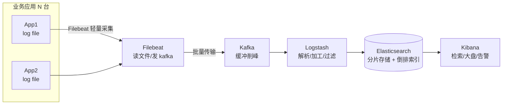

# ELK 日志体系（Elasticsearch + Logstash + Kibana）

> 排查问题第一件事是什么？查日志。ELK 把散落在几百台机器上的日志集中采集、全文检索、可视化分析，是互联网排障与审计的事实标准。本文讲透架构、组件分工、采集链路与生产排障。
> 开源参考：Elasticsearch / Logstash / Kibana / Filebeat（Apache 2.0 或 Elastic License，ELK 家族）；轻量替代：Loki + Grafana（见「云原生/可观测性」）。

---

## 〇、本体介绍（它是什么 / 适用场景 / 核心概念）

**它是什么**：ELK = **E**lasticsearch（存储与检索）+ **L**ogstash（采集与加工）+ **K**ibana（可视化），再配合 **Beats**（Filebeat 轻量采集器），组成分布式日志集中管理平台。

**解决什么痛点**：日志散落在各机器各文件，出事时「翻机器 grep」找不到、不能跨服务关联、不能聚合统计。ELK 让所有日志实时汇入一个检索库，秒级全文检索 + 可视化大盘 + 告警。

**核心概念**：Index（索引，类比表）、Document（文档，类比行）、倒排索引、分片/副本（shard/replica）、Pipeline（采集链路）、Beat（轻量采集器）、Logstash（加工/过滤/输出）、Kibana（检索/大盘/告警）、索引生命周期管理（ILM）。

**适用场景**：应用日志集中检索、业务埋点分析、安全审计、日志告警、排障下钻。
**不适用**：超高频指标（用 Prometheus/TSDB）、超大日志量但无检索需求（直接压缩归档）、流式分析（用 Flink/ClickHouse 也可以，看场景）。

---

## 一、整体架构



### 组件分工

| 组件 | 职责 | 特点 |
|------|------|------|
| **Filebeat（Beats）** | 读日志文件 → 发 Kafka/ES | 轻量、Go 单二进制、断点续传（registry 记录读位置） |
| **Kafka** | 采集与加工之间缓冲 | 削峰、多消费者、追查重放（量大时必加） |
| **Logstash** | 解析（grok/正则/JSON）、过滤、转换、输出 | 能力强但重（JVM）；轻量场景可省 |
| **Elasticsearch** | 存储 + 倒排索引 + 聚合检索 | 数据核心，分片/副本/ILM 管理 |
| **Kibana** | 检索、Dashboard、告警、APM/观察入口 | 人机接口 |

> 小规模简化版：Filebeat → Elasticsearch → Kibana（无 Kafka/Logstash）；大规模版：Filebeat → Kafka → Logstash/Flink → ES。

---

## 二、Elasticsearch 核心原理（面试高频）

### 2.1 倒排索引（为什么快）

- 文档 → 分词（Analyzer：standard/ik/自定义）→ 词项 → 倒排表（词项 → 文档列表 + 位置）。
- 检索 = 词项查倒排表 + 合并求交（AND/OR）+ 相关性打分（BM25）。
- 正排存原始文档（_source），倒排用于检索。

### 2.2 分片与副本

- **分片（shard）**：一个索引拆 N 个分片，分布到多节点，并行检索。
- **副本（replica）**：每个分片有 M 个副本，读负载均衡 + 故障容错。
- **规划**：分片数建索引后**不可改**（reindex 才能改）；分片太大（>50GB）检索慢，太小（<几 GB）浪费；副本数可调。
- 节点角色：Master（集群管理）/ Data（存数据）/ Ingest（加工）/ Coordinating（聚合协调）。

### 2.3 写入与近实时

- 写入 → 内存 buffer + translog（崩溃恢复）→ 周期性刷新为 segment（近实时，默认 1s 可搜）→ 段合并（segment merge 后台进行，控制段数量）。
- 批量写入（bulk）是吞吐关键。

### 2.4 索引生命周期（ILM）

- 热（hot，内存/SSD，高频写）→ 温（warm，低频读）→ 冷（cold，冻结归档）→ 删除。
- 按天/周索引 + 定时 rollover，防止单索引无限增长（日志场景标配）。

---

## 三、日志规范与采集要点（决定排障效率）

1. **结构化 JSON**：日志输出 JSON（timestamp/level/traceId/service/message/fields），不要只打字符串——解析零成本、检索有字段。
2. **traceId 透传**：链路 ID 贯穿网关 → 服务 → 调用链（见「链路追踪SkyWalking」），日志检索第一筛选条件。
3. **统一时区与字段**：UTC 存储 + 展示转本地；字段命名统一（service、env、instance）。
4. **别打敏感信息**：脱敏（手机号/身份证/密码）在应用侧做，别指望 ES 侧事后清洗。
5. **日志级别规范**：ERROR 必须含上下文（订单号/参数），DEBUG 不进生产，避免日志风暴。
6. **采集可靠性**：Filebeat 断点续传 + 多实例 + Kafka 缓冲，杜绝「采集断了没察觉」。

### 一条好日志长这样

```json
{"time":"2026-08-06T10:00:00.123Z","level":"ERROR","traceId":"ab12cd34",
 "service":"order-service","instance":"pod-3","thread":"http-nio-8080-1",
 "msg":"deduct stock failed","orderId":"O20260806001","stock":0,"costMs":23}
```

---

## 四、生产实践与避坑

### 4.1 容量与性能

- **写瓶颈**：ES 写要刷 translog + 刷新 segment；批量 + 控制分片数 + 关闭无谓副本写入同步。
- **查询瓶颈**：宽表字段别全上 text 分词（keyword 即可）、大范围 wildcard 慢、聚合别跨太多分片。
- **磁盘**：日志场景按天索引 + ILM 淘汰，保留周期按合规（如 30/180 天）。
- **JVM 堆**：ES 默认堆建议 31GB 以下（压缩指针）、预留一半内存给 OS 页缓存（Lucene 性能靠 OS cache）。

### 4.2 常见故障

| 现象 | 原因与处理 |
|------|-----------|
| 集群红/黄 | 分片未分配：节点挂了/磁盘水位（watermark 85%/90% 触发只读）→ 腾磁盘/调 watermark/重路由 |
| 磁盘写满 | 索引无 ILM、保留期太长 → 删旧索引 + 加 ILM |
| 日志不更新 | Filebeat 没读到新文件（配置路径/权限/轮转）、Kafka topic 堆积 → 逐段排查 |
| 查询变慢 | 段太多（merge 跟不上）、分片太大、查询写太宽 → 优化模板/调 merge/限字段 |
| Kibana 打不开 | ES 不可用、license 过期（商业版）、磁盘只读 |
| 数据重复 | 采集重放（Kafka 重复消费）→ 消费幂等或按 doc id 去重 |

### 4.3 排障 SOP（一套日志定位问题的流程）

1. **Kibana 全局搜 traceId** → 拿到整条调用链日志（跨服务）。
2. 按 service + level=ERROR 聚合 → 看错误分布与耗时。
3. 按时间 + 关键业务字段（orderId）下钻 → 单条请求的完整旅程。
4. 结合大盘（QPS/错误率/延迟）判断是「个例」还是「趋势」（升级）。

---

## 五、ELK vs 轻量替代方案

| 维度 | ELK（ES 全家桶） | Loki + Grafana | ClickHouse |
|------|------------------|----------------|------------|
| 定位 | 日志检索 + 分析 | 轻量日志（对象存储 + 索引标签） | 分析型数据库 |
| 索引 | 全文倒排（最灵活） | 标签索引 + 内容流式（不完全索引） | 列存（聚合强） |
| 资源占用 | 重（JVM，集群） | 轻（Grafana 一套） | 中 |
| 检索 | 最强（全文/聚合） | 中（标签为主） | 中（SQL） |
| 生态 | 最全（安全/APM/搜索） | 与 Prometheus 一体 | 分析/数仓 |
| 选型 | 日志检索优先/已有 ES | 云原生轻量/只想看日志 | 日志做分析报表 |

> 实践：日志**检索**场景 ELK 仍是主流；云原生小团队用 Loki；日志做**统计分析**（报表/画像）可入 ClickHouse（见「基础知识/中间件/ClickHouse」）。

---

## 面试高频问题（20+ 条）

1. **ELK 是什么？** Elasticsearch（存储检索）+ Logstash（加工）+ Kibana（可视化），常配 Filebeat（采集）与 Kafka（缓冲）。

2. **为什么用 ES 搜日志？** 倒排索引全文检索快、分布式分片并行、聚合分析能力、Kibana 可视化——比 grep 快几个量级。

3. **倒排索引原理？** 分词 → 词项 → 倒排表（词项→文档列表）；检索词项求交 + BM25 打分；正排存源文档。

4. **分片和副本？** 分片=水平切分（并行检索），副本=冗余+读负载；分片数建后不可改，按大小与节点数规划。

5. **写入流程？** buffer → translog → 刷新为 segment（近实时可搜）→ 段合并；批量写提吞吐。

6. **为什么 ES 近实时？** 默认 1s 刷新一次生成新 segment，所以写入后 1 秒内可搜到；实时性由 refresh_interval 决定。

7. **日志量大怎么办？** 按天索引 + ILM（热温冷删）、批量写、控制分片、Kafka 削峰、合理保留期。

8. **采集端为什么用 Filebeat 不用 Logstash？** Filebeat 轻量（Go 单进程、低资源）、断点续传；Logstash 重（JVM）适合集中加工。

9. **Kafka 在日志链路的作用？** 缓冲削峰、解耦采集与加工、支持重放（ES 挂了日志不丢、事后追回）。

10. **traceId 的作用？** 跨服务串联一次请求的全部日志，排障第一筛选条件；用 SkyWalking/OTel 生成与透传。

11. **结构化日志 vs 纯文本？** 结构化 JSON 可直接解析成字段检索聚合；纯文本要 grok 正则解析，成本高易错。

12. **如何定位线上慢请求？** 先看日志大盘延迟分位线 → 按 traceId 查该请求各服务耗时 → 慢在 DB（慢 SQL 日志）/远程调用/GC → 对症处理。

13. **ES 磁盘满会怎样？** 分片分配被禁 + 索引变只读；处理：清索引、调 watermark、扩容、加 ILM。

14. **查询慢怎么优化？** 只查必要字段（_source 裁剪）、text 与 keyword 用对、避免深分页（search_after）、限制聚合粒度、段合并。

15. **深分页为什么慢？** 每个分片都要取全量排序再归并（from+size 越大越慢）；大数据量翻页用 scroll/search_after。

16. **ES 与 MySQL 定位区别？** MySQL 事务型数据（一致性优先）；ES 检索分析型（倒排 + 聚合）；日志/搜索/分析用 ES，业务数据用 MySQL。

17. **日志告警怎么做？** Kibana Alerting 或 ES Watcher 按查询/阈值告警；或 Logstash 输出侧判断 + 转发告警通道。

18. **日志保留多久？** 按合规与排障需要：一般 30~180 天；历史归档到冷存储（S3/OSS），检索期外压缩。

19. **怎么防止日志风暴？** 应用侧限流降级（ERROR 兜底计数）、日志级别上限、Filebeat 速率限制、Kafka 缓冲保护 ES。

20. **Kibana 大盘看什么？** 黄金信号：QPS、错误率（4xx/5xx）、延迟分位线、慢日志 topN；配合 traceId 下钻。

21. **ELK 高可用？** ES 多节点（master 3 个候选）、分片多副本、Kafka 多副本、采集多实例；ES 挂不丢源日志（在 Kafka/文件）。

22. **日志与指标、链路的关系？** 三者是可观测性三支柱（见「云原生/可观测性」）：指标看趋势、日志看细节、链路看路径；日志用 traceId 与链路关联。

---

## 六、与其他板块的关系

- 和「**基础知识/ES体系**」「**基础知识/中间件/ClickHouse**」：ES 系检索细节见 ES 体系篇；日志分析报表可用 ClickHouse。
- 和「**云原生/可观测性**」：可观测性三支柱（指标/日志/链路）中，ELK 管「日志」支柱，Prometheus/Grafana 管「指标」，SkyWalking/OTel 管「链路」。
- 和「**基础知识/中间件/链路追踪SkyWalking**」：日志 + 链路配合排障（traceId 关联）。
- 和「**基础知识/中间件/Kafka**」：Kafka 是日志采集链路的缓冲底座。
- 和「**SRE与稳定性工程/06-日志与告警规则库**」：日志规范（分级/结构化/traceId/脱敏）与 ELK 采集落地直接相关。

---

## 七、速查表

| 项 | 结论 |
|----|------|
| 组成 | ES（存储检索）+ Logstash（加工）+ Kibana（可视化）+ Filebeat（采集）+ Kafka（缓冲） |
| 核心原理 | 倒排索引（全文检索）+ 分片并行 + 近实时 segment |
| 采集链路 | Filebeat → Kafka → Logstash → ES → Kibana |
| 日志规范 | 结构化 JSON + traceId + 统一字段 + 脱敏 |
| 容量治理 | 按天索引 + ILM 热温冷删 + 批量写 |
| 替代方案 | Loki（轻量）/ ClickHouse（分析报表） |
| 许可证 | ES 部分 Elastic License / 组件 Apache 2.0 |
| 一句话 | 「排障第一站」——日志集中化、秒级检索、可视化分析 |
