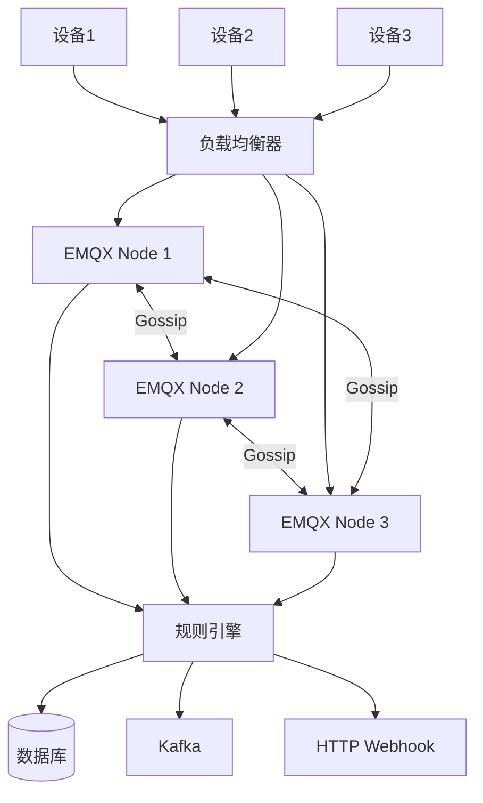

# EMQX

> **核心认知**：EMQX 是基于 Erlang/Elixir 构建的开源 MQTT 消息 Broker，专为大规模 IoT 场景设计。它支持百万级并发连接、分布式集群、规则引擎、协议桥接等企业级特性，是 IoT 消息中间件的事实标准。

## 要解决的问题

| 问题 | 传统 Broker 的痛点 | EMQX 的解法 |
|------|-------------------|-------------|
| 海量连接 | 单节点万级连接瓶颈 | Erlang 轻量级进程，单节点百万连接 |
| 高可用 | 单点故障 | 分布式集群，自动故障转移 |
| 协议转换 | 只支持 MQTT | 协议网关（CoAP/LwM2M/STOMP） |
| 数据流转 | 消息只做转发 | 规则引擎 + 数据桥接 |
| 边缘部署 | 资源消耗大 | 嵌入式版本 EMQX Edge |
| 可观测性 | 缺乏监控 | Prometheus 指标 + Dashboard |

## 架构设计

### 集群架构



### 核心进程模型

```
Erlang/OTP 进程模型：
  Listeners：TCP/WebSocket 监听器
    acceptor 进程池：接受新连接
    连接进程：每个连接一个进程（轻量级）
  Session：会话管理
    订阅关系维护
    消息队列（mqueue）
    QoS 消息重传
  Router：Topic 路由
    本地路由表
    分布式路由同步
  Broker：消息分发
    发布/订阅匹配
    消息投递
```

## 核心特性详解

### 1. 认证与授权

```
认证方式：
  内置数据库：用户名/密码
  LDAP：企业目录集成
  HTTP：Webhook 认证
  JWT：Token 验证
  X.509 证书：双向 TLS
  自定义：插件实现

授权方式：
  ACL 规则：基于 Topic 的访问控制
  HTTP API：动态权限查询
  内置数据库：静态 ACL
```

### 2. 规则引擎

```sql
-- SQL 风格的规则定义
-- 示例：温度超过 40 度的告警
SELECT
    clientid as device_id,
    payload.temperature as temperature,
    timestamp as time
FROM
    "sensor/+/temperature"
WHERE
    payload.temperature > 40
```

**规则引擎数据流**：

```
事件源 -> SQL 处理 -> 动作执行

事件源：
  消息发布（message.publish）
  消息投递（message.delivered）
  连接建立（client.connected）
  连接断开（client.disconnected）

动作类型：
  数据桥接：Kafka/MySQL/PostgreSQL/Redis
  消息转发：MQTT/AMQP
  Webhook：HTTP POST
  内置函数：数据转换/聚合
```

### 3. 协议网关

| 协议 | 用途 | 端口 |
|------|------|------|
| MQTT 3.1.1 | IoT 标准协议 | 1883 |
| MQTT 5.0 | 最新版本，增强特性 | 1883 |
| MQTT/SSL | 加密 MQTT | 8883 |
| MQTT/WS | WebSocket | 8083 |
| MQTT/WSS | WebSocket SSL | 8084 |
| CoAP | 受限设备协议 | 5683 |
| LwM2M | 设备管理协议 | 5684 |
| STOMP | 消息队列协议 | 61613 |

### 4. 消息持久化

```
持久化策略：
  会话持久化：订阅关系 + 离线消息
  消息存储：MySQL/PostgreSQL/TDengine
  日志归档：Kafka/ClickHouse
```

### 5. 集群与扩展

```
集群模式：
  Core 节点：完整功能节点，存储路由表
  Replicant 节点：只读节点，扩展连接能力

扩展能力：
  水平扩展：添加 Replicant 节点增加连接数
  垂直扩展：Erlang 进程模型天然支持多核
  分片路由：Topic 路由分布式存储
```

## 性能指标

| 指标 | EMQX | Mosquitto | HiveMQ |
|------|------|-----------|--------|
| 单节点连接数 | 100万+ | 10万 | 10万 |
| 消息吞吐 | 100万+/s | 10万/s | 10万/s |
| 延迟 | 亚毫秒 | 毫秒级 | 毫秒级 |
| 集群节点数 | 100+ | 2-3 | 10+ |

## 部署架构

### 单节点部署（开发/测试）

```
docker run -d --name emqx \
  -p 1883:1883 \
  -p 8083:8083 \
  -p 8883:8883 \
  -p 18083:18083 \
  emqx/emqx:latest
```

### 集群部署（生产）

```
3 节点集群：
  emqx1: Core 节点
  emqx2: Core 节点
  emqx3: Core 节点
  + N 个 Replicant 节点（按需扩展）

负载均衡：
  L4 LB（HAProxy/Nginx Stream）分发 MQTT 连接
  支持 TLS 终止
```

## 高可用设计

| 层次 | 方案 | 说明 |
|------|------|------|
| 连接层 | LB + 多节点 | 连接自动路由 |
| 会话层 | 会话持久化 | 断线重连后恢复 |
| 消息层 | 消息队列 | 离线消息不丢失 |
| 数据层 | 规则引擎冗余 | 数据桥接高可用 |
| 监控层 | Prometheus + Grafana | 实时监控 |

## 常见陷阱

| 陷阱 | 后果 | 正确做法 |
|------|------|----------|
| 不配置认证 | 任意设备可连接 | 至少配置一种认证 |
| 不限连接数 | 服务器被打垮 | 设置 max_connections |
| 规则引擎不做错误处理 | 数据丢失 | 配置错误日志和重试 |
| 不监控资源 | 性能问题无法定位 | 配置 Prometheus 监控 |
| 不备份配置 | 故障后配置丢失 | 定期备份 emqx.conf |

## 与其他板块的关系

| 关联板块 | 关系描述 |
|----------|----------|
| **IoT 平台** | EMQX 是 IoT 设备接入的核心 Broker |
| **边缘计算** | EMQX Edge 处理边缘侧消息 |
| **大数据平台** | 规则引擎将数据桥接到 Kafka/ClickHouse |
| **时序数据库** | 设备数据写入 InfluxDB/TDengine |
| **API 网关** | MQTT 网关桥接设备与云端 API |

## 一句话总结

EMQX 是基于 Erlang 构建的高性能 MQTT Broker，以百万级连接、分布式集群、规则引擎等企业级特性见长，是大规模 IoT 消息场景的首选方案。

---

## 参考资料

- [EMQX 官方文档](https://www.emqx.io/docs/en/latest/)
- [EMQX GitHub](https://github.com/emqx/emqx)
- [EMQX 性能基准测试](https://www.emqx.io/blog/emqx-performance-test)
- [MQTT 协议规范](https://docs.oasis-open.org/mqtt/mqtt/v5.0/mqtt-v5.0.html)
