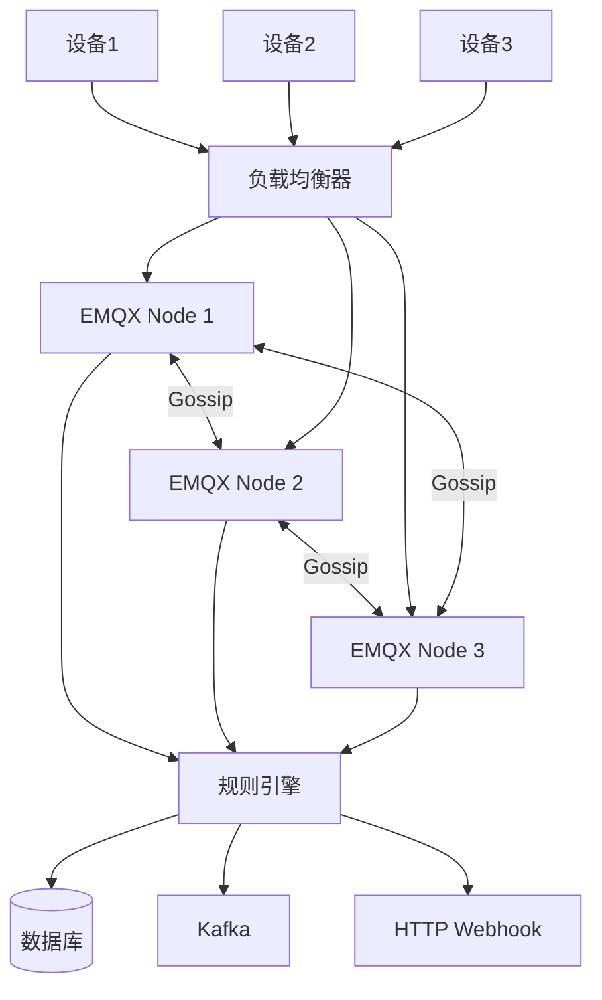

# EMQX

> **核心认知**：EMQX 是基于 Erlang/Elixir 构建的开源 MQTT 消息 Broker，专为大规模 IoT 场景设计。它支持百万级并发连接、分布式集群、规则引擎、协议桥接等企业级特性，是 IoT 消息中间件的事实标准。

## 要解决的问题

| 问题 | 传统 Broker 的痛点 | EMQX 的解法 |
|------|-------------------|-------------|
| 海量连接 | 单节点万级连接瓶颈 | Erlang 轻量级进程，单节点百万连接 |
| 高可用 | 单点故障 | 分布式集群，自动故障转移 |
| 协议转换 | 只支持 MQTT | 协议网关（CoAP/LwM2M/STOMP） |
| 数据流转 | 消息只做转发 | 规则引擎 + 数据桥接 |
| 边缘部署 | 资源消耗大 | 嵌入式版本 EMQX Edge |
| 可观测性 | 缺乏监控 | Prometheus 指标 + Dashboard |

## 架构设计

### 集群架构



### 核心进程模型

```
Erlang/OTP 进程模型：
  Listeners：TCP/WebSocket 监听器
    acceptor 进程池：接受新连接
    连接进程：每个连接一个进程（轻量级）
  Session：会话管理
    订阅关系维护
    消息队列（mqueue）
    QoS 消息重传
  Router：Topic 路由
    本地路由表
    分布式路由同步
  Broker：消息分发
    发布/订阅匹配
    消息投递
```

## 核心特性详解

### 1. 认证与授权

```
认证方式：
  内置数据库：用户名/密码
  LDAP：企业目录集成
  HTTP：Webhook 认证
  JWT：Token 验证
  X.509 证书：双向 TLS
  自定义：插件实现

授权方式：
  ACL 规则：基于 Topic 的访问控制
  HTTP API：动态权限查询
  内置数据库：静态 ACL
```

### 2. 规则引擎

```sql
-- SQL 风格的规则定义
-- 示例：温度超过 40 度的告警
SELECT
    clientid as device_id,
    payload.temperature as temperature,
    timestamp as time
FROM
    "sensor/+/temperature"
WHERE
    payload.temperature > 40
```

**规则引擎数据流**：

```
事件源 -> SQL 处理 -> 动作执行

事件源：
  消息发布（message.publish）
  消息投递（message.delivered）
  连接建立（client.connected）
  连接断开（client.disconnected）

动作类型：
  数据桥接：Kafka/MySQL/PostgreSQL/Redis
  消息转发：MQTT/AMQP
  Webhook：HTTP POST
  内置函数：数据转换/聚合
```

### 3. 协议网关

| 协议 | 用途 | 端口 |
|------|------|------|
| MQTT 3.1.1 | IoT 标准协议 | 1883 |
| MQTT 5.0 | 最新版本，增强特性 | 1883 |
| MQTT/SSL | 加密 MQTT | 8883 |
| MQTT/WS | WebSocket | 8083 |
| MQTT/WSS | WebSocket SSL | 8084 |
| CoAP | 受限设备协议 | 5683 |
| LwM2M | 设备管理协议 | 5684 |
| STOMP | 消息队列协议 | 61613 |

### 4. 消息持久化

```
持久化策略：
  会话持久化：订阅关系 + 离线消息
  消息存储：MySQL/PostgreSQL/TDengine
  日志归档：Kafka/ClickHouse
```

### 5. 集群与扩展

```
集群模式：
  Core 节点：完整功能节点，存储路由表
  Replicant 节点：只读节点，扩展连接能力

扩展能力：
  水平扩展：添加 Replicant 节点增加连接数
  垂直扩展：Erlang 进程模型天然支持多核
  分片路由：Topic 路由分布式存储
```

## 性能指标

| 指标 | EMQX | Mosquitto | HiveMQ |
|------|------|-----------|--------|
| 单节点连接数 | 100万+ | 10万 | 10万 |
| 消息吞吐 | 100万+/s | 10万/s | 10万/s |
| 延迟 | 亚毫秒 | 毫秒级 | 毫秒级 |
| 集群节点数 | 100+ | 2-3 | 10+ |

## 部署架构

### 单节点部署（开发/测试）

```
docker run -d --name emqx \
  -p 1883:1883 \
  -p 8083:8083 \
  -p 8883:8883 \
  -p 18083:18083 \
  emqx/emqx:latest
```

### 集群部署（生产）

```
3 节点集群：
  emqx1: Core 节点
  emqx2: Core 节点
  emqx3: Core 节点
  + N 个 Replicant 节点（按需扩展）

负载均衡：
  L4 LB（HAProxy/Nginx Stream）分发 MQTT 连接
  支持 TLS 终止
```

## 高可用设计

| 层次 | 方案 | 说明 |
|------|------|------|
| 连接层 | LB + 多节点 | 连接自动路由 |
| 会话层 | 会话持久化 | 断线重连后恢复 |
| 消息层 | 消息队列 | 离线消息不丢失 |
| 数据层 | 规则引擎冗余 | 数据桥接高可用 |
| 监控层 | Prometheus + Grafana | 实时监控 |

## 常见陷阱

| 陷阱 | 后果 | 正确做法 |
|------|------|----------|
| 不配置认证 | 任意设备可连接 | 至少配置一种认证 |
| 不限连接数 | 服务器被打垮 | 设置 max_connections |
| 规则引擎不做错误处理 | 数据丢失 | 配置错误日志和重试 |
| 不监控资源 | 性能问题无法定位 | 配置 Prometheus 监控 |
| 不备份配置 | 故障后配置丢失 | 定期备份 emqx.conf |


## EMQX Enterprise 功能

```
EMQX Enterprise vs 开源版对比：

  开源版（EMQX Open Source）：
    ├── MQTT 3.1.1/5.0 支持
    ├── 基础认证与授权
    ├── 规则引擎（基础功能）
    ├── WebSocket/MQTT/SSL
    └── 单节点百万连接

  企业版（EMQX Enterprise）：
    ├── 开源版所有功能
    ├── 原生支持 Kafka/ClickHouse/MySQL/PostgreSQL 数据桥接
    ├── Schema Registry（协议格式验证）
    ├── 设备管理 API
    ├── 告警管理（Webhook/邮件/钉钉）
    ├── 多租户支持
    ├── 审计日志
    └── 专业技术支持

  价格模型：
    ├── 按节点数计费
    ├── 按连接数计费
    └── 支持按年订阅
```

## EMQX + Kubernetes 部署

```yaml
# Helm Chart 部署 EMQX 集群
# 添加 EMQX Helm 仓库
helm repo add emqx https://repos.emqx.io/chart
helm repo update

# 安装 EMQX Enterprise
helm install emqx emqx/enterprise \
  --namespace emqx \
  --set replicaCount=3 \
  --set emqxConfig.\"node.name\"=\"emqx@emqx-0.emqx.emqx.svc.cluster.local\" \
  --set service.type=LoadBalancer \
  --set service.mqtt.ports.mqtt=1883 \
  --set service.mqtt.ports.mqttssl=8883 \
  --set service.mqtt.ports.ws=8083

# 验证集群状态
kubectl get pods -n emqx
kubectl exec -it emqx-0 -n emqx -- emqx_ctl status
```

```
Kubernetes 部署最佳实践：
  Pod 配置：
    ├── 资源限制：CPU 2核, 内存 4GB
    ├── 健康检查：liveness/readiness probe
    ├── 亲和性：跨节点分布，避免单点故障
    └── 持久化：PVC 存储配置和数据

  网络配置：
    ├── Headless Service：集群内部通信
    ├── LoadBalancer Service：外部 MQTT 接入
    ├── Ingress：Web 控制台暴露
    └── NetworkPolicy：限制 Pod 间通信

  配置管理：
    ├── ConfigMap：EMQX 配置文件
    ├── Secret：敏感信息（密码、证书）
    └── StatefulSet：稳定的网络标识和持久存储
```

## EMQX Gateway 协议桥接

```
EMQX Gateway 架构：

  设备层：
    MQTT 设备 ──→ EMQX Core
    CoAP 设备 ──→ Gateway ──→ EMQX Core
    LwM2M 设备 ──→ Gateway ──→ EMQX Core
    STOMP 设备 ──→ Gateway ──→ EMQX Core
    自定义协议 ──→ Gateway ──→ EMQX Core

  Gateway 工作原理：
    1. 接收非 MQTT 协议消息
    2. 协议解析和转换
    3. 转换为内部 MQTT 消息
    4. 转发到 EMQX Core 节点
    5. Core 节点处理消息路由
```

```conf
# gateway.conf - Gateway 配置
gateway.coap {
  enable = true
  bind = "0.0.0.0:5683"
  protocol = coap
  mountpoint = "coap/"
}

gateway.lwm2m {
  enable = true
  bind = "0.0.0.0:5684"
  protocol = lwm2m
  mountpoint = "lwm2m/"
}

gateway.stomp {
  enable = true
  bind = "0.0.0.0:61613"
  protocol = stomp
  mountpoint = "stomp/"
}
```

```
Gateway 使用场景：
  ├── 老设备兼容：不支持 MQTT 的旧设备接入
  ├── 资源受限设备：CoAP 适用于 NB-IoT 设备
  ├── 设备管理：LwM2M 适用于 OMA 标准设备
  ├── 消息队列集成：STOMP 兼容 ActiveMQ/RabbitMQ
  └── 自定义协议：通过 Gateway Plugin 扩展
```

## EMQX Schema Registry

```
Schema Registry 作用：
  在消息发布/订阅时验证消息格式，确保数据质量

  支持格式：
    ├── Protobuf：Protocol Buffers 编码
    ├── Avro：Apache Avro 编码
    ├── JSON Schema：JSON 格式验证
    └── 自定义格式：通过 Plugin 扩展
```

```json
// Schema Registry 配置示例
{
  "name": "sensor_data_schema",
  "type": "protobuf",
  "schema": "message SensorData {\n  required string device_id = 1;\n  required float temperature = 2;\n  required float humidity = 3;\n  optional int64 timestamp = 4;\n}",
  "description": "传感器数据格式定义"
}
```

```
Schema Registry 工作流程：
  1. 定义 Schema（Protobuf/Avro/JSON Schema）
  2. 注册到 EMQX Schema Registry
  3. 规则引擎引用 Schema
  4. 消息发布时：自动验证格式
  5. 格式错误：拒绝发布或转换

  使用场景：
    ├── 数据质量保证：确保设备上报数据格式正确
    ├── 数据转换：不同格式消息统一转换
    ├── 协议升级：平滑升级消息格式
    └── 数据验证：防止非法数据进入系统
```

## EMQX Dashboard 自定义

```
Dashboard 功能模块：
  ├── 概览：连接数、消息数、速率
  ├── 节点管理：集群节点状态
  ├── 客户端管理：连接的设备列表
  ├── 订阅管理：Topic 订阅关系
  ├── 规则引擎：创建/管理规则
  ├── 数据桥接：配置数据目标
  ├── 系统监控：CPU/内存/网络
  └── 插件管理：安装/卸载插件

  自定义扩展：
    ├── Plugin 开发：自定义 Dashboard 页面
    ├── API 扩展：REST API 自定义接口
    ├── Webhook：事件通知到外部系统
    └── Metrics Export：导出到 Prometheus
```

```yaml
# Dashboard 配置
dashboard {
  listeners.http {
    bind = "0.0.0.0:18083"
    authentication = "basic"  # Basic Auth
  }
  # 或使用内置认证
  default_username = "admin"
  default_password = "public"
}

# Prometheus 指标导出
prometheus {
  enable = true
  bind = "0.0.0.0:9091"
  path = "/metrics"
}
```

## EMQX 性能调优

```
连接层调优：
  ├── listener.tcp.acceptors: 16（接受线程数）
  ├── listener.tcp.max_connections: 1000000（最大连接数）
  ├── listener.tcp.backlog: 1024（连接队列长度）
  └── listener.tcp.buffer: 4KB（接收缓冲区）

消息层调优：
  ├── broker.max_mqueue_len: 1000（消息队列长度）
  ├── broker.max_mqueue_duration: 2h（离线消息保留时间）
  ├── broker.enable_session_registry: true（会话注册表）
  └── broker.gc_after_one_msg: true（单条消息后 GC）

网络层调优：
  ├── listener.tcp.nodelay: true（禁用 Nagle 算法）
  ├── listener.tcp.send_buffer: 16KB（发送缓冲区）
  └── listener.tcp.recbuf: 16KB（接收缓冲区）

系统层调优：
  ├── vm.args: +P 2097152（最大进程数）
  ├── vm.args: +Q 65536（最大端口数）
  ├── vm.args: -smp auto（SMP 支持）
  └── vm.args: +swt very_low（减少调度器唤醒延迟）
```

## EMQX 安全加固

```
认证加固：
  ├── 禁用匿名连接：allow_anonymous = false
  ├── 强密码策略：至少 8 位，包含大小写和数字
  ├── 证书双向认证：TLS 客户端证书验证
  ├── JWT 认证：Token 过期检查
  └── 多因素认证：证书 + 密码

授权加固：
  ├── 最小权限原则：设备只能发布/订阅指定 Topic
  ├── Topic 模板：使用 {device_id} 动态匹配
  ├── ACL 黑名单：禁止危险操作
  └── 定期审计：检查授权规则

传输加密：
  ├── TLS 1.2+：禁止 SSLv3/TLS1.0
  ├── 强密码套件：ECDHE-RSA-AES256-GCM-SHA384
  ├── 证书轮换：定期更新服务器证书
  └── 证书吊销：CRL/OCSP 检查

网络隔离：
  ├── VPC 隔离：EMQX 集群在私有网络
  ├── 防火墙规则：只开放必要端口
  ├── IP 白名单：限制设备 IP 范围
  └── DDoS 防护：连接限速
```

```yaml
# 安全配置示例
listeners.ssl.default {
  bind = "0.0.0.0:8883"
  ssl_options {
    certfile = "/etc/emqx/certs/server.crt"
    keyfile = "/etc/emqx/certs/server.key"
    cacertfile = "/etc/emqx/certs/ca.crt"
    verify = verify_peer  # 双向 TLS
    fail_if_no_peer_cert = true
  }
}

# 认证配置
authentication = [
  {
    mechanism = password_based
    backend = built_in_database
    password_algorithm = sha256
  }
]
```

## EMQX vs HiveMQ vs VerneMQ 对比

| 维度 | EMQX | HiveMQ | VerneMQ |
|------|------|--------|---------|
| 开源 | 是（Apache 2.0） | 否（商业版） | 是（Apache 2.0） |
| 语言 | Erlang/Elixir | Java | Erlang |
| 单节点连接 | 100万+ | 10万 | 10万 |
| 集群规模 | 100+ 节点 | 10+ 节点 | 10+ 节点 |
| 消息吞吐 | 100万+/s | 10万/s | 10万/s |
| 规则引擎 | 原生支持 | 需扩展 | 有限支持 |
| 协议支持 | MQTT/CoAP/LwM2M/STOMP | MQTT | MQTT |
| 插件生态 | 丰富 | 丰富 | 有限 |
| 运维成本 | 低 | 中 | 中 |
| 适用场景 | 大规模 IoT | 企业 IoT | 中小规模 IoT |

```
选型建议：
  ├── 大规模 IoT（>100 万连接）：EMQX
  ├── 企业级 Java 生态：HiveMQ
  ├── 中小规模 + 开源：VerneMQ
  ├── 需要协议桥接：EMQX（Gateway 支持多协议）
  └── 需要规则引擎：EMQX（原生支持）
```

## EMQX 在智慧城市中的应用

```
智慧城市架构：

  感知层：
    ├── 环境监测：温湿度/PM2.5/噪音传感器
    ├── 交通监测：车流/人流/停车位传感器
    ├── 能耗监测：电表/水表/气表
    └── 安防设备：摄像头/门禁/烟感

  网络层：
    ├── 5G/NB-IoT：广域低功耗接入
    ├── WiFi：室内高带宽接入
    └── LoRa：远距离低功耗接入

  平台层（EMQX）：
    ├── 设备接入：百万级设备并发连接
    ├── 协议转换：不同协议统一处理
    ├── 数据流转：规则引擎 -> Kafka/时序数据库
    └── 设备管理：设备注册/OTA/状态监控

  应用层：
    ├── 智慧交通：实时路况分析
    ├── 智慧环保：空气质量监测
    ├── 智慧能源：能耗分析优化
    └── 智慧安防：异常事件告警
```

```
智慧城市 EMQX 部署方案：
  边缘层：
    ├── EMQX Edge：边缘侧消息处理
    ├── 本地规则引擎：实时告警
    └── 数据缓存：断网续传

  云端层：
    ├── EMQX Enterprise 集群：核心消息处理
    ├── Kafka：消息缓冲和分发
    ├── 时序数据库：设备数据存储
    └── 大数据分析：智能决策

  关键指标：
    ├── 设备连接数：500 万+
    ├── 消息吞吐：50 万/秒
    ├── 端到端延迟：<100ms
    └── 可用性：99.99%
```

## EMQX Enterprise vs 开源版详细对比

| 功能模块 | 开源版 | Enterprise |
|----------|--------|------------|
| MQTT 协议 | 3.1.1/5.0 | 3.1.1/5.0 |
| 连接数 | 100万+/节点 | 100万+/节点 |
| 集群 | Core + Replicant | Core + Replicant |
| 认证 | 内置DB/LDAP/HTTP/JWT | + X.509/自定义 |
| 授权 | ACL 规则 | + 动态权限/多租户 |
| 规则引擎 | 基础 SQL | + 高级函数/聚合 |
| 数据桥接 | MQTT/Webhook | + Kafka/MySQL/PG/TDengine |
| Schema Registry | 不支持 | Protobuf/Avro/JSON Schema |
| 设备管理 | 基础 API | + 设备影子/OTA |
| 告警 | 基础日志 | + Webhook/邮件/钉钉 |
| 审计日志 | 不支持 | 完整审计 |
| 多租户 | 不支持 | 租户隔离 |
| 技术支持 | 社区 | 7x24 专业支持 |

```
选型建议：
  ├── 开发/测试环境：开源版（功能足够）
  ├── 中小规模生产：开源版 + 自定义开发
  ├── 大规模生产：Enterprise（数据桥接、设备管理）
  ├── 企业合规要求：Enterprise（审计、多租户）
  └── 需要专业支持：Enterprise（7x24 支持）
```

## EMQX + Kubernetes 部署（Helm Chart + Operator）

### Helm Chart 部署

```bash
# 添加 EMQX Helm 仓库
helm repo add emqx https://repos.emqx.io/chart
helm repo update

# 安装 EMQX Enterprise（生产环境）
helm install emqx emqx/enterprise \
  --namespace emqx-prod \
  --create-namespace \
  --set replicaCount=3 \
  --set emqxConfig."node.name"="emqx@emqx-0.emqx.emqx.svc.cluster.local" \
  --set emqxConfig."node.cookie"="emqx_secret_cookie" \
  --set emqxConfig."listeners.tcp.default.bind"="0.0.0.0:1883" \
  --set emqxConfig."listeners.ssl.default.bind"="0.0.0.0:8883" \
  --set emqxConfig."dashboard.listeners.http.bind"="0.0.0.0:18083" \
  --set service.type=LoadBalancer \
  --set service.mqtt.ports.mqtt=1883 \
  --set service.mqtt.ports.mqttssl=8883 \
  --set service.mqtt.ports.ws=8083 \
  --set persistence.enabled=true \
  --set persistence.size=10Gi \
  --set resources.limits.cpu=4 \
  --set resources.limits.memory=8Gi \
  --set resources.requests.cpu=2 \
  --set resources.requests.memory=4Gi \
  --set affinity.podAntiAffinity.preferredDuringSchedulingIgnoredDuringExecution[0].weight=100 \
  --set affinity.podAntiAffinity.preferredDuringSchedulingIgnoredDuringExecution[0].podAffinityTerm.labelSelector.matchExpressions[0].key=app \
  --set affinity.podAntiAffinity.preferredDuringSchedulingIgnoredDuringExecution[0].podAffinityTerm.labelSelector.matchExpressions[0].operator=In \
  --set affinity.podAffinityTerm.labelSelector.matchExpressions[0].values[0]=emqx \
  --set affinity.podAntiAffinity.preferredDuringSchedulingIgnoredDuringExecution[0].podAffinityTerm.topologyKey=kubernetes.io/hostname

# 验证部署
kubectl get pods -n emqx-prod
kubectl exec -it emqx-0 -n emqx-prod -- emqx_ctl status
```

### EMQX Operator 部署

```yaml
# EmqxCluster CR
apiVersion: apps.emqx.io/v1beta3
kind: EmqxEnterprise
metadata:
  name: emqx-cluster
  namespace: emqx-prod
spec:
  replicas: 3
  image: emqx/emqx-enterprise:5.5.0
  listeners:
    - name: mqtt
      type: tcp
      port: 1883
    - name: mqtt-ssl
      type: ssl
      port: 8883
      ssl:
        certfile: /etc/emqx/certs/server.crt
        keyfile: /etc/emqx/certs/server.key
  dashboard:
    enabled: true
    service:
      type: ClusterIP
      port: 18083
  resource:
    limits:
      cpu: "4"
      memory: 8Gi
    requests:
      cpu: "2"
      memory: 4Gi
  env:
    - name: EMQX_NAME
      value: emqx
    - name: EMQX_HOST
      valueFrom:
        fieldRef:
          fieldPath: status.podIP
  volumeClaimTemplates:
    - metadata:
        name: emqx-data
      spec:
        accessModes: ["ReadWriteOnce"]
        resources:
          requests:
            storage: 10Gi
        storageClassName: fast-ssd
  topx:
    enabled: true
    image: quay.io/prometheus/prometheus:v2.45.0
    resources:
      limits:
        cpu: "1"
        memory: 2Gi
---
# Service
apiVersion: v1
kind: Service
metadata:
  name: emqx-service
  namespace: emqx-prod
spec:
  type: LoadBalancer
  ports:
    - name: mqtt
      port: 1883
      targetPort: 1883
    - name: mqtt-ssl
      port: 8883
      targetPort: 8883
    - name: ws
      port: 8083
      targetPort: 8083
  selector:
    app.kubernetes.io/name: emqx-enterprise
```

### Kubernetes 部署最佳实践

```
EMQX K8s 部署清单：
  ├── Namespace：emqx-prod
  ├── StatefulSet：3 个 Core 节点
  ├── Headless Service：集群内部通信
  ├── LoadBalancer Service：MQTT 外部接入
  ├── ConfigMap：EMQX 配置
  ├── Secret：TLS 证书、密码
  ├── PVC：持久化存储
  ├── NetworkPolicy：限制 Pod 间通信
  ├── PodDisruptionBudget：保证可用性
  ├── HorizontalPodAutoscaler：自动扩缩容
  └── PrometheusRule：告警规则

  Pod 亲和性：
    ├── podAntiAffinity：跨节点分布
    ├── nodeAffinity：优先调度到高配置节点
    └── topologySpreadConstraints：均匀分布

  资源限制：
    ├── CPU：2-4 核
    ├── 内存：4-8GB
    └── 临时存储：10-20GB
```

```yaml
# PodDisruptionBudget
apiVersion: policy/v1
kind: PodDisruptionBudget
metadata:
  name: emqx-pdb
  namespace: emqx-prod
spec:
  minAvailable: 2
  selector:
    matchLabels:
      app.kubernetes.io/name: emqx-enterprise
---
# HorizontalPodAutoscaler
apiVersion: autoscaling/v2
kind: HorizontalPodAutoscaler
metadata:
  name: emqx-hpa
  namespace: emqx-prod
spec:
  scaleTargetRef:
    apiVersion: apps/v1
    kind: StatefulSet
    name: emqx-cluster
  minReplicas: 3
  maxReplicas: 10
  metrics:
    - type: Resource
      resource:
        name: cpu
        target:
          type: Utilization
          averageUtilization: 70
    - type: Resource
      resource:
        name: memory
        target:
          type: Utilization
          averageUtilization: 80
```

## EMQX + TDengine 集成（时序数据方案）

### EMQX 规则引擎 + TDengine 架构

```
EMQX + TDengine 数据流架构：

  设备层：
    MQTT 设备 ──发布消息──→ EMQX Broker

  规则引擎层：
    EMQX 规则引擎
      │ SQL 规则解析
      │ 数据转换
      └ 数据过滤
      │
      ├→ TDengine（时序数据存储）
      ├→ Kafka（事件流）
      └→ HTTP Webhook（告警）

  存储层：
    TDengine：
      ├── 超级表：设备类型
      ├── 子表：每个设备
      └── 数据保留：自动过期

  应用层：
    ├── 实时监控：Grafana Dashboard
    ├── 历史查询：TDengine SQL
    └── 数据分析：Python/R 分析
```

### TDengine 集成代码

```sql
-- TDengine 建表
-- 超级表（设备类型）
CREATE STABLE sensor_data (
    ts TIMESTAMP,
    temperature FLOAT,
    humidity FLOAT,
    battery INT,
    signal_strength INT
) TAGS (
    device_id NCHAR(64),
    location NCHAR(128),
    device_type NCHAR(32)
);

-- 自动建子表（EMQX 规则引擎触发）
CREATE TABLE sensor_001 USING sensor_data TAGS ('sensor_001', 'warehouse-A', 'temperature');
```

```json
// EMQX 规则引擎配置
{
    "id": "rule_to_tdengine",
    "name": "传感器数据写入 TDengine",
    "sql": "SELECT clientid as device_id, payload.temperature as temperature, payload.humidity as humidity, payload.battery as battery, payload.signal as signal_strength, timestamp as ts FROM \"sensor/+/data\"",
    "actions": [
        {
            "function": "tdengine",
            "args": {
                "server": "http://tdengine:6041",
                "database": "iot_data",
                "stable": "sensor_data",
                "tags": {
                    "device_id": "${device_id}",
                    "location": "warehouse-A",
                    "device_type": "sensor"
                },
                "fields": {
                    "ts": "${ts}",
                    "temperature": "${temperature}",
                    "humidity": "${humidity}",
                    "battery": "${battery}",
                    "signal_strength": "${signal_strength}"
                }
            }
        }
    ]
}
```

```
EMQX + TDengine 性能指标：
  ├── 消息写入延迟：< 10ms（端到端）
  ├── 写入吞吐：10 万条/秒
  ├── 存储压缩比：10:1（时序数据）
  ├── 查询性能：亿级数据 < 1 秒
  └── 数据保留：自动过期（30天/90天/1年）
```

## EMQX 外部数据库认证

### LDAP/MySQL/PostgreSQL 认证配置

```
EMQX 外部数据库认证架构：

  设备连接
      │
  EMQX Broker
      │ 认证请求
      │
  外部数据库
      ├── MySQL：用户名/密码验证
      ├── PostgreSQL：用户名/密码验证
      ├── LDAP：企业目录验证
      └── Redis：缓存认证信息

  认证流程：
    1. 设备发送 CONNECT 报文
    2. EMQX 提取用户名/密码
    3. 查询外部数据库验证
    4. 验证通过：允许连接
    5. 验证失败：拒绝连接
```

```yaml
# EMQX 外部认证配置（MySQL）
authentication = [
    {
        mechanism = password_based
        backend = mysql
        server = "mysql-host:3306"
        database = "emqx_auth"
        username = "emqx"
        password = "emqx_password"
        pool_size = 10
        password_hash = sha256
        query = "SELECT password_hash, salt FROM emqx_user WHERE username = ${username} AND is_active = 1"
    }
]

# EMQX 外部认证配置（PostgreSQL）
authentication = [
    {
        mechanism = password_based
        backend = postgresql
        server = "postgres-host:5432"
        database = "emqx_auth"
        username = "emqx"
        password = "emqx_password"
        pool_size = 10
        password_hash = sha256
        query = "SELECT password_hash, salt FROM emqx_user WHERE username = ${username} AND is_active = true"
    }
]

# EMQX 外部认证配置（LDAP）
authentication = [
    {
        mechanism = password_based
        backend = ldap
        servers = ["ldap-host:389"]
        bind_dn = "cn=admin,dc=example,dc=com"
        bind_password = "admin_password"
        base_dn = "ou=devices,dc=example,dc=com"
        filter = "(cn=${username})"
        pool_size = 10
    }
]

# EMQX 外部认证配置（Redis）
authentication = [
    {
        mechanism = password_based
        backend = redis
        server = "redis-host:6379"
        password = "redis_password"
        database = 0
        pool_size = 10
        query = "GET mqtt:auth:${username}"
        password_hash = sha256
    }
]
```

```sql
-- MySQL 认证表
CREATE TABLE emqx_user (
    id BIGINT AUTO_INCREMENT PRIMARY KEY,
    username VARCHAR(128) NOT NULL UNIQUE,
    password_hash VARCHAR(256) NOT NULL,
    salt VARCHAR(64),
    is_active TINYINT DEFAULT 1,
    created_at TIMESTAMP DEFAULT CURRENT_TIMESTAMP,
    updated_at TIMESTAMP DEFAULT CURRENT_TIMESTAMP ON UPDATE CURRENT_TIMESTAMP
);

-- 设备认证信息
INSERT INTO emqx_user (username, password_hash, salt) VALUES
('device001', SHA2('password123', 256), 'salt001'),
('device002', SHA2('password456', 256), 'salt002');
```

## EMQX 集群扩缩容

### 集群扩缩容操作

```
EMQX 集群扩缩容流程：

  扩容（添加节点）：
    1. 部署新 EMQX 节点
    2. 配置集群发现（DNS/etcd/K8s）
    3. 新节点加入集群
    4. 路由表自动同步
    5. 新连接自动分配到新节点

  缩容（移除节点）：
    1. 从负载均衡器摘除节点
    2. 等待节点上连接迁移
    3. 从集群移除节点
    4. 路由表自动更新
    5. 停止节点进程

  注意事项：
    ├── 扩缩容期间保证服务可用
    ├── 迁移期间消息不丢失
    ├── 会话持久化保证断线重连
    └── 监控集群状态变化
```

```bash
# EMQX 集群扩容脚本
#!/bin/bash

# 添加新节点到集群
add_node() {
    NEW_NODE=$1
    OLD_NODE=$2

    # 在旧节点执行加入命令
    docker exec $OLD_NODE emqx_ctl cluster join emqx@$NEW_NODE

    # 验证集群状态
    docker exec $OLD_NODE emqx_ctl cluster status
}

# 从集群移除节点
remove_node() {
    NODE_TO_REMOVE=$1
    CURRENT_NODE=$2

    # 从当前节点执行移除命令
    docker exec $CURRENT_NODE emqx_ctl cluster force-leave emqx@$NODE_TO_REMOVE

    # 验证集群状态
    docker exec $CURRENT_NODE emqx_ctl cluster status
}

# 使用示例
add_node "emqx-4" "emqx-1"
# remove_node "emqx-4" "emqx-1"
```

## EMQX 性能调优（Erlang VM 参数）

### Erlang VM 调优

```
EMQX Erlang VM 调优参数：

  进程管理：
    +P 2097152          最大进程数（默认 262144）
    +Q 65536            最大端口数（默认 65536）
    +K true             启用 kernel poll
    +A 30               异步线程数（默认 30）

  内存管理：
    +MBas aobf          内存分配策略（地址顺序最佳适配）
    +MBlmbcs 512        大块大小（默认 512）
    +MBas agcbf         内存分配策略（全局最佳适配）

  调度器：
    +S 8:8              调度器数量（默认等于 CPU 核心数）
    +swt very_low       调度器唤醒延迟（减少上下文切换）
    +sub wtc           世界切换类型（减少 GC 暂停）

  GC 优化：
    +hpio true          启用高精度 I/O
    +hmqd unlinked      高消息队列检测
    +zdbbl 32768        分布式缓冲区大小

  网络：
    +zttgc 100          分布式 GC 阈值
    +twm 50             分布式窗口大小
```

```bash
# EMQX VM 参数配置
cat >> /opt/emqx/etc/vm.args << EOF
# 进程管理
+P 2097152
+Q 65536
+K true
+A 30

# 内存管理
+MBas aobf
+MBlmbcs 512
+MBas agcbf

# 调度器
+S 8:8
+swt very_low
+sub wtc

# GC 优化
+hpio true
+hmqd unlinked
+zdbbl 32768

# 网络
+zttgc 100
+twm 50
EOF
```

```
EMQX 性能调优指南：
  1. CPU 优化：
     ├── 调度器数量 = CPU 核心数
     ├── 启用 +K true（kernel poll）
     └── +swt very_low（减少调度器唤醒延迟）

  2. 内存优化：
     ├── +P 2097152（支持百万连接）
     ├── +Q 65536（支持大量端口）
     └── 合理配置 BlockCache 和 MemTable

  3. 网络优化：
     ├── listener.tcp.nodelay: true
     ├── listener.tcp.send_buffer: 16KB
     └── listener.tcp.recbuf: 16KB

  4. 消息队列优化：
     ├── broker.max_mqueue_len: 1000
     ├── broker.max_mqueue_duration: 2h
     └── broker.gc_after_one_msg: true
```

## EMQX 在车联网中的应用

### 车联网平台架构

```
车联网平台架构：

  车辆层：
    ├── 车载终端：T-BOX/OBD
    ├── 传感器：GPS/加速度/温度
    └── 通信：4G/5G/V2X

  接入层（EMQX）：
    ├── MQTT 接入：百万级车辆并发
    ├── 协议网关：支持私有协议
    ├── 认证授权：车辆证书认证
    └── 负载均衡：跨区域部署

  数据层：
    ├── 实时处理：规则引擎 → Kafka
    ├── 时序存储：TDengine/InfluxDB
    ├── 关系存储：MySQL/PostgreSQL
    └── 缓存：Redis

  应用层：
    ├── 实时监控：车辆状态大屏
    ├── 远程控制：远程诊断/升级
    ├── 告警管理：故障/超速/偏离路线
    └── 数据分析：驾驶行为分析
```

```yaml
# 车联网 EMQX 配置
listeners.tcp.default {
    bind = "0.0.0.0:1883"
    max_connections = 1000000
    acceptors = 64
    max_conn_rate = 1000
}

# 车辆认证（X.509 证书）
authentication = [
    {
        mechanism = cert
        ssl = {
            certfile = "/etc/emqx/certs/ca.crt"
            verify = verify_peer
            fail_if_no_peer_cert = true
        }
    }
]

# 车辆授权（基于 Topic）
authorization {
    sources = [
        {
            type = http
            enable = true
            configuration = {
                url = "http://vehicle-auth:8080/check"
                method = post
                headers = {
                    "content-type" = "application/json"
                }
                body = {
                    "clientid" = "${clientid}"
                    "topic" = "${topic}"
                    "action" = "${action}"
                }
            }
        }
    ]
}

# 规则引擎（车辆数据处理）
rule {
    sql = "SELECT clientid as vehicle_id, payload.speed as speed, payload.location as location, payload.battery as battery FROM \"vehicle/+/telemetry\""
    actions = [
        {
            function = "kafka"
            args = {
                bootstrap_servers = "kafka:9092"
                topic = "vehicle_telemetry"
            }
        }
    ]
}
```

## EMQX 在智慧楼宇中的应用

### 智慧楼宇架构

```
智慧楼宇 IoT 架构：

  感知层：
    ├── 环境传感器：温湿度/PM2.5/CO2
    ├── 能耗传感器：电表/水表/气表
    ├── 安防设备：门禁/摄像头/烟感
    └── 楼宇设备：空调/照明/电梯

  接入层（EMQX Edge）：
    ├── 边缘接入：每栋楼一个 Edge 节点
    ├── 本地规则引擎：实时告警
    ├── 数据缓存：断网续传
    └── 协议转换：Modbus/BACnet → MQTT

  平台层（EMQX Enterprise）：
    ├── 统一接入：百万级设备
    ├── 数据路由：规则引擎分发
    ├── 设备管理：注册/OTA/状态
    └── 安全认证：证书/Token

  应用层：
    ├── 能耗管理：用能分析/节能优化
    ├── 环境监控：空气质量/舒适度
    ├── 安防管理：异常事件告警
    └── 运维管理：设备巡检/故障预测
```

```yaml
# 智慧楼宇 EMQX 规则引擎配置
# 空调温度告警规则
{
    "id": "hvac_temp_alarm",
    "sql": "SELECT clientid as device_id, payload.temperature as temp, payload.humidity as humidity FROM \"building/+/hvac/+/data\" WHERE payload.temperature > 28 OR payload.temperature < 18",
    "actions": [
        {
            "function": "http",
            "args": {
                "url": "http://building-api:8080/api/alarm",
                "method": "post",
                "headers": {"content-type": "application/json"},
                "body": {"device_id": "${device_id}", "type": "temperature", "value": "${temp}"}
            }
        },
        {
            "function": "mqtt",
            "args": {
                "topic": "building/alarm/hvac",
                "qos": 1
            }
        }
    ]
}

# 能耗统计规则
{
    "id": "energy_consumption",
    "sql": "SELECT clientid as meter_id, payload.power as power, timestamp as ts FROM \"building/+/energy/+/data\"",
    "actions": [
        {
            "function": "tdengine",
            "args": {
                "server": "http://tdengine:6041",
                "database": "building_energy",
                "stable": "energy_meter",
                "tags": {"meter_id": "${meter_id}"},
                "fields": {"ts": "${ts}", "power": "${power}"}
            }
        }
    ]
}
```

```
智慧楼宇 EMQX 部署方案：
  边缘层：
    ├── EMQX Edge：每栋楼 1 个节点
    ├── 资源配置：1C2G
    └── 本地规则引擎：实时告警

  云端层：
    ├── EMQX Enterprise 集群：3 节点
    ├── 资源配置：4C8G
    └── 数据桥接：Kafka/TDengine

  关键指标：
    ├── 设备连接数：50 万+
    ├── 消息吞吐：10 万/秒
    ├── 端到端延迟：< 500ms
    └── 可用性：99.9%
```

## EMQX高级实践与故障排查

### EMQX集群通信

```yaml
# EMQX集群配置
cluster {
  name: "emqx_cluster"
  discovery: "static"
  static {
    seeds: [
      "emqx-node-1@192.168.1.101",
      "emqx-node-2@192.168.1.102",
      "emqx-node-3@192.168.1.103"
    ]
  }
  
  # Gossip协议配置
  gossip {
    interval: "1s"
    max_messages: 1000
  }
  
  # 分区处理策略
  partition {
    autoheal: "on"
    pause_if_heal: "on"
  }
}

# 节点配置
node {
  name: "emqx-node-1@192.168.1.101"
  cookie: "emqx_secret_cookie"
  data_dir: "/var/lib/emqx"
  
  # 监听器配置
  listeners {
    tcp {
      bind: "0.0.0.0:1883"
      acceptors: 16
      max_connections: 1000000
    }
    
    ws {
      bind: "0.0.0.0:8083"
      acceptors: 16
      max_connections: 100000
    }
    
    ssl {
      bind: "0.0.0.0:8883"
      acceptors: 16
      max_connections: 100000
      ssl_options {
        certfile: "/etc/emqx/certs/server.crt"
        keyfile: "/etc/emqx/certs/server.key"
        cacertfile: "/etc/emqx/certs/ca.crt"
      }
    }
  }
}
```

| 集群组件 | 说明 | 配置建议 |
|----------|------|----------|
| Discovery | 节点发现 | static/dns/etcd |
| Gossip | 状态同步 | 间隔1s |
| Partition | 分区处理 | autoheal |
| Listeners | 监听器 | 按需配置 |

### 认证授权

```yaml
# 认证配置
authentication {
  # 密码认证
  password_based {
    mechanism: "password_based"
    backend: "mysql"
    password_hash_algorithm: "sha256"
    salt_position: "suffix"
    
    query: "SELECT password, salt FROM users WHERE username = '${username}'"
    
    server {
      host: "mysql-server"
      port: 3306
      database: "emqx"
      username: "emqx"
      password: "emqx_password"
    }
  }
  
  # JWT认证
  jwt {
    mechanism: "jwt"
    from: "password"
    use_jwks: false
    
    jwt {
      claims: "sub"
      verify_claims: {
        "exp": {
          "value": 0
        }
      }
    }
  }
}

# 授权配置
authorization {
  # ACL文件
  acl_file {
    enable: true
    path: "/etc/emqx/acl.conf"
  }
  
  # 数据库授权
  database {
    enable: true
    type: "mysql"
    
    query: "SELECT permission, action, topic FROM acl WHERE username = '${username}' AND (clientid = '${clientid}' OR clientid = '*') AND (topic = '${topic}' OR topic = '*')"
    
    server {
      host: "mysql-server"
      port: 3306
      database: "emqx"
      username: "emqx"
      password: "emqx_password"
    }
  }
}

# ACL配置示例
# {"allow": true, "user": "device1", "topic": "device/device1/#"}
# {"allow": true, "user": "device1", "topic": "command/device1/#"}
# {"deny": true, "user": "*", "topic": "#"}
```

| 认证方式 | 说明 | 适用场景 |
|----------|------|----------|
| 密码认证 | 用户名密码 | 通用场景 |
| JWT认证 | Token认证 | 微服务 |
| X.509认证 | 证书认证 | 高安全 |
| LDAP认证 | 目录认证 | 企业级 |

### 规则引擎高级

```sql
-- 规则引擎SQL
-- 1. 数据桥接到Kafka
SELECT 
  payload.device_id as device_id,
  payload.temperature as temperature,
  payload.humidity as humidity,
  timestamp as ts
FROM "device/+/sensor"
WHERE payload.temperature > 30

-- 2. 数据聚合
SELECT 
  clientid,
  avg(payload.temperature) as avg_temp,
  max(payload.temperature) as max_temp,
  count(*) as msg_count
FROM "device/+/sensor"
WHERE payload.temperature > 0
GROUP BY clientid, timestamp div 60000

-- 3. 条件触发
SELECT 
  payload.device_id,
  payload.status,
  payload.error_code
FROM "device/+/status"
WHERE payload.status = "error" AND payload.error_code > 100

-- 4. 数据转换
SELECT 
  payload.device_id as device_id,
  payload.value as value,
  timestamp as ts,
  payload.unit as unit
FROM "device/+/data"
WHERE payload.value > 0

-- 动作配置
-- 动作类型：
-- 1. Kafka桥接
-- 2. MySQL写入
-- 3. Redis写入
-- 4. HTTP Webhook
-- 5. MQTT发布
```

| 规则引擎功能 | 说明 | 适用场景 |
|--------------|------|----------|
| 数据桥接 | 数据转发 | 数据集成 |
| 数据聚合 | 数据统计 | 实时分析 |
| 条件触发 | 事件驱动 | 告警通知 |
| 数据转换 | 格式转换 | 数据标准化 |

### Prometheus监控

```yaml
# EMQX Prometheus配置
prometheus {
  enable: true
  
  # 指标暴露端点
  endpoint: "/metrics"
  
  # 收集间隔
  collect_interval: "10s"
  
  # 指标类型
  metrics {
    # 连接指标
    connection {
      enable: true
      name: "emqx_connections"
      labels: ["node"]
    }
    
    # 消息指标
    message {
      enable: true
      name: "emqx_messages_received"
      labels: ["node", "topic"]
    }
    
    # 订阅指标
    subscription {
      enable: true
      name: "emqx_subscriptions_count"
      labels: ["node", "clientid"]
    }
    
    # 速率指标
    rate {
      enable: true
      name: "emqx_messages_sent_rate"
      labels: ["node"]
    }
  }
}

# Prometheus告警规则
groups:
  - name: emqx_alerts
    rules:
      - alert: HighConnectionCount
        expr: emqx_connections > 100000
        for: 5m
        labels:
          severity: warning
        annotations:
          summary: "High connection count"
      
      - alert: HighMessageRate
        expr: rate(emqx_messages_received[5m]) > 100000
        for: 5m
        labels:
          severity: warning
        annotations:
          summary: "High message rate"
      
      - alert: NodeDown
        expr: up{job="emqx"} == 0
        for: 1m
        labels:
          severity: critical
        annotations:
          summary: "EMQX node down"
```

| 监控指标 | 说明 | 告警阈值 |
|----------|------|----------|
| emqx_connections | 连接数 | >100000 |
| emqx_messages_received | 消息接收率 | >100000/s |
| emqx_subscriptions_count | 订阅数 | >1000000 |
| emqx_messages_sent_rate | 消息发送率 | >100000/s |

### Grafana仪表板

```json
{
  "dashboard": {
    "title": "EMQX监控大盘",
    "panels": [
      {
        "title": "连接数",
        "type": "graph",
        "query": "emqx_connections",
        "target": "prometheus"
      },
      {
        "title": "消息吞吐",
        "type": "graph",
        "query": "rate(emqx_messages_received[1m])",
        "target": "prometheus"
      },
      {
        "title": "订阅数",
        "type": "graph",
        "query": "emqx_subscriptions_count",
        "target": "prometheus"
      },
      {
        "title": "消息延迟",
        "type": "graph",
        "query": "emqx_messages_latency",
        "target": "prometheus"
      }
    ],
    "time": {
      "from": "now-1h",
      "to": "now"
    }
  }
}
```

| 仪表板组件 | 说明 | 监控内容 |
|------------|------|----------|
| 连接数 | 连接监控 | 连接状态 |
| 消息吞吐 | 消息监控 | 消息流量 |
| 订阅数 | 订阅监控 | 订阅状态 |
| 消息延迟 | 延迟监控 | 性能指标 |

### 车联网应用案例

```yaml
# 车联网架构
vehicle_networking:
  # 设备接入层
  device_access:
    protocol: "MQTT"
    port: 1883
    authentication: "JWT"
    
  # 消息处理层
  message_processing:
    rule_engine: "enabled"
    data_bridge: "Kafka"
    
  # 数据存储层
  data_storage:
    hot_data: "TDengine"
    cold_data: "ClickHouse"
    archive_data: "S3"
  
  # 应用层
  application:
    real_time_monitoring: "Grafana"
    historical_analysis: "Superset"
    alert_notification: "Webhook"

# 车联网消息主题设计
topics:
  # 设备状态
  device_status: "device/{device_id}/status"
  
  # 传感器数据
  sensor_data: "device/{device_id}/sensor/{sensor_type}"
  
  # 控制命令
  command: "command/{device_id}/{action}"
  
  # 告警信息
  alert: "alert/{device_id}/{alert_type}"
```

| 车联网组件 | 说明 | 技术选型 |
|------------|------|----------|
| 设备接入 | MQTT协议 | EMQX |
| 消息处理 | 规则引擎 | EMQX规则引擎 |
| 数据存储 | 时序数据 | TDengine |
| 实时监控 | 可视化 | Grafana |

### EMQX故障排查手册

| 故障现象 | 可能原因 | 排查步骤 | 解决方案 |
|----------|----------|----------|----------|
| 连接失败 | 认证错误 | 检查认证配置 | 修正认证 |
| 消息丢失 | QoS配置 | 检查QoS设置 | 优化QoS |
| 集群不同步 | 网络问题 | 检查网络 | 修复网络 |
| 内存溢出 | 连接数过多 | 监控连接数 | 扩容节点 |
| 延迟高 | 消息堆积 | 监控消息队列 | 扩容 |
| 规则引擎失败 | SQL错误 | 检查SQL语法 | 修正SQL |

### EMQX性能优化

```yaml
# 性能优化配置
performance:
  # 连接优化
  connection:
    max_connections: 1000000
    acceptors: 64
    max_conn_rate: 1000
  
  # 消息优化
  message:
    max_message_size: 1MB
    max_queue_size: 10000
  
  # 内存优化
  memory:
    high_watermark: 0.8
    low_watermark: 0.6
  
  # 磁盘优化
  disk:
    high_watermark: 0.8
    low_watermark: 0.6

# 性能测试结果
# 100万连接：内存使用约8GB
# 10万消息/秒：CPU使用约30%
# 端到端延迟：<100ms
```

| 优化项 | 说明 | 效果 |
|--------|------|------|
| 连接数 | 最大连接数 | 100万+ |
| 消息吞吐 | 消息处理能力 | 10万+/秒 |
| 延迟 | 端到端延迟 | <100ms |
| 可用性 | 集群可用性 | 99.9% |

> 核心原则：**集群通信Gossip，认证授权多方式，规则引擎数据桥接，Prometheus监控，Grafana可视化，车联网场景优化**。

## 与其他板块的关系

| 关联板块 | 关系描述 |
|----------|----------|
| **IoT 平台** | EMQX 是 IoT 设备接入的核心 Broker |
| **边缘计算** | EMQX Edge 处理边缘侧消息 |
| **大数据平台** | 规则引擎将数据桥接到 Kafka/ClickHouse |
| **时序数据库** | 设备数据写入 InfluxDB/TDengine |
| **API 网关** | MQTT 网关桥接设备与云端 API |

## 一句话总结

EMQX 是基于 Erlang 构建的高性能 MQTT Broker，以百万级连接、分布式集群、规则引擎等企业级特性见长，是大规模 IoT 消息场景的首选方案。

---

## 参考资料

- [EMQX 官方文档](https://www.emqx.io/docs/en/latest/)
- [EMQX GitHub](https://github.com/emqx/emqx)
- [EMQX 性能基准测试](https://www.emqx.io/blog/emqx-performance-test)
- [MQTT 协议规范](https://docs.oasis-open.org/mqtt/mqtt/v5.0/mqtt-v5.0.html)
