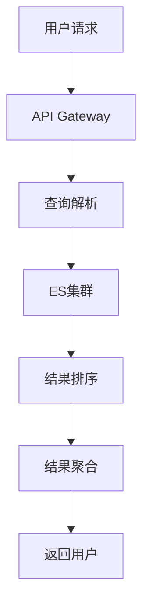

# ES 集群调优（分片策略 / JVM / 查询优化）

> Elasticsearch 集群调优 =「**分片设计 + JVM 调优 + 查询优化 + 集群运维**」四个维度。分片太少浪费并发，太多拖垮性能；JVM 配置不当导致 GC 停顿；查询写法不对全表扫描。本篇按「生产问题 → 调优手段 → 避坑」拆解。

---

## 一、分片策略

### 1.1 核心原则

```
分片 = ES 并发与分布的最小单位（不可再拆）
  单个分片大小：建议 10~50GB（最佳 20~30GB）
  分片数量：index 创建后不可减少（只能 Reindex）
  主分片数 = 节点数的倍数（均匀分布）

公式参考：
  分片数 ≈ 数据总量 ÷ 单分片大小（30GB）
  例：100GB 数据 → 3~4 个主分片
  预估：数据增长 3 倍 → 分片数 × 3
```

### 1.2 分片调优

| 问题 | 原因 | 解决 |
|------|------|------|
| 写入慢 | 分片太少，并发度低 | 增加分片数（Reindex） |
| 查询慢 | 分片太多，聚合开销大 | Reindex 合并分片 |
| 写入拒绝 | 分片过多，线程池耗尽 | 减少分片 + 控制写入速率 |
| 热点 | 单分片数据不均 | 调整路由/分片分配策略 |
| 内存溢出 | 分片过多导致元数据膨胀 | 控制分片总数（建议 < 500/节点） |

### 1.3 分片分配策略

```yaml
# 索引级别分片分配
"index.routing.allocation.require.zone": "zone_a"
"index.routing.allocation.require.node_type": "hot"

# 集群级别分片分配
"cluster.routing.allocation.awareness.attributes": "zone"

# 分片过滤
"index.routing.allocation.include.zone": "zone_a,zone_b"
"index.routing.allocation.exclude.zone": "zone_c"
```

### 1.4 分片总数控制

| 指标 | 建议值 |
|------|--------|
| 每节点分片数 | < 20 |
| 集群总分片数 | < 100,000 |
| 单分片大小 | 10~50GB |
| 单分片文档数 | < 200M |

---

## 二、JVM 调优

### 2.1 堆内存配置

```
ES 堆内存建议：
  物理内存 ≤ 64GB：堆 = 物理内存的 50%（最大 31GB）
  物理内存 > 64GB：堆 = 31GB（留内存给 OS 文件缓存）

示例（64GB 机器）：
  ES_JAVA_OPTS="-Xms31g -Xmx31g"

注意：
  Xms = Xmx（避免堆大小动态调整的开销）
  不要超过 31GB（指针压缩失效，内存翻倍）
  留一半给 OS 做文件缓存（Lucene 依赖 OS 缓存）
```

### 2.2 GC 调优

| 参数 | 说明 |
|------|------|
| `-XX:+UseG1GC` | G1 GC（ES 7+ 默认） |
| `-XX:MaxGCPauseMillis=50` | 目标停顿时间 |
| `-XX:+HeapDumpOnOutOfMemoryError` | OOM 时 dump |
| `-XX:HeapDumpPath=/var/log/es/heapdump.hprof` | dump 路径 |
| `-XX:+UseGCLogFileRotation` | GC 日志轮转 |
| `-XX:GCLogFileSize=64m` | GC 日志大小 |

### 2.3 JVM 监控

```bash
# 查看 JVM 堆使用
curl -s localhost:9200/_nodes/stats/jvm | jq '.nodes[].jvm.mem'

# 查看 GC 情况
curl -s localhost:9200/_nodes/stats/jvm | jq '.nodes[].jvm.gc.collectors'

# 查看分片内存
curl -s localhost:9200/_cat/allocation?v
```

### 2.4 常见 JVM 问题

| 问题 | 原因 | 解决 |
|------|------|------|
| GC 停顿长 | 堆过大/对象过多 | 减小堆/优化查询 |
| OOM | 堆不足/内存泄漏 | 加内存/查泄漏 |
| 指针压缩失效 | 堆 > 31GB | 控制堆 ≤ 31GB |

---

## 三、查询优化

### 3.1 写入优化

| 实践 | 说明 |
|------|------|
| 批量写入 | `_bulk` API（减少网络开销） |
| refresh_interval | 写入密集时调大（如 30s，默认 1s） |
| translog | 写入时可调 `translog.durability: async`（提升写入，有丢数据风险） |
| 副本数 | 写入时可设 0，写完再恢复（提升写入） |
| 路由 | 同一文档路由到同一分片（减少跨分片） |

### 3.2 查询优化

| 实践 | 说明 |
|------|------|
| 避免 wildcard | `*keyword*` 全量扫描（用 ngram 或 completion） |
| 避免深分页 | `from+size` 超过 10000 用 `search_after` |
| filter 替代 query | filter 不计分且可缓存 |
| 字段裁剪 | `_source` 指定返回字段（减少网络） |
| 聚合优化 | `size: 0` 只返回聚合不返回文档 |
| 冷热分离 | 热数据 SSD，冷数据 HDD |

### 3.3 深分页方案

```json
// 方案一：search_after（推荐）
POST /my-index/_search
{
  "size": 100,
  "sort": [{"timestamp": "asc"}, {"_id": "asc"}],
  "search_after": ["2024-01-01", "doc_id_123"]
}

// 方案二：scroll（不推荐，有状态）
// 方案三：Terminating aggregation（只统计不取文档）
```

### 3.4 查询慢原因分析

| 原因 | 排查方式 | 解决 |
|------|----------|------|
| 全表扫描 | 检查 query 是否匹配所有文档 | 加过滤条件 |
| 深分页 | 检查 from+size | 改用 search_after |
| wildcard | 检查通配符 | 用 ngram/tokenizer |
| 跨分片聚合 | 检查聚合字段 | 减少分片数 |
| 慢查询日志 | 开启 slow log | 分析慢查询原因 |

---

## 四、集群运维

### 4.1 集群健康

```bash
# 集群状态（green/yellow/red）
curl -s localhost:9200/_cluster/health?pretty

# 分片状态
curl -s localhost:9200/_cat/shards?v

# 未分配分片原因
curl -s localhost:9200/_cluster/allocation/explain?pretty

# 节点状态
curl -s localhost:9200/_cat/nodes?v&h=name,heap.percent,ram.percent,load_1m
```

### 4.2 常见集群问题

| 问题 | 原因 | 解决 |
|------|------|------|
| Yellow | 副本分片未分配（节点不够） | 扩容节点 / 调整副本数 |
| Red | 主分片丢失（数据丢失风险） | 从备份恢复 / 重新索引 |
| 写入拒绝 | 线程池满 / 磁盘水位线 | 控制写入速率 / 扩容 |
| 查询超时 | 分片太多 / 查询不合理 | 优化查询 / 合并分片 |
| 磁盘满 | 未及时清理 | 增加磁盘 / 调整水位线 / 删除索引 |

### 4.3 水位线管理

```yaml
# 磁盘水位线（默认值）
cluster.routing.allocation.disk.watermark.low: 85%    # 停止分配新分片
cluster.routing.allocation.disk.watermark.high: 90%    # 尝试迁移分片
cluster.routing.allocation.disk.watermark.flood_stage: 95%  # 只读
```

### 4.4 线程池监控

```bash
# 查看线程池状态
curl -s localhost:9200/_cat/thread_pool?v&h=node_name,name,active,queue,rejected

# 关键线程池
# write: 写入线程池（active/rejected）
# search: 查询线程池（active/rejected）
# get: 点查询线程池（active/rejected）
```

### 4.5 索引生命周期管理（ILM）

```
Hot → Warm → Cold → Delete

Hot：热数据，SSD，写入+查询
Warm：温数据，HDD，只查询
Cold：冷数据，归档，低频查询
Delete：自动删除过期数据
```

---

## 五、索引生命周期管理（ILM）深入

### 5.1 ILM 策略配置

```json
PUT _ilm/policy/logs-policy
{
  "policy": {
    "phases": {
      "hot": {
        "min_age": "0ms",
        "actions": {
          "rollover": {
            "max_age": "1d",
            "max_primary_shard_size": "50gb"
          },
          "set_priority": { "priority": 100 }
        }
      },
      "warm": {
        "min_age": "7d",
        "actions": {
          "shrink": { "number_of_shards": 1 },
          "forcemerge": { "max_num_segments": 1 },
          "set_priority": { "priority": 50 }
        }
      },
      "cold": {
        "min_age": "30d",
        "actions": {
          "set_priority": { "priority": 0 },
          "freeze": {}
        }
      },
      "delete": {
        "min_age": "90d",
        "actions": {
          "delete": {}
        }
      }
    }
  }
}
```

### 5.2 ILM 状态查看

```bash
# 查看索引 ILM 状态
GET logs-*/_ilm/explain

# 手动执行 ILM 操作
POST logs-000001/_ilm/rollover

# 重置 ILM 步骤
POST logs-000001/_ilm/operation/retry
```

### 5.3 Rollover 与别名

```json
# 创建带 ILM 的初始索引
PUT /%3Clogs-%7Bnow%2Fd%7D-000001
{
  "aliases": {
    "logs-write": { "is_write_index": true },
    "logs-read": {}
  },
  "settings": {
    "index.lifecycle.name": "logs-policy",
    "index.lifecycle.rollover_alias": "logs-write"
  }
}

# Rollover 后自动创建新索引，别名自动切换
```

---

## 六、跨集群复制（CCR）

### 6.1 CCR 架构


### 6.2 CCR 配置

```bash
# 主集群：创建 Leader 索引
PUT /logs-leader
{
  "settings": {
    "index.xpack.ccr.following_enabled": true
  }
}

# 从集群：创建 Follower 索引
PUT /logs-follower
{
  "remote_info": {
    "cluster": "primary-cluster"
  },
  "settings": {
    "index.xpack.ccr.leader_alias": "logs-leader"
  }
}

# 查看复制状态
GET /logs-follower/_ccr/stats
```

### 6.3 CCR 适用场景

| 场景 | 说明 |
|------|------|
| 灾备 | 主集群故障，从集群提升为新主 |
| 跨地域读 | 就近读取，降低延迟 |
| 报表查询 | 从集群专门处理查询，不影响主集群写入 |
| 数据合规 | 特定地域数据保留要求 |

---

## 七、可搜索快照（Searchable Snapshots）

### 7.1 快照存储架构

```
本地存储（热数据） ←→ 对象存储（S3/GCS/Azure Blob）
   │                      │
   ├── 完整索引数据        ├── 冻结索引数据
   └── 毫秒级查询          └── 按需加载到本地缓存

Searchable Snapshot = 从对象存储按需加载分片到本地缓存
  节点本地磁盘：存储热数据
  对象存储：存储冷数据（成本低 10 倍+）
```

### 7.2 快照配置示例

```json
# 将索引迁移到快照存储
POST _snapshot/my_s3_repository/logs-000001/_restore
{
  "indices": "logs-*",
  "index_settings": {
    "index.number_of_replicas": 0
  }
}

# 配置分层存储
PUT _ilm/policy/logs-policy
{
  "policy": {
    "phases": {
      "cold": {
        "actions": {
          "searchable_snapshot": {
            "snapshot_repository": "my_s3_repository"
          }
        }
      }
    }
  }
}
```

### 7.3 快照性能优化

| 配置 | 说明 |
|------|------|
| `index.store.snapshot.blob_cache.size` | 本地缓存大小（默认 100MB） |
| `index.store.snapshot.partial_file.readahead_size` | 预读大小 |
| 冷数据节点角色 | `node.roles: [data_cold]` |
| 强制合并 | 冻结前 `forcemerge` 到 1 个 segment |

---

## 八、Elasticsearch 与 Kubernetes（ECK Operator）

### 8.1 ECK 架构

```
Elastic Cloud on Kubernetes（ECK）
  └── Elasticsearch Operator（自动部署/管理/扩缩容）

CRD 资源：
  Elasticsearch  → 集群定义
  Kibana         → Kibana 定义
  APM Server     → APM 定义
  Elastic Agent  → Agent 定义

自动操作：
  节点发现与加入
  证书管理（自动生成 TLS）
  滚动升级
  存储卷管理
  健康检查与自愈
```

### 8.2 ECK 部署示例

```yaml
apiVersion: elasticsearch.k8s.elastic.co/v1
kind: Elasticsearch
metadata:
  name: production
spec:
  version: 8.12.0
  nodeSets:
  - name: master
    count: 3
    config:
      node.roles: ["master"]
    volumeClaimTemplates:
    - metadata:
        name: elasticsearch-data
      spec:
        accessModes: ["ReadWriteOnce"]
        resources:
          requests:
            storage: 50Gi
        storageClassName: fast-ssd
  - name: data-hot
    count: 3
    config:
      node.roles: ["data_hot", "ingest"]
    volumeClaimTemplates:
    - metadata:
        name: elasticsearch-data
      spec:
        accessModes: ["ReadWriteOnce"]
        resources:
          requests:
            storage: 200Gi
        storageClassName: fast-ssd
  - name: data-warm
    count: 2
    config:
      node.roles: ["data_warm"]
    volumeClaimTemplates:
    - metadata:
        name: elasticsearch-data
      spec:
        accessModes: ["ReadWriteOnce"]
        resources:
          requests:
            storage: 500Gi
        storageClassName: hdd
```

### 8.3 ECK 与 K8s 监控集成

```yaml
# 自定义 Pod 模板添加 Prometheus 注解
spec:
  nodeSets:
  - name: data
    podTemplate:
      metadata:
        annotations:
          prometheus.io/scrape: "true"
          prometheus.io/port: "9200"
          prometheus.io/path: "/_metrics/prometheus"
```

---

## 九、查询性能优化（Doc Values / Fielddata）

### 9.1 Doc Values 机制

| 特性 | 说明 |
|------|------|
| 存储方式 | 列式存储（与行式 _source 互补） |
| 用途 | 排序、聚合、脚本访问字段值 |
| 默认开启 | keyword/数值/日期/boolean |
| 关闭方式 | `"doc_values": false`（节省磁盘但不能排序/聚合） |

### 9.2 Fielddata 与 Text 字段聚合

```json
// Text 字段默认不支持聚合（需开启 fielddata）
PUT /my-index/_mapping
{
  "properties": {
    "title": {
      "type": "text",
      "fielddata": true,
      "fielddata_frequency_filter": {
        "min": 0.01,
        "min_segment_size": 1000
      }
    }
  }
}

// 更佳方案：用 keyword 子字段聚合
{
  "properties": {
    "title": {
      "type": "text",
      "fields": {
        "keyword": { "type": "keyword" }
      }
    }
  }
}

// 聚合使用 title.keyword
GET /my-index/_search
{
  "aggs": {
    "title_agg": {
      "terms": { "field": "title.keyword" }
    }
  }
}
```

### 9.3 查询性能优化速查

| 优化手段 | 说明 |
|----------|------|
| filter 替代 query | filter 不计分且可缓存 |
| 禁用不需要的 `_source` 字段 | 减少网络传输 |
| 合理设置 `size: 0` | 聚合查询不返回文档 |
| 使用 `preference` 路由查询 | 利用缓存 |
| 开启 `search.allow_partial_results` | 部分分片失败不阻塞整体 |
| 控制分片数 | 每个分片有查询开销 |

---

## 十、批量索引最佳实践

### 10.1 Bulk API 使用规范

```json
POST _bulk
{"index": {"_index": "logs", "_id": 1}}
{"timestamp": "2024-01-01", "message": "hello"}
{"index": {"_index": "logs", "_id": 2}}
{"timestamp": "2024-01-01", "message": "world"}
```

### 10.2 Bulk 调优参数

| 参数 | 建议值 | 说明 |
|------|--------|------|
| 批量大小 | 5~15MB | 太小浪费连接，太大占用内存 |
| 文档数 | 1000~5000 | 根据文档大小调整 |
| 线程数 | 1~CPU 核数 | 避免过多线程竞争 |
| refresh_interval | 30s | 写入密集时调大 |
| translog.durability | async | 异步提升写入，有丢数据风险 |
| 副本数 | 0→1 | 写入时禁用副本，写完恢复 |

### 10.3 Bulk 写入监控

```bash
# 监控 Bulk 拒绝数
curl -s localhost:9200/_cat/thread_pool/write?v&h=node_name,active,queue,rejected

# 监控索引速率
curl -s localhost:9200/_nodes/stats/indices/indexing

# 分析慢 Bulk
GET _cluster/stats?pretty
```

---

## 十一、Elasticsearch 安全（RBAC / SAML / OIDC）

### 11.1 安全架构

```
Elasticsearch Security
  ├── 认证（Authentication）
  │   ├── 内置用户（elastic/changeme）
  │   ├── LDAP/Active Directory
  │   ├── SAML（企业 SSO）
  │   ├── OIDC（OpenID Connect）
  │   └── API Key / Token
  ├── 授权（Authorization）
  │   ├── RBAC（角色控制）
  │   ├── 基于字段/文档权限
  │   └── 基于索引的权限
  └── 审计（Audit Logging）
      └── 记录所有管理操作和查询
```

### 11.2 RBAC 配置示例

```json
# 创建角色
POST /_security/role/log_reader
{
  "cluster": ["monitor"],
  "indices": [
    {
      "names": ["logs-*"],
      "privileges": ["read", "view_index_metadata"]
    }
  ]
}

# 创建用户并分配角色
POST /_security/user/log_analyst
{
  "password": "secure_password",
  "roles": ["log_reader"],
  "full_name": "Log Analyst"
}
```

### 11.3 SAML 集成配置

```yaml
# elasticsearch.yml
xpack.security.authc.realms.saml.saml1:
  order: 3
  idp.metadata.path: idp-metadata.xml
  idp.entity_id: https://idp.example.com
  sp.entity_id: https://elasticsearch.example.com
  sp.acs: https://elasticsearch.example.com/_security/acs/saml
  attributes.principal: nameid
  attributes.groups: groups
```

### 11.4 API Key 管理

```bash
# 创建 API Key
POST /_security/api_key
{
  "name": "monitoring-key",
  "role_descriptors": {
    "monitoring": {
      "cluster": ["monitor"],
      "index": [{ "names": ["monitoring-*"], "privileges": ["read"] }]
    }
  }
}

# 使用 API Key
curl -H "Authorization: ApiKey <base64-encoded-key>" \
  localhost:9200/_cat/indices
```

---

## 十二、Elasticsearch 可观测性

### 12.1 内置监控指标

```
Elasticsearch 核心指标：
  集群健康：green/yellow/red
  节点指标：JVM/GC/CPU/内存
  索引指标：索引速率/查询速率/延迟
  线程池：write/search/get/bulk 拒绝数
  磁盘：水位线/IO 延迟
```

### 12.2 Prometheus 集成

```yaml
# elasticsearch.yml
xpack.monitoring.collection.enabled: true
xpack.monitoring.exporters.prometheus.type: http
xpack.monitoring.exporters.prometheus.host: ["http://prometheus:9090"]

# 或使用 elasticsearch_exporter
# docker run --rm -p 9114:9114 \
#   justwatch/elasticsearch_exporter \
#   --es.uri=http://localhost:9200
```

### 12.3 慢查询日志配置

```yaml
# elasticsearch.yml
index.search.slowlog.threshold.query.warn: 5s
index.search.slowlog.threshold.query.info: 2s
index.search.slowlog.threshold.fetch.warn: 1s
index.indexing.slowlog.threshold.index.warn: 5s
```

### 12.4 健康检查命令

```bash
# 集群健康
GET _cluster/health?pretty

# 节点统计
GET _nodes/stats?pretty

# 索引统计
GET _stats?pretty

# 分片分布
GET _cat/shards?v&h=index,shard,prirep,state,node

# 未分配分片原因
GET _cluster/allocation/explain?pretty
```

---

## ILM 完整配置与索引生命周期

### rollover / shrink / forcemerge / delete

```json
// ILM Policy 完整配置
PUT /_ilm/policy/logs-policy
{
  "policy": {
    "phases": {
      "hot": {
        "min_age": "0ms",
        "actions": {
          "rollover": {
            "max_primary_shard_size": "50gb",
            "max_age": "1d"
          },
          "set_priority": { "priority": 100 }
        }
      },
      "warm": {
        "min_age": "5d",
        "actions": {
          "shrink": { "number_of_shards": 1 },
          "forcemerge": { "max_num_segments": 1 },
          "set_priority": { "priority": 50 }
        }
      },
      "cold": {
        "min_age": "30d",
        "actions": {
          "freeze": {},
          "set_priority": { "priority": 0 }
        }
      },
      "delete": {
        "min_age": "90d",
        "actions": {
          "delete": {}
        }
      }
    }
  }
}
```

| 阶段 | 动作 | 说明 |
|------|------|------|
| hot | rollover | 超过 50GB/1天滚动索引 |
| warm | shrink + forcemerge | 合并分片 + 压缩段 |
| cold | freeze | 冻结索引（只读） |
| delete | delete | 自动清理 |

## Searchable Snapshots 按需加载

### 冷数据查询优化

```
Searchable Snapshots：
  原理：索引快照存到对象存储（S3/GCS）
  查询时按需加载（不全量加载）
  适用：冷数据/归档数据偶尔查询

配置：
  1. 创建快照仓库
  PUT _snapshot/s3_backup
  {
    "type": "s3",
    "settings": {
      "bucket": "my-backup-bucket",
      "region": "us-east-1"
    }
  }

  2. 创建可搜索快照索引
  PUT _snapshot/my_backup/snapshot_1/_restore
  {
    "indices": "logs-*",
    "index_settings": {
      "index.searchable_snowflake": {
        "data_set": "logs",
        "max_concurrent_node_deciders": 2
      }
    }
  }

优势：
  存储成本降低 90%+
  查询延迟增加（毫秒级到秒级）
  自动缓存热数据
```

## Doc Values vs Fielddata

### 内存使用与性能对比

| 特性 | Doc Values | Fielddata |
|------|-----------|-----------|
| 存储位置 | 磁盘（列式） | 堆内存 |
| 内存占用 | 低（压缩） | 高（全量加载） |
| 适用字段 | keyword/数值/date | text（分词后） |
| 排序聚合 | 极快 | 快但占内存 |
| 风险 | 无 OOM 风险 | 可能 OOM |
| 禁用 | 不可禁用 | 可禁用 |

```json
// 禁用 Fielddata（避免 OOM）
PUT /logs/_mapping
{
  "properties": {
    "message": {
      "type": "text",
      "fielddata": false
    }
  }
}

// 使用 Doc Values 排序
GET /logs/_search
{
  "sort": [
    { "timestamp": { "order": "desc" } },
    { "response_time": { "order": "asc" } }
  ]
}
```

## Bulk Best Practices

### 批量写入优化

```
Bulk 写入最佳实践：
  1. 批量大小：1000-5000 条/批
  2. 批次大小：5-15MB（避免单批过大）
  3. 线程数：CPU 核数 × 2（避免上下文切换）
  4. 重试：自动重试 3 次（网络抖动）
  5. 刷新间隔：关闭自动刷新（写入后批量刷新）

Bulk 请求格式：
  POST _bulk
  { "index": { "_index": "logs", "_id": "1" } }
  { "timestamp": "...", "message": "..." }
  { "index": { "_index": "logs", "_id": "2" } }
  { "timestamp": "...", "message": "..." }

监控 Bulk 响应：
  items[].index.error：写入错误
  errors：是否有错误
  took：总耗时
```

## ES 监控指标

### JVM / Thread Pool / Circuit Breaker

```
关键监控指标：

1. JVM 内存
   GET _cat/nodes?v&h=name,heap.percent,heap.current,heap.max
   告警阈值：heap.percent > 75%

2. 线程池
   GET _cat/thread_pool/write?v&h=node_name,active,queue,rejected
   rejected > 0 → 写入压力过大
   active > 线程池大小 → 线程耗尽

3. 熔断器
   GET _nodes/stats/breaker
   tripped > 0 → 内存压力触发熔断

4. 磁盘使用率
   GET _cat/allocation?v
   used_disk_percent > 80% → 预警

5. 分片状态
   GET _cat/health?v
   unassigned_shards > 0 → 分片未分配
```

| 指标 | 告警阈值 | 处理 |
|------|----------|------|
| JVM Heap | > 75% | 增加节点/调大 heap |
| Thread Pool rejected | > 0 | 降低写入并发/增加节点 |
| Circuit Breaker tripped | > 0 | 检查查询/增加内存 |
| 磁盘使用率 | > 80% | 扩容/清理 |
| 未分配分片 | > 0 | 检查节点健康/reroute |

## 线程池调优

### write / search / get / bulk

```yaml
# 线程池配置（elasticsearch.yml）
thread_pool.write.size: 16        # 写线程池大小
thread_pool.write.queue_size: 100 # 写队列大小

thread_pool.search.size: 32       # 搜索线程池
thread_pool.search.queue_size: 200

thread_pool.get.size: 16          # 单文档获取
thread_pool.get.queue_size: 64

# 调优原则：
# write.size = CPU 核数（默认即可）
# search.size = CPU 核数 × 2（搜索密集型）
# queue_size = 预期并发 × 2（避免 rejected）
```

## ES 在搜索架构中的分层设计

### 搜索系统分层架构



### 索引分层策略

| 层级 | 数据特征 | 索引策略 | 生命周期 |
|------|----------|----------|----------|
| 热数据 | 最近7天 | 独立索引+ILM | NVMe SSD |
| 温数据 | 7-30天 | 合并索引 | SATA SSD |
| 冷数据 | 30-90天 | 只读索引 | 对象存储 |
| 归档数据 | >90天 | 快照 | 删除/归档 |

```json
// ILM 分层配置
PUT _ilm/policy/search_lifecycle
{
  "policy": {
    "phases": {
      "hot": {
        "actions": {
          "rollover": { "max_age": "7d", "max_size": "50gb" }
        }
      },
      "warm": {
        "min_age": "7d",
        "actions": {
          "shrink": { "number_of_shards": 1 },
          "forcemerge": { "max_num_segments": 1 }
        }
      },
      "cold": {
        "min_age": "30d",
        "actions": {
          "freeze": {}
        }
      }
    }
  }
}
```

### ES 与 ClickHouse 混合架构

```text
架构模式：
  ES：全文检索 + 聚合（小结果集）
  ClickHouse：大规模聚合分析（大结果集）

  查询路由规则：
    关键词搜索 → ES（倒排索引优势）
    明细查询 → ES（精确匹配）
    统计分析 → ClickHouse（列存优势）
    日志聚合 → ClickHouse（成本优势）
```

## 十三、与其他板块的关系

- ES 基础见「[ES 体系](../ES体系.md)」；
- ES 源码见「[MySQL InnoDB 源码](../../源码系列/MySQL-InnoDB源码.md)」（参考思路）；
- 搜索场景见「[场景设计/搜索系统设计](../../场景设计/搜索系统设计.md)」；
- 日志体系见「[ELK 日志体系](./ELK日志体系.md)」；
- Solr 对比见「[Solr 搜索平台](./Solr搜索平台.md)」。

---

## 六、ES 生产配置清单

### 6.1 elasticsearch.yml 关键配置

```yaml
# 集群配置
cluster.name: my-cluster
node.name: node-1
node.roles: [master, data_hot]

# 路径配置
path.data: /data/elasticsearch
path.logs: /var/log/elasticsearch

# 网络配置
network.host: 0.0.0.0
http.port: 9200
transport.port: 9300

# 内存配置
bootstrap.memory_lock: true

# 索引配置
action.auto_create_index: false
action.destructive_requires_name: true
```

### 6.2 索引模板示例

```json
{
  "index_patterns": ["logs-*"],
  "settings": {
    "number_of_shards": 3,
    "number_of_replicas": 1,
    "refresh_interval": "30s",
    "index.routing.allocation.require.node_type": "hot"
  },
  "mappings": {
    "properties": {
      "@timestamp": {"type": "date"},
      "message": {"type": "text"},
      "level": {"type": "keyword"}
    }
  }
}
```

### 6.3 监控指标

```
关键 ES 指标：
  集群状态：green/yellow/red
  JVM 堆使用率：<70% 正常
  GC 频率：<1次/分钟
  索引延迟：<200ms
  查询延迟：<100ms
  磁盘使用率：<80%
  分片分布是否均匀
  线程池拒绝数：0
```

### 6.4 常见问题排查

| 问题 | 原因 | 解决 |
|------|------|------|
| 集群 Yellow | 副本未分配 | 扩容节点/调整副本数 |
| 写入拒绝 | 线程池满/磁盘满 | 控制写入速率/扩容 |
| 查询超时 | 分片太多/查询不合理 | 优化查询/合并分片 |
| JVM OOM | 堆过大/内存泄漏 | 减小堆/查泄漏 |
| 磁盘满 | 未及时清理 | 删除索引/调整水位线 |

## 七、ILM 生命周期策略完整配置

### 7.1 hot→warm→cold→delete 四阶段

```json
PUT _ilm/policy/logs_policy
{
  "policy": {
    "phases": {
      "hot": {
        "min_age": "0ms",
        "actions": {
          "rollover": {
            "max_primary_shard_size": "50gb",
            "max_age": "1d"
          },
          "set_priority": { "priority": 100 }
        }
      },
      "warm": {
        "min_age": "7d",
        "actions": {
          "shrink": { "number_of_shards": 1 },
          "forcemerge": { "max_num_segments": 1 },
          "allocate": {
            "require": { "data": "warm" }
          },
          "set_priority": { "priority": 50 }
        }
      },
      "cold": {
        "min_age": "30d",
        "actions": {
          "allocate": {
            "require": { "data": "cold" }
          },
          "freeze": {},
          "set_priority": { "priority": 0 }
        }
      },
      "delete": {
        "min_age": "90d",
        "actions": {
          "delete": {}
        }
      }
    }
  }
}
```

### 7.2 ILM 关键参数

| 阶段 | 关键动作 | 说明 |
|------|----------|------|
| hot | rollover | 按大小/时间滚动索引 |
| warm | forcemerge | 合并段提升查询性能 |
| warm | shrink | 减少分片数降低资源占用 |
| cold | freeze | 冻结索引，降低内存占用 |
| delete | delete | 自动清理过期数据 |

## 八、CCR 跨集群复制

### 8.1 配置步骤

```text
Step 1：配置远程集群（Leader 集群）
  PUT _cluster/settings
  {
    "persistent": {
      "cluster.remote.leader_cluster": {
        "seeds": ["leader-node1:9300"]
      }
    }
  }

Step 2：创建跟随索引（Follower 集群）
  PUT /follower-index/_ccr/follow
  {
    "remote_cluster": "leader_cluster",
    "leader_index": "leader-index"
  }

Step 3：查看复制状态
  GET /follower-index/_ccr/stats
```

### 8.2 CCR 监控指标

```text
关键监控项：
  ccr.lag.rows                  → 落后行数
  ccr.lag.time_millis           → 落后时间(ms)
  ccr.sync.stats.fetched_bytes  → 同步字节数
  ccr.internal.read_exceptions  → 读取异常

告警规则：
  lag.rows > 10000 持续 5min → 告警
  lag.time_millis > 60000 → 严重告警
```

## 九、可搜索快照（Searchable Snapshots）

### 9.1 原理与使用

```text
传统快照：只能整体恢复，恢复时间长
可搜索快照：快照中的数据可直接查询，按需加载

工作机制：
  1. 数据快照存储在对象存储（S3/GCS）
  2. 查询时按需加载到本地缓存（shared cache）
  3. 未命中缓存的查询直接从快照读取

配置示例：
  PUT _snapshot/my_repository
  PUT my_index/_snapshot/my_repository/my_snapshot?wait_for_completion=true
  POST _snapshot/my_repository/my_snapshot/_mount
  {
    "index": "my_index",
    "snapshot": "my_snapshot",
    "storage": {
      "shared_cache": { "size": "10gb" }
    }
  }
```

### 9.2 性能影响

| 场景 | 性能影响 | 建议 |
|------|----------|------|
| 热数据查询 | 接近本地索引（缓存命中） | 保持足够缓存大小 |
| 冷数据查询 | 有网络延迟（~50-200ms） | 使用 frozen 层 |
| 写入 | 不支持写入（只读） | 配合 ILM 使用 |
| 成本 | 存储成本降低 50-70% | 冷数据首选方案 |

## 十、ECK Operator 部署架构

### 10.1 核心组件

```yaml
# ECK Operator 部署
apiVersion: apps/v1
kind: Deployment
metadata:
  name: elastic-operator
  namespace: elastic-system
spec:
  replicas: 1
  selector:
    matchLabels:
      name: elastic-operator
  template:
    spec:
      containers:
      - name: manager
        image: docker.elastic.co/eck/eck-operator:2.10.0
        args: ["--log-verbosity=0"]
        resources:
          limits:
            memory: 512Mi
            cpu: 500m

# Elasticsearch 集群
apiVersion: elasticsearch.k8s.elastic.co/v1
kind: Elasticsearch
metadata:
  name: production
spec:
  version: 8.12.0
  nodeSets:
  - name: master
    count: 3
    config:
      node.roles: ["master"]
  - name: data
    count: 5
    config:
      node.roles: ["data_hot", "data_content"]
    volumeClaimTemplates:
    - metadata:
        name: elasticsearch-data
      spec:
        accessModes: ["ReadWriteOnce"]
        resources:
          requests:
            storage: 100Gi
```

### 10.2 ECK 架构优势

```text
传统部署：
  手动安装 ES + 手动配置集群 + 手动管理证书

ECK 部署：
  Operator 自动管理：
    - 集群拓扑自动编排
    - 证书自动签发（cert-manager 集成）
    - 滚动升级（零停机）
    - 自动故障转移
    - 存储自动扩缩容
```

## 十一、Doc Values vs Fielddata 存储机制

### 11.1 内存模型对比

| 特性 | Doc Values | Fielddata |
|------|------------|-----------|
| 加载时机 | 索引时构建 | 查询时加载 |
| 存储位置 | 堆外内存（off-heap） | 堆内内存（on-heap） |
| 默认开启 | text 字段默认关闭，其他开启 | 默认关闭 |
| 排序聚合 | 高效（列式存储） | 低效（加载全部） |
| 内存占用 | 可控（可配置） | 不可控（OOM 风险） |
| 建议 | 生产环境首选 | 避免使用 |

```yaml
# 禁用 Doc Values
PUT my_index
{
  "mappings": {
    "properties": {
      "message": {
        "type": "text",
        "doc_values": false
      }
    }
  }
}
```

## 十二、批量索引最佳实践

### 12.1 bulk sizing

```text
推荐配置：
  bulk size：5-15 MB（权衡吞吐量和内存）
  单文档大小：<100 KB
  并发 bulk 请求数：CPU 核数 × 2

最佳实践：
  1. 使用 _bulk API，不要逐条 index
  2. 每个 bulk 请求控制在 5-15MB
  3. 使用异步 bulk（BulkProcessor）
  4. 配置重试和背压
```

### 12.2 Backpressure 与 Retry

```java
// BulkProcessor 配置
BulkProcessor bulkProcessor = BulkProcessor.builder(
    client::bulkAsync, new BulkProcessor.Listener() { ... })
    .setBulkRequests(1000)           // 最大请求数
    .setBulkSize(5, SizeUnit.MB)     // 最大大小
    .setFlushInterval(TimeValue.timeValueSeconds(5))
    .setBackoffPolicy(BackoffPolicy.exponentialBackoff(
        TimeValue.timeValueMillis(100), 8))  // 指数退避
    .build();
```

## 十三、ES 监控关键指标

### 13.1 核心监控维度

| 维度 | 指标 | 告警阈值 |
|------|------|----------|
| 索引 | indexing_success_rate | <99% |
| 索引 | indexing_latency_avg | >200ms |
| 查询 | search_query_rate | 基线对比 |
| 查询 | search_query_latency_p99 | >500ms |
| 拒绝 | thread_pool_rejected_count | >0 |
| 待办 | pending_tasks | >100 |
| JVM | jvm_mem_heap_used_percent | >70% |
| 磁盘 | disk_usage_percent | >80% |

### 13.2 监控告警配置

```text
Prometheus 告警规则示例：
  groups:
  - name: es-alerts
    rules:
    - alert: ESHighIndexingLatency
      expr: elasticsearch_indexing_latency_seconds > 0.2
      for: 5m
      labels:
        severity: warning
    - alert: ESRejectedThreads
      expr: increase(elasticsearch_thread_pool_rejected_count[5m]) > 0
      for: 1m
      labels:
        severity: critical
    - alert: ESDiskHigh
      expr: elasticsearch_disk_usage_percent > 80
      for: 10m
      labels:
        severity: critical
```

---

## 十四、ILM 策略与索引模板实战

### ILM 完整配置示例

```json
PUT _ilm/policy/es-production-policy
{
  "policy": {
    "phases": {
      "hot": {
        "min_age": "0ms",
        "actions": {
          "rollover": {
            "max_primary_shard_size": "50gb",
            "max_age": "1d",
            "max_docs": 100000000
          },
          "set_priority": { "priority": 100 }
        }
      },
      "warm": {
        "min_age": "3d",
        "actions": {
          "shrink": { "number_of_shards": 1 },
          "forcemerge": { "max_num_segments": 1 },
          "set_priority": { "priority": 50 }
        }
      },
      "cold": {
        "min_age": "30d",
        "actions": {
          "freeze": {},
          "set_priority": { "priority": 0 }
        }
      },
      "delete": {
        "min_age": "90d",
        "actions": {
          "delete": {}
        }
      }
    }
  }
}
```

| ILM阶段 | 存储介质 | 分片策略 | 副本数 | 查询性能 | 成本 |
|---------|---------|---------|--------|---------|------|
| Hot | NVMe SSD | 多分片(3-5) | 1 | 极高 | 高 |
| Warm | SATA SSD | 单分片(shrink) | 0-1 | 中 | 中 |
| Cold | 对象存储 | 单分片 | 0 | 低 | 低 |
| Delete | - | - | - | 不可查 | 零 |

### 搜索快照（Searchable Snapshots）

```json
// 从快照恢复为可搜索索引
POST /_snapshot/my_repository/my_snapshot/_restore
{
  "indices": "logs-*",
  "index_settings": {
    "index.searchable_s snapshots.frozen": false
  }
}

// 挂载快照为只读索引
POST /_snapshot/my_repository/logs-daily/_mount
{
  "index": "logs-2026.01.15",
  "rewritten_destination_name": "logs-mount-2026.01.15"
}
```

| 特性 | 本地索引 | 可搜索快照 | 冷索引 |
|------|---------|-----------|--------|
| 存储位置 | 本地磁盘 | 对象存储 | 本地/对象 |
| 查询延迟 | <100ms | 200-500ms | 1-5s |
| 成本 | $$$$ | $ | $$ |
| 缓存 | 无 | 自动缓存热点 | 无 |
| 适用 | 热数据 | 温数据 | 冷数据 |

## 十五、Doc Values vs Fielddata 深度对比

| 维度 | Doc Values | Fielddata |
|------|-----------|-----------|
| 存储时机 | 索引时构建 | 查询时加载 |
| 存储介质 | 磁盘(列式) | 堆内存 |
| 内存占用 | 低 | 高(可能OOM) |
| 适用字段 | keyword/数值/date | text(聚合需开启) |
| 性能 | 快(磁盘预加载) | 慢(堆GC压力) |
| 启用方式 | 默认启用 | 需显式mapping |

```json
// 不要在text字段上开启fielddata
PUT /my-index/_mapping
{
  "properties": {
    "message": {
      "type": "text",
      "fielddata": false  // 显式禁用，防止OOM
    },
    "status": {
      "type": "keyword"  // 自动使用doc_values
    }
  }
}
```

## 十六、Bulk 操作最佳实践与大小控制

| 参数 | 推荐值 | 说明 |
|------|--------|------|
| bulk大小 | 5-15MB | 过大占用带宽，过小增加请求开销 |
| 单文档大小 | <100KB | 超大文档单独处理 |
| 并发bulk数 | CPU核数×1-2 | 避免过度并发 |
| 重试次数 | 3次 | 指数退避 |
| 刷新间隔 | 30s-5s | bulk期间可适当放宽 |

```java
// BulkProcessor 最优配置
BulkProcessor bulkProcessor = BulkProcessor.builder(
    client::bulkAsync, new BulkProcessor.Listener() {
        @Override
        public void afterBulk(long requestId, BulkResponse response) {
            if (response.hasFailures()) {
                log.error("Bulk失败: {}", response.buildFailureMessage());
            }
        }
        @Override
        public void afterBulk(long requestId, long elapsedMs, BulkResponse response) {
            log.info("Bulk耗时: {}ms, 索引数: {}", elapsedMs, response.getItems().length);
        }
    })
    .setBulkRequests(5000)           // 单次最大请求数
    .setBulkSize(10, SizeUnit.MB)    // 单次最大10MB
    .setFlushInterval(TimeValue.timeValueSeconds(5))
    .setBackoffPolicy(BackoffPolicy.exponentialBackoff(
        TimeValue.timeValueMillis(50), 5))
    .build();
```

## 十七、线程池监控与调优

### 关键线程池

| 线程池 | 用途 | 告警阈值 | 处理方案 |
|--------|------|---------|---------|
| write | 写入/更新 | rejected>0 | 扩容节点 |
| search | 查询搜索 | rejected>0 | 优化查询/扩容 |
| get | 文档获取 | rejected>0 | 检查热点 |
| bulk | 批量操作 | rejected>0 | 降低bulk大小 |
| merge | 段合并 | rejected>0 | 增加IO |
| fetch | 查询结果拉取 | rejected>0 | 优化scroll |

```bash
# 查看线程池状态
GET /_cat/thread_pool?v&h=node_name,name,active,queue,rejected,completed

# 关键告警规则
rejected_count > 0 → 检查对应操作
queue_size > 100 → 排队严重，需扩容
active > thread_pool_size → 线程池满载
```

---

## 十八、ILM 完整配置示例

### 18.1 ILM 策略配置

```json
PUT _ilm/policy/logs-policy
{
  "policy": {
    "phases": {
      "hot": {
        "min_age": "0ms",
        "actions": {
          "rollover": {
            "max_primary_shard_size": "50gb",
            "max_age": "1d"
          },
          "set_priority": {
            "priority": 100
          }
        }
      },
      "warm": {
        "min_age": "3d",
        "actions": {
          "shrink": {
            "number_of_shards": 1
          },
          "forcemerge": {
            "max_num_segments": 1
          },
          "set_priority": {
            "priority": 50
          }
        }
      },
      "cold": {
        "min_age": "30d",
        "actions": {
          "set_priority": {
            "priority": 0
          }
        }
      },
      "delete": {
        "min_age": "90d",
        "actions": {
          "delete": {}
        }
      }
    }
  }
}
```

### 18.2 索引模板配置

```json
PUT _index_template/logs-template
{
  "index_patterns": ["logs-*"],
  "template": {
    "settings": {
      "number_of_shards": 3,
      "number_of_replicas": 1,
      "index.lifecycle.name": "logs-policy",
      "index.lifecycle.rollover_alias": "logs"
    },
    "mappings": {
      "properties": {
        "@timestamp": { "type": "date" },
        "message": { "type": "text" },
        "service": { "type": "keyword" },
        "level": { "type": "keyword" }
      }
    }
  }
}
```

---

## 十九、可搜索快照深入

### 19.1 可搜索快照原理

```
可搜索快照原理：
  ① 冷数据迁移到对象存储（S3/MinIO）
  ② 本地缓存热点数据（Page Cache）
  ③ 查询时按需加载（Lazy Loading）

  优势：
    存储成本降低 90%（对象存储 vs 本地磁盘）
    查询性能接近本地（本地缓存）
    自动管理（ILM 自动迁移）

  配置：
    index.search.snowball.enabled: true
    index.search.snowball.remote仓库: my-s3-repo
```

### 19.2 可搜索快照配置

```json
# 注册快照仓库
PUT _snapshot/my-s3-repo
{
  "type": "s3",
  "settings": {
    "bucket": "my-es-bucket",
    "region": "us-east-1"
  }
}

# 创建可搜索快照索引
PUT /my-index-snapshot
{
  "settings": {
    "index.search.snowball.enabled": true,
    "index.search.snowball.repository": "my-s3-repo",
    "index.search.snowball.snapshot_name": "my-snapshot"
  }
}
```

---

## 二十、Doc Values vs Fielddata 深入对比

### 20.1 内存模型对比

| 维度 | Doc Values | Fielddata |
|------|------------|-----------|
| 存储位置 | 磁盘（列式存储） | 堆内存 |
| 加载时机 | 查询时加载 | 首次查询时加载 |
| 内存占用 | 低（磁盘缓存） | 高（全量加载） |
| 性能 | 中等（磁盘 IO） | 快（内存） |
| 适用场景 | 聚合/排序/脚本 | 复杂脚本/高基数字段 |

### 20.2 使用建议

```
Doc Values 使用建议：
  默认启用：大多数字段默认启用
  聚合字段：必须启用
  排序字段：必须启用
  脚本字段：建议启用

  关闭场景：
    不需要聚合/排序的大文本字段
    临时计算的字段

  配置方式：
    "doc_values": true
    "doc_values": false
```

---

## 二十一、Bulk 操作最佳实践

### 21.1 Bulk Sizing 计算

```
Bulk Sizing 计算：
  单个文档大小：1KB
  推荐 bulk 大小：5-15MB
  文档数量：5000-15000 个

  计算公式：
    bulk_size = 单文档大小 × 文档数量
    示例：1KB × 10000 = 10MB

  注意事项：
    不要超过 100MB（单次请求过大）
    不要小于 1MB（请求过小，效率低）
    监控 bulk 队列深度
```

### 21.2 Bulk 最佳实践

```java
// Java Bulk 最佳实践
BulkRequest bulkRequest = new BulkRequest();
bulkRequest.timeout("10s");

for (Document doc : documents) {
    bulkRequest.add(new IndexRequest("my-index")
        .id(doc.getId())
        .source(doc.toJson()));
}

// 批量执行
BulkResponse response = client.bulk(bulkRequest, RequestOptions.DEFAULT);

// 处理响应
if (response.hasFailures()) {
    // 处理失败
    for (BulkItemResponse item : response.getItems()) {
        if (item.isFailed()) {
            System.out.println("Failed: " + item.getFailureMessage());
        }
    }
}
```

---

## 二十二、JVM 堆内存调优深入

### 22.1 堆内存配置原则

```
JVM 堆内存配置原则：
  ① 堆大小：物理内存的 50%，最大 31GB
  ② Xms = Xmx：避免动态调整
  ③ 留一半给 OS：Lucene 依赖 OS 文件缓存
  ④ 不要超过 31GB：指针压缩失效

  配置示例：
    64GB 内存：堆 31GB，OS 33GB
    128GB 内存：堆 31GB，OS 97GB
    256GB 内存：堆 31GB，OS 225GB
```

### 22.2 GC 调优参数

```
GC 调优参数：
  -XX:+UseG1GC：使用 G1 GC
  -XX:MaxGCPauseMillis=50：目标停顿时间 50ms
  -XX:G1HeapRegionSize=4m：Region 大小 4MB
  -XX:InitiatingHeapOccupancyPercent=45：触发 GC 的堆占用率
  -XX:G1ReservePercent=10：预留空间

  监控 GC：
    jstat -gc <pid> 1000
    jmap -heap <pid>
    jstack <pid>
```

> 一句话：**ES 调优 = 分片（10~30GB/分片，别太多）+ JVM（堆 ≤31GB，留一半给 OS 缓存）+ 查询（filter 替代 query，避免深分页 wildcard）+ 集群（监控 health/水位线/线程池）**。
