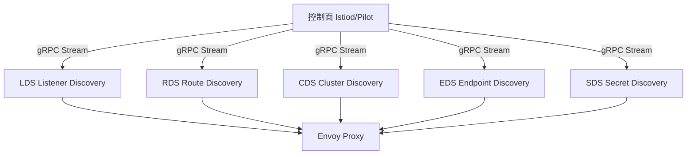
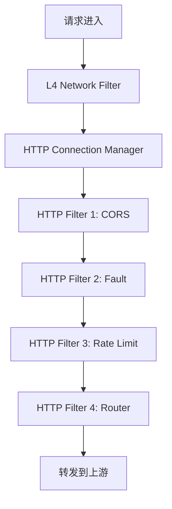
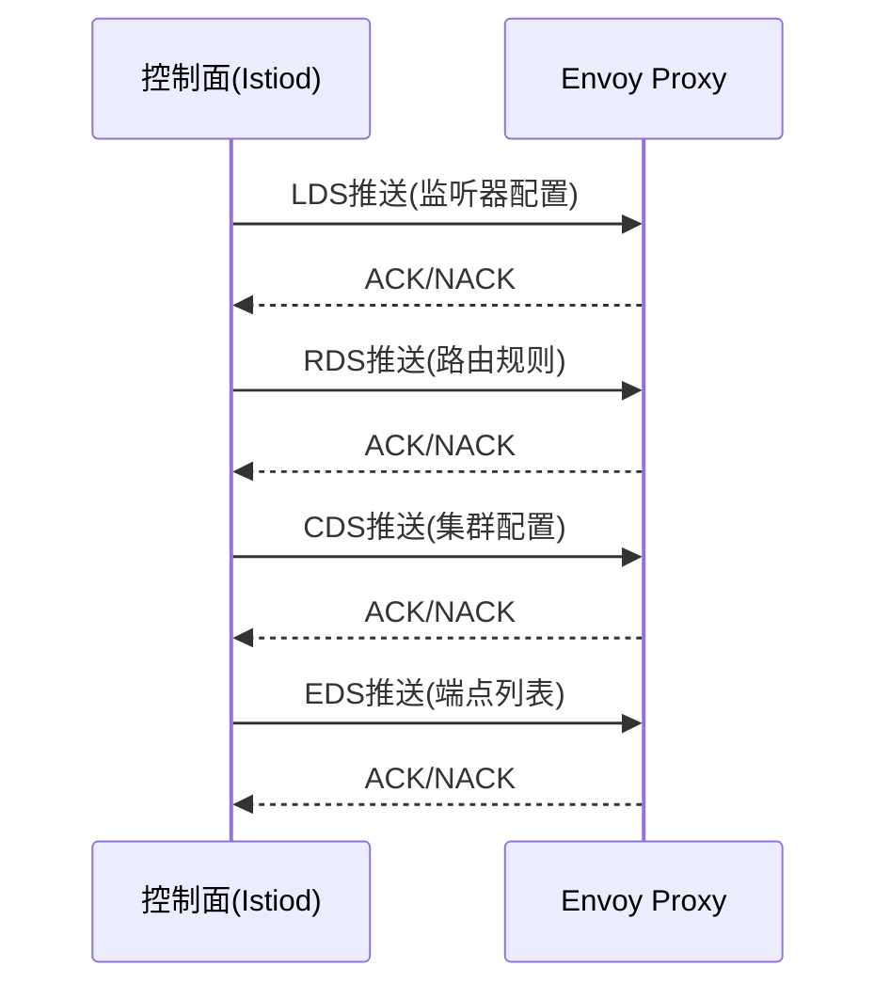

# Envoy（服务代理 / 边车代理 / 云原生网关）

> Envoy 是 Lyft 开源的**高性能服务代理**，以「为微服务设计的进程外代理」成为服务网格（Istio）的数据面、云原生网关的核心。相比 Nginx（配置驱动）、HAProxy（L4），Envoy 以**xDS 动态配置 + 可观测性 + HTTP/2 + 服务发现**成为云原生代理首选。本篇按「解决的问题 → 原理 → 特性 → 选型关注点」拆解。

---

## 一、要解决的问题

| 痛点 | 说明 |
|------|------|
| 服务间通信 | 微服务间调用需要负载均衡/重试/超时/熔断 |
| 可观测性 | 服务间调用的指标/日志/链路需要统一采集 |
| 动态配置 | 微服务动态上下线，代理配置需要动态生效 |
| 多协议 | HTTP/gRPC/TCP 需要统一代理 |
| 透明代理 | 业务代码无侵入，通信逻辑下沉到代理 |

> 核心认知：**Envoy = 微服务的「智能边车」**——每个服务旁挂一个 Envoy，所有进出流量经过它，通信治理逻辑下沉。

---

## 二、Envoy 核心原理

### 2.1 架构

```
Envoy 进程
  ├── Listener（监听器：监听端口，接收连接）
  ├── Filter Chain（过滤器链）
  │   ├── Network Filter（网络层：TCP 代理/TLS/Redis/Mongo）
  │   └── HTTP Filter（应用层：Router/Rate Limit/Fault Injection）
  ├── Cluster（上游服务集群）
  │   ├── Endpoint（集群中的具体实例）
  │   ├── 健康检查（主动/被动）
  │   └── 负载均衡（Round Robin/Least Request/Ring Hash/Maglev）
  ├── xDS API（动态配置发现服务）
  │   ├── LDS（Listener Discovery Service）
  │   ├── RDS（Route Discovery Service）
  │   ├── CDS（Cluster Discovery Service）
  │   └── EDS（Endpoint Discovery Service）
  └── 可观测性（Stats/Access Log/Tracing）
```

### 2.2 线程模型

- **主线程**：xDS 配置更新/管理 API/统计（单线程，无锁）
- **Worker 线程**：处理连接和请求（每个 CPU 核心一个线程）
- **文件事件线程**：监听 socket 事件

**选型关注点**：Envoy 的线程模型是高性能的关键——Worker 线程无共享，避免锁竞争。

### 2.3 xDS 动态配置（核心差异化）

```
控制面（Istio/Pilot/Contour）
  ├── 发现服务（K8s API/Consul）
  ├── 生成配置（LDS/RDS/CDS/EDS）
  └── gRPC 流式推送 → Envoy

Envoy → 订阅 xDS → 配置变更实时生效（无需重启）
```

**选型关注点**：xDS 是 Envoy 相比 Nginx 的核心优势——配置动态生效，无需 reload。

### 2.4 过滤器链（Filter Chain）

```
请求 → Listener → Filter Chain
  ├── Connection Manager（连接管理）
  ├── HTTP Filter Chain
  │   ├── CORS（跨域）
  │   ├── Fault Injection（故障注入）
  │   ├── Rate Limit（限流）
  │   ├── Router（路由：匹配→转发）
  │   └── gRPC-JSON transcoder（协议转换）
  └── 转发到 Cluster → 选 Endpoint → 发送
```

**选型关注点**：过滤器链是 Envoy 灵活性的核心——可自定义过滤器（C++/Wasm/Lua）。

---

## 三、Envoy 核心特性

| 特性 | 说明 |
|------|------|
| 动态配置 | xDS API，配置实时生效 |
| 可观测性 | 内置 Stats（指标）/Access Log/Tracing（Zipkin/Jaeger/OTel） |
| 负载均衡 | Round Robin/Least Request/Ring Hash/Maglev/随机 |
| 健康检查 | 主动（HTTP/TCP/Ping）+ 被动（Outlier Detection） |
| 重试/超时 | 自动重试/超时/预算重试 |
| 熔断 | 连接池限制/异常检测驱逐 |
| mTLS | 自动双向认证（与 SDS 集成） |
| HTTP/2 | 原生 HTTP/2 + gRPC 代理 |
| Wasm 扩展 | 运行时加载 Wasm 扩展（无需重新编译） |
| Lua 过滤器 | 内嵌 Lua 脚本自定义逻辑 |

---

## 四、Envoy 使用场景

### 4.1 边车代理（Service Mesh）

```
Pod
  ├── 业务容器
  └── Envoy Sidecar（拦截所有进出流量）
      ├── 入站：接收外部流量 → 鉴权/限流 → 业务容器
      └── 出站：业务容器 → 负载均衡/重试/熔断 → 目标服务
```

**选型关注点**：Istio 数据面默认用 Envoy，是服务网格的事实标准。

### 4.2 边缘网关（Ingress Gateway）

```
公网 → Envoy Ingress Gateway
  ├── TLS 终止
  ├── 路由（Host/Path → Service）
  ├── 限流/鉴权
  └── 转发到内部服务
```

**选型关注点**：Contour（K8s Ingress 控制器）使用 Envoy 作为数据面。

### 4.3 API 网关

- Envoy + 自定义过滤器 → API 网关
- 代表项目：Ambassador（现为 Emissary-Ingress）、Gloo Edge

---

## 五、Envoy vs Nginx vs HAProxy

| 维度 | Envoy | Nginx | HAProxy |
|------|-------|-------|---------|
| 动态配置 | xDS（实时） | reload（秒级） | reload（秒级） |
| 服务发现 | 内置（K8s/Consul/静态） | 需 plus/第三方 | 需第三方 |
| 可观测性 | 内置（Stats/Log/Trace） | 需 plus/第三方 | 需第三方 |
| HTTP/2 | 原生 | 支持 | 支持 |
| gRPC | 原生 | 支持 | 支持 |
| 熔断 | 内置 | 需 plus | 需第三方 |
| 重试/超时 | 内置 | 内置 | 内置 |
| 扩展 | C++/Wasm/Lua | C/Lua | C/Lua |
| 性能 | 高 | 最高 | 最高 |
| 配置复杂度 | 高 | 中 | 中 |
| 云原生 | 最佳 | 中 | 弱 |

**选型关注点**：
- 服务网格/云原生 → **Envoy**（xDS 动态配置 + 可观测性）
- 传统反向代理/静态内容 → **Nginx**（性能最高 + 生态成熟）
- L4 负载均衡 → **HAProxy**（L4 性能最强）

---

## 六、Envoy 生产实践

### 6.1 关键配置

| 配置 | 说明 |
|------|------|
| 连接池 | 每上游连接数限制（防雪崩） |
| 异常检测 | 连续 N 次失败 → 驱逐实例 |
| 重试预算 | 限制重试比例（防重试风暴） |
| 速率限制 | 外部 Rate Limit 服务（gRPC） |
| 访问日志 | 异步写入（防阻塞） |

### 6.2 性能调优

| 调优维度 | 建议 |
|----------|------|
| Worker 线程 | 与 CPU 核心数一致 |
| 连接池 | 合理设置每上游连接数 |
| 访问日志 | 异步 + 采样 |
| 统计 | 按需开启（过多影响性能） |

---

## 七、选型速查

| 需求 | 首选 | 备选 |
|------|------|------|
| 服务网格数据面 | Envoy（Istio） | Linkerd-proxy |
| 边缘网关 | Envoy Ingress | Nginx Ingress |
| API 网关 | Envoy + Ambassador | Kong/APISIX |
| L4 负载均衡 | HAProxy | Nginx |
| L7 反向代理 | Nginx | Envoy |
| 动态配置 | Envoy（xDS） | — |
| 可观测性代理 | Envoy | — |

---

## 八、Envoy xDS 协议深度

### 8.1 xDS 协议架构



### 8.2 xDS 协议详解

| 协议 | 全称 | 作用 |
|------|------|------|
| LDS | Listener Discovery Service | 发现监听器（端口+过滤器链） |
| RDS | Route Discovery Service | 发现路由规则（匹配→转发） |
| CDS | Cluster Discovery Service | 发现上游集群（服务列表） |
| EDS | Endpoint Discovery Service | 发现实例端点（IP:Port） |
| SDS | Secret Discovery Service | 发现 TLS 证书/密钥 |
| RTDS | Runtime Discovery Service | 发现运行时配置 |

### 8.3 xDS 推送流程

```
1. 控制面监听 K8s API / 服务发现源
2. 配置变更 → 生成 xDS 配置（LDS/RDS/CDS/EDS）
3. 通过 gRPC 长连接流式推送（增量或全量）
4. Envoy 接收配置 → 热加载（无需重启）
5. Envoy 确认配置生效 → ACK/NACK

增量推送（Delta xDS）：
  只推送变更部分，减少带宽和内存占用
  支持资源添加/删除/更新
```

### 8.4 xDS 调试

```bash
# 查看 Envoy 当前配置
curl -s localhost:15000/config_dump

# 查看 xDS 订阅状态
curl -s localhost:15000/clusters

# 查看活跃连接
curl -s localhost:15000/stats | grep "downstream_cx_active"

# Istio 代理状态
istioctl proxy-status
istioctl proxy-config listener <pod-name>
```

---

## 九、Envoy WASM 扩展

### 9.1 WASM 扩展架构

```
Envoy WASM 运行时：
  ┌─────────────────────────┐
  │   Envoy Host Functions  │
  │   (日志/HTTP/配置/共享)   │
  └──────────┬──────────────┘
             │ ABI
  ┌──────────┴──────────────┐
  │     WASM 沙箱执行        │
  │   (Rust/Go/C++/AssemblyScript) │
  └─────────────────────────┘

扩展点：
  HTTP Filter → 请求/响应处理
  Network Filter → TCP 流处理
  元数据生成 → 指标/日志定制
```

### 9.2 WASM 扩展示例（Rust）

```rust
// 简单的请求计数器扩展
use proxy_wasm::traits::*;
use proxy_wasm::types::*;

struct RequestCounter;

impl HttpContext for RequestCounter {
    fn on_http_request_headers(&mut self, _: usize) -> Action {
        // 读取请求头
        if let Some(path) = self.get_http_request_header(":path") {
            // 自定义逻辑
            self.set_http_request_header("X-Custom-Header", Some("value"));
        }
        Action::Continue
    }
}

impl Context for RequestCounter {}
```

### 9.3 WASM 扩展最佳实践

| 实践 | 说明 |
|------|------|
| 语言选择 | Rust 性能最佳，Go 易上手 |
| 内存限制 | WASM 模块有内存上限（默认 128MB） |
| 热加载 | 配置推送即可更新 WASM 模块 |
| 沙箱隔离 | 崩溃不影响 Envoy 主进程 |
| 性能开销 | WASM 调用有 1~5μs 额外开销 |

---

## 十、Envoy 访问日志

### 10.1 访问日志格式

```yaml
access_log:
- name: envoy.access_loggers.file
  typed_config:
    "@type": type.googleapis.com/envoy.extensions.access_loggers.file.v3.FileAccessLog
    path: /var/log/envoy/access.log
    log_format:
      json_format:
        protocol: "%PROTOCOL%"
        duration: "%DURATION%"
        response_code: "%RESPONSE_CODE%"
        request_method: "%REQ(:METHOD)%"
        request_path: "%REQ(X-ENVOY-ORIGINAL-PATH?:PATH)%"
        upstream_cluster: "%UPSTREAM_CLUSTER%"
        upstream_host: "%UPSTREAM_HOST%"
        bytes_received: "%BYTES_RECEIVED%"
        bytes_sent: "%BYTES_SENT%"
        user_agent: "%REQ(USER-AGENT)%"
        request_id: "%REQ(X-REQUEST-ID)%"
        trace_id: "%REQ(X-B3-TRACEID)%"
```

### 10.2 访问日志高级配置

```yaml
# 采样配置（只记录 10% 请求）
access_log:
- name: envoy.access_loggers.file
  typed_config:
    path: /var/log/envoy/access.log
    filter:
      runtime_filter:
        runtime_key: access_log.sample_rate
        percent_sampled:
          numerator: 10
          denominator: HUNDRED

# 条件过滤（只记录错误请求）
access_log:
- name: envoy.access_loggers.file
  typed_config:
    path: /var/log/envoy/access.log
    filter:
      or_filter:
        filters:
        - not_health_check_filter: {}
        - grpc_status_filter:
            statuses:
            - "UNAVAILABLE"
```

### 10.3 异步日志

```yaml
# 异步日志（防阻塞）
access_log:
- name: envoy.access_loggers.file
  typed_config:
    path: /var/log/envoy/access.log
    flush_interval: 1s
    flush_message_num: 100
```

---

## 十一、Envoy 统计架构

### 11.1 统计指标分类

| 分类 | 前缀 | 说明 |
|------|------|------|
| 监听器 | `listener.<name>` | 连接/请求统计 |
| HTTP | `http.<stat_prefix>` | HTTP 请求指标 |
| 集群 | `cluster.<name>` | 上游集群指标 |
| 服务 | `server` | Envoy 进程指标 |
| 断路器 | `cluster.<name>.circuit_breakers` | 熔断统计 |

### 11.2 关键统计指标

```
下游连接：
  envoy_listener_downstream_cx_total          # 总连接数
  envoy_listener_downstream_cx_active         # 活跃连接数
  envoy_listener_downstream_cx_destroy        # 销毁连接数

上游请求：
  envoy_cluster_upstream_rq_total             # 总请求数
  envoy_cluster_upstream_rq_active            # 活跃请求数
  envoy_cluster_upstream_rq_time_bucket       # 请求延迟分布
  envoy_cluster_upstream_rq_xx                # 按状态码分类

健康检查：
  envoy_cluster_health_check_healthy          # 健康实例数
  envoy_cluster_health_check_failure          # 健康检查失败数

错误：
  envoy_cluster_upstream_cx_failure           # 连接失败数
  envoy_cluster_upstream_rq_retry             # 重试次数
  envoy_cluster_upstream_rq_retry_overflow    # 重试预算溢出
```

### 11.3 自定义统计

```yaml
# 在 HTTP 过滤器中添加自定义统计
http_filters:
- name: envoy.filters.http.stats
  typed_config:
    "@type": type.googleapis.com/envoy.extensions.filters.http.stats.v3.Stats
    emit_machine_stats: true
```

---

## 十二、Envoy 与 Istio 服务网格

### 12.1 Istio 架构

```
Istio 数据面（Envoy Sidecar）：
  ├── 拦截所有进出流量（iptables）
  ├── mTLS 自动加密
  ├── 负载均衡/重试/超时
  ├── 流量路由（金丝雀/灰度）
  ├── 故障注入
  └── 可观测性（Metrics/Traces/Logs）

Istio 控制面（Istiod）：
  ├── Pilot：xDS 配置生成与下发
  ├── Citadel：证书签发与 mTLS
  ├── Galley：配置验证
  └── Citadel：密钥管理
```

### 12.2 Istio 流量治理能力

| 能力 | 说明 |
|------|------|
| 金丝雀发布 | 按权重/Header/URI 路由到不同版本 |
| A/B 测试 | 按 Header 匹配路由 |
| 故障注入 | 模拟延迟/错误测试弹性 |
| 超时重试 | 预算重试防雪崩 |
| 熔断 | 连接池限制 + 异常检测驱逐 |
| 流量镜像 | 复制流量到测试环境 |
| 限流 | 外部 Rate Limit 服务集成 |

### 12.3 Istio VirtualService 示例

```yaml
apiVersion: networking.istio.io/v1beta1
kind: VirtualService
metadata:
  name: reviews
spec:
  hosts:
  - reviews
  http:
  - match:
    - headers:
        end-user:
          exact: jason
    route:
    - destination:
        host: reviews
        subset: v2
  - route:
    - destination:
        host: reviews
        subset: v1
      weight: 90
    - destination:
        host: reviews
        subset: v2
      weight: 10
```

---

## 十三、Envoy 限流

### 13.1 本地限流

```yaml
http_filters:
- name: envoy.filters.http.local_ratelimit
  typed_config:
    "@type": type.googleapis.com/envoy.extensions.filters.http.local_ratelimit.v3.LocalRateLimit
    stat_prefix: http_local_rate_limiter
    token_bucket:
      max_tokens: 100
      tokens_per_fill: 10
      fill_interval: 1s
    filter_enabled:
      runtime_key: local_rate_limit_enabled
      default_value:
        numerator: 100
        denominator: HUNDRED
    filter_enforced:
      runtime_key: local_rate_limit_enforced
      default_value:
        numerator: 100
        denominator: HUNDRED
```

### 13.2 全局限流（External Rate Limit）

```yaml
http_filters:
- name: envoy.filters.http.ratelimit
  typed_config:
    "@type": type.googleapis.com/envoy.extensions.filters.http.ratelimit.v3.RateLimit
    domain: production
    failure_mode_deny: false
    rate_limit_service:
      grpc_service:
        envoy_grpc:
          cluster_name: rate_limit_cluster
      transport_api_version: V3
```

---

## 十四、Envoy 故障注入

### 14.1 故障注入配置

```yaml
http_filters:
- name: envoy.filters.http.fault
  typed_config:
    "@type": type.googleapis.com/envoy.extensions.filters.http.fault.v3.HTTPFault
    delay:
      percentage:
        numerator: 10
        denominator: HUNDRED
      fixed_duration: 5s
    abort:
      percentage:
        numerator: 5
        denominator: HUNDRED
      status: 500
```

### 14.2 故障注入场景

| 场景 | 配置 |
|------|------|
| 模拟延迟 | delay + fixed_duration |
| 模拟错误 | abort + status 500/503 |
| 混合故障 | 同时配置 delay + abort |

---

## 十五、Envoy gRPC 桥接

### 15.1 gRPC-JSON 转码

```yaml
http_filters:
- name: envoy.filters.http.grpc_json_transcoder
  typed_config:
    "@type": type.googleapis.com/envoy.extensions.filters.http.grpc_json_transcoder.v3.GrpcJsonTranscoder
    proto_descriptor: /etc/envoy/proto.pb
    services: ["mypackage.MyService"]
    convert_grpc_status: true
```

### 15.2 gRPC-Web 支持

```yaml
http_filters:
- name: envoy.filters.http.grpc_web
  typed_config:
    "@type": type.googleapis.com/envoy.extensions.filters.http.grpc_web.v3.GrpcWeb
```

---

## 十六、Envoy 部署模式

### 16.1 部署模式对比

| 模式 | 说明 | 适用场景 |
|------|------|----------|
| Sidecar | 每个 Pod 一个 Envoy | Service Mesh |
| Ingress Gateway | 集群入口网关 | 边缘路由 |
| Egress Gateway | 集群出口网关 | 外部访问控制 |
| 中心代理 | 共享 Envoy 代理 | 轻量级服务网格 |
| 独立部署 | 独立进程部署 | 传统架构 |

### 16.2 Sidecar 注入方式

```yaml
# 自动注入（Istio）
apiVersion: apps/v1
kind: Deployment
metadata:
  annotations:
    sidecar.istio.io/inject: "true"

# 手动注入
# istioctl kube-inject -f deployment.yaml | kubectl apply -f -
```

### 16.3 Envoy 资源配置

```yaml
# Envoy Sidecar 资源限制
resources:
  requests:
    cpu: 100m
    memory: 128Mi
  limits:
    cpu: 1000m
    memory: 512Mi

# Envoy 启动参数
- --max-obj-name-len=256
- --concurrency=2
- --log-level=warning
```

---

## 十六、Envoy Filters 架构（L4/L7 Filters 配置示例）

### 16.1 L4 Network Filter 配置

```yaml
# TCP 代理过滤器
listeners:
- name: listener_tcp
  address:
    socket_address:
      address: 0.0.0.0
      port_value: 3306
  filter_chains:
  - filters:
    - name: envoy.filters.network.tcp_proxy
      typed_config:
        "@type": type.googleapis.com/envoy.extensions.filters.network.tcp_proxy.v3.TcpProxy
        stat_prefix: mysql_proxy
        cluster: mysql_cluster
        access_log:
        - name: envoy.access_loggers.file
          typed_config:
            path: /var/log/envoy/tcp_access.log
```

### 16.2 L7 HTTP Filter 配置

```yaml
# HTTP 过滤器链
http_filters:
- name: envoy.filters.http.cors
  typed_config:
    "@type": type.googleapis.com/envoy.extensions.filters.http.cors.v3.Cors

- name: envoy.filters.http.fault
  typed_config:
    "@type": type.googleapis.com/envoy.extensions.filters.http.fault.v3.HTTPFault
    delay:
      percentage:
        numerator: 10
        denominator: HUNDRED
      fixed_duration: 5s

- name: envoy.filters.http.local_ratelimit
  typed_config:
    "@type": type.googleapis.com/envoy.extensions.filters.http.local_ratelimit.v3.LocalRateLimit
    stat_prefix: http_local_rate_limiter
    token_bucket:
      max_tokens: 100
      tokens_per_fill: 10
      fill_interval: 1s

- name: envoy.filters.http.router
  typed_config:
    "@type": type.googleapis.com/envoy.extensions.filters.http.router.v3.Router
```

### 16.3 Filter 执行顺序



## 十七、Envoy xDS 协议（LDS/RDS/CDS/EDS 动态配置）

### 17.1 xDS 协议详解

| 协议 | 全称 | 作用 | 推送方式 |
|------|------|------|----------|
| LDS | Listener Discovery Service | 发现监听器配置 | 全量/增量 |
| RDS | Route Discovery Service | 发现路由规则 | 全量/增量 |
| CDS | Cluster Discovery Service | 发现上游集群 | 全量/增量 |
| EDS | Endpoint Discovery Service | 发现实例端点 | 增量优先 |

### 17.2 xDS 推送流程



### 17.3 xDS 调试命令

```bash
# 查看当前配置
curl -s localhost:15000/config_dump

# 查看集群状态
curl -s localhost:15000/clusters

# 查看统计信息
curl -s localhost:15000/stats

# Istio 代理状态
istioctl proxy-status
istioctl proxy-config listener <pod-name>
```

## 十八、Envoy 熔断（Outlier Detection 配置）

### 18.1 异常检测配置

```yaml
# Outlier Detection 配置
clusters:
- name: service_backend
  outlier_detection:
    consecutive_5xx: 5           # 连续5次5xx错误
    interval: 10s                # 检测间隔
    base_ejection_time: 30s      # 基础驱逐时间
    max_ejection_percent: 50     # 最大驱逐比例
    split_external_local_origin_errors: true
    consecutive_local_origin_failure: 5
```

### 18.2 熔断状态监控

```bash
# 查看异常检测统计
curl -s localhost:15000/stats | grep outlier

# 关键指标：
# envoy_cluster_outlier_detection_ejections_active - 当前驱逐数
# envoy_cluster_outlier_detection_ejections_total - 累计驱逐数
# envoy_cluster_outlier_detection_ejections_consecutive_5xx - 连续5xx数
```

## 十九、Envoy 访问日志（Access Log 格式/自定义字段）

### 19.1 JSON 格式日志

```yaml
access_log:
- name: envoy.access_loggers.file
  typed_config:
    "@type": type.googleapis.com/envoy.extensions.access_loggers.file.v3.FileAccessLog
    path: /var/log/envoy/access.log
    log_format:
      json_format:
        timestamp: "%START_TIME%"
        method: "%REQ(:METHOD)%"
        path: "%REQ(X-ENVOY-ORIGINAL-PATH?:PATH)%"
        protocol: "%PROTOCOL%"
        response_code: "%RESPONSE_CODE%"
        response_flags: "%RESPONSE_FLAGS%"
        bytes_received: "%BYTES_RECEIVED%"
        bytes_sent: "%BYTES_SENT%"
        duration: "%DURATION%"
        upstream_cluster: "%UPSTREAM_CLUSTER%"
        upstream_host: "%UPSTREAM_HOST%"
        request_id: "%REQ(X-REQUEST-ID)%"
        trace_id: "%REQ(X-B3-TRACEID)%"
```

### 19.2 自定义字段提取

```yaml
# 从请求头提取自定义字段
log_format:
  json_format:
    user_agent: "%REQ(USER-AGENT)%"
    x_forwarded_for: "%REQ(X-FORWARDED-FOR)%"
    content_type: "%REQ(CONTENT-TYPE)%"
    authorization: "%REQ(AUTHORIZATION)%"
    custom_header: "%REQ(X-CUSTOM-HEADER)%"
```

## 二十、Envoy 与 OpenTelemetry 集成（Trace/Lambda Filters）

### 20.1 OpenTelemetry 追踪配置

```yaml
tracing:
  provider:
    name: envoy.tracers.opentelemetry
    typed_config:
      "@type": type.googleapis.com/envoy.config.trace.v3.OpenTelemetryConfig
      collector_cluster: otel_collector
      collector_endpoint: /api/v1/traces
      resource_attributes:
        service.name: my-service
        service.version: v1.0.0
```

### 20.2 Lambda Filter（AWS Lambda 集成）

```yaml
http_filters:
- name: envoy.filters.http.aws_lambda
  typed_config:
    "@type": type.googleapis.com/envoy.extensions.filters.http.aws_lambda.v3.Lambda
    credentials_provider:
      inline:
        access_key_id:AKIA...
        secret_access_key: secret...
    arn: arn:aws:lambda:us-east-1:123456789:function:my-function
    payload_passthrough: true
```

## 二十一、Envoy 在 Service Mesh 中的 Sidecar 部署模式

### 21.1 Sidecar 注入配置

```yaml
# 自动注入（Istio）
apiVersion: apps/v1
kind: Deployment
metadata:
  annotations:
    sidecar.istio.io/inject: "true"
    sidecar.istio.io/rewriteAppHTTPProbers: "true"
spec:
  template:
    metadata:
      labels:
        app: my-service
    spec:
      containers:
      - name: my-service
        image: my-service:v1
        ports:
        - containerPort: 8080
      - name: istio-proxy
        image: proxyv2:latest
        resources:
          requests:
            cpu: 100m
            memory: 128Mi
          limits:
            cpu: 1000m
            memory: 512Mi
```

### 21.2 Sidecar 资源优化

| 资源 | 请求 | 限制 | 说明 |
|------|------|------|------|
| CPU | 100m | 1000m | 根据流量调整 |
| 内存 | 128Mi | 512Mi | 根据连接数调整 |
| 启动超时 | - | 60s | 避免启动失败 |

## 十七、与其他板块的关系

- 服务网格（Istio + Envoy）见「[云原生/Service Mesh](../../云原生/ServiceMesh.md)」；
- Nginx 原理见「[Nginx](./Nginx.md)」；
- API 网关见「[Kong/APISIX](./Kong与APISIX网关.md)」；
- 链路追踪见「[Jaeger 链路追踪](./Jaeger链路追踪.md)」；
- 云上网络见「[云网络与流量接入体系](./云网络与流量接入体系.md)」。

> 一句话：**Envoy = xDS 动态配置 + 过滤器链 + 内置可观测性 + HTTP/2/gRPC 原生；选型先看「场景（服务网格→Envoy，传统代理→Nginx）」，再定「扩展需求（Wasm/Lua 自定义过滤器）」**。

---

## 九、Envoy Wasm 扩展（云原生可编程代理）

Envoy 支持 WebAssembly（Wasm）运行时扩展，无需重编译即可添加自定义过滤器：

| 特性 | 说明 |
|------|------|
| 语言支持 | C++/Rust/Go/AssemblyScript 等编译为 Wasm |
| 安全隔离 | 沙箱运行，崩溃不影响 Envoy 主进程 |
| 热加载 | Wasm 模块可动态加载/更新 |
| 性能 | 接近原生 C++（Wasm 2.0 JIT） |
| 适用场景 | 自定义鉴权/协议转换/数据脱敏/流量染色 |

**典型用例**：
- 自定义 JWT 验证逻辑
- 协议转换（gRPC → REST）
- 流量染色（给请求打标签做灰度）
- 数据脱敏（日志中自动遮蔽手机号）

---

## 十、Envoy 与 Istio 集成深度

Istio 的数据面完全基于 Envoy，控制面（Istiod）通过 xDS 下发配置：

```
Istiod（控制面）
  ├── Pilot（xDS 生成）
  ├── Citadel（证书/mTLS）
  └── Galley（配置验证）

Envoy Sidecar（数据面）
  ├── 接收 xDS 配置（LDS/RDS/CDS/EDS）
  ├── mTLS（与 Citadel 集成）
  ├── 流量治理（金丝雀/故障注入/重试）
  └── 可观测（Metrics/Traces/Access Log）
```

**流量治理能力**：
- 金丝雀发布：按权重/Header/URI 路由到不同版本
- 故障注入：模拟延迟/错误测试弹性
- 重试/超时：预算重试防雪崩
- 熔断：连接池限制 + 异常检测驱逐

---

## 十一、Envoy 配置示例

### 11.1 静态配置（最小示例）

```yaml
static_resources:
  listeners:
  - name: listener_0
    address:
      socket_address:
        address: 0.0.0.0
        port_value: 8080
    filter_chains:
    - filters:
      - name: envoy.filters.network.http_connection_manager
        typed_config:
          "@type": type.googleapis.com/envoy.extensions.filters.network.http_connection_manager.v3.HttpConnectionManager
          stat_prefix: ingress_http
          route_config:
            name: local_route
            virtual_hosts:
            - name: backend
              domains: ["*"]
              routes:
              - match: { prefix: "/" }
                route: { cluster: service_backend }
          http_filters:
          - name: envoy.filters.http.router
  clusters:
  - name: service_backend
    type: STRICT_DNS
    lb_policy: ROUND_ROBIN
    load_assignment:
      cluster_name: service_backend
      endpoints:
      - lb_endpoints:
        - endpoint:
            address:
              socket_address:
                address: 127.0.0.1
                port_value: 9000
```

### 11.2 关键调优参数

| 参数 | 建议值 | 说明 |
|------|--------|------|
| `max_connections` | 1024 | 每上游最大连接数 |
| `max_requests_per_connection` | 100 | 每连接最大请求数 |
| `connect_timeout` | 1s | 连接超时 |
| `interval` | 10s | 健康检查间隔 |
| `healthy_threshold` | 2 | 健康判定阈值 |
| `unhealthy_threshold` | 3 | 不健康判定阈值 |

---

## 十二、Envoy 可观测性详解

Envoy 内置三种可观测性信号：

### 12.1 指标（Stats）

```
# 内置指标类型
envoy_listener_downstream_cx_total          # 下游连接总数
envoy_cluster_upstream_rq_total             # 上游请求总数
envoy_cluster_upstream_rq_time_bucket       # 请求延迟分布
envoy_cluster_health_check_healthy          # 健康实例数
envoy_http_downstream_cx_active             # 活跃连接数
```

**Prometheus 集成**：Envoy 暴露 `/stats/prometheus` 端点，Prometheus 直接拉取。

### 12.2 链路追踪

```yaml
tracing:
  provider:
    name: envoy.tracers.zipkin
    typed_config:
      collector_cluster: zipkin
      collector_endpoint: /api/v2/spans
  max_path_tags: 8
```

支持 Zipkin / Jaeger / OpenTelemetry，自动采样或按规则采样。

### 12.3 访问日志

```yaml
access_log:
- name: envoy.access_loggers.file
  typed_config:
    path: /var/log/envoy/access.log
    format: |
      [%START_TIME%] "%REQ(:METHOD)% %REQ(X-ENVOY-ORIGINAL-PATH?:PATH)% %PROTOCOL%"
      %RESPONSE_CODE% %BYTES_RECEIVED% %DURATION% "%REQ(X-FORWARDED-FOR)%"
```

---

## 十三、Envoy 高级特性

| 特性 | 说明 |
|------|------|
| 原始目标寻址（Original Destination） | iptables 拦截后直接转发到原始 IP（Service Mesh 旁路） |
| 内置 DNS | Envoy 自己做服务发现 DNS 解析 |
| TCP 代理 | L4 层代理（Redis/Mongo/数据库） |
| UDP 代理 | DNS over UDP / 游戏协议 |
| 配置热更新 | xDS 流式推送，无需重启 |
| 内存限制 | `--max-obj-name-len` 控制内存 |
| 连接迁移 | 多 Worker 间连接迁移（负载均衡） |

---

## 十四、Envoy 高级特性与生产实践

### 14.1 HTTP Connection Manager

```text
HTTP Connection Manager（HCM）是 Envoy 处理 HTTP 请求的核心 Filter。

HCM 核心功能：
┌──────────────────────┬────────────────────────────────────────────┐
│ 功能                  │ 说明                                        │
├──────────────────────┼────────────────────────────────────────────┤
│ 路由匹配              │ 基于 path/header/method 等路由到后端        │
│ 请求/响应头操作        │ 添加/修改/删除 Header                      │
│ 访问日志              │ 自定义访问日志格式                           │
│ 追踪                  │ 分布式追踪集成（Jaeger/Zipkin）             │
│ 统计                  │ 请求计数/延迟/错误率统计                     │
│ 超时控制              │ 请求超时/空闲超时                           │
│ 重试策略              │ 自动重试/可重试状态码                        │
└──────────────────────┴────────────────────────────────────────────┘
```

```yaml
# HTTP Connection Manager 配置示例
static_resources:
- name: listener_0
  address:
    socket_address:
      address: 0.0.0.0
      port_value: 8080
  filter_chains:
  - filters:
    - name: envoy.filters.network.http_connection_manager
      typed_config:
        "@type": type.googleapis.com/envoy.extensions.filters.network.http_connection_manager.v3.HttpConnectionManager
        stat_prefix: ingress_http
        codec_type: AUTO
        route_config:
          name: local_route
          virtual_hosts:
          - name: backend
            domains: ["*"]
            routes:
            - match:
                prefix: "/api"
              route:
                cluster: api_service
                timeout: 15s
                retry_policy:
                  retry_on: "5xx"
                  num_retries: 3
                  per_try_timeout: 5s
            - match:
                prefix: "/static"
              route:
                cluster: static_service
          request_headers_to_add:
          - header:
              key: x-request-id
              value: "%REQ(x-request-id)%"
        http_filters:
        - name: envoy.filters.http.router
          typed_config:
            "@type": type.googleapis.com/envoy.extensions.filters.http.router.v3.Router
```

### 14.2 Network Filter vs HTTP Filter

```text
Network Filter（L4）vs HTTP Filter（L7）：
┌──────────────────┬──────────────────────────────────────────────┐
│                  │ Network Filter           │ HTTP Filter        │
├──────────────────┼──────────────────────────────────────────────┤
│ 工作层           │ TCP 层（L4）              │ HTTP 层（L7）       │
│ 处理单位         │ 原始 TCP 连接              │ HTTP 请求/响应      │
│ 典型用途         │ TCP 代理/TLS 终止/限流    │ 路由/鉴权/修改     │
│ 可见信息         │ IP/端口/字节流            │ Header/Path/Method │
│ 配置位置         │ filter_chains.filters    │ http_filters       │
└──────────────────┴──────────────────────────────────────────────┘

常用 Network Filter：
- envoy.filters.network.tcp_proxy：TCP 代理
- envoy.filters.network.ratelimit：L4 限流
- envoy.filters.network.redis_proxy：Redis 代理
- envoy.filters.network.mongo_proxy：MongoDB 代理
```

```yaml
# Network Filter 示例：Redis 代理
- name: envoy.filters.network.redis_proxy
  typed_config:
    "@type": type.googleapis.com/envoy.extensions.filters.network.redis_proxy.v3.RedisProxy
    stat_prefix: redis
    settings:
      op_timeout: 5s
    prefix_routes:
      catch_all_route:
        cluster: redis_cluster
    downstream_auth_password:
      inline_string: "password123"
```

### 14.3 ext_authz Filter（外部鉴权）

```text
ext_authz Filter 将鉴权请求委托给外部服务：

流程：
1. 客户端发送请求到 Envoy
2. Envoy 拦截请求，提取鉴权信息
3. Envoy 向外部鉴权服务发送 Check 请求
4. 鉴权服务返回 Allow/Deny
5. Envoy 根据结果继续处理或拒绝请求

支持的传输方式：
- HTTP gRPC 鉴权服务
- HTTP REST 鉴权服务
- 本地 Bash 脚本
```

```yaml
# ext_authz 配置示例
http_filters:
- name: envoy.filters.http.ext_authz
  typed_config:
    "@type": type.googleapis.com/envoy.extensions.filters.http.ext_authz.v3.ExtAuthz
    grpc_service:
      envoy_grpc:
        cluster_name: auth_service
        timeout: 1s
    failure_mode_allow: false  # 鉴权服务失败时拒绝请求
    with_request_body:
      max_request_bytes: 10240
      allow_partial_message: false
    status_on_error:
      code: 503
```

```go
// 外部鉴权服务示例（Go + gRPC）
type AuthServer struct{}

func (s *AuthServer) Check(ctx context.Context, req *auth.CheckRequest) (*auth.CheckResponse, error) {
    // 提取请求信息
    attrs := req.GetAttributes()
    path := attrs.GetRequest().GetHttp().GetPath()
    method := attrs.GetRequest().GetHttp().GetMethod()
    headers := attrs.GetRequest().GetHttp().GetHeaders()

    // 鉴权逻辑
    token := headers["authorization"]
    if token == "" {
        return &auth.CheckResponse{
            Status: &rpc.Status{Code: int32(rpc.UNAUTHENTICATED)},
        }, nil
    }

    // 验证 token
    userID, err := validateToken(token)
    if err != nil {
        return &auth.CheckResponse{
            Status: &rpc.Status{Code: int32(rpc.UNAUTHENTICATED)},
        }, nil
    }

    // 鉴权通过，返回用户信息
    return &auth.CheckResponse{
        OkHttpResponse: &auth.OkHttpResponse{
            Headers: []*core.HeaderValue{
                {Key: "x-user-id", Value: userID},
            },
        },
    }, nil
}
```

### 14.4 Rate Limit Service（限流服务）

```text
Envoy 限流模式：
┌──────────────────┬────────────────────────────────────────────┐
│ 模式              │ 说明                                        │
├──────────────────┼────────────────────────────────────────────┤
│ 本地限流          │ 单实例限流（无状态，不精确）                 │
│ 全局限流          │ 集中式限流服务（精确，有状态）               │
│ 分层限流          │ 本地 + 全局组合（推荐）                     │
└──────────────────┴────────────────────────────────────────────┘
```

```yaml
# 本地限流配置
http_filters:
- name: envoy.filters.http.local_ratelimit
  typed_config:
    "@type": type.googleapis.com/envoy.extensions.filters.http.local_ratelimit.v3.LocalRateLimit
    stat_prefix: http_local_rate_limiter
    token_bucket:
      max_tokens: 100
      tokens_per_fill: 10
      fill_interval: 1s
    filter_enabled:
      runtime_key: local_rate_limit_enabled
      default_value:
        numerator: 100
        denominator: HUNDRED
    filter_enforced:
      runtime_key: local_rate_limit_enforced
      default_value:
        numerator: 100
        denominator: HUNDRED
    response_headers_to_add:
    - append: false
      header:
        key: x-local-rate-limit
        value: 'true'
```

```yaml
# 全局限流配置
http_filters:
- name: envoy.filters.http.ratelimit
  typed_config:
    "@type": type.googleapis.com/envoy.extensions.filters.http.ratelimit.v3.RateLimit
    domain: production
    failure_mode_deny: false
    rate_limit_service:
      grpc_service:
        envoy_grpc:
          cluster_name: rate_limit_cluster
      transport_api_version: V3
```

### 14.5 CORS Filter（跨域资源共享）

```yaml
# CORS 配置
http_filters:
- name: envoy.filters.http.cors
  typed_config:
    "@type": type.googleapis.com/envoy.extensions.filters.http.cors.v3.Cors

# 路由级 CORS 配置
route_config:
  virtual_hosts:
  - name: backend
    domains: ["*"]
    cors:
      allow_origin_string_match:
      - safe_regex:
          regex: "https://.*\\.example\\.com"
      allow_methods: "GET, POST, PUT, DELETE, OPTIONS"
      allow_headers: "Authorization, Content-Type, X-Request-ID"
      expose_headers: "X-Request-ID"
      max_age: "3600"
      allow_credentials: true
```

### 14.6 gRPC-JSON Transcoding

```text
gRPC-JSON Transcoding 将 gRPC 请求转为 REST JSON 格式：

场景：
- 为 gRPC 服务提供 REST API
- 兼容不支持 gRPC 的客户端
- API Gateway 统一接入
```

```yaml
# gRPC-JSON Transcoding 配置
http_filters:
- name: envoy.filters.http.grpc_json_transcoder
  typed_config:
    "@type": type.googleapis.com/envoy.extensions.filters.http.grpc_json_transcoder.v3.GrpcJsonTranscoder
    proto_descriptor_bin: <base64 编码的 proto 描述符>
    services: ["my.api.v1.UserService"]
    convert_grpc_status: true
    print_options:
      add_whitespace: true
      always_print_enums_as_ints: false
      always_print_primitive_fields: true
```

```bash
# 生成 proto 描述符
protoc --include_imports --descriptor_set_out=proto.pb my_service.proto

# base64 编码
base64 -w 0 proto.pb > proto.pb.base64
```

### 14.7 多集群 Service Mesh

```text
Envoy 在多集群 Service Mesh 中的角色：

┌─────────────────────────────────────────────────────────────────┐
│                     Cluster A                                   │
│  ┌─────────┐    ┌─────────┐    ┌─────────┐                     │
│  │   Pod   │←──→│  Envoy  │←──→│ Istiod  │                     │
│  │ (sidecar)│   │         │    │         │                     │
│  └─────────┘    └────┬────┘    └─────────┘                     │
│                      │                                          │
└──────────────────────┼──────────────────────────────────────────┘
                       │
                       │ mTLS
                       │
┌──────────────────────┼──────────────────────────────────────────┐
│                      │                                          │
│  ┌─────────┐    ┌────┴────┐    ┌─────────┐                     │
│  │   Pod   │←──→│  Envoy  │←──→│ Istiod  │                     │
│  │ (sidecar)│   │         │    │         │                     │
│  └─────────┘    └─────────┘    └─────────┘                     │
│                     Cluster B                                   │
└─────────────────────────────────────────────────────────────────┘
```

### 14.8 Ztunnel（零信任隧道）

```text
Ztunnel 是 Istio Ambient Mesh 的核心组件：

传统 Sidecar 模式：
  Pod → Sidecar Envoy → Sidecar Envoy → Pod

Ambient Mesh（Ztunnel）：
  Pod → Ztunnel（节点级）→ Ztunnel（节点级）→ Pod

优势：
- 无 sidecar 开销（共享 Ztunnel）
- 更低的资源消耗
- 更简单的部署
- 支持非 Kubernetes 工作负载
```

```yaml
# Ztunnel DaemonSet 配置
apiVersion: apps/v1
kind: DaemonSet
metadata:
  name: ztunnel
  namespace: istio-system
spec:
  selector:
    matchLabels:
      app: ztunnel
  template:
    metadata:
      labels:
        app: ztunnel
    spec:
      hostNetwork: true
      containers:
      - name: ztunnel
        image: gcr.io/istio-testing/ztunnel:latest
        args:
        - proxy
        - --config
        - /etc/ztunnel/config.yaml
        securityContext:
          capabilities:
            add: ["NET_ADMIN", "NET_RAW"]
```

## 十五、与其他板块的关系（扩展）

- 服务网格（Istio + Envoy）见「[云原生/Service Mesh](../../云原生/ServiceMesh.md)」；
- Nginx 原理见「[Nginx](./Nginx.md)」；
- API 网关见「[Kong/APISIX](./Kong与APISIX网关.md)」；
- 链路追踪见「[Jaeger 链路追踪](./Jaeger链路追踪.md)」；
- 云上网络见「[云网络与流量接入体系](./云网络与流量接入体系.md)」；
- 对比 HAProxy 见「[HAProxy与L4负载均衡](./HAProxy与L4负载均衡.md)」；
- 限流见「[Sentinel 限流熔断](./Sentinel限流熔断.md)」；
- mTLS 安全见「[云安全体系](./云安全体系.md)」。

---

## 十五、速查表（扩展）

| 项 | 结论 |
|----|------|
| 类型 | 高性能服务代理/边车代理 |
| 配置 | xDS 动态配置（无需重启） |
| 过滤器 | Network Filter + HTTP Filter（C++/Wasm/Lua） |
| 负载均衡 | Round Robin / Least Request / Ring Hash / Maglev |
| 健康检查 | 主动（HTTP/TCP）+ 被动（异常检测） |
| 安全 | mTLS / JWT / RBAC |
| 可观测 | Stats / Access Log / Tracing |
| 扩展 | Wasm / Lua / C++ |
| 云原生 | Istio 数据面事实标准 |
| 一句话 | 「xDS 动态配置 + 过滤器链 + 可观测性 + HTTP/2/gRPC」 |
