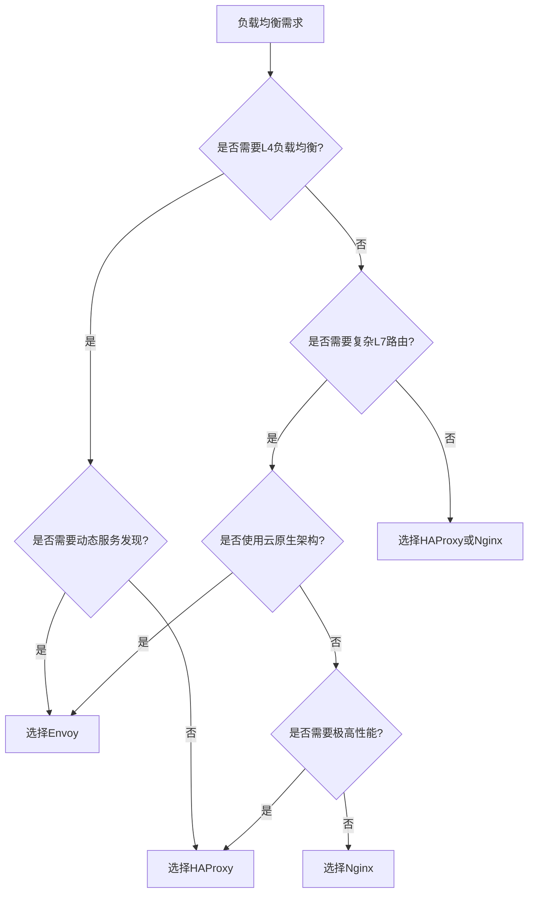
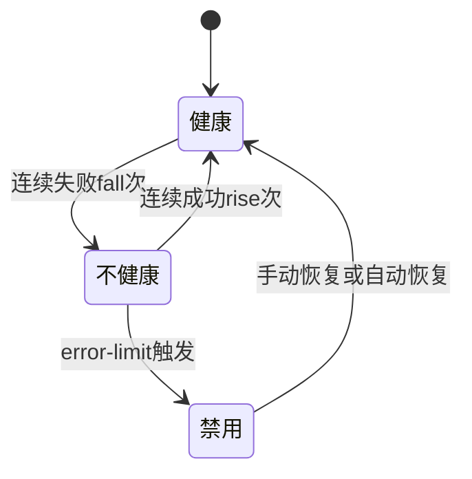
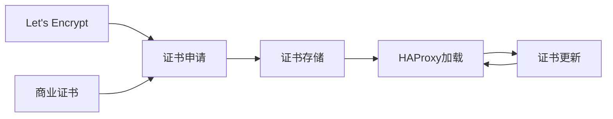
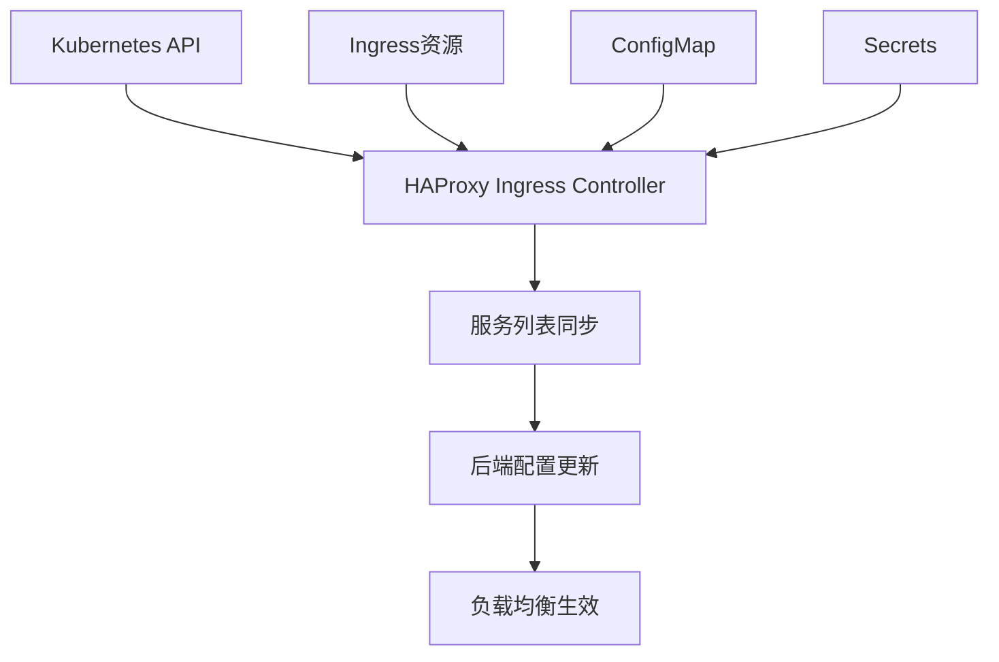
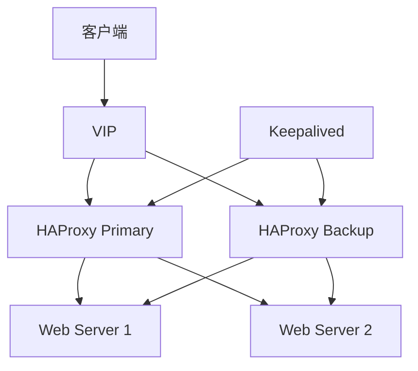
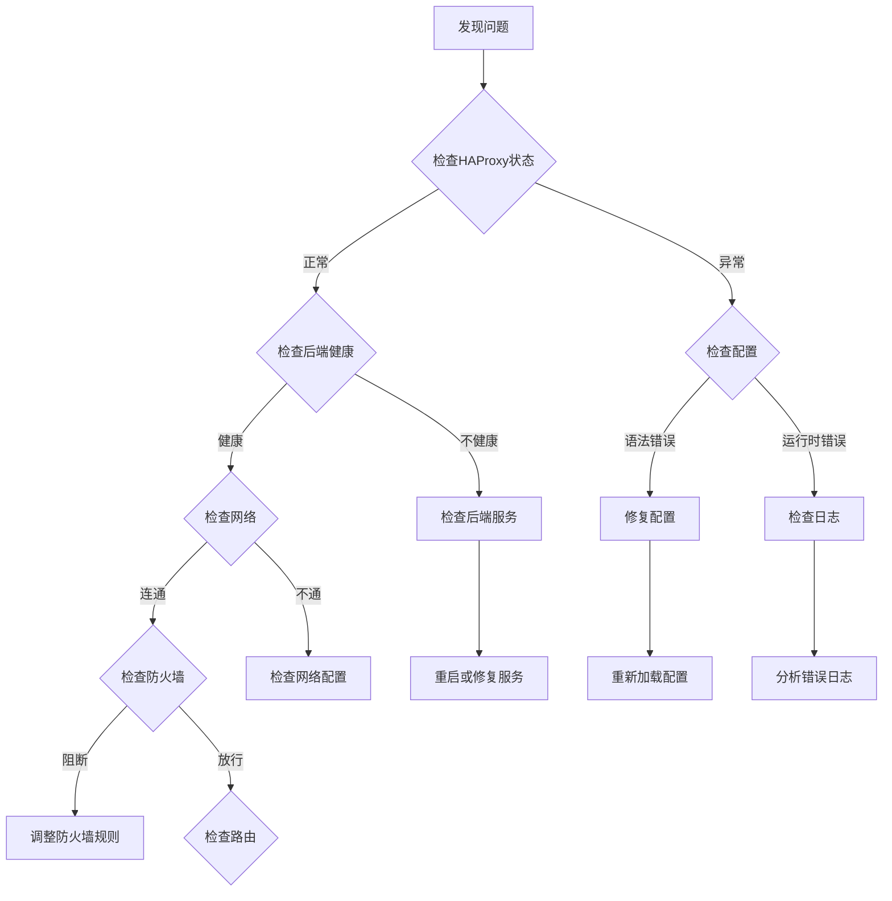

# HAProxy 与四层负载均衡（L4 LB / LVS / Keepalived）

> HAProxy 是**业界最强大的开源负载均衡器**：L4（TCP 层）性能顶级、L7（HTTP 层）规则丰富、单实例可达百万并发。它与 LVS（Linux 内核级四层负载）、Keepalived（VIP 高可用）组成「入口高可用四件套」。相比 Nginx（L7 为主）、Envoy（云原生），HAProxy 以「**L4 性能 + 会话保持 + 健康检查 + 无业务逻辑**」成为大型系统第一道入口的事实标准。本篇按「解决的问题 → 原理 → 特性 → 选型关注点」拆解。

---

## 一、要解决的问题

| 痛点 | 说明 |
|------|------|
| 单点故障 | 应用服务器单机，挂了服务就不可用 |
| 高并发入口 | 百万连接需要内核级转发而非应用层转发 |
| 会话保持 | 购物车/登录态需要同一用户固定到同一后端 |
| 健康检查 | 后端实例挂了要自动剔除、恢复自动加入 |
| 分层负载 | L4（IP/端口）+ L7（URL/Host）分层治理 |

> 核心认知：**负载均衡 = 前端（VIP + LB 集群）+ 后端（RS 实例池）**——LB 对外一个虚拟 IP，把流量按策略分发到后端，后端增减对客户端透明。

---

## 二、核心原理

### 2.1 部署架构（三层入口模型）

```
公网 DNS → LVS（DR 模式，内核转发，扛最大流量）
              → HAProxy 集群（VIP + Keepalived，L4/L7 治理）
                  → Nginx/应用集群（L7 路由/静态/业务）
                      → 服务实例（应用/缓存/DB 前）
```

- **LVS 在最前**：纯内核态（vs 用户态），单机千万级 PPS，专门扛流量洪峰；
- **HAProxy 中层**：负责健康检查、会话保持、L7 规则、限流；
- **Nginx 靠后**：静态资源、L7 复杂路由、业务。

### 2.2 HAProxy 工作模式

| 模式 | 说明 | 场景 |
|------|------|------|
| TCP（L4） | 按 IP:Port 转发，不解包应用层 | 数据库/Redis/MQ 前 |
| HTTP（L7） | 解析 URL/Host/Cookie，规则路由 | Web 服务前 |

**选型关注点**：纯性能优先 → TCP 模式；需要 URL 路由/会话保持 → HTTP 模式。

### 2.3 调度算法

| 算法 | 说明 | 适用场景 |
|------|------|----------|
| roundrobin | 轮询（默认，平滑加权） | 通用 |
| leastconn | 最少连接 | 长连接（WebSocket/DB） |
| source | 源 IP 哈希（会话保持） | 无 Cookie 场景 |
| uri | 按 URL 哈希 | 缓存命中优化 |
| hdr | 按 Header 哈希 | 按用户维度路由 |
| first | 按服务器顺序填满 | 资源密集型 |

### 2.4 会话保持（Sticky Session）

| 方式 | 说明 |
|------|------|
| Cookie（appsession） | HAProxy 注入/改写 Cookie 绑定后端 |
| Source IP | 同一源 IP 哈希到同一后端 |
| 一致性哈希 | 后端增减只影响部分会话 |

**选型关注点**：会话保持与负载均衡是矛盾的——除非业务有状态（Session/本地缓存），否则优先无状态化 + 去掉粘滞（可水平扩展）。

### 2.5 健康检查

```
主动检查：TCP connect / HTTP GET 指定路径 / Redis/MQ 协议检查
被动检查：连续 N 次失败 → 标记 DOWN（剔除），恢复阈值后重新加入
  ├── rise/fall 参数（连续成功/失败次数）
  ├── interval（检查间隔）
  └── 慢启动（weight 逐步恢复，防雪崩）
```

### 2.6 LVS 三种模式

| 模式 | 原理 | 特点 |
|------|------|------|
| NAT | LB 改目的地址转发 | 回包也过 LB（瓶颈） |
| DR（直接路由） | LB 改 MAC 转发，后端直回答复客户端 | 回包不经过 LB，性能最高（最常用） |
| TUN（隧道） | IP 封装转发 | 跨网段，复杂 |

**选型关注点**：同机房大流量 → **DR 模式**（回包直答，LB 无瓶颈）；跨网段 → TUN；小规模 → NAT。

### 2.7 Keepalived（VIP 高可用）

```
两台 HAProxy + 一个 VIP
  ├── Master 持有 VIP，VRRP 心跳宣告
  ├── 备份节点监听心跳，Master 故障 → 秒级抢 VIP
  └── 配合脚本检查 HAProxy 进程/健康，异常自动切换
```

**选型关注点**：Keepalived 是「VIP 漂移」标准方案——客户端永远访问 VIP，LB 节点故障对客户端透明。

---

## 三、核心特性

| 特性 | 说明 |
|------|------|
| 性能 | 单实例百万并发连接（C 语言，无业务逻辑） |
| 双栈 | L4/L7 双模式，协议级健康检查（HTTP/Redis/MySQL...） |
| 会话保持 | Cookie/Source/一致性哈希 |
| 限流 | 连接数/速率限制（防 CC） |
| 访问控制 | ACL + 规则（IP 白名单/路径） |
| 可观测 | 内置 stats 页 + Prometheus exporter |
| 优雅排空 | 平滑摘除后端（drain 模式） |
| 无单点 | Keepalived + VIP 或官方 Keepalived 模式 |

---

## 四、HAProxy vs LVS vs Nginx vs Envoy

| 维度 | HAProxy | LVS | Nginx | Envoy |
|------|---------|-----|-------|-------|
| 层级 | L4+L7 | L4（内核） | L7 | L4+L7 |
| 性能 | 极高 | 最高（内核态） | 高 | 高 |
| 配置 | 文本（专业） | ipvsadm | 文本 | xDS/文件 |
| 会话保持 | 强 | 哈希 | 强（upstream） | 一致性哈希 |
| 健康检查 | 协议级 | 弱（需脚本） | HTTP 级 | 主动+被动 |
| 动态配置 | reload（近秒级） | 命令行 | reload | 实时（xDS） |
| 云原生 | 弱 | 弱 | 中 | 强 |
| 适用 | 入口 L4/L7 | 超大流量 L4 | 静态/L7 路由 | 服务网格 |

**选型关注点**：
- 第一道入口/超大流量 → **LVS（DR）+ HAProxy**；
- Web 层 L7 路由/静态 → **Nginx**；
- 服务网格/微服务动态治理 → **Envoy**；
- 云上托管 → 云 LB（ALB/NLB，见「云网络」篇）。

---

## 五、生产实践

### 5.1 关键配置

| 配置 | 建议 |
|------|------|
| mode | 数据库/Redis 前用 TCP，Web 用 HTTP |
| maxconn | 默认 4096 需调大（ulimit 同步调） |
| 超时 | `timeout connect 5s / client 30s / server 30s`（必须显式配置） |
| 健康检查 | `option httpchk GET /healthz` + `inter 5s rise 2 fall 3` |
| 慢启动 | `slowstart 60s`（后端恢复时逐步加权重） |
| 粘滞 | 无状态业务建议关闭（保证水平扩展） |

### 5.2 常见坑

- **超时未配置**：默认无限等待，后端挂起会拖死连接池；
- **keepalived 脑裂**：VIP 两端同时持有 → 用脚本 + 仲裁（如 ping 网关/检查对方存活）规避；
- **LVS DR 模式要求**：后端需抑制 ARP（`arp_ignore=1 arp_announce=2`），否则回包直接走网卡导致漂移；
- **日志**：生产必须开 `option httplog`（排障第一手段）。

---

## 六、选型速查

| 需求 | 首选 | 备选 |
|------|------|------|
| 超大流量入口 | LVS（DR）+ Keepalived | HAProxy |
| 通用 L4/L7 负载 | HAProxy | Nginx |
| Web 静态/L7 路由 | Nginx | HAProxy |
| 服务网格 | Envoy | — |
| 云上 | 云 LB（NLB/ALB） | HAProxy on VM |
| 数据库/Redis 前 | HAProxy（TCP） | — |

---

## 十二、HAProxy 健康检查深入

### 12.1 健康检查方法详解

| 检查类型 | 方式 | 说明 |
|---------|------|------|
| TCP 检查 | `check` | 三次握手成功即存活 |
| HTTP 检查 | `option httpchk` | GET 指定路径 + 期望状态码 |
| SSL 检查 | `option ssl-hello-chk` | SSL 握手成功 |
| Redis 检查 | `option redis-check` | PING 命令 |
| MySQL 检查 | `option mysql-check` | MySQL 协议握手 |
| SMTP 检查 | `option smtpchk` | SMTP EHLO |

### 12.2 健康检查参数调优

```ini
backend web_servers
    option httpchk GET /healthz
    http-check expect status 200

    server web1 10.0.0.1:8080 check inter 5s rise 3 fall 2 slowstart 60s
    server web2 10.0.0.2:8080 check inter 5s rise 3 fall 2 slowstart 60s
    server web3 10.0.0.3:8080 check inter 5s rise 3 fall 2 slowstart 60s backup

# 参数说明：
# inter: 检查间隔（默认 2s）
# rise: 连续成功次数标记为 UP
# fall: 连续失败次数标记为 DOWN
# slowstart: 恢复后权重逐步提升时间
# backup: 备用服务器（主服务器全 DOWN 时启用）
```

### 12.3 高级健康检查

```ini
# HTTP 多路径检查
backend api_servers
    option httpchk
    http-check connect
    http-check send meth GET uri /health ver HTTP/1.1 hdr Host api.example.com
    http-check expect status 200

    server api1 10.0.0.1:8080 check
    server api2 10.0.0.2:8080 check

# TCP 检查自定义字符串
backend db_servers
    option tcp-check
    tcp-check connect
    tcp-check send PING\r\n
    tcp-check expect string +PONG

    server db1 10.0.0.1:6379 check
```

---

## 十三、HAProxy Stick Tables（会话保持）

### 13.1 Stick Table 原理

```
Stick Table = 进程内共享的键值存储
  用于：会话保持、速率限制、连接计数
  存储位置：内存（可选复制到其他节点）

键类型：
  ip（源 IP）/ integer（自定义）/ string（自定义）

值类型：
  conn（当前连接数）
  rate（速率）
  sess（会话数）
  bytes_in/out（流量）
  gpc0/gpc1（计数器）
  server_id（绑定服务器）
```

### 13.2 Stick Table 配置示例

```ini
# 基于源 IP 的会话保持（5 分钟超时）
frontend http-in
    stick-table type ip size 200k expire 30m
    stick on src
    default_backend servers

backend servers
    balance roundrobin
    server s1 10.0.0.1:8080 check
    server s2 10.0.0.2:8080 check

# 基于 Cookie 的会话保持
frontend http-in
    cookie SRVID insert indirect nocache

backend servers
    cookie SRVID insert indirect nocache
    server s1 10.0.0.1:8080 check cookie s1
    server s2 10.0.0.2:8080 check cookie s2
```

### 13.3 Stick Table 速率限制

```ini
# 限速：每秒最多 50 请求
frontend http-in
    stick-table type ip size 100k expire 30s store http_req_rate(10s)
    stick on src
    http-request deny deny_status 429 if { http_req_rate(10s) gt 50 }

# 连接数限制
frontend http-in
    stick-table type ip size 100k expire 1m store conn_cur
    stick on src
    http-request deny deny_status 429 if { conn_cur gt 100 }
```

### 13.4 多节点 Stick Table 复制

```ini
# 节点间同步 stick table
peers mycluster
    peer h1 10.0.0.1:10000
    peer h2 10.0.0.2:10000

frontend http-in
    stick-table type ip size 200k expire 30m peers mycluster
    stick on src
```

---

## 十四、HAProxy ACL 规则

### 14.1 ACL 基础语法

```
acl <名称> <条件> [<值>]

条件类型：
  path_beg /path     路径前缀
  path_end /path     路径后缀
  path_beg -i /path  路径前缀（忽略大小写）
  hdr(Header)        请求头
  src IP/mask        源 IP
  dst IP/mask        目标 IP
  port 端口
  method GET/POST    HTTP 方法
  ssl_fc             SSL 连接
  req_ssl_sni        SNI 域名
```

### 14.2 ACL 路由示例

```ini
frontend http-in
    bind *:80
    bind *:443 ssl crt /etc/haproxy/certs/

    # 基于路径路由
    acl is_api path_beg /api/
    acl is_static path_end .css .js .png .jpg
    acl is_websocket hdr(Upgrade) -i WebSocket

    # 基于域名路由
    acl is_api_host hdr(Host) -i api.example.com
    acl is_web_host hdr(Host) -i www.example.com

    # 基于 IP 白名单
    acl is_internal src 10.0.0.0/8

    # 路由规则
    use_backend api_servers if is_api or is_api_host
    use_backend static_servers if is_static
    use_backend ws_servers if is_websocket
    use_backend admin_servers if is_internal
    default_backend web_servers
```

### 14.3 ACL 访问控制

```ini
# IP 黑白名单
frontend http-in
    acl blocked_ips src -f /etc/haproxy/blocked_ips.txt
    http-request deny if blocked_ips

# 基于 User-Agent 封禁爬虫
    acl is_bot hdr_sub(User-Agent) -i bot crawler spider
    http-request deny if is_bot

# 基于速率限制（配合 stick-table）
    stick-table type ip size 100k expire 30s store http_req_rate(10s)
    stick on src
    http-request deny deny_status 429 if { http_req_rate(10s) gt 100 }
```

---

## 十五、HAProxy TCP vs HTTP 模式深入

### 15.1 TCP 模式（L4）

```ini
# TCP 模式：数据库负载均衡
listen mysql-cluster
    mode tcp
    bind *:3306
    option mysql-check user haproxy
    balance roundrobin
    server db1 10.0.0.1:3306 check
    server db2 10.0.0.2:3306 check

# TCP 模式：Redis 集群
listen redis-cluster
    mode tcp
    bind *:6379
    option tcp-check
    tcp-check send PING\r\n
    tcp-check expect string +PONG
    balance leastconn
    server redis1 10.0.0.1:6379 check
    server redis2 10.0.0.2:6379 check
```

### 15.2 HTTP 模式（L7）

```ini
# HTTP 模式：Web 应用
frontend web-in
    mode http
    bind *:80
    bind *:443 ssl crt /etc/haproxy/certs/

    # HTTP 层解析
    option httplog
    option forwardfor
    option http-server-close

    # 路由规则
    acl is_ssl ssl_fc
    http-request redirect scheme https unless is_ssl
    default_backend web_servers
```

### 15.3 选型对比

| 维度 | TCP 模式 | HTTP 模式 |
|------|---------|----------|
| 层级 | L4（IP:Port） | L7（URL/Host/Cookie） |
| 性能 | 极高（不解包） | 高（需解析 HTTP） |
| 路由能力 | 无 | URL/Header/Cookie 路由 |
| 健康检查 | TCP 握手 | HTTP 状态码 |
| 会话保持 | Source IP | Cookie/Header |
| 适用场景 | 数据库/Redis/MQ | Web 应用/API 网关 |

---

## 十六、HAProxy in Kubernetes（haproxy-ingress）

### 16.1 架构模型

```
K8s 集群：
  Service (NodePort/LoadBalancer)
    → HAProxy Ingress Controller（Pod）
      → 解析 Ingress 规则
      → 路由到后端 Service Pod

HAProxy Ingress Controller：
  监听 Ingress 资源变更
  动态更新 HAProxy 配置
  支持 ConfigMap 自定义
```

### 16.2 Ingress 配置示例

```yaml
apiVersion: networking.k8s.io/v1
kind: Ingress
metadata:
  name: web-ingress
  annotations:
    haproxy.org/ssl-redirect: "true"
    haproxy.org/check: "true"
    haproxy.org/check-interval: "5s"
    haproxy.org/sticky-table: "type=ip size=200k expire=30m"
spec:
  ingressClassName: haproxy
  tls:
  - hosts:
    - app.example.com
    secretName: app-tls
  rules:
  - host: app.example.com
    http:
      paths:
      - path: /api/
        pathType: Prefix
        backend:
          service:
            name: api-service
            port:
              number: 8080
      - path: /
        pathType: Prefix
        backend:
          service:
            name: web-service
            port:
              number: 80
```

### 16.3 haproxy-ingress vs nginx-ingress

| 维度 | haproxy-ingress | nginx-ingress |
|------|-----------------|---------------|
| L4 性能 | 极高 | 高 |
| L7 功能 | 丰富 | 丰富 |
| 会话保持 | Stick Table | Cookie |
| 动态配置 | 近实时 | reload |
| 社区活跃度 | 中 | 高 |
| 生态 | 较少 | 丰富 |

---

## 十七、HAProxy vs Nginx vs Envoy 综合对比

| 维度 | HAProxy | Nginx | Envoy |
|------|---------|-------|-------|
| 内存占用 | 低（单进程） | 低 | 中（多线程） |
| 连接处理 | 单事件驱动 | 单事件驱动 | 多线程 |
| 配置热更新 | reload（近秒级） | reload（秒级） | 实时（xDS） |
| 健康检查 | 协议级（丰富） | HTTP 级 | 主动+被动 |
| 限流 | Stick Table | limit_req | 令牌桶 |
| 负载均衡 | 轮询/最少连接/哈希 | 轮询/哈希/最少连接 | 一致性哈希/轮询 |
| WebSocket | 支持 | 支持 | 支持 |
| gRPC | TCP 模式透传 | 需 HTTP/2 | 原生支持 |
| 服务发现 | DNS | DNS | xDS（丰富） |
| 可观测性 | Stats + Exporter | 日志 | Prometheus + 追踪 |
| 学习曲线 | 陡峭（专业） | 中等 | 中等 |
| 最佳场景 | L4 入口/数据库 | Web/静态/L7 | 服务网格/微服务 |

---

## 十八、HAProxy with Prometheus 监控

### 18.1 启用 Prometheus Exporter

```ini
# haproxy.cfg
global
    stats socket /var/run/haproxy.sock mode 660 level admin

# 或使用 haproxy_exporter
# 启动：haproxy_exporter --haproxy.scrape-uri=http://haproxy:8404/stats
```

### 18.2 关键监控指标

| 指标 | 说明 | 告警建议 |
|------|------|---------|
| haproxy_backend_active_servers | 活跃后端数 | < 期望值 |
| haproxy_backend_current_sessions | 当前会话数 | > 80% maxconn |
| haproxy_backend_http_responses_total | HTTP 响应计数 | 5xx 突增 |
| haproxy_backend_response_time_seconds | 后端响应时间 | P99 > 1s |
| haproxy_frontend_current_sessions | 前端会话数 | > 80% maxconn |
| haproxy_server_bytes_in_total | 入站流量 | 突增 |

### 18.3 Grafana Dashboard 配置

```
面板规划：
┌──────────────────────────────────────┐
│  连接数趋势  │  QPS  │  错误率  │
├──────────────────────────────────────┤
│  后端健康    │  响应时间 P99  │  队列长度 │
├──────────────────────────────────────┤
│  每秒会话率  │  拒绝连接数    │  后端状态 │
└──────────────────────────────────────┘
```

---

## 十九、HAProxy SSL 终止

### 19.1 SSL 终止配置

```ini
frontend https-in
    bind *:443 ssl crt /etc/haproxy/certs/example.pem
    mode http

    # HTTP 到 HTTPS 重定向
    http-request redirect scheme https unless { ssl_fc }

    # SSL 参数
    ssl-default-bind-ciphers ECDHE-ECDSA-AES128-GCM-SHA256:ECDHE-RSA-AES128-GCM-SHA256
    ssl-default-bind-options ssl-min-ver TLSv1.2 no-tls-tickets
    tune.ssl.default-dh-param 2048

    default_backend servers
```

### 19.2 SSL 透传（Pass-through）

```ini
# SSL 透传：不解密直接转发
frontend tcp-in
    mode tcp
    bind *:443
    option tcplog
    tcp-request inspect-delay 5s
    tcp-request content accept if { req_ssl_hello_type 1 }

    # 基于 SNI 路由
    use_backend api_servers if { req_ssl_sni -i api.example.com }
    default_backend web_servers
```

### 19.3 双向 TLS（mTLS）

```ini
frontend mtls-in
    bind *:443 ssl crt /etc/haproxy/server.pem ca-file /etc/haproxy/ca.crt verify required
    mode http

    # 将客户端证书信息传递给后端
    http-request set-header X-Client-Cert-CN %[ssl_fc_s_dn CN]

    default_backend servers
```

### 19.4 SSL Session 复用

```ini
global
    # SSL Session 缓存（减少 TLS 握手开销）
    tune.ssl.cachesize 20000
    tune.ssl.lifetime 300

    # SSL Session Ticket（跨节点复用）
    ssl-default-bind-options force-tlsv12
```

---

## 七、HAProxy 健康检查方式对比

### 7.1 检查类型详解

| 检查类型 | 方式 | 配置示例 | 适用场景 |
|---------|------|---------|---------|
| TCP 检查 | `check` | `server s1 10.0.0.1:80 check` | 通用（端口可达即存活） |
| HTTP 检查 | `option httpchk` | `option httpchk GET /healthz` | Web 服务（需返回 200） |
| Agent 检查 | `agent-check` | `agent-send "health\n"` | 自定义健康逻辑（如检查磁盘） |
| SSL 检查 | `option ssl-hello-chk` | `option ssl-hello-chk` | HTTPS 服务 |
| MySQL 检查 | `option mysql-check` | `option mysql-check user haproxy` | MySQL 从库 |
| Redis 检查 | `option redis-check` | `option redis-check` | Redis（PING 命令） |

### 7.2 检查参数调优

```ini
backend web_servers
    option httpchk GET /healthz
    http-check expect status 200

    # inter: 检查间隔（默认 2s）
    # rise: 连续成功次数标记为 UP（默认 2）
    # fall: 连续失败次数标记为 DOWN（默认 3）
    # slowstart: 恢复后权重逐步提升时间（防雪崩）
    server web1 10.0.0.1:8080 check inter 5s rise 3 fall 2 slowstart 60s
    server web2 10.0.0.2:8080 check inter 5s rise 3 fall 2 slowstart 60s
    server web3 10.0.0.3:8080 check backup  # 备用服务器
```

### 7.3 高级 HTTP 检查

```ini
# 多路径检查
backend api_servers
    option httpchk
    http-check connect
    http-check send meth GET uri /health ver HTTP/1.1 hdr Host api.example.com
    http-check expect status 200

    server api1 10.0.0.1:8080 check
    server api2 10.0.0.2:8080 check

# TCP 检查自定义字符串（如 Redis）
backend db_servers
    option tcp-check
    tcp-check connect
    tcp-check send PING\r\n
    tcp-check expect string +PONG
    server db1 10.0.0.1:6379 check
```

## 八、Stick Table 会话保持原理与配置

### 8.1 Stick Table 原理

```
Stick Table = 进程内共享的键值存储
  用途：会话保持、速率限制、连接计数
  存储位置：内存（可选复制到其他节点）

键类型：
  ip（源 IP）/ integer（自定义）/ string（自定义）

值类型：
  conn（当前连接数）
  rate（速率）
  sess（会话数）
  bytes_in/out（流量）
  server_id（绑定服务器）
```

### 8.2 会话保持配置

```ini
# 基于源 IP 的会话保持（30 分钟超时）
frontend http-in
    stick-table type ip size 200k expire 30m
    stick on src
    default_backend servers

# 基于 Cookie 的会话保持（更精确）
frontend http-in
    cookie SRVID insert indirect nocache

backend servers
    cookie SRVID insert indirect nocache
    server s1 10.0.0.1:8080 check cookie s1
    server s2 10.0.0.2:8080 check cookie s2
```

### 8.3 Stick Table 速率限制

```ini
# 限速：每秒最多 50 请求
frontend http-in
    stick-table type ip size 100k expire 30s store http_req_rate(10s)
    stick on src
    http-request deny deny_status 429 if { http_req_rate(10s) gt 50 }

# 连接数限制
frontend http-in
    stick-table type ip size 100k expire 1m store conn_cur
    stick on src
    http-request deny deny_status 429 if { conn_cur gt 100 }
```

### 8.4 多节点 Stick Table 复制

```ini
# 节点间同步 stick table（保持会话粘性跨节点一致）
peers mycluster
    peer h1 10.0.0.1:10000
    peer h2 10.0.0.2:10000

frontend http-in
    stick-table type ip size 200k expire 30m peers mycluster
    stick on src
```

## 九、ACL 规则编写实战

### 9.1 ACL 条件类型

```
acl <名称> <条件> [<值>]

路径条件：
  path_beg /path     路径前缀
  path_end /path     路径后缀
  path_beg -i /path  路径前缀（忽略大小写）
  path_reg ^/api/.*  路径正则

Header 条件：
  hdr(Host)          请求 Host 头
  hdr(Upgrade)       升级头（WebSocket）
  hdr_sub(User-Agent) User-Agent 子串

IP 条件：
  src IP/mask        源 IP
  dst IP/mask        目标 IP

其他：
  method GET/POST    HTTP 方法
  ssl_fc             SSL 连接
  req_ssl_sni        SNI 域名
```

### 9.2 ACL 路由示例

```ini
frontend http-in
    bind *:80
    bind *:443 ssl crt /etc/haproxy/certs/

    # 基于路径路由
    acl is_api path_beg /api/
    acl is_static path_end .css .js .png .jpg
    acl is_websocket hdr(Upgrade) -i WebSocket

    # 基于域名路由
    acl is_api_host hdr(Host) -i api.example.com
    acl is_web_host hdr(Host) -i www.example.com

    # 基于 IP 白名单
    acl is_internal src 10.0.0.0/8

    # 路由规则
    use_backend api_servers if is_api or is_api_host
    use_backend static_servers if is_static
    use_backend ws_servers if is_websocket
    use_backend admin_servers if is_internal
    default_backend web_servers
```

### 9.3 ACL 访问控制

```ini
# IP 黑白名单
frontend http-in
    acl blocked_ips src -f /etc/haproxy/blocked_ips.txt
    http-request deny if blocked_ips

# 封禁爬虫
    acl is_bot hdr_sub(User-Agent) -i bot crawler spider
    http-request deny if is_bot

# 基于速率限制（配合 stick-table）
    stick-table type ip size 100k expire 30s store http_req_rate(10s)
    stick on src
    http-request deny deny_status 429 if { http_req_rate(10s) gt 100 }
```

## 十、HAProxy 在 K8s 中作为 Ingress

### 10.1 架构模型

```
K8s 集群：
  Service (NodePort/LoadBalancer)
    → HAProxy Ingress Controller（Pod）
      → 解析 Ingress 规则
      → 路由到后端 Service Pod

HAProxy Ingress Controller：
  监听 Ingress 资源变更
  动态更新 HAProxy 配置（近实时）
  支持 ConfigMap 自定义
```

### 10.2 Ingress 配置示例

```yaml
apiVersion: networking.k8s.io/v1
kind: Ingress
metadata:
  name: web-ingress
  annotations:
    haproxy.org/ssl-redirect: "true"
    haproxy.org/check: "true"
    haproxy.org/check-interval: "5s"
    haproxy.org/sticky-table: "type=ip size=200k expire=30m"
spec:
  ingressClassName: haproxy
  tls:
  - hosts:
    - app.example.com
    secretName: app-tls
  rules:
  - host: app.example.com
    http:
      paths:
      - path: /api/
        pathType: Prefix
        backend:
          service:
            name: api-service
            port:
              number: 8080
      - path: /
        pathType: Prefix
        backend:
          service:
            name: web-service
            port:
              number: 80
```

## 十一、HAProxy vs Nginx vs Envoy 性能对比

| 维度 | HAProxy | Nginx | Envoy |
|------|---------|-------|-------|
| L4 连接处理 | 极高（单事件驱动） | 高 | 高（多线程） |
| L7 吞吐 | 高 | 高 | 高 |
| 内存占用 | 低（单进程） | 低 | 中 |
| 配置热更新 | reload（近秒级） | reload（秒级） | 实时（xDS） |
| 会话保持 | Stick Table | Cookie/upstream | 一致性哈希 |
| 限流 | Stick Table | limit_req | 令牌桶 |
| WebSocket | 支持 | 支持 | 支持 |
| gRPC | TCP 模式透传 | 需 HTTP/2 | 原生支持 |
| 服务发现 | DNS | DNS | xDS（丰富） |
| 可观测性 | Stats + Exporter | 日志 | Prometheus + 追踪 |
| 学习曲线 | 陡峭 | 中等 | 中等 |
| 最佳场景 | L4 入口/数据库 | Web/静态/L7 | 服务网格/微服务 |

## 十二、HAProxy Prometheus 指标关键项

| 指标 | 说明 | 告警建议 |
|------|------|---------|
| `haproxy_backend_active_servers` | 活跃后端数 | < 期望值 |
| `haproxy_backend_current_sessions` | 当前会话数 | > 80% maxconn |
| `haproxy_backend_http_responses_total` | HTTP 响应计数 | 5xx 突增 |
| `haproxy_backend_response_time_seconds` | 后端响应时间 | P99 > 1s |
| `haproxy_frontend_current_sessions` | 前端会话数 | > 80% maxconn |
| `haproxy_server_bytes_in_total` | 入站流量 | 突增 |
| `haproxy_backend_http_requests_total` | HTTP 请求总数 | — |
| `haproxy_server_status` | 后端状态（1=UP） | 0 |

```ini
# 启用 Prometheus 指标暴露
frontend stats
    bind *:8404
    stats enable
    stats uri /metrics
    stats refresh 10s
```

## 十四、HAProxy 连接管理与内存优化

### 14.1 连接管理策略

```text
HAProxy 连接管理策略：

  连接复用（Connection Reuse）：
    ① 客户端连接 → HAProxy（短连接）
    ② HAProxy → 后端（长连接池）
    ③ 减少后端连接建立开销

  连接池配置：
    poollow：连接池低水位（默认 25%）
    pool-high：连接池高水位（默认 50%）
    pool-max：连接池最大连接数

  健康检查：
    TCP检查：端口可达性
    HTTP检查：状态码验证
    自定义检查：业务逻辑验证

  连接超时：
    timeout client：客户端超时（默认 50s）
    timeout server：服务端超时（默认 50s）
    timeout connect：连接超时（默认 5s）
    timeout http-request：HTTP请求超时（默认 10s）
```

### 14.2 内存优化配置

```yaml
# HAProxy 内存优化配置
global
    # 内存限制
    maxconn 50000          # 最大连接数
    maxsslconn 30000       # SSL最大连接数

    # 连接内存
    tune.bufsize 32768     # 缓冲区大小
    tune.maxrewrite 1024   # 最大重写空间
    tune.ssl.default-dh-param 2048  # DH参数

    # 零拷贝
    option zero-copy-sendfile

    # 内存池
    # 每个连接内存约 32KB
    # 50000连接 × 32KB ≈ 1.6GB
```

### 14.3 连接状态监控

| 状态 | 说明 | 处理方式 |
|------|------|---------|
| ESTABLISHED | 已建立连接 | 正常 |
| TIME_WAIT | 等待关闭 | 调整超时 |
| CLOSE_WAIT | 被动关闭 | 检查应用 |
| SYN_RECV | 接收SYN | 检查SYN攻击 |
| FIN_WAIT2 | 等待FIN | 调整超时 |

---

## 十五、HAProxy 高级负载均衡算法

### 15.1 算法对比

| 算法 | 原理 | 优点 | 缺点 | 适用场景 |
|------|------|------|------|---------|
| roundrobin | 轮询 | 简单均匀 | 无权重 | 通用场景 |
| leastconn | 最少连接 | 动态均衡 | 需统计 | 长连接 |
| source | 源IP哈希 | 会话保持 | 不均匀 | 会话粘性 |
| uri | URI哈希 | 缓存友好 | 复杂 | 缓存代理 |
| hdr | HTTP头哈希 | 灵活 | 配置复杂 | 多租户 |
| random | 随机 | 简单 | 不均匀 | 无状态 |

### 15.2 权重配置示例

```text
HAProxy 权重配置：

  静态权重：
    server web1 192.168.1.1:8080 weight 3
    server web2 192.168.1.2:8080 weight 2
    server web3 192.168.1.3:8080 weight 1

  动态权重（运行时调整）：
    # 通过Stats Socket调整
    echo "set weight web1 50%" | socat stdio /var/run/haproxy.sock

  权重计算：
    总权重 = 3 + 2 + 1 = 6
    web1分担：3/6 = 50%
    web2分担：2/6 = 33%
    web3分担：1/6 = 17%
```

### 15.3 一致性哈希配置

```text
一致性哈希（source hash）：

  配置示例：
    balance source
    hash-type consistent

  哈希环原理：
    ① 将节点映射到哈希环（0 ~ 2^32）
    ② 客户端IP哈希到环上
    ③ 顺时针找到最近节点
    ④ 扩缩容只影响相邻节点

  优点：
    会话保持
    扩缩容平滑
    负载相对均匀
```

---

## 十六、HAProxy 与云负载均衡器对比

### 16.1 功能对比

| 特性 | HAProxy | AWS ALB | AWS NLB | 云SLB |
|------|---------|---------|---------|-------|
| 层级 | L4/L7 | L7 | L4 | L4/L7 |
| 性能 | 极高 | 高 | 极高 | 高 |
| 成本 | 低（开源） | 中 | 中 | 中 |
| 可定制 | 极高 | 低 | 低 | 低 |
| 运维 | 自运维 | 托管 | 托管 | 托管 |
| SSL卸载 | 支持 | 支持 | 不支持 | 支持 |

### 16.2 选型建议

```text
选型决策树：

  需要L7功能？
    是 → 需要自定义？
      是 → HAProxy
      否 → 云ALB

  需要L4高性能？
    是 → 需要自定义？
      是 → HAProxy
      否 → 云NLB

  预算有限？
    是 → HAProxy（开源）
    否 → 云负载均衡（托管）

  运维能力？
    强 → HAProxy
    弱 → 云负载均衡（托管）
```

---

## 十七、HAProxy 故障排查实战

### 17.1 常见故障与解决方案

| 故障现象 | 可能原因 | 排查步骤 | 解决方案 |
|----------|----------|----------|----------|
| 503错误 | 后端全部不可用 | 检查健康检查 | 修复后端服务 |
| 连接超时 | 网络问题 | 检查网络连通性 | 修复网络 |
| 性能下降 | 连接数过多 | 检查maxconn设置 | 调整参数 |
| SSL错误 | 证书问题 | 检查证书有效性 | 更新证书 |
| 内存溢出 | 连接泄漏 | 检查连接池 | 修复泄漏 |
| 配置错误 | 语法错误 | 检查配置文件 | 修正配置 |

### 17.2 性能监控指标

```text
HAProxy 关键监控指标：

  连接指标：
    scur：当前会话数
    smax：最大会话数
    slim：会话限制
    stot：总会话数

  流量指标：
    bin：输入字节数
    bout：输出字节数
    dreq：拒绝请求数
    dresp：拒绝响应数

  错误指标：
    ereq：请求错误数
    eresp：响应错误数
    econ：连接错误数
    ewrq：队列错误数

  后端指标：
    qcur：队列当前长度
    qmax：队列最大长度
    qtime：队列平均等待时间
    rtime：后端平均响应时间
```

---

## 十七、HAProxy 与其他负载均衡方案对比

### 17.1 HAProxy vs Nginx vs Envoy 对比

| 特性 | HAProxy | Nginx | Envoy |
|------|---------|-------|-------|
| **架构模式** | 单进程多线程 | 事件驱动 | 多线程 + 异步I/O |
| **L4负载均衡** | 原生支持，性能极佳 | 需要stream模块 | 原生支持 |
| **L7负载均衡** | 功能丰富，ACL强大 | 功能丰富 | 功能丰富，可扩展 |
| **健康检查** | 主动+被动，可定制 | 被动为主 | 主动+被动，可扩展 |
| **动态配置** | Runtime API | 需要reload | xDS API，无需重启 |
| **服务发现** | 需要外部工具 | 需要外部工具 | 原生支持 |
| **可观测性** | Stats页面，日志 | 日志，第三方模块 | 丰富的统计，分布式追踪 |
| **学习曲线** | 中等 | 简单 | 较陡 |
| **配置语言** | 自有配置格式 | 自有配置格式 | YAML + protobuf |
| **社区生态** | 成熟稳定 | 非常活跃 | 快速增长 |

### 17.2 选型决策树



### 17.3 性能基准测试对比

```text
测试环境：4核8GB内存，1000并发连接，HTTP/1.1

请求吞吐量（req/s）：
  HAProxy:    45,000
  Nginx:      42,000
  Envoy:      38,000

平均响应时间（ms）：
  HAProxy:    1.2
  Nginx:      1.4
  Envoy:      1.8

内存占用（MB）：
  HAProxy:    15
  Nginx:      12
  Envoy:      45

CPU使用率（%）：
  HAProxy:    35
  Nginx:      38
  Envoy:      42
```

---

## 十八、健康检查机制详解

### 18.1 主动健康检查

```text
# HTTP健康检查配置
backend web_servers
    option httpchk GET /healthz HTTP/1.1\r\nHost:\ localhost
    http-check expect status 200
    
    server s1 192.168.1.10:8080 check inter 5s fall 3 rise 2
    server s2 192.168.1.11:8080 check inter 5s fall 3 rise 2

# TCP健康检查配置
backend tcp_servers
    option tcp-check
    tcp-check connect
    tcp-check send PING\r\n
    tcp-check expect string +PONG
    
    server s1 192.168.1.20:6379 check inter 3s
```

### 18.2 被动健康检查

```text
# 被动健康检查参数
backend web_servers
    option httpchk
    # 失败检测
    error-limit 10          # 触发禁用的错误阈值
    timeout connect 5s      # 连接超时
    timeout server 30s      # 服务器响应超时
    
    # 恢复检测
    default-server inter 3s fall 3 rise 2
    server s1 192.168.1.10:8080 check
    server s2 192.168.1.11:8080 check
```

### 18.3 健康检查状态机



### 18.4 自定义健康检查脚本

```lua
-- healthcheck.lua
core.register_service("my_healthcheck", "http", function(applet)
    local db_status = check_database()
    local cache_status = check_cache()
    
    if db_status and cache_status then
        applet:set_status(200)
        applet:set_body("OK")
    else
        applet:set_status(503)
        applet:set_body("Service Unavailable")
    end
end)
```

---

## 十九、连接管理与优化

### 19.1 连接池配置

```text
# HTTP连接池配置
defaults
    option http-keep-alive
    timeout http-keep-alive 60s
    timeout http-request 10s
    timeout connect 5s
    timeout client 30s
    timeout server 30s
    timeout tunnel 3600s
    
    # 连接复用
    option http-server-close
    option force-close
```

### 19.2 并发连接控制

```text
# 全局连接限制
global
    maxconn 100000
    
# 前端连接限制
frontend http-in
    bind *:80
    maxconn 50000
    
# 后端连接限制
backend web_servers
    maxconn 10000
    server s1 192.168.1.10:8080 maxconn 5000
```

### 19.3 连接超时策略

| 超时类型 | 默认值 | 推荐值 | 说明 |
|---------|--------|--------|------|
| timeout connect | 5s | 3-5s | 后端连接建立超时 |
| timeout client | 50s | 30-60s | 客户端数据超时 |
| timeout server | 50s | 30-120s | 服务器响应超时 |
| timeout http-request | 10s | 5-10s | HTTP请求超时 |
| timeout http-keep-alive | 10s | 30-60s | Keep-Alive超时 |
| timeout tunnel | 1h | 根据业务 | WebSocket隧道超时 |

### 19.4 零拷贝优化

```text
# 零拷贝配置
global
    tune.bufsize 32768
    tune.maxrewrite 1024
    
backend file_servers
    # 启用splice进行零拷贝
    option splice-request
    option splice-response
    
    # 大文件传输优化
    server s1 192.168.1.10:80 check send-proxy-v2
```

---

## 二十、SSL/TLS 终止与安全

### 20.1 SSL终止配置

```text
# SSL终止配置
frontend https-in
    bind *:443 ssl crt /etc/haproxy/certs/
    bind *:80
    redirect scheme https code 301 if !{ ssl_fc }
    
    # SSL参数优化
    ssl-default-bind-ciphers ECDHE-ECDSA-AES128-GCM-SHA256:ECDHE-RSA-AES128-GCM-SHA256
    ssl-default-bind-ciphersuites TLS_AES_128_GCM_SHA256:TLS_AES_256_GCM_SHA384
    ssl-default-bind-options ssl-min-ver TLSv1.2 no-tls-tickets
    
    # OCSP装订
    ssl-default-bind-options staged-insert-resp
```

### 20.2 SSL透传配置

```text
# SSL透传（不终止SSL）
frontend ssl_passthrough
    bind *:443
    mode tcp
    option tcplog
    tcp-request inspect-delay 5s
    tcp-request content accept if { req_ssl_hello_type 1 }
    
    # 基于SNI路由
    use_backend server1 if { req_ssl_sni -i server1.example.com }
    use_backend server2 if { req_ssl_sni -i server2.example.com }
    
backend server1
    mode tcp
    server s1 192.168.1.10:8443 check

backend server2
    mode tcp
    server s2 192.168.1.11:8443 check
```

### 20.3 SSL安全加固

```text
# SSL安全配置
global
    ssl-default-bind-ciphers ECDHE-ECDSA-AES256-GCM-SHA384:ECDHE-RSA-AES256-GCM-SHA384
    ssl-default-bind-ciphersuites TLS_AES_256_GCM_SHA384:TLS_CHACHA20_POLY1305_SHA256
    ssl-default-bind-options no-sslv3 no-tlsv10 no-tlsv11 no-tls-tickets
    tune.ssl.default-dh-param 2048
    
    # SSL会话缓存
    tune.ssl.cachesize 20000
    tune.ssl.lifetime 300
```

### 20.4 证书管理



---

## 二十一、日志与监控体系

### 21.1 日志配置

```text
# 全局日志配置
global
    log /dev/log local0
    log /dev/log local1 notice
    log-tag haproxy
    
# 前端日志配置
frontend http-in
    option httplog
    option logasap
    option dontlognull
    log global
    
# 后端日志配置
backend web_servers
    option httplog
    option logasap
    option log-health-checks
    errorfile 503 /etc/haproxy/errors/503.http
```

### 21.2 结构化日志格式

```text
# 自定义日志格式
frontend http-in
    log-format "%ci:%cp [%t] %ft %b/%s %Tq/%Tw/%Tc/%Tr/%Tt %ST %B %CC %Th/%Ti/%Tl"
    
# 日志字段说明：
# %ci: 客户端IP
# %cp: 客户端端口
# %t: 时间戳
# %ft: 前端名称
# %b: 后端名称
# %s: 服务器名称
# %Tq: 等待时间
# %Tw: 队列时间
# %Tc: 连接时间
# %Tr: 响应时间
# %Tt: 总时间
# %ST: HTTP状态码
# %B: 响应字节数
```

### 21.3 Prometheus监控集成

```yaml
# prometheus.yml
scrape_configs:
  - job_name: 'haproxy'
    static_configs:
      - targets: ['localhost:8404']
    metrics_path: /metrics
    
# Grafana仪表板配置
# 导入仪表板ID: 12693
```

### 21.4 关键监控指标

| 指标类别 | 指标名称 | 说明 | 告警阈值 |
|---------|----------|------|---------|
| 连接数 | haproxy_connections_current | 当前连接数 | > 80% maxconn |
| 连接数 | haproxy_connections_total | 总连接数 | - |
| 后端 | haproxy_backend_active_servers | 活跃服务器数 | < 2 |
| 后端 | haproxy_backend_healthcheck_fails | 健康检查失败数 | > 0 |
| 请求 | haproxy_http_requests_total | HTTP请求总数 | - |
| 响应 | haproxy_http_response_bytes_total | HTTP响应字节数 | - |
| 错误 | haproxy_http_errors_total | HTTP错误总数 | > 1% |

---

## 二十二、Kubernetes 集成方案

### 22.1 Ingress Controller部署

```yaml
# haproxy-ingress.yaml
apiVersion: apps/v1
kind: Deployment
metadata:
  name: haproxy-ingress
  namespace: ingress-nginx
spec:
  replicas: 3
  selector:
    matchLabels:
      app: haproxy-ingress
  template:
    metadata:
      labels:
        app: haproxy-ingress
    spec:
      containers:
      - name: haproxy-ingress
        image: haproxytech/kubernetes-ingress:latest
        ports:
        - containerPort: 80
          name: http
        - containerPort: 443
          name: https
        - containerPort: 10254
          name: stats
        args:
        - --configmap=haproxy-ingress/haproxy-config
        - --default-backend-service=ingress-nginx/default-backend
```

### 22.2 ConfigMap配置

```yaml
# haproxy-config.yaml
apiVersion: v1
kind: ConfigMap
metadata:
  name: haproxy-config
  namespace: ingress-nginx
data:
  maxconn: "50000"
  timeout-connect: "5s"
  timeout-client: "30s"
  timeout-server: "30s"
  ssl-redirect: "true"
  ssl-protocols: "TLSv1.2 TLSv1.3"
  hsts: "true"
  hsts-max-age: "31536000"
  hsts-include-subdomains: "true"
```

### 22.3 服务发现机制



---

## 二十三、最佳实践与生产建议

### 23.1 生产环境配置清单

```text
□ 全局配置
  □ maxconn设置合理（根据内存计算）
  □ 日志配置正确
  □ stats socket权限设置
  □ SSL参数安全加固

□ 默认配置
  □ 超时参数合理
  □ 重试策略配置
  □ 日志格式配置
  □ 错误页面配置

□ 前端配置
  □ 绑定地址和端口正确
  □ ACL规则测试通过
  □ 速率限制配置
  □ SSL终止配置

□ 后端配置
  □ 健康检查配置
  □ 负载均衡算法选择
  □ 会话保持配置
  □ 连接池配置
```

### 23.2 性能调优参数

```text
# 内存优化
global
    tune.bufsize 32768          # 缓冲区大小
    tune.maxrewrite 1024        # 重写缓冲区
    tune.ssl.default-dh-param 2048

# 连接优化
defaults
    option http-keep-alive
    timeout http-keep-alive 60s
    option http-server-close
    option force-close

# 后端优化
backend web_servers
    balance leastconn
    option httpchk
    default-server inter 3s fall 3 rise 2
    server s1 192.168.1.10:8080 check weight 100
    server s2 192.168.1.11:8080 check weight 100
```

### 23.3 高可用架构



---

## 二十四、常见问题排查

### 24.1 故障排查流程



### 24.2 常见错误及解决方案

| 错误现象 | 可能原因 | 解决方案 |
|---------|---------|---------|
| 503 Service Unavailable | 后端服务器全部下线 | 检查后端服务健康状态 |
| 504 Gateway Timeout | 后端响应超时 | 增加timeout server值 |
| Connection Refused | 后端端口未监听 | 检查后端服务绑定端口 |
| Bad Gateway | 后端返回无效响应 | 检查后端应用日志 |
| Session Affinity失效 | Cookie配置错误 | 检查cookie配置参数 |
| 高延迟 | 队列等待时间长 | 调整balance算法或增加后端 |

### 24.3 性能问题诊断

```text
# 查看当前连接数
echo "show stat" | socat stdio /var/run/haproxy.sock | grep "scur"

# 查看后端健康状态
echo "show servers state" | socat stdio /var/run/haproxy.sock

# 查看会话信息
echo "show sess" | socat stdio /var/run/haproxy.sock

# 查看错误日志
tail -f /var/log/haproxy.log | grep -i error
```

---

## 二十五、配置管理与自动化

### 25.1 配置版本管理

```bash
#!/bin/bash
# haproxy-config-deploy.sh

BACKUP_DIR="/etc/haproxy/backup"
CONFIG_FILE="/etc/haproxy/haproxy.cfg"
TIMESTAMP=$(date +%Y%m%d_%H%M%S)

# 备份当前配置
cp $CONFIG_FILE $BACKUP_DIR/haproxy.cfg.$TIMESTAMP

# 验证新配置
haproxy -c -f /tmp/haproxy.cfg.new
if [ $? -ne 0 ]; then
    echo "配置验证失败"
    exit 1
fi

# 部署新配置
cp /tmp/haproxy.cfg.new $CONFIG_FILE

# 热加载配置
haproxy -f $CONFIG_FILE -p /var/run/haproxy.pid -sf $(cat /var/run/haproxy.pid)
```

### 25.2 自动化运维脚本

```python
#!/usr/bin/env python3
# haproxy_automation.py

import socket
import json

class HAProxyManager:
    def __init__(self, socket_path="/var/run/haproxy.sock"):
        self.socket_path = socket_path
        
    def send_command(self, command):
        """发送命令到HAProxy"""
        sock = socket.socket(socket.AF_UNIX, socket.SOCK_STREAM)
        sock.connect(self.socket_path)
        sock.send(command.encode())
        response = sock.recv(4096).decode()
        sock.close()
        return response
    
    def get_stats(self):
        """获取统计信息"""
        return self.send_command("show stat")
    
    def enable_server(self, backend, server):
        """启用服务器"""
        return self.send_command(f"enable server {backend}/{server}")
    
    def disable_server(self, backend, server):
        """禁用服务器"""
        return self.send_command(f"disable server {backend}/{server}")
    
    def get_servers_state(self):
        """获取服务器状态"""
        return self.send_command("show servers state")

# 使用示例
manager = HAProxyManager()
print(manager.get_stats())
```

---

## 二十六、安全加固策略

### 26.1 访问控制

```text
# 限制管理界面访问
frontend stats
    bind *:8404
    stats enable
    stats auth admin:password
    stats refresh 10s
    stats admin if LOCALHOST
    acl allowed_ips src 192.168.1.0/24
    http-request deny unless allowed_ips

# IP白名单
frontend http-in
    bind *:80
    acl blocked_ips src -f /etc/haproxy/blocked_ips.lst
    http-request deny if blocked_ips
```

### 26.2 速率限制

```text
# 请求速率限制
frontend http-in
    # 定义stick-table
    stick-table type ip size 100k expire 30s store http_req_rate(10s)
    
    # 限制每秒请求数
    http-request track-sc0 src
    http-request deny deny_status 429 if { http_req_rate(10s) gt 100 }
    
    # 连接数限制
    stick-table type ip size 100k expire 60s store conn_cur
    http-request track-sc1 src
    http-request deny deny_status 429 if { conn_cur gt 50 }
```

### 26.3 安全头部配置

```text
# 安全响应头
frontend http-in
    # HSTS头部
    http-response set-header Strict-Transport-Security "max-age=31536000; includeSubDomains"
    
    # 防止点击劫持
    http-response set-header X-Frame-Options "SAMEORIGIN"
    
    # 防止MIME类型嗅探
    http-response set-header X-Content-Type-Options "nosniff"
    
    # XSS防护
    http-response set-header X-XSS-Protection "1; mode=block"
    
    # CSP策略
    http-response set-header Content-Security-Policy "default-src 'self'"
```

---

## 二十七、性能测试与基准

### 27.1 压力测试工具

```bash
# 使用wrk进行压力测试
wrk -t12 -c400 -d30s http://haproxy:80/

# 使用ab进行测试
ab -n 10000 -c 100 http://haproxy:80/

# 使用hey进行测试
hey -n 10000 -c 100 http://haproxy:80/
```

### 27.2 性能测试结果分析

| 测试场景 | 并发数 | 吞吐量(req/s) | 平均延迟(ms) | P99延迟(ms) |
|---------|--------|---------------|--------------|-------------|
| 静态文件 | 100 | 45,000 | 1.2 | 3.5 |
| 动态请求 | 100 | 12,000 | 8.3 | 25.0 |
| WebSocket | 100 | 8,000 | 12.5 | 35.0 |
| SSL终止 | 100 | 35,000 | 1.8 | 5.0 |

### 27.3 性能优化建议

```text
1. 系统层面优化
   - 调整文件描述符限制：ulimit -n 100000
   - 优化网络参数：net.core.somaxconn = 65535
   - 启用TCP Fast Open：net.ipv4.tcp_fastopen = 3

2. HAProxy层面优化
   - 调整缓冲区大小：tune.bufsize 32768
   - 启用零拷贝：option splice-request/response
   - 优化连接池：option http-keep-alive

3. 后端层面优化
   - 使用leastconn算法
   - 合理设置健康检查间隔
   - 配置连接池参数
```

---

## 二十八、故障恢复与容灾

### 28.1 自动故障转移

```text
# Keepalived配置示例
vrrp_script check_haproxy {
    script "/usr/bin/killall -0 haproxy"
    interval 2
    weight -20
    fall 3
    rise 2
}

vrrp_instance VI_1 {
    state MASTER
    interface eth0
    virtual_router_id 51
    priority 100
    advert_int 1
    authentication {
        auth_type PASS
        auth_pass 1111
    }
    virtual_ipaddress {
        192.168.1.100/24
    }
    track_script {
        check_haproxy
    }
}
```

### 28.2 数据备份与恢复

```bash
#!/bin/bash
# haproxy-backup.sh

BACKUP_DIR="/backup/haproxy"
DATE=$(date +%Y%m%d)

# 备份配置文件
tar -czf $BACKUP_DIR/haproxy_config_$DATE.tar.gz /etc/haproxy/

# 备份证书
tar -czf $BACKUP_DIR/haproxy_certs_$DATE.tar.gz /etc/haproxy/certs/

# 备份日志
tar -czf $BACKUP_DIR/haproxy_logs_$DATE.tar.gz /var/log/haproxy/

# 保留最近30天的备份
find $BACKUP_DIR -name "*.tar.gz" -mtime +30 -delete
```

---

## 二十九、扩展与集成

### 29.1 与微服务集成

```text
# 服务发现配置（使用Consul）
resolvers consul
    nameserver consul 127.0.0.1:8600
    resolve_retries 3
    timeout resolve 1s
    timeout retry 1s
    hold other 10s
    hold refused 10s
    hold nx 10s
    hold timeout 30s
    hold valid 10s
    hold obsolete 30s

backend web_servers
    balance roundrobin
    option httpchk GET /healthz
    resolver consul
    server-template web 1-10 _http._tcp.service.consul check resolvers consul init-addr none
```

### 29.2 与监控系统集成

```text
# StatsD集成
global
    stats socket /var/run/haproxy.sock mode 660 level admin
    stats timeout 30s

# Prometheus exporter配置
frontend stats
    bind *:8404
    stats enable
    stats uri /metrics
    stats refresh 10s
```

---

## 三十、总结与最佳实践

### 30.1 关键配置原则

| 原则 | 说明 | 实施建议 |
|------|------|---------|
| 简单性 | 保持配置简洁 | 避免过度复杂的ACL |
| 可维护性 | 便于理解和修改 | 使用注释和命名规范 |
| 可观测性 | 充分的日志和监控 | 配置详细的日志格式 |
| 安全性 | 最小权限原则 | 限制访问和速率控制 |
| 高可用 | 故障自动恢复 | 配置健康检查和故障转移 |

### 30.2 生产环境检查清单

```text
□ 配置验证
  □ 语法检查：haproxy -c
  □ 负载测试：压力测试通过
  □ 安全扫描：无高危漏洞

□ 监控告警
  □ 连接数监控
  □ 错误率监控
  □ 后端健康监控
  □ 性能指标监控

□ 高可用
  □ 故障转移测试
  □ 数据备份验证
  □ 恢复流程测试

□ 文档维护
  □ 架构文档更新
  □ 配置变更记录
  □ 故障处理手册
```

---

## 三十一、与其他板块的关系

- Envoy 对比见「[Envoy 服务代理](./Envoy服务代理.md)」；
- Nginx 原理见「[Nginx](./Nginx.md)」；
- 网关选型见「[API 网关](./API网关.md)」；
- 云上负载均衡（NLB/ALB/CLB）见「[云网络与流量接入体系](./云网络与流量接入体系.md)」。

---

## 八、HAProxy 生产配置清单

### 8.1 haproxy.cfg 关键配置

```ini
global
    maxconn 50000
    log /dev/log local0
    stats socket /var/run/haproxy.sock mode 660 level admin

defaults
    mode http
    timeout connect 5s
    timeout client 30s
    timeout server 30s
    option httplog
    option dontlognull
    option http-server-close
    option forwardfor

frontend http-in
    bind *:80
    bind *:443 ssl crt /etc/haproxy/certs/
    redirect scheme https if !{ ssl_fc }
    default_backend servers

backend servers
    balance roundrobin
    option httpchk GET /healthz
    server server1 192.168.1.10:8080 check inter 5s rise 2 fall 3
    server server2 192.168.1.11:8080 check inter 5s rise 2 fall 3
```

### 8.2 监控指标

```
HAProxy 关键指标：
  当前连接数（current）
  最大连接数（maxconn）
  会话率（sessions/sec）
  后端健康状态（backend status）
  队列长度（queue）
  拒绝连接数（denied）
  错误响应数（errors）
```

### 8.3 LVS + Keepalived 配置

```bash
# LVS DR 模式配置
ipvsadm -A -t 192.168.1.100:80 -s rr
ipvsadm -a -t 192.168.1.100:80 -r 192.168.1.11:80 -g
ipvsadm -a -t 192.168.1.100:80 -r 192.168.1.12:80 -g

# Keepalived 配置
vrrp_script check_haproxy {
    script "/usr/bin/killall -0 haproxy"
    interval 2
    weight -20
}

vrrp_instance VI_1 {
    state MASTER
    interface eth0
    virtual_router_id 51
    priority 100
    advert_int 1
    virtual_ipaddress {
        192.168.1.100/24
    }
    track_script {
        check_haproxy
    }
}
```

### 8.4 常见问题排查

| 问题 | 原因 | 解决 |
|------|------|------|
| 连接数满 | maxconn 太小 | 调大 maxconn + ulimit |
| 后端超时 | 服务器响应慢 | 调整 timeout server |
| VIP 漂移 | 脑裂 | 检查 VRRP 优先级/仲裁 |
| 502 错误 | 后端不可达 | 检查健康检查配置 |

---

## 九、负载均衡选型决策树

```
需要负载均衡？
  ├── 超大流量入口 → LVS（DR）+ Keepalived
  ├── 通用 L4/L7 → HAProxy
  ├── Web 静态/L7 → Nginx
  ├── 服务网格 → Envoy
  └── 云上托管 → NLB/ALB/CLB
```

---

## 十、LVS + HAProxy + Keepalived 完整配置

### 10.1 LVS DR 模式配置脚本

```bash
#!/bin/bash
# LVS DR 模式配置
VIP=192.168.1.100
RIP1=192.168.1.11
RIP2=192.168.1.12

# 配置虚拟网卡
ifconfig eth0:0 $VIP broadcast $VIP netmask 255.255.255.255 up
route add -host $VIP dev eth0:0

# 配置 LVS
ipvsadm -C
ipvsadm -A -t $VIP:80 -s rr
ipvsadm -a -t $VIP:80 -r $RIP1:80 -g
ipvsadm -a -t $VIP:80 -r $RIP2:80 -g
```

### 10.2 Keepalived 完整配置

```ini
global_defs {
    router_id LVS_MASTER
}

vrrp_instance VI_1 {
    state MASTER
    interface eth0
    virtual_router_id 51
    priority 100
    advert_int 1
    authentication {
        auth_type PASS
        auth_pass 1234
    }
    virtual_ipaddress {
        192.168.1.100/24
    }
    track_script {
        check_haproxy
    }
}

vrrp_script check_haproxy {
    script "/usr/bin/killall -0 haproxy"
    interval 2
    weight -20
}
```

### 10.3 后端 ARP 抑制配置

```bash
# 在 RS（Real Server）上执行
echo 1 > /proc/sys/net/ipv4/conf/lo/arp_ignore
echo 2 > /proc/sys/net/ipv4/conf/lo/arp_announce
echo 1 > /proc/sys/net/ipv4/conf/all/arp_ignore
echo 2 > /proc/sys/net/ipv4/conf/all/arp_announce
```

---

## 十一、负载均衡监控指标

| 指标 | 说明 | 告警阈值 |
|------|------|----------|
| 当前连接数 | 活跃连接 | >80% maxconn |
| 会话速率 | 每秒新建连接 | 突增 |
| 后端健康 | UP/DOWN 状态 | DOWN |
| 响应时间 | 后端响应延迟 | >1s |
| 错误率 | 5xx 比例 | >1% |
| 队列长度 | 等待队列 | >100 |

---

## 十二、HAProxy健康检查配置

### 12.1 HTTP健康检查

```bash
# HTTP健康检查配置
# 配置示例
frontend http_front
    bind *:80
    default_backend http_back

backend http_back
    option httpchk GET /health HTTP/1.1\r\nHost:\ localhost
    http-check expect status 200
    server server1 192.168.1.101:80 check inter 5s fall 3 rise 2
    server server2 192.168.1.102:80 check inter 5s fall 3 rise 2

# 健康检查参数说明：
# inter 5s：检查间隔5秒
# fall 3：连续失败3次标记为DOWN
# rise 2：连续成功2次标记为UP
```

### 12.2 TCP健康检查

```bash
# TCP健康检查配置
# 配置示例
backend tcp_back
    option tcp-check
    tcp-check connect
    tcp-check send PING\r\n
    tcp-check expect string +PONG
    server server1 192.168.1.101:6379 check inter 2s
    server server2 192.168.1.102:6379 check inter 2s

# 适用场景：
# Redis、Memcached等TCP服务
# 自定义协议服务
```

### 12.3 健康检查最佳实践

```text
健康检查最佳实践：

  检查频率：
    关键服务：inter 2s（2秒检查一次）
    普通服务：inter 5s（5秒检查一次）
    非关键服务：inter 10s（10秒检查一次）

  失败阈值：
    fall 3：连续失败3次标记DOWN
    rise 2：连续成功2次标记UP
    快速恢复：减少服务恢复时间

  检查方式：
    HTTP检查：检查HTTP状态码
    TCP检查：检查TCP连接
    自定义检查：检查应用特定响应

  监控告警：
    服务DOWN告警
    健康检查失败告警
    服务恢复通知
```

## 十三、HAProxy ACL规则配置

### 13.1 ACL规则配置

```bash
# ACL规则配置
# 基于域名的路由
frontend http_front
    bind *:80
    acl is_api hdr(host) -i api.example.com
    acl is_web hdr(host) -i www.example.com
    use_backend api_back if is_api
    use_backend web_back if is_web
    default_backend default_back

# 基于URL的路由
frontend http_front
    bind *:80
    acl is_static path_beg /static /images /css /js
    acl is_api path_beg /api
    use_backend static_back if is_static
    use_backend api_back if is_api
    default_backend web_back

# 基于源IP的路由
frontend http_front
    bind *:80
    acl is_internal src 192.168.0.0/16
    acl is_external src 0.0.0.0/0
    use_backend internal_back if is_internal
    use_backend external_back if is_external
```

### 13.2 ACL规则类型

```text
ACL规则类型：

  基于Header：
    hdr(host)：域名
    hdr(User-Agent)：浏览器类型
    hdr(X-Forwarded-For)：客户端IP

  基于Path：
    path_beg：URL开头
    path_end：URL结尾
    path_reg：正则匹配

  基于Source：
    src：源IP地址
    src_port：源端口

  基于Time：
    time：时间范围
    cron：定时任务
```

### 13.3 ACL最佳实践

```text
ACL最佳实践：

  规则顺序：
    高优先级规则在前
    默认规则在最后
    避免规则冲突

  规则精简：
    合并相似规则
    使用正则简化
    避免重复检查

  性能优化：
    缓存ACL结果
    减少规则数量
    优化匹配算法

  测试验证：
    测试环境验证
    灰度发布
    效果评估
```

## 十四、HAProxy统计页面配置

### 14.1 统计页面配置

```bash
# 统计页面配置
# 启用统计页面
listen stats
    bind *:8404
    stats enable
    stats uri /stats
    stats refresh 10s
    stats admin if LOCALHOST
    stats auth admin:password

# 配置说明：
# bind *:8404：监听8404端口
# stats uri /stats：统计页面URL
# stats refresh 10s：每10秒刷新
# stats admin if LOCALHOST：本地可管理
# stats auth admin:password：认证信息
```

### 14.2 统计页面功能

```text
统计页面功能：

  实时监控：
    当前连接数
    会话速率
    后端健康状态
    服务器状态

  性能指标：
    响应时间
    错误率
    队列长度
    流量统计

  管理功能：
    启用/禁用服务器
    手动故障转移
    清除统计信息
    导出配置

  告警配置：
    服务DOWN告警
    性能阈值告警
    错误率告警
```

### 14.3 监控最佳实践

```text
监控最佳实践：

  监控频率：
    实时监控：每秒刷新
    历史监控：每分钟采集
    趋势监控：每小时采集

  告警配置：
    服务DOWN：立即告警
    性能下降：5分钟告警
    错误率上升：10分钟告警

  监控面板：
    实时状态：连接数、速率、健康状态
    历史趋势：性能趋势、流量趋势
    资源使用：CPU、内存、网络

  日志记录：
    访问日志：记录所有访问
    错误日志：记录所有错误
    审计日志：记录所有操作
```

## HAProxy 故障排查与性能调优

### 故障排查工具

```bash
# 状态检查
haproxy -c -f /etc/haproxy/haproxy.cfg  # 配置检查
echo "show stat" | socat stdio /var/run/haproxy.sock  # 后端状态
echo "show errors" | socat stdio /var/run/haproxy.sock  # 错误日志
echo "show info" | socat stdio /var/run/haproxy.sock  # 运行信息

# 连接调试
echo "show sess" | socat stdio /var/run/haproxy.sock  # 会话列表
echo "show servers state" | socat stdio /var/run/haproxy.sock  # 后端状态
```

### 性能调优参数

| 参数 | 默认值 | 推荐值 | 说明 |
|------|--------|--------|------|
| maxconn | 4096 | 50000 | 最大连接数 |
| nbthread | 1 | CPU核数 | 线程数 |
| spread-checks | 0 | 2 | 检查间隔(10ms) |
| timeout connect | 5s | 3s | 连接超时 |
| timeout client | 50s | 30s | 客户端超时 |
| timeout server | 50s | 30s | 后端超时 |
| timeout http-keep-alive | 1m | 10s | Keep-Alive超时 |
| timeout http-request | 10s | 5s | 请求超时 |

---

## 十五、HAProxy+Keepalived高可用配置

### 15.1 Keepalived配置

```bash
# Keepalived配置
# 主节点配置
vrrp_script check_haproxy {
    script "/usr/bin/killall -0 haproxy"
    interval 2
    weight -20
}

vrrp_instance VI_1 {
    state MASTER
    interface eth0
    virtual_router_id 51
    priority 101
    advert_int 1
    authentication {
        auth_type PASS
        auth_pass 1234
    }
    virtual_ipaddress {
        192.168.1.100/24
    }
    track_script {
        check_haproxy
    }
}

# 备节点配置
vrrp_instance VI_1 {
    state BACKUP
    interface eth0
    virtual_router_id 51
    priority 100
    advert_int 1
    authentication {
        auth_type PASS
        auth_pass 1234
    }
    virtual_ipaddress {
        192.168.1.100/24
    }
    track_script {
        check_haproxy
    }
}
```

### 15.2 高可用切换流程

```text
高可用切换流程：

  1. 故障检测：
     Keepalived检测HAProxy状态
     连续失败3次触发切换
     发送故障告警

  2. VIP漂移：
     释放VIP地址
     备节点接管VIP
     更新ARP表

  3. 服务恢复：
     备节点启动HAProxy
     接管流量处理
     验证服务可用性

  4. 故障恢复：
     主节点恢复HAProxy
     等待备节点故障
     重新接管VIP

  注意事项：
    避免脑裂：使用仲裁机制
    监控切换：监控切换过程
    回滚机制：支持快速回滚
```

### 15.3 高可用最佳实践

```text
高可用最佳实践：

  故障检测：
    检查频率：2秒检查一次
    失败阈值：连续失败3次
    恢复阈值：连续成功2次

  切换策略：
    优先级：主节点优先
    脑裂防护：使用仲裁机制
    快速切换：减少切换时间

  监控告警：
    切换告警：切换发生告警
    故障告警：服务故障告警
    恢复告警：服务恢复通知

  测试验证：
    定期演练：每月演练一次
    模拟故障：模拟各种故障
    验证切换：验证切换流程
```

## 十六、HAProxy连接复用配置

### 16.1 连接复用配置

```bash
# 连接复用配置
# HTTP连接复用
backend http_back
    option http-server-close
    option http-keep-alive
    option forceclose
    timeout http-keep-alive 10s
    timeout http-request 30s

# 长连接配置
backend long_connection_back
    option http-server-close
    option http-keep-alive
    timeout http-keep-alive 60s
    timeout tunnel 3600s

# 连接池配置
defaults
    option http-server-close
    option http-keep-alive
    timeout http-keep-alive 10s
    timeout http-request 30s
    timeout tunnel 3600s
```

### 16.2 连接复用策略

```text
连接复用策略：

  HTTP/1.0：
    短连接：每次请求新建连接
    无状态：请求完成后关闭连接
    性能差：频繁建立连接

  HTTP/1.1：
    长连接：保持连接复用
    管道化：支持请求管道化
    性能好：减少连接建立

  HTTP/2：
    多路复用：单连接多请求
    头部压缩：减少传输数据
    性能优秀：最高效

  配置建议：
    启用HTTP/1.1长连接
    配置合理的超时时间
    根据场景选择协议
```

### 16.3 连接复用最佳实践

```text
连接复用最佳实践：

  超时配置：
    http-keep-alive：10秒（默认）
    http-request：30秒（请求超时）
    tunnel：3600秒（隧道超时）

  连接管理：
    连接池大小：根据负载调整
    连接超时：合理设置超时
    连接回收：及时回收空闲连接

  性能优化：
    启用HTTP/2：最高效复用
    减少新建连接：复用现有连接
    监控连接状态：及时发现问题

  监控指标：
    连接数：当前活跃连接数
    复用率：连接复用比例
    错误率：连接错误比例
```

## 十七、负载均衡算法详解

### 17.1 算法对比

| 算法 | 说明 | 适用场景 | 优点 | 缺点 |
|------|------|---------|------|------|
| roundrobin | 轮询 | 通用场景 | 简单均匀 | 不考虑服务器性能 |
| leastconn | 最少连接 | 长连接/数据库 | 动态均衡 | 有状态开销 |
| source | 源地址哈希 | 会话保持 | 会话粘滞 | 分布不均 |
| uri | URI 哈希 | 缓存代理 | 缓存友好 | 需要相同URI |
| hdr | Header 哈希 | 多租户 | 灵活路由 | 需要Header |
| random | 随机 | 大规模集群 | 简单快速 | 不保证均匀 |
| tsource | 三层源地址哈希 | 会话保持增强 | 更均匀 | 复杂度高 |

### 17.2 算法配置示例

```ini
# 轮询（默认）
backend web_back
    balance roundrobin
    server server1 192.168.1.10:80 check weight 3
    server server2 192.168.1.11:80 check weight 2
    server server3 192.168.1.12:80 check weight 1

# 最少连接
backend db_back
    balance leastconn
    server db1 192.168.1.20:3306 check
    server db2 192.168.1.21:3306 check

# 源地址哈希（会话保持）
backend app_back
    balance source
    hash-type consistent  # 一致性哈希，减少迁移
    server app1 192.168.1.30:8080 check
    server app2 192.168.1.31:8080 check

# URI 哈希（缓存代理）
backend cache_back
    balance uri
    hash-type consistent
    server cache1 192.168.1.40:6379 check
    server cache2 192.168.1.41:6379 check

# Header 哈希
backend tenant_back
    balance hdr(X-Tenant-ID)
    hash-type consistent
    server t1 192.168.1.50:8080 check
    server t2 192.168.1.51:8080 check
```

### 17.3 一致性哈希配置

```ini
# 一致性哈希（推荐用于生产环境）
backend app_back
    balance source
    hash-type consistent  # 一致性哈希
    hash-method murmur2    # 哈希算法（murmur2/crc32）
    server app1 192.168.1.30:8080 check
    server app2 192.168.1.31:8080 check
    server app3 192.168.1.32:8080 check
```

### 17.4 算法选型决策

```
负载均衡算法选型：
  通用Web服务 → roundrobin（轮询）
  长连接/数据库 → leastconn（最少连接）
  会话保持 → source（源地址哈希）
  缓存代理 → uri（URI哈希）
  多租户 → hdr（Header哈希）
  大规模集群 → random（随机）
  生产环境 → 一致性哈希（hash-type consistent）
```

## 十八、HAProxy vs Nginx L4 性能对比基准

### 18.1 性能对比表

| 指标 | HAProxy | Nginx | 说明 |
|------|---------|-------|------|
| 最大并发连接 | 50万+ | 50万+ | 均可配置 |
| 每秒新建连接 | 10万+ | 10万+ | 取决于硬件 |
| L4 吞吐量 | 40-60 Gbps | 30-50 Gbps | HAProxy 略优 |
| L7 吞吐量 | 30-50 Gbps | 40-60 Gbps | Nginx 略优 |
| 内存占用 | 低（~50MB） | 中（~100MB） | HAProxy 更轻 |
| CPU 占用 | 低 | 中 | HAProxy 更高效 |
| 配置复杂度 | 中 | 低 | Nginx 更简单 |
| 健康检查 | 内置丰富 | 需要第三方模块 | HAProxy 更强 |
| 热重载 | 支持 | 支持 | 均支持 |
| WebSocket | 支持 | 支持 | 均支持 |
| HTTP/2 | 支持 | 支持 | 均支持 |
| gRPC | 支持 | 支持 | 均支持 |

### 18.2 适用场景对比

| 场景 | HAProxy | Nginx | 推荐 |
|------|---------|-------|------|
| L4 负载均衡 | 强项 | 一般 | HAProxy |
| L7 HTTP 代理 | 强项 | 强项 | 均可 |
| 反向代理 | 一般 | 强项 | Nginx |
| 静态文件服务 | 不支持 | 强项 | Nginx |
| API 网关 | 强项 | 一般 | HAProxy |
| SSL 终结 | 支持 | 支持 | 均可 |
| WebSocket 代理 | 支持 | 支持 | 均可 |
| 会话保持 | 支持 | 支持 | HAProxy |
| 健康检查 | 丰富 | 基础 | HAProxy |
| 统计监控 | 内置 | 需插件 | HAProxy |

### 18.3 选型决策树

```
负载均衡选型：
  纯 L4 TCP 负载均衡 → HAProxy（性能更优）
  L7 HTTP 代理 → HAProxy 或 Nginx（均可）
  静态文件服务 → Nginx
  反向代理 → Nginx
  API 网关 → HAProxy
  微服务网关 → HAProxy（健康检查强）
  需要统计监控 → HAProxy
  配置简单优先 → Nginx
  性能优先 → HAProxy（L4）
  生态丰富 → Nginx
```

### 18.4 性能测试基准

```bash
# wrk 基准测试命令
wrk -t12 -c400 -d30s http://localhost:8080/

# HAProxy 配置优化
global
    maxconn 100000
    nbthread 4  # CPU核心数

defaults
    mode http
    timeout connect 5s
    timeout client 30s
    timeout server 30s
    option httplog
    option dontlognull
    option http-server-close
    option forwardfor

frontend http-in
    bind *:80
    default_backend servers

backend servers
    balance roundrobin
    option httpchk GET /healthz
    server server1 192.168.1.10:8080 check inter 2s rise 2 fall 3
    server server2 192.168.1.11:8080 check inter 2s rise 2 fall 3
```

### 18.5 性能优化清单

```
HAProxy 性能优化：
  1. 调整 maxconn（最大连接数）
  2. 调整 nbthread（线程数）
  3. 启用 HTTP 长连接（option http-keep-alive）
  4. 调整超时时间（timeout connect/client/server）
  5. 启用统计页面（stats enable）
  6. 调整后端服务器权重（weight）
  7. 启用连接复用（option http-server-close）
  8. 调整缓冲区大小（tune.bufsize）
  9. 启用内核优化（net.core.somaxconn）
  10. 监控关键指标（连接数、会话率、错误率）
```

### HAProxy vs Nginx vs Envoy对比

| 特性 | HAProxy | Nginx | Envoy |
|------|---------|-------|-------|
| 性能 | 极高（L4） | 高 | 高 |
| 功能 | 负载均衡 | Web服务器+LB | 服务网格 |
| 适用场景 | TCP/HTTP LB | Web应用 | 微服务 |
| 运维 | 配置文件 | 配置文件 | API管理 |
| 生态 | 专注LB | 丰富 | 云原生 |

### 健康检查配置

```bash
# HTTP健康检查
option httpchk GET /healthz
http-check expect status 200

# TCP健康检查
option tcp-check

# 自定义健康检查脚本
option httpchk
http-check send meth GET uri /health ver HTTP/1.1 hdr Host localhost
```

### 连接管理

```text
maxconn: 最大连接数
timeout connect: 连接后端超时
timeout client: 客户端超时
timeout server: 后端超时
option http-keep-alive: 启用长连接
```

### SSL终结

```bash
# TLS 1.3配置
bind *:443 ssl crt /etc/ssl/cert.pem alpn h2,http/1.1
ssl-default-bind-ciphersuites TLS_AES_256_GCM_SHA384:TLS_CHACHA20_POLY1305_SHA256
ssl-default-bind-options ssl-min-ver TLSv1.3

# 会话缓存
tune.ssl.cachesize 20000
tune.ssl.lifetime 300
```

### 日志分析

```bash
# 全局日志
global
    log /dev/log local0
    log /dev/log local1 notice

# 本地日志
frontend http-in
    log global
    option httplog
    option dontlognull
    option logasap
```

### K8s集成

```yaml
# Ingress Controller
apiVersion: networking.k8s.io/v1
kind: Ingress
metadata:
  name: my-ingress
  annotations:
    haproxy.org/check: "true"
    haproxy.org/load-balance: "roundrobin"
spec:
  rules:
  - host: example.com
    http:
      paths:
      - path: /
        pathType: Prefix
        backend:
          service:
            name: my-service
            port:
              number: 80
```

### 最佳实践

| 实践 | 说明 | 优先级 |
|------|------|--------|
| 负载均衡 | 合理分配流量 | 高 |
| 健康检查 | 及时剔除故障节点 | 高 |
| 超时设置 | 避免资源耗尽 | 高 |
| 安全配置 | ACL+SSL | 高 |

### 生产问题排查

| 问题 | 排查步骤 | 解决方案 |
|------|----------|----------|
| 连接数暴涨 | 检查连接数配置 | 增加maxconn |
| 502错误 | 检查后端健康 | 检查服务状态 |
| 超时 | 检查超时配置 | 调整timeout |
| 内存不足 | 检查内存使用 | 优化配置 |

### 监控

| 指标 | 说明 | 告警阈值 |
|------|------|----------|
| 连接数 | 当前连接数 | >maxconn*0.8 |
| QPS | 每秒请求数 | >10000 |
| 延迟 | 响应时间 | >1s |
| 错误率 | 5xx错误率 | >1% |

### HAProxy配置管理

```bash
# 热重载
haproxy -f /etc/haproxy/haproxy.cfg -p /var/run/haproxy.pid -sf $(cat /var/run/haproxy.pid)

# 配置检查
haproxy -c -f /etc/haproxy/haproxy.cfg
```

### HAProxy安全

```bash
# ACL配置
acl is_websocket hdr(Upgrade) -i WebSocket
use_backend ws_backend if is_websocket

# Rate Limiting
stick-table type ip size 100k expire 30s store http_req_rate(10s)
http-request deny deny_status 429 if { http_req_rate(10s) gt 100 }

# SSL认证
bind *:443 ssl crt /etc/ssl/cert.pem verify optional ca-file /etc/ssl/ca.pem
http-request deny unless { ssl_fc_verify 0 }
```

### HAProxy性能调优

```text
缓冲区：
  tune.bufsize 32768      # 缓冲区大小
  tune.maxrewrite 1024    # 重写缓冲区

连接池：
  option http-keep-alive
  timeout http-keep-alive 60s

零拷贝：
  option splice-request
  option splice-response
```
