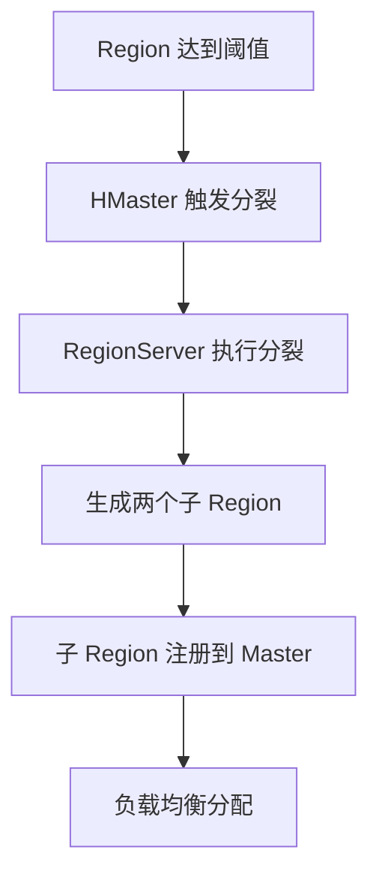
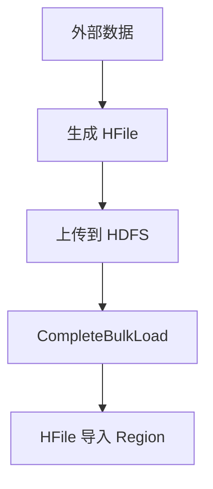
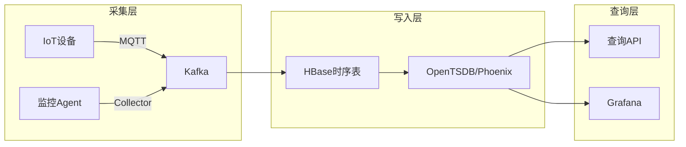
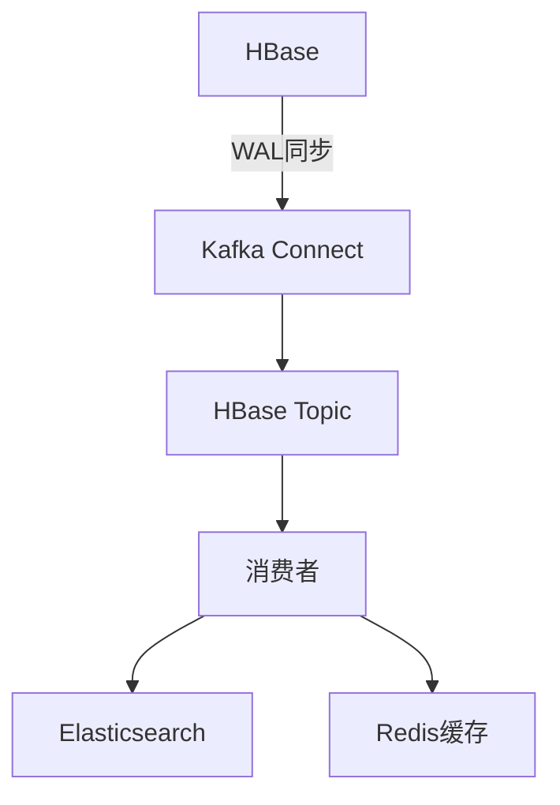
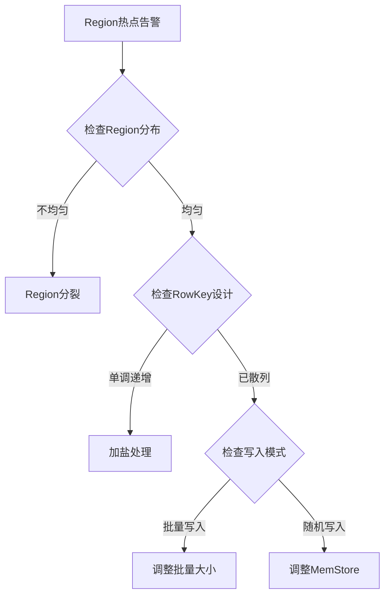

# HBase（列式 NoSQL / 海量随机读写）

> HBase 是 Hadoop 生态的**列式 NoSQL 数据库**，基于 HDFS 实现海量数据的随机读写。相比 Cassandra（AP）、MongoDB（文档），HBase 以**强一致 + 列族存储 + 与 Hadoop 生态原生集成**成为大数据实时访问首选。本篇按「解决的问题 → 原理 → 特性 → 选型关注点」拆解。

---

## 一、要解决的问题

| 痛点 | 说明 |
|------|------|
| 海量数据随机读写 | MySQL 单表亿级性能骤降，需要水平扩展的随机读写 |
| 列稀疏 | 每行列数不同（如用户属性），关系库 NULL 浪费 |
| 与 Hadoop 集成 | 数据在 HDFS 上，需要实时访问而非离线批处理 |
| 强一致 | 金融/订单场景需要强一致读写 |
| 时序数据 | IoT/监控数据写入量大，需要高吞吐写入 |
| 多版本 | 需要保留历史版本（如审计/回溯） |

> 核心认知：**HBase = HDFS 上的 Bigtable**——列式存储 + LSM 树 + 强一致，适合海量随机读写。

---

## 二、HBase 核心原理

### 2.1 架构

```
Client → ZooKeeper（元数据/协调）
  ├── HMaster（主节点）
  │   ├── 元数据管理（Table/Region 分配）
  │   ├── RegionServer 负载均衡
  │   └── DDL 操作（建表/删表/修改列族）
  └── RegionServer（工作节点）
      ├── Region（表的分片，按 RowKey 范围切分）
      │   ├── MemStore（内存写缓冲，每个列族一个）
      │   ├── StoreFile/HFile（磁盘文件，LSM 树）
      │   └── BlockCache（读缓存）
      ├── WAL（Write-Ahead Log，写前日志，防丢）
      └── Flush/Compaction（刷写/合并）
```

### 2.2 数据模型

```
Table（表）
  └── Row（行，由 RowKey 唯一标识）
       └── Column Family（列族，物理存储单元，建议 1~3 个）
            └── Column Qualifier（列限定符，动态添加）
                 └── Cell（单元格）
                      ├── Value（值）
                      ├── Timestamp（时间戳，多版本）
                      └── Type（Put/Delete）

Cell = (RowKey, CF:Qualifier, Timestamp) → Value
```

| 概念 | 说明 |
|------|------|
| 表（Table） | 逻辑表 |
| 行（Row） | 由 RowKey 唯一标识，按字典序排列 |
| 列族（Column Family） | 物理存储单元（列族单独存储，建议 1~3 个） |
| 列限定符（Qualifier） | 列族下的具体列（动态添加） |
| 时间戳（Timestamp） | 多版本（默认保留 3 版本） |
| 单元格（Cell） | `(RowKey, ColumnFamily:Qualifier, Timestamp) → Value` |

**选型关注点**：列族设计是 HBase 核心——列族过多 → Flush/Compaction 压力大（建议 1~3 个）。

### 2.3 LSM 树（写优化）

```
写入流程：
  Client → ZK → RegionServer
    → WAL（防丢）
    → MemStore（内存有序，按列族分离）
    → 返回成功

后台异步：
  MemStore 满 → Flush 到 HFile（磁盘有序文件）
  HFile 过多 → Compaction（合并小文件为大文件）
    ├── Minor Compaction（合并相邻小文件，保留所有版本）
    └── Major Compaction（合并整个列族，清理删除/过期版本）
```

**选型关注点**：LSM 树写优化（顺序写），但读可能访问多个 HFile（需 BloomFilter + BlockCache 优化）。

### 2.4 读写流程

| 操作 | 流程 |
|------|------|
| 写 | ZK → 找 RegionServer → 写 WAL → 写 MemStore → 返回成功 |
| 读 | ZK → 找 RegionServer → BlockCache → MemStore → HFile（BloomFilter 过滤）→ 合并多版本返回 |
| Scan | 类似读，但逐行扫描（支持 RowKey 范围/列族/时间戳过滤） |

### 2.5 Region 分裂与负载均衡

| 机制 | 说明 |
|------|------|
| 分裂 | Region 大小超阈值（默认 10GB）→ 一分为二 |
| 负载均衡 | HMaster 自动将热点 Region 迁移到空闲 RegionServer |
| 预分裂 | 建表时预分配 Region（避免写入热点） |
| 合并 | 空闲 Region 自动合并（减少 Region 数量） |

**选型关注点**：RowKey 设计避免热点（如时间戳开头 → 写热点在最新 Region），常用哈希/盐值打散。

---

## 三、HBase 特性

| 特性 | 说明 |
|------|------|
| 强一致 | 单行强一致（CP 系统） |
| 水平扩展 | Region 自动分裂，线性扩展 |
| 列稀疏 | 每行列数不同，NULL 不占空间 |
| 多版本 | 时间戳多版本（可配置保留数） |
| TTL | 自动过期（按列族/单元格） |
| 与 Hadoop 集成 | HDFS 存储、MapReduce/Spark 读写 |
| 协处理器 | Observer/Endpoint（类似存储过程） |
| 二级索引 | Phoenix（SQL on HBase） |
| 布隆过滤器 | BloomFilter（减少无效读） |
| 限流 | 读写限流（防热点） |

---

## 四、HBase vs Cassandra vs MongoDB vs TiDB

| 维度 | HBase | Cassandra | MongoDB | TiDB |
|------|-------|-----------|---------|------|
| 一致性 | 强一致（CP） | 最终一致（AP） | 可调 | 强一致（CP） |
| 数据模型 | 列式（Bigtable） | 宽列（Bigtable） | 文档（JSON） | 关系型（MySQL 协议） |
| 读写 | 随机读写 | 写优化 | 读写均衡 | 读写均衡 |
| SQL | 无（Phoenix 支持） | CQL（类 SQL） | 类 SQL | MySQL 协议 |
| 事务 | 单行事务 | 轻量级事务 | 多文档事务 | 分布式事务 |
| 生态 | Hadoop 生态 | 独立 | 独立 | 独立 |
| 延迟 | 毫秒 | 毫秒 | 毫秒 | 毫秒 |
| 吞吐 | 高 | 最高 | 高 | 高 |
| 适用 | 海量随机读写 | 写多读少/多数据中心 | 灵活 Schema | 分布式关系库 |

**选型关注点**：
- 海量随机读写 + Hadoop 生态 → **HBase**
- 写多读少 + 多数据中心 → **Cassandra**
- 灵活 Schema + 文档模型 → **MongoDB**
- 分布式关系库 + MySQL 兼容 → **TiDB**

---

## 五、HBase 生产实践

### 5.1 RowKey 设计原则

| 原则 | 说明 | 示例 |
|------|------|------|
| 唯一性 | 唯一标识一行 | — |
| 散列性 | 避免热点（哈希/盐值/反转） | `md5(userId)` |
| 长度 | 越短越好（建议 16~64 字节） | — |
| 有序性 | 有序存储（范围查询友好） | — |

### 5.2 常见设计

| 场景 | RowKey 设计 | 说明 |
|------|-------------|------|
| 用户行为 | `hash(userId)_userId_timestamp` | 哈希打散 + 时间范围 |
| 订单 | `hash(orderId)_orderId` | 哈希打散 |
| 时序数据 | `metric_hash(deviceId)_reverseTimestamp` | 倒序时间（最新在前） |
| 日志 | `hash(service)_reverseTimestamp` | 按服务哈希 + 时间倒序 |

### 5.3 调优

| 调优维度 | 建议 |
|----------|------|
| 内存 | MemStore 20~40%，BlockCache 20~40% |
| Compaction | 关闭自动 Major Compaction（低峰期手动触发） |
| BloomFilter | 开启（减少无效读） |
| 预分裂 | 建表时预分配 Region |
| 批量写 | Put 批量（Table.put(List<Put>)） |
| 批量查 | Scan 批量 + 设置合理 caching |
| 缓存 | BlockCache + LRU 缓存热点数据 |
| 并发 | 多线程并发读写（Connection 对象复用） |

### 5.4 常见坑

| 问题 | 原因 | 解决 |
|------|------|------|
| 写热点 | RowKey 有序（如时间戳开头） | 哈希/盐值打散 |
| 读放大 | HFile 过多 | 减少列族 + BloomFilter + Compaction |
| 写放大 | Minor Compaction 频繁 | 调整触发条件 |
| Region 过大 | 单 Region 数据量大 | 预分裂 + 调整阈值 |
| Full GC | 堆内存过大 | 调整 JVM 参数 + 拆分堆 |

---

## 六、选型速查

| 需求 | 首选 | 备选 |
|------|------|------|
| 海量随机读写 + Hadoop | HBase | Cassandra |
| 写多读少 | Cassandra | HBase |
| 灵活 Schema | MongoDB | — |
| 分布式关系库 | TiDB | Spanner |
| 时序数据 | HBase/OpenTSDB | TDengine/InfluxDB |
| 二级索引 | Phoenix on HBase | ES |

---

## 七、HBase Region 分裂策略

### 7.1 分裂策略对比

| 策略 | 说明 | 适用场景 |
|------|------|----------|
| ConstantSizeRegionSplitPolicy | 固定大小分裂 | 默认策略 |
| IncreasingToUpperBoundRegionSplitPolicy | 上限递增分裂 | 新表/自动分裂 |
| KeyPrefixRegionSplitPolicy | 前缀分裂 | 前缀设计的表 |
| DisabledRegionSplitPolicy | 禁用分裂 | 预分裂表 |

### 7.2 分裂流程



### 7.3 分裂配置

```xml
<!-- hbase-site.xml -->
<property>
  <name>hbase.hregion.max.filesize</name>
  <value>10737418240</value> <!-- 10GB -->
</property>
<property>
  <name>hbase.hregion.split.algorithm</name>
  <value>IncreasingToUpperBoundRegionSplitPolicy</value>
</property>
```

### 7.4 预分裂（Pre-split）

```bash
# 建表时预分裂
create 'table_name', 'cf', SPLITS => ['10', '20', '30', '40']

# 按文件预分裂
create 'table_name', 'cf', {NUMREGIONS => 15, SPLITALGO => 'HexStringSplit'}
```

### 7.5 分裂最佳实践

| 实践 | 说明 |
|------|------|
| RowKey 哈希打散 | 避免分裂热点 |
| 预分裂 | 避免首次分裂延迟 |
| 合理阈值 | 10GB 适合大多数场景 |
| 监控 Region 数 | 避免过多 Region |

---

## 八、HBase Compaction 机制

### 8.1 Minor Compaction

```
触发条件：
  HFile 数量达到阈值（默认 3）
  相邻小 HFile 合并

特点：
  速度快（合并小文件）
  不删除数据（保留所有版本）
  不删除标记（Delete 标记保留）
  后台异步执行

配置：
  hbase.hstore.compactionThreshold: 3（触发阈值）
  hbase.hstore.compaction.max: 10（单次最大合并数）
```

### 8.2 Major Compaction

```
触发条件：
  手动触发（major_compact 命令）
  自动触发（默认 7 天）

特点：
  合并整个列族的所有 HFile
  删除过期版本
  删除 Delete 标记
  IO 开销大（生产低峰期执行）

配置：
  hbase.hstore.compaction.throughput.lower.bound: 20MB/s
  hbase.hstore.compaction.throughput.higher.limit: 200MB/s
```

### 8.3 Compaction 调优

| 参数 | 说明 | 建议 |
|------|------|------|
| `hbase.hstore.compactionThreshold` | 触发阈值 | 3~6 |
| `hbase.hstore.compaction.max` | 单次最大合并数 | 10~20 |
| `hbase.hstore.compaction.max.size` | 单文件最大大小 | 100MB |
| `hbase.region.compacting.lowthroughput.limit` | 低吞吐限速 | 2MB/s |

### 8.4 Compaction 监控

```
监控指标：
  Compaction 队列长度（是否积压）
  Compaction 速率（MB/s）
  HFile 数量（是否过多）
  IO 使用率（磁盘负载）

告警：
  队列积压 > 阈值 → 告警
  IO 使用率 > 80% → 限速
```

---

## 九、HBase Bloom Filter

### 9.1 Bloom Filter 类型

| 类型 | 说明 | 适用 |
|------|------|------|
| ROW | 按 RowKey 过滤 | 随机读 |
| ROWCOL | 按 RowKey + Column 过滤 | 精确列读 |

### 9.2 Bloom Filter 原理

```
写入时：
  RowKey → Hash 函数 → 多个位设置为 1
  存储在 HFile 的元数据中

读取时：
  RowKey → Hash 函数 → 检查对应位
  全部为 1 → 可能存在（需进一步检查）
  任一为 0 → 一定不存在（直接跳过）

误判率：
  默认 1%（0.01）
  可配置：0.001~0.1
  越小 → 占用空间越大
```

### 9.3 Bloom Filter 配置

```bash
# 建表时启用
create 'table_name', {NAME => 'cf', BLOOMFILTER => 'ROW'}

# 查看 Bloom Filter 信息
hbase org.apache.hadoop.hbase.io.hfile.HFileMain
```

### 9.4 Bloom Filter 效果

| 场景 | 无 Bloom Filter | 有 Bloom Filter |
|------|-----------------|-----------------|
| 随机读 | 可能读多个 HFile | 跳过不存在的 HFile |
| 无效读比例 | 100% | 降低到 1~5% |
| 读放大 | 严重 | 大幅减少 |

---

## 十、HBase Coprocessor

### 10.1 协处理器类型

| 类型 | 说明 | 示例 |
|------|------|------|
| Observer | 类似触发器/拦截器 | 审计/二级索引 |
| Endpoint | 类似存储过程 | 聚合/计算 |

### 10.2 Observer 协处理器

```
触发时机：
  Before/After Get/Put/Scan/Delete

使用场景：
  二级索引维护（写入时同步更新索引）
  审计日志（记录所有写操作）
  权限控制（请求前检查权限）
  数据验证（写入前校验）

示例：
  协处理器在 Put 时自动更新二级索引表
```

### 10.3 Endpoint 协处理器

```
触发时机：
  客户端主动调用

使用场景：
  服务端聚合（减少数据传输）
  复杂计算（服务端执行）
  自定义 API（封装业务逻辑）

示例：
  客户端调用 endpoint → 服务端计算聚合值 → 返回结果
  避免全表扫描
```

### 10.4 协处理器配置

```bash
# 加载协处理器
alter 'table_name', {NAME => 'cf', coprocessor => 'com.example.IndexObserver|1001|'}

# 卸载协处理器
alter 'table_name', {NAME => 'cf', coprocessor => ''}
```

---

## 十一、HBase Bulk Load

### 11.1 原理



### 11.2 使用场景

| 场景 | 说明 |
|------|------|
| 大批量导入 | 百万/亿级数据导入 |
| 数据迁移 | 从其他系统迁移数据 |
| 定时批量更新 | 夜间批量更新数据 |

### 11.3 Bulk Load 配置

```java
// MapReduce 生成 HFile
Job job = Job.getInstance(conf);
job.setMapperClass(MyMapper.class);
job.setOutputKeyClass(ImmutableBytesWritable.class);
job.setOutputValueClass(KeyValue.class);
job.setOutputFormatClass(HFileOutputFormat2.class);

// 导入 HFile
LoadIncrementalHFile loader = new LoadIncrementalHFile(conf);
loader.doBulkLoad(new Path("/hfiles"), table);
```

### 11.4 vs 正常写入

| 维度 | 正常写入 | Bulk Load |
|------|----------|-----------|
| 速度 | 慢（WAL + MemStore） | 快（直接写 HFile） |
| 资源 | 消耗 RegionServer IO | 消耗 MapReduce 资源 |
| 副作用 | 可能触发 Compaction | 无 |
| 适用 | 实时写入 | 批量导入 |

---

## 十二、HBase vs Cassandra vs Bigtable

| 维度 | HBase | Cassandra | Bigtable |
|------|-------|-----------|----------|
| 一致性 | 强（CP） | 最终（AP） | 强（CP） |
| 数据模型 | 列式（Bigtable） | 宽列 | 列式（Bigtable） |
| 架构 | HDFS + Master | P2P（无中心） | Google 内部 |
| 写优化 | LSM-Tree | LSM-Tree | LSM-Tree |
| 读优化 | BloomFilter + BlockCache | 布隆过滤器 | BloomFilter |
| 生态 | Hadoop | 独立 | Google Cloud |
| 运维 | 复杂 | 中等 | 托管 |
| 适用 | Hadoop 生态 | 多数据中心 | Google Cloud |

**选型决策**：
- Hadoop 生态 + 强一致 → HBase
- 多数据中心 + 高可用 → Cassandra
- Google Cloud → Bigtable

---

## 十三、HBase 时序数据场景

### 13.1 时序数据特点

```
写入模式：
  高吞吐顺序写（时间戳递增）
  近期数据写入频繁
  历史数据很少读取

存储挑战：
  数据量大（每天 TB 级）
  需要高效写入
  冷热数据分离
```

### 13.2 RowKey 设计

```
时序数据 RowKey：
  metric_hash(deviceId) + reverseTimestamp

示例：
  原始数据：温度=25, 时间=2026-08-24 10:00:00
  RowKey：md5("temperature")_md5("device1")_9999999999999999 - 时间戳

倒序时间戳：
  Long.MAX_VALUE - timestamp
  → 最新数据排在最前（Scan 高效）
```

### 13.3 冷热分离

```bash
# 按时间分区（不同 CF）
# 热数据 CF：最近 7 天
# 冷数据 CF：7 天前

# TTL 自动过期
alter 'sensor_data', {NAME => 'hot', TTL => 604800}
alter 'sensor_data', {NAME => 'cold', TTL => 7776000}
```

---

## 十四、HBase 安全

### 14.1 ACL 权限控制

```bash
# 授权
grant 'user1', 'RWXCA', 'table_name'

# 权限说明
R - 读
W - 写
X - 执行
C - 创建
A - 管理

# 查看权限
user_access 'user1'
```

### 14.2 配置认证

```xml
<!-- 启用 Kerberos -->
<property>
  <name>hbase.security.authentication</name>
  <value>kerberos</value>
</property>
<property>
  <name>hbase.security.authorization</name>
  <value>true</value>
</property>
```

### 14.3 数据加密

```xml
<!-- 传输加密 -->
<property>
  <name>hbase.rpc.protection</name>
  <value>privacy</value>
</property>

<!-- 存储加密 -->
<property>
  <name>hbase.crypto.key.provider</name>
  <value>org.apache.hadoop.hbase.crypto.KeyProvider</value>
</property>
```

### 14.4 安全最佳实践

| 实践 | 说明 |
|------|------|
| 启用 Kerberos | 集群认证 |
| ACL 最小权限 | 按用户/表授权 |
| RPC 加密 | 传输层加密 |
| 审计日志 | 记录所有操作 |
| 网络隔离 | VPC/防火墙 |

---

## 十五、与其他板块的关系

- 大数据存储见「[基础知识/大数据](../大数据/README.md)」；
- NoSQL 对比见「[MongoDB](./MongoDB.md)」；
- NewSQL 见「[TiDB 与 NewSQL](./TiDB与NewSQL.md)」；
- 时序数据库见「[时序库](../时序库/README.md)」；
- 云上数据库见「[云上数据库与缓存生态](./云上数据库与缓存生态.md)」。

---

## 六、HBase 生产配置清单

### 6.1 hbase-site.xml 关键配置

```xml
<!-- 内存配置 -->
<property>
  <name>hbase.regionserver.global.memstore.size</name>
  <value>0.4</value>
</property>
<property>
  <name>hfile.block.cache.size</name>
  <value>0.4</value>
</property>

<!-- Compaction 配置 -->
<property>
  <name>hbase.hstore.compactionThreshold</name>
  <value>3</value>
</property>
<property>
  <name>hbase.hstore.compaction.max</name>
  <value>10</value>
</property>

<!-- Region 配置 -->
<property>
  <name>hbase.hregion.max.filesize</name>
  <value>10737418240</value> <!-- 10GB -->
</property>
```

### 6.2 监控指标

```
关键监控：
  RegionServer 数量（健康状态）
  Region 数量（分布是否均匀）
  MemStore 大小（是否接近 flush 阈值）
  BlockCache 命中率（>80% 正常）
  Compaction 队列长度（是否积压）
  读写延迟（P99 < 10ms）
  GC 频率和时长
```

### 6.3 备份与恢复

| 方案 | 说明 |
|------|------|
| Snapshot | HBase 快照（秒级创建，不阻塞读写） |
| ExportTable | 导出到 HDFS（全量备份） |
| Replication | 跨集群复制（实时备份） |
| Restore | 从快照恢复（秒级） |

---

## 七、HBase Shell 常用命令

```bash
# 表管理
create 'table_name', {NAME => 'cf', VERSIONS => 3}
disable 'table_name'
drop 'table_name'
describe 'table_name'

# 数据操作
put 'table_name', 'rowkey', 'cf:qualifier', 'value'
get 'table_name', 'rowkey'
scan 'table_name', {STARTROW => 'rowkey1', STOPROW => 'rowkey2'}
delete 'table_name', 'rowkey', 'cf:qualifier'
deleteall 'table_name', 'rowkey'

# 管理操作
major_compact 'table_name'
flush 'table_name'
compact 'table_name'
balance_switch true
```

### 7.1 Phoenix SQL on HBase

```sql
-- 创建表
CREATE TABLE us_population (
  state CHAR(2) NOT NULL,
  city VARCHAR NOT NULL,
  population BIGINT,
  PRIMARY KEY (state, city)
);

-- 查询
SELECT * FROM us_population WHERE state = 'NY';

-- 二级索引
CREATE INDEX idx_population ON us_population (population DESC);
```

---

## 十六、BloomFilter 类型与选型

### 16.1 BloomFilter 类型对比

| 类型 | 误判率 | 空间占用 | 适用场景 |
|------|--------|----------|----------|
| ROW | 低 | 中 | 行级查询 |
| ROWCOL | 最低 | 高 | 行+列级查询 |
| ROWPREFIX | 中 | 低 | 前缀扫描 |
| ROWCOLPREFIX | 低 | 中 | 行+列前缀 |

```bash
# 创建带 BloomFilter 的表
create 't1', {NAME => 'cf', BLOOMFILTER => 'ROWCOL'}

# 查看 BloomFilter 状态
hbase org.apache.hadoop.hbase.io.hfile.HFile
```

## 十七、Compaction 调度器

### 17.1 Compaction 类型

```text
Minor Compaction：
  - 合并小 HFile 为大 HFile
  - 不删除数据
  - 触发条件：hbase.hstore.compactionThreshold（默认3）

Major Compaction：
  - 合并所有 HFile 为一个
  - 删除过期/删除标记数据
  - 触发条件：hbase.hstore.compaction.max.large（默认10GB）
  - 建议：低峰期执行
```

### 17.2 Compaction 调优

```xml
<!-- hbase-site.xml -->
<property>
  <name>hbase.hstore.compactionThreshold</name>
  <value>3</value>
</property>
<property>
  <name>hbase.hstore.compaction.max</name>
  <value>10</value>
</property>
<property>
  <name>hbase.regionserver.thread.compaction.large</name>
  <value>2</value>
</property>
<property>
  <name>hbase.regionserver.thread.compaction.small</name>
  <value>3</value>
</property>
```

## 十八、Coprocessor 协处理器

### 18.1 协处理器类型

| 类型 | 作用 | 执行位置 |
|------|------|----------|
| Endpoint | 自定义RPC | RegionServer |
| Observer | 监听表事件 | RegionServer |
| Aggregate | 聚合计算 | RegionServer |

### 18.2 使用示例

```java
// Observer：自动添加时间戳
public class IncreasingAgeObserver extends BaseRegionObserver {
    @Override
    public void prePut(ObserverContext<RegionCoprocessorEnvironment> e,
                       Put put, WALEdit edit, Durability durability) {
        byte[] row = put.getRow();
        byte[] value = put.get(Bytes.toBytes("cf"), Bytes.toBytes("age"));
        if (value != null) {
            long age = Bytes.toLong(value) + 1;
            put.addColumn(Bytes.toBytes("cf"), Bytes.toBytes("age"), Bytes.toBytes(age));
        }
    }
}
```

## 十九、BulkLoad 批量导入

```bash
# 使用 Spark 生成 HFile
spark-submit --class org.apache.hadoop.hbase.spark.HBaseBulkLoad \
  --master yarn \
  hbase-bulkload.jar \
  -t table_name \
  -f /tmp/hfiles

# 导入 HFile 到 HBase
hbase org.apache.hadoop.hbase.tool.LoadIncrementalHFile \
  /tmp/hfiles table_name
```

## 二十、Phoenix 二级索引

### 20.1 索引类型

| 类型 | 语法 | 适用 |
|------|------|------|
| 全局索引 | `CREATE INDEX idx ON t(col)` | 读多写少 |
| 本地索引 | `CREATE LOCAL INDEX idx ON t(col)` | 写多读少 |
| 覆盖索引 | `INCLUDE(col2)` | 避免回表 |
| 函数索引 | `CREATE INDEX idx ON t(UPPER(col))` | 函数查询 |

```sql
-- 全局索引
CREATE INDEX idx_name ON users (name DESC) INCLUDE (email, phone);

-- 本地索引
CREATE LOCAL INDEX idx_status ON orders (status);

-- 查询自动使用索引
SELECT name, email FROM users WHERE name = 'John';
```

---

## HBase BloomFilter 三种类型

### ROW / ROWCOL / PREFIX 误判率对比

| 类型 | 过滤粒度 | 存储开销 | 误判率建议 | 适用场景 |
|------|----------|----------|------------|----------|
| ROW | RowKey | 低 | 1% | 精确 RowKey 查询 |
| ROWCOL | RowKey + Column | 中 | 0.1% | RowKey + 列族查询 |
| PREFIX | RowKey 前缀 | 低 | 1% | 前缀匹配查询 |

```xml
<!-- 在 HBase Shell 中设置 -->
create 't1', {NAME => 'f1', BLOOMFILTER => 'ROW'}
create 't1', {NAME => 'f1', BLOOMFILTER => 'ROWCOL'}
create 't1', {NAME => 'f1', BLOOMFILTER => 'PREFIX', PREFIX_LENGTH => 8}
```

```text
选择决策：
  1. 单 RowKey Get 查询 → ROW（默认最佳）
  2. RowKey + 列族 Get 查询 → ROWCOL（减少不必要的磁盘 IO）
  3. RowKey 前缀 Scan → PREFIX（减少扫描范围）
  4. 写密集场景 → 慎用 ROWCOL（每个列都会写布隆过滤器）
```

## Compaction 调度器参数详解

| 参数 | 默认值 | 说明 |
|------|--------|------|
| hbase.hstore.compactionThreshold | 3 | 触发 minor compaction 的最小文件数 |
| hbase.hstore.compactionMax | 10 | 单次 minor compaction 最大文件数 |
| hbase.hstore.compaction.maxSize | Long.MAX_VALUE | 不参与 compaction 的最大文件大小 |
| hbase.hstore.compaction.minSize | 2MB | 参与 compaction 的最小文件大小 |
| hbase.hstore.majorcompaction.period | 7天 | major compaction 周期 |
| hbase.hstore.blockingStoreFiles | 16 | 阻塞写入的文件数阈值 |

```text
Compaction 策略：
  Minor：合并小文件，不清除删除标记，不回收空间
  Major：全量合并，清除删除/过期数据，回收空间

生产建议：
  - Major Compaction 设在低峰期（凌晨2-4点）
  - 合理设置 hbase.hstore.compactionThreshold 避免频繁触发
  - 监控 StoreFile 数量，>10 需关注
```

## Coprocessor 触发类型

### Observer（观察者）

```java
// 代码示例：RegionObserver
public class AccessObserver extends BaseRegionObserver {
    @Override
    public void preGetOp(Region region, Get get, List<Cell> results)
            throws IOException {
        // 在 Get 操作前执行
        // 可用于权限校验、日志记录
    }
}

// 协处理器加载
alter 't1', {NAME => 'f1', COPROCESSOR =>
    'com.example.AccessObserver|1001|'}
```

### Endpoint（端点）

```java
// 代码示例：协处理器接口
public interface CounterProtocol extends CoprocessorProtocol {
    long incrementCounter(byte[] row, byte[] family, byte[] qualifier)
            throws IOException;
}

// 服务端实现
public class CounterEndpoint extends BaseEndpointServer
        implements CounterProtocol {
    @Override
    public long incrementCounter(byte[] row, byte[] family,
            byte[] qualifier) throws IOException {
        // 在 Region 服务器上执行聚合逻辑
        return 0;
    }
}

// 客户端调用
RegionMetricsClient client = table.coprocessorProxy(
    CounterProtocol.class, Bytes.toBytes("row"));
long count = client.incrementCounter(row, family, qualifier);
```

## Bulk Load 流程

### GenerateHFile + CompleteBulkLoad

```text
流程：
  1. 生成 HFile：
     将数据转换为 HFile 格式（不经过 RegionServer）
     使用 MapReduce/Spark 生成 HFiles
  
  2. 完成导入：
     将 HFiles 移动到 HBase 表的 Region 目录
     通过 CompleteBulkLoad API 完成

性能优势：
  - 不经过 RegionServer，不占用 Region 资源
  - 写入吞吐量提升 10-100 倍
  - 适合大批量数据导入
  - 不影响在线读写
```

```java
// MapReduce 生成 HFile
Job job = Job.getInstance(conf);
job.setMapperClass(ImportMapper.class);
job.setOutputKeyClass(ImmutableBytesWritable.class);
job.setOutputValueClass(KeyValue.class);
job.setOutputFormatClass(HFileOutputFormat2.class);
HFileOutputFormat2.configureIncrementalLoad(job, table);

// CompleteBulkLoad 导入
HFileOutputFormat2.configureIncrementalLoad(job, table);
BulkLoadHFiles loader = new BulkLoadHFiles(conf);
loader.bulkLoad(table.getName(), outputDir);
```

## Phoenix 二级索引

### Global Index vs Local Index

| 特性 | Global Index | Local Index |
|------|--------------|-------------|
| 存储位置 | 独立 HBase 表 | 与主表同 Region |
| 写入开销 | 高（需要跨 Region 更新） | 低（同 Region 更新） |
| 读取性能 | 高（直接查询索引表） | 中（需要过滤） |
| 适用场景 | 读多写少 | 写多读少 |
| 事务支持 | 支持 | 支持 |

```sql
-- Global Index
CREATE INDEX idx_user_name ON users (user_name)
    INCLUDE (email, phone);

-- Local Index
CREATE LOCAL INDEX idx_order_time ON orders (order_time);

-- 覆盖索引
CREATE INDEX idx_product ON orders (product_id)
    INCLUDE (amount, quantity);
```

## HBase Region Split 策略与热点预防

### Split 策略

| 策略 | 说明 | 适用场景 |
|------|------|----------|
| ConstantSizeRegionSplitPolicy | 固定大小触发分裂 | 通用 |
| DelimitedKeyPrefixRegionSplitPolicy | 按前缀分裂 | 避免热点 |
| KeyPrefixRegionSplitPolicy | 按 KeyPrefix 分裂 | 前缀明确的场景 |
| DisableSplitPolicy | 禁用自动分裂 | 手动管理 |

### 热点预防

```text
RowKey 设计原则：
  1. 避免单调递增（时间戳开头）→ 加盐/反转
  2. 散列前缀：MD5(rowkey).substring(0, 4) + rowkey
  3. 反转时间戳：Long.MAX_VALUE - timestamp
  4. 盐值：rowkey + random(0-9)

示例：
  原始：20240101000001 → 单 Region 热点
  加盐：3_20240101000001 → 分散到 10 个 Region
```

> 一句话：**HBase = HDFS 上的 Bigtable + LSM 树写优化 + 列族存储 + 强一致；选型先看「生态（Hadoop→HBase，独立→Cassandra）」，再定「RowKey 设计（散列/有序/短）」，最后调「内存/Compaction/BloomFilter」**。

## HBase 时序数据存储方案



### 时序数据 RowKey 设计

```
设计模式：[metric][timestamp][tags]
示例：
  cpu.usage.20240101000001.host01
  压缩：用字典编码压缩 metric 和 tags
  散列：metric 前缀加 MD5 防止热点
```

| 设计要素 | 方案 | 优势 |
|----------|------|------|
| metric | 字典编码 | 减少存储 |
| timestamp | Long.MAX - ts | 降序扫描 |
| tags | 拼接+哈希 | 支持多维度查询 |
| TTL | 分区级TTL | 自动清理历史数据 |

## HBase 二级索引方案

```java
// Phoenix 二级索引示例
CREATE INDEX idx_user_name ON user_table (user_name)
    INCLUDE (email, phone);

// 查询自动使用索引
SELECT * FROM user_table WHERE user_name = '张三';
```

### 二级索引方案对比

| 方案 | 实现方式 | 一致性 | 性能影响 |
|------|----------|--------|----------|
| Phoenix 二级索引 | 协处理器+索引表 | 强一致 | 写入降20% |
| SALB 索引 | 应用层双写 | 最终一致 | 写入降30% |
| Coprocessor 索引 | 自定义协处理器 | 强一致 | 写入降15% |
| ES 二级索引 | 外部ES+同步 | 最终一致 | 增加复杂度 |

## HBase + Kafka 数据同步



### 同步方案对比

| 方案 | 实时性 | 数据一致性 | 复杂度 |
|------|--------|------------|--------|
| WAL + Kafka Connect | 秒级 | 最终一致 | 低 |
| Coprocessor + Producer | 秒级 | 最终一致 | 中 |
| Phoenix + 触发器 | 秒级 | 强一致 | 中 |
| Binlog（Talend） | 分钟级 | 最终一致 | 低 |

## Region 热点诊断与处理



### 热点处理命令

```bash
# 查看Region热点
hbase shell
status 'simple'
table_description 'user_table'
scan 'hbase:meta', {COLUMNS => ['info:regioninfo']}

# 手动分裂Region
split 'user_table', 'user_table,abc123,1234567890'

# 触发Region平衡
balancer_switch true
balancer
```

## HBase 集群监控指标

| 指标分类 | 指标名 | 告警阈值 | 处理方案 |
|----------|--------|----------|----------|
| 写入 | MemStore大小 | > 128MB | 调整flush间隔 |
| 写入 | BlockCache命中率 | < 80% | 增大BlockCache |
| 读取 | Get延迟 | > 100ms | 检查Region分布 |
| 读取 | Scan延迟 | > 1s | 优化扫描范围 |
| 存储 | StoreFile大小 | > 10GB | 触发Compaction |
| 存储 | HFile数量 | > 100 | 触发Major Compaction |
| Region | 热点Region数 | > 3 | 检查RowKey设计 |
| Region | 分裂失败数 | > 0 | 检查HDFS状态 |

### Prometheus + Grafana 监控配置

```yaml
# Prometheus 配置 HBase Exporter
scrape_configs:
  - job_name: 'hbase'
    static_configs:
      - targets: ['hbase-regionserver:9100']
    metrics_path: /metrics
```
