# Jaeger（分布式链路追踪 / 云原生追踪）

> Jaeger 是 CNCF 毕业的**分布式链路追踪系统**，源自 Uber 开源，以「分布式上下文传播 + 采样 + 存储 + 可视化」成为云原生追踪事实标准（OpenTelemetry 后端）。相比 Zipkin（轻量但功能少）、SkyWalking（APM 全栈但重），Jaeger 以**专注追踪 + OpenTelemetry 原生支持**独树一帜。本篇按「解决的问题 → 原理 → 特性 → 选型关注点」拆解。

---

## 一、要解决的问题

| 痛点 | 说明 |
|------|------|
| 调用链看不清 | 请求经过 10 个服务，哪个慢？哪个错？ |
| 上下文传播 | 跨进程/跨线程/跨 MQ 如何串联？ |
| 采样难题 | 全量追踪存储成本高，不采样找不到问题 |
| 与 OpenTelemetry 集成 | OTel 已成为事实标准，追踪后端需原生支持 |
| 性能归因 | 延迟高，哪个环节是瓶颈？ |
| 错误定位 | 报错信息分散在多个服务，如何串联？ |
| 依赖分析 | 服务间调用关系复杂，如何可视化？ |

> 核心认知：**Jaeger = OpenTelemetry 原生后端**——OTel 采集的 trace 直接写 Jaeger，无需额外转换。

---

## 二、Jaeger 核心原理

### 2.1 架构

```
应用（OpenTelemetry SDK 埋点）
  ├── OTLP（OpenTelemetry Protocol）
  ├── Jaeger Thrift（兼容旧版）
  └── Zipkin Thrift（兼容 Zipkin）

Jaeger Agent（可选，边车/SDK 内嵌）
  ├── 接收 trace
  ├── 批量转发到 Collector
  └── 采样策略下发

Jaeger Collector（收集器）
  ├── 接收 trace（gRPC/HTTP）
  ├── 预处理（校验/丰富/采样）
  └── 写入存储

Jaeger Query（查询服务）
  ├── 查询 trace（按 traceID/服务/操作/标签）
  └── UI（依赖图/时间线/对比）

存储后端
  ├── Cassandra（大规模）
  ├── Elasticsearch（推荐，与日志联动）
  ├── Kafka（缓冲，异步写入存储）
  ├── ClickHouse（高性能分析）
  └── 内存（开发测试）
```

### 2.2 核心概念

| 概念 | 说明 |
|------|------|
| Trace | 一次完整请求的调用链（由 Span 组成） |
| Span | 调用链中的一个工作单元（一次 RPC/一次 DB 查询） |
| Span Context | 上下文（traceID/spanID/父 spanID/采样标志） |
| Tag | Span 的标签（KV 对，用于查询） |
| Log | Span 的时间线日志（事件+时间戳） |
| Baggage | 跨 Span 的 KV 上下文（类似 HTTP Header 传播） |
| Reference | Span 间关系（ChildOf / FollowsFrom） |

### 2.3 上下文传播（W3C Trace Context）

```
请求方 → traceparent: 00-{traceID}-{spanID}-01
       → tracestate: 自定义状态

接收方 → 解析 traceparent → 提取 traceID
       → 创建新 span，parentSpanID = 上游 spanID
       → 生成新的 traceparent 传给下游
```

**选型关注点**：W3C Trace Context 是事实标准，保证跨语言/跨系统的上下文传播兼容。

### 2.4 采样策略

| 策略 | 说明 | 适用场景 |
|------|------|----------|
| Head-based（头部采样） | 在入口决定采样，整条链一致 | 高吞吐（默认） |
| Tail-based（尾部采样） | 在尾部决定采样（先收再筛选） | 找慢请求/错误请求 |
| 概率采样 | 按比例（如 1%）随机采样 | 通用 |
| 限速采样 | 每秒最多 N 个 trace | 限流保护 |
| 属性采样 | 按属性（如错误=全部采样） | 错误优先 |
| 远程采样 | 从 Jaeger Agent 动态获取采样策略 | 灵活调整 |

**选型关注点**：高吞吐场景 → Head-based 概率采样；想找慢请求/错误 → Tail-based（Jaeger 支持）。

### 2.5 存储选型

| 存储 | 优势 | 劣势 | 适用场景 |
|------|------|------|----------|
| Cassandra | 高写入吞吐、线性扩展 | 运维复杂 | 大规模生产 |
| Elasticsearch | 丰富查询、与日志联动 | 资源消耗大 | 中大规模、日志联动 |
| ClickHouse | 高压缩、高查询性能 | 生态较新 | 高性能分析 |
| Kafka | 异步缓冲、削峰 | 需二次消费 | 高吞吐写入 |
| Memory | 最快 | 重启丢失 | 开发测试 |

---

## 三、Jaeger vs Zipkin vs SkyWalking

| 维度 | Jaeger | Zipkin | SkyWalking |
|------|--------|--------|------------|
| CNCF 状态 | 毕业项目 | 孵化中 | Apache 顶级 |
| 定位 | 专注追踪 | 轻量追踪 | APM 全栈（指标+日志+追踪） |
| 采集协议 | OTLP 原生 | Zipkin Thrift | 自有探针（字节码增强） |
| 语言支持 | 多语言（OTel SDK） | 多语言 | Java/.NET/Node/Go/PHP 等 |
| 存储 | ES/Cassandra/Kafka/ClickHouse | ES/Cassandra/内存 | ES/H2/MySQL/TiDB |
| 性能损耗 | 低（OTel SDK） | 低 | 中（字节码增强） |
| 无侵入 | 需 SDK 埋点 | 需 SDK 埋点 | Java 字节码增强（无侵入） |
| 指标 | 无（需配 Prometheus） | 无 | 有（内置） |
| 日志 | 无（配 ELK/Loki） | 无 | 有 |
| 拓扑图 | 有 | 有 | 有 |
| 告警 | 无（需配 Alertmanager） | 无 | 有 |
| 采样 | Head/Tail-based | Head-based | 固定比例 |

**选型关注点**：
- 云原生 + OpenTelemetry → **Jaeger**（OTel 原生后端）
- 轻量 + 快速上手 → **Zipkin**
- Java 生态 + 无侵入 + 全栈 APM → **SkyWalking**
- 混合语言栈 → **Jaeger**（OTel 多语言 SDK 最全）

---

## 四、OpenTelemetry + Jaeger（事实标准组合）

```
应用代码（Java/Go/Python/Node...）
  ├── OpenTelemetry SDK（自动埋点：HTTP/gRPC/DB/MQ）
  ├── OTel Collector（接收/处理/导出）
  │   ├── 接收：OTLP/Jaeger/Zipkin/Prometheus
  │   ├── 处理：采样/过滤/丰富/批量
  │   └── 导出：Jaeger/Prometheus/云厂商
  └── Jaeger（存储/查询/可视化）
```

**选型关注点**：OpenTelemetry 是可观测性的事实标准（采集层），Jaeger 是追踪后端之一。OTel Collector + Jaeger 是云原生追踪推荐组合。

---

## 五、Jaeger 生产部署

### 5.1 部署模式

| 模式 | 说明 |
|------|------|
| All-in-One | 二进制包含全部（开发测试） |
| 生产部署 | Collector + Query + ES/Cassandra |
| Kubernetes | Jaeger Operator（CRD 管理） |
| 托管服务 | AWS X-Ray / GCP Cloud Trace（非 Jaeger 但同功能） |

### 5.2 关键配置

| 配置 | 说明 |
|------|------|
| 采样率 | 生产通常 1%~10% |
| 存储 | ES 推荐（与日志联动查询） |
| 索引 | 按天滚动索引（便于清理） |
| 缓存 | Query 层缓存热点 trace |
| 安全 | TLS + 认证（生产必备） |

---

## 六、选型速查

| 需求 | 首选 | 备选 |
|------|------|------|
| 云原生追踪 | Jaeger + OTel | Zipkin |
| Java 无侵入 APM | SkyWalking | — |
| 轻量追踪 | Zipkin | Jaeger |
| 多云统一追踪 | Jaeger + OTel | Datadog APM |
| 与日志联动 | Jaeger + ELK/Loki | SkyWalking |
| 找慢请求 | Jaeger（Tail-based） | — |
| 错误追踪 | Jaeger + Alertmanager | — |

---

## Jaeger Agent/Collector/Query Architecture

### Agent 架构

```
Jaeger Agent = 边车/SDK 内嵌组件

部署模式：
  1. Sidecar 模式（K8s 每 Pod 一个 Agent）
  2. DaemonSet 模式（每节点一个 Agent）
  3. SDK 内嵌（应用内嵌 Agent）

功能：
  接收 SDK 发送的 Span（UDP/HTTP）
  本地批量聚合（减少网络开销）
  异步转发到 Collector
  采样策略下发（Remote Sampling）

配置：
  agent:
    collector:
      host: jaeger-collector
      port: 14267  # HTTP
      port_grpc: 14250  # gRPC
    sampling:
      server_url: http://jaeger-collector:5778
```

### Collector 架构

```
Jaeger Collector = 收集器（接收/处理/存储）

组件：
  ├── Receiver（接收 Span）
  │   ├── Jaeger Thrift Receiver
  │   ├── Zipkin Thrift Receiver
  │   └── OTLP Receiver（推荐）
  │
  ├── Processor（处理）
  │   ├── 采样判断（按策略决定是否存储）
  │   ├── Span 验证（校验 traceID/spanID）
  │   └── 丰富（添加 Pod/Node 信息）
  │
  └── Writer（写入存储）
      ├── Cassandra Writer
      ├── Elasticsearch Writer
      └── Kafka Writer（异步缓冲）

水平扩展：
  Collector 无状态 → 多实例水平扩展
  每个实例独立处理 → 无协调开销

配置：
  collector:
    num_workers: 50  # 处理线程数
    otel:
      exporter:
        endpoint: jaeger-collector:4317  # OTLP gRPC
```

### Query 架构

```
Jaeger Query = 查询服务

组件：
  ├── API Server（REST API）
  │   GET /api/traces/{traceID}
  │   GET /api/traces?service=xxx&operation=xxx
  │
  ├── 依赖图（Service Dependency Graph）
  │   基于 Span 统计 → 生成服务间调用关系图
  │
  └── UI（React 前端）
      Trace Timeline（时间线视图）
      Trace Comparison（对比视图）
      Service Dependency（依赖图）

性能优化：
  Query 缓存（热点 Trace）
  读写分离（Query 只读副本）
  索引优化（按时间/服务/操作建索引）
```

## Jaeger Sampling Strategies Deep

### 概率采样

```json
{
  "service_1": {
    "default_strategy": {
      "type": "probabilistic",
      "param": 0.01  // 1% 采样率
    },
    "operation_1": {
      "type": "probabilistic",
      "param": 1.0   // 100% 采样（关键接口）
    }
  }
}
```

### 限速采样

```json
{
  "service_1": {
    "default_strategy": {
      "type": "rateLimiting",
      "param": 100  // 每秒最多 100 个 trace
    }
  }
}
```

### 远程采样

```
远程采样 = Agent 从 Collector 动态获取采样策略

流程：
  1. Collector 暴露 /sampling API
  2. Agent 定时拉取采样策略
  3. Agent 应用策略到本地

优势：
  动态调整采样率（无需重启）
  按服务/操作配置不同采样率
  
配置：
  agent:
    sampling:
      server_url: http://jaeger-collector:5778
      refresh_interval: 60s
```

## Jaeger OpenTelemetry Integration

```
OpenTelemetry + Jaeger = 云原生追踪标准

架构：
  App → OTel SDK → OTLP → OTel Collector → Jaeger

OTel Collector 配置：
  receivers:
    otlp:
      protocols:
        grpc:
          endpoint: 0.0.0.0:4317
        http:
          endpoint: 0.0.0.0:4318
  
  processors:
    batch:
      timeout: 5s
      send_batch_size: 1000
    memory_limiter:
      limit_mib: 512
      spike_limit_mib: 128
  
  exporters:
    jaeger:
      endpoint: jaeger-collector:14250
      tls:
        insecure: true

部署（K8s）：
  OTel Collector DaemonSet → 接收所有 Pod 的 OTLP
  → 处理（采样/批量）→ 导出到 Jaeger
```

## Jaeger in Kubernetes

```yaml
# Jaeger Operator 部署
apiVersion: jaegertracing.io/v1
kind: Jaeger
metadata:
  name: production
spec:
  strategy: production
  collector:
    replicas: 3
    resources:
      limits:
        memory: 2Gi
        cpu: "1"
  storage:
    type: elasticsearch
    options:
      es:
        server-urls: http://elasticsearch:9200
        index-prefix: jaeger
  query:
    replicas: 2
    options:
      query:
        base-path: /jaeger
  agent:
    strategy: DaemonSet  # 每节点一个 Agent
```

## Jaeger vs Zipkin vs Tempo

| 维度 | Jaeger | Zipkin | Tempo |
|------|--------|--------|-------|
| CNCF 状态 | 毕业 | 无 | 孵化 |
| 定位 | 追踪后端 | 追踪后端 | 追踪后端 |
| 采集协议 | OTLP/Zipkin | Zipkin | OTLP |
| 存储 | ES/Cassandra/Kafka | ES/Cassandra/内存 | 对象存储（S3） |
| 成本 | 中 | 低 | 最低（对象存储） |
| 查询 | 强（依赖图） | 中 | 中（TraceQL） |
| 日志关联 | 需配置 | 需配置 | 原生（Loki） |
| 适用 | 云原生追踪 | 轻量追踪 | Grafana 生态 |

## Jaeger Storage Backends Deep

### Cassandra 存储

```
Cassandra 存储配置：
  SPAN_STORAGE_TYPE=cassandra
  CASSANDRA_SERVERS=cassandra:9042
  CASSANDRA_KEYSPACE=jaeger
  CASSANDRA一致性=LOCAL_QUORUM
  
  表结构：
    traces (trace_id, span)
    service_name_index (service_name, trace_id, span_id)
    operation_name_index (operation_name, trace_id)
    
优势：
  写入吞吐高
  线性扩展
  适合大规模生产
```

### Elasticsearch 存储

```
ES 存储配置：
  SPAN_STORAGE_TYPE=elasticsearch
  ES_SERVER_URLS=http://elasticsearch:9200
  ES_INDEX_PREFIX=jaeger
  ES_INDEX_SHARDS=5
  ES_INDEX_REPLICAS=1
  
索引策略：
  按天滚动索引：jaeger-span-2024-01-01
  ILM 策略：热→温→冷→删除
  
查询优化：
  按服务+操作建索引
  按时间范围查询（跳过无关索引）
```

## Jaeger Data Model

```
Jaeger 数据模型：

Trace:
  traceId: 128-bit 唯一标识
  spans: [Span 列表]
  processes: [Process 信息]

Span:
  spanId: 64-bit 唯一标识
  parentSpanId: 父 Span（可选）
  operationName: 操作名
  startTime: 开始时间（微秒）
  duration: 持续时间（微秒）
  tags: {key: value} 标签
  logs: [{timestamp, fields}] 时间线日志
  references: [Span 引用关系]

Process:
  serviceName: 服务名
  tags: {host, ip, version...}

存储格式：
  JSON（ES）/ 二进制（Cassandra）
```

## Jaeger Dependency Graph

```
依赖图生成：

数据源：Span 的 parentSpanID → 调用关系
  Service A (Client) → Service B (Server)
  → 统计调用次数、延迟、错误率

生成流程：
  1. Collector 收集所有 Span
  2. 按 service + operation 聚合
  3. 构建有向图（A → B 权重=调用次数）
  4. Query API 暴露给 UI

查询：
  GET /api/dependencies?startTs=xxx&endTs=xxx
  
UI 展示：
  节点 = 服务
  边 = 调用关系（粗细=调用次数）
  颜色 = 错误率
```

## Jaeger Rollup Metrics

```
Jaeger 指标（Prometheus）：

Collector 指标：
  jaeger_collector_spans_received_total      # 收到的 Span 数
  jaeger_collector_spans_dropped_total       # 丢弃的 Span 数
  jaeger_collector_spans_saved_by_service    # 按服务统计
  jaeger_collector_batch_size                # 批量大小
  jaeger_collector_queue_size                # 队列大小

Query 指标：
  jaeger_query_latency_seconds              # 查询延迟
  jaeger_query_requests_total               # 查询请求数
  jaeger_query_traces_total                 # 查询的 Trace 数

存储指标：
  jaeger_storage_operations_total           # 存储操作数
  jaeger_storage_errors_total               # 存储错误数

告警规则：
  - jaeger_collector_spans_dropped_total > 0  → 存储过载
  - jaeger_query_latency_seconds > 5          → 查询慢
  - jaeger_collector_queue_size > 10000       → 队列积压
```

## 六-2、Jaeger Remote Sampling 配置实例

```json
{
  "service_1": {
    "default_strategy": {
      "type": "probabilistic",
      "param": 0.01
    },
    "operation_get": {
      "type": "probabilistic",
      "param": 1.0
    }
  },
  "service_2": {
    "default_strategy": {
      "type": "rateLimiting",
      "param": 50
    }
  }
}
```

```
远程采样流程：
  1. Collector 暴露 /sampling 端点
  2. Agent 定时拉取采样策略（refresh_interval=60s）
  3. Agent 应用策略到本地 SDK
  4. SDK 按策略决定是否采样

优势：
  动态调整采样率（无需重启应用）
  按服务/操作配置不同采样率
  集中管理采样策略
```

## 六-3、Span 树可视化分析方法

```
Span 树分析方法：

1. 时间线视图（Timeline）
   - 纵轴：服务/操作
   - 横轴：时间
   - 每个 Span 是一个条形
   - 宽度 = 持续时间
   - 关键：找最宽的 Span（瓶颈）

2. 依赖图（Dependency Graph）
   - 节点 = 服务
   - 边 = 调用关系
   - 颜色 = 错误率
   - 粗细 = 调用量
   - 关键：找红色/粗边（高错误/高流量）

3. 对比视图（Comparison）
   - 两个 Trace 并排对比
   - 找差异点（哪个 Span 慢/错）
   - 关键：排查回归问题

4. 瀑布图（Waterfall）
   - 展示父子 Span 关系
   - 嵌套深度 = 调用链深度
   - 关键：找深层嵌套（不合理调用）
```

## 六-4、Jaeger Query API 查询参数详解

```
GET /api/traces/{traceID}          # 按 traceID 查询
GET /api/traces?service=xxx        # 按服务查询
GET /api/traces?operation=xxx      # 按操作查询
GET /api/traces?tags=xxx           # 按标签过滤
GET /api/traces?start=xxx&end=xxx  # 按时间范围查询
GET /api/traces?limit=100          # 限制返回数

查询示例：
  # 查找 service=user-service 的慢请求（>1s）
  GET /api/traces?service=user-service&minDuration=1000000&limit=50

  # 查找包含错误的 Trace
  GET /api/traces?service=user-service&tags={"error":"true"}

  # 查找特定时间范围
  GET /api/traces?service=user-service&start=1700000000000000&end=1700001000000000

性能优化：
  索引：按服务+操作+时间建索引
  限制：默认 limit=20，避免大查询
  缓存：热点 Trace 缓存到 Query 层
```

## 六-5、Jaeger 与 Prometheus 指标关联（Span Metrics）

```
Span Metrics = 从 Trace 数据提取指标

指标类型：
  request_count：请求总数（按服务/操作）
  error_count：错误数
  latency_p50/p90/p99：延迟分位数

关联方式：
  1. Collector 提取 Span 指标 → 写入 Prometheus
  2. Grafana 可视化（Trace 与 Metric 联动）
  3. 告警规则：基于 Span 指标触发

Prometheus 配置：
  scrape_configs:
    - job_name: 'jaeger-collector'
      static_configs:
        - targets: ['jaeger-collector:14269']

告警规则示例：
  - alert: HighErrorRate
    expr: rate(jaeger_collector_spans_error_total[5m]) > 0.05
    for: 5m
    annotations:
      summary: "High error rate in {{ $labels.service }}"
```

## 六-6、大 trace 采样策略（尾采样）

```
Tail-based Sampling（尾部采样）：

原理：
  先全量采集所有 Span
  Trace 完成后分析（是否有错误/慢请求）
  满足条件才保留 Trace

条件：
  1. 任何 Span 有错误 → 保留
  2. 总延迟 > 阈值（如 1s）→ 保留
  3. 特定服务/操作 → 保留

优势：
  能捕获慢请求和错误请求
  Head-based 采样可能漏掉

劣势：
  需要全量采集（存储成本高）
  实现复杂（需要 Collector 协调）

Jaeger 实现：
  1. SDK 全量发送到 Collector
  2. Collector 缓存 Trace 所有 Span
  3. Trace 完成后判断是否保留
  4. 不保留则丢弃
```

## 六-7、Jaeger 横向扩展架构（Kafka 缓冲层）

```
Jaeger 横向扩展架构：

架构：
  App → OTel SDK → Collector → Kafka（缓冲）→ Consumer → Storage

为什么用 Kafka 缓冲：
  1. 削峰：高吞吐写入时 Collector 不过载
  2. 解耦：Collector 和 Storage 独立扩缩
  3. 可靠性：Kafka 持久化防丢
  4. 异步：写入不阻塞 Collector

配置：
  Collector:
    kafka.producer.brokers: kafka1:9092,kafka2:9092
    kafka.producer.topic: jaeger-spans
  
  Consumer:
    kafka.consumer.brokers: kafka1:9092,kafka2:9092
    kafka.consumer.topic: jaeger-spans

扩展：
  Collector：水平扩展（无状态）
  Kafka：增加 Partition 提升吞吐
  Consumer：按 Partition 消费，水平扩展
  Storage：ES/Cassandra 水平扩展
```

## 附录 A：Remote Sampling 深度配置

### A.1 采样策略矩阵

| 策略类型 | 配置方式 | 适用场景 | 精度 |
|----------|----------|----------|------|
| 概率采样 | `probabilistic` | 高流量服务 | 可调 |
| 限速采样 | `rateLimiting` | 控制采样率上限 | 固定 |
| 尾部采样 | `tail-based` | 延迟/错误采样 | 精准 |
| 自适应采样 | `adaptive` | 动态负载 | 智能 |

### A.2 采样配置示例

```yaml
# agent 配置
sampling:
  default_strategy:
    type: probabilistic
    param: 0.1  # 10% 采样率
  
  service_strategies:
    - service: payment-service
      type: probabilistic
      param: 0.5  # 支付服务 50%
    - service: order-service
      type: rateLimiting
      param: 100  # 每秒最多 100 个 span
```

### A.3 尾部采样配置

```yaml
# tail-based sampling 配置
sampling:
  policies:
    - name: error-policy
      type: probabilistic
      param: 1.0
      condition:
        status: error
    - name: slow-policy
      type: probabilistic
      param: 1.0
      condition:
        latency: ">1000ms"
    - name: normal-policy
      type: probabilistic
      param: 0.1
```

## 附录 B：Span 树分析与查询 API

### B.1 Span 树结构

```
Trace: abc123
└── Service A (root span, 500ms)
    ├── GET /api/users (200ms)
    │   ├── SELECT * FROM users (50ms)
    │   └── SELECT * FROM orders (100ms)
    ├── GET /api/orders (300ms)
    │   ├── Order Service (250ms)
    │   │   ├── Redis GET order:123 (10ms)
    │   │   └── SELECT * FROM orders (200ms)
    │   └── Response Transform (50ms)
    └── Client Response (100ms)
```

### B.2 查询 API 示例

```bash
# 查询特定 trace
curl "http://jaeger:16686/api/traces/abc123"

# 按服务和操作查询
curl "http://jaeger:16686/api/traces?service=order-service&operation=GET+/api/orders&limit=10"

# 按时间范围查询
curl "http://jaeger:16686/api/traces?service=order-service&start=1625097600000000&end=1625097700000000"

# 按标签查询
curl "http://jaeger:16686/api/traces?tags=http.status_code=500&service=payment-service"
```

### B.3 Span 分析指标

| 指标 | 计算方式 | 意义 |
|------|----------|------|
| Span Duration | end - start | 单个操作耗时 |
| Self Time | duration - (sum(children durations)) | 纯处理时间 |
| Depth | 嵌套层级 | 调用复杂度 |
| Fan-out | 子 span 数量 | 并发度 |
| Child Count | 直接子 span 数 | 调用链宽度 |

## 附录 C：Span Metrics + Prometheus 集成

### C.1 指标暴露配置

```yaml
# jaeger-metrics 配置
metrics:
  type: prometheus
  port: 14269
  path: /metrics

# 暴露的指标
jaeger_traces_total{service,operation,type}  # 总 traces
jaeger_spans_total{service,operation,type}   # 总 spans
jaeger_span_duration{service,operation}       # span 耗时
jaeger_spans_per_second{service}             # 每秒 span 数
```

### C.2 Grafana Dashboard 关键面板

```text
面板1：服务调用拓图
  - 节点大小 = 请求量
  - 边粗细 = 调用频率
  - 颜色 = 错误率

面板2：延迟分布
  - P50 / P95 / P99 延迟
  - 按服务/操作分组
  - 时间趋势

面板3：错误率 Top 10
  - 错误率最高的操作
  - 错误类型分布
  - 影响范围
```

## 附录 D：Tail Sampling 策略详解

### D.1 策略类型

| 策略 | 说明 | 配置示例 |
|------|------|----------|
| probabilistic | 概率采样 | `probabilistic: {samplingProbability: 0.1}` |
| rateLimiting | 限速采样 | `rateLimiting: {maxTracesPerSecond: 100}` |
| status | 按状态码 | `status: {code: error}` |
| latency | 按延迟 | `latency: {thresholdMs: 1000}` |
| attribute | 按属性 | `attribute: {key: http.method, value: POST}` |
| composite | 组合策略 | `composite: {maxTotalSpansPerSecond: 100, policy1: {...}, policy2: {...}}` |

### D.2 组合策略配置

```yaml
sampling:
  default_strategy:
    type: composite
    param: 100000  # maxTotalSpansPerSecond
    sub:
      - type: probabilistic
        param: 0.1
        id: 1
      - type: rateLimiting
        param: 500
        id: 2
```

## 附录 E：Jaeger 水平扩展（Kafka 方案）

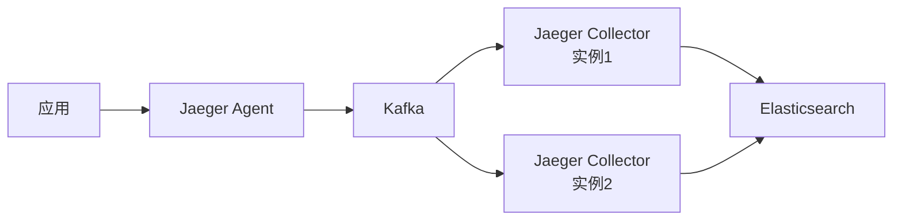

| 组件 | 扩展方式 | 配置要点 |
|------|----------|----------|
| Agent | 每节点部署 | 端口 6831/5775 |
| Collector | Kafka 解耦 | consumer group |
| Kafka | 分区扩展 | 按 trace ID 分区 |
| Elasticsearch | 分片+副本 | 热温冷架构 |

### E.1 Kafka 配置示例

```yaml
# collector 配置
kafka:
  producer:
    brokers: kafka1:9092,kafka2:9092,kafka3:9092
    topic: jaeger-spans
    batch-size: 16384
    linger-ms: 5
  consumer:
    brokers: kafka1:9092,kafka2:9092,kafka3:9092
    topic: jaeger-spans
    group-id: jaeger-collectors
```

## 附录 F：Jaeger 性能调优

### F.1 关键配置参数

| 参数 | 默认值 | 推荐值 | 说明 |
|------|--------|--------|------|
| `collector.num-workers` | 50 | 100-200 | 处理线程数 |
| `collector.batch-size` | 1000 | 5000 | 批处理大小 |
| `collector.batch-timeout` | 1s | 500ms | 批处理超时 |
| `agent.max-packet-size` | 65536 | 131072 | UDP 包大小 |
| `agent.server-host-port` | :6831 | :6831 | Compact 协议端口 |

### F.2 性能基准测试

```text
单节点 Collector 性能：

场景：1000 spans/sec，每个 span 500 bytes

配置1：默认
  - CPU: 40%
  - 内存: 2GB
  - 延迟 P99: 50ms

配置2：优化后
  - CPU: 25%
  - 内存: 4GB
  - 延迟 P99: 20ms

配置3：Kafka 方案
  - CPU: 15% (Collector)
  - 内存: 3GB (Collector)
  - 延迟 P99: 15ms
  - 吞吐量提升 3x
```

---

## 八、采样策略深度解析

### 8.1 Head-based vs Tail-based 采样

```
Head-based 采样（头部采样）：
  在请求入口（第一个 Span）决定是否采样
  整条链路采样决策一致

  优点：
    实现简单、开销低
    决策在入口完成、无需全局协调
  
  缺点：
    无法根据链路结果决定采样
    慢请求/错误请求可能被采样掉

  适用：
    高吞吐场景（QPS > 10000）
    调试期全量采样

Tail-based 采样（尾部采样）：
  等整条链路完成后，根据结果决定是否保留
  需要 Collector 缓存完整链路

  优点：
    慢请求/错误请求 100% 采样
    节省存储（只保留有价值的链路）
  
  缺点：
    需要 Collector 缓存（内存开销大）
    需要协调多个 Collector（链路可能分散）
    实现复杂

  适用：
    生产环境找慢请求
    错误追踪（必须保留错误链路）
```

### 8.2 采样率计算公式

```
采样率计算：
  目标：控制存储成本，同时保留有价值的链路

  公式：
    采样率 = 目标存储量 / (QPS × 平均 Span 数 × Span 大小 × 时间窗口)

  示例：
    QPS = 10000
    平均 Span 数 = 50（每次请求 50 个 Span）
    Span 大小 = 500 bytes
    时间窗口 = 86400s（1 天）
    目标存储 = 100GB

    采样率 = 100GB / (10000 × 50 × 500B × 86400)
           = 100 × 10^9 / (10000 × 50 × 500 × 86400)
           = 100 × 10^9 / (2.16 × 10^14)
           ≈ 0.00046 = 0.046%

  实际调整：
    高流量服务：0.1-1%
    低流量服务：10-100%
    错误链路：100%
```

### 8.3 采样策略配置示例

```yaml
# Jaeger 采样策略配置
{
  "default_strategy": {
    "type": "probabilistic",
    "param": 0.01
  },
  "service-specific": {
    "payment-service": {
      "type": "probabilistic",
      "param": 0.1
    },
    "user-service": {
      "type": "ratelimiting",
      "param": 100
    }
  }
}

# OpenTelemetry SDK 采样配置
OTEL_TRACES_SAMPLER=parentbased_traceidratio
OTEL_TRACES_SAMPLER_ARG=0.01
```

---

## 九、Span 数据模型深入

### 9.1 Span 结构

```
Span 数据模型：
  traceId: 128-bit（全局唯一）
  spanId: 64-bit（Span 唯一）
  parentSpanId: 64-bit（父 Span）
  operationName: "HTTP GET /api/users"
  startTime: 微秒级时间戳
  duration: 微秒
  tags: KV 对（查询条件）
  logs: 时间线事件
  references: Span 间关系（ChildOf/FollowsFrom）

  关键字段：
    traceId: 链路追踪的核心标识
    spanId: 单个 Span 的唯一标识
    parentSpanId: 构建调用树
    operationName: 操作名称（用于聚合分析）
    tags: 用于过滤和查询（如 http.status_code=200）
    logs: 调试信息（如 error stacktrace）
```

### 9.2 Span 类型对比

| 类型 | 说明 | 示例 |
|------|------|------|
| SERVER | 服务端 Span | HTTP 请求处理 |
| CLIENT | 客户端 Span | HTTP/gRPC 调用 |
| PRODUCER | 消息生产者 | Kafka/RocketMQ 发送 |
| CONSUMER | 消息消费者 | Kafka/RocketMQ 接收 |
| INTERNAL | 内部 Span | 方法调用、数据库查询 |

### 9.3 Span 关系类型

```
Span 关系：
  ChildOf：父子关系（最常见）
    服务端收到请求 → 创建 SERVER Span
    调用下游服务 → 创建 CLIENT Span（child of SERVER）

  FollowsFrom：因果关系（不依赖父完成）
    异步任务：父任务创建子任务后继续执行
    消息队列：生产者发送后不等消费者

  关系图示：
    SERVER Span (root)
      ├── CLIENT Span A (ChildOf)
      │     └── SERVER Span B (ChildOf)
      │           └── DB Span C (ChildOf)
      └── CLIENT Span D (ChildOf)
            └── MQ Span E (FollowsFrom)
```

---

## 十、存储后端深度对比

### 10.1 Elasticsearch vs Cassandra vs ClickHouse

| 维度 | Elasticsearch | Cassandra | ClickHouse |
|------|---------------|-----------|------------|
| 数据模型 | 文档（JSON） | 宽列 | 列式表 |
| 写入性能 | 中等 | 高（顺序写） | 极高（列式压缩） |
| 查询性能 | 中等（全文搜索强） | 中等（等值查询强） | 高（聚合分析强） |
| 存储成本 | 高（倒排索引） | 中等（压缩） | 低（高压缩比） |
| 运维复杂度 | 中等 | 高 | 中等 |
| 生态成熟度 | 高（ELK） | 中等 | 中等 |
| 适用场景 | 日志联动、全文搜索 | 大规模写入 | 高性能分析 |

### 10.2 存储选型决策树

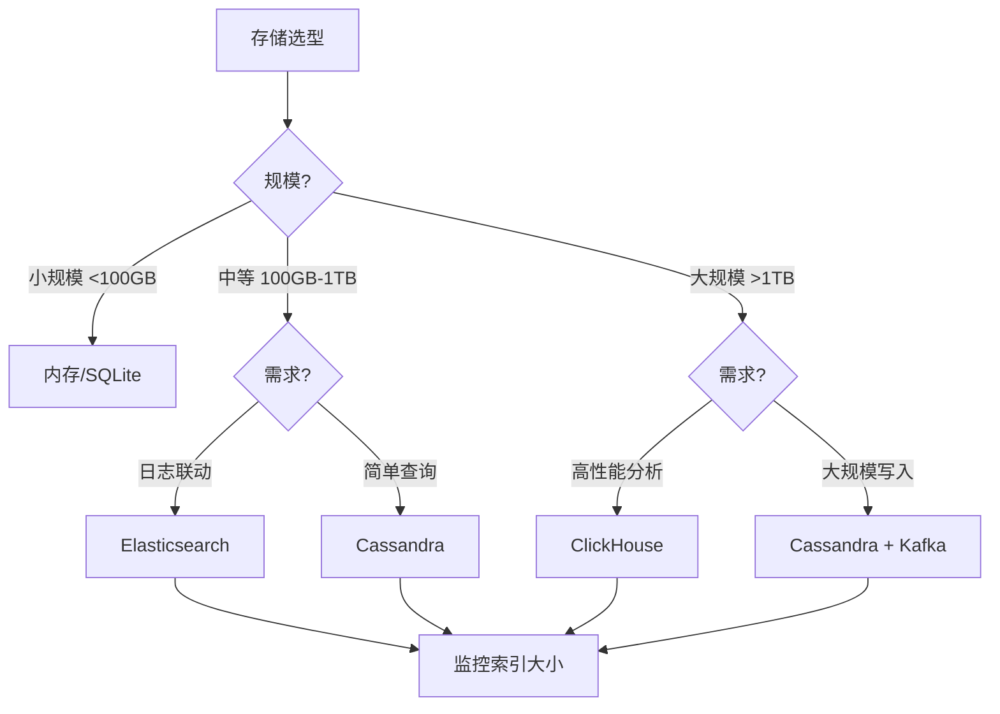

### 10.3 存储配置优化

```yaml
# Elasticsearch 优化配置
ES_INDEX_SHARDS=3          # 分片数（按数据量调整）
ES_INDEX_REPLICAS=1        # 副本数（高可用）
ES_INDEX_REFRESH_INTERVAL=30s  # 刷新间隔（降低索引压力）
ES_SPAN_CLEANER_ENABLED=true   # 启用清理器

# ClickHouse 配置
clickhouse:
  cluster: jaeger-cluster
  layouts:
    - index: jaeger-span
      replicas: 2
      shards: 3
```

---

## 十一、OpenTelemetry 集成深入

### 11.1 OTel SDK 配置

```java
// Java OTel SDK 配置
SdkTracerProvider tracerProvider = SdkTracerProvider.builder()
    .setResource(Resource.getDefault().merge(
        Resource.builder()
            .put("service.name", "my-service")
            .put("service.version", "1.0.0")
            .build()))
    .addSpanProcessor(BatchSpanProcessor.builder(
        OtlpGrpcSpanExporter.builder()
            .setEndpoint("http://jaeger-collector:4317")
            .build())
        .setScheduleDelay(5, TimeUnit.SECONDS)
        .setMaxQueueSize(2048)
        .setMaxExportBatchSize(512)
        .build())
    .setSampler(Sampler.parentBased(
        Sampler.traceIdRatioBased(0.01)))
    .build();
```

### 11.2 OTel Collector 配置

```yaml
# otel-collector-config.yaml
receivers:
  otlp:
    protocols:
      grpc:
        endpoint: 0.0.0.0:4317
      http:
        endpoint: 0.0.0.0:4318

processors:
  batch:
    timeout: 5s
    send_batch_size: 512
  memory_limiter:
    limit_mib: 2000
    spike_limit_mib: 400
  tail_sampling:
    decision_wait: 10s
    num_traces: 100000
    policies:
      - name: error-policy
        type: status_code
        status_code: {status_codes: [ERROR]}
      - name: latency-policy
        type: latency
        latency: {threshold_ms: 1000}

exporters:
  jaeger:
    endpoint: jaeger-collector:14250
    tls:
      cert_file: /certs/client.crt
      key_file: /certs/client.key
```

---

## 十二、依赖图生成原理

### 12.1 依赖图构建

```
依赖图生成流程：
  1. 收集所有 Span（traceID + spanID + parentSpanID）
  2. 构建调用树（Span 间父子关系）
  3. 提取服务间调用（CLIENT → SERVER）
  4. 聚合统计（调用次数、延迟、错误率）
  5. 可视化（节点=服务，边=调用关系）

  数据结构：
    节点：服务名（如 user-service）
    边：调用关系（source → target）
    边属性：
      - 调用次数（requests_total）
      - 平均延迟（latency_avg）
      - 错误率（error_rate）

  查询示例：
    SELECT 
      parent.service_name as source,
      service_name as target,
      COUNT(*) as requests,
      AVG(duration) as latency
    FROM spans
    WHERE parent.service_name != service_name
    GROUP BY source, target
```

### 12.2 依赖图可视化

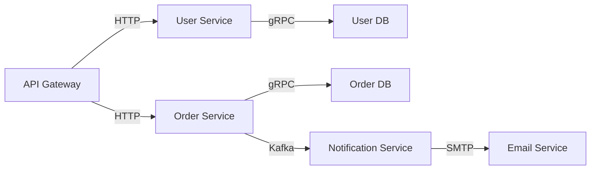

---

## 十三、部署架构深入

### 13.1 生产部署架构

```
生产部署架构：
  ┌─────────────────────────────────────────┐
  │                Kubernetes                │
  │  ┌─────────┐  ┌─────────┐  ┌─────────┐  │
  │  │ App Pod │  │ App Pod │  │ App Pod │  │
  │  │ + OTel  │  │ + OTel  │  │ + OTel  │  │
  │  └────┬────┘  └────┬────┘  └────┬────┘  │
  │       │            │            │        │
  │  ┌────┴────────────┴────────────┴────┐   │
  │  │         OTel Collector            │   │
  │  │    (接收/处理/采样/批量导出)       │   │
  │  └───────────────┬───────────────────┘   │
  │                  │                       │
  │  ┌───────────────┴───────────────────┐   │
  │  │           Kafka Cluster           │   │
  │  │        (缓冲/削峰/异步)           │   │
  │  └───────────────┬───────────────────┘   │
  │                  │                       │
  │  ┌───────────────┴───────────────────┐   │
  │  │      Jaeger Collector            │   │
  │  │    (消费/处理/写入存储)           │   │
  │  └───────────────┬───────────────────┘   │
  │                  │                       │
  │  ┌───────────────┴───────────────────┐   │
  │  │      Elasticsearch Cluster       │   │
  │  │        (存储/查询)               │   │
  │  └───────────────┬───────────────────┘   │
  │                  │                       │
  │  ┌───────────────┴───────────────────┐   │
  │  │        Jaeger Query + UI          │   │
  │  │       (查询/可视化)               │   │
  │  └───────────────────────────────────┘   │
  └─────────────────────────────────────────┘
```

### 13.2 组件职责

| 组件 | 职责 | 扩展方式 |
|------|------|---------|
| OTel SDK | 埋点、采样决策 | 随应用部署 |
| OTel Collector | 接收、处理、导出 | 水平扩展 |
| Kafka | 缓冲、削峰 | 增加 Broker |
| Jaeger Collector | 消费、写入存储 | 水平扩展 |
| Elasticsearch | 存储、查询 | 增加节点 |
| Jaeger Query | 查询、可视化 | 水平扩展 |

## Jaeger 生产部署与运维最佳实践

### 部署架构选型

| 架构模式 | 适用场景 | 组件配置 | 说明 |
|----------|---------|----------|------|
| 单机模式 | 开发测试 | All-in-One | 所有组件合一 |
| 生产模式 | 生产环境 | Agent+Collector+Query | 组件分离 |
| 高可用模式 | 多机房 | 多副本+负载均衡 | 高可用 |
| 云原生模式 | K8s | Operator部署 | 弹性伸缩 |

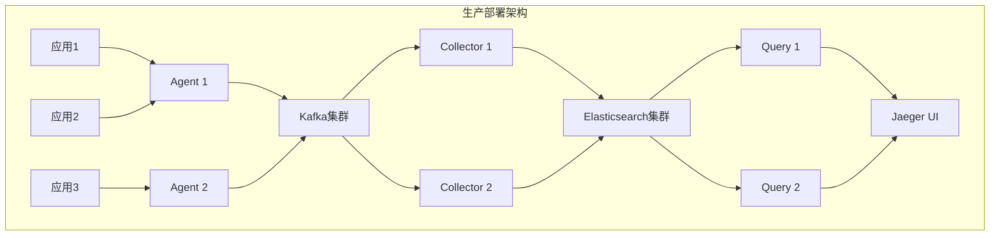

### 资源规划公式

| 资源类型 | 计算公式 | 推荐值 |
|----------|---------|--------|
| Agent CPU | 应用数 × 0.1核 | 1-2核/节点 |
| Agent 内存 | 应用数 × 10MB | 100-256MB |
| Collector CPU | QPS × 0.001 | 4-8核 |
| Collector 内存 | QPS × 0.01MB | 4-8GB |
| Query CPU | 并发查询数 × 1 | 2-4核 |
| Query 内存 | 并发查询数 × 100MB | 2-4GB |
| ES节点 | 存储量 / 50GB | 3+节点 |

### 采样策略生产配置

```yaml
# 生产环境采样策略
sampling:
  default_strategy:
    type: probabilistic
    param: 0.01  # 默认1%采样率
    
  service_strategies:
    # 核心服务100%采样
    - service: order-service
      type: probabilistic
      param: 1.0
      
    # 一般服务10%采样
    - service: user-service
      type: probabilistic
      param: 0.1
      
    # 高吞吐服务1%采样
    - service: log-service
      type: probabilistic
      param: 0.01
      
    # 错误请求100%采样
    - service: payment-service
      type: probabilistic
      param: 1.0
      operation: processPayment
```

### 存储后端优化

| 存储类型 | 优化配置 | 说明 |
|----------|---------|------|
| Elasticsearch | 分片数=节点数×2 | 写入性能 |
| Elasticsearch | 副本数=1 | 读取性能 |
| Cassandra | 复制因子=3 | 高可用 |
| ClickHouse | 分区键=日期 | 查询性能 |

```yaml
# Elasticsearch 存储优化
es:
  server_urls: ["http://es1:9200", "http://es2:9200"]
  index_prefix: "jaeger"
  num_shards: 6
  num_replicas: 1
  refresh_interval: "30s"
 Translog.durability: async
  Translog.sync_interval: "30s"
```

### 监控告警配置

```yaml
# Prometheus 告警规则
groups:
  - name: jaeger-alerts
    rules:
      - alert: JaegerCollectorDown
        expr: up{job="jaeger-collector"} == 0
        for: 1m
        labels:
          severity: critical
        annotations:
          summary: "Jaeger Collector 宕机"

      - alert: JaegerHighLatency
        expr: histogram_quantile(0.99, rate(jaeger_query_latency_seconds_bucket[5m])) > 1
        for: 5m
        labels:
          severity: warning
        annotations:
          summary: "Jaeger 查询延迟过高"

      - alert: JaegerSpanDropRate
        expr: rate(jaeger_collector_spans_dropped_total[5m]) > 100
        for: 5m
        labels:
          severity: warning
        annotations:
          summary: "Jaeger Span 丢弃率过高"
```

### 性能压测与调优

| 压测场景 | 压测指标 | 目标值 | 调优方向 |
|----------|---------|--------|---------|
| 高并发写入 | Span写入TPS | 100000+ | Collector水平扩展 |
| 大规模查询 | 查询延迟 | <1s | ES索引优化 |
| 采样决策 | 采样延迟 | <1ms | 本地采样策略 |
| 存储压缩 | 压缩比 | >5:1 | 存储格式优化 |

### 故障恢复演练

| 演练场景 | 演练步骤 | 预期结果 | RTO |
|----------|---------|----------|-----|
| Agent宕机 | 停止Agent | 应用自动重连 | <10s |
| Collector故障 | 停止Collector | Kafka缓冲+自动恢复 | <30s |
| ES集群故障 | 停止ES节点 | 查询降级+数据不丢失 | <5min |
| Kafka故障 | 停止Kafka | Collector直连ES | <1min |

### 多租户隔离

```text
Jaeger 多租户隔离策略：

  命名空间隔离：
    ├── 按团队：team-a, team-b
    ├── 按环境：prod, staging, dev
    └── 按区域：us-east, eu-west

  资源隔离：
    ├── 采样率：按租户独立配置
    ├── 存储配额：按租户限制存储空间
    └── 查询限制：按租户限制查询QPS

  安全隔离：
    ├── 认证：OAuth2/API Key
    ├── 授权：RBAC权限控制
    └── 审计：操作日志记录
```

### 与OpenTelemetry生态集成

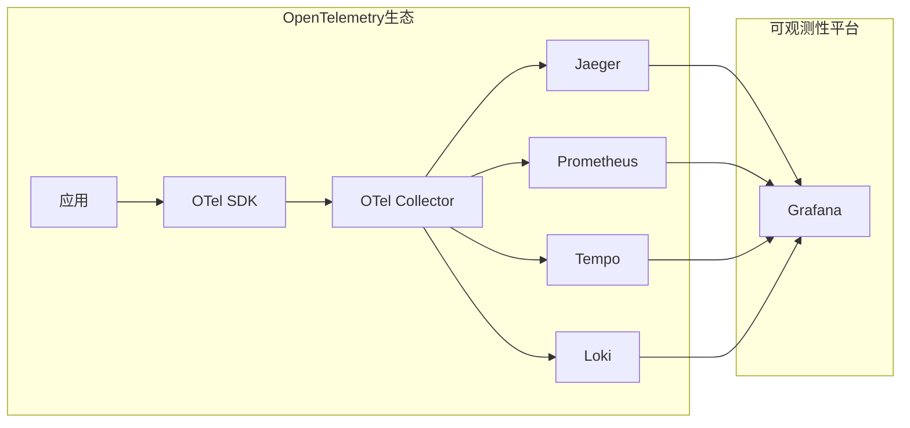

## 七、与其他板块的关系

- 链路追踪原理（SkyWalking）见「[链路追踪 SkyWalking](./链路追踪SkyWalking.md)」；
- 可观测性三支柱见「[云上可观测性体系](./云上可观测性体系.md)」；
- 云原生可观测性见「[云原生/可观测性](../../云原生/可观测性.md)」；
- 监控告警见「[Prometheus + Grafana](./Prometheus与Grafana监控.md)」。

---

## 六、Jaeger 生产配置清单

### 6.1 采样策略配置

```yaml
# 采样策略（可远程动态调整）
{
  "service_1": {
    "default_strategy": {
      "type": "probabilistic",
      "param": 0.01
    },
    "operation_1": {
      "type": "probabilistic",
      "param": 1.0
    }
  }
}
```

### 6.2 存储配置

```yaml
# ES 存储配置
SPAN_STORAGE_TYPE=elasticsearch
ES_SERVER_URLS=http://elasticsearch:9200
ES_INDEX_SHARDS=5
ES_INDEX_REPLICAS=1
ES_NUM_SHARDS=5

# 采样配置
SAMPLING_STRATEGIES_FILE=/etc/jaeger/sampling.json
```

### 6.3 监控指标

```
Jaeger 指标（Prometheus）：
  jaeger_collector_spans_received_total
  jaeger_collector_spans_dropped_total
  jaeger_collector_spans_saved_by_service_total
  jaeger_query_latency_seconds
  jaeger_query_requests_total
```

### 6.4 常见问题排查

| 问题 | 原因 | 解决 |
|------|------|------|
| Trace 不完整 | 采样率太低 | 提高采样率 |
| Trace 丢失 | Collector 过载 | 扩容 Collector |
| 查询慢 | ES 索引不合理 | 优化索引/分片 |
| 延迟高 | SDK 性能问题 | 检查 SDK 配置 |

---

## 七、Jaeger SDK 埋点示例

### 7.1 Python 埋点

```python
from opentelemetry import trace
from opentelemetry.sdk.trace import TracerProvider
from opentelemetry.sdk.trace.export import BatchSpanProcessor
from opentelemetry.exporter.jaeger.thrift import JaegerExporter

# 配置
provider = TracerProvider()
jaeger_exporter = JaegerExporter(
    agent_host_name="localhost",
    agent_port=6831,
)
provider.add_span_processor(BatchSpanProcessor(jaeger_exporter))
trace.set_tracer_provider(provider)

# 埋点
tracer = trace.get_tracer(__name__)
with tracer.start_as_current_span("my_operation") as span:
    span.set_attribute("key", "value")
    # 业务逻辑
```

### 7.2 Java 埋点

```java
import io.opentelemetry.api.GlobalOpenTelemetry;
import io.opentelemetry.api.trace.Span;
import io.opentelemetry.api.trace.Tracer;

Tracer tracer = GlobalOpenTelemetry.getTracer("my-service");
Span span = tracer.spanBuilder("my-operation").startSpan();
try {
    span.setAttribute("key", "value");
    // 业务逻辑
} finally {
    span.end();
}
```

### 7.3 Go 埋点

```go
import "go.opentelemetry.io/otel"

tracer := otel.Tracer("my-service")
ctx, span := tracer.Start(ctx, "my-operation")
defer span.End()

span.SetAttributes(attribute.String("key", "value"))
```

---

## 八、Jaeger 常见问题排查清单

| 检查项 | 命令/方法 |
|--------|-----------|
| Collector 是否正常 | `curl http://jaeger-collector:14269/` |
| Query 是否正常 | `curl http://jaeger-query:16687/` |
| ES 连接是否正常 | `curl http://elasticsearch:9200/_cluster/health` |
| 采样策略是否生效 | 检查 `/sampling` 端点 |
| Agent 是否收到 trace | 查看 Agent 日志 |

---

## 采样策略深入

```yaml
# 采样策略配置
sampling:
  # 客户端采样
  client:
    - type: probabilistic
      param: 0.1  # 10%采样率
    - type: rateLimiting
      param: 100  # 每秒100条
    
  # 服务端采样
  service:
    - type: probabilistic
      param: 0.01  # 1%采样率
    
  # 尾部采样
  tail:
    - type: error
      param: 1.0  # 错误请求100%采样
    - type: latency
      param: 0.5  # 高延迟50%采样
```

### 采样策略对比

| 策略 | 说明 | 适用场景 | 资源消耗 |
|------|------|----------|----------|
| 概率采样 | 按比例采样 | 高吞吐 | 低 |
| 速率限制 | 限制每秒采样数 | 资源受限 | 中 |
| 尾部采样 | 基于结果采样 | 问题排查 | 高 |
| 自适应采样 | 动态调整 | 变化负载 | 中 |

### 采样率配置建议

| 服务类型 | 采样率 | 说明 |
|----------|--------|------|
| 核心服务 | 100% | 关键路径 |
| 一般服务 | 10% | 常规监控 |
| 高吞吐 | 1% | 降低成本 |
| 调试环境 | 100% | 开发测试 |

## 存储后端对比

```yaml
# 存储后端配置
storage:
  elasticsearch:
    server_urls: ["http://elasticsearch:9200"]
    index_prefix: "jaeger"
    num_shards: 5
    num_replicas: 1
    
  cassandra:
    servers: ["cassandra:9042"]
    keyspace: "jaeger_v1"
    replication_factor: 3
    
  clickhouse:
    server_url: "clickhouse:9000"
    database: "jaeger"
```

### 存储后端对比

| 特性 | Elasticsearch | Cassandra | ClickHouse |
|------|---------------|-----------|------------|
| 写入性能 | 高 | 极高 | 极高 |
| 查询性能 | 高 | 中 | 高 |
| 存储成本 | 中 | 低 | 低 |
| 运维复杂度 | 中 | 高 | 中 |
| 适用场景 | 通用 | 大规模 | 分析 |

## 性能优化

```yaml
# Jaeger 性能优化
optimization:
  # Agent优化
  agent:
    max_queue_size: 1000
    max_batch_size: 100
    flush_interval: "1s"
    
  # Collector优化
  collector:
    num_workers: 50
    batch_size: 1000
    batch_timeout: "1s"
    
  # 存储优化
  storage:
    es_index_shards: 5
    es_index_replicas: 1
    span_size_limit: 4096
```

### 性能优化策略

| 策略 | 说明 | 效果 |
|------|------|------|
| 批量发送 | 合并多个span | 减少网络开销 |
| 异步写入 | 非阻塞写入 | 提高吞吐量 |
| 索引优化 | 合理分片和副本 | 提高查询性能 |
| 缓存配置 | 合理配置缓存 | 减少查询延迟 |

## 故障排查流程

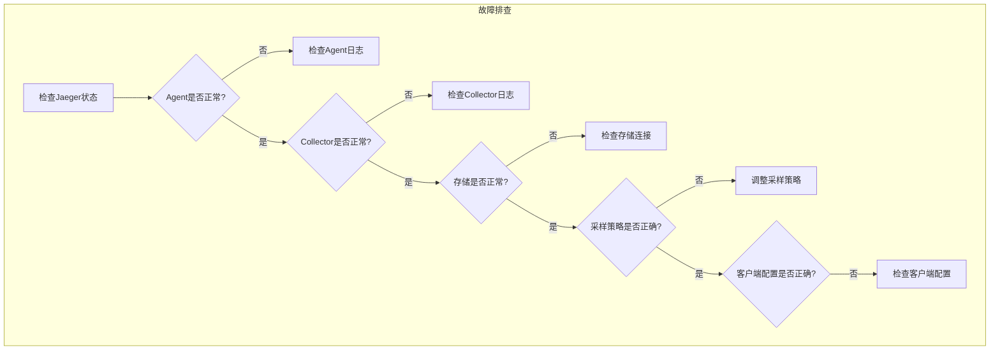

### 常见问题排查

| 问题 | 可能原因 | 解决方案 |
|------|----------|----------|
| 无trace数据 | Agent未启动 | 检查Agent日志 |
| trace不完整 | 采样率过低 | 提高采样率 |
| 查询超时 | ES压力大 | 优化ES配置 |
| 数据丢失 | Collector队列满 | 增大队列大小 |

## 最佳实践

```yaml
# Jaeger 最佳实践
best_practices:
  # 采样策略
  sampling:
    - "核心服务100%采样"
    - "一般服务10%采样"
    - "错误请求100%采样"
    - "高延迟请求100%采样"
    
  # 存储配置
  storage:
    - "使用Elasticsearch存储"
    - "合理配置分片和副本"
    - "定期清理旧数据"
    
  # 性能优化
  performance:
    - "批量发送span"
    - "异步写入存储"
    - "合理配置缓存"
    
  # 监控告警
  monitoring:
    - "监控Agent状态"
    - "监控Collector性能"
    - "监控存储使用情况"
```

### 最佳实践总结

| 实践 | 说明 | 收益 |
|------|------|------|
| 采样策略 | 按需采样 | 降低成本 |
| 存储优化 | 合理配置 | 提高性能 |
| 监控告警 | 及时发现问题 | 保障稳定性 |
| 定期维护 | 清理旧数据 | 节省存储 |

## Jaeger 采样策略配置（probability/peratering/remote）

### 采样策略类型

| 策略 | 说明 | 适用场景 |
|------|------|----------|
| constant | 0 或 1（全采样/不采样） | 开发/测试 |
| probabilistic | 概率采样（0.0-1.0） | 生产环境 |
| rateLimiting | 速率限制 | 保护后端 |
| remote | 远程动态采样 | 大规模部署 |

### 采样配置

```yaml
# Jaeger Agent 采样配置
sampling:
  type: probabilistic
  param: 0.1  # 10% 采样率

# 远程采样配置
sampling:
  type: remote
  options:
    endpoint: http://jaeger-collector:14269/sampling
```

### 动态采样策略

```go
// 远程采样配置
sampler, _ := remote.NewRemotelyControlledSampler(
    "http://jaeger-collector:14269/sampling",
    nil,
)

tracer, _ := jaeger.NewTracer(
    serviceName,
    jaeger.NewSpanRecorderWithOptions(jaeger.SpanRecorderOptions{
        LocalAgentDiskSpanStore: &jaeger.LocalAgentDiskSpanStore{
            MaxPaths: 1000,
            MaxSpansPerPath: 10000,
        },
    }),
    sampler,
)
```

## Jaeger Span 数据模型（operation name/tags/logs/references）

### Span 结构

```
Span 结构：
  TraceID: 追踪 ID（128 位）
  SpanID: Span ID（64 位）
  ParentSpanID: 父 Span ID
  OperationName: 操作名称
  StartTime: 开始时间
  Duration: 持续时间
  Tags: 标签（键值对）
  Logs: 日志（时间戳+事件）
  References: 引用（ChildOf/FollowsFrom）
```

### Span 数据模型

```json
{
  "traceID": "abc123",
  "spanID": "def456",
  "parentSpanID": "ghi789",
  "operationName": "HTTP GET /api/users",
  "startTime": 1609459200000000,
  "duration": 123456,
  "tags": [
    {"key": "http.method", "value": "GET"},
    {"key": "http.url", "value": "/api/users"},
    {"key": "http.status_code", "value": 200},
    {"key": "span.kind", "value": "server"}
  ],
  "logs": [
    {
      "timestamp": 1609459200100000,
      "fields": [
        {"key": "event", "value": "cache miss"},
        {"key": "message", "value": "User not found in cache"}
      ]
    }
  ],
  "references": [
    {
      "refType": "CHILD_OF",
      "traceID": "abc123",
      "spanID": "ghi789"
    }
  ]
}
```

## Jaeger 存储后端对比（Cassandra/ES/Kafka）

### 存储后端对比

| 维度 | Cassandra | Elasticsearch | Kafka |
|------|-----------|---------------|-------|
| 写入性能 | 极高 | 高 | 极高 |
| 查询性能 | 中 | 高（全文搜索） | 低 |
| 存储成本 | 中 | 高 | 低 |
| 运维复杂度 | 高 | 中 | 中 |
| 数据保留 | 原生支持 | 原生支持 | 需配置 |
| 适用场景 | 大规模写入 | 复杂查询 | 缓冲层 |

### Kafka 作为缓冲层

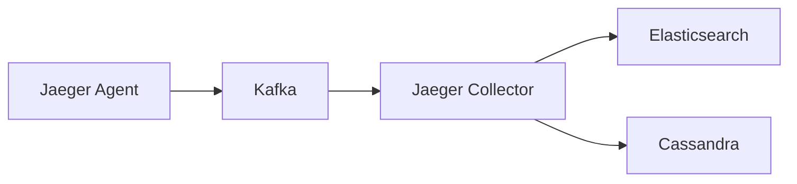

## Jaeger 与 OpenTelemetry 集成

### OpenTelemetry SDK 集成

```go
import (
    "go.opentelemetry.io/otel"
    "go.opentelemetry.io/otel/exporters/jaeger"
    "go.opentelemetry.io/otel/sdk/resource"
    sdktrace "go.opentelemetry.io/otel/sdk/trace"
)

// 初始化 Jaeger 导出器
exporter, _ := jaeger.New(jaeger.WithCollectorEndpoint(
    jaeger.WithEndpoint("http://jaeger-collector:14268/api/traces"),
))

// 创建 Tracer Provider
tp := sdktrace.NewTracerProvider(
    sdktrace.WithBatcher(exporter),
    sdktrace.WithResource(resource.NewWithAttributes(
        semconv.SchemaURL,
        semconv.ServiceNameKey.String("my-service"),
    )),
)

// 设置全局 Tracer Provider
otel.SetTracerProvider(tp)
```

## Jaeger 依赖图生成原理

### 依赖图生成

```
依赖图生成流程：
  1. 收集所有 Span 数据
  2. 提取服务间调用关系（parent-child）
  3. 统计调用次数、延迟、错误率
  4. 生成服务依赖图

依赖图数据：
  节点：服务（Service）
  边：调用关系（调用次数、延迟、错误率）
  
使用场景：
  服务依赖分析
  调用链可视化
  性能瓶颈定位
```

## Jaeger 生产部署架构（Agent+Collector+Query+存储分离）

### 生产部署架构

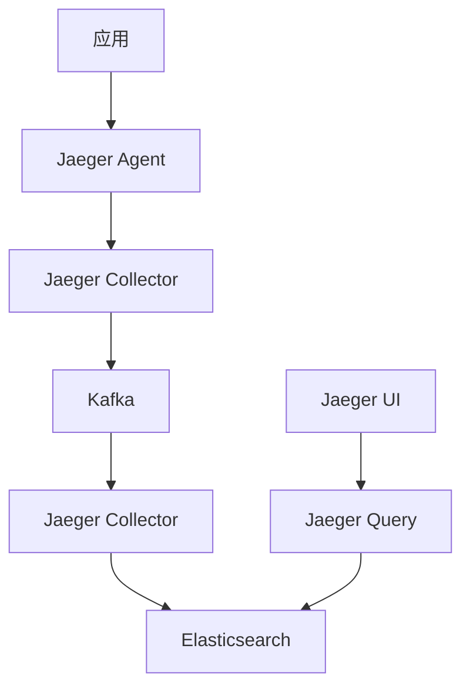

### 部署组件说明

| 组件 | 说明 | 部署方式 |
|------|------|----------|
| Agent | 接收应用上报的 Span | DaemonSet/每节点一个 |
| Collector | 处理、转换、存储 Span | Deployment/多副本 |
| Query | 查询 Span 数据 | Deployment/多副本 |
| UI | Web 界面 | Deployment |
| Kafka | 缓冲层 | StatefulSet |
| ES/Cassandra | 持久化存储 | 集群部署 |

## 二十五、Jaeger 高级特性与生产实践

### 25.1 采样策略深度解析

```
Head-based 采样：
  原理：在请求入口决定是否采样
  优点：实现简单，开销低
  缺点：可能丢失重要链路
  适用：高吞吐场景

Tail-based 采样：
  原理：收集完整链路后决定是否采样
  优点：可基于延迟/错误采样
  缺点：需要完整链路数据
  适用：问题排查场景

自适应采样：
  原理：根据流量动态调整采样率
  优点：平衡存储和可观测性
  缺点：实现复杂
  适用：大规模部署
```

| 采样策略 | 配置示例 | 适用场景 | 优缺点 |
|----------|----------|----------|--------|
| 固定采样 | param: 0.1 | 开发/测试 | 简单但不灵活 |
| 概率采样 | param: 0.01 | 生产环境 | 平衡存储和覆盖 |
| 速率限制 | maxTracesPerSecond: 100 | 保护后端 | 限制存储压力 |
| 远程采样 | endpoint: /sampling | 大规模 | 动态调整 |

### 25.2 Span 模型深入理解

```json
{
  "traceID": "abc123def456",
  "spanID": "789012",
  "parentSpanID": "345678",
  "operationName": "POST /api/orders",
  "startTime": "2024-01-15T10:30:00.000Z",
  "duration": 156789,
  "tags": {
    "http.method": "POST",
    "http.url": "/api/orders",
    "http.status_code": 201,
    "span.kind": "server",
    "component": "spring-mvc",
    "db.type": "mysql",
    "db.statement": "INSERT INTO orders..."
  },
  "logs": [
    {
      "timestamp": "2024-01-15T10:30:00.050Z",
      "fields": {
        "event": "order_created",
        "order.id": "12345",
        "user.id": "67890"
      }
    }
  ],
  "references": [
    {
      "refType": "CHILD_OF",
      "traceID": "abc123def456",
      "spanID": "345678"
    }
  ],
  "process": {
    "serviceName": "order-service",
    "tags": {
      "version": "1.0.0",
      "environment": "production"
    }
  }
}
```

### 25.3 存储后端选型指南

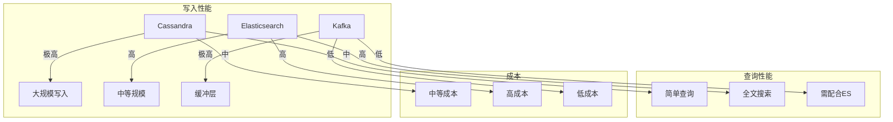

| 存储后端 | 写入TPS | 查询延迟 | 存储成本 | 运维复杂度 | 推荐场景 |
|----------|---------|----------|----------|------------|----------|
| Cassandra | 10万+ | 50-200ms | 中 | 高 | 超大规模 |
| Elasticsearch | 5-10万 | 10-100ms | 高 | 中 | 复杂查询 |
| Kafka+ES | 20万+ | 50-200ms | 中 | 中 | 最佳实践 |
| ClickHouse | 5-10万 | 10-50ms | 低 | 中 | OLAP分析 |

### 25.4 OpenTelemetry 深度集成

```go
// 完整的 OTel + Jaeger 集成示例
package main

import (
    "context"
    "go.opentelemetry.io/otel"
    "go.opentelemetry.io/otel/exporters/jaeger"
    "go.opentelemetry.io/otel/propagation"
    "go.opentelemetry.io/otel/sdk/resource"
    sdktrace "go.opentelemetry.io/otel/sdk/trace"
    semconv "go.opentelemetry.io/otel/semconv/v1.21.0"
)

func initTracer() (*sdktrace.TracerProvider, error) {
    // 1. 创建 Jaeger 导出器
    exporter, err := jaeger.New(jaeger.WithCollectorEndpoint(
        jaeger.WithEndpoint("http://jaeger-collector:14268/api/traces"),
    ))
    if err != nil {
        return nil, err
    }

    // 2. 创建资源
    res, err := resource.Merge(
        resource.Default(),
        resource.NewWithAttributes(
            semconv.SchemaURL,
            semconv.ServiceName("my-service"),
            semconv.ServiceVersion("1.0.0"),
            semconv.DeploymentEnvironment("production"),
        ),
    )
    if err != nil {
        return nil, err
    }

    // 3. 创建 TracerProvider
    tp := sdktrace.NewTracerProvider(
        sdktrace.WithBatcher(exporter),
        sdktrace.WithResource(res),
        sdktrace.WithSampler(sdktrace.ParentBased(
            sdktrace.TraceIDRatioBased(0.1),
        )),
    )

    // 4. 设置全局传播器
    otel.SetTracerProvider(tp)
    otel.SetTextMapPropagator(propagation.NewCompositeTextMapPropagator(
        propagation.TraceContext{},
        propagation.Baggage{},
    ))

    return tp, nil
}
```

### 25.5 Jaeger 集群部署最佳实践

```yaml
# Kubernetes 部署配置
apiVersion: apps/v1
kind: Deployment
metadata:
  name: jaeger-collector
spec:
  replicas: 3
  selector:
    matchLabels:
      app: jaeger-collector
  template:
    spec:
      containers:
      - name: jaeger-collector
        image: jaegertracing/jaeger-collector:1.52
        args:
        - --cassandra.servers=cassandra:9042
        - --cassandra.keyspace=jaeger_v1
        - --kafka.brokers=kafka:9092
        - --kafka.topic=jaeger-spans
        resources:
          requests:
            memory: "512Mi"
            cpu: "500m"
          limits:
            memory: "2Gi"
            cpu: "2000m"
        ports:
        - containerPort: 14268
          name: http
        - containerPort: 14269
          name: admin
```

### 25.6 常见生产问题与排查

| 问题现象 | 可能原因 | 排查步骤 | 解决方案 |
|----------|----------|----------|----------|
| Span 丢失 | 采样率过低 | 1.检查采样配置<br>2.检查网络 | 调整采样率 |
| 查询慢 | ES 索引问题 | 1.检查索引状态<br>2.优化查询 | 重建索引 |
| 存储爆满 | 数据保留过长 | 1.检查TTL配置<br>2.清理历史数据 | 调整保留策略 |
| Agent 高 CPU | Span 处理压力 | 1.检查Span数量<br>2.优化处理 | 增加Agent节点 |
| Collector OOM | 内存不足 | 1.分析内存使用<br>2.增加内存 | 增加资源限制 |

### 25.7 Jaeger 性能优化策略

```
性能优化清单：
  1. 客户端优化
     → 使用批量上报
     → 合理设置采样率
     → 异步发送 Span

  2. Agent 优化
     → 使用本地 Agent
     → 优化缓冲区大小
     → 调整发送间隔

  3. Collector 优化
     → 增加副本数
     → 优化写入批量
     → 使用 Kafka 缓冲

  4. 存储优化
     → 优化索引策略
     → 调整分片数量
     → 使用冷热数据分层

  5. 查询优化
     → 使用索引字段
     → 限制时间范围
     → 使用缓存
```

## Jaeger 性能开销实测

### 性能开销指标

| 指标 | 影响 | 说明 |
|------|------|------|
| CPU | 1-5% | 采样+序列化+网络 |
| 内存 | 10-50MB | 缓冲区+队列 |
| 网络 | 0.1-1% | Span 数据传输 |
| 延迟 | < 1ms | 异步上报，不影响业务 |

### 性能优化建议

```
性能优化：
  1. 使用异步 Span 上报
  2. 合理采样率（生产环境 1-10%）
  3. 批量发送 Span
  4. 使用 Kafka 缓冲
  5. 本地 Agent 减少网络延迟
```

## 补充：采样策略详解

### 采样类型对比

| 采样类型 | 原理 | 优点 | 缺点 | 适用场景 |
|----------|------|------|------|----------|
| Constant | 固定比例 | 简单 | 可能丢失重要数据 | 开发环境 |
| Probabilistic | 概率采样 | 灵活 | 高流量可能漏采 | 生产环境 |
| Rate Limiting | 限速采样 | 控制流量 | 可能丢数据 | 高流量场景 |
| Adaptive | 自适应 | 智能 | 复杂 | 大规模生产 |
| ParentBased | 继承父级 | 一致 | 依赖上游 | 分布式系统 |
| Tail-based | 尾部采样 | 精确 | 实现复杂 | 问题排查 |

### 采样配置示例

```yaml
# Jaeger Agent 采样配置
{
  "service_name": "my-service",
  "sampler": {
    "type": "ratelimiting",
    "param": 100  // 每秒最多100个采样
  }
}

# 远程采样配置
{
  "service_name": "my-service",
  "sampler": {
    "type": "remote",
    "param": 0.01,  // 初始采样率1%
    "endpoint": "http://jaeger-collector:14269/api/sampling/my-service"
  }
}

# 自适应采样
{
  "service_name": "my-service",
  "sampler": {
    "type": "adaptive",
    "param": 0.01,
    "maxTracesPerSecond": 100,
    "minSamplesPerSecond": 10
  }
}
```

### 尾部采样实现

```python
# Tail-based 采样规则
{
  "rules": [
    {
      "name": "error-sampling",
      "condition": {
        "type": "span_count",
        "min": 1,
        "max": 100
      },
      "sampleRate": 1.0  // 100%采样错误链路
    },
    {
      "name": "latency-sampling",
      "condition": {
        "type": "duration",
        "min": 1000  // 大于1秒
      },
      "sampleRate": 0.5  // 50%采样
    },
    {
      "name": "random-sampling",
      "condition": {
        "type": "always"
      },
      "sampleRate": 0.01  // 1%随机采样
    }
  ]
}
```

## 补充：Span 数据模型

### Span 结构

```json
{
  "traceID": "abc123def456",
  "spanID": "1234567890abcdef",
  "parentSpanID": "0987654321fedcba",
  "operationName": "HTTP GET /api/users",
  "startTime": 1633046400000000,
  "duration": 15000,
  "tags": {
    "http.method": "GET",
    "http.url": "/api/users/123",
    "http.status_code": 200,
    "component": "net/http",
    "span.kind": "client"
  },
  "logs": [
    {
      "timestamp": 1633046400001000,
      "fields": {
        "event": "retry",
        "retry.count": 3,
        "error": true
      }
    }
  ],
  "process": {
    "serviceName": "user-service",
    "tags": {
      "host.name": "user-service-pod-123",
      "ip": "10.0.0.123",
      "version": "1.2.3"
    }
  }
}
```

### Span 标准标签

| 标签 | 说明 | 示例值 |
|------|------|--------|
| `span.kind` | Span类型 | client/server/internal/producer/consumer |
| `http.method` | HTTP方法 | GET/POST/PUT |
| `http.url` | 请求URL | /api/users |
| `http.status_code` | 状态码 | 200/404/500 |
| `http.request_content_length` | 请求大小 | 1234 |
| `http.response_content_length` | 响应大小 | 5678 |
| `db.type` | 数据库类型 | mysql/postgresql |
| `db.statement` | SQL语句 | SELECT * FROM users |
| `db.user` | 数据库用户 | root |
| `message_bus.destination` | 消息目标 | orders/topic |

## 补充：存储后端对比

### 存储后端选型

| 后端 | 性能 | 可靠性 | 成本 | 适用场景 |
|------|------|--------|------|----------|
| Cassandra | 高 | 高 | 中 | 大规模生产 |
| Elasticsearch | 高 | 高 | 高 | 复杂查询 |
| ClickHouse | 极高 | 高 | 低 | 分析场景 |
| Kafka | 极高 | 高 | 中 | 缓冲层 |
| Badger | 中 | 中 | 低 | 小规模/开发 |
| Memory | 极高 | 低 | 高 | 测试环境 |

### ClickHouse 存储配置

```yaml
# ClickHouse 存储配置
span_storage:
  type: clickhouse
  options:
    address: clickhouse:9000
    database: jaeger
    span_table: spans
    index_table: span_index
    dependencies_table: dependencies
    max_span_size: 1048576  # 1MB
    batch_size: 1000
    flush_interval: 1s

# ClickHouse 建表语句
CREATE TABLE jaeger.spans ON CLUSTER '{cluster}'
(
    trace_id String,
    span_id UInt64,
    parent_span_id UInt64,
    operation_name String,
    start_time DateTime64(6),
    duration UInt64,
    service_name String,
    tags Map(String, String),
    logs String
)
ENGINE = ReplicatedMergeTree()
PARTITION BY toYYYYMM(start_time)
ORDER BY (service_name, operation_name, start_time)
TTL start_time + INTERVAL 30 DAY;

CREATE TABLE jaeger.span_index ON CLUSTER '{cluster}'
(
    trace_id String,
    span_id UInt64,
    service_name String,
    operation_name String,
    start_time DateTime64(6)
)
ENGINE = ReplicatedMergeTree()
PARTITION BY toYYYYMM(start_time)
ORDER BY (service_name, operation_name, start_time);
```

## 补充：OpenTelemetry 集成

### OTel + Jaeger 架构

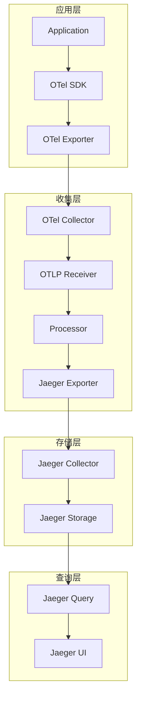

### OTel 配置示例

```yaml
# OTel Collector 配置
receivers:
  otlp:
    protocols:
      grpc:
        endpoint: 0.0.0.0:4317
      http:
        endpoint: 0.0.0.0:4318
  
  jaeger:
    protocols:
      thrift_compact:
        endpoint: 0.0.0.0:6831
      thrift_http:
        endpoint: 0.0.0.0:14268

processors:
  batch:
    timeout: 1s
    send_batch_size: 1024
  
  memory_limiter:
    check_interval: 1s
    limit_mib: 512
    spike_limit_mib: 128

exporters:
  jaeger:
    endpoint: jaeger-collector:14250
    tls:
      insecure: true
  
  logging:
    loglevel: debug

service:
  pipelines:
    traces:
      receivers: [otlp, jaeger]
      processors: [memory_limiter, batch]
      exporters: [jaeger, logging]
```

### 应用集成示例

```python
# Python 应用集成 OTel + Jaeger
from opentelemetry import trace
from opentelemetry.sdk.trace import TracerProvider
from opentelemetry.sdk.trace.export import BatchSpanProcessor
from opentelemetry.exporter.jaeger.thrift import JaegerExporter
from opentelemetry.sdk.resources import Resource

# 配置资源
resource = Resource.create({
    "service.name": "my-service",
    "service.version": "1.0.0",
    "deployment.environment": "production"
})

# 配置 Tracer
provider = TracerProvider(resource=resource)
jaeger_exporter = JaegerExporter(
    agent_host_name="jaeger-agent",
    agent_port=6831,
)
processor = BatchSpanProcessor(jaeger_exporter)
provider.add_span_processor(processor)
trace.set_tracer_provider(provider)

# 使用 Tracer
tracer = trace.get_tracer(__name__)

def handle_request():
    with tracer.start_as_current_span("process-request") as span:
        span.set_attribute("http.method", "GET")
        span.set_attribute("http.url", "/api/users")
        
        # 业务逻辑
        result = query_database()
        
        span.set_attribute("http.status_code", 200)
        return result
```

## 补充：依赖图生成

### 服务依赖分析

```sql
-- 查询服务依赖关系
SELECT 
    parent_service,
    child_service,
    COUNT(*) as call_count,
    AVG(duration) as avg_duration
FROM jaeger.dependencies
WHERE timestamp > NOW() - INTERVAL 1 DAY
GROUP BY parent_service, child_service
ORDER BY call_count DESC;
```

### 依赖图可视化

```python
# 生成依赖图数据
def get_dependency_graph(service_name, time_range):
    query = """
    SELECT 
        parent_service,
        child_service,
        COUNT(*) as call_count
    FROM dependencies
    WHERE parent_service = %s 
    AND timestamp BETWEEN %s AND %s
    GROUP BY parent_service, child_service
    """
    
    results = execute_query(query, service_name, time_range.start, time_range.end)
    
    nodes = set()
    edges = []
    
    for row in results:
        nodes.add(row['parent_service'])
        nodes.add(row['child_service'])
        edges.append({
            'source': row['parent_service'],
            'target': row['child_service'],
            'value': row['call_count']
        })
    
    return {
        'nodes': [{'id': n} for n in nodes],
        'edges': edges
    }
```

## 补充：生产部署架构

### 高可用部署

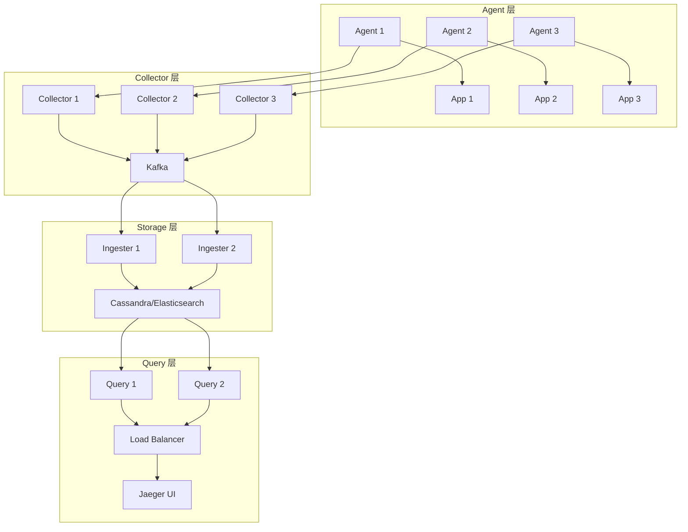

### 资源配置参考

| 组件 | CPU | 内存 | 存储 | 副本数 |
|------|-----|------|------|--------|
| Agent | 0.5核 | 256MB | - | 每个节点 |
| Collector | 2核 | 4GB | - | 3+ |
| Ingester | 4核 | 8GB | - | 3+ |
| Query | 2核 | 4GB | - | 2+ |
| Cassandra | 4核 | 16GB | SSD | 3+ |
| Elasticsearch | 4核 | 16GB | SSD | 3+ |

## 补充：上下文传播

### W3C Trace Context

```python
# 注入（生产者）
from opentelemetry.propagate import inject
from opentelemetry.trace.propagation.tracecontext import TraceContextTextMapPropagator

headers = {}
inject(headers)  # 注入 traceparent 头
requests.get("http://service-b.com", headers=headers)

# 提取（消费者）
from opentelemetry.propagate import extract

extracted_context = extract(request.headers)
with tracer.start_as_current_span("consumer", context=extracted_context):
    # 处理请求
    pass
```

### 传播头格式

| 格式 | 头 | 示例 |
|------|-----|------|
| W3C | traceparent | 00-abc123-123456-01 |
| W3C | tracestate | congo=t61rcWkgMzE |
| B3 | X-B3-TraceId | abc123def456 |
| B3 | X-B3-SpanId | 1234567890abcdef |
| B3 | X-B3-ParentSpanId | 0987654321fedcba |
| Jaeger | uber-trace-id | abc123:123456:0:1 |

### 跨服务传播配置

```yaml
# Spring Boot 配置
management:
  tracing:
    sampling:
      probability: 1.0
  zipkin:
    tracing:
      endpoint: http://jaeger-collector:14268/api/v1/traces

# 配置传播头
opentelemetry:
  propagators: tracecontext,baggage
  exporter:
    jaeger:
      endpoint: jaeger-collector:14250
```

## 补充：生产问题排查

### 高级排查技巧

```bash
# 1. 查询特定服务的所有 Span
curl -s 'http://localhost:16686/api/traces?service=user-service&limit=100' | jq '.data | length'

# 2. 查询错误 Span
curl -s 'http://localhost:16686/api/traces?service=user-service&tags={"error":"true"}' | jq '.data[].spans[] | select(.tags.error == "true")'

# 3. 查询慢请求
curl -s 'http://localhost:16686/api/traces?service=user-service&minDuration=1000000' | jq '.data[].spans[] | select(.duration > 1000000)'

# 4. 分析服务依赖
curl -s 'http://localhost:16686/api/dependencies?endTs=$(date +%s)000&lookback=3600000' | jq '.data'

# 5. 检查 Collector 状态
curl -s 'http://localhost:14269/metrics' | grep 'jaeger_collector'
```

### 性能调优参数

| 参数 | 默认值 | 推荐值 | 说明 |
|------|--------|--------|------|
| `--collector.num-workers` | 50 | 200 | Collector 工作线程 |
| `--collector.queue-size` | 2000 | 10000 | Collector 队列大小 |
| `--collector.grpc.max-message-size` | 4MB | 16MB | gRPC 最大消息 |
| `--query.timeout` | 10s | 30s | 查询超时 |
| `--query.max-traces-per-request` | 1000 | 5000 | 每请求最大 Trace |
| `--agent.max-queue-size` | 1000 | 5000 | Agent 队列大小 |

### 最佳实践总结

| 实践 | 说明 | 优先级 |
|------|------|--------|
| 采样策略 | 生产环境使用自适应采样 | 高 |
| 上下文传播 | 使用 W3C Trace Context | 高 |
| 存储选择 | 大规模用 ClickHouse | 高 |
| 性能优化 | 批量上报+异步 | 中 |
| 监控告警 | Agent/Collector 监控 | 高 |
| 安全配置 | TLS 加密 | 中 |

> 一句话：**Jaeger = OpenTelemetry 原生后端 + W3C Trace Context 传播 + 灵活采样（Head/Tail-based）+ ES/Cassandra/ClickHouse 存储；选型先看「生态（云原生→Jaeger，Java→SkyWalking）」，再定「采样策略（高吞吐→概率采样，找问题→Tail-based）」**。
