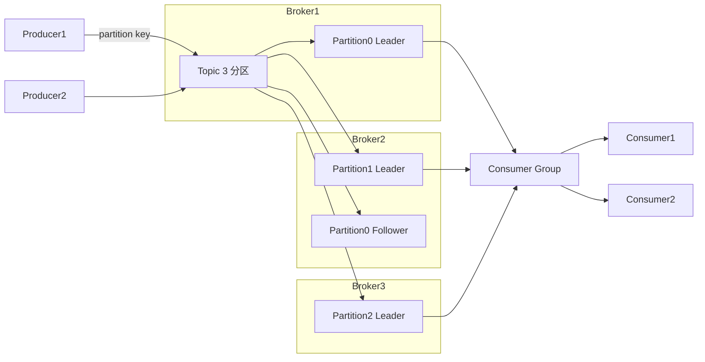

# Kafka（分布式消息队列 / 流平台）

> 互联网高吞吐消息事实标准：日志、埋点、大数据管道、CDC 载体。本文是**实用篇**——架构、副本与 ISR、生产/消费细节、事务与 Exactly-Once、生产排障一条龙；与「源码系列/Kafka源码」互补（那边偏源码实现）。
> 开源参考：[apache/kafka](https://github.com/apache/kafka)（Scala/Java，Apache 2.0，LinkedIn 开源，最大开源消息平台，公司全量用）。

---

## 〇、本体介绍（它是什么 / 适用场景 / 核心概念）

**它是什么**：Kafka 是分布式**高吞吐消息队列 + 流平台**，以「append-only 日志 + 分区并行 + 顺序写盘 + 零拷贝」为设计灵魂，吞吐可达百万级 msg/s。

**解决什么痛点**：业务系统需要海量日志/埋点采集、数据管道、事件驱动、削峰填谷。Kafka 用「分区 + 消费组 + 磁盘顺序写」把消息吞吐做到极限，且天然支持回放（消费位移自主控制）。

**核心概念**：Topic、Partition（分区）、Offset（位移）、Segment、Broker、Producer/Consumer、Consumer Group（消费组）、ISR/AR/OSR、HW/LEO、Replication（副本）、Controller、ZooKeeper 或 KRaft（元数据）、Rebalance、幂等 Producer、事务。

**适用场景**：日志/埋点采集、大数据管道（数仓入湖）、事件驱动、流处理（Kafka Streams/Flink）、CDC 载体、订单履约等异步解耦。
**不适用**：需要复杂路由/精细延迟控制（选 RabbitMQ）、需要事务消息强支持（国内选 RocketMQ）、小规模轻量业务（Kafka 运维重）。

---

## 一、它解决什么问题

| 问题 | Kafka 的解法 |
|------|-------------|
| 单机 MQ 吞吐不够 | 分区并行 + 顺序写磁盘 + 批量 + 零拷贝（sendfile） |
| 消息堆积 | 消费位移自主管理 + 磁盘存储，可长时间堆积回放 |
| 消费水平扩展 | Consumer Group：一个分区只被组内一个消费者消费 |
| 高可用 | 分区多副本（Replication），Leader 挂掉从 ISR 选新 Leader |
| 数据管道解耦 | 上游写 Kafka，下游按自己的节奏消费，生产消费互相不阻塞 |

---

## 二、核心架构



### 关键设计点

1. **分区（Partition）**：一个 Topic 拆成 N 个分区，分区内消息**有序**；分区并行写/读是吞吐来源。
2. **消费组（Consumer Group）**：组内消费者**分担**不同分区（1 分区 → 1 消费者）；多个组可各自消费同一份数据（发布订阅）。
3. **副本与 ISR**：每个分区有 Leader + Follower 副本；写只能到 Leader，Follower 异步同步；`ISR`（In-Sync Replicas）= 与 Leader 保持同步的副本集合；`acks=all` 等 ISR 全确认；Leader 挂了从 ISR 选新 Leader。
4. **位移（Offset）**：消费者自主提交消费位移（`__consumer_offsets` 主题），可回退重放——这是 Kafka「可回放消息」与 RabbitMQ「消费即删」的本质区别。
5. **元数据**：老版本依赖 ZooKeeper；3.x+ 自研 **KRaft**（Raft 协议）替代 ZK，不用再单独部署 ZK。

---

## 三、生产与消费核心细节（面试高频）

### 3.1 Producer 端

- **发送语义**：`acks=0`（不等确认，最快）/ `acks=1`（Leader 确认，可能丢）/ `acks=all`（ISR 全确认，最稳）。
- **分区策略**：指定 partition；或按 key hash（同 key 落同分区，保证同 key 有序）；或随机（吞吐优先）。
- **缓冲与批量**：`linger.ms` + `batch.size` 攒批发送；`buffer.memory`（默认 32MB）内存缓冲池，减少 GC。
- **幂等 Producer**：`enable.idempotence=true`（默认开启），PID + 序列号去重，保证单分区不重复。
- **重试**：`retries` + `max.in.flight.requests.per.connection=5`（幂等开启后允许乱序重试不会重复）。

### 3.2 Consumer 端

- **拉取模型（Pull）**：消费者主动拉取，自己控制消费速度，天然适应慢消费者（区别于推送）。
- **提交位移**：`enable.auto.commit` 默认 true（自动提交）；生产建议**手动提交**（处理完再提交），防「处理失败但位移已提交」丢数据。
- **Rebalance（再平衡）**：消费者增减/分区增减触发；期间消费组暂停，可能重复消费 → 业务必须幂等。
  - 策略：Range（按范围）/ RoundRobin（轮询）/ Sticky（粘性，尽量保持原分配，减少重分配）。
  - 缓解：`max.poll.interval.ms` 调大、处理要快、静态成员（Static Membership，`group.instance.id`）防实例重启触发全组重平衡。
- **max.poll.records**：单次 poll 条数，配合消费耗时与 `max.poll.interval.ms` 防止「处理太慢被踢出组」。

### 3.3 顺序性

- **单分区内有序**：同 key 消息路由到同一分区，消费者单线程处理该分区即有序。
- 全局有序：单分区单消费者（吞吐受限），一般不必。

### 3.4 事务与 Exactly-Once（EOS）

- **幂等 Producer**：防「生产者重试导致重复」，单分区不重复。
- **事务 API**：`initTransactions → beginTransaction → send → sendOffsetsToTransaction → commit`，让「消费 + 产出」原子（Kafka Streams 依赖此实现端到端 EOS）。
- **isolation.level=read_committed**：消费者只读已提交事务消息。
- **本质提醒**：跨系统绝对 Exactly-Once 不存在，都是「幂等 + 原子提交」组合；工程上优先把下游做成幂等。

---

## 四、Kafka vs RocketMQ vs RabbitMQ vs Pulsar

| 维度 | Kafka | RocketMQ | RabbitMQ | Pulsar |
|------|-------|----------|----------|--------|
| 定位 | 日志/流/大数据管道 | 业务可靠消息 | 通用业务解耦 | 云原生流+队列 |
| 吞吐 | 100 万+ msg/s | 50 万+ | 5~10 万 | 100 万+ |
| 堆积能力 | 极强（磁盘+位移回放） | 强 | 一般（内存为主） | 极强（分层存储） |
| 事务消息 | 事务 API | ✅ 半消息（强） | ❌ 弱 | ✅ |
| 延迟消息 | ❌（靠外部） | ✅ 18 级延迟 | ✅ | ✅ |
| 顺序保证 | 分区内有序 | 队列内有序 | 单队列有序 | 分区有序 |
| 消息回溯 | ✅ 任意 offset 回放 | ✅ 按时间回放 | ❌ | ✅ |
| 运维 | 中高 | 中 | 低 | 高 |
| 选型 | 日志/埋点/管道/CDC | 国内电商/金融业务 | 企业级路由/通知 | 云原生多租户/弹性 |

**口诀**：要日志管道和极致吞吐 → Kafka；要事务消息和国内生态 → RocketMQ；要精细路由和低运维 → RabbitMQ；云原生多租户全球化 → Pulsar。

---

## 五、生产实践与排障

### 5.1 可靠性配置（消息不丢）

1. Producer：`acks=all` + 幂等 + 合理重试（注意 retry 期间顺序）。
2. Broker：`min.insync.replicas=2`（ISR 至少 2，配合 acks=all 防单副本丢）、`unclean.leader.election.enable=false`（禁止非 ISR 副本选 Leader，防止丢已确认数据——但要权衡可用性）。
3. Consumer：**手动提交位移**，先处理业务再 commit；消费逻辑幂等。
4. 磁盘：数据多副本 + RAID/云盘，`log.flush` 默认依赖 OS 刷盘即可。

### 5.2 消息积压排查（生产必备）

1. **看 lag**：`kafka-consumer-groups --describe --group xx` 看各分区 lag。
2. **根因**：消费慢（慢 SQL/远程调用/线程池满）、消费者挂、分区数不足（扩容受分区上限约束，先扩分区再扩实例）、重试风暴（异常消息反复失败占满线程）。
3. **处理**：临时扩容消费者（分区够的前提下）→ 批量消费/异步化 → 非核心逻辑降级 → 积压极大时「旁路追平」（新 topic 更多分区，搬运积压消息并行消费，追平后切回）。
4. **预防**：lag 监控告警 + 消费耗时 SLO + 大促前压测留余量 + 不可重试异常直接进 DLQ。

### 5.3 常见坑

1. **消费位移自动提交丢数据**：`enable.auto.commit=true` 且消费逻辑慢 → 处理失败但位移已提交。
2. **Repeated rebalance 风暴**：消费处理超过 `max.poll.interval.ms`（默认 5 分钟）被踢出组 → 反复重平衡 → 消费停滞。调大参数或优化消费。
3. **消费者个数 > 分区数**：多余消费者空转，白占资源。
4. **消息顺序被破坏**：并发消费同一分区、或 rebalance 后旧消费者未提交新消费者已接管。
5. **磁盘写满**：`log.retention.hours` 设太长 + 高吞吐 topic → 磁盘爆炸；按 topic 单独设 retention。
6. **页缓存假象**：Kafka 数据在页缓存时读极快，冷数据/重启后读盘变慢是正常的，别误判为故障。
7. **跨机房复制**：用 MirrorMaker 2 或 Replicator，注意 offset 映射与 Topic 命名。

### 5.4 容量估算速算

- 吞吐 = 单分区吞吐（约 5~20 MB/s） × 分区数；分区数 ≈ 目标吞吐 ÷ 单分区吞吐，再 ×（副本写放大），留 2 倍余量。
- 磁盘 = 峰值写入速率 × 保留时长 × 副本数 × 压缩比，再 ×1.5 缓冲。
- 单 Broker 分区数建议 2k~4k 上限，单分区不建议超过 100 个消费线程。

---

## 面试高频问题（20+ 条）

1. **Kafka 为什么快？** 顺序写磁盘（append-only）、分区并行、批量发送/拉取、页缓存 + 零拷贝（sendfile）、稀疏索引二分查找、压缩（lz4/zstd）。

2. **AR / ISR / OSR 是什么？** 一个分区所有副本 = AR；与 Leader 保持同步的 = ISR（含 Leader）；落后太多被踢出 ISR 的 = OSR。Leader 只能从 ISR 选。

3. **HW 和 LEO 是什么？** LEO = 日志末端偏移量；HW = 高水位，取 ISR 最小 LEO，消费者只能消费 HW 之前的消息（保证副本间一致性）。

4. **acks 三种级别？** 0（不等确认）、1（Leader 落盘确认）、all/-1（ISR 全确认）。可靠性递增，吞吐递减；生产一般 all。

5. **消息不丢失怎么保证？** Producer `acks=all`+幂等+重试；Broker 多副本 + `min.insync.replicas=2` + 禁止 unclean 选举；Consumer 手动提交位移、先处理后提交。

6. **消息重复消费怎么解决？** Kafka 至少一次语义；消费端幂等：唯一键去重表 / Redis SETNX / 状态机；重放窗口内靠幂等键吸收。

7. **消费组重平衡什么时候发生？** 消费者加入/退出、分区数变化、订阅主题变化。期间组暂停，可能重复消费。

8. **重平衡分配策略？** Range（范围平均）、RoundRobin（轮询）、Sticky（粘性，尽量保留原分区，减少重分配）。

9. **顺序性怎么保证？** 同一 key 落同一分区 + 分区内单线程消费；rebalance 和并发消费是破坏顺序的两大元凶。

10. **Kafka 和 ZooKeeper 什么关系？** 老版本用 ZK 存元数据/选 Controller；3.x+ KRaft 模式去掉 ZK，自研 Raft 管理元数据，部署更简单。

11. **消息积压怎么处理？** 先查 lag 定位瓶颈；扩容消费者（受分区数限制）→ 加分区 → 优化消费逻辑 → 旁路追平（搬运到更多分区的临时 topic 并行消费）。

12. **事务消息怎么实现？** 幂等 Producer（PID+序列号）+ 事务（transactional.id）+ 消费位移与产出同事务提交；消费者 isolation.level=read_committed。

13. **Kafka 能保证全局消息顺序吗？** 不能；只能保证分区内有序。全局有序需单分区单消费者，牺牲吞吐。

14. **消费者组和发布订阅？** 组内竞争消费（点对点），组间各自消费（发布订阅）。同一消息多个组各拿一份。

15. **Leader 选举怎么做？** Controller 从 ISR 中选；ISR 全挂时若允许 unclean 选举则可能选 OSR（丢数据），默认关闭。

16. **Controller 是什么？** 负责分区 Leader 选举、元数据变更广播的 Broker；老版依赖 ZK 选主，KRaft 模式自己选。

17. **日志清理策略？** delete（按时间/大小删旧段）和 compact（按 key 压缩，只留最新版本），两者可组合。

18. **零拷贝怎么实现的？** sendfile：数据从磁盘 → 页缓存 → 网卡，不经过用户态拷贝；配合 mmap 和批量传输。

19. **Kafka 高可用部署？** Broker 集群（≥3）+ 分区副本（≥2）+ 多机架感知 + KRaft 元数据；数据靠副本冗余，故障自动切换 Leader。

20. **什么时候选 Kafka？** 日志/埋点、大数据管道、CDC、流处理、事件溯源、需要消息回溯的场景；轻量业务解耦选 RabbitMQ，事务消息国内选 RocketMQ。

21. **Kafka 与 Flink 怎么配合？** Kafka 是 Flink 最常用的 source/sink：Flink 消费 Kafka 做窗口计算，结果写回 Kafka；Kafka 保序 + Flink 做状态计算。

22. **分区数怎么定？** 按目标吞吐 ÷ 单分区吞吐；同时考虑消费者并行度上限、rebalance 开销、文件句柄数量，一般 3~10 起步，可后扩不可随意缩。

---

## 六、与其他板块的关系

- 和「**源码系列/Kafka源码**」：本篇讲架构、语义、生产实践；源码篇讲 offset 索引、副本同步、日志存储等实现细节。
- 和「**基础知识/MQ**」：MQ.md 收录 Kafka 的 Producer 流程、ISR/LEO/HW、清理策略等零散精华；本篇是体系化实用版。
- 和「**基础知识/中间件/ApachePulsar**」「**RabbitMQ**」「**RocketMQ**」：同属消息家族，选型见上文对比表。
- 和「**基础知识/中间件/数据同步CDC-Canal**」：Canal/Debezium 发 Kafka 是「binlog → 下游异构系统」的黄金链路。
- 和「**基础知识/大数据**」：Kafka 是大数据全链路（采集 → 数仓 → 实时计算）的传输底座。
- 和「**基础知识/分布式系统**」：Kafka 的副本/ISR/一致性语义是分布式理论的最佳实践样本。

---

## 七、速查表

| 项 | 结论 |
|----|------|
| 类型 | 分布式消息队列 / 流平台 |
| 核心 | Topic → Partition（日志段）→ Consumer Group |
| 吞吐 | 百万级 msg/s（分区并行 + 顺序写 + 零拷贝） |
| 语义 | at-least-once（默认）；幂等+事务可近似 exactly-once |
| 顺序 | 分区内有序（同 key 同分区） |
| 堆积 | 极强（磁盘 + 位移回放） |
| 元数据 | ZooKeeper（旧）/ KRaft（新，推荐） |
| 许可证 | Apache 2.0 |
| 一句话 | 「日志与流的事实标准」——高吞吐、可回放、生态最大 |

---

## 八、Kafka KRaft 模式（去 ZK）

### 8.1 KRaft 是什么

```
KRaft = Kafka 自研 Raft 协议，替代 ZooKeeper 管理元数据

旧架构：Broker + ZK（存储元数据/选 Controller）
新架构：Broker + KRaft Controller（Raft 共识）

优势：
  - 去掉 ZK 依赖（运维简化）
  - Controller 故障恢复更快
  - 支持更多分区（百万级）
  - 部署更简单
```

### 8.2 迁移建议

| 阶段 | 建议 |
|------|------|
| 新集群 | 直接用 KRaft（3.x+） |
| 存量集群 | 评估迁移成本（ZK→KRaft） |
| 稳定性 | KRaft 已 GA（3.3+），生产可用 |

---

## 九、Kafka 安全

### 9.1 认证

| 机制 | 说明 |
|------|------|
| SASL/PLAIN | 用户名密码（简单） |
| SASL/SCRAM | 挑战响应（更安全） |
| SASL/GSSAPI | Kerberos（企业级） |
| SSL/TLS | 证书认证 |

### 9.2 授权

```bash
# ACL 管理
kafka-acls.sh --add --allow-principal User:alice \
  --operation Read --topic orders --group my-consumer
```

### 9.3 加密

```
传输加密：SSL/TLS（broker 间 + 客户端间）
存储加密：磁盘加密（云盘加密/OS 级加密）
```

---

## 十、与其他板块的关系（扩展）

- 和「**源码系列/Kafka源码**」：本篇讲架构、语义、生产实践；源码篇讲 offset 索引、副本同步、日志存储等实现细节。
- 和「**基础知识/MQ**」：MQ.md 收录 Kafka 的 Producer 流程、ISR/LEO/HW、清理策略等零散精华；本篇是体系化实用版。
- 和「**基础知识/中间件/ApachePulsar**」「**RabbitMQ**」「**RocketMQ**」：同属消息家族，选型见上文对比表。
- 和「**基础知识/中间件/数据同步CDC-Canal**」：Canal/Debezium 发 Kafka 是「binlog → 下游异构系统」的黄金链路。
- 和「**基础知识/大数据**」：Kafka 是大数据全链路（采集 → 数仓 → 实时计算）的传输底座。
- 和「**基础知识/分布式系统**」：Kafka 的副本/ISR/一致性语义是分布式理论的最佳实践样本。
- 和「**基础知识/中间件/KafkaStreams与ksqlDB**」：Kafka Streams 是 Kafka 官方流处理库。

---

## 十一、速查表（扩展）

| 项 | 结论 |
|----|------|
| 类型 | 分布式消息队列 / 流平台 |
| 核心 | Topic → Partition（日志段）→ Consumer Group |
| 吞吐 | 百万级 msg/s（分区并行 + 顺序写 + 零拷贝） |
| 语义 | at-least-once（默认）；幂等+事务可近似 exactly-once |
| 顺序 | 分区内有序（同 key 同分区） |
| 堆积 | 极强（磁盘 + 位移回放） |
| 元数据 | ZooKeeper（旧）/ KRaft（新，推荐） |
| 安全 | SASL/SSL/ACL |
| 许可证 | Apache 2.0 |
| 一句话 | 「日志与流的事实标准」——高吞吐、可回放、生态最大 |
