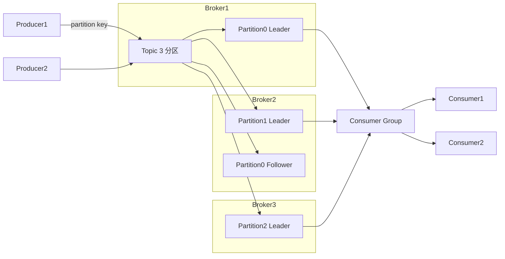
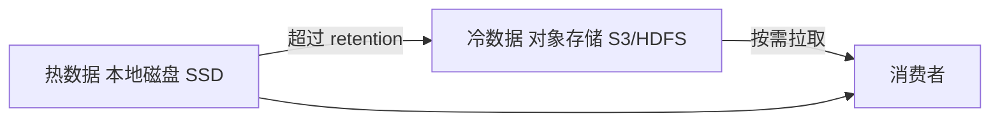
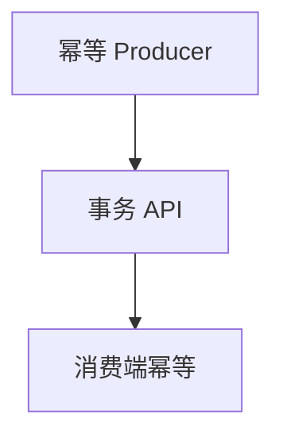
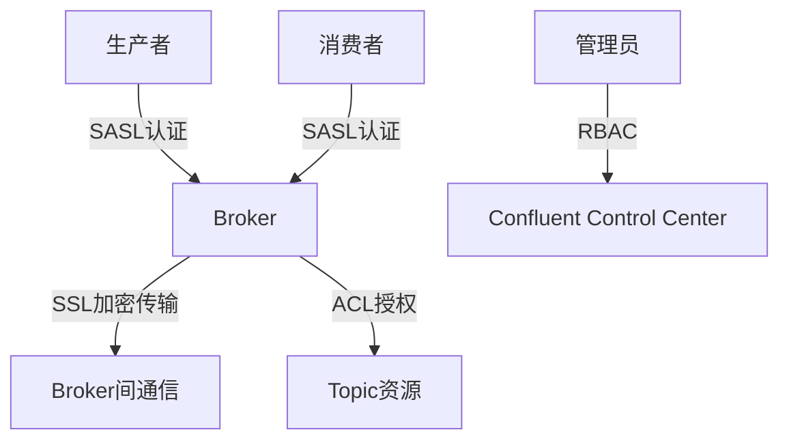

# Kafka（分布式消息队列 / 流平台）

> 互联网高吞吐消息事实标准：日志、埋点、大数据管道、CDC 载体。本文是**实用篇**——架构、副本与 ISR、生产/消费细节、事务与 Exactly-Once、生产排障一条龙；与「源码系列/Kafka源码」互补（那边偏源码实现）。
> 开源参考：[apache/kafka](https://github.com/apache/kafka)（Scala/Java，Apache 2.0，LinkedIn 开源，最大开源消息平台，公司全量用）。

---

## 〇、本体介绍（它是什么 / 适用场景 / 核心概念）

**它是什么**：Kafka 是分布式**高吞吐消息队列 + 流平台**，以「append-only 日志 + 分区并行 + 顺序写盘 + 零拷贝」为设计灵魂，吞吐可达百万级 msg/s。

**解决什么痛点**：业务系统需要海量日志/埋点采集、数据管道、事件驱动、削峰填谷。Kafka 用「分区 + 消费组 + 磁盘顺序写」把消息吞吐做到极限，且天然支持回放（消费位移自主控制）。

**核心概念**：Topic、Partition（分区）、Offset（位移）、Segment、Broker、Producer/Consumer、Consumer Group（消费组）、ISR/AR/OSR、HW/LEO、Replication（副本）、Controller、ZooKeeper 或 KRaft（元数据）、Rebalance、幂等 Producer、事务。

**适用场景**：日志/埋点采集、大数据管道（数仓入湖）、事件驱动、流处理（Kafka Streams/Flink）、CDC 载体、订单履约等异步解耦。
**不适用**：需要复杂路由/精细延迟控制（选 RabbitMQ）、需要事务消息强支持（国内选 RocketMQ）、小规模轻量业务（Kafka 运维重）。

---

## 一、它解决什么问题

| 问题 | Kafka 的解法 |
|------|-------------|
| 单机 MQ 吞吐不够 | 分区并行 + 顺序写磁盘 + 批量 + 零拷贝（sendfile） |
| 消息堆积 | 消费位移自主管理 + 磁盘存储，可长时间堆积回放 |
| 消费水平扩展 | Consumer Group：一个分区只被组内一个消费者消费 |
| 高可用 | 分区多副本（Replication），Leader 挂掉从 ISR 选新 Leader |
| 数据管道解耦 | 上游写 Kafka，下游按自己的节奏消费，生产消费互相不阻塞 |

---

## 二、核心架构



### 关键设计点

1. **分区（Partition）**：一个 Topic 拆成 N 个分区，分区内消息**有序**；分区并行写/读是吞吐来源。
2. **消费组（Consumer Group）**：组内消费者**分担**不同分区（1 分区 → 1 消费者）；多个组可各自消费同一份数据（发布订阅）。
3. **副本与 ISR**：每个分区有 Leader + Follower 副本；写只能到 Leader，Follower 异步同步；`ISR`（In-Sync Replicas）= 与 Leader 保持同步的副本集合；`acks=all` 等 ISR 全确认；Leader 挂了从 ISR 选新 Leader。
4. **位移（Offset）**：消费者自主提交消费位移（`__consumer_offsets` 主题），可回退重放——这是 Kafka「可回放消息」与 RabbitMQ「消费即删」的本质区别。
5. **元数据**：老版本依赖 ZooKeeper；3.x+ 自研 **KRaft**（Raft 协议）替代 ZK，不用再单独部署 ZK。

---

## 三、生产与消费核心细节（面试高频）

### 3.1 Producer 端

- **发送语义**：`acks=0`（不等确认，最快）/ `acks=1`（Leader 确认，可能丢）/ `acks=all`（ISR 全确认，最稳）。
- **分区策略**：指定 partition；或按 key hash（同 key 落同分区，保证同 key 有序）；或随机（吞吐优先）。
- **缓冲与批量**：`linger.ms` + `batch.size` 攒批发送；`buffer.memory`（默认 32MB）内存缓冲池，减少 GC。
- **幂等 Producer**：`enable.idempotence=true`（默认开启），PID + 序列号去重，保证单分区不重复。
- **重试**：`retries` + `max.in.flight.requests.per.connection=5`（幂等开启后允许乱序重试不会重复）。

### 3.2 Consumer 端

- **拉取模型（Pull）**：消费者主动拉取，自己控制消费速度，天然适应慢消费者（区别于推送）。
- **提交位移**：`enable.auto.commit` 默认 true（自动提交）；生产建议**手动提交**（处理完再提交），防「处理失败但位移已提交」丢数据。
- **Rebalance（再平衡）**：消费者增减/分区增减触发；期间消费组暂停，可能重复消费 → 业务必须幂等。
  - 策略：Range（按范围）/ RoundRobin（轮询）/ Sticky（粘性，尽量保持原分配，减少重分配）。
  - 缓解：`max.poll.interval.ms` 调大、处理要快、静态成员（Static Membership，`group.instance.id`）防实例重启触发全组重平衡。
- **max.poll.records**：单次 poll 条数，配合消费耗时与 `max.poll.interval.ms` 防止「处理太慢被踢出组」。

### 3.3 顺序性

- **单分区内有序**：同 key 消息路由到同一分区，消费者单线程处理该分区即有序。
- 全局有序：单分区单消费者（吞吐受限），一般不必。

### 3.4 事务与 Exactly-Once（EOS）

- **幂等 Producer**：防「生产者重试导致重复」，单分区不重复。
- **事务 API**：`initTransactions → beginTransaction → send → sendOffsetsToTransaction → commit`，让「消费 + 产出」原子（Kafka Streams 依赖此实现端到端 EOS）。
- **isolation.level=read_committed**：消费者只读已提交事务消息。
- **本质提醒**：跨系统绝对 Exactly-Once 不存在，都是「幂等 + 原子提交」组合；工程上优先把下游做成幂等。

---

## 四、Kafka vs RocketMQ vs RabbitMQ vs Pulsar

| 维度 | Kafka | RocketMQ | RabbitMQ | Pulsar |
|------|-------|----------|----------|--------|
| 定位 | 日志/流/大数据管道 | 业务可靠消息 | 通用业务解耦 | 云原生流+队列 |
| 吞吐 | 100 万+ msg/s | 50 万+ | 5~10 万 | 100 万+ |
| 堆积能力 | 极强（磁盘+位移回放） | 强 | 一般（内存为主） | 极强（分层存储） |
| 事务消息 | 事务 API | ✅ 半消息（强） | ❌ 弱 | ✅ |
| 延迟消息 | ❌（靠外部） | ✅ 18 级延迟 | ✅ | ✅ |
| 顺序保证 | 分区内有序 | 队列内有序 | 单队列有序 | 分区有序 |
| 消息回溯 | ✅ 任意 offset 回放 | ✅ 按时间回放 | ❌ | ✅ |
| 运维 | 中高 | 中 | 低 | 高 |
| 选型 | 日志/埋点/管道/CDC | 国内电商/金融业务 | 企业级路由/通知 | 云原生多租户/弹性 |

**口诀**：要日志管道和极致吞吐 → Kafka；要事务消息和国内生态 → RocketMQ；要精细路由和低运维 → RabbitMQ；云原生多租户全球化 → Pulsar。

---

## 五、生产实践与排障

### 5.1 可靠性配置（消息不丢）

1. Producer：`acks=all` + 幂等 + 合理重试（注意 retry 期间顺序）。
2. Broker：`min.insync.replicas=2`（ISR 至少 2，配合 acks=all 防单副本丢）、`unclean.leader.election.enable=false`（禁止非 ISR 副本选 Leader，防止丢已确认数据——但要权衡可用性）。
3. Consumer：**手动提交位移**，先处理业务再 commit；消费逻辑幂等。
4. 磁盘：数据多副本 + RAID/云盘，`log.flush` 默认依赖 OS 刷盘即可。

### 5.2 消息积压排查（生产必备）

1. **看 lag**：`kafka-consumer-groups --describe --group xx` 看各分区 lag。
2. **根因**：消费慢（慢 SQL/远程调用/线程池满）、消费者挂、分区数不足（扩容受分区上限约束，先扩分区再扩实例）、重试风暴（异常消息反复失败占满线程）。
3. **处理**：临时扩容消费者（分区够的前提下）→ 批量消费/异步化 → 非核心逻辑降级 → 积压极大时「旁路追平」（新 topic 更多分区，搬运积压消息并行消费，追平后切回）。
4. **预防**：lag 监控告警 + 消费耗时 SLO + 大促前压测留余量 + 不可重试异常直接进 DLQ。

### 5.3 常见坑

1. **消费位移自动提交丢数据**：`enable.auto.commit=true` 且消费逻辑慢 → 处理失败但位移已提交。
2. **Repeated rebalance 风暴**：消费处理超过 `max.poll.interval.ms`（默认 5 分钟）被踢出组 → 反复重平衡 → 消费停滞。调大参数或优化消费。
3. **消费者个数 > 分区数**：多余消费者空转，白占资源。
4. **消息顺序被破坏**：并发消费同一分区、或 rebalance 后旧消费者未提交新消费者已接管。
5. **磁盘写满**：`log.retention.hours` 设太长 + 高吞吐 topic → 磁盘爆炸；按 topic 单独设 retention。
6. **页缓存假象**：Kafka 数据在页缓存时读极快，冷数据/重启后读盘变慢是正常的，别误判为故障。
7. **跨机房复制**：用 MirrorMaker 2 或 Replicator，注意 offset 映射与 Topic 命名。

### 5.4 容量估算速算

- 吞吐 = 单分区吞吐（约 5~20 MB/s） × 分区数；分区数 ≈ 目标吞吐 ÷ 单分区吞吐，再 ×（副本写放大），留 2 倍余量。
- 磁盘 = 峰值写入速率 × 保留时长 × 副本数 × 压缩比，再 ×1.5 缓冲。
- 单 Broker 分区数建议 2k~4k 上限，单分区不建议超过 100 个消费线程。

---

## 面试高频问题（20+ 条）

1. **Kafka 为什么快？** 顺序写磁盘（append-only）、分区并行、批量发送/拉取、页缓存 + 零拷贝（sendfile）、稀疏索引二分查找、压缩（lz4/zstd）。

2. **AR / ISR / OSR 是什么？** 一个分区所有副本 = AR；与 Leader 保持同步的 = ISR（含 Leader）；落后太多被踢出 ISR 的 = OSR。Leader 只能从 ISR 选。

3. **HW 和 LEO 是什么？** LEO = 日志末端偏移量；HW = 高水位，取 ISR 最小 LEO，消费者只能消费 HW 之前的消息（保证副本间一致性）。

4. **acks 三种级别？** 0（不等确认）、1（Leader 落盘确认）、all/-1（ISR 全确认）。可靠性递增，吞吐递减；生产一般 all。

5. **消息不丢失怎么保证？** Producer `acks=all`+幂等+重试；Broker 多副本 + `min.insync.replicas=2` + 禁止 unclean 选举；Consumer 手动提交位移、先处理后提交。

6. **消息重复消费怎么解决？** Kafka 至少一次语义；消费端幂等：唯一键去重表 / Redis SETNX / 状态机；重放窗口内靠幂等键吸收。

7. **消费组重平衡什么时候发生？** 消费者加入/退出、分区数变化、订阅主题变化。期间组暂停，可能重复消费。

8. **重平衡分配策略？** Range（范围平均）、RoundRobin（轮询）、Sticky（粘性，尽量保留原分区，减少重分配）。

9. **顺序性怎么保证？** 同一 key 落同一分区 + 分区内单线程消费；rebalance 和并发消费是破坏顺序的两大元凶。

10. **Kafka 和 ZooKeeper 什么关系？** 老版本用 ZK 存元数据/选 Controller；3.x+ KRaft 模式去掉 ZK，自研 Raft 管理元数据，部署更简单。

11. **消息积压怎么处理？** 先查 lag 定位瓶颈；扩容消费者（受分区数限制）→ 加分区 → 优化消费逻辑 → 旁路追平（搬运到更多分区的临时 topic 并行消费）。

12. **事务消息怎么实现？** 幂等 Producer（PID+序列号）+ 事务（transactional.id）+ 消费位移与产出同事务提交；消费者 isolation.level=read_committed。

13. **Kafka 能保证全局消息顺序吗？** 不能；只能保证分区内有序。全局有序需单分区单消费者，牺牲吞吐。

14. **消费者组和发布订阅？** 组内竞争消费（点对点），组间各自消费（发布订阅）。同一消息多个组各拿一份。

15. **Leader 选举怎么做？** Controller 从 ISR 中选；ISR 全挂时若允许 unclean 选举则可能选 OSR（丢数据），默认关闭。

16. **Controller 是什么？** 负责分区 Leader 选举、元数据变更广播的 Broker；老版依赖 ZK 选主，KRaft 模式自己选。

17. **日志清理策略？** delete（按时间/大小删旧段）和 compact（按 key 压缩，只留最新版本），两者可组合。

18. **零拷贝怎么实现的？** sendfile：数据从磁盘 → 页缓存 → 网卡，不经过用户态拷贝；配合 mmap 和批量传输。

19. **Kafka 高可用部署？** Broker 集群（≥3）+ 分区副本（≥2）+ 多机架感知 + KRaft 元数据；数据靠副本冗余，故障自动切换 Leader。

20. **什么时候选 Kafka？** 日志/埋点、大数据管道、CDC、流处理、事件溯源、需要消息回溯的场景；轻量业务解耦选 RabbitMQ，事务消息国内选 RocketMQ。

21. **Kafka 与 Flink 怎么配合？** Kafka 是 Flink 最常用的 source/sink：Flink 消费 Kafka 做窗口计算，结果写回 Kafka；Kafka 保序 + Flink 做状态计算。

22. **分区数怎么定？** 按目标吞吐 ÷ 单分区吞吐；同时考虑消费者并行度上限、rebalance 开销、文件句柄数量，一般 3~10 起步，可后扩不可随意缩。

---

## 六、与其他板块的关系

- 和「**源码系列/Kafka源码**」：本篇讲架构、语义、生产实践；源码篇讲 offset 索引、副本同步、日志存储等实现细节。
- 和「**基础知识/MQ**」：MQ.md 收录 Kafka 的 Producer 流程、ISR/LEO/HW、清理策略等零散精华；本篇是体系化实用版。
- 和「**基础知识/中间件/ApachePulsar**」「**RabbitMQ**」「**RocketMQ**」：同属消息家族，选型见上文对比表。
- 和「**基础知识/中间件/数据同步CDC-Canal**」：Canal/Debezium 发 Kafka 是「binlog → 下游异构系统」的黄金链路。
- 和「**基础知识/大数据**」：Kafka 是大数据全链路（采集 → 数仓 → 实时计算）的传输底座。
- 和「**基础知识/分布式系统**」：Kafka 的副本/ISR/一致性语义是分布式理论的最佳实践样本。

---

## Kafka 副本放置策略与机架感知

### 副本放置原则

```
Kafka 副本放置 = 决定 Follower 副本落在哪个 Broker

默认策略：
  第一个副本：随机分配到 Broker（或指定 Leader）
  后续副本：依次分配到不同 Broker（轮询）
  约束：同一 Partition 的副本不在同一 Broker

机架感知（Rack Awareness）：
  每个 Broker 配置机架 ID
  → 副本尽量分布在不同机架
  → 机架故障时数据不丢

配置：
  broker.rack=/rack1  # broker.properties
```

### 机架感知配置

```properties
# broker.properties
broker.rack=/rack1

# 或通过环境变量
KAFKA_BROKER_RACK=/rack1
```

### 副本放置策略对比

| 策略 | 说明 | 适用 |
|------|------|------|
| 默认轮询 | 副本依次分配到不同 Broker | 无机架约束 |
| 机架感知 | 副本分布在不同机架 | 跨机房/跨 AZ |
| 同区域优先 | 副本优先同可用区 | 低延迟 |
| 跨区域 | 副本跨区域分布 | 高可用 |

> **口诀：副本放置 = "让数据住得分散"——默认轮询防单 Broker 故障，机架感知防单机架故障。**

---

## __consumer_offsets 内部机制

### 存储原理

```
__consumer_offsets = Kafka 内部 Topic（50 个分区，默认 __consumer_offsets）

存储内容：
  消费组的位移信息（offset）
  消费组的元数据（group metadata）

位移提交流程：
  Consumer 处理完消息 → 调用 commitSync/commitAsync
  → 发送位移到 __consumer_offsets
  → Broker 持久化

位移存储格式：
  Key: group_id + topic + partition
  Value: offset + metadata + timestamp

位移查找：
  1. Consumer 启动 → 向 Coordinator 发 JoinGroup
  2. Coordinator 找到 __consumer_offsets 中该组的位移
  3. 返回位移 → Consumer 从该位置开始消费
```

### 位移提交最佳实践

```java
// 手动提交位移（推荐）
consumer.commitSync();  // 同步提交（可靠）
consumer.commitAsync(); // 异步提交（快但可能失败）

// 按分区提交位移
Map<TopicPartition, OffsetAndMetadata> offsets = new HashMap<>();
for (ConsumerRecord<String, String> record : records) {
    offsets.put(
        new TopicPartition(record.topic(), record.partition()),
        new OffsetAndMetadata(record.offset() + 1)  // 下一条待消费
    );
}
consumer.commitSync(offsets);  // 按分区精确提交
```

| 提交方式 | 优点 | 缺点 | 适用 |
|----------|------|------|------|
| 自动提交 | 简单 | 可能丢数据 | 开发测试 |
| 同步提交 | 可靠 | 慢（等确认） | 生产推荐 |
| 异步提交 | 快 | 可能失败 | 高吞吐场景 |
| 按分区提交 | 精确 | 复杂 | 精确控制 |

> **口诀：__consumer_offsets = Kafka 的"记忆本"——记录每个消费组消费到哪了，手动提交位移是防丢数据的关键。**

---

## KIP-848 新消费者协议

### 协议变化

```
KIP-848 = 新版 Consumer Group 协议（Kafka 3.7+）

旧协议（Eager Rebalance）：
  所有 Consumer 停止消费 → Rebalance → 所有 Consumer 恢复
  问题：Rebalance 期间全组暂停，消费延迟

新协议（Cooperative Rebalance）：
  分步 Rebalance：只停止受影响的分区
  未受影响的分区继续消费
  优势：减少 Rebalance 影响范围

KIP-848 进一步改进：
  ① Incremental Rebalance：增量 Rebalance
  ② Static Membership 增强：实例重启不触发全组 Rebalance
  ③ 新的 GroupCoordinator：更好的分区分配
```

### 新旧协议对比

| 维度 | 旧协议 Eager | 新协议 Cooperative |
|------|-------------|-------------------|
| Rebalance 方式 | 全组暂停 | 增量（只停受影响分区） |
| 消费中断 | 全组暂停 | 仅受影响分区暂停 |
| 恢复速度 | 慢 | 快 |
| 兼容性 | 所有版本 | Kafka 3.7+ |

```properties
# 启用新协议
group.protocol=consumer  # 使用新协议
session.timeout.ms=45000  # 会话超时
heartbeat.interval.ms=3000 # 心跳间隔
```

> **口诀：KIP-848 = "增量 Rebalance"——只停受影响的分区继续消费，比全组暂停的旧协议影响小得多。**

---

## quota 限速配置（producer/consumer/fetch）

### Quota 类型

| Quota 类型 | 限速对象 | 参数 |
|-----------|---------|------|
| Producer Byte Rate | 生产者写入速率 | producer_byte_rate |
| Consumer Byte Rate | 消费者读取速率 | consumer_byte_rate |
| Request Percentage | 请求处理占比 | request_percentage |

### 配置示例

```bash
# 全局 Quota
kafka-configs.sh --alter --add-config 'producer_byte_rate=10485760' \
  --entity-type users --entity-default

# 按用户 Quota
kafka-configs.sh --alter --add-config 'producer_byte_rate=5242880,consumer_byte_rate=10485760' \
  --entity-type users --entity-name alice

# 按客户端 ID Quota
kafka-configs.sh --alter --add-config 'producer_byte_rate=10485760' \
  --entity-type clients --entity-name 'my-producer-*'

# 查看 Quota
kafka-configs.sh --describe --entity-type users --entity-name alice
```

### Quota 工作机制

```
Quota 超限处理：
  ① Broker 检测到请求超过 Quota
  ② 不立即拒绝（Kafka 选择延迟响应）
  ③ 延迟时间 = 超限量 / Quota
  ④ 客户端感知到延迟 → 自动降速

效果：
  不丢消息，只是变慢
  平滑限速，不会突然断连
```

| Quota 场景 | 建议值 | 说明 |
|-----------|--------|------|
| 生产者限速 | 10~50 MB/s | 防写满磁盘/带宽 |
| 消费者限速 | 50~200 MB/s | 防读满网卡/CPU |
| 全局限速 | 按集群容量 70% | 预留缓冲 |

> **口诀：Quota = "Kafka 的限速带"——超限不丢消息只是变慢，客户端自动降速，防止单个客户端打垮集群。**

---

## Kafka Raft metadata 主题与快照

### KRaft 元数据架构

```
KRaft 模式 = Kafka 自研 Raft 协议管理元数据

元数据主题：__cluster_metadata（单分区，多副本）
  存储：集群所有 Topic/Partition/Broker 元数据
  一致性：Raft 协议保证（Leader + Follower）

Controller Quorum：
  3~5 个 Controller 节点（奇数）
  Leader Controller 负责元数据变更
  Follower 同步元数据

快照（Snapshot）：
  定期将元数据状态压缩为快照
  新节点加入 → 从快照恢复 → 增量同步
  避免回放全量日志
```

### KRaft vs ZooKeeper 对比

| 维度 | ZooKeeper | KRaft |
|------|-----------|-------|
| 依赖 | 需单独部署 ZK 集群 | 内置 Raft |
| 性能 | 元数据操作受 ZK 限制 | 原生性能更好 |
| 分区上限 | ~200K 分区 | ~200 万分区 |
| 故障恢复 | ZK 选主慢 | Raft 选主快 |
| 运维 | 两套系统（ZK + Kafka） | 一套系统 |
| 成本 | ZK 集群额外资源 | 节省 ZK 资源 |

```bash
# KRaft 部署（单节点示例）
KAFKA_CLUSTER_ID=$(kafka-storage.sh random-uuid)
kafka-storage.sh format -t $KAFKA_CLUSTER_ID -c kraft-server.properties
kafka-server-start.sh kraft-server.properties
```

> **口诀：KRaft = "用 Raft 替代 ZK"——部署更简单，分区上限提升 10x，是 Kafka 未来的方向。**

---

## MirrorMaker2 跨集群拓扑设计

### 拓扑模式

```
MirrorMaker2（MM2）= Kafka 官方跨集群复制工具

模式一：双向复制（Active-Active）
  Cluster A ←→ MM2 ←→ Cluster B
  适用于：多活架构，两地三中心

模式二：中心辐射（Hub-Spoke）
  Cluster A → MM2 → Hub Cluster → MM2 → Cluster B
  适用于：集中处理，总部汇聚

模式三：链式复制
  Cluster A → MM2 → Cluster B → MM2 → Cluster C
  适用于：多级部署，边缘→区域→总部
```

### MM2 配置

```properties
# mm2.properties
clusters = us-east, us-west
us-east.bootstrap.servers = broker-us-east:9092
us-west.bootstrap.servers = broker-us-west:9092

us-east->us-west.enabled = true
us-west->us-east.enabled = true

us-east->us-west.topics = orders.*, users.*
us-west->us-east.topics = orders.*, users.*

# 复制策略
replication.factor = 3
sync.topic.configs.enabled = true
offset.lag.max = 1000

# 复制频率
emit.heartbeats.interval.seconds = 1
refresh.topics.interval.seconds = 300
```

### MM2 核心概念

| 概念 | 说明 |
|------|------|
| Source Cluster | 数据源集群 |
| Target Cluster | 数据目标集群 |
| Internal Topic | MM2 内部主题（__consumer_offsets, checkpoints） |
| Heartbeat Topic | 心跳主题（检测复制延迟） |
| Checkpoint Topic | 位移映射主题 |

```bash
# 启动 MM2
connect-mirror-maker mm2.properties

# 监控复制延迟
kafka-consumer-groups --bootstrap-server broker:9092 \
  --describe --group mm2-connect-cluster
```

> **口诀：MirrorMaker2 = "Kafka 的数据搬运工"——双向复制做多活，中心辐射做汇聚，关键是配好 topics 白名单和 offset 映射。**

## 六、与其他板块的关系（扩展）

| 项 | 结论 |
|----|------|
| 类型 | 分布式消息队列 / 流平台 |
| 核心 | Topic → Partition（日志段）→ Consumer Group |
| 吞吐 | 百万级 msg/s（分区并行 + 顺序写 + 零拷贝） |
| 语义 | at-least-once（默认）；幂等+事务可近似 exactly-once |
| 顺序 | 分区内有序（同 key 同分区） |
| 堆积 | 极强（磁盘 + 位移回放） |
| 元数据 | ZooKeeper（旧）/ KRaft（新，推荐） |
| 许可证 | Apache 2.0 |
| 一句话 | 「日志与流的事实标准」——高吞吐、可回放、生态最大 |

---

## 八、Kafka KRaft 模式（去 ZK）

### 8.1 KRaft 是什么

```
KRaft = Kafka 自研 Raft 协议，替代 ZooKeeper 管理元数据

旧架构：Broker + ZK（存储元数据/选 Controller）
新架构：Broker + KRaft Controller（Raft 共识）

优势：
  - 去掉 ZK 依赖（运维简化）
  - Controller 故障恢复更快
  - 支持更多分区（百万级）
  - 部署更简单
```

### 8.2 迁移建议

| 阶段 | 建议 |
|------|------|
| 新集群 | 直接用 KRaft（3.x+） |
| 存量集群 | 评估迁移成本（ZK→KRaft） |
| 稳定性 | KRaft 已 GA（3.3+），生产可用 |

---

## 九、Kafka 安全

### 9.1 认证

| 机制 | 说明 |
|------|------|
| SASL/PLAIN | 用户名密码（简单） |
| SASL/SCRAM | 挑战响应（更安全） |
| SASL/GSSAPI | Kerberos（企业级） |
| SSL/TLS | 证书认证 |

### 9.2 授权

```bash
# ACL 管理
kafka-acls.sh --add --allow-principal User:alice \
  --operation Read --topic orders --group my-consumer
```

### 9.3 加密

```
传输加密：SSL/TLS（broker 间 + 客户端间）
存储加密：磁盘加密（云盘加密/OS 级加密）
```

---

## 十、Kafka 分层存储（Tiered Storage）

### 10.1 背景与动机

传统 Kafka 的数据全部存储在 Broker 本地磁盘，成本高且扩展受限。分层存储将冷数据卸载到廉价的对象存储（S3、HDFS、Azure Blob），热数据保留在本地磁盘。



### 10.2 核心原理

| 概念 | 说明 |
|------|------|
| Local Storage | Broker 本地磁盘，存放热数据 |
| Remote Storage | 对象存储/S3/HDFS，存放冷数据 |
| Tiered Storage Policy | 配置何时将数据从本地卸载到远程 |
| Fetch from Remote | 消费者读取冷数据时，Broker 从远程存储拉取并缓存 |

### 10.3 配置示例

```properties
# server.properties
remote.log.storage.manager.class.name=org.apache.kafka.server.log.remote.storage.RemoteLogManager
remote.log.storage.manager.class.path=
remote.log.metadata.manager.class.name=org.apache.kafka.server.log.remote.metadata.storage.TopicBasedRemoteLogMetadataManager
remote.log.retention.ms=604800000  # 7天后卸载到远程

# Topic 级别配置
kafka-configs.sh --alter --topic my-topic \
  --add-config remote.storage.enable=true,local.retention.ms=259200000
```

### 10.4 适用场景与限制

```
适用：
  - 日志/埋点保留时间长（30天+），但近期热数据比例低
  - 磁盘成本敏感，需要降本
  - 冷数据偶尔回溯查询

限制（截至 3.6.x）：
  - 生产者不支持直接写远程（需本地先写）
  - 消费者读冷数据有额外延迟（拉取+缓存）
  - 不支持 KRaft 模式完全兼容（需 ZK 模式）
  - 兼容性需验证，生产建议充分测试
```

---

## 十一、Kafka Exactly-Once 语义深度

### 11.1 三层 Exactly-Once 机制



| 层次 | 机制 | 保证范围 |
|------|------|----------|
| 幂等 Producer | PID + 序列号去重 | 单分区、单会话不重复 |
| 事务 API | transactional.id + 原子提交 | 跨分区写 + 消费位移原子提交 |
| 消费端幂等 | 业务层去重 | 端到端不重复 |

### 11.2 事务 API 详解

```java
Properties props = new Properties();
props.put("transactional.id", "order-tx-001");  // 稳定事务 ID（跨重启不变）
props.put("enable.idempotence", "true");

KafkaProducer<String, String> producer = new KafkaProducer<>(props);
producer.initTransactions();

try {
    producer.beginTransaction();
    
    // 1. 从 input-topic 消费
    ConsumerRecords<String, String> records = consumer.poll(Duration.ofMillis(100));
    for (ConsumerRecord<String, String> record : records) {
        // 2. 处理并写入 output-topic
        producer.send(new ProducerRecord<>("output-topic", record.key(), transform(record.value())));
    }
    
    // 3. 消费位移与产出原子提交
    producer.sendOffsetsToTransaction(
        currentOffsets(consumer), consumer.groupMetadata()
    );
    
    producer.commitTransaction();
} catch (Exception e) {
    producer.abortTransaction();
}
```

### 11.3 EOS 使用模式

| 模式 | 说明 | 适用场景 |
|------|------|----------|
| at-most-once | 先提交位移再处理 | 允许丢数据 |
| at-least-once | 先处理再提交位移（默认） | 不允许丢数据，允许重复 |
| exactly-once | 幂等+事务+消费端幂等 | 端到端零重复 |

---

## 十二、Kafka Streams 状态存储

### 12.1 State Store 类型

| 类型 | 说明 | 适用场景 |
|------|------|----------|
| In-Memory | HashMap 存储，重启丢失 | 临时窗口聚合 |
| RocksDB | 嵌入式 KV 存储，持久化 | 大规模状态（推荐） |
| Custom Store | 自定义实现 | 特殊需求 |

### 12.2 原理

```
Kafka Streams 状态存储架构：

1. 每个 Store 对应一个内部 changelog topic
2. 写入 Store 时同步写 changelog（备份）
3. 重启时从 changelog 恢复状态
4. 默认开启 standby replicas（热备恢复更快）

配置：
  state.dir=/tmp/kafka-streams
  num.standby.replicas=1
  state.cleaner.enable=true
```

### 12.3 最佳实践

```
1. RocksDB 是默认且推荐，内存占用可控
2. 合理设置 cache.max.bytes.buffering（默认 10MB），减少写放大
3. 压缩开启：rocksdb.block.cache.size + rocksdb.compression.type=lz4
4. 监控：state-store-age-ms、changelog-bytes-consumed-rate
5. 恢复优化：standby replicas + 合理 repartition count
```

---

## 十三、Kafka Connect 单消息转换（SMT）

### 13.1 SMT 概念

SMT（Single Message Transform）在 Kafka Connect 中间层对消息做轻量转换，无需自定义 Converter。

### 13.2 常用 SMT

| SMT | 功能 | 示例 |
|-----|------|------|
| ReplaceField | 重命名/删除字段 | 移除密码字段 |
| InsertField | 插入固定字段 | 添加 source 标识 |
| MaskField | 字段脱敏 | 手机号掩码 |
| TimestampRouter | 按时间路由 topic | 按天分 topic |
| RegexRouter | 正则替换 topic 名 | 加前缀/后缀 |
| Flatten | 嵌套文档展平 | JSON 嵌套→平铺 |
| Cast | 字段类型转换 | string→int |

### 13.3 配置示例

```json
{
  "name": "jdbc-source",
  "config": {
    "connector.class": "io.confluent.connect.jdbc.JdbcSourceConnector",
    "transforms": "addTimestamp,maskPhone",
    "transforms.addTimestamp.type": "org.apache.kafka.connect.transforms.InsertField$Value",
    "transforms.addTimestamp.timestamp.field": "imported_at",
    "transforms.maskPhone.type": "org.apache.kafka.connect.transforms.MaskField$Value",
    "transforms.maskPhone.fields": "phone",
    "transforms.maskPhone.replacement": "138****0000"
  }
}
```

---

## 十四、Kafka 性能调优

### 14.1 Producer 调优

| 参数 | 默认值 | 建议值 | 说明 |
|------|--------|--------|------|
| `batch.size` | 16384 (16KB) | 32768~65536 | 批量大小越大吞吐越高，但延迟增加 |
| `linger.ms` | 0 | 5~100 | 等待攒批时间，0=立即发送 |
| `compression.type` | none | lz4/zstd | 压缩减少网络传输和磁盘占用 |
| `buffer.memory` | 33554432 (32MB) | 64MB~128MB | 生产端缓冲池 |
| `max.in.flight.requests.per.connection` | 5 | 5 | 并发请求数，幂等模式下可保持5 |
| `acks` | all | all | 可靠性，all是最高保障 |

### 14.2 Consumer 调优

| 参数 | 默认值 | 建议值 | 说明 |
|------|--------|--------|------|
| `fetch.min.bytes` | 1 | 1024~10240 | 减少空轮询 |
| `fetch.max.wait.ms` | 500 | 500~2000 | 等待足够数据再返回 |
| `max.poll.records` | 500 | 100~500 | 单次拉取条数 |
| `max.poll.interval.ms` | 300000 | 按业务调整 | 处理超时被踢出组 |
| `session.timeout.ms` | 45000 | 30000~45000 | 心跳超时 |

### 14.3 Broker 调优

```
# 吞吐优先
num.io.threads=16
num.network.threads=8
log.flush.interval.messages=10000
log.flush.interval.ms=1000

# 可靠性优先
num.replica.fetchers=4
replica.fetch.wait.max.ms=500
min.insync.replicas=2
```

---

## 十五、Kafka 监控指标

### 15.1 核心指标

| 指标 | 含义 | 告警阈值建议 |
|------|------|-------------|
| `UnderReplicatedPartitions` | 未同步分区数 | > 0 |
| `ActiveControllerCount` | 活跃 Controller 数 | ≠ 1 |
| `OfflinePartitionsCount` | 离线分区数 | > 0 |
| `RequestHandlerAvgIdlePercent` | 请求处理空闲率 | < 0.3 |
| `NetworkProcessorAvgIdlePercent` | 网络线程空闲率 | < 0.3 |
| `LogFlushRateAndLatency` | 日志刷盘延迟 | > 500ms |
| `ConsumerLag` | 消费者延迟 | 业务告警阈值 |

### 15.2 监控工具

```
1. JMX + Prometheus + Grafana：标准方案
   - kafka_exporter 采集 JMX 指标
   - Grafana Dashboard 4763（Kafka Overview）
   - Grafana Dashboard 7589（Kafka Consumer Groups）

2. Confluent Control Center：商业版全面监控
3. Burrow（LinkedIn）：消费者 Lag 监控
4. AKHQ（原 Kafdrop）：Web UI 管理界面
```

### 15.3 关键监控面板

```
集群面板：
  - Broker 数量与存活状态
  - 分区总数与 Leader 分布
  - Under Replicated 分区数

生产者面板：
  - 消息发送速率（msgs/s）
  - 请求延迟（produce request latency）
  - 批次大小分布

消费者面板：
  - 消费 Lag（各分区）
  - 消费速率
  - Rebalance 频率
```

---

## 十六、Kafka 安全深度配置

### 16.1 SASL 配置

```properties
# server.properties
listeners=SASL_PLAINTEXT://broker1:9092
security.inter.broker.protocol=SASL_PLAINTEXT
sasl.enabled.mechanisms=SCRAM-SHA-256
sasl.mechanism.inter.broker.protocol=SCRAM-SHA-256

# JAAS 配置
kafka_server_org.apache.kafka.common.security.scram.ScramLoginModule required
  username="admin"
  password="admin-secret";
```

### 16.2 ACL 精细控制

```bash
# 创建用户
kafka-configs.sh --alter --add-config 'SCRAM-SHA-256=[password=secret]' \
  --entity-type users --entity-name alice

# 授权
kafka-acls.sh --add --allow-principal User:alice \
  --operation Read --topic orders --group my-consumer-group

# 拒绝
kafka-acls.sh --add --deny-principal User:bob \
  --operation Write --topic orders

# 列出
kafka-acls.sh --list --topic orders
```

### 16.3 加密传输

```properties
# SSL/TLS 配置
listeners=SSL://broker1:9093
ssl.keystore.location=/var/kafka/ssl/kafka.server.keystore.jks
ssl.keystore.password=changeit
ssl.truststore.location=/var/kafka/ssl/kafka.server.truststore.jks
ssl.truststore.password=changeit
ssl.client.auth=required
ssl.enabled.protocols=TLSv1.2,TLSv1.3
ssl.cipher.suites=TLS_AES_256_GCM_SHA384,TLS_CHACHA20_POLY1305_SHA256
```

### 16.4 安全架构全景



---

## Rack Awareness 机架感知

```
机架感知配置：

  broker.rack=rack1    # 在 server.properties 中配置
  broker.rack=rack2

  复制策略：
    ├── rack1 → rack2 → rack3
    └── 每个分区副本跨 3 个不同 rack

  效果：
    ├── 单个 rack 宕机不影响数据可用性
    └── 跨 rack 带宽成本可控
```

```properties
# server.properties
broker.rack=/rack/zone1
# 或
broker.rack=us-east-1a
```

## Consumer Offsets 深度解析

```
Offset 提交流程：

  Consumer 消费消息
       │
       ├── 自动提交（enable.auto.commit=true）
       │     └── 定时提交当前 offset
       │
       └── 手动提交
             ├── commitSync（同步，可靠）
             └── commitAsync（异步，高性能）

  Offset 存储：
    └── __consumer_offsets（内部 topic）
    ├── key: group.id + topic + partition
    └── value: offset + metadata + timestamp

  重平衡触发条件：
    ├── consumer 加入/离开 group
    ├── topic 分区数变化
    ├── 订阅 topic 变化
    └── session.timeout 超时
```

```java
// 手动提交 offset
consumer.subscribe(Arrays.asList("topic"));
while (true) {
    ConsumerRecords<String, String> records = consumer.poll(Duration.ofMillis(100));
    for (ConsumerRecord<String, String> record : records) {
        processRecord(record);
    }
    consumer.commitSync();
}

// 从指定 offset 开始消费
consumer.seek(new TopicPartition("topic", 0), 1000L);
```

## KRaft 模式与 ZooKeeper 移除

```
KRaft 架构（Kafka 3.3+ 生产可用）：

  旧架构：
    Broker ←→ ZooKeeper 集群（3/5 节点）

  新架构（KRaft）：
    Controller Quorum（3/5 节点）
         │
    ┌────┴────┐
    │ 元数据   │
    │ 日志     │
    │ 快照     │
    └─────────┘
         │
    Broker 节点（无状态）

  优势：
    ├── 无需 ZooKeeper 依赖
    ├── 元数据管理更快
    ├── 扩容更简单
    └── 支持更多分区（百万级）
```

```properties
# KRaft 模式配置
process.roles=broker,controller
node.id=1
controller.quorum.voters=1@controller1:9093,2@controller2:9093,3@controller3:9093
listeners=PLAINTEXT://:9092,CONTROLLER://:9093
```

## MirrorMaker2 跨集群复制

```
MirrorMaker2 架构：

  源集群                     目标集群
  ┌──────────┐             ┌──────────┐
  │ Topic-A  │ ──MM2──→   │ Source-A  │
  │ Topic-B  │             │ Source-B  │
  │ Topic-C  │             │ Topic-C   │ (未复制)
  └──────────┘             └──────────┘

  配置要点：
    ├── source clusters
    ├── target cluster
    ├── topic prefix（源 topic 加前缀）
    ├── replication factor
    └── sync group offsets
```

```properties
# mm2.properties
clusters = source, target
source.bootstrap.servers = source-kafka:9092
target.bootstrap.servers = target-kafka:9092

source->target.enabled = true
source->target.topics = .*
source->target.replication.policy.class = org.apache.kafka.connect.mirror.IdentityReplicationPolicy
source->target.sync.group.offsets.enabled = true
source->target.emit.heartbeats.enabled = true
source->target.topics.exclude = __.*
```

| 配置项 | 说明 | 建议值 |
|--------|------|--------|
| `replication.factor` | 复制因子 | ≥ 3 |
| `sync.topic.configs.enabled` | 同步 topic 配置 | true |
| `emit.heartbeats.interval.seconds` | 心跳间隔 | 1 |
| `refresh.topics.interval.seconds` | 刷新 topic 间隔 | 600 |
| `offset.lag.max` | 最大 offset 延迟 | 100 |

## 十七、与其他板块的关系（扩展）

- 和「**源码系列/Kafka源码**」：本篇讲架构、语义、生产实践；源码篇讲 offset 索引、副本同步、日志存储等实现细节。
- 和「**基础知识/MQ**」：MQ.md 收录 Kafka 的 Producer 流程、ISR/LEO/HW、清理策略等零散精华；本篇是体系化实用版。
- 和「**基础知识/中间件/ApachePulsar**」「**RabbitMQ**」「**RocketMQ**」：同属消息家族，选型见上文对比表。
- 和「**基础知识/中间件/数据同步CDC-Canal**」：Canal/Debezium 发 Kafka 是「binlog → 下游异构系统」的黄金链路。
- 和「**基础知识/大数据**」：Kafka 是大数据全链路（采集 → 数仓 → 实时计算）的传输底座。
- 和「**基础知识/分布式系统**」：Kafka 的副本/ISR/一致性语义是分布式理论的最佳实践样本。
- 和「**基础知识/中间件/KafkaStreams与ksqlDB**」：Kafka Streams 是 Kafka 官方流处理库。

---

## 十一、速查表（扩展）

| 项 | 结论 |
|----|------|
| 类型 | 分布式消息队列 / 流平台 |
| 核心 | Topic → Partition（日志段）→ Consumer Group |
| 吞吐 | 百万级 msg/s（分区并行 + 顺序写 + 零拷贝） |
| 语义 | at-least-once（默认）；幂等+事务可近似 exactly-once |
| 顺序 | 分区内有序（同 key 同分区） |
| 堆积 | 极强（磁盘 + 位移回放） |
| 元数据 | ZooKeeper（旧）/ KRaft（新，推荐） |
| 安全 | SASL/SSL/ACL |
| 许可证 | Apache 2.0 |
| 一句话 | 「日志与流的事实标准」——高吞吐、可回放、生态最大 |
