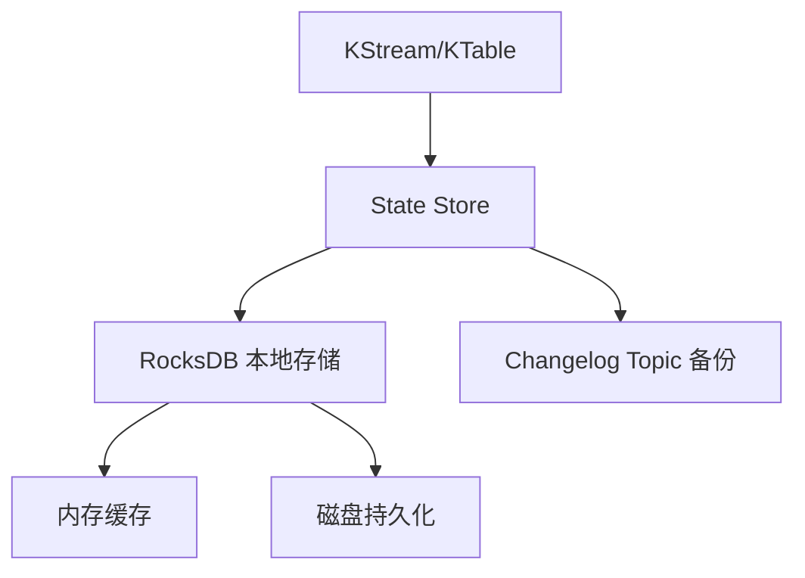
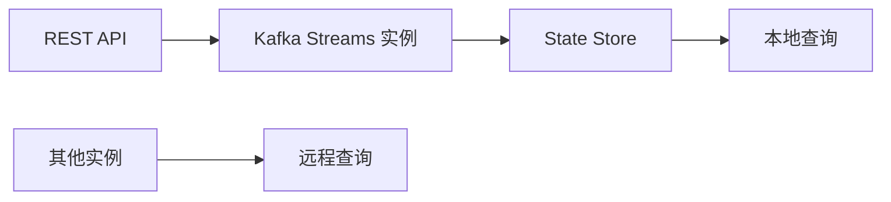
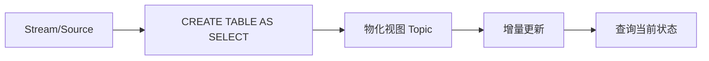
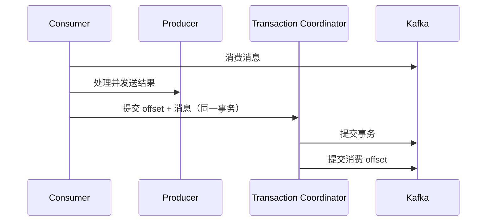
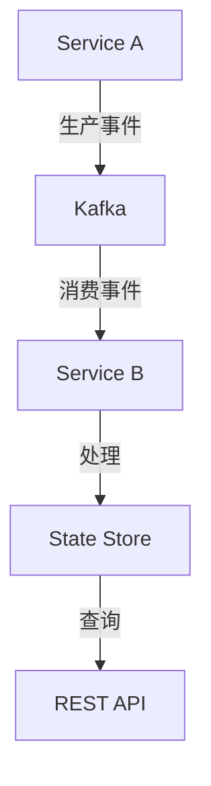

# Kafka Streams 与 ksqlDB（Kafka 生态流处理）

> Kafka Streams 是 **Apache Kafka 官方的轻量流处理库**（Java），ksqlDB 是构建在其上的 **SQL 流处理引擎**。核心思想「**流是数据库，数据库是流的物化视图**」——不部署独立集群，嵌入应用即用。相比 Flink（独立集群/重）、Spark Streaming（微批）、Storm（已边缘化），Kafka Streams 以「**零运维（复用 Kafka 集群）+ 库而非框架 + 状态精确一次（Streams DSL）**」独树一帜。本篇按「解决的问题 → 原理 → 特性 → 选型关注点」拆解。

---

## 一、要解决的问题

| 痛点 | 说明 |
|------|------|
| 流处理太重 | Flink/Spark 要部署集群、运维 Job，小场景不值当 |
| 应用内处理 | 消息消费后需要聚合/关联/窗口计算，不想引入新系统 |
| 状态管理 | 流计算（累加/去重/Join）需要本地状态 |
| 精确一次 | 消息重放要保证结果不重不丢 |
| 交互查询 | 实时计算的结果想直接查询（物化视图） |

> 核心认知：**Kafka Streams = 「把 Kafka 变成可编程流数据库」**——topic 是流，KTable 是表（物化视图），应用内写 Java 代码或 ksqlDB 写 SQL 即可处理。

---

## 二、核心原理

### 2.1 架构（无独立集群）

```
应用（Kafka Streams 库，多个实例组成拓扑）
  ├── Source Processor（消费 topic → 流）
  ├── 处理节点（filter/map/aggregate/join/window）
  ├── State Store（RocksDB 本地状态 + 变更日志 topic 备份）
  ├── Sink Processor（结果写回 topic）
  └── 交互式查询（REST 查 State Store 物化视图）

Kafka 集群：输入 topic / 输出 topic / changelog topic（状态备份）
```

**零运维**：不部署任何新组件——实例数 = 业务应用实例数，Kafka 自动做消费者组负载均衡/故障转移。

### 2.2 核心抽象：KStream / KTable / GlobalKTable

| 抽象 | 语义 | 说明 |
|------|------|------|
| KStream | 事件流 | 每一条记录都是新事件（append-only） |
| KTable | 变更日志表 | 同 key 只保留最新值（upsert，物化视图） |
| GlobalKTable | 全局表 | 所有实例全量拷贝（小维表 Join） |

**Kafka Streams 的 DSL（声明式）**：`map/filter/groupBy/aggregate/join/windowedBy` 链式编程，类似 Spark DataFrame。

### 2.3 有状态计算（State Store + Changelog）

```
聚合/Join/去重 → State Store（RocksDB，本地磁盘）
  ├── 写状态同时写 changelog topic（变更日志）
  ├── 实例重启 → 从 changelog 恢复状态
  └── 分区迁移 → 新实例重建状态
```

**选型关注点**：RocksDB 状态 + changelog 备份 = 状态精确一次的基础；代价是状态越大 changelog 流量越大。

### 2.4 精确一次语义（EOS）

- **幂等生产者**（enable.idempotence）+ **事务**（跨消费/生产原子提交）；
- 消费 offset 与输出结果在同一事务提交——失败重放不会产生重复结果。

```
EOS 实现：
  processing.guarantee=exactly_once_v2（Kafka 3.x）
  事务协调器（Transaction Coordinator）协调两阶段提交
  代价：事务有额外开销（非关键链路用 at-least-once + 幂等）
```

### 2.5 窗口与时间

| 窗口 | 说明 |
|------|------|
| Tumbling | 固定不重叠（每 5 分钟计数） |
| Hopping | 固定可滑动（每 1 分钟滑 10 秒） |
| Sliding | 按事件时间区间（Join 用） |
| Session | 按活跃间隔（用户会话） |

```
时间语义：
  事件时间（event-time，推荐）vs 处理时间（processing-time）vs 摄入时间（ingestion-time）
  水位线/延迟允许（grace period）：迟到的记录在允许窗口内仍计入
  窗口结果有"最终确定性"问题：窗口关闭后迟到的数据如何处理（suppression/grace）
```

### 2.6 交互式查询（Interactive Queries）

```
State Store 是本地物化视图 → 通过 REST/API 直接查询
  查询"当前累计金额/当前用户状态"
  分布式：实例间需发现（K8s service / 服务发现）
  与 ksqlDB 的 SELECT 联动（实时大屏直接查物化结果）
```

### 2.7 ksqlDB（SQL 化）

```sql
-- 流与表
CREATE STREAM orders (id BIGINT, amount DOUBLE, user STRING)
  WITH (KAFKA_TOPIC='orders', VALUE_FORMAT='AVRO');

-- 连续查询（持续物化，结果自动写回 topic）
CREATE TABLE order_stats AS
  SELECT user, SUM(amount) AS total
  FROM orders
  WINDOW TUMBLING (SIZE 1 MINUTE)
  GROUP BY user EMIT CHANGES;

-- 交互查询（REST）：直接查物化视图
SELECT * FROM order_stats WHERE user='u1' EMIT CHANGES;
```

```
ksqlDB 服务端：独立进程（ksqlDB server），管理多个查询
  用 SQL 把 Stream/Table 定义 + 连续查询 → 简化开发
  EMIT CHANGES：持续推送结果（物化视图增量）
  适合实时大屏/监控统计/轻量流 ETL
```

**选型关注点**：ksqlDB 让「流处理 SQL 化 + 结果即表（可查询）」——实时大屏/监控统计场景开发效率极高。

---

## 三、核心特性

| 特性 | 说明 |
|------|------|
| 零集群 | 复用 Kafka，无独立流处理集群 |
| 库嵌入 | Java 依赖即用，与微服务同进程 |
| 状态精确一次 | RocksDB + changelog + 事务 |
| 交互式查询 | State Store 物化视图 REST 查询 |
| 容错 | 消费者组机制自动故障转移 |
| 弹性 | 加实例自动重平衡（rebalance） |
| 时间语义 | 事件时间 + 水位线 + 四种窗口 |
| ksqlDB | SQL 流处理 + 连续物化视图 |
| 生态 | 与 Kafka Connect/Schema Registry 一体 |

---

## 四、Kafka Streams vs Flink vs Spark Structured Streaming

| 维度 | Kafka Streams | Flink | Spark Structured Streaming |
|------|---------------|-------|---------------------------|
| 形态 | 库（嵌入应用） | 独立集群框架 | 独立集群框架 |
| 运维 | 零（复用 Kafka） | 重（集群+Job） | 重（集群+Job） |
| 延迟 | 毫秒级 | 毫秒级 | 秒级（微批） |
| 状态 | RocksDB + changelog | RocksDB/内存 | 有状态（Stateful） |
| 精确一次 | 支持 | 支持 | 支持 |
| 复杂度 | 低 | 高 | 中 |
| 能力上限 | 中（Kafka 生态内） | 最高（复杂流处理） | 高（批流一体） |
| 适用 | 服务内实时处理 | 独立实时平台 | 批流统一平台 |

**选型关注点**：
- 服务内轻量实时处理（聚合/Join/清洗）→ **Kafka Streams**（零运维）；
- 独立实时数仓/复杂事件处理 → **Flink**；
- 批流一体统一平台 → **Spark**。

---

## 五、生产实践

### 5.1 关键配置

| 配置 | 建议 |
|------|------|
| 并行度 | 实例数 × 每个实例线程数 = 分区数（最优） |
| 状态目录 | state.dir 用 SSD/独立磁盘（RocksDB 写入） |
| 精确一次 | 重要链路 `processing.guarantee=exactly_once_v2` |
| RocksDB | 内存/缓存/压缩参数按状态大小调 |
| 交互查询 | 查询服务与流处理分开部署（实例发现：K8s service/发现服务） |
| 监控 | Kafka Lag + Streams 指标（kafka-streams-metrics） |

### 5.2 常见坑

- **实例数 > 分区数**：多余实例闲置（并行度 = 分区数）；
- **rebalance 风暴**：频繁重启/心跳超时导致反复重平衡 → 调大 session.timeout；
- **状态膨胀**：无界聚合状态无限增长 → 窗口/压缩/TTL 策略；
- **EOS 性能开销**：事务有额外开销，非关键链路用 at-least-once + 幂等；
- **拓扑变更**：改拓扑/变更状态结构需要停机迁移（state store 版本管理）；
- **反序列化错误**：消息格式不匹配 → 配置 error handling / dead-letter topic；
- **窗口延迟数据**：正确设置 grace 与 suppression，避免"结果回跳"。

### 5.3 典型应用

```
实时监控：统计每分钟各服务错误数（窗口聚合 → 物化视图 → 大屏）
实时推荐特征：用户行为流 + 用户画像表 join → 特征 topic
实时风控：交易流 + 规则聚合 → 异常事件 topic
流式 ETL：topic 清洗/格式转换 → 落湖/更新索引
```

---

## 六、选型速查

| 需求 | 首选 | 备选 |
|------|------|------|
| 服务内实时聚合/Join | Kafka Streams | ksqlDB |
| 实时大屏统计 | ksqlDB | Flink SQL |
| 独立实时数仓 | Flink | Spark Streaming |
| 批流一体 | Spark | Flink |
| 简单清洗转发 | Kafka Streams（几句代码） | 纯消费者 |

---

## 七、Kafka Streams State Store 内部机制

### 7.1 State Store 架构



### 7.2 State Store 类型

| 类型 | 说明 | 适用 |
|------|------|------|
| RocksDB Store | 本地磁盘存储 | 大状态（生产首选） |
| InMemory Store | 内存存储 | 小状态/测试 |
| Window Store | 窗口状态 | 时间窗口聚合 |
| Session Store | 会话状态 | 会话窗口 |

### 7.3 Changelog 机制

```
写入流程：
  1. 更新 State Store（RocksDB）
  2. 同时写入 Changelog Topic（备份）
  3. 返回成功

恢复流程：
  实例故障 → 新实例接管
  → 从 Changelog Topic 恢复状态
  → 重放变更事件
  → 状态重建完成

Changelog 配置：
  cleanup.policy=compact（保留最新值）
  压缩策略：同 key 只保留最新值
```

### 7.4 State Store 调优

| 参数 | 说明 | 建议 |
|------|------|------|
| `state.dir` | 状态目录 | SSD 磁盘 |
| `rocksdb.block.cache.size` | Block Cache 大小 | 按内存调整 |
| `rocksdb.write.buffer.size` | 写缓冲大小 | 64MB |
| `rocksdb.max.write.buffer.number` | 写缓冲数量 | 3 |
| `rocksdb.compaction.style` | Compaction 策略 | LEVEL |

---

## 八、Kafka Streams 交互式查询

### 8.1 查询架构



### 8.2 查询方式

| 方式 | 说明 | 适用 |
|------|------|------|
| 本地查询 | 查询当前实例的 State Store | 单实例 |
| 远程查询 | 查询其他实例的 State Store | 分布式 |
| 聚合查询 | 汇总所有实例的结果 | 全局统计 |

### 8.3 查询示例

```java
// 获取 State Store
ReadOnlyKeyValueStore<String, Long> store =
    KafkaStreams.queryableStoreStores().queryableStoreTypes()
        .keyValueStore("counts-store");

// 本地查询
Long value = store.get("key");

// 远程查询（通过 REST）
// GET /queryable-store/stores/counts-store/keys/key
```

### 8.4 查询最佳实践

| 实践 | 说明 |
|------|------|
| 查询路由 | 服务发现 + 负载均衡 |
| 缓存结果 | 减少 State Store 查询压力 |
| 异步查询 | 非阻塞查询 |
| 监控延迟 | 查询响应时间 |

---

## 九、ksqlDB Pull Query vs Push Query

### 9.1 查询类型对比

| 类型 | 说明 | 适用 |
|------|------|------|
| Pull Query | 一次性查询当前状态 | 交互式查询 |
| Push Query | 持续推送结果 | 实时大屏 |

### 9.2 Pull Query 特点

```
特点：
  一次查询，返回当前状态
  类似 SQL SELECT
  不会持续更新
  支持 WHERE 条件

使用场景：
  实时大屏查询当前值
  交互式数据分析
  API 查询物化视图

限制：
  不支持聚合函数（SUM/COUNT）
  只查询当前状态
```

### 9.3 Push Query 特点

```
特点：
  持续推送结果（EMIT CHANGES）
  类似数据库触发器
  实时更新
  支持窗口聚合

使用场景：
  实时大屏
  监控告警
  实时推荐

配置：
  EMIT CHANGES（持续推送）
  EMIT FINAL（窗口关闭后推送最终结果）
```

### 9.4 查询示例

```sql
-- Pull Query（一次性查询）
SELECT * FROM page_view_stats WHERE page_id = 'home';

-- Push Query（持续推送）
SELECT page_id, COUNT(*) FROM page_views
GROUP BY page_id EMIT CHANGES;

-- Push Query + 窗口
SELECT page_id, COUNT(*) FROM page_views
WINDOW TUMBLING (SIZE 5 MINUTES)
GROUP BY page_id EMIT FINAL;
```

---

## 十、ksqlDB 物化视图

### 10.1 物化视图原理



### 10.2 物化视图操作

```sql
-- 创建物化视图
CREATE TABLE order_stats AS
SELECT user_id, SUM(amount) AS total, COUNT(*) AS cnt
FROM orders
GROUP BY user_id;

-- 查询物化视图
SELECT * FROM order_stats WHERE user_id = 'u1';

-- 删除物化视图
DROP TABLE IF EXISTS order_stats;
```

### 10.3 物化视图 vs 流查询

| 维度 | 物化视图 | 流查询 |
|------|----------|--------|
| 结果 | 持久化到 Topic | 临时结果 |
| 查询 | 可 Pull Query | 只能 Push |
| 状态 | 持久化 | 不持久化 |
| 恢复 | 可恢复 | 不可恢复 |

---

## 十一、Kafka Streams Exactly-once 深入

### 11.1 EOS 实现原理



### 11.2 EOS 配置

```properties
# 启用 EOS
processing.guarantee=exactly_once_v2

# 生产者配置
enable.idempotence=true
transactional.id=my-streams-app
```

### 11.3 EOS 性能影响

| 维度 | at-least-once | exactly_once |
|------|---------------|--------------|
| 吞吐 | 高 | 中（事务开销） |
| 延迟 | 低 | 中 |
| 重复 | 可能 | 无 |
| 适用 | 非关键链路 | 关键链路 |

### 11.4 EOS 最佳实践

| 实践 | 说明 |
|------|------|
| 关键链路启用 | 财务/订单等场景 |
| 非关键用幂等 | 性能优先 |
| 监控事务 | 事务提交成功率 |
| 合理超时 | 避免事务超时 |

---

## 十二、Kafka Streams vs Flink vs Spark Streaming

### 12.1 核心对比

| 维度 | Kafka Streams | Flink | Spark Streaming |
|------|---------------|-------|-----------------|
| 形态 | 库嵌入应用 | 独立集群 | 独立集群 |
| 运维 | 零 | 重 | 重 |
| 延迟 | 毫秒 | 毫秒 | 秒 |
| 状态 | RocksDB + changelog | RocksDB/内存 | 有状态 |
| 窗口 | 4种 | 丰富 | 有限 |
| EOS | 事务 | Checkpoint | WAL+Checkpoint |
| SQL | ksqlDB | Flink SQL | Spark SQL |
| 复杂事件 | 有限 | 强（CEP） | 无 |
| 适用规模 | 中小 | 大 | 大 |

### 12.2 选型决策

```
场景选型：
  应用内轻量处理 → Kafka Streams（零运维）
  复杂流处理/CEP → Flink
  批流一体 → Spark
  实时数仓 SQL → Flink SQL / ksqlDB
  实时大屏 → ksqlDB
```

---

## 十三、Kafka Streams 在微服务

### 13.1 架构模式



### 13.2 微服务集成

```java
// Spring Boot 集成
@Bean
public KStream<String, Order> processOrders(StreamsBuilder builder) {
    KStream<String, Order> orders = builder.stream("orders");
    
    KTable<String, Long> stats = orders
        .groupBy((key, order) -> order.getUserId())
        .count();
    
    // 交互式查询
    ReadOnlyKeyValueStore<String, Long> store =
        kafkaStreams.store(
            StoreQueryParameters.fromNameAndType("counts-store", QueryableStoreTypes.keyValueStore())
        );
    
    return orders;
}
```

### 13.3 微服务最佳实践

| 实践 | 说明 |
|------|------|
| 状态独立 | 每个服务独立 State Store |
| 查询路由 | 服务发现 + 负载均衡 |
| 错误处理 | Dead Letter Topic |
| 监控 | Kafka Lag + 处理延迟 |

---

## 十四、ksqlDB UDF

### 14.1 UDF 类型

| 类型 | 说明 | 示例 |
|------|------|------|
| 标量 UDF | 输入→输出 | URL 解析 |
| 聚合 UDF | 多行→一行 | 自定义聚合 |
| 表值函数 | 一行→多行 | JSON 展开 |

### 14.2 UDF 开发

```java
// 标量 UDF
@UdfDescription(name = "parse_url", ...)
public class ParseUrlUdf {
    @Udf
    public String parseUrl(String url, String part) {
        // 解析逻辑
    }
}

// 聚合 UDF
@UdfDescription(name = "string_agg", ...)
public class StringAggUdf {
    @Udaf(description = "字符串聚合")
    public StringAgg create() {
        return new StringAgg();
    }
}
```

### 14.3 UDF 注册与使用

```sql
-- 注册 UDF
CREATE FUNCTION parse_url AS 'com.example.ParseUrlUdf';

-- 使用 UDF
SELECT parse_url(url, 'host') AS host FROM urls;

-- 删除 UDF
DROP FUNCTION IF EXISTS parse_url;
```

---

## 十五、与其他板块的关系

- Kafka 基础见「[Kafka](./Kafka.md)」；
- Flink 对比见「[Apache Flink 流处理](./ApacheFlink流处理.md)」；
- Schema（Avro/Protobuf）见「[Schema Registry 与消息序列化](./SchemaRegistry与消息序列化.md)」；
- 实时数仓见「[云上数仓与大数据生态](./云上数仓与大数据生态.md)」。

> 一句话：**Kafka Streams = 库形态（零集群）+ KStream/KTable 抽象 + RocksDB 状态（changelog 备份）+ EOS 事务；选型先看「形态（应用内轻量→Kafka Streams，独立平台→Flink）」，再定「编程（Java DSL→Streams，SQL→ksqlDB）」，最后配「并行度=分区数 + 状态磁盘 + 监控」**。

---

## 六、Kafka Streams DSL 详解

### 6.1 KStream 操作（事件流）

```java
StreamsBuilder builder = new StreamsBuilder();
KStream<String, Order> orders = builder.stream("orders");

// 过滤 + 映射
KStream<String, Order> bigOrders = orders
    .filter((key, order) -> order.getAmount() > 1000)
    .mapValues(order -> {
        order.setStatus("HIGH_VALUE");
        return order;
    });

// 分组聚合
KTable<String, Long> countByUser = orders
    .groupBy((key, order) -> order.getUserId())
    .count();

// 窗口聚合
KTable<Windowed<String>, Long> minuteCount = orders
    .groupBy((key, order) -> order.getUserId())
    .windowedBy(TimeWindows.ofSizeWithNoGrace(Duration.ofMinutes(1)))
    .count();
```

### 6.2 KTable 操作（变更日志表）

```java
// KTable = 同 key 最新值（物化视图）
KTable<String, UserProfile> profiles = builder.table("user-profiles");

// KStream + KTable Join（富化）
KStream<String, EnrichedOrder> enriched = orders
    .join(profiles,
        (order, profile) -> new EnrichedOrder(order, profile),
        Joined.with(Serdes.String(), orderSerde, profileSerde)
    );

// GlobalKTable Join（小维表，全量广播）
KTable<String, Product> products = builder.globalTable("products");
KStream<String, OrderWithProduct> withProduct = orders
    .join(products,
        (order, product) -> new OrderWithProduct(order, product),
        Joined.with(Serdes.String(), orderSerde, productSerde)
    );
```

### 6.3 窗口类型详解

| 窗口 | 语义 | 代码示例 |
|------|------|----------|
| Tumbling | 固定不重叠 | `TimeWindows.ofSizeWithNoGrace(Duration.ofMinutes(5))` |
| Hopping | 固定可滑动 | `TimeWindows.ofSizeWithNoGrace(Duration.ofMinutes(5)).advanceBy(Duration.ofMinutes(1))` |
| Sliding | 区间滑动（Join 用） | `JoinWindows.ofTimeDifferenceWithNoGrace(Duration.ofMinutes(5))` |
| Session | 活跃间隔 | `SessionWindows.ofInactivityGapAndGrace(Duration.ofMinutes(5), Duration.ofMinutes(1))` |

---

## 七、ksqlDB 高级特性

### 7.1 流式查询

```sql
-- 创建流
CREATE STREAM page_views (
    user_id VARCHAR KEY,
    page_id VARCHAR,
    view_time TIMESTAMP
) WITH (KAFKA_TOPIC='page_views', VALUE_FORMAT='AVRO');

-- 持续聚合（物化视图）
CREATE TABLE page_view_stats AS
    SELECT page_id, COUNT(*) AS view_count
    FROM page_views
    WINDOW TUMBLING (SIZE 5 MINUTES)
    GROUP BY page_id
    EMIT CHANGES;

-- 窗口连接（流-流 Join）
CREATE STREAM enriched_clicks AS
    SELECT c.user_id, c.page_id, u.name, u.age
    FROM clicks c
    JOIN users u ON c.user_id = u.user_id
    WITHIN 5 MINUTES
    EMIT CHANGES;
```

### 7.2 Push Query vs Pull Query

| 类型 | 说明 | 适用 |
|------|------|------|
| Push Query | 持续推送结果（EMIT CHANGES） | 实时大屏 |
| Pull Query | 一次性查询当前状态 | 交互式查询 |

```sql
-- Pull Query（查当前物化视图）
SELECT * FROM page_view_stats WHERE page_id = 'home' EMIT CHANGES;

-- Pull Query（一次性查询，类似 SQL）
SELECT * FROM page_view_stats WHERE page_id = 'home';
```

### 7.3 UDF（用户自定义函数）

```java
// 注册 UDF
@UdfDescription(name = "parse_url", ...)
public class ParseUrlUdf {
    @Udf
    public String parseUrl(String url, String part) {
        // 自定义解析逻辑
    }
}
```

```sql
-- 使用 UDF
CREATE FUNCTION parse_url AS 'com.example.ParseUrlUdf';
SELECT parse_url(url, 'host') AS host FROM urls;
```

---

## 八、Kafka Streams vs Flink 深度对比

| 维度 | Kafka Streams | Flink |
|------|---------------|-------|
| 部署 | 库嵌入应用（零集群） | 独立集群（需部署） |
| 状态存储 | RocksDB + changelog | RocksDB / 堆内存 / 外部存储 |
| 精确一次 | 事务（exactly_once_v2） | Checkpoint（exactly-once） |
| 窗口 | 4种（Tumbling/Hopping/Sliding/Session） | 丰富（Event/Processing/Ingestion） |
| 水位线 | 基于时间戳（简单） | 自定义水位线策略（灵活） |
| 复杂事件处理 | 有限 | 强（CEP 库） |
| 背压 | 依赖 Kafka | 反压机制（流量控制） |
| 批流一体 | 不支持 | 原生支持 |
| SQL | ksqlDB | Flink SQL |
| 适用规模 | 中小（应用内处理） | 大（独立平台） |

---

## 九、Kafka Streams 生产最佳实践

| 维度 | 建议 |
|------|------|
| 并行度 | 实例数 × 线程数 = 分区数 |
| 状态目录 | 用 SSD（RocksDB 写磁盘） |
| 精确一次 | 关键链路 `exactly_once_v2` |
| 监控 | Kafka Lag + Streams Metrics |
| 容错 | 消费者组自动故障转移 |
| 拓扑变更 | 停机迁移 + 状态 store 版本管理 |
| 错误处理 | dead-letter topic + 重试策略 |

---

## 十、与其他板块的关系（扩展）

- Kafka 基础见「[Kafka](./Kafka.md)」；
- Flink 对比见「[Apache Flink 流处理](./ApacheFlink流处理.md)」；
- Schema（Avro/Protobuf）见「[Schema Registry 与消息序列化](./SchemaRegistry与消息序列化.md)」；
- 实时数仓见「[云上数仓与大数据生态](./云上数仓与大数据生态.md)」；
- 对比 Spark Streaming 见「[Apache Spark 批处理](./ApacheSpark批处理.md)」；
- ClickHouse 实时分析见「[ClickHouse](./ClickHouse.md)」。

---

## 十一、速查表（扩展）

| 项 | 结论 |
|----|------|
| 类型 | Kafka 官方轻量流处理库 |
| 形态 | 库嵌入应用（零集群） |
| 核心抽象 | KStream / KTable / GlobalKTable |
| 状态存储 | RocksDB + changelog 备份 |
| 精确一次 | 事务（exactly_once_v2） |
| SQL 引擎 | ksqlDB（流式 SQL + 物化视图） |
| 窗口 | Tumbling / Hopping / Sliding / Session |
| 交互查询 | State Store 物化视图 REST 查询 |
| 适用场景 | 服务内实时聚合/清洗/Join |
| 替代方案 | Flink（复杂流处理）/ Spark（批流一体） |
| 一句话 | 「零运维的轻量流处理——库形态 + KStream/KTable + RocksDB 状态」 |