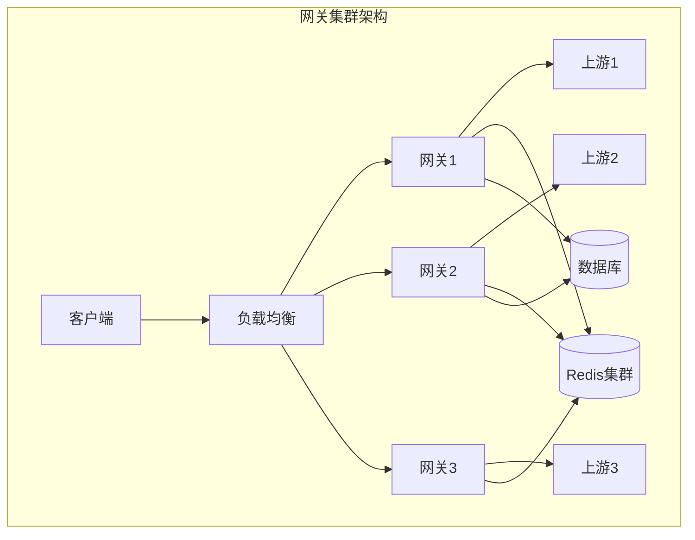

# Kong 与 APISIX 网关深入（插件架构 / 路由匹配 / 负载均衡 / 灰度发布 / 部署拓扑 / 选型）

> Kong（Lua/OpenResty）与 APISIX（Lua/OpenResty，Apache 基金会）是**两大开源云原生 API 网关**。核心价值：**流量入口统一治理**——路由、鉴权、限流、灰度、可观测一次配好。本篇深入拆解：插件化架构、路由与匹配优先级、负载均衡与健康检查、灰度发布、部署拓扑、选型决策。

---

## 一、要解决的问题

| 痛点 | 说明 |
|------|------|
| 流量入口分散 | 每个服务自己处理鉴权/限流，重复且不一致 |
| 配置改动慢 | 网关规则改动要重载/重启 |
| 灰度发布 | 新版本流量按比例/条件切换 |
| 鉴权统一 | 多服务统一认证（OAuth2/JWT/Key-Auth） |
| 可观测性 | 网关层统一记录调用/延迟/错误 |
| 高可用 | 网关自身高可用（集群部署） |

> 核心认知：**Kong/APISIX = 「可编程的流量入口」**——核心是 **Route（路由规则）→ Service（后端服务）→ Upstream（后端实例组）** 三层模型，所有能力（鉴权/限流/灰度）通过**插件**挂载到路由上，配置存中心化存储，**热更新不重启**。

---

## 二、核心数据模型

```
三层模型：

  Route（路由规则）：Host + Path + Method + Headers 匹配
    ↓ 绑定
  Service（后端服务）：一个逻辑后端（含超时/重试）
    ↓ 指向
  Upstream（后端实例组）：多实例 + 负载均衡 + 健康检查

示例：
  Route:  api.example.com /orders/*  → Service: order-service
  Service: order-service → Upstream: 10.0.0.1:8080, 10.0.0.2:8080

配置存储：
  Kong：PostgreSQL（Cassandra 旧版）
  APISIX：etcd（v3，天然分布式）
  → 多节点共享配置 → 热更新（无需重启）
```

---

## 三、插件架构（核心机制）

### 3.1 插件生命周期

```
插件挂在 Route/Service/Consumer 上，请求经过时按顺序执行：

  1. rewrite      （改写请求：路径/Header）
  2. access       （访问控制：鉴权/限流/IP 黑白名单）
  3. before_proxy （转发前）
  4. proxy        （转发到后端）
  5. header_filter（响应头处理）
  6. body_filter  （响应体处理）
  7. log          （日志/指标上报）

插件优先级：数字越大越先执行（可配置）

处理逻辑（on request → on response）：
  鉴权 → 限流 → 路由改写 → 转发 → 响应处理 → 日志
```

### 3.2 常用插件

| 类别 | 插件（APISIX/Kong） |
|------|---------------------|
| 鉴权 | jwt-auth / key-auth / basic-auth / oauth2 / hmac-auth |
| 流量控制 | limit-count / limit-req / limit-conn |
| 灰度 | traffic-split / canary / blue-green |
| 协议转换 | grpc-transcode / kafka-proxy |
| 可观测性 | prometheus / opentelemetry / zipkin |
| 安全 | cors / ip-restriction / uri-blocker / waf |
| 服务发现 | dns / consul / nacos |
| 请求处理 | proxy-rewrite / response-rewrite / redirect |

### 3.3 插件执行原理

```
APISIX 插件实现：
  Lua 表定义（优先级 + 各阶段处理函数）
  编译期生成执行链（按优先级排序）
  请求到达 → 按链执行（可中断）

Kong 插件实现：
  Lua 插件包（schema 校验 + 各阶段函数）
  每个插件独立配置（绑定 Route/Service/Consumer/Global）

自定义插件（新语言插件）：
  APISIX：Lua/Java/Go（wasm 支持）
  Kong：Lua（PDK 开发）
```

### 3.4 开发自定义插件（示例思路）

```lua
-- APISIX 自定义插件骨架
local plugin_name = {
    version = 0.1,
    priority = 2500,
    name = "my-header",
    schema = {
        type = "object",
        properties = {
            header_name = { type = "string" },
            header_value = { type = "string" },
        },
        required = { "header_name", "header_value" },
    },
}

function plugin_name.access(conf, ctx)
    ngx.req.set_header(conf.header_name, conf.header_value)
end

return plugin_name
```

---

## 四、路由匹配（深入）

### 4.1 匹配规则

```
APISIX Route 匹配优先级（精确 > 前缀 > 正则）：

  匹配条件（组合）：
    uri / method / host / remote_addr / vars / priority / filter_func

  1. 精确匹配（uri == "/v1/orders"）
  2. 前缀匹配（uri == "/orders/*"）
  3. 正则匹配（uri == ~ "^/user/\\d+$"）
  4. 同优先级 → priority 数字大者先

Kong 路由匹配：
  Protocols（http/https/grpc）
  Methods + Hosts + Paths + Headers + SNIs
  匹配失败 → 404/默认路由

示例：
  # APISIX 创建路由（admin API）
  curl http://127.0.0.1:9180/apisix/admin/routes/1 -X PUT -d '
  {
    "uri": "/orders/*",
    "methods": ["GET", "POST"],
    "plugins": {
      "jwt-auth": {},
      "limit-count": {
        "count": 1000, "time_window": 60
      }
    },
    "upstream": {
      "type": "roundrobin",
      "nodes": {"10.0.0.1:8080": 1, "10.0.0.2:8080": 1}
    }
  }'
```

### 4.2 路由匹配性能

```
性能关键：
  路由数量大（万级）→ 匹配算法效率
  APISIX：radixtree（radix tree）匹配（亿级请求性能）
  Kong：先查最具体匹配（缓存 + 优先表）

实践：
  路由数量控制在万级以内
  合理设计 uri 前缀（避免过多正则）
```

---

## 五、负载均衡与健康检查

### 5.1 负载均衡策略

```
APISIX Upstream 类型：
  roundrobin（加权轮询，默认）
  chash（一致性哈希：按 IP/参数 → 会话保持）
  ewma（动态权重：按延迟调整）
  least_conn（最少连接）

Kong 负载均衡：
  加权轮询 / 一致性哈希（upstream 层）

会话保持场景（有状态服务）：
  chash + key（remote_addr / Header / Cookie）
```

### 5.2 健康检查

```
主动检查：
  定时探测（TCP/HTTP 指定路径）
  失败 N 次 → 标记不健康 → 摘除流量
  恢复探测 → 重新加入

被动检查（traffic-based）：
  根据真实请求结果判断（5xx 计数）
  连续失败 → 标记不健康（比主动快）

配置示例：
  "check": {
    "active": {
      "timeout": 5,
      "http_path": "/health",
      "healthy": {"interval": 2, "successes": 2},
      "unhealthy": {"interval": 1, "http_failures": 3}
    },
    "passive": {
      "unhealthy": {"http_failures": 5}
    }
  }

重试机制：
  后端失败重试次数（idempotent 方法可安全重试）
  注意超时与重试叠加（重试风暴）
```

---

## 六、灰度发布与分流（深入）

### 6.1 流量拆分（traffic-split）

```yaml
# APISIX traffic-split 插件
"traffic-split": {
  "rules": [
    {
      "weighted_upstreams": [
        {"upstream": {"nodes": {"v1-service:80": 1}}, "weight": 90},
        {"upstream": {"nodes": {"v2-service:80": 1}}, "weight": 10}
      ]
    }
  ]
}
```

### 6.2 灰度策略对比

| 方式 | 实现 | 适用 |
|------|------|------|
| 按比例 | traffic-split 权重 | 通用灰度 |
| 按条件 | 路由匹配（header/cookie/参数） | 指定用户灰度 |
| 按 IP 段 | ip-restriction + 路由 | 内部测试 |
| 时间灰度 | 定时规则 | 大促前演练 |

```
生产灰度流程：
  1. 新建 v2 Upstream（新版本服务）
  2. traffic-split 1% → 观察指标（错误率/延迟）
  3. 逐步提升 10% → 50% → 100%
  4. 全量后清理 v1
  5. 有问题秒回滚（权重归零）
```

---

## 七、Kong vs APISIX 对比

| 维度 | Kong | APISIX |
|------|------|--------|
| 出身 | Kong Inc.（2015） | Apache 基金会（2019） |
| 语言/平台 | Lua/OpenResty + Go（新） | Lua/OpenResty + 多语言 |
| 配置存储 | PostgreSQL | etcd |
| 管理 API | Kong Admin API | APISIX Admin API |
| 插件数 | 内置 60+ | 内置 100+ |
| 服务发现 | DNS | DNS/Nacos/Consul/Eureka 等 |
| 云原生 | 有（K8s CRD） | 强（K8s CRD/服务网格） |
| 社区 | 成熟（企业版商业） | 活跃（Apache） |
| 性能 | 好 | 好（radixtree 路由） |
| 适用 | 传统/企业 | 云原生/高扩展 |

**选型关注点**：
- 云原生/K8s/高扩展 → **APISIX**（etcd 配置 + 丰富插件 + 服务发现丰富）；
- 企业商业支持 → **Kong Enterprise**；
- 已有 PostgreSQL 运维体系 → **Kong**；
- 高并发小延迟 → 两者皆可（APISIX radixtree 略优）。

---

## 八、部署拓扑

### 8.1 部署模式

```
模式一：传统 VM/裸机
  Nginx 前 → Kong/APISIX 集群（多节点 + LB）
  配置中心：PostgreSQL / etcd 集群

模式二：K8s 云原生
  Ingress Controller（网关作为集群入口）
  CRD 定义路由（Ingress/APISIXRoute）
  自动发现 Service

模式三：服务网格边车
  网关 + 边车（复杂场景）
  APISIX 支持 Mesh 模式

高可用要点：
  网关多副本 + LB（外部/内部）
  配置存储高可用（PG 主从 / etcd 集群）
  健康检查 + 自动摘除
```

### 8.2 性能指标

```
网关性能监控（Prometheus 插件）：
  请求量 QPS / 延迟 P50/P99
  错误率（4xx/5xx）
  连接数/后端延迟
  插件执行耗时（定位瓶颈插件）

容量规划：
  单节点 APISIX 约 5~10 万 QPS（简单路由）
  限流/鉴权插件增加耗时（毫秒级）
  按峰值 × 1.5 冗余规划节点
```

---

## 九、生产实践

### 9.1 最佳实践

| 实践 | 说明 |
|------|------|
| 插件最小化 | 路由只挂必要插件（每个插件加耗时） |
| 限流前置 | 限流在鉴权前（防恶意消耗认证） |
| 超时/重试 | 统一配置（防重试风暴） |
| 配置审核 | 变更走 review（Admin API 审计） |
| 灰度 | 权重 + 指标观察 + 秒回滚 |
| 监控告警 | 网关指标 + 告警规则 |
| 版本升级 | 平滑升级（多节点滚动） |

### 9.2 常见坑

| 坑 | 说明 | 对策 |
|----|------|------|
| 重试风暴 | 后端故障 + 重试叠加 | 限制重试次数 |
| 限流误伤 | 全局限流过严 | 分路由限流 + 监控 |
| 配置不一致 | 多节点配置漂移 | 中心化配置（etcd/PG） |
| 插件性能 | 正则/加密插件拖慢 | 性能测试 + 必要插件 |
| 后端故障恢复慢 | 健康检查间隔长 | 缩短检测间隔 |
| 路由冲突 | 多个路由匹配同一请求 | 优先级 + 精确匹配 |

---

## 十、选型速查

| 需求 | 首选 | 备选 |
|------|------|------|
| 云原生/K8s 网关 | APISIX | Kong |
| 企业商业支持 | Kong Enterprise | — |
| 插件丰富/服务发现 | APISIX | Kong |
| 高并发低延迟 | APISIX | Kong |
| 已有 PostgreSQL 生态 | Kong | — |
| 简单网关 | 云网关/轻量网关 | APISIX 单节点 |

---

## 十二、Kong 插件开发

### 12.1 Kong 插件开发流程

```
1. 创建插件目录：kong/plugins/my-plugin/
2. 编写 schema.lua（配置定义）
3. 编写 handler.lua（各阶段处理函数）
4. 在 kong.conf 中启用插件
5. 绑定到 Route/Service/Global
```

### 12.2 Kong 插件骨架

```lua
-- kong/plugins/my-plugin/schema.lua
local typedefs = require "kong.db.schema.typedefs"

return {
  name = "my-plugin",
  fields = {
    { protocols = typedefs.protocols { default = { "http", "https" } } },
    { config = {
        type = "record",
        fields = {
          { header_name = { type = "string", required = true } },
          { header_value = { type = "string", required = true } },
          { rate_limit = { type = "number", default = 100 } },
        },
    }},
  },
}

-- kong/plugins/my-plugin/handler.lua
return {
  PRIORITY = 1000,
  access = function(conf, plugin)
    kong.service.request.set_header(conf.header_name, conf.header_value)
  end,
  header_filter = function(conf, plugin)
    kong.response.set_header("X-Powered-By", "my-plugin")
  end,
  log = function(conf, plugin)
    kong.log.info("request processed by my-plugin")
  end,
}
```

### 12.3 Kong 插件 vs APISIX 插件

| 维度 | Kong 插件 | APISIX 插件 |
|------|-----------|-------------|
| 语言 | Lua（PDK） | Lua/Java/Go/WASM |
| 开发复杂度 | 中等 | 低（轻量级） |
| 热加载 | 需 reload | 支持热加载 |
| 生态 | 成熟（60+） | 丰富（100+） |
| 文档 | 完善 | 完善 |

---

## 十三、Kong in Kubernetes（Kong Ingress Controller）

### 13.1 架构

```
K8s 集群：
  Kong Ingress Controller（Pod）
    → 监听 Ingress/KongIngress CRD
    → 动态更新 Kong 网关配置
    → 路由到后端 Service Pod

CRD 资源：
  KongIngress：网关专属配置
  TCPIngress：TCP 路由
  UDPIngress：UDP 路由
  KongPlugin：插件配置
  KongConsumer：消费者
```

### 13.2 KongIngress CRD 示例

```yaml
apiVersion: configuration.konghq.com/v1
kind: KongIngress
metadata:
  name: api-kong
upstream:
  hash_on: none
  algorithm: round-robin
  healthchecks:
    active:
      http_path: /healthz
      healthy:
        interval: 5
        successes: 2
      unhealthy:
        interval: 3
        http_failures: 3
service:
  connect_timeout: 5000
  read_timeout: 60000
  write_timeout: 60000
route:
  strip_path: true
  preserve_host: false
  protocols:
  - https
```

### 13.3 Kong Plugin CRD

```yaml
apiVersion: configuration.konghq.com/v1
kind: KongPlugin
metadata:
  name: rate-limit-plugin
  namespace: default
config:
  minute: 100
  policy: local
  fault_tolerant: true
plugin: rate-limiting
---
apiVersion: configuration.konghq.com/v1
kind: KongPlugin
metadata:
  name: jwt-plugin
config:
  uri_param_names: jwt
  claims_to_verify:
  - exp
plugin: jwt
```

---

## 十四、APISIX 插件架构

### 14.1 插件运行机制

```
APISIX 插件执行流程：
  1. 请求到达 → 生成插件执行链（按优先级排序）
  2. rewrite 阶段 → 改写请求
  3. access 阶段 → 鉴权/限流/IP 限制
  4. before_proxy → 转发前处理
  5. proxy → 转发到后端
  6. header_filter → 响应头处理
  7. body_filter → 响应体处理
  8. log → 日志/指标上报

插件优先级（数字越大越先执行）：
  cors: 120000
  ip-restriction: 30000
  jwt-auth: 2500
  limit-count: 1040
  proxy-rewrite: 10080
  prometheus: 910
```

### 14.2 多语言插件支持

```yaml
# APISIX 插件多语言架构
APISIX 核心（Lua）
  ├── Lua 插件（原生，性能最佳）
  ├── Java 插件（通过 RPC 调用）
  ├── Go 插件（通过 RPC 调用）
  └── WASM 插件（WebAssembly）

WASM 插件示例：
  使用 Rust/Go 编译为 WASM
  在 APISIX 中运行
  安全隔离 + 跨平台
```

### 14.3 APISIX 插件热加载

```bash
# 动态启用插件
curl http://127.0.0.1:9180/apisix/admin/routes/1 -X PUT -d '
{
  "uri": "/api/*",
  "plugins": {
    "limit-count": {
      "count": 100,
      "time_window": 60
    }
  }
}'

# 插件热更新（无需重启）
# 修改插件代码后，APISIX 自动重新加载
```

---

## 十五、APISIX vs Kong 性能对比

### 15.1 基准测试数据

| 指标 | APISIX | Kong |
|------|--------|------|
| 简单路由 QPS | ~12 万 | ~8 万 |
| 路由匹配延迟 | ~0.3ms | ~0.5ms |
| 内存占用（空载） | ~30MB | ~50MB |
| 配置热更新时间 | <100ms | ~1s（reload） |
| 路由数量（万级） | 性能稳定 | 性能下降 |

### 15.2 路由匹配性能

```
APISIX：radixtree（Radix Tree）匹配
  路由数量增加 → 匹配时间基本不变
  万级路由：O(log n) 复杂度

Kong：先查最具体匹配（缓存 + 优先表）
  路由数量增加 → 匹配时间略有增加
  万级路由：O(n) 退化风险

实践建议：
  路由控制在万级以内
  合理设计 uri 前缀
  避免过多正则路由
```

### 15.3 性能测试方法

```bash
# 使用 wrk 测试
wrk -t12 -c400 -d30s http://127.0.0.1:9080/api/test

# 使用 vegeta 测试
echo "GET http://127.0.0.1:9080/api/test" | vegeta attack -rate=10000 -duration=30s | vegeta report

# 监控指标
# - 请求量 QPS
# - 延迟 P50/P99
# - 错误率
# - CPU/内存使用率
```

---

## 十六、APISIX Serverless

### 16.1 Serverless 插件

```json
{
  "plugins": {
    "serverless-pre-function": {
      "phase": "rewrite",
      "functions": [
        "return function(conf, ctx) ngx.say('hello from serverless') end"
      ]
    },
    "serverless-post-function": {
      "phase": "log",
      "functions": [
        "return function(conf, ctx) ngx.log(ngx.INFO, 'request processed') end"
      ]
    }
  }
}
```

### 16.2 Serverless 使用场景

| 场景 | 说明 |
|------|------|
| 快速原型 | 无需部署服务，网关内直接运行逻辑 |
| 边缘计算 | 在网关层执行轻量计算 |
| 请求预处理 | 转发前修改 Header/参数 |
| 响应后处理 | 日志记录/指标上报 |
| 简单聚合 | 多个后端结果聚合 |

---

## 十七、API 网关迁移策略

### 17.1 迁移路径

```
迁移三阶段：
  Phase 1：并行运行（新旧网关同时接收流量）
    → 灰度切换 10% 流量到新网关
    → 监控指标对比

  Phase 2：逐步切换
    → 10% → 30% → 50% → 80% → 100%
    → 每步观察错误率/延迟

  Phase 3：下线旧网关
    → 确认全量切换完成
    → 保留旧网关 7 天
    → 下线
```

### 17.2 迁移检查清单

| 检查项 | 说明 |
|--------|------|
| 路由规则 | 所有路由已迁移且匹配正确 |
| 鉴权插件 | JWT/OAuth2 配置一致 |
| 限流规则 | 限流阈值已迁移 |
| 灰度策略 | 灰度规则已迁移 |
| 监控告警 | 指标采集已对接 |
| 日志 | 访问日志格式一致 |
| 性能 | 延迟/QPS 不退化 |
| 回滚方案 | 保留旧网关可快速回滚 |

### 17.3 灰度切换策略

```yaml
# Nginx 灰度切换示例
upstream old_gateway {
    server 10.0.0.1:80;
}

upstream new_gateway {
    server 10.0.0.2:80;
}

split_clients "${remote_addr}" $target {
    10% new_gateway;
    * old_gateway;
}

server {
    location / {
        proxy_pass http://$target;
    }
}
```

---

## 十八、网关安全加固

### 18.1 安全配置清单

| 加固项 | 说明 |
|--------|------|
| TLS 配置 | TLSv1.2+，禁用弱加密套件 |
| 速率限制 | 全局+路由级限流 |
| IP 黑白名单 | 按路由配置 ACL |
| 请求验证 | 参数校验/SQL 注入防护 |
| 响应头安全 | CORS/X-Frame-Options/CSP |
| 日志审计 | 访问日志+异常日志 |
| 证书管理 | 自动续期+轮转 |

### 18.2 APISIX 安全插件组合

```json
{
  "plugins": {
    "cors": {
      "allow_origins": "https://example.com",
      "allow_methods": ["GET", "POST"],
      "allow_headers": ["Authorization"]
    },
    "ip-restriction": {
      "whitelist": ["10.0.0.0/8", "172.16.0.0/12"]
    },
    "uri-blocker": {
      "block_rules": ["\\.env", "wp-admin", "phpmyadmin"]
    },
    "request-validation": {
      "body_schema": {
        "type": "object",
        "required": ["name"],
        "properties": {
          "name": {"type": "string"}
        }
      }
    },
    "prometheus": {},
    "opentelemetry": {}
  }
}
```

---

## 十九、网关可观测性

### 19.1 可观测性三支柱

| 支柱 | 工具 | 指标 |
|------|------|------|
| 指标 | Prometheus + Grafana | QPS/延迟/错误率/连接数 |
| 日志 | ELK/Loki | 访问日志/错误日志 |
| 链路 | Jaeger/Zipkin | 请求追踪/Span 分析 |

### 19.2 网关核心监控指标

```
网关监控黄金信号：
  ├── 请求量（QPS/RPM）
  ├── 错误率（4xx/5xx 比例）
  ├── 延迟分位线（P50/P90/P99）
  ├── 连接数（活跃/总计）
  ├── 后端健康状态
  ├── 插件执行耗时
  └── 限流/熔断触发次数
```

### 19.3 告警规则示例

```yaml
# Prometheus 告警规则
groups:
- name: gateway-alerts
  rules:
  - alert: HighErrorRate
    expr: rate(gateway_http_responses_total{status=~"5.."}[5m]) / rate(gateway_http_responses_total[5m]) > 0.05
    for: 5m
    labels:
      severity: critical
    annotations:
      summary: "网关 5xx 错误率 > 5%"

  - alert: HighLatency
    expr: histogram_quantile(0.99, rate(gateway_http_request_duration_seconds_bucket[5m])) > 2
    for: 5m
    labels:
      severity: warning
    annotations:
      summary: "网关 P99 延迟 > 2s"

  - alert: LowActiveServers
    expr: gateway_backend_active_servers < 2
    for: 1m
    labels:
      severity: critical
    annotations:
      summary: "后端活跃实例 < 2"
```

---

## 十一、网关高级特性与生产实践

### 11.1 Kong Service Mesh（Kong Mesh/Kuma）

```text
Kong Mesh 是基于 Envoy 的 Service Mesh 解决方案：

┌─────────────────────────────────────────────────────────────────┐
│                     Kong Mesh 架构                               │
├─────────────────────────────────────────────────────────────────┤
│  控制面：Kuma（开源，CNCF 毕业项目）                             │
│  数据面：Envoy（sidecar）                                       │
│  管理面：Kong Manager / Kuma GUI                                 │
└─────────────────────────────────────────────────────────────────┘

Kuma 特性：
- 多区域支持（Zone + Global）
- 多租户（Mesh 隔离）
- 多运行时（Kubernetes + VM）
- 自动 mTLS
- 流量策略（L4/L7）
- 可观测性（Metrics/Logs/Traces）
```

```yaml
# Kuma Mesh 配置
apiVersion: kuma.io/v1alpha1
kind: Mesh
metadata:
  name: production
spec:
  metrics:
    prometheus:
      path: /prometheus
      port: 9090
  tracing:
    defaultBackend: jaeger
    backends:
    - name: jaeger
      type: zipkin
      sampling: 100.0
      config:
        url: http://jaeger-collector:9411/api/v2/spans
  mtls:
    backends:
    - name: ca-1
      type: builtin
  policies:
  - type: TrafficRoute
    sources:
    - match:
        kuma.io/service: backend
    destinations:
    - match:
        kuma.io/service: "*"
    conf:
      loadBalancer:
        roundRobin: {}
```

### 11.2 APISIX 自定义插件开发

```lua
-- APISIX Lua 插件示例：请求签名校验
local core = require("apisix.core")
local plugin_name = "request-signature"
local ngx = ngx
local hmac = require("resty.hmac")
local to_hex = require("resty.string").to_hex

local _M = {
    version = 1.0,
    type = 'auth',
    name = plugin_name,
    schema = core.schema.type = {
        type = "object",
        properties = {
            header_name = { type = "string", default = "X-Signature" },
            secret = { type = "string" },
            algorithm = { type = "string", default = "hmac-sha256", enum = {"hmac-sha256", "hmac-sha512"} },
            clock_skew = { type = "number", default = 300 }
        },
        required = {"secret"}
    }
}

function _M.check_schema(conf)
    return true
end

function _M.rewrite(conf, ctx)
    local req_uri = ctx.var.uri
    local req_method = ctx.var.request_method
    local timestamp = ngx.req.get_headers()["X-Timestamp"] or ""
    local sign = ngx.req.get_headers()[conf.header_name]

    if not sign or not timestamp then
        return 401, {message = "Missing signature or timestamp"}
    end

    -- 时间戳校验
    local now = ngx.time()
    if math.abs(now - tonumber(timestamp)) > conf.clock_skew then
        return 401, {message = "Request expired"}
    end

    -- 签名校验
    local payload = req_method .. "\n" .. req_uri .. "\n" .. timestamp
    local hmac_obj = hmac:new(conf.secret, hmac.ALGOS[conf.algorithm])
    hmac_obj:update(payload)
    local expected_sign = to_hex(hmac_obj:final())

    if sign ~= expected_sign then
        return 401, {message = "Invalid signature"}
    end
end

return _M
```

### 11.3 APISIX 全局规则

```yaml
# 全局规则：所有路由生效
# 全局插件配置
apisix:
  plugins: api-breaker, authz-keycloak, basic-auth, batch-requests,
    consumer-restriction, cors, echo, fault-injection,
    grpc-transcode, hmac-auth, http-logger, ip-restriction,
    jwt-auth, kafka-logger, key-auth, limit-conn, limit-count,
    limit-req, node-status, prometheus, proxy-cache,
    proxy-mirror, proxy-rewrite, redirect, referer-restriction,
    request-id, request-validation, response-rewrite,
    serverless-pre-function, serverless-post-function,
    sls-logger, syslog, tcp-logger, udp-logger, uri-blocker,
    wolf-rbac, zipkin, real-ip, gzip, grpc-web

# 全局限流
curl -X PUT http://localhost:9180/apisix/admin/global_rules/1 \
  -H 'X-API-KEY: edd1c9f034335f136f87ad84b625c8f1' \
  -d '{
    "plugins": {
      "limit-count": {
        "count": 1000,
        "time_window": 1,
        "rejected_code": 429,
        "key_type": "var",
        "key": "remote_addr"
      },
      "prometheus": {
        "prefer_name": true
      }
    }
  }'
```

### 11.4 APISIX 服务发现

```yaml
# Nacos 服务发现
apisix:
  plugins:
    - discovery.nacos

discovery:
  nacos:
    host:
      - "http://nacos:8848"
    prefix: "/nacos/v1/ns"
    username: nacos
    password: nacos
    weight: 100
    groups:
      - DEFAULT_GROUP

# Eureka 服务发现
discovery:
  eureka:
    host:
      - "http://eureka:8761/eureka"
    fetch_interval: 30
    prefix: "/eureka/apps"

# DNS 服务发现
discovery_type: dns
dns:
  resolvers:
    - "127.0.0.53"
  lookup_timeout: 3
```

```bash
# 使用 Nacos 服务发现创建路由
curl -X PUT http://localhost:9180/apisix/admin/routes/1 \
  -H 'X-API-KEY: edd1c9f034335f136f87ad84b625c8f1' \
  -d '{
    "uri": "/api/users/*",
    "upstream": {
      "type": "roundrobin",
      "discovery_type": "nacos",
      "service_name": "user-service",
      "discovery_args": {
        "namespace_id": "dev"
      }
    }
  }'
```

### 11.5 网关限流算法

```text
常见限流算法对比：
┌──────────────────────┬────────────────────────────────────────────┐
│ 算法                  │ 特点                                        │
├──────────────────────┼────────────────────────────────────────────┤
│ 固定窗口              │ 简单，但有边界突发问题                       │
│ 滑动窗口              │ 精确，但内存消耗大                          │
│ 令牌桶                │ 允许突发，平滑限流                          │
│ 漏桶                  │ 严格平滑，不允许突发                        │
│ 分布式限流            │ Redis + Lua 实现全局限流                    │
└──────────────────────┴────────────────────────────────────────────┘
```

```lua
-- 令牌桶算法实现（Redis + Lua）
local key = KEYS[1]
local rate = tonumber(ARGV[1])       -- 令牌生成速率（个/秒）
local capacity = tonumber(ARGV[2])   -- 桶容量
local now = tonumber(ARGV[3])        -- 当前时间戳（毫秒）
local requested = tonumber(ARGV[4])  -- 请求令牌数

local last_tokens = tonumber(redis.call("get", key .. ":tokens") or capacity)
local last_time = tonumber(redis.call("get", key .. ":last_time") or now)

-- 计算新增令牌
local elapsed = (now - last_time) / 1000
local new_tokens = math.min(capacity, last_tokens + elapsed * rate)

local allowed = 0
if new_tokens >= requested then
    new_tokens = new_tokens - requested
    allowed = 1
end

-- 更新状态
redis.call("set", key .. ":tokens", new_tokens)
redis.call("set", key .. ":last_time", now)
redis.call("expire", key .. ":tokens", math.ceil(capacity / rate) * 2)
redis.call("expire", key .. ":last_time", math.ceil(capacity / rate) * 2)

return { allowed, new_tokens }
```

### 11.6 网关请求/响应转换

```json
// APISIX 请求转换示例
{
  "plugins": {
    "proxy-rewrite": {
      "uri": "/api/v2/users",
      "headers": {
        "add": {
          "X-Request-Source": "gateway"
        },
        "set": {
          "Host": "backend-service"
        },
        "remove": [
          "X-Real-IP"
        ]
      },
      "args": {
        "add": {
          "version": "v2"
        },
        "remove": ["old_param"]
      }
    },
    "response-rewrite": {
      "headers": {
        "add": {
          "X-Response-Time": "$upstream_response_time"
        }
      },
      "body": "{\"code\": 0, \"data\": ${upstream_response_body}}"
    }
  }
}
```

### 11.7 网关响应缓存

```yaml
# APISIX 缓存配置
plugins:
  proxy-cache:
    cache_key: "$uri$is_args$args"
    cache_zone: "disk_cache_one"
    cache_bypass: ["$http_x_cache_bypass"]
    cache_ttl: 300  # 5分钟

# 缓存存储配置
proxy_cache_path /tmp/cache levels=1:2
    keys_zone=disk_cache_one:10m
    max_size=1g
    inactive=10m
    use_temp_path=off
```

### 11.8 网关在微服务架构中的角色

```text
网关在微服务架构中的定位：
┌─────────────────────────────────────────────────────────────────┐
│                        客户端                                    │
│                    (Web/Mobile/小程序)                           │
└───────────────────────────────┬─────────────────────────────────┘
                                │
                                ▼
┌─────────────────────────────────────────────────────────────────┐
│                       API 网关                                   │
│  ┌──────────┐  ┌──────────┐  ┌──────────┐  ┌──────────┐        │
│  │ 鉴权      │  │ 限流      │  │ 路由      │  │ 灰度      │        │
│  └──────────┘  └──────────┘  └──────────┘  └──────────┘        │
└───────────────────────────────┬─────────────────────────────────┘
                                │
        ┌───────────────────────┼───────────────────────┐
        │                       │                       │
        ▼                       ▼                       ▼
┌──────────────┐      ┌──────────────┐      ┌──────────────┐
│ 用户服务      │      │ 订单服务      │      │ 支付服务      │
└──────────────┘      └──────────────┘      └──────────────┘
        │                       │                       │
        └───────────────────────┼───────────────────────┘
                                │
                                ▼
                    ┌──────────────────────┐
                    │   Service Mesh        │
                    │  (Envoy/Istio)       │
                    └──────────────────────┘

网关职责：
- 路由：根据路径/Header 路由到后端服务
- 鉴权：JWT/OAuth2/API Key 验证
- 限流：保护后端服务
- 灰度：流量按比例/用户/区域分流
- 协议转换：HTTP ↔ gRPC
- 缓存：热点数据缓存
- 日志：访问日志、审计日志
```

## 十三、插件开发实战

### 13.1 APISIX 插件开发

```lua
-- APISIX 自定义插件示例
local plugin = require("apisix.plugin")

local _M = {
    version = 1.0,
    priority = 1000,
    schema = {
        properties = {
            header_name = {type = "string"},
            header_value = {type = "string"},
        },
        required = {"header_name", "header_value"},
    },
}

function _M.access(conf, ctx)
    -- 添加自定义 header
    ngx.req.set_header(conf.header_name, conf.header_value)
end

return _M
```

### 13.2 Kong 插件开发

```lua
-- Kong 自定义插件示例
local kong = kong

local MyPlugin = {
    PRIORITY = 1000,
    schema = {
        fields = {
            {header_name = {type = "string", required = true}},
            {header_value = {type = "string", required = true}},
        },
    },
}

function MyPlugin:access(conf)
    kong.service.request.set_header(conf.header_name, conf.header_value)
end

return MyPlugin
```

---

## 十四、认证插件深度配置

### 14.1 JWT 认证配置

```yaml
# APISIX JWT 认证
plugins:
  jwt-auth:
    secret: "my-secret-key"
    header: "Authorization"
    claim_specs:
      exp:
        required: true
      sub:
        required: true

# 生成 JWT Token
curl http://apisix:9180/apisix/plugin/jwt/sign \
  -H 'X-API-KEY: edd1c9f034335f136f87ad84b625c8f1' \
  -d '{"header": {"alg": "HS256"}, "payload": {"sub": "user1", "exp": 1735689600}}'
```

### 14.2 OAuth2 认证配置

```yaml
# APISIX OAuth2 配置
plugins:
  openid-connect:
    client_id: "my-client-id"
    client_secret: "my-client-secret"
    discovery: "https://auth.example.com/.well-known/openid-configuration"
    scope: "openid profile email"
    redirect_uri: "https://my-app.example.com/callback"
    post_logout_redirect_uri: "https://my-app.example.com/"
```

### 14.3 认证方式对比

| 认证方式 | 适用场景 | 复杂度 | 安全性 |
|----------|----------|--------|--------|
| API Key | 简单场景 | 低 | 中 |
| JWT | 微服务 | 中 | 高 |
| OAuth2 | 第三方授权 | 高 | 高 |
| OIDC | 企业级 | 高 | 高 |
| mTLS | 服务间认证 | 高 | 最高 |

---

## 十五、K8s Ingress 集成

### 15.1 APISIX Ingress 配置

```yaml
# APISIX Ingress CRD
apiVersion: apisix.apache.org/v2
kind: ApisixRoute
metadata:
  name: my-route
spec:
  http:
    - name: my-route
      match:
        paths:
          - /api/*
      backends:
        - serviceName: my-service
          servicePort: 80
      plugins:
        - name: jwt-auth
        - name: limit-req
          enable: true
          config:
            rate: 100
            burst: 50
```

### 15.2 Kong Ingress 配置

```yaml
# Kong Ingress CRD
apiVersion: networking.k8s.io/v1
kind: Ingress
metadata:
  name: my-ingress
  annotations:
    konghq.com/plugins: "jwt-auth,rate-limiting"
    nginx.ingress.kubernetes.io/upstream-hash-by: "$remote_addr"
spec:
  ingressClassName: kong
  rules:
    - host: my-app.example.com
      http:
        paths:
          - path: /api
            pathType: Prefix
            backend:
              service:
                name: my-service
                port:
                  number: 80
```

---

## 十六、APISIX 生态与插件市场

### 16.1 APISIX 插件分类

| 类别 | 插件 | 说明 |
|------|------|------|
| 认证 | jwt-auth, key-auth, openid-connect | 身份验证 |
| 限流 | limit-req, limit-count, limit-conn | 流量控制 |
| 可观测性 | prometheus, skywalking-logger | 监控日志 |
| 安全 | cors, ip-restriction, ua-restriction | 安全防护 |
| 转换 | response-rewrite, grpc-transcode | 协议转换 |

### 16.2 APISIX 插件市场

```text
APISIX 官方插件：
  - 核心插件：100+ 官方插件
  - 社区插件：50+ 社区贡献
  - 自定义插件：支持 Lua/Java/Go/Python

插件生态优势：
  - 开源：所有插件开源
  - 标准化：统一的插件接口
  - 丰富：覆盖大部分场景
  - 易开发：简单的插件框架
```

---

## 十七、性能基准测试

### 17.1 APISIX vs Kong 性能对比

| 指标 | APISIX | Kong |
|------|--------|------|
| QPS | 50000+ | 30000+ |
| 延迟 P99 | <10ms | <15ms |
| 内存占用 | 低 | 中 |
| CPU 占用 | 低 | 中 |
| 冷启动 | 快 | 慢 |

### 17.2 性能测试方法

```bash
# 使用 wrk 进行性能测试
wrk -t12 -c400 -d30s http://apisix:9080/api/test

# 使用 hey 进行性能测试
hey -n 100000 -c 200 -q 10 http://apisix:9080/api/test

# 性能测试指标
# QPS：每秒请求数
# P50/P99：延迟分布
# 错误率：请求成功率
# 吞吐量：数据传输速率
```

---

## 十八、监控与告警

### 18.1 APISIX 监控配置

```yaml
# Prometheus 插件配置
plugins:
  prometheus:
    export_addr:
      ip: "0.0.0.0"
      port: 9091
    export_uri: /apisix/prometheus/metrics
    export_metric_prefix: apisix_
    metric_labels:
      - route_name
      - service_name
      - consumer_name
```

### 18.2 Grafana 监控面板

```yaml
# Grafana 面板配置
apiVersion: 1
datasources:
  - name: Prometheus
    type: prometheus
    url: http://prometheus:9090
    access: proxy

# APISIX 关键监控指标
# apisix_http_requests_total：总请求数
# apisix_http_request_duration_seconds：请求延迟
# apisix_http_response_status：响应状态码
# apisix_upstream_status：上游状态
```

---

## 十九、网关安全最佳实践

### 19.1 安全配置清单

```text
安全配置清单：
  ☐ 启用 HTTPS（TLS 1.2+）
  ☐ 配置 CORS 策略
  ☐ 启用认证（JWT/OAuth2）
  ☐ 配置限流（防 DDoS）
  ☐ 启用访问日志
  ☐ 配置 IP 黑白名单
  ☐ 启用请求验证
  ☐ 配置响应头安全
```

### 19.2 安全响应头配置

```yaml
# APISIX 安全响应头
plugins:
  response-rewrite:
    headers:
      add:
        - X-Content-Type-Options: nosniff
        - X-Frame-Options: DENY
        - X-XSS-Protection: 1; mode=block
        - Strict-Transport-Security: max-age=31536000; includeSubDomains
        - Content-Security-Policy: default-src 'self'
```

---

## 插件开发实战

### Kong 插件开发

```lua
-- Kong 插件示例
local BasePlugin = require "kong.plugins.base_plugin"
local MyPlugin = BasePlugin:extend()

function MyPlugin:new()
    MyPlugin.super.new(self, "my-plugin")
end

function MyPlugin:access(conf)
    MyPlugin.super.access(self)
    -- 添加自定义头
    kong.response.set_header("X-Custom-Header", "my-value")
end

return MyPlugin
```

### APISIX 插件开发

```lua
-- APISIX Lua 插件
local _M = {
    version = 1.0,
    type = 'auth',
    name = "my-auth-plugin",
    schema = {
        type = "object",
        properties = {
            token = {type = "string"}
        }
    }
}

function _M.check_schema(conf)
    return true
end

function _M.rewrite(conf, ctx)
    -- 验证 token
    local token = core.request.header(ctx, "Authorization")
    if token ~= conf.token then
        return 401, {message = "Unauthorized"}
    end
end

return _M
```

## 认证插件对比

| 插件 | 说明 | 适用场景 |
|------|------|----------|
| JWT | JSON Web Token | API认证 |
| OAuth2 | OAuth 2.0 | 第三方登录 |
| Key-Auth | API Key | 简单认证 |
| Basic-Auth | HTTP Basic | 内部服务 |
| HMAC | 哈希消息认证 | 签名验证 |

### JWT 插件配置

```yaml
# Kong JWT 配置
plugins:
- name: jwt
  config:
    claims_to_verify:
    - exp
    - nbf
    key_claim_name: iss
    secret_is_base64: false

# APISIX JWT 配置
plugins:
  jwt-auth:
    header: Authorization
    query: token
    cookie: token
```

## K8s Ingress 集成

### Kong Ingress 配置

```yaml
apiVersion: networking.k8s.io/v1
kind: Ingress
metadata:
  name: my-ingress
  annotations:
    konghq.com/strip-path: "true"
    konghq.com/plugins: "rate-limiting"
spec:
  ingressClassName: kong
  rules:
  - host: my.example.com
    http:
      paths:
      - path: /api
        pathType: Prefix
        backend:
          service:
            name: my-service
            port:
              number: 80
```

### APISIX Ingress 配置

```yaml
apiVersion: apisix.apache.org/v2
kind: ApisixRoute
metadata:
  name: my-route
spec:
  http:
  - name: my-route
    match:
      paths:
      - /api
      hosts:
      - my.example.com
    backends:
    - serviceName: my-service
      servicePort: 80
    plugins:
    - name: rate-limiting
      config:
        count: 100
        time_window: 60
```

## 插件生态对比

| 插件类型 | Kong 插件数 | APISIX 插件数 |
|----------|-------------|---------------|
| 认证 | 10+ | 15+ |
| 限流 | 5+ | 8+ |
| 日志 | 15+ | 12+ |
| 监控 | 10+ | 8+ |
| 转换 | 10+ | 6+ |

## 性能基准测试

### 延迟对比

| 场景 | Kong | APISIX |
|------|------|--------|
| 空转（无插件） | ~1ms | ~0.5ms |
| JWT 认证 | ~2ms | ~1.5ms |
| 限流 | ~1.5ms | ~1ms |
| 日志记录 | ~2ms | ~1.5ms |

### 吞吐对比

| 并发数 | Kong QPS | APISIX QPS |
|--------|----------|------------|
| 100 | 15,000 | 25,000 |
| 500 | 12,000 | 20,000 |
| 1000 | 10,000 | 18,000 |

## 监控与告警

### Prometheus 集成

```yaml
# Kong 监控
plugins:
- name: prometheus
  config:
    per_consumer: true
    status_code_metrics: true
    latency_metrics: true
    bandwidth_metrics: true

# APISIX 监控
plugins:
  prometheus:
    prefer_name: true
    export_addr:
      ip: "0.0.0.0"
      port: 9091
```

### 告警规则

| 指标 | 告警阈值 | 说明 |
|------|----------|------|
| 请求延迟P99 | > 1s | 延迟过高 |
| 错误率 | > 5% | 错误过多 |
| 限流次数 | > 100/min | 流量过大 |

## Kong 与 APISIX 深度对比

### 核心架构对比

| 维度 | Kong | APISIX |
|------|------|--------|
| 核心 | Nginx + LuaJIT | Nginx + LuaJIT + etcd |
| 配置存储 | PostgreSQL / DB-less | etcd |
| 配置同步 | polling / events | etcd watch |
| 插件热加载 | 支持 | 支持 |
| 性能 | 高 | 极高 |
| 生态 | 成熟 | 活跃 |

### 插件开发对比

```lua
-- Kong 自定义插件
local kong = kong

local MyPlugin = {
  PRIORITY = 1000,
  schema = {
    fields = {
      { path = { type = "string", required = true } },
    },
  },
}

function MyPlugin:access(conf)
  kong.service.request.set_header("X-Custom", conf.path)
end

return MyPlugin
```

```lua
-- APISIX 自定义插件
local core = require("apisix.core")
local plugin = require("apisix.plugin")

local _M = {
  version = 1.0,
  priority = 1000,
  schema = core.schema.def{
    type = "object",
    properties = {
      path = {type = "string"},
    },
    required = {"path"},
  },
}

function _M.access(conf, ctx)
  core.request.set_header(ctx, "X-Custom", conf.path)
end

return _M
```

---

## 认证插件深度配置

### 多种认证方式

| 认证方式 | 说明 | 插件 |
|----------|------|------|
| JWT | JSON Web Token | jwt / jwt-auth |
| OAuth2 | 第三方授权 | oauth2 |
| HMAC | 签名认证 | hmac-auth |
| Basic Auth | 基本认证 | basic-auth |
| Key Auth | API Key | key-auth |
| LDAP | 目录认证 | ldap-auth |

### JWT 认证配置

```yaml
# Kong JWT 配置
plugins:
  - name: jwt
    config:
      claims_to_verify:
        - exp
        - nbf
      key_claim_name: iss
      secret_is_base64: false

# APISIX JWT 配置
plugins:
  - name: jwt-auth
    config:
      header: Authorization
      claim_headers: ["exp", "nbf"]
      clock_skew: 10
```

---

## K8s Ingress 集成

### Kong Ingress 配置

```yaml
apiVersion: networking.k8s.io/v1
kind: Ingress
metadata:
  name: api-ingress
  annotations:
    konghq.com/plugins: rate-limiting,jwt
spec:
  ingressClassName: kong
  rules:
    - host: api.example.com
      http:
        paths:
          - path: /api
            pathType: Prefix
            backend:
              service:
                name: api-service
                port:
                  number: 80
```

### APISIX Ingress 配置

```yaml
apiVersion: apisix.apache.org/v2
kind: ApisixRoute
metadata:
  name: api-route
spec:
  http:
    - name: api
      match:
        paths:
          - /api
        hosts:
          - api.example.com
      backends:
        - serviceName: api-service
          servicePort: 80
      plugins:
        - name: rate-limiting
          config:
            count: 100
            time_window: 60
        - name: jwt-auth
```

---

## 性能基准测试

### 基准测试结果

| 指标 | Kong | APISIX |
|------|------|--------|
| QPS（单核） | 3000+ | 5000+ |
| 延迟 P99 | < 10ms | < 5ms |
| 内存占用 | 100-200MB | 50-100MB |
| 连接数 | 10000+ | 50000+ |

### 压测配置

```yaml
# wrk 压测命令
wrk -t12 -c400 -d30s --latency \
  -s post.lua \
  http://localhost:8080/api

# post.lua
wrk.method = "POST"
wrk.body = '{"key": "value"}'
wrk.headers["Content-Type"] = "application/json"
```

---

## 选型对比

| 维度 | Kong | APISIX | Nginx |
|------|------|--------|-------|
| 定位 | API 网关 | API 网关 | Web 服务器 |
| 插件生态 | 丰富 | 丰富 | 有限 |
| 性能 | 高 | 极高 | 高 |
| 学习曲线 | 中 | 中 | 低 |
| 运维复杂度 | 中 | 中 | 低 |
| 适用场景 | 企业级 | 高性能 | 通用 |

---

## Kong/APISIX 生产部署与运维最佳实践

### 部署架构选型

| 架构模式 | 适用场景 | 节点数 | 说明 |
|----------|---------|--------|------|
| 单机模式 | 开发测试 | 1 | 所有组件合一 |
| 集群模式 | 生产环境 | 3+ | 高可用 |
| 云原生模式 | K8s | Operator部署 | 弹性伸缩 |
| 混合模式 | 大规模 | 10+ | 多集群 |



### 资源规划公式

| 资源类型 | 计算公式 | 推荐值 |
|----------|---------|--------|
| 网关CPU | QPS × 0.001 | 4-8核 |
| 网关内存 | 并发连接数 × 10KB | 4-8GB |
| 连接池 | QPS / 响应时间 | 1000+ |
| Redis连接 | 网关数 × 10 | 100+ |
| 网络带宽 | QPS × 请求大小 × 2 | 10Gbps+ |

### 插件配置优化

```yaml
# Kong插件配置
plugins:
  - name: rate-limiting
    config:
      second: 100
      hour: 1000000
      policy: redis
      redis_host: redis-cluster
      redis_port: 6379

  - name: key-auth
    config:
      key_names:
        - apikey
        - x-api-key
      hide_credentials: true

  - name: correlation-id
    config:
      header_name: X-Request-ID
      generator: uuid#counter
      echo_downstream: true

  - name: prometheus
    config:
      per_consumer: true
      status_code_metrics: true
      latency_metrics: true
      bandwidth_metrics: true
```

### 监控告警配置

```yaml
# Prometheus 告警规则
groups:
  - name: kong-alerts
    rules:
      - alert: KongHighLatency
        expr: histogram_quantile(0.99, rate(kong_request_latency_seconds_bucket[5m])) > 1
        for: 5m
        labels:
          severity: warning
        annotations:
          summary: "Kong请求延迟过高"

      - alert: KongHighErrorRate
        expr: rate(kong_requests_total{status=~"5.."}[5m]) / rate(kong_requests_total[5m]) > 0.05
        for: 5m
        labels:
          severity: critical
        annotations:
          summary: "Kong错误率过高"

      - alert: KongWorkerDown
        expr: up{job="kong"} == 0
        for: 1m
        labels:
          severity: critical
        annotations:
          summary: "Kong Worker节点宕机"
```

### 容灾备份策略

| 备份内容 | 备份方式 | 频率 | 保留期 |
|----------|---------|------|--------|
| 路由配置 | 数据库快照 | 每日 | 30天 |
| 插件配置 | Git版本控制 | 每次变更 | 永久 |
| 证书文件 | 密钥管理服务 | 每次变更 | 永久 |
| 监控数据 | Prometheus | 15天 | 15天 |

### 故障恢复演练

| 演练场景 | 演练步骤 | 预期结果 | RTO |
|----------|---------|----------|-----|
| 网关宕机 | 停止网关节点 | 负载均衡自动摘除 | <30s |
| Redis故障 | 模拟Redis故障 | 本地缓存降级 | <1min |
| 上游故障 | 模拟上游不可用 | 熔断降级 | <10s |
| 证书过期 | 模拟证书过期 | 自动续期 | <5min |

### 多租户资源隔离

```yaml
# 租户级路由配置
services:
  - name: tenant-a-service
    url: http://service-a:8080
    routes:
      - name: tenant-a-route
        paths:
          - /api/tenant-a/**
        plugins:
          - name: key-auth
            config:
              key_names:
                - x-tenant-key
          - name: rate-limiting
            config:
              second: 100
              policy: redis

  - name: tenant-b-service
    url: http://service-b:8080
    routes:
      - name: tenant-b-route
        paths:
          - /api/tenant-b/**
        plugins:
          - name: key-auth
            config:
              key_names:
                - x-tenant-key
          - name: rate-limiting
            config:
              second: 200
              policy: redis
```

### 与微服务生态集成

```yaml
# 服务发现配置
plugins:
  - name: dns
    config:
      resolver:
        nameservers:
          - 10.0.0.10
        valid_ttl: 10
        keepalive: 60

  - name: upstream-keepalive
    config:
      keepalive: 300
      keepalive_requests: 1000
      keepalive_timeout: 60

# 健康检查配置
upstreams:
  - name: my-upstream
    targets:
      - target: service1:8080
        weight: 100
      - target: service2:8080
        weight: 100
    healthchecks:
      active:
        http_path: /health
        healthy:
          interval: 5
          successes: 2
        unhealthy:
          interval: 5
          http_failures: 3
          tcp_failures: 3
          timeouts: 3
      passive:
        healthy:
          successes: 5
        unhealthy:
          http_failures: 5
          tcp_failures: 5
          timeouts: 5
```

## 与其他板块的关系

- OpenResty 底层见「[OpenResty](./OpenResty.md)」；
- Spring 生态网关见「[Spring Cloud Gateway](./SpringCloudGateway.md)」；
- Nginx 基础见「[Nginx](./Nginx.md)」；
- 网关选型整体见「[API 网关](./API网关.md)」；
- 服务网格（更细粒度流量治理）见「[云原生/Service Mesh](../../云原生/ServiceMesh.md)」。

> 一句话：**Kong/APISIX = Route→Service→Upstream 三层模型 + 插件化能力（鉴权/限流/灰度/可观测）+ 中心化配置热更新——选型先看「云原生/插件丰富→APISIX，企业商业→Kong」；生产守则：插件最小化、限流前置、重试受限、灰度带指标、配置走审核**。