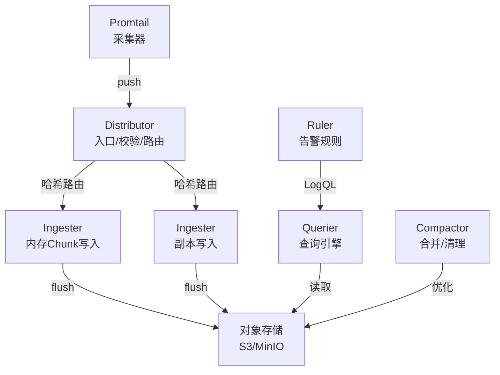
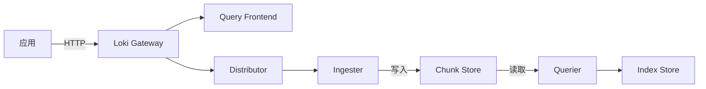
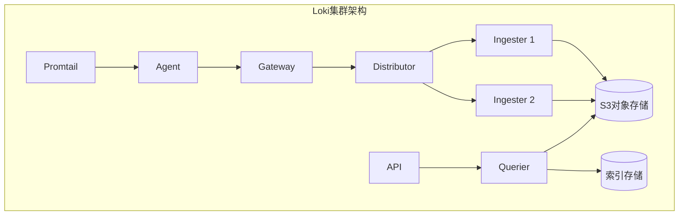
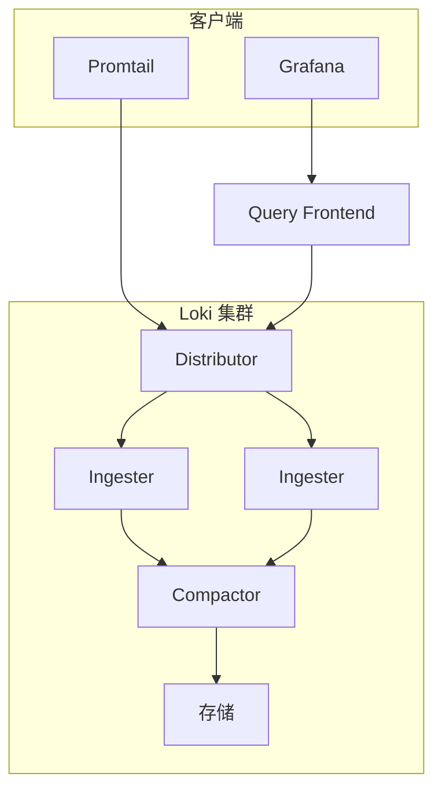

# Loki 深入（架构原理 / LogQL 查询 / Promtail 配置 / 分块存储 / 多租户 / 运维调优）

> Loki 是 Grafana 出品的**日志聚合系统**，核心理念「只索引标签，不索引日志内容」——比 ELK 便宜一个数量级，与 Prometheus/Grafana 无缝集成。本篇深入拆解：Loki 架构与存储、LogQL 查询语法、Promtail 采集配置、多租户、运维调优。

---

## 一、要解决的问题

| 痛点 | 说明 |
|------|------|
| ELK 成本高 | Elasticsearch 全量索引日志，资源消耗大、费用高 |
| 与监控割裂 | 日志系统和指标系统（Prometheus）两套，无法联动 |
| 多集群日志 | K8s 多集群/多环境日志统一管理 |
| 留存成本 | 日志量大，长期留存太贵 |
| 查询慢 | 海量日志全文搜索响应慢 |

> 核心认知：**Loki = 「只索引标签（如 Pod/服务名），日志内容当字符串存」**——查询先按标签定位日志流（就像按文件名定位日志文件），再做内容过滤；省掉全文索引 = 省掉大量 CPU/内存/磁盘。

---

## 二、架构

```
日志源（K8s 容器 / 主机 / 应用）
  └── Promtail（采集器：跟随日志文件，加标签，推送 Loki）
        │  （或其他客户端：Fluent Bit / Docker Driver / SDK）
        ▼
Loki（聚合查询）
  ├── Distributor（入口：校验/压测/去重 → 哈希路由）
  ├── Ingester（写入：内存 chunk → 定时刷盘对象存储）
  ├── Querier（查询：解析 LogQL → 按标签定位 → 读 chunk）
  ├── Compactor（合并/清理/索引管理）
  └── Ruler（告警规则：LogQL 条件告警）
        │
        ▼
存储：对象存储（S3/MinIO/OSS）+ 本地缓存（可选）

查询界面：Grafana Explore
```

---

## 三、存储模型（深入）

### 3.1 核心概念

```
Stream（日志流）：
  具有相同标签集合的日志集合（如 {app="order", pod="a-1"}）
  = Loki 的最小组织单位

Chunk（分块）：
  一个 Stream 的日志按时间切块存储
  默认压缩（snappy/gzip）→ 体积小

Index（索引）：
  只索引 标签 → Stream 的映射（不索引内容！）
  → 查询 = 按标签找 Stream → 读 chunk → 内容过滤
```

### 3.2 写入流程

```
1. Promtail 推送日志（带标签：namespace/pod/container）
2. Distributor：校验格式 → 按标签哈希路由到 Ingester
3. Ingester：日志追加到对应 Stream 的内存 chunk
4. Chunk 达到阈值（默认 1.5MB 或 15 分钟）→ 压缩 → 刷盘对象存储
5. 索引（标签 → chunk）更新

Flush 参数：
  chunk_idle_period（默认 30m，无新日志也刷）
  chunk_target_size（默认 1.5MB）
  max_chunk_age（默认 2h）
```

### 3.3 读取流程

```
1. 用户执行 LogQL 查询
2. Querier 解析标签选择器 → 查索引 → 定位 chunk
3. 拉取 chunk（对象存储）→ 解压 → 过滤内容（正则/子串）
4. 返回结果（Grafana 展示）

查询性能：
  标签定位（快）→ chunk 读取（中等）→ 内容过滤（慢，但省资源）
```

### 3.4 单机模式 vs 分布式模式

| 模式 | 部署 | 适用 |
|------|------|------|
| Single Binary | 单进程全组件 | 小规模/开发 |
| 简单可扩展（SSD） | 读写分离 | 中规模 |
| 分布式模式（微服务） | 各组件独立扩缩 | 大规模生产 |

---

## 四、LogQL 查询语法（深入）

### 4.1 基本语法

```
标签选择器（必须）：
  {app="order"}                          # 单标签
  {app="order", env="prod"}              # 多标签（AND）
  {app=~"order|user"}                    # 正则
  {namespace="default"} != {container="sidecar"}   # 排除

行过滤器（内容过滤）：
  |="keyword"         # 包含子串
  !="keyword"         # 不包含
  |~"regex"           # 正则匹配
  !~"regex"           # 正则不匹配
```

### 4.2 示例

```promql
# 查订单服务 5 分钟内的 ERROR 日志
{app="order"} |= "ERROR" |= "order_id=10086"

# 排除心跳日志
{app="order"} !~ "heartbeat|healthz"

# 解析日志内容为字段（logfmt/json）
{app="order"} |= "ERROR" | logfmt | level="error"

{app="order"} | json | status_code=500

# 正则提取
{app="order"} |~ "(?P<ip>\\d+\\.\\d+\\.\\d+\\.\\d+)" | ip="10.0.0.1"
```

### 4.3 聚合与指标查询

```
# 错误数（5 分钟窗口）
sum(rate({app="order"} |= "ERROR" [5m]))

# 按状态码统计
sum by (status_code) (count_over_time({app="order"} | json [5m]))

# 日志量趋势
sum(rate({app="order"} [5m]))

# 分位数（延迟日志）
quantile_over_time(0.99, {app="order"} | json | __error__="" | unwrap duration_ms [5m]) > 500
```

### 4.4 常用函数

| 函数 | 用途 |
|------|------|
| rate/count_over_time | 频率/计数 |
| sum by / avg by | 按标签聚合 |
| unwrap | 提取数值做指标 |
| quantile_over_time | 分位数 |
| topk | Top N |

---

## 五、Promtail 配置（采集器）

### 5.1 基本配置

```yaml
# promtail-config.yaml
clients:
  - url: http://loki:3100/loki/api/v1/push

scrape_configs:
  # K8s 自动发现（Pod 日志）
  - job_name: kubernetes-pods
    kubernetes_sd_configs:
      - role: pod
    relabel_configs:
      - source_labels: [__meta_kubernetes_namespace]
        target_label: namespace
      - source_labels: [__meta_kubernetes_pod_name]
        target_label: pod
      - source_labels: [__meta_kubernetes_pod_container_name]
        target_label: container
      - action: replace
        replacement: $1
        separator: /
        source_labels: [namespace, pod]
        target_label: instance

  # 主机日志文件
  - job_name: system
    static_configs:
      - targets: [localhost]
        labels:
          job: system
          __path__: /var/log/*.log
```

### 5.2 核心配置项

| 配置 | 说明 |
|------|------|
| clients.url | Loki 推送地址 |
| relabel_configs | 标签重写（加环境/团队） |
| pipeline_stages | 内容解析（提取字段做标签） |
| positions | 断点续传（文件位置记录） |
| backoff_config | 重试退避 |

### 5.3 Pipeline 解析阶段

```yaml
pipeline_stages:
  - regex:
      expression: "^(?P<level>\\w+) (?P<ts>\\d+) (?P<msg>.*)"
  - labels:
      level:       # 提取 level 做标签
  - timestamp:
      source: ts
      format: RFC3339
  - output:
      source: msg
```

**标签设计规范**（低成本关键）：

```
好的标签（低基数）：
  namespace / pod / container / service / level / env / 业务维度

坏的标签（高基数）：
  request_id / user_id / ip / 随机值 → 每个值一个 Stream → 爆炸！
```

---

## 六、多租户

```
多租户模式：
  每个租户隔离（写入/查询）
  X-Scope-OrgID Header 标识租户
  存储隔离（对象存储分前缀）

配置：
  auth_enabled: true  # 开启多租户
  写入/查询带租户 ID（Promtail/Grafana 配置）

用途：
  多部门/多项目日志隔离
  资源配额（per 租户）
  权限控制（按租户）
```

---

## 七、告警（Ruler）

```
Loki 自身支持告警：
  LogQL 条件 → 触发告警（如 5 分钟内错误日志 > N）

示例：
  groups:
  - name: error-alerts
    rules:
    - alert: HighErrorRate
      expr: sum(rate({app="order"} |= "ERROR" [5m])) > 10
      for: 5m
      labels:
        severity: critical
      annotations:
        summary: "订单服务错误日志过多"

通知渠道：Grafana Alerting（Slack/钉钉/邮件）
```

---

## 八、Loki vs ELK vs 云日志服务

| 维度 | Loki | ELK（ES） | 云日志服务 |
|------|------|-----------|------------|
| 索引策略 | 只索引标签 | 全量全文索引 | 全量索引（云端优化） |
| 存储成本 | 低（对象存储） | 高（副本+索引） | 中 |
| 查询能力 | 标签+内容过滤 | 全文/复杂聚合 | 全文+结构化 |
| 实时性 | 秒级 | 秒级 | 秒级 |
| 运维复杂度 | 低 | 高 | 无（托管） |
| 生态 | Grafana 一体 | Kibana 强大 | 云生态 |
| 适用 | 日志量大/成本敏感/监控联动 | 复杂全文检索/安全分析 | 省事/合规要求 |

**选型关注点**：
- 成本敏感 + Grafana 生态 → **Loki**；
- 复杂全文检索（安全分析/审计）→ **ELK**；
- 无运维能力/合规要求 → **云日志服务**。

---

## 九、运维与调优

### 9.1 容量规划

```
存储估算：
  原始日志 1GB/天 × 压缩比 ~4:1 → 约 250MB/天（对象存储）
  留存 30 天 → ~7.5GB/月

内存估算（Ingester）：
  chunk 内存 = 并发流 × chunk 大小
  监控指标：chunks_in_memory

查询性能：
  标签基数越低查询越快
  大范围查询（1 周）注意超时
```

### 9.2 性能调优

| 方向 | 优化 |
|------|------|
| 写入 | Distributor/Ingester 水平扩容；压缩（snappy） |
| 查询 | 缓存（chunk/索引缓存）；Querier 扩容 |
| 存储 | 对象存储 + 生命周期（热→冷→删） |
| 采集 | Promtail 多副本（DaemonSet）；标签规范化 |
| 高基数 | 限制标签基数（per_stream_rate_limit） |

### 9.3 常见坑

| 坑 | 说明 | 对策 |
|----|------|------|
| 高基数标签 | 每个 user_id 一个 Stream → 索引爆炸 | 标签规范审查 |
| Promtail 丢日志 | 退避过长/资源不足 | 调整 backoff/内存 |
| Ingester OOM | chunk 内存高 | 调 chunk 大小/扩容 |
| 查询超时 | 大范围查询 | 缩小范围/缓存 |
| 日志乱序 | 容器重启时间戳 | 调整容忍度配置 |
| 多租户误配 | 无租户 ID 被拒 | 统一配置 |

### 9.4 监控 Loki 自身

```
核心指标（Prometheus）：
  loki_request_duration_seconds
  chunks_in_memory（内存 chunk 数）
  rate（写入速率）
  查询延迟 P99
  对象存储错误率
```

---

## 十、选型速查

| 需求 | 首选 | 备选 |
|------|------|------|
| 成本敏感日志聚合 | Loki | 云日志服务 |
| Grafana 监控联动 | Loki | — |
| 复杂全文检索 | ELK | 云日志服务 |
| 合规审计 | ELK | 云日志服务 |
| K8s 多集群日志 | Loki + Promtail | 云日志 Agent |
| 无运维团队 | 云日志服务 | Loki 托管版 |

---

## 十二、Loki 架构深入（Ingester/Distributor/Querier）

### 12.1 核心组件职责



### 12.2 Distributor 详解

```
Distributor 职责：
  1. 接收 Promtail/Fluent Bit 推送的日志
  2. 校验日志格式（标签合法/时间戳合理）
  3. 按标签哈希路由到指定 Ingester
  4. 去重（相同 Stream 的重复日志）
  5. 限流（per_stream_rate_limit）

路由策略：
  标签哈希 → 确保相同 Stream 到同一 Ingester
  → 保证 Chunk 的完整性

副本写入：
  3 副本写入不同 Ingester
  → 防止单节点故障丢数据
```

### 12.3 Ingester 详解

```
Ingester 职责：
  1. 日志追加到内存 Chunk（按 Stream 组织）
  2. Chunk 达到阈值 → 压缩 → flush 到对象存储
  3. 维护索引（标签 → Chunk 映射）
  4. 处理查询（返回内存中未 flush 的数据）

Chunk 生命周期：
  新建 → 追加日志 → 达到阈值 → 压缩 → flush 到存储
  阈值：chunk_target_size(1.5MB) / max_chunk_age(2h) / chunk_idle_period(30m)

内存管理：
  chunks_in_memory 监控
  OOM 风险：高并发写入 + 大 Chunk → 内存打满
  对策：限制并发流数量 / 调小 Chunk / 扩容
```

### 12.4 Querier 详解

```
Querier 职责：
  1. 解析 LogQL 查询语句
  2. 按标签选择器查索引 → 定位 Chunk
  3. 从对象存储拉取 Chunk
  4. 解压 + 内容过滤（正则/子串）
  5. 返回结果

查询优化：
  标签定位（快）→ Chunk 缓存（中等）→ 内容过滤（慢）
  
  缓存策略：
    chunk 缓存（已解压的 Chunk 缓存到内存）
    索引缓存（标签 → Chunk 映射缓存）
    查询结果缓存（相同查询复用）
```

---

## 十三、Loki 无索引设计（Index-Free）

### 13.1 设计原理

```
传统日志系统（ELK）：
  全文索引（倒排索引）
  每个字段都建索引
  索引体积 ≈ 数据体积的 10~30%
  → 索引占用大量 CPU/内存/磁盘

Loki 设计：
  只索引 标签（labels）→ Stream 的映射
  不索引日志内容
  索引体积 ≈ 数据体积的 1~5%
  → 索引极小，存储成本极低

查询方式：
  标签定位（秒级，查索引）
  → 找到 Stream 对应的 Chunk
  → 读取 Chunk（对象存储）
  → 内容过滤（正则/子串，逐行扫描）
```

### 13.2 优劣对比

| 维度 | Loki（无索引） | ELK（全文索引） |
|------|---------------|----------------|
| 存储成本 | 低（对象存储） | 高（索引+副本） |
| 索引大小 | 极小（标签映射） | 大（全文倒排） |
| 查询灵活性 | 标签+内容过滤 | 全文检索（最强） |
| 查询延迟 | 标签查询快，内容过滤慢 | 全文检索快 |
| 写入性能 | 高（无索引开销） | 中（需建索引） |
| 运维复杂度 | 低 | 高（ES 集群） |

### 13.3 最佳实践

```
标签设计（低成本关键）：
  好的标签（低基数）：
    namespace / pod / container / service / level / env
    → 每个标签值组合形成一个 Stream
    → 数千~数万个 Stream

  坏的标签（高基数）：
    request_id / user_id / ip / 随机值
    → 每个值一个 Stream → 数百万 Stream → 索引爆炸！

查询优化：
  尽量用标签缩小范围（先标签后过滤）
  避免无标签的全文搜索（全量扫描）
  合理设置查询时间范围（避免大范围扫描）
```

---

## 十四、LogQL 深入

### 14.1 高级查询语法

```promql
# 日志流选择器
{app="order", env="prod"}              # 精确匹配
{app=~"order|user"}                    # 正则匹配
{app="order"} !~ "heartbeat"           # 正则排除

# 管道操作（按顺序执行）
{app="order"}
  |= "ERROR"                           # 包含子串
  | json                                # 解析 JSON
  | level="error"                       # 字段过滤
  | line_format "{{.timestamp}} {{.msg}}"  # 格式化输出
  | label_format status="{{.code}}"     # 标签重命名

# 解析器
| logfmt                               # logfmt 格式
| json                                 # JSON 格式
| regexp "(?P<ip>\\d+\\.\\d+\\.\\d+\\.\\d+)"  # 正则提取
| pattern "<ip> - - [<ts>] "<method> <path> <status> <size>""  # 模式解析
```

### 14.2 聚合操作

```promql
# 错误率（每秒错误数）
sum(rate({app="order"} |= "ERROR" [5m]))

# 按服务统计错误数
sum by (app) (count_over_time({app=~".*"} |= "ERROR" [5m]))

# Top 5 错误日志最多的 Pod
topk(5, sum by (pod) (count_over_time({app="order"} |= "ERROR" [5m])))

# 日志量趋势（每分钟）
sum(rate({app="order"} [1m])) * 60

# 延迟分位数（从日志中提取数值）
quantile_over_time(0.99,
  {app="order"} | json | unwrap duration_ms [5m]
) > 1000

# 错误日志占比
sum(rate({app="order"} |= "ERROR" [5m]))
/
sum(rate({app="order"} [5m]))
```

### 14.3 LogQL 常用函数

| 函数 | 用途 | 示例 |
|------|------|------|
| rate | 每秒速率 | rate({app="order"} [5m]) |
| count_over_time | 时间窗口计数 | count_over_time({app="order"} [5m]) |
| sum by | 按标签聚合求和 | sum by (app) (rate(...)) |
| topk | Top N | topk(5, sum by (app) (...)) |
| unwrap | 提取数值做指标 | unwrap duration_ms |
| quantile_over_time | 分位数 | quantile_over_time(0.99, ...) |
| line_format | 格式化输出 | line_format "{{.msg}}" |
| label_format | 标签名重命名 | label_format app="{{.service}}" |

---

## 十五、Loki in Kubernetes

### 15.1 部署架构

```
K8s 集群：
  DaemonSet: Promtail/Fluent Bit（每节点一个采集器）
  Deployment: Loki Distributor（入口）
  StatefulSet: Loki Ingester（写入，3 副本）
  Deployment: Loki Querier（查询）
  Deployment: Loki Compactor（合并清理）
  ConfigMap: Loki 配置
  PVC: 对象存储（S3/MinIO）

  Grafana: 查询界面
```

### 15.2 Promtail DaemonSet 配置

```yaml
apiVersion: apps/v1
kind: DaemonSet
metadata:
  name: promtail
spec:
  template:
    spec:
      serviceAccountName: promtail
      containers:
      - name: promtail
        image: grafana/promtail:2.9.0
        args:
        - -config.file=/etc/promtail/promtail.yaml
        volumeMounts:
        - name: config
          mountPath: /etc/promtail
        - name: varlog
          mountPath: /var/log
          readOnly: true
        - name: containers
          mountPath: /var/lib/docker/containers
          readOnly: true
      volumes:
      - name: config
        configMap:
          name: promtail-config
      - name: varlog
        hostPath:
          path: /var/log
      - name: containers
        hostPath:
          path: /var/lib/docker/containers
```

### 15.3 K8s 日志标签自动发现

```yaml
# promtail-config.yaml
scrape_configs:
- job_name: kubernetes-pods
  kubernetes_sd_configs:
  - role: pod
  relabel_configs:
  - source_labels: [__meta_kubernetes_namespace]
    target_label: namespace
  - source_labels: [__meta_kubernetes_pod_name]
    target_label: pod
  - source_labels: [__meta_kubernetes_pod_container_name]
    target_label: container
  - source_labels: [__meta_kubernetes_pod_label_app]
    target_label: app
  - action: replace
    source_labels: [__meta_kubernetes_pod_label_env]
    target_label: env
    replacement: production
```

---

## 十六、Loki vs ELK 全面对比

| 维度 | Loki | ELK |
|------|------|-----|
| 索引策略 | 只索引标签（1~5%） | 全文索引（10~30%） |
| 存储成本 | 低（对象存储） | 高（ES 集群+副本） |
| 查询能力 | 标签+内容过滤 | 全文检索+聚合 |
| 写入性能 | 高（无索引开销） | 中（建索引） |
| 运维复杂度 | 低（Grafana 一套） | 高（ES 集群运维） |
| 生态集成 | Prometheus/Grafana 一体 | Kibana 强大 |
| 多租户 | 原生支持 | 需额外配置 |
| 实时性 | 秒级 | 秒级 |
| 扩展性 | 水平扩展（对象存储） | 水平扩展（ES 集群） |
| 学习曲线 | 低 | 中高 |

**选型决策**：

| 场景 | 首选 | 理由 |
|------|------|------|
| 成本敏感 + Grafana 生态 | Loki | 存储成本低，与 Prometheus 一体 |
| 复杂全文检索（安全/审计） | ELK | 全文索引能力强 |
| 云原生 K8s 日志 | Loki | 轻量，K8s 集成好 |
| 日志做分析报表 | ClickHouse | 分析型查询强 |
| 无运维能力 | 云日志服务 | 托管免运维 |

---

## 十七、Loki 存储后端

### 17.1 存储选项

| 存储后端 | 说明 | 适用 |
|---------|------|------|
| BoltDB-shipper | 本地 BoltDB + 对象存储 | 中小规模 |
| AWS S3 | Amazon S3 | 大规模/云上 |
| GCS | Google Cloud Storage | GCP 环境 |
| Azure Blob | Azure Blob Storage | Azure 环境 |
| MinIO | S3 兼容对象存储 | 自建/测试 |
|/filesystem | 本地文件系统 | 单机/开发 |

### 17.2 BoltDB-shipper 架构

```
BoltDB-shipper 架构：
  Ingester → BoltDB（本地索引）
    → 定期上传到对象存储
  Querier → 从对象存储下载 BoltDB 快照
    → 合并查询

优势：
  索引在本地（查询快）
  对象存储存原始数据（成本低）
  无需独立索引服务

劣势：
  查询需下载索引（冷启动慢）
  多节点索引一致性（最终一致）
```

### 17.3 存储配置示例

```yaml
# loki.yaml
storage_config:
  boltdb_shipper:
    active_index_directory: /loki/index
    cache_location: /loki/cache
    shared_store: s3

  aws:
    s3: s3://access_key:secret_key@endpoint/bucket-name
    s3forcepathstyle: true

  filesystem:
    directory: /loki/chunks

chunk_store_config:
  chunk_cache_config:
    embedded_cache:
      enabled: true
      max_size_mb: 100

schema_config:
  configs:
  - from: "2024-01-01"
    store: boltdb-shipper
    object_store: s3
    schema: v11
    index:
      prefix: index_
      period: 24h
```

---

## 十八、Loki Ruler 告警

### 18.1 告警规则配置

```yaml
# ruler.yaml
groups:
- name: error-alerts
  rules:
  - alert: HighErrorRate
    expr: sum(rate({app="order"} |= "ERROR" [5m])) > 10
    for: 5m
    labels:
      severity: critical
      team: backend
    annotations:
      summary: "订单服务错误率过高"
      description: "过去 5 分钟错误率 {{ $value }}/s"

  - alert: LogVolumeSpike
    expr: sum(rate({app="order"} [5m])) > 1000
    for: 3m
    labels:
      severity: warning
    annotations:
      summary: "日志量突增"
      description: "日志量 {{ $value }}/s，可能是异常"
```

### 18.2 告警通知路由

```
Loki Ruler → Alertmanager → 通知渠道
  ├── Slack（即时通知）
  ├── 钉钉（国内常用）
  ├── 邮件（正式记录）
  ├── PagerDuty（on-call）
  └── Webhook（自定义）

Alertmanager 路由：
  severity: critical → 即时通知（Slack/电话）
  severity: warning → 延迟通知（邮件）
  severity: info → 仅记录
```

---

## 十九、Loki 性能调优

### 19.1 写入优化

| 方向 | 优化 |
|------|------|
| 分布式部署 | Distributor/Ingester 水平扩容 |
| 压缩 | 启用 snappy 压缩 |
| 批量推送 | Promtail batch_size 调大 |
| 限流 | per_stream_rate_limit 限制高基数流 |
| 标签规范 | 避免高基数标签 |

### 19.2 查询优化

| 方向 | 优化 |
|------|------|
| 缓存 | 启用 chunk 缓存 + 索引缓存 |
| Querier 扩容 | 水平扩展 Querier |
| 查询范围 | 限制最大查询时间范围 |
| 标签基数 | 降低标签基数 |
| 并行查询 | 开启并行查询（querier.parallelise_shardable_queries） |

### 19.3 容量规划

```
存储估算：
  日增量 × 压缩比 ≈ 实际存储
  示例：100GB/天 × 0.25 = 25GB/天
  30 天 = 750GB

内存估算：
  Ingester：并发流数 × chunk 大小
  Querier：查询并发数 × 结果集大小
  Distributor：相对轻量

CPU 估算：
  写入：主要在 Ingester（压缩）
  查询：主要在 Querier（过滤/聚合）
```

### 19.4 常见性能问题

| 问题 | 原因 | 解决 |
|------|------|------|
| 写入延迟高 | Ingester 瓶颈 | 扩容 Ingester / 降低写入速率 |
| 查询超时 | 大范围查询 | 缩小时间范围 / 增加标签过滤 |
| 内存 OOM | 高基数标签 / 大查询 | 限制标签基数 / 查询超时设置 |
| Chunk 碎片 | 小 Stream 多 | 合并小 Chunk / 调整 chunk 参数 |
| 对象存储延迟 | 网络/存储性能 | 使用 SSD / 就近部署 |

---

## 十一、Loki 高级特性与生产实践

### 11.1 Chunk Format（块格式）

```text
Loki 存储结构：
┌─────────────────────────────────────────────────────────────────┐
│                        对象存储                                  │
│  ┌──────────────────────────────────────────────────────────┐   │
│  │                      Chunks                               │   │
│  │  ┌─────────┐ ┌─────────┐ ┌─────────┐ ┌─────────┐        │   │
│  │  │ Chunk 1 │ │ Chunk 2 │ │ Chunk 3 │ │ Chunk N │        │   │
│  │  └─────────┘ └─────────┘ └─────────┘ └─────────┘        │   │
│  └──────────────────────────────────────────────────────────┘   │
│  ┌──────────────────────────────────────────────────────────┐   │
│  │                     Index (TSDB)                         │   │
│  │  Stream → Chunk 映射（标签 → 时间范围 → Chunk ID）        │   │
│  └──────────────────────────────────────────────────────────┘   │
└─────────────────────────────────────────────────────────────────┘

Chunk 格式：
┌─────────────────────────────────────────────────────────────────┐
│  Magic Number (4B) │ Version (2B) │ Encoding (2B) │ Length (4B) │
├─────────────────────────────────────────────────────────────────┤
│  Block 1 (compressed) │ Block 2 │ ... │ Block N                 │
└─────────────────────────────────────────────────────────────────┘

编码方式：
- None：原始文本
- Snappy：LZ4 + Snappy（默认）
- Gzip：高压缩比
- Zstd：快速压缩（推荐）
```

```go
// Loki Chunk 结构（简化）
type Chunk struct {
    MagicNumber uint32    // 0x4C4F4B49 ("LOKI")
    Version     uint16    // Chunk 版本
    Encoding    Encoding  // 编码方式
    Length      uint32    // 数据长度
    Blocks      []Block   // 压缩块
}

type Block struct {
    From       time.Time  // 起始时间
    To         time.Time  // 结束时间
    Entries    []Entry    // 日志条目
}

type Entry struct {
    Line       string     // 日志内容
    Timestamp  time.Time  // 时间戳
    StructuredMetadata []LabelPair  // 结构化元数据
}
```

### 11.2 查询优化

```logql
# 优化1：使用标签选择器减少扫描范围
# 差：全量扫描
{job="nginx"}

# 好：精确匹配
{job="nginx", env="production", region="us-west-2"}

# 优化2：使用 pipeline 操作符
# 差：全量过滤
{job="nginx"} |= "error"

# 好：先解析再过滤
{job="nginx"} | json | status >= 500

# 优化3：使用 line_format 只输出必要信息
{job="nginx"} | json | line_format "{{.timestamp}} {{.level}} {{.message}}"

# 优化4：使用 json_format 结构化输出
{job="nginx"} | json | json_format

# 优化5：使用 unwrap 提取数值进行聚合
{job="nginx"} | json | unwrap duration | rate()

# 优化6：避免使用正则表达式（性能差）
# 差：正则匹配
{job="nginx"} |~ "error.*timeout"

# 好：字符串匹配
{job="nginx"} | logfmt | level="error" | message |= "timeout"
```

```logql
# 高性能查询模板
# 1. 使用 label_replace 优化标签
{job="nginx"}
| label_replace("service", "(.*)", "job", "$1", ".*")
| json
| level == "error"
| line_format "{{.timestamp}} [{{.service}}] {{.message}}"

# 2. 使用 topk 找出最慢的请求
topk(10,
  sum by (path) (
    rate({job="nginx"} | json | unwrap duration [5m])
  )
)

# 3. 使用 count_over_time 统计错误率
sum(count_over_time({job="nginx"} | json | level="error" [5m]))
/
sum(count_over_time({job="nginx"} [5m]))
```

### 11.3 Recording Rules（录制规则）

```yaml
# Loki Ruler 配置
ruler:
  storage:
    type: local
    local:
      directory: /loki/rules
  rule_path: /loki/rules-temp
  alertmanager_url: http://alertmanager:9093
  ring:
    kvstore:
      store: inmemory
  enable_api: true

# 录写规则定义
groups:
  - name: nginx_metrics
    interval: 1m
    rules:
      # 计算每秒请求速率
      - record: nginx:requests:rate1m
        expr: |
          sum(rate({job="nginx"}[1m])) by (status)

      # 计算错误率
      - record: nginx:error_rate:ratio
        expr: |
          sum(rate({job="nginx"} | json | level="error" [5m]))
          /
          sum(rate({job="nginx"} [5m]))

      # 计算 P99 延迟
      - record: nginx:latency:p99
        expr: |
          quantile_over_time(0.99, {job="nginx"} | json | unwrap duration [5m])

  - name: application_metrics
    interval: 5m
    rules:
      # 业务指标
      - record: app:orders:total
        expr: |
          sum(count_over_time({job="order-service"} | json | event="order_created" [5m]))

      - record: app:revenue:total
        expr: |
          sum(sum_over_time({job="order-service"} | json | unwrap amount [5m]))
```

### 11.4 Loki + Grafana Dashboard 模式

```json
// Grafana Dashboard JSON 模板
{
  "panels": [
    {
      "title": "请求速率",
      "type": "timeseries",
      "targets": [
        {
          "expr": "sum(rate({job=\"nginx\"}[5m])) by (status)",
          "legendFormat": "{{status}}"
        }
      ]
    },
    {
      "title": "错误日志",
      "type": "logs",
      "targets": [
        {
          "expr": "{job=\"nginx\"} | json | level=\"error\"",
          "refId": "A"
        }
      ]
    },
    {
      "title": "Top 10 慢路径",
      "type": "table",
      "targets": [
        {
          "expr": "topk(10, sum by (path) (rate({job=\"nginx\"} | json | unwrap duration [5m])))",
          "instant": true,
          "refId": "A"
        }
      ]
    }
  ]
}
```

### 11.5 基于日志的告警

```yaml
# Loki Alertmanager 告警规则
groups:
  - name: log_alerts
    rules:
      # 错误率告警
      - alert: HighErrorRate
        expr: |
          sum(rate({job="nginx"} | json | level="error" [5m]))
          /
          sum(rate({job="nginx"} [5m])) > 0.05
        for: 5m
        labels:
          severity: critical
        annotations:
          summary: "错误率超过 5%"

      # OOM 告警
      - alert: OOMDetected
        expr: |
          count_over_time({job=~".*"} |~ "OutOfMemoryError" [5m]) > 0
        for: 1m
        labels:
          severity: critical
        annotations:
          summary: "检测到 OOM 错误"

      # 安全告警
      - alert: BruteForceAttack
        expr: |
          sum(count_over_time({job="nginx"} | json | status=401 [10m])) by (remote_addr) > 100
        for: 1m
        labels:
          severity: warning
        annotations:
          summary: "疑似暴力破解攻击"
```

### 11.6 多租户

```text
Loki 多租户方案：
┌──────────────────────┬────────────────────────────────────────────┐
│ 隔离级别              │ 实现方式                                    │
├──────────────────────┼────────────────────────────────────────────┤
│ 租户隔离              │ X-Scope-OrgID Header                      │
│ 存储隔离              │ 独立的存储前缀                             │
│ 限流隔离              │ 租户级别速率限制                           │
│ 查询隔离              │ 租户级别查询超时和并发                     │
└──────────────────────┴────────────────────────────────────────────┘
```

```yaml
# 多租户配置
auth_enabled: true

limits_config:
  max_entries_limit_per_query: 5000
  ingestion_rate_mb: 16
  ingestion_burst_size_mb: 32
  per_stream_rate_limit: 5MB
  per_stream_rate_limit_burst: 15MB

# 租户限流
limits_per_tenant:
  tenant-1:
    ingestion_rate_mb: 8
    max_entries_limit_per_query: 1000
  tenant-2:
    ingestion_rate_mb: 32
    max_entries_limit_per_query: 10000
```

### 11.7 微服务可观测性

```yaml
# 微服务日志 + 指标 + 链路关联
# Promtail 配置
scrape_configs:
- job_name: microservices
  kubernetes_sd_configs:
  - role: pod
  relabel_configs:
  - source_labels: [__meta_kubernetes_pod_label_app]
    target_label: service
  - source_labels: [__meta_kubernetes_namespace]
    target_label: namespace
  pipeline_stages:
  - json:
      expressions:
        trace_id: trace_id
        span_id: span_id
        level: level
  - labels:
      level:
      trace_id:
      span_id:
  - timestamp:
      source: timestamp
      format: RFC3339Nano
```

### 11.8 Loki vs CloudWatch Logs

```text
Loki vs CloudWatch Logs：
┌──────────────────────┬────────────────────────────────────────────┐
│                      │ Loki                  │ CloudWatch Logs    │
├──────────────────────┼────────────────────────────────────────────┤
│ 成本                  │ 低（对象存储）         │ 高（按量计费）     │
│ 查询语言              │ LogQL                 │ CloudWatch Insights│
│ 索引                  │ 标签索引              │ 全文索引           │
│ 压缩                  │ 高（Gzip/Zstd）       │ 低                 │
│ 保留策略              │ 自定义                │ 有限制             │
│ 集成                  │ Grafana               │ AWS 生态           │
│ 多租户                │ 原生支持              │ 需要额外配置       │
│ 自托管                │ 支持                  │ 不支持             │
└──────────────────────┴────────────────────────────────────────────┘
```

## 十三、Loki 多租户配置

### 13.1 多租户架构

```text
Loki 多租户架构：
  1. 租户隔离：每个租户独立的数据流
  2. 资源限制：每个租户独立的限流配置
  3. 数据隔离：每个租户独立的存储路径
  4. 查询隔离：每个租户独立的查询配额

认证方式：
  X-Scope-OrgID Header：最简单
  认证网关：生产推荐
  OIDC：企业级方案
```

### 13.2 多租户配置

```yaml
# loki.yaml 多租户配置
auth_enabled: true

limits_per_tenant:
  tenant-a:
    ingestion_rate_mb: 16
    ingestion_burst_size_mb: 32
    max_entries_limit_per_query: 5000
    max_query_series: 50000
  tenant-b:
    ingestion_rate_mb: 8
    ingestion_burst_size_mb: 16
    max_entries_limit_per_query: 2000
    max_query_series: 20000

# 认证网关配置
server:
  http_listen_port: 3100

# 使用 nginx 作为认证网关
# nginx 配置示例：
# map $http_x_scope_orgid $tenant {
#   default "unknown";
#   "team-a" "tenant-a";
#   "team-b" "tenant-b";
# }
```

---

## 十四、LogQL 查询实战

### 14.1 LogQL 查询模式

| 模式 | 语法 | 示例 |
|------|------|------|
| 标签选择 | `{app="nginx"}` | 匹配 app=nginx |
| 正则匹配 | `{app=~"nginx\|apache"}` | 匹配多个值 |
| 内容过滤 | `{app="nginx"} \| "error"` | 包含 error |
| 正则过滤 | `{app="nginx"} \|~ "error.*timeout"` | 正则匹配 |
| JSON 解析 | `{app="nginx"} \| json \| level="error"` | 解析 JSON |
| 日志指标 | `rate({app="nginx"} [5m])` | 5分钟速率 |

### 14.2 LogQL 高级查询

```logql
# 统计 error 日志数量
count_over_time({app="nginx"} | json | level="error" [1h])

# 按状态码分组
sum by (status_code) (
  count_over_time({app="nginx"} | json [1h])
)

# P99 延迟
histogram_quantile(0.99,
  sum(rate({app="nginx"} | json | unwrap duration [5m])) by (le)
)

# 日志模式分析
{app="nginx"} | pattern "<method> <path> <status>" | status >= 500
```

### 14.3 LogQL 性能优化

| 优化点 | 说明 | 效果 |
|--------|------|------|
| 标签选择 | 尽量使用精确标签 | 减少扫描范围 |
| 时间范围 | 缩短查询时间窗口 | 减少数据量 |
| 过滤顺序 | 先标签过滤再内容过滤 | 提前过滤 |
| 正则优化 | 使用非捕获组 | 减少开销 |
| 缓存 | 使用查询缓存 | 重复查询加速 |

---

## 十五、Loki 存储后端配置

### 15.1 存储后端对比

| 后端 | 适用场景 | 性能 | 成本 |
|------|----------|------|------|
| filesystem | 单机开发 | 高 | 低 |
| S3 | 云环境 | 中 | 中 |
| GCS | GCP 环境 | 中 | 中 |
| Azure Blob | Azure 环境 | 中 | 中 |
| Swift | OpenStack | 中 | 中 |

### 15.2 S3 存储配置

```yaml
# loki.yaml S3 配置
storage_config:
  aws:
    s3: s3://us-east-1/loki-logs
    s3forcepathstyle: true
  boltdb_shipper:
    active_index_directory: /data/loki/index
    cache_location: /data/loki/cache
    shared_store: s3

schema_config:
  configs:
    - from: "2024-01-01"
      store: boltdb-shipper
      object_store: s3
      schema: v12
      index:
        prefix: index_
        period: 24h
```

---

## 十六、Loki 与 Grafana 集成

### 16.1 Grafana 数据源配置

```yaml
# Grafana 数据源配置
apiVersion: 1
datasources:
  - name: Loki
    type: loki
    url: http://loki:3100
    access: proxy
    isDefault: true
    jsonData:
      maxLines: 1000
      timeout: 60
```

### 16.2 Grafana 告警配置

```yaml
# Grafana 告警规则
groups:
  - name: loki-alerts
    rules:
      - alert: HighErrorRate
        expr: sum(rate({app="nginx"} |= "error" [5m])) by (app) > 0.1
        for: 5m
        labels:
          severity: critical
        annotations:
          summary: "High error rate on {{ $labels.app }}"
          
      - alert: HighLatency
        expr: histogram_quantile(0.99, sum(rate({app="nginx"} | json | unwrap duration [5m])) by (le)) > 1
        for: 5m
        labels:
          severity: warning
        annotations:
          summary: "High latency on {{ $labels.app }}"
```

---

## 十七、Loki 性能优化

### 17.1 性能优化策略

| 优化点 | 说明 | 效果 |
|--------|------|------|
| 标签设计 | 低基数标签 | 减少索引大小 |
| Chunk 大小 | 合理设置 chunk 大小 | 平衡压缩和查询 |
| 缓存配置 | 启用查询缓存 | 加速重复查询 |
| 并行查询 | 增加查询并行度 | 提升查询速度 |
| 存储优化 | 使用 SSD 缓存 | 加速查询 |

### 17.2 性能调优配置

```yaml
# loki.yaml 性能配置
ingester:
  chunk_idle_period: 5m
  chunk_target_size: 1048576  # 1MB
  chunk_retain_period: 30s
  max_transfer_retries: 10

query_range:
  split_queries_by_interval: 15m
  parallelise_shardable_queries: true

# 缓存配置
chunk_store_config:
  chunk_cache_config:
    embedded_cache:
      enabled: true
      max_size_mb: 512

# 查询缓存
results_cache:
  cache:
    embedded_cache:
      enabled: true
      max_size_mb: 256
```

---

## 十八、Loki vs ELK 深度对比

| 维度 | Loki | ELK Stack |
|------|------|-----------|
| 索引方式 | 标签索引 | 全文索引 |
| 存储成本 | 低（对象存储） | 高（Elasticsearch） |
| 查询语言 | LogQL | KQL |
| 全文搜索 | 弱 | 强 |
| 分析能力 | 中 | 强 |
| 运维复杂度 | 低 | 高 |
| 云原生 | 原生支持 | 需要适配 |
| 适用场景 | 云原生日志 | 企业级日志分析 |

### 18.1 选型建议

```text
选型决策：
  1. 云原生环境 → Loki（成本低、运维简单）
  2. 企业级日志分析 → ELK（全文搜索、分析能力强）
  3. 混合场景 → Loki（日志存储）+ ES（日志分析）
  4. 预算有限 → Loki（存储成本低）

迁移路径：
  ELK → Loki：Filebeat → Promtail
  Loki → ELK：Promtail → Filebeat
```

---

## 十九、Loki 告警与 Ruler

### 19.1 Ruler 告警配置

```yaml
# loki.yaml Ruler 配置
ruler:
  storage:
    type: local
    local:
      directory: /data/loki/rules
  rule_path: /data/loki/rules-temp
  alertmanager_url: http://alertmanager:9093
  ring:
    kvstore:
      store: inmemory
  enable_api: true

# 告警规则文件
groups:
  - name: application-alerts
    rules:
      - alert: HighErrorRate
        expr: sum(rate({app="nginx"} |= "error" [5m])) by (app) > 0.1
        for: 5m
        labels:
          severity: critical
        annotations:
          summary: "High error rate on {{ $labels.app }}"
          description: "Error rate is {{ $value }} per second"
```

### 19.2 Ruler 告警最佳实践

| 实践 | 说明 |
|------|------|
| 告警分层 | P0/P1/P2 分级 |
| 告警去重 | 避免重复告警 |
| 告警收敛 | 相似告警合并 |
| 告警恢复 | 自动恢复通知 |
| 告警历史 | 保留告警历史 |

---

## 多租户设计

### 多租户隔离

```yaml
# Loki 多租户配置
auth_enabled: true

limits_config:
  enforce_metric_name: false
  ingestion_rate_mb: 16
  ingestion_burst_size_mb: 32
  per_stream_rate_limit: 5MB
  per_stream_rate_limit_burst: 15MB

# 每个租户独立配置
tenant_configs:
  - tenant: "team-a"
    configs:
      - ingestion_rate_mb: 8
        ingestion_burst_size_mb: 16
  - tenant: "team-b"
    configs:
      - ingestion_rate_mb: 16
        ingestion_burst_size_mb: 32
```

### 多租户隔离策略

| 维度 | 说明 | 配置 |
|------|------|------|
| 写入隔离 | 按租户限流 | ingestion_rate_mb |
| 存储隔离 | 按租户分桶 | bucket_configs |
| 查询隔离 | 按租户限制 | max_query_length |
| 告警隔离 | 按租户分组 | ruler_tenant_id |

## LogQL 实战

### LogQL 查询语法

```logql
# 标签选择器
{job="nginx"}
{job="nginx", env="prod"}

# 日志过滤
{job="nginx"} |= "error"
{job="nginx"} !~ "debug"
{job="nginx"} | json | status >= 500

# 日志解析
{job="nginx"} | json | line_format "{{.status}} {{.method}} {{.path}}"

# 聚合查询
sum(rate({job="nginx"} |= "error" [5m])) by (status)
count_over_time({job="nginx"}[1h])
```

### LogQL 常用操作

| 操作 | 说明 | 示例 |
|------|------|------|
| \| json | JSON解析 | \| json \| level="error" |
| \| logfmt | logfmt解析 | \| logfmt \| err!="nil" |
| \| regexp | 正则提取 | \| regexp `status=(\d+)` |
| \| pattern | 模式提取 | \| pattern `<method> <path> <status>` |
| \| line_format | 行格式化 | \| line_format "{{.method}} {{.path}}" |
| \| label_format | 标签名重命名 | \| label_format new_name="old_name" |

### LogQL 聚合示例

```logql
# 错误率统计
sum(rate({job="nginx"} |= "error" [5m])) by (host)

# P99延迟（需要结构化日志）
quantile_over_time(0.99, {job="nginx"} | json | unwrap duration [5m])

# 状态码分布
sum(count_over_time({job="nginx"} | json [1h])) by (status)

# 每分钟错误数
sum(rate({job="nginx"} |= "error" [1m])) * 60
```

## 存储后端对比

| 后端 | 说明 | 适用场景 |
|------|------|----------|
| 本地文件系统 | 简单 | 单机开发 |
| S3/Azure Blob/GCS | 对象存储 | 生产环境 |
| DynamoDB/BigTable | NoSQL | 大规模 |
| Cassandra | 分布式 | 超大规模 |

### 存储配置示例

```yaml
# S3 存储配置
storage_config:
  aws:
    s3: s3://us-east-1/loki-logs
    s3forcepathstyle: true
  boltdb_shipper:
    active_index_directory: /loki/index
    cache_location: /loki/cache

# 本地存储配置
storage_config:
  filesystem:
    directory: /loki/chunks
  boltdb_shipper:
    active_index_directory: /loki/index
```

## Grafana 集成

### 数据源配置

```yaml
# Grafana Loki 数据源
apiVersion: 1
datasources:
  - name: Loki
    type: loki
    access: proxy
    url: http://loki:3100
    isDefault: true
    jsonData:
      maxLines: 1000
      timeout: 60
```

### Dashboard 配置

```json
{
  "panels": [
    {
      "title": "日志率",
      "type": "timeseries",
      "targets": [
        {
          "expr": "sum(rate({job=\"nginx\"}[5m]))",
          "legendFormat": "{{job}}"
        }
      ]
    }
  ]
}
```

## 性能优化

### 查询优化

| 优化策略 | 说明 | 效果 |
|----------|------|------|
| 标签优化 | 低基数标签 | 减少索引 |
| 时间范围 | 缩短查询范围 | 减少扫描 |
| 聚合下推 | 尽可能早聚合 | 减少传输 |
| 缓存利用 | 结果缓存 | 重复查询加速 |

### 写入优化

| 优化策略 | 说明 | 效果 |
|----------|------|------|
| 批量写入 | 减少请求数 | 降低开销 |
| 压缩配置 | 选择合适压缩 | 减少存储 |
| 流控制 | 限流保护 | 避免过载 |

### 资源配置

```yaml
# Loki 资源配置
resources:
  requests:
    cpu: 500m
    memory: 512Mi
  limits:
    cpu: 2000m
    memory: 2Gi
```

## vs ELK 对比

| 维度 | Loki | ELK |
|------|------|-----|
| 索引 | 只索引标签 | 全文索引 |
| 存储成本 | 低（对象存储） | 高（ES集群） |
| 查询能力 | LogQL | KQL |
| 部署复杂度 | 低 | 高 |
| 适用场景 | 日志聚合 | 全文搜索 |

## Loki 多租户架构

### 多租户隔离

| 维度 | 实现方式 | 说明 |
|------|---------|------|
| 数据隔离 | 租户ID标签 | 每条日志标记租户 |
| 查询隔离 | 租户认证 | 查询时过滤租户 |
| 存储隔离 | 前缀隔离 | 不同租户不同存储路径 |
| 速率限制 | 租户配额 | 按租户限制摄入速率 |

```yaml
# Loki 多租户配置
auth_enabled: true
limits_config:
  per_tenant_rate_limit: 10MB
  per_tenant_rate_limit_burst: 20MB
```

---

## LogQL 实战查询

### 常用查询模式

```logql
# 查找包含 "error" 的日志
{job="api-server"} |= "error"

# 正则匹配
{job=~"api-.*"} |~ "status=(5[0-9]{2})"

# 日志解析（JSON格式）
{job="api-server"} | json | status >= 500

# 日志解析（logfmt）
{job="api-server"} | logfmt | duration > 1s

# 日志统计（速率）
rate({job="api-server"} |= "error" [5m])

# 日志统计（计数）
count_over_time({job="api-server"} |= "error" [1h])

# 日志统计（百分位）
quantile_over_time(0.99, {job="api-server"} | unwrap duration [5m])
```

### LogQL 聚合操作

| 操作 | 说明 | 示例 |
|------|------|------|
| rate | 每秒速率 | rate({job="api"} [5m]) |
| count_over_time | 时间范围内计数 | count_over_time({job="api"} [1h]) |
| sum | 求和 | sum(rate({job="api"} [5m])) |
| topk | 前K个 | topk(10, sum by (path) (rate({job="api"} [5m]))) |
| histogram_quantile | 分位数 | histogram_quantile(0.99, rate({job="api"} [5m])) |

---

## 存储后端对比

| 后端 | 优点 | 缺点 | 适用场景 |
|------|------|------|---------|
| filesystem | 简单、本地 | 无扩展 | 开发/测试 |
| S3 | 成本低、可扩展 | 延迟较高 | 生产环境 |
| GCS | GCP原生 | 依赖GCP | GCP用户 |
| Azure Blob | Azure原生 | 依赖Azure | Azure用户 |
| Swift | OpenStack | 运维复杂 | 私有云 |

```yaml
# S3 存储配置
storage_config:
  s3:
    s3: s3://us-east-1/loki-data
    endpoint: s3.us-east-1.amazonaws.com
    access_key: YOUR_ACCESS_KEY
    secret_key: YOUR_SECRET_KEY
    insecure: false
    s3forcepathstyle: false
```

---

## Grafana 集成实战

### 数据源配置

```json
{
  "name": "Loki",
  "type": "loki",
  "url": "http://loki:3100",
  "access": "proxy",
  "jsonData": {
    "maxLines": 1000,
    "timeout": 60
  }
}
```

### Dashboard 常用面板

| 面板类型 | 用途 | 查询示例 |
|----------|------|---------|
| Logs | 日志流 | {job="api-server"} |
| Time Series | 错误率趋势 | sum(rate({job="api"} |= "error" [5m])) |
| Stat | 错误总数 | sum(count_over_time({job="api"} |= "error" [1h])) |
| Table | 日志解析 | {job="api"} \| json \| line_format "{{.status}} {{.path}}" |

---

## Loki vs ELK 对比

| 维度 | Loki | ELK |
|------|------|-----|
| 索引 | 只索引标签 | 全文索引 |
| 存储成本 | 低（对象存储） | 高（ES集群） |
| 查询能力 | LogQL | KQL |
| 部署复杂度 | 低 | 高 |
| 适用场景 | 日志聚合 | 全文搜索 |
| 扩展性 | 水平扩展 | 水平扩展 |
| 学习曲线 | 低 | 中 |

---

## 集群模式部署

### 微服务模式



### 集群组件

| 组件 | 职责 | 副本建议 |
|------|------|---------|
| Distributor | 接收写入，分发 | 2+ |
| Ingester | 日志聚合，写入存储 | 3+ |
| Querier | 查询处理 | 2+ |
| Query Frontend | 查询缓存，拆分 | 2+ |
| Gateway | 统一入口 | 2+ |

---

## 告警规则配置

### 告警规则示例

```yaml
groups:
  - name: api-errors
    rules:
      - alert: HighErrorRate
        expr: sum(rate({job="api-server"} |= "error" [5m])) > 0.1
        for: 5m
        labels:
          severity: warning
        annotations:
          summary: "High error rate detected"
          description: "Error rate is {{ $value }} per second"
      
      - alert: HighLatency
        expr: histogram_quantile(0.99, rate({job="api-server"} | unwrap duration [5m])) > 1
        for: 5m
        labels:
          severity: critical
        annotations:
          summary: "High latency detected"
          description: "P99 latency is {{ $value }} seconds"
```

### 告警路由

```yaml
# ruler 配置
ruler:
  alertmanager_url: http://alertmanager:9093
  rule_path: /tmp/rules
  storage:
    type: local
    local:
      directory: /tmp/rules
```

---

## Loki 生产部署与运维最佳实践

### 部署架构选型

| 架构模式 | 适用场景 | 组件配置 | 说明 |
|----------|---------|----------|------|
| 单机模式 | 开发测试 | All-in-One | 所有组件合一 |
| 生产模式 | 生产环境 | Agent+Gateway+Distributor+Ingester+Querier | 组件分离 |
| 高可用模式 | 多机房 | 多副本+负载均衡 | 高可用 |
| 云原生模式 | K8s | Operator部署 | 弹性伸缩 |



### 资源规划公式

| 资源类型 | 计算公式 | 推荐值 |
|----------|---------|--------|
| Agent CPU | 日志量 / 1GB × 0.1 | 1-2核/节点 |
| Agent 内存 | 日志量 / 1GB × 10MB | 100-256MB |
| Ingester CPU | 日志TPS × 0.001 | 4-8核 |
| Ingester 内存 | 日志TPS × 1MB | 4-8GB |
| Querier CPU | 并发查询数 × 2 | 4-8核 |
| Querier 内存 | 并发查询数 × 4GB | 8-16GB |
| 存储空间 | 日志量 × 保留天数 × 0.3 | 按需 |

### LogQL查询优化

```logql
# 1. 使用标签过滤
{app="nginx"} |= "error"  # 好
{app="nginx"} | logfmt | level="error"  # 更好

# 2. 使用正则过滤
{app="nginx"} |~ "error|warn"  # 好
{app="nginx"} |~ "(error|warn)"  # 更好

# 3. 使用聚合函数
sum(rate({app="nginx"} |= "error" [5m])) by (instance)

# 4. 使用日志管线
{app="nginx"} 
| logfmt 
| line_format "{{.level}} {{.message}}"
| json "level", "message"
```

### 监控告警配置

```yaml
# Prometheus 告警规则
groups:
  - name: loki-alerts
    rules:
      - alert: LokiIngesterHighMemory
        expr: loki_ingester_memory_chunks > 1000000
        for: 10m
        labels:
          severity: warning
        annotations:
          summary: "Loki Ingester内存使用过高"

      - alert: LokiIngesterHighStreamCount
        expr: loki_ingester_streams_created_total > 100000
        for: 5m
        labels:
          severity: warning
        annotations:
          summary: "Loki Ingester流数量过多"

      - alert: LokiQuerySlow
        expr: histogram_quantile(0.99, rate(loki_query_duration_seconds_bucket[5m])) > 10
        for: 5m
        labels:
          severity: warning
        annotations:
          summary: "Loki查询延迟过高"
```

### 容灾备份策略

| 备份内容 | 备份方式 | 频率 | 保留期 |
|----------|---------|------|--------|
| 日志数据 | S3版本控制 | 实时 | 30天 |
| 索引数据 | 数据库备份 | 每日 | 30天 |
| 配置文件 | Git版本控制 | 每次变更 | 永久 |
| 告警规则 | 配置文件 | 每次变更 | 永久 |

### 故障恢复演练

| 演练场景 | 演练步骤 | 预期结果 | RTO |
|----------|---------|----------|-----|
| Ingester宕机 | 停止Ingester | 日志写入降级 | <1min |
| Querier故障 | 停止Querier | 查询降级 | <30s |
| 存储故障 | 模拟S3故障 | 日志写入失败 | <5min |
| 索引故障 | 模拟索引故障 | 查询失败 | <1min |

### 多租户资源隔离

```yaml
# 租户级配置
auth_enabled: true

limits_config:
  max_entries_limit_per_query: 5000
  max_query_length: 721h
  max_query_parallelism: 32

# 租户级存储
storage_config:
  boltdb_shipper:
    active_index_directory: /loki/index
    cache_location: /loki/cache
  filesystem:
    directory: /loki/chunks

# 租户级保留
table_manager:
  retention_deletes_enabled: true
  retention_period: 744h
```

### 与可观测性生态集成

```yaml
# Grafana配置
apiVersion: 1
datasources:
  - name: Loki
    type: loki
    access: proxy
    url: http://loki:3100
    jsonData:
      maxLines: 1000
      timeout: 60

# Tempo配置
metrics_generator:
  ring:
    kvstore:
      store: memberlist
  processor:
    service_graphs:
      dimensions:
        - service_name
    span_metrics:
      dimensions:
        - service_name
```

## 二十九、Loki 多租户与生产实践

### 29.1 多租户隔离策略

```yaml
# Loki 多租户配置
auth_enabled: true

# 租户限流
limits_config:
  max_entries_limit_per_query: 5000
  max_query_length: 721h
  max_query_series: 10000
  ingestion_rate_mb: 10
  ingestion_burst_size_mb: 20

# 每租户配额
per_tenant_overrides:
  tenant-1:
    max_entries_limit_per_query: 10000
    ingestion_rate_mb: 20
  tenant-2:
    max_entries_limit_per_query: 2000
    ingestion_rate_mb: 5
```

```
多租户隔离：
  数据隔离：
    → 按租户标签过滤
    → 独立存储路径
    → 访问控制

  资源隔离：
    → 租户级限流
    → 查询配额管理
    → 并发控制

  安全隔离：
    → 认证授权
    → 审计日志
    → 数据加密
```

### 29.2 LogQL 实战查询

```logql
# 1. 基础查询
{app="nginx"} |= "error"
{job="api-server"} !~ "debug"

# 2. 正则查询
{app=~"api-.*"} | regexp "user_id=(?P<user_id>[0-9]+)"

# 3. 日志解析
{app="nginx"} | json | status >= 400
{app="nginx"} | logfmt | duration > 1s

# 4. 聚合查询
sum(rate({app="nginx"} |= "error" [5m])) by (status)
count_over_time({app="nginx"}[1h])
quantile_over_time(0.99, {app="nginx"} |= "duration" [5m])

# 5. 高级过滤
{app="nginx"} | json | line_format "{{.status}} {{.method}} {{.path}}"
{app="nginx"} | label_format status="{{if eq .status \"200\"}}ok{{else}}error{{end}}"
```

### 29.3 存储后端优化

| 存储类型 | 优点 | 缺点 | 适用场景 |
|----------|------|------|----------|
| 本地文件系统 | 简单 | 不支持集群 | 开发测试 |
| S3/GCS | 高可用 | 网络延迟 | 生产环境 |
| Cassandra | 高性能 | 运维复杂 | 大规模 |
| Azure Blob | 云原生 | 成本高 | Azure 环境 |

```
存储优化策略：
  冷热分层：
    → 热数据：本地 SSD
    → 温数据：对象存储
    → 冷数据：归档存储

  压缩优化：
    → 使用 Snappy 压缩
    → 调整 chunk 大小
    → 合并小 chunk

  清理策略：
    → 设置保留期
    → 自动清理过期
    → 手动清理
```

### 29.4 Grafana 集成实战

```json
{
  "datasource": {
    "type": "loki",
    "uid": "P8E80F9AEF21F6940"
  },
  "targets": [
    {
      "expr": "{app=\"nginx\"} |= \"error\"",
      "legendFormat": "{{status}}",
      "refId": "A"
    }
  ],
  "options": {
    "showTime": true,
    "showLabels": true,
    "showCommonLabels": false,
    "wrapLogMessage": true,
    "prettifyLogMessage": false,
    "enableLogDetails": true,
    "sortOrder": "Descending",
    "dedupStrategy": "none"
  }
}
```

### 29.5 集群模式部署



| 组件 | 功能 | 部署方式 |
|------|------|----------|
| Distributor | 路由日志 | 多副本 |
| Ingester | 写入存储 | 多副本 |
| Querier | 查询日志 | 多副本 |
| Query Frontend | 查询优化 | 多副本 |
| Compactor | 数据压缩 | 单副本 |

### 29.6 生产问题排查

| 问题现象 | 可能原因 | 排查步骤 | 解决方案 |
|----------|----------|----------|----------|
| 日志丢失 | 采集配置错误 | 1.检查 Promtail<br>2.检查网络 | 修复配置 |
| 查询超时 | 查询范围过大 | 1.分析查询<br>2.检查资源 | 缩小范围 |
| 存储爆满 | 保留策略不当 | 1.检查保留配置<br>2.清理数据 | 调整策略 |
| 内存溢出 | 查询过重 | 1.分析查询<br>2.增加资源 | 优化查询 |

### 29.7 Loki 最佳实践

```
最佳实践清单：
  1. 标签设计
     → 低基数标签
     → 避免高基数
     → 统一命名

  2. 采集配置
     → 合理批处理
     → 重试机制
     → 缓冲配置

  3. 查询优化
     → 限制时间范围
     → 使用聚合
     → 避免全扫描

  4. 运维管理
     → 监控存储
     → 定期清理
     → 容量规划
```

## 与其他板块的关系

- 日志体系整体见「[ELK 日志体系](./ELK日志体系.md)」；
- 采集传输见「[日志采集与传输](./日志采集与传输.md)」；
- 监控指标见「[Prometheus 与 Grafana 监控](./Prometheus与Grafana监控.md)」；
- 统一可观测性见「[OpenTelemetry](./OpenTelemetry.md)」与「[SRE与稳定性工程/02-可观测性与稳定性看护](../../SRE与稳定性工程/02-可观测性与稳定性看护.md)」。

> 一句话：**Loki = 只索引标签（省成本）+ 对象存储冷热分层 + LogQL（标签选择器 → 内容过滤 → 聚合指标）+ Promtail 采集 + Ruler 告警——生产三守则：标签低基数、chunk 合理大小、查询范围可控**。