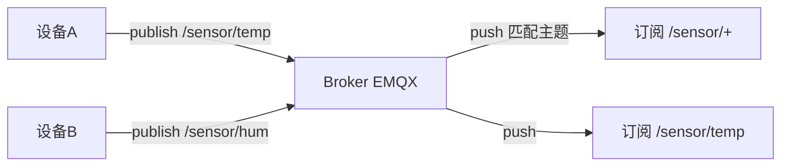
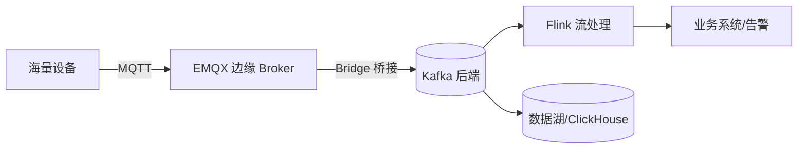

# MQTT 与 IoT 消息 Broker

> MQTT 是**物联网（IoT）的轻量级发布/订阅协议**，专为低带宽、弱网、嵌入式设备设计。
> 配套 Broker（服务端）如 EMQX、Mosquitto、HiveMQ、VerneMQ。
> 适合：智能家居、车联网、工业 IoT、传感器上报、移动端实时推送。
> 注意：MQTT **是协议不是消息队列**，虽常被叫「MQTT MQ」，但它和 RabbitMQ/Kafka 这种「业务消息队列」模型不同。

---


## 〇、本体介绍（它是什么 / 适用场景 / 核心概念）

**它是什么**：MQTT（Message Queuing Telemetry Transport）是**基于发布/订阅模式的轻量级物联网传输协议**，基于 TCP（也支持 WebSocket），协议头最小仅 2 字节，专为低带宽、高延迟、不稳定网络设计。由 IBM 提出，现为 OASIS 标准（v5.0）。

**解决什么痛点**：HTTP 在物联网场景开销大（每请求数百字节头、频繁建连耗电、无法服务器主动下行、断网丢数据）。MQTT 用长连接 + 极简头 + QoS + 遗嘱/保留消息，完美适配受限设备与弱网。

**核心概念**：Broker（服务端，如 EMQX/Mosquitto）、Client、Topic（层级主题，支持 +/# 通配符）、Payload（载荷）、QoS（0/1/2 三级）、Retained（保留消息）、Will（遗嘱消息）、KeepAlive（心跳保活）。

**适用场景**：IoT 设备采集、车联网、智能家居、即时推送、移动弱网通信。
**不适用**：需要复杂路由/事务/延迟队列的通用后端解耦（应选 RabbitMQ/Kafka）。

---

## 一、MQTT 是什么

MQTT（Message Queuing Telemetry Transport）1999 年诞生于 IBM，现为 OASIS 标准。设计目标：
- **极小开销**：最小协议头仅 **2 字节**，适合嵌入式/移动网络。
- **发布/订阅（Pub/Sub）**：设备向「主题 Topic」发消息，订阅该主题者收到。
- **长连接 + Keep-Alive**：省电、弱网下友好。
- **三种 QoS** 保证不同送达程度。

---

## 二、核心模型



- **Broker**：中心服务端（EMQX 等），负责路由与分发。
- **Topic**：分层字符串，支持通配符 `+`（单层）、`#`（多层）。如 `/sensor/temp`、`/factory/+/status`。
- **发布者/订阅者**：设备可同时是两者（双向通信）。
- **Session**：持久会话，断线重连可补发离线消息（QoS1/2）。

---

## 三、QoS 三级

| QoS | 语义 | 说明 |
|-----|------|------|
| 0 | At most once（最多一次） | 发完即忘，可能丢 |
| 1 | At least once（至少一次） | 有确认，可能重复 |
| 2 | Exactly once（恰好一次） | 四次握手，不丢不重，开销最大 |

还有 **Retained Message**（保留最后一条，新订阅者立即拿到）、**Last Will**（遗嘱消息，设备异常离线时 Broker 代发）。

---

## 四、MQTT vs 传统 MQ

| 维度 | MQTT | RabbitMQ/Kafka/RocketMQ |
|------|------|--------------------------|
| 目标 | 设备-云、弱网友好 | 服务器间高吞吐/企业集成 |
| 模型 | Pub/Sub，多对多广播 | Queue 点对点 / Exchange Pub-Sub |
| 协议头 | 最小 2 字节 | 复杂（AMQP KB 级 / Kafka 动态） |
| 保序 | 单主题内有序 | Kafka 分区内有序 |
| 吞吐 | 单 Broker 万~十万 msg/s | Kafka 百万级/s |
| 消费模型 | 所有订阅者都收到副本 | 竞争消费（一条只处理一次） |
| 离线恢复 | QoS1/2 + 持久会话自动补 | 需手动 Rebalance 监听 |

**关键区别**：标准 MQTT 是「广播」——主题下所有订阅者都收到一份；而 MQ 的 Queue 是「竞争消费」——一条消息只被一个消费者处理。**MQTT 不能直接当任务队列用**。但高级 Broker（如 EMQX 6.0）提供 **Shared Subscription（共享订阅）**，让一组客户端负载均衡，从而能胜任任务队列场景（弥合 MQTT 与 MQ 的鸿沟）。

---

## 五、主流 MQTT Broker

| Broker | 特点 | 许可证 |
|--------|------|--------|
| **EMQX** | 最可扩展，单集群 **1 亿+ 并发**、百万 msg/s、亚毫秒延迟，规则引擎+50+ 集成，支持 MQTT 5.0/3.1.1/3.1 + QUIC + CoAP/LwM2M/MQTT-SN，Cluster Linking 跨地域复制 | v5.9.0 起 **BSL 1.1**（前 Apache-2.0） |
| **Mosquitto** | 极轻量，适合边缘/嵌入式，单机能跑 | EPL/EDL |
| **HiveMQ** | 企业级，强合规与扩展 | 商业 + 社区 |
| **VerneMQ** | 分布式，Erlang 实现 | Apache-2.0 |

> EMQX 仓库 `github.com/emqx/emqx`：Erlang/OTP 实现，定位 "world's most scalable and reliable MQTT platform"，广泛用于 AI/IoT/IIoT/车联网。

---

## 六、典型 IoT 架构（MQTT + Kafka 互补）



- **边缘用 MQTT**：高效搞定设备接入（海量长连接、弱网、低开销）。
- **后端用 Kafka**：承接高吞吐流处理、持久化、回放。
- Broker 的 **规则引擎** 直接把 MQTT 消息桥接到 Kafka/HTTP/DB，省 ETL。

---

## 七、生产实践与避坑

1. **Topic 设计分层**：`/{domain}/{deviceId}/{metric}`，便于通配订阅与权限控制。
2. **QoS 权衡**：遥测数据用 QoS0（允许丢），控制指令用 QoS1/2（必达）。
3. **遗嘱 + 保留消息**：设备掉线用 Will 通知，状态类用 Retained 让新订阅者立即可见。
4. **安全**：TLS/SSL 加密、JWT/X.509 认证、ACL 限制主题权限。
5. **共享订阅做任务队列**：避免「所有订阅者都收到」导致的重复处理。
6. **与 Java 集成**：Eclipse Paho（`org.eclipse.paho.client.mqttv3`）是常用客户端。

---

## 七·五、大规模设备接入工程（百万设备怎么连）

### 1. 设备身份与认证（接入第一关）

| 方案 | 机制 | 适用 |
|------|------|------|
| 一机一密（DeviceSecret） | 每设备独立密钥，连接时校验 | 自研设备/网关（推荐） |
| X.509 证书 | 双向 TLS，证书即身份 | 安全要求高（金融/车企） |
| JWT/Token | 时间戳 + 签名换取临时凭证 | 移动端 App 接入 |

- **产品级 vs 设备级权限**：ACL 按「产品（同一类设备）主题前缀」授权，而不是逐设备配置；
- 设备注册在云端（product → device），连接时 Broker 校验「设备是否存在 + 凭证有效 + 未禁用」。

### 2. 影子设备与配置下发（离线也能改配置）

- **Device Shadow**：云端保存「期望状态（desired）」与「上报状态（reported）」两份 JSON；
- 设备离线时运营改 desired → 设备上线/重连时对比并同步，**断网场景下配置不丢**；
- 下发类用 QoS1 + 回执确认（设备回复 applied），超时重发。

### 3. OTA 固件升级（IoT 特有的发布流程）

```
发布新版本 → 分批灰度(按设备ID取模/按批次) → 设备下载(断点续传) → 校验安装 → 上报结果 → 失败回滚
```

- **灰度是硬要求**：全量推送 = 批量变砖事故（参考工业篇 OTA 坑）；
- 升级与业务隔离：固件文件走对象存储（签名 URL），MQTT 只传「升级指令 + 版本号」；
- 结果回执（success/fail）驱动升级进度看板，失败自动暂停灰度。

### 4. 海量连接的容量工程

| 瓶颈 | 手段 |
|------|------|
| 连接数 | Broker 集群水平扩展（EMQX 单集群 1 亿+），连接按节点分片 |
| 心跳风暴 | 大规模场景心跳聚合（网关代设备心跳，设备与网关本地保活） |
| 消息放大 | 遥测低频聚合 + 规则引擎过滤（只转发有意义消息） |
| 离线风暴 | 批量断电/断网触发海量遗嘱 → 遗嘱去重 + 离线标记分级延迟 |

> 设备接入平台通用骨架：**接入层（Broker 集群）→ 规则引擎（过滤/转换/桥接）→ 存储层（时序库遥测 + Kafka 事件 + DB 设备台账）→ 应用层（监控/OTA/影子/告警）**。

---

## 八、与其他板块的关系

- 与 [消息队列 MQ](../MQ.md)、[RabbitMQ](RabbitMQ.md)、[Apache Pulsar](ApachePulsar.md)：MQTT 是「设备侧协议」，RabbitMQ/Kafka/Pulsar 是「服务端消息中间件」。常 MQTT 在边缘、Kafka/Pulsar 在后端，桥接配合。
- 与 [数据同步 CDC-Canal](数据同步CDC-Canal.md)：IoT 设备数据进 Kafka 后，可继续走 CDC/流处理链路。

---

## 九、速查表

| 项 | 结论 |
|----|------|
| 本质 | 轻量级 Pub/Sub **协议**（非 MQ 实现） |
| 最小头 | 2 字节 |
| QoS | 0 最多一次 / 1 至少一次 / 2 恰好一次 |
| 模型 | 主题广播（共享订阅可做队列） |
| 主流 Broker | EMQX（1 亿+ 并发）、Mosquitto、HiveMQ |
| 场景 | IoT/车联网/弱网/移动推送 |
| 许可证 | EMQX v5.9+ BSL 1.1 |
| 一句话 | 「设备说话」的协议，专为省流量省电 |

---

## 面试高频问题（20+ 条）

1. **MQTT 是什么，特点？** 轻量级基于发布/订阅的物联网传输协议，基于 TCP，协议头最小 2 字节，支持长连接、QoS、遗嘱/保留消息，专为低带宽、高延迟、不稳定网络设计。

2. **MQTT 与 HTTP 的核心区别？** 通信模式：MQTT 发布/订阅（事件驱动、解耦），HTTP 请求/响应（同步）；连接：MQTT 长连接，HTTP 短连接；头部：MQTT 2 字节起，HTTP 数百字节；MQTT 原生支持服务器主动下行，HTTP 需轮询/WebSocket。

3. **三种 QoS 等级？** QoS 0 最多一次（可能丢，最快，如温湿度上报）；QoS 1 至少一次（保证送达但可能重复，如状态/控制指令）；QoS 2 恰好一次（四次握手，不丢不重，开销最大，如计费）。

4. **QoS 1 流程？** 发布者发 PUBLISH → Broker 回 PUBACK；未收到 ACK 则重传，因此可能重复。消费端需做幂等。

5. **遗嘱消息（LWT）是什么？** 客户端连接时预设一条遗嘱；当 Broker 检测到客户端异常离线（断电/断网/崩溃，非主动断开），自动向指定主题推送该消息，用于设备离线监控。

6. **保留消息（Retained）是什么？** 发布时带 Retain 标记，Broker 持久化该主题最新一条；任何新订阅者立即收到最新状态，无需等下次上报（适合设备最新状态/配置下发）。

7. **KeepAlive 心跳作用？** TCP 空闲时防火墙会断连；客户端定时发心跳证明存活。超过 1.5 倍 KeepAlive 无心跳，Broker 判定离线并触发遗嘱。

8. **Topic 主题与通配符？** 层级用 / 分隔（factory/line1/temp）；+ 单层通配，# 多层通配。设计主题要兼顾层级粒度与订阅灵活性。

9. **MQTT 5.0 相比 3.1.1 增强？** 原因码、共享订阅、消息过期、用户属性、主题别名、流控等，功能更完善。

10. **主流 Broker？** Mosquitto（轻量，适合网关/测试）、EMQX（企业级，百万连接、规则引擎、认证鉴权）、HiveMQ（企业级、可观测性好）。

11. **MQTT 与 AMQP/RabbitMQ 区别？** MQTT 极轻量、面向受限设备/弱网；RabbitMQ(AMQP) 面向服务端、路由复杂、功能全，不适合嵌入式小设备。

12. **物联网为何不用 HTTP？** 高开销（头占比大）、频繁建连耗电、无法服务器主动推送、断网数据无 QoS 保障。

13. **MQTT 与 Kafka 怎么配合？** 设备侧用 MQTT 采集（海量连接、弱网），Broker（如 EMQX）桥接/规则引擎转发到 Kafka 做流式处理与持久化，互补。

14. **共享订阅（Shared Subscription）？** MQTT 5.0 特性，多个消费者分担同一主题负载，实现水平扩展、避免单消费者瓶颈（如 $share/group/topic）。

15. **如何实现消息不丢？** 用 QoS≥1 + 保留/遗嘱 + Broker 持久化（会话保持）+ 消费端幂等。断网期间 QoS1/2 消息在 Broker 排队。

16. **安全机制？** 用户名/密码、Token（JWT）、TLS/SSL 加密传输、ACL 主题级权限控制、客户端证书双向认证。

17. **会话（Session）保持？** Clean Session=false 时，订阅与未确认消息在断线重连后保留，保证 QoS1/2 不丢。

18. **MQTT 不适合什么？** 需要复杂路由/事务/延迟队列的通用后端解耦（用 RabbitMQ/Kafka）；超大数据载荷（应只传小消息，大文件走对象存储+URL）。

19. **主题设计最佳实践？** 按「业务/设备类型/设备ID/指标」分层；避免过深或过浅；用通配符做聚合订阅；注意 ACL 粒度。

20. **遗嘱 vs 保留消息区别？** 遗嘱是「异常离线时 Broker 主动发」；保留是「主题最新值常驻，新订阅者即收」。二者解决不同问题。

21. **QoS 2 为什么少用？** 四次握手开销大、延迟高，Java 后端极少用；除非计费/交易等关键且不可重复场景。

22. **设备海量连接如何架构？** EMQX 集群 + 负载均衡 + 规则引擎筛选/转发 + 后端 Kafka/时序库落盘 + 监控告警。

23. **设备认证怎么做（一机一密）？** 每设备独立 DeviceSecret，连接时 Broker 校验「设备存在 + 凭证有效 + 未禁用」；ACL 按产品前缀授权；高安全场景用 X.509 双向 TLS。

24. **影子设备是什么？** 云端保存设备「期望/上报」两份状态 JSON：离线时改配置 → 上线自动同步；解决设备弱网离线时的配置下发问题。

25. **OTA 怎么安全发布？** 灰度分批推送 + 固件签名校验 + 断点续传 + 失败自动回滚 + 结果回执驱动进度；文件走对象存储，MQTT 只传升级指令。
