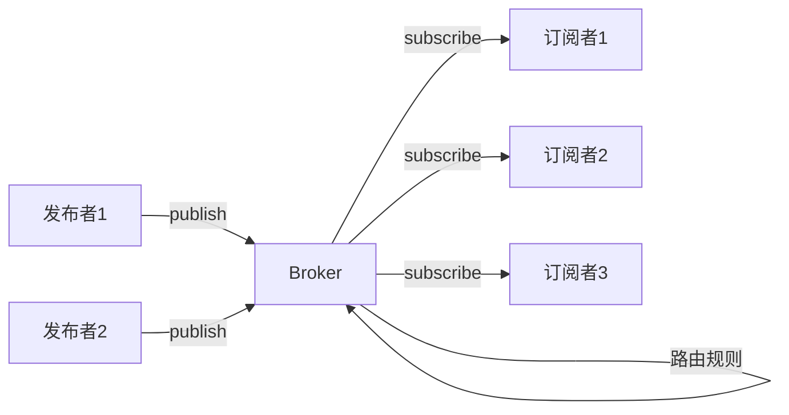
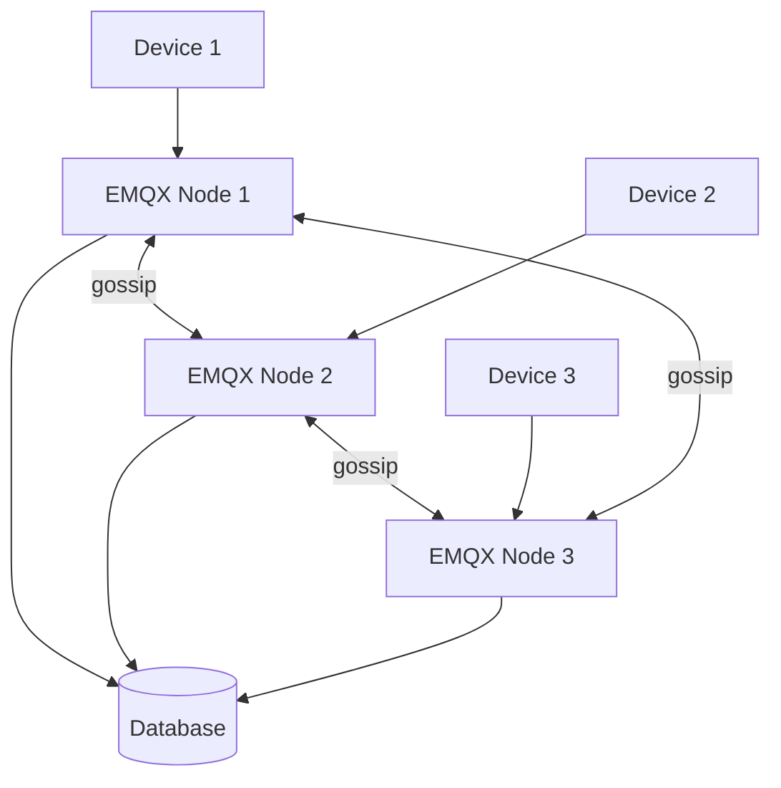
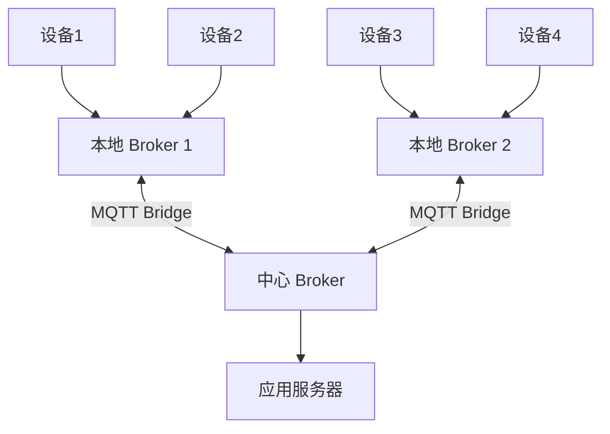
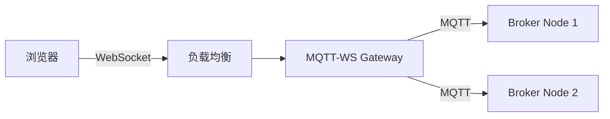
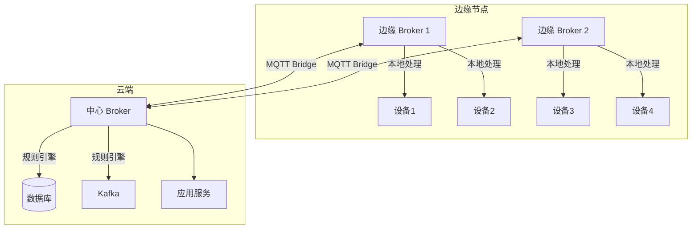
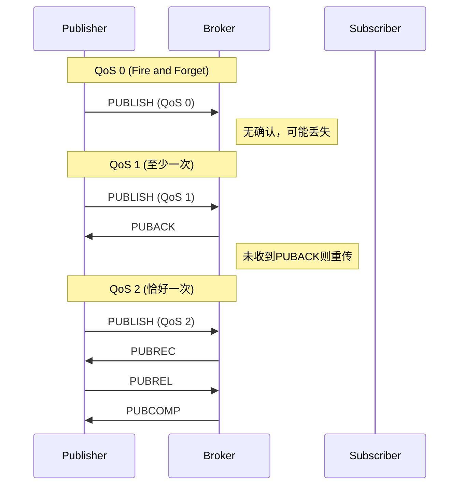
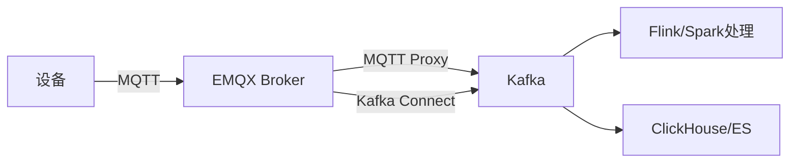
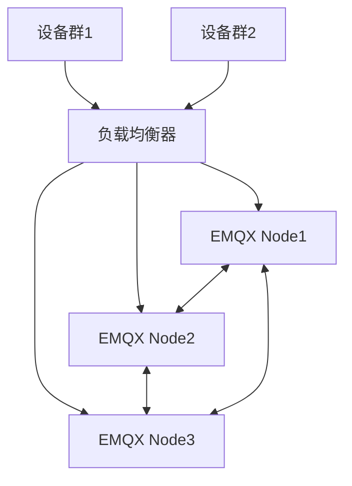

# MQTT 与消息 Broker

> **核心认知**：MQTT 是为低带宽、高延迟、不可靠网络设计的轻量级发布/订阅协议，是 IoT 设备通信的事实标准。消息 Broker 是发布/订阅模式的核心枢纽，负责消息的路由、存储和投递。理解 MQTT 协议和 Broker 架构是构建大规模 IoT 系统的基础。

## 要解决的问题

| 问题 | 传统 HTTP 的痛点 | MQTT/Broker 的解法 |
|------|-----------------|-------------------|
| 低带宽网络 | HTTP 头部开销大 | MQTT 固定头部仅 2 字节 |
| 不可靠网络 | 连接断开后消息丢失 | 三级 QoS + 遗嘱消息 |
| 海量设备连接 | HTTP 短连接开销大 | 长连接 + 轻量协议 |
| 实时推送 | HTTP 轮询延迟高 | Broker 主动推送 |
| 异构设备 | 不同设备能力差异大 | 协议可裁剪，支持最小实现 |
| 设备离线 | 离线期间消息丢失 | 持久化 + 遗嘱消息 |

## MQTT 协议详解

### MQTT 消息结构

```
MQTT 固定头部（2 字节）：
  ├── 消息类型（4 bit）：CONNECT/PUBLISH/SUBSCRIBE/...
  ├── DUP 标志（1 bit）：重发标记
  ├── QoS 级别（2 bit）：0/1/2
  └── RETAIN 标志（1 bit）：保留消息

可变头部：
  ├── Packet ID（QoS > 0 时）
  ├── Topic Name
  └── Properties（v5.0 新增）

有效载荷：
  └── 消息体（应用数据）
```

### QoS 级别对比

| QoS | 名称 | 投递保证 | 网络开销 | 适用场景 |
|-----|------|----------|----------|----------|
| 0 | At most once | 最多一次 | 最低 | 传感器数据（允许丢失） |
| 1 | At least once | 至少一次 | 中 | 命令下发（允许重复） |
| 2 | Exactly once | 恰好一次 | 最高 | 金融交易（不可丢失/重复） |

### QoS 2 完整流程（四次握手）

```
发送方                        接收方
  │── PUBLISH (QoS2) ────────>│
  │<── PUBREC ────────────────│
  │── PUBREL ────────────────>│
  │<── PUBCOMP ───────────────│
```

### MQTT v3.1.1 vs v5.0

| 特性 | v3.1.1 | v5.0 |
|------|--------|------|
| 属性（Properties） | 不支持 | 支持（元数据） |
| 消息过期 | 不支持 | 支持 |
| 共享订阅 | 不支持 | 原生支持 |
| 请求/响应 | 不支持 | 支持 |
| 认证增强 | 基础 | SASL + 自定义 |
| 会话过期 | 不支持 | 支持 |
| 流控 | 不支持 | 支持 |

## 消息 Broker 架构

### 发布/订阅模式



### 消息路由模型

```
Topic 路由层次：
  ├── 精确匹配：device/001/temperature
  ├── 单层通配：device/+/temperature（匹配 device/001/temperature）
  ├── 多层通配：device/#（匹配 device/001/temperature）
  └── 共享订阅：$share/group/topic（负载均衡）

消息投递流程：
  1. 消息到达 Broker
  2. 匹配 Topic 路由规则
  3. 查找所有匹配的订阅者
  4. 根据 QoS 级别投递消息
  5. 持久化消息（可选）
```

## 主流消息 Broker 对比

| 特性 | EMQX | Mosquitto | HiveMQ | RabbitMQ |
|------|------|-----------|--------|----------|
| 协议支持 | MQTT 3.1.1/5.0 + WebSocket | MQTT 3.1.1/5.0 | MQTT 3.1.1/5.0 | AMQP/MQTT |
| 集群 | 分布式集群 | 单节点/桥接 | 分布式集群 | 镜像队列 |
| 性能 | 百万级连接 | 千级连接 | 十万级连接 | 万级连接 |
| 持久化 | 支持 | 支持 | 支持 | 支持 |
| 规则引擎 | 内置 | 无 | 内置 | Exchange |
| 语言 | Erlang/Elixir | C | Java | Erlang |
| 适用场景 | 大规模 IoT | 嵌入式/轻量 | 企业 IoT | 企业消息 |

## EMQX 深入

### 集群架构



### 规则引擎

```
规则引擎数据流：
  事件 → 规则 → 动作

事件源：
  ├── 消息发布（message.publish）
  ├── 消息到达（message.delivered）
  ├── 客户端连接（client.connected）
  └── 客户端断开（client.disconnected）

动作类型：
  ├── 数据持久化 → MySQL/PostgreSQL/TDengine
  ├── 消息转发 → Kafka/AMQP/MQTT
  ├── HTTP 推送 → Webhook
  └── 计算处理 → 内置函数
```

### EMQX 配置示例

```hocon
# emqx.conf
listeners.tcp.default {
  bind = "0.0.0.0:1883"
  max_connections = 1000000
}

broker {
  session_expiry_interval = 2h
  max_mqueue_len = 1000
  prefetch_count = 100
}

rule_engine {
  rules {
    my_rule {
      sql = "SELECT * FROM \"sensor/#\" WHERE temperature > 40"
      actions = [
        { function = "emqx_bridge_mqtt:publish", args = { topic = "alert/high-temp" } }
      ]
    }
  }
}
```

## IoT 场景消息模式

### 设备上报模式

```
设备 → Broker → 应用服务器
  ├── 遥测数据：温度、湿度、位置
  ├── 状态数据：在线/离线、电量
  └── 事件数据：告警、按钮触发
```

### 命令下发模式

```
应用服务器 → Broker → 设备
  ├── 控制命令：开/关、调节参数
  ├── 配置下发：OTA 升级包
  └── 心跳请求：设备响应确认
```

### 双向通信模式

```
应用服务器 <--> Broker <--> 设备
  ├── 请求/响应：RPC over MQTT
  ├── 发布/订阅：事件广播
  └── 共享订阅：设备组负载均衡
```

## 高可用设计

| 层次 | 方案 | 说明 |
|------|------|------|
| 连接层 | 负载均衡 + 多节点 | L4 LB 分发 TCP 连接 |
| 会话层 | 会话持久化 | 连接断开后恢复订阅关系 |
| 消息层 | 消息持久化 | 重启后恢复未消费消息 |
| 数据层 | 数据库集群 | 规则引擎数据写入高可用 DB |
| 监控层 | Prometheus + Grafana | 连接数、消息量、延迟 |

## 常见陷阱

| 陷阱 | 后果 | 正确做法 |
|------|------|----------|
| QoS 2 滥用 | 性能严重下降 | 非关键消息用 QoS 0/1 |
| 不设遗嘱消息 | 设备离线无人知晓 | 配置 Last Will + Testament |
| Topic 设计不合理 | 路由效率低 | 规范 Topic 层次结构 |
| 不限连接数 | 服务器被打垮 | 设置 max_connections |
| 会话过期太长 | 资源浪费 | 根据设备特性设置 expiry |
| 心跳间隔太长 | 检测断开延迟 | 合理设置 keepalive |

## MQTT 共享订阅详解

### 共享订阅概念

共享订阅允许多个订阅者共享同一 Topic 的消息，Broker 在订阅者之间轮询分发，实现负载均衡。适用于高吞吐场景，避免消息堆积。

```
普通订阅：
  Topic: device/#
  订阅者1 收到所有消息
  订阅者2 收到所有消息（重复）
  → 每个订阅者都收到全量消息

共享订阅：
  Topic: $share/group1/device/#
  订阅者1 收到 50% 消息
  订阅者2 收到 50% 消息
  → 消息在订阅者之间分配
```

### 共享订阅 Topic 格式

```
$share/<group>/<topic>

示例：
  $share/sensor-group/sensor/+/temperature
  $share/consumer-group/#  → 通配符
  $share/my-group/device/001/data  → 精确匹配
```

### 消息分发策略

| 策略 | 说明 | 适用场景 |
|------|------|----------|
| Round Robin（默认） | 轮询分发 | 均衡负载 |
| Random | 随机分发 | 均衡负载 |
| Hash | 按 Topic/属性哈希 | 相关消息分发给同一订阅者 |
| Sticky | 黏性分发（同一消息始终发给同一订阅者） | 有状态消费 |

### EMQX 共享订阅配置

```hocon
# emqx.conf
broker {
  shared_subscription_strategy = round_robin
  # 可选: random, hash, sticky
  # hash 策略的 key: topic / clientid / username
}
```

## MQTT v5.0 深入特性

### 用户属性（User Properties）

```
MQTT v5.0 支持在 PUBLISH、CONNECT 等消息中携带自定义键值对：

PUBLISH 消息示例：
  User Properties:
    - x-device-id: sensor-001
    - x-trace-id: trace-abc-123
    - x-source: edge-gateway
    - x-priority: high

使用场景：
  ├── 分布式追踪（携带 trace-id）
  ├── 设备元数据（设备型号、固件版本）
  ├── 业务标记（订单号、用户ID）
  └── 消息路由（根据属性动态路由）
```

### 原因码（Reason Codes）

```
MQTT v5.0 为所有 ACK 消息增加了原因码：

CONNACK 原因码：
  0x00 - Success
  0x80 - Unspecified error
  0x81 - Malformed Packet
  0x82 - Protocol Error
  0x86 - Server busy
  0x87 - Banned
  0x97 - Packet too large

DISCONNECT 原因码：
  0x00 - Normal disconnection
  0x04 - Disconnect with Will Message
  0x80 - Unspecified error
  0x8B - Keep Alive timeout

PUBACK / PUBREC / PUBREL / PUBCOMP 原因码：
  0x00 - Success
  0x16 - No matching subscribers
  0x97 - Packet too large
```

### 流控（Flow Control）

```
MQTT v5.0 流控机制：

接收最大值（Receive Maximum）：
  ├── 客户端在 CONNECT 中声明接收最大值
  ├── 服务端在 CONNACK 中返回自身接收最大值
  ├── 双方在未收到 PUBREL 前，最多发送 N 条未确认消息
  └── 超过限制 → Broker 拒绝（原因码 0x93）

示例：
  Client: Receive Maximum = 10
  Server: Receive Maximum = 5
  → Client 最多同时发送 5 条 QoS2 消息
```

### 会话过期（Session Expiry）

```
MQTT v5.0 会话管理：

CONNECT 时设置 Session Expiry Interval：
  0 = 会话立即过期
  >0 = 会话保持指定秒数

服务端行为：
  ├── 客户端断开后，会话保持 Session Expiry Interval 秒
  ├── 期间新消息缓存在会话中
  ├── 客户端重连后恢复订阅关系和未消费消息
  └── 超时后会话和订阅关系全部清除

与 v3.1.1 的 Clean Session 对比：
  v3.1.1: Clean Session = true/false（二元）
  v5.0:   Session Expiry = 0/具体秒数（精确控制）
```

### 请求/响应模式

```
MQTT v5.0 Request/Response：

客户端发送请求：
  Topic: device/request
  Response Topic: device/response/req-123
  Correlation Data: req-123
  Payload: {"action": "get_status"}

服务端回复响应：
  Topic: device/response/req-123
  Correlation Data: req-123
  Payload: {"status": "online", "battery": 85}

与 HTTP Request/Response 的区别：
  ├── 异步：不需要同步等待
  ├── 解耦：请求和响应 Topic 可以不同
  └── 灵活：支持 QoS 控制
```

## MQTT 桥接模式

### 本地桥接



### 桥接配置

```xml
<!-- Mosquitto 桥接配置 -->
<connection cloud-broker>
  <address>mqtt.cloud.example.com:1883</address>
  <bridge_protocol_version mqttv5="true">mqttv5</bridge_protocol_version>
  <remote_username>bridge-user</remote_username>
  <remote_password>bridge-pass</remote_password>
  <bridge_qos>1</bridge_qos>
  <notifications>true</notifications>
  <topic device/# out 0 sensor/ ""</topic>
  <topic sensor/# in 0 device/ ""</topic>
</connection>
```

### 桥接 vs 共享订阅

| 维度 | 桥接 | 共享订阅 |
|------|------|----------|
| 架构 | 多 Broker 互联 | 单 Broker 内部 |
| 拓扑 | 树形/网状 | 扁平 |
| 适用 | 多地域部署 | 单集群负载均衡 |
| 延迟 | 较高（跨网络） | 低（本地） |
| 消息同步 | 异步复制 | 实时 |

## MQTT QoS 2 完整流程

```
QoS 2 完整流程（四次握手）：

客户端                        服务端
  │                               │
  │── PUBLISH (msg_id=1) ────────>│  1. 客户端发送消息
  │                               │     服务端存储消息，不投递
  │<── PUBREC (msg_id=1) ────────│  2. 服务端确认收到
  │                               │
  │── PUBREL (msg_id=1) ────────>│  3. 客户端确认可以释放
  │                               │     服务端投递消息给订阅者
  │<── PUBCOMP (msg_id=1) ───────│  4. 服务端确认完成
  │                               │     客户端释放消息

状态机：
  客户端：SEND → WAIT_PUBREC → WAIT_PUBCOMP → DONE
  服务端：RECEIVED → WAIT_PUBREL → WAIT_PUBCOMP → DONE
```

## MQTT over WebSocket

### WebSocket 集成架构



### Mosquitto WebSocket 配置

```conf
# /etc/mosquitto/conf.d/websocket.conf
listener 1883          # MQTT TCP
protocol mqtt

listener 8083          # MQTT over WebSocket
protocol websockets
cafile /etc/certs/ca.crt
certfile /etc/certs/server.crt
keyfile /etc/certs/server.key
```

### 浏览器端连接

```javascript
// 使用 MQTT.js 连接 WebSocket
const mqtt = require('mqtt');

const client = mqtt.connect('wss://mqtt.example.com:8083/mqtt', {
  username: 'user',
  password: 'pass',
  clientId: 'browser-client-' + Math.random().toString(16).substr(2, 8)
});

client.on('connect', () => {
  client.subscribe('sensor/temperature', { qos: 1 });
});

client.on('message', (topic, message) => {
  console.log(`${topic}: ${message.toString()}`);
  document.getElementById('temp').innerText = message.toString();
});
```

## MQTT 安全防护

### TLS 配置

```
MQTT TLS 配置要点：
  ├── 端口：8883（MQTTS），8084（WebSocket over TLS）
  ├── 证书：CA 签发的服务器证书
  ├── 双向 TLS（可选）：客户端也需要证书
  ├── 协议：TLS 1.2+，禁用 TLS 1.0/1.1
  └── 密码套件：ECDHE-RSA-AES256-GCM-SHA384 等强套件
```

### ACL 访问控制

```
# Mosquitto ACL 配置
# /etc/mosquitto/acl

# 用户只能发布到自己的 Topic
user sensor-001
topic write device/sensor-001/#

# 用户只能订阅自己的 Topic
user sensor-002
topic read device/sensor-002/#

# 通配符规则
pattern readwrite $SYS/%c/#

# 匿名用户禁止
allow_anonymous false
```

### 认证插件

| 插件 | 认证方式 | 适用场景 |
|------|----------|----------|
| password_file | 用户名密码文件 | 小规模部署 |
| MySQL | MySQL 数据库认证 | 中等规模 |
| PostgreSQL | PostgreSQL 数据库认证 | 中等规模 |
| LDAP | LDAP/AD 认证 | 企业环境 |
| HTTP | HTTP API 认证 | 自定义认证逻辑 |
| JWT | JWT Token 认证 | 微服务架构 |

## MQTT 在智能家居中的应用

### Home Assistant + MQTT

```
Home Assistant MQTT 架构：

HA Core ←→ MQTT Broker ←→ IoT 设备
                ├── Zigbee2MQTT
                ├── Tasmota
                ├── ESPHome
                └── 自定义固件

设备发现协议（MQTT Discovery）：
  Topic: homeassistant/<component>/<node_id>/<object_id>/config
  Payload: 设备能力描述 JSON

示例 - 温度传感器：
  Topic: homeassistant/sensor/001/temperature/config
  Payload: {
    "name": "客厅温度",
    "unit_of_measurement": "°C",
    "device_class": "temperature",
    "state_topic": "device/001/temperature",
    "value_template": "{{ value_json.temperature }}"
  }
```

### 智能家居 MQTT Topic 设计

```
Topic 层次设计：
  home/
  ├── device/<device_id>/state      → 设备状态
  ├── device/<device_id>/command    → 控制命令
  ├── device/<device_id>/config     → 设备配置
  ├── room/<room_id>/status         → 房间状态
  ├── alert/<type>                  → 告警
  └── automation/<rule_id>/status   → 自动化规则状态
```

## MQTT Broker 集群内部机制

### EMQX 集群原理

```
EMQX 集群架构：
  ├── 节点发现
  │   ├── DNS 发现
  │   ├── etcd 发现
  │   ├── K8s API 发现
  │   └── 手动配置
  ├── 数据同步
  │   ├── Gossip 协议（节点间同步路由信息）
  │   ├── 共享订阅状态
  │   └── 会话迁移
  └── 消息路由
      ├── 本地路由：订阅关系在本节点
      ├── 远程路由：订阅关系在其他节点
      └── 消息转发：跨节点路由消息

集群内部通信：
  ├── 端口 4370：节点间数据同步
  ├── 端口 4371：节点间 RPC
  └── 端口 4369：Erlang 分布式端口
```

### 会话迁移流程

```
客户端从 Node A 重连到 Node B：
  1. Node B 发现客户端有 Session 在 Node A
  2. Node B 向 Node A 请求 Session 数据
  3. Node A 返回：
     ├── 订阅关系列表
     ├── 未消费消息队列
     └── QoS 状态
  4. Node B 在本地重建 Session
  5. Node B 向所有节点广播更新路由
  6. 未消费消息开始从 Broker 投递到 Node B
```

## 消息保留（Retained Message）

### 保留消息概念

```
保留消息：Broker 存储 Topic 的最新一条消息
新订阅者订阅时立即收到保留消息，无需等待新消息

使用场景：
  ├── 设备状态：设备上线时发布当前状态作为保留消息
  │   Topic: device/001/status
  │   Payload: {"online": true, "battery": 85}
  ├── 配置下发：最新配置作为保留消息
  │   Topic: device/config
  │   Payload: {"interval": 60, "threshold": 40}
  └── 传感器最新值：如温度、湿度
      Topic: sensor/temperature
      Payload: "25.5"
```

### 保留消息生命周期

```
设置保留消息：
  PUBLISH (retain=1) → Broker 存储该消息

删除保留消息：
  PUBLISH (retain=1, payload=空) → Broker 删除该消息

保留消息限制（Mosquitto）：
  message_size_limit: 0（不限制）
  max_queued_messages: 1000（队列上限）
  retained_messages_limit: 10000（保留消息总数上限）
```

## 遗嘱消息详解

### 遗嘱消息配置

```
CONNECT 消息中设置遗嘱：

遗嘱消息（Will Message）：
  Will Topic: device/001/status
  Will Payload: {"online": false, "reason": "unexpected_disconnect"}
  Will QoS: 1
  Will Retain: true
  Will Delay Interval: 60（v5.0，延迟 60s 发布）

触发条件：
  ├── 客户端非正常断开（网络异常、崩溃）
  ├── 客户端发送 DISCONNECT with Reason Code > 0
  └── 服务端检测到 Keep Alive 超时
```

### 遗嘱消息最佳实践

```
遗嘱消息设计：
  ├── Topic：设备状态 Topic（与正常状态发布同一 Topic）
  ├── Payload：与正常状态格式一致
  │   正常在线：{"online": true, "ts": 1700000000}
  │   遗嘱离线：{"online": false, "ts": 1700000000}
  ├── QoS：至少一次（QoS 1）
  ├── Retain：是（保留最新状态）
  └── Delay Interval：避免短暂断开触发误报

配合保留消息：
  ├── 遗嘱消息 + Retain = 设备状态自动更新
  ├── 设备上线：发布 online=true + retain
  ├── 设备异常离线：遗嘱发布 online=false + retain
  └── 应用订阅一次即可获取最新状态
```

## MQTT over QUIC（MQTT v5.0 + QUIC 传输）

### QUIC 传输优势

```
MQTT over QUIC 架构：
  客户端 → QUIC 连接 → Broker

QUIC 优势（相比 TCP）：
  ├── 0-RTT 建连：QUIC 握手比 TCP+TLS 快 300ms+
  ├── 多路复用：一个连接传输多个 Stream，无队头阻塞
  ├── 连接迁移：WiFi 切 4G 时连接不中断
  ├── 内置加密：QUIC 原生 TLS 1.3
  └── 前向纠错：FEC 机制减少重传

适用场景：
  ├── 移动设备：频繁切换网络
  ├── 弱网环境：高丢包率网络
  ├── 低延迟要求：实时控制场景
  └── 海量连接：QUIC 连接更轻量
```

### EMQX QUIC 配置

```hocon
# emqx.conf
listeners.quic.default {
  bind = "0.0.0.0:8883"
  max_connections = 500000
  ssl_options {
    certfile = "/etc/certs/server.crt"
    keyfile = "/etc/certs/server.key"
    cacertfile = "/etc/certs/ca.crt"
  }
}
```

## MQTT 会话状态管理内部机制

### 会话状态数据结构

```
MQTT 会话状态：
  ├── 订阅关系（Subscription）
  │   ├── topic_filter → qos 映射
  │   └── 共享订阅组信息
  ├── 未确认消息队列（Inflight Messages）
  │   ├── QoS 1: 等待 PUBACK 的消息
  │   └── QoS 2: 等待 PUBREC/PUBREL/PUBCOMP 的消息
  ├── 离线消息队列（Offline Queue）
  │   └── 客户端离线期间缓存的消息
  └── QoS 状态
      ├── 发送方状态：message_id → 消息内容
      └── 接收方状态：message_id → 确认状态

会话存储位置：
  ├── 本地存储：单节点 Broker（Mosquitto）
  ├── 分布式存储：集群模式（EMQX → Mnesia/RocksDB）
  └── 外部存储：Redis/Database（高可用场景）
```

### 会话迁移内部流程

```
EMQX 会话迁移：
  1. 新节点发现客户端有 Session 在旧节点
  2. 新节点向旧节点发送 RPC 请求
  3. 旧节点序列化 Session 数据（订阅 + 消息队列）
  4. 新节点反序列化并重建 Session
  5. 新节点向集群广播路由更新
  6. 消息开始路由到新节点

性能优化：
  ├── 增量迁移：仅迁移变化的订阅
  ├── 批量迁移：一次性迁移所有 Session 状态
  └── 异步迁移：不阻塞新连接
```

## MQTT QoS 2 性能优化

### QoS 2 性能瓶颈

```
QoS 2 四次握手开销：
  ├── 4 次网络往返
  ├── 2 次消息持久化
  └── 状态机维护

性能数据（EMQX 基准）：
  ├── QoS 0: 100,000 msg/s
  ├── QoS 1: 50,000 msg/s
  └── QoS 2: 15,000 msg/s

优化策略：
  ├── 批量确认：合并多个 QoS 2 消息的确认
  ├── 状态压缩：减少状态机存储开销
  ├── 异步持久化：消息先写内存再异步刷盘
  └── 连接级流控：限制未确认消息数量
```

### QoS 2 最佳实践

```
QoS 2 使用建议：
  ├── 仅用于关键消息：支付确认、设备控制指令
  ├── 配合接收最大值：限制并发 QoS 2 消息数
  ├── 设置合理超时：避免状态机堆积
  └── 监控 QoS 2 队列长度：告警阈值

EMQX 配置：
  max_inflight = 20        # 最大未确认 QoS 2 消息
  max_mqueue_len = 1000    # 离线消息队列上限
  mqueue_store_qos0 = false # 不存储 QoS 0 离线消息
```

## MQTT 车联网（V2X）场景

### V2X 通信架构

```
V2X MQTT 架构：
  车载终端 → 车载网关 → MQTT Broker → 云端服务
                    ↓
              边缘 Broker（本地处理）

消息类型：
  ├── BSM（Basic Safety Message）：车辆状态
  │   Topic: v2x/vehicle/{vehicle_id}/bsm
  │   频率：10Hz（100ms）
  │   QoS：0（允许丢失）
  ├── MAP（Map Data）：地图数据
  │   Topic: v2x/map/{region_id}
  │   QoS：1（至少一次）
  ├── SPaT（Signal Phase and Timing）：信号灯
  │   Topic: v2x/signal/{intersection_id}/spat
  │   QoS：1
  └── RSA（Roadside Safety Alert）：路侧告警
      Topic: v2x/alert/{road_id}
      QoS：1
```

### 车联网 MQTT 配置

```
车载终端 MQTT 配置：
  ├── 连接方式：MQTT over TLS + 证书认证
  ├── 会话：Clean Session = false（保持订阅）
  ├── 遗嘱消息：车辆离线通知
  ├── 心跳：30s（检测车辆在线状态）
  ├── 发布 QoS：遥测数据 QoS 0，控制指令 QoS 1
  └── 订阅 QoS：云端指令 QoS 1

边缘 Broker 配置：
  ├── 本地缓存：未送达消息本地存储
  ├── 桥接：与云端 Broker 同步
  ├── 本地规则引擎：紧急告警本地处理
  └── 低延迟：消息本地处理 < 10ms
```

## MQTT Broker 基准测试

### 测试工具

```
mqtt-stresser：
  docker run -i mqtt-stresser \
    -broker tcp://broker:1883 \
    -total 100000 \
    -ca 1000 \
    -num 10

  测试指标：
    ├── 发布延迟（P50/P95/P99）
    ├── 吞吐量（msg/s）
    └── 连接建立时间

mqttx CLI：
  mqttx bench pub -h broker -p 1883 \
    -c 1000 -t "test/%c" -s 256 -q 1

  测试场景：
    ├── 发布性能：1000 客户端并发发布
    ├── 订阅性能：1000 客户端订阅
    └── 混合负载：50% 发布 + 50% 订阅

emqtt-bench（EMQX 官方）：
  emqtt_bench pub -h broker -c 10000 -t "bench/%c" -s 256

  测试规模：
    ├── 连接：100,000+ 并发连接
    ├── 发布：500,000+ msg/s
    └── 订阅：100,000+ 订阅者
```

### 性能基准数据

| Broker | 并发连接 | 发布 TPS | 订阅 TPS | 延迟 P99 |
|--------|---------|---------|---------|---------|
| EMQX 5.0 | 5,000,000+ | 800,000+ | 2,000,000+ | < 1ms |
| Mosquitto | 10,000 | 50,000 | 100,000 | < 5ms |
| HiveMQ | 1,000,000 | 200,000 | 500,000 | < 2ms |

## OPC UA over MQTT（工业 IoT）

### OPC UA MQTT 架构

```
工业 IoT 架构：
  OPC UA 设备 → OPC UA Server → MQTT Broker → 工业云平台
                              ↓
                        规则引擎 → 数据库/告警

消息格式：
  ├── Topic：opcua/{node_id}/{variable}
  ├── Payload：JSON（OPC UA 数据格式）
  ├── QoS：1（工业场景至少一次）
  └── Retain：保留最新设备状态
```

### OPC UA 消息示例

```json
{
  "nodeId": "ns=2;s=Temperature",
  "displayName": "Temperature",
  "value": 25.5,
  "dataType": "Double",
  "sourceTimestamp": "2024-01-15T10:30:00Z",
  "serverTimestamp": "2024-01-15T10:30:00.123Z",
  "statusCode": "Good"
}
```

## MQTT 访问控制（ACL）模式

### Topic 级别 ACL

```
ACL 策略：
  ├── 基于客户端 ID：设备只能发布/订阅自己的 Topic
  ├── 基于用户名：不同用户不同权限
  ├── 基于 IP：限制来源网络
  └── 基于通配符：分级授权

EMQX ACL 配置：
  rules:
    - clientid = "sensor-*"
      topic = "device/${clientid}/#"
      action = pubsub
      permission = allow

    - clientid = "app-*"
      topic = "device/#"
      action = subscribe
      permission = allow

    - clientid = "app-*"
      topic = "command/${clientid}"
      action = publish
      permission = allow
```

### ACL 实现

```python
# HTTP ACL 认证
@app.post("/mqtt/acl")
def mqtt_acl(request):
    client_id = request.form["clientid"]
    username = request.form["username"]
    topic = request.form["topic"]
    action = request.form["action"]  # publish/subscribe

    # 检查权限
    if action == "publish":
        # 只能发布到自己的 Topic
        if topic.startswith(f"device/{client_id}/"):
            return {"result": "allow"}
    elif action == "subscribe":
        # 可以订阅自己的 Topic 和命令 Topic
        if topic.startswith(f"device/{client_id}/") or \
           topic.startswith("command/"):
            return {"result": "allow"}

    return {"result": "deny"}
```

## Retained 消息使用场景与陷阱

### Retained 消息最佳实践

```
使用场景：
  ├── 设备状态：设备上线时发布在线状态
  ├── 配置下发：最新配置作为 Retained 消息
  ├── 最新数据：传感器最新值（温度、湿度）
  └── 全局公告：系统公告、版本信息

陷阱：
  ├── 滥用 Retained：每个消息都 Retained → 内存爆炸
  ├── 不清理 Retained：设备下线后状态仍保留
  ├── 大消息 Retained：大 payload 占用大量内存
  └── 频繁更新：高频更新的 Retained 消息导致性能问题
```

### Retained 消息管理

```
正确做法：
  ├── 仅关键状态使用 Retained：设备在线/离线状态
  ├── 设置合理的消息大小限制：≤ 1KB
  ├── 定期清理过期 Retained 消息
  ├── 使用 QoS 1（至少一次投递）
  └── 设备下线时发布空 payload + Retain 删除 Retained 消息

配置（Mosquitto）：
  retained_messages_limit: 10000    # 最大 Retained 消息数
  message_size_limit: 0              # 不限制消息大小
```

## 遗嘱消息真实场景

### 遗嘱消息使用模式

```
场景 1：设备离线检测
  ├── 遗嘱消息：{"online": false, "reason": "unexpected"}
  ├── 正常上线消息：{"online": true, "battery": 85}
  ├── Retain：保留最新状态
  └── 应用订阅一次即可获取最新状态

场景 2：设备健康监控
  ├── 遗嘱消息：{"status": "offline", "last_seen": "2024-01-15T10:00:00Z"}
  ├── 心跳消息：每 30s 发布 {"status": "online", "cpu": 45, "mem": 60}
  └── 告警系统：设备离线 > 5 分钟 → 告警

场景 3：会话状态清理
  ├── 遗嘱消息：发布到系统 Topic 通知其他服务
  └── 应用服务器：清理该设备的缓存和状态
```

### 遗嘱消息实现代码

```python
# MQTT 客户端遗嘱消息配置
import paho.mqtt.client as mqtt

client = mqtt.Client(client_id="sensor-001")

# 设置遗嘱消息
client.will_set(
    topic="device/sensor-001/status",
    payload='{"online": false, "reason": "unexpected_disconnect"}',
    qos=1,
    retain=True
)

# 连接
client.connect("broker.example.com", 1883, 60)

# 上线后发布在线状态
client.publish(
    "device/sensor-001/status",
    '{"online": true, "battery": 85}',
    qos=1,
    retain=True
)
```

## MQTT v5.0 共享订阅深入

### 共享订阅与 QoS 协商

```
共享订阅消息分发策略：
  Round Robin（默认）：
    订阅者1 → 消息1, 消息3, 消息5
    订阅者2 → 消息2, 消息4, 消息6
    均衡分配，适用于无状态消费

  Random：
    随机分发给任意订阅者
    适用于均匀负载

  Hash：
    根据 Topic 或属性哈希分发
    相关消息分发给同一订阅者（有状态消费）

  Sticky：
    黏性分发，同一消息始终发给同一订阅者
    适用于需要会话保持的场景

QoS 协商规则：
  发布者 QoS 0 + 订阅者 QoS 0 → 投递 QoS 0
  发布者 QoS 0 + 订阅者 QoS 1 → 投递 QoS 0（不能提升）
  发布者 QoS 1 + 订阅者 QoS 0 → 投递 QoS 0（降级）
  发布者 QoS 1 + 订阅者 QoS 1 → 投递 QoS 1
  发布者 QoS 2 + 订阅者 QoS 2 → 投递 QoS 2
  原则：取发布者和订阅者中较低的 QoS 级别
```

### 共享订阅负载均衡实现

```python
# MQTT 共享订阅消费者示例
import paho.mqtt.client as mqtt

# 共享订阅格式：$share/<group>/<topic>
SHARED_TOPIC = "$share/worker-group/sensor/+/temperature"

client = mqtt.Client(client_id="worker-1")

def on_connect(client, userdata, flags, rc):
    # 订阅共享 Topic
    client.subscribe(SHARED_TOPIC, qos=1)

def on_message(client, userdata, msg):
    # Broker 自动在 worker-group 内轮询分发
    topic = msg.topic
    payload = msg.payload.decode()
    print(f"Worker-1 收到: {topic} = {payload}")

    # 处理消息
    process_sensor_data(topic, payload)

client.on_connect = on_connect
client.on_message = on_message
client.connect("broker.example.com", 1883, 60)
client.loop_forever()
```

## MQTT Topic 设计模式

### Topic 层次设计规范

```
Topic 设计原则：
  1. 层次清晰：使用 / 分隔，从大到小
  2. 避免通配符滥用：+ 和 # 影响路由性能
  3. 预留扩展：为未来新设备类型预留空间
  4. 控制长度：Topic 长度 ≤ 65535 字节（建议 ≤ 256）

推荐 Topic 结构：
  <项目>/<环境>/<设备类型>/<设备ID>/<数据类型>

示例：
  iot/prod/sensor/001/temperature    → 传感器温度
  iot/prod/sensor/001/humidity       → 传感器湿度
  iot/prod/gateway/001/status        → 网关状态
  iot/prod/actuator/001/command      → 执行器控制
  iot/prod/alert/high-temp           → 高温告警

避免的 Topic 设计：
  ❌ data/001/temperature  → 无项目和环境前缀
  ❌ iot/sensor/001/data   → 数据类型不明确
  ❌ iot/prod/sensor/001/temperature/status/extra → 层次太深
```

### Topic 与 QoS 匹配

| 数据类型 | Topic 示例 | QoS | Retain | 说明 |
|----------|------------|-----|--------|------|
| 遥测数据 | sensor/+/temperature | 0 | 否 | 允许丢失 |
| 设备状态 | device/+/status | 1 | 是 | 至少一次，保留最新 |
| 控制命令 | command/+/action | 1 | 否 | 至少一次，不保留 |
| 配置下发 | device/+/config | 2 | 是 | 恰好一次，保留 |
| 告警信息 | alert/# | 1 | 否 | 至少一次 |
| OTA 升级 | device/+/ota | 2 | 否 | 恰好一次 |

## MQTT QoS 协商机制

### QoS 协商流程

```
QoS 协商规则（MQTT 5.0）：
  1. 客户端在 SUBSCRIBE 中指定期望的 QoS
  2. 服务端根据发布者 QoS 和订阅者 QoS 取较低值
  3. 服务端在 SUBACK 中返回实际授予的 QoS

示例：
  发布者 PUBLISH QoS 2
  订阅者 SUBSCRIBE QoS 2
  服务端授予 QoS 2

  发布者 PUBLISH QoS 0
  订阅者 SUBSCRIBE QoS 1
  服务端授予 QoS 0（不能提升 QoS）

QoS 选择建议：
  ├── 传感器遥测数据：QoS 0（允许丢失，高频）
  ├── 设备状态上报：QoS 1（至少一次，保留最新）
  ├── 控制命令下发：QoS 1（至少一次，不保留）
  ├── 金融交易数据：QoS 2（恰好一次，不可丢失/重复）
  └── 日志采集：QoS 0（允许丢失，高频）
```

## MQTT 桥接实现混合云架构

### 混合云 MQTT 架构



### 桥接配置示例

```xml
<!-- EMQX 桥接到云端 MQTT Broker -->
<bridge_bridge0>
    <enable>true</enable>
    <bridge_type>mqtt</bridge_type>
    <address>mqtt.cloud.example.com:1883</address>
    <clientid>edge-bridge-001</clientid>
    <username>bridge-user</username>
    <password>bridge-pass</password>
    <clean_start>true</clean_start>
    <keepalive>60s</keepalive>
    <Protocol_version>v5</Protocol_version>
    
    <!-- 订阅规则：边缘 → 云端 -->
    <forwards>
        <forward>
            <topic>sensor/#</topic>
            <qos>1</qos>
        </forward>
    </forwards>
    
    <!-- 发布规则：云端 → 边缘 -->
    <subscribed_topics>
        <subscribed_topic>
            <topic>command/#</topic>
            <qos>1</qos>
        </subscribed_topic>
    </subscribed_topics>
    
    <!-- 桥接消息 Topic 前缀 -->
    <topic_prefix>edge/001/</topic_prefix>
</bridge_bridge0>
```

## MQTT 在车联网中的 MQTT 5.0 特性应用

### 车联网 MQTT 5.0 特性

```
MQTT 5.0 在车联网中的应用：
  1. 共享订阅：多云端服务共享车辆遥测数据
     Topic: $share/cloud-group/v2x/vehicle/+/bsm
     → 交通管理服务 + 保险服务 + 导航服务 共同消费

  2. 消息过期：设置消息 TTL，过期自动丢弃
     Properties: Message-Expiry-Interval = 30（30 秒）
     → BSM 消息 30 秒后自动丢弃（过时的位置信息无意义）

  3. 内容类型：标识消息格式
     Properties: Content-Type = "application/json"
     → 消费者可按格式解析

  4. 响应主题：请求/响应模式
     Request Topic: v2x/vehicle/001/config/request
     Response Topic: v2x/vehicle/001/config/response
     Correlation Data: req-123
     → 车辆配置查询/响应

  5. 用户属性：携带元数据
     User Properties:
       x-vehicle-type: "sedan"
       x-firmware-version: "2.1.0"
       x-region: "shanghai"
     → 车辆元数据，便于路由和过滤
```

### 车联网 MQTT 部署方案

```
车联网 MQTT 部署架构：
  车载终端：
    ├── MQTT 客户端（支持 v5.0）
    ├── TLS 1.3 + 证书认证
    ├── 心跳：30s（检测在线状态）
    ├── 遗嘱消息：车辆离线通知
    └── 发布 QoS：BSM QoS 0，控制 QoS 1

  边缘 Broker（路侧单元 RSU）：
    ├── 本地处理紧急告警（< 10ms）
    ├── 缓存未送达消息
    ├── 桥接到云端 Broker
    └── 本地规则引擎

  云端 Broker：
    ├── 高可用集群
    ├── 海量连接管理
    ├── 规则引擎 → Kafka/数据库
    └── 多租户隔离
```

## MQTT Broker 基准测试方法论

### 测试方法与工具

```
MQTT Broker 基准测试方法论：
  1. 连接测试：建立大量并发连接
     工具：emqtt-bench、mqtt-stresser
     指标：连接建立时间、最大连接数

  2. 发布测试：高频发布消息
     工具：mqttx bench pub、emqtt-bench
     指标：发布 TPS、延迟 P50/P95/P99

  3. 订阅测试：大量订阅者接收消息
     工具：mqttx bench sub、emqtt-bench
     指标：订阅 TPS、消息投递延迟

  4. 混合负载测试：发布 + 订阅同时进行
     模拟真实场景
     指标：整体吞吐、延迟分布

  5. 持续压力测试：长时间高负载
     测试稳定性
     指标：内存增长、GC 频率、错误率

测试配置建议：
  ├── 消息大小：256B（典型传感器数据）
  ├── QoS 级别：0 和 1 分别测试
  ├── Topic 层次：模拟真实设备 Topic
  └── 持续时间：至少 30 分钟（观察稳态）
```

### 性能基准数据

| 测试场景 | EMQX 5.0 | Mosquitto | HiveMQ |
|----------|-----------|-----------|--------|
| 10 万并发连接 | 3s 建立 | 30s 建立 | 10s 建立 |
| QoS 0 发布 TPS | 80 万/s | 5 万/s | 20 万/s |
| QoS 1 发布 TPS | 40 万/s | 2 万/s | 10 万/s |
| QoS 2 发布 TPS | 15 万/s | 0.5 万/s | 3 万/s |
| 延迟 P99（QoS 0） | < 1ms | < 5ms | < 2ms |
| 内存占用（10 万连接） | 2GB | 8GB | 4GB |

## MQTT 安全加固清单

### 安全加固检查项

```
MQTT 安全加固清单：
  1. 传输层安全
     ├── [ ] 启用 TLS 1.2+（端口 8883）
     ├── [ ] 使用 CA 签发的服务器证书
     ├── [ ] 可选：双向 TLS（客户端证书认证）
     └── [ ] 禁用 TLS 1.0/1.1

  2. 认证安全
     ├── [ ] 禁止匿名连接（allow_anonymous false）
     ├── [ ] 使用强密码或证书认证
     ├── [ ] 密码定期轮转
     └── [ ] 限制单 IP 连接数

  3. 授权控制
     ├── [ ] 配置 ACL（基于 clientid/username）
     ├── [ ] 设备只能发布/订阅自己的 Topic
     ├── [ ] 应用只能订阅需要的 Topic
     └── [ ] 禁止通配符订阅 $SYS/#（系统 Topic）

  4. 会话安全
     ├── [ ] 设置合理的会话过期时间
     ├── [ ] 限制最大会话数
     ├── [ ] 启用会话过期清理
     └── [ ] 限制未确认消息队列长度

  5. 网络安全
     ├── [ ] Broker 不暴露公网
     ├── [ ] 使用负载均衡 + WAF
     ├── [ ] 启用连接速率限制
     └── [ ] 监控异常连接

  6. 监控告警
     ├── [ ] 监控连接数、消息量、延迟
     ├── [ ] 告警异常断连、认证失败
     ├── [ ] 审计日志记录所有连接
     └── [ ] 定期安全扫描
```

## 八、MQTT 5.0新特性详解

### 8.1 MQTT 5.0 vs 3.1.1对比

| 特性 | MQTT 3.1.1 | MQTT 5.0 |
|------|------------|----------|
| 协议版本号 | 4字节 | 5字节 |
| 可变头 | 无Properties | Properties |
| 订阅确认 | SUBACK | SUBACK + Properties |
| 取消订阅 | UNSUBSCRIBE | UNSUBSCRIBE + Properties |
| 断开连接 | DISCONNECT | DISCONNECT + Properties |
| 共享订阅 | 不支持 | 支持 |
| 响应信息 | 不支持 | 支持 |
| 会话过期 | 无 | 支持 |
| 消息过期 | 无 | 支持 |
| 流控 | 无 | 支持 |

### 8.2 MQTT 5.0核心特性

```
MQTT 5.0核心特性：
  1. Properties
     → 用户属性（User Properties）
     → 内容类型（Content Type）
     → 响应主题（Response Topic）
     → 关联数据（Correlation Data）

  2. 共享订阅
     → $share/group/topic
     → 负载均衡
     → 故障转移

  3. 消息过期
     → Message Expiry Interval
     → 自动删除过期消息
     → 避免消息堆积

  4. 流控
     → Receive Maximum
     → Maximum Packet Size
     → 防止Broker过载

  5. 响应信息
     → Response Information
     → 请求-响应模式
     → 异步响应

  6. 会话过期
     → Session Expiry Interval
     → 自动清理会话
     → 资源释放
```

## 九、MQTT认证与授权深度对比

### 9.1 认证方式对比

| 认证方式 | 安全性 | 性能 | 实现复杂度 | 适用场景 |
|---------|--------|------|-----------|---------|
| 用户名密码 | 中 | 高 | 低 | 通用 |
| 客户端证书 | 高 | 中 | 高 | 高安全要求 |
| JWT Token | 中 | 高 | 中 | OAuth2集成 |
| OAuth2 | 高 | 中 | 高 | 企业集成 |
| LDAP | 高 | 中 | 高 | 企业目录集成 |

### 9.2 ACL授权策略

```
MQTT ACL策略：
  基于客户端ID：
    clientid=device_001 → topic=device/001/#

  基于用户名：
    username=admin → topic=#
    username=device → topic=device/{username}/#

  基于IP：
    ip=192.168.1.* → topic=local/#

  基于认证方式：
    cert → topic=secure/#
    password → topic=standard/#

ACL规则示例：
  # EMQX ACL配置
  {allow, {user, "device"}, subscribe, ["device/#"]}.
  {allow, {user, "admin"}, publish, ["device/#"]}.
  {allow, {ipaddr, "192.168.1.0/24"}, subscribe, ["local/#"]}.
  {deny, all}.
```

## 十、MQTT与Kafka集成详解

### 10.1 MQTT-Kafka桥接架构

```
MQTT-Kafka桥接：
  MQTT Broker → Kafka Connect → Kafka Topic

  架构选择：
    方案1：MQTT Broker自带Kafka插件
    方案2：Kafka Connect MQTT Source
    方案3：自定义桥接服务

  数据格式：
    MQTT消息 → JSON/Avro → Kafka消息

  主题映射：
    MQTT: device/{device_id}/data
    Kafka: device-data-{device_id}
```

### 10.2 集成配置示例

```yaml
# Kafka Connect MQTT Source
name: mqtt-source-connector
config:
  tasks.max: 1
  kafka.topic: device-data
  mqtt.server.uri: tcp://broker:1883
  mqtt.topics: device/+/data
  mqtt.qos: 1
  key.converter: org.apache.kafka.connect.storage.StringConverter
  value.converter: org.apache.kafka.connect.json.JsonConverter
  value.converter.schemas.enable: false
```

## 十一、IoT消息模式详解

### 11.1 IoT消息模式

| 模式 | 描述 | 适用场景 | QoS要求 |
|------|------|---------|---------|
| 遥测上报 | 设备→云端 | 状态监控 | QoS 0/1 |
| 命令下发 | 云端→设备 | 远程控制 | QoS 1/2 |
| 双向通信 | 设备↔云端 | 交互控制 | QoS 1 |
| 广播 | 云端→多设备 | 固件升级 | QoS 0 |
| 组播 | 云端→设备组 | 分组控制 | QoS 1 |

### 11.2 IoT消息模式实现

```
遥测上报模式：
  Topic: device/{device_id}/telemetry
  QoS: 0（允许丢失）或 1（保证到达）
  Payload: JSON（温度/湿度/位置）

命令下发模式：
  Topic: device/{device_id}/command
  QoS: 2（保证一次到达）
  Payload: JSON（命令+参数）

双向通信模式：
  Topic: device/{device_id}/request
  Topic: device/{device_id}/response
  QoS: 1（保证到达）
  Payload: JSON（请求ID+数据）
```

## 十二、EMQX vs Mosquitto对比详解

### 12.1 功能对比

| 特性 | EMQX | Mosquitto |
|------|------|-----------|
| 协议支持 | MQTT 3.1.1/5.0/WebSocket | MQTT 3.1.1/5.0 |
| 集群 | 原生支持 | 需要插件 |
| 桥接 | 内置支持 | 插件支持 |
| 规则引擎 | 内置 | 无 |
| HTTP API | 内置 | 无 |
| 认证 | 多种 | 基础 |
| ACL | 灵活 | 基础 |
| 监控 | 内置Dashboard | 无 |
| 性能 | 高 | 中 |
| 扩展性 | 高（插件/模块） | 低 |
| 社区 | 活跃 | 活跃 |
| 商业版 | 有 | 无 |

### 12.2 选型建议

```
选择EMQX：
  1. 需要集群部署
  2. 需要规则引擎
  3. 需要HTTP API集成
  4. 需要高级认证/ACL
  5. 需要监控Dashboard
  6. 大规模IoT部署

选择Mosquitto：
  1. 简单MQTT Broker
  2. 资源受限环境
  3. 单机部署
  4. 快速原型开发
  5. 学习MQTT协议
```

## 与其他板块的关系

| 关联板块 | 关系描述 |
|----------|----------|
| **IoT 平台** | MQTT 是 IoT 设备接入的核心协议 |
| **边缘计算** | 边缘 Broker 处理本地消息，减少云端压力 |
| **数据管道** | Broker + 规则引擎将设备数据导入大数据平台 |
| **API 网关** | MQTT 网关桥接设备与云端 REST API |
| **时序数据库** | 设备遥测数据写入 InfluxDB/TDengine |

## 一句话总结

MQTT 是 IoT 设备通信的轻量级协议，Broker 是发布/订阅模式的核心枢纽；二者结合解决了海量设备在低带宽、不可靠网络下的实时通信问题。

---

## 五、QoS 级别深入对比

### 5.1 QoS 级别详解

| QoS 级别 | 名称 | 传输次数 | 性能 | 适用场景 |
|----------|------|----------|------|----------|
| 0 | At most once | 0-1次 | 最快 | 传感器数据（允许丢失） |
| 1 | At least once | 1+次 | 中等 | 命令下发（不允许丢失） |
| 2 | Exactly once | 恰好1次 | 最慢 | 关键数据（不允许重复） |

### 5.2 QoS 实现原理



### 5.3 QoS 降级与升级

```
QoS 降级场景：
  网络不稳定 → QoS 2 降级为 QoS 1
  下游处理慢 → QoS 1 降级为 QoS 0
  资源受限 → 降低 QoS 级别

QoS 升级场景：
  数据重要性高 → QoS 0 升级为 QoS 1
  需要精确一次 → QoS 1 升级为 QoS 2
  网络质量好 → 提升 QoS 级别
```

---

## 六、消息持久化与存储

### 6.1 持久化策略

| 策略 | 说明 | 性能 | 数据安全 |
|------|------|------|----------|
| 内存持久化 | 消息存内存，重启丢失 | 最快 | 不安全 |
| 磁盘持久化 | 消息写磁盘 | 中等 | 安全 |
| 分布式持久化 | 多节点复制 | 较慢 | 最安全 |
| 混合持久化 | 内存+磁盘 | 快 | 安全 |

### 6.2 存储架构

```
MQTT Broker 存储架构：
  ├── 消息存储
  │   ├── 内存存储（热数据）
  │   ├── 磁盘存储（温数据）
  │   └── 对象存储（冷数据）
  ├── 会话存储
  │   ├── 本地会话（单节点）
  │   └── 分布式会话（集群）
  └── 订阅存储
      ├── 内存订阅树
      └── 持久化订阅
```

---

## 七、集群与高可用

### 7.1 集群架构

| 架构 | 说明 | 适用场景 |
|------|------|----------|
| 单节点 | 简单部署 | 开发测试 |
| 主从 | 读写分离 | 小规模生产 |
| 集群 | 水平扩展 | 中大规模生产 |
| 分片集群 | 数据分片 | 超大规模 |

### 7.2 集群配置

```yaml
# EMQX 集群配置
emqx:
  cluster:
    # 集群发现方式
    discovery: static
    # 集群节点列表
    nodes:
      - "emqx1@192.168.1.101"
      - "emqx2@192.168.1.102"
      - "emqx3@192.168.1.103"
    # 集群同步方式
    sync: full_mesh
```

---

## 八、安全机制

### 8.1 安全特性

| 特性 | 说明 | 实现方式 |
|------|------|----------|
| 身份认证 | 客户端身份验证 | 用户名密码/证书/Token |
| 访问控制 | 控制客户端权限 | ACL 规则 |
| 传输加密 | 数据加密传输 | TLS/SSL |
| 消息加密 | 消息内容加密 | 端到端加密 |
| 审计日志 | 记录操作日志 | 日志系统 |

### 8.2 ACL 规则示例

```conf
# EMQX ACL 规则
## 允许所有客户端发布到 topic sensor/#
{allow, {user, "sensor_client"}, publish, ["sensor/#"]}.

## 允许所有客户端订阅 topic command/#
{allow, {user, "command_client"}, subscribe, ["command/#"]}.

## 禁止所有客户端发布到 topic admin/#
{deny, all, publish, ["admin/#"]}.

## 默认拒绝所有
{deny, all}.
```

---

## 九、性能优化

### 9.1 性能指标

| 指标 | 目标值 | 说明 |
|------|--------|------|
| 连接数 | 100万+ | 单节点最大连接 |
| 消息吞吐 | 10万+/秒 | 单节点消息处理 |
| 延迟 | < 1ms | 消息投递延迟 |
| 可用性 | 99.99% | 集群可用性 |

### 9.2 优化策略

```bash
# 1. 系统参数优化
sysctl -w net.core.somaxconn=65535
sysctl -w net.ipv4.tcp_max_syn_backlog=65535
sysctl -w net.ipv4.ip_local_port_range="1024 65535"

# 2. 文件描述符优化
ulimit -n 1000000

# 3. 网络优化
sysctl -w net.ipv4.tcp_tw_reuse=1
sysctl -w net.ipv4.tcp_fin_timeout=15
```

---

## MQTT 5.0特性详解

### Properties/Session Expiry/Topic Alias/Shared Subscription

| 特性 | 说明 | 适用场景 |
|------|------|----------|
| Properties | 可变头部扩展属性 | 传递用户数据 |
| Session Expiry | 会话过期时间 | 离线消息保留 |
| Topic Alias | 主题别名 | 减少协议开销 |
| Shared Subscription | 共享订阅 | 负载均衡消费 |
| Message Expiry | 消息过期时间 | 防止过期消息投递 |
| Response Information | 响应信息 | 请求-响应模式 |

```java
// MQTT 5.0连接配置
MqttConnectionOptions options = new MqttConnectionOptions();
options.setSessionExpiryInterval(3600L); // 1小时会话过期
options.setKeepAliveInterval(30);

// 发布时设置Topic Alias
MqttPublishProperties props = new MqttPublishProperties();
props.setTopicAlias(1); // 使用别名1代表主题
```

### 共享订阅（Shared Subscription）

```
共享订阅格式：$share/{group}/{topic}

示例：
  $share/sensor-group/temperature/#
  $share/sensor-group/humidity/#

负载均衡策略：
  RoundRobin（轮询）：均匀分配
  Random（随机）：随机分配
  Sticky（粘性）：同一消息到同一消费者
  HashBased（哈希）：按消息键哈希分配
```

## 认证方式（Username/Password/Client Certificate/ACL）

### 认证方式对比

| 方式 | 安全性 | 复杂度 | 适用场景 |
|------|--------|--------|----------|
| Username/Password | 中 | 低 | 简单场景 |
| Client Certificate | 高 | 高 | 企业级 |
| Token（JWT） | 高 | 中 | OAuth集成 |
| ACL | 中 | 中 | 细粒度控制 |

```java
// ACL配置示例（EMQX）
// 允许设备发布自己的遥测数据
allow = {
  topic = "devices/${username}/telemetry"
  action = publish
  user = "${username}"
}

// 允许服务端订阅所有设备遥测
allow = {
  topic = "devices/#"
  action = subscribe
  user = "server"
}
```

## QoS选择（0/1/2性能可靠性权衡）

| QoS | 投递保证 | 网络开销 | 延迟 | 适用场景 |
|-----|----------|----------|------|----------|
| 0 | 最多一次 | 最低 | 最低 | 传感器数据（允许丢失） |
| 1 | 至少一次 | 中 | 中 | 命令下发（允许重复） |
| 2 | 恰好一次 | 最高 | 最高 | 金融交易（不可丢失/重复） |

```
QoS选择指南：
  环境监测/传感器数据 → QoS 0（允许丢失）
  设备控制/命令下发 → QoS 1（允许重复）
  计费/交易数据 → QoS 2（精确一次）
  遥测聚合 → QoS 0（批量数据丢失可接受）
  告警通知 → QoS 1（必须送达）
```

## MQTT与Kafka集成

### MQTT Proxy/Kafka Connect方案



| 集成方式 | 说明 | 适用场景 |
|----------|------|----------|
| MQTT Proxy | Broker直接转发到Kafka | 高吞吐/低延迟 |
| Kafka Connect | MQTT Source Connector | 标准化集成 |
| 自定义桥接 | 应用层转发 | 特殊需求 |

```json
{
  "name": "mqtt-source",
  "config": {
    "connector.class": "io.confluent.connect.mqtt.MqttSourceConnector",
    "tasks.max": "3",
    "mqtt.server.uri": "tcp://emqx:1883",
    "mqtt.topics": "sensors/#",
    "kafka.topic": "mqtt-sensors",
    "key.converter": "org.apache.kafka.connect.storage.StringConverter",
    "value.converter": "org.apache.kafka.connect.json.JsonConverter"
  }
}
```

## IoT应用模式（设备影子/遥测/命令/OTA）

### 设备影子模式

```json
// 设备影子JSON结构
{
  "state": {
    "desired": {
      "temperature": 25,
      "humidity": 60
    },
    "reported": {
      "temperature": 23,
      "humidity": 55,
      "battery": 80
    }
  },
  "metadata": {
    "temperature": {
      "timestamp": 1700000000
    }
  },
  "version": 42
}
```

### IoT消息模式

| 模式 | 方向 | Topic示例 | 说明 |
|------|------|-----------|------|
| 遥测 | 设备→云 | devices/{id}/telemetry | 周期性数据上报 |
| 命令 | 云→设备 | devices/{id}/commands | 远程控制 |
| 状态 | 设备→云 | devices/{id}/status | 在线/离线状态 |
| OTA | 云→设备 | devices/{id}/ota | 固件升级 |
| 影子 | 双向 | devices/{id}/shadow | 设备期望/报告状态 |

## EMQX vs Mosquitto vs HiveMQ对比

| 维度 | EMQX | Mosquitto | HiveMQ |
|------|------|-----------|--------|
| 语言 | Erlang | C | Java |
| 性能 | 百万级连接 | 万级连接 | 十万级连接 |
| 集群 | 原生集群 | 单节点 | 原生集群 |
| 协议 | MQTT 3.1.1/5.0 | MQTT 3.1.1/5.0 | MQTT 3.1.1/5.0 |
| 插件 | 丰富（Dashboard/规则引擎） | 有限 | 丰富 |
| 开源 | 开源+企业版 | 完全开源 | 商业+社区版 |
| 适用 | 大规模IoT平台 | 嵌入式/测试 | 企业级IoT |

## 消息持久化（离线消息/遗嘱消息）

### 遗嘱消息（Last Will）

```
遗嘱消息 = 客户端连接时预设的"遗言"

触发条件：
  1. 客户端未正常断开连接（网络异常）
  2. Keep Alive超时
  3. 客户端发送DISCONNECT前异常退出

使用场景：
  设备离线通知：发布离线消息到 devices/{id}/status
  负载均衡：其他消费者接管该设备订阅
```

### 离线消息保留

| 机制 | 说明 | 配置 |
|------|------|------|
| Clean Session=false | 保留订阅和未确认消息 | 客户端连接时设置 |
| Session Expiry | 会话过期时间（v5.0） | 连接属性设置 |
| Retain Message | 保留最新消息 | 发布时设置retain标志 |
| QoS 1/2 | 消息持久化 | QoS级别设置 |

## MQTT集群架构（EMQX Cluster/负载均衡）

### EMQX集群架构



| 集成组件 | 说明 |
|----------|------|
| 负载均衡 | HAProxy/Nginx/云LB |
| 服务发现 | DNS/etcd/K8s Service |
| 数据库 | PostgreSQL/MySQL（认证） |
| 缓存 | Redis（会话/订阅） |
| 消息桥接 | Kafka/RabbitMQ/EMQX Gateway |

## MQTT性能调优（连接数/消息吞吐/QoS开销）

### 性能调优参数

| 参数 | 默认值 | 优化值 | 说明 |
|------|--------|--------|------|
| max_connections | 1024000 | 按需 | 最大连接数 |
| max_mqueue_len | 1000 | 10000 | 消息队列长度 |
| max_mqueue_dropped | 0 | 按需 | 丢弃消息数 |
| listener.tcp.max_conns | 1024 | 10000 | TCP监听最大连接 |
| broker.max_topic_levels | 5 | 按需 | 最大主题层级 |

### QoS开销分析

```
QoS 0开销：
  1次PUBLISH → 无确认
  延迟：最低
  吞吐：最高

QoS 1开销：
  1次PUBLISH → 1次PUBACK
  延迟：+1次RTT
  吞吐：降低约30%

QoS 2开销：
  1次PUBLISH → PUBREC → PUBREL → PUBCOMP
  延迟：+3次RTT
  吞吐：降低约60%

优化建议：
  - 混合使用不同QoS级别
  - 高频低价值数据用QoS 0
  - 关键数据用QoS 1
  - 极端可靠性用QoS 2
```

## 十、与其他板块的关系

- MQTT 协议规范见「[MQTT v5.0 规范](https://docs.oasis-open.org/mqtt/mqtt/v5.0/mqtt-v5.0.html)」；
- 消息队列对比见「[中间件/Kafka](./Kafka.md)」；
- IoT 平台见「[云原生IoT平台](../../云原生/IoT平台.md)」；
- 边缘计算见「[边缘计算架构](../../边缘计算/架构.md)」；
- 设备管理见「[IoT设备管理](../../边缘计算/设备管理.md)」。

---

## 参考资料

- [MQTT v5.0 规范](https://docs.oasis-open.org/mqtt/mqtt/v5.0/mqtt-v5.0.html)
- [EMQX 官方文档](https://www.emqx.io/docs/en/latest/)
- [Eclipse Mosquitto](https://mosquitto.org/)
- [MQTT vs HTTP for IoT](https://www.hivemq.com/mqtt/mqtt-vs-http/)
