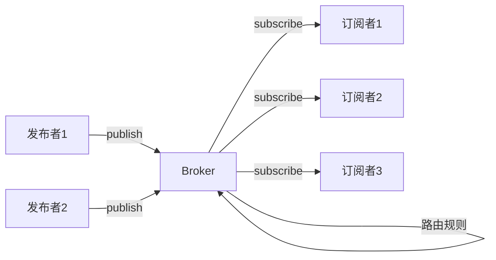
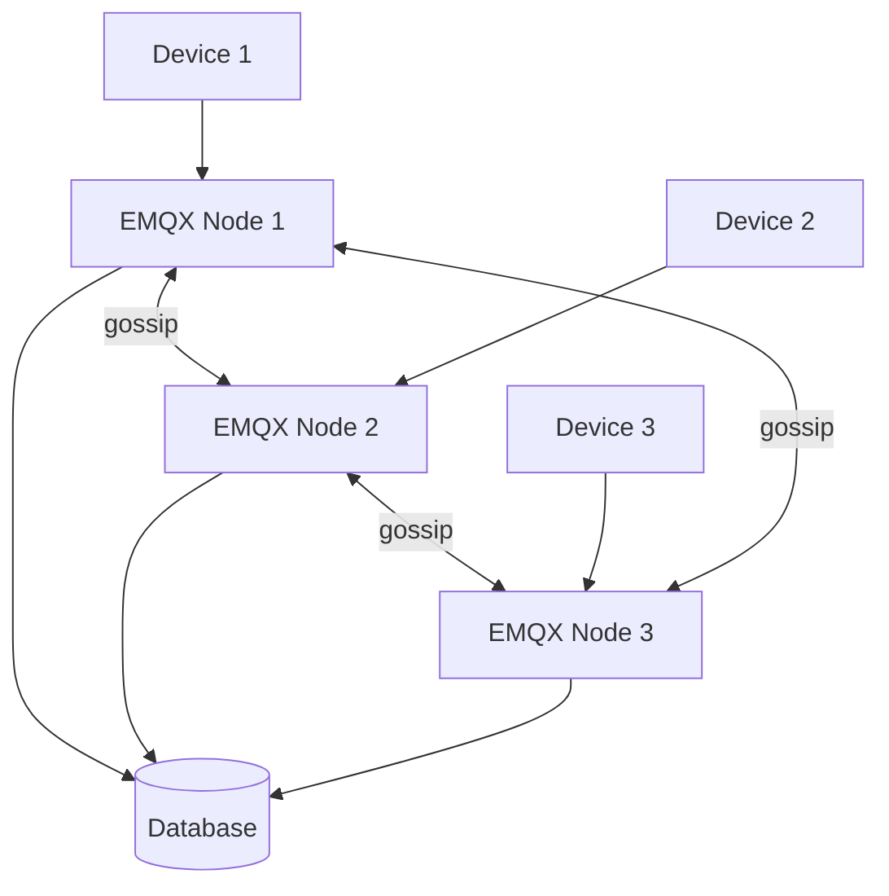
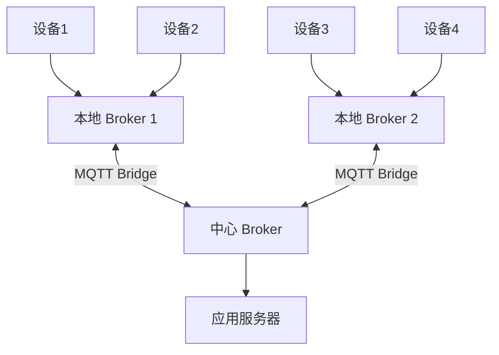
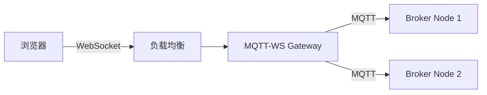

# MQTT 与消息 Broker

> **核心认知**：MQTT 是为低带宽、高延迟、不可靠网络设计的轻量级发布/订阅协议，是 IoT 设备通信的事实标准。消息 Broker 是发布/订阅模式的核心枢纽，负责消息的路由、存储和投递。理解 MQTT 协议和 Broker 架构是构建大规模 IoT 系统的基础。

## 要解决的问题

| 问题 | 传统 HTTP 的痛点 | MQTT/Broker 的解法 |
|------|-----------------|-------------------|
| 低带宽网络 | HTTP 头部开销大 | MQTT 固定头部仅 2 字节 |
| 不可靠网络 | 连接断开后消息丢失 | 三级 QoS + 遗嘱消息 |
| 海量设备连接 | HTTP 短连接开销大 | 长连接 + 轻量协议 |
| 实时推送 | HTTP 轮询延迟高 | Broker 主动推送 |
| 异构设备 | 不同设备能力差异大 | 协议可裁剪，支持最小实现 |
| 设备离线 | 离线期间消息丢失 | 持久化 + 遗嘱消息 |

## MQTT 协议详解

### MQTT 消息结构

```
MQTT 固定头部（2 字节）：
  ├── 消息类型（4 bit）：CONNECT/PUBLISH/SUBSCRIBE/...
  ├── DUP 标志（1 bit）：重发标记
  ├── QoS 级别（2 bit）：0/1/2
  └── RETAIN 标志（1 bit）：保留消息

可变头部：
  ├── Packet ID（QoS > 0 时）
  ├── Topic Name
  └── Properties（v5.0 新增）

有效载荷：
  └── 消息体（应用数据）
```

### QoS 级别对比

| QoS | 名称 | 投递保证 | 网络开销 | 适用场景 |
|-----|------|----------|----------|----------|
| 0 | At most once | 最多一次 | 最低 | 传感器数据（允许丢失） |
| 1 | At least once | 至少一次 | 中 | 命令下发（允许重复） |
| 2 | Exactly once | 恰好一次 | 最高 | 金融交易（不可丢失/重复） |

### QoS 2 完整流程（四次握手）

```
发送方                        接收方
  │── PUBLISH (QoS2) ────────>│
  │<── PUBREC ────────────────│
  │── PUBREL ────────────────>│
  │<── PUBCOMP ───────────────│
```

### MQTT v3.1.1 vs v5.0

| 特性 | v3.1.1 | v5.0 |
|------|--------|------|
| 属性（Properties） | 不支持 | 支持（元数据） |
| 消息过期 | 不支持 | 支持 |
| 共享订阅 | 不支持 | 原生支持 |
| 请求/响应 | 不支持 | 支持 |
| 认证增强 | 基础 | SASL + 自定义 |
| 会话过期 | 不支持 | 支持 |
| 流控 | 不支持 | 支持 |

## 消息 Broker 架构

### 发布/订阅模式



### 消息路由模型

```
Topic 路由层次：
  ├── 精确匹配：device/001/temperature
  ├── 单层通配：device/+/temperature（匹配 device/001/temperature）
  ├── 多层通配：device/#（匹配 device/001/temperature）
  └── 共享订阅：$share/group/topic（负载均衡）

消息投递流程：
  1. 消息到达 Broker
  2. 匹配 Topic 路由规则
  3. 查找所有匹配的订阅者
  4. 根据 QoS 级别投递消息
  5. 持久化消息（可选）
```

## 主流消息 Broker 对比

| 特性 | EMQX | Mosquitto | HiveMQ | RabbitMQ |
|------|------|-----------|--------|----------|
| 协议支持 | MQTT 3.1.1/5.0 + WebSocket | MQTT 3.1.1/5.0 | MQTT 3.1.1/5.0 | AMQP/MQTT |
| 集群 | 分布式集群 | 单节点/桥接 | 分布式集群 | 镜像队列 |
| 性能 | 百万级连接 | 千级连接 | 十万级连接 | 万级连接 |
| 持久化 | 支持 | 支持 | 支持 | 支持 |
| 规则引擎 | 内置 | 无 | 内置 | Exchange |
| 语言 | Erlang/Elixir | C | Java | Erlang |
| 适用场景 | 大规模 IoT | 嵌入式/轻量 | 企业 IoT | 企业消息 |

## EMQX 深入

### 集群架构



### 规则引擎

```
规则引擎数据流：
  事件 → 规则 → 动作

事件源：
  ├── 消息发布（message.publish）
  ├── 消息到达（message.delivered）
  ├── 客户端连接（client.connected）
  └── 客户端断开（client.disconnected）

动作类型：
  ├── 数据持久化 → MySQL/PostgreSQL/TDengine
  ├── 消息转发 → Kafka/AMQP/MQTT
  ├── HTTP 推送 → Webhook
  └── 计算处理 → 内置函数
```

### EMQX 配置示例

```hocon
# emqx.conf
listeners.tcp.default {
  bind = "0.0.0.0:1883"
  max_connections = 1000000
}

broker {
  session_expiry_interval = 2h
  max_mqueue_len = 1000
  prefetch_count = 100
}

rule_engine {
  rules {
    my_rule {
      sql = "SELECT * FROM \"sensor/#\" WHERE temperature > 40"
      actions = [
        { function = "emqx_bridge_mqtt:publish", args = { topic = "alert/high-temp" } }
      ]
    }
  }
}
```

## IoT 场景消息模式

### 设备上报模式

```
设备 → Broker → 应用服务器
  ├── 遥测数据：温度、湿度、位置
  ├── 状态数据：在线/离线、电量
  └── 事件数据：告警、按钮触发
```

### 命令下发模式

```
应用服务器 → Broker → 设备
  ├── 控制命令：开/关、调节参数
  ├── 配置下发：OTA 升级包
  └── 心跳请求：设备响应确认
```

### 双向通信模式

```
应用服务器 <--> Broker <--> 设备
  ├── 请求/响应：RPC over MQTT
  ├── 发布/订阅：事件广播
  └── 共享订阅：设备组负载均衡
```

## 高可用设计

| 层次 | 方案 | 说明 |
|------|------|------|
| 连接层 | 负载均衡 + 多节点 | L4 LB 分发 TCP 连接 |
| 会话层 | 会话持久化 | 连接断开后恢复订阅关系 |
| 消息层 | 消息持久化 | 重启后恢复未消费消息 |
| 数据层 | 数据库集群 | 规则引擎数据写入高可用 DB |
| 监控层 | Prometheus + Grafana | 连接数、消息量、延迟 |

## 常见陷阱

| 陷阱 | 后果 | 正确做法 |
|------|------|----------|
| QoS 2 滥用 | 性能严重下降 | 非关键消息用 QoS 0/1 |
| 不设遗嘱消息 | 设备离线无人知晓 | 配置 Last Will + Testament |
| Topic 设计不合理 | 路由效率低 | 规范 Topic 层次结构 |
| 不限连接数 | 服务器被打垮 | 设置 max_connections |
| 会话过期太长 | 资源浪费 | 根据设备特性设置 expiry |
| 心跳间隔太长 | 检测断开延迟 | 合理设置 keepalive |

## MQTT 共享订阅详解

### 共享订阅概念

共享订阅允许多个订阅者共享同一 Topic 的消息，Broker 在订阅者之间轮询分发，实现负载均衡。适用于高吞吐场景，避免消息堆积。

```
普通订阅：
  Topic: device/#
  订阅者1 收到所有消息
  订阅者2 收到所有消息（重复）
  → 每个订阅者都收到全量消息

共享订阅：
  Topic: $share/group1/device/#
  订阅者1 收到 50% 消息
  订阅者2 收到 50% 消息
  → 消息在订阅者之间分配
```

### 共享订阅 Topic 格式

```
$share/<group>/<topic>

示例：
  $share/sensor-group/sensor/+/temperature
  $share/consumer-group/#  → 通配符
  $share/my-group/device/001/data  → 精确匹配
```

### 消息分发策略

| 策略 | 说明 | 适用场景 |
|------|------|----------|
| Round Robin（默认） | 轮询分发 | 均衡负载 |
| Random | 随机分发 | 均衡负载 |
| Hash | 按 Topic/属性哈希 | 相关消息分发给同一订阅者 |
| Sticky | 黏性分发（同一消息始终发给同一订阅者） | 有状态消费 |

### EMQX 共享订阅配置

```hocon
# emqx.conf
broker {
  shared_subscription_strategy = round_robin
  # 可选: random, hash, sticky
  # hash 策略的 key: topic / clientid / username
}
```

## MQTT v5.0 深入特性

### 用户属性（User Properties）

```
MQTT v5.0 支持在 PUBLISH、CONNECT 等消息中携带自定义键值对：

PUBLISH 消息示例：
  User Properties:
    - x-device-id: sensor-001
    - x-trace-id: trace-abc-123
    - x-source: edge-gateway
    - x-priority: high

使用场景：
  ├── 分布式追踪（携带 trace-id）
  ├── 设备元数据（设备型号、固件版本）
  ├── 业务标记（订单号、用户ID）
  └── 消息路由（根据属性动态路由）
```

### 原因码（Reason Codes）

```
MQTT v5.0 为所有 ACK 消息增加了原因码：

CONNACK 原因码：
  0x00 - Success
  0x80 - Unspecified error
  0x81 - Malformed Packet
  0x82 - Protocol Error
  0x86 - Server busy
  0x87 - Banned
  0x97 - Packet too large

DISCONNECT 原因码：
  0x00 - Normal disconnection
  0x04 - Disconnect with Will Message
  0x80 - Unspecified error
  0x8B - Keep Alive timeout

PUBACK / PUBREC / PUBREL / PUBCOMP 原因码：
  0x00 - Success
  0x16 - No matching subscribers
  0x97 - Packet too large
```

### 流控（Flow Control）

```
MQTT v5.0 流控机制：

接收最大值（Receive Maximum）：
  ├── 客户端在 CONNECT 中声明接收最大值
  ├── 服务端在 CONNACK 中返回自身接收最大值
  ├── 双方在未收到 PUBREL 前，最多发送 N 条未确认消息
  └── 超过限制 → Broker 拒绝（原因码 0x93）

示例：
  Client: Receive Maximum = 10
  Server: Receive Maximum = 5
  → Client 最多同时发送 5 条 QoS2 消息
```

### 会话过期（Session Expiry）

```
MQTT v5.0 会话管理：

CONNECT 时设置 Session Expiry Interval：
  0 = 会话立即过期
  >0 = 会话保持指定秒数

服务端行为：
  ├── 客户端断开后，会话保持 Session Expiry Interval 秒
  ├── 期间新消息缓存在会话中
  ├── 客户端重连后恢复订阅关系和未消费消息
  └── 超时后会话和订阅关系全部清除

与 v3.1.1 的 Clean Session 对比：
  v3.1.1: Clean Session = true/false（二元）
  v5.0:   Session Expiry = 0/具体秒数（精确控制）
```

### 请求/响应模式

```
MQTT v5.0 Request/Response：

客户端发送请求：
  Topic: device/request
  Response Topic: device/response/req-123
  Correlation Data: req-123
  Payload: {"action": "get_status"}

服务端回复响应：
  Topic: device/response/req-123
  Correlation Data: req-123
  Payload: {"status": "online", "battery": 85}

与 HTTP Request/Response 的区别：
  ├── 异步：不需要同步等待
  ├── 解耦：请求和响应 Topic 可以不同
  └── 灵活：支持 QoS 控制
```

## MQTT 桥接模式

### 本地桥接



### 桥接配置

```xml
<!-- Mosquitto 桥接配置 -->
<connection cloud-broker>
  <address>mqtt.cloud.example.com:1883</address>
  <bridge_protocol_version mqttv5="true">mqttv5</bridge_protocol_version>
  <remote_username>bridge-user</remote_username>
  <remote_password>bridge-pass</remote_password>
  <bridge_qos>1</bridge_qos>
  <notifications>true</notifications>
  <topic device/# out 0 sensor/ ""</topic>
  <topic sensor/# in 0 device/ ""</topic>
</connection>
```

### 桥接 vs 共享订阅

| 维度 | 桥接 | 共享订阅 |
|------|------|----------|
| 架构 | 多 Broker 互联 | 单 Broker 内部 |
| 拓扑 | 树形/网状 | 扁平 |
| 适用 | 多地域部署 | 单集群负载均衡 |
| 延迟 | 较高（跨网络） | 低（本地） |
| 消息同步 | 异步复制 | 实时 |

## MQTT QoS 2 完整流程

```
QoS 2 完整流程（四次握手）：

客户端                        服务端
  │                               │
  │── PUBLISH (msg_id=1) ────────>│  1. 客户端发送消息
  │                               │     服务端存储消息，不投递
  │<── PUBREC (msg_id=1) ────────│  2. 服务端确认收到
  │                               │
  │── PUBREL (msg_id=1) ────────>│  3. 客户端确认可以释放
  │                               │     服务端投递消息给订阅者
  │<── PUBCOMP (msg_id=1) ───────│  4. 服务端确认完成
  │                               │     客户端释放消息

状态机：
  客户端：SEND → WAIT_PUBREC → WAIT_PUBCOMP → DONE
  服务端：RECEIVED → WAIT_PUBREL → WAIT_PUBCOMP → DONE
```

## MQTT over WebSocket

### WebSocket 集成架构



### Mosquitto WebSocket 配置

```conf
# /etc/mosquitto/conf.d/websocket.conf
listener 1883          # MQTT TCP
protocol mqtt

listener 8083          # MQTT over WebSocket
protocol websockets
cafile /etc/certs/ca.crt
certfile /etc/certs/server.crt
keyfile /etc/certs/server.key
```

### 浏览器端连接

```javascript
// 使用 MQTT.js 连接 WebSocket
const mqtt = require('mqtt');

const client = mqtt.connect('wss://mqtt.example.com:8083/mqtt', {
  username: 'user',
  password: 'pass',
  clientId: 'browser-client-' + Math.random().toString(16).substr(2, 8)
});

client.on('connect', () => {
  client.subscribe('sensor/temperature', { qos: 1 });
});

client.on('message', (topic, message) => {
  console.log(`${topic}: ${message.toString()}`);
  document.getElementById('temp').innerText = message.toString();
});
```

## MQTT 安全防护

### TLS 配置

```
MQTT TLS 配置要点：
  ├── 端口：8883（MQTTS），8084（WebSocket over TLS）
  ├── 证书：CA 签发的服务器证书
  ├── 双向 TLS（可选）：客户端也需要证书
  ├── 协议：TLS 1.2+，禁用 TLS 1.0/1.1
  └── 密码套件：ECDHE-RSA-AES256-GCM-SHA384 等强套件
```

### ACL 访问控制

```
# Mosquitto ACL 配置
# /etc/mosquitto/acl

# 用户只能发布到自己的 Topic
user sensor-001
topic write device/sensor-001/#

# 用户只能订阅自己的 Topic
user sensor-002
topic read device/sensor-002/#

# 通配符规则
pattern readwrite $SYS/%c/#

# 匿名用户禁止
allow_anonymous false
```

### 认证插件

| 插件 | 认证方式 | 适用场景 |
|------|----------|----------|
| password_file | 用户名密码文件 | 小规模部署 |
| MySQL | MySQL 数据库认证 | 中等规模 |
| PostgreSQL | PostgreSQL 数据库认证 | 中等规模 |
| LDAP | LDAP/AD 认证 | 企业环境 |
| HTTP | HTTP API 认证 | 自定义认证逻辑 |
| JWT | JWT Token 认证 | 微服务架构 |

## MQTT 在智能家居中的应用

### Home Assistant + MQTT

```
Home Assistant MQTT 架构：

HA Core ←→ MQTT Broker ←→ IoT 设备
                ├── Zigbee2MQTT
                ├── Tasmota
                ├── ESPHome
                └── 自定义固件

设备发现协议（MQTT Discovery）：
  Topic: homeassistant/<component>/<node_id>/<object_id>/config
  Payload: 设备能力描述 JSON

示例 - 温度传感器：
  Topic: homeassistant/sensor/001/temperature/config
  Payload: {
    "name": "客厅温度",
    "unit_of_measurement": "°C",
    "device_class": "temperature",
    "state_topic": "device/001/temperature",
    "value_template": "{{ value_json.temperature }}"
  }
```

### 智能家居 MQTT Topic 设计

```
Topic 层次设计：
  home/
  ├── device/<device_id>/state      → 设备状态
  ├── device/<device_id>/command    → 控制命令
  ├── device/<device_id>/config     → 设备配置
  ├── room/<room_id>/status         → 房间状态
  ├── alert/<type>                  → 告警
  └── automation/<rule_id>/status   → 自动化规则状态
```

## MQTT Broker 集群内部机制

### EMQX 集群原理

```
EMQX 集群架构：
  ├── 节点发现
  │   ├── DNS 发现
  │   ├── etcd 发现
  │   ├── K8s API 发现
  │   └── 手动配置
  ├── 数据同步
  │   ├── Gossip 协议（节点间同步路由信息）
  │   ├── 共享订阅状态
  │   └── 会话迁移
  └── 消息路由
      ├── 本地路由：订阅关系在本节点
      ├── 远程路由：订阅关系在其他节点
      └── 消息转发：跨节点路由消息

集群内部通信：
  ├── 端口 4370：节点间数据同步
  ├── 端口 4371：节点间 RPC
  └── 端口 4369：Erlang 分布式端口
```

### 会话迁移流程

```
客户端从 Node A 重连到 Node B：
  1. Node B 发现客户端有 Session 在 Node A
  2. Node B 向 Node A 请求 Session 数据
  3. Node A 返回：
     ├── 订阅关系列表
     ├── 未消费消息队列
     └── QoS 状态
  4. Node B 在本地重建 Session
  5. Node B 向所有节点广播更新路由
  6. 未消费消息开始从 Broker 投递到 Node B
```

## 消息保留（Retained Message）

### 保留消息概念

```
保留消息：Broker 存储 Topic 的最新一条消息
新订阅者订阅时立即收到保留消息，无需等待新消息

使用场景：
  ├── 设备状态：设备上线时发布当前状态作为保留消息
  │   Topic: device/001/status
  │   Payload: {"online": true, "battery": 85}
  ├── 配置下发：最新配置作为保留消息
  │   Topic: device/config
  │   Payload: {"interval": 60, "threshold": 40}
  └── 传感器最新值：如温度、湿度
      Topic: sensor/temperature
      Payload: "25.5"
```

### 保留消息生命周期

```
设置保留消息：
  PUBLISH (retain=1) → Broker 存储该消息

删除保留消息：
  PUBLISH (retain=1, payload=空) → Broker 删除该消息

保留消息限制（Mosquitto）：
  message_size_limit: 0（不限制）
  max_queued_messages: 1000（队列上限）
  retained_messages_limit: 10000（保留消息总数上限）
```

## 遗嘱消息详解

### 遗嘱消息配置

```
CONNECT 消息中设置遗嘱：

遗嘱消息（Will Message）：
  Will Topic: device/001/status
  Will Payload: {"online": false, "reason": "unexpected_disconnect"}
  Will QoS: 1
  Will Retain: true
  Will Delay Interval: 60（v5.0，延迟 60s 发布）

触发条件：
  ├── 客户端非正常断开（网络异常、崩溃）
  ├── 客户端发送 DISCONNECT with Reason Code > 0
  └── 服务端检测到 Keep Alive 超时
```

### 遗嘱消息最佳实践

```
遗嘱消息设计：
  ├── Topic：设备状态 Topic（与正常状态发布同一 Topic）
  ├── Payload：与正常状态格式一致
  │   正常在线：{"online": true, "ts": 1700000000}
  │   遗嘱离线：{"online": false, "ts": 1700000000}
  ├── QoS：至少一次（QoS 1）
  ├── Retain：是（保留最新状态）
  └── Delay Interval：避免短暂断开触发误报

配合保留消息：
  ├── 遗嘱消息 + Retain = 设备状态自动更新
  ├── 设备上线：发布 online=true + retain
  ├── 设备异常离线：遗嘱发布 online=false + retain
  └── 应用订阅一次即可获取最新状态
```

## 与其他板块的关系

| 关联板块 | 关系描述 |
|----------|----------|
| **IoT 平台** | MQTT 是 IoT 设备接入的核心协议 |
| **边缘计算** | 边缘 Broker 处理本地消息，减少云端压力 |
| **数据管道** | Broker + 规则引擎将设备数据导入大数据平台 |
| **API 网关** | MQTT 网关桥接设备与云端 REST API |
| **时序数据库** | 设备遥测数据写入 InfluxDB/TDengine |

## 一句话总结

MQTT 是 IoT 设备通信的轻量级协议，Broker 是发布/订阅模式的核心枢纽；二者结合解决了海量设备在低带宽、不可靠网络下的实时通信问题。

---

## 参考资料

- [MQTT v5.0 规范](https://docs.oasis-open.org/mqtt/mqtt/v5.0/mqtt-v5.0.html)
- [EMQX 官方文档](https://www.emqx.io/docs/en/latest/)
- [Eclipse Mosquitto](https://mosquitto.org/)
- [MQTT vs HTTP for IoT](https://www.hivemq.com/mqtt/mqtt-vs-http/)
