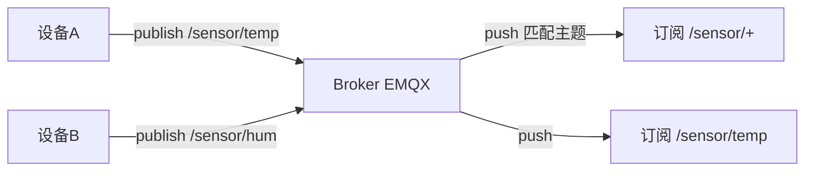
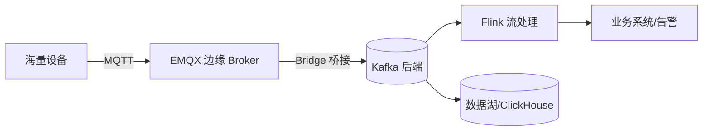

# MQTT 与 IoT 消息 Broker

> MQTT 是**物联网（IoT）的轻量级发布/订阅协议**，专为低带宽、弱网、嵌入式设备设计。
> 配套 Broker（服务端）如 EMQX、Mosquitto、HiveMQ、VerneMQ。
> 适合：智能家居、车联网、工业 IoT、传感器上报、移动端实时推送。
> 注意：MQTT **是协议不是消息队列**，虽常被叫「MQTT MQ」，但它和 RabbitMQ/Kafka 这种「业务消息队列」模型不同。

---

## 一、MQTT 是什么

MQTT（Message Queuing Telemetry Transport）1999 年诞生于 IBM，现为 OASIS 标准。设计目标：
- **极小开销**：最小协议头仅 **2 字节**，适合嵌入式/移动网络。
- **发布/订阅（Pub/Sub）**：设备向「主题 Topic」发消息，订阅该主题者收到。
- **长连接 + Keep-Alive**：省电、弱网下友好。
- **三种 QoS** 保证不同送达程度。

---

## 二、核心模型

- **Broker**：中心服务端（EMQX 等），负责路由与分发。
- **Topic**：分层字符串，支持通配符 `+`（单层）、`#`（多层）。如 `/sensor/temp`、`/factory/+/status`。
- **发布者/订阅者**：设备可同时是两者（双向通信）。
- **Session**：持久会话，断线重连可补发离线消息（QoS1/2）。

---

## 三、QoS 三级

| QoS | 语义 | 说明 |
|-----|------|------|
| 0 | At most once（最多一次） | 发完即忘，可能丢 |
| 1 | At least once（至少一次） | 有确认，可能重复 |
| 2 | Exactly once（恰好一次） | 四次握手，不丢不重，开销最大 |

还有 **Retained Message**（保留最后一条，新订阅者立即拿到）、**Last Will**（遗嘱消息，设备异常离线时 Broker 代发）。

---

## 四、MQTT vs 传统 MQ

| 维度 | MQTT | RabbitMQ/Kafka/RocketMQ |
|------|------|--------------------------|
| 目标 | 设备-云、弱网友好 | 服务器间高吞吐/企业集成 |
| 模型 | Pub/Sub，多对多广播 | Queue 点对点 / Exchange Pub-Sub |
| 协议头 | 最小 2 字节 | 复杂（AMQP KB 级 / Kafka 动态） |
| 保序 | 单主题内有序 | Kafka 分区内有序 |
| 吞吐 | 单 Broker 万~十万 msg/s | Kafka 百万级/s |
| 消费模型 | 所有订阅者都收到副本 | 竞争消费（一条只处理一次） |
| 离线恢复 | QoS1/2 + 持久会话自动补 | 需手动 Rebalance 监听 |

**关键区别**：标准 MQTT 是「广播」——主题下所有订阅者都收到一份；而 MQ 的 Queue 是「竞争消费」——一条消息只被一个消费者处理。**MQTT 不能直接当任务队列用**。但高级 Broker（如 EMQX 6.0）提供 **Shared Subscription（共享订阅）**，让一组客户端负载均衡，从而能胜任任务队列场景（弥合 MQTT 与 MQ 的鸿沟）。

---

## 五、主流 MQTT Broker

| Broker | 特点 | 许可证 |
|--------|------|--------|
| **EMQX** | 最可扩展，单集群 **1 亿+ 并发**、百万 msg/s、亚毫秒延迟，规则引擎+50+ 集成，支持 MQTT 5.0/3.1.1/3.1 + QUIC + CoAP/LwM2M/MQTT-SN，Cluster Linking 跨地域复制 | v5.9.0 起 **BSL 1.1**（前 Apache-2.0） |
| **Mosquitto** | 极轻量，适合边缘/嵌入式，单机能跑 | EPL/EDL |
| **HiveMQ** | 企业级，强合规与扩展 | 商业 + 社区 |
| **VerneMQ** | 分布式，Erlang 实现 | Apache-2.0 |

> EMQX 仓库 `github.com/emqx/emqx`：Erlang/OTP 实现，定位 "world's most scalable and reliable MQTT platform"，广泛用于 AI/IoT/IIoT/车联网。

---

## 六、典型 IoT 架构（MQTT + Kafka 互补）

- **边缘用 MQTT**：高效搞定设备接入（海量长连接、弱网、低开销）。
- **后端用 Kafka**：承接高吞吐流处理、持久化、回放。
- Broker 的 **规则引擎** 直接把 MQTT 消息桥接到 Kafka/HTTP/DB，省 ETL。

---

## 七、生产实践与避坑

1. **Topic 设计分层**：`/{domain}/{deviceId}/{metric}`，便于通配订阅与权限控制。
2. **QoS 权衡**：遥测数据用 QoS0（允许丢），控制指令用 QoS1/2（必达）。
3. **遗嘱 + 保留消息**：设备掉线用 Will 通知，状态类用 Retained 让新订阅者立即可见。
4. **安全**：TLS/SSL 加密、JWT/X.509 认证、ACL 限制主题权限。
5. **共享订阅做任务队列**：避免「所有订阅者都收到」导致的重复处理。
6. **与 Java 集成**：Eclipse Paho（`org.eclipse.paho.client.mqttv3`）是常用客户端。

---

## 八、与其他板块的关系

- 与 [消息队列 MQ](MQ.md)、[RabbitMQ](RabbitMQ.md)、[Apache Pulsar](ApachePulsar.md)：MQTT 是「设备侧协议」，RabbitMQ/Kafka/Pulsar 是「服务端消息中间件」。常 MQTT 在边缘、Kafka/Pulsar 在后端，桥接配合。
- 与 [数据同步 CDC-Canal](数据同步CDC-Canal.md)：IoT 设备数据进 Kafka 后，可继续走 CDC/流处理链路。

---

## 九、速查表

| 项 | 结论 |
|----|------|
| 本质 | 轻量级 Pub/Sub **协议**（非 MQ 实现） |
| 最小头 | 2 字节 |
| QoS | 0 最多一次 / 1 至少一次 / 2 恰好一次 |
| 模型 | 主题广播（共享订阅可做队列） |
| 主流 Broker | EMQX（1 亿+ 并发）、Mosquitto、HiveMQ |
| 场景 | IoT/车联网/弱网/移动推送 |
| 许可证 | EMQX v5.9+ BSL 1.1 |
| 一句话 | 「设备说话」的协议，专为省流量省电 |
