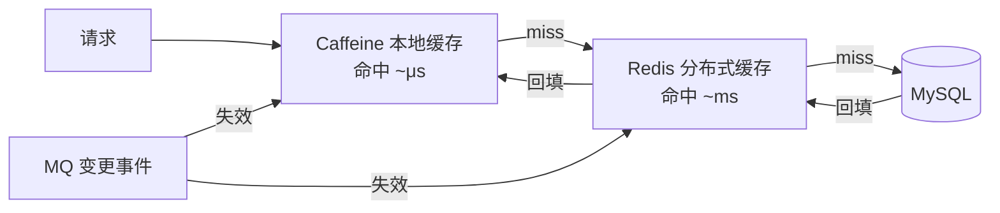

# 缓存中间件：Memcached 与本地缓存（Caffeine/Guava）

> Redis 之外，还有两类缓存天天在跑：Memcached（老牌分布式缓存）与 Caffeine/Guava（进程内本地缓存）。「本地缓存 + 分布式缓存 + 多级缓存」是互联网系统的性能三件套，本文把后两块讲透。
> 开源参考：[memcached/memcached](https://github.com/memcached/memcached)（C，BSD 3-Clause，LiveJournal 开源）、[ben-manes/caffeine](https://github.com/ben-manes/caffeine)（Java 进程内缓存性能标杆）、Google Guava Cache（[google/guava](https://github.com/google/guava)）。

---

## 〇、本体介绍（它是什么 / 适用场景 / 核心概念）

**它是什么**：Memcached 是**分布式内存 KV 缓存**（多节点无主、纯内存、过期即删）；Caffeine 是**Java 进程内缓存**（多级缓存最靠近 CPU 的一层）。两者与 Redis 一起构成「本地 → 分布式」的缓存体系。

**解决什么痛点**：热点数据放内存就近读取，避免每次打到 DB。Memcached 用最简单模型解决「跨进程共享缓存」；Caffeine 用极快命中解决「单进程内的热数据重复计算/重复查」。

**核心概念**：Memcached（key-value、内存淘汰 LRU、过期 TTL、一致性哈希客户端路由、无持久化、无集群主从）；Caffeine（CacheLoader 自动加载、过期策略（expireAfterWrite/Access）、容量淘汰（maximumSize 近似 LRU/W-TinyLFU）、统计命中率、异步刷新）。

**适用场景**：Memcached——高并发读多写少、需要共享缓存、无持久化要求；Caffeine——单进程热点、本地结果缓存、多级缓存第一层。
**不适用**：需要持久化/分布式锁/复杂数据结构 → Redis；缓存一致性要求极高且共享 → 用分布式缓存 + 订阅失效（见「场景设计/多级缓存框架」）。

---

## 一、Memcached：极简分布式缓存

### 1.1 定位与 Redis 对比（面试高频）

| 维度 | Memcached | Redis |
|------|-----------|-------|
| 数据类型 | 仅 string KV | string/hash/list/set/zset/bitmap... |
| 持久化 | ❌ 纯内存（重启全丢） | ✅ RDB/AOF |
| 集群 | 客户端分片（一致性哈希），无主从 | 主从 + Cluster（官方） |
| 分布式锁/事务 | ❌ | ✅ SETNX + Lua |
| 淘汰策略 | LRU（slab 内） | LRU/LFU/随机/noeviction |
| 内存模型 | **slab 分配器**（防碎片） | 内存分配器（jemalloc） |
| 多线程 | ✅ 多线程（mc 1.5+） | 单线程事件循环 |
| 性能 | 极高（多核扩展好） | 极高（单实例但 IO 多路复用） |
| 典型场景 | 纯 KV 缓存、共享会话 | 缓存 + 数据结构业务 |

> 现状：新项目基本直接用 Redis（功能全面）；Memcached 多见于存量系统（纯 KV 大缓存）或极致多线程吞吐场景。

### 1.2 核心机制

1. **一致性哈希客户端路由**：客户端按 key 哈希到节点，增删节点只影响相邻一小段 key（虚拟节点均衡）。节点无通信、无复制——**简单即优势**。
2. **slab 分配器**：内存按 slab class 分块（chunk 固定大小），避免碎片；坑：**key 大小分布不均时内存浪费**，需要算好增长因子。
3. **LRU 淘汰 + 过期**：`expire` 超时懒删除；内存满按 LRU 淘汰（可禁淘汰防热点被打掉）。
4. **多线程**（1.5+）：多 worker 线程 + 锁分段，多核扩展性好于 Redis 单线程（纯 get/set 场景）。
5. **无持久化、无复制**：挂了就是「缓存没了」，必须容忍缓存回源（Cache-Aside 模式天然适配）。

### 1.3 生产注意

- 容量 = 热点数据量 × 余量（1.3~1.5 倍），宁多勿少（淘汰风暴）。
- 监控 `curr_items`（当前条目）、`evictions`（淘汰数，暴涨=容量不足）、命中率（hit ratio < 90% 排查）。
- 雪崩防护：缓存过期时间加**随机抖动**；回源加分布式锁防击穿（见「场景设计/缓存经典三问与一致性」）。

---

## 二、Caffeine：进程内缓存性能标杆

### 2.1 为什么快（对比 Guava Cache）

- **W-TinyLFU 淘汰策略**：频次 + 新鲜度（时间窗口衰减），比 Guava 的 LRU 更准（不被「一次性热点」污染缓存）。
- **并发读无锁**：读路径无锁（类似 ConcurrentHashMap 分段 CAS），命中读是纳秒级。
- **异步加载/刷新**：`refreshAfterWrite` 后台刷新不阻塞读（配合异步实现「读不 miss」）。
- 数据在**本进程堆内**，无网络开销——多级缓存里第一层（次毫秒）与 Redis（亚毫秒~毫秒）不是一个量级。

### 2.2 快速上手

```java
Cache<String, Object> cache = Caffeine.newBuilder()
    .maximumSize(10_000)                 // 容量上限（近似淘汰）
    .expireAfterWrite(5, TimeUnit.MINUTES) // 写后 5 分钟过期
    .expireAfterAccess(30, TimeUnit.MINUTES) // 访问后 30 分钟（可叠加）
    .recordStats()                       // 命中率统计
    .build();

Object v = cache.get("key", k -> loadFromDb(k));  // 自动回源加载（getIfAbsent）
```

### 2.3 配置经验

| 配置 | 说明 | 坑 |
|------|------|----|
| `maximumSize` / `maximumWeight` | 容量上限 | 不设会无限增长 → OOM |
| `expireAfterWrite` | 写后过期 | 热点冷数据过期后回源抖动 |
| `expireAfterAccess` | 访问后重置过期 | 长活对象永不淘汰 |
| `refreshAfterWrite` | 后台刷新（保持旧值可用） | 需配 CacheLoader 且异步 refresh |
| `recordStats` | 命中率监控 | 不上报等于没看 |
| 数据一致性 | 本进程各实例各自缓存 | 多实例间不一致 → 靠 TTL 收敛或消息失效 |

### 2.4 与多级缓存的组合（生产标准姿势）



- 注意：**本地缓存天然多副本不一致**（每实例一份），只能服务「强一致要求低」的热点；一致性要求高的走 Redis + 订阅失效。
- 详见「场景设计/多级缓存框架」「场景设计/缓存经典三问与一致性」。

---

## 三、本地缓存 vs 分布式缓存（怎么选）

| 维度 | 本地缓存（Caffeine/Guava） | 分布式缓存（Redis/Memcached） |
|------|---------------------------|------------------------------|
| 延迟 | 纳秒~微秒（进程内） | 亚毫秒~毫秒（网络一次） |
| 容量 | 受单机堆限制（几 GB） | 集群可扩展（百 GB~TB） |
| 一致性 | 多实例各自一份，**天然不一致** | 共享一份，相对一致 |
| 失效 | 本进程失效 | 可通过 MQ/订阅广播失效 |
| 适用 | 每实例相同/可容忍短暂不一致的热点 | 需要全局一致、多服务共享的数据 |
| 典型 | 字典表、配置快照、用户维表、计算结果 | 会话、库存、热点商品、全局限流 |

**口诀**：读多写少、数据全局同一 → 本地缓存；需要共享/强一致/大数据 → 分布式缓存；两者叠加 → 多级缓存（本地优先 + Redis 兜底）。

---

## 面试高频问题（20+ 条）

1. **Memcached 和 Redis 区别？** 数据类型（仅 KV vs 丰富）、持久化（无 vs RDB/AOF）、集群（客户端分片 vs 主从+Cluster）、锁/事务（无 vs 有）、线程模型（多线程 vs 单线程事件循环）。

2. **Memcached 一致性哈希？** 客户端按 key 哈希到环上节点，增删节点只重排相邻 key；虚拟节点解决分布不均；无节点间通信与复制。

3. **Memcached 内存管理？** slab 分配器：内存分 slab class、chunk 固定大小防碎片；key 大小分布不均时空间浪费（增长因子权衡）。

4. **Memcached 会丢数据吗？** 会：无持久化、重启即空；容量满 LRU 淘汰；设计上必须「可容忍缓存丢」——Cache-Aside 回源即可。

5. **Memcached 还值得用吗？** 新项目一般直接 Redis；存量纯 KV 大缓存或极致多线程吞吐场景仍可用；选型看团队维护成本。

6. **Caffeine 为什么比 Guava Cache 好？** W-TinyLFU 淘汰（频次+新鲜度）优于 LRU、读无锁并发更高、异步 refresh、更细过期策略。

7. **W-TinyLFU 是什么？** 频率计数 + 时间窗口衰减的淘汰算法：既能识别高频热点，又不会被一次性突发流量污染缓存。

8. **Caffeine 和 Redis 怎么选？** 单进程热点、可容忍不一致 → Caffeine（快）；共享/强一致/大数据 → Redis；生产常组合成多级缓存。

9. **多级缓存一致性怎么处理？** 本地缓存 TTL 收敛 + MQ 变更广播失效 + Redis 订阅失效；强一致数据不落本地缓存。

10. **本地缓存的坑？** 多实例不一致、每实例一份内存（堆压力）、长过期导致脏数据；过期策略与容量必须显式配置。

11. **expireAfterWrite 和 expireAfterAccess 区别？** 写后固定过期（防脏数据）；访问后重置过期（防热点被清）；组合用看数据特性。

12. **refreshAfterWrite 作用？** 到期后异步刷新保持旧值可用，读不 miss、无回源抖动；需 CacheLoader 支持。

13. **为什么读无锁这么快？** 类似 ConcurrentHashMap 的并发设计（分段 + CAS），读路径没有锁与内存屏障开销。

14. **缓存命中率怎么提升？** 热点预热、过期时间随机化、refresh 保旧值、容量留余量、失效用消息异步（别直接删热点）。

15. **缓存击穿/穿透/雪崩？** 击穿：热点 key 过期瞬时打满 DB → 互斥锁重建；穿透：查不存在的 key → 布隆过滤器/空值缓存；雪崩：大批 key 同时过期 → 随机过期时间/多级缓存（见「缓存经典三问」）。

16. **Memcached 多线程优势？** 多 worker 线程并行处理，多核扩展性好；Redis 单线程靠 IO 多路复用，瓶颈在单核（大 value 序列化时明显）。

17. **Memcached 监控看什么？** curr_items / evictions（淘汰率）/ hit ratio / get_misses / bytes；淘汰暴涨 = 容量不足要扩容。

18. **缓存更新策略？** 先更新 DB 再删缓存（延迟双删/消息异步删）或先删缓存再更 DB（配合事务）；读侧 Cache-Aside 回源。（详见「缓存经典三问」）

19. **进程内缓存会导致什么问题？** 堆内存占用上升（Full GC 压力）、多实例数据不一致、重启即失（预热成本）——用 TTL/消息失效/预热缓解。

20. **什么时候本地缓存不够？** 数据量超单机内存、需要全局唯一视图、强一致性约束——升级分布式缓存。

21. **Caffeine 统计怎么用？** recordStats + `cache.stats()`（hitRate/missRate/evictionCount），接入监控大盘，命中率是缓存健康度第一指标。

22. **缓存框架选型？** 分布式：Redis（首选）/ Memcached（存量）；本地：Caffeine（首选）/ Guava（简单存量）；组合：见「多级缓存框架」。

---

## Memcached Slab Allocator Internals

### Slab 分配器原理

```
Slab Allocator = 预分配固定大小内存块，避免碎片

内存结构：
  Slab Class 1: chunk 96B → 存 <96B 的 item
  Slab Class 2: chunk 120B → 存 96-120B 的 item
  Slab Class 3: chunk 152B → 存 120-152B 的 item
  ...
  Slab Class N: chunk 最大 → 存最大 item

每个 Slab Class：
  ├── Slab Page（固定 1MB）
  ├── Slab Page 切分成 N 个 chunk
  └── 空闲 chunk 链表

分配流程：
  1. item 大小 → 找到合适的 Slab Class
  2. 从空闲 chunk 链表取一个
  3. 链表空 → 申请新的 Slab Page（1MB）→ 切分

问题：
  增长因子（Growth Factor）默认 1.25
  如 item 90B 和 120B 分在不同 Class → 碎片
  
  优化：调整增长因子匹配实际 item 大小分布
  stats slabs 查看各 Class 利用率
```

## Memcached Consistent Hashing Deep

```
一致性哈希环（客户端实现）：

Key 哈希 → 环上位置 → 顺时针找最近节点
  增删节点只影响相邻 key（~1/N 数据迁移）

虚拟节点：
  每个真实节点 → M 个虚拟节点（均匀分布）
  默认 100-200 个虚拟节点/节点
  
  解决问题：
  ├── 物理节点少时数据倾斜
  ├── 异构硬件性能差异
  └── 增删节点影响范围更小

客户端库实现：
  libketama（PHP/Python）
  ketama（Ruby）
  consistent hashing（Go/Java）
  
配置：
  选择虚拟节点数（100-200 平衡均匀性与内存）
  监控各节点 item 数（确保均匀分布）
```

## Memcached CAS Operations

```
CAS（Compare-And-Swap）= 乐观锁并发控制

场景：
  多客户端同时更新同一 key → 覆盖问题
  
CAS 流程：
  1. GET with CAS（返回 value + cas_token）
  2. 修改 value
  3. SET with CAS（检查 cas_token 是否匹配）
     匹配 → 更新成功
     不匹配 → 重试（其他客户端已修改）

命令：
  gets key → 返回 value + cas_token
  cas key flags exptime bytes cas_unique [noreply]\r\n
  <data block>

适用：
  计数器（并发安全更新）
  购物车（并发修改）
  会话更新
  
注意：
  CAS 有性能开销（CAS miss 需重试）
  高并发场景权衡一致性 vs 性能
```

## Memcached Binary Protocol

```
Binary Protocol = 二进制协议（性能优于文本协议）

优势：
  解析更快（固定格式，无需文本解析）
  支持 CAS 操作
  支持 SASL 认证
  更紧凑的包头

帧格式：
  +--------+--------+--------+--------+--------+--------+
  | Magic  | Opcode | Key Len| Extras | VBucket| Total  |
  | 1 byte | 1 byte | 2 bytes| 1 byte | 2 bytes| 4 bytes|
  +--------+--------+--------+--------+--------+--------+
  | Status | Reserved| Body   | Key    | Value  |
  | 2 bytes| 2 bytes | Length |        |        |
  +--------+--------+--------+--------+--------+

Opcode:
  0x00: Get
  0x01: Set
  0x05: Delete
  0x0A: Increment
  0x0B: Decrement

启用：
  memcached -B binary  # 默认启用
```

## Caffeine Cache (W-TinyLFU)

### W-TinyLFU 淘汰算法

```
W-TinyLFU = Window TinyLFU（频率 + 新鲜度）

组成：
  Window Cache（1% 容量）: LRU，短期热点
  Main Cache（99% 容量）: Segmented LRU（sLRU）
    Probation（10%）: 新数据进入
    Protected（90%）: 高频数据保护

频率统计：
  Count-Min Sketch（4-bit 计数器）
  每个 key 4-bit 频率计数（最大 15）
  窗口衰减（定期老化，防止历史热点污染）

准入策略：
  新数据先入 Window
  要进入 Main → 频率 > Main 中最低频率
  → 自然淘汰低频数据，保留高频热点

对比：
  LRU: 只看时间，一次性热点会污染
  LFU: 只看频率，新热点进不来
  W-TinyLFU: 频率+新鲜度，兼顾两者
```

## Guava Cache

```java
// Guava Cache（老一代本地缓存）
LoadingCache<String, Object> cache = CacheBuilder.newBuilder()
    .maximumSize(10_000)
    .expireAfterWrite(5, TimeUnit.MINUTES)
    .expireAfterAccess(30, TimeUnit.MINUTES)
    .removalListener(notification -> log.info("Removed: {}", notification))
    .build(new CacheLoader<String, Object>() {
        @Override
        public Object load(String key) {
            return loadFromDb(key);
        }
    });

// 获取（自动回源）
Object value = cache.getUnchecked("key");

对比 Caffeine：
  Guava: LRU 淘汰，读有锁
  Caffeine: W-TinyLFU，读无锁，异步刷新
  新项目推荐 Caffeine
```

## Local Cache Patterns

### Cache-Aside（旁路缓存）

```java
// 读：先查缓存 → miss 查 DB → 回填缓存
public Object get(String key) {
    Object value = cache.getIfPresent(key);
    if (value != null) return value;
    
    value = db.query(key);
    cache.put(key, value);
    return value;
}

// 写：先更新 DB → 删缓存
public void update(String key, Object value) {
    db.update(key, value);
    cache.invalidate(key);
}
```

### Read-Through（读穿透）

```java
// 缓存自动加载（Caffeine CacheLoader）
Cache<String, Object> cache = Caffeine.newBuilder()
    .build(key -> db.query(key));  // 自动回源

// 使用：cache.get(key) 自动加载
```

### Write-Through（写穿透）

```java
// 写：缓存同步写 DB
Cache<String, Object> cache = Caffeine.newBuilder()
    .writer((key, value) -> db.upsert(key, value))  // 写 DB
    .build();

cache.put("key", value);  // 同时写缓存和 DB
```

### Write-Behind（异步写）

```java
// 写：缓存异步批量写 DB
Cache<String, Object> cache = Caffeine.newBuilder()
    .writer((key, value) -> {
        // 异步批量写入队列
        writeQueue.offer(new WriteOp(key, value));
    })
    .executor(executor)
    .build();

// 后台线程批量消费队列写 DB
```

## Cache Warming Strategies

```
缓存预热策略：

1. 启动时预热
   @PostConstruct
   public void warmup() {
       List<String> hotKeys = getHotKeys();
       hotKeys.forEach(key -> cache.get(key, this::loadFromDb));
   }

2. 定时预热
   @Scheduled(fixedRate = 300000)  // 5分钟
   public void refreshHotKeys() {
       List<String> hotKeys = getHotKeysFromAccessLog();
       hotKeys.forEach(key -> cache.get(key, this::loadFromDb));
   }

3. 访问时预热
   public Object getWithWarmup(String key) {
       Object value = cache.getIfPresent(key);
       if (value == null) {
           value = loadFromDb(key);
           cache.put(key, value);
       }
       return value;
   }

4. 预测预热
   根据历史访问模式预测热点
   提前加载即将成为热点的数据
```

## Thundering Herd Prevention

```
雷群效应（Thundering Herd）= 大量请求同时回源 DB

场景：
  热点 key 过期 → 大量请求同时 miss → 打爆 DB

解决方案：

1. 分布式锁（互斥重建）
   public Object getWithLock(String key) {
       Object value = cache.getIfPresent(key);
       if (value != null) return value;
       
       String lockKey = "lock:" + key;
       if (redis.setnx(lockKey, "1", 10, TimeUnit.SECONDS)) {
           try {
               value = db.query(key);
               cache.put(key, value);
           } finally {
               redis.del(lockKey);
           }
       } else {
           Thread.sleep(100);  // 等待其他线程重建
           return cache.getIfPresent(key);
       }
       return value;
   }

2. 永不过期 + 异步刷新
   cache.get(key, this::loadFromDb);  // 永不过期
   // 后台定时刷新热点数据

3. 随机过期时间
   int ttl = baseTtl + ThreadLocalRandom.current().nextInt(60);
   cache.put(key, value, ttl, TimeUnit.SECONDS);
```

## Cache Stampede Solutions

```
缓存穿透（Cache Stampede）= 雷群效应的变体

解决方案：

1. Singleflight（Go）
   // 同一 key 只有一个请求回源
   var g singleflight.Group
   value, err, _ := g.Do(key, func() (interface{}, error) {
       return db.Query(key)
   })

2. Java Singleflight
   private final ConcurrentHashMap<String, CompletableFuture<Object>> inflight = new ConcurrentHashMap<>();
   
   public Object get(String key) {
       Object value = cache.getIfPresent(key);
       if (value != null) return value;
       
       return inflight.computeIfAbsent(key, k -> 
           CompletableFuture.supplyAsync(() -> {
               try {
                   Object v = db.query(k);
                   cache.put(k, v);
                   return v;
               } finally {
                   inflight.remove(k);
               }
           })
       ).join();
   }

3. 提前重建
   // 缓存过期前 N 秒异步刷新
   cache.policy().refreshAfterWrite(4, TimeUnit.MINUTES);
   cache.policy().expireAfterWrite(5, TimeUnit.MINUTES);
```

## Redis vs Memcached Comparison

| 维度 | Redis | Memcached |
|------|-------|-----------|
| 数据类型 | String/Hash/List/Set/ZSet/Bitmap | 仅 String |
| 持久化 | RDB/AOF | 无 |
| 集群 | 主从+Cluster（官方） | 客户端一致性哈希 |
| 内存管理 | jemalloc | Slab Allocator |
| 线程模型 | 单线程事件循环 | 多线程（1.5+） |
| 分布式锁 | SETNX + Lua | CAS |
| 发布订阅 | Pub/Sub + Stream | 无 |
| Lua 脚本 | 支持 | 无 |
| 适用场景 | 缓存+数据结构+业务 | 纯 KV 缓存 |
| 性能 | 极高 | 极高（多核扩展好） |

## 与其他板块的关系

- 和「**基础知识/redis知识**」「**场景设计/多级缓存框架**」「**场景设计/缓存经典三问与一致性**」：本文是「本地 + Memcached」两翼，Redis 与多级缓存体系见那三篇。
- 和「**架构/高并发架构实战**」：本地缓存 + Redis 是秒杀/热点系统读路径的标准组合。
- 和「**技术选型/04-主流技术域选型对比**」：缓存域选型矩阵里有完整对比。

---

## 五、速查表

| 项 | 结论 |
|----|------|
| Memcached | 纯内存 KV、多线程、slab 分配器、客户端一致性哈希、无持久化 |
| Caffeine | 进程内缓存、W-TinyLFU、读无锁、异步刷新、命中率统计 |
| Guava Cache | 老牌本地缓存（LRU），新项目被 Caffeine 取代 |
| 缓存分层 | 本地（μs）→ 分布式（ms）→ DB；TTL/消息失效保一致 |
| 选型口诀 | 全局共享用 Redis/Memcached，单进程热点用 Caffeine，要快叠加多级 |
| 一句话 | 「缓存的另一半」——分布式缓存管共享，本地缓存管最快 |

---

## 六、Caffeine 高级配置

### 6.1 写入监听

```java
Cache<String, Object> cache = Caffeine.newBuilder()
    .removalListener((key, value, cause) -> {
        log.info("Key {} removed: {}", key, cause);
    })
    .build();
```

### 6.2 异步加载

```java
AsyncLoadingCache<String, Object> cache = Caffeine.newBuilder()
    .maximumSize(10_000)
    .expireAfterWrite(5, TimeUnit.MINUTES)
    .buildAsync(key -> loadFromDb(key));
```

### 6.3 权重淘汰

```java
Cache<String, Object> cache = Caffeine.newBuilder()
    .maximumWeight(100_000)
    .weigher((key, value) -> value.size())
    .build();
```

---

## 七、Memcached 运维命令

```bash
# 查看状态
echo "stats" | nc localhost 11211

# 查看所有 key
echo "stats cachedump 1 100" | nc localhost 11211

# 删除 key
echo "delete mykey" | nc localhost 11211

# 清空所有
echo "flush_all" | nc localhost 11211
```

### 7.1 多级缓存配置示例

```java
// Spring Boot 多级缓存
@Bean
public CacheManager cacheManager() {
    CaffeineCacheManager caffeineManager = new CaffeineCacheManager();
    caffeineManager.setCaffeine(Caffeine.newBuilder()
        .maximumSize(1000)
        .expireAfterWrite(5, TimeUnit.MINUTES));
    return caffeineManager;
}
```

---

## 八、缓存选型决策树

```
需要缓存？
  ├── 数据量小/单机热点 → Caffeine（本地）
  ├── 需要全局共享 → Redis（分布式）
  ├── 纯 KV 大缓存 → Memcached
  └── 混合场景 → 多级缓存（Caffeine + Redis）
```

---

## 九、缓存一致性方案

| 方案 | 说明 | 适用 |
|------|------|------|
| TTL 收敛 | 各层设合理 TTL | 弱一致 |
| 消息失效 | MQ 广播删除本地缓存 | 中一致 |
| Canal 订阅 | DB binlog → 删除缓存 | 强一致 |
| 版本号 | 缓存带版本号，不匹配则回源 | 强一致 |

---

## 十、多级缓存架构设计

```
请求 → 本地缓存（Caffeine）
  ├── 命中 → 返回（μs 级）
  └── miss → 分布式缓存（Redis）
    ├── 命中 → 回填本地缓存 → 返回（ms 级）
    └── miss → DB
      ├── 返回 → 回填 Redis + 本地缓存
      └── 写操作 → 更新 DB → 删除 Redis → 广播失效本地缓存
```

### 10.1 本地缓存配置建议

| 配置 | Caffeine | 说明 |
|------|----------|------|
| maximumSize | 1000-10000 | 按数据量调整 |
| expireAfterWrite | 5min | 写后过期 |
| refreshAfterWrite | 4min | 异步刷新 |
| recordStats | true | 命中率统计 |

### 10.2 分布式缓存配置建议

| 配置 | Redis | 说明 |
|------|-------|------|
| maxmemory | 60% 物理内存 | 预留系统内存 |
| maxmemory-policy | allkeys-lru | LRU 淘汰 |
| timeout | 3s | 连接超时 |
| tcp-keepalive | 60s | 保活 |

---

## 十一、缓存性能监控

| 指标 | 说明 | 告警阈值 |
|------|------|----------|
| 命中率 | hit / (hit + miss) | <80% |
| 淘汰数 | evictions | 突增 |
| 连接数 | connected clients | >80% max |
| 内存使用 | used_memory | >80% maxmemory |
| 延迟 | latency | >1ms |

---

## 十二、缓存常见问题与解决

| 问题 | 原因 | 解决 |
|------|------|------|
| 缓存穿透 | 查不存在的 key | 布隆过滤器/空值缓存 |
| 缓存击穿 | 热点 key 过期 | 互斥锁/永不过期 |
| 缓存雪崩 | 大批 key 同时过期 | 随机过期时间 |
| 数据不一致 | 缓存与 DB 不同步 | 延迟双删/Canal |
