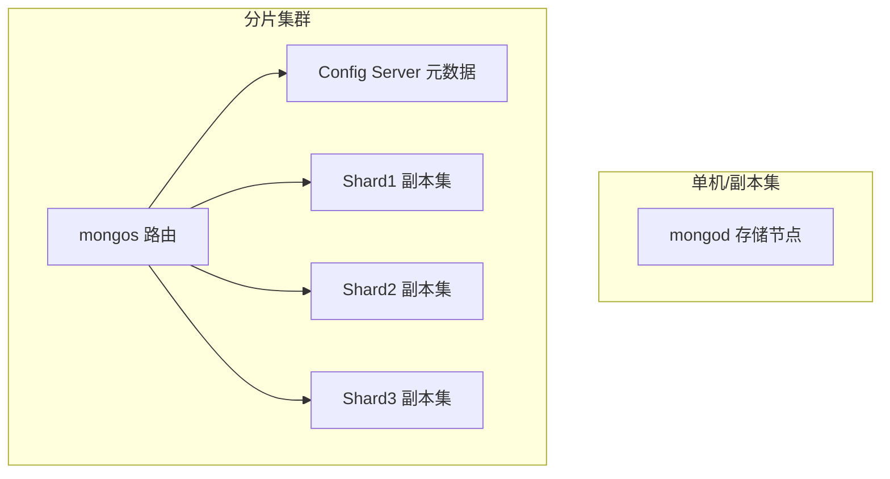

# MongoDB（文档型 NoSQL 数据库）

> 面向文档的分布式 NoSQL 数据库，以「灵活 Schema + 原生水平扩展」见长。
> 适合：内容/CMS、用户画像、日志/埋点、IoT 设备数据、购物车等「结构多变、海量、弱事务」场景。
> 不适合：金融核心交易、强一致性库存扣减、超大规模纯时序（应优先专用时序库）。

---

## 一、它解决什么问题

关系型数据库用「二维表 + 固定 Schema + 外键」表达世界，遇到三类痛点：
1. **结构频繁变化**：电商商品、用户画像字段千差万别，ALTER TABLE 成本高、易锁表。
2. **嵌套/关联结构重**：订单+订单项+评论，关系型要拆多表 JOIN，读放大。
3. **水平扩展难**：分库分表要业务侵入，RDBMS 原生只擅长垂直扩容。

MongoDB 的答案是：**用 BSON 文档（类 JSON、可嵌套数组/子文档）做基本存储单元**，天然支持动态字段，并原生提供副本集（高可用）与分片（水平扩展）。

> 仓库：`github.com/mongodb/mongo`（C++ 核心 + WiredTiger；2018-10 前 AGPL，之后 **SSPL v1** 许可证；master 10 万+ commits）。

---

## 二、核心数据模型

| 概念 | 说明 |
|------|------|
| **Document** | 一条 BSON 记录，类似 JSON，支持嵌套文档与数组。字段可动态增减。 |
| **Collection** | 文档的集合，相当于「表」，但**无强制 Schema**（不同文档字段可不同）。 |
| **_id** | 每文档必有的主键，默认 ObjectId（12 字节：时间戳+机器+进程+自增）。 |
| **Database** | 物理库，含多个 Collection。 |

```json
{
  "_id": ObjectId("..."),
  "name": "张三",
  "address": { "city": "北京", "zip": "100000" },   // 嵌套文档
  "hobby": ["足球", "阅读"],                          // 数组
  "orders": [ { "id": 1, "amt": 99 } ]               // 嵌入式关联
}
```

**建模两种关联方式**
- **嵌入（Embedding）**：关联强的数据放同一文档（如订单+订单项），一次 I/O 读全，避免 JOIN。优先推荐。
- **引用（Referencing）**：用 `_id` 手动关联（类似外键，但无约束），需应用层二次查询。适合「一对多且被引用方独立变化」。

---

## 三、整体架构



- **mongod**：数据库服务器进程，负责存储与查询。
- **mongos**：分片集群的「查询路由」，把请求分发到正确分片，**应用只连 mongos**。
- **Config Server**：存分片元数据（哪个 chunk 在哪），通常 3 节点副本集。
- **副本集（Replica Set）**：1 个 Primary（写）+ N 个 Secondary（读/备份），主宕机自动选举新主（秒级）。
- **分片（Sharding）**：数据按**分片键**切成 chunk，分布到多个 Shard，支持 PB 级水平扩展。

**写入流程**：写 Primary → 记 oplog → Secondary 异步拉 oplog 同步（默认最终一致）。可设 `writeConcern: majority` 提升一致性。

---

## 四、关键机制

### 1. 存储引擎 WiredTiger（默认）
- 文档级并发控制（写只锁单文档），高并发写入优于表锁。
- 支持 snappy（默认）/zlib/none 压缩，**压缩率可达 80%**，显著降低存储。
- 磁盘映射 + cache，热点数据在内存。

### 2. 索引
单字段、复合、多键（数组）、地理空间、文本（全文）、TTL（自动过期）、哈希、唯一索引。查询优化器自动选计划。

### 3. 聚合管道（Aggregation Pipeline）
类似 SQL 的 GROUP BY + JOIN，但用多阶段声明式表达：
```js
db.orders.aggregate([
  { $match: { status: "paid" } },
  { $group: { _id: "$userId", total: { $sum: "$amt" } } },
  { $lookup: { from: "users", localField: "_id", foreignField: "_id", as: "u" } }  // 类似 LEFT JOIN
])
```
阶段：`$match → $project → $group → $sort → $unwind → $lookup → $limit`。

### 4. 多文档事务（4.0+）
- 副本集 4.0 支持、分片集群 4.2 支持**分布式 ACID 事务**。
- 隔离级别仅 **Read Committed**，且事务涉及文档越多性能下降越明显。
- 结论：**核心金融交易仍首选 MySQL/PostgreSQL**；MongoDB 事务只用于非核心或单文档原子操作。

### 5. 时序集合（5.0+）
针对时序场景优化存储与查询（设备指标、监控），但单集群建议 < 500 亿文档，超大规模仍用专用时序库。

---

## 五、MongoDB vs 关系型（面试高频）

| 维度 | MongoDB | MySQL |
|------|---------|-------|
| 数据模型 | 文档（BSON），Schema-less | 表（行/列），固定 Schema |
| 关联 | 嵌入优先，引用需二次查 | 外键 + JOIN |
| 事务 | 4.0+ 多文档 ACID（Read Committed） | 完整 ACID，多隔离级 |
| 扩展 | 原生分片（水平） | 垂直为主，水平需手动分库分表 |
| 写入并发 | 文档级锁，高并发友好 | 行锁/表锁，需优化 |
| 强一致 | 最终一致（可调 majority） | 强一致 |
| 适用 | 日志/画像/内容/CMS | 交易/订单/账务 |

**记忆口诀**：MySQL 结构化、事务强、跨表关联稳；MongoDB 灵活化、扩得易、嵌套查询强。

---

## 六、生产实践与避坑

1. **分片键选型是灵魂**：选高基数的字段（如 user_id 哈希），避免热点分片；不要选单调递增键（如自增 id → 写全落最后一分片）。
2. **别滥用嵌入**：超大数组（无限增长）会导致文档移动、性能劣化，应改为引用或单独集合。
3. **TTL 索引清冷数据**：`expireAfterSeconds` 自动删旧日志/验证码，省存储。
4. **连接用连接池**：驱动自带，避免每次 new client。
5. **读分离**：从 Secondary 读降低主压力，但注意「读从库可能读到旧数据」。
6. **SSPL 合规**：SSPL 不等于纯开源，云厂商托管需留意许可；自建无碍。
7. **Spring Boot 集成**：`spring-boot-starter-data-mongodb`，用 `MongoTemplate` / `MongoRepository`。

---

## 七、与其他板块的关系

- 与 [MySQL](mysql知识.md)、[Redis](redis知识.md)：MongoDB 补「文档/半结构 + 水平扩展」，Redis 补缓存/高性能 KV，MySQL 保强事务。
- 与 [分库分表 ShardingSphere](分库分表ShardingSphere.md)：ShardingSphere 是「关系型分库分表」方案；MongoDB 原生分片可替代部分场景，二者选型看是否要保 ACID/SQL。
- 与 [分布式事务 Seata](分布式事务Seata.md)：MongoDB 4.0+ 自带分布式事务，但与 Seata 的 TCC/Saga 思路不同，跨多数据源仍可用 Seata 编排。

---

## 八、速查表

| 项 | 结论 |
|----|------|
| 类型 | 文档型 NoSQL |
| 数据单元 | BSON 文档（类 JSON） |
| 高可用 | Replica Set（自动故障转移） |
| 水平扩展 | Sharding（分片键路由） |
| 存储引擎 | WiredTiger（文档级锁 + 压缩） |
| 事务 | 4.0+ 多文档 ACID（Read Committed） |
| 查询 | 类 JSON 查询 API + 聚合管道 |
| 许可证 | SSPL v1（2018-10 后） |
| 一句话 | 「写文档」式灵活存储 + 原生水平扩展 |
