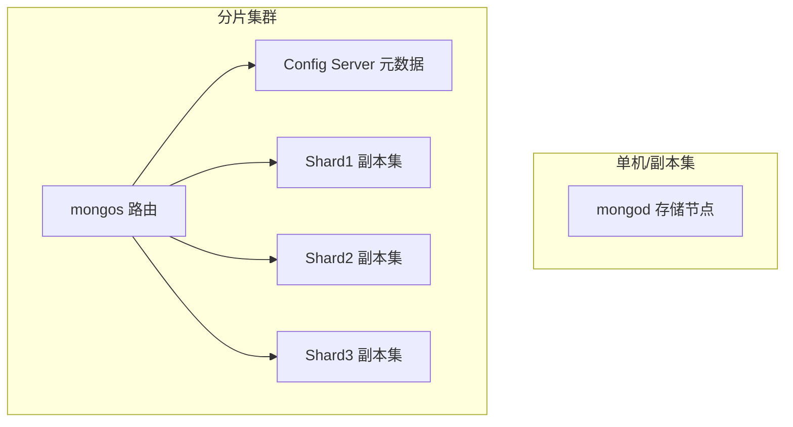
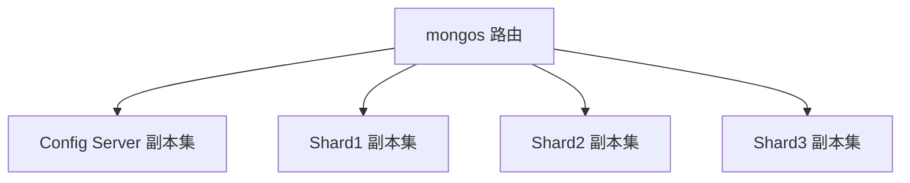
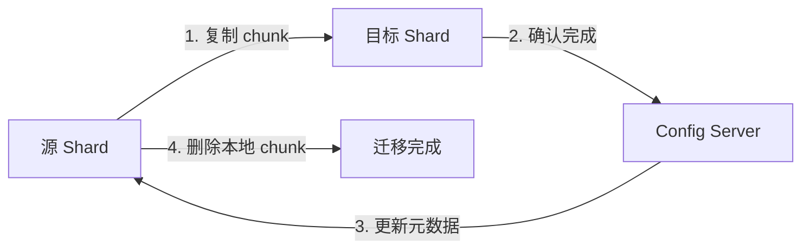
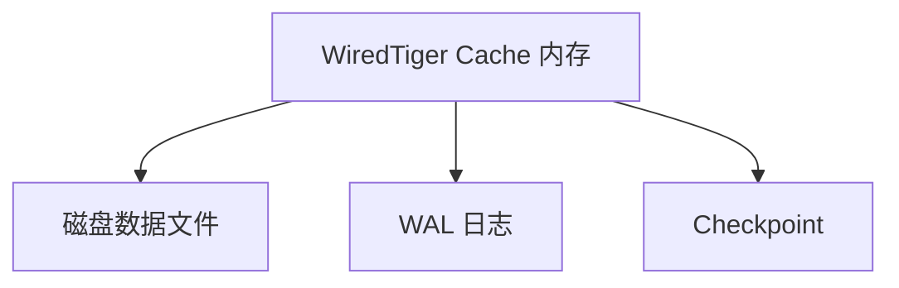
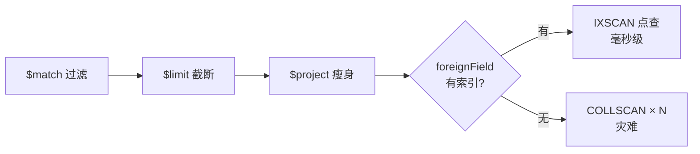
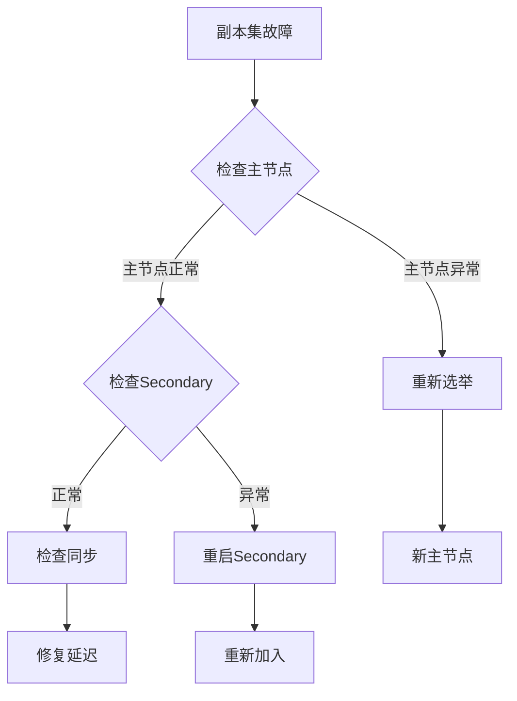

# MongoDB（文档型 NoSQL 数据库）

> 面向文档的分布式 NoSQL 数据库，以「灵活 Schema + 原生水平扩展」见长。
> 适合：内容/CMS、用户画像、日志/埋点、IoT 设备数据、购物车等「结构多变、海量、弱事务」场景。
> 不适合：金融核心交易、强一致性库存扣减、超大规模纯时序（应优先专用时序库）。

---


## 〇、本体介绍（它是什么 / 适用场景 / 核心概念）

**它是什么**：MongoDB 是面向文档（Document）的分布式 NoSQL 数据库，用类 JSON 的 BSON 作为存储单元，支持嵌套子文档与数组，Schema 动态可改。核心代码 C++ + WiredTiger 存储引擎，许可证 2018-10 后为 SSPL v1。

**解决什么痛点**：关系型「二维表 + 固定 Schema + 外键」在结构频繁变化、嵌套关联重、水平扩展难三类场景下成本高。MongoDB 用文档模型天然支持动态字段，并原生提供副本集（高可用）与分片（水平扩展）。

**核心概念**：Document（BSON 记录）、Collection（无强制 Schema 的集合）、_id（默认 ObjectId 主键）、mongod（存储进程）、mongos（分片路由）、Config Server（分片元数据）、Replica Set（主从副本集）、Sharding（按分片键水平切分）。

**适用场景**：内容/CMS、用户画像、日志/埋点、IoT 设备数据、购物车等「结构多变、海量、弱事务」场景。
**不适用**：金融核心交易、强一致库存扣减、超大规模纯时序（应优先专用时序库）。

---

## 一、它解决什么问题

关系型数据库用「二维表 + 固定 Schema + 外键」表达世界，遇到三类痛点：
1. **结构频繁变化**：电商商品、用户画像字段千差万别，ALTER TABLE 成本高、易锁表。
2. **嵌套/关联结构重**：订单+订单项+评论，关系型要拆多表 JOIN，读放大。
3. **水平扩展难**：分库分表要业务侵入，RDBMS 原生只擅长垂直扩容。

MongoDB 的答案是：**用 BSON 文档（类 JSON、可嵌套数组/子文档）做基本存储单元**，天然支持动态字段，并原生提供副本集（高可用）与分片（水平扩展）。

> 仓库：`github.com/mongodb/mongo`（C++ 核心 + WiredTiger；2018-10 前 AGPL，之后 **SSPL v1** 许可证；master 10 万+ commits）。

---

## 二、核心数据模型

| 概念 | 说明 |
|------|------|
| **Document** | 一条 BSON 记录，类似 JSON，支持嵌套文档与数组。字段可动态增减。 |
| **Collection** | 文档的集合，相当于「表」，但**无强制 Schema**（不同文档字段可不同）。 |
| **_id** | 每文档必有的主键，默认 ObjectId（12 字节：时间戳+机器+进程+自增）。 |
| **Database** | 物理库，含多个 Collection。 |

```json
{
  "_id": ObjectId("..."),
  "name": "张三",
  "address": { "city": "北京", "zip": "100000" },   // 嵌套文档
  "hobby": ["足球", "阅读"],                          // 数组
  "orders": [ { "id": 1, "amt": 99 } ]               // 嵌入式关联
}
```

**建模两种关联方式**
- **嵌入（Embedding）**：关联强的数据放同一文档（如订单+订单项），一次 I/O 读全，避免 JOIN。优先推荐。
- **引用（Referencing）**：用 `_id` 手动关联（类似外键，但无约束），需应用层二次查询。适合「一对多且被引用方独立变化」。

---

## 三、整体架构



- **mongod**：数据库服务器进程，负责存储与查询。
- **mongos**：分片集群的「查询路由」，把请求分发到正确分片，**应用只连 mongos**。
- **Config Server**：存分片元数据（哪个 chunk 在哪），通常 3 节点副本集。
- **副本集（Replica Set）**：1 个 Primary（写）+ N 个 Secondary（读/备份），主宕机自动选举新主（秒级）。
- **分片（Sharding）**：数据按**分片键**切成 chunk，分布到多个 Shard，支持 PB 级水平扩展。

**写入流程**：写 Primary → 记 oplog → Secondary 异步拉 oplog 同步（默认最终一致）。可设 `writeConcern: majority` 提升一致性。

---

## 四、关键机制

### 1. 存储引擎 WiredTiger（默认）
- 文档级并发控制（写只锁单文档），高并发写入优于表锁。
- 支持 snappy（默认）/zlib/none 压缩，**压缩率可达 80%**，显著降低存储。
- 磁盘映射 + cache，热点数据在内存。

### 2. 索引
单字段、复合、多键（数组）、地理空间、文本（全文）、TTL（自动过期）、哈希、唯一索引。查询优化器自动选计划。

### 3. 聚合管道（Aggregation Pipeline）
类似 SQL 的 GROUP BY + JOIN，但用多阶段声明式表达：
```js
db.orders.aggregate([
  { $match: { status: "paid" } },
  { $group: { _id: "$userId", total: { $sum: "$amt" } } },
  { $lookup: { from: "users", localField: "_id", foreignField: "_id", as: "u" } }  // 类似 LEFT JOIN
])
```
阶段：`$match → $project → $group → $sort → $unwind → $lookup → $limit`。

### 4. 多文档事务（4.0+）
- 副本集 4.0 支持、分片集群 4.2 支持**分布式 ACID 事务**。
- 隔离级别仅 **Read Committed**，且事务涉及文档越多性能下降越明显。
- 结论：**核心金融交易仍首选 MySQL/PostgreSQL**；MongoDB 事务只用于非核心或单文档原子操作。

### 5. 时序集合（5.0+）
针对时序场景优化存储与查询（设备指标、监控），但单集群建议 < 500 亿文档，超大规模仍用专用时序库。

---

## 五、MongoDB vs 关系型（面试高频）

| 维度 | MongoDB | MySQL |
|------|---------|-------|
| 数据模型 | 文档（BSON），Schema-less | 表（行/列），固定 Schema |
| 关联 | 嵌入优先，引用需二次查 | 外键 + JOIN |
| 事务 | 4.0+ 多文档 ACID（Read Committed） | 完整 ACID，多隔离级 |
| 扩展 | 原生分片（水平） | 垂直为主，水平需手动分库分表 |
| 写入并发 | 文档级锁，高并发友好 | 行锁/表锁，需优化 |
| 强一致 | 最终一致（可调 majority） | 强一致 |
| 适用 | 日志/画像/内容/CMS | 交易/订单/账务 |

**记忆口诀**：MySQL 结构化、事务强、跨表关联稳；MongoDB 灵活化、扩得易、嵌套查询强。

---

## 六、生产实践与避坑

1. **分片键选型是灵魂**：选高基数的字段（如 user_id 哈希），避免热点分片；不要选单调递增键（如自增 id → 写全落最后一分片）。
2. **别滥用嵌入**：超大数组（无限增长）会导致文档移动、性能劣化，应改为引用或单独集合。
3. **TTL 索引清冷数据**：`expireAfterSeconds` 自动删旧日志/验证码，省存储。
4. **连接用连接池**：驱动自带，避免每次 new client。
5. **读分离**：从 Secondary 读降低主压力，但注意「读从库可能读到旧数据」。
6. **SSPL 合规**：SSPL 不等于纯开源，云厂商托管需留意许可；自建无碍。
7. **Spring Boot 集成**：`spring-boot-starter-data-mongodb`，用 `MongoTemplate` / `MongoRepository`。

---

## 七、与其他板块的关系

- 与 [MySQL](../mysql知识.md)、[Redis](../redis知识.md)：MongoDB 补「文档/半结构 + 水平扩展」，Redis 补缓存/高性能 KV，MySQL 保强事务。
- 与 [分库分表 ShardingSphere](分库分表ShardingSphere.md)：ShardingSphere 是「关系型分库分表」方案；MongoDB 原生分片可替代部分场景，二者选型看是否要保 ACID/SQL。
- 与 [分布式事务 Seata](分布式事务Seata.md)：MongoDB 4.0+ 自带分布式事务，但与 Seata 的 TCC/Saga 思路不同，跨多数据源仍可用 Seata 编排。

---

## 八、速查表

| 项 | 结论 |
|----|------|
| 类型 | 文档型 NoSQL |
| 数据单元 | BSON 文档（类 JSON） |
| 高可用 | Replica Set（自动故障转移） |
| 水平扩展 | Sharding（分片键路由） |
| 存储引擎 | WiredTiger（文档级锁 + 压缩） |
| 事务 | 4.0+ 多文档 ACID（Read Committed） |
| 查询 | 类 JSON 查询 API + 聚合管道 |
| 许可证 | SSPL v1（2018-10 后） |
| 一句话 | 「写文档」式灵活存储 + 原生水平扩展 |

---

## 面试高频问题（20+ 条）

1. **MongoDB 与 MySQL 的核心区别？** 数据模型：MongoDB 文档型（BSON，Schema-less），MySQL 关系型（表+固定 Schema）；事务：MySQL 完整 ACID 多隔离级，MongoDB 4.0+ 多文档 ACID 仅 Read Committed；扩展：MongoDB 原生分片水平扩展，MySQL 垂直为主；关联：MongoDB 嵌入优先，MySQL 外键+JOIN。交易/订单用 MySQL，日志/画像/内容用 MongoDB。

2. **副本集（Replica Set）作用与选举？** 作用：高可用（主宕自动转移）、读写分离、数据备份。选举基于 Raft，奇数节点、多数派投票，优先级高且数据最新的 Secondary 胜出；偶数节点需加仲裁节点（Arbiter）避免脑裂。

3. **分片集群核心组件与分片键选择？** 组件：mongos（路由）、Config Server（元数据）、Shard（分片副本集）。分片键选高基数、分布均匀、尽量不变的字段；避免单调递增键（写热点落单分片）；范围查询用范围分片，无范围用哈希分片。

4. **MongoDB 事务支持及与 MySQL 区别？** 4.0+ 副本集、4.2+ 分片集群支持多文档 ACID，隔离级仅 Read Committed，涉及文档越多性能越差。核心金融交易仍首选 MySQL。

5. **Journal 与 Oplog 区别？** Journal 是 WAL 预写日志，用于崩溃恢复、保障持久化；Oplog 是副本集同步日志（固定大小循环），记录主节点所有写操作，Secondary 拉取重放。

6. **如何优化查询性能？** 建合适索引避免 COLLSCAN；用 projection 只返回必要字段；分页用 _id 范围而非深 skip；避免大文档；开 WiredTiger 压缩；用 explain() 看执行计划（IXSCAN vs COLLSCAN）。

7. **索引类型有哪些？** 单字段、复合（最左前缀）、多键（数组）、地理空间（2dsphere）、文本（全文）、TTL（自动过期）、哈希、唯一索引。默认每集合有 _id 索引。

8. **什么是覆盖查询（Covered Query）？** 查询字段与返回字段都命中同一索引，MongoDB 无需回文档即可返回，速度极快。

9. **ObjectId 结构？** 12 字节：4 字节时间戳 + 3 字节机器标识 + 2 字节进程 ID + 3 字节自增计数器。

10. **MongoDB 用 BSON 而非 JSON 的原因？** BSON 二进制、体积小、带类型（日期/二进制等）、遍历快，比纯文本 JSON 更适合存储与传输。

11. **WiredTiger 缓存与内存占用过高怎么处理？** 默认占物理内存 50%（cacheSizeGB 可调）；索引过多、慢查询、大文档频繁读会推高内存。调小 cacheSizeGB、清理冗余索引、优化查询。

12. **主节点宕机从节点不选举的原因？** 集群偶数无仲裁无法形成多数派；从节点 priority=0 不可竞选；从节点数据落后过多（Oplog 被覆盖）；网络分区。

13. **一个分片宕机查询会怎样？** 默认返回错误；可设 partial 允许部分查询；慢分片会拖住 mongos 等待。

14. **Spring Data MongoDB 常用注解？** @Document（集合映射）、@Id（主键）、@Field（字段名）、@Indexed（索引）、@CompoundIndex（复合索引）。

15. **MongoDB 不适合哪些场景？** 强事务核心业务（金融支付）、复杂多表关联（关联查询性能差）、固定结构低变更的结构化数据。

16. **写关注（Write Concern）与读偏好（Read Preference）？** writeConcern: w:1（主写成功）/majority（多数确认，更一致）；readPreference: primary/secondary/nearest，从库读可能读到旧数据。

17. **聚合管道（Aggregation Pipeline）阶段？** $match→$project→$group→$sort→$unwind→$lookup→$limit，类似 SQL 的 GROUP BY + LEFT JOIN，声明式多阶段处理。

18. **是否支持主键外键关系？** 默认不支持；可通过嵌入文档或引用 _id 模拟，但无约束与外键级联。

19. **为何不推荐 32 位版本？** 32 位地址空间上限 2GB（内存映射文件受限），64 位近乎无限，生产必用 64 位。

20. **如何保证数据一致性？** 副本集 Oplog 重放；writeConcern: majority；开 Journal；关键业务用分布式事务。

21. **MongoDB vs Redis？** Redis 内存 KV、亚毫秒、适合缓存/会话；MongoDB 持久化文档、支持复杂查询。常组合：Redis 前置缓存 + MongoDB 持久存储。

22. **Change Streams 是什么？** 实时捕获数据变更（类似 CDC），支持事件驱动架构，可用于监听变更同步到下游。

---

## 九、MongoDB 索引深度

### 9.1 索引类型详解

| 索引类型 | 说明 | 适用场景 |
|----------|------|----------|
| 单字段索引 | 默认 `_id` 索引 | 等值查询 |
| 复合索引 | 多字段组合，遵循最左前缀 | 多条件查询 |
| 多键索引 | 自动为数组元素建索引 | 数组字段查询 |
| 文本索引 | 全文搜索（分词） | 文章/评论搜索 |
| 地理空间索引 | 2dsphere/2d | LBS 附近的人/店 |
| 哈希索引 | 字段哈希值 | 等值查询（分片键） |
| TTL 索引 | 自动过期删除 | 验证码/会话/日志 |
| 唯一索引 | 字段唯一约束 | 手机号/邮箱去重 |
| 部分索引 | 只索引满足条件的文档 | 低基数字段（如 status='active'） |
| 稀疏索引 | 只索引非 null 值 | 可选字段查询 |
| 复合唯一索引 | 多字段组合唯一 | 联合去重（如 user_id + order_no） |

### 9.2 索引优化实践

```javascript
// 复合索引设计原则：等值在前，范围在后
db.orders.createIndex({ user_id: 1, created_at: -1 })
// 查询: db.orders.find({ user_id: "u1", created_at: { $gte: ISODate("2026-01-01") } })

// 覆盖查询（Covered Query）
db.orders.find({ user_id: "u1" }, { user_id: 1, amount: 1, _id: 0 })
// 查询字段和返回字段都命中索引，无需回文档

// 部分索引（只索引 active 状态）
db.users.createIndex({ email: 1 }, { partialFilterExpression: { status: "active" } })

// explain() 查看执行计划
db.orders.find({ user_id: "u1" }).explain("executionStats")
// IXSCAN = 索引扫描（好），COLLSCAN = 全表扫描（差）
```

### 9.3 索引陷阱

| 陷阱 | 表现 | 解法 |
|------|------|------|
| 过多索引 | 写入变慢（每个索引都要更新） | 定期清理冗余索引 |
| 大文档索引 | 索引体积大、缓存命中低 | 只索引必要字段 |
| 数组索引爆炸 | 数组每个元素都建索引 | 控制数组大小 |
| 深度复合索引 | 5+ 字段复合索引 | 按查询模式精简 |

---

## 十、MongoDB 事务深度

### 10.1 事务语法

```javascript
const session = client.startSession();
try {
    session.startTransaction({
        readConcern: { level: "snapshot" },
        writeConcern: { w: "majority" },
        readPreference: "primary"
    });
    
    await ordersCollection.insertOne({ ... }, { session });
    await inventoryCollection.updateOne({ ... }, { session });
    
    await session.commitTransaction();
} catch (error) {
    await session.abortTransaction();
} finally {
    session.endSession();
}
```

### 10.2 事务限制与最佳实践

| 限制 | 说明 |
|------|------|
| 隔离级别 | 仅 Read Committed（非可串行化） |
| 文档大小 | 单文档 ≤ 16MB |
| Oplog 条目 | 事务内操作 ≤ oplog 大小限制 |
| 性能开销 | 事务越多性能越差（锁竞争） |
| 最佳实践 | 尽量用单文档原子操作（`$set`/`$inc`） |

---

## 十一、MongoDB Change Streams

```javascript
// 监听集合变更
const changeStream = ordersCollection.watch([
    { $match: { "operationType": { $in: ["insert", "update", "delete"] } } }
]);

changeStream.on("change", (event) => {
    console.log(event.operationType, event.fullDocument);
    // 可用于：缓存同步、审计日志、事件驱动架构
});
```

**适用场景**：MySQL→MongoDB 同步、缓存一致性、审计日志、事件驱动微服务。

---

## 十二、MongoDB 分片深度

### 12.1 分片架构组件



| 组件 | 说明 |
|------|------|
| mongos | 路由器，应用只连 mongos |
| Config Server | 存储分片元数据（chunk 分布），必须是副本集 |
| Shard | 数据节点，每个 Shard 是一个副本集 |
| Chunk | 分片键范围的一段数据块 |

### 12.2 Balancer 均衡器

```text
Balancer 工作机制：
  - 后台进程，定期检查各 Shard 的 chunk 数量
  - chunk 数不均衡时自动迁移
  - 迁移过程对应用透明（先复制 chunk，再删除源）
  - 迁移窗口可配置（避免影响业务）
```

```javascript
// 查看 Balancer 状态
sh.getBalancerState()
sh.isBalancerRunning()

// 配置迁移窗口（UTC 时间）
db.settings.update(
  { _id: "balancer" },
  { $set: { activeWindow: { start: "02:00", stop: "06:00" } } },
  { upsert: true }
)
```

### 12.3 Chunk 迁移流程



### 12.4 分片键选择最佳实践

```
好的分片键特征：
  1. 高基数：取值多，分布均匀
  2. 查询必带：绝大多数查询都带分片键
  3. 不单调递增：避免写入热点
  4. 相对稳定：不会频繁变更

推荐策略：
  - Hashed 分片：均匀分布，适合等值查询
  - Range 分片：适合范围查询，但易热点
  - 复合分片键：{user_id: "hashed", created_at: 1}
```

---

## 十三、副本集选举机制

### 13.1 选举流程

```text
触发条件：
  - Primary 宕机或网络不可达
  - heartbeat 超时（默认 10s）

选举过程（基于 Raft）：
  1. Secondary 检测到 Primary 不可达
  2. Secondary 提升为 Candidate，发起选举
  3. 向所有节点请求投票
  4. 获得多数派投票（N/2+1）→ 当选新 Primary
  5. 更新 term（任期号），同步 oplog
```

### 13.2 选举配置

| 参数 | 默认值 | 说明 |
|------|--------|------|
| `electionTimeoutMillis` | 10000 | 判定 Primary 不可达的时间 |
| `priority` | 1 | 选举优先级（0=永远不竞选） |
| `votes` | 1 | 投票权重 |
| `arbiterOnly` | false | 仲裁节点（不存数据，只投票） |

### 13.3 选举注意事项

```
1. 奇数节点：3/5/7，偶数节点可能脑裂
2. 优先级配置：重要节点设高 priority
3. 隐藏节点：priority=0 + hidden=true 做只读
4. 延迟节点：priority=0 + secondaryDelaySecs 做延迟从库
5. 网络分区：配置 protectiveMode 防止异常写入
```

---

## 十四、Change Streams 深度

### 14.1 原理

```text
Change Streams 基于 oplog 实现：
  - 类似 MySQL binlog，记录所有写操作
  - 通过 resume token 断点续传
  - 支持集群级/库级/集合级监听
  - 可过滤操作类型（insert/update/delete/replace）
```

### 14.2 高级用法

```javascript
// 集群级 Change Stream
const changeStream = db.watch([], { resumeAfter: resumeToken });

// 带管道过滤
const changeStream = ordersCollection.watch([
  { $match: { "operationType": "insert", "fullDocument.amount": { $gte: 1000 } } }
]);

// 断点续传
const resumeToken = changeStream.resumeToken;
// 重启后
const changeStream = collection.watch([], { resumeAfter: resumeToken });

// 关闭监听
changeStream.close();
```

### 14.3 Change Streams vs CDC

| 维度 | Change Streams | CDC (Canal/Debezium) |
|------|---------------|---------------------|
| 数据源 | MongoDB oplog | MySQL binlog |
| 延迟 | 毫秒级 | 秒级 |
| 目标 | MongoDB 间同步 | 异构系统同步 |
| 部署 | 内嵌 MongoDB | 独立组件 |
| 适用 | 事件驱动/CDC | 跨数据库同步 |

---

## 十五、聚合管道优化

### 15.1 优化原则

```
1. $match 前置：尽早过滤数据，减少后续处理量
2. $project 精简：只传递需要的字段
3. 使用索引：$match 和 $sort 尽量命中索引
4. 避免 $lookup：尽量用嵌入文档替代关联查询
5. 限制结果集：$limit 提前限制数量
6. explain() 分析：查看执行计划确认优化效果
```

### 15.2 优化示例

```javascript
// 差：$lookup 放前面
db.orders.aggregate([
  { $lookup: { from: "users", localField: "user_id", foreignField: "_id", as: "user" } },
  { $match: { status: "paid" } },
  { $group: { _id: "$user_id", total: { $sum: "$amount" } } }
])

// 好：$match 前置 + 嵌入文档
db.orders.aggregate([
  { $match: { status: "paid" } },
  { $project: { user_id: 1, amount: 1 } },
  { $group: { _id: "$user_id", total: { $sum: "$amount" } } }
])
```

---

## 十六、WiredTiger 内部机制

### 16.1 存储架构



| 组件 | 说明 |
|------|------|
| Cache | 默认占物理内存 50%，LRU 淘汰 |
| B-Tree | 数据索引结构，文档级并发控制 |
| Journal | WAL 预写日志，崩溃恢复 |
| Checkpoint | 定期刷盘，持久化 |
| Snappy | 默认压缩算法，压缩率约 80% |

### 16.2 性能调优

```yaml
# WiredTiger 缓存配置
storage:
  wiredTiger:
    engineConfig:
      cacheSizeGB: 4          # 手动设置缓存大小
      journalCompressor: snappy
    collectionConfig:
      blockCompressor: snappy
    indexConfig:
      prefixCompression: true
```

---

## 十七、MongoDB Atlas 特性

```text
Atlas = MongoDB 官方全托管云服务（AWS/Azure/GPC）

核心特性：
  - 自动副本集/分片集群部署
  - 自动备份与时间点恢复（PITR）
  - 实时性能仪表盘
  - 全球数据库集群（Global Clusters）
  - 数据库搜索（Atlas Search = Lucene）
  - Atlas Data Lake（S3 查询）
  - 联合查询（Federated Query）
  - 多云部署（AWS + Azure + GCP）
```

---

## 十八、MongoDB vs DynamoDB vs CouchDB

| 维度 | MongoDB | DynamoDB | CouchDB |
|------|---------|----------|---------|
| 数据模型 | 文档（BSON） | KV + 文档 | JSON 文档 |
| 查询 | 丰富（聚合管道） | 有限（GSI/LSI） | MapReduce |
| 事务 | 多文档 ACID | 单文档 ACID | 无 |
| 扩展 | 分片（手动/自动） | 自动扩缩容 | 多主复制 |
| 一致性 | 可调（最终/majority） | 强一致/最终一致 | 最终一致 |
| 适用 | 通用文档数据库 | AWS 生态 KV/文档 | P2P 同步场景 |
| 成本 | 自建可控 | 按量计费（可能高） | 开源免费 |

---

## 进阶专题 A：聚合管道 $lookup 性能陷阱与优化

`$lookup` 是类 SQL LEFT JOIN，但 JOIN 发生在 mongod 内存中，是聚合管道里最容易拖垮性能的阶段。

| 陷阱 | 表现 | 根因 |
|------|------|------|
| foreignField 无索引 | CPU 打满、慢查询告警 | 每条驱动文档都对被查集合做 COLLSCAN |
| 驱动集合过大 | 内存超限报错（allowDiskUse 也救不了延迟） | 先 $lookup 后过滤，处理百万级中间结果 |
| as 数组爆炸 | 文档逼近 16MB 上限 | 一对多未 $unwind+$group 收敛 |
| 多层 $lookup 嵌套 | 延迟指数级放大 | N+1 式关联在 DB 内复现 |

**优化三板斧**

```javascript
// 1. foreignField 必须有索引（自定义关联键，不是 _id 时尤其要建）
db.users.createIndex({ member_no: 1 })

// 2. $match/$limit/$project 前置，把驱动集合压到最小
db.orders.aggregate([
  { $match: { status: "PAID", created_at: { $gte: ISODate("2026-08-01") } } }, // 先过滤
  { $limit: 10000 },                                                            // 再限量
  { $project: { user_id: 1, amount: 1 } },                                      // 再瘦身
  { $lookup: {                                                                  // 最后才 JOIN
    from: "users",
    localField: "user_id",
    foreignField: "_id",
    pipeline: [{ $project: { name: 1, level: 1 } }],   // pipeline 形式可同时投影
    as: "user"
  }},
  { $unwind: "$user" }
])

// 3. 数据量大时放弃 $lookup，改应用层两步查询（先查 orders 再 $in 查 users）
const userIds = orders.map(o => o.user_id)
const users = await db.users.find({ _id: { $in: userIds } }).toArray() // 一次批量 IN
```

**决策阈值**：驱动集合过滤后 < 1 万行可用 `$lookup`；1 万～10 万谨慎并压测；> 10 万改应用层批量查询或建模期嵌入冗余字段（空间换时间）。



---

## 进阶专题 B：索引交集与 ESR 规则（Equality-Sort-Range）

MongoDB 每个查询通常只用一个索引（多计划竞争后选优），**索引交集（Index Intersection）虽存在但不可靠**——优化器可能用 `AND_SORTED`/`AND_HASH` 合并多个单字段索引，但代价高、不稳定，**正确做法是显式建复合索引**。复合索引字段排序遵循 **ESR 原则**：

| 位置 | 含义 | 示例条件 |
|------|------|----------|
| **E**quality | 等值过滤字段放最前 | `{ status: "PAID" }` |
| **S**ort | 排序字段放中间 | `sort({ created_at: -1 })` |
| **R**ange | 范围字段放最后 | `{ amount: { $gt: 100 } }` |

```javascript
// 查询：等值 status + 排序 created_at + 范围 amount
db.orders.find({ status: "PAID", amount: { $gt: 100 } })
         .sort({ created_at: -1 })

// ✅ 按 ESR 建索引：一次扫描即有序，无需内存排序（无 SORT stage）
db.orders.createIndex({ status: 1, created_at: -1, amount: 1 })

// ❌ 反例：范围字段夹在中间，排序无法利用索引（出现 SORT stage + 内存限制 100MB）
db.orders.createIndex({ status: 1, amount: 1, created_at: -1 })
```

**explain 检验要点**：`winningPlan` 中应看到 `IXSCAN` 且无 `SORT`；`totalKeysExamined ≈ nReturned` 为理想状态；`totalDocsExamined` 远大于返回数说明选择性差。

---

## 进阶专题 C：分片键选择反例复盘


| 反例 | 键选择 | 后果 | 正确姿势 |
|------|--------|------|----------|
| 单调递增 | 自增 id / created_at / ObjectId | 所有新写集中到最后一个分片，balancer 追不上 | 哈希分片打散：`{ user_id: "hashed" }` |
| 低基数 | `{ status: 1 }`（仅 3 种取值） | chunk 无法分裂，数据倾斜 | 复合键补高基数字段 |
| 查询不带键 | 分片键选了 region，但查询都按 user_id | 全分片广播路由（scatter-gather），延迟翻倍 | 分片键=高频查询必带字段，或加二级投影 |
| 频繁变更 | 用手机号当分片键，用户换号 | 更新分片键代价极高（跨片迁移） | 选稳定不变的业务标识 |

**复盘结论**：分片键定了几乎不可改（在线 refine 可缓解但受限），上线前必须用「写入分布模拟 + Top 查询模式审计」双验证；通用安全解是 `{ 高基数业务键: "hashed" }`，牺牲范围查询换均匀写入。

---

## 进阶专题 D：Change Stream 在缓存失效中的应用

比「删缓存」更优雅的缓存一致性方案：应用只管写库，由独立的 invalidator 监听 Change Stream 精准失效 Redis key，避免定时轮询的延迟与双写的侵入。

```javascript
// cache-invalidator 服务
const stream = db.collection("products").watch(
  [{ $match: { operationType: { $in: ["update", "replace", "delete"] } } }],
  { fullDocumentBeforeChange: "whenAvailable" }
);

stream.on("change", async (evt) => {
  const key = `cache:product:${evt.documentKey._id}`;
  await redis.del(key);            // 失效而非更新：下次读时回源重建，避免并发写乱序
  checkpoint.save(evt._id);        // resume token 持久化，重启断点续传
});
```

| 要点 | 说明 |
|------|------|
| 失效优先于更新缓存 | 删 key 让读路径回源，天然规避「旧值覆盖新值」竞态 |
| resume token 必须落盘 | 否则服务重启从最新位置开始，漏掉窗口内的变更 |
| oplog 窗口 | 停机时间超过 oplog 容量则 token 失效，只能全量重建缓存兜底 |
| 读旧风险 | 失效到回源之间仍可能有并发读到旧值，强一致需求需版本号比对 |

---

## 进阶专题 E：副本集成员角色详解（hidden / delayed / arbiters）

| 角色 | 配置 | 数据 | 投票 | 用途 |
|------|------|------|------|------|
| Hidden | `priority: 0, hidden: true` | 有 | 有 | 专供备份/报表，客户端路由永不感知它 |
| Delayed | `priority: 0, secondaryDelaySecs: 3600` | 滞后 1h | 有 | 误操作人肉保险丝（drop 库后还能从延迟节点捞数据） |
| Arbiter | `arbiterOnly: true` | **无数据** | 有 | 偶数节点凑多数派，防脑裂；本身不抗数据丢失 |

```javascript
cfg = rs.conf()
// 隐藏备份节点
cfg.members[2].priority = 0
cfg.members[2].hidden = true
// 延迟节点
cfg.members[3].priority = 0
cfg.members[3].secondaryDelaySecs = 3600
rs.reconfig(cfg)
```

**生产组合建议**：标准 3 节点 PSS（Primary+Secondary+Secondary）；需要备份隔离时扩为 PSSS（第 4 个 hidden）；资源不足偶数场景再加 Arbiter——但记住 arbiter 不能提供数据冗余，只是选举权。

---

## 进阶专题 F：备份三方案对比（mongodump / 存储快照+oplog / Atlas 及 PBM）

| 维度 | 方案① mongodump | 方案② 文件系统/云盘快照 + oplog | 方案③ Atlas / Percona Backup for MongoDB |
|------|-----------------|-------------------------------|------------------------------------------|
| 原理 | 逻辑导出 BSON | 块设备瞬时快照 + 快照间 oplog 重放实现 PITR | 物理备份代理 + oplog 流（PBM）/ 全托管 PITR |
| 备份速度 | 慢（随数据量线性恶化，TB 级不可接受） | 秒级（COW 快照，与数据量无关） | 快（物理流式） |
| 恢复粒度 | 集合/库级灵活 | 整实例级 | 实例/时间点 |
| PITR 能力 | 无（只能恢复 dump 时刻） | 有（任意秒级时间点） | 有（连续 oplog） |
| 对线上影响 | 读压力 + 缓存污染 | 几乎无（瞬间冻结 IO） | 低（专用 agent） |
| 成本 | 低（免费工具） | 中（快照存储费） | 商业版收费 / Atlas 按用量 |
| 适用 | 小规模、单集合导出迁移 | 自建中大规模主流方案 | 云托管或企业级自建 |

```bash
# 方案②典型流水线：快照 + binlog 式连续保护
# 1. fsyncLock 冻结写（可选，LVM/云盘一般不需要）→ 打快照 → 解冻
# 2. 恢复任意时间点：还原最近快照 → 用 oplog 重放到目标 ts
mongorestore --oplogReplay --nsInclude "shop.*" dump/
# 方案③ Percona Backup 定时任务
pbm config --set storage.type=s3 && pbm backup --type=physical
```

**选型口诀**：小库 mongodump 凑合，自建上快照+oplog 做 PITR，云上直接 Atlas/PBM——**任何方案都要定期做恢复演练，没验证过的备份等于没有备份**。

---

## 补充：分片键选择（zone/shardKey/index约束）

### 分片键选择原则

```text
分片键选择原则：
  高基数（Cardinality）：
    分片键值种类多，分布均匀
    避免"热分片"
  
  写分布均匀：
    避免所有写集中到单个分片
    使用哈希分片（hashered）分布更均匀
  
  查询隔离（Query Isolation）：
    大多数查询包含分片键
    避免跨分片查询（scatter-gather）
  
  低开销（Low Overhead）：
    分片键大小适中（16-64字节）
    避免复合分片键过于复杂

  常见分片键：
    userId：用户数据按用户分片
    orderId：订单数据按订单ID分片
    timestamp：时序数据按时间范围分片
    GeoHash：地理数据按经纬度分片
```

### 哈希分片 vs 范围分片

| 维度 | 哈希分片 | 范围分片 |
|------|---------|---------|
| 分布 | 均匀（随机） | 可能不均匀 |
| 写热点 | 无 | 有（递增ID写单片） |
| 范围查询 | 跨分片（效率低） | 单片（效率高） |
| 适用 | 高并发写入 | 范围查询多 |
| 示例 | `{_id: hashed}` | `{created_at: 1}` |

### 分片键配置

```javascript
// 哈希分片
sh.shardCollection("mydb.users", {_id: "hashed"})

// 范围分片
sh.shardCollection("mydb.logs", {created_at: 1})

// 复合分片键
sh.shardCollection("mydb.events", {userId: 1, timestamp: 1})

// 查看分片分布
sh.status()
```

## 补充：Change Streams（实时变更监听）

### Change Streams架构

```text
Change Streams工作原理：
  1. 基于Oplog实现
  2. 提供增量变更流
  3. 支持resume token（断点续传）
  4. 支持聚合管道过滤
  
  事件类型：
    insert：插入文档
    update：更新文档
    replace：替换文档
    delete：删除文档
    drop：删除集合
    invalidate：集合被删除/重命名
  
  使用场景：
    实时数据同步（ETL）
    事件驱动架构
    实时搜索索引
    数据变更通知
```

```javascript
// Change Streams示例
const changeStream = db.users.watch([
  {$match: {"operationType": {$in: ["insert", "update"]}}},
  {$project: {"fullDocument": 1, "operationType": 1, "ns": 1}}
]);

changeStream.on("change", (change) => {
  console.log("变更:", change.operationType, change.fullDocument);
});

// Resume token断点续传
const resumeToken = changeStream.resumeToken;
// 重启时传入resumeAfter
const newStream = db.users.watch([], {resumeAfter: resumeToken});
```

## 补充：Atlas Search（全文搜索引擎）

### Atlas Search架构

```text
Atlas Search架构：
  基于Apache Lucene实现
  集成MongoDB Atlas云服务
  支持中文分词（jieba/IK）
  支持模糊搜索、高亮、聚合
  
  常用操作符：
    text：全文搜索
    autocomplete：自动补全
    regex：正则匹配
    range：范围查询
    exists：字段存在性
    compound：复合查询（must/should/mustNot）
```

```javascript
// Atlas Search索引创建
db.users.createSearchIndex({
  name: "default",
  definition: {
    mappings: {
      dynamic: true,
      fields: {
        name: {type: "string"},
        email: {type: "string"},
        bio: {type: "string", analyzer: "luceneStandard"}
      }
    }
  }
});

// 搜索查询
db.users.aggregate([
  {$search: {
    index: "default",
    compound: {
      must: [
        {text: {query: "张三", path: "name"}},
        {text: {query: "北京", path: "address"}}
      ]
    },
    highlight: {path: "bio"}
  }},
  {$project: {name: 1, email: 1, score: {$meta: "searchScore"}}}
]);
```

## 补充：聚合管道（$lookup/$unwind/$facet）

### 聚合管道详解

| 阶段 | 功能 | 示例 |
|------|------|------|
| $match | 过滤 | `{status: "active"}` |
| $group | 分组 | `{_id: "$userId", total: {$sum: "$amount"}}` |
| $sort | 排序 | `{total: -1}` |
| $project | 投影 | `{name: 1, total: 1}` |
| $lookup | 关联 | `{from: "orders", localField: "_id", foreignField: "userId"}` |
| $unwind | 展开数组 | `{path: "$tags"}` |
| $facet | 多分支聚合 | 按不同维度聚合 |
| $bucket | 桶分组 | 按范围分组统计 |

```javascript
// 聚合管道示例：用户订单统计
db.orders.aggregate([
  {$match: {status: "completed"}},
  {$group: {
    _id: "$userId",
    totalAmount: {$sum: "$amount"},
    orderCount: {$sum: 1},
    avgAmount: {$avg: "$amount"}
  }},
  {$sort: {totalAmount: -1}},
  {$limit: 10},
  {$lookup: {
    from: "users",
    localField: "_id",
    foreignField: "_id",
    as: "user"
  }},
  {$unwind: "$user"},
  {$project: {
    userId: "$_id",
    userName: "$user.name",
    totalAmount: 1,
    orderCount: 1,
    avgAmount: 1
  }}
]);
```

## 补充：MongoDB事务限制（多文档事务/会话）

### 事务限制

```text
MongoDB事务限制：
  单文档事务：原子性，无需显式开启
  多文档事务（4.0+）：需要显式开启
  
  限制：
    事务内存上限：64MB（超过会报错）
    事务超时：默认60秒（可配置）
    跨分片事务：4.2+支持（需enableSharding）
    读写分离：从节点读可能延迟（readConcern: majority）
    操作数限制：每个事务最多1000个操作
  
  最佳实践：
    保持事务尽可能小
    避免在事务中做外部调用
    合理设置超时时间
    使用readConcern: majority保证一致性
```

```javascript
// 事务示例
const session = client.startSession();
try {
  session.startTransaction({
    readConcern: {level: "majority"},
    writeConcern: {w: "majority"},
    readPreference: "primary",
    maxTimeMS: 30000
  });
  
  await db.orders.insertOne({userId: "user1", amount: 100}, {session});
  await db.accounts.updateOne(
    {userId: "user1"},
    {$inc: {balance: -100}},
    {session}
  );
  
  await session.commitTransaction();
} catch (error) {
  await session.abortTransaction();
  throw error;
} finally {
  session.endSession();
}
```

## 补充：MongoDB备份与恢复（mongodump/mongorestore）

### 备份策略对比

| 方法 | 适用场景 | 一致性 | 备份速度 | 恢复速度 |
|------|---------|--------|----------|----------|
| mongodump | 逻辑备份 | 单实例快照 | 中 | 中 |
| 文件拷贝 | 物理备份 | 需停服 | 快 | 快 |
| LVM快照 | LVM存储 | 快照级别 | 快 | 快 |
| Ops Manager | 生产环境 | 自动 | 快 | 快 |
| Atlas备份 | Atlas集群 | 自动 | 快 | 快 |

```bash
# 完整备份
mongodump --uri="mongodb://localhost:27017" \
  --db=mydb \
  --out=/backup/$(date +%Y%m%d)

# 增量备份（Oplog）
mongodump --uri="mongodb://localhost:27017" \
  --db=mydb \
  --oplog \
  --out=/backup/oplog

# 恢复
mongorestore --uri="mongodb://localhost:27017" \
  --db=mydb \
  --drop \
  /backup/mydb

# 恢复指定集合
mongorestore --uri="mongodb://localhost:27017" \
  --db=mydb \
  --collection=users \
  --drop \
  /backup/mydb/users.bson
```

## 补充：分片集群架构（mongos/config/replica set）

### 分片集群组件

```text
分片集群组件：
  mongos：路由器，接收客户端请求
    部署多个（无状态）
    缓存config server元数据
    路由请求到目标分片
  
  config server：存储元数据（副本集）
    存储分片信息、块分布、用户权限
    3节点副本集（推荐）
    启用journal持久化
  
  shard：数据分片（副本集）
    每个分片是一个副本集
    存储实际数据
    支持水平扩展
  
  数据流：
    客户端 → mongos → shard → 数据
    config server → mongos → 路由信息
```

```bash
# 分片集群部署示例
# 1. 启动config server
mongod --configsvr --replSet configRS --dbpath /data/config --port 27019

# 2. 初始化config server副本集
rs.initiate({
  _id: "configRS",
  configsvr: true,
  members: [
    {_id: 0, host: "config1:27019"},
    {_id: 1, host: "config2:27019"},
    {_id: 2, host: "config3:27019"}
  ]
})

# 3. 启动mongos
mongos --configdb configRS/config1:27019,config2:27019,config3:27019 --port 27017

# 4. 添加分片
sh.addShard("shard1/rs1:27017,rs2:27017,rs3:27017")
sh.addShard("shard2/rs4:27017,rs5:27017,rs6:27017")

# 5. 启用分片
sh.enableSharding("mydb")
sh.shardCollection("mydb.users", {_id: "hashed"})
```

## 补充：MongoDB索引（复合索引/覆盖索引/多键索引）

### 索引类型详解

| 索引类型 | 说明 | 适用场景 |
|----------|------|----------|
| 单字段索引 | 单个字段 | 常用查询字段 |
| 复合索引 | 多个字段组合 | 多条件查询 |
| 多键索引 | 数组字段 | 数组元素查询 |
| 文本索引 | 全文搜索 | 模糊搜索 |
| 地理空间索引 | 地理位置 | 位置查询 |
| 哈希索引 | 哈希值 | 哈希分片 |
| TTL索引 | 自动过期 | 临时数据 |

```javascript
// 复合索引（最左前缀原则）
db.users.createIndex({age: 1, name: -1})
// 支持查询：
// {age: 25} ✅
// {age: 25, name: "张三"} ✅
// {name: "张三"} ❌（不满足最左前缀）

// 覆盖索引（查询字段全在索引中，无需回表）
db.users.find({age: 25}, {name: 1, age: 1})
// 索引 {age: 1, name: -1} 覆盖该查询

// 多键索引（数组字段）
db.articles.createIndex({tags: 1})
// 查询数组元素
db.articles.find({tags: "mongodb"})
```

## 十九、与其他板块的关系（扩展）

- 与 [MySQL](../mysql知识.md)、[Redis](../redis知识.md)：MongoDB 补「文档/半结构 + 水平扩展」，Redis 补缓存/高性能 KV，MySQL 保强事务。
- 与 [分库分表 ShardingSphere](分库分表ShardingSphere.md)：ShardingSphere 是「关系型分库分表」方案；MongoDB 原生分片可替代部分场景，二者选型看是否要保 ACID/SQL。
- 与 [分布式事务 Seata](分布式事务Seata.md)：MongoDB 4.0+ 自带分布式事务，但与 Seata 的 TCC/Saga 思路不同，跨多数据源仍可用 Seata 编排。
- 与 [Elasticsearch](../ES体系.md)：MongoDB 存文档，ES 存检索，常通过 Change Streams 同步。
- 与 [Redis](Redis深度篇.md)：热门查询缓存在 Redis，MongoDB 做持久存储。

---

## 十三、速查表（扩展）

| 项 | 结论 |
|----|------|
| 类型 | 文档型 NoSQL |
| 数据单元 | BSON 文档（类 JSON） |
| 高可用 | Replica Set（自动故障转移） |
| 水平扩展 | Sharding（分片键路由） |
| 存储引擎 | WiredTiger（文档级锁 + 压缩） |
| 事务 | 4.0+ 多文档 ACID（Read Committed） |
| 索引 | 10+ 种类型（复合/文本/地理/TTL） |
| Change Streams | 实时变更捕获（类 CDC） |
| 聚合管道 | $match → $group → $lookup → $sort |
| 许可证 | SSPL v1（2018-10 后） |
| 一句话 | 「写文档」式灵活存储 + 原生水平扩展 |

## 二十、MongoDB 事务 ACID 与 WiredTiger MVCC 深入

### 20.1 多文档事务 ACID

```
MongoDB 4.0+ 多文档 ACID 事务：

  A（原子性）：
    事务内所有操作要么全部成功，要么全部回滚
    支持跨文档、跨集合事务

  C（一致性）：
    事务开始前和结束后，数据保持一致状态
    唯一索引约束在事务中强制执行

  I（隔离性）：
    默认：Read Committed（读已提交）
    可选：Snapshot（快照隔离）
    写操作使用 WiredTiger MVCC 实现隔离

  D（持久性）：
    Write Concern: majority（多数节点写入成功才返回）
    Journal 日志保证崩溃恢复

  事务使用限制：
    1. 默认超时 60 秒（可配置）
    2. 单事务操作文档数 < 100 万
    3. 事务大小 < 16MB（单文档限制）
    4. 不支持嵌套事务
    5. 不支持延迟写入（w:0）
```

### 20.2 WiredTiger MVCC 机制

```
WiredTiger MVCC（多版本并发控制）：

  原理：
    每次更新创建新版本（多版本链）
    旧版本保留在 WiredTiger 版本链中
    读操作读取快照（事务开始时的版本）
    写操作创建新版本（不影响读）

  版本链结构：
    文档 _id=1：
      version-3（当前） ← version-2 ← version-1（最旧）
    读操作读取事务开始时的快照版本

  回收机制：
    Checkpoint：定期创建快照（默认 60 秒）
    日志回收：Checkpoint 后删除旧版本
    空间回收：expired 版本被清理

  配置：
    wiredTiger.cache.sizeGB=1          # 缓存大小
    wiredTiger.checkpoint.waitSecs=60  # Checkpoint 间隔
    wiredTiger.log.preallocSize=2       # 日志预分配
```

```sql
-- 事务示例
session.startTransaction({
  readConcern: { level: "snapshot" },
  writeConcern: { w: "majority" },
  readPreference: "primary"
});

db.accounts.updateOne({ _id: "user1" }, { $inc: { balance: -100 } });
db.accounts.updateOne({ _id: "user2" }, { $inc: { balance: 100 } });
db.transactions.insertOne({ from: "user1", to: "user2", amount: 100 });

session.commitTransaction();
```

## 二十一、Change Streams 实时缓存失效方案

```java
// Change Streams 监听变更 → 失效 Redis 缓存
public class CacheInvalidator {
    private MongoDatabase database;
    private RedisTemplate<String, Object> redis;

    public void startWatching() {
        List<Bson> pipeline = Arrays.asList(
            Aggregates.match(Document.parse(
                "{ operationType: { $in: ['insert', 'update', 'replace', 'delete'] } }"
            ))
        );

        ChangeStreamIterable<Document> changeStream = database.getCollection("orders")
            .watch(pipeline)
            .fullDocument(FullDocument.UPDATE_LOOKUP);

        changeStream.forEach(event -> {
            String docId = event.getDocumentKey().get("_id").toString();
            String cacheKey = "order:" + docId;

            // 1. 失效 Redis 缓存
            redis.delete(cacheKey);

            // 2. 失效本地缓存（如 Caffeine）
            localCache.invalidate(cacheKey);

            // 3. 发送消息到 MQ（通知其他服务）
            kafkaTemplate.send("cache-invalidation", cacheKey);

            log.info("缓存失效: {}", cacheKey);
        });
    }
}
```

```text
Change Streams 缓存失效流程：
  MongoDB 变更 → Change Stream 捕获
    → 失效 Redis 缓存
    → 失效本地缓存
    → 发送 MQ 消息通知其他服务
  优势：
    - 真正实时（毫秒级延迟）
    - 无需轮询（事件驱动）
    - 自动重连（断点续传）
```

## 二十二、分片键选择反例与正例

```text
分片键选择反例：
  ❌ 单调递增 _id：所有写入集中到单个 Chunk（热点）
  ❌ 低基数字段（如 status）：Chunk 分布不均
  ❌ 高频更新字段：频繁迁移 Chunk
  ❌ 时序字段（如 timestamp）：最新数据集中到单个 Chunk

分片键选择正例：
  ✅ 高基数 + 低频更新：user_id + order_id 组合
  ✅ 哈希分片：_id 哈希（均匀分布，但范围查询差）
  ✅ 复合分片键：{ region: 1, user_id: 1 }（支持区域查询）
  ✅ 业务相关：{ tenant_id: 1, created_at: 1 }（多租户隔离）
```

```javascript
// 分片键选择决策树
// 1. 写入为主 → 哈希分片（均匀分布）
sh.shardCollection("db.orders", { _id: "hashed" })

// 2. 查询为主 → 复合分片键（支持范围查询）
sh.shardCollection("db.orders", { region: 1, user_id: 1 })

// 3. 混合场景 → 哈希前缀 + 范围后缀
sh.shardCollection("db.orders", { user_id: "hashed", created_at: 1 })
```

## 二十三、副本集选举机制与配置

```
MongoDB 副本集选举：
  触发条件：
    1. Primary 心跳超时（默认 10 秒）
    2. Primary 主动 Step Down
    3. 网络分区恢复后

  选举流程：
    1. Secondary 检测到 Primary 不可达
    2. Secondary 发起选举请求
    3. 其他节点投票（多数票通过）
    4. 新 Primary 选出（优先级最高者获胜）

  配置建议：
    副本集节点数：奇数（3/5/7）
    原因：多数票 = (N/2)+1
    3 节点：需要 2 票（容忍 1 个故障）
    5 节点：需要 3 票（容忍 2 个故障）

  优先级配置：
    rs.conf().members[0].priority = 3  # 优先成为 Primary
    rs.conf().members[1].priority = 2  # 次优先
    rs.conf().members[2].priority = 1  # 最后
    rs.reconfig(cfg)
```

```javascript
// 副本集配置示例
rs.initiate({
  _id: "rs0",
  members: [
    { _id: 0, host: "mongo1:27017", priority: 3 },
    { _id: 1, host: "mongo2:27017", priority: 2 },
    { _id: 2, host: "mongo3:27017", priority: 1, votes: 0 }  # 仲裁节点
  ]
});

// 读写分离配置
db.getMongo().setReadPref("secondaryPreferred");  // 读优先从节点
db.getMongo().setReadPref("primary");              // 读优先主节点
```

## 二十四、时序集合（Time Series）IoT 场景

```javascript
// 创建时序集合
db.createCollection("sensor_data", {
  timeseries: {
    timeField: "timestamp",      // 时间字段
    metaField: "metadata",       // 元数据字段（设备ID等）
    granularity: "hours"         // 粒度：seconds/minutes/hours
  },
  expireAfterSeconds: 7776000    // 90 天后自动过期
});

// 插入传感器数据
db.sensor_data.insertOne({
  timestamp: new Date(),
  metadata: { deviceId: "sensor-001", location: "factory-A" },
  temperature: 25.6,
  humidity: 60.2
});

// 时序集合优化：
//   1. 自动按时间分区（减少扫描范围）
//   2. 元数据索引（快速过滤设备）
//   3. 自动压缩（时间序列数据压缩率高）
//   4. 自动过期（TTL 索引）
//   5. 性能提升：比普通集合快 10-50 倍
```

```text
IoT 时序数据最佳实践：
  1. 使用时序集合（而非普通集合）
  2. 设置合适的粒度（seconds/minutes/hours）
  3. 启用自动过期（避免数据无限增长）
  4. 元数据字段存储设备信息（便于过滤）
  5. 批量写入（减少网络开销）
```

## 二十五、MongoDB 备份三方案对比

| 方案 | 工具 | 原理 | RPO | RTO | 适用 |
|------|------|------|-----|-----|------|
| 文件拷贝 | mongodump | 逻辑备份 | 小时级 | 小时级 | 小数据量 |
| 快照备份 | LVM/S3 | 物理备份 | 分钟级 | 分钟级 | 中等数据量 |
| 持续备份 | Ops Manager | 增量备份 | 秒级 | 分钟级 | 大数据量 |

```bash
# 方案 1：mongodump（逻辑备份）
mongodump --host=rs0/mongo1:27017 --out=/backup/$(date +%Y%m%d)

# 方案 2：LVM 快照（物理备份）
lvcreate -L 10G -s -n mongo_snapshot /dev/vg0/mongo_data
mount /dev/vg0/mongo_snapshot /mnt/backup
tar czf /backup/mongo_$(date +%Y%m%d).tar.gz /mnt/backup
umount /mnt/backup
lvremove -f /dev/vg0/mongo_snapshot

# 方案 3：Ops Manager（企业级）
# 1. 安装 Ops Manager Agent
# 2. 配置备份计划
# 3. 自动增量备份到 S3
# 4. 支持时间点恢复（PITR）
```

## 聚合管道实战

```javascript
// 复杂聚合管道示例
db.orders.aggregate([
  // 第1阶段：匹配
  { $match: { 
    status: "completed",
    createDate: { $gte: ISODate("2024-01-01") }
  }},
  
  // 第2阶段：关联用户
  { $lookup: {
    from: "users",
    localField: "userId",
    foreignField: "_id",
    as: "userInfo"
  }},
  
  // 第3阶段：展开数组
  { $unwind: "$userInfo" },
  
  // 第4阶段：分组统计
  { $group: {
    _id: { 
      month: { $month: "$createDate" },
      userLevel: "$userInfo.level"
    },
    totalAmount: { $sum: "$amount" },
    orderCount: { $sum: 1 },
    avgAmount: { $avg: "$amount" }
  }},
  
  // 第5阶段：排序
  { $sort: { "_id.month": 1, "totalAmount": -1 }},
  
  // 第6阶段：输出到集合
  { $out: "order_monthly_stats" }
]);
```

### 聚合管道阶段对比

| 阶段 | 作用 | 类比SQL | 性能影响 |
|------|------|---------|----------|
| $match | 过滤 | WHERE | 高（尽早过滤） |
| $project | 投影 | SELECT | 中 |
| $group | 分组 | GROUP BY | 高 |
| $sort | 排序 | ORDER BY | 高 |
| $lookup | 关联 | JOIN | 高（慎用） |
| $unwind | 展开数组 | LATERAL JOIN | 中 |
| $out | 输出 | INSERT INTO | 低 |

### 聚合性能优化

```javascript
// 1. 尽早使用$match减少数据量
{ $match: { status: "active" } }  // 放在管道最前面

// 2. 使用$limit减少处理数据
{ $limit: 1000 }

// 3. 创建复合索引支持聚合
db.orders.createIndex({ status: 1, createDate: -1, userId: 1 })

// 4. 使用allowDiskUse处理大数据集
db.orders.aggregate([...], { allowDiskUse: true })
```

## 分片键选择策略

```javascript
// 分片键选择示例
// 场景：电商订单表

// 方案1：基于用户ID（推荐）
sh.shardCollection("orders", { userId: "hashed" })
// 优点：用户查询高效，数据均匀
// 缺点：单用户订单集中

// 方案2：基于时间+用户
sh.shardCollection("orders", { createDate: 1, userId: 1 })
// 优点：时间范围查询高效
// 缺点：时间热点

// 方案3：基于订单ID（哈希）
sh.shardCollection("orders", { orderId: "hashed" })
// 优点：写入完全均匀
// 缺点：范围查询低效
```

### 分片键评估矩阵

| 评估维度 | hashed | 复合键 | 范围分片 |
|----------|--------|--------|----------|
| 写入均匀度 | 高 | 中 | 低 |
| 查询效率 | 低 | 高 | 中 |
| 范围查询 | 差 | 好 | 好 |
| 热点风险 | 低 | 中 | 高 |
| 扩展性 | 好 | 中 | 差 |

## 副本集运维

```javascript
// 副本集状态检查
rs.status()

// 副本集配置
rs.conf()

// 添加副本集成员
rs.add("secondary2.example.com:27017")

// 添加仲裁节点
rs.addArb("arbiter.example.com:27017")

// 强制主节点降级
rs.stepDown(60)

// 查看oplog大小
rs.printReplicationInfo()
```

### 副本集监控指标

| 指标 | 说明 | 告警阈值 |
|------|------|----------|
| 副本集状态 | 主节点是否正常 | 不是PRIMARY |
| 复制延迟 | Secondary落后Primary | > 10秒 |
| oplog窗口 | oplog可回溯时间 | < 24小时 |
| 心跳失败 | 成员心跳失败次数 | > 0 |
| 成员状态 | 成员是否正常 | 不是PRIMARY/SECONDARY |

### 副本集故障处理



## 索引优化策略

```javascript
// 索引优化示例
// 1. 复合索引顺序
db.orders.createIndex({ userId: 1, createDate: -1, status: 1 })
// 高选择性字段在前

// 2. 覆盖查询索引
db.orders.createIndex({ userId: 1, status: 1, amount: 1 })
// 查询只使用索引，不回表

// 3. 部分索引
db.orders.createIndex(
  { status: 1 }, 
  { partialFilterExpression: { status: { $in: ["pending", "processing"] } } }
)
// 只索引特定条件的数据

// 4. 文本索引
db.articles.createIndex({ title: "text", content: "text" })
// 支持全文搜索
```

### 索引优化检查清单

| 检查项 | 说明 | 优化方向 |
|--------|------|----------|
| 索引选择性 | 区分度高的字段优先 | 提高查询效率 |
| 索引顺序 | 等值查询在前，范围在后 | 优化索引使用 |
| 覆盖查询 | 查询字段全在索引中 | 避免回表 |
| 索引数量 | 避免过多索引 | 减少写入开销 |
| 索引大小 | 控制索引大小 | 节省内存 |

## 安全加固配置

```javascript
// 启用认证
// mongod.conf
security:
  authorization: enabled
  keyFile: /etc/mongo/keyfile

// 创建管理员用户
use admin
db.createUser({
  user: "admin",
  pwd: "securePassword",
  roles: [
    { role: "userAdminAnyDatabase", db: "admin" },
    { role: "readWriteAnyDatabase", db: "admin" }
  ]
})

// 创建应用用户
use mydb
db.createUser({
  user: "appuser",
  pwd: "appPassword",
  roles: [
    { role: "readWrite", db: "mydb" }
  ]
})
```

### 安全配置检查清单

| 检查项 | 说明 | 实施方法 |
|--------|------|----------|
| 启用认证 | 禁止无认证访问 | security.authorization |
| 网络隔离 | 限制访问IP | bindIp配置 |
| 加密传输 | TLS/SSL加密 | net.ssl配置 |
| 审计日志 | 记录操作日志 | auditLog配置 |
| 权限控制 | 最小权限原则 | 角色权限管理 |

## 二十六、分片键选择深度

### 分片键评估维度

| 维度 | 评估要点 | 反例 |
|------|----------|------|
| 基数（Cardinality） | 取值越多分布越均匀 | status（仅 3 种值） |
| 均匀性（Evenness） | 数据在各分片均匀分布 | 自增 id（写热点） |
| 写入热点 | 避免单调递增键 | created_at、ObjectId |
| 查询模式 | 高频查询必带分片键 | 查询不带分片键 |
| 稳定性 | 分片键不可变更 | 手机号（用户换号） |

### 分片键选择决策树

```
分片键选择决策：
  写入为主？
    → 是 → 哈希分片（{ _id: "hashed" }）
    → 否 → 查询为主？
      → 是 → 复合分片键（{ region: 1, user_id: 1 }）
      → 否 → 混合场景 → 哈希前缀 + 范围后缀
```

### 分片键反例复盘

```text
反例1: 单调递增键 {created_at: 1}
  后果：所有新写集中到最后一个 chunk，单分片热点
  修正：哈希分片打散

反例2: 低基数 { status: 1 }
  后果：chunk 无法分裂，数据倾斜
  修正：复合键补高基数字段

反例3: 查询不带键
  后果：全分片广播路由（scatter-gather），延迟翻倍
  修正：分片键=高频查询必带字段
```

## 二十七、Change Streams 实时同步

### Change Streams 事件类型

| 事件类型 | 说明 | 适用场景 |
|----------|------|----------|
| insert | 新文档插入 | 新订单通知 |
| update | 文档更新 | 库存变更 |
| replace | 文档替换 | 全量更新 |
| delete | 文档删除 | 软删除 |
| invalidate | 集合被删/重命名 | DDL 变更 |

### Change Streams 实时缓存失效

```javascript
// 监听变更 → 失效 Redis 缓存
const changeStream = db.collection("products").watch([
  { $match: { operationType: { $in: ["update", "replace", "delete"] } } }
]);

changeStream.on("change", async (event) => {
  const key = `cache:product:${event.documentKey._id}`;
  await redis.del(key);  // 失效而非更新
  checkpoint.save(event._id);  // resume token 持久化
});
```

### Change Streams vs CDC 对比

| 维度 | Change Streams | CDC (Canal/Debezium) |
|------|---------------|---------------------|
| 数据源 | MongoDB oplog | MySQL binlog |
| 延迟 | 毫秒级 | 秒级 |
| 目标 | MongoDB 间同步 | 异构系统同步 |
| 部署 | 内嵌 MongoDB | 独立组件 |

## 二十八、Atlas Search 全文检索

### Atlas Search 特性

```javascript
// 创建搜索索引
db.products.createSearchIndex({
  name: "default",
  definition: {
    mappings: {
      dynamic: false,
      fields: {
        title: { type: "string", analyzer: "lucene.english" },
        description: { type: "string" },
        price: { type: "number" },
        tags: { type: "string" }
      }
    }
  }
});

// 全文搜索查询
db.products.aggregate([
  { $search: {
      text: { query: "wireless headphones", path: "title" }
    }
  },
  { $project: { title: 1, price: 1, score: { $meta: "searchScore" } } }
]);
```

### Atlas Search vs Elasticsearch

| 维度 | Atlas Search | Elasticsearch |
|------|-------------|---------------|
| 部署 | Atlas 托管 | 自建/云托管 |
| 功能 | 基础全文检索 | 丰富分析能力 |
| 成本 | Atlas 计费 | 独立部署成本 |
| 集成 | MongoDB 原生 | 需同步管道 |

## 二十九、聚合管道优化

### 优化原则

| 原则 | 说明 | 效果 |
|------|------|------|
| $match 前置 | 尽早过滤数据 | 减少后续处理量 |
| $project 精简 | 只传递需要的字段 | 减少内存占用 |
| 索引支持 | $match/$sort 命中索引 | 避免全表扫描 |
| 避免 $lookup | 用嵌入文档替代关联 | 减少 JOIN 开销 |
| $limit 提前 | 限制结果集大小 | 减少排序开销 |

### 优化示例

```javascript
// 差：$lookup 放前面
db.orders.aggregate([
  { $lookup: { from: "users", localField: "user_id", foreignField: "_id", as: "user" } },
  { $match: { status: "paid" } },
  { $group: { _id: "$user_id", total: { $sum: "$amount" } } }
])

// 好：$match 前置 + 嵌入文档
db.orders.aggregate([
  { $match: { status: "paid" } },
  { $project: { user_id: 1, amount: 1 } },
  { $group: { _id: "$user_id", total: { $sum: "$amount" } } }
])
```

## 三十、事务限制与最佳实践

### 事务限制

| 限制 | 说明 |
|------|------|
| 隔离级别 | 仅 Read Committed（非可串行化） |
| 文档大小 | 单文档 ≤ 16MB |
| Oplog 条目 | 事务内操作 ≤ oplog 大小限制 |
| 性能开销 | 事务越多性能越差（锁竞争） |
| 嵌套事务 | 不支持嵌套事务 |
| 延迟写入 | 不支持 w:0 |

### 最佳实践

```
事务使用建议：
  1. 尽量用单文档原子操作（$set/$inc）
  2. 跨文档事务尽量控制在 5 个文档以内
  3. 设置合理超时（默认 60 秒）
  4. 核心金融交易仍首选 MySQL/PostgreSQL
  5. MongoDB 事务只用于非核心或单文档原子操作
```

## 三十一、备份策略

### 备份方案对比

| 方案 | 工具 | 原理 | RPO | RTO | 适用 |
|------|------|------|-----|-----|------|
| 逻辑备份 | mongodump | BSON 导出 | 小时级 | 小时级 | 小数据量 |
| 物理备份 | LVM/S3 快照 | 块设备快照 | 分钟级 | 分钟级 | 中等数据量 |
| 持续备份 | Ops Manager | 增量备份 | 秒级 | 分钟级 | 大数据量 |
| PITR | Atlas/Atlas | 时间点恢复 | 秒级 | 分钟级 | 企业级 |

### PITR 时间点恢复

```
PITR（Point-in-Time Recovery）：
  1. 基于连续的 oplog 备份
  2. 恢复到任意秒级时间点
  3. Atlas 原生支持
  4. 自建需 Ops Manager 或 Percona Backup

配置要点：
  oplog 大小：足够容纳备份窗口内的写操作
  备份频率：每小时增量 + 每天全量
  保留策略：至少保留 7 天
```

## 分片键选择深度

### 分片键选择原则

| 原则 | 说明 | 示例 |
|------|------|------|
| 高基数 | 唯一值足够多 | user_id 而非 status |
| 写分布均匀 | 避免热点 | hash(user_id) |
| 查询常用 | 支持常见查询 | 包含在查询条件中 |
| 非单调递增 | 避免写热点 | 避免自增 _id |

### 分片键示例

```javascript
// 好的分片键：高基数 + 写均匀
sh.shardCollection("db.orders", { user_id: "hashed" })

// 好的分片键：复合分片
sh.shardCollection("db.orders", { user_id: 1, order_date: -1 })

// 差的分片键：单调递增（写热点）
sh.shardCollection("db.logs", { _id: 1 })
```

## Change Streams 实战

### Change Streams 配置

```javascript
// 监听集合变更
const changeStream = db.orders.watch();
changeStream.on("change", (change) => {
    console.log("操作类型:", change.operationType);
    console.log("文档:", change.fullDocument);
    console.log("变更字段:", change.updateDescription);
});

// 带过滤的 Change Streams
const pipeline = [
    { $match: { "operationType": "insert" } },
    { $match: { "fullDocument.status": "pending" } }
];
const changeStream = db.orders.watch(pipeline);
```

| 特性 | 说明 |
|------|------|
| 实时性 | 毫秒级延迟 |
| 持久化 | 基于 oplog |
| 过滤 | 支持管道过滤 |
| 重放 | 支持 resume token |

## Atlas Search 全文搜索

### 搜索索引配置

```javascript
// 创建搜索索引
db.orders.createSearchIndex({
    name: "order_search",
    definition: {
        mappings: {
            dynamic: false,
            fields: {
                product_name: { type: "string" },
                description: { type: "string" },
                price: { type: "number" }
            }
        }
    }
});

// 全文搜索查询
db.orders.aggregate([
    {
        $search: {
            text: {
                query: "wireless headphones",
                path: "product_name"
            }
        }
    },
    { $limit: 10 }
]);
```

## 聚合管道优化

### 聚合性能优化

| 优化策略 | 说明 | 示例 |
|----------|------|------|
| $match 前置 | 尽早过滤数据 | 放在管道开头 |
| $project 裁剪 | 减少传输字段 | 只选需要的字段 |
| 索引利用 | 支持管道索引 | 与 $match 配合 |
| $limit 前置 | 减少处理量 | 尽早限制数量 |

```javascript
// 优化后的聚合管道
db.orders.aggregate([
    { $match: { status: "active", date: { $gte: ISODate("2025-01-01") } } },
    { $project: { user_id: 1, amount: 1, date: 1 } },
    { $group: { _id: "$user_id", total: { $sum: "$amount" } } },
    { $sort: { total: -1 } },
    { $limit: 10 }
]);
```

## 事务限制与最佳实践

### 事务限制

| 限制 | 说明 |
|------|------|
| 操作数 | 单事务最多 1000 个操作 |
| 文档大小 | 单文档 16MB |
| oplog 大小 | 事务日志不能超过 16MB |
| 副本集 | 必须是副本集 |
| 存储引擎 | 必须是 WiredTiger |

### 事务最佳实践

```javascript
// 事务使用模式
const session = client.startSession();
try {
    session.startTransaction({
        readConcern: { level: "snapshot" },
        writeConcern: { w: "majority" }
    });
    
    db.orders.insertOne({ ... }, { session });
    db.inventory.updateOne({ ... }, { session });
    
    session.commitTransaction();
} catch (error) {
    session.abortTransaction();
} finally {
    session.endSession();
}
```

## MongoDB深度优化与运维实战

### Shard Key选择策略

| 策略 | 适用场景 | 优点 | 缺点 |
|------|----------|------|------|
| 哈希分片 | 写入密集 | 均匀分布 | 范围查询差 |
| 范围分片 | 查询密集 | 范围查询好 | 热点风险 |
| 复合分片 | 混合负载 | 灵活 | 配置复杂 |

### Change Streams实战

```javascript
// Change Streams使用示例
const changeStream = collection.watch();
changeStream.on('change', (next) => {
  console.log('变更事件:', next);
  // 处理变更
});

// 带过滤的Change Streams
const pipeline = [
  { $match: { 'operationType': 'insert' } },
  { $match: { 'fullDocument.status': 'active' } }
];
const changeStream = collection.watch(pipeline);
```

### Atlas Search全文检索

```javascript
// Atlas Search索引创建
db.collection.createSearchIndex({
  name: "default",
  definition: {
    mappings: {
      dynamic: true,
      fields: {
        title: { type: "string" },
        content: { type: "string" }
      }
    }
  }
});

// 全文检索查询
db.collection.aggregate([
  {
    $search: {
      index: "default",
      text: {
        query: "搜索关键词",
        path: ["title", "content"]
      }
    }
  }
]);
```

### 聚合管道优化

| 阶段 | 作用 | 性能影响 |
|------|------|----------|
| $match | 过滤 | 高（尽早使用） |
| $project | 字段投影 | 中 |
| $group | 分组聚合 | 高（避免大结果集） |
| $sort | 排序 | 高（配合索引） |
| $limit | 限制结果数 | 低 |
| $lookup | 关联查询 | 高（避免大表关联） |

### 事务限制与最佳实践

| 限制 | 说明 | 解决方案 |
|------|------|----------|
| 16MB事务大小 | 单事务最大16MB | 拆分事务 |
| 事务超时 | 默认60秒 | 调整超时时间 |
| 文档锁定 | 事务内文档锁定 | 缩短事务 |
| 副本集要求 | 必须副本集 | 部署副本集 |

### 备份策略

| 备份方式 | RPO | RTO | 存储 | 适用场景 |
|----------|-----|-----|------|----------|
| 文件系统快照 | 秒级 | 分钟级 | 低 | 一般业务 |
| mongodump | 分钟级 | 小时级 | 中 | 跨版本 |
| OPS Manager | 秒级 | 分钟级 | 高 | 企业级 |
| 云备份 | 秒级 | 分钟级 | 高 | 云环境 |

### 分片集群监控

```javascript
// 分片状态查看
sh.status()

// 查看分片数据分布
db.stats()

// 查看慢查询
db.setProfilingLevel(1, { slowms: 100 });
db.system.profile.find().sort({ ts: -1 }).limit(10);
```

### 常见问题排查

| 问题 | 原因 | 解决方案 |
|------|------|----------|
| 分片热点 | Shard Key选择不当 | 重新选择Shard Key |
| 查询缓慢 | 缺少索引 | 创建索引 |
| 连接数耗尽 | 连接泄漏 | 检查连接池 |
| 内存不足 | 工作集过大 | 增加内存/分片 |
| 复制延迟 | 网络问题 | 检查网络/副本集 |

### MongoDB vs 其他数据库对比

| 维度 | MongoDB | PostgreSQL | MySQL |
|------|---------|------------|-------|
| 数据模型 | 文档型 | 关系型 | 关系型 |
| 查询语言 | MQL | SQL | SQL |
| 索引 | 丰富 | 丰富 | 丰富 |
| 事务 | 支持 | 支持 | 支持 |
| 分片 | 原生 | 需扩展 | 需扩展 |
| 生态 | 丰富 | 丰富 | 丰富 |

### 最佳实践清单

| 实践 | 说明 | 优先级 |
|------|------|--------|
| 索引优化 | 定期分析索引使用 | 高 |
| 连接池 | 使用连接池 | 高 |
| 分片策略 | 合理选择Shard Key | 高 |
| 备份策略 | 定期备份 | 高 |
| 监控告警 | 副本集/分片监控 | 高 |
| 版本升级 | 测试后升级 | 中 |
| 安全配置 | 认证/授权/加密 | 高 |

## 二十六、与其他板块的关系
