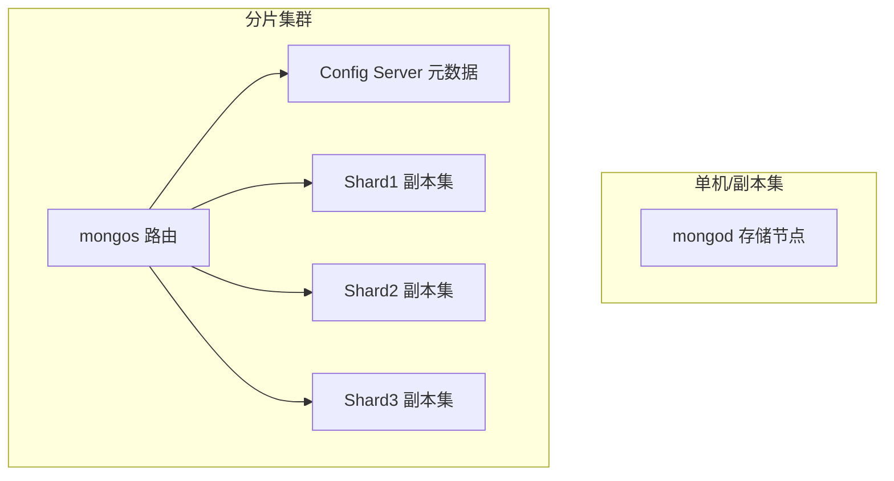
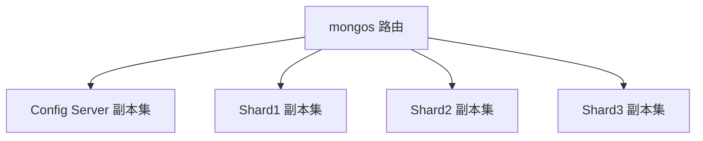
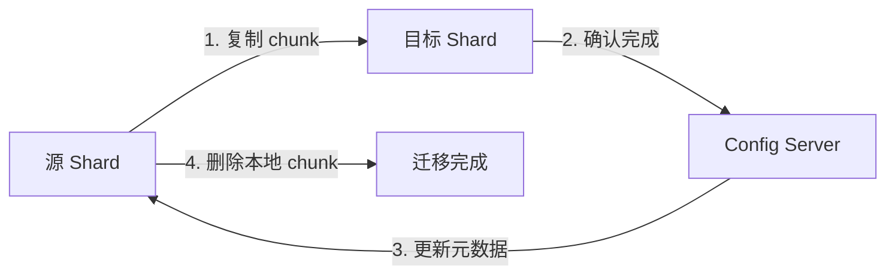
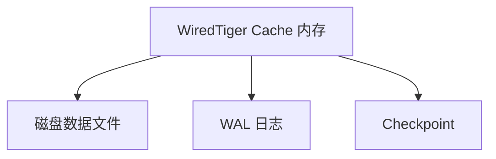

# MongoDB（文档型 NoSQL 数据库）

> 面向文档的分布式 NoSQL 数据库，以「灵活 Schema + 原生水平扩展」见长。
> 适合：内容/CMS、用户画像、日志/埋点、IoT 设备数据、购物车等「结构多变、海量、弱事务」场景。
> 不适合：金融核心交易、强一致性库存扣减、超大规模纯时序（应优先专用时序库）。

---


## 〇、本体介绍（它是什么 / 适用场景 / 核心概念）

**它是什么**：MongoDB 是面向文档（Document）的分布式 NoSQL 数据库，用类 JSON 的 BSON 作为存储单元，支持嵌套子文档与数组，Schema 动态可改。核心代码 C++ + WiredTiger 存储引擎，许可证 2018-10 后为 SSPL v1。

**解决什么痛点**：关系型「二维表 + 固定 Schema + 外键」在结构频繁变化、嵌套关联重、水平扩展难三类场景下成本高。MongoDB 用文档模型天然支持动态字段，并原生提供副本集（高可用）与分片（水平扩展）。

**核心概念**：Document（BSON 记录）、Collection（无强制 Schema 的集合）、_id（默认 ObjectId 主键）、mongod（存储进程）、mongos（分片路由）、Config Server（分片元数据）、Replica Set（主从副本集）、Sharding（按分片键水平切分）。

**适用场景**：内容/CMS、用户画像、日志/埋点、IoT 设备数据、购物车等「结构多变、海量、弱事务」场景。
**不适用**：金融核心交易、强一致库存扣减、超大规模纯时序（应优先专用时序库）。

---

## 一、它解决什么问题

关系型数据库用「二维表 + 固定 Schema + 外键」表达世界，遇到三类痛点：
1. **结构频繁变化**：电商商品、用户画像字段千差万别，ALTER TABLE 成本高、易锁表。
2. **嵌套/关联结构重**：订单+订单项+评论，关系型要拆多表 JOIN，读放大。
3. **水平扩展难**：分库分表要业务侵入，RDBMS 原生只擅长垂直扩容。

MongoDB 的答案是：**用 BSON 文档（类 JSON、可嵌套数组/子文档）做基本存储单元**，天然支持动态字段，并原生提供副本集（高可用）与分片（水平扩展）。

> 仓库：`github.com/mongodb/mongo`（C++ 核心 + WiredTiger；2018-10 前 AGPL，之后 **SSPL v1** 许可证；master 10 万+ commits）。

---

## 二、核心数据模型

| 概念 | 说明 |
|------|------|
| **Document** | 一条 BSON 记录，类似 JSON，支持嵌套文档与数组。字段可动态增减。 |
| **Collection** | 文档的集合，相当于「表」，但**无强制 Schema**（不同文档字段可不同）。 |
| **_id** | 每文档必有的主键，默认 ObjectId（12 字节：时间戳+机器+进程+自增）。 |
| **Database** | 物理库，含多个 Collection。 |

```json
{
  "_id": ObjectId("..."),
  "name": "张三",
  "address": { "city": "北京", "zip": "100000" },   // 嵌套文档
  "hobby": ["足球", "阅读"],                          // 数组
  "orders": [ { "id": 1, "amt": 99 } ]               // 嵌入式关联
}
```

**建模两种关联方式**
- **嵌入（Embedding）**：关联强的数据放同一文档（如订单+订单项），一次 I/O 读全，避免 JOIN。优先推荐。
- **引用（Referencing）**：用 `_id` 手动关联（类似外键，但无约束），需应用层二次查询。适合「一对多且被引用方独立变化」。

---

## 三、整体架构



- **mongod**：数据库服务器进程，负责存储与查询。
- **mongos**：分片集群的「查询路由」，把请求分发到正确分片，**应用只连 mongos**。
- **Config Server**：存分片元数据（哪个 chunk 在哪），通常 3 节点副本集。
- **副本集（Replica Set）**：1 个 Primary（写）+ N 个 Secondary（读/备份），主宕机自动选举新主（秒级）。
- **分片（Sharding）**：数据按**分片键**切成 chunk，分布到多个 Shard，支持 PB 级水平扩展。

**写入流程**：写 Primary → 记 oplog → Secondary 异步拉 oplog 同步（默认最终一致）。可设 `writeConcern: majority` 提升一致性。

---

## 四、关键机制

### 1. 存储引擎 WiredTiger（默认）
- 文档级并发控制（写只锁单文档），高并发写入优于表锁。
- 支持 snappy（默认）/zlib/none 压缩，**压缩率可达 80%**，显著降低存储。
- 磁盘映射 + cache，热点数据在内存。

### 2. 索引
单字段、复合、多键（数组）、地理空间、文本（全文）、TTL（自动过期）、哈希、唯一索引。查询优化器自动选计划。

### 3. 聚合管道（Aggregation Pipeline）
类似 SQL 的 GROUP BY + JOIN，但用多阶段声明式表达：
```js
db.orders.aggregate([
  { $match: { status: "paid" } },
  { $group: { _id: "$userId", total: { $sum: "$amt" } } },
  { $lookup: { from: "users", localField: "_id", foreignField: "_id", as: "u" } }  // 类似 LEFT JOIN
])
```
阶段：`$match → $project → $group → $sort → $unwind → $lookup → $limit`。

### 4. 多文档事务（4.0+）
- 副本集 4.0 支持、分片集群 4.2 支持**分布式 ACID 事务**。
- 隔离级别仅 **Read Committed**，且事务涉及文档越多性能下降越明显。
- 结论：**核心金融交易仍首选 MySQL/PostgreSQL**；MongoDB 事务只用于非核心或单文档原子操作。

### 5. 时序集合（5.0+）
针对时序场景优化存储与查询（设备指标、监控），但单集群建议 < 500 亿文档，超大规模仍用专用时序库。

---

## 五、MongoDB vs 关系型（面试高频）

| 维度 | MongoDB | MySQL |
|------|---------|-------|
| 数据模型 | 文档（BSON），Schema-less | 表（行/列），固定 Schema |
| 关联 | 嵌入优先，引用需二次查 | 外键 + JOIN |
| 事务 | 4.0+ 多文档 ACID（Read Committed） | 完整 ACID，多隔离级 |
| 扩展 | 原生分片（水平） | 垂直为主，水平需手动分库分表 |
| 写入并发 | 文档级锁，高并发友好 | 行锁/表锁，需优化 |
| 强一致 | 最终一致（可调 majority） | 强一致 |
| 适用 | 日志/画像/内容/CMS | 交易/订单/账务 |

**记忆口诀**：MySQL 结构化、事务强、跨表关联稳；MongoDB 灵活化、扩得易、嵌套查询强。

---

## 六、生产实践与避坑

1. **分片键选型是灵魂**：选高基数的字段（如 user_id 哈希），避免热点分片；不要选单调递增键（如自增 id → 写全落最后一分片）。
2. **别滥用嵌入**：超大数组（无限增长）会导致文档移动、性能劣化，应改为引用或单独集合。
3. **TTL 索引清冷数据**：`expireAfterSeconds` 自动删旧日志/验证码，省存储。
4. **连接用连接池**：驱动自带，避免每次 new client。
5. **读分离**：从 Secondary 读降低主压力，但注意「读从库可能读到旧数据」。
6. **SSPL 合规**：SSPL 不等于纯开源，云厂商托管需留意许可；自建无碍。
7. **Spring Boot 集成**：`spring-boot-starter-data-mongodb`，用 `MongoTemplate` / `MongoRepository`。

---

## 七、与其他板块的关系

- 与 [MySQL](../mysql知识.md)、[Redis](../redis知识.md)：MongoDB 补「文档/半结构 + 水平扩展」，Redis 补缓存/高性能 KV，MySQL 保强事务。
- 与 [分库分表 ShardingSphere](分库分表ShardingSphere.md)：ShardingSphere 是「关系型分库分表」方案；MongoDB 原生分片可替代部分场景，二者选型看是否要保 ACID/SQL。
- 与 [分布式事务 Seata](分布式事务Seata.md)：MongoDB 4.0+ 自带分布式事务，但与 Seata 的 TCC/Saga 思路不同，跨多数据源仍可用 Seata 编排。

---

## 八、速查表

| 项 | 结论 |
|----|------|
| 类型 | 文档型 NoSQL |
| 数据单元 | BSON 文档（类 JSON） |
| 高可用 | Replica Set（自动故障转移） |
| 水平扩展 | Sharding（分片键路由） |
| 存储引擎 | WiredTiger（文档级锁 + 压缩） |
| 事务 | 4.0+ 多文档 ACID（Read Committed） |
| 查询 | 类 JSON 查询 API + 聚合管道 |
| 许可证 | SSPL v1（2018-10 后） |
| 一句话 | 「写文档」式灵活存储 + 原生水平扩展 |

---

## 面试高频问题（20+ 条）

1. **MongoDB 与 MySQL 的核心区别？** 数据模型：MongoDB 文档型（BSON，Schema-less），MySQL 关系型（表+固定 Schema）；事务：MySQL 完整 ACID 多隔离级，MongoDB 4.0+ 多文档 ACID 仅 Read Committed；扩展：MongoDB 原生分片水平扩展，MySQL 垂直为主；关联：MongoDB 嵌入优先，MySQL 外键+JOIN。交易/订单用 MySQL，日志/画像/内容用 MongoDB。

2. **副本集（Replica Set）作用与选举？** 作用：高可用（主宕自动转移）、读写分离、数据备份。选举基于 Raft，奇数节点、多数派投票，优先级高且数据最新的 Secondary 胜出；偶数节点需加仲裁节点（Arbiter）避免脑裂。

3. **分片集群核心组件与分片键选择？** 组件：mongos（路由）、Config Server（元数据）、Shard（分片副本集）。分片键选高基数、分布均匀、尽量不变的字段；避免单调递增键（写热点落单分片）；范围查询用范围分片，无范围用哈希分片。

4. **MongoDB 事务支持及与 MySQL 区别？** 4.0+ 副本集、4.2+ 分片集群支持多文档 ACID，隔离级仅 Read Committed，涉及文档越多性能越差。核心金融交易仍首选 MySQL。

5. **Journal 与 Oplog 区别？** Journal 是 WAL 预写日志，用于崩溃恢复、保障持久化；Oplog 是副本集同步日志（固定大小循环），记录主节点所有写操作，Secondary 拉取重放。

6. **如何优化查询性能？** 建合适索引避免 COLLSCAN；用 projection 只返回必要字段；分页用 _id 范围而非深 skip；避免大文档；开 WiredTiger 压缩；用 explain() 看执行计划（IXSCAN vs COLLSCAN）。

7. **索引类型有哪些？** 单字段、复合（最左前缀）、多键（数组）、地理空间（2dsphere）、文本（全文）、TTL（自动过期）、哈希、唯一索引。默认每集合有 _id 索引。

8. **什么是覆盖查询（Covered Query）？** 查询字段与返回字段都命中同一索引，MongoDB 无需回文档即可返回，速度极快。

9. **ObjectId 结构？** 12 字节：4 字节时间戳 + 3 字节机器标识 + 2 字节进程 ID + 3 字节自增计数器。

10. **MongoDB 用 BSON 而非 JSON 的原因？** BSON 二进制、体积小、带类型（日期/二进制等）、遍历快，比纯文本 JSON 更适合存储与传输。

11. **WiredTiger 缓存与内存占用过高怎么处理？** 默认占物理内存 50%（cacheSizeGB 可调）；索引过多、慢查询、大文档频繁读会推高内存。调小 cacheSizeGB、清理冗余索引、优化查询。

12. **主节点宕机从节点不选举的原因？** 集群偶数无仲裁无法形成多数派；从节点 priority=0 不可竞选；从节点数据落后过多（Oplog 被覆盖）；网络分区。

13. **一个分片宕机查询会怎样？** 默认返回错误；可设 partial 允许部分查询；慢分片会拖住 mongos 等待。

14. **Spring Data MongoDB 常用注解？** @Document（集合映射）、@Id（主键）、@Field（字段名）、@Indexed（索引）、@CompoundIndex（复合索引）。

15. **MongoDB 不适合哪些场景？** 强事务核心业务（金融支付）、复杂多表关联（关联查询性能差）、固定结构低变更的结构化数据。

16. **写关注（Write Concern）与读偏好（Read Preference）？** writeConcern: w:1（主写成功）/majority（多数确认，更一致）；readPreference: primary/secondary/nearest，从库读可能读到旧数据。

17. **聚合管道（Aggregation Pipeline）阶段？** $match→$project→$group→$sort→$unwind→$lookup→$limit，类似 SQL 的 GROUP BY + LEFT JOIN，声明式多阶段处理。

18. **是否支持主键外键关系？** 默认不支持；可通过嵌入文档或引用 _id 模拟，但无约束与外键级联。

19. **为何不推荐 32 位版本？** 32 位地址空间上限 2GB（内存映射文件受限），64 位近乎无限，生产必用 64 位。

20. **如何保证数据一致性？** 副本集 Oplog 重放；writeConcern: majority；开 Journal；关键业务用分布式事务。

21. **MongoDB vs Redis？** Redis 内存 KV、亚毫秒、适合缓存/会话；MongoDB 持久化文档、支持复杂查询。常组合：Redis 前置缓存 + MongoDB 持久存储。

22. **Change Streams 是什么？** 实时捕获数据变更（类似 CDC），支持事件驱动架构，可用于监听变更同步到下游。

---

## 九、MongoDB 索引深度

### 9.1 索引类型详解

| 索引类型 | 说明 | 适用场景 |
|----------|------|----------|
| 单字段索引 | 默认 `_id` 索引 | 等值查询 |
| 复合索引 | 多字段组合，遵循最左前缀 | 多条件查询 |
| 多键索引 | 自动为数组元素建索引 | 数组字段查询 |
| 文本索引 | 全文搜索（分词） | 文章/评论搜索 |
| 地理空间索引 | 2dsphere/2d | LBS 附近的人/店 |
| 哈希索引 | 字段哈希值 | 等值查询（分片键） |
| TTL 索引 | 自动过期删除 | 验证码/会话/日志 |
| 唯一索引 | 字段唯一约束 | 手机号/邮箱去重 |
| 部分索引 | 只索引满足条件的文档 | 低基数字段（如 status='active'） |
| 稀疏索引 | 只索引非 null 值 | 可选字段查询 |
| 复合唯一索引 | 多字段组合唯一 | 联合去重（如 user_id + order_no） |

### 9.2 索引优化实践

```javascript
// 复合索引设计原则：等值在前，范围在后
db.orders.createIndex({ user_id: 1, created_at: -1 })
// 查询: db.orders.find({ user_id: "u1", created_at: { $gte: ISODate("2026-01-01") } })

// 覆盖查询（Covered Query）
db.orders.find({ user_id: "u1" }, { user_id: 1, amount: 1, _id: 0 })
// 查询字段和返回字段都命中索引，无需回文档

// 部分索引（只索引 active 状态）
db.users.createIndex({ email: 1 }, { partialFilterExpression: { status: "active" } })

// explain() 查看执行计划
db.orders.find({ user_id: "u1" }).explain("executionStats")
// IXSCAN = 索引扫描（好），COLLSCAN = 全表扫描（差）
```

### 9.3 索引陷阱

| 陷阱 | 表现 | 解法 |
|------|------|------|
| 过多索引 | 写入变慢（每个索引都要更新） | 定期清理冗余索引 |
| 大文档索引 | 索引体积大、缓存命中低 | 只索引必要字段 |
| 数组索引爆炸 | 数组每个元素都建索引 | 控制数组大小 |
| 深度复合索引 | 5+ 字段复合索引 | 按查询模式精简 |

---

## 十、MongoDB 事务深度

### 10.1 事务语法

```javascript
const session = client.startSession();
try {
    session.startTransaction({
        readConcern: { level: "snapshot" },
        writeConcern: { w: "majority" },
        readPreference: "primary"
    });
    
    await ordersCollection.insertOne({ ... }, { session });
    await inventoryCollection.updateOne({ ... }, { session });
    
    await session.commitTransaction();
} catch (error) {
    await session.abortTransaction();
} finally {
    session.endSession();
}
```

### 10.2 事务限制与最佳实践

| 限制 | 说明 |
|------|------|
| 隔离级别 | 仅 Read Committed（非可串行化） |
| 文档大小 | 单文档 ≤ 16MB |
| Oplog 条目 | 事务内操作 ≤ oplog 大小限制 |
| 性能开销 | 事务越多性能越差（锁竞争） |
| 最佳实践 | 尽量用单文档原子操作（`$set`/`$inc`） |

---

## 十一、MongoDB Change Streams

```javascript
// 监听集合变更
const changeStream = ordersCollection.watch([
    { $match: { "operationType": { $in: ["insert", "update", "delete"] } } }
]);

changeStream.on("change", (event) => {
    console.log(event.operationType, event.fullDocument);
    // 可用于：缓存同步、审计日志、事件驱动架构
});
```

**适用场景**：MySQL→MongoDB 同步、缓存一致性、审计日志、事件驱动微服务。

---

## 十二、MongoDB 分片深度

### 12.1 分片架构组件



| 组件 | 说明 |
|------|------|
| mongos | 路由器，应用只连 mongos |
| Config Server | 存储分片元数据（chunk 分布），必须是副本集 |
| Shard | 数据节点，每个 Shard 是一个副本集 |
| Chunk | 分片键范围的一段数据块 |

### 12.2 Balancer 均衡器

```text
Balancer 工作机制：
  - 后台进程，定期检查各 Shard 的 chunk 数量
  - chunk 数不均衡时自动迁移
  - 迁移过程对应用透明（先复制 chunk，再删除源）
  - 迁移窗口可配置（避免影响业务）
```

```javascript
// 查看 Balancer 状态
sh.getBalancerState()
sh.isBalancerRunning()

// 配置迁移窗口（UTC 时间）
db.settings.update(
  { _id: "balancer" },
  { $set: { activeWindow: { start: "02:00", stop: "06:00" } } },
  { upsert: true }
)
```

### 12.3 Chunk 迁移流程



### 12.4 分片键选择最佳实践

```
好的分片键特征：
  1. 高基数：取值多，分布均匀
  2. 查询必带：绝大多数查询都带分片键
  3. 不单调递增：避免写入热点
  4. 相对稳定：不会频繁变更

推荐策略：
  - Hashed 分片：均匀分布，适合等值查询
  - Range 分片：适合范围查询，但易热点
  - 复合分片键：{user_id: "hashed", created_at: 1}
```

---

## 十三、副本集选举机制

### 13.1 选举流程

```text
触发条件：
  - Primary 宕机或网络不可达
  - heartbeat 超时（默认 10s）

选举过程（基于 Raft）：
  1. Secondary 检测到 Primary 不可达
  2. Secondary 提升为 Candidate，发起选举
  3. 向所有节点请求投票
  4. 获得多数派投票（N/2+1）→ 当选新 Primary
  5. 更新 term（任期号），同步 oplog
```

### 13.2 选举配置

| 参数 | 默认值 | 说明 |
|------|--------|------|
| `electionTimeoutMillis` | 10000 | 判定 Primary 不可达的时间 |
| `priority` | 1 | 选举优先级（0=永远不竞选） |
| `votes` | 1 | 投票权重 |
| `arbiterOnly` | false | 仲裁节点（不存数据，只投票） |

### 13.3 选举注意事项

```
1. 奇数节点：3/5/7，偶数节点可能脑裂
2. 优先级配置：重要节点设高 priority
3. 隐藏节点：priority=0 + hidden=true 做只读
4. 延迟节点：priority=0 + secondaryDelaySecs 做延迟从库
5. 网络分区：配置 protectiveMode 防止异常写入
```

---

## 十四、Change Streams 深度

### 14.1 原理

```text
Change Streams 基于 oplog 实现：
  - 类似 MySQL binlog，记录所有写操作
  - 通过 resume token 断点续传
  - 支持集群级/库级/集合级监听
  - 可过滤操作类型（insert/update/delete/replace）
```

### 14.2 高级用法

```javascript
// 集群级 Change Stream
const changeStream = db.watch([], { resumeAfter: resumeToken });

// 带管道过滤
const changeStream = ordersCollection.watch([
  { $match: { "operationType": "insert", "fullDocument.amount": { $gte: 1000 } } }
]);

// 断点续传
const resumeToken = changeStream.resumeToken;
// 重启后
const changeStream = collection.watch([], { resumeAfter: resumeToken });

// 关闭监听
changeStream.close();
```

### 14.3 Change Streams vs CDC

| 维度 | Change Streams | CDC (Canal/Debezium) |
|------|---------------|---------------------|
| 数据源 | MongoDB oplog | MySQL binlog |
| 延迟 | 毫秒级 | 秒级 |
| 目标 | MongoDB 间同步 | 异构系统同步 |
| 部署 | 内嵌 MongoDB | 独立组件 |
| 适用 | 事件驱动/CDC | 跨数据库同步 |

---

## 十五、聚合管道优化

### 15.1 优化原则

```
1. $match 前置：尽早过滤数据，减少后续处理量
2. $project 精简：只传递需要的字段
3. 使用索引：$match 和 $sort 尽量命中索引
4. 避免 $lookup：尽量用嵌入文档替代关联查询
5. 限制结果集：$limit 提前限制数量
6. explain() 分析：查看执行计划确认优化效果
```

### 15.2 优化示例

```javascript
// 差：$lookup 放前面
db.orders.aggregate([
  { $lookup: { from: "users", localField: "user_id", foreignField: "_id", as: "user" } },
  { $match: { status: "paid" } },
  { $group: { _id: "$user_id", total: { $sum: "$amount" } } }
])

// 好：$match 前置 + 嵌入文档
db.orders.aggregate([
  { $match: { status: "paid" } },
  { $project: { user_id: 1, amount: 1 } },
  { $group: { _id: "$user_id", total: { $sum: "$amount" } } }
])
```

---

## 十六、WiredTiger 内部机制

### 16.1 存储架构



| 组件 | 说明 |
|------|------|
| Cache | 默认占物理内存 50%，LRU 淘汰 |
| B-Tree | 数据索引结构，文档级并发控制 |
| Journal | WAL 预写日志，崩溃恢复 |
| Checkpoint | 定期刷盘，持久化 |
| Snappy | 默认压缩算法，压缩率约 80% |

### 16.2 性能调优

```yaml
# WiredTiger 缓存配置
storage:
  wiredTiger:
    engineConfig:
      cacheSizeGB: 4          # 手动设置缓存大小
      journalCompressor: snappy
    collectionConfig:
      blockCompressor: snappy
    indexConfig:
      prefixCompression: true
```

---

## 十七、MongoDB Atlas 特性

```text
Atlas = MongoDB 官方全托管云服务（AWS/Azure/GPC）

核心特性：
  - 自动副本集/分片集群部署
  - 自动备份与时间点恢复（PITR）
  - 实时性能仪表盘
  - 全球数据库集群（Global Clusters）
  - 数据库搜索（Atlas Search = Lucene）
  - Atlas Data Lake（S3 查询）
  - 联合查询（Federated Query）
  - 多云部署（AWS + Azure + GCP）
```

---

## 十八、MongoDB vs DynamoDB vs CouchDB

| 维度 | MongoDB | DynamoDB | CouchDB |
|------|---------|----------|---------|
| 数据模型 | 文档（BSON） | KV + 文档 | JSON 文档 |
| 查询 | 丰富（聚合管道） | 有限（GSI/LSI） | MapReduce |
| 事务 | 多文档 ACID | 单文档 ACID | 无 |
| 扩展 | 分片（手动/自动） | 自动扩缩容 | 多主复制 |
| 一致性 | 可调（最终/majority） | 强一致/最终一致 | 最终一致 |
| 适用 | 通用文档数据库 | AWS 生态 KV/文档 | P2P 同步场景 |
| 成本 | 自建可控 | 按量计费（可能高） | 开源免费 |

---

## 十九、与其他板块的关系（扩展）

- 与 [MySQL](../mysql知识.md)、[Redis](../redis知识.md)：MongoDB 补「文档/半结构 + 水平扩展」，Redis 补缓存/高性能 KV，MySQL 保强事务。
- 与 [分库分表 ShardingSphere](分库分表ShardingSphere.md)：ShardingSphere 是「关系型分库分表」方案；MongoDB 原生分片可替代部分场景，二者选型看是否要保 ACID/SQL。
- 与 [分布式事务 Seata](分布式事务Seata.md)：MongoDB 4.0+ 自带分布式事务，但与 Seata 的 TCC/Saga 思路不同，跨多数据源仍可用 Seata 编排。
- 与 [Elasticsearch](ES体系.md)：MongoDB 存文档，ES 存检索，常通过 Change Streams 同步。
- 与 [Redis](Redis.md)：热门查询缓存在 Redis，MongoDB 做持久存储。

---

## 十三、速查表（扩展）

| 项 | 结论 |
|----|------|
| 类型 | 文档型 NoSQL |
| 数据单元 | BSON 文档（类 JSON） |
| 高可用 | Replica Set（自动故障转移） |
| 水平扩展 | Sharding（分片键路由） |
| 存储引擎 | WiredTiger（文档级锁 + 压缩） |
| 事务 | 4.0+ 多文档 ACID（Read Committed） |
| 索引 | 10+ 种类型（复合/文本/地理/TTL） |
| Change Streams | 实时变更捕获（类 CDC） |
| 聚合管道 | $match → $group → $lookup → $sort |
| 许可证 | SSPL v1（2018-10 后） |
| 一句话 | 「写文档」式灵活存储 + 原生水平扩展 |
