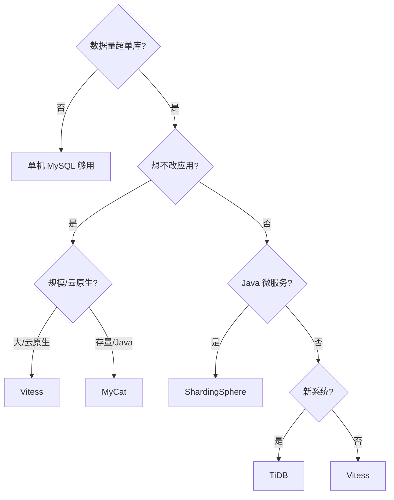

# MyCat 与 Vitess 深入（代理架构 / vindex 路由 / 在线扩容 / 事务处理 / 决策树）

> MyCat 是**国产经典分库分表中间件**（Java 代理），Vitess 是 **YouTube 开源、CNCF 毕业的数据库集群系统**（Go + K8s 原生）。共同价值：**对应用透明地做分库分表**。本篇深入拆解：代理架构细节、vindex 路由、在线扩容、分布式事务、选型决策树。

---

## 一、要解决的问题

| 痛点 | 说明 |
|------|------|
| 单库容量瓶颈 | 数据量超过单库承载，需要水平拆分 |
| 应用改造成本 | 分库分表逻辑（路由/合并）不想侵入业务代码 |
| 连接收敛 | 多库多表对应用暴露一个入口（连接/权限统一） |
| 跨库查询 | 分片后的 Join/排序/聚合需要中间层合并 |
| 扩容 | 加分片不停服（数据迁移/重路由） |

> 核心认知：**代理模式 = 「应用眼里的 MySQL，其实是分片集群」**——SQL 入口统一代理，代理负责路由（拆 SQL 到分片）、合并（结果聚合）、扩缩容，应用无感知。

---

## 二、MyCat 架构（Java 代理）

```
应用 → MyCat（一个 MySQL 协议的入口）
  ├── 连接管理（前端连接池 + 后端各分片连接池）
  ├── SQL 解析（语法解析 → 判断路由规则）
  ├── 路由（分片规则：取模/范围/一致性哈希 → 命中哪些分片）
  ├── 执行（下发 SQL 到分片执行）
  ├── 结果合并（排序/聚合/去重在代理层完成）
  └── 全局序列（分片全局 ID：MyCat 号段）
```

### 2.1 分片规则

| 规则 | 原理 | 特点 |
|------|------|------|
| 取模 | `order_id % 4` | 数据均匀，扩容难 |
| 范围 | 按 ID 区间 | 扩容友好，数据不均 |
| 一致性哈希 | 哈希环 | 均匀 + 扩容影响小 |
| 枚举/日期 | 按业务维度 | 按地区/月份 |

### 2.2 MyCat 路由流程

```
SQL 解析：
  INSERT/UPDATE/DELETE/SELECT → 提取分片键值
  如：SELECT * FROM orders WHERE order_id = 10086
  → 提取 order_id=10086 → 路由计算 → 命中分片 db2

路由判断：
  命中单分片：直接下发
  命中多分片：下发所有 + 合并结果

合并（MyCat 代理层）：
  ORDER BY → 多分片结果排序（归并排序）
  LIMIT → 先各分片取 limit，再合并取 limit
  聚合（COUNT/SUM）→ 分片聚合后汇总
  去重（DISTINCT）→ 分片去重后汇总
```

### 2.3 配置示例

```xml
<!-- schema.xml：表 → 分片规则 -->
<schema name="testdb" checkSQLschema="false">
  <table name="orders" dataNode="dn$1-4" rule="mod-order-id" />
</schema>

<!-- rule.xml：取模规则 -->
<tableRule name="mod-order-id">
  <rule>
    <columns>order_id</columns>
    <algorithm>mod-long</algorithm>
  </rule>
</tableRule>
<function name="mod-long" class="io.mycat.route.function.PartitionByMod">
  <property name="count">4</property>
</function>
```

---

## 三、Vitess 架构（Go + K8s 原生）

### 3.1 组件

```
应用 → VTGate（无状态 SQL 网关，像 MySQL）
  └── VSchema（分片路由配置）
      └── 分片（每个分片是一个 MySQL 实例组 + VTTablet）
          └── 每个分片有主从 + 半同步复制

关键组件：
  ├── VTGate：SQL 路由/合并/事务协调（无状态，可水平扩展）
  ├── VTTablet：每 MySQL 一个边车（复制/健康/管理）
  ├── VSchema：分片键定义（vindex 路由）
  └── 自动故障转移：主挂 → 提升从（半同步保证不丢）
```

### 3.2 vindex 路由（深入）

```
vindex = Vitess 的「分片索引」

Primary Vindex（必选，决定行存哪个分片）：
  hash：哈希取模（均匀）
  unicode_loose_md5：字符串哈希
  binary：二进制哈希
  numeric：数值直接映射
  reverse_bits：反转位（分布均匀）
  lookup：查表（自定义映射）

二级 vindex（可选，跨分片查询优化）：
  按其他字段快速定位分片（减少全片扫描）

定义（VSchema）：
{
  "sharded": true,
  "vindexes": {
    "user_hash": {"type": "hash"}
  },
  "tables": {
    "users": {
      "column_vindexes": [
        {"column": "user_id", "name": "user_hash"}
      ]
    }
  }
}
```

### 3.3 查询路由

```
单分片查询（高效）：
  SELECT * FROM users WHERE user_id = 5
  → vindex 计算 → 直达分片

跨分片查询（代价高）：
  SELECT * FROM orders WHERE status = 'PAID'
  → 无 vindex 可用 → 广播所有分片 → VTGate 合并

路由优化：
  二级 vindex（按字段定位分片）
  聚合函数（COUNT/SUM）→ 分片聚合 + 汇总
  分片感知优化（shard-targeting）
```

---

## 四、在线扩容（re-shard）

### 4.1 Vitess 在线扩容流程

```
垂直拆分（合并拆成多个库）：
  业务表按域拆分（如订单域/用户域）
  应用改连接 → 数据由 VTGate 路由

水平拆分（单库拆成多分片）：
  1. 定义新 vindex 方案（如 user_id hash 拆 4 片）
  2. SplitClone：后台复制数据（不停服）
  3. 增量同步（binlog 持续复制）
  4. 验证一致性
  5. 切换路由（VSchema 更新）
  6. 清理旧分片

优势：
  全程不停服（在线迁移）
  官方工具（vtctld SplitClone / MoveTables）
```

### 4.2 MyCat 扩容方式

```
预分片（推荐）：
  一次性拆 2^n（如 32/64 片）
  后续只加物理库不重分片（映射扩容）

重路由（停机/双写）：
  新分片规则 → 数据迁移（ETL）→ 切换
  停机窗口 / 双写成本高

对比：
  Vitess：在线 re-shard（自动）
  MyCat：预分片规避（规划 2^n）
```

---

## 五、分布式事务处理

### 5.1 事务模型对比

| 方案 | 原理 | 性能 | 适用 |
|------|------|------|------|
| XA（MyCat） | 两阶段提交 | 差（锁资源） | 强一致低频 |
| 2PC（Vitess） | VTGate 协调 | 中 | 跨分片事务 |
| 弱事务 | 最终一致 | 高 | 可接受延迟 |

### 5.2 业务设计（规避跨片事务）

```
最佳实践：按分片键聚合业务
  订单 + 订单明细 → 同分片（order_id 为分片键）
  用户 + 用户钱包 → 同分片（user_id 为分片键）

避免：
  跨分片事务（性能差）
  跨分片 Join（广播查询代价高）

兜底：
  本地事务 + 消息最终一致
  补偿事务（TCC/SAGA）
```

---

## 六、MyCat vs Vitess vs ShardingSphere vs TiDB

| 维度 | MyCat | Vitess | ShardingSphere | TiDB |
|------|-------|--------|----------------|------|
| 模式 | 代理（透明） | 代理（透明） | 客户端 SDK（侵入） | NewSQL 原生 |
| 对应用 | MySQL 协议 | MySQL 协议 | 改连接/加依赖 | MySQL 协议 |
| 分片 | 规则路由 | vindex | 规则路由 | 自动（Raft 分区） |
| 事务 | XA/弱 | 2PC | 强（分布式事务） | 原生分布式事务 |
| 扩容 | 难（预分片） | 在线 re-shard | 难 | 自动 |
| 运维 | 中 | 中（组件多） | 低（嵌入） | 中 |
| 适用 | 存量 MySQL 分片 | 大规模/云原生 | Java 生态微服务 | 新系统分布式数据库 |

**选型关注点**：
- 存量 MySQL 大表拆分 + 不想改应用 → **MyCat/Vitess**（代理透明）；
- Java 微服务 + 精细规则/强事务 → **ShardingSphere**（客户端模式，功能最全）；
- 新系统/想要原生分布式 → **TiDB**（省去分库分表一切复杂度）；
- 超大规模 + K8s → **Vitess**（在线扩容 + 云原生）。

---

## 七、选型决策树



---

## 八、生产实践

### 8.1 关键实践

| 实践 | 说明 |
|------|------|
| 分片键选择 | 高频查询必须带分片键；选业务强相关列（userId/orderId） |
| 预分片 | 一次性拆 2^n（如 32/64 片），避免二次扩容 |
| 全局 ID | 与「分布式 ID」配合（雪花/号段）保证分片内有序 |
| 分布式事务 | 尽量规避跨片事务（按分片键设计业务），必要时补偿 |
| 慢查询 | 跨片聚合 SQL 是性能杀手 → 分片键兜底 + 汇总表 |
| 监控 | 各分片容量水位/延迟/连接数大盘 |

### 8.2 常见坑

| 坑 | 说明 | 对策 |
|----|------|------|
| 分片键不带 | 全片扫描性能雪崩 | 规范 + SQL 审查 |
| Join/事务跨片 | 能力弱 | 同片聚合设计 |
| 扩容停滞 | 未预分片 | 预分片 2^n |
| 代理单点 | MyCat 单点 | 多节点 + VIP |
| 连接池耗尽 | 代理连接管理 | 前端/后端连接池配比 |
| 全局 ID 冲突 | 自增主键跨片冲突 | 雪花/号段 |

---

## 九、选型速查

| 需求 | 首选 | 备选 |
|------|------|------|
| 存量 MySQL 透明拆分 | MyCat | Vitess |
| Java 微服务精细分片 | ShardingSphere | MyCat |
| 超大规模 + K8s | Vitess | — |
| 新系统原生分布式 | TiDB | Vitess |
| 需要在线扩容 | Vitess | 预分片 MyCat |
| 云托管 | PolarDB-X / 云 DRDS | Vitess on 云 |

---

## 十、与其他板块的关系

- ShardingSphere 见「[分库分表 ShardingSphere](./分库分表ShardingSphere.md)」；
- TiDB（NewSQL）见「[TiDB 与 NewSQL](./TiDB与NewSQL.md)」；
- 分布式事务见「[分布式事务 Seata](./分布式事务Seata.md)」；
- 全局 ID 见「[分布式 ID 生成器](./分布式ID生成器.md)」。

> 一句话：**代理分片 = 应用零改动的 MySQL 入口 + 路由（规则/vindex）+ 结果合并 + 在线扩容（Vitess re-shard / MyCat 预分片）——选型先看「模式（代理→MyCat/Vitess，SDK→ShardingSphere，原生→TiDB）」，再定「扩容路线」，最后守「分片键必带 + 同片聚合 + 全局 ID」**。