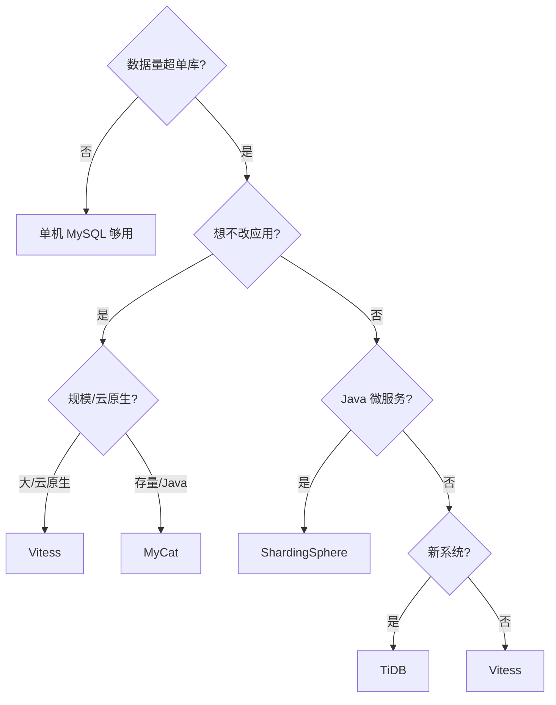
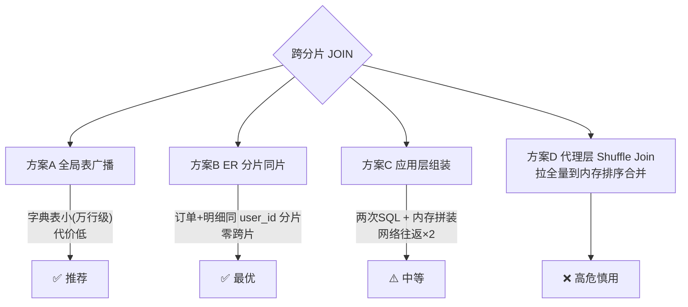
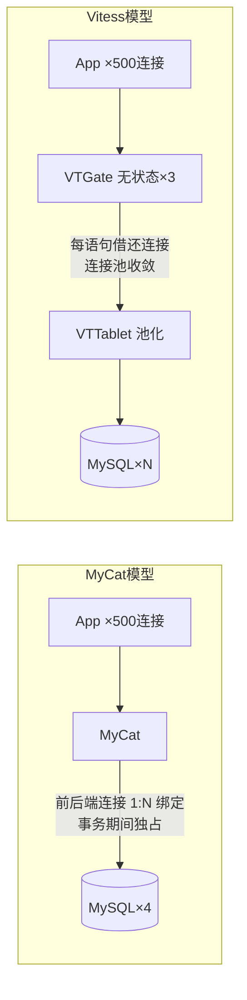
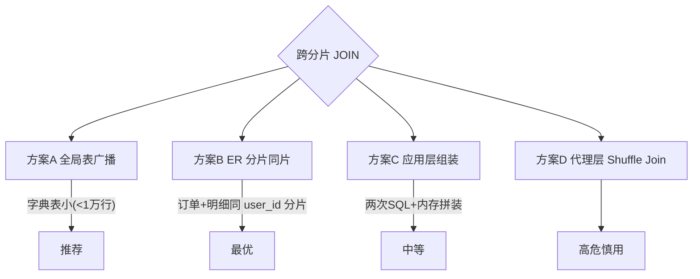
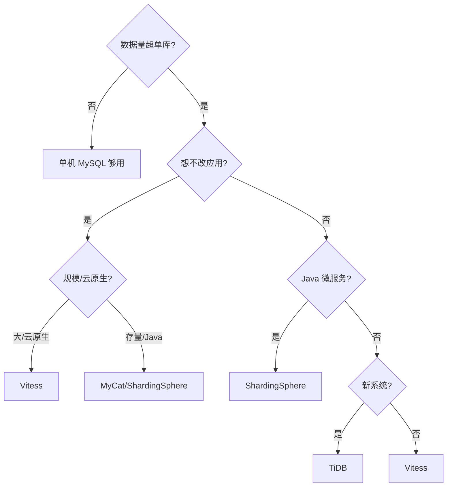
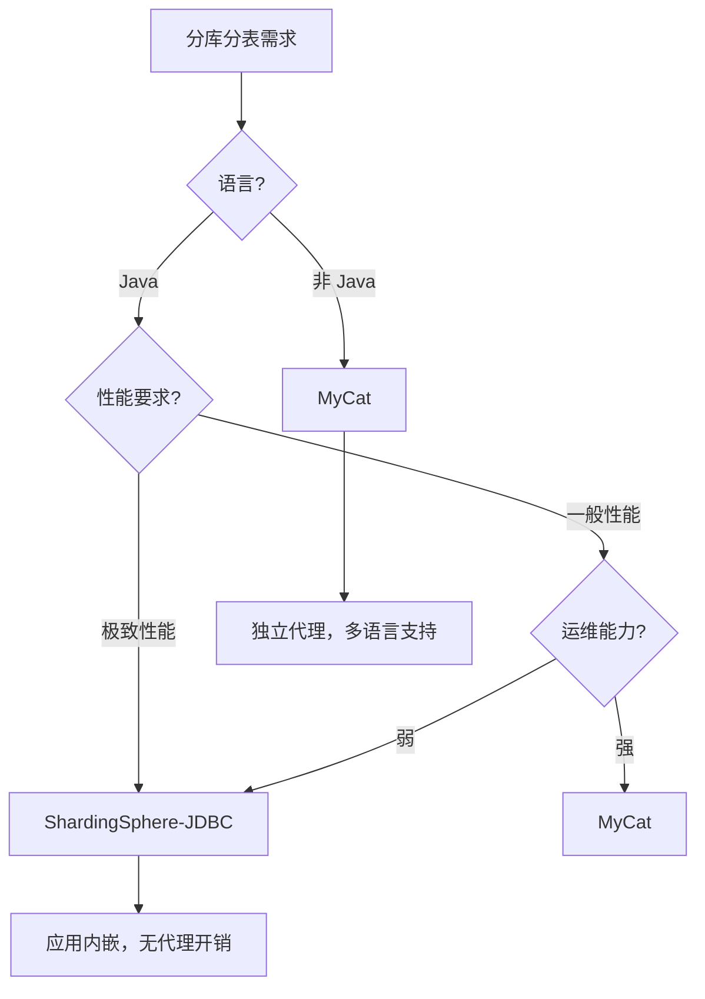

# MyCat 与 Vitess 深入（代理架构 / vindex 路由 / 在线扩容 / 事务处理 / 决策树）

> MyCat 是**国产经典分库分表中间件**（Java 代理），Vitess 是 **YouTube 开源、CNCF 毕业的数据库集群系统**（Go + K8s 原生）。共同价值：**对应用透明地做分库分表**。本篇深入拆解：代理架构细节、vindex 路由、在线扩容、分布式事务、选型决策树。

---

## 一、要解决的问题

| 痛点 | 说明 |
|------|------|
| 单库容量瓶颈 | 数据量超过单库承载，需要水平拆分 |
| 应用改造成本 | 分库分表逻辑（路由/合并）不想侵入业务代码 |
| 连接收敛 | 多库多表对应用暴露一个入口（连接/权限统一） |
| 跨库查询 | 分片后的 Join/排序/聚合需要中间层合并 |
| 扩容 | 加分片不停服（数据迁移/重路由） |

> 核心认知：**代理模式 = 「应用眼里的 MySQL，其实是分片集群」**——SQL 入口统一代理，代理负责路由（拆 SQL 到分片）、合并（结果聚合）、扩缩容，应用无感知。

---

## 二、MyCat 架构（Java 代理）

```
应用 → MyCat（一个 MySQL 协议的入口）
  ├── 连接管理（前端连接池 + 后端各分片连接池）
  ├── SQL 解析（语法解析 → 判断路由规则）
  ├── 路由（分片规则：取模/范围/一致性哈希 → 命中哪些分片）
  ├── 执行（下发 SQL 到分片执行）
  ├── 结果合并（排序/聚合/去重在代理层完成）
  └── 全局序列（分片全局 ID：MyCat 号段）
```

### 2.1 分片规则

| 规则 | 原理 | 特点 |
|------|------|------|
| 取模 | `order_id % 4` | 数据均匀，扩容难 |
| 范围 | 按 ID 区间 | 扩容友好，数据不均 |
| 一致性哈希 | 哈希环 | 均匀 + 扩容影响小 |
| 枚举/日期 | 按业务维度 | 按地区/月份 |

### 2.2 MyCat 路由流程

```
SQL 解析：
  INSERT/UPDATE/DELETE/SELECT → 提取分片键值
  如：SELECT * FROM orders WHERE order_id = 10086
  → 提取 order_id=10086 → 路由计算 → 命中分片 db2

路由判断：
  命中单分片：直接下发
  命中多分片：下发所有 + 合并结果

合并（MyCat 代理层）：
  ORDER BY → 多分片结果排序（归并排序）
  LIMIT → 先各分片取 limit，再合并取 limit
  聚合（COUNT/SUM）→ 分片聚合后汇总
  去重（DISTINCT）→ 分片去重后汇总
```

### 2.3 配置示例

```xml
<!-- schema.xml：表 → 分片规则 -->
<schema name="testdb" checkSQLschema="false">
  <table name="orders" dataNode="dn$1-4" rule="mod-order-id" />
</schema>

<!-- rule.xml：取模规则 -->
<tableRule name="mod-order-id">
  <rule>
    <columns>order_id</columns>
    <algorithm>mod-long</algorithm>
  </rule>
</tableRule>
<function name="mod-long" class="io.mycat.route.function.PartitionByMod">
  <property name="count">4</property>
</function>
```

---

## 三、Vitess 架构（Go + K8s 原生）

### 3.1 组件

```
应用 → VTGate（无状态 SQL 网关，像 MySQL）
  └── VSchema（分片路由配置）
      └── 分片（每个分片是一个 MySQL 实例组 + VTTablet）
          └── 每个分片有主从 + 半同步复制

关键组件：
  ├── VTGate：SQL 路由/合并/事务协调（无状态，可水平扩展）
  ├── VTTablet：每 MySQL 一个边车（复制/健康/管理）
  ├── VSchema：分片键定义（vindex 路由）
  └── 自动故障转移：主挂 → 提升从（半同步保证不丢）
```

### 3.2 vindex 路由（深入）

```
vindex = Vitess 的「分片索引」

Primary Vindex（必选，决定行存哪个分片）：
  hash：哈希取模（均匀）
  unicode_loose_md5：字符串哈希
  binary：二进制哈希
  numeric：数值直接映射
  reverse_bits：反转位（分布均匀）
  lookup：查表（自定义映射）

二级 vindex（可选，跨分片查询优化）：
  按其他字段快速定位分片（减少全片扫描）

定义（VSchema）：
{
  "sharded": true,
  "vindexes": {
    "user_hash": {"type": "hash"}
  },
  "tables": {
    "users": {
      "column_vindexes": [
        {"column": "user_id", "name": "user_hash"}
      ]
    }
  }
}
```

### 3.3 查询路由

```
单分片查询（高效）：
  SELECT * FROM users WHERE user_id = 5
  → vindex 计算 → 直达分片

跨分片查询（代价高）：
  SELECT * FROM orders WHERE status = 'PAID'
  → 无 vindex 可用 → 广播所有分片 → VTGate 合并

路由优化：
  二级 vindex（按字段定位分片）
  聚合函数（COUNT/SUM）→ 分片聚合 + 汇总
  分片感知优化（shard-targeting）
```

---

## 四、在线扩容（re-shard）

### 4.1 Vitess 在线扩容流程

```
垂直拆分（合并拆成多个库）：
  业务表按域拆分（如订单域/用户域）
  应用改连接 → 数据由 VTGate 路由

水平拆分（单库拆成多分片）：
  1. 定义新 vindex 方案（如 user_id hash 拆 4 片）
  2. SplitClone：后台复制数据（不停服）
  3. 增量同步（binlog 持续复制）
  4. 验证一致性
  5. 切换路由（VSchema 更新）
  6. 清理旧分片

优势：
  全程不停服（在线迁移）
  官方工具（vtctld SplitClone / MoveTables）
```

### 4.2 MyCat 扩容方式

```
预分片（推荐）：
  一次性拆 2^n（如 32/64 片）
  后续只加物理库不重分片（映射扩容）

重路由（停机/双写）：
  新分片规则 → 数据迁移（ETL）→ 切换
  停机窗口 / 双写成本高

对比：
  Vitess：在线 re-shard（自动）
  MyCat：预分片规避（规划 2^n）
```

---

## 五、分布式事务处理

### 5.1 事务模型对比

| 方案 | 原理 | 性能 | 适用 |
|------|------|------|------|
| XA（MyCat） | 两阶段提交 | 差（锁资源） | 强一致低频 |
| 2PC（Vitess） | VTGate 协调 | 中 | 跨分片事务 |
| 弱事务 | 最终一致 | 高 | 可接受延迟 |

### 5.2 业务设计（规避跨片事务）

```
最佳实践：按分片键聚合业务
  订单 + 订单明细 → 同分片（order_id 为分片键）
  用户 + 用户钱包 → 同分片（user_id 为分片键）

避免：
  跨分片事务（性能差）
  跨分片 Join（广播查询代价高）

兜底：
  本地事务 + 消息最终一致
  补偿事务（TCC/SAGA）
```

---

## 六、MyCat vs Vitess vs ShardingSphere vs TiDB

| 维度 | MyCat | Vitess | ShardingSphere | TiDB |
|------|-------|--------|----------------|------|
| 模式 | 代理（透明） | 代理（透明） | 客户端 SDK（侵入） | NewSQL 原生 |
| 对应用 | MySQL 协议 | MySQL 协议 | 改连接/加依赖 | MySQL 协议 |
| 分片 | 规则路由 | vindex | 规则路由 | 自动（Raft 分区） |
| 事务 | XA/弱 | 2PC | 强（分布式事务） | 原生分布式事务 |
| 扩容 | 难（预分片） | 在线 re-shard | 难 | 自动 |
| 运维 | 中 | 中（组件多） | 低（嵌入） | 中 |
| 适用 | 存量 MySQL 分片 | 大规模/云原生 | Java 生态微服务 | 新系统分布式数据库 |

**选型关注点**：
- 存量 MySQL 大表拆分 + 不想改应用 → **MyCat/Vitess**（代理透明）；
- Java 微服务 + 精细规则/强事务 → **ShardingSphere**（客户端模式，功能最全）；
- 新系统/想要原生分布式 → **TiDB**（省去分库分表一切复杂度）；
- 超大规模 + K8s → **Vitess**（在线扩容 + 云原生）。

---

## 七、选型决策树



---

## 八、生产实践

### 8.1 关键实践

| 实践 | 说明 |
|------|------|
| 分片键选择 | 高频查询必须带分片键；选业务强相关列（userId/orderId） |
| 预分片 | 一次性拆 2^n（如 32/64 片），避免二次扩容 |
| 全局 ID | 与「分布式 ID」配合（雪花/号段）保证分片内有序 |
| 分布式事务 | 尽量规避跨片事务（按分片键设计业务），必要时补偿 |
| 慢查询 | 跨片聚合 SQL 是性能杀手 → 分片键兜底 + 汇总表 |
| 监控 | 各分片容量水位/延迟/连接数大盘 |

### 8.2 常见坑

| 坑 | 说明 | 对策 |
|----|------|------|
| 分片键不带 | 全片扫描性能雪崩 | 规范 + SQL 审查 |
| Join/事务跨片 | 能力弱 | 同片聚合设计 |
| 扩容停滞 | 未预分片 | 预分片 2^n |
| 代理单点 | MyCat 单点 | 多节点 + VIP |
| 连接池耗尽 | 代理连接管理 | 前端/后端连接池配比 |
| 全局 ID 冲突 | 自增主键跨片冲突 | 雪花/号段 |

---

## 九、选型速查

| 需求 | 首选 | 备选 |
|------|------|------|
| 存量 MySQL 透明拆分 | MyCat | Vitess |
| Java 微服务精细分片 | ShardingSphere | MyCat |
| 超大规模 + K8s | Vitess | — |
| 新系统原生分布式 | TiDB | Vitess |
| 需要在线扩容 | Vitess | 预分片 MyCat |
| 云托管 | PolarDB-X / 云 DRDS | Vitess on 云 |

---

## MyCat Schema Design Rules

### Schema 设计规则

```xml
<!-- MyCat Schema 规则 -->
<schema name="testdb" checkSQLschema="false" sqlMaxLimit="100">
  <!-- 逻辑库 → 物理库映射 -->
  <table name="orders" dataNode="dn$1-4" rule="mod-order-id">
    <!-- 子表（ER 分片） -->
    <childTable name="order_items" joinKey="order_id" parentKey="id"/>
  </table>
  
  <!-- 全局表（广播到所有分片） -->
  <table name="dict_region" type="global" dataNode="dn1,dn2,dn3,dn4"/>
  
  <!-- 全局表场景：字典表/配置表/地域表 -->
  <!-- 所有分片都有完整数据，Join 无需跨片 -->
</schema>

ER 分片设计：
  主表 + 子表按相同分片键 → 同一物理库
  orders (order_id) → order_items (order_id)
  → 避免跨片 Join
```

### 全局序列方案

```
MyCat 全局序列 = 分片唯一 ID

方案一：本地文件（性能最高）
  <sequenceHandler type="io.mycat.server.handler.ServerIncreHandler">
    <property name="handlerProperties">
      <!-- 配置文件：sequence_conf.properties -->
    </property>
  </sequenceHandler>

方案二：数据库号段（推荐）
  <sequenceHandler type="io.mycat.server.handler.IncrTimeChainHandler">
    <property name="bizName">orders</property>
    <property name="step">1000</property>  <!-- 每次取1000个ID -->
  </sequenceHandler>

方案三：雪花算法（推荐）
  <sequenceHandler type="io.mycat.server.handler.SnowflakeIdHandler">
    <property name="workerId">1</property>     <!-- 工作节点 ID -->
    <property name="datacenterId">1</property>  <!-- 数据中心 ID -->
  </sequenceHandler>

选择：
  性能最高：本地文件（单点风险）
  生产推荐：数据库号段（高可用）
  分布式：雪花算法（时钟依赖）
```

### MyCat Data Sharding Rules

```
分片规则详解：

1. 取模（Mod）
   <function name="mod-long" class="io.mycat.route.function.PartitionByMod">
     <property name="count">4</property>
   </function>
   order_id % 4 → 分片 0-3
   优点：数据均匀
   缺点：扩容需数据迁移

2. 范围（Range）
   <function name="range-long" class="io.mycat.route.function.PartitionByRange">
     <property name="mapFile">partition-range.txt</property>
   </function>
   0-1000万 → 分片1，1001-2000万 → 分片2
   优点：扩容友好
   缺点：数据不均，可能热点

3. 一致性哈希（ConsistentHash）
   <function name="consistent-hash" class="io.mycat.route.function.ConsistentHash">
     <property name="count">4</property>
   </function>
   哈希环 + 虚拟节点
   优点：均匀 + 扩容影响小
   缺点：实现复杂

4. 枚举（Enum）
   <function name="enum-sharding" class="io.mycat.route.function.PartitionByFileMap">
     <property name="mapFile">enum-sharding.txt</property>
   </function>
   北京→分片1，上海→分片2
   适用：按地域/业务维度分片
```

## Vitess VTGate/VTTablet Architecture

### VTGate 架构

```
VTGate = 无状态 SQL 网关（类 MySQL）

功能：
  SQL 解析（MySQL 协议兼容）
  路由计算（VSchema 驱动）
  事务协调（2PC）
  结果合并（排序/聚合/去重）
  负载均衡（请求分发）

部署：
  无状态 → 水平扩展
  多 VTGate 实例 → 无协调开销
  
  vtgate -port 3306 \
    -tablet_health_concurrency=5 \
    -transaction_mode=SINGLE

配置：
  VSchema JSON：
  {
    "sharded": true,
    "vindexes": { "hash_vdx": {"type": "hash"} },
    "tables": {
      "users": {
        "column_vindexes": [{"column": "user_id", "name": "hash_vdx"}]
      }
    }
  }
```

### VTTablet 架构

```
VTTablet = 每 MySQL 一个边车（Sidecar）

功能：
  复制管理（主从同步/故障转移）
  健康检查（上报 VTGate）
  查询代理（执行 SQL）
  备份恢复

部署：
  每个 MySQL 实例一个 VTTablet
  VTTablet ← MySQL 复制 → MySQL
  
  vttablet -port 15100 \
    -tablet-path=zone1-0000000101 \
    -init_tablet_type=replica \
    -health_check_interval=10s

故障转移：
  主 VTTablet 挂了
  → VTGate 检测
  → 选择最优从提升为主
  → 更新路由
  → 全程自动（秒级）
```

## Vitess VStream (CDC)

```
VStream = Vitess 的 CDC（Change Data Capture）

原理：
  订阅 MySQL binlog → 转换为 VStream 事件
  消费者订阅 → 获取实时变更

使用：
  VStream API：
  VStream(ctx, "customer@master", nil, "SELECT * FROM customer")

事件类型：
  INSERT / UPDATE / DELETE
  GTID（全局事务 ID）
  TABLE（表结构变更）

应用场景：
  数据同步（MySQL → ES/Redis）
  事件驱动架构
  数据审计
  
对比 Kafka Connect：
  VStream: Vitess 内置，MySQL binlog 直接消费
  Kafka Connect: 通用，支持多源
```

## Vitess Resharding

### Vertical Resharding

```
垂直拆分（合并拆成多个库）：

场景：
  单库表太多 → 按域拆分
  
步骤：
  1. 创建目标集群（user/ order/ product）
  2. MoveTables：在线迁移表
     vtctlclient MoveTables \
       -source=commerce -tables=customer \
       customer@commerce
  3. 验证一致性
  4. 切换流量（VSchema 更新）
  5. 清理旧数据

优势：
  全程不停服
  数据一致性保证
```

### Horizontal Resharding

```
水平拆分（单库拆成多分片）：

场景：
  单库数据量/压力大 → 按分片键拆分

步骤：
  1. 定义 VSchema（分片键 + 路由规则）
  2. SplitClone：后台数据复制（不停服）
     vtctlclient SplitClone \
       -chunk_count=10 \
      commerce/-80,80-
  3. 增量同步（binlog 持续复制）
  4. 验证一致性
  5. 切换路由（VSchema 更新）
  6. 清理旧分片

对比 MyCat：
  Vitess: 在线 re-shard（自动）
  MyCat: 预分片规避（规划 2^n）
```

## Vitess vs ShardingSphere vs MyCat

| 维度 | Vitess | ShardingSphere | MyCat |
|------|--------|----------------|-------|
| 模式 | 代理（透明） | 客户端 SDK | 代理（透明） |
| 对应用 | MySQL 协议 | 改连接/加依赖 | MySQL 协议 |
| 分片 | vindex | 规则路由 | 规则路由 |
| 事务 | 2PC | 强（分布式事务） | XA/弱 |
| 扩容 | 在线 re-shard | 难 | 预分片 |
| 运维 | 中（组件多） | 低（嵌入） | 中 |
| 社区 | CNCF 毕业 | Apache | 国内社区 |
| 适用 | 超大规模/K8s | Java 微服务 | 存量 MySQL |

## Vitess Operator for K8s

```yaml
# Vitess Operator 部署
apiVersion: planetscale.com/v2
kind: VitessCluster
metadata:
  name: vitess
spec:
  cells:
    - name: zone1
      zone: us-east1-b
      keyspaces:
        - name: commerce
          routingRules:
            - from: customer
              to: commerce.customer[0][-80],commerce.customer[80][-]
          partitionings:
            - equalParts: 2  # 水平分 2 片
      mysql:
        replicas: 2
        resources:
          requests:
            memory: 1Gi
            cpu: "1"
  
  vtgate:
    replicas: 3
    resources:
      requests:
        memory: 512Mi
  
 vtctld:
    replicas: 1
  
  vtorc:
    replicas: 1
```

## Vitess at YouTube Scale

```
Vitess 在 YouTube 的应用：

规模：
  数百万 QPS
  数十 TB 数据
  数千分片
  
挑战：
  YouTube 视频元数据（vast 数据量）
  高并发读写
  全球多数据中心

Vitess 解决方案：
  1. 自动分片（水平拆分）
  2. 在线重分片（不停服扩容）
  3. 连接池（前端连接数收敛）
  4. 故障转移（自动主从切换）
  5. 查询缓存（热点查询加速）

YouTube 贡献：
  早期 Vitess 核心功能
  在线重分片（vtctl SplitClone）
  连接池管理
  MySQL 兼容性
```

## Vitess VReplication 工作流（MoveTables / Reshard 操作步骤）

VReplication 是 Vitess 在线迁移的核心引擎：基于 binlog 的流式复制框架，MoveTables（垂直迁移）与 Reshard（水平重分片）都构建在它之上。

### MoveTables 标准操作步骤

```bash
# 1. 创建目标 keyspace，并在目标库建表（或由 MoveTables 自动建）
vtctldclient MoveTables create \
  --workflow=migrate_customer --source-keyspace=commerce \
  --tables=customer,users customer

# 2. 观察：先 Copy（全量快照按主键分块流式拷贝），后 Catch up（binlog 追平）
vtctldclient Workflow --keyspace customer show migrate_customer
#   状态: Copying → Running(已追平) ；每张表有 copied rows / binlog lag 指标

# 3. 数据校验（VDiff）：对比源/目标行数、内容 checksum
vtctldclient VDiff create --workflow migrate_customer --target-keyspace customer
vtctldclient VDiff show  --workflow migrate_customer --target-keyspace customer

# 4. 切换读流量 → 再切写流量（可分开灰度）
vtctldclient MoveTables switchtraffic --workflow migrate_customer --keyspace customer
   # --tablet-types=rdonly 先切只读 → replica 切只读副本 → primary 切写

# 5. 观察期后反向留退路（可 reverse 回滚），确认无误再清理源表
vtctldclient MoveTables complete --workflow migrate_customer --keyspace customer
```

### Reshard（水平重分片）操作步骤

```bash
# 1. 定义新分片方案：VSchema 更新 vindex 后创建新分片（如 -80,80- → -40,40-80,80-）
vtctldclient Reshard create --workflow=reshard_cust \
  --source-shards='-80,80-' --target-shards='-40,40-80,80-' customer

# 2. 自动执行 SplitClone 式复制 + VReplication 追增量
# 3. VDiff 校验 → SwitchTraffic（rdonly→replica→primary）→ Complete
# 全程旧分片持续服务读写，切换是原子路由变更，秒级完成
```

> 关键认知：**switchtraffic 是唯一「危险时刻」**，之前任何一步都可重跑；切换后仍可 `reverse` 反向回迁——这是 MyCat 完全不具备的在线能力。

---

## MyCat 分片算法源码级解析

### PartitionByMod（取模）

```java
// 简化后的核心逻辑（io.mycat.route.function.PartitionByMod）
private int calculate(int segment) {
    if (count > 0 && segment >= 0) {          // count = 分片总数
        return segment % count;               // 正数直接取模
    }
    // 坑1：负数取模 —— MySQL 的 % 可返回负数，源码用 Math.abs 兜底
    // 坑2：扩容时 count 变化 → 所有 key 重算 → 全量数据迁移
    return Math.abs(segment % count);
}
```

### PartitionByRange（范围）

```java
// 基于 partition-range-mod.txt 映射文件：0-200M→dn1, 200M-400M→dn2 ...
public int calculate(String columnValue) {
    long value = Long.parseLong(columnValue);
    Partition p = this.getPartition(value);   // TreeMap.floorEntry 区间查找 O(logN)
    if (p == null) {
        // 坑：超出最大区间的值默认抛异常（defaultNode 未配置时直接路由失败）
        throw new IllegalArgumentException(...);
    }
    return p.getNodeIndex();
}
```

### PartitionByHashString（字符串哈希）

```java
// 对字符串列做 hash 后再取模，解决 user_id 为 varchar 的场景
public int calculate(String columnValue) {
    int hash = hashString(columnValue);       // 逐字符 FNV/hash 计算
    return hash % count;
}
// 注意点：
//  - 不同字符集下同一字符串字节不同 → 集群统一 utf8mb4，避免路由漂移
//  - 大小写敏感：'Tom' 与 'tom' 落不同分片（业务上需归一化）
```

| 算法 | 扩容友好 | 数据均匀 | 范围查询 | 适用 |
|------|---------|---------|----------|------|
| Mod | ❌ 全量迁移 | ✅ | ❌ 广播 | 点查为主 |
| Range | ✅ 只加新区间 | ❌ 尾部热点 | ✅ 直达单片 | 时序/归档 |
| HashString | ❌ 全量迁移 | 较均匀 | ❌ | 字符串主键 |

---

## 跨分片 JOIN 三种实现代价对比



| 方案 | 原理 | 代价 | 适用 |
|------|------|------|------|
| 全局表（global） | 每个 shard 存全量副本，JOIN 本地完成 | 写放大 = 分片数；仅适合低频更新小表 | 地区/配置/权限表 |
| ER 分片（childTable） | 子表按父表分片键同片存储 | 设计期约束强；扩容必须整组迁移 | 订单↔订单项、用户↔收货地址 |
| 应用层组装 | 各查各的，代码内存 JOIN | 多一次 RTT；应用内存压力 | 中小结果集、灵活多变查询 |

> MyCat 的 `childTable` 配置只在 schema.xml 生效于 INSERT 路由校验，**UPDATE 不保证同片**——这是很多团队上线后才发现的暗坑，需 SQL 审核兜住。

---

## Vitess keyspace 概念与垂直拆分实操

```text
Keyspace ≈ 「逻辑数据库」：
  - 单体时代：所有表在一个 commerce keyspace
  - 垂直拆分：customer 表族迁往 customer keyspace，order 表族迁往 orders keyspace
  - keyspace 可以是 unsharded（单分片，行为≈原生 MySQL）或 sharded
  - VSchema 里每个 table 归属一个 keyspace；VTGate 据此做跨 keyspace 路由
```

垂直拆分实操路径：

```bash
# 目标：把 commerce.customer 拆成独立 customer keyspace
# 1. 新建 unsharded keyspace customer（MySQL 主从 + VTTablet 由 vitess-operator 拉起）
vtctldclient CreateKeyspace --durability-policy=none customer

# 2. MoveTables 从 commerce 复制 customer 相关表（见上文工作流）
vtctldclient MoveTables create --source-keyspace=commerce \
  --tables='customer.*' --workflow=cust_split customer

# 3. VDiff 校验 → switchtraffic → complete
# 4. 之后 customer 与 commerce 之间跨库 JOIN 会退化为 VTGate 的跨 keyspace 查询
#    （性能差），应改为服务边界隔离或冗余字段
```

> 与传统「拆库」的区别：keyspeed 迁移期间新旧两份同时存在且实时同步，应用连接串完全不用改——VTGate 按 VSchema 路由，这是 Vitess 垂直拆分「无感」的本质。

---

## 连接模型差异（MyCat 前端代理 vs Vitess VTGate）



| 维度 | MyCat | Vitess VTGate+VTTablet |
|------|-------|------------------------|
| 前端协议 | MySQL 协议伪装 | MySQL 协议伪装 |
| 事务内连接 | 占住一条后端连接直到 commit | 同样绑定，但 tablet 层有严格池上限 |
| 长事务影响 | 直接耗尽后端连接池 | tablet 池保护其他会话，但事务本身仍受限 |
| 连接收敛能力 | 有限（前端:后端 ≈ 固定配比） | 强（两层池化，YouTube 级海量前端连接验证） |
| 无状态扩展 | 单点多活需 HAProxy/VIP | VTGate 天然无状态，随意横向加节点 |

---

## 国产替代品现状：Apache ShardingSphere 对比补充

| 维度 | MyCat | Vitess | ShardingSphere-JDBC | ShardingSphere-Proxy |
|------|-------|--------|---------------------|---------------------|
| 形态 | 独立代理进程 | K8s 原生组件族 | 应用内 SDK（jar 包） | 独立代理进程 |
| 性能损耗 | 一跳代理 ~20-30% | 两层代理但优化深 | 几乎无损（进程内） | 同代理损耗 |
| 社区活跃度 | 维护放缓 | CNCF 毕业、全球生产 | Apache 顶级项目、国内主流 ⭐ | 同左 |
| 在线扩容 | 手工 ETL | VReplication 全自动 | 依赖外部工具 | 依赖外部工具 |
| 分布式事务 | XA 弱 | 2PC | XA + BASE（Seata 兼容） | 同 JDBC |
| 典型用户 | 传统中小企业存量 | YouTube/Slack/国内云厂商 | 国内互联网广泛使用 | 金融/政企混合部署 |

**现状结论**：新项目国产选型基本收敛到 **ShardingSphere 双形态**（JDBC 保性能、Proxy 兼异构语言）；MyCat 定位退化为存量维护；需要 K8s 云原生与在线 re-shard 则直接上 Vitess。

---

## 十一、Vitess VReplication 工作流详解

### 11.1 MoveTables 标准操作步骤

```bash
# 1. 创建目标 keyspace，建表（或由 MoveTables 自动建）
vtctldclient MoveTables create \
  --workflow=migrate_customer --source-keyspace=commerce \
  --tables=customer,users customer

# 2. 观察状态：Copying → Running(已追平)
vtctldclient Workflow --keyspace customer show migrate_customer
# 每张表有 copied rows / binlog lag 指标

# 3. 数据校验（VDiff）：对比源/目标行数、内容 checksum
vtctldclient VDiff create --workflow migrate_customer --target-keyspace customer
vtctldclient VDiff show --workflow migrate_customer --target-keyspace customer

# 4. 切换流量：先只读 → 再只读副本 → 最后写流量
vtctldclient MoveTables switchtraffic --workflow migrate_customer --keyspace customer
# --tablet-types=rdonly 先切只读

# 5. 确认无误后清理源表
vtctldclient MoveTables complete --workflow migrate_customer --keyspace customer
```

### 11.2 Reshard 操作步骤

```bash
# 1. 定义新分片方案（如 -80,80- → -40,40-80,80-）
vtctldclient Reshard create --workflow=reshard_cust \
  --source-shards='-80,80-' --target-shards='-40,40-80,80-' customer

# 2. 自动执行：SplitClone 式复制 + VReplication 追增量
# 3. VDiff 校验 → SwitchTraffic → Complete
# 旧分片持续服务读写，切换是原子路由变更，秒级完成
```

> **switchtraffic 是唯一「危险时刻」**，之前任何一步都可重跑；切换后仍可 reverse 反向回迁——这是 MyCat 完全不具备的在线能力。

## 十二、MyCat 分片算法源码级解析

### 12.1 PartitionByMod（取模）

```java
// 简化后的核心逻辑（io.mycat.route.function.PartitionByMod）
private int calculate(int segment) {
    if (count > 0 && segment >= 0) {
        return segment % count;  // 正数直接取模
    }
    // 坑1：负数取模 —— MySQL 的 % 可返回负数，源码用 Math.abs 兜底
    // 坑2：扩容时 count 变化 → 所有 key 重算 → 全量数据迁移
    return Math.abs(segment % count);
}
```

### 12.2 PartitionByRange（范围）

```java
// 基于 partition-range-mod.txt 映射文件：0-200M→dn1, 200M-400M→dn2 ...
public int calculate(String columnValue) {
    long value = Long.parseLong(columnValue);
    Partition p = this.getPartition(value);  // TreeMap.floorEntry O(logN)
    if (p == null) {
        // 坑：超出最大区间的值默认抛异常
        throw new IllegalArgumentException(...);
    }
    return p.getNodeIndex();
}
```

### 12.3 PartitionByHashString（字符串哈希）

```java
// 对字符串列做 hash 后再取模
public int calculate(String columnValue) {
    int hash = hashString(columnValue);  // 逐字符 FNV/hash 计算
    return hash % count;
}
// 注意点：
//  - 不同字符集下同一字符串字节不同 → 集群统一 utf8mb4
//  - 大小写敏感：'Tom' 与 'tom' 落不同分片
```

### 12.4 算法对比

| 算法 | 扩容友好 | 数据均匀 | 范围查询 | 适用 |
|------|---------|---------|----------|------|
| Mod | ❌ 全量迁移 | ✅ | ❌ 广播 | 点查为主 |
| Range | ✅ 只加新区间 | ❌ 尾部热点 | ✅ 直达单片 | 时序/归档 |
| HashString | ❌ 全量迁移 | 较均匀 | ❌ | 字符串主键 |

## 十三、跨分片 JOIN 三种实现代价对比

| 方案 | 原理 | 代价 | 适用 |
|------|------|------|------|
| 全局表（global） | 每个 shard 存全量副本 | 写放大 = 分片数；仅适合低频更新小表 | 地区/配置/权限表 |
| ER 分片（childTable） | 子表按父表分片键同片存储 | 设计期约束强；扩容必须整组迁移 | 订单↔订单项 |
| 应用层组装 | 各查各的，代码内存 JOIN | 多一次 RTT；应用内存压力 | 中小结果集 |



> MyCat 的 `childTable` 配置只在 schema.xml 生效于 INSERT 路由校验，**UPDATE 不保证同片**——这是很多团队上线后才发现的暗坑。

## 十四、Vitess keyspace 垂直拆分实操

```
Keyspace ≈ 「逻辑数据库」：
  - 单体时代：所有表在一个 commerce keyspace
  - 垂直拆分：customer 表族迁往 customer keyspace
  - keyspace 可以是 unsharded（单分片）或 sharded
  - VSchema 里每个 table 归属一个 keyspace
```

```bash
# 目标：把 commerce.customer 拆成独立 customer keyspace
# 1. 新建 unsharded keyspace customer
vtctldclient CreateKeyspace --durability-policy=none customer

# 2. MoveTables 从 commerce 复制 customer 相关表
vtctldclient MoveTables create --source-keyspace=commerce \
  --tables='customer.*' --workflow=cust_split customer

# 3. VDiff 校验 → switchtraffic → complete
# 之后 customer 与 commerce 之间跨库 JOIN 退化为跨 keyspace 查询
```

## 十五、MyCat 2.0 vs ShardingSphere 5.x 功能矩阵

| 维度 | MyCat 2.0 | ShardingSphere 5.x |
|------|-----------|---------------------|
| 形态 | 独立代理进程 | JDBC + Proxy 双形态 |
| 分片 | 规则路由 | 规则+Hint+SPI 扩展 |
| 分布式事务 | XA/弱 | XA + BASE + Seata 兼容 |
| 读写分离 | 内置 | 内置 + Hint 强制走主 |
| 在线扩容 | 手工 ETL | EDC（弹性数据迁移） |
| 分布式 ID | 号段/雪花 | 内置多种生成器 |
| SQL 解析 | MySQL 方言 | MySQL/PostgreSQL/Oracle 方言 |
| 监控 | 简单 Stats | Prometheus + SPI |
| 社区 | 维护放缓 | Apache 顶级、国内活跃 |

## 十六、国产数据库中间件选型决策树



| 场景 | 首选 | 备选 |
|------|------|------|
| 存量 MySQL 透明拆分 | ShardingSphere Proxy | Vitess |
| Java 微服务精细分片 | ShardingSphere JDBC | — |
| 超大规模 + K8s | Vitess | — |
| 新系统原生分布式 | TiDB | Vitess |

## 国产数据库中间件选型决策树

```
选型决策流程：

  ┌─ 需要分布式事务？
  │   ├── 是 → ShardingSphere-Proxy（SEATA 集成）
  │   └── 否 ↓
  │
  ├─ 需要在线 DDL？
  │   ├── 是 → Vitess（Online DDL）或 ShardingSphere
  │   └── 否 ↓
  │
  ├─ 数据量 > 10TB？
  │   ├── 是 → Vitess（自动 split + scatter-gather）
  │   └── 否 ↓
  │
  ├─ 需要跨分片 JOIN？
  │   ├── 是 → Vitess（VReplication）或 ShardingSphere
  │   └── 否 → MyCat（简单路由）
  │
  └─ 运维能力？
      ├── 强 → Vitess（K8s 部署复杂但强大）
      └── 一般 → MyCat（单进程简单）或 ShardingSphere（Proxy/Boot 二选一）
```

| 选型维度 | MyCat | Vitess | ShardingSphere |
|----------|-------|--------|----------------|
| 分布式事务 | 无 | 无 | ✅ SEATA |
| 在线 DDL | 无 | ✅ | 有限 |
| 跨分片 JOIN | 有限 | ✅ VReplication | 有限 |
| 自动分片 | 静态 | ✅ 动态 split | 静态 |
| 监控 | 基础 | ✅ 丰富 | 中等 |
| 社区活跃度 | 低 | 高 | 高 |
| 学习曲线 | 低 | 高 | 中 |

## VReplication 实操详解

```
VReplication 工作流程：

  源 VTGate → Binlog 流 → VReplication 引擎 → 目标 VTGate
                         │
                    ① Filter（过滤规则）
                    ② Transform（数据转换）
                    ③ MaxReplicationLag（延迟控制）

  使用场景：
    ├── 数据迁移（MySQL → Vitess）
    ├── 跨 Keyspace 同步
    ├── 分片重组（Reshard）
    └── 只读副本同步
```

```sql
-- 创建 VReplication 流
CREATE VReplication vstream1
  ON KEYSPACE 'commerce'
  FOR TABLES 'orders', 'order_items'
  WHERE 'created_at > ''2024-01-01'''
  TO REPLICA 'target-keyspace'
  STOP POS 'current';

-- 查看 VReplication 状态
SHOW VREPLICATION STREAMS;

-- 暂停/恢复
PAUSE VREPLICATION STREAM 1;
RESUME VREPLICATION STREAM 1;

-- 删除
DROP VREPLICATION STREAM 1;
```

## MyCat 分片算法深度对比

| 算法 | 说明 | 适用场景 | 优点 | 缺点 |
|------|------|---------|------|------|
| Range | 范围分片（1-1000→s1） | 时间序列 | 范围查询快 | 数据倾斜 |
| Hash | 取模（id%8） | 均匀分布 | 均匀 | 扩容迁移难 |
| Range-Hash | 组合分片 | 混合场景 | 灵活 | 复杂 |
| 一致性哈希 | 虚拟节点映射 | 扩容友好 | 迁移少 | 配置复杂 |

```
# MyCat 分片配置示例
<schema name="shop_db">
  <table name="orders" dataNode="dn$1-8" rule="orders_hash">
    <!-- orders_hash 规则：id % 8 -->
  </table>
  <table name="logs" dataNode="dn$1-4" rule="logs_range">
    <!-- logs_range 规则：按时间范围 -->
  </table>
</schema>

# 分片规则
<tableRule name="orders_hash">
  <rule>
    <columns>id</columns>
    <algorithm>mod</algorithm>
  </rule>
</tableRule>
<function name="mod">
  <property name="count">8</property>
</function>
```

## 十七、Vitess VReplication实时数据同步

### 17.1 VReplication配置

```yaml
# VReplication配置
# 步骤1：创建VReplication流
# vtctlclient命令
vtctlclient CreateReshardingWorkflow \
  -keyspace=commerce \
  -workflow=resharding_workflow \
  -target_keyspace=customer \
  -tables="customer,corder" \
  -cells=zone1

# 步骤2：配置VReplication规则
# workflow配置
{
  "workflow": "resharding_workflow",
  "source_keyspace": "commerce",
  "target_keyspace": "customer",
  "tables": {
    "customer": {
      "source": "customer",
      "target": "customer",
      "copy_variables": ["id", "name", "email"]
    },
    "corder": {
      "source": "corder",
      "target": "corder",
      "copy_variables": ["id", "customer_id", "amount"]
    }
  }
}

# 步骤3：启动VReplication
vtctlclient WorkflowAction -keyspace=commerce -workflow=resharding_workflow start
```

### 17.2 VReplication监控

```bash
# VReplication监控
# 查看VReplication状态
vtctlclient WorkflowAction -keyspace=commerce -workflow=resharding_workflow status

# 查看VReplication延迟
vtctlclient WorkflowAction -keyspace=commerce -workflow=resharding_workflow lag

# 查看VReplication错误
vtctlclient WorkflowAction -keyspace=commerce -workflow=resharding_workflow errors

# 停止VReplication
vtctlclient WorkflowAction -keyspace=commerce -workflow=resharding_workflow stop

# 删除VReplication
vtctlclient WorkflowAction -keyspace=commerce -workflow=resharding_workflow delete
```

### 17.3 VReplication最佳实践

```text
VReplication最佳实践：

  数据同步策略：
    全量同步：初始数据迁移
    增量同步：实时数据同步
    双向同步：跨数据中心同步

  性能优化：
    批量写入：减少网络往返
    并行复制：多线程复制
    压缩传输：减少网络带宽

  监控告警：
    同步延迟监控
    错误率监控
    数据一致性监控

  故障处理：
    同步失败：自动重试
    数据冲突：人工处理
    网络中断：自动恢复
```

## 十八、Vitess Resharding操作步骤

### 18.1 Split操作步骤

```text
Split操作步骤：

  1. 准备阶段：
     创建目标分片
     配置VReplication
     验证配置

  2. 数据迁移：
     全量数据迁移
     增量数据同步
     验证数据一致性

  3. 切换流量：
     逐步切换流量
     监控切换过程
     验证切换结果

  4. 清理：
     删除源分片
     清理VReplication
     更新配置

  注意事项：
    避免高峰期操作
    准备回滚方案
    监控关键指标
```

### 18.2 Merge操作步骤

```text
Merge操作步骤：

  1. 准备阶段：
     创建目标分片
     配置VReplication
     验证配置

  2. 数据合并：
     全量数据合并
     增量数据同步
     验证数据一致性

  3. 切换流量：
     逐步切换流量
     监控切换过程
     验证切换结果

  4. 清理：
     删除源分片
     清理VReplication
     更新配置

  注意事项：
    避免高峰期操作
    准备回滚方案
    监控关键指标
```

### 18.3 Resharding监控

```bash
# Resharding监控
# 查看Resharding状态
vtctlclient ReshardingStatus -keyspace=commerce

# 查看Resharding进度
vtctlclient ReshardingProgress -keyspace=commerce

# 查看Resharding错误
vtctlclient ReshardingErrors -keyspace=commerce

# 停止Resharding
vtctlclient CancelResharding -keyspace=commerce
```

## 十九、MyCat读写分离配置

### 19.1 读写分离配置

```xml
<!-- MyCat读写分离配置 -->
<dataHost name="readwrite" maxCon="1000" minCon="10" balance="3"
          writeType="0" dbType="mysql" dbDriver="native">
  <heartbeat>select user()</heartbeat>
  <writeHost host="hostM1" url="localhost:3306" user="root" password="password"/>
  <readHost host="hostS1" url="localhost:3307" user="root" password="password"/>
  <readHost host="hostS2" url="localhost:3308" user="root" password="password"/>
</dataHost>

<!-- 配置说明：
  writeType="0"：写操作只发送到写主机
  balance="3"：读操作负载均衡到所有读主机
  dbDriver="native"：MySQL原生协议
-->
```

### 19.2 读写分离策略

```text
读写分离策略：

  writeType配置：
    0：写操作只发送到写主机（推荐）
    1：写操作负载均衡到所有写主机
    2：写操作随机发送到写主机

  balance配置：
    0：不开启读写分离
    1：所有读主机负载均衡
    2：所有主机负载均衡
    3：所有读主机负载均衡（推荐）

  适用场景：
    writeType=0 + balance=3：标准读写分离
    writeType=1 + balance=2：多写主机场景
    writeType=0 + balance=1：读多写少场景
```

### 19.3 读写分离最佳实践

```text
读写分离最佳实践：

  数据一致性：
    写后读：写操作后读最新数据
    强一致：读写主机同步
    最终一致：读从机可能延迟

  负载均衡：
    读负载：均衡到所有读主机
    写负载：只发送到写主机
    故障转移：自动切换到备用主机

  监控告警：
    主从延迟监控
    读写比例监控
    故障告警

  性能优化：
    连接池：复用数据库连接
    缓存：热点数据缓存
    查询优化：避免慢查询
```

## 二十、ShardingSphere-JDBC与MyCat对比

### 20.1 架构对比

| 维度 | ShardingSphere-JDBC | MyCat |
|------|---------------------|-------|
| 架构模式 | 嵌入式（JDBC驱动） | 代理式（独立服务） |
| 部署方式 | 应用内嵌 | 独立部署 |
| 性能 | 高（无网络开销） | 中（网络开销） |
| 资源占用 | 低（共享应用资源） | 高（独立资源） |
| 运维复杂度 | 低（无需额外运维） | 高（需要运维） |
| 可用性 | 依赖应用 | 高（独立服务） |

### 20.2 功能对比

| 功能 | ShardingSphere-JDBC | MyCat |
|------|---------------------|-------|
| 分库分表 | 支持 | 支持 |
| 读写分离 | 支持 | 支持 |
| 分布式事务 | 支持 | 支持 |
| 数据加密 | 支持 | 不支持 |
| 影子库 | 支持 | 不支持 |
| SQL解析 | 支持 | 支持 |

### 20.3 选型建议

```text
选型建议：

  选择ShardingSphere-JDBC：
    应用Java技术栈
    追求高性能
    团队有能力维护
    需要嵌入式部署

  选择MyCat：
    多语言技术栈
    追求简单运维
    团队运维能力有限
    需要代理式部署

  混合方案：
    ShardingSphere-JDBC用于核心业务
    MyCat用于辅助业务
    根据场景选择合适方案
```

## 二十一、分库分表全局ID方案对比

### 21.1 方案对比

| 方案 | 优点 | 缺点 | 适用场景 |
|------|------|------|----------|
| UUID | 简单、无依赖 | 无序、索引性能差 | 低并发场景 |
| 雪花ID | 有序、高性能 | 依赖时钟 | 高并发场景 |
| 数据库序列 | 简单、有序 | 性能差、单点 | 低并发场景 |
| Redis序列 | 高性能、有序 | 依赖Redis | 高并发场景 |
| 号段模式 | 高性能、有序 | 复杂度高 | 高并发场景 |

### 21.2 雪花ID实现

```java
// 雪花ID实现
public class SnowflakeIdGenerator {
    
    private long workerId;
    private long datacenterId;
    private long sequence = 0;
    private long workerIdBits = 5L;
    private long datacenterIdBits = 5L;
    private long sequenceBits = 12L;
    private long maxWorkerId = -1L ^ (-1L << workerIdBits);
    private long maxDatacenterId = -1L ^ (-1L << datacenterIdBits);
    private long workerIdShift = sequenceBits;
    private long datacenterIdShift = sequenceBits + workerIdBits;
    private long timestampLeftShift = sequenceBits + workerIdBits + datacenterIdBits;
    private long sequenceMask = -1L ^ (-1L << sequenceBits);
    private long lastTimestamp = -1L;
    
    public SnowflakeIdGenerator(long workerId, long datacenterId) {
        if (workerId > maxWorkerId || workerId < 0) {
            throw new IllegalArgumentException("Worker ID不能大于" + maxWorkerId);
        }
        if (datacenterId > maxDatacenterId || datacenterId < 0) {
            throw new IllegalArgumentException("Datacenter ID不能大于" + maxDatacenterId);
        }
        this.workerId = workerId;
        this.datacenterId = datacenterId;
    }
    
    public synchronized long nextId() {
        long timestamp = System.currentTimeMillis();
        
        if (timestamp < lastTimestamp) {
            throw new RuntimeException("时钟回拨，拒绝生成ID");
        }
        
        if (timestamp == lastTimestamp) {
            sequence = (sequence + 1) & sequenceMask;
            if (sequence == 0) {
                timestamp = waitNextMillis(lastTimestamp);
            }
        } else {
            sequence = 0;
        }
        
        lastTimestamp = timestamp;
        
        return ((timestamp - 1288834974657L) << timestampLeftShift) |
               (datacenterId << datacenterIdShift) |
               (workerId << workerIdShift) |
               sequence;
    }
    
    private long waitNextMillis(long lastTimestamp) {
        long timestamp = System.currentTimeMillis();
        while (timestamp <= lastTimestamp) {
            timestamp = System.currentTimeMillis();
        }
        return timestamp;
    }
}
```

### 21.3 全局ID最佳实践

```text
全局ID最佳实践：

  方案选择：
    高并发场景：雪花ID或Redis序列
    低并发场景：UUID或数据库序列
    混合场景：号段模式

  性能优化：
    批量获取：一次获取多个ID
    本地缓存：缓存生成的ID
    异步生成：异步生成ID

  可用性保证：
    主备切换：ID生成服务高可用
    故障转移：自动切换到备用服务
    监控告警：ID生成服务监控

  数据一致性：
    唯一性保证：ID全局唯一
    有序性保证：ID按时间有序
    容错处理：时钟回拨处理
```

---

## 二十二、Vitess Tablet 类型详解

### 22.1 Tablet 类型与角色

```
Vitess Tablet 类型：
  ① PRIMARY（主节点）
    - 处理写请求
    - 复制源
    - 高可用：故障时自动提升 replica

  ② REPLICA（副本节点）
    - 处理读请求
    - 异步复制自 primary
    - 提升读吞吐

  ③ RDONLY（只读节点）
    - 处理批量查询/分析查询
    - 不参与复制
    - 可用于备份/数据导出

  ④ SPARE（备用节点）
    - 预留节点
    - 可快速提升为其他角色
    - 用于滚动升级
```

### 22.2 Tablet 状态管理

```bash
# 查看 tablet 状态
vtctlclient ListTablets

# tablet 状态：
# - SERVING：正常服务
# - NOT_SERVING：不服务（维护/故障）
# - SHUTDOWN：正在关闭

# 手动切换 tablet 角色
vtctlclient PlannedReparentShard -keyspace=commerce -shard=0 -new_master=tablet-2

# tablet 健康检查
vtctlclient HealthCheck -tablet=tablet-1
```

---

## 二十三、ShardingSphere-JDBC vs MyCat 深度对比

### 23.1 架构对比

| 维度 | ShardingSphere-JDBC | MyCat |
|------|---------------------|-------|
| 部署模式 | SDK 内嵌（应用进程内） | 独立代理进程 |
| 性能 | 无网络开销（进程内调用） | 有网络开销（代理层） |
| 连接数 | 应用直连数据库 | 应用连代理，代理连数据库 |
| 事务 | 本地事务（单分片） | 分布式事务（XA/Seata） |
| 运维 | 需重新部署应用 | 独立运维，应用无感知 |
| 语言支持 | Java（JDBC） | 多语言（MySQL 协议） |
| 功能丰富度 | 高（影子库/加密/读写分离） | 中（基础分片） |

### 23.2 选型决策树



---

## 二十四、MyCat 读写分离高级配置

### 24.1 读写分离策略

```xml
<!-- schema.xml 配置 -->
<schema name="testdb" checkSQLschema="false">
  <table name="orders" dataNode="dn$1-4" rule="mod-order-id">
    <!-- 读写分离 -->
    <writeHost host="write" url="master:3306" user="root">
      <readHost host="read1" url="slave1:3306" user="root" />
      <readHost host="read2" url="slave2:3306" user="root" />
    </writeHost>
  </table>
</schema>
```

### 24.2 负载均衡策略

| 策略 | 说明 | 适用 |
|------|------|------|
| 轮询 | Round-Robin | 从节点性能一致 |
| 权重 | 按权重分配 | 从节点性能不同 |
| 随机 | 随机选择 | 简单场景 |
| 主从延迟 | 优先选延迟低的从 | 对一致性要求高 |

```xml
<!-- rule.xml 负载均衡配置 -->
<loadBalance name="lb" class="io.mycat.loadbalance.RoundRobinLoadBalance">
  <property name="weights">1,1,1</property>
</loadBalance>
```

---

## 二十五、全局 ID 方案详细对比

### 25.1 方案对比

| 方案 | 原理 | 优点 | 缺点 |
|------|------|------|------|
| UUID | 随机生成 | 简单、无依赖 | 无序、索引性能差 |
| 数据库自增 | 单点生成 | 简单、有序 | 单点瓶颈 |
| 号段模式 | 批量获取 ID | 高性能、有序 | 需要部署服务 |
| 雪花算法 | 时间戳+机器ID+序列号 | 高性能、有序、去中心化 | 时钟回拨问题 |
| Redis INCR | 原子自增 | 高性能、有序 | 依赖 Redis |
| Leaf | 美团开源，双 Buffer | 高性能、有序、容错 | 需要部署服务 |

### 25.2 雪花算法实现

```java
// 雪花算法实现
public class SnowflakeIdGenerator {
    private long workerId;
    private long datacenterId;
    private long sequence = 0L;
    private long workerIdBits = 5L;
    private long datacenterIdBits = 5L;
    private long sequenceBits = 12L;
    
    private long maxWorkerId = ~(-1L << workerIdBits);
    private long maxDatacenterId = ~(-1L << datacenterIdBits);
    
    private long workerIdShift = sequenceBits;
    private long datacenterIdShift = sequenceBits + workerIdBits;
    private long timestampLeftShift = sequenceBits + workerIdBits + datacenterIdBits;
    private long sequenceMask = ~(-1L << sequenceBits);
    
    private long lastTimestamp = -1L;
    
    public synchronized long nextId() {
        long timestamp = System.currentTimeMillis();
        
        if (timestamp < lastTimestamp) {
            throw new RuntimeException("Clock moved backwards");
        }
        
        if (timestamp == lastTimestamp) {
            sequence = (sequence + 1) & sequenceMask;
            if (sequence == 0) {
                timestamp = tilNextMillis(lastTimestamp);
            }
        } else {
            sequence = 0L;
        }
        
        lastTimestamp = timestamp;
        
        return ((timestamp - epoch) << timestampLeftShift) |
               (datacenterId << datacenterIdShift) |
               (workerId << workerIdShift) |
               sequence;
    }
    
    private long tilNextMillis(long lastTimestamp) {
        long timestamp = System.currentTimeMillis();
        while (timestamp <= lastTimestamp) {
            timestamp = System.currentTimeMillis();
        }
        return timestamp;
    }
}
```

- ShardingSphere 见「[分库分表 ShardingSphere](./分库分表ShardingSphere.md)」；
- TiDB（NewSQL）见「[TiDB 与 NewSQL](./TiDB与NewSQL.md)」；
- 分布式事务见「[分布式事务 Seata](./分布式事务Seata.md)」；
- 全局 ID 见「[分布式 ID 生成器](./分布式ID生成器.md)」。

> 一句话：**代理分片 = 应用零改动的 MySQL 入口 + 路由（规则/vindex）+ 结果合并 + 在线扩容（Vitess re-shard / MyCat 预分片）——选型先看「模式（代理→MyCat/Vitess，SDK→ShardingSphere，原生→TiDB）」，再定「扩容路线」，最后守「分片键必带 + 同片聚合 + 全局 ID」**。