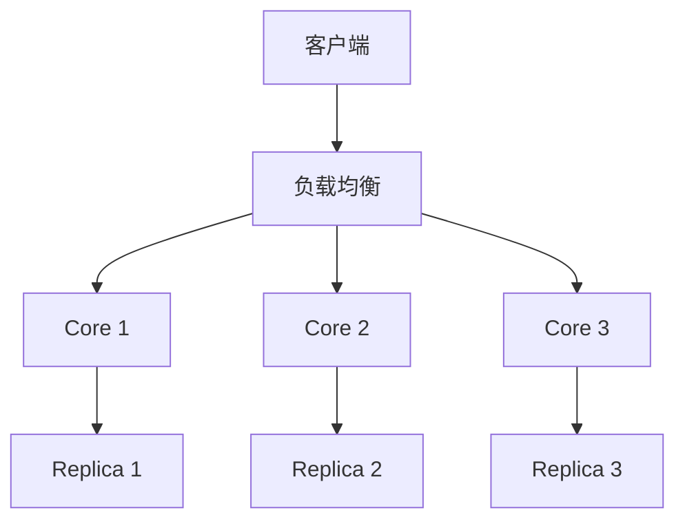
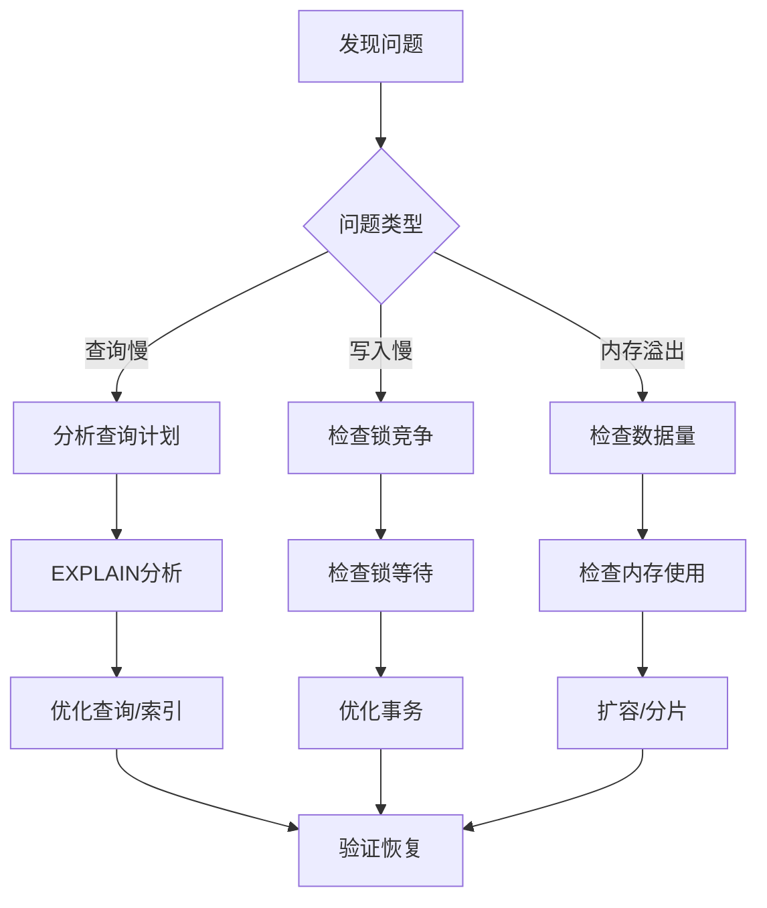
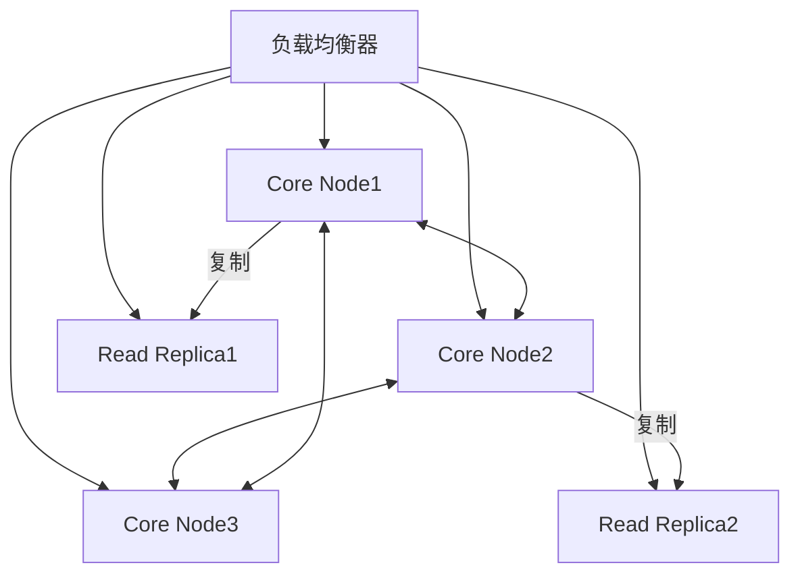
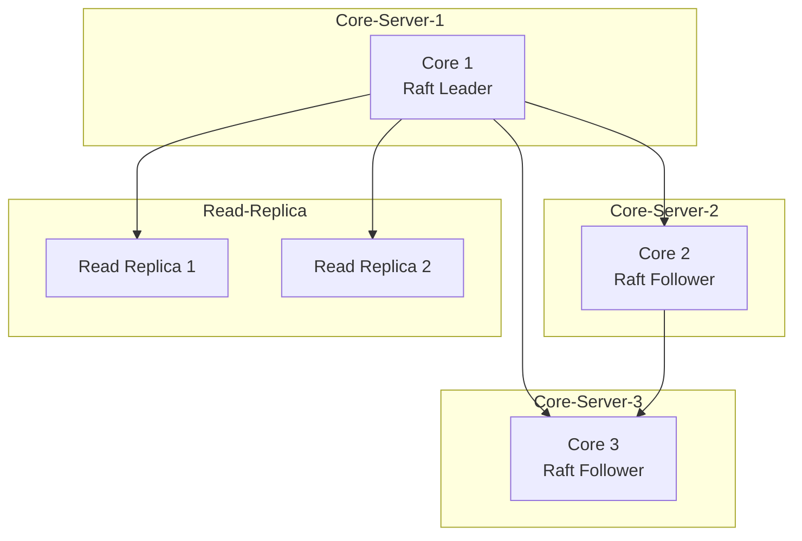

# Neo4j（图数据库）—— 关系的「一等公民」

> 把「实体间的关系」作为一等公民存储，专为多跳关联、路径查找、社群发现等场景而生。
> 适合：社交网络、知识图谱、推荐系统、反欺诈/反洗钱（关系链）、供应链/网络拓扑、最短路径。
> 不适合：强事务报表、结构化 CRUD（这些仍是关系型主场）。

---


## 〇、本体介绍（它是什么 / 适用场景 / 核心概念）

**它是什么**：Neo4j 是最主流的**原生图数据库**（Native Graph DB），数据以「节点-关系-属性」的图结构物理存储，而非模拟成关系表。查询语言为 Cypher（声明式图查询）。

**解决什么痛点**：关系型数据库做「多跳关联」（如朋友的朋友、欺诈团伙、知识图谱推理）要靠层层 JOIN，复杂度随跳数指数级上升。Neo4j 用「免索引邻接（index-free adjacency）」——节点直接持有邻居指针，每跳 O(1)，多跳遍历复杂度只与局部邻居规模相关。

**核心概念**：Node（节点/实体）、Relationship（关系，有方向+类型）、Property（属性）、Label（标签/分类）、Cypher（MATCH/WHERE/RETURN）、索引与约束、因果集群（Core + Read Replica）、超级节点（supernode）问题。

**适用场景**：社交网络、知识图谱、金融风控反欺诈、推荐系统、物流路径规划等关联密集型数据。
**不适用**：超大规模（百亿级关系）无分片的开源版、扁平大表批量分析。

---

## 一、为什么需要图数据库

关系型数据库靠「外键 + JOIN」重建实体关系。当关联深度 ≥ 3 跳（如「朋友的朋友」「风险传导链」），JOIN 数量指数增长、执行计划难优化、I/O 暴涨。

图数据库用 **节点(Node) + 关系(Relationship)** 显式建模，关系直接作为存储结构的一部分，遍历只跟随指针，**性能与路径长度相关、与总数据量弱相关**。

> 仓库 `github.com/neo4j/neo4j`：官方自述 "world's leading Graph Database"，Java/Scala 实现，Community 版 **GPLv3**，Enterprise 版闭源商业许可；8.5 万+ commits；支持 ACID。

---

## 二、核心数据模型（属性图 Property Graph）

| 要素 | 说明 |
|------|------|
| **Node（节点）** | 实体，如 人/公司/商品 |
| **Relationship（关系）** | 有方向、有类型、可带属性，如 `(:Person)-[:FRIEND]->(:Person)` |
| **Label（标签）** | 节点分类，如 `:Person`、`:Customer`，一节点可多标签 |
| **Property（属性）** | 键值对，节点和关系都能挂 |

```cypher
CREATE (p:Person {name:'张三', age:30, city:'北京'})
CREATE (p)-[:FRIEND {since:2020}]->(:Person {name:'李四'})
```

---

## 三、为什么快：原生图存储 + 免索引邻接

Neo4j 的核心秘密是 **Index-Free Adjacency（免索引邻接）**：

- 节点记录里**直接存指向其关系的指针链表**；关系记录里存起始/结束节点 ID 与前后关系指针。
- 遍历时：跟随节点记录的关系指针 → 跳到关系记录 → 再跳到下一个节点，O(1) 跳转。
- **不需要全局索引来查找关系**，避免了「先查索引再回表」的开销。

对比：关系型做 5 跳要 6 次 LEFT JOIN + 递归 CTE，性能差两个数量级；Neo4j 的 Cypher 一行搞定：

```cypher
MATCH (u1:User {name:'Alice'})-[:FRIEND*1..5]->(u2:User)
RETURN u2.name, length((u1)-[:FRIEND*1..5]->(u2)) AS hops
```

`*1..5` 表示 1 到 5 跳可变深度遍历，毫秒级返回。

---

## 四、Cypher 查询语言

Cypher 是「图领域的 SQL」，声明式模式匹配：

```cypher
MATCH (p1:Person {name:'张三'})-[:FRIEND]->(p2:Person)
WHERE p2.age > 25 AND p2.city = '北京'
RETURN p2.name, p2.age
ORDER BY p2.age DESC
```

- `MATCH`：定义图模式
- `WHERE`：过滤
- `RETURN`：投影
- 还支持 `CREATE`/`MERGE`（去重创建）/`DELETE`/`SET`，以及聚合、最短路径 `shortestPath()`、图算法（PageRank、社区发现等，Graph Data Science 库）。

---

## 五、架构与高可用

- **单机**：一个 `neo4j` 进程 + Bolt 协议（二进制，类似 JDBC）。
- **因果集群（Causal Cluster）**：Core（Raft 共识，保证写入一致）+ Read Replica（只读扩展），支持多数据中心。
- **AuraDB**：官方全托管云服务，免费起步。
- 提供 Neo4j Browser 可视化、多语言驱动（Java/Python/Go/JS）、与 Spark/ETL 集成。

---

## 六、Neo4j vs 关系型（选型边界）

| 维度 | Neo4j | MySQL |
|------|-------|-------|
| 模型 | 节点+关系（关系一等公民） | 表-行-列 |
| 多跳关联 | ⭐ 毫秒级（指针遍历） | 深 JOIN 性能崩溃 |
| 事务 | ACID 支持 | ACID 完整成熟 |
| 扩展 | 企业版集群/复制 | 垂直为主 |
| 报表/CRUD | 弱 | ⭐ 成熟 |
| 典型场景 | 社交/图谱/反欺诈 | 订单/账务/库存 |

**选型要点**：业务核心是「关系的表达与遍历」→ 图数据库；核心是「强事务 + 报表」→ 关系型。

---

## 七、生产实践与避坑

1. **建模先想遍历**：图模型的优劣取决于「会不会顺着关系走」。热路径要短、关系要明确。
2. **索引仍重要**：虽然遍历免索引，但「入口定位」（如按 name 找起点节点）要建索引/BTREE，否则全图扫。
3. **超级节点陷阱**：一个节点挂几百万关系（如「热门商品」被所有人购买），遍历会爆。需拆关系、限采样或用分桶。
4. **关系属性别滥用**：关系上挂属性方便，但过多会变重；大字段放节点。
5. **与关系型配合**：真实系统常「事务数据在 MySQL，关系网络在 Neo4j」，通过 CDC 同步。见 [数据同步 CDC-Canal](数据同步CDC-Canal.md)。
6. **Java 集成**：官方 Java Driver / Spring Data Neo4j（SDN），用 `@Node`、`@Relationship` 注解映射。

---

## Neo4j Cypher Query Optimization

### Cypher 查询优化技巧

```cypher
-- 1. 建索引入口（必须指定标签）
CREATE INDEX FOR (p:Person) ON (p.name);
CREATE INDEX FOR (p:Person) ON (p.age);
CREATE CONSTRAINT FOR (p:Person) REQUIRE p.id IS UNIQUE;

-- 2. 避免全图扫描
MATCH (n:Person) RETURN n  -- 正确（指定标签）
MATCH (n) RETURN n         -- 错误（全图扫描）

-- 3. 限制遍历深度
MATCH (u:User)-[:FRIEND*1..3]->(f:User)  -- 正确（限制深度）
MATCH (u:User)-[:FRIEND*]->(f:User)      -- 错误（无限遍历）

-- 4. WHERE 条件尽早过滤
MATCH (p:Person)-[:FRIEND]->(f:Person)
WHERE p.age > 25 AND f.city = '北京'  -- 前置过滤
RETURN f.name

-- 5. 使用 EXPLAIN 查看执行计划
EXPLAIN MATCH (p:Person {name: '张三'})-[:FRIEND]->(f:Person)
RETURN f.name

-- 执行计划关键指标：
--   DbHits: 数据库访问次数（越少越好）
--   Rows: 返回行数
--   EstimatedRows: 估计行数（CBO）
```

### 索引类型

```
Neo4j 索引类型：

1. B-Tree 索引（默认）
   CREATE INDEX FOR (p:Person) ON (p.name);
   适用：等值查询、范围查询

2. 全文索引
   CREATE FULLTEXT INDEX personFulltext FOR (p:Person) ON EACH [p.name, p.bio];
   MATCH (p:Person)
   WHERE fulltextIndex = '张三'  -- 全文检索
   RETURN p.name

3. 空间索引
   CREATE POINT INDEX locationIndex FOR (l:Location) ON (l.point);
   MATCH (l:Location)
   WHERE point.distance(l.point, point({x: 1.0, y: 2.0})) < 1000
   RETURN l.name

4. 范围索引
   CREATE RANGE INDEX FOR (p:Person) ON (p.age);
   优化范围查询性能

选择：
  等值/范围查询 → B-Tree
  全文检索 → 全文索引
  地理位置 → 空间索引
```

## Neo4j APOC Library

### APOC 核心功能

```cypher
-- APOC = Awesome Procedures On Cypher（扩展函数库）

-- 1. 数据转换
CALL apoc.convert.toJson({name: '张三', age: 30});
CALL apoc.convert.fromJsonList('[{"name":"张三"}]', 'MAP');
CALL apoc.number.format(1234567.89, '###,###.##');

-- 2. 路径查询
CALL apoc.path.expand(p, "FRIEND", "Person", 1, 3);
CALL apoc.path.spanningTree(p, {}, "FRIEND", "Person");
CALL apoc.algo.dijkstra(p1, p2, "FRIEND", "distance");

-- 3. 并行处理
CALL apoc.periodic.iterate(
  "MATCH (p:Person) RETURN p",
  "SET p.processed = true",
  {batchSize: 1000, parallel: true}
);

-- 4. 数据库操作
CALL apoc.export.csv.all("/data/export.csv");
CALL apoc.import.csv("/data/import.csv", {skipLines: 1});
CALL apoc.refactor.rename.type("OLD_TYPE", "NEW_TYPE");

-- 5. 索引管理
CALL apoc.schema.assert({Person: ['name', 'age']});
```

## Neo4j Clustering (Core/Read Replicas)

### 因果集群架构

```
Causal Cluster = Neo4j 高可用方案

Core 节点（Raft 共识）：
  最少 3 个（奇数）
  写入通过 Raft 同步
  保证强一致
  
Read Replica（只读副本）：
  只读扩展（分担读压力）
  异步复制（最终一致）
  支持多个

部署：
  3 Core + 2 Read Replica = 生产配置
  
配置：
  dbms.mode=CORE（Core 节点）
  dbms.mode=READ_REPLICA（副本节点）
  causal_clustering.initial_discovery_members=core1:5000,core2:5000,core3:5000

读写分离：
  写操作 → Core 节点
  读操作 → Read Replica（就近读）
  强一致读 → Core 节点
```

## Neo4j Bloom

```
Neo4j Bloom = 图可视化探索工具

功能：
  自然语言搜索（不需要 Cypher 知识）
  可视化图探索（节点/关系/属性）
  路径发现（多跳关联）
  模式匹配（查找相似结构）

使用：
  1. 打开 Bloom（Neo4j Browser 集成）
  2. 输入搜索词：张三
  3. 自动匹配 Person 节点
  4. 点击节点展开关系
  5. 发现路径（朋友的朋友）

场景：
  业务人员自助查询（无需学 Cypher）
  欺诈团伙可视化（关系网络）
  知识图谱探索（实体关联）
```

## Neo4j Fabric (分布式查询)

```
Fabric = Neo4j 的分布式查询（企业版）

原理：
  跨多个 Neo4j 实例的联合查询
  每个实例存储一部分数据
  Fabric 路由查询到对应实例

配置：
  fabric.database name: "users"
  fabric.graph databases: ["users", "orders"]
  
使用：
  USE users
  MATCH (p:Person) RETURN p.name
  
  USE orders
  MATCH (o:Order) RETURN o.id

场景：
  数据按域拆分（users/ orders/ products）
  跨域关联查询（Fabric 路由）
  
注意：
  企业版功能
  跨实例查询有网络开销
  需要合理设计数据分布
```

## Neo4j in Knowledge Graphs

```
Neo4j 知识图谱应用：

数据模型：
  实体 = 节点（Entity）
  关系 = 关系（Relation）
  属性 = 属性（Property）

示例：
  (p:Person {name: '张三'})
  (c:Company {name: '阿里巴巴'})
  (p)-[:WORKS_AT {since: 2020}]->(c)
  (p)-[:KNOWS]->(p2:Person {name: '李四'})

查询：
  // 查找同事关系
  MATCH (p1:Person)-[:WORKS_AT]->(c:Company)<-[:WORKS_AT]-(p2:Person)
  WHERE p1 <> p2
  RETURN p1.name, p2.name, c.name

  // 查找 3 度人脉
  MATCH (p:Person {name: '张三'})-[:KNOWS*1..3]->(friend:Person)
  RETURN friend.name

与 LLM 结合：
  Neo4j 作为知识图谱存储底座
  LLM 生成 Cypher 查询
  图数据库返回结构化知识
  → RAG 增强（实体-关系检索）
```

## Neo4j vs JanusGraph vs NebulaGraph

| 维度 | Neo4j | JanusGraph | NebulaGraph |
|------|-------|------------|-------------|
| 数据模型 | 属性图 | 属性图 | 属性图 |
| 查询语言 | Cypher | Gremlin | nGQL |
| 分布式 | 企业版集群 | HBase/Cassandra | 原生分布式（开源） |
| 超大规模 | 弱（开源版） | 强（依赖后端） | 强（百亿级） |
| 生态成熟度 | 最高 | 中 | 中 |
| 许可证 | GPLv3/商业 | Apache 2.0 | Apache 2.0 |
| 适用场景 | 中小规模/生态优先 | 大规模/多后端 | 超大规模/高性能 |

## Neo4j Performance Tuning

```
性能调优要点：

1. JVM 调优
   -Xms4G -Xmx4G（避免动态调整）
   -XX:+UseG1GC（推荐 G1GC）
   -XX:MaxGCPauseMillis=200

2. 内存配置
   dbms.memory.heap.initial_size=4G
   dbms.memory.heap.max_size=4G
   dbms.memory.pagecache.size=8G（页缓存，最重要）

3. 查询优化
   必须建索引（入口查询）
   限制遍历深度（*1..N）
   使用参数化查询（缓存命中）
   减少返回数据量（RETURN 指定字段）

4. 监控
   CALL dbms.queryJmx("org.neo4j:instance=kernel#0,name=Page cache")
   -- 检查页缓存命中率（>99%）
```

## Neo4j Backup/Restore

```bash
# 备份
neo4j-admin database dump \
  --to-path=/backup/neo4j.dump \
  --database=neo4j

# 恢复
neo4j-admin database load \
  --from-path=/backup/neo4j.dump \
  --database=neo4j

# 在线备份（企业版）
neo4j-admin backup \
  --backup-dir=/backup \
  --from=neo4j://core1:6362

# 恢复
neo4j-admin restore \
  --from=/backup/neo4j-2024-01-01 \
  --database=neo4j

最佳实践：
  定期备份（每日/每小时）
  备份到异地（容灾）
  恢复前停止写入
```

## Neo4j GDS Library Deep

```
GDS = Graph Data Science 库（图算法）

中心性算法：
  CALL gds.pageRank.stream('myGraph')
  YIELD nodeId, score
  RETURN gds.util.asNode(nodeId).name, score
  ORDER BY score DESC LIMIT 10

社区发现：
  CALL gds.louvain.stream('myGraph')
  YIELD nodeId, communityId
  RETURN communityId, count(*) as size
  ORDER BY size DESC

路径查询：
  CALL gds.allShortestPaths.stream('myGraph', {
    sourceNode: gds.util.asNode(0)
  })
  YIELD sourceNode, targetNode, distance

相似度：
  CALL gds.nodeSimilarity.stream('myGraph')
  YIELD node1, node2, similarity
  WHERE similarity > 0.5

使用场景：
  推荐系统（相似度/中心性）
  反欺诈（社区发现识别团伙）
  知识图谱推理（路径查询）
```

## 七-2、GDS 图算法库分类

| 类别 | 代表算法 | 应用场景 |
|------|----------|----------|
| 中心性 | PageRank、Betweenness、Degree | 识别关键节点（KOL/欺诈核心） |
| 社区发现 | Louvain、LPA、WCC | 社群划分/团伙识别 |
| 路径 | Shortest Path、A*、AllPairs | 最短路径/导航/物流 |
| 相似度 | Node Similarity、Jaccard | 推荐系统/相似用户 |

```cypher
-- 中心性算法
CALL gds.pageRank.stream('myGraph')
YIELD nodeId, score
RETURN gds.util.asNode(nodeId).name AS name, score
ORDER BY score DESC LIMIT 10

-- 社区发现
CALL gds.louvain.stream('myGraph')
YIELD nodeId, communityId
RETURN communityId, count(*) AS size
ORDER BY size DESC

-- 最短路径
CALL gds.allShortestPaths.stream('myGraph', {
  sourceNode: gds.util.asNode(0)
})
YIELD sourceNode, targetNode, distance
WHERE distance > 0 AND distance <= 3
RETURN sourceNode, targetNode, distance
```

## 七-3、Neo4j 事务隔离级别与并发控制

```
Neo4j 事务特性：
  默认隔离级别：READ COMMITTED
  支持 ACID 事务
  写操作串行化（同一时刻只有一个写事务修改同一节点）

并发控制：
  1. 写锁：写操作加排他锁
  2. 读锁：读操作加共享锁（不阻塞其他读）
  3. 乐观锁：基于版本号检测冲突（应用层实现）

事务限制：
  单事务超时：默认 60s（可配置）
  最大事务大小：JVM 堆限制
  长事务：会阻塞其他写操作（避免长事务）

配置：
  dbms.transaction.timeout=60s
  dbms.lock.acquisition.timeout=30s
```

## 七-4、APOC 过程调用示例

```cypher
-- APOC = Awesome Procedures On Cypher（扩展函数库）

-- 1. 路径查询：spanningTree（生成树）
CALL apoc.path.spanningTree(
  startNode,          -- 起始节点
  {},                 -- 关系配置
  {},                 -- 节点配置
  "FRIEND",           -- 关系类型
  {maxLevel: 5}       -- 最大深度
)
YIELD path
RETURN path

-- 2. 并行批处理
CALL apoc.periodic.iterate(
  "MATCH (p:Person) RETURN p",
  "SET p.processed = true",
  {batchSize: 1000, parallel: true}
)
YIELD batches, total, errorMessages
RETURN batches, total, errorMessages

-- 3. Dijkstra 最短路径
CALL apoc.algo.dijkstra(
  startNode, endNode, "CONNECTED", "distance"
)
YIELD path, weight
RETURN path, weight

-- 4. 数据导出
CALL apoc.export.csv.all("/data/export.csv")
```

## 七-5、Neo4j 分布式架构（Fabric 分片查询）

```
Fabric = Neo4j 企业版的分布式查询

原理：
  跨多个 Neo4j 实例的联合查询
  每个实例存储一部分数据（按 Label 分片）
  Fabric 路由查询到对应实例

配置：
  fabric.database.name: "users"
  fabric.graph.databases: ["users", "orders"]

使用：
  USE users
  MATCH (p:Person) RETURN p.name
  
  USE orders
  MATCH (o:Order) RETURN o.id

场景：
  数据按域拆分（users/orders/products）
  跨域关联查询（Fabric 路由）

限制：
  企业版功能
  跨实例查询有网络开销
  需要合理设计数据分布
```

## 七-6、Cypher 性能分析（EXPLAIN/PROFILE）

```cypher
-- EXPLAIN：查看执行计划（不执行查询）
EXPLAIN MATCH (p:Person {name: '张三'})-[:FRIEND]->(f:Person)
RETURN f.name

-- 执行计划关键指标：
--   DbHits：数据库访问次数（越少越好）
--   Rows：返回行数
--   EstimatedRows：估计行数（CBO）
--   页面缓存命中：CACHES HITS（越多越好）

-- PROFILE：执行查询并统计实际执行计划
PROFILE MATCH (p:Person {name: '张三'})-[:FRIEND*1..3]->(f:Person)
RETURN f.name

-- Profile 结果解读：
--   DbHits = 实际访问的节点/关系数
--   Rows = 实际返回行数
--   优化方向：减少 DbHits（建索引/限制深度）

-- 常见优化：
--   1. 建标签+属性索引：CREATE INDEX FOR (p:Person) ON (p.name)
--   2. 限制遍历深度：*1..3 而非 *1..
--   3. WHERE 前置过滤
--   4. 减少 RETURN 字段
```

## 七-7、Neo4j 内存配置调优公式

```
内存配置公式：

Page Cache（页缓存，最重要）：
  目标 = 热点图数据全量 × 1.2（20% 余量）
  计算：节点数 × 15B + 边数 × 34B × 1.2
  如 1000万节点 + 5000万边 ≈ 2.2GB → 配置 3GB

JVM Heap：
  目标 = 事务状态 + 遍历状态 + 索引缓存
  建议 = 物理内存的 50%（不超过 32GB）
  如 16GB 服务器 → Heap=8G, PageCache=8G

配置示例：
  dbms.memory.heap.initial_size=8G
  dbms.memory.heap.max_size=8G
  dbms.memory.pagecache.size=8G

监控：
  CALL dbms.queryJmx("org.neo4j:instance=kernel#0,name=Page cache")
  → 检查页缓存命中率（>99%）
```

## 附录 A：GDS（Graph Data Science）算法库

### A.1 内置算法分类

| 类别 | 算法 | 用途 |
|------|------|------|
| 中心性 | PageRank, Betweenness, Closeness | 关键节点识别 |
| 社区检测 | Louvain, Label Propagation, Triangle Count | 社区发现 |
| 路径 | Shortest Path, A*, Dijkstra | 路径规划 |
| 相似度 | Node Similarity, Cosine Similarity | 实体匹配 |
| 节点嵌入 | Node2Vec, FastRP | 图表示学习 |
| 链接预测 | Adamic Adar, Common Neighbors | 关系预测 |

### A.2 GDS 使用示例

```cypher
-- 加载图投影
CALL gds.graph.project(
  'my-graph',
  'Person',
  'KNOWS',
  {
    relationshipProperties: ['weight']
  }
);

-- PageRank 计算
CALL gds.pageRank.stream('my-graph')
YIELD nodeId, score
WITH gds.util.asNode(nodeId) AS person, score
RETURN person.name, score
ORDER BY score DESC
LIMIT 10;

-- 社区检测
CALL gds.louvain.stream('my-graph')
YIELD nodeId, communityId
WITH gds.util.asNode(nodeId) AS person, communityId
RETURN communityId, COLLECT(person.name) AS members
ORDER BY SIZE(members) DESC;
```

### A.3 GDS 配置调优

```yaml
# neo4j.conf
gds:
  memory:
    default_value: 4G
    max_value: 16G
  parallelism:
    default_value: 4
    max_value: 16
  batch_size:
    default_value: 10000
    max_value: 100000
```

## 附录 B：事务隔离与锁机制

### B.1 事务隔离级别

| 级别 | 说明 | 并发性 | 一致性 |
|------|------|--------|--------|
| READ COMMITTED | 读已提交 | 高 | 低 |
| REPEATABLE READ | 可重复读 | 中 | 中 |
| SERIALIZABLE | 序列化 | 低 | 高 |

### B.2 锁类型

| 锁类型 | 说明 | 粒度 |
|--------|------|------|
| 节点锁 | 锁定节点属性 | 节点级 |
| 关系锁 | 锁定关系属性 | 关系级 |
| 图锁 | 锁定整个图 | 图级 |
| Schema 锁 | 锁定结构变更 | Schema 级 |

### B.3 事务配置

```yaml
# neo4j.conf
dbms:
  transaction:
    timeout: 60s
    threads_per_transaction: 4
  memory:
    transaction:
      max_size: 256M
```

## 附录 C：APOC 实用过程

### C.1 常用 APOC 过程

| 过程 | 功能 | 示例 |
|------|------|------|
| `apoc.periodic.iterate` | 批量操作 | 大数据量更新 |
| `apoc.load.json` | JSON 导入 | 外部数据集成 |
| `apoc.export.csv.all` | CSV 导出 | 数据备份 |
| `apoc.path.expand` | 路径遍历 | 多跳查询 |
| `apoc.algo.cover` | 图算法 | 覆盖率计算 |
| `apoc.meta.graph` | 元数据 | 图结构分析 |

### C.2 APOC 使用示例

```cypher
-- 批量更新
CALL apoc.periodic.iterate(
  "MATCH (n:Person) WHERE n.age IS NULL RETURN n",
  "SET n.age = 30",
  {batchSize: 1000, parallel: true}
);

-- JSON 导入
CALL apoc.load.json('file:///data/users.json')
YIELD value
CREATE (n:Person {name: value.name, age: value.age});

-- 路径遍历
CALL apoc.path.expandConfig(
  startNode,
  {
    minLevel: 1,
    maxLevel: 5,
    relationshipFilter: 'KNOWS|FOLLOWS',
    uniqueness: 'NODE_GLOBAL'
  }
)
YIELD path
RETURN path;
```

## 附录 D：Fabric 多数据库架构

### D.1 Fabric 架构

```text
Fabric 架构：

用户查询
  ↓
Fabric 协调器
  ↓
数据库分片1  数据库分片2  数据库分片3
  ↓            ↓            ↓
查询结果合并
  ↓
返回用户
```

### D.2 Fabric 配置

```yaml
# fabric 配置
databases:
  - name: shard1
    url: bolt://neo4j-shard1:7687
  - name: shard2
    url: bolt://neo4j-shard2:7687
  - name: shard3
    url: bolt://neo4j-shard3:7687

# 查询使用
USE fabric.shard1
MATCH (n:Person) RETURN n;

-- 跨分片查询
UNION ALL
USE fabric.shard1
MATCH (n:Person) RETURN n
UNION ALL
USE fabric.shard2
MATCH (n:Person) RETURN n;
```

## 附录 E：Cypher EXPLAIN/PROFILE 分析

### E.1 执行计划分析

```cypher
-- 查看执行计划
EXPLAIN MATCH (p:Person)-[:KNOWS]->(f:Person)
WHERE p.name = 'Alice'
RETURN f.name;

-- 带统计信息的执行计划
PROFILE MATCH (p:Person)-[:KNOWS]->(f:Person)
WHERE p.name = 'Alice'
RETURN f.name;
```

### E.2 执行计划节点

| 节点类型 | 说明 | 优化建议 |
|----------|------|----------|
| AllNodesScan | 全表扫描 | 添加索引 |
| NodeIndexSeek | 索引查找 | 保持 |
| NodeHashJoin | 哈希连接 | 优化查询 |
| Expand(All) | 关系遍历 | 限制深度 |
| ProduceResults | 结果输出 | 减少字段 |

### E.3 索引优化

```cypher
-- 创建索引
CREATE INDEX FOR (p:Person) ON (p.name);

-- 创建复合索引
CREATE INDEX FOR (p:Person) ON (p.name, p.age);

-- 创建全文索引
CREATE FULLTEXT INDEX personName FOR (n:Person) ON EACH [n.name];

-- 查看索引
SHOW INDEXES;
```

## 附录 F：内存调优配置

### F.1 内存分配

```yaml
# neo4j.conf
server:
  memory:
    pagecache:
      size: 4G
    heap:
      initial_size: 2G
      max_size: 4G

dbms:
  memory:
    transaction:
      max_size: 256M
    result:
      max_size: 128M
```

### F.2 内存使用监控

```text
内存使用分布：

Page Cache：
  - 存储图数据
  - 建议：数据集大小的 1.2 倍

Heap Memory：
  - 事务处理
  - 建议：最大 8GB（GC 压力）

Transaction Memory：
  - 单个事务
  - 建议：256MB-1GB

Result Memory：
  - 查询结果
  - 建议：128MB-512MB
```

### F.3 性能调优清单

| 配置项 | 默认值 | 推荐值 | 说明 |
|--------|--------|--------|------|
| `pagecache.size` | 1G | 数据集 1.2x | 图数据缓存 |
| `heap.max_size` | 1G | 4-8G | JVM 堆内存 |
| `transaction.max_size` | 8M | 256M | 单事务大小 |
| `query.max_size` | 1000 | 10000 | 结果集大小 |
| `batch_size` | 1000 | 10000 | 批处理大小 |

## Neo4j 集群架构

### Core / Read Replica / 单实例选型

```
Neo4j 集群部署模式：

单实例（开发/测试）：
  一个 neo4j 进程
  无高可用
  适用：开发、测试、小规模生产

因果集群（Causal Cluster）：
  Core 节点（Raft 共识）：
    最少 3 个（奇数）
    写入通过 Raft 同步
    保证强一致
  Read Replica（只读副本）：
    只读扩展（分担读压力）
    异步复制（最终一致）
    支持多个

选型决策：
  开发测试 → 单实例
  生产小规模 → 3 Core
  生产中大规模 → 3 Core + 2 Read Replica
  多数据中心 → 跨地域 Core 集群
```

| 模式 | 高可用 | 读扩展 | 写性能 | 适用 |
|------|--------|--------|--------|------|
| 单实例 | 无 | 无 | 高 | 开发/测试 |
| 3 Core | 是 | 有限 | 中 | 小规模生产 |
| 3 Core + N Read Replica | 是 | 强 | 中 | 中大规模生产 |
| 多数据中心 Core | 是 | 强 | 低（跨地域延迟） | 异地容灾 |

## Cypher 查询优化

### EXPLAIN / PROFILE / 索引提示

```cypher
-- EXPLAIN：查看执行计划（不执行）
EXPLAIN MATCH (p:Person {name: '张三'})-[:FRIEND]->(f:Person)
RETURN f.name

-- PROFILE：执行并统计实际耗时
PROFILE MATCH (p:Person {name: '张三'})-[:FRIEND*1..3]->(f:Person)
RETURN f.name

-- 执行计划关键指标：
--   DbHits：数据库访问次数（越少越好）
--   Rows：返回行数
--   优化方向：减少 DbHits（建索引/限制深度）

-- 索引提示（强制使用索引）
MATCH (p:Person) USING INDEX p:Person(name)
WHERE p.name = '张三'
RETURN p

-- 强制全表扫描（调试用）
MATCH (p:Person) USING SCAN p:Person
WHERE p.name = '张三'
RETURN p
```

## Neo4j 内存配置

### heap / .pagecache

```yaml
# neo4j.conf 内存配置

# JVM Heap（事务状态/遍历状态）
dbms.memory.heap.initial_size=4G
dbms.memory.heap.max_size=4G

# Page Cache（图数据缓存，最重要）
dbms.memory.pagecache.size=8G

# 内存分配公式：
# Page Cache = 热点图数据全量 × 1.2
# JVM Heap = 物理内存 × 50%（不超过 32GB）
# 如 16GB 服务器 → Heap=8G, PageCache=8G

# 监控页缓存命中率
CALL dbms.queryJmx("org.neo4j:instance=kernel#0,name=Page cache")
-- 命中率 > 99% 正常
```

| 配置项 | 默认值 | 推荐值 | 说明 |
|--------|--------|--------|------|
| heap.initial_size | 1G | 4-8G | JVM 初始堆 |
| heap.max_size | 1G | 4-8G | JVM 最大堆 |
| pagecache.size | 1G | 数据集 1.2x | 图数据缓存 |
| transaction.max_size | 8M | 256M | 单事务大小 |

## Neo4j 数据导入

### neo4j-admin import / batch-import

```bash
# neo4j-admin import（全量导入，最快速）
neo4j-admin import \
  --database=neo4j \
  --nodes=Person=people.csv \
  --nodes=Company=companies.csv \
  --relationships=WORKS_AT=works_at.csv \
  --trim-strings=true \
  --skip-bad-rows=true

# CSV 格式要求：
# people.csv: :ID,name,age
# companies.csv: :ID,name,industry
# works_at.csv: :START_ID,:END_ID,since

# batch-import（APOC 批量导入）
CALL apoc.periodic.iterate(
  "LOAD CSV WITH HEADERS FROM 'file:///people.csv' AS row RETURN row",
  "CREATE (p:Person {name: row.name, age: toInteger(row.age)})",
  {batchSize: 1000, parallel: true}
)
```

## Neo4j 与应用集成

### Spring Data Neo4j / ODM

```java
// Spring Data Neo4j 实体
@Node
public class Person {
    @Id @GeneratedValue
    private Long id;
    
    private String name;
    private int age;
    
    @Relationship(type = "FRIEND", direction = Relationship.Direction.OUTGOING)
    private List<Person> friends;
    
    @Relationship(type = "WORKS_AT", direction = Relationship.Direction.OUTGOING)
    private Company company;
}

// Repository
public interface PersonRepository extends Neo4jRepository<Person, Long> {
    List<Person> findByName(String name);
    @Query("MATCH (p:Person)-[:FRIEND]->(f:Person) WHERE p.name = $name RETURN f")
    List<Person> findFriendsByName(String name);
}

// 使用
@Service
public class PersonService {
    @Autowired PersonRepository repo;
    
    public Person createPerson(String name) {
        Person p = new Person();
        p.setName(name);
        return repo.save(p);
    }
}
```

## Neo4j 在知识图谱/推荐系统中的应用案例

### 知识图谱

```
知识图谱数据模型：
  实体 = 节点（Entity）
  关系 = 关系（Relation）
  属性 = 属性（Property）

示例：
  (p:Person {name: '张三'})
  (c:Company {name: '阿里巴巴'})
  (p)-[:WORKS_AT {since: 2020}]->(c)

查询：
  // 查找 3 度人脉
  MATCH (p:Person {name: '张三'})-[:KNOWS*1..3]->(friend:Person)
  RETURN friend.name

  // 查找同事关系
  MATCH (p1:Person)-[:WORKS_AT]->(c:Company)<-[:WORKS_AT]-(p2:Person)
  WHERE p1 <> p2
  RETURN p1.name, p2.name, c.name
```

### 推荐系统

```
推荐场景：
  相似用户推荐（共同好友/兴趣）
  商品推荐（购买路径/相似商品）
  内容推荐（标签关联/作者关联）

GDS 算法：
  PageRank：识别关键节点（KOL/热门商品）
  Node Similarity：相似用户/商品计算
  Louvain：社群发现（用户分群）
```

## 九、Neo4j 高级特性与生产实践

### 9.1 集群架构（因果集群）

```yaml
# Neo4j因果集群部署
cluster:
  core_nodes:
    - neo4j-core-1
    - neo4j-core-2
    - neo4j-core-3
  read_replicas:
    - neo4j-replica-1
    - neo4j-replica-2
  
  configuration:
    causal_clustering.minimum_core_cluster_size_at_core: 3
    causal_clustering.expected_core_cluster_size: 3
    causal_clustering.read_replica_sampling_strategy: "server_groups"
    
    # 复制配置
    causal_clustering.state_machine_apply_max_batch_size: 100
    causal_clustering.state_machine_max_queue_size: 10000
    
    # 故障检测
    causal_clustering.leader_election_timeout: 7s
    causal_clustering.catch_up_batch_size: 1024
```

| 集群角色 | 说明 | 扩展方式 |
|----------|------|----------|
| Core | 读写节点（Raft共识） | 加Core节点 |
| Read Replica | 只读副本（异步复制） | 加Replica节点 |
| Edge | 边缘节点（单向同步） | 跨数据中心 |



### 9.2 Cypher 查询优化

```cypher
// 1. 使用EXPLAIN分析查询计划
EXPLAIN MATCH (p:Person)-[:FRIEND]->(f:Person)-[:WORKS_AT]->(c:Company)
WHERE c.name = 'Neo4j'
RETURN p.name

// 2. 创建复合索引
CREATE INDEX person_name_age FOR (p:Person) ON (p.name, p.age)

// 3. 使用参数化查询（避免缓存污染）
MATCH (p:Person {name: $name})-[:FRIEND]->(f)
RETURN f.name

// 4. 限制结果集大小
MATCH (p:Person)
WHERE p.city = '北京'
RETURN p.name
ORDER BY p.score DESC
LIMIT 10

// 5. 使用PROFILE分析实际执行
PROFILE MATCH (p:Person)-[:FRIEND*1..3]->(f:Person)
WHERE p.name = '张三'
RETURN f.name
```

| 优化策略 | 说明 | 收益 |
|----------|------|------|
| 索引优化 | 创建合适的索引 | 查询性能提升10-100倍 |
| 查询重写 | 避免全图扫描 | 性能提升5-50倍 |
| 参数化查询 | 利用查询缓存 | 减少解析开销 |
| 结果限制 | LIMIT/SKIP | 减少数据传输 |
| 批量操作 | UNWIND批量写入 | 写入性能提升5-10倍 |

### 9.3 内存配置优化

```yaml
# Neo4j内存配置
server:
  memory:
    # 堆内存（JVM）
    heap:
      initial_size: "4G"
      max_size: "8G"
    
    # 原生内存（Off-Heap）
    pagecache:
      size: "16G"  # 建议为数据量的1.5倍
    
    # 查询内存限制
    query:
      max_memory: "2G"
    
    # 缓存配置
    cache:
      # 节点缓存
      node_cache_size: "2G"
      # 关系缓存
      relationship_cache_size: "2G"
```

| 内存类型 | 说明 | 配置建议 |
|----------|------|----------|
| Heap | JVM堆内存 | 数据量的10-20% |
| Page Cache | 页面缓存 | 数据量的1.5-2倍 |
| Query Memory | 查询内存限制 | 并发查询数×单查询内存 |
| Cache | 节点/关系缓存 | 热点数据量 |

### 9.4 数据导入高级

```cypher
// 1. LOAD CSV批量导入
LOAD CSV WITH HEADERS FROM 'file:///persons.csv' AS row
CALL {
    WITH row
    CREATE (p:Person {
        id: toInteger(row.id),
        name: row.name,
        age: toInteger(row.age),
        city: row.city
    })
} IN TRANSACTIONS OF 10000 ROWS

// 2. 使用apoc.periodic.iterate批量处理
CALL apoc.periodic.iterate(
    "MATCH (p:Person) RETURN p",
    "SET p.processed = true",
    {batchSize: 1000, parallel: true}
)

// 3. 图算法批量计算
CALL gds.pageRank.write({
    nodeProjection: 'Person',
    relationshipProjection: 'FRIEND',
    writeProperty: 'pagerank_score'
})

// 4. 数据迁移（Neo4j到Neo4j）
apoc.export.cypher.all('export.cypher')
// 目标库执行
apoc.cypher.importFile('export.cypher')
```

| 导入方式 | 适用场景 | 性能 |
|----------|----------|------|
| LOAD CSV | 小中数据量（<100万） | 中 |
| apoc.periodic.iterate | 大数据量并行 | 高 |
| Neo4j Admin Import | 初始全量导入 | 最高 |
| APOC Spatial | 地理数据导入 | 中 |

### 9.5 Spring Data Neo4j

```java
// 实体定义
@Node
public class Person {
    @Id @GeneratedValue
    private Long id;
    
    private String name;
    private int age;
    
    @Relationship(type = "FRIEND", direction = Relationship.Direction.OUTGOING)
    private Set<Person> friends;
    
    @Relationship(type = "WORKS_AT", direction = Relationship.Direction.OUTGOING)
    private Company company;
}

// Repository接口
public interface PersonRepository extends Neo4jRepository<Person, Long> {
    List<Person> findByName(String name);
    
    @Query("MATCH (p:Person)-[:FRIEND]->(f:Person) WHERE p.name = $name RETURN f")
    List<Person> findFriendsByName(@Param("name") String name);
    
    @Query("MATCH (p:Person)-[:FRIEND*1..3]->(f:Person) WHERE p.name = $name RETURN DISTINCT f")
    List<Person> findFriendsOfFriends(@Param("name") String name);
}

// Service层
@Service
public class PersonService {
    @Autowired
    private PersonRepository personRepository;
    
    @Transactional
    public Person createPerson(Person person) {
        return personRepository.save(person);
    }
    
    public List<Person> getFriendsOfFriends(String name) {
        return personRepository.findFriendsOfFriends(name);
    }
}
```

### 9.6 知识图谱推荐案例

```cypher
// 1. 基于协同过滤的推荐
MATCH (u:User {id: $userId})-[:PURCHASED]->(p:Product)
      <-[:PURCHASED]-(other:User)-[:PURCHASED]->(recommendation:Product)
WHERE NOT (u)-[:PURCHASED]->(recommendation)
RETURN recommendation.name, COUNT(other) AS frequency
ORDER BY frequency DESC
LIMIT 10

// 2. 基于图算法的推荐（PageRank）
CALL gds.pageRank.stream({
    nodeProjection: 'Product',
    relationshipProjection: {
        PURCHASED: { orientation: 'UNDIRECTED' }
    }
})
YIELD nodeId, score
WITH gds.util.asNode(nodeId) AS product, score
WHERE NOT EXISTS {
    MATCH (u:User {id: $userId})-[:PURCHASED]->(product)
}
RETURN product.name, score
ORDER BY score DESC
LIMIT 10

// 3. 社群发现推荐
CALL gds.louvain.stream({
    nodeProjection: 'User',
    relationshipProjection: 'FRIEND'
})
YIELD nodeId, communityId
WITH gds.util.asNode(nodeId) AS user, communityId
WHERE user.id = $userId
MATCH (other:User)-[:FRIEND*2..3]->(u:User {id: $userId})
WHERE other.communityId = communityId
  AND NOT (u)-[:FRIEND]->(other)
RETURN other.name, COUNT(*) AS mutualFriends
ORDER BY mutualFriends DESC
LIMIT 5
```

| 推荐算法 | 适用场景 | 复杂度 |
|----------|----------|--------|
| 协同过滤 | 用户-商品推荐 | O(n²) |
| PageRank | 关键节点识别 | O(n) |
| Louvain | 社群发现 | O(n log n) |
| Node Similarity | 相似实体计算 | O(n²) |
| 最短路径 | 路径推荐 | O(n+m) |

### 9.7 Neo4j 故障排查手册

| 故障现象 | 可能原因 | 排查步骤 | 解决方案 |
|----------|----------|----------|----------|
| 查询慢 | 缺少索引 | `EXPLAIN`分析 | 创建合适索引 |
| 内存溢出 | 堆设置不当 | 监控JVM内存 | 调整heap size |
| 集群不同步 | 网络问题 | 检查集群状态 | 修复网络/重启 |
| 写入拒绝 | 事务冲突 | 检查锁等待 | 优化事务逻辑 |
| 数据损坏 | 异常宕机 | 检查日志 | 恢复备份 |
| 连接数满 | 并发过高 | 监控连接数 | 连接池优化 |

### 9.8 Neo4j 监控与运维

```yaml
# Neo4j监控配置
monitoring:
  # 指标收集
  metrics:
    enabled: true
    endpoint: "http://localhost:2004"
    
  # 告警规则
  alerts:
    - name: heap_usage_high
      condition: "heap_usage > 80%"
      severity: "warning"
    
    - name: query_slow
      condition: "avg_query_time > 5000"
      severity: "warning"
    
    - name: cluster_unhealthy
      condition: "cluster_status != 'healthy'"
      severity: "critical"
  
  # 备份策略
  backup:
    enabled: true
    schedule: "0 2 * * *"  # 每天凌晨2点
    retention: "30d"
    location: "s3://neo4j-backups"
```

> 核心原则：**索引优化先行，内存合理配置，集群高可用，监控备份到位**。

## Neo4j 内部机制深度剖析

### Neo4j 存储引擎

| 存储组件 | 功能 | 存储内容 | 优化策略 |
|----------|------|----------|----------|
| 本地存储 | 图数据存储 | 节点/关系 | 内存映射 |
| Native Index | 原生索引 | 属性索引 | 合理建索引 |
| Label Store | 标签存储 | 节点标签 | 标签优化 |
| Relationship Store | 关系存储 | 关系数据 | 关系方向 |

```text
Neo4j 存储结构：
  数据库目录/
    ├── neostore.nodeStore.nodes | 节点存储
    ├── neostore.relationshipStore | 关系存储
    ├── neostore.propStore | 属性存储
    ├── neostore.labelStore | 标签存储
    └── schema/ | 索引和约束

  存储特点：
  - 无索引邻接（Index-Free Adjacency）
  - 固定大小记录（9字节/关系）
  - 原地更新（In-Place Update）
```

### Neo4j 事务机制

```java
// Neo4j 事务管理
try (Transaction tx = db.beginTx()) {
    // 读取节点
    Node node = tx.getNodeById(1);
    
    // 修改节点
    node.setProperty("name", "Alice");
    
    // 创建关系
    Node other = tx.createNode(Label.label("Person"));
    other.setProperty("name", "Bob");
    node.createRelationshipTo(other, RelationshipKNOWS);
    
    // 提交事务
    tx.commit();
} catch (Exception e) {
    // 回滚事务
    tx.rollback();
}
```

### Neo4j 并发控制

| 并发机制 | 说明 | 适用场景 |
|----------|------|----------|
| MVCC | 多版本并发控制 | 读写并发 |
| 锁机制 | 节点/关系锁 | 写写并发 |
| 读写锁 | 读写分离 | 高并发读 |
| 乐观锁 | 版本号控制 | 低冲突写 |

## Neo4j Cypher 查询优化

### Cypher 查询计划

```cypher
// 查看查询计划
EXPLAIN MATCH (a:Person)-[:KNOWS]->(b:Person)
WHERE a.name = 'Alice'
RETURN b.name;

// 详细执行计划
PROFILE MATCH (a:Person)-[:KNOWS]->(b:Person)
WHERE a.name = 'Alice'
RETURN b.name;
```

### 索引优化策略

| 索引类型 | 创建语句 | 适用场景 |
|----------|----------|----------|
| B-Tree | CREATE INDEX ON :Person(name) | 等值查询 |
| 全文索引 | CREATE FULLTEXT INDEX ON :Person(name) | 文本搜索 |
| 空间索引 | CREATE POINT INDEX ON :Location(location) | 空间查询 |
| 复合索引 | CREATE INDEX ON :Person(age, name) | 多属性查询 |

### 查询优化技巧

| 技巧 | 说明 | 示例 |
|------|------|------|
| 使用索引 | 避免全表扫描 | WHERE n.name = 'Alice' |
| 限制深度 | 避免无限遍历 | MATCH (a)-[*1..5]->(b) |
| 使用PROFILE | 分析查询计划 | PROFILE MATCH ... |
| 避免 OPTIONAL | 减少空值处理 | 使用 OPTIONAL MATCH |

## Neo4j 集群架构设计

### 集群部署模式

| 部署模式 | 说明 | 适用场景 |
|----------|------|----------|
| 单机 | 单实例部署 | 开发测试 |
| 集群 | 多实例集群 | 生产环境 |
|ausal Cluster | 因果集群 | 高可用 |
| 核心边缘 | 核心+边缘 | 多区域 |

### 集群配置

```yaml
# Neo4j 集群配置
causal_clustering:
  initial_discovery_members:
    - neo4j-core1:5000
    - neo4j-core2:5000
    - neo4j-core3:5000
    
  server_role: CORE
  
  # Read Replica 配置
  read_replica:
    server_role: READ_REPLICA
    initial_discovery_members:
      - neo4j-core1:5000
```

### 集群监控指标

| 指标 | 说明 | 告警阈值 |
|------|------|----------|
| 副本延迟 | 主从同步延迟 | > 100ms |
| 连接数 | 活跃连接数 | > 1000 |
| 内存使用 | JVM堆内存 | > 80% |
| 事务数 | 每秒事务数 | 异常波动 |

## Neo4j 生产问题排查指南

### 常见问题与解决方案

| 问题现象 | 可能原因 | 排查步骤 | 解决方案 |
|----------|----------|----------|----------|
| 查询慢 | 缺少索引 | EXPLAIN分析 | 创建索引 |
| 内存溢出 | 数据量大 | 检查内存 | 扩容/优化 |
| 写入慢 | 锁竞争 | 检查锁 | 优化事务 |
| 连接数高 | 连接池配置 | 检查连接 | 调整配置 |
| 数据不一致 | 主从延迟 | 检查集群 | 等待同步 |

### 故障排查流程



### 监控关键指标

```yaml
# Prometheus 告警规则
groups:
  - name: neo4j-alerts
    rules:
      - alert: Neo4j_HighMemory
        expr: neo4j_jvm_heap_used_bytes / neo4j_jvm_heap_max_bytes > 0.8
        for: 5m
        labels:
          severity: warning
        annotations:
          summary: "Neo4j 内存使用率高"
          
      - alert: Neo4j_SlowQuery
        expr: neo4j_query_duration_seconds > 1
        for: 5m
        labels:
          severity: warning
        annotations:
          summary: "Neo4j 查询慢"
          
      - alert: Neo4j_ConnectionHigh
        expr: neo4j_connections_active > 1000
        for: 5m
        labels:
          severity: warning
        annotations:
          summary: "Neo4j 连接数高"
```

## 八、与其他板块的关系

- 与 [MongoDB](MongoDB.md)：MongoDB 用引用也能存图，但遍历要应用层多次查，深度关联远不如原生图存储。
- 与 [MySQL](../mysql知识.md)：二者互补——事务在 MySQL，关系网络在 Neo4j，CDC 同步。
- 与 [大模型/知识图谱](../../大模型/README.md)：Neo4j 是经典知识图谱存储底座，配合 LLM 做 RAG 中的「实体-关系」检索。

---

## 九、速查表

| 项 | 结论 |
|----|------|
| 类型 | 属性图数据库 |
| 模型 | Node + Relationship + Label + Property |
| 查询 | Cypher（声明式模式匹配） |
| 性能核心 | 原生图存储 + 免索引邻接（O(1) 跳转） |
| 事务 | ACID |
| 高可用 | Causal Cluster（Raft）+ AuraDB 云 |
| 许可证 | Community GPLv3 / Enterprise 商业 |
| 一句话 | 「关系密集 + 多跳」场景的天然解 |

---

## 面试高频问题（20+ 条）

1. **Neo4j 与关系型数据库核心区别？** 数据模型：Neo4j 图（节点-关系-属性），MySQL 表-行-列；关联查询：Neo4j 免索引邻接 O(1) 每跳，MySQL 多层 JOIN 复杂度 O(n^k)。深度关联 Neo4j 碾压。

2. **什么是免索引邻接（index-free adjacency）？** 每个节点记录直接持有其关系链表的指针，遍历时顺着指针走，每跳 O(1)，与全库规模无关。这是图库比 SQL JOIN 快的根本原因。

3. **数据模型三要素？** Node（节点/实体）、Relationship（关系，必须有方向和类型）、Property（属性，键值对）；Label（标签）给节点分类，一个节点可有多个标签。

4. **Cypher 基础写法？** MATCH (p:Person {name:'张三'}) RETURN p 查节点；CREATE (a)-[:FRIENDS_WITH]->(b) 建关系；MATCH...OPTIONAL MATCH 类似 LEFT JOIN；变长路径用 -[:FOLLOWS*1..3]->。

5. **MATCH 与 OPTIONAL MATCH 区别？** MATCH 必须匹配才返回；OPTIONAL MATCH 即使无匹配也返回（缺失部分 null），等价于 SQL LEFT JOIN。

6. **索引类型与创建？** 对 :Label(prop) 建索引 CREATE INDEX；唯一约束 CREATE CONSTRAINT ... ASSERT u.id IS UNIQUE（同时加速+防重）。

7. **如何优化查询？** 建标签+属性索引；必须指定标签避免全图扫描；限制遍历深度（*1..3）防止无限遍历；用参数化查询（防注入+提升缓存命中）。

8. **关系必须有方向吗？** 是，Neo4j 关系必须有方向（且类型唯一），查询时可忽略方向（MATCH (a)-[:X]-(b)）。

9. **超级节点（supernode）问题？** 一个节点关联极多关系（如「全部用户」节点），遍历会拖垮性能。缓解：拆分关系类型、时间分区关系、避免中心化节点。

10. **高可用与集群？** 因果集群（Causal Clustering）：Core 节点（Raft 共识，负责写，最小 3） + Read Replica（只读副本，分担读）。企业版支持分片（Sharding）处理超大规模。

11. **Neo4j 的水平扩展局限？** 开源社区版集群功能有限，写无法分布式分片；亿级以上关系需企业版或改用 NebulaGraph/Dgraph。

12. **企业级应用场景？** 社交网络（好友推荐）、知识图谱、金融风控反欺诈（团伙识别）、电商推荐、物流路径规划。

13. **与 ArangoDB / NebulaGraph 对比？** Neo4j 生态成熟、Cypher 易用，但开源版写扩展弱；NebulaGraph 开源、高性能、百亿级；ArangoDB 多模型（图+文档+KV）。

14. **何时不该用 Neo4j？** 扁平大表、批量分析、超大规模无分片的写密集场景；此时关系型+递归 CTE 或专用 OLAP 更合适。

15. **Bolt 协议与 REST API？** Bolt 是二进制高性能协议（端口 7687）；也提供 REST/HTTP 与 Neo4j Browser（7474）。

16. **Spring 集成？** Spring Data Neo4j（SDN）：@Node 实体、@Relationship 关系、Neo4jRepository，与 Spring Boot 无缝衔接。

17. **GDS 库是什么？** Graph Data Science 库，提供 PageRank、社区发现、路径算法等图算法，用于推荐/欺诈检测。

18. **节点记录物理结构？** 节点记录存指向第一条关系的指针，关系记录双向链表连接相邻关系，从而实现免索引邻接。

19. **事务与 ACID？** Neo4j 支持 ACID 事务，单实例写入串行化，保证一致性；因果集群下读写通过 Raft 同步。

20. **数据建模最佳实践？** 实体做节点、关联做关系（关系上只存关联属性）；单一主标签分类；避免过度关联；合理拆分冗余节点。

21. **多跳查询性能数量级？** 实测百万用户+500 万关系，查「3 度好友」Neo4j <10ms，MySQL 多表 JOIN >500ms。

22. **Neo4j 与 RDF/知识图谱关系？** Neo4j 是属性图模型，适合落地知识图谱存储与查询；RDF 是另一套语义网标准，二者模型不同。

---

## 十、Cypher 高级特性与性能陷阱

### 10.1 可变长度路径（Variable-Length Paths）

```cypher
-- 查找 2~4 跳的路径
MATCH path = (a:Person)-[:FRIEND*2..4]->(b:Person)
WHERE a.name = '张三'
RETURN b.name, length(path) AS hops
```

**陷阱**：`*1..N` 中 N 过大（如 `*1..10`）会导致组合爆炸——超级节点每跳扇出 1000，10 跳就是 1000^10 条路径。**必须配合 LIMIT + 过滤条件**。

### 10.2 OPTIONAL MATCH（左连接等价）

```cypher
-- 查找所有 Person，附带其订单（没有订单也返回）
MATCH (p:Person)
OPTIONAL MATCH (p)-[:PLACED]->(o:Order)
RETURN p.name, o.id
```

**注意**：OPTIONAL MATCH 的 WHERE 条件如果在 MATCH 部分会强制匹配（变成 INNER JOIN），需放在 RETURN/WITH 的 WHERE 中。

### 10.3 MERGE（幂等创建）

```cypher
-- 存在则匹配，不存在则创建（避免重复）
MERGE (p:Person {name: '王五'})
ON CREATE SET p.created = datetime()
ON MATCH SET p.accessed = datetime()
```

### 10.4 性能陷阱速查

| 陷阱 | 表现 | 解法 |
|------|------|------|
| 全图扫描（无标签） | `MATCH (n) RETURN n` | 必须指定标签 `MATCH (n:Person)` |
| 无索引入口 | 按 name 查但没建索引 | `CREATE INDEX FOR (p:Person) ON (p.name)` |
| 超级节点遍历 | 热门商品被所有用户关联 | 拆关系类型/时间分区/采样 |
| 无限路径 | `*0..` 不限制深度 | 始终指定上限 `*1..5` |
| OPTIONAL MATCH 误用 | WHERE 条件位置错误导致意外过滤 | WHERE 放在 RETURN/WITH 后 |

---

## 十一、图算法（Graph Data Science 库）

Neo4j 的 GDS（Graph Data Science）库提供 50+ 图算法，分为三大类：

| 类别 | 代表算法 | 应用 |
|------|----------|------|
| **中心性** | PageRank、Betweenness、Degree | 识别关键节点（社交 KOL/欺诈核心） |
| **社区发现** | Louvain、Label Propagation、Weakly Connected Components | 社群划分/团伙识别 |
| **路径/相似度** | Shortest Path、A*、Node Similarity | 推荐系统/路径规划 |
| **链接预测** | Adamic Adar | 好友推荐/关系预测 |

```cypher
-- PageRank 示例
CALL gds.pageRank.stream('myGraph')
YIELD nodeId, score
RETURN gds.util.asNode(nodeId).name AS name, score
ORDER BY score DESC LIMIT 10
```

**适用场景**：推荐系统（相似度/中心性）、反欺诈（社区发现识别团伙）、知识图谱推理（路径查询）。

---

## 十二、Spring Data Neo4j（SDN）集成

```java
@Node
public class Person {
    @Id @GeneratedValue private Long id;
    private String name;
    @Relationship(type = "FRIEND", direction = Relationship.Direction.OUTGOING)
    private List<Person> friends;
}

public interface PersonRepository extends Neo4jRepository<Person, Long> {
    List<Person> findByName(String name);
}

// 使用
@Service
public class PersonService {
    @Autowired PersonRepository repo;
    
    public Person createPerson(String name) {
        Person p = new Person();
        p.setName(name);
        return repo.save(p);
    }
    
    public List<Person> findFriends(String name) {
        return repo.findByName(name).stream()
            .flatMap(p -> p.getFriends().stream())
            .collect(Collectors.toList());
    }
}
```

**SDN 核心注解**：`@Node`（实体映射）、`@Relationship`（关系映射）、`@DynamicProperties`（动态属性）、`@Query`（Cypher 查询）。

---

## 十三、Neo4j 与其他图数据库对比

| 维度 | Neo4j | NebulaGraph | ArangoDB | Dgraph |
|------|-------|-------------|----------|--------|
| 数据模型 | 属性图 | 属性图 | 多模型（图+文档+KV） | 属性图/RDF |
| 查询语言 | Cypher | nGQL（Cypher 变体） | AQL | GraphQL± |
| 分布式 | 企业版集群 | 原生分布式（开源） | 单节点/集群 | 原生分布式 |
| 超大规模 | 弱（开源版） | 强（百亿级） | 中 | 强 |
| 生态成熟度 | 最高 | 中 | 中 | 中 |
| 许可证 | GPLv3/商业 | Apache 2.0 | Apache 2.0 | Apache 2.0 |
| 适用场景 | 中小规模/生态优先 | 超大规模/高性能 | 多模型/灵活性 | RDF/语义网 |

**选型要点**：中小规模+生态成熟 → Neo4j；超大规模+开源 → NebulaGraph；多模型灵活性 → ArangoDB；RDF/语义网 → Dgraph。

---

## 十四、与其他板块的关系（扩展）

- 与 [Neo4j 与 RDF/知识图谱关系](#)：Neo4j 是属性图模型，适合落地知识图谱存储与查询；RDF 是另一套语义网标准，二者模型不同。
- 与 [MongoDB](MongoDB.md)：MongoDB 用引用也能存图，但遍历要应用层多次查，深度关联远不如原生图存储。
- 与 [MySQL](../mysql知识.md)：二者互补——事务在 MySQL，关系网络在 Neo4j，CDC 同步。
- 与 [大模型/知识图谱](../../大模型/README.md)：Neo4j 是经典知识图谱存储底座，配合 LLM 做 RAG 中的「实体-关系」检索。
- 与 [Kafka](Kafka.md)：CDC 同步（MySQL→Neo4j）可通过 Kafka 解耦。
- 与 [Redis](Redis深度篇.md)：热门关系可缓存在 Redis，减少图库遍历压力。

---

## 十五、速查表（扩展）

| 项 | 结论 |
|----|------|
| 类型 | 属性图数据库 |
| 模型 | Node + Relationship + Label + Property |
| 查询 | Cypher（声明式模式匹配） |
| 性能核心 | 原生图存储 + 免索引邻接（O(1) 跳转） |
| 事务 | ACID |
| 高可用 | Causal Cluster（Raft）+ AuraDB 云 |
| 许可证 | Community GPLv3 / Enterprise 商业 |
| 图算法 | GDS 库（中心性/社区/路径/相似度） |
| Spring 集成 | SDN（@Node/@Relationship） |
| 超大规模替代 | NebulaGraph/Dgraph |
| 一句话 | 「关系密集 + 多跳」场景的天然解 |

---

## 十、图算法深入

### 10.1 常用图算法

| 算法类别 | 算法名称 | 用途 | 时间复杂度 |
|----------|----------|------|------------|
| 中心性 | PageRank | 页面重要性排名 | O(n²) |
| 中心性 | Betweenness | 关键节点识别 | O(nm) |
| 中心性 | Closeness | 影响力传播 | O(n²) |
| 社区检测 | Louvain | 社区发现 | O(n log n) |
| 社区检测 | Label Propagation | 快速社区检测 | O(n) |
| 路径 | Dijkstra | 最短路径 | O(n²) |
| 路径 | A* | 启发式最短路径 | O(n log n) |
| 相似度 | Jaccard | 集合相似度 | O(n²) |
| 相似度 | Cosine | 向量相似度 | O(n²) |

### 10.2 图算法示例

```cypher
// PageRank 算法
CALL gds.pageRank.stream('myGraph')
YIELD nodeId, score
RETURN gds.util.asNode(nodeId).name AS name, score
ORDER BY score DESC
LIMIT 10

// 最短路径
MATCH path = shortestPath(
  (p1:Person {name: "Alice"})-[*]-(p2:Person {name: "Bob"})
)
RETURN path

// 社区检测
CALL gds.louvain.stream('myGraph')
YIELD nodeId, communityId
RETURN gds.util.asNode(nodeId).name AS name, communityId
ORDER BY communityId

// 相似度计算
CALL gds.nodeSimilarity.stream('myGraph')
YIELD node1, node2, similarity
RETURN gds.util.asNode(node1).name AS person1,
       gds.util.asNode(node2).name AS person2,
       similarity
ORDER BY similarity DESC
LIMIT 10
```

---

## 十一、性能优化

### 11.1 索引优化

| 索引类型 | 说明 | 适用场景 |
|----------|------|----------|
| 节点属性索引 | 加速属性查找 | WHERE 条件查询 |
| 关系类型索引 | 加速关系遍历 | 关系过滤 |
| 全文索引 | 文本搜索 | 模糊查询 |
| 空间索引 | 地理位置查询 | 附近的人 |
| 复合索引 | 多属性组合查询 | 多条件过滤 |

### 11.2 查询优化

```cypher
// 使用索引提示
MATCH (n:Person) USING INDEX n:Person(name)
WHERE n.name = "Alice"
RETURN n

// 使用强制标签
MATCH (n:Person)-[:KNOWS]->(m:Person)
WHERE n.name = "Alice"
RETURN m

// 避免全图扫描
MATCH (n:Person {name: "Alice"})
MATCH (m:Person {name: "Bob"})
RETURN shortestPath((n)-[*]-(m))
```

---

## 十二、生产部署

### 12.1 部署架构

```
Neo4j 部署架构：
  单机模式：
    适用：开发测试、小规模生产
    配置：4核8G，100GB SSD
    
  集群模式：
    适用：大规模生产、高可用
    配置：3节点集群（1主2从）
    
  云服务模式：
    适用：免运维、弹性伸缩
    配置：Neo4j AuraDB
```

### 12.2 性能调优

| 调优项 | 配置建议 | 效果 |
|--------|----------|------|
| 内存 | dbms.memory.heap.initial_size=4G | 提升查询性能 |
| 缓存 | dbms.memory.pagecache.size=8G | 减少磁盘IO |
| 并发 | dbms.connector.bolt.thread_pool_min_size=10 | 提升并发能力 |
| 存储 | 块存储 vs 高性能存储 | 提升读写性能 |

---

## 集群架构（Core/Read Replica）

### Neo4j集群模式

| 节点类型 | 说明 | 用途 |
|----------|------|------|
| Core | 核心节点（Raft复制） | 写入/读取 |
| Read Replica | 只读副本 | 读扩展 |



```bash
# 集群配置（neo4j.conf）
causal_clustering.initial_discovery_members=core1:5000,core2:5000,core3:5000
causal_clustering.server_id=1
dbms.mode=CORE
```

## Cypher优化（EXPLAIN/PROFILE/索引提示）

### 查询计划分析

```cypher
// EXPLAIN：查看执行计划（不执行）
EXPLAIN MATCH (p:Person)-[:FRIEND]->(f:Person)
WHERE p.name = '张三'
RETURN f.name;

// PROFILE：执行并统计实际开销
PROFILE MATCH (p:Person)-[:FRIEND]->(f:Person)
WHERE p.name = '张三'
RETURN f.name;

// 索引提示
MATCH (p:Person) USING INDEX p:Person(name)
WHERE p.name = '张三'
RETURN p;
```

### 执行计划关键指标

| 指标 | 说明 | 优化方向 |
|------|------|----------|
| db hits | 数据库访问次数 | 建索引 |
| rows | 返回行数 | 优化过滤 |
| page cache hits | 缓存命中率 | 增加内存 |
| estimated rows | 优化器估算行数 | 更新统计信息 |

## 内存配置（heap/pagecache）

```
内存配置建议：

堆内存（heap）：
  dbms.memory.heap.initial_size=4G
  dbms.memory.heap.max_size=8G
  建议：总内存的50%~70%

页缓存（pagecache）：
  dbms.memory.pagecache.size=8G
  建议：剩余内存分配给pagecache

总内存分配：
  16GB机器：heap=6G, pagecache=8G
  32GB机器：heap=12G, pagecache=16G
  64GB机器：heap=24G, pagecache=32G
```

## 数据导入（neo4j-admin import）

### 批量导入方法

```bash
# neo4j-admin import（最快）
neo4j-admin database import full \
  --nodes=Person=persons.csv \
  --nodes=Company=companies.csv \
  --relationships=WORKS_AT=employment.csv \
  --overwrite-destination

# CSV格式
# persons.csv:
# :ID,name,age
# 1,张三,30
# 2,李四,25
```

### 导入性能优化

| 参数 | 说明 | 优化值 |
|------|------|--------|
| --skip-bad-entries | 跳过错误行 | true |
| --overwrite-destination | 覆盖已有数据 | true |
| --delimiter | 分隔符 | , |
| --array-delimiter | 数组分隔符 | ; |

## 应用集成（Spring Data Neo4j）

```java
// Spring Data Neo4j
@Node
public class Person {
    @Id @GeneratedValue
    private Long id;
    private String name;

    @Relationship(type = "FRIEND", direction = Direction.OUTGOING)
    private Set<Person> friends;
}

// Repository
public interface PersonRepository extends Neo4jRepository<Person, Long> {
    @Query("MATCH (p:Person)-[:FRIEND]->(f:Person) WHERE p.name = $name RETURN f")
    List<Person> findFriendsByName(String name);
}
```

## 知识图谱应用（实体抽取/关系推理）

### 知识图谱架构


### 实体抽取示例

```
输入文本："张三在北京某科技公司担任Java工程师"

实体识别：
  人名：张三
  地点：北京
  公司：某科技公司
  职位：Java工程师

关系抽取：
  (张三)-[:WORKS_AT]->(某科技公司)
  (张三)-[:LOCATED_IN]->(北京)
  (张三)-[:HAS_POSITION]->(Java工程师)
```

## 推荐系统（相似度/协同过滤/PageRank）

### 图算法推荐

```cypher
// PageRank：发现重要节点
CALL gds.pageRank.stream('person-graph')
YIELD nodeId, score
RETURN gds.util.asNode(nodeId).name AS name, score
ORDER BY score DESC LIMIT 10;

// 相似度计算
CALL gds.nodeSimilarity.stream('person-graph')
YIELD node1, node2, similarity
RETURN gds.util.asNode(node1).name AS user1,
       gds.util.asNode(node2).name AS user2,
       similarity
ORDER BY similarity DESC LIMIT 10;

// 协同过滤
MATCH (u:Person {name: '张三'})-[:PURCHASED]->(p:Product)<-[:PURCHASED]-(other:Person)
WHERE other <> u
WITH other, COUNT(p) AS common
RETURN other.name, common
ORDER BY common DESC LIMIT 5;
```

## Neo4j vs MySQL/ES联合查询

| 维度 | Neo4j | MySQL | ES |
|------|-------|-------|-----|
| 查询模式 | 图遍历 | JOIN | 全文搜索 |
| 多跳查询 | O(1)/跳 | 指数级 | 不支持 |
| 全文搜索 | 有限 | LIKE（慢） | 强 |
| 聚合分析 | 图算法 | SQL聚合 | 聚合查询 |
| 适用 | 关系密集 | 结构化 | 文本搜索 |

```
联合查询方案：
  Neo4j（图遍历）+ MySQL（结构化存储）
  Neo4j（关系查询）+ ES（全文搜索）

  应用层：先用Neo4j查关系，再用MySQL/ES补充数据
  数据同步：CDC/Kafka同步Neo4j数据到ES
```

## Neo4j性能调优（索引/查询缓存/内存）

### 索引优化

```cypher
// 创建索引
CREATE INDEX FOR (p:Person) ON (p.name);
CREATE INDEX FOR (p:Person) ON (p.age);

// 复合索引
CREATE INDEX FOR (p:Person) ON (p.name, p.city);

// 全文索引
CREATE FULLTEXT INDEX person_fulltext
FOR (p:Person) ON EACH [p.name, p.bio];

// 约束
CREATE CONSTRAINT FOR (p:Person) REQUIRE p.email IS UNIQUE;
```

### 缓存与内存优化

| 优化项 | 配置 | 效果 |
|--------|------|------|
| 页面缓存 | pagecache.size=物理内存×50% | 减少磁盘IO |
| 堆内存 | heap.max_size=物理内存×65% | 提升查询性能 |
| 查询缓存 | dbms.query_cache_size=1000 | 缓存热点查询 |
| 索引缓存 | dbms.index.sample_background_sampling_enabled | 后台更新索引 |

## Neo4j运维（备份恢复/版本升级/监控）

### 备份恢复

```bash
# 备份
neo4j-admin database dump neo4j --to-path=/backup/neo4j.dump

# 恢复
neo4j-admin database load neo4j --from-path=/backup/neo4j.dump --overwrite-destination

# 在线备份（企业版）
neo4j-admin database backup neo4j --backup-dir=/backup
```

### 版本升级

```
升级步骤：
  1. 备份数据（neo4j-admin dump）
  2. 停止旧版本
  3. 安装新版本
  4. 启动新版本（自动升级）
  5. 验证数据完整性

注意：
  - 跨大版本升级需逐步升级（3.x→4.x→5.x）
  - 升级前测试环境验证
  - 升级期间无法写入
```

### 监控指标

| 指标 | 说明 | 告警阈值 |
|------|------|----------|
| 页面缓存命中率 | 缓存效率 | < 95% |
| 查询延迟 | P99延迟 | > 1s |
| 连接数 | 当前连接 | > 80%最大 |
| 内存使用率 | 堆/页面缓存 | > 85% |
| 磁盘使用率 | 存储空间 | > 80% |

## 十三、Neo4j 性能优化深度

### 13.1 索引策略

| 索引类型 | 语法 | 适用场景 | 性能影响 |
|----------|------|----------|----------|
| B-Tree | `CREATE INDEX FOR (n:Label) ON (n.prop)` | 等值查询 | O(log n) |
| 全文索引 | `CREATE FULLTEXT INDEX FOR (n:Label) ON EACH [n.prop]` | 文本搜索 | 全文检索 |
| 空间索引 | `CREATE POINT INDEX FOR (n:Location) ON (n.point)` | 地理查询 | 空间查询 |
| 复合索引 | `CREATE INDEX FOR (n:Label) ON (n.prop1, n.prop2)` | 多属性查询 | 复合查询 |

```cypher
// 索引优化示例
// ❌ 没有索引：全表扫描
MATCH (p:Person) WHERE p.name = '张三' RETURN p

// ✅ 创建索引后：索引查找
CREATE INDEX FOR (p:Person) ON (p.name)
MATCH (p:Person) WHERE p.name = '张三' RETURN p

// 复合索引优化
CREATE INDEX FOR (p:Person) ON (p.city, p.age)
MATCH (p:Person) WHERE p.city = '北京' AND p.age > 25 RETURN p
```

### 13.2 查询优化技巧

```cypher
// 1. 使用 EXPLAIN 查看执行计划
EXPLAIN MATCH (a:Person)-[:FRIEND]->(b:Person)-[:WORKS_AT]->(c:Company)
WHERE c.name = '腾讯'
RETURN a.name

// 2. 使用 PROFILE 查看实际执行
PROFILE MATCH (a:Person)-[:FRIEND]->(b:Person)
WHERE a.city = '深圳'
RETURN b.name

// 3. 避免全图扫描
// ❌ 不指定标签：扫描所有节点
MATCH (n) WHERE n.name = '张三' RETURN n

// ✅ 指定标签：只扫描Person节点
MATCH (n:Person) WHERE n.name = '张三' RETURN n

// 4. 限制结果数量
MATCH (p:Person)-[:FRIEND]->(f:Person)
RETURN p, f
LIMIT 100
```

### 13.3 内存配置

| 参数 | 默认值 | 建议值 | 说明 |
|------|--------|--------|------|
| dbms.memory.heap.initial_size | 1G | 物理内存50% | JVM初始堆 |
| dbms.memory.heap.max_size | 1G | 物理内存50% | JVM最大堆 |
| dbms.memory.pagecache.size | 物理内存50% | 物理内存40% | 页面缓存 |
| dbms.memory.transaction.total.size | 无限 | 按需设置 | 事务内存限制 |

---

## 十四、Neo4j 运维与高可用

### 14.1 因果集群架构



| 节点角色 | 职责 | 数量 | 数据一致性 |
|----------|------|------|------------|
| Core Server | 读写、Raft协议 | 3或5 | 强一致 |
| Read Replica | 只读、查询扩展 | 0或多个 | 最终一致 |

### 14.2 备份与恢复

```bash
# 在线备份（不停机）
neo4j-admin database backup neo4j \
  --to-path=/backup/neo4j-$(date +%Y%m%d)

# 定时备份脚本
#!/bin/bash
BACKUP_DIR="/backup/neo4j/$(date +%Y%m%d_%H%M%S)"
mkdir -p $BACKUP_DIR
neo4j-admin database backup neo4j --to-path=$BACKUP_DIR

# 保留最近7天备份
find /backup/neo4j -maxdepth 1 -type d -mtime +7 -exec rm -rf {} \;

# 恢复（需要停止数据库）
neo4j-admin database restore \
  --from-path=/backup/neo4j/20250101_020000 \
  --database=neo4j
```

---

## 十五、Neo4j 生态工具链

| 工具 | 用途 | 特点 |
|------|------|------|
| Neo4j Browser | Web查询界面 | 内置、可视化 |
| Neo4j Desktop | 桌面客户端 | 开发调试 |
| Neo4j Bloom | 图可视化 | 无代码探索 |
| neovis.js | JavaScript可视化 | 前端集成 |
| APOC | 扩展函数库 | 500+函数 |
| Graph Data Science | 图算法库 | 50+算法 |
| Neo4j GraphQL | GraphQL绑定 | Schema-first |
| Neo4j Java Driver | Java驱动 | 原生协议 |
| Neo4j Python Driver | Python驱动 | Neo4j库 |

```python
# Python Driver 示例
from neo4j import GraphDatabase

driver = GraphDatabase.driver("bolt://localhost:7687", auth=("neo4j", "password"))

def find_friends(tx, name):
    result = tx.run(
        "MATCH (p:Person)-[:FRIEND]->(f:Person) "
        "WHERE p.name = $name "
        "RETURN f.name AS friend",
        name=name
    )
    return [record["friend"] for record in result]

with driver.session() as session:
    friends = session.read_transaction(find_friends, "张三")
    print(f"张三的朋友: {friends}")
```

## 与其他板块的关系

- 图数据库选型见「[图数据库对比](./图数据库对比.md)」；
- 知识图谱见「[知识图谱构建](../../知识图谱/构建.md)」；
- 推荐系统见「[推荐算法](../../推荐系统/算法.md)」；
- 社交网络见「[社交网络分析](../../社交网络/分析.md)」；
- 欺诈检测见「[反欺诈系统](../../风控/反欺诈.md)」。
