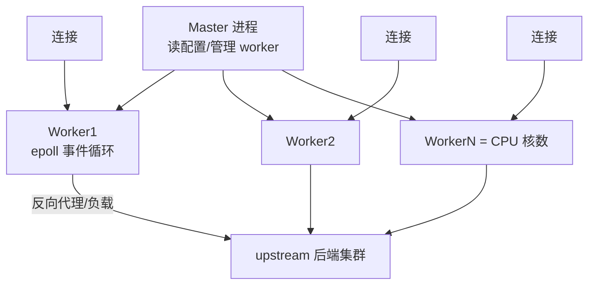

# Nginx（Web 服务器 / 反向代理 / 负载均衡）

> 互联网流量入口的「看门人」：静态资源、反向代理、负载均衡、HTTPS 终结、限流缓存，从单机到云原生全部绕不开它。本文讲透核心机制（事件驱动、worker 模型）、六大核心用法与生产调优排障。
> 开源参考：[nginx/nginx](https://github.com/nginx/nginx)（C，BSD 2-Clause，高并发 Web 服务器事实标准）、[OpenResty](https://github.com/openresty/openresty)（Nginx + Lua，动态化扩展）。

---

## 〇、本体介绍（它是什么 / 适用场景 / 核心概念）

**它是什么**：Nginx 是高性能 **Web 服务器 + 反向代理 + 负载均衡**，基于事件驱动（epoll）与多 worker 进程模型，单机可抗十万级并发连接，是互联网流量入口的标配。

**解决什么痛点**：静态文件分发（性能）、后端服务负载均衡与故障摘除、HTTPS 统一终结、跨域/限流/缓存/灰度等流量治理——这些都要在「入口层」统一做，Nginx 以极低资源占用完成。

**核心概念**：Master/Worker 进程模型、事件驱动（epoll）、反向代理、upstream（上游池）、负载均衡策略（轮询/IP Hash/最少连接）、location 匹配、rewrite、SSL 终结、限流（limit_req/limit_conn）、缓存（proxy_cache）、keepalive、Linux 系统调优（worker_connections/file 数）。

**适用场景**：静态站点、反向代理网关、负载均衡、HTTPS 终结、网关微服务入口（常配合网关如 Spring Cloud Gateway 做南北向入口）。
**不适用**：业务逻辑编排（用 API 网关/应用层）、超高动态计算（交给后端）、替代 L4 大规模四层负载（可用 LVS/云 LB）。

---

## 一、核心架构：Master-Worker + 事件驱动



### 为什么 Nginx 快（面试必问）

1. **事件驱动非阻塞**：一个 worker 用 epoll 同时管理成千上万个连接，无「一连接一线程」的资源浪费。
2. **多 worker = CPU 核数**：每个 worker 单线程事件循环，避免进程切换和锁竞争；Master 只负责管理（reload 平滑、worker 拉起）。
3. **零拷贝（sendfile）**：静态文件直接从磁盘页缓存送到网卡，不经用户态。
4. **异步 IO**：大文件/日志用 aio，不阻塞事件循环。
5. **模块化架构**：`--with-http_*` 编译期裁剪，核心路径极简。

---

## 二、六大核心用法（必须会写）

### 2.1 静态资源服务

```nginx
server {
    listen 80;
    server_name static.example.com;
    root /data/www;
    location / { try_files $uri $uri/ /index.html; }   # SPA 路由回退
    location ~* \.(js|css|png|jpg)$ { expires 7d; }    # 长缓存 + 强缓存
}
```

### 2.2 反向代理 + 负载均衡

```nginx
upstream backend {
    least_conn;              # 负载策略：轮询(默认)/ip_hash/least_conn/一致性哈希
    server 10.0.0.1:8080 weight=3;   # 权重
    server 10.0.0.2:8080;
    keepalive 32;            # 与后端复用长连接
}
server {
    listen 80;
    location /api/ {
        proxy_pass http://backend;
        proxy_set_header Host $host;
        proxy_set_header X-Real-IP $remote_addr;
        proxy_set_header X-Forwarded-For $proxy_add_x_forwarded_for;
        proxy_read_timeout 30s;
    }
}
```

### 2.3 负载均衡策略对比

| 策略 | 行为 | 适用 |
|------|------|------|
| round-robin（默认） | 轮流分发（可配 weight） | 通用 |
| ip_hash | 按客户端 IP 哈希固定后端 | 需要会话粘性（老 session） |
| least_conn | 发给活跃连接最少的后端 | 后端处理时长不均 |
| hash $request_uri | 一致性哈希 | 缓存亲和（CDN/网关） |
| upstream 健康检查 | 主动/被动探测，失败自动摘除 | 高可用必备 |

### 2.4 HTTPS 终结

```nginx
server {
    listen 443 ssl http2;
    server_name api.example.com;
    ssl_certificate     /etc/nginx/cert/fullchain.pem;
    ssl_certificate_key /etc/nginx/cert/privkey.pem;
    ssl_protocols TLSv1.2 TLSv1.3;
    ssl_session_cache shared:SSL:10m;      # 会话复用减握手开销
    ssl_session_tickets on;
}
```

- 职责：证书管理与 TLS 握手在 Nginx 一层完成，后端走明文内网（或 mTLS）。

### 2.5 限流与并发限制（网关必备）

```nginx
limit_req_zone $binary_remote_addr zone=api:10m rate=10r/s;   # 漏桶
location /api/ {
    limit_req zone=api burst=20 nodelay;    # burst 突发缓冲 + nodelay
    limit_conn_zone $binary_remote_addr zone=conn:10m;
    limit_conn conn 10;                     # 单 IP 并发连接上限
}
```

- `limit_req` 漏桶算法限 QPS；`limit_conn` 限并发连接；配合 `limit_req_status 429` 优雅拒绝。

### 2.6 缓存（proxy_cache）

```nginx
proxy_cache_path /data/cache levels=1:2 keys_zone=mycache:50m max_size=10g inactive=60m;
location / {
    proxy_cache mycache;
    proxy_cache_valid 200 10m;       # 200 缓存 10 分钟
    proxy_cache_key $scheme$host$uri; # 缓存键
    proxy_cache_bypass $cookie_nocache; # 可绕过
}
```

- 适合：热点只读接口、静态化页面；注意缓存键设计与失效策略。

---

## 三、面试高频知识点

### 3.1 Nginx 与 Apache/其他对比

| 维度 | Nginx | Apache | Caddy | OpenResty |
|------|-------|--------|-------|-----------|
| 模型 | 事件驱动（epoll） | 进程/线程模型 | 事件驱动 | Nginx + Lua |
| 并发 | 十万级 | 万级 | 十万级 | 十万级 + 业务 |
| 配置 | 原生（稍繁琐） | 原生 | 极简 | Lua 编程 |
| 扩展 | 编译模块 | 动态模块丰富 | 插件 | **Lua 生态** |
| 适用 | 反向代理/静态 | 传统 Web/动态 | 个人/快速起步 | 网关/流量编排 |

### 3.2 高频概念题

- **正向代理 vs 反向代理**：正向代理替「客户端」访问外部（科学上网/爬虫代理）；反向代理替「服务端」接收请求再转发内部（用户感知不到后端）。
- **worker 进程数 = CPU 核数**：太多增加切换开销，太少吃不满多核。
- **keepalive 作用**：客户端侧 `keepalive_timeout` 保持长连接减少 TCP 握手；upstream `keepalive` 复用与后端连接。
- **reload 原理**：`nginx -s reload` 不中断连接——旧 worker 服务完存量连接后退出，新 worker 用新配置接管。
- **动静分离**：静态资源直接 Nginx 返回（sendfile+缓存），动态请求反代到后端。

### 3.3 常见错误与排查

| 现象 | 原因与处理 |
|------|-----------|
| 502 Bad Gateway | 后端未启动/超时 → 查 upstream 与后端日志；`proxy_*_timeout` 过小 |
| 504 Gateway Timeout | 后端处理超时 → 调大 `proxy_read_timeout` 或优化后端 |
| 499 | 客户端提前断开（`$request_time` 看耗时）→ 多半是后端慢 |
| 429 | 触发限流（limit_req/limit_conn）→ 调速率或确认是否被攻击 |
| 404 静态资源 | root/location 匹配问题 → `try_files` 与 `alias` 的区别 |
| 连接数满 | `worker_connections`、系统 `ulimit -n` 文件描述符限制 |
| 缓存不生效 | `proxy_cache` 配置在错误的 location、缓存键不一致 |

---

## 四、生产调优清单（Linux + Nginx）

```nginx
# nginx.conf 核心调优
worker_processes auto;                 # = CPU 核数
worker_rlimit_nofile 65535;            # 单 worker 文件描述符
events {
    worker_connections 65535;          # 单 worker 连接数
    use epoll;
    multi_accept on;
}
keepalive_timeout 65;
sendfile on;
tcp_nopush on;                         # 减少小包
gzip on;
gzip_types text/plain text/css application/json application/javascript;
```

```text
# 系统层
sysctl -w net.core.somaxconn=65535     # accept 队列
sysctl -w net.ipv4.tcp_tw_reuse=1      # TIME_WAIT 复用
ulimit -n 65535                        # 文件描述符
```

- 压测验证：`ab` / `wrk` 看 QPS、错误率、`$request_time` 分位线；关注 `nginx_status` 的 `accepts/handled` 与 active 连接。

---

## 五、云原生时代的 Nginx

- **K8s Ingress Controller（Nginx 系）**：用 Nginx 做南北向入口 + 七层路由（ingress-nginx 或 APISIX 系）。
- **服务网格边车**：Envoy 取代 Nginx 做东西向流量（详见「云原生/ServiceMesh」）。
- **OpenResty / APISIX**：Nginx 的 Lua 化变体，把入口做成「可编程网关」（路由、鉴权、限流、灰度一体）。
- **定位变化**：Nginx 仍是「南北向入口」绝对主力；东西向（服务间）被 Envoy/Istio 接管；应用层编排交给 API 网关。

---

## 面试高频问题（20+ 条）

1. **Nginx 为什么性能高？** 事件驱动（epoll）单线程处理海量连接、worker=CPU 核数避免锁竞争、sendfile 零拷贝、异步 IO、模块化精简。

2. **Master 和 Worker 怎么协作？** Master 管配置/信号/reload/拉起 worker；Worker 各自事件循环处理请求；reload 时旧 worker 服务完存量连接优雅退出。

3. **正向代理和反向代理区别？** 正向代理代理客户端（对外访问）；反向代理代理服务端（对内转发），客户端感知不到后端存在。

4. **负载均衡策略？** 轮询（默认）、权重轮询、ip_hash（会话粘性）、least_conn（最少连接）、hash（一致性哈希缓存亲和）；配合健康检查自动摘除故障节点。

5. **502/504 分别什么原因？** 502：后端连不上/拒绝/没启动；504：后端处理超时（proxy_read_timeout）。定位靠后端日志 + `$upstream_status`。

6. **location 匹配优先级？** `=` 精确 > `^~` 前缀优先 > 正则 `~*` > 普通前缀（最长匹配）。

7. **root 和 alias 区别？** root 拼接完整路径（root /data + /img/a.png → /data/img/a.png）；alias 替换路径前缀（alias /data + /img/a.png → /data/a.png）。

8. **怎么实现限流？** limit_req_zone 定义速率（漏桶）+ burst 突发 + nodelay；limit_conn 限并发；可按 IP/URI/变量定制 key。

9. **怎么实现灰度？** 按 cookie/header/IP 分流到不同 upstream（map + upstream 多组）；或 OpenResty 按比例放量。

10. **HTTPS 怎么终结？** Nginx 挂证书做 TLS 握手，与后端走 HTTP 内网；ssl_session_cache 复用会话减少握手开销；支持 OCSP/HTTP2。

11. **如何保证高可用？** Nginx 多实例 + keepalived/云 LB 虚拟 IP 漂移；upstream 健康检查（主动/被动）+ 后端多副本。

12. **keepalive 意义？** 客户端侧省 TCP 握手；upstream 侧 `keepalive N` 复用到后端的连接（配合后端 keepalive 参数），显著降延迟。

13. **动静分离怎么做？** 静态资源 location 直接 root/sendfile/expires 缓存；动态 location 反代后端；CDN 前置可进一步加速。

14. **反向代理如何透传真实 IP？** `X-Real-IP`、`X-Forwarded-For`、`X-Forwarded-Proto`；后端（Tomcat/应用）读 header 记日志/防伪造（信任 Nginx 层）。

15. **Nginx reload 会丢请求吗？** 不会：平滑重启，旧 worker 处理完存量连接退出，新连接用新配置。

16. **单机能抗多少并发？** 连接数级：worker_connections × worker 数（10 万级）；QPS 取决于业务（静态几万~十几万，动态看上游）。

17. **配置热生效？** `nginx -s reload` 重读配置平滑生效；修改 root/upstream 无需重启；`nginx -t` 先校验。

18. **日志格式与排查？** log_format 自定义（含 $upstream_status、$request_time、$upstream_response_time）；慢请求用 `$request_time > 阈值` 定位。

19. **Nginx 和 LVS/云 LB 分工？** L4（LVS/云 LB）做 IP/端口级流量分发，L7（Nginx）做 URL/Header 级路由治理；常「L4 前置 + L7 后置」。

20. **Ingress/Service Mesh 场景？** K8s 用 ingress-nginx/APISIX 做南北向；东西向服务间流量用 Envoy（Service Mesh）；Nginx 仍是南北向主力。

21. **如何定位 Nginx 性能瓶颈？** 依次看：worker_connections 满没满、CPU/负载、$request_time vs $upstream_response_time（慢在 Nginx 还是后端）、网络（带宽/小包）、系统参数（somaxconn/ulimit）。

22. **配置一个反向代理需要什么？** upstream（后端组 + 策略 + 健康检查）+ server（listen + server_name）+ location（proxy_pass + header 透传 + 超时/缓存/限流）。

---

## 六、与其他板块的关系

- 和「**基础知识/中间件/API网关**」：Nginx 是「入口层（南北向）」，网关（Spring Cloud Gateway/APISIX）做「应用层路由治理」，常串联使用。
- 和「**基础知识/网络**」「**网络协议深挖**」：Nginx 是 TCP/HTTP、keepalive、TLS、零拷贝原理的最佳实践观察点。
- 和「**云原生/Kubernetes核心**」：K8s Ingress 常由 Nginx 系实现（ingress-nginx），etcd 存配置、Nginx 跑流量。
- 和「**云原生/ServiceMesh**」：Nginx 与 Envoy 的分工对比（南北向 vs 东西向）。
- 和「**Linux排查**」：Nginx 性能排查（ulimit/somaxconn/慢请求）是典型系统问题。

---

## 七、速查表

| 项 | 结论 |
|----|------|
| 类型 | Web 服务器 / 反向代理 / 负载均衡 |
| 模型 | Master + Worker（=CPU 核）事件驱动 epoll |
| 性能 | 十万级并发连接；静态文件零拷贝 |
| 负载策略 | 轮询 / 权重 / ip_hash / least_conn / hash |
| 治理能力 | HTTPS 终结 / 限流限连 / 缓存 / 灰度 / 健康检查 |
| 云原生 | K8s Ingress 主力，东西向让位 Envoy |
| 许可证 | BSD 2-Clause |
| 一句话 | 「流量入口看门人」——静态分发、反代负载、治理能力一肩挑 |
