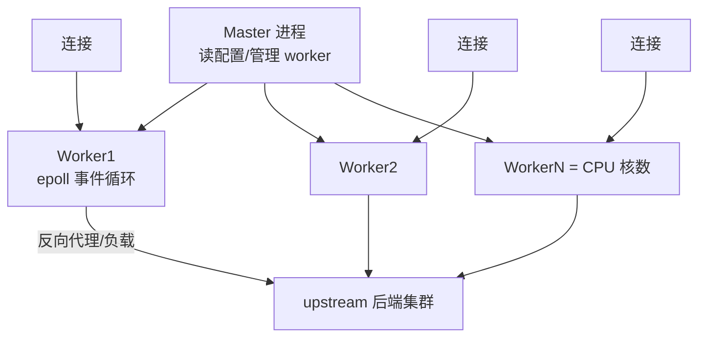

# Nginx（Web 服务器 / 反向代理 / 负载均衡）

> 互联网流量入口的「看门人」：静态资源、反向代理、负载均衡、HTTPS 终结、限流缓存，从单机到云原生全部绕不开它。本文讲透核心机制（事件驱动、worker 模型）、六大核心用法与生产调优排障。
> 开源参考：[nginx/nginx](https://github.com/nginx/nginx)（C，BSD 2-Clause，高并发 Web 服务器事实标准）、[OpenResty](https://github.com/openresty/openresty)（Nginx + Lua，动态化扩展）。

---

## 〇、本体介绍（它是什么 / 适用场景 / 核心概念）

**它是什么**：Nginx 是高性能 **Web 服务器 + 反向代理 + 负载均衡**，基于事件驱动（epoll）与多 worker 进程模型，单机可抗十万级并发连接，是互联网流量入口的标配。

**解决什么痛点**：静态文件分发（性能）、后端服务负载均衡与故障摘除、HTTPS 统一终结、跨域/限流/缓存/灰度等流量治理——这些都要在「入口层」统一做，Nginx 以极低资源占用完成。

**核心概念**：Master/Worker 进程模型、事件驱动（epoll）、反向代理、upstream（上游池）、负载均衡策略（轮询/IP Hash/最少连接）、location 匹配、rewrite、SSL 终结、限流（limit_req/limit_conn）、缓存（proxy_cache）、keepalive、Linux 系统调优（worker_connections/file 数）。

**适用场景**：静态站点、反向代理网关、负载均衡、HTTPS 终结、网关微服务入口（常配合网关如 Spring Cloud Gateway 做南北向入口）。
**不适用**：业务逻辑编排（用 API 网关/应用层）、超高动态计算（交给后端）、替代 L4 大规模四层负载（可用 LVS/云 LB）。

---

## 一、核心架构：Master-Worker + 事件驱动



### 为什么 Nginx 快（面试必问）

1. **事件驱动非阻塞**：一个 worker 用 epoll 同时管理成千上万个连接，无「一连接一线程」的资源浪费。
2. **多 worker = CPU 核数**：每个 worker 单线程事件循环，避免进程切换和锁竞争；Master 只负责管理（reload 平滑、worker 拉起）。
3. **零拷贝（sendfile）**：静态文件直接从磁盘页缓存送到网卡，不经用户态。
4. **异步 IO**：大文件/日志用 aio，不阻塞事件循环。
5. **模块化架构**：`--with-http_*` 编译期裁剪，核心路径极简。

---

## 二、六大核心用法（必须会写）

### 2.1 静态资源服务

```nginx
server {
    listen 80;
    server_name static.example.com;
    root /data/www;
    location / { try_files $uri $uri/ /index.html; }   # SPA 路由回退
    location ~* \.(js|css|png|jpg)$ { expires 7d; }    # 长缓存 + 强缓存
}
```

### 2.2 反向代理 + 负载均衡

```nginx
upstream backend {
    least_conn;              # 负载策略：轮询(默认)/ip_hash/least_conn/一致性哈希
    server 10.0.0.1:8080 weight=3;   # 权重
    server 10.0.0.2:8080;
    keepalive 32;            # 与后端复用长连接
}
server {
    listen 80;
    location /api/ {
        proxy_pass http://backend;
        proxy_set_header Host $host;
        proxy_set_header X-Real-IP $remote_addr;
        proxy_set_header X-Forwarded-For $proxy_add_x_forwarded_for;
        proxy_read_timeout 30s;
    }
}
```

### 2.3 负载均衡策略对比

| 策略 | 行为 | 适用 |
|------|------|------|
| round-robin（默认） | 轮流分发（可配 weight） | 通用 |
| ip_hash | 按客户端 IP 哈希固定后端 | 需要会话粘性（老 session） |
| least_conn | 发给活跃连接最少的后端 | 后端处理时长不均 |
| hash $request_uri | 一致性哈希 | 缓存亲和（CDN/网关） |
| upstream 健康检查 | 主动/被动探测，失败自动摘除 | 高可用必备 |

### 2.4 HTTPS 终结

```nginx
server {
    listen 443 ssl http2;
    server_name api.example.com;
    ssl_certificate     /etc/nginx/cert/fullchain.pem;
    ssl_certificate_key /etc/nginx/cert/privkey.pem;
    ssl_protocols TLSv1.2 TLSv1.3;
    ssl_session_cache shared:SSL:10m;      # 会话复用减握手开销
    ssl_session_tickets on;
}
```

- 职责：证书管理与 TLS 握手在 Nginx 一层完成，后端走明文内网（或 mTLS）。

### 2.5 限流与并发限制（网关必备）

```nginx
limit_req_zone $binary_remote_addr zone=api:10m rate=10r/s;   # 漏桶
location /api/ {
    limit_req zone=api burst=20 nodelay;    # burst 突发缓冲 + nodelay
    limit_conn_zone $binary_remote_addr zone=conn:10m;
    limit_conn conn 10;                     # 单 IP 并发连接上限
}
```

- `limit_req` 漏桶算法限 QPS；`limit_conn` 限并发连接；配合 `limit_req_status 429` 优雅拒绝。

### 2.6 缓存（proxy_cache）

```nginx
proxy_cache_path /data/cache levels=1:2 keys_zone=mycache:50m max_size=10g inactive=60m;
location / {
    proxy_cache mycache;
    proxy_cache_valid 200 10m;       # 200 缓存 10 分钟
    proxy_cache_key $scheme$host$uri; # 缓存键
    proxy_cache_bypass $cookie_nocache; # 可绕过
}
```

- 适合：热点只读接口、静态化页面；注意缓存键设计与失效策略。

---

## 三、面试高频知识点

### 3.1 Nginx 与 Apache/其他对比

| 维度 | Nginx | Apache | Caddy | OpenResty |
|------|-------|--------|-------|-----------|
| 模型 | 事件驱动（epoll） | 进程/线程模型 | 事件驱动 | Nginx + Lua |
| 并发 | 十万级 | 万级 | 十万级 | 十万级 + 业务 |
| 配置 | 原生（稍繁琐） | 原生 | 极简 | Lua 编程 |
| 扩展 | 编译模块 | 动态模块丰富 | 插件 | **Lua 生态** |
| 适用 | 反向代理/静态 | 传统 Web/动态 | 个人/快速起步 | 网关/流量编排 |

### 3.2 高频概念题

- **正向代理 vs 反向代理**：正向代理替「客户端」访问外部（科学上网/爬虫代理）；反向代理替「服务端」接收请求再转发内部（用户感知不到后端）。
- **worker 进程数 = CPU 核数**：太多增加切换开销，太少吃不满多核。
- **keepalive 作用**：客户端侧 `keepalive_timeout` 保持长连接减少 TCP 握手；upstream `keepalive` 复用与后端连接。
- **reload 原理**：`nginx -s reload` 不中断连接——旧 worker 服务完存量连接后退出，新 worker 用新配置接管。
- **动静分离**：静态资源直接 Nginx 返回（sendfile+缓存），动态请求反代到后端。

### 3.3 常见错误与排查

| 现象 | 原因与处理 |
|------|-----------|
| 502 Bad Gateway | 后端未启动/超时 → 查 upstream 与后端日志；`proxy_*_timeout` 过小 |
| 504 Gateway Timeout | 后端处理超时 → 调大 `proxy_read_timeout` 或优化后端 |
| 499 | 客户端提前断开（`$request_time` 看耗时）→ 多半是后端慢 |
| 429 | 触发限流（limit_req/limit_conn）→ 调速率或确认是否被攻击 |
| 404 静态资源 | root/location 匹配问题 → `try_files` 与 `alias` 的区别 |
| 连接数满 | `worker_connections`、系统 `ulimit -n` 文件描述符限制 |
| 缓存不生效 | `proxy_cache` 配置在错误的 location、缓存键不一致 |

---

## 四、生产调优清单（Linux + Nginx）

```nginx
# nginx.conf 核心调优
worker_processes auto;                 # = CPU 核数
worker_rlimit_nofile 65535;            # 单 worker 文件描述符
events {
    worker_connections 65535;          # 单 worker 连接数
    use epoll;
    multi_accept on;
}
keepalive_timeout 65;
sendfile on;
tcp_nopush on;                         # 减少小包
gzip on;
gzip_types text/plain text/css application/json application/javascript;
```

```text
# 系统层
sysctl -w net.core.somaxconn=65535     # accept 队列
sysctl -w net.ipv4.tcp_tw_reuse=1      # TIME_WAIT 复用
ulimit -n 65535                        # 文件描述符
```

- 压测验证：`ab` / `wrk` 看 QPS、错误率、`$request_time` 分位线；关注 `nginx_status` 的 `accepts/handled` 与 active 连接。

---

## 五、云原生时代的 Nginx

- **K8s Ingress Controller（Nginx 系）**：用 Nginx 做南北向入口 + 七层路由（ingress-nginx 或 APISIX 系）。
- **服务网格边车**：Envoy 取代 Nginx 做东西向流量（详见「云原生/ServiceMesh」）。
- **OpenResty / APISIX**：Nginx 的 Lua 化变体，把入口做成「可编程网关」（路由、鉴权、限流、灰度一体）。
- **定位变化**：Nginx 仍是「南北向入口」绝对主力；东西向（服务间）被 Envoy/Istio 接管；应用层编排交给 API 网关。

---

## 面试高频问题（20+ 条）

1. **Nginx 为什么性能高？** 事件驱动（epoll）单线程处理海量连接、worker=CPU 核数避免锁竞争、sendfile 零拷贝、异步 IO、模块化精简。

2. **Master 和 Worker 怎么协作？** Master 管配置/信号/reload/拉起 worker；Worker 各自事件循环处理请求；reload 时旧 worker 服务完存量连接优雅退出。

3. **正向代理和反向代理区别？** 正向代理代理客户端（对外访问）；反向代理代理服务端（对内转发），客户端感知不到后端存在。

4. **负载均衡策略？** 轮询（默认）、权重轮询、ip_hash（会话粘性）、least_conn（最少连接）、hash（一致性哈希缓存亲和）；配合健康检查自动摘除故障节点。

5. **502/504 分别什么原因？** 502：后端连不上/拒绝/没启动；504：后端处理超时（proxy_read_timeout）。定位靠后端日志 + `$upstream_status`。

6. **location 匹配优先级？** `=` 精确 > `^~` 前缀优先 > 正则 `~*` > 普通前缀（最长匹配）。

7. **root 和 alias 区别？** root 拼接完整路径（root /data + /img/a.png → /data/img/a.png）；alias 替换路径前缀（alias /data + /img/a.png → /data/a.png）。

8. **怎么实现限流？** limit_req_zone 定义速率（漏桶）+ burst 突发 + nodelay；limit_conn 限并发；可按 IP/URI/变量定制 key。

9. **怎么实现灰度？** 按 cookie/header/IP 分流到不同 upstream（map + upstream 多组）；或 OpenResty 按比例放量。

10. **HTTPS 怎么终结？** Nginx 挂证书做 TLS 握手，与后端走 HTTP 内网；ssl_session_cache 复用会话减少握手开销；支持 OCSP/HTTP2。

11. **如何保证高可用？** Nginx 多实例 + keepalived/云 LB 虚拟 IP 漂移；upstream 健康检查（主动/被动）+ 后端多副本。

12. **keepalive 意义？** 客户端侧省 TCP 握手；upstream 侧 `keepalive N` 复用到后端的连接（配合后端 keepalive 参数），显著降延迟。

13. **动静分离怎么做？** 静态资源 location 直接 root/sendfile/expires 缓存；动态 location 反代后端；CDN 前置可进一步加速。

14. **反向代理如何透传真实 IP？** `X-Real-IP`、`X-Forwarded-For`、`X-Forwarded-Proto`；后端（Tomcat/应用）读 header 记日志/防伪造（信任 Nginx 层）。

15. **Nginx reload 会丢请求吗？** 不会：平滑重启，旧 worker 处理完存量连接退出，新连接用新配置。

16. **单机能抗多少并发？** 连接数级：worker_connections × worker 数（10 万级）；QPS 取决于业务（静态几万~十几万，动态看上游）。

17. **配置热生效？** `nginx -s reload` 重读配置平滑生效；修改 root/upstream 无需重启；`nginx -t` 先校验。

18. **日志格式与排查？** log_format 自定义（含 $upstream_status、$request_time、$upstream_response_time）；慢请求用 `$request_time > 阈值` 定位。

19. **Nginx 和 LVS/云 LB 分工？** L4（LVS/云 LB）做 IP/端口级流量分发，L7（Nginx）做 URL/Header 级路由治理；常「L4 前置 + L7 后置」。

20. **Ingress/Service Mesh 场景？** K8s 用 ingress-nginx/APISIX 做南北向；东西向服务间流量用 Envoy（Service Mesh）；Nginx 仍是南北向主力。

21. **如何定位 Nginx 性能瓶颈？** 依次看：worker_connections 满没满、CPU/负载、$request_time vs $upstream_response_time（慢在 Nginx 还是后端）、网络（带宽/小包）、系统参数（somaxconn/ulimit）。

22. **配置一个反向代理需要什么？** upstream（后端组 + 策略 + 健康检查）+ server（listen + server_name）+ location（proxy_pass + header 透传 + 超时/缓存/限流）。

---

## 六、Nginx 事件驱动架构深入

### 6.1 事件驱动模型详解

```
Nginx 事件循环（单 Worker 内部）：

while (true) {
    // 1. 更新定时器
    timer = ngx_event_find_timer();

    // 2. IO 多路复用（epoll_wait 阻塞等待事件）
    events = epoll_wait(epfd, event_list, max_events, timer);

    // 3. 处理 IO 事件
    for (i = 0; i < events; i++) {
        if (event[i] == ACCEPT) {
            // 新连接事件
            ngx_event_accept(cycle);
        } else if (event[i] == READ) {
            // 可读事件（request header/body）
            ngx_http_process_request(cycle);
        } else if (event[i] == WRITE) {
            // 可写事件（sendfile 响应）
            ngx_http_write_handler(cycle);
        } else if (event[i] == TIMER) {
            // 定时器事件（keepalive 超时清理）
            ngx_event_expire_timers();
        }
    }

    // 4. 后处理（延迟事件、post 操作）
    ngx_event_process_posted(cycle);
}
```

### 6.2 Worker 进程模型

```
Master-Worker 协作机制：

Master 进程：
  ├── 读取/验证配置（nginx -t）
  ├── 创建 Socket 并 listen
  ├── Fork Worker 进程
  ├── 管理 Worker 生命周期（crash 自动重启）
  ├── 接收信号：SIGHUP → reload（平滑重启）
  │                       SIGTERM → graceful shutdown
  │                       SIGUSR1 → reopen 日志文件
  └── 不处理任何连接

Worker 进程（= CPU 核数）：
  ├── 独立进程，互不影响
  ├── 各自运行 epoll 事件循环
  ├── 共享 Listen Socket（accept 竞争）
  ├── 处理所有连接（读/写/代理/缓存）
  └── 父进程 fork 后独立运行，crash 不影响其他 Worker

连接处理流程：
  1. Client 发起连接 → Kernel 放入 accept queue
  2. 多个 Worker 的 epoll 同时监听 Listen Socket
  3. 哪个 Worker 的 epoll_wait 先醒来 → 哪个 Worker accept
  4. 该 Worker 负责整个连接生命周期（读请求→处理→写响应→关闭）
```

### 6.3 连接处理与 Keepalive

```nginx
# HTTP Keepalive 配置（客户端侧）
keepalive_timeout 65;           # 客户端 keepalive 超时（秒）
keepalive_requests 1000;        # 单连接最大请求数

# Upstream Keepalive（后端侧）
upstream backend {
    server 10.0.0.1:8080;
    keepalive 32;               # 每 Worker 维持 32 个到后端的空闲长连接
    keepalive_requests 100;     # 单连接最大复用次数
    keepalive_timeout 60s;      # 空闲连接超时
}

# 连接复用减少开销：
#   无 keepalive：每个请求 TCP 三次握手 + SSL 握手（200ms+）
#   有 keepalive：复用 TCP 连接，延迟降低 50%+
```

---

## 七、负载均衡算法深度对比

| 算法 | 配置 | 原理 | 优点 | 缺点 | 适用场景 |
|------|------|------|------|------|----------|
| **round-robin** | `least_conn;` 不配即默认 | 按顺序轮流分发 | 简单均匀 | 不考虑后端负载 | 后端处理时间相近 |
| **weight** | `server 10.0.0.1:8080 weight=3;` | 按权重比例分发 | 可分配不同流量比例 | 配置复杂 | 混合机型部署 |
| **ip_hash** | `ip_hash;` | 客户端 IP 哈希固定后端 | 会话粘性 | 热点 IP 不均 | 遗留 Session 场景 |
| **least_conn** | `least_conn;` | 发给当前活跃连接最少的后端 | 自适应负载 | 短连接效果好，长连接差 | 后端处理时间不均 |
| **hash $uri** | `hash $uri consistent;` | 一致性哈希 | 缓存亲和 | 哈希冲突 | CDN/缓存场景 |
| **hash $request** | `hash $request_uri consistent;` | 按请求哈希 | 分布均匀 | 无负载感知 | 无状态服务 |
| **least_time** | `least_time last_received_time;` | 选响应最快的后端 | 自适应最优 | 需记录响应时间 | 对延迟敏感 |
| **random** | `random two least_conn;` | 随机选两个取负载低的 | 避免全局竞争 | 理论最优需随机数 | 超大规模集群 |

---

## 八、SSL/TLS 优化与安全加固

```nginx
# SSL/TLS 优化配置
ssl_protocols TLSv1.2 TLSv1.3;              # 仅允许安全版本
ssl_ciphers ECDHE-ECDSA-AES128-GCM-SHA256:ECDHE-RSA-AES128-GCM-SHA256:ECDHE-ECDSA-AES256-GCM-SHA384;
ssl_prefer_server_ciphers on;                # 服务端决定加密套件
ssl_session_cache shared:SSL:50m;            # 会话缓存（减少握手）
ssl_session_timeout 1d;                      # 会话超时
ssl_session_tickets on;                      # Ticket 机制（跨重启复用）
ssl_buffer_size 16k;                         # 缓冲区大小（影响 TTFB）

# OCSP Stapling（加速证书验证）
ssl_stapling on;
ssl_stapling_verify on;
resolver 8.8.8.8 114.114.114.114 valid=300s;

# HTTP/2 优化
http2_max_concurrent_streams 128;            # 并发流数
http2_recv_buffer_size 256k;

# 安全头
add_header Strict-Transport-Security "max-age=63072000; includeSubDomains; preload";
add_header X-Content-Type-Options nosniff;
add_header X-Frame-Options SAMEORIGIN;
add_header X-XSS-Protection "1; mode=block";
```

---

## 九、gzip/brotli 压缩与 open_file_cache

### 9.1 压缩配置

```nginx
# Gzip 压缩
gzip on;
gzip_vary on;                    # 添加 Vary: Accept-Encoding
gzip_proxied any;                # 代理响应也压缩
gzip_comp_level 6;               # 压缩级别（1-9，6 最优）
gzip_min_length 256;             # 最小压缩长度
gzip_types
    text/plain
    text/css
    text/xml
    text/javascript
    application/json
    application/javascript
    application/xml
    image/svg+xml;

# Brotli 压缩（需 ngx_brotli 模块，压缩率比 gzip 高 15-25%）
brotli on;
brotli_comp_level 6;
brotli_types text/plain text/css application/json application/javascript
             text/xml application/xml image/svg+xml;

# 压缩效果：
#   gzip level 6：CPU 换 IO（推荐）
#   brotli level 6：比 gzip 压缩率高 15-25%
#   静态文件预压缩：gzip_static on; brotli_static on;
#     → 预生成 .gz/.br 文件，零 CPU 开销
```

### 9.2 open_file_cache（文件缓存）

```nginx
# open_file_cache：缓存文件描述符、大小、修改时间
open_file_cache max=10000 inactive=60s;
#   max=10000: 最多缓存 10000 个文件
#   inactive=60s: 60 秒未访问自动清除

open_file_cache_valid 30s;
#   每 30 秒重新验证缓存条目（文件是否被修改）

open_file_cache_min_uses 2;
#   60 秒内至少被访问 2 次才缓存（防止冷文件占用）

open_file_cache_errors on;
#   缓存文件查找错误（如 404），避免重复 stat

# 效果：静态文件场景减少 30-50% 的 stat 系统调用
```

---

## 十、limit_req/limit_conn 深度与 proxy_buffer 调优

### 10.1 限流深入

```nginx
# limit_req：漏桶算法限流
limit_req_zone $binary_remote_addr zone=login:10m rate=5r/s;
#   rate=5r/s: 每秒 5 个请求（允许突发）
#   zone=login:10m: 共享内存区域 10MB（约 16 万个 IP）

location /login {
    limit_req zone=login burst=10 nodelay;
    #   burst=10: 允许突发 10 个请求（排队）
    #   nodelay: 突发请求不排队直接处理（超过 burst 返回 503）
    #   不加 nodelay: 超过 rate 的请求排队等待
}

# limit_req_status: 自定义拒绝状态码
limit_req_status 429;   # 返回 429 Too Many Requests

# limit_conn：并发连接限制
limit_conn_zone $binary_remote_addr zone=conn_per_ip:10m;
limit_conn_zone $server_name zone=conn_total:10m;

location /download {
    limit_conn conn_per_ip 5;      # 单 IP 最大 5 个并发连接
    limit_conn conn_total 1000;    # 全站最大 1000 个并发连接
    limit_rate 500k;               # 单连接限速 500KB/s
    limit_rate_after 10m;          # 前 10MB 不限速
}

# 分布式限流（多 Nginx 节点）
# 使用 lua-resty-limit-traffic + Redis 做分布式计数器
```

### 10.2 proxy_buffer 调优

```nginx
# proxy_buffer：控制 Nginx 与后端之间的缓冲
location /api/ {
    proxy_pass http://backend;

    # 缓冲区大小
    proxy_buffer_size 16k;           # 响应头缓冲区
    proxy_buffers 4 32k;             # 响应体缓冲区（4 个 × 32KB）
    proxy_busy_buffers_size 64k;     # 在忙碌状态下的最大缓冲

    # 临时文件
    proxy_temp_file_write_size 64k;
    proxy_temp_path /tmp/nginx_proxy_temp 1 2;

    # 行为控制
    proxy_buffering on;              # 开启缓冲（默认开启）
    proxy_request_buffering on;      # 请求体缓冲

    # 优化建议：
    #   API 场景：缓冲区适当加大（减少磁盘 IO）
    #   大文件下载：关闭缓冲 proxy_buffering off;
    #   WebSocket：关闭缓冲 proxy_buffering off;
    #   监控：$upstream_buffered 看是否溢出到临时文件
}

# proxy_buffer 溢出问题排查：
#   症状：响应慢，Nginx 日志无报错
#   原因：后端响应过大，缓冲区不够，溢出到磁盘临时文件
#   解决：调大 proxy_buffers 或 proxy_buffer_size
```

---

## 十一、Upstream 健康检查与 API 网关模式

### 11.1 健康检查

```nginx
# 被动健康检查（默认）
upstream backend {
    server 10.0.0.1:8080 max_fails=3 fail_timeout=30s;
    #   max_fails=3: 连续失败 3 次标记为不可用
    #   fail_timeout=30s: 30 秒后重试
    server 10.0.0.2:8080 max_fails=3 fail_timeout=30s;
    server 10.0.0.3:8080 backup;  # 备用节点
}

# 主动健康检查（Nginx Plus 商业版 / OpenResty）
# 商业版配置
upstream backend {
    zone backend 64k;               # 共享内存
    server 10.0.0.1:8080;
    health_check interval=10s fails=3 passes=2 uri=/health;
    #   每 10 秒检查一次 /health 端点
    #   连续 3 次失败标记下线，连续 2 次成功恢复上线
}

# OpenResty 主动健康检查（lua-resty-upstream-healthcheck）
lua_shared_dict healthcheck 1m;
init_worker_by_lua_block {
    local hc = require("resty.upstream.healthcheck")
    local checker = hc.new({
        type = "http",
        http_req = "GET /health HTTP/1.1\r\nHost: localhost\r\n\r\n",
        timeout = 2,
        interval = 5000,
        falls = 3,
        rises = 2,
    })
    -- 注册后端
    checker:add_target("backend", "10.0.0.1", 8080)
    -- 定时检查
    ngx.timer.every(5, function()
        checker:check()
    end)
}
```

### 11.2 Nginx 作为 API 网关

```nginx
# API 网关模式：路由 + 鉴权 + 限流 + 灰度 + 熔断
upstream api_v1 {
    server 10.0.0.1:8080 weight=3;
    server 10.0.0.2:8080 weight=1;
    keepalive 64;
}
upstream api_v2 {
    server 10.0.0.3:8080;
    server 10.0.0.4:8080;
    keepalive 64;
}

map $http_x_api_version $backend {
    default api_v1;
    "2.0"   api_v2;
}

server {
    listen 443 ssl http2;
    server_name api.example.com;

    # 限流
    limit_req zone=api burst=20 nodelay;

    # 鉴权（OpenResty Lua）
    access_by_lua_block {
        local auth = require "auth"
        local ok, err = auth.verify_jwt(ngx.var.http_authorization)
        if not ok then
            ngx.status = 401
            ngx.say('{"error":"' .. err .. '"}')
            return ngx.exit(401)
        end
    }

    # 路由
    location /api/ {
        proxy_pass http://$backend;
        proxy_set_header Host $host;
        proxy_set_header X-Real-IP $remote_addr;
        proxy_set_header X-Forwarded-For $proxy_add_x_forwarded_for;
        proxy_set_header X-Forwarded-Proto $scheme;
    }

    # 灰度：按 Cookie 分流
    map $cookie_canary $canary_backend {
        default api_v1;
        "true"  api_v2;
    }
    location /canary/ {
        proxy_pass http://$canary_backend;
    }
}
```

---

## 十二、OpenResty/Lua 集成与性能压测

### 12.1 OpenResty 集成

```nginx
# OpenResty = Nginx + LuaJIT（可编程网关）
# Lua 执行阶段：
#   init_by_lua: 启动时（加载配置/路由表）
#   init_worker_by_lua: 每 Worker 启动（定时器/健康检查）
#   set_by_lua: 变量设置阶段
#   rewrite_by_lua: 重写阶段（鉴权/限流/路由）
#   access_by_lua: 访问阶段（权限检查）
#   content_by_lua: 内容生成（业务逻辑）
#   log_by_lua: 日志阶段（审计/上报）

# 示例：限流 + JWT 鉴权 + 路由
location /api/ {
    rewrite_by_lua_block {
        local limit = require "resty限流"
        local jwt = require "jwt验证"

        -- 限流检查
        local lim, err = limit.new("rate_limit", 100, 1)
        if not lim then ngx.exit(500) end
        local delay, err = lim:incoming(ngx.var.binary_remote_addr, true)
        if not delay then ngx.exit(429) end

        -- JWT 验证
        local token = ngx.var.http_authorization
        local payload, err = jwt.verify(token)
        if not payload then ngx.exit(401) end

        -- 动态路由
        ngx.var.upstream = payload.service or "default"
    }
    proxy_pass http://$upstream;
}
```

### 12.2 性能压测方法论

```bash
# 压测工具选择
#   wrk: 推荐（HTTP 基准压测）
#   ab: Apache Bench（简单快速）
#   wrk2: 带延迟直方图的 wrk
#   k6: 脚本化压测（Grafana 生态）

# wrk 压测示例
wrk -t12 -c400 -d30s --latency http://localhost/api/test
#   -t12: 12 个线程
#   -c400: 400 个并发连接
#   -d30s: 持续 30 秒
#   --latency: 输出延迟分布

# 压测关键指标：
#   Requests/sec: QPS（每秒请求数）
#   Latency 分布: P50/P90/P99/P999（尾延迟）
#   Transfer/sec: 吞吐量（带宽）
#   Socket errors: 连接错误（超时/拒绝/重置）

# 压测方法论：
#   1. 基线测试：无负载下性能
#   2. 递增负载：逐步增加并发，找到拐点
#   3. 持续高负载：找到内存泄漏/连接泄漏
#   4. 对比测试：配置变更前后对比

# Nginx 监控配合压测
curl http://localhost/nginx_status
# Active connections: 291
# server accepts handled requests
#  16630948 16630948 31070465
# Reading: 6 Writing: 179 Waiting: 106
#   accepts/handled 比值 = 1 说明无连接丢失
#   Reading: 正在读请求头的连接数
#   Writing: 正在写响应的连接数
#   Waiting: keepalive 空闲连接数
```

---

## 十三、Nginx Upstream Keepalive 深入

### 13.1 Keepalive 配置

```nginx
upstream backend {
    server 10.0.0.1:8080;
    server 10.0.0.2:8080;

    keepalive 32;               # 每 Worker 维持 32 个空闲长连接
    keepalive_requests 1000;     # 单连接最大复用次数
    keepalive_timeout 60s;       # 空闲连接超时
}

server {
    location /api/ {
        proxy_pass http://backend;
        proxy_http_version 1.1;              # 必须设为 1.1
        proxy_set_header Connection "";       # 清除 Connection: close
        proxy_set_header Host $host;
        proxy_set_header X-Real-IP $remote_addr;
    }
}
```

### 13.2 Keepalive 效果对比

| 维度 | 无 Keepalive | 有 Keepalive |
|------|-------------|-------------|
| TCP 握手 | 每次 3 次握手 | 首次握手，后续复用 |
| SSL 握手 | 每次 TLS 握手 | 首次握手，后续复用 |
| 延迟 | 200ms+（含握手） | 50-100ms（复用） |
| 吞吐 | 低 | 高 30-50% |
| 后端压力 | 高（频繁连接） | 低（连接复用） |

---

## 十四、Nginx Lua 脚本模式

### 14.1 OpenResty Lua 执行阶段

```nginx
# Lua 执行阶段：
#   init_by_lua: 启动时（加载配置/路由表）
#   init_worker_by_lua: 每 Worker 启动（定时器/健康检查）
#   set_by_lua: 变量设置阶段
#   rewrite_by_lua: 重写阶段（鉴权/限流/路由）
#   access_by_lua: 访问阶段（权限检查）
#   content_by_lua: 内容生成（业务逻辑）
#   log_by_lua: 日志阶段（审计/上报）

# 示例：限流 + JWT 鉴权 + 动态路由
location /api/ {
    rewrite_by_lua_block {
        local limit = require "resty限流"
        local jwt = require "jwt验证"

        -- 限流检查
        local lim, err = limit.new("rate_limit", 100, 1)
        if not lim then ngx.exit(500) end
        local delay, err = lim:incoming(ngx.var.binary_remote_addr, true)
        if not delay then ngx.exit(429) end

        -- JWT 验证
        local token = ngx.var.http_authorization
        local payload, err = jwt.verify(token)
        if not payload then ngx.exit(401) end

        -- 动态路由
        ngx.var.upstream = payload.service or "default"
    }
    proxy_pass http://$upstream;
}
```

### 14.2 Lua 共享字典

```nginx
lua_shared_dict rate_limit 10m;      # 限流计数器
lua_shared_dict healthcheck 1m;      # 健康检查状态
lua_shared_dict config_cache 5m;     # 配置缓存

init_worker_by_lua_block {
    -- 定时器：健康检查
    local function check_health()
        -- 检查后端健康状态
    end
    ngx.timer.every(5, check_health)
}
```

---

## 十五、Nginx auth_request

### 15.1 auth_request 原理

```nginx
# auth_request：将子请求转发到认证服务
location /api/ {
    auth_request /auth;
    auth_request_set $auth_user $upstream_http_x_auth_user;
    auth_request_set $auth_role $upstream_http_x_auth_role;

    proxy_pass http://backend;
    proxy_set_header X-Auth-User $auth_user;
    proxy_set_header X-Auth-Role $auth_role;
}

# 认证服务（内部子请求）
location = /auth {
    internal;
    proxy_pass http://auth-service:8080/auth;
    proxy_pass_request_body off;
    proxy_set_header Content-Length "";
    proxy_set_header X-Original-URI $request_uri;
}
```

### 15.2 auth_request 应用场景

| 场景 | 说明 |
|------|------|
| JWT 验证 | 验证 Token 有效性 |
| OAuth2 认证 | 验证 Access Token |
| RBAC 授权 | 验证用户角色权限 |
| IP 白名单 | 验证请求 IP |
| API Key 验证 | 验证 API 密钥 |

---

## 十六、Nginx sub_filter 内容替换

### 16.1 sub_filter 配置

```nginx
# 替换响应内容中的文本
location / {
    sub_filter '</body>' '<script src="/tracker.js"></script></body>';
    sub_filter_once on;            # 只替换第一个匹配
    sub_filter_types text/html;    # 只替换 HTML
}

# 替换多个文本
location / {
    sub_filter 'http://' 'https://';
    sub_filter 'old.example.com' 'new.example.com';
    proxy_pass http://backend;
}

# 条件替换
location / {
    sub_filter '</head>' '<link rel="stylesheet" href="/custom.css"></head>';
    sub_filter_once on;
    sub_filter_types text/html;
}
```

### 16.2 sub_filter 与 Lua 替换

```nginx
# Lua 更灵活的内容替换
location / {
    content_by_lua_block {
        local res = ngx.location.capture("/backend" .. ngx.var.request_uri)
        -- 正则替换
        local body = string.gsub(res.body, 'old%-text', 'new-text')
        ngx.say(body)
    }
}
```

---

## 十七、Nginx 条件日志

### 17.1 条件日志配置

```nginx
# 条件日志：只记录慢请求
map $request_time $log_slow {
    default 0;
    ~^[3-9]  1;    # > 3s 的请求
    ~^[0-9]{2,} 1;  # > 10s 的请求
}

# 条件日志：不记录健康检查
map $http_user_agent $log_agent {
    default 1;
    ~*kube-probe 0;
    ~*ELB-HealthChecker 0;
}

access_log /var/log/nginx/access.log main if=$log_slow;
access_log /var/log/nginx/health.log main if=$log_agent;

log_format main '$remote_addr - $remote_user [$time_local] '
                '"$request" $status $body_bytes_sent '
                '"$http_referer" "$http_user_agent" '
                '$request_time $upstream_response_time';
```

### 17.2 日志切割

```bash
# logrotate 配置
/var/log/nginx/*.log {
    daily
    rotate 30
    missingok
    notifempty
    compress
    delaycompress
    sharedscripts
    postrotate
        [ -f /var/run/nginx.pid ] && kill -USR1 $(cat /var/run/nginx.pid)
    endscript
}
```

---

## 十八、Nginx Worker CPU 亲和性

### 18.1 Worker CPU 绑定

```nginx
# worker_cpu_affinity：将 Worker 绑定到指定 CPU 核
worker_processes auto;                      # 自动检测 CPU 核数
worker_cpu_affinity auto;                    # 自动分配（推荐）

# 手动绑定（4 核 CPU）
worker_cpu_affinity 0001 0010 0100 1000;

# Worker 与 CPU 核绑定效果：
#   避免 CPU 缓存失效（L1/L2 cache miss 减少）
#   减少上下文切换
#   提升性能 5-15%

# 验证绑定
taskset -p $(pgrep -f "nginx: worker")
```

### 18.2 性能调优参数

```nginx
worker_processes auto;
worker_cpu_affinity auto;
worker_rlimit_nofile 65535;

events {
    worker_connections 65535;
    use epoll;
    multi_accept on;                    # 一次 accept 多个连接
    accept_mutex off;                   # 高并发关闭互斥锁
}

# Linux 系统调优
# sysctl -w net.core.somaxconn=65535
# sysctl -w net.ipv4.tcp_tw_reuse=1
# sysctl -w net.ipv4.tcp_fin_timeout=15
```

---

## 十九、Nginx 会话保持（ip_hash/sticky）

### 19.1 会话保持方式

```nginx
# 方式一：ip_hash（按客户端 IP 哈希）
upstream backend {
    ip_hash;
    server 10.0.0.1:8080;
    server 10.0.0.2:8080;
}

# 方式二：sticky cookie（Nginx Plus 商业版）
upstream backend {
    sticky cookie srv_id expires=1h domain=.example.com path=/;
    server 10.0.0.1:8080;
    server 10.0.0.2:8080;
}

# 方式三：hash（一致性哈希）
upstream backend {
    hash $request_uri consistent;
    server 10.0.0.1:8080;
    server 10.0.0.2:8080;
}

# 方式四：Lua 实现 sticky
set $target "";
rewrite_by_lua_block {
    local cookie = ngx.var.cookie_session
    if cookie then
        local backend = ngx.shared.backends:get(cookie)
        if backend then
            ngx.var.target = backend
            return
        end
    end
    -- 轮询选择后端
    ngx.var.target = backends[ngx.var.connection_count % #backends]
}
```

### 19.2 会话保持对比

| 方式 | 原理 | 优点 | 缺点 |
|------|------|------|------|
| ip_hash | 按 IP 哈希 | 简单 | 负载不均 |
| sticky cookie | Cookie 亲和 | 精确 | 依赖 Cookie |
| hash $uri | URI 哈希 | 缓存亲和 | 无负载感知 |
| hash $request | 请求哈希 | 分布均匀 | 无负载感知 |

---

## 二十、Nginx 反向代理 gRPC

### 20.1 gRPC 代理配置

```nginx
# gRPC 反向代理
upstream grpc_backend {
    server 10.0.0.1:50051;
    server 10.0.0.2:50051;
    keepalive 32;
}

server {
    listen 443 ssl http2;

    location /grpc.service.Whatever/ {
        grpc_pass grpc://grpc_backend;
        grpc_read_timeout 30s;
        grpc_send_timeout 30s;

        # 错误处理
        grpc_connect_timeout 5s;
        error_page 502 = /grpc_error;
    }

    location = /grpc_error {
        internal;
        default_type application/grpc;
        add_header grpc-status 14;
        add_header grpc-message "unavailable";
        return 204;
    }
}
```

### 20.2 gRPC 负载均衡

```nginx
# gRPC 负载均衡策略
upstream grpc_backend {
    # 一致性哈希（按请求方法）
    hash $request_uri consistent;
    
    # 或轮询（默认）
    # least_conn;
    
    server 10.0.0.1:50051;
    server 10.0.0.2:50051;
    server 10.0.0.3:50051;

    keepalive 64;  # gRPC 长连接复用
}
```

---

## 与其他板块的关系

- 和「**基础知识/中间件/API网关**」：Nginx 是「入口层（南北向）」，网关（Spring Cloud Gateway/APISIX）做「应用层路由治理」，常串联使用。
- 和「**基础知识/网络**」「**网络协议深挖**」：Nginx 是 TCP/HTTP、keepalive、TLS、零拷贝原理的最佳实践观察点。
- 和「**云原生/Kubernetes核心**」：K8s Ingress 常由 Nginx 系实现（ingress-nginx），etcd 存配置、Nginx 跑流量。
- 和「**云原生/ServiceMesh**」：Nginx 与 Envoy 的分工对比（南北向 vs 东西向）。
- 和「**Linux排查**」：Nginx 性能排查（ulimit/somaxconn/慢请求）是典型系统问题。

---

## 七、Nginx代理缓存配置

### 7.1 缓存配置

```nginx
# 缓存配置
# 定义缓存路径和参数
proxy_cache_path /var/cache/nginx levels=1:2 keys_zone=my_cache:10m max_size=10g inactive=60m use_temp_path=off;

# 配置代理缓存
server {
    listen 80;
    server_name example.com;
    
    location / {
        # 启用缓存
        proxy_cache my_cache;
        proxy_cache_valid 200 302 10m;  # 200/302状态码缓存10分钟
        proxy_cache_valid 404 1m;  # 404状态码缓存1分钟
        
        # 缓存键
        proxy_cache_key "$scheme$request_method$host$request_uri";
        
        # 缓存条件
        proxy_cache_bypass $http_pragma;  # 禁用缓存
        
        # 缓存状态
        add_header X-Cache-Status $upstream_cache_status;
        
        # 代理配置
        proxy_pass http://backend;
        proxy_set_header Host $host;
        proxy_set_header X-Real-IP $remote_addr;
        proxy_set_header X-Forwarded-For $proxy_add_x_forwarded_for;
    }
}
```

### 7.2 缓存策略

```text
缓存策略：

  缓存类型：
    代理缓存：proxy_cache
    FastCGI缓存：fastcgi_cache
    客户端缓存：expires

  缓存参数：
    levels：缓存目录层级
    keys_zone：缓存区名称和大小
    max_size：最大缓存大小
    inactive：缓存过期时间

  缓存状态：
    HIT：命中缓存
    MISS：未命中缓存
    EXPIRED：缓存过期
    STALE：缓存过期但可用

  缓存优化：
    预热缓存：提前加载热点数据
    缓存刷新：定期刷新缓存
    缓存清理：清理过期缓存
```

## 八、Nginx限流配置

### 8.1 限流配置

```nginx
# 限流配置
# 定义限流区域
limit_req_zone $binary_remote_addr zone=api_limit:10m rate=10r/s;
limit_conn_zone $binary_remote_addr zone=conn_limit:10m;

# 配置限流
server {
    listen 80;
    server_name example.com;
    
    # 请求限流
    location /api/ {
        limit_req zone=api_limit burst=20 nodelay;
        limit_req_status 429;
        
        # 代理配置
        proxy_pass http://backend;
    }
    
    # 连接限流
    location /download/ {
        limit_conn conn_limit 10;  # 每个IP最多10个连接
        limit_conn_status 429;
        
        # 文件下载配置
        root /var/www/downloads;
    }
}
```

### 8.2 限流策略

```text
限流策略：

  请求限流：
    rate：每秒请求数
    burst：突发请求数
    nodelay：不延迟处理

  连接限流：
    limit_conn：最大连接数
    limit_conn_status：限制状态码

  带宽限流：
    limit_rate：每秒字节数
    limit_rate_after：超过后限速

  限流状态码：
    429：Too Many Requests
    503：Service Unavailable
```

### 8.3 限流最佳实践

```text
限流最佳实践：

  限流阈值：
    API接口：10-100 r/s
    静态资源：1000-10000 r/s
    下载接口：1-10 r/s

  突发处理：
    burst：允许突发请求
    nodelay：不延迟处理
    排队机制：超出排队

  监控告警：
    限流触发告警
    限流统计分析
    限流规则调整

  白名单：
    内网IP：不限流
    监控系统：不限流
    健康检查：不限流
```

## 九、Nginx访问控制

### 9.1 访问控制配置

```nginx
# 访问控制配置
# IP黑白名单
location /admin/ {
    # 允许内网访问
    allow 192.168.0.0/16;
    allow 10.0.0.0/8;
    
    # 拒绝其他访问
    deny all;
    
    # 代理配置
    proxy_pass http://backend;
}

# 基于地理位置的访问控制
location / {
    # 允许中国访问
    allow 1.0.0.0/8;
    allow 14.0.0.0/7;
    allow 27.0.0.0/6;
    allow 36.0.0.0/6;
    allow 39.0.0.0/7;
    allow 42.0.0.0/7;
    allow 49.0.0.0/6;
    allow 58.0.0.0/7;
    allow 61.0.0.0/8;
    allow 101.0.0.0/8;
    allow 103.0.0.0/8;
    allow 106.0.0.0/7;
    allow 110.0.0.0/7;
    allow 112.0.0.0/7;
    allow 114.0.0.0/7;
    allow 116.0.0.0/6;
    allow 120.0.0.0/6;
    allow 124.0.0.0/7;
    allow 180.0.0.0/7;
    allow 182.0.0.0/8;
    allow 183.0.0.0/8;
    allow 202.0.0.0/7;
    allow 210.0.0.0/7;
    allow 211.0.0.0/8;
    allow 218.0.0.0/7;
    allow 219.0.0.0/8;
    allow 220.0.0.0/7;
    allow 221.0.0.0/8;
    allow 222.0.0.0/7;
    allow 223.0.0.0/8;
    
    # 拒绝其他地区
    deny all;
    
    # 代理配置
    proxy_pass http://backend;
}
```

### 9.2 访问控制策略

```text
访问控制策略：

  IP控制：
    白名单：只允许指定IP
    黑名单：拒绝指定IP
    地理位置：按地区控制

  用户控制：
    HTTP Basic Auth：用户名密码认证
    客户端证书：证书认证
    Token认证：JWT Token认证

  时间控制：
    工作时间：只允许工作时间访问
    维护窗口：维护时间禁止访问
    计划任务：定时开关访问

  流量控制：
    限流：限制请求频率
    带宽：限制带宽使用
    连接数：限制连接数
```

## 十、Nginx日志格式配置

### 10.1 自定义日志格式

```nginx
# 自定义日志格式
# 定义JSON日志格式
log_format json_log escape=json '{'
    '"time_local": "$time_local",'
    '"remote_addr": "$remote_addr",'
    '"request_method": "$request_method",'
    '"request_uri": "$request_uri",'
    '"status": $status,'
    '"body_bytes_sent": $body_bytes_sent,'
    '"request_time": $request_time,'
    '"upstream_response_time": "$upstream_response_time",'
    '"upstream_addr": "$upstream_addr",'
    '"http_user_agent": "$http_user_agent",'
    '"http_referer": "$http_referer",'
    '"http_x_forwarded_for": "$http_x_forwarded_for"'
'}';

# 使用JSON日志格式
server {
    listen 80;
    server_name example.com;
    
    access_log /var/log/nginx/access.log json_log;
    error_log /var/log/nginx/error.log;
    
    location / {
        proxy_pass http://backend;
    }
}
```

### 10.2 日志格式说明

```text
日志格式说明：

  常用变量：
    $remote_addr：客户端IP
    $remote_user：客户端用户
    $time_local：本地时间
    $request：请求行
    $status：状态码
    $body_bytes_sent：发送字节数
    $request_time：请求时间
    $upstream_response_time：后端响应时间
    $upstream_addr：后端地址
    $http_user_agent：用户代理
    $http_referer：来源页面
    $http_x_forwarded_for：代理IP

  JSON格式：
    可读性：结构化日志
    搜索性：易于搜索分析
    扩展性：易于添加字段
```

### 10.3 日志最佳实践

```text
日志最佳实践：

  日志级别：
    error：错误日志
    warn：警告日志
    info：信息日志
    debug：调试日志

  日志轮转：
    按大小：超过100MB轮转
    按时间：每天轮转
    保留时间：保留30天

  日志分析：
    实时分析：ELK/Loki
    历史分析：Hadoop/Spark
    可视化：Grafana/Kibana

  日志安全：
    敏感信息脱敏
    日志加密
    访问控制
```

## 十一、OpenResty/Lua扩展配置

### 11.1 OpenResty配置

```nginx
# OpenResty配置
# Lua脚本配置
server {
    listen 80;
    server_name example.com;
    
    # 访问控制Lua脚本
    access_by_lua_block {
        local redis = require "resty.redis"
        local red = redis:new()
        red:connect("127.0.0.1", 6379)
        
        -- 检查IP黑名单
        local ip = ngx.var.remote_addr
        local is_blocked = red:get("ip:blacklist:" .. ip)
        if is_blocked == "1" then
            ngx.exit(403)
        end
        
        -- 检查API限流
        local api_key = ngx.var.http_x_api_key
        if api_key then
            local count = red:incr("api:limit:" .. api_key)
            if count > 100 then
                ngx.exit(429)
            end
        end
    }
    
    # 内容处理Lua脚本
    content_by_lua_block {
        local cjson = require "cjson"
        
        -- 获取请求参数
        local args = ngx.req.get_uri_args()
        local method = ngx.req.get_method()
        
        -- 处理请求
        local response = {
            code = 200,
            message = "success",
            data = {
                method = method,
                args = args
            }
        }
        
        -- 返回JSON响应
        ngx.header.content_type = "application/json"
        ngx.say(cjson.encode(response))
    }
    
    # 日志处理Lua脚本
    log_by_lua_block {
        local logger = require "resty.logger"
        logger.log("info", ngx.var.request_time)
    }
}
```

### 11.2 Lua扩展场景

```text
Lua扩展场景：

  认证授权：
    JWT Token验证
    OAuth2.0认证
    API Key验证

  限流控制：
    IP限流
    用户限流
    API限流

  请求处理：
    参数验证
    数据转换
    内容过滤

  日志记录：
    访问日志
    错误日志
    性能日志

  缓存控制：
    Redis缓存
    本地缓存
    缓存刷新
```

### 11.3 OpenResty最佳实践

```text
OpenResty最佳实践：

  性能优化：
    使用Lua协程
    连接池复用
    缓存热点数据

  安全控制：
    输入验证
    SQL注入防护
    XSS防护

  监控告警：
    Lua脚本错误监控
    性能指标监控
    业务指标监控

  运维管理：
    灰度发布
    A/B测试
    回滚机制
```

---

## 八、速查表

| 项 | 结论 |
|----|------|
| 类型 | Web 服务器 / 反向代理 / 负载均衡 |
| 模型 | Master + Worker（=CPU 核）事件驱动 epoll |
| 性能 | 十万级并发连接；静态文件零拷贝 |
| 负载策略 | 轮询 / 权重 / ip_hash / least_conn / hash |
| 治理能力 | HTTPS 终结 / 限流限连 / 缓存 / 灰度 / 健康检查 |
| 云原生 | K8s Ingress 主力，东西向让位 Envoy |
| 许可证 | BSD 2-Clause |
| 一句话 | 「流量入口看门人」——静态分发、反代负载、治理能力一肩挑 |
