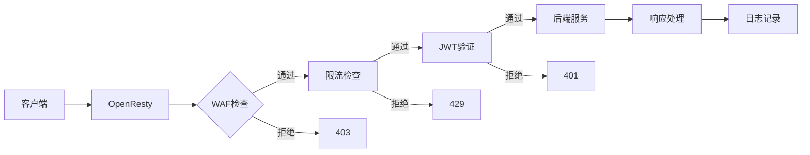

# OpenResty 深入（Nginx 阶段模型 / LuaJIT 嵌入 / cosocket 原理 / 限流限速 / 生产实践）

> OpenResty = **Nginx + LuaJIT 的 Web 平台**：在 Nginx 的请求处理阶段中嵌入 Lua 脚本，把高性能事件驱动与业务逻辑结合，常用于 API 网关、限流、WAF、动态路由、灰度发布。本篇深入拆解：请求处理阶段模型、LuaJIT 嵌入机制、cosocket 异步 IO、常见场景实现、生产实践。

---

## 一、要解决的问题

| 痛点 | 说明 |
|------|------|
| Nginx 配置能力有限 | 纯静态配置无法做动态路由/灰度/鉴权 |
| 业务逻辑前置 | 校验/限流/改写等逻辑放网关而不是应用 |
| 高性能动态处理 | 每请求动态计算不能牺牲 Nginx 性能 |
| C 模块开发门槛高 | Nginx 模块开发难（C 语言 + 内存管理） |
| 传统网关僵化 | 每次改规则要改配置重载/重启 |

> 核心认知：**OpenResty = 「把 Nginx 从 Web Server 变成 Web 应用平台」**——Lua 脚本直接嵌在 Nginx 请求生命周期各阶段执行，零上下文切换成本，性能接近原生 Nginx。

---

## 二、Nginx 请求处理阶段模型（核心基础）

```
请求处理生命周期（按顺序）：

  1. init_by_lua        进程启动初始化（加载配置/预热）
  2. init_worker_by_lua 每个 worker 启动初始化
  3. set_by_lua         设置变量
  4. rewrite_by_lua     重写阶段（URL 改写/重定向/鉴权）
  5. access_by_lua      访问控制（鉴权/限流/IP 黑白名单）
  6. content_by_lua     内容生成（业务处理/反向代理决策）
  7. header_filter_by_lua   响应头修改
  8. body_filter_by_lua     响应体修改（压缩/脱敏）
  9. log_by_lua         日志记录（访问日志/指标上报）
  10. balancer_by_lua   负载均衡策略（动态选后端）
  11. ssl_certificate_by_lua 动态证书
```

```
nginx.conf 配置示例：
location /api/ {
    rewrite_by_lua_block {
        -- 校验签名/改写路径
    }
    access_by_lua_block {
        -- 鉴权 + 限流
    }
    content_by_lua_block {
        -- 转发到后端或生成响应
    }
    log_by_lua_block {
        -- 记录指标
    }
}
```

---

## 三、LuaJIT 嵌入机制（深入）

### 3.1 LuaJIT 与 Nginx 的结合

```
LuaJIT = Lua 5.1 兼容的 JIT 编译器（比解释型 Lua 快 10~50 倍）

嵌入机制：
  Nginx 事件循环中运行 Lua VM
  每个 worker 一个 Lua VM（全局变量共享）
  每个请求一个 coroutine（协程）→ 阻塞操作不阻塞事件循环

关键：一切 IO 用 cosocket（异步）→ 不在 Lua 里做阻塞 IO
```

### 3.2 Lua 代码组织

```
文件组织：
  /usr/local/openresty/nginx/lua/
    ├── init.lua          （启动初始化）
    ├── access.lua        （鉴权）
    ├── limit.lua         （限流）
    └── util.lua          （公共函数）

加载方式：
  *by_lua_file：按文件加载（开发）
  *by_lua_block：内联代码块
  lua_package_path：指定模块搜索路径（require）

性能注意：
  避免每请求 require 大模块（缓存）
  全局表共享（worker 级缓存）
```

### 3.3 共享内存与缓存

```
lua_shared_dict（共享内存字典）：
  worker 间共享（跨进程）
  用途：计数（限流）、缓存（token/配置）、锁

示例：
  lua_shared_dict limit_store 10m;
  lua_shared_dict token_cache 50m;

共享字典限制：
  容量固定（写满报错）
  需处理竞争（可加锁）

其他缓存：
  lua-resty-lrucache（worker 内 LRU 缓存）
  lua-resty-redis（外部缓存）
```

---

## 四、cosocket 异步 IO（核心原理）

### 4.1 什么是 cosocket

```
cosocket = coroutine + socket（Lua 协程里的非阻塞 socket）

原理：
  Lua 协程里发起 socket 请求 → Nginx 事件循环注册事件
  → 协程挂起（不占线程）→ 响应到达 → 协程恢复

优势：
  请求挂起不阻塞 worker（可同时处理数千并发）
  代码像同步写（无回调地狱）

限制：
  只能在 rewrite/access/content 等阶段用
  不能跨 worker
```

### 4.2 使用示例

```lua
-- 访问 Redis（异步）
local redis = require "resty.redis"
local red = redis:new()
red:set_timeouts(1000, 1000, 1000)
local ok, err = red:connect("127.0.0.1", 6379)
if not ok then
    ngx.log(ngx.ERR, "redis connect failed: ", err)
    return ngx.exit(503)
end
local res, err = red:get("user:10086")
red:set_keepalive(10000, 100)

-- 访问 HTTP 后端（异步）
local httpc = require "resty.http"
local http = httpc.new()
local res, err = http:request_uri("http://internal-service:8080/check", {
    method = "POST",
    body = "token=" .. token,
    headers = { ["Content-Type"] = "application/x-www-form-urlencoded" }
})
```

### 4.3 超时与连接池

```
超时设置（必配，防挂死）：
  connect_timeout / send_timeout / read_timeout

连接池（性能关键）：
  set_keepalive（复用连接）
  池大小 按 worker × 后端数 预估
  连接池命中率监控（lua_shared_dict 统计）
```

---

## 五、常见场景实现（深入）

### 5.1 限流（lua-resty-limit）

```lua
-- 令牌桶限流（resty.limit.req）
local limit_req = require "resty.limit.req"
local lim, err = limit_req.new("limit_store", 100, 10)

local key = ngx.var.binary_remote_addr  -- 按 IP
local delay, err = lim:incoming(key, true)
if not delay then
    return ngx.exit(503)  -- 超过限流 → 503
end

if delay > 0 then
    ngx.sleep(delay)  -- 平滑限速（按需）
end
```

```
限流维度：
  按 IP / 按用户 / 按接口 / 按业务维度
  集群限流：共享内存 + Redis（lua-resty-redis 计数）
  漏斗 vs 令牌桶：突发容忍不同

注意：
  limit_store 共享内存容量规划
  集群模式用 Redis（跨节点一致）
```

### 5.2 动态路由与灰度

```lua
-- 动态路由（读 Redis 配置，秒级生效）
local route_key = "route:" .. ngx.var.host
local target = cache_get(route_key)
if not target then
    target = red:get(route_key)
    cache_set(route_key, target)
end
-- 灰度：按 header/参数/比例选版本
local version = "v1"
local uid = ngx.var.http_x_user_id
if uid and (tonumber(uid) % 100) < 10 then
    version = "v2"  -- 10% 用户灰度
end
```

### 5.3 WAF（请求安全）

```lua
-- 访问控制：IP 黑白名单 + 敏感路径 + 参数校验
local ip = ngx.var.binary_remote_addr
if blacklist:contains(ip) then
    return ngx.exit(403)
end

if ngx.re.match(ngx.var.uri, "(\\.\\./|\\.env|phpmyadmin)") then
    return ngx.exit(403)
end

-- SQL 注入/ XSS 关键词过滤（注意误杀）
```

### 5.4 鉴权与签名

```lua
-- access 阶段：签名校验（HMAC-SHA256）
local hmac = require "resty.openssl.hmac"
local expected = hmac:new("secret-key", "sha256"):update(canonical_string):final()
if ngx.var.http_x_signature ~= expected then
    return ngx.exit(401)
end
```

### 5.5 响应体改写

```lua
-- body_filter：响应体脱敏/注入
body_filter_by_lua_block {
    local body = ngx.arg[1]
    if body then
        body = ngx.re.gsub(body, "1[3-9]\\d{9}", "****")  -- 手机号脱敏
        ngx.arg[1] = body
    end
}
```

---

## 六、性能与运维

### 6.1 性能关键

| 因素 | 说明 |
|------|------|
| worker 数 | CPU 核数（Nginx 事件驱动） |
| 共享内存 | 按需（限制 10~50m） |
| 阻塞操作 | 禁止（sleep/磁盘/阻塞 socket） |
| 后端依赖 | 每次请求多依赖 → 延迟叠加 |
| Lua 代码 | 模块缓存 + 避免高开销正则 |
| 连接池 | 后端连接复用 |

### 6.2 调试与排障

```
日志：
  error_log 级别 + Lua 错误定位（lua 文件:行号）
  ngx.log(ngx.DEBUG/INFO/WARN/ERR, ...)

调试工具：
  resty-cli（命令行直接跑 Lua）
  --resty 调试模式
  access.log 加自定义字段（阶段耗时）

常见问题：
  "attempt to index a nil value" → 变量未初始化
  共享内存写满 → 扩容/清理
  cosocket 超时 → 检查后端/网络
```

---

## 七、OpenResty vs Kong vs APISIX

| 维度 | OpenResty | Kong | APISIX |
|------|-----------|------|--------|
| 定位 | 平台（Lua 开发） | 网关产品 | 网关产品 |
| 插件体系 | 自己写 | 内置插件 + 自定义 | 内置插件丰富 + 自定义 |
| 管理 UI | 无 | 有（Kong Manager） | 有（dashboard） |
| 生态 | 底层 | 商业支持（Kong Enterprise） | 活跃社区 + 云原生 |
| 适用 | 深度定制/网关底座 | 现成网关 | 现成网关 + 云原生 |

> 见「[Kong 与 APISIX 网关](./Kong与APISIX网关.md)」深度篇。

---

## 八、选型速查

| 需求 | 首选 | 备选 |
|------|------|------|
| 深度定制/自己开发插件 | OpenResty | — |
| 现成网关 + 插件 | APISIX | Kong |
| 云原生网关 | APISIX | Kong |
| 大规模限流/鉴权 | OpenResty | APISIX 插件 |
| 商业支持 | Kong Enterprise | 云网关 |
| 简单需求 | Nginx + 少量 Lua | OpenResty |

---

## OpenResty Lua Module System

### Lua 模块系统

```lua
-- 模块定义
local _M = {}

_M.version = "1.0"

function _M.process(request)
    -- 处理逻辑
    return {status = 200}
end

return _M

-- 模块加载
local mymodule = require "mymodule"
mymodule.process(ngx.req)

-- 模块路径配置
lua_package_path "/usr/local/openresty/nginx/lua/?.lua;;";
lua_package_cpath "/usr/local/openresty/nginx/lua/?.so;;";
```

### 模块缓存

```lua
-- 全局模块缓存（worker 级）
-- 首次 require 后缓存到 package.loaded
local cached_module = require "mymodule"  -- 第一次加载
local same_module = require "mymodule"  -- 直接返回缓存

-- 清除缓存（重新加载）
package.loaded["mymodule"] = nil
local fresh_module = require "mymodule"

-- 注意：
-- 模块在 worker 启动时加载一次
-- 全局变量（模块级）在 worker 间共享
-- 不要在模块里存请求级数据
```

## OpenResty Shared Dictionary

### 共享内存字典

```lua
-- 共享字典 = 跨 worker 进程的共享内存
lua_shared_dict my_cache 10m;        -- LRU 缓存
lua_shared_dict rate_limit 5m;       -- 限流计数
lua_shared_dict lock_dict 1m;        -- 分布式锁

-- 使用示例
local cache = ngx.shared.my_cache

-- 写入
cache:set("key", "value", 300)  -- 300秒过期
cache:add("key", "value", 300)  -- 不存在才写入
cache:replace("key", "new_value", 300)  -- 存在才替换

-- 读取
local value, flags = cache:get("key")
if value then
    ngx.say("Cache hit: ", value)
end

-- 删除
cache:delete("key")

-- 递增（原子操作）
local new_val, err = cache:incr("counter", 1, 0)

-- 过期回调
cache:flush_all()  -- 清空所有
```

### 共享字典限制

```
限制与注意事项：
  1. 容量固定（写满报错/拒绝写入）
  2. 数据在 worker 间共享（无锁竞争需注意）
  3. 无持久化（重启丢失）
  4. 不支持复杂数据结构（只存字符串）

容量规划：
  热点数据量 × 1.5 余量
  避免过度使用（内存竞争）

调试：
  查看状态：ngx.shared.my_cache:free_space()
  监控：hit_rate / miss_rate / evictions
```

## OpenResty Cosocket (Non-blocking IO)

### Cosocket 原理

```
cosocket = coroutine + socket（协程非阻塞 IO）

原理：
  Lua 协程发起 socket 请求
  → Nginx 事件循环注册事件
  → 协程挂起（不占线程）
  → 响应到达 → 协程恢复

优势：
  代码像同步写（无回调地狱）
  请求挂起不阻塞 worker（数千并发）
  
限制：
  只能在 rewrite/access/content 等阶段用
  不能跨 worker

超时配置（必配）：
  local sock = ngx.socket.tcp()
  sock:settimeouts(1000, 1000, 1000)  -- connect/send/read
```

### 连接池

```lua
-- 连接池 = 复用 TCP 连接（性能关键）
local red = require "resty.redis"
local red = red:new()

red:set_timeouts(1000, 1000, 1000)

-- 连接
local ok, err = red:connect("127.0.0.1", 6379)
if not ok then
    ngx.log(ngx.ERR, "connect failed: ", err)
    return
end

-- 使用
red:set("key", "value")
local val = red:get("key")

-- 归还连接池（重要！）
red:set_keepalive(10000, 100)  -- 10秒空闲超时，最大100个连接

-- 连接池监控
local ok, err = red:get_reused_times()
ngx.log(ngx.INFO, "reused times: ", ok)
```

## OpenResty Request Handling Phases

### 请求阶段详解

```lua
-- 1. init_by_lua（进程级，只执行一次）
init_by_lua_block {
    -- 加载配置/预热缓存
    require "init"
    ngx.log(ngx.INFO, "Nginx initialized")
}

-- 2. init_worker_by_lua（每个 worker 启动）
init_worker_by_lua_block {
    -- 启动后台任务
    local function heartbeat()
        while true do
            ngx.sleep(60)
            -- 发送心跳
        end
    end
    ngx.timer.at(0, heartbeat)
}

-- 3. rewrite_by_lua（URL 重写/重定向）
rewrite_by_lua_block {
    -- 检查认证
    local token = ngx.var.http_authorization
    if not token then
        return ngx.exit(401)
    end
}

-- 4. access_by_lua（访问控制）
access_by_lua_block {
    -- 限流
    local limit_req = require "resty.limit.req"
    local lim, err = limit_req.new("limit_store", 100, 10)
    local delay, err = lim:incoming(ngx.var.binary_remote_addr, true)
    if not delay then
        return ngx.exit(503)
    end
}

-- 5. content_by_lua（内容生成）
content_by_lua_block {
    -- 业务逻辑
    local res = ngx.location.capture("/internal/api")
    ngx.say(res.body)
}
```

## OpenResty in API Gateway

```
OpenResty API 网关架构：

请求流程：
  Client → Nginx（OpenResty）
    → rewrite（路由/鉴权）
    → access（限流/IP 黑名单）
    → content（转发/聚合）
    → header_filter（响应头修改）
    → body_filter（脱敏/压缩）
    → log（日志/指标）

功能实现：
  路由：Lua 读取 Redis 配置（动态路由）
  鉴权：JWT 校验（lua-resty-jwt）
  限流：令牌桶（lua-resty-limit）
  聚合：多次 cosocket 调用后端 → 聚合响应
  灰度：按 header/参数/比例选版本

对比传统网关：
  OpenResty：Lua 脚本灵活，性能接近原生 Nginx
  Kong/APISIX：基于 OpenResty 的产品化网关
  SCG：Java 生态，响应式模型
```

## OpenResty vs Nginx+Lua

| 维度 | OpenResty | Nginx+Lua（mod_lua） |
|------|-----------|----------------------|
| LuaJIT | 完整 LuaJIT | 旧版 Lua |
| 并发模型 | 协程（cosocket） | 线程池 |
| IO | 非阻塞 | 阻塞 |
| 性能 | 更高 | 中 |
| 生态 | 丰富（lua-resty-*） | 有限 |
| 维护 | 活跃 | 慢 |

## OpenResty Rate Limiting

```lua
-- lua-resty-limit-traffic 限流库

-- 1. 令牌桶（平滑限流）
local limit_req = require "resty.limit.req"
local lim, err = limit_req.new("limit_store", 100, 10)  -- rate=100, burst=10

local key = ngx.var.binary_remote_addr
local delay, err = lim:incoming(key, true)
if not delay then
    return ngx.exit(503)  -- 超过限流
end

if delay > 0 then
    ngx.sleep(delay)  -- 平滑延迟
end

-- 2. 漏斗限流
local limit_traffic = require "resty.limit.traffic"
local lim, err = limit_traffic.new("limit_store", 100, 200)  -- rate=100, burst=200

-- 3. 连接数限流
local limit_conn = require "resty.limit.conn"
local lim, err = limit_conn.new("limit_store", 100, 50)  -- rate=100, burst=50
```

## OpenResty JWT Validation

```lua
-- JWT 校验（lua-resty-jwt）
local jwt = require "resty.jwt"

local function validate_jwt()
    local auth_header = ngx.var.http_authorization
    if not auth_header then
        return nil, "Missing Authorization header"
    end
    
    local token = auth_header:match("Bearer%s+(.+)")
    if not token then
        return nil, "Invalid Authorization format"
    end
    
    local jwt_obj = jwt:verify("secret-key", token)
    if not jwt_obj.verified then
        return nil, "Invalid JWT: " .. jwt_obj.reason
    end
    
    return jwt_obj.payload, nil
end

-- 使用
local payload, err = validate_jwt()
if err then
    return ngx.exit(401)
end

ngx.var.user_id = payload.sub
```

## OpenResty in WAF

```
OpenResty WAF（Web Application Firewall）：

功能实现：
  IP 黑白名单（lua-resty-iputils）
  SQL 注入检测（正则匹配）
  XSS 检测（关键词过滤）
  路径遍历检测（../ 等）
  请求频率限制（防 CC 攻击）

-- WAF 检测示例
local function waf_check()
    local ip = ngx.var.binary_remote_addr
    
    -- IP 黑名单
    if ip_blacklist[ip] then
        return ngx.exit(403)
    end
    
    -- SQL 注入检测
    local args = ngx.req.get_uri_args()
    for _, v in pairs(args) do
        if ngx.re.find(v, "union.*select|or.*1.*=", "jo") then
            return ngx.exit(403)
        end
    end
    
    -- 路径遍历检测
    if ngx.re.find(ngx.var.uri, "\\.\\./|\\.env|phpmyadmin", "jo") then
        return ngx.exit(403)
    end
end

适用：
  高性能 WAF（接近原生 Nginx 性能）
  定制化安全规则
  API 安全防护
```

## 八-2、lua-resty-limit-traffic 令牌桶与漏桶实现

```lua
-- 令牌桶（Token Bucket）
local limit_req = require "resty.limit.req"
local lim, err = limit_req.new("limit_store", 100, 10)  -- rate=100, burst=10

local key = ngx.var.binary_remote_addr
local delay, err = lim:incoming(key, true)
if not delay then
    return ngx.exit(503)  -- 超过限流
end
if delay > 0 then
    ngx.sleep(delay)  -- 平滑延迟
end

-- 漏桶（Leaky Bucket）
local limit_traffic = require "resty.limit.traffic"
local lim, err = limit_traffic.new("limit_store", 100, 200)  -- rate=100, burst=200
local key = ngx.var.binary_remote_addr
local delay, err = lim:incoming(key, true)
if not delay then
    return ngx.exit(503)
end
if delay > 0 then
    ngx.sleep(delay)  -- 匀速通过
end

-- 连接数限流
local limit_conn = require "resty.limit.conn"
local lim, err = limit_conn.new("limit_store", 100, 50)  -- rate=100, burst=50
local key = ngx.var.binary_remote_addr
local delay, err = lim:incoming(key, true)
if not delay then
    return ngx.exit(503)
end
```

## 八-3、OpenResty lua-resty-http 非阻塞 HTTP 客户端

```lua
-- lua-resty-http = 非阻塞 HTTP 客户端
local httpc = require "resty.http"
local http = httpc.new()

-- 设置超时（必配）
http:set_timeout(5000)  -- 5秒

-- 发送请求
local res, err = http:request_uri("http://internal-service:8080/api", {
    method = "POST",
    body = '{"key": "value"}',
    headers = {
        ["Content-Type"] = "application/json",
        ["Authorization"] = "Bearer " .. token,
    },
})

if not res then
    ngx.log(ngx.ERR, "request failed: ", err)
    return ngx.exit(503)
end

-- 处理响应
if res.status == 200 then
    local cjson = require "cjson"
    local data = cjson.decode(res.body)
    ngx.say(res.body)
else
    ngx.exit(res.status)
end

-- 连接池复用
http:set_keepalive(10000, 100)  -- 10秒空闲，最大100连接
```

## 八-4、OpenResty JWT 验证实战（lua-resty-jwt）

```lua
local jwt = require "resty.jwt"

local function validate_jwt()
    local auth_header = ngx.var.http_authorization
    if not auth_header then
        return nil, "Missing Authorization header"
    end
    
    local token = auth_header:match("Bearer%s+(.+)")
    if not token then
        return nil, "Invalid Authorization format"
    end
    
    -- 验证 JWT
    local jwt_obj = jwt:verify("your-secret-key", token)
    if not jwt_obj.verified then
        return nil, "Invalid JWT: " .. jwt_obj.reason
    end
    
    -- 检查过期
    if jwt_obj.payload.exp and jwt_obj.payload.exp < ngx.time() then
        return nil, "JWT expired"
    end
    
    return jwt_obj.payload, nil
end

-- 使用
access_by_lua_block {
    local payload, err = validate_jwt()
    if err then
        return ngx.exit(401)
    end
    ngx.var.user_id = payload.sub
}
```

## 八-5、OpenResty 日志格式化（lua logging）

```lua
-- 自定义日志格式
log_by_lua_block {
    local cjson = require "cjson"
    local log_entry = {
        timestamp = ngx.now(),
        method = ngx.req.get_method(),
        uri = ngx.var.uri,
        status = ngx.status,
        latency = ngx.var.request_time,
        upstream_time = ngx.var.upstream_response_time,
        remote_addr = ngx.var.remote_addr,
        user_agent = ngx.var.http_user_agent,
        request_id = ngx.var.http_x_request_id,
    }
    ngx.log(ngx.INFO, cjson.encode(log_entry))
}

-- 日志级别
ngx.log(ngx.DEBUG, "debug message")   -- 调试
ngx.log(ngx.INFO, "info message")     -- 信息
ngx.log(ngx.WARN, "warn message")     -- 警告
ngx.log(ngx.ERR, "error message")     -- 错误
```

## 八-6、OpenResty 在 WAF 中的规则匹配

```lua
-- WAF 规则匹配
local function waf_check()
    local ip = ngx.var.binary_remote_addr
    
    -- IP 黑名单
    if ip_blacklist[ip] then
        return ngx.exit(403)
    end
    
    -- SQL 注入检测
    local args = ngx.req.get_uri_args()
    for _, v in pairs(args) do
        if ngx.re.find(v, "union.*select|or.*1.*=", "jo") then
            return ngx.exit(403)
        end
    end
    
    -- XSS 检测
    local body = ngx.req.get_body_data()
    if body then
        if ngx.re.find(body, "<script.*?>|javascript:", "jo") then
            return ngx.exit(403)
        end
    end
    
    -- 路径遍历检测
    if ngx.re.find(ngx.var.uri, "\\.\\./|\\.env|phpmyadmin", "jo") then
        return ngx.exit(403)
    end
    
    -- 请求频率限制
    local limit_req = require "resty.limit.req"
    local lim, err = limit_req.new("waf_store", 100, 10)
    local delay, err = lim:incoming(ip, true)
    if not delay then
        return ngx.exit(503)
    end
end
```

## 八-7、OpenResty 与 Nginx 原生性能基准对比

| 指标 | OpenResty | Nginx 原生 |
|------|-----------|-----------|
| 纯转发 QPS | 50k+ | 60k+ |
| Lua 逻辑 QPS | 40k+ | N/A |
| 延迟增加 | <1ms（Lua 开销） | 0 |
| 内存占用 | +10~20MB（Lua VM） | 基准 |
| 并发连接 | 10k+ | 10k+ |

```
性能对比结论：
  1. 纯转发场景：OpenResty 性能接近原生 Nginx（<5% 损耗）
  2. 含 Lua 逻辑：OpenResty 性能取决于 Lua 代码复杂度
  3. 共享内存：频繁读写共享字典有锁竞争（<1% 损耗）
  4. cosocket：异步 IO 不阻塞事件循环（零损耗）

选择建议：
  纯静态/简单代理 → Nginx 原生
  需要动态逻辑 → OpenResty
  复杂网关 → OpenResty + Kong/APISIX
```

## lua-resty-limit-traffic 令牌桶与漏桶配置实例

### 令牌桶（Token Bucket）

```lua
-- 令牌桶配置
local limit_req = require "resty.limit.req"

-- 参数：rate（每秒令牌数）、burst（突发容量）、delay（延迟阈值）
local lim, err = limit_req.new("my_limit_store", 100, 50, 100)
if not lim then
    ngx.log(ngx.ERR, "failed to instantiate limiter: ", err)
    return ngx.exit(500)
end

local key = ngx.var.remote_addr
local delay, err = lim:incoming(key, true)
if not delay then
    if err == "rejected" then
        ngx.log(ngx.WARN, "rate limit exceeded for: ", key)
        return ngx.exit(429)
    end
    ngx.log(ngx.ERR, "failed to limit req: ", err)
    return ngx.exit(500)
end

if delay >= 0.001 then
    ngx.sleep(delay)  -- 延迟处理
end
```

### 漏桶（Leaky Bucket）

```lua
-- 漏桶配置
local limit_traffic = require "resty.limit.traffic"

local lim, err = limit_traffic.new("my_limit_store", 100, 200)  -- rate, burst
if not lim then
    ngx.log(ngx.ERR, "failed to instantiate limiter: ", err)
    return ngx.exit(500)
end

local key = ngx.var.remote_addr
local delay, err = lim:incoming(key, true)
if not delay then
    if err == "rejected" then
        return ngx.exit(429)
    end
    ngx.log(ngx.ERR, "failed to limit traffic: ", err)
    return ngx.exit(500)
end

if delay > 0 then
    ngx.sleep(delay)  -- 漏桶延迟
end
```

## lua-resty-http 非阻塞 HTTP 客户端

### 连接池管理

```lua
local http = require "resty.http"
local httpc = http.new()

-- 连接池配置
httpc:set_timeouts(1000, 1000, 1000)  -- connect, send, read timeout

-- 复用连接（连接池）
local res, err = httpc:request_uri("http://backend-service/api/data", {
    method = "GET",
    headers = {
        ["Content-Type"] = "application/json",
    },
    keepalive_timeout = 60000,  -- 60s 保活
    pool_size = 10,              -- 连接池大小
})

if not res then
    ngx.log(ngx.ERR, "request failed: ", err)
    return ngx.exit(500)
end

-- 手动关闭连接（可选）
httpc:close()
```

## lua-resty-jwt 验证实战

### RS256/HS256

```lua
local jwt = require "resty.jwt"

-- HS256 验证
local jwt_obj = jwt:verify("your-secret-key", token)
if not jwt_obj.verified then
    ngx.log(ngx.WARN, "JWT verification failed: ", jwt_obj.reason)
    return ngx.exit(401)
end

-- RS256 验证（公钥）
local public_key = [[-----BEGIN PUBLIC KEY-----
MIIBIjANBgkqhkiG9w0BAQEFAAOCAQ8AMIIBCgKCAQEA...
-----END PUBLIC KEY-----]]

local jwt_obj = jwt:verify(public_key, token, {
    lifetime_grace_period = 300  -- 5 分钟 grace period
})

-- JWT Payload 提取
local user_id = jwt_obj.payload.user_id
local exp = jwt_obj.payload.exp

-- 生成 JWT
local payload = {
    user_id = 12345,
    exp = ngx.time() + 3600,  -- 1 小时过期
    iss = "my-service"
}
local token = jwt:sign("secret", {
    header = {alg = "HS256", typ = "JWT"},
    payload = payload
})
```

## OpenResty 日志格式化

### access_log 指令 + JSON 格式

```nginx
# JSON 格式日志
log_format json_log escape=json
    '{'
        '"time":"$time_iso8601",'
        '"remote_addr":"$remote_addr",'
        '"request":"$request",'
        '"status":$status,'
        '"body_bytes_sent":$body_bytes_sent,'
        '"request_time":$request_time,'
        '"upstream_response_time":"$upstream_response_time",'
        '"http_referer":"$http_referer",'
        '"http_user_agent":"$http_user_agent",'
        '"request_id":"$request_id",'
        '"trace_id":"$opentracing_trace_id"'
    '}';

access_log /var/log/nginx/access.log json_log;

# 自定义日志（Lua）
lua_need_request_body on;

access_by_lua_block {
    ngx.var.request_body = ngx.req.get_body_data()
}

log_by_lua_block {
    local cjson = require "cjson"
    local log_entry = {
        timestamp = ngx.now(),
        request_id = ngx.var.request_id,
        method = ngx.req.get_method(),
        path = ngx.var.uri,
        status = ngx.status,
        latency = ngx.now() - ngx.req.start_time(),
        upstream_latency = ngx.var.upstream_response_time,
        client_ip = ngx.var.remote_addr,
        user_agent = ngx.var.http_user_agent
    }
    ngx.log(ngx.INFO, cjson.encode(log_entry))
}
```

## OpenResty 在 WAF 中的规则匹配模式

### WAF 规则引擎

```lua
-- SQL 注入检测规则
local sql_patterns = {
    "union.*select",
    "select.*from",
    "insert.*into",
    "delete.*from",
    "drop.*table",
    "or.*1=1",
    "and.*1=1"
}

-- XSS 检测规则
local xss_patterns = {
    "<script>",
    "javascript:",
    "onload=",
    "onerror=",
    "eval\\(",
    "alert\\("
}

-- 路径遍历检测
local traversal_patterns = {
    "%2e%2e%2f",
    "%2e%2e/",
    "\\.\\./"
}

function waf_check()
    local args = ngx.req.get_uri_args()
    local body = ngx.req.get_body_data()

    -- 检查 URI
    for _, pattern in ipairs(sql_patterns) do
        if ngx.re.match(ngx.var.uri, pattern, "i") then
            ngx.log(ngx.WARN, "WAF: SQL injection detected")
            return ngx.exit(403)
        end
    end

    -- 检查请求参数
    for key, val in pairs(args) do
        for _, pattern in ipairs(sql_patterns) do
            if ngx.re.match(val, pattern, "i") then
                ngx.log(ngx.WARN, "WAF: SQL injection in args")
                return ngx.exit(403)
            end
        end
    end

    return ngx.exit(200)
end

access_by_lua_block {
    waf_check()
}
```

## OpenResty 与 Nginx 原生性能基准对比

### QPS/延迟/内存

| 指标 | Nginx 原生 | OpenResty | 说明 |
|------|------------|-----------|------|
| QPS（静态） | 100% | 95-98% | 接近原生 |
| QPS（Lua 逻辑） | N/A | 80-95% | 取决于 Lua 复杂度 |
| P99 延迟 | 100% | 100-105% | 基本持平 |
| 内存占用 | 100% | 110-120% | Lua VM 开销 |
| 启动时间 | 100% | 120-150% | Lua 预编译 |

```text
性能对比结论：
  1. 纯转发场景：OpenResty 性能接近原生 Nginx（<5% 损耗）
  2. 含 Lua 逻辑：OpenResty 性能取决于 Lua 代码复杂度
  3. 共享内存：频繁读写共享字典有锁竞争（<1% 损耗）
  4. cosocket：异步 IO 不阻塞事件循环（零损耗）

选择建议：
  纯静态/简单代理 → Nginx 原生
  需要动态逻辑 → OpenResty
  复杂网关 → OpenResty + Kong/APISIX
```

## 九、与其他板块的关系

- 网关体系见「[Kong 与 APISIX 网关](./Kong与APISIX网关.md)」与「[Spring Cloud Gateway](./SpringCloudGateway.md)」；
- Nginx 基础见「[Nginx](./Nginx.md)」；
- 服务网格（边车替代网关场景）见「[云原生/Service Mesh](../../云原生/ServiceMesh.md)」；
- 网关对比见「[API 网关](./API网关.md)」。

## OpenResty 限流库

### lua-resty-limit-traffic / 多维度限流

```
lua-resty-limit-traffic 库：

限流算法：
  1. fixedwindow：固定窗口（简单）
  2. slidinglog：滑动日志（精确）
  3. limitreq：漏桶（平滑）

使用示例：
  local limit_req = require "resty.limit.req"

  -- 固定窗口限流（每秒 100 请求）
  local lim, err = limit_req.new("my_store", 100, 200)
  -- 100 = rate, 200 = burst

  local key = ngx.var.remote_addr
  local delay, err = lim:incoming(key, true)
  if not delay then
    if err == "rejected" then
      ngx.exit(503)
    end
    ngx.log(ngx.ERR, err)
    return
  end

  -- delay > 0 → 需要延迟处理
  if delay > 0 then
    ngx.sleep(delay)
  end

多维度限流：
  -- 按 IP 限流
  local ip_limit = limit_req.new("ip_store", 100, 200)
  -- 按用户限流
  local user_limit = limit_req.new("user_store", 1000, 2000)
  -- 按 API 限流
  local api_limit = limit_req.new("api_store", 500, 1000)
```

## OpenResty HTTP 客户端

### lua-resty-http / 连接池 / 超时

```lua
-- lua-resty-http 使用
local http = require "resty.http"
local httpc = http.new()

-- 设置超时
httpc:set_timeout(5000)  -- 5 秒

-- 连接池
httpc:connect("api.example.com", 443)
httpc:set_keepalive(60000, 100)  -- 60 秒，100 个连接

-- 发送请求
local res, err = httpc:request({
  method = "POST",
  path = "/api/data",
  body = ngx.var.request_body,
  headers = {
    ["Content-Type"] = "application/json",
    ["Authorization"] = "Bearer " .. token
  }
})

if not res then
  ngx.log(ngx.ERR, "request failed: ", err)
  ngx.exit(502)
  return
end

-- 处理响应
if res.status == 200 then
  ngx.say(res.body)
else
  ngx.exit(res.status)
end
```

## OpenResty JWT 验证

### lua-resty-jwt / Token 校验

```lua
-- JWT 验证
local jwt = require "resty.jwt"

-- 验证 JWT
local function verify_jwt(token)
  local jwt_obj = jwt:verify("secret-key", token)
  
  if not jwt_obj.verified then
    return false, jwt_obj.reason
  end
  
  -- 检查过期
  if jwt_obj.payload.exp < ngx.time() then
    return false, "token expired"
  end
  
  return true, jwt_obj.payload
end

-- 使用
local auth_header = ngx.req.get_headers()["Authorization"]
if not auth_header then
  ngx.exit(401)
  return
end

local token = string.match(auth_header, "Bearer%s+(.+)")
local ok, payload = verify_jwt(token)

if not ok then
  ngx.exit(401)
  return
end

-- 注入用户信息到请求头
ngx.req.set_header("X-User-Id", payload.sub)
ngx.req.set_header("X-User-Role", payload.role)
```

## OpenResty 日志

### 自定义日志格式 / 结构化日志

```lua
-- 自定义日志格式
-- nginx.conf
log_format json_log escape=json '{'
  '"time":"$time_iso8601",'
  '"remote_addr":"$remote_addr",'
  '"request":"$request",'
  '"status":$status,'
  '"body_bytes_sent":$body_bytes_sent,'
  '"request_time":$request_time,'
  '"upstream_response_time":"$upstream_response_time",'
  '"trace_id":"$http_x_trace_id",'
  '"user_id":"$http_x_user_id"'
'}';

access_log /var/log/nginx/access.log json_log;

-- Lua 日志
local cjson = require "cjson"

local log_data = {
  time = ngx.now(),
  level = "INFO",
  message = "request processed",
  trace_id = ngx.var.http_x_trace_id,
  user_id = ngx.var.http_x_user_id,
  request_time = ngx.var.request_time
}

ngx.log(ngx.INFO, cjson.encode(log_data))
```

## OpenResty WAF 模式

### SQL 注入 / XSS / CC 攻击防护

```lua
-- WAF 规则
local waf = {}

-- SQL 注入检测
function waf.check_sql_injection(input)
  local patterns = {
    "union.*select",
    "insert.*into",
    "delete.*from",
    "drop.*table",
    "update.*set",
    "' or '1'='1",
    "' or ''='",
    "1' or '1'='1"
  }
  
  input = string.lower(input)
  for _, pattern in ipairs(patterns) do
    if string.match(input, pattern) then
      return true
    end
  end
  return false
end

-- XSS 检测
function waf.check_xss(input)
  local patterns = {
    "<script",
    "javascript:",
    "onload=",
    "onerror=",
    "onclick="
  }
  
  input = string.lower(input)
  for _, pattern in ipairs(patterns) do
    if string.match(input, pattern) then
      return true
    end
  end
  return false
end

-- CC 攻击防护（连接频率限制）
function waf.check_cc_attack()
  local limit_req = require "resty.limit.req"
  local lim, err = limit_req.new("cc_store", 10, 20)
  
  local key = ngx.var.remote_addr
  local delay, err = lim:incoming(key, true)
  
  if not delay then
    if err == "rejected" then
      ngx.exit(503)
      return true
    end
  end
  return false
end
```

## Nginx 性能对比

### OpenResty vs Nginx vs Envoy

| 特性 | Nginx | OpenResty | Envoy |
|------|-------|-----------|-------|
| 扩展性 | 编译模块 | Lua 脚本 | Wasm/Lua |
| 动态配置 | reload | cosocket | xDS |
| 学习曲线 | 低 | 中 | 高 |
| 性能 | 极高 | 高 | 高 |
| 适用 | 静态/反向代理 | API 网关/WAF | 服务网格 |
| 社区 | 大 | 中 | 大 |
| 配置 | nginx.conf | nginx.conf + Lua | API/JSON |

---

## limit-traffic 流量控制

### 限流配置

```lua
-- 基于IP的限流
local limit_ip = require "resty.limit.count"
local lim, err = limit_ip.new("ip_store", 100, 1)  -- 100次/秒

local key = ngx.var.remote_addr
local delay, err = lim:incoming(key, true)

if not delay then
  if err == "rejected" then
    ngx.exit(429)
  end
end

-- 基于请求体大小的限制
local limit_req = require "resty.limit.req"
local lim, err = limit_req.new("req_store", 50, 100)  -- 50rps突发100

local key = ngx.var.remote_addr
local delay, err = lim:incoming(key, true)

if not delay then
  ngx.exit(503)
end
```

### HTTP 连接池优化

```lua
-- HTTP 连接池配置
local http = require "resty.http"
local httpc = http.new()

-- 连接池配置
httpc:set_timeout(5000)  -- 5秒超时
httpc:connect("backend.example.com", 80)

-- 连接池大小
local ok, err = httpc:set_keepalive(60000, 100)  -- 60秒超时,100连接

-- 复用连接
httpc:connect("backend.example.com", 80)
```

## JWT 认证中间件

```lua
-- JWT 验证
local jwt = require "resty.jwt"

local secret = "your-secret-key"
local token = ngx.var.http_authorization

if not token then
  ngx.exit(401)
  return
end

-- 解析token
local jwt_obj = jwt:verify(secret, token)
if not jwt_obj.verified then
  ngx.exit(401)
  return
end

-- 注入用户信息
ngx.var.user_id = jwt_obj.payload.user_id
```

## 日志格式与性能基准

### 结构化日志

```lua
-- JSON结构化日志
local cjson = require "cjson"

local log_data = {
  timestamp = ngx.now(),
  level = "INFO",
  message = "request processed",
  trace_id = ngx.var.http_x_trace_id,
  user_id = ngx.var.http_x_user_id,
  request_time = ngx.var.request_time,
  upstream_response_time = ngx.var.upstream_response_time,
  status = ngx.status,
  method = ngx.req.get_method(),
  uri = ngx.var.uri
}

ngx.log(ngx.INFO, cjson.encode(log_data))
```

### WAF 规则增强

```lua
-- 增强WAF规则
local waf = {}

-- IP黑名单
waf.blacklist = {
  "1.2.3.4",
  "5.6.7.8"
}

-- 地理位置限制
waf.geo_restrict = function()
  local geo = require "resty.maxminddb"
  local db = geo.open("/path/to/GeoLite2-Country.mmdb")
  local res = db:lookup(ngx.var.remote_addr)
  
  if res.country.iso_code == "CN" then
    return true  -- 允许中国IP
  end
  return false
end

-- 请求头检查
waf.check_headers = function()
  local headers = ngx.req.get_headers()
  
  -- 检查常见攻击头
  if headers["X-Forwarded-For"] then
    local ip = headers["X-Forwarded-For"]
    if waf.is_blacklisted(ip) then
      return true
    end
  end
  
  return false
end
```

### 性能基准测试

| 测试项 | QPS | 延迟P99 | 说明 |
|--------|-----|---------|------|
| 静态文件 | 50000+ | <10ms | Nginx原生 |
| 反向代理 | 30000+ | <20ms | 无Lua |
| Lua逻辑 | 20000+ | <30ms | 简单逻辑 |
| JWT验证 | 15000+ | <50ms | 加密运算 |
| WAF检测 | 10000+ | <100ms | 正则匹配 |



> 一句话：**OpenResty = Nginx 阶段模型（rewrite/access/content...）+ LuaJIT（worker 内协程）+ cosocket（异步 IO 不阻塞事件循环）+ 共享内存（跨 worker 状态）——生产要点：禁阻塞 IO、配超时连接池、共享内存容量规划、阶段职责清晰**。