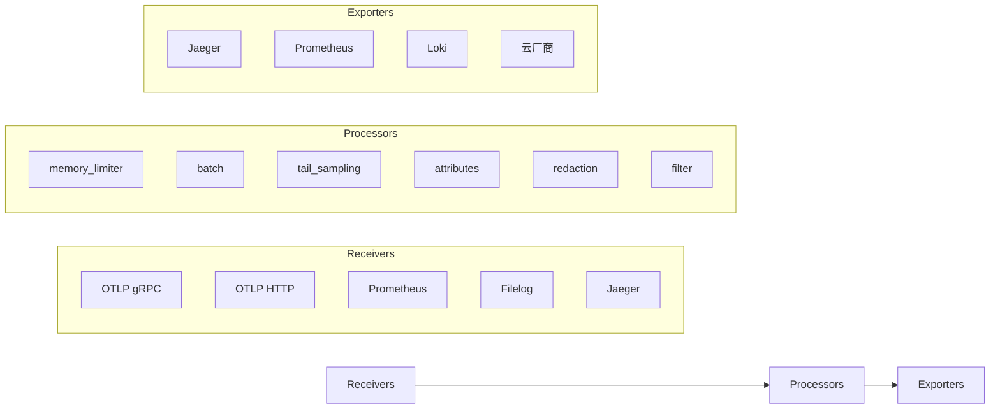
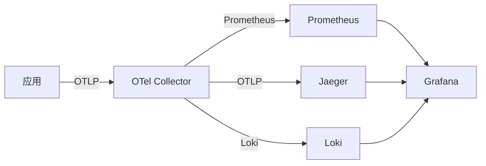

# OpenTelemetry 深入（Collector 管道 / SDK 埋点 / 上下文传播 / 采样策略 / 落地实践）

> OpenTelemetry（OTel）是 **可观测性领域的事实标准**：一套 API/SDK/Collector 统一采集指标（Metrics）、日志（Logs）、链路（Traces）。本篇深入拆解：Collector 管道配置、SDK 埋点细节、上下文传播、采样策略、企业落地。

---

## 一、要解决的问题

| 痛点 | 说明 |
|------|------|
| 埋点碎片化 | 每个服务用不同 SDK（Zipkin/Jaeger/StatsD...），无法统一 |
| 厂商锁定 | 接入一家 APM 后被绑定，迁移成本高 |
| 三支柱割裂 | 指标/日志/链路各自独立采集，无法关联 |
| 多语言多框架 | 每种语言/框架要分别接入可观测性 |
| 协议混乱 | OTLP/Zipkin/Jaeger/Prometheus 各有一套协议 |

> 核心认知：**OTel = 「可观测性的 USB-C 接口」**——采集端统一标准，后端随便换；埋一次点，处处可用。

---

## 二、整体架构

```
应用（Instrumentation 埋点）
  ├── OTel API（指标/日志/链路 API，标准接口）
  ├── OTel SDK（实现 + 采样 + 批处理 + 上下文传播）
  └── Auto-instrumentation（自动埋点：Java Agent/语言库）

OTel Collector（采集器，核心枢纽）
  ├── Receivers（接收：OTLP/Zipkin/Jaeger/Prometheus/Filelog）
  ├── Processors（处理：采样/过滤/脱敏/批处理/重命名）
  ├── Exporters（导出：Jaeger/Prometheus/Loki/云厂商/自建后端）
  └── Pipelines（链路：接收→处理→导出，metrics/logs/traces 三条）

后端：Jaeger / Prometheus+Grafana / Loki / SkyWalking / 云厂商
```

---

## 三、三支柱（Signals）统一

| Signal | 内容 | OTel 模型 |
|--------|------|-----------|
| Traces | 调用链（Span） | `Span/Trace`：traceID/spanID/parentSpanID |
| Metrics | 指标（计数/直方图/仪表） | `Meter`：Counter/Histogram/Gauge/UpDownCounter |
| Logs | 日志（结构化） | `LogRecord`：时间戳/级别/属性/链路关联 |

**核心价值**：三者统一**关联字段**（traceID 贯穿 logs/metrics）——日志、链路、指标同一条 ID 打通。

### 3.1 Metrics 类型

| 类型 | 语义 | 使用场景 |
|------|------|----------|
| Counter | 单调递增计数 | 请求数、错误数 |
| UpDownCounter | 可增减计数 | 队列长度、在线用户 |
| Histogram | 分布统计 | 延迟、请求大小 |
| Gauge | 当前值 | CPU、内存使用率 |

### 3.2 Span 结构

```
Span = 一次操作（调用/DB 查询/消息发送）

字段：
  traceID：整条链路 ID（32 位 hex）
  spanID：当前 Span ID（16 位 hex）
  parentSpanID：父 Span（关系构成树）
  name：操作名（如 "GET /api/orders"）
  kind：类型（Client/Server/Producer/Consumer/Internal）
  start/end：时间戳
  attributes：业务属性（订单号/用户 ID）
  status：状态（OK/ERROR/UNSET）
  events：事件（异常/关键节点）
```

---

## 四、Collector 管道配置（深入）

### 4.1 完整配置示例

```yaml
# otel-collector.yaml
receivers:
  otlp:
    protocols:
      grpc:
        endpoint: 0.0.0.0:4317
      http:
        endpoint: 0.0.0.0:4318
  prometheus:
    config:
      scrape_configs:
      - job_name: 'my-app'
        scrape_interval: 15s
        static_configs:
        - targets: ['localhost:8080']
  filelog:
    include: [/var/log/app/*.log]
    start_at: end

processors:
  batch:
    timeout: 5s
    send_batch_size: 1024
  memory_limiter:
    check_interval: 1s
    limit_mib: 512
    spike_limit_mib: 128
  tail_sampling:
    decision_wait: 10s
    num_traces: 100000
    policies:
    - name: error-policy
      type: status_code
      status_code: {status_codes: [ERROR]}
    - name: slow-policy
      type: latency
      latency: {threshold_ms: 1000}
  attributes:
    actions:
    - key: environment
      value: production
      action: upsert
  redaction:
    allow_all_keys: false
    blocked_values: [Bearer\s+\S+]

exporters:
  otlp/jaeger:
    endpoint: jaeger-collector:4317
    tls: {insecure: true}
  prometheus:
    endpoint: "0.0.0.0:8889"
    namespace: "myapp"
  loki:
    endpoint: http://loki:3100/loki/api/v1/push

service:
  pipelines:
    traces:
      receivers: [otlp]
      processors: [memory_limiter, tail_sampling, batch]
      exporters: [otlp/jaeger]
    metrics:
      receivers: [otlp, prometheus]
      processors: [memory_limiter, batch]
      exporters: [prometheus]
    logs:
      receivers: [otlp, filelog]
      processors: [memory_limiter, attributes, redaction, batch]
      exporters: [loki]
```

### 4.2 常用 Processor

| Processor | 用途 |
|-----------|------|
| batch | 批量发送（吞吐提升） |
| memory_limiter | 内存保护（防 OOM） |
| tail_sampling | 尾部采样（保关键链路） |
| attributes | 添加/修改属性（环境/团队） |
| resource | 添加资源信息（主机/Pod） |
| redaction | 脱敏（手机号/Token） |
| filter | 过滤（丢弃无用数据） |
| transform | 字段转换（重命名/删除） |

### 4.3 部署模式

```
Agent 模式：每个 Pod/主机一个 Collector（采集 + 批处理 + 发送）
Gateway 模式：中心化 Collector 集群（聚合 + Tail 采样 + 脱敏）
组合：Agent 采集 → Gateway 处理 → 多后端导出（标准架构）
```

---

## 五、SDK 埋点（深入）

### 5.1 自动埋点（Java Agent）

```bash
# 零侵入：Java Agent 自动埋点
java -javaagent:opentelemetry-javaagent.jar \
     -Dotel.service.name=order-service \
     -Dotel.traces.exporter=otlp \
     -Dotel.exporter.otlp.endpoint=http://collector:4317 \
     -jar app.jar
```

自动覆盖：HTTP（Servlet/WebFlux）、JDBC、Redis、Kafka、gRPC、线程池等主流框架。

### 5.2 手动埋点（核心链路）

```java
// 获取 Tracer（服务启动时）
Tracer tracer = GlobalOpenTelemetry.getTracer("order-service");

// 手动创建 Span（关键业务逻辑）
Span span = tracer.spanBuilder("process_payment")
    .setAttribute("order_id", orderId)
    .setAttribute("payment_method", "wechat")
    .startSpan();

try (Scope scope = span.makeCurrent()) {
    // 业务逻辑...
} catch (Exception e) {
    span.recordException(e);
    span.setStatus(StatusCode.ERROR);
    throw e;
} finally {
    span.end();
}
```

### 5.3 指标埋点

```java
// Counter 示例
Meter meter = GlobalOpenTelemetry.getMeter("order-service");
LongCounter orderCreated = meter.counterBuilder("order.created")
    .setDescription("订单创建数")
    .build();

orderCreated.add(1, Attributes.of(
    AttributeKey.stringKey("channel"), "app"
));
```

---

## 六、上下文传播（W3C Trace Context）

```
traceparent: 00-{traceID}-{spanID}-{flags}
tracestate:  厂商自定义扩展

HTTP/gRPC/MQ 自动注入（SDK 拦截）→ 跨服务串联
```

| 传播载体 | 注入方式 |
|----------|----------|
| HTTP | `traceparent` Header |
| gRPC | Metadata（traceparent） |
| Kafka | 消息 Header |
| 线程 | Context 传递（手动） |
| 异步 | 传播器（Baggage） |

### 6.1 跨服务串联

```
Service A → 请求带 traceparent: 00-abc...-def...-01
  → Service B 收到 → SDK 解析 → 创建子 Span（parent=def...）
  → B 调 C → 生成新 traceparent（spanID 更新，traceID 不变）
  → 整条链路共享 traceID → 后端聚合为完整调用链
```

---

## 七、采样策略（深入）

### 7.1 三种采样

| 策略 | 说明 | 适用 |
|------|------|------|
| Head Sampling | 入口决定采样率（概率/规则），整链一致 | 高吞吐基础采样 |
| Tail Sampling | Collector 端二次采样（保留慢/错请求） | 排查慢请求 |
| Parent-based | 子 Span 跟随父采样决策 | 默认行为 |

### 7.2 生产采样组合

```
方案：Head（概率 10%）+ Tail（错误/慢 100% 保留）

效果：
  正常请求：10% 采样（成本可控）
  错误请求：100% 保留（排障不缺）
  慢请求：100% 保留（定位性能）

配置要点：
  Tail Sampling 需要缓冲（decision_wait）
  num_traces 限制内存
  规则优先级：error > slow > 其他
```

### 7.3 采样率调整

```
采样率参考：
  低流量：100%（成本可接受）
  中流量：10~50%
  高流量：1~10%
  关键业务（支付）：100%（业务强制）

动态调整：
  变更/大促期间临时提高
  按服务调整（核心服务高采样）
```

---

## 八、落地实践

### 8.1 落地路径

| 步骤 | 说明 |
|------|------|
| 1. 选后端 | Jaeger（链路）+ Prometheus/Grafana（指标）+ Loki（日志） |
| 2. 埋点 | Java Agent 自动埋点（零侵入起步）→ 核心链路手动埋点 |
| 3. 采集 | 每 Pod 一个 Collector Agent（DaemonSet） |
| 4. 汇聚 | Gateway 集群：Tail 采样 + 脱敏（手机号/Token） |
| 5. 关联 | 日志打 traceID → Loki ↔ Jaeger 一键跳转 |

### 8.2 常见坑

| 坑 | 说明 | 对策 |
|----|------|------|
| 采样过度 | 关键链路漏采 | 按业务采样规则 |
| Agent 版本漂移 | 版本不一致 | 统一版本基线 |
| Collector 单点 | Gateway 挂了 | 集群 + HA |
| 性能损耗 | Agent 开销 | 合理采样 + 关无用 exporter |
| 上下文丢失 | 异步/线程池断链 | 传播器 + 手动传递 |
| 指标基数爆炸 | 高基数标签 | 标签规范（禁止 request_id 当标签） |

---

## 九、OTel vs SkyWalking vs 传统 APM

| 维度 | OpenTelemetry | SkyWalking | 传统 APM（Datadog） |
|------|---------------|------------|---------------------|
| 定位 | 采集标准（SDK/协议） | APM 产品（端到端） | 商业 SaaS |
| 埋点 | 标准 API + 自动埋点 | 自家 Agent | 自家 Agent |
| 后端 | 任意（自带不强绑） | 自带（ES/H2） | 自家云 |
| 厂商锁定 | 无 | 中（可迁 OTel） | 强 |
| 适用 | 云原生/多后端标准 | Java 生态一体方案 | 有钱省事 |

**选型关注点**：
- 追求标准/云原生/多后端 → **OTel**；
- Java 团队要一体开箱 → **SkyWalking**；
- 商业支持 → 商业 APM（兼容 OTel 上报）。

---

## 十、选型速查

| 需求 | 首选 | 备选 |
|------|------|------|
| 云原生可观测性标准 | OpenTelemetry | — |
| Java 一键 APM | SkyWalking | OTel + Agent |
| 链路后端 | Jaeger | Zipkin |
| 指标后端 | Prometheus/Grafana | 云托管 Prom |
| 日志后端 | Loki | ELK |
| 商业托管 | 商业 APM（OTel 兼容） | 云可观测性套件 |

---

## 十二、OpenTelemetry Collector Pipeline 深入

### 12.1 Pipeline 架构



### 12.2 Receiver 详解

| Receiver | 协议 | 用途 |
|----------|------|------|
| otlp | OTLP gRPC/HTTP | OTel SDK 直连 |
| prometheus | Prometheus 拉取 | 兼容现有监控 |
| jaeger | Jaeger 协议 | 迁移现有链路 |
| zipkin | Zipkin 协议 | 迁移现有链路 |
| filelog | 文件采集 | 容器日志 |
| kafka | Kafka 消息 | 日志/链路缓冲 |
| hostmetrics | 主机指标 | CPU/内存/磁盘 |

### 12.3 Processor 详解

| Processor | 用途 | 关键配置 |
|-----------|------|---------|
| batch | 批量发送 | timeout, send_batch_size |
| memory_limiter | 内存保护 | limit_mib, check_interval |
| tail_sampling | 尾部采样 | decision_wait, policies |
| attributes | 属性修改 | actions (add/update/delete) |
| resource | 资源信息 | attributes |
| redaction | 脱敏 | blocked_values |
| filter | 过滤 | traces/metrics/logs |
| transform | 字段转换 | expressions |
| k8sattributes | K8s 元数据 | extract_metadata |
| resourcedetection | 资源检测 | detectors |

### 12.4 Exporter 详解

| Exporter | 输出 | 用途 |
|----------|------|------|
| otlp | OTLP 协议 | 链路后端 |
| prometheus | Prometheus 格式 | 指标后端 |
| loki | Loki API | 日志后端 |
| elasticsearch | ES API | 日志检索 |
| kafka | Kafka 消息 | 缓冲层 |
| logging | 控制台 | 调试 |

---

## 十三、OTLP 协议深入

### 13.1 OTLP 协议结构

```
OTLP（OpenTelemetry Protocol）：
  基于 gRPC/HTTP 的二进制协议
  三种信号：Traces / Metrics / Logs

gRPC 模式：
  默认端口：4317（gRPC）/ 4318（HTTP）
  传输：Protobuf 编码
  流式传输（gRPC streaming）

HTTP 模式：
  POST /v1/traces
  POST /v1/metrics
  POST /v1/logs
  Content-Type: application/x-protobuf
```

### 13.2 OTLP vs 其他协议

| 协议 | 传输 | 编码 | 多信号 | 生态 |
|------|------|------|--------|------|
| OTLP | gRPC/HTTP | Protobuf | 是 | OTel 原生 |
| Jaeger | gRPC/HTTP | Protobuf | 否（仅链路） | Jaeger |
| Zipkin | HTTP | JSON/Protobuf | 否（仅链路） | Zipkin |
| Prometheus | HTTP | Prometheus 文本 | 否（仅指标） | Prometheus |

### 13.3 OTLP 配置示例

```yaml
# OTel Collector 接收 OTLP
receivers:
  otlp:
    protocols:
      grpc:
        endpoint: 0.0.0.0:4317
        max_recv_msg_size_mib: 4
      http:
        endpoint: 0.0.0.0:4318
        cors:
          allowed_origins:
          - "*"

# SDK 发送 OTLP
exporters:
  otlp:
    endpoint: collector:4317
    tls:
      insecure: true
    compression: gzip
    retry_on_failure:
      enabled: true
      initial_interval: 5s
      max_interval: 30s
```

---

## 十四、OpenTelemetry SDK 自动埋点

### 14.1 Java Agent 自动埋点

```bash
# 零侵入自动埋点
java -javaagent:opentelemetry-javaagent.jar \
     -Dotel.service.name=order-service \
     -Dotel.traces.exporter=otlp \
     -Dotel.metrics.exporter=otlp \
     -Dotel.logs.exporter=otlp \
     -Dotel.exporter.otlp.endpoint=http://collector:4317 \
     -Dotel.resource.attributes=deployment.environment=production \
     -jar app.jar
```

### 14.2 自动覆盖框架

| 框架 | 支持 | 说明 |
|------|------|------|
| HTTP Servlet | 完整 | Spring MVC/JAX-RS |
| Spring WebFlux | 完整 | 响应式框架 |
| JDBC | 完整 | 数据库调用 |
| Redis | 完整 | Jedis/Lettuce |
| Kafka | 完整 | 生产者/消费者 |
| gRPC | 完整 | 客户端/服务端 |
| RabbitMQ | 完整 | 消息收发 |
| Elasticsearch | 完整 | 客户端调用 |
| Netty | 完整 | 网络框架 |
| GraphQL | 完整 | GraphQL Java |

### 14.3 Python 自动埋点

```python
# opentelemetry-instrument 自动埋点
pip install opentelemetry-distro opentelemetry-exporter-otlp
opentelemetry-bootstrap -a install

# 启动自动埋点
opentelemetry-instrument \
  --service_name order-service \
  --exporter_otlp_endpoint http://collector:4317 \
  python app.py

# 自动覆盖：
# Flask / Django / FastAPI / requests / psycopg2 / redis / kafka
```

### 14.4 Go 自动埋点

```go
// 使用 contrib 包自动埋点
import (
    "go.opentelemetry.io/contrib/instrumentation/net/http/otelhttp"
    "go.opentelemetry.io/contrib/instrumentation/github.com/gin-gonic/gin/otelgin"
)

// HTTP Handler 自动埋点
handler := otelhttp.NewHandler(mux, "server")

// Gin 路由自动埋点
r := gin.New()
r.Use(otelgin.Middleware("order-service"))
```

---

## 十五、OpenTelemetry vs Jaeger vs Zipkin

| 维度 | OpenTelemetry | Jaeger | Zipkin |
|------|---------------|--------|--------|
| 定位 | 采集标准（SDK/协议） | 链路追踪后端 | 链路追踪后端 |
| 埋点 | 标准 API + 自动埋点 | 自家 SDK | 自家 SDK |
| 后端存储 | 任意（导出到任后端） | ES/Cassandra/Kafka | ES/MySQL/Cassandra |
| 协议 | OTLP（标准） | Jaeger 协议 | Zipkin 协议 |
| 可观测性 | 三支柱（Trace/Metrics/Logs） | 仅链路 | 仅链路 |
| 厂商锁定 | 无 | 中 | 中 |
| 生态 | CNCF 毕业 | CNCF 毕业 | 社区 |
| 适用 | 云原生统一采集 | Java 链路追踪 | 轻量链路追踪 |

**选型决策**：

```
新项目 → OpenTelemetry（标准 + 三支柱）
Java 已有 Jaeger → OpenTelemetry SDK 替换 Jaeger SDK
轻量链路 → Zipkin（简单）
统一可观测 → OTel Collector → Jaeger/Prometheus/Loki
```

---

## 十六、OpenTelemetry 生产部署

### 16.1 部署架构

```
生产部署模式：
  Agent 模式：每节点/每 Pod 一个 Collector（DaemonSet）
    → 接收本地 SDK 数据
    → 批处理 + 转发到 Gateway

  Gateway 模式：中心化 Collector 集群
    → 接收所有 Agent 数据
    → Tail 采样 + 脱敏
    → 导出到多后端

  推荐组合：
    Agent（采集）→ Gateway（处理）→ 多后端（Jaeger/Prometheus/Loki）
```

### 16.2 K8s 部署

```yaml
# OTel Collector Agent (DaemonSet)
apiVersion: apps/v1
kind: DaemonSet
metadata:
  name: otel-collector-agent
spec:
  template:
    spec:
      containers:
      - name: otel-collector
        image: otel/opentelemetry-collector-contrib:0.88.0
        args:
        - --config=/etc/otelcol/config.yaml
        volumeMounts:
        - name: config
          mountPath: /etc/otelcol
      volumes:
      - name: config
        configMap:
          name: otel-collector-config
```

### 16.3 高可用配置

| 组件 | 高可用策略 |
|------|-----------|
| Agent | DaemonSet（每节点一个） |
| Gateway | 多副本 + K8s Service |
| 配置存储 | ConfigMap/CRD |
| 后端存储 | ES 集群 / S3 多 AZ |

---

## 十七、OpenTelemetry 语义约定（Semantic Conventions）

### 17.1 资源属性

| 属性 | 说明 | 示例 |
|------|------|------|
| service.name | 服务名 | order-service |
| service.version | 服务版本 | 1.2.3 |
| deployment.environment | 部署环境 | production |
| host.name | 主机名 | pod-abc-123 |
| k8s.namespace.name | K8s 命名空间 | default |
| k8s.pod.name | K8s Pod 名 | order-abc-123 |

### 17.2 Span 属性

| 属性 | 说明 | 示例 |
|------|------|------|
| http.method | HTTP 方法 | GET |
| http.url | 请求 URL | /api/orders |
| http.status_code | 状态码 | 200 |
| db.system | 数据库类型 | mysql |
| db.statement | SQL 语句 | SELECT * FROM orders |
| messaging.system | 消息系统 | kafka |
| messaging.destination | 目标 topic | orders |

### 17.3 语义约定最佳实践

```
遵循语义约定的好处：
  1. 工具自动识别（Grafana/Jaeger 自动展示）
  2. 跨团队统一（相同属性名）
  3. 采样规则可基于属性（如 http.status_code=500）

自定义属性前缀：
  业务属性：myapp.order_id
  避免与标准属性冲突
```

---

## 十八、OpenTelemetry 采样策略

### 18.1 采样类型

| 类型 | 位置 | 说明 | 适用 |
|------|------|------|------|
| Head-based | SDK 端 | 入口决定采样率 | 基础采样 |
| Tail-based | Collector 端 | 看完整链路后决定 | 保留关键链路 |
| Parent-based | SDK 端 | 子 Span 跟随父采样 | 默认行为 |

### 18.2 Tail Sampling 策略

```yaml
# Collector tail_sampling 配置
processors:
  tail_sampling:
    decision_wait: 10s
    num_traces: 100000
    policies:
    # 保留错误请求
    - name: error-policy
      type: status_code
      status_code: {status_codes: [ERROR]}
    # 保留慢请求
    - name: slow-policy
      type: latency
      latency: {threshold_ms: 1000}
    # 保留特定服务
    - name: service-policy
      type: string_attribute
      string_attribute: {key: service.name, values: [payment-service]}
    # 概率采样
    - name: probabilistic-policy
      type: probabilistic
      probabilistic: {sampling_percentage: 10}
```

### 18.3 采样率规划

```
采样率参考：
  低流量服务（< 100 QPS）：100%
  中流量服务（100~1000 QPS）：10~50%
  高流量服务（> 1000 QPS）：1~10%
  关键业务（支付/订单）：100%（强制）

动态调整：
  大促期间：临时提高采样率
  故障排查：临时 100% 采样
  日常运行：恢复正常采样率
```

---

## 十九、OpenTelemetry 数据库观测

### 19.1 数据库 Span 属性

```java
// 数据库调用自动埋点属性
Span span = tracer.spanBuilder("SELECT orders")
    .setAttribute("db.system", "mysql")
    .setAttribute("db.statement", "SELECT * FROM orders WHERE id = ?")
    .setAttribute("db.user", "app_user")
    .setAttribute("net.peer.name", "db-host:3306")
    .setAttribute("db.name", "order_db")
    .startSpan();
```

### 19.2 数据库监控指标

| 指标 | 说明 | 告警 |
|------|------|------|
| db.client.connections.usage | 连接池使用率 | > 80% |
| db.client.connections.timeout | 连接超时数 | > 0 |
| db.statement.duration | SQL 执行耗时 | P99 > 1s |
| db.statement.count | SQL 执行次数 | 突增/突降 |
| db.statement.error | SQL 错误数 | > 0 |

### 19.3 慢 SQL 分析

```
慢 SQL 定位流程：
  1. 查看 db.statement.duration 分位线
  2. 按 db.statement 分组 → Top N 慢 SQL
  3. 结合 db.statement 内容 → EXPLAIN 分析
  4. 关联 span attributes → 定位具体服务/实例
```

---

## 十一、OpenTelemetry 高级特性与生产实践

### 11.1 Collector 部署模式

```text
OTel Collector 两种部署模式：
┌──────────────────────┬────────────────────────────────────────────┐
│                      │ Agent 模式              │ Gateway 模式      │
├──────────────────────┼────────────────────────────────────────────┤
│ 部署位置              │ 与应用同节点/Pod        │ 独立部署           │
│ 资源消耗              │ 共享节点资源            │ 独立资源           │
│ 网络                  │ 本地通信               │ 远程通信           │
│ 扩展性                │ 水平扩展差             │ 水平扩展好         │
│ 可用性                │ 单点故障               │ 高可用             │
│ 适用场景              │ 小规模/开发环境        │ 生产环境           │
└──────────────────────┴────────────────────────────────────────────┘
```

```yaml
# Agent 模式部署（DaemonSet）
apiVersion: apps/v1
kind: DaemonSet
metadata:
  name: otel-collector-agent
spec:
  selector:
    matchLabels:
      app: otel-collector-agent
  template:
    metadata:
      labels:
        app: otel-collector-agent
    spec:
      containers:
      - name: collector
        image: otel/opentelemetry-collector-contrib:0.85.0
        args: ["--config=/etc/otelcol/config.yaml"]
        ports:
        - containerPort: 4317  # OTLP gRPC
        - containerPort: 4318  # OTLP HTTP
        resources:
          limits:
            cpu: 500m
            memory: 512Mi
          requests:
            cpu: 100m
            memory: 128Mi
        volumeMounts:
        - name: config
          mountPath: /etc/otelcol
        - name: varlog
          mountPath: /var/log
          readOnly: true
      volumes:
      - name: config
        configMap:
          name: otel-collector-config
```

```yaml
# Gateway 模式部署（Deployment + HPA）
apiVersion: apps/v1
kind: Deployment
metadata:
  name: otel-collector-gateway
spec:
  replicas: 3
  selector:
    matchLabels:
      app: otel-collector-gateway
  template:
    metadata:
      labels:
        app: otel-collector-gateway
    spec:
      containers:
      - name: collector
        image: otel/opentelemetry-collector-contrib:0.85.0
        args: ["--config=/etc/otelcol/config.yaml"]
        ports:
        - containerPort: 4317
        - containerPort: 4318
        resources:
          limits:
            cpu: "2"
            memory: 2Gi
          requests:
            cpu: "1"
            memory: 1Gi
---
apiVersion: autoscaling/v2
kind: HorizontalPodAutoscaler
metadata:
  name: otel-collector-hpa
spec:
  scaleTargetRef:
    apiVersion: apps/v1
    kind: Deployment
    name: otel-collector-gateway
  minReplicas: 3
  maxReplicas: 10
  metrics:
  - type: Resource
    resource:
      name: cpu
      target:
        type: Utilization
        averageUtilization: 70
```

### 11.2 Resource 语义约定

```yaml
# OTel Resource 语义约定
# otel-collector-config.yaml
receivers:
  otlp:
    protocols:
      grpc:
        endpoint: 0.0.0.0:4317
      http:
        endpoint: 0.0.0.0:4318

processors:
  resource:
    attributes:
    - key: service.name
      value: "my-service"
      action: upsert
    - key: service.namespace
      value: "production"
      action: upsert
    - key: service.version
      value: "1.2.3"
      action: upsert
    - key: deployment.environment
      value: "production"
      action: upsert
    - key: host.name
      value: "${HOSTNAME}"
      action: insert
    - key: os.type
      value: "linux"
      action: insert

exporters:
  otlp/jaeger:
    endpoint: jaeger-collector:4317
    tls:
      insecure: false
  prometheus:
    endpoint: "0.0.0.0:8889"

service:
  pipelines:
    traces:
      receivers: [otlp]
      processors: [resource]
      exporters: [otlp/jaeger]
    metrics:
      receivers: [otlp]
      processors: [resource]
      exporters: [prometheus]
```

### 11.3 Context Propagation（W3C TraceContext）

```text
W3C TraceContext 传播格式：
┌─────────────────────────────────────────────────────────────────┐
│  traceparent: 00-4bf92f3577b34da6a3ce929d0e0e4736-00f067aa0ba902b7-01 │
│                   ├────┤ ├──────────────┤ ├──────────────┤ ├────┤  │
│                   版本  │  Trace ID      │  Span ID      │ 采样  │
└─────────────────────────────────────────────────────────────────┘

传播 Header：
- traceparent：Trace ID + Span ID + 采样标志
- tracestate：厂商自定义数据（可选）
- baggage：跨服务传播业务数据
```

```java
// Java OTel SDK 配置
OpenTelemetry otel = OpenTelemetrySdk.builder()
    .setPropagators(ContextPropagators.create(
        TextMapPropagator.composite(
            W3CTraceContextPropagator.getInstance(),
            W3CBaggagePropagator.getInstance()
        )
    ))
    .setTracerProvider(SdkTracerProvider.builder()
        .addSpanProcessor(BatchSpanProcessor.builder(
            OtlpGrpcSpanExporter.builder()
                .setEndpoint("otel-collector:4317")
                .build())
            .build())
        .setResource(Resource.getDefault().merge(
            Resource.builder()
                .put(ResourceAttributes.SERVICE_NAME, "my-service")
                .put(ResourceAttributes.SERVICE_VERSION, "1.0.0")
                .build()))
        .build())
    .build();

// HTTP 客户端传播
OkHttpClient client = new OkHttpClient.Builder()
    .addInterceptor(new TracingInterceptor(otel))
    .build();

// WebFlux 传播
@Bean
public WebFilter otelWebFilter() {
    return (exchange, chain) -> {
        Span span = tracer.spanBuilder("webfilter").startSpan();
        try (Scope scope = span.makeCurrent()) {
            return chain.filter(exchange);
        } finally {
            span.end();
        }
    };
}
```

### 11.4 Metrics API（Observable vs Counter）

```java
// OTel Metrics API 示例
Meter meter = otel.getMeter("my-service");

// Counter：只增不减的计数器
LongCounter requestCounter = meter.counterBuilder("http.requests.total")
    .setDescription("Total HTTP requests")
    .setUnit("1")
    .build();

// ObservableCounter：可观察的计数器
ObservableLongCounter observableCounter = meter.counterBuilder("http.requests.active")
    .setDescription("Active HTTP requests")
    .buildWithCallback(obs -> {
        obs.observe(activeRequestCount.get());
    });

// Histogram：直方图
DoubleHistogram histogram = meter.histogramBuilder("http.request.duration")
    .setDescription("HTTP request duration")
    .setUnit("ms")
    .build();

// 使用示例
public void handleRequest() {
    long startTime = System.currentTimeMillis();
    try {
        requestCounter.add(1);
        activeRequestCount.incrementAndGet();
        // 处理请求
        processRequest();
    } finally {
        long duration = System.currentTimeMillis() - startTime;
        histogram.record(duration, Attributes.of(
            AttributeKey.stringKey("method"), "GET",
            AttributeKey.stringKey("status"), "200"
        ));
        activeRequestCount.decrementAndGet();
    }
}
```

### 11.5 OTel Profiling

```text
OTel Profiling 是 OTel 的性能分析扩展：

采集内容：
- CPU Profile：CPU 使用热点
- Memory Profile：内存分配热点
- Wall Clock Profile：代码执行时间
- Contention Profile：锁竞争热点

导出格式：
- pprof（Go 生态常用）
- JFR（Java 生态）
- Chrome Trace Format（可视化）
```

```yaml
# OTel Profiling Collector 配置
receivers:
  otlp/profiles:
    protocols:
      grpc:
        endpoint: 0.0.0.0:4317

processors:
  batch:
    timeout: 10s
    send_batch_size: 1024

exporters:
  otlp/profiler:
    endpoint: "profiler:4317"

service:
  pipelines:
    profiles:
      receivers: [otlp/profiles]
      processors: [batch]
      exporters: [otlp/profiler]
```

### 11.6 前端追踪（Browser）

```javascript
// OTel Browser SDK
import { WebTracerProvider } from '@opentelemetry/sdk-trace-web';
import { BatchSpanProcessor } from '@opentelemetry/sdk-trace-web';
import { OTLPTraceExporter } from '@opentelemetry/exporter-trace-otlp-http';
import { FetchInstrumentation } from '@opentelemetry/instrumentation-fetch';
import { XMLHttpRequestInstrumentation } from '@opentelemetry/instrumentation-xml-http-request';

const exporter = new OTLPTraceExporter({
  url: 'http://otel-collector:4318/v1/traces'
});

const provider = new WebTracerProvider({
  instrumentations: [
    new FetchInstrumentation(),
    new XMLHttpRequestInstrumentation()
  ]
});

provider.addSpanProcessor(new BatchSpanProcessor(exporter, {
  maxQueueSize: 100,
  maxExportBatchSize: 10,
  scheduledDelayMillis: 5000
}));

provider.register();

// 自动追踪页面加载
import { DocumentLoadInstrumentation } from '@opentelemetry/instrumentation-document-load';
provider.register({
  instrumentations: [new DocumentLoadInstrumentation()]
});

// 自定义 Span
const tracer = provider.getTracer('browser-app');

function handleUserAction() {
  const span = tracer.startSpan('user.action');
  try {
    // 业务逻辑
    span.setAttribute('action.type', 'click');
    span.setAttribute('element.id', 'submit-button');
  } finally {
    span.end();
  }
}
```

## OpenTelemetry Collector 配置详解

### receivers / processors / exporters

```yaml
# Collector 完整配置
receivers:
  otlp:
    protocols:
      grpc:
        endpoint: 0.0.0.0:4317
      http:
        endpoint: 0.0.0.0:4318
  prometheus:
    config:
      scrape_configs:
        - job_name: 'my-app'
          static_configs:
            - targets: ['localhost:8080']

processors:
  batch:
    timeout: 5s
    send_batch_size: 1000
  memory_limiter:
    limit_mib: 512
    spike_limit_mib: 128
  attributes:
    actions:
      - key: environment
        value: production
        action: upsert
  probabilistic_sampler:
    sampling_percentage: 10

exporters:
  otlp/jaeger:
    endpoint: jaeger:4317
    tls:
      insecure: false
  prometheus:
    endpoint: 0.0.0.0:8889
  logging:
    verbosity: detailed

service:
  pipelines:
    traces:
      receivers: [otlp]
      processors: [memory_limiter, batch]
      exporters: [otlp/jaeger]
    metrics:
      receivers: [otlp, prometheus]
      processors: [batch]
      exporters: [prometheus]
```

## Resource Attributes 资源属性

### service.name / deployment.environment / 公共属性

```
Resource Attributes：
  标识产生遥测数据的来源
  所有信号（traces/metrics/logs）共享

常用属性：
  service.name = my-service
  service.version = 1.0.0
  service.namespace = production
  deployment.environment = production
  host.name = server-1
  k8s.pod.name = my-pod-abc
  k8s.namespace.name = default

设置方式：
  1. 环境变量
    OTEL_RESOURCE_ATTRIBUTES=service.name=my-service,service.version=1.0.0

  2. SDK 配置
    Resource.getDefault()
      .merge(Resource.create(Attributes.of(
        AttributeKey.stringKey("service.name"), "my-service"
      )))

  3. Collector processor
    attributes:
      actions:
        - key: service.name
          value: my-service
          action: insert
```

## Context Propagation 上下文传播

### W3C TraceContext / B3 / Baggage

```
W3C TraceContext（推荐）：
  traceparent: 00-4bf92f3577b34da6a3ce929d0e0e4736-00f067aa0ba902b7-01
  格式：version-traceid-spanid-traceflags
  tracestate: vendor1=value1

B3（Zipkin）：
  X-B3-TraceId: 4bf92f3577b34da6a3ce929d0e0e4736
  X-B3-SpanId: 00f067aa0ba902b7

Baggage（键值对传递）：
  baggage: userId=123, sessionId=abc

配置：
  # Collector
  receivers:
    otlp:
      protocols:
        grpc:
          include_metadata: true

  # SDK
  SdkTracerProvider.builder()
    .setPropagators(ContextPropagators.create(
      TextMapPropagator.composite(
        W3CTraceContextPropagator.getInstance(),
        W3CBaggagePropagator.getInstance()
      )
    ))
```

## 后端集成配置

### Jaeger / Prometheus / Grafana Tempo

```yaml
# Jaeger 集成
exporters:
  otlp/jaeger:
    endpoint: jaeger-collector:4317
    tls:
      cert_file: /certs/jaeger.crt
      key_file: /certs/jaeger.key

# Prometheus 集成
exporters:
  prometheus:
    endpoint: 0.0.0.0:8889
    namespace: otel
    const_labels:
      env: production

# Grafana Tempo 集成
exporters:
  otlp/tempo:
    endpoint: tempo:4317
    tls:
      insecure: true

# Loki 集成（日志）
exporters:
  loki:
    endpoint: http://loki:3100/loki/api/v1/push
```

## SDK Auto-Instrumentation 自动埋点

### Java Agent / Python Agent / 零代码

```
Java Agent：
  -javaagent:opentelemetry-javaagent.jar
  -Dotel.service.name=my-service
  -Dotel.exporter.otlp.endpoint=http://collector:4317

  支持框架：
    Spring Boot / WebFlux / gRPC / Kafka
    HTTP Client / JDBC / Redis
    零代码自动埋点

Python Agent：
  pip install opentelemetry-distro
  opentelemetry-bootstrap -a install
  opentelemetry-instrument python app.py

  支持框架：
    Flask / Django / FastAPI
    Requests / psycopg2 / redis

零代码原理：
  Agent 修改字节码（Java）或猴子补丁（Python）
  自动拦截框架调用
  自动创建 Span（方法入口/出口）
  自动注入 Context（HTTP Header）
```

## 采样策略详解

### Head-based / Tail-based / Adaptive

```
Head-based Sampling（头部采样）：
  在请求入口决定是否采样
  优点：简单，低开销
  缺点：可能丢失异常请求

  配置：
    probabilistic_sampler:
      sampling_percentage: 10  # 采样 10%

Tail-based Sampling（尾部采样）：
  在请求结束后决定是否采样
  优点：保留异常/慢请求
  缺点：需要缓存（内存开销大）

  配置：
    tail_sampling:
      decision_wait: 5s
      policies:
        - name: errors
          type: status_code
          status_code: {status_codes: [ERROR]}
        - name: slow
          type: latency
          latency: {threshold_ms: 1000}

Adaptive Sampling（自适应采样）：
  根据 QPS 动态调整采样率
  高 QPS → 低采样率
  低 QPS → 高采样率
  适用：流量波动大的服务
```

| 策略 | 内存开销 | 准确性 | 适用 |
|------|----------|--------|------|
| Head-based | 低 | 中 | 默认 |
| Tail-based | 高 | 高 | 核心服务 |
| Adaptive | 中 | 高 | 流量波动 |

- 链路追踪见「[Jaeger 链路追踪](./Jaeger链路追踪.md)」与「[链路追踪 SkyWalking](./链路追踪SkyWalking.md)」；

## OTel Collector 高级配置

### Collector 管道拓扑

```yaml
# otel-collector-config.yaml
receivers:
  otlp:
    protocols:
      grpc:
        endpoint: 0.0.0.0:4317
      http:
        endpoint: 0.0.0.0:4318
  prometheus:
    config:
      scrape_configs:
        - job_name: 'otel-collector'
          static_configs:
            - targets: ['localhost:8888']

processors:
  batch:
    timeout: 5s
    send_batch_size: 1000
  memory_limiter:
    check_interval: 1s
    limit_mib: 512
    spike_limit_mib: 128
  attributes:
    actions:
      - key: environment
        action: upsert
        value: production
  tail_sampling:
    decision_wait: 5s
    policies:
      - name: errors
        type: status_code
        status_code: {status_codes: [ERROR]}
      - name: slow
        type: latency
        latency: {threshold_ms: 1000}
      - name: probabilistic
        type: probabilistic
        probabilistic: {sampling_percentage: 10}

exporters:
  otlp/jaeger:
    endpoint: jaeger-collector:4317
    tls:
      insecure: true
  prometheus:
    endpoint: "0.0.0.0:8889"
  logging:
    verbosity: detailed

service:
  pipelines:
    traces:
      receivers: [otlp]
      processors: [memory_limiter, batch, tail_sampling]
      exporters: [otlp/jaeger]
    metrics:
      receivers: [otlp, prometheus]
      processors: [memory_limiter, batch]
      exporters: [prometheus]
```

### 资源属性与上下文传播

| 资源属性 | 用途 | 示例 |
|----------|------|------|
| service.name | 服务标识 | payment-service |
| service.version | 版本 | 1.2.3 |
| deployment.environment | 环境 | production |
| service.namespace | 命名空间 | payments |
| service.instance.id | 实例ID | pod-name |

```
上下文传播流程：
  HTTP Header注入：traceparent: 00-TraceID-SpanID-Flags
  gRPC Metadata：traceparent头
  Kafka Header：Base64编码traceparent

  传播规则：
    1. 入口服务生成TraceID
    2. 所有下游服务共享TraceID
    3. 每个服务生成自己的SpanID
    4. Span通过ParentID关联
```

## 二十、OTel Collector 部署模式详解

### Agent 模式 vs Gateway 模式

| 维度 | Agent 模式 | Gateway 模式 | 组合模式 |
|------|-----------|-------------|----------|
| 部署位置 | 与应用同节点/Pod | 独立部署 | Agent→Gateway |
| 资源消耗 | 共享节点资源 | 独立资源 | 分层消耗 |
| 网络 | 本地通信 | 远程通信 | 本地+远程 |
| 扩展性 | 水平扩展差 | 水平扩展好 | 分层扩展 |
| 可用性 | 单点故障 | 高可用 | 高可用 |
| 适用场景 | 小规模/开发环境 | 生产环境 | 推荐架构 |

```
组合模式架构：
  应用 Pod → Agent（本地采集+批处理）
    → Gateway 集群（Tail 采样+脱敏+路由）
      → 多后端（Jaeger/Prometheus/Loki）

优势：
  Agent：低延迟本地采集，减少网络开销
  Gateway：集中处理（采样/脱敏/路由），统一管控
  组合：兼顾本地性能与集中管控
```

### Gateway 模式 K8s 部署

```yaml
apiVersion: apps/v1
kind: Deployment
metadata:
  name: otel-collector-gateway
spec:
  replicas: 3
  selector:
    matchLabels:
      app: otel-collector-gateway
  template:
    spec:
      containers:
      - name: collector
        image: otel/opentelemetry-collector-contrib:0.88.0
        args: ["--config=/etc/otelcol/config.yaml"]
        resources:
          limits:
            cpu: "2"
            memory: 2Gi
          requests:
            cpu: "1"
            memory: 1Gi
---
apiVersion: autoscaling/v2
kind: HorizontalPodAutoscaler
metadata:
  name: otel-collector-hpa
spec:
  scaleTargetRef:
    apiVersion: apps/v1
    kind: Deployment
    name: otel-collector-gateway
  minReplicas: 3
  maxReplicas: 10
  metrics:
  - type: Resource
    resource:
      name: cpu
      target:
        type: Utilization
        averageUtilization: 70
```

## 二十一、OTel Metrics 类型深入

### 四种 Metric 类型

| 类型 | 语义 | 使用场景 | 示例 |
|------|------|----------|------|
| Counter | 单调递增计数 | 请求数、错误数 | http_requests_total |
| UpDownCounter | 可增减计数 | 队列长度、在线用户 | active_connections |
| Histogram | 分布统计 | 延迟、请求大小 | http_request_duration |
| Gauge | 当前值 | CPU、内存使用率 | cpu_usage_percent |

### Metric API 使用示例

```java
// Counter 示例
Meter meter = otel.getMeter("my-service");
LongCounter counter = meter.counterBuilder("http.requests.total")
    .setDescription("Total HTTP requests")
    .setUnit("1")
    .build();
counter.add(1, Attributes.of(
    AttributeKey.stringKey("method"), "GET",
    AttributeKey.stringKey("status"), "200"
));

// Histogram 示例
DoubleHistogram histogram = meter.histogramBuilder("http.request.duration")
    .setDescription("HTTP request duration")
    .setUnit("ms")
    .build();
histogram.record(duration, Attributes.of(
    AttributeKey.stringKey("method"), "GET"
));

// Observable Gauge 示例
meter.gaugeBuilder("cpu.usage")
    .setDescription("CPU usage percentage")
    .setUnit("%")
    .buildWithCallback(obs -> {
        obs.observe(getCpuUsage());
    });
```

## 二十二、OTel Logs（Bridge to Existing Logs）

### 日志桥接架构

```
现有日志框架（Log4j2/Logback/SLF4J）
  → OTel Log Bridge Appender
    → OTel Collector（日志管道）
      → Loki / Elasticsearch / 云日志服务

工作流程：
  1. 应用使用现有日志框架（Log4j2/Logback）
  2. OTel Log Bridge Appender 拦截日志
  3. 转换为 OTel LogRecord 格式
  4. 关联 traceID/spanID（如果存在）
  5. 发送到 OTel Collector
  6. Collector 路由到后端存储
```

### Log4j2 集成配置

```xml
<!-- log4j2.xml -->
<Configuration>
  <Appenders>
    <OpenTelemetry name="otel">
      <Endpoint>http://collector:4317</Endpoint>
      <Protocol>grpc</Protocol>
      <ResourceAttributes>
        <Attribute key="service.name" value="my-service"/>
      </ResourceAttributes>
    </OpenTelemetry>
  </Appenders>
  <Loggers>
    <Root level="info">
      <AppenderRef ref="otel"/>
    </Root>
  </Loggers>
</Configuration>
```

## 二十三、OTel 与 Jaeger/Prometheus/Grafana 集成

### 集成架构



### Jaeger 集成配置

```yaml
# Collector 配置
exporters:
  otlp/jaeger:
    endpoint: jaeger-collector:4317
    tls:
      cert_file: /certs/jaeger.crt
      key_file: /certs/jaeger.key

# Jaeger 部署
docker run -d --name jaeger \
  -e COLLECTOR_OTLP_ENABLED=true \
  -p 16686:16686 \
  -p 4317:4317 \
  jaegertracing/all-in-one:latest
```

### Prometheus 集成配置

```yaml
# Collector 配置
exporters:
  prometheus:
    endpoint: "0.0.0.0:8889"
    namespace: otel
    const_labels:
      env: production

# Prometheus scrape 配置
scrape_configs:
  - job_name: 'otel-collector'
    static_configs:
      - targets: ['otel-collector:8889']
```

### Grafana 集成

```yaml
# Grafana 数据源配置
apiVersion: 1
datasources:
  - name: Prometheus
    type: prometheus
    url: http://prometheus:9090
    isDefault: true
  - name: Jaeger
    type: jaeger
    url: http://jaeger:16686
  - name: Loki
    type: loki
    url: http://loki:3100
```

## 二十四、OTel 采样策略配置详解

### AlwaysOn / AlwaysOff / Probabilistic

| 策略 | 配置参数 | 内存开销 | 准确性 | 适用场景 |
|------|---------|---------|--------|---------|
| AlwaysOn | sampling_percentage=100 | 高 | 100% | 开发测试 |
| AlwaysOff | sampling_percentage=0 | 低 | 0% | 不采集 |
| Probabilistic | sampling_percentage=N | 中 | N% | 生产默认 |
| RateLimiting | max_spans_per_second | 低 | 限流 | 高流量 |
| ParentBased | 根采样+继承 | 低 | 中 | 分布式 |

### Tail-based 采样策略

```yaml
tail_sampling:
  decision_wait: 5s
  num_traces: 100000
  expected_new_traces_per_sec: 1000
  policies:
    - name: errors
      type: status_code
      status_code: {status_codes: [ERROR]}
    - name: slow
      type: latency
      latency: {threshold_ms: 1000}
    - name: probabilistic
      type: probabilistic
      probabilistic: {sampling_percentage: 10}
```

## 二十五、OTel 语义约定（Semantic Conventions）

### 资源属性规范

| 属性 | 说明 | 示例 |
|------|------|------|
| service.name | 服务名 | order-service |
| service.version | 服务版本 | 1.2.3 |
| deployment.environment | 部署环境 | production |
| host.name | 主机名 | pod-abc-123 |
| k8s.namespace.name | K8s 命名空间 | default |
| k8s.pod.name | K8s Pod 名 | order-abc-123 |

### Span 属性规范

| 属性 | 说明 | 示例 |
|------|------|------|
| http.method | HTTP 方法 | GET |
| http.url | 请求 URL | /api/orders |
| http.status_code | 状态码 | 200 |
| db.system | 数据库类型 | mysql |
| db.statement | SQL 语句 | SELECT * FROM orders |
| messaging.system | 消息系统 | kafka |
| messaging.destination | 目标 topic | orders |

### 语义约定最佳实践

```
遵循语义约定的好处：
  1. 工具自动识别（Grafana/Jaeger 自动展示）
  2. 跨团队统一（相同属性名）
  3. 采样规则可基于属性（如 http.status_code=500）

自定义属性前缀：
  业务属性：myapp.order_id
  避免与标准属性冲突
```

## 二十六、OTel 上下文传播深入

### W3C TraceContext / B3 / Baggage

```
W3C TraceContext（推荐）：
  traceparent: 00-4bf92f3577b34da6a3ce929d0e0e4736-00f067aa0ba902b7-01
  格式：version-traceid-spanid-traceflags
  tracestate: vendor1=value1

B3（Zipkin）：
  X-B3-TraceId: 4bf92f3577b34da6a3ce929d0e0e4736
  X-B3-SpanId: 00f067aa0ba902b7

Baggage（键值对传递）：
  baggage: userId=123, sessionId=abc
```

### 传播器配置

```java
// Java OTel SDK 配置
OpenTelemetry otel = OpenTelemetrySdk.builder()
    .setPropagators(ContextPropagators.create(
        TextMapPropagator.composite(
            W3CTraceContextPropagator.getInstance(),
            W3CBaggagePropagator.getInstance()
        )
    ))
    .build();
```

## 二十七、OTel 前端追踪（Browser）

### Browser SDK 配置

```javascript
import { WebTracerProvider } from '@opentelemetry/sdk-trace-web';
import { BatchSpanProcessor } from '@opentelemetry/sdk-trace-web';
import { OTLPTraceExporter } from '@opentelemetry/exporter-trace-otlp-http';
import { FetchInstrumentation } from '@opentelemetry/instrumentation-fetch';

const exporter = new OTLPTraceExporter({
  url: 'http://otel-collector:4318/v1/traces'
});

const provider = new WebTracerProvider({
  instrumentations: [
    new FetchInstrumentation(),
  ]
});

provider.addSpanProcessor(new BatchSpanProcessor(exporter));
provider.register();

// 自动追踪页面加载
import { DocumentLoadInstrumentation } from '@opentelemetry/instrumentation-document-load';
provider.register({
  instrumentations: [new DocumentLoadInstrumentation()]
});
```

## 二十八、OTel Profiling

### Profiling 数据类型

```
OTel Profiling 采集内容：
  CPU Profile：CPU 使用热点
  Memory Profile：内存分配热点
  Wall Clock Profile：代码执行时间
  Contention Profile：锁竞争热点

导出格式：
  pprof（Go 生态常用）
  JFR（Java 生态）
  Chrome Trace Format（可视化）
```

### Profiling Collector 配置

```yaml
receivers:
  otlp/profiles:
    protocols:
      grpc:
        endpoint: 0.0.0.0:4317

processors:
  batch:
    timeout: 10s
    send_batch_size: 1024

exporters:
  otlp/profiler:
    endpoint: "profiler:4317"

service:
  pipelines:
    profiles:
      receivers: [otlp/profiles]
      processors: [batch]
      exporters: [otlp/profiler]
```

## OpenTelemetry深度优化与高级特性

### Collector配置详解

```yaml
# otel-collector-config.yaml
receivers:
  otlp:
    protocols:
      grpc:
        endpoint: 0.0.0.0:4317
      http:
        endpoint: 0.0.0.0:4318
  prometheus:
    config:
      scrape_configs:
      - job_name: 'otel-collector'
        scrape_interval: 10s

processors:
  batch:
    timeout: 5s
    send_batch_size: 1000
  memory_limiter:
    limit_mib: 400
    spike_limit_mib: 100
  attributes:
    actions:
    - key: environment
      value: production
      action: upsert

exporters:
  otlp:
    endpoint: jaeger:4317
    tls:
      cert_file: /etc/ssl/certs/otel.crt
      key_file: /etc/ssl/private/otel.key
  prometheus:
    endpoint: "0.0.0.0:8889"

service:
  pipelines:
    traces:
      receivers: [otlp]
      processors: [batch, memory_limiter]
      exporters: [otlp]
    metrics:
      receivers: [otlp, prometheus]
      processors: [batch]
      exporters: [prometheus]
```

### Resource Attributes最佳实践

| 属性 | 说明 | 示例 |
|------|------|------|
| service.name | 服务名称 | my-api |
| service.version | 服务版本 | 1.0.0 |
| service.environment | 部署环境 | production |
| service.instance.id | 实例ID | instance-001 |
| host.name | 主机名 | web-server-01 |

### 上下文传播配置

| 传播器 | 协议 | 适用场景 |
|--------|------|----------|
| tracecontext | W3C Trace Context | 通用 |
| baggage | W3C Baggage | 通用 |
| b3 | B3 (Zipkin) | Zipkin兼容 |
| jaeger | Jaeger | Jaeger兼容 |
| xray | AWS X-Ray | AWS环境 |

### SDK自动注入

```java
// Java SDK自动注入配置
OpenTelemetry otel = OpenTelemetrySdk.builder()
    .setResource(Resource.getDefault().merge(
        Resource.builder()
            .put("service.name", "my-service")
            .put("service.version", "1.0.0")
            .build()))
    .setTracerProvider(SdkTracerProvider.builder()
        .setSampler(Sampler.parentBased(Sampler.traceIdRatioBased(0.1)))
        .addSpanProcessor(BatchSpanProcessor.builder(
            OtlpGrpcSpanExporter.builder()
                .setEndpoint("otel-collector:4317")
                .build())
            .build())
        .build())
    .setMeterProvider(SdkMeterProvider.builder()
        .registerMetricReader(PeriodicMetricReader.builder(
            OtlpGrpcMetricExporter.builder()
                .setEndpoint("otel-collector:4317")
                .build())
            .build())
        .build())
    .build();
```

### 采样策略配置

| 策略 | 说明 | 适用场景 |
|------|------|----------|
| alwaysOn | 全部采样 | 开发环境 |
| alwaysOff | 全部不采样 | 测试环境 |
| traceIdRatioBased | 按比例采样 | 生产环境 |
| parentBased | 父级决定 | 分布式追踪 |

### OTel Metrics类型深入

| 类型 | 说明 | 用途 |
|------|------|------|
| Counter | 单调递增计数器 | 请求数/错误数 |
| Gauge | 可增可减仪表盘 | 内存/CPU使用 |
| Histogram | 直方图 | 延迟分布 |
| Summary | 摘要 | 百分位数 |

### OTel Logs配置

```yaml
# OTel Logs配置
receivers:
  filelog:
    include:
    - /var/log/*.log
    operators:
    - type: json_parser
      timestamp:
        parse_from: attributes.time
        layout: RFC3339

processors:
  batch:
    timeout: 5s

exporters:
  elasticsearch:
    endpoints:
    - http://elasticsearch:9200
    index: otel-logs

service:
  pipelines:
    logs:
      receivers: [filelog]
      processors: [batch]
      exporters: [elasticsearch]
```

### 部署模式对比

| 模式 | 说明 | 适用场景 |
|------|------|----------|
| Agent | 边车模式 | K8s环境 |
| Gateway | 集中式 | 大规模集群 |
| Combined | 混合模式 | 小规模集群 |

### 最佳实践清单

| 实践 | 说明 | 优先级 |
|------|------|--------|
| 采样策略 | 生产环境按比例采样 | 高 |
| 资源属性 | 设置service.name等 | 高 |
| 批处理 | 配置batch处理器 | 高 |
| 内存限制 | 配置memory_limiter | 高 |
| 安全传输 | TLS加密 | 高 |
| 监控Collector | Collector自身监控 | 高 |

### 常见问题排查

| 问题 | 原因 | 解决方案 |
|------|------|----------|
| 数据丢失 | 网络/队列满 | 检查网络/增加队列 |
| 延迟高 | 批处理配置 | 调整batch参数 |
| 内存溢出 | 数据量大 | 增加内存/调整采样 |
| 连接失败 | 网络/认证 | 检查网络/证书 |
| 格式错误 | 数据格式不匹配 | 检查数据格式 |

## 与其他板块的关系
- 监控指标见「[Prometheus 与 Grafana 监控](./Prometheus与Grafana监控.md)」；
- 日志体系见「[ELK 日志体系](./ELK日志体系.md)」与「[Loki](./Loki.md)」；
- SRE 视角见「[SRE与稳定性工程/02-可观测性与稳定性看护](../../SRE与稳定性工程/02-可观测性与稳定性看护.md)」。

## OTel SDK 自动注入与集成

### Java Agent 自动注入

```bash
# Java Agent 启动参数
java -javaagent:opentelemetry-javaagent.jar \
     -Dotel.service.name=my-service \
     -Dotel.exporter.otlp.endpoint=http://collector:4317 \
     -Dotel.metrics.exporter=otlp \
     -Dotel.traces.exporter=otlp \
     -Dotel.logs.exporter=otlp \
     -jar my-app.jar
```

### Python SDK 自动注入

```python
# Python 自动注入
from opentelemetry.instrumentation.auto_instrumentation import sitecustomize

# 或手动配置
from opentelemetry import trace
from opentelemetry.sdk.trace import TracerProvider
from opentelemetry.sdk.trace.export import BatchSpanProcessor
from opentelemetry.exporter.otlp.proto.grpc.trace_exporter import OTLPSpanExporter

provider = TracerProvider()
processor = BatchSpanProcessor(OTLPSpanExporter(endpoint="collector:4317"))
provider.add_span_processor(processor)
trace.set_tracer_provider(provider)
```

### 采样策略配置详解

| 策略 | 配置参数 | 内存开销 | 准确性 | 适用场景 |
|------|---------|---------|--------|---------|
| AlwaysOn | sampling_percentage=100 | 高 | 100% | 开发测试 |
| AlwaysOff | sampling_percentage=0 | 低 | 0% | 不采集 |
| Probabilistic | sampling_percentage=N | 中 | N% | 生产默认 |
| RateLimiting | max_spans_per_second | 低 | 限流 | 高流量 |
| ParentBased | 根采样+继承 | 低 | 中 | 分布式 |

```yaml
# Tail-based 采样策略
tail_sampling:
  decision_wait: 5s
  num_traces: 100000
  expected_new_traces_per_sec: 1000
  policies:
    - name: errors
      type: status_code
      status_code: {status_codes: [ERROR]}
    - name: slow
      type: latency
      latency: {threshold_ms: 1000}
    - name: probabilistic
      type: probabilistic
      probabilistic: {sampling_percentage: 10}
```

> 一句话：**OTel = 采集标准（API/SDK/OTLP）+ 三支柱统一 + Collector 管道（接收→处理→导出）+ 上下文传播（W3C）+ 采样策略（Head+Tail）——埋一次点、后端随便换；落地四步：选后端 → 自动埋点 → Agent 采集 → Gateway 汇聚**。