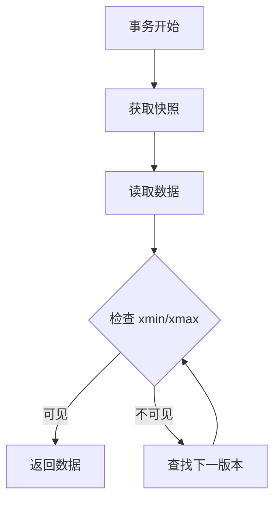
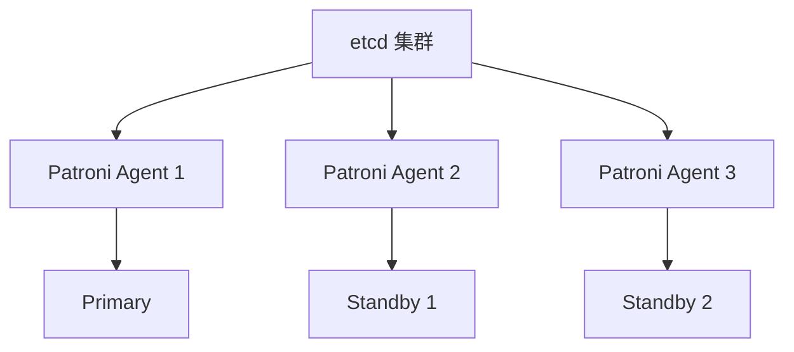
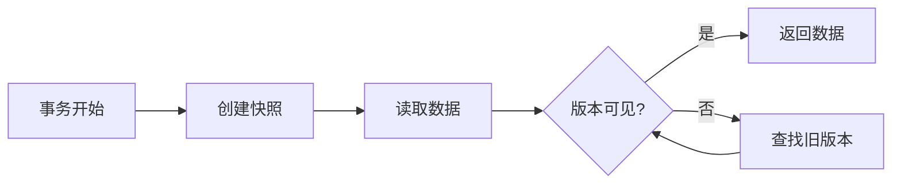

# PostgreSQL 深度篇（关系型数据库 / 开源最强关系库）

> PostgreSQL 是**开源最强关系型数据库**：支持 SQL 标准最完整、扩展性最强（自定义类型/函数/索引）、JSON 支持原生、地理空间（PostGIS）、全文搜索内置。相比 MySQL（简单但功能少），PostgreSQL 以「功能丰富 + 扩展性强 + 性能优越」成为复杂业务首选。本篇按「解决的问题 → 原理 → 特性 → 选型关注点」拆解。

---

## 一、要解决的问题

| 痛点 | 说明 |
|------|------|
| MySQL 功能不足 | 窗口函数/CTE/全文搜索/JSON 支持弱 |
| 复杂查询 | 分析型查询（OLAP）性能差 |
| 扩展性 | 需要自定义数据类型/索引/函数 |
| 地理数据 | 需要地理空间查询（LBS/地图） |
| 多模型 | 关系+文档+图+时序 多模型需求 |

> 核心认知：**PostgreSQL = 开源数据库的「瑞士军刀」**——关系型为主，兼顾文档/地理/全文/时序/图。

---

## 二、PostgreSQL 核心原理

### 2.1 架构

```
PostgreSQL Server
  ├── Postmaster（主进程）
  │   ├── 监听连接
  │   ├──  fork 子进程（每个连接一个 Backend）
  │   └── 管理辅助进程
  ├── Backend（后端进程）
  │   ├── 解析 SQL → 解析树
  │   ├── 优化器（基于代价 CBO）→ 执行计划
  │   └── 执行器 → 返回结果
  ├── 共享内存
  │   ├── Shared Buffer（数据页缓存）
  │   ├── WAL Buffer（写前日志缓冲）
  │   └── Lock Table（锁表）
  └── 辅助进程
      ├── WAL Writer（WAL 写磁盘）
      ├── Checkpointer（检查点）
      ├── Autovacuum（自动清理死元组）
      ├── Background Writer（后台写脏页）
      ├── Stats Collector（统计信息收集）
      └── Logical Replication（逻辑复制）
```

### 2.2 MVCC（多版本并发控制）

- **原理**：不锁读，写操作创建新版本（元组），读操作根据事务快照读合适版本
- **实现**：每行带 `xmin`（创建事务ID）/ `xmax`（删除事务ID），快照判断可见性
- **Vacuum**：清理不再被任何事务可见的死元组（类似 Java GC）

**选型关注点**：MVCC 让 PG 读写不阻塞，但需定期 VACUUM 清理死元组（Autovacuum 自动执行）。

### 2.3 存储引擎

- **堆表（Heap Table）**：数据无序存储，索引指向 TID（页号+行号）
- **TOAST**：大字段（>2KB）自动压缩/行外存储
- **表空间**：数据文件分组管理

### 2.4 索引类型

| 索引类型 | 说明 | 适用场景 |
|----------|------|----------|
| B-Tree | 默认索引 | 等值/范围查询 |
| Hash | 哈希索引 | 等值查询（仅 WAL 恢复后可用） |
| GiST | 通用搜索树 | 地理/全文/几何 |
| GIN | 倒排索引 | JSON/数组/全文搜索 |
| BRIN | 块范围索引 | 时序/有序大数据（小体积） |
| SP-GiST | 空间分区树 | 电话路由/IP 路由 |
| Bloom | 布隆索引 | 多列联合过滤 |

**选型关注点**：JSON 查询 → GIN 索引；地理空间 → GiST + PostGIS；时序 → BRIN（体积小、性能好）。

### 2.5 查询优化器

- **基于代价（CBO）**：统计信息（`pg_statistic`）估算代价
- **连接策略**：Nested Loop / Hash Join / Merge Join
- **并行查询**：多核并行顺序扫描/哈希连接/聚合
- **JIT 编译**：表达式 JIT 编译加速（PG 11+）

**选型关注点**：定期 `ANALYZE` 更新统计信息（Autovacuum 自动执行），优化器才能选对执行计划。

---

## 三、PostgreSQL 核心特性

| 特性 | 说明 |
|------|------|
| SQL 标准 | 支持最完整（窗口函数/CTE/递归查询/LATERAL） |
| JSON | 原生 JSONB（二进制存储 + GIN 索引 + 丰富操作符） |
| 全文搜索 | 内置 tsvector/tsquery（无需 ES 的轻量搜索） |
| 地理空间 | PostGIS 扩展（地理空间事实标准） |
| 扩展性 | 自定义类型/函数/索引/操作符/聚合 |
| 分区表 | 声明式分区（范围/列表/哈希） |
| 逻辑复制 | 基于 WAL 的逻辑复制（跨版本/跨库） |
| 外数据包装器 | FD（Foreign Data Wrapper）查询外部数据源 |
| 事务 | ACID + 可串行化快照隔离（SSI） |
| 可靠性 | WAL + 流复制 + 自动故障转移（Patroni） |

---

## 四、PostgreSQL vs MySQL vs Oracle

| 维度 | PostgreSQL | MySQL | Oracle |
|------|------------|-------|--------|
| SQL 标准 | 最完整 | 部分 | 完整 |
| 窗口函数 | 完整 | 8.0+ 支持 | 完整 |
| CTE/递归 | 完整 | 8.0+ 支持 | 完整 |
| JSON | JSONB（强） | JSON（中） | JSON（强） |
| 全文搜索 | 内置 | 需 ES | Oracle Text |
| 地理空间 | PostGIS（最强） | 基础 | Spatial |
| 扩展性 | 极强 | 弱 | 强 |
| 分区表 | 声明式 | 5.7+ 支持 | 成熟 |
| 主从复制 | 流复制+逻辑复制 | binlog 复制 | Data Guard |
| 高可用 | Patroni/Repmgr | MHA/Group Replication | RAC/Data Guard |
| 成本 | 开源免费 | 开源免费 | 商业昂贵 |
| 性能 | 高 | 读快写中 | 最高 |
| 生态 | 丰富 | 最丰富 | 丰富 |

**选型关注点**：
- 复杂查询/分析/地理空间/全文搜索 → **PostgreSQL**
- 简单 OLTP/读多写少/MySQL 生态 → **MySQL**
- 金融级高可用/预算充足 → **Oracle**
- 云托管 → **Aurora（MySQL/PG 兼容）/ Cloud SQL / PolarDB**

---

## 五、PostgreSQL 扩展生态

| 扩展 | 说明 |
|------|------|
| PostGIS | 地理空间（事实标准） |
| TimescaleDB | 时序数据库（基于 PG 的时序扩展） |
| Citus | 分布式 PG（分片） |
| pg_partman | 自动分区管理 |
| pg_stat_statements | SQL 性能统计 |
| pg_trgm | 三元组模糊搜索 |
| pgvector | 向量检索（AI 嵌入） |
| zhparser/pg_jieba | 中文全文搜索 |
| pgpool-II | 连接池/负载均衡/读写分离 |

**选型关注点**：
- 时序数据 → TimescaleDB（PG 扩展，无需换数据库）
- 向量检索（AI） → pgvector
- 分布式 → Citus
- 中文全文搜索 → pg_jieba/zhparser

---

## 六、PostgreSQL 生产实践

### 6.1 关键配置

| 配置 | 建议 |
|------|------|
| shared_buffers | 25% 内存 |
| effective_cache_size | 75% 内存 |
| work_mem | 排序/哈希内存（按并发调整） |
| maintenance_work_mem | VACUUM/索引创建内存 |
| wal_level | replica（流复制） |
| max_connections | 合理设置（过多耗内存） |

### 6.2 高可用方案

| 方案 | 说明 |
|------|------|
| Patroni + etcd | 自动故障转移（推荐） |
| Repmgr | 复制管理器 |
| pgpool-II | 连接池 + 读写分离 |
| 流复制 | 主从异步/同步复制 |

### 6.3 备份

| 方式 | 说明 |
|------|------|
| pg_dump | 逻辑备份（SQL 导出） |
| pg_basebackup | 物理备份（全量） |
| WAL 归档 | 持续归档（PITR 时间点恢复） |
| pgBackRest | 专业备份工具 |

---

## 七、选型速查

| 需求 | 首选 | 备选 |
|------|------|------|
| 复杂查询/分析 | PostgreSQL | Oracle |
| 地理空间 | PostgreSQL + PostGIS | — |
| 全文搜索（轻量） | PostgreSQL 内置 | Elasticsearch |
| 时序数据 | TimescaleDB | TDengine/InfluxDB |
| 向量检索 | pgvector | Milvus |
| 分布式关系库 | Citus / TiDB | Spanner |
| 简单 OLTP | MySQL | PostgreSQL |
| 云托管 | Aurora / Cloud SQL / PolarDB | — |

---

## 八、PostgreSQL MVCC 内部原理

### 8.1 MVCC 架构



### 8.2 元组结构

| 字段 | 说明 |
|------|------|
| xmin | 创建该版本的事务 ID |
| xmax | 删除/更新该版本的事务 ID（0 表示未删除） |
| ctid | 指向新版本的指针（更新链） |
| infomask | 事务状态标志位 |

### 8.3 事务快照

```
快照组成：
  xmin：最小活跃事务 ID（小于该 ID 的事务已提交）
  xmax：下一个分配的事务 ID
  xip_list：活跃事务 ID 列表

可见性判断：
  1. 如果 xmin 已提交 AND xmin < snapshot.xmin → 可见
  2. 如果 xmin 未提交 OR xmin 在 xip_list 中 → 不可见
  3. 如果 xmax 已提交 AND xmax < snapshot.xmin → 不可见
  4. 如果 xmax 未提交 OR xmax 在 xip_list 中 → 可见
```

### 8.4 更新链

```
更新操作：
  旧版本：xmax 设置为当前事务 ID
  新版本：xmin 设置为当前事务 ID
  旧版本 ctid 指向新版本

查询时：
  沿更新链找到可见版本
  可能需要遍历多个版本
```

### 8.5 MVCC vs 锁

| 维度 | MVCC | 锁 |
|------|------|-----|
| 读写阻塞 | 不阻塞 | 阻塞 |
| 空间开销 | 多版本存储 | 无额外开销 |
| 清理机制 | VACUUM | 锁释放 |
| 适用 | OLTP | 特殊场景 |

---

## 九、PostgreSQL VACUUM 与 Autovacuum

### 9.1 死元组问题

```
死元组产生：
  UPDATE：创建新版本，旧版本变成死元组
  DELETE：标记删除，变成死元组

影响：
  空间膨胀（存储浪费）
  查询变慢（扫描更多元组）
  索引膨胀（索引条目增多）
```

### 9.2 VACUUM 类型

| 类型 | 说明 | 效果 |
|------|------|------|
| VACUUM | 标记死元组空间可复用 | 不释放磁盘空间 |
| VACUUM FULL | 重写表释放空间 | 释放磁盘空间（锁表） |
| Autovacuum | 自动 VACUUM | 定期清理 |

### 9.3 Autovacuum 配置

```sql
-- 启用 Autovacuum
ALTER SYSTEM SET autovacuum = on;

-- 配置阈值
ALTER SYSTEM SET autovacuum_vacuum_threshold = 50;
ALTER SYSTEM SET autovacuum_vacuum_scale_factor = 0.1;
ALTER SYSTEM SET autovacuum_analyze_threshold = 50;
ALTER SYSTEM SET autovacuum_analyze_scale_factor = 0.05;

-- 配置资源
ALTER SYSTEM SET autovacuum_max_workers = 3;
ALTER SYSTEM SET autovacuum_naptime = '1min';
```

### 9.4 VACUUM 最佳实践

| 实践 | 说明 |
|------|------|
| 开启 Autovacuum | 必须开启 |
| 合理阈值 | 避免过于频繁/不及时 |
| 专用磁盘 | VACUUM IO 放专用磁盘 |
| 监控膨胀 | 定期检查表膨胀率 |
| 避免长事务 | 长事务阻止清理 |

### 9.5 XID Wraparound

```
问题：
  事务 ID 32 位（约 40 亿）
  达到阈值 → 数据库停机保护

预防：
  Autovacuum 定期清理
  监控 XID 消耗
  设置 autovacuum_freeze_max_age

处理：
  告警时手动 VACUUM FREEZE
  极端情况 pg_resetwal
```

---

## 十、PostgreSQL 分区策略

### 10.1 分区类型对比

| 类型 | 说明 | 适用 |
|------|------|------|
| Range | 范围分区 | 时间/数值范围 |
| List | 列表分区 | 离散值（地区/类型） |
| Hash | 哈希分区 | 均匀分布 |

### 10.2 分区裁剪（Partition Pruning）

```
原理：
  查询条件与分区键匹配
  只扫描相关分区
  减少 IO 和查询时间

示例：
  WHERE created_at >= '2026-01-01'
  → 只扫描 2026-01 及之后的分区

配置：
  SET enable_partition_pruning = on;
```

### 10.3 分区表最佳实践

| 实践 | 说明 |
|------|------|
| 按时间分区 | 时序数据首选 |
| 预创建分区 | 避免写入失败 |
| 自动化管理 | pg_partman |
| 分区键选择 | 高频查询条件 |
| 分区数量控制 | 避免过多分区 |

### 10.4 分区维护

```sql
-- 自动创建分区
CREATE EXTENSION pg_partman;
SELECT partman.create_parent('public.orders', 'created_at', 'native', 'monthly');

-- 手动创建分区
CREATE TABLE orders_2026_03 PARTITION OF orders
    FOR VALUES FROM ('2026-03-01') TO ('2026-04-01');

-- 删除旧分区
DROP TABLE orders_2025_01;
```

---

## 十一、PostgreSQL 逻辑复制

### 11.1 逻辑复制原理


### 11.2 逻辑复制 vs 流复制

| 维度 | 逻辑复制 | 流复制 |
|------|----------|--------|
| 复制级别 | 指定表 | 整个实例 |
| 数据同步 | 逻辑变更 | 物理 WAL |
| 跨版本 | 支持 | 不支持 |
| DDL | 不复制 | 复制 |
| 用途 | 跨库同步/升级 | 高可用/灾备 |

### 11.3 逻辑复制配置

```sql
-- 发布端
ALTER SYSTEM SET wal_level = logical;
CREATE PUBLICATION my_pub FOR TABLE orders, users;

-- 订阅端
CREATE SUBSCRIPTION my_sub
    CONNECTION 'host=master dbname=mydb user=replicator'
    PUBLICATION my_pub;

-- 管理
ALTER SUBSCRIPTION my_sub REFRESH PUBLICATION;
DROP SUBSCRIPTION my_sub;
```

### 11.4 逻辑复制限制

| 限制 | 说明 |
|------|------|
| DDL 复制 | 不支持 |
| 序列 | 不复制 |
| 大对象 | 不复制 |
| 外键约束 | 不检查 |
| 触发器 | 不触发 |

---

## 十二、PostgreSQL 扩展生态

### 12.1 核心扩展

| 扩展 | 说明 | 适用 |
|------|------|------|
| PostGIS | 地理空间 | LBS/地图 |
| TimescaleDB | 时序数据 | IoT/监控 |
| Citus | 分布式 | 大规模数据 |
| pgvector | 向量检索 | AI/推荐 |
| pg_partman | 分区管理 | 自动分区 |
| pg_stat_statements | SQL 统计 | 性能分析 |
| pg_trgm | 模糊搜索 | 搜索 |

### 12.2 扩展安装

```sql
-- 安装扩展
CREATE EXTENSION IF NOT EXISTS postgis;
CREATE EXTENSION IF NOT EXISTS timescaledb;
CREATE EXTENSION IF NOT EXISTS citus;
CREATE EXTENSION IF NOT EXISTS vector;

-- 查看已安装扩展
SELECT * FROM pg_extension;
```

### 12.3 扩展选型

| 需求 | 扩展 |
|------|------|
| 地理空间 | PostGIS |
| 时序数据 | TimescaleDB |
| 分布式 | Citus |
| 向量检索 | pgvector |
| 模糊搜索 | pg_trgm |
| 中文全文 | zhparser/pg_jieba |

---

## 十三、PostgreSQL 云托管

### 13.1 Aurora PostgreSQL

| 特性 | 说明 |
|------|------|
| 存储计算分离 | 类似 Pulsar 架构 |
| 自动扩展 | 存储自动扩展到 128TB |
| 高可用 | 6 副本，3 可用区 |
| 备份 | 连续备份到 S3 |
| 性能 | 比标准 PG 快 5 倍 |

### 13.2 Supabase

| 特性 | 说明 |
|------|------|
| 开源 Firebase | 基于 PostgreSQL |
| 实时订阅 | WebSocket 实时推送 |
| 认证 | 内置用户认证 |
| 存储 | 对象存储 |
| Edge Functions | Serverless 函数 |

### 13.3 云托管选型

| 服务 | 说明 | 适用 |
|------|------|------|
| Aurora PostgreSQL | AWS 托管 | 企业级 |
| Cloud SQL | Google 托管 | 中小规模 |
| PolarDB | 阿里云托管 | 国内场景 |
| Supabase | 开源 BaaS | 快速开发 |

---

## 十四、PostgreSQL 性能调优

### 14.1 配置调优

| 参数 | 说明 | 建议 |
|------|------|------|
| shared_buffers | 数据页缓存 | 25% 内存 |
| effective_cache_size | 优化器估算 | 75% 内存 |
| work_mem | 排序/哈希内存 | 按并发调整 |
| maintenance_work_mem | VACUUM 内存 | 1~2GB |
| max_connections | 最大连接数 | 合理设置 |
| wal_buffers | WAL 缓冲 | 64MB |

### 14.2 SQL 调优

| 技巧 | 说明 |
|------|------|
| EXPLAIN ANALYZE | 分析执行计划 |
| 合理索引 | B-Tree/GiST/GIN |
| 避免 SELECT * | 只查询需要的列 |
| 批量操作 | 批量 INSERT/UPDATE |
| 连接池 | PgBouncer |

### 14.3 监控指标

```
关键指标：
  缓存命中率（>95%）
  连接数使用率
  查询延迟（P99）
  VACUUM 进度
  复制延迟
  磁盘使用率
```

---

## 十五、PostgreSQL vs MySQL 深度对比

### 15.1 核心差异

| 维度 | PostgreSQL | MySQL |
|------|------------|-------|
| SQL 标准 | 最完整 | 部分支持 |
| MVCC | 多版本 | 单版本 |
| 索引 | B-Tree/GiST/GIN/BRIN | B-Tree/Hash |
| 分区 | 声明式 | 5.7+ 支持 |
| JSON | JSONB（二进制） | JSON（文本） |
| 全文搜索 | 内置 | 需 ES |
| 地理空间 | PostGIS（最强） | 基础 |
| 扩展性 | 极强 | 弱 |
| 复制 | 流复制+逻辑复制 | binlog 复制 |

### 15.2 选型决策

| 场景 | 选择 |
|------|------|
| 复杂查询/分析 | PostgreSQL |
| 地理空间 | PostgreSQL + PostGIS |
| 全文搜索 | PostgreSQL |
| 简单 OLTP | MySQL |
| 读多写少 | MySQL |
| 高并发写入 | MySQL |
| 云托管 | Aurora（两者都支持） |

---

## 十六、PostgreSQL 连接池与云托管深度

### 16.1 PgBouncer 连接池

```
PgBouncer 定位：
  轻量级连接池代理，降低 PostgreSQL 连接开销
  每个连接 = 一个 Backend 进程（fork 模型），连接池复用避免频繁 fork

三种池化模式：
  session：连接释放时归还池（最安全，兼容性最好）
  transaction：事务结束归还（推荐，减少连接占用）
  statement：语句结束归还（最激进，不支持多语句事务）

配置示例（pgbouncer.ini）：
  [databases]
  mydb = host=127.0.0.1 port=5432 dbname=mydb

  [pgbouncer]
  pool_mode = transaction
  max_client_conn = 1000
  default_pool_size = 20
  min_pool_size = 5
  reserve_pool_size = 5
  reserve_pool_timeout = 3
  server_lifetime = 3600
  server_idle_timeout = 600
  log_connections = 1
  log_disconnections = 1
```

| 参数 | 说明 | 建议 |
|------|------|------|
| pool_mode | 池化模式 | transaction（推荐） |
| max_client_conn | 最大客户端连接 | 按业务峰值设 |
| default_pool_size | 每用户每库连接数 | 20~50 |
| reserve_pool_size | 预留连接 | 5~10 |
| server_lifetime | 服务端连接存活时间 | 3600s |

### 16.2 Pgpool-II vs PgBouncer

| 维度 | PgBouncer | Pgpool-II |
|------|-----------|-----------|
| 定位 | 纯连接池 | 连接池 + 读写分离 + 负载均衡 + 复制 |
| 复杂度 | 低（单进程） | 高（多进程） |
| 读写分离 | 不支持 | 原生支持 |
| 故障转移 | 不支持 | 支持（检测 + 切换） |
| 查询缓存 | 不支持 | 支持（但意义不大） |
| 适用 | 高并发连接池 | 需要读写分离/HA 的场景 |

### 16.3 连接池最佳实践

```
选型建议：
  简单连接池 → PgBouncer（轻量、高效）
  需要读写分离 → Pgpool-II 或应用层路由
  云托管 → 云厂商内置连接池（Aurora/RDS Proxy）

生产配置：
  1. pool_mode=transaction（避免长事务占连接）
  2. max_client_conn 按峰值 QPS × 平均事务时间估算
  3. default_pool_size 按后端连接数 × 节点数估算
  4. 启用 log_connections/log_disconnections 审计
  5. 配合 PostgreSQL 的 max_connections 一起调
```

### 16.4 云托管 PostgreSQL 选型

| 服务 | 特性 | 适用 |
|------|------|------|
| Aurora PostgreSQL | 存算分离、自动扩展、6 副本 | 企业级、高可用 |
| Cloud SQL | Google 托管、简单易用 | 中小规模 |
| PolarDB | 阿里云托管、共享存储 | 国内场景 |
| Supabase | 开源 BaaS、实时订阅 | 快速开发 |
| Neon | Serverless PostgreSQL、分支 | 开发测试 |
| Amazon RDS Proxy | 托管连接池 | Aurora/RDS 配套 |

```
Aurora PostgreSQL 深度：
  存储层：6 副本跨 3 AZ，写 4/6 确认即返回
  计算层：最多 15 只读副本，自动负载均衡
  扩展：存储自动扩展到 128TB，无需预配
  备份：连续备份到 S3，秒级 RPO
  性能：比标准 PG 快 5 倍（写）/ 3 倍（读）
  Serverless：按需自动扩缩，适合开发/测试/突发
```

### 16.5 PostgreSQL 扩展生态补充

| 扩展 | 说明 | 适用 |
|------|------|------|
| PostGIS | 地理空间查询（事实标准） | LBS/地图 |
| pgvector | 向量检索（AI 嵌入） | RAG/推荐 |
| TimescaleDB | 时序数据（自动分区+压缩） | IoT/监控 |
| Citus | 分布式 PG（分片） | 大规模数据 |
| pg_partman | 自动分区管理 | 时序/归档 |
| pg_stat_statements | SQL 性能统计 | 慢查询分析 |
| pg_trgm | 三元组模糊搜索 | 模糊匹配 |
| zhparser/pg_jieba | 中文全文搜索 | 中文检索 |
| pg_cron | 定时任务 | 数据维护 |
| pgAudit | 审计日志 | 合规 |

### 16.6 PostgreSQL 逻辑复制高级用法

```sql
-- 逻辑复制 + 过滤
CREATE PUBLICATION my_pub FOR TABLE orders, users
  WITH (publish = 'insert,update');

-- 选择性复制（只复制特定列）
CREATE PUBLICATION my_pub FOR TABLE orders
  (order_id, user_id, amount);

-- 跨版本迁移（PG 14 → PG 16）
-- 1. 目标库安装新版本 PG
-- 2. pg_dumpall --binary-upgrade 旧库
-- 3. 逻辑复制同步增量数据
-- 4. 切流到新库

-- 逻辑复制监控
SELECT * FROM pg_stat_replication;
SELECT * FROM pg_stat_subscription;
SELECT pg_size_bytes(pg_wal_lsn_diff(
  pg_current_wal_lsn(), replay_lsn
)) AS replication_lag;
```

### 16.7 PostgreSQL 监控查询大全

```sql
-- 连接数监控
SELECT count(*), state FROM pg_stat_activity GROUP BY state;
SELECT pid, usename, application_name, state, query_start, query
  FROM pg_stat_activity WHERE state != 'idle' ORDER BY query_start;

-- 慢查询（pg_stat_statements）
SELECT query, calls, total_exec_time, mean_exec_time, rows
  FROM pg_stat_statements ORDER BY total_exec_time DESC LIMIT 10;

-- 缓存命中率
SELECT sum(blks_hit) / (sum(blks_hit) + sum(blks_read)) AS hit_ratio
  FROM pg_stat_database;

-- 表膨胀检测
SELECT schemaname, relname, n_dead_tup, n_live_tup,
  round(n_dead_tup::numeric / (n_live_tup + 1) * 100, 2) AS dead_ratio
  FROM pg_stat_user_tables ORDER BY n_dead_tup DESC;

-- 复制延迟
SELECT client_addr, state, sync_state,
  pg_size_bytes(pg_wal_lsn_diff(pg_current_wal_lsn(), replay_lsn)) AS lag
  FROM pg_stat_replication;

-- 锁等待
SELECT blocked.pid AS blocked_pid, blocked.query AS blocked_query,
  blocking.pid AS blocking_pid, blocking.query AS blocking_query
  FROM pg_stat_activity blocked
  JOIN pg_locks bl ON blocked.pid = bl.pid AND NOT bl.granted
  JOIN pg_locks gl ON bl.locktype = gl.locktype
    AND bl.database IS NOT DISTINCT FROM gl.database
    AND bl.relation IS NOT DISTINCT FROM gl.relation
    AND bl.page IS NOT DISTINCT FROM gl.page
    AND bl.tuple IS NOT DISTINCT FROM gl.tuple
    AND bl.transactionid IS NOT DISTINCT FROM gl.transactionid
    AND bl.pid != gl.pid AND gl.granted
  JOIN pg_stat_activity blocking ON gl.pid = blocking.pid;
```

### 16.8 PostgreSQL Partitioning 深度

```sql
-- 哈希分区（均匀分布）
CREATE TABLE orders (
  id BIGSERIAL,
  user_id BIGINT,
  amount DECIMAL(10,2)
) PARTITION BY HASH (user_id);

CREATE TABLE orders_p0 PARTITION OF orders FOR VALUES WITH (MODULUS 4, REMAINDER 0);
CREATE TABLE orders_p1 PARTITION OF orders FOR VALUES WITH (MODULUS 4, REMAINDER 1);
CREATE TABLE orders_p2 PARTITION OF orders FOR VALUES WITH (MODULUS 4, REMAINDER 2);
CREATE TABLE orders_p3 PARTITION OF orders FOR VALUES WITH (MODULUS 4, REMAINDER 3);

-- 默认分区（兜底）
CREATE TABLE orders_default PARTITION OF orders DEFAULT;

-- 分区维护自动化
CREATE EXTENSION pg_partman;
SELECT partman.create_parent('public.orders', 'created_at', 'native', 'monthly',
  p_template_table := 'public.orders_template');

-- 分区数据迁移（冷热分离）
ALTER TABLE orders DETACH PARTITION orders_2025_01 CONCURRENTLY;
-- 导出到冷存储
COPY orders_2025_01 TO '/cold_storage/orders_2025_01.csv';
-- 删除旧分区
DROP TABLE orders_2025_01;
```

### 16.9 PostgreSQL 性能调优清单

| 调优项 | 做法 | 效果 |
|--------|------|------|
| shared_buffers | 25% 系统内存 | 减少磁盘读 |
| effective_cache_size | 75% 系统内存 | 优化器估算更准 |
| work_mem | 256MB~1GB（按并发调） | 排序/哈希加速 |
| maintenance_work_mem | 2~4GB | VACUUM/索引加速 |
| wal_buffers | 64MB | 写入加速 |
| max_parallel_workers_per_gather | CPU 核数/2 | 并行查询 |
| random_page_cost | SSD 设为 1.1 | 优化器更倾向索引 |
| effective_io_concurrency | SSD 设为 200 | 并行 IO |

---

## 十七、PostgreSQL MVCC 实现（tuple visibility/Vacuum/Bloat）

### 17.1 Tuple 可见性判断

```
MVCC 可见性判断流程：
  1. 获取事务快照（snapshot）
  2. 检查 xmin（创建事务 ID）
     - xmin 未提交 → 不可见
     - xmin 已提交但 > snapshot.xmax → 不可见
     - xmin 已提交且 < snapshot.xmin → 可见
  3. 检查 xmax（删除事务 ID）
     - xmax = 0 → 未删除
     - xmax 已提交且 < snapshot.xmax → 已删除
     - xmax 未提交 → 未删除

  可见性判断公式：
    visible = (xmin committed AND xmin < snapshot.xmin)
              AND (xmax = 0 OR xmax uncommitted OR xmax > snapshot.xmax)
```

### 17.2 Vacuum 与 Bloat

```
死元组产生：
  UPDATE：创建新版本，旧版本变成死元组
  DELETE：标记删除，变成死元组

Bloat 问题：
  表膨胀：死元组占用空间，查询变慢
  索引膨胀：索引条目增多，维护成本高

Vacuum 类型：
  VACUUM：标记死元组空间可复用
  VACUUM FULL：重写表释放空间（锁表）
  Autovacuum：自动 VACUUM
```

## 十八、分区表（Declarative Partitioning/分区裁剪）

### 18.1 声明式分区

```sql
-- 范围分区（按时间）
CREATE TABLE orders (
    id BIGSERIAL,
    user_id BIGINT,
    amount DECIMAL(10,2),
    created_at TIMESTAMPTZ
) PARTITION BY RANGE (created_at);

CREATE TABLE orders_2026_01 PARTITION OF orders
    FOR VALUES FROM ('2026-01-01') TO ('2026-02-01');
CREATE TABLE orders_2026_02 PARTITION OF orders
    FOR VALUES FROM ('2026-02-01') TO ('2026-03-01');

-- 列表分区（按地区）
CREATE TABLE users (
    id BIGSERIAL,
    name TEXT,
    region TEXT
) PARTITION BY LIST (region);

CREATE TABLE users_cn PARTITION OF users FOR VALUES IN ('中国');
CREATE TABLE users_us PARTITION OF users FOR VALUES IN ('美国');
```

### 18.2 分区裁剪（Partition Pruning）

```sql
-- 自动分区裁剪（只扫描相关分区）
EXPLAIN SELECT * FROM orders WHERE created_at >= '2026-02-01';
-- → 只扫描 orders_2026_02 分区

-- 手动设置
SET enable_partition_pruning = on;
```

## 十九、JSONB 索引（GIN/GiST 索引）

### 19.1 GIN 索引

```sql
-- 创建 GIN 索引（支持 @>、?、?|、?& 操作符）
CREATE INDEX idx_metadata_gin ON products USING GIN (metadata);

-- JSONB 查询
SELECT * FROM products WHERE metadata @> '{"color": "red"}';
SELECT * FROM products WHERE metadata ? 'price';
SELECT * FROM products WHERE metadata ?| array['color', 'size'];
```

### 19.2 GiST 索引

```sql
-- 创建 GiST 索引（支持 @>、<@、&& 操作符）
CREATE INDEX idx_metadata_gist ON products USING GiST (metadata);

-- GiST 索引适合范围查询
SELECT * FROM products WHERE metadata @> '{"price": {"min": 100, "max": 500}}';
```

## 二十、连接池（PgBouncer/Pgpool-II）

### 20.1 PgBouncer 配置

```ini
# pgbouncer.ini
[databases]
mydb = host=127.0.0.1 port=5432 dbname=mydb

[pgbouncer]
pool_mode = transaction
max_client_conn = 1000
default_pool_size = 20
min_pool_size = 5
reserve_pool_size = 5
server_lifetime = 3600
server_idle_timeout = 600
```

### 20.2 PgBouncer vs Pgpool-II

| 维度 | PgBouncer | Pgpool-II |
|------|-----------|-----------|
| 定位 | 纯连接池 | 连接池+读写分离+HA |
| 复杂度 | 低（单进程） | 高（多进程） |
| 读写分离 | 不支持 | 原生支持 |
| 故障转移 | 不支持 | 支持 |

## 二十一、逻辑复制 vs 流复制

| 维度 | 逻辑复制 | 流复制 |
|------|----------|--------|
| 复制级别 | 指定表 | 整个实例 |
| 数据同步 | 逻辑变更 | 物理 WAL |
| 跨版本 | 支持 | 不支持 |
| DDL | 不复制 | 复制 |
| 用途 | 跨库同步/升级 | 高可用/灾备 |

## 二十二、高可用（Patroni+etcd 架构）

### 22.1 Patroni 架构



### 22.2 Patroni 配置

```yaml
# patroni.yml
scope: postgres-cluster
name: node1
etcd3:
  hosts: 10.0.0.1:2379,10.0.0.2:2379,10.0.0.3:2379
bootstrap:
  dcs:
    ttl: 30
    loop_wait: 10
    retry_timeout: 10
    maximum_lag_on_failover: 1048576
postgresql:
  listen: 0.0.0.0:5432
  data_dir: /var/lib/postgresql/data
  authentication:
    replication:
      username: replicator
      password: password
    superuser:
      username: postgres
      password: password
```

## 二十三、pg_stat_statements 慢查询分析

### 23.1 安装与配置

```sql
-- 安装扩展
CREATE EXTENSION pg_stat_statements;

-- 配置 postgresql.conf
shared_preload_libraries = 'pg_stat_statements'
pg_stat_statements.max = 10000
pg_stat_statements.track = all
```

### 23.2 慢查询分析

```sql
-- 查看慢查询 Top 10
SELECT
    query,
    calls,
    total_exec_time,
    mean_exec_time,
    rows
FROM pg_stat_statements
ORDER BY total_exec_time DESC
LIMIT 10;

-- 查看按调用次数排序
SELECT
    query,
    calls,
    total_exec_time,
    mean_exec_time
FROM pg_stat_statements
ORDER BY calls DESC
LIMIT 10;
```

## 十七、与其他板块的关系

- MySQL 知识见「[基础知识/mysql知识](../mysql知识.md)」；
- 分库分表见「[分库分表 ShardingSphere](./分库分表ShardingSphere.md)」与「[分库分表板块](../../分库分表与数据迁移/)」；
- 时序数据库见「[时序库](../时序库/README.md)」；
- 云上数据库见「[云上数据库与缓存生态](./云上数据库与缓存生态.md)」。

> 一句话：**PostgreSQL = SQL 标准最完整 + JSONB + PostGIS + 扩展性极强；选型先看「功能需求（地理/全文/向量→PG）」，再定「规模（单机/Citus 分布式/TimescaleDB 时序）」，最后配「高可用（Patroni + 流复制）」**。

---

## 九、PostgreSQL 查询优化深度

### 9.1 EXPLAIN ANALYZE 详解

```sql
EXPLAIN (ANALYZE, BUFFERS, FORMAT TEXT)
SELECT * FROM orders WHERE user_id = 123 AND status = 'paid';

-- 输出解读
-- Seq Scan on orders  (cost=0.00..1234.56 rows=10 width=128) (actual time=0.015..12.345 rows=10 loops=1)
--   Filter: (user_id = 123 AND status = 'paid')
--   Rows Removed by Filter: 99990
--   Buffers: shared hit=1000
-- Planning Time: 0.1 ms
-- Execution Time: 12.5 ms
```

| 指标 | 含义 |
|------|------|
| cost | 启动代价..总代价（估算） |
| rows | 估算返回行数 |
| actual time | 实际执行时间 |
| Buffers | 共享缓冲区命中/读取 |
| Rows Removed by Filter | 被过滤掉的行数 |

### 9.2 执行计划类型

| 策略 | 说明 | 适用场景 |
|------|------|----------|
| Seq Scan | 全表顺序扫描 | 小表/无索引 |
| Index Scan | 索引扫描+回表 | 等值/范围查询 |
| Index Only Scan | 纯索引扫描（无需回表） | 覆盖索引 |
| Bitmap Index Scan | 位图索引扫描 | 多条件过滤 |
| Nested Loop | 嵌套循环连接 | 小结果集+索引 |
| Hash Join | 哈希连接 | 大结果集+等值连接 |
| Merge Join | 归并连接 | 已排序数据连接 |

### 9.3 统计信息与调优

```sql
-- 查看统计信息
SELECT * FROM pg_stats WHERE tablename = 'orders';

-- 手动更新统计
ANALYZE orders;

-- 调整统计采样精度
ALTER TABLE orders ALTER COLUMN user_id SET STATISTICS 1000;
```

---

## 十、PostgreSQL 分区表深度

### 10.1 声明式分区

```sql
-- 范围分区（按时间）
CREATE TABLE orders (
    id BIGSERIAL,
    user_id BIGINT,
    amount DECIMAL(10,2),
    created_at TIMESTAMPTZ
) PARTITION BY RANGE (created_at);

CREATE TABLE orders_2026_01 PARTITION OF orders
    FOR VALUES FROM ('2026-01-01') TO ('2026-02-01');
CREATE TABLE orders_2026_02 PARTITION OF orders
    FOR VALUES FROM ('2026-02-01') TO ('2026-03-01');

-- 列表分区（按地区）
CREATE TABLE users (
    id BIGSERIAL,
    name TEXT,
    region TEXT
) PARTITION BY LIST (region);

CREATE TABLE users_cn PARTITION OF users FOR VALUES IN ('中国');
CREATE TABLE users_us PARTITION OF users FOR VALUES IN ('美国');
```

### 10.2 分区裁剪（Partition Pruning）

```sql
-- 自动分区裁剪（只扫描相关分区）
EXPLAIN SELECT * FROM orders WHERE created_at >= '2026-02-01';
-- → 只扫描 orders_2026_02 分区

-- 手动设置
SET enable_partition_pruning = on;
```

### 10.3 自动分区管理

```sql
-- pg_partman 自动创建分区
CREATE EXTENSION pg_partman;
SELECT partman.create_parent('public.orders', 'created_at', 'native', 'monthly');
```

---

## 十一、PostgreSQL 逻辑复制与高可用

### 11.1 逻辑复制

```sql
-- 发布端
CREATE PUBLICATION my_pub FOR TABLE orders, users;

-- 订阅端
CREATE SUBSCRIPTION my_sub
    CONNECTION 'host=master dbname=mydb user=replicator'
    PUBLICATION my_pub;

-- 支持：跨版本/跨库/部分表复制
-- 不支持：DDL 复制
```

### 11.2 Patroni 高可用

```
Patroni + etcd/Consul
  ├── 自动故障检测
  ├── 自动主从切换
  ├── 配置管理
  └── 与 HAProxy/PgBouncer 集成

架构：
  etcd 集群 (3节点)
    ├── Leader 选举
    └── 配置存储

  PostgreSQL 集群
    ├── Primary (读写)
    ├── Standby1 (只读副本)
    └── Standby2 (只读副本)

  Patroni Agent (每个节点)
    ├── 监控 PostgreSQL 状态
    ├── 向 etcd 注册
    └── 执行切换
```

### 11.3 流复制 vs 逻辑复制

| 维度 | 流复制 | 逻辑复制 |
|------|--------|----------|
| 复制级别 | 整个实例 | 指定表 |
| 数据同步 | 物理 WAL 流 | 逻辑变更 |
| 跨版本 | 不支持 | 支持 |
| DDL | 复制 | 不复制 |
| 用途 | 高可用/灾备 | 跨库同步/升级 |

---

## 十二、PostgreSQL 扩展深度

### 12.1 TimescaleDB（时序扩展）

```sql
-- 创建超表（自动分区）
CREATE EXTENSION timescaledb;
SELECT create_hypertable('sensor_data', 'time');

-- 自动压缩
ALTER TABLE sensor_data SET (
    timescaledb.compress,
    timescaledb.compress_segmentby = 'device_id'
);

-- 连续聚合
CREATE MATERIALIZED VIEW hourly_stats WITH (timescaledb.continuous) AS
SELECT time_bucket('1 hour', time) AS bucket, device_id, AVG(value)
FROM sensor_data GROUP BY bucket, device_id;
```

### 12.2 Citus（分布式扩展）

```sql
-- 创建分布式表
CREATE EXTENSION citus;
SELECT create_distributed_table('orders', 'user_id');

-- 创建引用表（小表广播到所有节点）
SELECT create_reference_table('regions');
```

### 12.3 pgvector（向量检索）

```sql
CREATE EXTENSION vector;

-- 创建向量列
ALTER TABLE products ADD COLUMN embedding vector(1536);

-- 创建 HNSW 索引
CREATE INDEX ON products USING hnsw (embedding vector_cosine_ops);

-- 语义搜索
SELECT * FROM products
ORDER BY embedding <=> '[0.1, 0.2, ..., 0.1536]'
LIMIT 10;
```

---

## 十三、PostgreSQL 常见坑与最佳实践

| 坑 | 表现 | 解法 |
|----|------|------|
| 事务 ID 回卷 | 长事务导致 XID wraparound | 定期 VACUUM + 监控 XID |
| 死元组膨胀 | 未清理的旧版本占用空间 | Autovacuum + 手动 VACUUM |
| 连接数耗尽 | max_connections 过大 | 连接池（PgBouncer） |
| 长事务锁表 | 长事务持有锁 | 设置 statement_timeout |
| 分区表维护 | 忘记创建新分区 | pg_partman 自动管理 |
| WAL 日志堆积 | 复制槽未清理 | 监控复制延迟 + 删除无用槽 |
| 统计信息过时 | 优化器选错执行计划 | 定期 ANALYZE |
| 大表索引创建 | 长时间锁表 | CREATE INDEX CONCURRENTLY |

---

## PostgreSQL MVCC 深度解析

### MVCC 原理

```text
PostgreSQL MVCC（多版本并发控制）：
  1. 每行数据有 xmin 和 xmax 系统列
     - xmin：创建该行的事务ID
     - xmax：删除/更新该行的事务ID（0表示未删除）

  2. 事务隔离实现：
     - 读操作不阻塞写操作
     - 写操作不阻塞读操作
     - 每个事务看到数据的一致性快照

  3. 可见性判断：
     - 检查 xmin 是否已提交
     - 检查 xmax 是否未提交或不存在
     - 根据隔离级别决定是否可见
```

### 事务ID与冻结

| 概念 | 说明 |
|------|------|
| Transaction ID | 32位无符号整数，循环使用 |
| Frozen ID | 冻结的事务ID，不再变化 |
| 事务ID回卷 | 当ID接近最大值时回卷到3 |
| autovacuum freeze | 自动冻结旧版本 |

```sql
-- 查看事务ID年龄
SELECT relname, age(relfrozenxid) as xid_age
FROM pg_class
WHERE relkind = 'r'
ORDER BY xid_age DESC;

-- 手动冻结
VACUUM FREEZE table_name;
```

---

## 分区表深度

### 分区策略

| 策略 | 说明 | 适用场景 |
|------|------|---------|
| Range | 范围分区 | 时间序列 |
| List | 列表分区 | 枚举值 |
| Hash | 哈希分区 | 均匀分布 |
| Multi-level | 复合分区 | 复杂场景 |

### 分区表创建

```sql
-- 创建范围分区
CREATE TABLE logs (
    id BIGSERIAL,
    created_at TIMESTAMP NOT NULL,
    message TEXT
) PARTITION BY RANGE (created_at);

-- 创建分区
CREATE TABLE logs_2025_01 PARTITION OF logs
    FOR VALUES FROM ('2025-01-01') TO ('2025-02-01');
CREATE TABLE logs_2025_02 PARTITION OF logs
    FOR VALUES FROM ('2025-02-01') TO ('2025-03-01');

-- 自动创建分区（使用 pg_partman）
CREATE EXTENSION pg_partman;
SELECT partman.create_parent('public.logs', 'created_at', 'native', 'monthly');
```

### 分区裁剪

```sql
-- 分区裁剪查询
EXPLAIN SELECT * FROM logs
WHERE created_at >= '2025-01-01' AND created_at < '2025-02-01';
-- 只扫描 logs_2025_01 分区

-- 验证分区裁剪
EXPLAIN ANALYZE SELECT * FROM logs
WHERE created_at = '2025-01-15';
-- Seq Scan on logs_2025_01
```

---

## JSONB 索引与查询

### JSONB 索引类型

```json
// GIN 索引（包含查询）
CREATE INDEX idx_data_gin ON documents USING gin(data);

// GIN 索引（特定路径）
CREATE INDEX idx_data_path ON documents USING gin((data->'tags'));

// B-tree 索引（特定值）
CREATE INDEX idx_data_key ON documents USING btree((data->>'status'));
```

### JSONB 查询操作

| 操作 | 说明 | 示例 |
|------|------|------|
| -> | 按键获取（JSON） | data->'name' |
| ->> | 按键获取（文本） | data->>'name' |
| @> | 包含查询 | data @> '{"status":"active"}' |
| ? | 键存在 | data ? 'name' |
| ?\| | 任一键存在 | data ?\| ARRAY['name','age'] |
| ?& | 所有键存在 | data ?& ARRAY['name','age'] |

```sql
-- JSONB 查询示例
SELECT * FROM documents
WHERE data @> '{"status": "active"}';

SELECT * FROM documents
WHERE data->>'type' = 'article';

-- JSONB 聚合
SELECT data->>'category' as category, COUNT(*)
FROM documents
GROUP BY data->>'category';
```

---

## 连接池配置

### PgBouncer 配置

```ini
# pgbouncer.ini
[databases]
mydb = host=localhost port=5432 dbname=mydb

[pgbouncer]
listen_addr = 0.0.0.0
listen_port = 6432
auth_type = md5
auth_file = /etc/pgbouncer/userlist.txt
pool_mode = transaction
default_pool_size = 20
max_client_conn = 1000
min_pool_size = 5
reserve_pool_size = 5
```

### 连接池模式

| 模式 | 说明 | 适用场景 |
|------|------|---------|
| Session | 会话级别 | 长连接 |
| Transaction | 事务级别 | 短事务 |
| Statement | 语句级别 | 无状态查询 |

---

## 高可用架构

### 高可用方案对比

| 方案 | RPO | RTO | 复杂度 |
|------|-----|-----|--------|
| 流复制 | 0（同步） | 秒级 | 低 |
| 逻辑复制 | 秒级 | 分钟级 | 中 |
| Patroni | 0 | 秒级 | 中 |
| pgpool-II | 0 | 秒级 | 高 |

### Patroni 高可用

```yaml
# patroni.yml
scope: postgres
name: node1
restapi:
  listen: 0.0.0.0:8008
  connect_address: 10.0.0.1:8008
etcd:
  hosts: 10.0.0.10:2379
bootstrap:
  dcs:
    ttl: 30
    loop_wait: 10
    retry_timeout: 10
    maximum_lag_on_failover: 1048576
postgresql:
  listen: 0.0.0.0:5432
  connect_address: 10.0.0.1:5432
  data_dir: /var/lib/postgresql/data
  authentication:
    replication:
      username: repl
      password: repl_password
    superuser:
      username: postgres
      password: postgres_password
```

---

## 调优参数

### 关键参数配置

| 参数 | 默认值 | 建议值 | 说明 |
|------|--------|--------|------|
| shared_buffers | 128MB | RAM/4 | 共享缓冲区 |
| effective_cache_size | 4GB | RAM*3/4 | 有效缓存 |
| work_mem | 4MB | 64MB | 排序/哈希操作内存 |
| maintenance_work_mem | 64MB | 512MB | 维护操作内存 |
| max_connections | 100 | 200-500 | 最大连接数 |
| wal_buffers | -1 | 64MB | WAL缓冲区 |
| checkpoint_completion_target | 0.9 | 0.9 | 检查点完成目标 |

---

## 十四、与其他板块的关系（扩展）

- MySQL 知识见「[基础知识/mysql知识](../mysql知识.md)」；
- 分库分表见「[分库分表 ShardingSphere](./分库分表ShardingSphere.md)」与「[分库分表板块](../../分库分表与数据迁移/)」；
- 时序数据库见「[时序库](../时序库/README.md)」；
- 云上数据库见「[云上数据库与缓存生态](./云上数据库与缓存生态.md)」；
- 高可用方案见「[容灾多活架构](../../架构/容灾多活与异地多中心架构.md)」；
- 对比 MySQL 见「[MySQL 知识](../mysql知识.md)」。

---

## 分区表实战

```sql
-- 范围分区
CREATE TABLE orders (
    id BIGSERIAL,
    user_id INT,
    amount DECIMAL(10,2),
    create_time TIMESTAMP
) PARTITION BY RANGE (create_time);

-- 创建分区
CREATE TABLE orders_2024_q1 PARTITION OF orders
    FOR VALUES FROM ('2024-01-01') TO ('2024-04-01');

CREATE TABLE orders_2024_q2 PARTITION OF orders
    FOR VALUES FROM ('2024-04-01') TO ('2024-07-01');

-- 哈希分区
CREATE TABLE users (
    id BIGSERIAL,
    username VARCHAR(50),
    email VARCHAR(100)
) PARTITION BY HASH (id);

CREATE TABLE users_p0 PARTITION OF users FOR VALUES WITH (MODULUS 4, REMAINDER 0);
CREATE TABLE users_p1 PARTITION OF users FOR VALUES WITH (MODULUS 4, REMAINDER 1);
```

### 分区类型对比

| 分区类型 | 适用场景 | 优势 | 劣势 |
|----------|----------|------|------|
| 范围分区 | 时间序列数据 | 查询高效 | 分区管理复杂 |
| 列表分区 | 固定枚举值 | 数据隔离 | 分区数量固定 |
| 哈希分区 | 数据均匀分布 | 写入均匀 | 范围查询低效 |
| 复合分区 | 复杂场景 | 灵活 | 配置复杂 |

## 并发控制机制

```sql
-- MVCC 隔离级别
SET TRANSACTION ISOLATION LEVEL READ COMMITTED;  -- 默认
SET TRANSACTION ISOLATION LEVEL REPEATABLE READ;
SET TRANSACTION ISOLATION LEVEL SERIALIZABLE;

-- 查看事务状态
SELECT * FROM pg_stat_activity WHERE state = 'active';

-- 查看锁等待
SELECT * FROM pg_locks WHERE NOT granted;
```

### 隔离级别对比

| 隔离级别 | 脏读 | 不可重复读 | 幻读 | 性能 |
|----------|------|------------|------|------|
| READ COMMITTED | 避免 | 可能 | 可能 | 高 |
| REPEATABLE READ | 避免 | 避免 | 可能 | 中 |
| SERIALIZABLE | 避免 | 避免 | 避免 | 低 |

## JSONB 高级查询

```sql
-- 创建JSONB索引
CREATE INDEX idx_metadata ON products USING GIN (metadata);

-- JSONB 查询
SELECT * FROM products WHERE metadata @> '{"color": "red"}';

-- JSONB 路径查询
SELECT * FROM products WHERE metadata->>'price'::numeric > 100;

-- JSONB 聚合
SELECT 
    metadata->>'category' as category,
    COUNT(*) as count,
    AVG((metadata->>'price')::numeric) as avg_price
FROM products
GROUP BY metadata->>'category';
```

### JSONB 操作符

| 操作符 | 说明 | 示例 |
|--------|------|------|
| @> | 包含 | '{"a":1}' @> '{"a":1,b":2}' |
| <@ | 被包含 | '{"a":1}' <@ '{"a":1,b":2}' |
| ? | 键存在 | '{"a":1}' ? 'a' |
| -> | 获取字段 | '{"a":1}'->'a' |
| ->> | 获取文本 | '{"a":1}'->>'a' |

## 扩展生态

```sql
-- 安装扩展
CREATE EXTENSION IF NOT EXISTS "uuid-ossp";
CREATE EXTENSION IF NOT EXISTS "pg_trgm";
CREATE EXTENSION IF NOT EXISTS "btree_gin";

-- PostGIS 地理扩展
CREATE EXTENSION postgis;
SELECT ST_Distance(
    ST_GeomFromText('POINT(1 1)', 4326),
    ST_GeomFromText('POINT(2 2)', 4326)
);

-- pgvector 向量扩展
CREATE EXTENSION vector;
CREATE TABLE embeddings (
    id SERIAL PRIMARY KEY,
    embedding VECTOR(1536)
);
SELECT * FROM embeddings ORDER BY embedding <-> '[1,2,3]' LIMIT 5;
```

### 常用扩展

| 扩展 | 说明 | 用途 |
|------|------|------|
| PostGIS | 地理信息 | 空间查询 |
| pg_trgm | 三元组匹配 | 模糊搜索 |
| pgvector | 向量检索 | AI相似搜索 |
| TimescaleDB | 时序数据 | IoT/监控 |
| Citus | 分布式 | 水平扩展 |

## 性能调优

```sql
-- 查看慢查询
SELECT query, calls, mean_time, total_time
FROM pg_stat_statements
ORDER BY mean_time DESC
LIMIT 10;

-- 查看索引使用情况
SELECT indexrelname, idx_scan, idx_tup_read, idx_tup_fetch
FROM pg_stat_user_indexes
ORDER BY idx_scan DESC;

-- 查看表统计
SELECT relname, n_tup_ins, n_tup_upd, n_tup_del, n_live_tup, n_dead_tup
FROM pg_stat_user_tables;
```

### 调优参数

| 参数 | 说明 | 推荐值 |
|------|------|--------|
| shared_buffers | 共享缓冲区 | 内存的25% |
| work_mem | 工作内存 | 64-256MB |
| effective_cache_size | 有效缓存 | 内存的75% |
| maintenance_work_mem | 维护内存 | 512MB-1GB |
| random_page_cost | 随机IO成本 | 1.1(SSD) |

---

## PostgreSQL 深度调优实战

### 查询优化深度

```sql
-- EXPLAIN ANALYZE 详解
EXPLAIN (ANALYZE, BUFFERS, FORMAT TEXT)
SELECT * FROM orders WHERE user_id = 123 AND status = 'paid';

-- 输出解读
-- Seq Scan on orders  (cost=0.00..1234.56 rows=10 width=128) (actual time=0.015..12.345 rows=10 loops=1)
--   Filter: (user_id = 123 AND status = 'paid')
--   Rows Removed by Filter: 99990
--   Buffers: shared hit=1000
-- Planning Time: 0.1 ms
-- Execution Time: 12.5 ms

-- 关键指标解释：
-- cost：启动代价..总代价（估算值）
-- rows：估算返回行数
-- actual time：实际执行时间（毫秒）
-- Buffers：共享缓冲区命中/读取
-- Rows Removed by Filter：被过滤掉的行数
```

### 执行计划类型对比

```text
执行计划策略选择：

┌─────────────────┬─────────────────┬─────────────────┬─────────────────┐
│ 策略            │ 说明            │ 适用场景        │ 性能特点        │
├─────────────────┼─────────────────┼─────────────────┼─────────────────┤
│ Seq Scan        │ 全表顺序扫描    │ 小表/无索引     │ IO 密集         │
│ Index Scan      │ 索引扫描+回表   │ 等值/范围查询   │ 索引命中高时快  │
│ Index Only Scan │ 纯索引扫描      │ 覆盖索引        │ 最快（无需回表）│
│ Bitmap Index    │ 位图索引扫描    │ 多条件过滤      │ 中等            │
│ Nested Loop     │ 嵌套循环连接    │ 小结果集+索引   │ 连接字段有索引时│
│ Hash Join       │ 哈希连接        │ 大结果集+等值   │ 内存充足时最快  │
│ Merge Join      │ 归并连接        │ 已排序数据      │ 数据已排序时快  │
└─────────────────┴─────────────────┴─────────────────┴─────────────────┘
```

### 统计信息与调优

```sql
-- 查看统计信息
SELECT * FROM pg_stats WHERE tablename = 'orders';

-- 手动更新统计
ANALYZE orders;

-- 调整统计采样精度
ALTER TABLE orders ALTER COLUMN user_id SET STATISTICS 1000;

-- 查看索引使用情况
SELECT indexrelname, idx_scan, idx_tup_read, idx_tup_fetch
FROM pg_stat_user_indexes
ORDER BY idx_scan DESC;

-- 查看未使用的索引（可考虑删除）
SELECT indexrelname, idx_scan
FROM pg_stat_user_indexes
WHERE idx_scan = 0
ORDER BY pg_relation_size(indexrelid) DESC;
```

### 分区表深度实战

```sql
-- 范围分区（按时间）
CREATE TABLE orders (
    id BIGSERIAL,
    user_id BIGINT,
    amount DECIMAL(10,2),
    created_at TIMESTAMPTZ
) PARTITION BY RANGE (created_at);

CREATE TABLE orders_2026_01 PARTITION OF orders
    FOR VALUES FROM ('2026-01-01') TO ('2026-02-01');
CREATE TABLE orders_2026_02 PARTITION OF orders
    FOR VALUES FROM ('2026-02-01') TO ('2026-03-01');

-- 哈希分区（均匀分布）
CREATE TABLE users (
    id BIGSERIAL,
    username VARCHAR(50),
    email VARCHAR(100)
) PARTITION BY HASH (id);

CREATE TABLE users_p0 PARTITION OF users FOR VALUES WITH (MODULUS 4, REMAINDER 0);
CREATE TABLE users_p1 PARTITION OF users FOR VALUES WITH (MODULUS 4, REMAINDER 1);
CREATE TABLE users_p2 PARTITION OF users FOR VALUES WITH (MODULUS 4, REMAINDER 2);
CREATE TABLE users_p3 PARTITION OF users FOR VALUES WITH (MODULUS 4, REMAINDER 3);

-- 默认分区（兜底）
CREATE TABLE users_default PARTITION OF users DEFAULT;

-- 分区裁剪（Partition Pruning）
EXPLAIN SELECT * FROM orders WHERE created_at >= '2026-02-01';
-- → 只扫描 orders_2026_02 分区

-- 手动设置
SET enable_partition_pruning = on;
```

### 分区管理自动化

```sql
-- pg_partman 自动创建分区
CREATE EXTENSION pg_partman;
SELECT partman.create_parent('public.orders', 'created_at', 'native', 'monthly');

-- 分区数据迁移（冷热分离）
ALTER TABLE orders DETACH PARTITION orders_2025_01 CONCURRENTLY;
-- 导出到冷存储
COPY orders_2025_01 TO '/cold_storage/orders_2025_01.csv';
-- 删除旧分区
DROP TABLE orders_2025_01;
```

### 逻辑复制高级用法

```sql
-- 发布端配置
ALTER SYSTEM SET wal_level = logical;
CREATE PUBLICATION my_pub FOR TABLE orders, users
  WITH (publish = 'insert,update');

-- 选择性复制（只复制特定列）
CREATE PUBLICATION my_pub FOR TABLE orders
  (order_id, user_id, amount);

-- 订阅端配置
CREATE SUBSCRIPTION my_sub
    CONNECTION 'host=master dbname=mydb user=replicator'
    PUBLICATION my_pub;

-- 跨版本迁移（PG 14 → PG 16）
-- 1. 目标库安装新版本 PG
-- 2. pg_dumpall --binary-upgrade 旧库
-- 3. 逻辑复制同步增量数据
-- 4. 切流到新库

-- 逻辑复制监控
SELECT * FROM pg_stat_replication;
SELECT * FROM pg_stat_subscription;
SELECT pg_size_bytes(pg_wal_lsn_diff(
  pg_current_wal_lsn(), replay_lsn
)) AS replication_lag;
```

### 扩展生态深度

```sql
-- TimescaleDB（时序扩展）
CREATE EXTENSION timescaledb;
SELECT create_hypertable('sensor_data', 'time');

-- 自动压缩
ALTER TABLE sensor_data SET (
    timescaledb.compress,
    timescaledb.compress_segmentby = 'device_id'
);

-- 连续聚合
CREATE MATERIALIZED VIEW hourly_stats WITH (timescaledb.continuous) AS
SELECT time_bucket('1 hour', time) AS bucket, device_id, AVG(value)
FROM sensor_data GROUP BY bucket, device_id;

-- Citus（分布式扩展）
CREATE EXTENSION citus;
SELECT create_distributed_table('orders', 'user_id');

-- 创建引用表（小表广播到所有节点）
SELECT create_reference_table('regions');

-- pgvector（向量检索）
CREATE EXTENSION vector;
ALTER TABLE products ADD COLUMN embedding vector(1536);

-- 创建 HNSW 索引
CREATE INDEX ON products USING hnsw (embedding vector_cosine_ops);

-- 语义搜索
SELECT * FROM products
ORDER BY embedding <=> '[0.1, 0.2, ..., 0.1536]'
LIMIT 10;
```

### 监控查询大全

```sql
-- 连接数监控
SELECT count(*), state FROM pg_stat_activity GROUP BY state;
SELECT pid, usename, application_name, state, query_start, query
  FROM pg_stat_activity WHERE state != 'idle' ORDER BY query_start;

-- 慢查询（pg_stat_statements）
SELECT query, calls, total_exec_time, mean_exec_time, rows
  FROM pg_stat_statements ORDER BY total_exec_time DESC LIMIT 10;

-- 缓存命中率
SELECT sum(blks_hit) / (sum(blks_hit) + sum(blks_read)) AS hit_ratio
  FROM pg_stat_database;

-- 表膨胀检测
SELECT schemaname, relname, n_dead_tup, n_live_tup,
  round(n_dead_tup::numeric / (n_live_tup + 1) * 100, 2) AS dead_ratio
  FROM pg_stat_user_tables ORDER BY n_dead_tup DESC;

-- 复制延迟
SELECT client_addr, state, sync_state,
  pg_size_bytes(pg_wal_lsn_diff(pg_current_wal_lsn(), replay_lsn)) AS lag
  FROM pg_stat_replication;

-- 锁等待
SELECT blocked.pid AS blocked_pid, blocked.query AS blocked_query,
  blocking.pid AS blocking_pid, blocking.query AS blocking_query
  FROM pg_stat_activity blocked
  JOIN pg_locks bl ON blocked.pid = bl.pid AND NOT bl.granted
  JOIN pg_locks gl ON bl.locktype = gl.locktype
    AND bl.database IS NOT DISTINCT FROM gl.database
    AND bl.relation IS NOT DISTINCT FROM gl.relation
    AND bl.page IS NOT DISTINCT FROM gl.page
    AND bl.tuple IS NOT DISTINCT FROM gl.tuple
    AND bl.transactionid IS NOT DISTINCT FROM gl.transactionid
    AND bl.pid != gl.pid AND gl.granted
  JOIN pg_stat_activity blocking ON gl.pid = blocking.pid;
```

## PostgreSQL高级特性与深度调优

### MVCC实现原理



| MVCC组件 | 作用 | 配置 |
|----------|------|------|
| xmin | 创建版本的事务ID | 自动 |
| xmax | 删除/更新版本的事务ID | 自动 |
| cmin | 命令序号（同一事务内） | 自动 |
| cmax | 删除命令序号 | 自动 |
| ctid | 版本物理位置 | 自动 |

### 分区表高级策略

| 分区类型 | 适用场景 | 性能特点 | 维护成本 |
|----------|----------|----------|----------|
| 范围分区 | 时间序列数据 | 查询快 | 中 |
| 列表分区 | 枚举值数据 | 查询快 | 低 |
| 哈希分区 | 均匀分布 | 写入快 | 低 |
| 多级分区 | 复杂场景 | 灵活 | 高 |

```sql
-- 分区表创建示例
CREATE TABLE orders (
    id BIGSERIAL,
    created_at TIMESTAMP,
    amount DECIMAL(10,2),
    region VARCHAR(20)
) PARTITION BY RANGE (created_at);

-- 创建月度分区
CREATE TABLE orders_2024_01 PARTITION OF orders
    FOR VALUES FROM ('2024-01-01') TO ('2024-02-01');

-- 自动分区创建（pg_partman）
SELECT partman.create_parent('public.orders', 'created_at', 'native', 'monthly');
```

### JSONB高级查询与索引

| JSONB操作符 | 功能 | 示例 |
|------------|------|------|
| -> | 获取JSON对象字段 | data->'name' |
| ->> | 获取JSON对象字段（文本） | data->>'name' |
| #> | 获取嵌套字段路径 | data#>'{address,city}' |
| @> | 包含查询 | data@>'{"status":"active"}' |
| ? | 键存在 | data?'name' |
| ?\| | 任一键存在 | data?|'{"name","email"}' |
| ?& | 所有键存在 | data?&'{"name","email"}' |

```sql
-- JSONB GIN索引
CREATE INDEX idx_data ON table_name USING gin(data);
CREATE INDEX idx_data_path ON table_name USING gin(data->'tags');

-- JSONB部分索引
CREATE INDEX idx_active_users ON users USING gin(profile)
    WHERE status = 'active';
```

### 连接池调优

| 参数 | HikariCP | PgBouncer | 说明 |
|------|----------|-----------|------|
| 最小连接 | minimumIdle | default_pool_size | 最小空闲连接 |
| 最大连接 | maximumPoolSize | max_client_conn | 最大连接数 |
| 超时时间 | connectionTimeout | query_wait_timeout | 连接超时 |
| 空闲超时 | idleTimeout | client_idle_timeout | 空闲连接超时 |
| 连接验证 | connectionTestQuery | server_check_query | 连接有效性检查 |

### 复制与高可用

| 复制模式 | RPO | RTO | 复杂度 | 适用场景 |
|----------|-----|-----|--------|----------|
| 异步复制 | 秒级 | 分钟级 | 低 | 读多写少 |
| 同步复制 | 0 | 分钟级 | 中 | 数据强一致 |
| 级联复制 | 秒级 | 分钟级 | 中 | 大规模只读 |
| 逻辑复制 | 秒级 | 分钟级 | 高 | 跨版本升级 |

### 慢查询深度分析

```sql
-- 开启慢查询日志
SET log_min_duration_statement = 1000;  -- 1秒
SET log_statement = 'none';
SET log_duration = off;

-- 查询执行计划
EXPLAIN (ANALYZE, BUFFERS, FORMAT TEXT)
SELECT * FROM orders WHERE created_at > '2024-01-01';

-- 查看索引使用情况
SELECT schemaname, tablename, indexname, idx_scan, idx_tup_read
FROM pg_stat_user_indexes
ORDER BY idx_scan DESC;
```

### 性能调优参数

| 参数 | 默认值 | 推荐值 | 说明 |
|------|--------|--------|------|
| shared_buffers | 128MB | 系统内存25% | 共享缓冲区 |
| effective_cache_size | 4GB | 系统内存75% | 预期缓存大小 |
| work_mem | 4MB | 64MB | 排序/哈希操作内存 |
| maintenance_work_mem | 64MB | 512MB | 维护操作内存 |
| max_connections | 100 | 200-500 | 最大连接数 |
| wal_buffers | -1 | 64MB | WAL缓冲区 |
| checkpoint_completion_target | 0.5 | 0.9 | 检查点完成目标 |

### 最佳实践清单

| 实践 | 说明 | 优先级 |
|------|------|--------|
| 索引优化 | 定期分析索引使用情况 | 高 |
| 查询优化 | 使用EXPLAIN ANALYZE分析 | 高 |
| 连接池 | 使用PgBouncer/HikariCP | 高 |
| 备份策略 | pg_basebackup+ WAL归档 | 高 |
| 监控告警 | pg_stat_*视图监控 | 高 |
| 版本升级 | 大版本升级测试 | 中 |
| 分区表 | 大表分区管理 | 中 |
| vacuum调优 | autovacuum参数优化 | 中 |

### 常见问题排查

| 问题 | 原因 | 解决方案 |
|------|------|----------|
| 连接数耗尽 | 连接泄漏/配置过低 | 检查连接池/增加max_connections |
| 查询缓慢 | 缺少索引/统计信息过期 | 创建索引/ANALYZE |
| 锁等待 | 长事务/未提交 | 检查pg_locks/优化事务 |
| WAL堆积 | 归档失败/复制延迟 | 检查归档/复制状态 |
| 磁盘空间不足 | WAL/临时文件 | 清理WAL/调整参数 |

### PostgreSQL 16新特性

| 特性 | 说明 | 适用场景 |
|------|------|----------|
| 逻辑复制 | 支持原地升级 | 大版本升级 |
| 并行查询 | 增强并行聚合 | 复杂查询 |
| JSON_TABLE | JSON转关系表 | JSONB查询 |
| incrementally | 增量备份 | 备份优化 |
| pg_stat_io | I/O统计 | 性能监控 |

## 十五、速查表（扩展）

| 项 | 结论 |
|----|------|
| 类型 | 开源最强关系型数据库 |
| SQL 标准 | 支持最完整 |
| 核心特性 | JSONB / PostGIS / 全文搜索 / 扩展性 |
| MVCC | 多版本并发控制（读写不阻塞） |
| 索引 | B-Tree / GiST / GIN / BRIN / Hash |
| 分区 | 声明式分区（范围/列表/哈希） |
| 高可用 | Patroni + etcd + 流复制 |
| 备份 | pg_dump / pg_basebackup / WAL 归档 / pgBackRest |
| 扩展 | TimescaleDB / Citus / pgvector / PostGIS |
| 云托管 | Aurora / Cloud SQL / PolarDB |
| 一句话 | 「开源数据库的瑞士军刀——功能最全、扩展最强」 |
