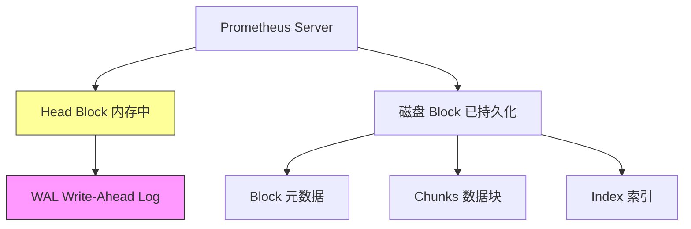
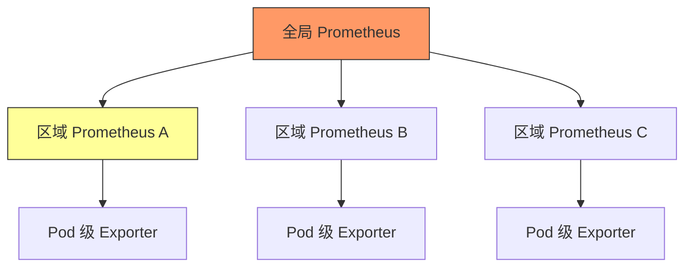
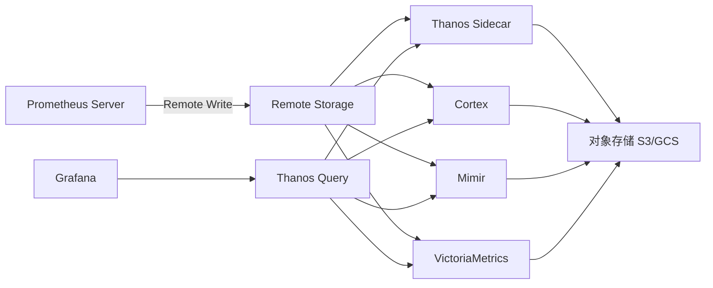
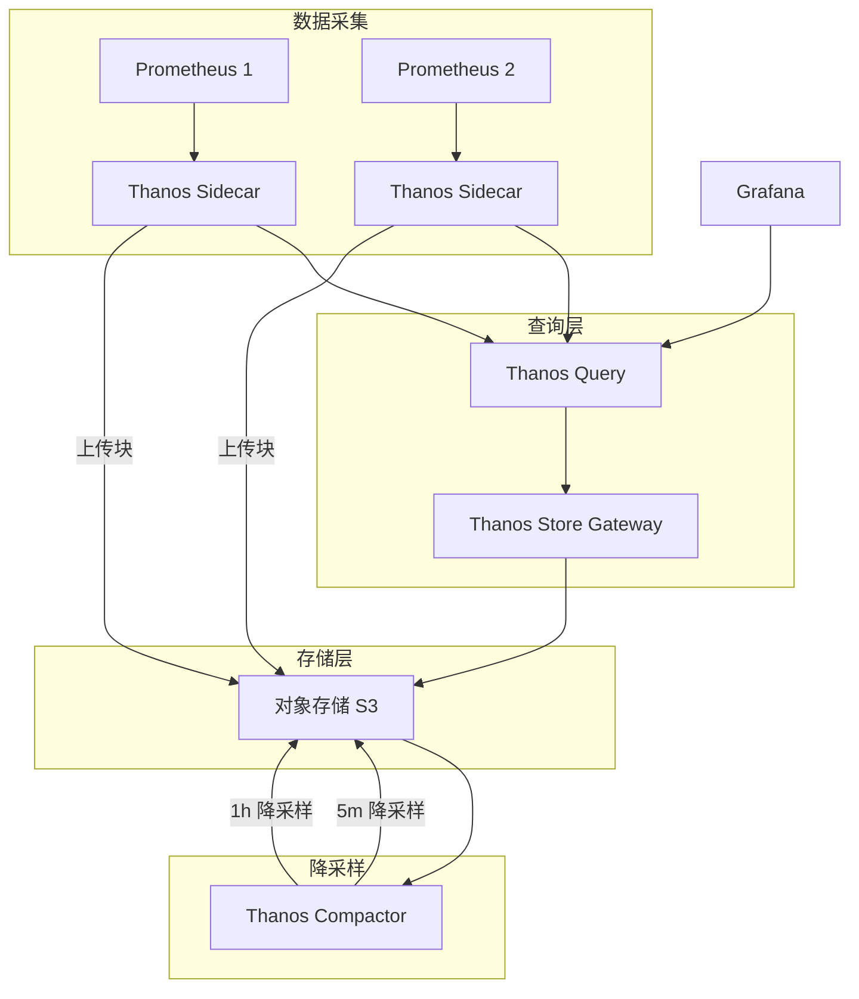
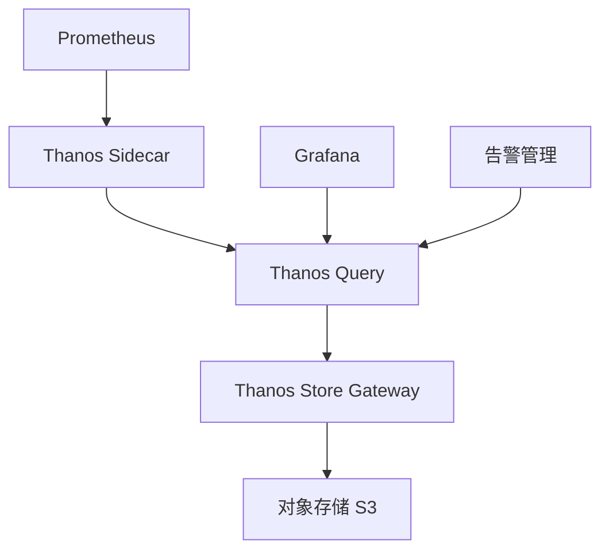

# Prometheus + Grafana（监控告警事实标准）

> Prometheus + Grafana 是云原生监控的事实标准：Prometheus 负责采集/存储/告警，Grafana 负责可视化。相比 Zabbix（传统）、ELK（日志为主），Prometheus 以**Pull 模型 + 时序数据库 + PromQL + 服务发现**成为 K8s 监控首选。本篇按「解决的问题 → 原理 → 特性 → 选型关注点」拆解。

---

## 一、要解决的问题

| 痛点 | 说明 |
|------|------|
| 动态目标 | K8s Pod 动态调度，Push 模型（Zabbix）需手动注册 |
| 多维数据 | 监控指标需要按实例/服务/接口等多维度聚合 |
| 告警联动 | 指标→告警→通知需要灵活配置 |
| 可视化 | 通用 Dashboard 展示所有服务指标 |
| 长期存储 | 本地存储容量有限，需要长期存储方案 |
| 多云统一 | 多云/混合云场景需要统一监控 |

> 核心认知：**Prometheus 是「指标监控系统」，不是日志系统（那是 ELK/Loki）**——两者互补。

---

## 二、Prometheus 核心原理

### 2.1 架构

```
Prometheus Server
  ├── 服务发现（K8s/Consul/静态） → 自动发现监控目标
  ├── Pull 采集（HTTP GET /metrics）→ 抓取指标
  ├── TSDB（时序数据库）→ 本地存储
  ├── PromQL → 查询语言
  ├── Alertmanager → 告警分组/抑制/路由
  └── Remote Write → 远程长期存储（Thanos/Cortex）
```

### 2.2 数据模型

- **时间序列**：`metric_name{label1="v1", label2="v2"} value @timestamp`
- **指标类型**：

| 类型 | 说明 | 示例 |
|------|------|------|
| Counter | 只增不减（重启归零） | 请求总数、错误数 |
| Gauge | 可增可减 | 内存使用、连接数 |
| Histogram | 分布统计（桶计数） | 请求延迟分布 |
| Summary | 分位数（客户端计算） | TP99 延迟 |

**选型关注点**：延迟统计用 Histogram（服务端可聚合）而非 Summary（客户端计算不可聚合）。

### 2.3 Pull vs Push

| 模型 | 代表 | 优势 | 劣势 |
|------|------|------|------|
| Pull | Prometheus | 服务端控制采集频率、目标是否存活一目了然 | 不适合短任务（Pushgateway 补救） |
| Push | InfluxDB/StatsD | 适合短任务、批量作业 | 目标不可控、易压垮服务端 |

**选型关注点**：K8s 场景首选 Pull（服务发现原生支持）；批处理/短任务用 Pushgateway 或 Push 模型。

### 2.4 PromQL（查询语言）

| 功能 | 示例 |
|------|------|
| 即时查询 | `http_requests_total{job="api"}` |
| 范围查询 | `rate(http_requests_total[5m])` |
| 聚合 | `sum by (instance) (rate(...))` |
| 预测 | `predict_linear(node_disk_free[6h], 3600*24)` |
| 分位数 | `histogram_quantile(0.99, sum(rate(http_request_duration_seconds_bucket[5m])) by (le))` |

**选型关注点**：PromQL 是 Prometheus 的核心竞争力，比 Zabbix 的触发器灵活得多。

### 2.5 告警（Alertmanager）

```
Prometheus 评估告警规则 → 触发告警 → Alertmanager
  ├── 分组（Group）：同类告警合并（如整个集群告警合并为一条）
  ├── 抑制（Inhibition）：高优先级抑制低优先级（集群宕机抑制单实例告警）
  ├── 静默（Silence）：维护期间静默
  └── 路由（Route）：按严重度/团队路由到不同通知渠道（邮件/钉钉/Slack/PagerDuty）
```

**选型关注点**：Alertmanager 的「分组+抑制」是生产告警必备（避免告警风暴）。

---

## 三、Grafana（可视化层）

- **定位**：指标可视化 Dashboard，数据源支持 Prometheus/InfluxDB/ES/MySQL 等 100+
- **特性**：丰富的图表类型、模板变量、告警（Grafana Alerting）、插件生态
- **选型关注点**：Prometheus 自带 UI 简陋，生产必配 Grafana。

---

## 四、存储与长期保存

| 方案 | 说明 |
|------|------|
| 本地存储（TSDB） | 默认，SSD 推荐，保留 15 天~数月 |
| Remote Write | 写入 Thanos/Cortex/Mimir 长期存储 |
| Thanos | 对象存储（S3/OSS）长期存储 + 全局视图 + 降采样 |
| Cortex/Mimir | 水平扩展多租户长期存储 |
| VictoriaMetrics | 兼容 Prometheus API，更高压缩比，更易运维 |

**选型关注点**：大规模集群 → Thanos/Mimir/VictoriaMetrics（水平扩展+长期存储）；小规模 → 本地 TSDB 足够。

---

## 五、Exporter 生态（指标采集）

| Exporter | 采集对象 |
|----------|----------|
| node_exporter | 主机 CPU/内存/磁盘/网络 |
| kube-state-metrics | K8s 资源对象状态（Pod/Deployment/Node） |
| mysql_exporter | MySQL 指标 |
| redis_exporter | Redis 指标 |
| kafka_exporter | Kafka 指标 |
| blackbox_exporter | 黑盒探测（HTTP/DNS/TCP 存活） |
| JMX_exporter | Java 应用（JVM/应用指标） |
| 自定义 | 应用内置 `/metrics`（Prometheus Client SDK） |

**选型关注点**：K8s 监控 = node_exporter + kube-state-metrics + cAdvisor（容器资源）+ 业务自定义指标。

---

## 六、Prometheus vs Zabbix vs Nagios vs 云监控

| 维度 | Prometheus | Zabbix | Nagios | 云监控（CloudWatch/云监控） |
|------|------------|--------|--------|---------------------------|
| 模型 | Pull + 服务发现 | Agent + Server | Agent + Server | 云内集成 |
| 数据模型 | 多维时序 | 扁平指标 | 状态检查 | 多维 |
| 查询 | PromQL（强大） | 触发器（弱） | 无 | 类 SQL |
| 可视化 | Grafana（强） | 内置（中） | 弱 | 内置 |
| 服务发现 | 原生（K8s/Consul） | 自动发现（中） | 手动 | 云内自动 |
| 告警 | Alertmanager（强） | 内置（中） | 内置（弱） | 内置 |
| 长期存储 | 需 Thanos/Cortex | 内置 | 无 | 内置 |
| 开源 | 是 | 是 | 是 | 否 |

**选型关注点**：K8s/云原生 → Prometheus（事实标准）；传统 IT/虚拟机 → Zabbix；云上 → 原生云监控（免运维）+ Prometheus（多云统一）。

---

## 七、K8s 监控体系（Prometheus Stack）

```
kube-prometheus-stack（Helm 一键安装）
  ├── Prometheus（指标采集/告警）
  ├── Grafana（可视化）
  ├── Alertmanager（告警路由）
  ├── node_exporter（节点指标）
  ├── kube-state-metrics（K8s 对象指标）
  ├── Prometheus Operator（CRD 管理监控配置）
  └── 预置 Dashboard + 告警规则
```

**选型关注点**：K8s 集群 → kube-prometheus-stack 是事实标准（GitHub 50k+ stars）。

---

## 八、选型速查

| 需求 | 首选 | 备选 |
|------|------|------|
| K8s 监控 | Prometheus + Grafana | 云监控 |
| 传统主机监控 | Zabbix | Prometheus + node_exporter |
| 多云统一监控 | Thanos + Grafana | Datadog/New Relic |
| 日志监控 | ELK/Loki | — |
| 长期存储 | Thanos/Mimir | VictoriaMetrics |
| 应用埋点 | Prometheus Client SDK | Micrometer（Spring Boot） |

---

## 九、Prometheus TSDB 内部机制

### 9.1 TSDB 存储结构



| 组件 | 说明 |
|------|------|
| Head Block | 内存中的最新数据块（2h 为一个 block） |
| WAL | 预写日志，防止宕机丢数据 |
| Block | 持久化到磁盘的数据块（压缩后） |
| Chunks | 时序数据的实际存储（Go 的 chunks 编码） |
| Index | 倒排索引，支持按 label 快速查找 |
| Tombstone | 删除标记（软删除） |

### 9.2 数据写入流程

```
1. 路由器：根据 metric hash 路由到对应 time series
2. Head Block：写入内存中的当前 block
3. WAL：同步写入 WAL（防宕机丢数据）
4. Block Cut：当 block 达到 2h 时长 → 切分
5. Compact：后台压缩 → 写入磁盘 Block
6. 降采样：旧 block 自动降采样（5m/1h 粒度）
```

### 9.3 Block 压缩与清理

```
压缩周期：
  Level 1：2h block → 合并多个 2h block → 1 个大 block
  Level 2：合并 Level 1 block → 更大的 block
  Level 3：继续合并（deletion + compaction）

清理策略：
  过期 block → 自动删除
  降采样 → 5m/1h 粒度（减少查询数据量）
  WAL 清理 → block 持久化后删除对应 WAL
```

---

## 十、Prometheus Recording Rules

### 10.1 Recording Rule 配置

```yaml
groups:
  - name: http_metrics
    interval: 30s  # 规则执行间隔
    rules:
      - record: job:http_requests:rate5m
        expr: sum(rate(http_requests_total{job="api"}[5m])) by (job)
        
      - record: instance:http_request_duration_seconds:p99
        expr: histogram_quantile(0.99, 
          sum(rate(http_request_duration_seconds_bucket[5m])) by (le, instance))
        
      - record: job:http_errors:ratio
        expr: sum(rate(http_requests_total{status=~"5.."}[5m])) by (job)
          / sum(rate(http_requests_total[5m])) by (job)
```

### 10.2 Recording Rule 最佳实践

| 实践 | 说明 |
|------|------|
| 复杂聚合预计算 | 避免 Dashboard 查询超时 |
| 固定间隔执行 | 与 scrape_interval 对齐 |
| 命名规范 | `{level}:{metric}:{agg}` |
| 分级聚合 | 先按实例聚合，再按服务聚合 |
| 限制规则数量 | 规则太多增加 CPU 开销 |

### 10.3 Recording Rule vs 即时查询

| 维度 | Recording Rule | 即时查询 |
|------|----------------|----------|
| 性能 | 预计算，查询快 | 实时计算，查询慢 |
| 存储 | 占用存储空间 | 不占额外存储 |
| 实时性 | 有延迟（= 执行间隔） | 实时 |
| 适用场景 | Dashboard/告警 | 临时分析 |

---

## 十一、Prometheus Federation（联邦）

### 11.1 联邦架构



### 11.2 联邦配置

```yaml
# 全局 Prometheus 配置
scrape_configs:
  - job_name: 'federate'
    honor_labels: true
    metrics_path: '/federate'
    params:
      'match[]':
        - '{job=~".+"}'
        - '{__name__=~"job:.*"}'
    static_configs:
      - targets:
        - 'region-a-prometheus:9090'
        - 'region-b-prometheus:9090'
```

### 11.3 联邦 vs Thanos/Mimir

| 方案 | 优势 | 劣势 |
|------|------|------|
| Federation | 简单，原生支持 | 全局视图有限，查询性能差 |
| Thanos | 全局视图+长期存储+降采样 | 架构复杂 |
| Cortex/Mimir | 水平扩展+多租户 | 运维成本高 |

---

## 十二、Thanos / Cortex 长期存储

### 12.1 Thanos 架构

```
Thanos 组件：
  Thanos Sidecar → 挂载 Prometheus，上传 Block 到对象存储
  Thanos Store Gateway → 读取对象存储中的 Block
  Thanos Compactor → 压缩与降采样
  Thanos Query → 全局查询入口（联邦查询）
  Thanos Ruler → 全局告警规则评估

数据流：
  Prometheus → Sidecar → 对象存储（S3/GCS）
  Query → Store Gateway → 对象存储 → 全局视图
```

### 12.2 Thanos 关键配置

```yaml
# Sidecar 配置
thanos sidecar \
  --tsdb.path=/prometheus \
  --objstore.config-file=bucket.yml \
  --prometheus.url=http://localhost:9090

# bucket.yml
type: S3
config:
  bucket: thanos-metrics
  endpoint: s3.us-west-2.amazonaws.com
  access_key: XXX
  secret_key: XXX
```

### 12.3 VictoriaMetrics 替代方案

| 维度 | VictoriaMetrics | Thanos |
|------|-----------------|--------|
| 部署复杂度 | 低（单二进制） | 高（多组件） |
| 压缩比 | 高（10x+） | 中 |
| 查询性能 | 快 | 中 |
| 兼容性 | 兼容 Prometheus API | 完全兼容 |
| 多租户 | 支持 | 需要额外配置 |

---

## 十三、Grafana Dashboard 设计模式

### 13.1 Dashboard 分层设计

```
L1 - 总览 Dashboard（Overview）
  └── 服务级别指标：可用性/延迟/流量/错误率

L2 - 服务 Dashboard（Service）
  └── 服务级别详细：各接口指标/依赖状态

L3 - 实例 Dashboard（Instance）
  └── 实例级别：CPU/内存/JVM/连接池

L4 - 告警 Dashboard（Alert）
  └── 告警列表/历史/统计
```

### 13.2 常用面板类型

| 面板类型 | 用途 | PromQL 示例 |
|----------|------|-------------|
| Stat | 单一数值 | `sum(http_requests_total)` |
| Time Series | 时序曲线 | `rate(http_requests_total[5m])` |
| Bar Gauge | 条形图 | `node_filesystem_avail_bytes` |
| Table | 表格 | 多指标对比 |
| Heatmap | 热力图 | Histogram 分布 |
| Pie Chart | 饼图 | 比例分布 |

### 13.3 Dashboard 变量模板

```json
{
  "templating": {
    "list": [
      {
        "name": "datasource",
        "type": "datasource",
        "query": "prometheus"
      },
      {
        "name": "job",
        "type": "query",
        "query": "label_values(http_requests_total, job)",
        "refresh": 2
      },
      {
        "name": "instance",
        "type": "query",
        "query": "label_values(http_requests_total{job=\"$job\"}, instance)",
        "refresh": 2
      }
    ]
  }
}
```

---

## 十四、Prometheus 告警规则最佳实践

### 14.1 告警分级体系

| 级别 | 响应时间 | 通知方式 | 示例 |
|------|----------|----------|------|
| P0 - Critical | 5分钟 | 电话+短信+IM | 服务宕机/数据丢失 |
| P1 - Warning | 30分钟 | 短信+IM | CPU>80%/磁盘>85% |
| P2 - Info | 工作时间 | 邮件 | 新实例加入/证书即将过期 |

### 14.2 告警规则模板

```yaml
groups:
  - name: service_slo
    rules:
      - alert: HighErrorRate
        expr: |
          sum(rate(http_requests_total{status=~"5.."}[5m])) by (job)
          / sum(rate(http_requests_total[5m])) by (job) > 0.05
        for: 5m
        labels:
          severity: critical
        annotations:
          summary: "High error rate on {{ $labels.job }}"
          description: "Error rate is {{ $value | humanizePercentage }}"
          
      - alert: HighLatency
        expr: |
          histogram_quantile(0.99, 
            sum(rate(http_request_duration_seconds_bucket[5m])) by (le, job)
          ) > 1
        for: 10m
        labels:
          severity: warning
        annotations:
          summary: "High latency on {{ $labels.job }}"
```

### 14.3 告警抑制与静默

```yaml
# Alertmanager 抑制规则
inhibit_rules:
  - source_match:
      alertname: ClusterDown
    target_match_re:
      alertname: .*
    equal: [cluster]

# 静默规则（维护期间）
# amtool silence add alertname=.* duration=2h comment="维护中"
```

---

## 十五、Prometheus 服务发现

### 15.1 服务发现方式

| 方式 | 说明 | 配置 |
|------|------|------|
| static_configs | 静态配置 | `static_configs: [{targets: [...]}]` |
| kubernetes_sd | K8s API 发现 | `kubernetes_sd_configs: [{role: pod}]` |
| consul_sd | Consul 服务发现 | `consul_sd_configs: [{server: ...}]` |
| ec2_sd | AWS EC2 发现 | `ec2_sd_configs: [{region: ...}]` |
| dns_sd | DNS 发现 | `dns_sd_configs: [{names: [...]}]` |

### 15.2 K8s 服务发现配置

```yaml
scrape_configs:
  - job_name: 'kubernetes-pods'
    kubernetes_sd_configs:
      - role: pod
    relabel_configs:
      - source_labels: [__meta_kubernetes_pod_annotation_prometheus_io_scrape]
        action: keep
        regex: true
      - source_labels: [__meta_kubernetes_pod_annotation_prometheus_io_path]
        action: replace
        target_label: __metrics_path__
        regex: (.+)
      - source_labels: [__address__, __meta_kubernetes_pod_annotation_prometheus_io_port]
        action: replace
        target_label: __address__
        regex: ([^:]+)(?::\d+)?;(\d+)
        replacement: $1:$2
```

### 15.3 Relabel 配置

| action | 说明 |
|--------|------|
| keep | 保留匹配的 target |
| drop | 丢弃匹配的 target |
| replace | 替换标签值 |
| labelmap | 所有 meta 标签映射到新标签 |
| hashmod | 取模分片（多 Prometheus 分片采集） |

---

## 十六、Prometheus 在 Kubernetes 中（kube-prometheus-stack）

### 16.1 kube-prometheus-stack 组件

```
kube-prometheus-stack（Helm Chart）
  ├── Prometheus Operator（CRD 管理）
  │   ├── ServiceMonitor → 定义采集目标
  │   ├── PodMonitor → Pod 级采集
  │   ├── PrometheusRule → 告警规则
  │   └── Prometheus → 集群配置
  ├── Prometheus（采集+存储+告警）
  ├── Grafana（可视化）
  ├── Alertmanager（告警路由）
  ├── node_exporter（节点指标）
  ├── kube-state-metrics（K8s 对象指标）
  └── 预置 Dashboard + 告警规则
```

### 16.2 ServiceMonitor 示例

```yaml
apiVersion: monitoring.coreos.com/v1
kind: ServiceMonitor
metadata:
  name: my-service-monitor
  labels:
    release: prometheus  # 与 Prometheus Operator 匹配
spec:
  selector:
    matchLabels:
      app: my-service
  endpoints:
  - port: http-metrics
    interval: 30s
    path: /metrics
  namespaceSelector:
    matchNames:
    - my-namespace
```

### 16.3 Prometheus Operator 架构优势

| 特性 | 说明 |
|------|------|
| 声明式配置 | 用 K8s CRD 管理监控配置 |
| 自动发现 | 监听 ServiceMonitor/PodMonitor 变更 |
| 滚动更新 | 配置变更自动重启 Prometheus |
| 多租户 | 通过 namespace 隔离 |
| 可扩展 | 支持 Thanos/VictoriaMetrics 集成 |

---

## 十七、与其他板块的关系

- 可观测性三支柱见「[云上可观测性体系](./云上可观测性体系.md)」；
- 监控告警规则库见「[场景设计/生产问题排查实战](../../场景设计/生产问题排查实战：常见故障与处置步骤.md)」；
- SRE 可观测性看护见「[SRE/可观测性与稳定性看护](../../SRE与稳定性工程/02-可观测性与稳定性看护.md)」；
- Grafana Loki 日志见「[ELK 日志体系](./ELK日志体系.md)」。

---

## 十、Prometheus 生产配置清单

### 10.1 prometheus.yml 关键配置

```yaml
global:
  scrape_interval: 15s
  evaluation_interval: 15s

rule_files:
  - "alert_rules.yml"

alerting:
  alertmanagers:
    - static_configs:
        - targets: ['alertmanager:9093']

scrape_configs:
  - job_name: 'kubernetes-pods'
    kubernetes_sd_configs:
      - role: pod
    relabel_configs:
      - source_labels: [__meta_kubernetes_pod_annotation_prometheus_io_scrape]
        action: keep
        regex: true
```

### 10.2 告警规则示例

```yaml
groups:
  - name: node-alerts
    rules:
      - alert: HighCPU
        expr: 100 - (avg by(instance) (irate(node_cpu_seconds_total{mode="idle"}[5m])) * 100) > 80
        for: 5m
        labels:
          severity: warning
        annotations:
          summary: "High CPU usage on {{ $labels.instance }}"
          
      - alert: DiskAlmostFull
        expr: (node_filesystem_avail_bytes / node_filesystem_size_bytes) * 100 < 15
        for: 5m
        labels:
          severity: critical
```

### 10.3 Grafana Dashboard 推荐

| Dashboard | 用途 |
|-----------|------|
| Node Exporter Full | 主机监控 |
| Kubernetes Cluster | K8s 集群监控 |
| MySQL Overview | MySQL 监控 |
| Redis Dashboard | Redis 监控 |
| Kafka Overview | Kafka 监控 |

### 10.4 常见问题排查

| 问题 | 原因 | 解决 |
|------|------|------|
| 采集失败 | 网络不通/端口错 | 检查网络/端口 |
| 告警漏发 | 规则配置错 | 检查 PromQL |
| 存储满 | 保留期太长 | 缩短保留期/扩容 |
| 查询慢 | 时间范围太大 | 缩小时间范围 |

---

## 十一、Prometheus 常用 PromQL

| 场景 | PromQL |
|------|--------|
| CPU 使用率 | `100 - (avg by(instance)(irate(node_cpu_seconds_total{mode="idle"}[5m])) * 100)` |
| 内存使用率 | `(1 - node_memory_MemAvailable_bytes/node_memory_MemTotal_bytes) * 100` |
| 磁盘使用率 | `(1 - node_filesystem_avail_bytes/node_filesystem_size_bytes) * 100` |
| 网络流量 | `irate(node_network_receive_bytes_total{device="eth0"}[5m]) * 8` |
| HTTP 请求速率 | `rate(http_requests_total[5m])` |
| HTTP 错误率 | `rate(http_requests_total{status=~"5.."}[5m]) / rate(http_requests_total[5m])` |
| 请求延迟 P99 | `histogram_quantile(0.99, sum(rate(http_request_duration_seconds_bucket[5m])) by (le))` |

### 11.1 Grafana 常用变量

```
$datasource    # 数据源
$interval      # 时间间隔（1m/5m/1h）
$job           # 任务名称
$instance      # 实例
$legend        # 图例格式
```

---

## 十二、Prometheus 告警规则最佳实践

### 12.1 告警分级

| 级别 | 响应时间 | 通知方式 | 示例 |
|------|----------|----------|------|
| Critical | 5分钟 | 电话+短信+IM | 服务宕机/数据丢失 |
| Warning | 30分钟 | 短信+IM | CPU>80%/磁盘>85% |
| Info | 工作时间 | 邮件 | 新实例加入 |

### 12.2 告警抑制规则

```yaml
# 集群宕机时抑制单实例告警
- source_match:
    alertname: ClusterDown
  target_match_re:
    alertname: InstanceDown|HighCPU|HighMemory
  equal: [cluster]
```

### 12.3 告警静默规则

```bash
# 维护期间静默告警
amtool silence add alertname=InstanceDown instance=node1 --duration=2h --comment="维护中"
```

### 12.4 常用 Exporter 配置

```yaml
# node_exporter
- job_name: 'node'
  static_configs:
    - targets: ['node1:9100', 'node2:9100']

# mysql_exporter
- job_name: 'mysql'
  static_configs:
    - targets: ['mysql:9104']

# redis_exporter
- job_name: 'redis'
  static_configs:
    - targets: ['redis:9121']
```

---

## 十三、Prometheus 高级主题

### 13.1 存储容量估算

```text
Prometheus 存储容量估算公式：

原始数据点 = series × samples_per_second × retention_seconds
  - series：时间序列数量
  - samples_per_second：每秒采样数（通常 1）
  - retention_seconds：数据保留秒数

示例：100,000 series × 1 sample/s × 30天 × 86400s ≈ 259,200,000,000 points

压缩后存储 ≈ 原始数据点 × 1.2 bytes/point（压缩比约 1/5）

生产建议：
  100K series × 15天保留 ≈ 30-50GB 磁盘
  1M series × 15天保留 ≈ 300-500GB 磁盘
```

```bash
# 查看当前存储大小
du -sh /prometheus/data

# 查看时间序列数量
curl -s http://localhost:9090/api/v1/label/__name__/values | wc -l

# 使用 Prometheus 内置指标监控自身
curl -s http://localhost:9090/api/v1/query?query=prometheus_tsdb_head_series
curl -s http://localhost:9090/api/v1/query?query=prometheus_tsdb_storage_blocks_bytes
```

### 13.2 高可用方案（Thanos / Cortex）

```text
Prometheus 高可用架构对比：
┌──────────────┬────────────────────────────────────────────────┐
│ 方案          │ 特点                                           │
├──────────────┼────────────────────────────────────────────────┤
│ Thanos       │ 去中心化，对象存储，全局视图，长期存储            │
│ Cortex       │ 微服务架构，对象存储，多租户，水平扩展           │
│ Mimir        │ Grafana 出品，Cortex 改进版，高写入性能          │
└──────────────┴────────────────────────────────────────────────┘
```

```yaml
# Thanos Sidecar 配置（挂载到 Prometheus）
apiVersion: v1
kind: Pod
metadata:
  name: prometheus-thanos
spec:
  containers:
  - name: prometheus
    image: prom/prometheus:v2.45.0
    args:
    - --config.file=/etc/prometheus/prometheus.yml
    - --storage.tsdb.path=/prometheus
    - --storage.tsdb.retention.time=15d
    volumeMounts:
    - name: data
      mountPath: /prometheus
  - name: thanos-sidecar
    image: thanosio/thanos:v0.32.0
    args:
    - sidecar
    - --tsdb.path=/prometheus
    - --prometheus.url=http://localhost:9090
    - --objstore.config-file=/etc/thanos/bucket.yml
    volumeMounts:
    - name: data
      mountPath: /prometheus
      readOnly: true
    - name: thanos-config
      mountPath: /etc/thanos
  volumes:
  - name: data
    emptyDir: {}
  - name: thanos-config
    configMap:
      name: thanos-bucket-config
```

```yaml
# Thanos Store Gateway（查询对象存储中的历史数据）
apiVersion: apps/v1
kind: Deployment
metadata:
  name: thanos-store-gateway
spec:
  replicas: 2
  selector:
    matchLabels:
      app: thanos-store-gateway
  template:
    spec:
      containers:
      - name: store
        image: thanosio/thanos:v0.32.0
        args:
        - store
        - --data-dir=/data
        - --objstore.config-file=/etc/thanos/bucket.yml
        - --index-cache-size=500MB
```

### 13.3 Grafana Dashboard JSON 模式

```text
Dashboard JSON 结构：
{
  "dashboard": {
    "title": "My Dashboard",
    "uid": "unique-id",
    "tags": ["production", "k8s"],
    "timezone": "browser",
    "panels": [
      {
        "type": "graph",
        "title": "CPU Usage",
        "gridPos": { "h": 8, "w": 12, "x": 0, "y": 0 },
        "targets": [
          {
            "expr": "rate(node_cpu_seconds_total{mode=\"idle\"}[5m])",
            "legendFormat": "{{instance}}"
          }
        ]
      }
    ],
    "templating": {
      "list": [
        {
          "name": "instance",
          "type": "query",
          "query": "label_values(node_uname_info, nodename)"
        }
      ]
    }
  }
}
```

```yaml
# Grafana Provisioning（配置即代码）
# provisioning/dashboards/dashboard.yml
apiVersion: 1
providers:
- name: 'default'
  orgId: 1
  folder: 'Production'
  type: file
  disableDeletion: false
  editable: true
  options:
    path: /var/lib/grafana/dashboards
    foldersFromFilesStructure: true

# provisioning/datasources/datasource.yml
apiVersion: 1
datasources:
- name: Prometheus
  type: prometheus
  access: proxy
  url: http://prometheus:9090
  isDefault: true
  jsonData:
    timeInterval: '15s'
```

### 13.4 Alertmanager 路由详解

```yaml
# Alertmanager 完整路由配置
global:
  resolve_timeout: 5m
  smtp_smarthost: 'smtp.example.com:587'
  smtp_from: 'alertmanager@example.com'
  smtp_auth_username: 'alertmanager@example.com'
  smtp_auth_password: 'password'

# 告警模板
templates:
- '/etc/alertmanager/templates/*.tmpl'

# 路由树
route:
  receiver: 'default-receiver'
  group_by: ['alertname', 'cluster', 'service']
  group_wait: 30s          # 首次等待分组
  group_interval: 5m       # 分组间隔
  repeat_interval: 4h      # 重复通知间隔
  routes:
  # 高优先级：立即通知
  - match:
      severity: critical
    receiver: 'critical-receiver'
    group_wait: 10s
    repeat_interval: 1h
  # 中优先级：工作时间通知
  - match:
      severity: warning
    receiver: 'warning-receiver'
    active_time_intervals:
    - workhours
  # 低优先级：仅邮件
  - match:
      severity: info
    receiver: 'info-receiver'
  # 默认路由
  - receiver: 'default-receiver'

# 接收器配置
receivers:
- name: 'critical-receiver'
  email_configs:
  - to: 'oncall@example.com'
  pagerduty_configs:
  - service_key: '<pagerduty-key>'
  slack_configs:
  - api_url: 'https://hooks.slack.com/services/xxx'
    channel: '#alerts-critical'

- name: 'warning-receiver'
  email_configs:
  - to: 'team@example.com'

# 分组规则
inhibit_rules:
# Critical 告警抑制同服务的 Warning 告警
- source_match:
    severity: 'critical'
  target_match:
    severity: 'warning'
  equal: ['alertname', 'cluster', 'service']

# 集群宕机抑制单实例告警
- source_match:
    alertname: 'ClusterDown'
  target_match_re:
    alertname: 'InstanceDown|HighCPU'
  equal: ['cluster']

# 静默规则
# amtool silence add alertname=HighCPU instance=node1 --duration=2h --comment="维护中"
```

### 13.5 指标类型深入对比

```text
Counter vs Gauge vs Histogram vs Summary：
┌──────────────┬──────────────┬──────────────┬───────────────────┐
│ 类型          │ 特点          │ 典型用例      │ 聚合方式           │
├──────────────┼──────────────┼──────────────┼───────────────────┤
│ Counter      │ 只增不减      │ 请求总数      │ rate()            │
│ Gauge        │ 可增可减      │ 当前连接数    │ 直接读取           │
│ Histogram    │ 客户端分桶    │ 请求延迟      │ histogram_quantile│
│ Summary      │ 服务端分位    │ 请求延迟      │ 直接读取           │
└──────────────┴──────────────┴──────────────┴───────────────────┘

Histogram vs Summary：
- Histogram：服务端可聚合（跨实例），桶边界固定，丢精度
- Summary：客户端计算分位数，精确，跨实例无法聚合
- 推荐：优先使用 Histogram（更灵活）
```

```promql
# Counter 示例：QPS 计算
rate(http_requests_total[5m])

# Gauge 示例：当前连接数
active_connections

# Histogram 示例：P99 延迟
histogram_quantile(0.99, rate(http_request_duration_seconds_bucket[5m]))

# Summary 示例：P99 延迟（直接读取）
http_request_duration_seconds{quantile="0.99"}

# Histogram 桶边界设置
# 在应用中配置：
# duration_seconds_bucket: [0.01, 0.025, 0.05, 0.1, 0.25, 0.5, 1, 2.5, 5, 10]
```

### 13.6 Grafana Provisioning 自动化

```text
Grafana Provisioning 目录结构：
/etc/grafana/provisioning/
├── dashboards/
│   ├── dashboard.yml      # Dashboard 提供者配置
│   └── dashboards/        # JSON 文件目录
│       ├── node-exporter.json
│       └── kubernetes.json
├── datasources/
│   └── datasource.yml     # 数据源配置
├── notifiers/
│   └── notifier.yml       # 通知渠道配置
└── plugins/
    └── plugin.yml         # 插件配置
```

```yaml
# 插件自动安装
# provisioning/plugins/plugin.yml
apiVersion: 1
apps:
- type: grafana-piechart-panel
  org_id: 1
  disabled: false
- type: grafana-clock-panel
  org_id: 1
  disabled: false
```

```bash
# Docker Compose 部署带 Provisioning 的 Grafana
version: '3.8'
services:
  grafana:
    image: grafana/grafana:10.0.0
    environment:
    - GF_SECURITY_ADMIN_PASSWORD=admin
    volumes:
    - ./provisioning:/etc/grafana/provisioning
    - ./dashboards:/var/lib/grafana/dashboards
    ports:
    - "3000:3000"
```

> 一句话：**Prometheus + Grafana = Pull + 多维时序 + PromQL + 服务发现 + Alertmanager（分组/抑制/路由）；选型先看「环境（K8s/传统/云）」，再定「规模（本地 TSDB/Thanos 长期存储）」，最后配「Exporter 生态」**。

## Remote Write 与远程存储

### Remote Write 架构



### Remote Write 配置

```yaml
# prometheus.yml：Remote Write 配置
remote_write:
- url: "http://thanos-receive:19291/api/v1/receive"
  queue_config:
    max_samples_per_send: 10000      # 每次发送最大样本数
    batch_send_deadline: 5s          # 批量发送超时
    max_shards: 30                   # 最大并发分片数
    min_shards: 5                    # 最小并发分片数
    capacity: 10000                  # 队列容量
  write_relabel_configs:
  - source_labels: [__name__]
    regex: 'go_.*'                   # 过滤掉 go_ 指标
    action: drop
  send_sample_timeout: 30s           # 发送超时
  max_retries: 5                     # 最大重试次数
```

### 各远程存储方案对比

| 方案 | 数据模型 | 扩展性 | 查询语言 | 成本 |
|------|---------|--------|---------|------|
| Thanos | 标签 | 对象存储 | PromQL | 低 |
| Cortex | 标签 | 对象存储 | PromQL | 中 |
| Mimir | 标签 | 对象存储 | PromQL | 中 |
| VictoriaMetrics | 标签 | 自带集群 | PromQL | 低 |
| ClickHouse | 标签 | 列式存储 | PromQL+SQL | 中 |

## 服务发现深度配置

### 多种服务发现方式对比

| 发现方式 | 适用环境 | 配置复杂度 | 动态性 |
|---------|---------|-----------|--------|
| static_configs | 测试/简单环境 | 低 | 低 |
| file_sd | 文件管理目标 | 中 | 中 |
| consul_sd | Consul 注册中心 | 中 | 高 |
| kubernetes_sd | Kubernetes | 中 | 高 |
| ec2_sd | AWS EC2 | 低 | 高 |
| dns_sd | DNS 记录 | 低 | 中 |

### Kubernetes 服务发现详解

```yaml
# prometheus.yml：Kubernetes 服务发现
scrape_configs:
- job_name: 'kubernetes-pods'
  kubernetes_sd_configs:
  - role: pod
    namespaces:
      names: ['monitoring', 'production']
  relabel_configs:
  # 仅抓取带 prometheus.io/scrape: "true" 注解的 Pod
  - source_labels: [__meta_kubernetes_pod_annotation_prometheus_io_scrape]
    action: keep
    regex: true
  # 使用注解中的端口
  - source_labels: [__meta_kubernetes_pod_annotation_prometheus_io_port]
    action: replace
    target_label: __address__
    regex: (.+)
    replacement: $1
  # 添加 namespace 标签
  - source_labels: [__meta_kubernetes_namespace]
    target_label: namespace
  # 添加 pod 名称标签
  - source_labels: [__meta_kubernetes_pod_name]
    target_label: pod
  # 添加节点标签
  - source_labels: [__meta_kubernetes_pod_node_name]
    target_label: node
```

```yaml
# Consul 服务发现配置
scrape_configs:
- job_name: 'consul-services'
  consul_sd_configs:
  - server: 'consul:8500'
    services: []  # 空表示发现所有服务
    tags: ['production']
  relabel_configs:
  - source_labels: [__meta_consul_service]
    target_label: service
  - source_labels: [__meta_consul_tags]
    regex: '.*,prometheus-port=(\d+),.*'
    target_label: __address__
```

## Grafana 最佳实践

### Dashboard 设计原则

```text
Grafana Dashboard 设计四原则：
  1. 层次化：Overview → 区域 → 服务 → 实例
  2. 命名规范：{{namespace}}/{{service}}/{{metric}}
  3. 变量化：使用模板变量实现多环境切换
  4. 面板分组：业务指标 | 系统指标 | 中间件指标

Dashboard 变量模板：
  $environment：prod / staging / dev
  $namespace：所有 namespace（下拉选择）
  $service：基于 namespace 筛选的服务列表
  $instance：基于 service 筛选的实例列表
```

### 常用 Dashboard 模板

| 模板 ID | 名称 | 适用场景 |
|---------|------|---------|
| 1860 | Node Exporter Full | 服务器监控 |
| 6417 | Kafka Overview | Kafka 集群 |
| 11835 | Redis Dashboard | Redis 监控 |
| 15661 | Kubernetes Cluster | K8s 集群 |
| 12006 | MySQL Overview | MySQL 监控 |

```json
// Dashboard 变量配置示例
{
  "templating": {
    "list": [
      {
        "name": "environment",
        "type": "custom",
        "query": "prod,staging,dev",
        "current": {"text": "prod", "value": "prod"}
      },
      {
        "name": "namespace",
        "type": "query",
        "query": "label_values(kube_pod_info, namespace)",
        "datasource": "Prometheus",
        "refresh": 2
      },
      {
        "name": "service",
        "type": "query",
        "query": "label_values(kube_pod_info{namespace=~\"$namespace\"}, app)",
        "datasource": "Prometheus",
        "refresh": 2
      }
    ]
  }
}
```

## 告警规则最佳实践

### 告警规则分层

| 层级 | 服务级别 | 通知方式 | 恢复时间要求 |
|------|---------|---------|------------|
| P0-致命 | 核心服务不可用 | 电话 + 短信 + 钉钉 | < 5 分钟 |
| P1-严重 | 核心服务性能下降 | 短信 + 钉钉 | < 15 分钟 |
| P2-一般 | 非核心服务异常 | 钉钉 + 邮件 | < 1 小时 |
| P3-低优 | 资源使用率告警 | 邮件 | 下一工作日 |

### 常用告警规则示例

```yaml
# alert_rules.yml
groups:
- name: infrastructure
  rules:
  # 实例宕机
  - alert: InstanceDown
    expr: up == 0
    for: 2m
    labels:
      severity: critical
    annotations:
      summary: "实例 {{ $labels.instance }} 宕机"
      description: "{{ $labels.job }} 的实例 {{ $labels.instance }} 已超过 2 分钟不可达"

  # CPU 使用率过高
  - alert: HighCpuUsage
    expr: 100 - (avg by(instance) (rate(node_cpu_seconds_total{mode="idle"}[5m])) * 100) > 85
    for: 10m
    labels:
      severity: warning
    annotations:
      summary: "CPU 使用率过高 {{ $labels.instance }}"
      description: "实例 {{ $labels.instance }} CPU 使用率超过 85%，当前值 {{ $value }}%"

  # 磁盘空间不足
  - alert: DiskSpaceLow
    expr: (node_filesystem_avail_bytes{mountpoint="/"} / node_filesystem_size_bytes{mountpoint="/"}) * 100 < 15
    for: 5m
    labels:
      severity: critical
    annotations:
      summary: "磁盘空间不足 {{ $labels.instance }}"
      description: "实例 {{ $labels.instance }} 根分区剩余空间不足 15%"

- name: application
  rules:
  # 请求延迟过高
  - alert: HighRequestLatency
    expr: histogram_quantile(0.99, rate(http_request_duration_seconds_bucket[5m])) > 2
    for: 5m
    labels:
      severity: warning
    annotations:
      summary: "请求延迟过高 {{ $labels.service }}"
      description: "{{ $labels.service }} P99 延迟超过 2 秒"

  # 错误率过高
  - alert: HighErrorRate
    expr: rate(http_requests_total{status=~"5.."}[5m]) / rate(http_requests_total[5m]) > 0.05
    for: 5m
    labels:
      severity: critical
    annotations:
      summary: "错误率过高 {{ $labels.service }}"
      description: "{{ $labels.service }} 5xx 错误率超过 5%"
```

## 长期存储方案

### Thanos 部署架构



```yaml
# Thanos Query 配置
apiVersion: apps/v1
kind: Deployment
metadata:
  name: thanos-query
spec:
  replicas: 2
  selector:
    matchLabels:
      app: thanos-query
  template:
    spec:
      containers:
      - name: query
        image: thanosio/thanos:v0.32.0
        args:
        - query
        - --log.level=info
        - --query.auto-downsampling
        - --store=dnssrv+_grpc._tcp.thanos-sidecar.monitoring.svc
        - --store=dnssrv+_grpc._tcp.thanos-store-gateway.monitoring.svc
```

## 监控方法论

### RED 方法

```text
RED 方法（微服务监控）：
  Rate：请求速率（QPS）
  Errors：错误率
  Duration：请求延迟（P50/P95/P99）

  适用场景：面向请求的服务
  指标来源：应用层 HTTP/gRPC 中间件
```

### USE 方法

```text
USE 方法（基础设施监控）：
  Utilization：资源使用率（CPU/内存/磁盘/网络）
  Saturation：资源饱和度（队列长度/等待数）
  Errors：错误数（硬件错误/软件错误）

  适用场景：基础设施、中间件
  指标来源：Node Exporter、系统指标
```

### 四个黄金信号

```text
Google 四个黄金信号：
  Latency：延迟（请求处理时间）
  Traffic：流量（QPS/带宽）
  Errors：错误（错误率/错误数）
  Saturation：饱和度（资源使用程度）

  适用场景：Google SRE 方法论
  落地方式：Prometheus + Grafana
```

## 服务发现配置详解

### 服务发现方式对比

| 方式 | 配置 | 适用场景 | 优缺点 |
|------|------|---------|--------|
| static_configs | 静态IP列表 | 简单环境 | 简单但不灵活 |
| file_sd | 文件发现 | 变更不频繁 | 需重载配置 |
| consul_sd | Consul注册 | 微服务 | 动态但依赖Consul |
| kubernetes_sd | K8s API | 容器化 | 动态自动 |
| dns_sd | DNS查询 | 传统服务 | 简单但无健康检查 |

```yaml
# Kubernetes 服务发现配置
scrape_configs:
  - job_name: 'kubernetes-pods'
    kubernetes_sd_configs:
      - role: pod
    relabel_configs:
      - source_labels: [__meta_kubernetes_pod_annotation_prometheus_io_scrape]
        action: keep
        regex: true
      - source_labels: [__meta_kubernetes_pod_annotation_prometheus_io_path]
        action: replace
        target_label: __metrics_path__
        regex: (.+)
      - source_labels: [__address__, __meta_kubernetes_pod_annotation_prometheus_io_port]
        action: replace
        target_label: __address__
        regex: ([^:]+)(?::\d+)?;(\d+)
        replacement: $1:$2
```

## Grafana 仪表板设计原则

### 仪表板布局模板

| 区域 | 内容 | 行高 | 说明 |
|------|------|------|------|
| 概览行 | SLA/关键指标 | 3行 | 一眼看到核心状态 |
| 服务行 | 各服务健康度 | 4行 | 服务粒度监控 |
| 基础设施行 | 主机/容器资源 | 4行 | 资源使用情况 |
| 告警行 | 活跃告警 | 2行 | 问题聚焦 |

### 告警规则设计

```yaml
# Prometheus 告警规则
groups:
  - name: application
    rules:
      - alert: HighErrorRate
        expr: sum(rate(http_requests_total{status=~"5.."}[5m])) / sum(rate(http_requests_total[5m])) > 0.05
        for: 5m
        labels:
          severity: critical
        annotations:
          summary: "错误率超过5%"
          
      - alert: HighLatency
        expr: histogram_quantile(0.99, sum(rate(http_request_duration_seconds_bucket[5m]))) > 1
        for: 5m
        labels:
          severity: warning
        annotations:
          summary: "P99延迟超过1秒"
```

## 统一告警与长期存储

### 长期存储方案对比

| 方案 | 存储格式 | 查询能力 | 成本 | 适用规模 |
|------|---------|---------|------|---------|
| Thanos | TSDB+S3 | 分布式查询 | 低 | 中大型 |
| Cortex | TSDB+S3 | 分布式查询 | 低 | 中大型 |
| VictoriaMetrics | 自有格式 | 原生查询 | 极低 | 中小型 |
| Mimir | TSDB+S3 | 分布式查询 | 中 | 大型 |



## 监控大屏设计最佳实践

| 大屏类型 | 数据更新频率 | 布局特点 | 适用场景 |
|----------|-------------|---------|---------|
| 全局概览 | 1min | 关键指标大字 | 运维中心 |
| 业务监控 | 30s | 趋势图为主 | 业务团队 |
| 告警大屏 | 实时 | 告警列表 | 值班室 |
| 成本大屏 | 1h | 柱状图/饼图 | 管理层 |

### Grafana 告警配置

```yaml
# Grafana 告警规则
apiVersion: 1
groups:
  - name: application
    folder: production
    interval: 1m
    rules:
      - uid: high-cpu
        title: High CPU Usage
        condition: C
        data:
          - refId: A
            datasourceUid: prometheus
            model:
              expr: 100 - (avg by(instance) (irate(node_cpu_seconds_total{mode="idle"}[5m])) * 100)
              interval: 1m
        noDataState: OK
        execErrState: Error
        for: 5m
        labels:
          severity: warning
```

## 统一告警管理

### 告警分级策略

| 级别 | 响应时间 | 通知方式 | 处理要求 |
|------|---------|---------|---------|
| P0-Critical | 5分钟 | 电话+短信+IM | 立即处理 |
| P1-High | 15分钟 | 短信+IM | 30分钟内响应 |
| P2-Medium | 30分钟 | IM | 4小时内处理 |
| P3-Low | 4小时 | 邮件 | 下个工作日 |

### 告警收敛策略

```yaml
# 告警收敛配置
route:
  receiver: 'default'
  group_by: ['alertname', 'cluster']
  group_wait: 30s
  group_interval: 5m
  repeat_interval: 4h

receivers:
  - name: 'default'
    pagerduty_configs:
      - service_key: '<key>'
        severity: '{{ if eq .Labels.severity "critical" }}critical{{ else }}warning{{ end }}'
```

### 通知模板设计

```yaml
# 告警通知模板
templates:
  - '{{ define "pagerduty.default.message" }}'
    '**{{ .GroupLabels.alertname }}**\n\n'
    'Summary: {{ .CommonAnnotations.summary }}\n'
    'Description: {{ .CommonAnnotations.description }}\n'
    'Severity: {{ .CommonLabels.severity }}\n'
    'Instance: {{ .CommonLabels.instance }}\n'
    'Time: {{ .StartsAt.Format "2006-01-02 15:04:05" }}'
```
