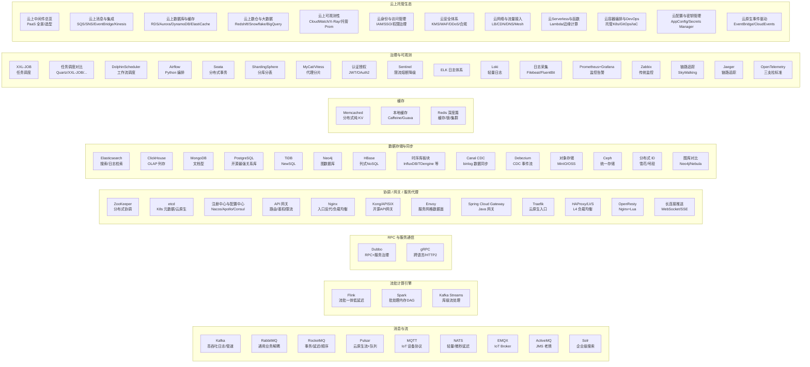

# 中间件（日常项目高频组件）板块

> 互联网系统里被反复使用的**通用基础设施组件**：消息、协调、缓存、搜索、存储、网关、调度、数据同步……本板块按「它是什么 → 解决什么 → 核心机制 → 选型对比 → 生产实践 → 面试高频」的结构逐件拆解。
> 与「源码系列」的分工：本板块偏**实用与选型**（怎么用、怎么选、怎么避坑），源码系列偏**实现原理**（代码怎么写的）。

---

## 1. 板块地图

## 2. 目录（75 篇）

### 消息与流

| 组件 | 定位 | 一句话 |
|------|------|--------|
| [Kafka](./Kafka.md) | 高吞吐分布式消息/流平台 | 日志与管道的事实标准：百万吞吐、可回放 |
| [RocketMQ](./RocketMQ.md) | 业务级可靠消息 | 事务/延迟/顺序/轨迹全都有，国内业务首选 |
| [RabbitMQ](./RabbitMQ.md) | 通用消息代理（AMQP） | 路由灵活、可靠好管理，企业级业务解耦 |
| [Apache Pulsar](./ApachePulsar.md) | 云原生消息流 | 存算分离、多租户、分层存储 |
| [NATS](./NATS.md) | 云原生轻量消息 | 微秒级延迟 + Request-Reply + JetStream 持久化 |
| [MQTT 与消息 Broker](./MQTT与消息broker.md) | IoT 设备协议 | 轻量发布订阅，物联网设备通信 |
| [EMQX](./EMQX.md) | IoT 消息中间件 | 亿级设备连接 + 规则引擎桥接 |
| [ActiveMQ 与 JMS](./ActiveMQ与JMS.md) | 老牌 JMS 消息中间件 | JMS 规范 + Artemis 新内核，存量 Java 系统 |
| [Schema Registry 与消息序列化](./SchemaRegistry与消息序列化.md) | 消息契约治理 | Schema 版本化 + 兼容策略 + 自动编解码 |

> 消息选型：日志管道 → Kafka；业务事务 → RocketMQ；精细路由 → RabbitMQ；云原生多租户 → Pulsar；微服务/边缘轻量 → NATS；IoT 设备 → EMQX；JMS 存量 → ActiveMQ。

### 流批计算引擎

| 组件 | 定位 | 一句话 |
|------|------|--------|
| [Apache Flink（流处理）](./ApacheFlink流处理.md) | 流批一体计算引擎 | 真流式低延迟 + Exactly-once，流是批的超集 |
| [Apache Spark（批处理）](./ApacheSpark批处理.md) | 大数据批处理事实标准 | 内存 DAG，比 MapReduce 快 10~100 倍 |
| [Kafka Streams 与 ksqlDB](./KafkaStreams与ksqlDB.md) | Kafka 生态库级流处理 | 零集群嵌入应用，状态精确一次 |

> 流批选型：实时低延迟 → Flink；离线大规模批处理/ML → Spark；两者都是流批一体路线。

### RPC 与服务通信

| 组件 | 定位 | 一句话 |
|------|------|--------|
| [Apache Dubbo（RPC 框架）](./ApacheDubboRPC框架.md) | 高性能 RPC + 服务治理 | Triple 协议、透明远程调用，Java 微服务通信首选 |
| [gRPC](./gRPC.md) | 跨语言 RPC 框架 | HTTP/2 + Protobuf + IDL 契约，云原生通信标准 |

> RPC 选型：跨语言/云原生 → gRPC；Java 微服务 + 强治理 → Dubbo（Triple 可互操作 gRPC）。

### 协调 / 网关 / 服务代理

| 组件 | 定位 | 一句话 |
|------|------|--------|
| [ZooKeeper](./ZooKeeper.md) | 分布式协调（CP） | 锁/选举/元数据，老牌 Java 生态 |
| [etcd](./etcd.md) | 云原生 KV 协调（CP） | K8s 大脑：Raft + Watch + Lease |
| [注册中心与配置中心](./注册中心与配置中心.md) | Nacos/Eureka/Consul/Apollo | 服务发现 + 动态配置的选型全解 |
| [API 网关](./API网关.md) | 应用层路由治理 | 路由/鉴权/限流/灰度一体化 |
| [Nginx](./Nginx.md) | 入口反代/负载均衡 | 流量看门人：静态/反代/HTTPS/限流 |
| [Kong/APISIX 网关](./Kong与APISIX网关.md) | 开源 API 网关双雄 | 插件化 + 动态配置 + 高性能 |
| [Envoy 服务代理](./Envoy服务代理.md) | 进程外代理/服务网格数据面 | xDS 动态配置，Istio 数据面 |
| [Spring Cloud Gateway](./SpringCloudGateway.md) | Java/Spring 生态网关 | WebFlux 非阻塞 + 断言/过滤器 + 注册中心路由 |
| [Traefik](./Traefik.md) | 云原生入口/Ingress | 自动发现 + 自动 HTTPS + 中间件编排 |
| [HAProxy 与 L4 负载均衡](./HAProxy与L4负载均衡.md) | L4/L7 负载均衡 + VIP 高可用 | LVS 扛量 + HAProxy 治理 + Keepalived 漂移 |
| [OpenResty](./OpenResty.md) | Nginx+Lua 可编程网关 | 阶段模型 + LuaJIT + cosocket 动态决策 |
| [长连接推送网关](./长连接推送网关.md) | WebSocket/SSE 实时推送 | 连接路由 + 心跳保活 + 离线补偿 |

### 数据存储与同步

| 组件 | 定位 | 一句话 |
|------|------|--------|
| [Elasticsearch](../ES体系.md) | 搜索引擎（见 ES 体系） | 倒排索引，搜索/日志/分析 |
| [ClickHouse](./ClickHouse.md) | OLAP 列存分析 | 亿级数据秒级聚合 |
| [MongoDB](./MongoDB.md) | 文档型 NoSQL | 灵活 Schema，海量文档 |
| [PostgreSQL 深度篇](./PostgreSQL深度篇.md) | 开源最强关系库 | SQL 最全/扩展最强/PostGIS/JSON |
| [TiDB 与 NewSQL](./TiDB与NewSQL.md) | 分布式关系型 | MySQL 协议 + 水平扩展 |
| [Neo4j 图数据库](./Neo4j图数据库.md) | 图数据库 | 关系图谱/风控/推荐 |
| [HBase 列式存储](./HBase列式存储.md) | 列式 NoSQL | HDFS 之上的海量随机读写 |
| [Solr 搜索平台](./Solr搜索平台.md) | 企业级搜索平台 | 全文检索 + 分面 + 高亮 |
| [向量数据库生态](./向量数据库生态.md) | 语义检索/RAG 底座 | HNSW/IVF + Milvus/Qdrant/pgvector 选型 |
| [Doris 与 StarRocks](./Doris与StarRocks.md) | 分析型 MPP 数据库 | MySQL 协议 + 物化视图 + 极速点查 |
| [Trino 联邦查询引擎](./Trino联邦查询引擎.md) | 多源联邦 SQL 查询 | 不存数据只算，湖仓查询层 |
| [RocksDB 与嵌入式 KV](./RocksDB与嵌入式KV存储.md) | LSM-Tree 存储底座 | TiKV/Kafka/Flink 的地基砖 |
| [Cassandra 与宽列存储](./Cassandra与宽列存储.md) | Dynamo 系宽列 NoSQL | 写强无单点多活，事件流首选 |
| [数据同步 CDC（Canal）](./数据同步CDC-Canal.md) | binlog 订阅同步 | 缓存失效/异构同步/订阅变更 |
| [Debezium](./Debezium.md) | CDC 事件流框架 | Kafka Connect 多库变更捕获，快照+增量一体 |
| [对象存储 MinIO/OSS](./对象存储MinIO-OSS.md) | 海量文件存储 | 图片/文件/备份，S3 协议 |
| [Ceph](./Ceph.md) | 统一分布式存储 | 对象/块/文件三接口 + CRUSH 无单点自愈 |
| [分布式 ID 生成器](./分布式ID生成器.md) | 全局唯一 ID 设施 | 雪花/号段/UUID，本地生成高性能 |
| [图数据库生态对比](./图数据库生态对比.md) | Neo4j/Nebula/JanusGraph/ArangoDB | 无索引邻接遍历，社交/风控/图谱 |

### 缓存

| 组件 | 定位 | 一句话 |
|------|------|--------|
| [Memcached 与本地缓存](./Memcached与本地缓存.md) | 分布式纯 KV + 进程内缓存 | 分布式管共享、Caffeine 管最快 |
| [Redis 深度篇](./Redis深度篇.md) | 缓存+数据结构+锁+集群 | 深度拆解；基础见「基础知识/redis知识」 |

### 治理与可观测

| 组件 | 定位 | 一句话 |
|------|------|--------|
| [任务调度 XXL-JOB](./任务调度XXL-JOB.md) | 分布式任务调度 | 中心化调度 + 分片广播 + 可视化 |
| [分布式任务调度对比](./分布式任务调度对比.md) | Quartz/XXL-JOB/Elastic-Job/PowerJob | 六大调度器横向对比选型 |
| [DolphinScheduler](./DolphinScheduler.md) | 大数据工作流调度 | 可视化 DAG 编排 + 补数 + 多租户 |
| [Apache Airflow](./Airflow.md) | Python 工作流编排 | DAG 即代码 + 回填/传感器/MLOps |
| [分布式事务 Seata](./分布式事务Seata.md) | 分布式事务框架 | AT/TCC/SAGA 一站式 |
| [分库分表 ShardingSphere](./分库分表ShardingSphere.md) | 分片/读写分离中间件 | 对应用透明水平拆分 |
| [MyCat 与 Vitess](./MyCat与Vitess.md) | 代理模式分库分表 | 应用零改动，MySQL 入口 + 路由合并 |
| [认证授权 JWT/OAuth2](./认证授权JWT-OAuth2.md) | 认证授权体系 | 登录态/授权码/令牌 |
| [Sentinel 限流熔断](./Sentinel限流熔断.md) | 流量治理组件 | 限流/熔断/降级/热点/系统保护 |
| [ELK 日志体系](./ELK日志体系.md) | 日志集中采集检索 | 排障第一站：检索/大盘/告警 |
| [Loki](./Loki.md) | 轻量云原生日志 | 只索引标签，成本为 ES 的 1/3，LogQL 日志即指标 |
| [日志采集与传输](./日志采集与传输.md) | Filebeat/Logstash/Fluent Bit | 采集→解析→缓冲→输出，第一公里 |
| [Prometheus 与 Grafana 监控](./Prometheus与Grafana监控.md) | 监控告警事实标准 | Pull 模型 + PromQL，K8s 监控首选 |
| [Zabbix](./Zabbix.md) | 传统企业监控 | Agent/SNMP + 触发器告警 + 报表，机房首选 |
| [链路追踪 SkyWalking](./链路追踪SkyWalking.md) | APM 链路追踪 | 慢在哪一跳，一目了然 |
| [Jaeger 链路追踪](./Jaeger链路追踪.md) | 云原生链路追踪 | OpenTelemetry 原生支持 |
| [OpenTelemetry](./OpenTelemetry.md) | 可观测性统一标准 | 指标/日志/链路三支柱一套采集，后端随便换 |

### 云上托管生态（PaaS）—— 总览与消息/数据

| 组件 | 定位 | 一句话 |
|------|------|--------|
| [云上中间件体系总览](./云上中间件体系总览.md) | PaaS 托管全景 | 云 vs 自建、五厂商对照图谱、选型六问 |
| [云上消息与集成生态](./云上消息与集成生态.md) | 队列/主题/事件/流 | SQS/SNS/EventBridge/Kinesis/PubSub/云 RocketMQ |
| [云上数据库与缓存生态](./云上数据库与缓存生态.md) | 托管关系库/NoSQL/缓存 | RDS/Aurora/PolarDB/DynamoDB/Cosmos/ElastiCache |
| [云上数仓与大数据生态](./云上数仓与大数据生态.md) | 云数仓/湖仓/流计算 | Redshift/BigQuery/Snowflake/Databricks/云 Flink |

### 云上托管生态（PaaS）—— 可观测性 / 身份 / 安全

| 组件 | 定位 | 一句话 |
|------|------|--------|
| [云上可观测性体系](./云上可观测性体系.md) | 监控/日志/链路/APM 托管 | CloudWatch/Cloud Monitoring/托管 Prometheus/X-Ray/ARMS |
| [云身份与访问管理体系](./云身份与访问管理体系.md) | IAM/SSO/权限治理/密钥托管 | IAM/RAM/CAM、RBAC/ABAC、临时凭证、KMS |
| [云安全体系](./云安全体系.md) | WAF/DDoS/证书/合规审计 | Shield/高防、WAF、ACM、CloudTrail/等保 |

### 云上托管生态（PaaS）—— 网络 / Serverless / DevOps

| 组件 | 定位 | 一句话 |
|------|------|--------|
| [云网络与流量接入体系](./云网络与流量接入体系.md) | LB/CDN/DNS/API 网关/服务网格 | ALB/NLB、CDN、Route53、Istio/App Mesh |
| [云 Serverless 与函数计算体系](./云Serverless与函数计算体系.md) | FaaS/事件驱动/边缘计算 | Lambda/FC/SCF、Cloudflare Workers、Cloud Run |
| [云容器编排与 DevOps 体系](./云容器编排与DevOps体系.md) | 托管 K8s / CI-CD / GitOps / IaC | EKS/AKS/GKE、GitHub Actions、ArgoCD、Terraform |
| [云配置与密钥管理](./云配置与密钥管理.md) | 动态配置/密钥分发/自动轮换 | AppConfig/ACM、Secrets Manager/Vault、External Secrets |
| [云原生事件驱动与集成](./云原生事件驱动与集成.md) | EventBridge/CloudEvents/Schema | EventBridge/EventGrid、CloudEvents 标准、Schema Registry |

> 云上选型一句话：**先定 IO/存储模型 → 找开源协议兼容的托管服务（防锁定）→ 算 SLA + 弹性 + 按量计费账 → 用 CloudEvents/OpenTelemetry 标准防厂商锁定。**

## 3. 学习路径

1. **入门**：先懂「为什么需要中间件」——[分布式系统理论总纲](../分布式系统.md) → 本文档地图。
2. **消息**：Kafka（吞吐原理）→ RocketMQ（事务/延迟）→ 对比选型 → NATS（轻量）→ EMQX（IoT）→ Schema Registry（契约治理）→ Kafka Streams/ksqlDB（库级流处理）。
3. **计算**：Flink（流批一体/Exactly-once）→ Spark（批处理/DAG）→ Kafka Streams（应用内轻量流处理）→ 对照「大数据」板块。
4. **RPC 与协调**：Dubbo（透明 RPC + 服务治理）→ gRPC（HTTP/2/Protobuf）→ 注册中心与配置中心 → etcd（Raft/Watch/Lease）→ ZooKeeper（ZAB）。
5. **网关与服务代理**：API 网关 → Nginx → OpenResty（Nginx+Lua）→ Kong/APISIX（插件化）→ Spring Cloud Gateway（Java）→ Traefik（云原生入口）→ Envoy（xDS/服务网格数据面）→ HAProxy/LVS（L4 入口）→ 长连接推送网关（WebSocket/SSE）。
6. **性能**：Redis 深度篇 → 缓存三问 → 本地缓存 → 多级缓存（见「场景设计」）。
7. **存储**：PostgreSQL 深度篇（关系库天花板）→ 分库分表 → MyCat/Vitess（代理分片）→ TiDB → HBase/Cassandra/ClickHouse（大数据存储）→ Solr/ES（搜索）→ MongoDB → MinIO/Ceph（存储）→ 图数据库（Neo4j/Nebula）。
8. **治理**：Sentinel（限流/熔断/降级）→ Seata（分布式事务）→ 分布式 ID（雪花/号段）→ 任务调度（XXL-JOB → 调度器横向对比 → DolphinScheduler → Airflow 工作流编排）。
9. **观测**：OpenTelemetry（三支柱标准）→ Prometheus/Grafana 监控 → Zabbix（传统监控）→ ELK/Loki 日志 → 日志采集（Filebeat/Fluent Bit）→ SkyWalking/Jaeger 链路 → 可观测性（见「云原生」）。
10. **云上（基础）**：先读「云上中间件体系总览」→ 按需要钻进消息/数据库/数仓三篇生态 → 对照自建篇学原理。
11. **云上（进阶）**：可观测性体系（托管 Prom/X-Ray）→ 身份与访问管理（IAM/KMS）→ 安全体系（WAF/DDoS）→ 网络与流量接入（LB/Mesh）。
12. **云上（高级）**：Serverless 与函数计算（Lambda/边缘）→ 容器编排与 DevOps（托管 K8s/GitOps）→ 配置与密钥管理（AppConfig/Vault）→ 事件驱动与集成（EventBridge/CloudEvents）。
13. **深挖**：每篇末尾的「与其他板块的关系」跳「源码系列」对应源码篇。

## 4. 与其他板块的关系

- 「源码系列」：Kafka / RocketMQ / ZooKeeper / Nacos / Sentinel / Netty 等源码精读（Dubbo 也已有源码篇）。
- 「场景设计」：分布式锁、缓存三问、多级缓存、稳定性三板斧等实战场景。
- 「技术选型」：04-主流技术域选型对比（数据库/缓存/MQ/搜索/网关）。
- 「云原生」：K8s（etcd 底座）、Service Mesh（Envoy 数据面）、可观测性（Prometheus/Jaeger/OTel）、Serverless、Ingress（Traefik/APISIX）。
- 「大数据」「时序库」：Flink/Spark/DolphinScheduler/HBase 与 Kafka/ClickHouse/Debezium 组成大数据体系，TSDB 另见时序库板块。
- 「基础知识」：Redis 深度篇 ↔ redis知识、PostgreSQL 深度篇 ↔ MySQL/数据库基础、Solr/ES ↔ ES体系、gRPC ↔ 网络协议深挖。
- 「安全工程」：JWT/OAuth2 原理 → 云安全体系（WAF/DDoS/合规）的纵深延伸。
- 「架构」：事件溯源 CQRS → 云原生事件驱动（EventBridge/CloudEvents）。
