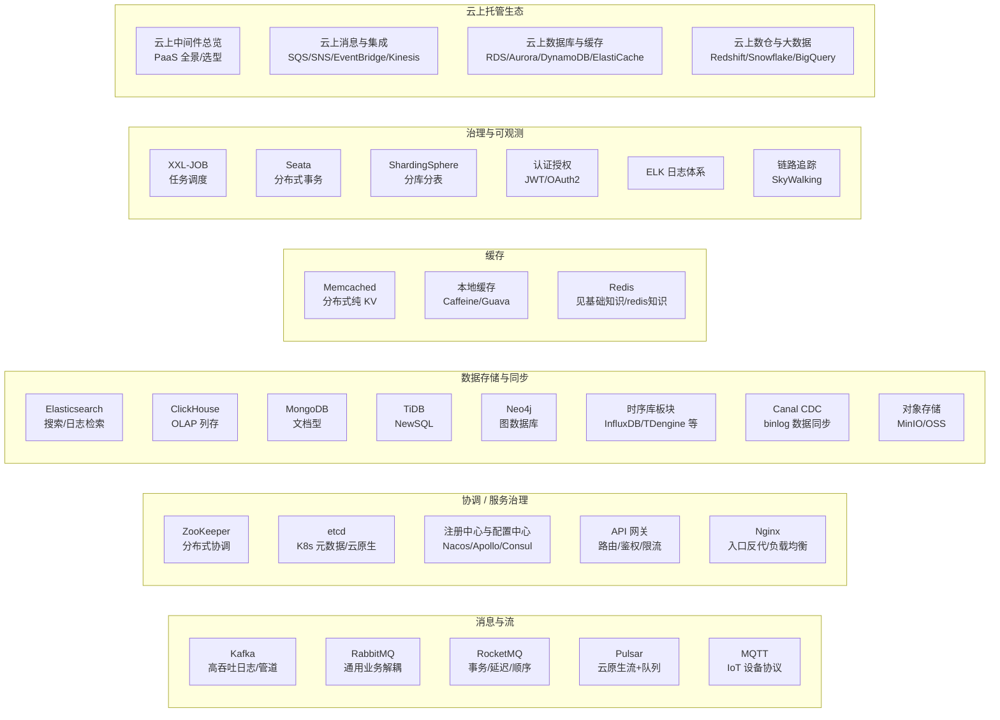

# 中间件（日常项目高频组件）板块

> 互联网系统里被反复使用的**通用基础设施组件**：消息、协调、缓存、搜索、存储、网关、调度、数据同步……本板块按「它是什么 → 解决什么 → 核心机制 → 选型对比 → 生产实践 → 面试高频」的结构逐件拆解。
> 与「源码系列」的分工：本板块偏**实用与选型**（怎么用、怎么选、怎么避坑），源码系列偏**实现原理**（代码怎么写的）。

---

## 1. 板块地图

## 2. 目录（27 篇）

### 消息与流

| 组件 | 定位 | 一句话 |
|------|------|--------|
| [Kafka](./Kafka.md) | 高吞吐分布式消息/流平台 | 日志与管道的事实标准：百万吞吐、可回放 |
| [RocketMQ](./RocketMQ.md) | 业务级可靠消息 | 事务/延迟/顺序/轨迹全都有，国内业务首选 |
| [RabbitMQ](./RabbitMQ.md) | 通用消息代理（AMQP） | 路由灵活、可靠好管理，企业级业务解耦 |
| [Apache Pulsar](./ApachePulsar.md) | 云原生消息流 | 存算分离、多租户、分层存储 |
| [MQTT 与消息 Broker](./MQTT与消息broker.md) | IoT 设备协议 | 轻量发布订阅，物联网设备通信 |

> 消息选型：日志管道 → Kafka；业务事务 → RocketMQ；精细路由 → RabbitMQ；云原生多租户 → Pulsar。

### 协调与服务治理

| 组件 | 定位 | 一句话 |
|------|------|--------|
| [ZooKeeper](./ZooKeeper.md) | 分布式协调（CP） | 锁/选举/元数据，老牌 Java 生态 |
| [etcd](./etcd.md) | 云原生 KV 协调（CP） | K8s 大脑：Raft + Watch + Lease |
| [注册中心与配置中心](./注册中心与配置中心.md) | Nacos/Eureka/Consul/Apollo | 服务发现 + 动态配置的选型全解 |
| [API 网关](./API网关.md) | 应用层路由治理 | 路由/鉴权/限流/灰度一体化 |
| [Nginx](./Nginx.md) | 入口反代/负载均衡 | 流量看门人：静态/反代/HTTPS/限流 |

### 数据存储与同步

| 组件 | 定位 | 一句话 |
|------|------|--------|
| [Elasticsearch](../ES体系.md) | 搜索引擎（见 ES 体系） | 倒排索引，搜索/日志/分析 |
| [ClickHouse](./ClickHouse.md) | OLAP 列存分析 | 亿级数据秒级聚合 |
| [MongoDB](./MongoDB.md) | 文档型 NoSQL | 灵活 Schema，海量文档 |
| [TiDB 与 NewSQL](./TiDB与NewSQL.md) | 分布式关系型 | MySQL 协议 + 水平扩展 |
| [Neo4j 图数据库](./Neo4j图数据库.md) | 图数据库 | 关系图谱/风控/推荐 |
| [数据同步 CDC（Canal）](./数据同步CDC-Canal.md) | binlog 订阅同步 | 缓存失效/异构同步/订阅变更 |
| [对象存储 MinIO/OSS](./对象存储MinIO-OSS.md) | 海量文件存储 | 图片/文件/备份，S3 协议 |

### 缓存

| 组件 | 定位 | 一句话 |
|------|------|--------|
| [Memcached 与本地缓存](./Memcached与本地缓存.md) | 分布式纯 KV + 进程内缓存 | 分布式管共享、Caffeine 管最快 |
| Redis | 缓存+数据结构 | 见「基础知识/redis知识」 |

### 治理与可观测

| 组件 | 定位 | 一句话 |
|------|------|--------|
| [任务调度 XXL-JOB](./任务调度XXL-JOB.md) | 分布式任务调度 | 中心化调度 + 分片广播 + 可视化 |
| [分布式事务 Seata](./分布式事务Seata.md) | 分布式事务框架 | AT/TCC/SAGA 一站式 |
| [分库分表 ShardingSphere](./分库分表ShardingSphere.md) | 分片/读写分离中间件 | 对应用透明水平拆分 |
| [认证授权 JWT/OAuth2](./认证授权JWT-OAuth2.md) | 认证授权体系 | 登录态/授权码/令牌 |
| [ELK 日志体系](./ELK日志体系.md) | 日志集中采集检索 | 排障第一站：检索/大盘/告警 |
| [链路追踪 SkyWalking](./链路追踪SkyWalking.md) | APM 链路追踪 | 慢在哪一跳，一目了然 |

### 云上托管生态（PaaS）

| 组件 | 定位 | 一句话 |
|------|------|--------|
| [云上中间件体系总览](./云上中间件体系总览.md) | PaaS 托管全景 | 云 vs 自建、四厂商对照图谱、选型六问 |
| [云上消息与集成生态](./云上消息与集成生态.md) | 队列/主题/事件/流 | SQS/SNS/EventBridge/Kinesis/PubSub/云 RocketMQ |
| [云上数据库与缓存生态](./云上数据库与缓存生态.md) | 托管关系库/NoSQL/缓存 | RDS/Aurora/PolarDB/DynamoDB/Cosmos/ElastiCache |
| [云上数仓与大数据生态](./云上数仓与大数据生态.md) | 云数仓/湖仓/流计算 | Redshift/BigQuery/Snowflake/Databricks/云 Flink |

> 云上选型一句话：**先定 IO/存储模型 → 找开源协议兼容的托管服务（防锁定）→ 算 SLA + 弹性 + 按量计费账。**

## 3. 学习路径

1. **入门**：先懂「为什么需要中间件」——[分布式系统理论总纲](../分布式系统.md) → 本文档地图。
2. **消息**：Kafka（吞吐原理）→ RocketMQ（事务/延迟）→ 对比选型。
3. **协调**：etcd（Raft/Watch/Lease）→ ZooKeeper（ZAB）→ 注册中心与配置中心。
4. **性能**：Redis → 缓存三问 → 本地缓存 → 多级缓存（见「场景设计」）。
5. **治理**：API 网关 → Nginx → XXL-JOB → Seata → 分库分表。
6. **观测**：ELK 日志 → SkyWalking 链路 → 可观测性（见「云原生」）。
7. **云上**：先读「云上中间件体系总览」→ 按需要钻进消息/数据库/数仓三篇生态 → 对照自建篇学原理。
8. **深挖**：每篇末尾的「与其他板块的关系」跳「源码系列」对应源码篇。

## 4. 与其他板块的关系

- 「源码系列」：Kafka / RocketMQ / ZooKeeper / Nacos / Sentinel / Netty 等源码精读。
- 「场景设计」：分布式锁、缓存三问、多级缓存、稳定性三板斧等实战场景。
- 「技术选型」：04-主流技术域选型对比（数据库/缓存/MQ/搜索/网关）。
- 「云原生」：K8s（etcd 底座）、Service Mesh、可观测性。
- 「大数据」「时序库」：Kafka/ClickHouse 与大数据、TSDB 体系的联动。
