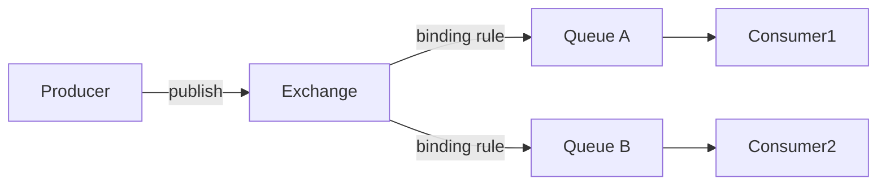

# RabbitMQ（通用消息代理 / 消息队列）

> 基于 AMQP 的**通用消息中间件**，以「灵活路由 + 高可靠投递 + 易管理」著称。
> 适合：企业业务解耦、异步任务、订单后通知、延时/重试、死信处理。
> 不适合：超高频日志流（吞吐逊于 Kafka）、海量分区场景。

---

## 〇、本体介绍（它是什么 / 适用场景 / 核心概念）

**它是什么**：RabbitMQ 是基于 **AMQP 0-9-1 协议**的开源消息代理（Message Broker），用 Erlang 编写，以「灵活路由 + 高可靠 + 易运维」著称，是通用消息队列的代表。

**解决什么痛点**：分布式系统需要异步解耦、削峰填谷、可靠投递、延迟队列。RabbitMQ 通过 Exchange→Queue→Binding 的路由模型支持丰富投递语义，并提供 Confirm、持久化、手动 ACK、死信队列等可靠性机制。

**核心概念**：Producer/Consumer、Queue（FIFO）、Exchange（Direct/Fanout/Topic/Headers 四种类型）、Binding（路由规则）、Routing Key、Vhost（逻辑隔离）、Channel（轻量连接）、Publisher Confirm、死信队列（DLX）、镜像队列、惰性队列、QoS prefetch。

**适用场景**：业务解耦、异步任务、延迟队列、复杂路由、企业级可靠消息。
**不适用**：超高通量日志流（应选 Kafka/Pulsar）。

---

## 一、它解决什么问题

微服务/单体里，模块间直接调用会导致**强耦合、同步阻塞、故障扩散**。RabbitMQ 引入「Broker 中转」：
- 生产者发消息到 Broker，**不等消费者**，立即返回（异步解耦）。
- Broker 负责**可靠存储、路由、投递、重试、死信**。
- 消费者按自己节奏处理，故障时不丢消息。

> 仓库 `github.com/rabbitmq/rabbitmq-server`：Erlang 实现（CLI 用 Elixir），多协议（AMQP 0-9-1 / 1.0、MQTT、STOMP、Stream），**MPL 2.0 + Apache 2.0 双许可**，6.2 万+ commits，企业最流行通用 broker 之一。

---

## 二、核心模型：Exchange → Queue → Binding

RabbitMQ 的灵魂是「**生产者不直接发队列，而是发 Exchange，由 Exchange 按规则路由到 Queue**」。

| 概念 | 说明 |
|------|------|
| **Exchange（交换机）** | 接收消息并按类型路由，本身不存消息 |
| **Queue（队列）** | 真正存消息的地方，消费者从队列取 |
| **Binding（绑定）** | Exchange 到 Queue 的路由规则（可带 routing key） |
| **routing key** | 消息携带的路由键，Exchange 据此匹配 Binding |

---

## 三、四种 Exchange 类型（路由核心）

| 类型 | 路由逻辑 | 典型场景 |
|------|----------|----------|
| **direct** | routing key **精确匹配** | 点对点、按业务类型分发 |
| **topic** | routing key 按 `.` 分隔，**通配**（`*` 单段、`#` 多段） | 按层级分类（如 `order.created`、`user.*`） |
| **fanout** | **广播**到所有绑定队列，忽略 key | 通知、事件广播 |
| **headers** | 按消息头（非 key）匹配，少用 | 复杂头属性路由 |

---

## 四、可靠性机制（面试高频）

1. **消息确认（Ack）**：消费者处理完发 `ack`，Broker 才删消息；没 ack 且断开 → 重新投递（防丢）。
2. **持久化**：Exchange/Queue 声明 `durable=true` + 消息 `deliveryMode=2`，Broker 落盘，重启不丢。
3. **生产者确认（Publisher Confirm）**：Broker 收到后回 ack，生产者可知是否送达。
4. **死信队列（DLX）**：消息被拒绝/过期/队列满 → 转入死信 Exchange，便于补偿/告警。
5. **延迟消息**：社区插件（`rabbitmq_delayed_message_exchange`）或「死信 + TTL」实现定时/重试。仲裁队列（Quorum Queue）原生支持延迟重试（指数退避）。
6. **镜像/仲裁队列**：队列多副本，主挂自动切，防单点。

---

## 五、RabbitMQ vs Kafka vs RocketMQ vs Pulsar

| 维度 | RabbitMQ | Kafka | RocketMQ | Pulsar |
|------|----------|-------|----------|--------|
| 吞吐 | 5万~10万 msg/s | 100万+ | 50万+ | 100万+ |
| 模型 | Exchange 灵活路由 | 分区日志 | 主题+队列 | 分层+多订阅 |
| 延迟 | 毫秒级 | 毫秒~秒 | 毫秒 | 毫秒（<10ms） |
| 事务消息 | 弱 | 弱 | ✅ | ✅ |
| 多协议 | ✅ AMQP/MQTT/STOMP | 自定义 | 自定义 | 多协议 |
| 消费模型 | 推送+竞争消费 | 拉取+Consumer Group | 拉取 | 推/拉+4 种订阅 |
| 运维 | 低（管理 UI 友好） | 高 | 中 | 高 |
| 适用 | 业务解耦/异步/通知 | 日志/流处理 | 金融/电商事务 | 云原生/多租户 |

**选型口诀**：业务要精细路由 + 易管理 → RabbitMQ；日志/大数据管道 → Kafka；事务消息/电商 → RocketMQ；云原生多租户全球化 → Pulsar。

---

## 六、生产实践与避坑

1. **手动 Ack + 幂等**：消费者处理完才 ack，且业务要做幂等（消息可能重投）。
2. **合理用死信**：失败消息进 DLX，避免无限重试阻塞主队列。
3. **Queue 长度限制**：设 `x-max-length` 防消息堆积撑爆内存。
4. **Prefetch 限流**：`basic.qos` 控制未 ack 上限，削峰防消费者被打垮。
5. **管理 UI**：自带 Management Plugin（15672 端口），可视化队列/连接/速率。
6. **Spring 集成**：`spring-boot-starter-amqp` + `RabbitTemplate` / `@RabbitListener`，声明 Exchange/Queue/Binding 用 `BindingBuilder`。

---

## 七、与其他板块的关系

- 与 [消息队列 MQ](MQ.md)、[Apache Pulsar](ApachePulsar.md)、[MQTT](MQTT与消息broker.md)：同属消息中间件家族，RabbitMQ 偏「业务级可靠路由」，Pulsar/Kafka 偏「高吞吐流」，MQTT 偏「设备协议」。
- 与 [分布式事务 Seata](分布式事务Seata.md)：可靠消息最终一致性（本地事务表 + 消息确认）是 RabbitMQ 常见分布式事务落地方式。
- 与 [注册中心与配置中心](注册中心与配置中心.md)：RabbitMQ 集群常借助外部元数据，但不强依赖注册中心。

---

## 八、速查表

| 项 | 结论 |
|----|------|
| 类型 | 通用消息代理（AMQP） |
| 核心 | Exchange → Binding → Queue 路由 |
| 路由类型 | direct / topic / fanout / headers |
| 可靠 | Ack + 持久化 + Confirm + DLX + 仲裁队列 |
| 延迟消息 | 插件 或 死信+TTL |
| 吞吐 | 5万~10万 msg/s（中等） |
| 许可证 | MPL 2.0 + Apache 2.0 |
| 一句话 | 「业务级消息」——可靠、路由灵活、好管理 |

---

## 面试高频问题（20+ 条）

1. **RabbitMQ 是什么，核心组件？** 基于 AMQP 0-9-1 的开源消息代理，Erlang 编写。组件：Producer、Consumer、Queue（FIFO）、Exchange（路由）、Binding（规则）、Vhost（逻辑隔离）、Channel（轻量连接）。

2. **四种 Exchange 类型？** Direct（精确匹配 Routing Key，点对点）；Fanout（广播到所有绑定队列）；Topic（模式匹配 * 单层、# 多层，日志/订阅）；Headers（按消息头匹配，性能差少用）。

3. **如何保证消息不丢失（三层防护）？** 生产者：开启 Confirm 模式（异步 ACK）；Broker：Exchange/Queue/消息都 durable 持久化（delivery_mode=2）；消费者：关闭 autoAck，业务处理完手动 basicAck，失败 NACK/重入队或进死信队列。

4. **死信队列（DLX）是什么？** 消息变成死信（被拒 requeue=false、TTL 过期、队列满）后，按 x-dead-letter-exchange 路由到死信队列。常用于异常隔离、重试、审计。

5. **如何实现延迟队列？** 方案：① 死信交换机 + 消息/队列 TTL（过期后进 DLX）；② 官方 rabbitmq-delayed-message-exchange 插件（原生延迟，推荐）。

6. **消息重复消费如何处理？** 消费端做幂等：数据库唯一索引、Redis SETNX、状态机（已支付再支付直接返回成功）、布隆过滤器去重 Message ID。

7. **RabbitMQ 与 Kafka 核心区别？** 设计目标：RabbitMQ 通用队列/复杂路由，Kafka 高吞吐日志流；吞吐量：RabbitMQ 万级/秒，Kafka 十万~百万级/秒；消息模型：RabbitMQ 队列 Push/Pull，Kafka 分区日志 Pull；顺序：RabbitMQ 单队列有序，Kafka 分区内有序。

8. **集群模式有哪些？** 普通集群（元数据共享，队列数据单节点）；镜像队列（队列数据同步多节点，HA，但 3.12+ 被 Quorum Queue 取代）；Federation（跨机房异步复制）；Shovel（跨集群主动搬运）。

9. **镜像队列/Quorum Queue？** 镜像队列把队列数据复制到多节点防丢失；RabbitMQ 3.12+ 默认所有队列为惰性队列，推荐用 Quorum Queue（Raft 复制）替代老镜像队列做高可用。

10. **内存告警与磁盘告警？** 内存超 vm_memory_high_watermark（默认 0.4）阻塞所有连接；磁盘低于 disk_free_limit（默认 50MB）阻塞生产者。可调水位或启用惰性队列。

11. **什么是惰性队列（Lazy Queue）？** 消息直接写磁盘、不驻留内存，适合长队列/消息堆积/内存紧张；3.12+ 默认开启。恢复快（已在磁盘）。

12. **Flow Control 流控？** 当内存/磁盘接近阈值，RabbitMQ 暂停接收消息防止过载，资源回落后自动恢复。

13. **如何保证消息顺序？** 单队列 + 单消费者（性能低）；或用分片队列/单一消费者避免并发乱序。RabbitMQ 全局顺序难保证，网络分区下尤甚。

14. **TTL 配置方式？** 消息级 expiration 属性；队列级 x-message-ttl 参数。过期消息移除，配 DLX 则进死信队列。

15. **优先级队列？** 声明队列时 x-max-priority 指定最大优先级，发送时设 priority；高优先级先消费。

16. **QoS / prefetch 作用？** channel.basic_qos(prefetch_count) 限制消费者未确认消息数，防止单消费者积压、实现公平分发（轮询 + 预取）。

17. **脑裂（Network Partition）处理？** 策略：ignore（默认需人工）、autoheal（自动愈合）、pause_minority（少数派暂停）。建议生产配 autoheal 或 pause_minority。

18. **Vhost 作用？** 单 Broker 上逻辑隔离，相当于独立 MQ 实例；不同业务用独立 Vhost + 权限控制（configure/write/read）。

19. **消息积压怎么处理？** 增加消费者、优化消费逻辑、消息分流到多队列/Exchange、临时扩容、惰性队列抗堆积；必要时丢弃非关键消息。

20. **安全机制？** 认证（内置/ LDAP/ OAuth2-JWT）、授权（Vhost + 权限）、传输 TLS/mTLS、防火墙限制端口（5672/15672/15674）。

21. **性能瓶颈与解决？** 磁盘 IO（SSD、分离日志）、内存（加内存、惰性队列）、CPU（避免复杂 Topic 正则）、连接数（连接池 + 多 Channel）、队列过长（分片/联邦）。

22. **RabbitMQ 选型场景？** 需精确路由、低延迟、可靠投递、延迟队列的业务解耦；超高通量日志流选 Kafka/Pulsar。
