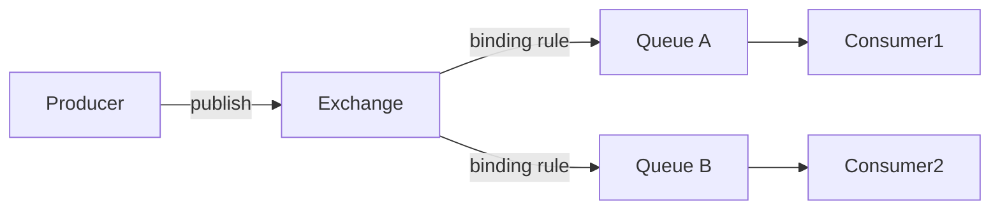

# RabbitMQ（通用消息代理 / 消息队列）

> 基于 AMQP 的**通用消息中间件**，以「灵活路由 + 高可靠投递 + 易管理」著称。
> 适合：企业业务解耦、异步任务、订单后通知、延时/重试、死信处理。
> 不适合：超高频日志流（吞吐逊于 Kafka）、海量分区场景。

---

## 一、它解决什么问题

微服务/单体里，模块间直接调用会导致**强耦合、同步阻塞、故障扩散**。RabbitMQ 引入「Broker 中转」：
- 生产者发消息到 Broker，**不等消费者**，立即返回（异步解耦）。
- Broker 负责**可靠存储、路由、投递、重试、死信**。
- 消费者按自己节奏处理，故障时不丢消息。

> 仓库 `github.com/rabbitmq/rabbitmq-server`：Erlang 实现（CLI 用 Elixir），多协议（AMQP 0-9-1 / 1.0、MQTT、STOMP、Stream），**MPL 2.0 + Apache 2.0 双许可**，6.2 万+ commits，企业最流行通用 broker 之一。

---

## 二、核心模型：Exchange → Queue → Binding

RabbitMQ 的灵魂是「**生产者不直接发队列，而是发 Exchange，由 Exchange 按规则路由到 Queue**」。

| 概念 | 说明 |
|------|------|
| **Exchange（交换机）** | 接收消息并按类型路由，本身不存消息 |
| **Queue（队列）** | 真正存消息的地方，消费者从队列取 |
| **Binding（绑定）** | Exchange 到 Queue 的路由规则（可带 routing key） |
| **routing key** | 消息携带的路由键，Exchange 据此匹配 Binding |

---

## 三、四种 Exchange 类型（路由核心）

| 类型 | 路由逻辑 | 典型场景 |
|------|----------|----------|
| **direct** | routing key **精确匹配** | 点对点、按业务类型分发 |
| **topic** | routing key 按 `.` 分隔，**通配**（`*` 单段、`#` 多段） | 按层级分类（如 `order.created`、`user.*`） |
| **fanout** | **广播**到所有绑定队列，忽略 key | 通知、事件广播 |
| **headers** | 按消息头（非 key）匹配，少用 | 复杂头属性路由 |

---

## 四、可靠性机制（面试高频）

1. **消息确认（Ack）**：消费者处理完发 `ack`，Broker 才删消息；没 ack 且断开 → 重新投递（防丢）。
2. **持久化**：Exchange/Queue 声明 `durable=true` + 消息 `deliveryMode=2`，Broker 落盘，重启不丢。
3. **生产者确认（Publisher Confirm）**：Broker 收到后回 ack，生产者可知是否送达。
4. **死信队列（DLX）**：消息被拒绝/过期/队列满 → 转入死信 Exchange，便于补偿/告警。
5. **延迟消息**：社区插件（`rabbitmq_delayed_message_exchange`）或「死信 + TTL」实现定时/重试。仲裁队列（Quorum Queue）原生支持延迟重试（指数退避）。
6. **镜像/仲裁队列**：队列多副本，主挂自动切，防单点。

---

## 五、RabbitMQ vs Kafka vs RocketMQ vs Pulsar

| 维度 | RabbitMQ | Kafka | RocketMQ | Pulsar |
|------|----------|-------|----------|--------|
| 吞吐 | 5万~10万 msg/s | 100万+ | 50万+ | 100万+ |
| 模型 | Exchange 灵活路由 | 分区日志 | 主题+队列 | 分层+多订阅 |
| 延迟 | 毫秒级 | 毫秒~秒 | 毫秒 | 毫秒（<10ms） |
| 事务消息 | 弱 | 弱 | ✅ | ✅ |
| 多协议 | ✅ AMQP/MQTT/STOMP | 自定义 | 自定义 | 多协议 |
| 消费模型 | 推送+竞争消费 | 拉取+Consumer Group | 拉取 | 推/拉+4 种订阅 |
| 运维 | 低（管理 UI 友好） | 高 | 中 | 高 |
| 适用 | 业务解耦/异步/通知 | 日志/流处理 | 金融/电商事务 | 云原生/多租户 |

**选型口诀**：业务要精细路由 + 易管理 → RabbitMQ；日志/大数据管道 → Kafka；事务消息/电商 → RocketMQ；云原生多租户全球化 → Pulsar。

---

## 六、生产实践与避坑

1. **手动 Ack + 幂等**：消费者处理完才 ack，且业务要做幂等（消息可能重投）。
2. **合理用死信**：失败消息进 DLX，避免无限重试阻塞主队列。
3. **Queue 长度限制**：设 `x-max-length` 防消息堆积撑爆内存。
4. **Prefetch 限流**：`basic.qos` 控制未 ack 上限，削峰防消费者被打垮。
5. **管理 UI**：自带 Management Plugin（15672 端口），可视化队列/连接/速率。
6. **Spring 集成**：`spring-boot-starter-amqp` + `RabbitTemplate` / `@RabbitListener`，声明 Exchange/Queue/Binding 用 `BindingBuilder`。

---

## 七、与其他板块的关系

- 与 [消息队列 MQ](MQ.md)、[Apache Pulsar](ApachePulsar.md)、[MQTT](MQTT与消息broker.md)：同属消息中间件家族，RabbitMQ 偏「业务级可靠路由」，Pulsar/Kafka 偏「高吞吐流」，MQTT 偏「设备协议」。
- 与 [分布式事务 Seata](分布式事务Seata.md)：可靠消息最终一致性（本地事务表 + 消息确认）是 RabbitMQ 常见分布式事务落地方式。
- 与 [注册中心与配置中心](注册中心与配置中心.md)：RabbitMQ 集群常借助外部元数据，但不强依赖注册中心。

---

## 八、速查表

| 项 | 结论 |
|----|------|
| 类型 | 通用消息代理（AMQP） |
| 核心 | Exchange → Binding → Queue 路由 |
| 路由类型 | direct / topic / fanout / headers |
| 可靠 | Ack + 持久化 + Confirm + DLX + 仲裁队列 |
| 延迟消息 | 插件 或 死信+TTL |
| 吞吐 | 5万~10万 msg/s（中等） |
| 许可证 | MPL 2.0 + Apache 2.0 |
| 一句话 | 「业务级消息」——可靠、路由灵活、好管理 |
