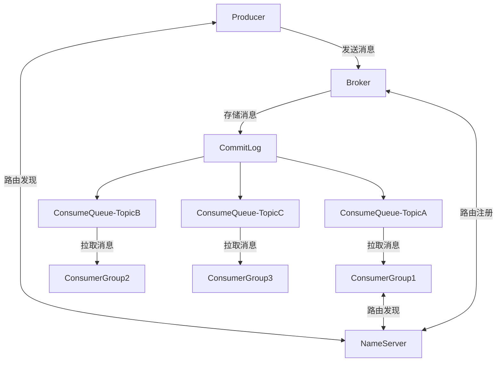
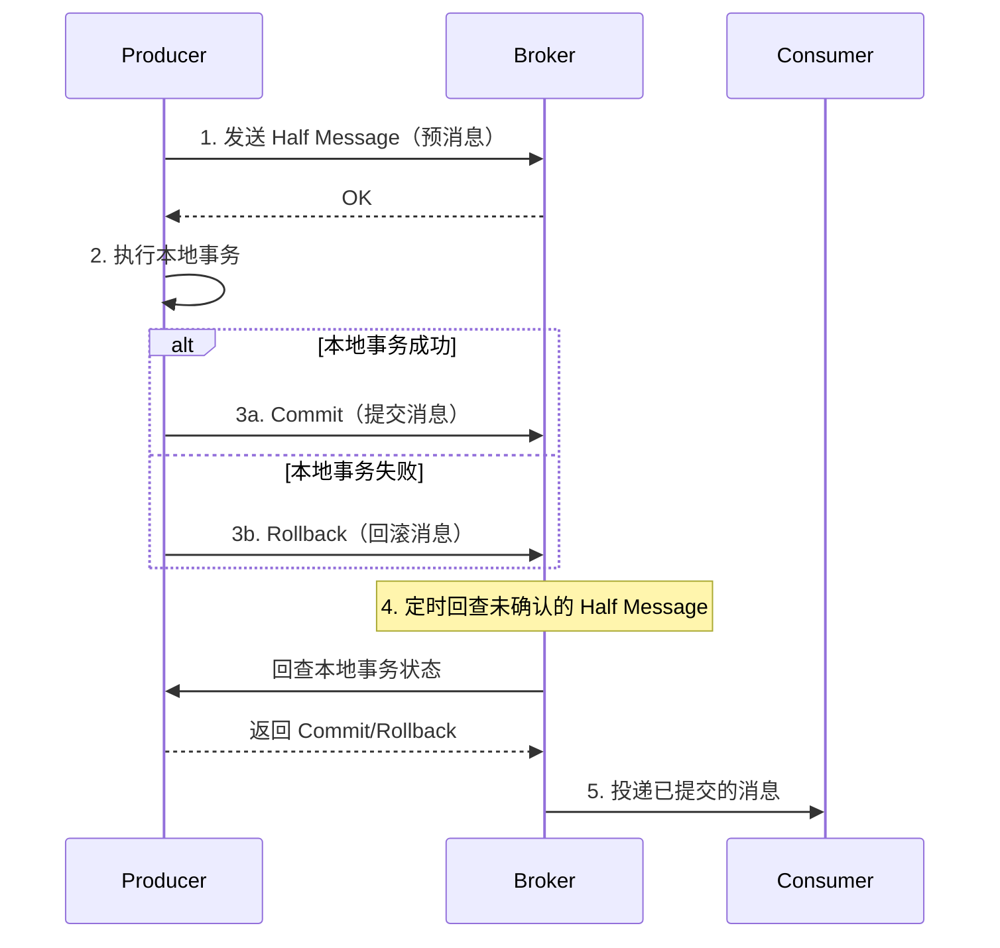
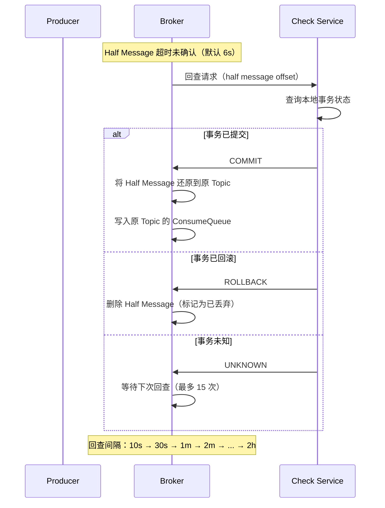
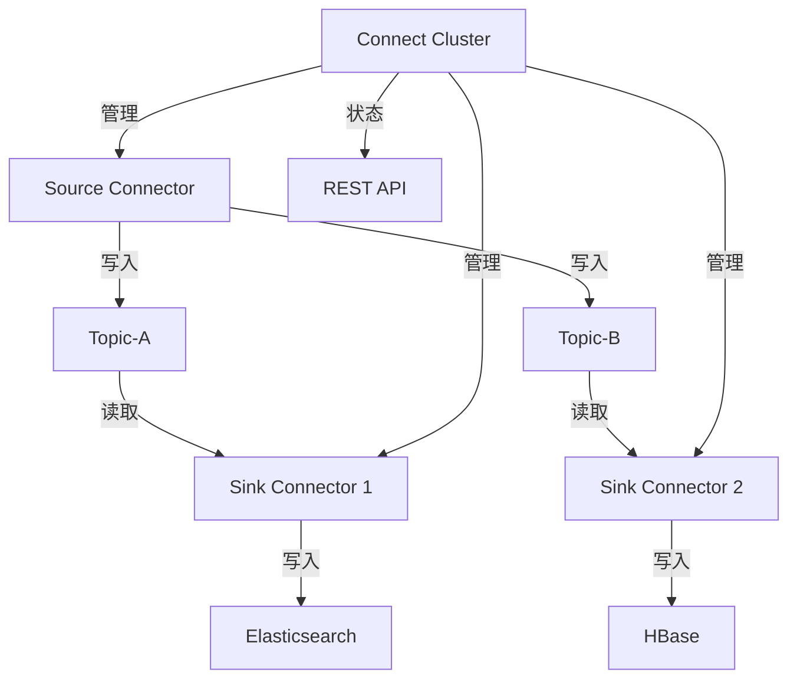
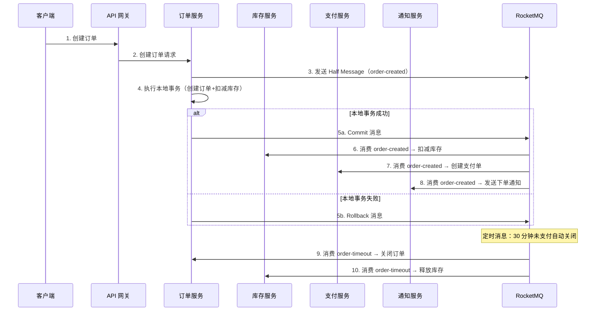
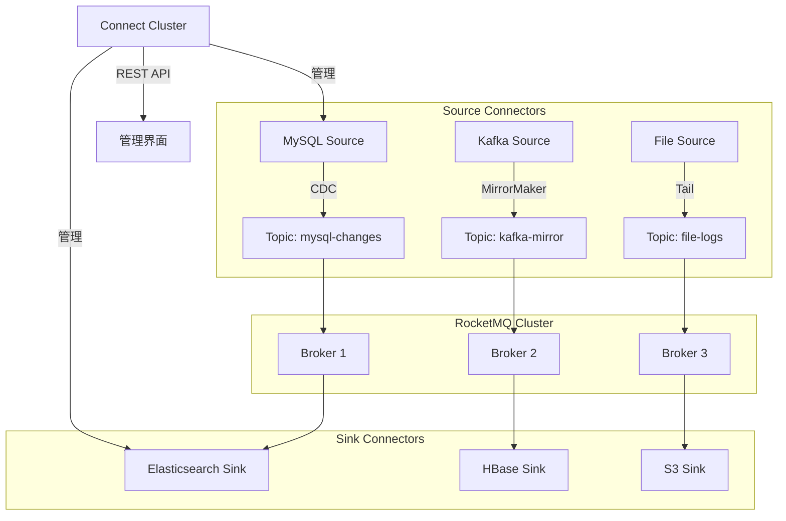

# RocketMQ

> **核心认知**：RocketMQ 是阿里巴巴开源的分布式消息中间件，以高吞吐、低延迟、高可靠著称。它在 Kafka 的基础上增加了事务消息、定时消息、消息过滤、消息轨迹等企业级特性，是金融级消息场景的首选。

## 要解决的问题

| 问题 | 传统 MQ 的痛点 | RocketMQ 的解法 |
|------|---------------|-----------------|
| 事务消息 | 本地事务与消息发送无法原子性 | 两阶段消息（Half Message） |
| 定时消息 | 不支持精确时间投递 | 原生支持定时/延时消息 |
| 消息过滤 | 消费者收到全部消息，带宽浪费 | Tag/SQL92 表达式过滤 |
| 顺序消息 | 分区级别有序，跨分区无序 | MessageGroup 确保有序 |
| 消息回溯 | 消息消费后无法重新消费 | 按时间戳回溯任意时间点 |
| 消息轨迹 | 消息链路不可追踪 | 内置消息轨迹查询 |

## 架构设计

### 核心组件



### 消息存储模型

```
CommitLog（顺序写）：
  ├── 所有 Topic 的消息追加写入同一个文件
  ├── 单文件 1GB，顺序写性能极高
  └── 异步构建 ConsumeQueue 索引

ConsumeQueue（逻辑队列）：
  ├── 按 Topic + Queue 组织
  ├── 每条记录：offset(8B) + size(4B) + tagHash(8B)
  └── 消费者按 tag 过滤后读取 CommitLog

IndexFile（索引文件）：
  ├── 按消息 Key 建立哈希索引
  └── 支持按 Key 精确查询消息
```

## 核心特性详解

### 1. 事务消息



### 2. 定时/延时消息

| 延时级别 | 延时时间 | 延时级别 | 延时时间 |
|----------|----------|----------|----------|
| 1 | 1s | 6 | 60s |
| 2 | 5s | 7 | 120s |
| 3 | 10s | 8 | 180s |
| 4 | 30s | 9 | 240s |
| 5 | 30s | 10 | 300s |

### 3. 消息过滤

```
# Tag 过滤（性能最优）
consumer.subscribe("TopicA", "Tag1 || Tag2");  // 只消费 Tag1 或 Tag2

# SQL92 过滤（灵活但有性能开销）
consumer.subscribe("TopicA",
    MessageSelector.bySql("amount > 1000 AND region = 'SH'"));

# 过滤在 Broker 端执行，减少网络传输
```

### 4. 顺序消息

```
# 全局有序：单 Queue（牺牲吞吐）
全局有序 = 所有消息进同一个 Queue

# 分区有序：MessageGroup（推荐）
分区有序 = 同一 MessageGroup 的消息进同一个 Queue
  ├── 同一订单的消息 → 同一 Queue → 有序消费
  ├── 不同订单的消息 → 不同 Queue → 并行消费
  └── 吞吐与有序的平衡
```

### 5. 消息轨迹

```
消息全链路追踪：
  Producer → Broker → Consumer

关键信息：
  ├── 消息 ID / Key
  ├── 发送时间 / 消费时间
  ├── 发送状态（成功/失败/超时）
  ├── Broker 地址
  ├── 消费者地址
  └── 消费重试次数
```

## 高可用设计

### 主从同步机制

```
同步复制（SYNC_MASTER）：
  Producer → Master → Slave（同步写入）→ 返回 ACK
  优点：数据强一致
  缺点：写入延迟增加

异步复制（ASYNC_MASTER）：
  Producer → Master → 返回 ACK
  Master → Slave（异步复制）
  优点：写入性能高
  缺点：Master 故障可能丢少量数据

刷盘策略：
  ├── 同步刷盘：消息写入磁盘后返回 ACK（可靠但慢）
  └── 异步刷盘：消息写入 PageCache 即返回 ACK（快但有风险）
```

### 集群部署模式

| 模式 | Master 数量 | Slave 数量 | 适用场景 |
|------|------------|------------|----------|
| 2m-2s | 2 | 2 | 生产推荐 |
| 2m-1s-2d | 2 | 1 | 兼顾成本和可靠 |
| DLedger | 3 | 0 | Raft 自动选主 |
| 3m-3s | 3 | 3 | 金融级高可靠 |

## 性能对比

| 指标 | RocketMQ | Kafka | RabbitMQ |
|------|----------|-------|----------|
| 单机吞吐 | 百万级/s | 百万级/s | 万级/s |
| 延迟 | 毫秒级 | 毫秒级 | 微秒级 |
| 事务消息 | 支持 | 支持（0.11+） | 不支持 |
| 定时消息 | 原生支持 | 不支持 | 插件支持 |
| 消息过滤 | Tag/SQL92 | 不支持 | Routing Key |
| 消息回溯 | 支持 | 支持 | 不支持 |
| 消息轨迹 | 内置 | 不支持 | 不支持 |
| 顺序消息 | MessageGroup | Partition Key | 队列级有序 |

## 与 Kafka 的选型决策

```
选型路径：
  ├── 需要事务消息？ → RocketMQ
  ├── 需要定时消息？ → RocketMQ
  ├── 需要消息过滤？ → RocketMQ
  ├── 需要消息轨迹？ → RocketMQ
  ├── 流处理场景？ → Kafka
  ├── 日志采集场景？ → Kafka
  ├── 超高吞吐（>百万/s）？ → Kafka
  └── 金融级可靠性？ → RocketMQ
```

## 常见陷阱

| 陷阱 | 后果 | 正确做法 |
|------|------|----------|
| Queue 数量设太多 | 内存和文件句柄膨胀 | 根据消费者数量合理设置 |
| 消费失败不重试 | 消息丢失 | 配置重试次数和死信队列 |
| 不设消费超时 | 消息堆积 | 设置合理的消费超时时间 |
| 忽略 Broker 刷盘策略 | 故障时丢消息 | 根据可靠性要求选择刷盘方式 |
| 消息 Key 设计不合理 | 无法快速定位消息 | 使用业务唯一 ID 作为 Key |

## 事务消息内部机制

### Half Message 存储原理

```
Half Message 存储流程：
  1. Producer 发送 Half Message 到 Broker
  2. Broker 将消息写入 HALF_TOPIC（内部 Topic）
  3. Broker 不投递该消息（不进入 ConsumeQueue）
  4. 返回发送成功 ACK 给 Producer

Half Message 数据结构：
  ├── 原始 Topic + QueueId（备份，用于后续还原）
  ├── 消息 Body
  ├── 消息 Properties
  └── TRAN_MSG = true（标记为半消息）

存储位置：
  COMMITLOG → HALF_TOPIC 对应的 ConsumeQueue
  （与普通消息共用 CommitLog，通过 Topic 区分）
```

### 回查机制（Transaction Check）



### 回查配置参数

| 参数 | 默认值 | 说明 |
|------|--------|------|
| transactionTimeout | 6000ms | 本地事务执行超时 |
| transactionCheckInterval | 60000ms | 回查检查间隔 |
| transactionCheckMax | 15 | 最大回查次数 |

## 定时消息实现细节

### 定时消息存储架构

```
定时消息投递流程：
  1. Producer 发送定时消息（setDelayTimeLevel）
  2. Broker 写入 DELAY_TOPIC_n（延迟级别对应的内部 Topic）
  3. ScheduleMessageService 定时扫描
  4. 到期后将消息投递到原 Topic 的 ConsumeQueue

定时消息存储：
  ├── DELAY_TOPIC_1 → 1s 延迟消息
  ├── DELAY_TOPIC_2 → 5s 延迟消息
  ├── ...
  └── DELAY_TOPIC_18 → 2h 延迟消息

每个 DELAY_TOPIC 有独立的 ConsumeQueue
ScheduleMessageService 每 10ms 扫描一次
```

### 精确时间戳定时消息（5.0+）

```
RocketMQ 5.0+ 支持精确到毫秒的定时消息：

Properties:
  DELIVER_TIME_MS = 1700000000000

实现原理：
  1. Broker 根据 DELIVER_TIME_MS 计算到期时间
  2. 消息写入延迟时间轮（Timing Wheel）
  3. 时间轮精度：1ms
  4. 到期后自动投递到原 Topic

时间轮数据结构：
  ├── 轮大小：2^16 ms（65536ms ≈ 65s）
  ├── 槽数：65536
  ├── 每个槽：链表存储到期消息
  └── 过期消息自动转移到下一个轮次
```

## 消息过滤 SQL 语法

### SQL92 过滤表达式

```sql
-- 基本比较
amount > 1000
amount >= 500 AND amount <= 1000

-- 字符串匹配
region = 'SH'
region IN ('SH', 'BJ', 'GZ')
region LIKE 'east%'

-- 逻辑运算
amount > 1000 AND region = 'SH'
amount > 1000 OR priority = 'HIGH'
NOT (region = 'TEST')

-- NULL 判断
region IS NOT NULL
region IS NULL

-- 数学运算
amount > 100 * 10
(amount - 100) * 2 > 500

-- 支持的属性类型
  INT, LONG, FLOAT, DOUBLE, STRING, BOOLEAN, DATETIME
```

### Tag 过滤 vs SQL 过滤对比

| 维度 | Tag 过滤 | SQL 过滤 |
|------|----------|----------|
| 性能 | 高（Broker 端 BloomFilter） | 中（Broker 端解析执行） |
| 灵活度 | 低（仅支持 Tag 精确匹配） | 高（支持复杂表达式） |
| 网络开销 | 低 | 中（需传输属性） |
| 实现 | consumer.subscribe("topic", "TagA") | MessageSelector.bySql() |
| 推荐 | 大部分场景 | 复杂过滤需求 |

## RocketMQ Connect

### Kafka Connect 兼容特性

```
RocketMQ Connect 特性：
  ├── Source Connector：从外部系统导入数据到 RocketMQ
  │   ├── MySQL Connector
  │   ├── PostgreSQL Connector
  │   ├── MongoDB Connector
  │   └── 自定义 Connector
  ├── Sink Connector：从 RocketMQ 导出数据到外部系统
  │   ├── Elasticsearch Connector
  │   ├── HBase Connector
  │   ├── MySQL Connector
  │   └── 自定义 Connector
  ├── Distributed Mode：分布式部署，自动负载均衡
  ├── Single Mode：单机调试模式
  └── REST API：RESTful 管理接口
```

### Connect 架构



### 配置示例

```json
// Source Connector 配置
{
  "name": "mysql-source",
  "config": {
    "connector.class": "org.apache.rocketmq.connect.mysql.MySQLSourceConnector",
    "hostname": "mysql-host",
    "port": 3306,
    "database": "mydb",
    "table": "orders",
    "topic": "mysql-orders",
    "user": "root",
    "password": "****"
  }
}

// Sink Connector 配置
{
  "name": "es-sink",
  "config": {
    "connector.class": "org.apache.rocketmq.connect.es.ElasticsearchSinkConnector",
    "topics": "mysql-orders",
    "connection.url": "http://es-host:9200",
    "index.name.pattern": "orders-{YYYY.MM.dd}"
  }
}
```

## RocketMQ Dashboard / 监控

### Dashboard 功能模块

| 模块 | 功能 | 关键指标 |
|------|------|----------|
| Cluster | 集群状态概览 | Broker 数量、主从状态、Topic 数 |
| Topic | Topic 管理 | 消息量、消费延迟、队列分布 |
| Consumer | 消费者组管理 | 消费 TPS、延迟、在线客户端 |
| Producer | 生产者监控 | 发送 TPS、失败率、延迟 |
| Message | 消息查询 | 按 Key/MsgId/时间查询 |
| Dashboard | 实时面板 | QPS、延迟、消费进度 |

### Prometheus + Grafana 监控

```yaml
# rocketmq-exporter 配置
# 下载 rocketmq-exporter 启动后暴露 :5557/metrics

# Grafana Dashboard 关键 Panel
# 1. Broker 写入 TPS / 读取 TPS
# 2. Consumer Group 消费延迟（commitLogOffset - consumerOffset）
# 3. 消息堆积量
# 4. Broker 内存使用 / GC 频率
# 5. 网络吞吐量

# 告警规则示例
groups:
  - name: rocketmq
    rules:
      - alert: RocketMQ_ConsumerLag
        expr: rocketmq_consumer_lag > 100000
        for: 5m
        labels:
          severity: warning
        annotations:
          summary: "Consumer lag high: {{ $labels.group }}"

      - alert: RocketMQ_BrokerDown
        expr: rocketmq_broker_online == 0
        for: 1m
        labels:
          severity: critical
        annotations:
          summary: "Broker offline: {{ $labels.broker }}"
```

## RocketMQ vs Kafka 金融场景对比

| 维度 | RocketMQ | Kafka |
|------|----------|-------|
| 事务消息 | 原生支持（Half Message） | 支持（0.11+，但实现不同） |
| 消息可靠性 | 同步刷盘 + 同步复制 = 双保险 | ISR 机制 + acks=all |
| 定时消息 | 原生支持（18 级 + 精确时间） | 不支持（需自行实现） |
| 消息过滤 | Tag + SQL92 | 不支持（需下游过滤） |
| 消息轨迹 | 内置 | 不支持 |
| 消息回溯 | 支持 | 支持 |
| 金融级部署 | 3m-3s 强一致模式 | 多副本 + 严格 ISR |
| 运维工具 | RocketMQ Console | Kafka Manager / AKHQ |
| 社区生态 | 阿里主导，国内生态好 | Apache 主导，全球生态好 |

### 金融场景推荐配置

```properties
# RocketMQ 金融级配置
brokerRole=SYNC_MASTER          # 同步复制
flushDiskType=SYNC_FLUSH        # 同步刷盘
minInsyncReplicas=2             # 最少 2 个同步副本
defaultTimeout=3000             # 发送超时 3s
retryTimesWhenSendFailed=3      # 重试 3 次
enablePropertyFilter=true       # 支持 SQL 过滤
```

## 顺序消息最佳实践

### 订单场景顺序消息

```
订单状态流转顺序：
  CREATED → PAID → SHIPPED → DELIVERED → COMPLETED

顺序保证方案：
  ├── Producer 端
  │   ├── 使用 MessageGroup = orderId
  │   ├── 同一 orderId 的消息进同一 Queue
  │   └── 使用 MessageQueueSelector 选择 Queue
  ├── Broker 端
  │   └── 同一 MessageGroup 写入同一 Queue
  └── Consumer 端
      ├── 单线程消费（保证顺序）
      ├── 或使用 MessageListenerOrderly（自动锁 Queue）
      └── 消费失败暂停当前 Queue，不跳过
```

### 顺序消息实现代码

```java
// Producer 端
SendResult sendResult = producer.send(msg, (mqs, msg1, arg) -> {
    String orderId = (String) arg;
    int index = orderId.hashCode() % mqs.size();
    return mqs.get(index);
}, "order-123");

// Consumer 端（顺序消费）
consumer.registerMessageListener(new MessageListenerOrderly() {
    @Override
    public ConsumeOrderlyStatus consumeMessage(List<MessageExt> msgs,
                                                ConsumeOrderlyContext context) {
        for (MessageExt msg : msgs) {
            processOrder(msg);
        }
        return ConsumeOrderlyStatus.SUCCESS;
    }
});
```

## 死信队列处理

### 死信消息流程

```
消费失败 → 重试 → 超过最大重试次数 → 死信队列

重试策略：
  ├── 第 1-3 次：立即重试
  ├── 第 4-10 次：间隔 10s 重试
  ├── 第 11-16 次：间隔 30s 重试
  └── 超过 16 次：进入死信队列

死信队列命名：%DLQ%ConsumerGroup@N
  ├── %DLQ%：死信前缀
  ├── ConsumerGroup：消费者组名
  └── @N：Queue 编号
```

### 死信队列消费

```java
// 死信队列消费者
consumer.subscribe("%DLQ%order-consumer-group", "*");
consumer.registerMessageListener((MessageListenerConcurrently) (msgs, context) -> {
    for (MessageExt msg : msgs) {
        // 记录死信消息
        log.error("Dead letter message: msgId={}, body={}",
            msg.getMsgId(), new String(msg.getBody()));

        // 发送告警
        alertService.sendDeadLetterAlert(msg);

        // 存入数据库备查
        deadLetterService.save(msg);

        // 尝试重新处理或人工介入
    }
    return ConsumeConcurrentlyStatus.CONSUME_SUCCESS;
});
```

## 消息轨迹架构

### 消息轨迹数据模型

```json
{
  "traceId": "trace-001",
  "msgId": "msg-abc-123",
  "topic": "order-topic",
  "tags": ["created"],
  "keys": ["order-123"],
  "producers": [
    {
      "timestamp": 1700000000,
      "host": "producer-1:10.0.0.1",
      "sendStatus": "SEND_OK",
      "costTime": 15
    }
  ],
  "brokers": [
    {
      "timestamp": 1700000000,
      "brokerName": "broker-a",
      "queueId": 3,
      "storeOffset": 123456,
      "commitLogOffset": 789012
    }
  ],
  "consumers": [
    {
      "timestamp": 1700000001,
      "host": "consumer-1:10.0.0.2",
      "consumerGroup": "order-consumer",
      "costTime": 5,
      "status": "CONSUME_SUCCESS"
    }
  ]
}
```

### 消息轨迹查询 API

```http
# 按 MsgId 查询
GET /message/trace?msgId=msg-abc-123

# 按 Key 查询
GET /message/trace?key=order-123&beginTime=2024-01-01&endTime=2024-01-02

# 按时间范围查询
GET /message/trace?topic=order-topic&beginTime=2024-01-01T00:00:00&endTime=2024-01-01T01:00:00
```

## RocketMQ 双 11 实战架构

### 阿里巴巴双 11 消息架构

```
双 11 消息规模（历年数据参考）：
  ├── 消息总量：万亿级/天
  ├── 峰值 TPS：千万级/秒
  ├── Broker 集群：数千台机器
  ├── Topic 数量：数十万
  └── Consumer Group：数百万

架构要点：
  ├── 多层集群：接入层 → 路由层 → 存储层
  ├── 就近接入：每个机房部署 Broker，就近写入
  ├── 异步刷盘：PageCache + 异步刷盘保障写入性能
  ├── 消息压缩：消息体压缩减少网络传输
  ├── 顺序写：CommitLog 顺序写磁盘
  └── 零拷贝：mmap + sendfile 减少数据拷贝
```

### 双 11 保障措施

```
提前 3 个月准备：
  ├── 容量评估：预估消息量，扩容 Broker 集群
  ├── 压力测试：模拟峰值流量，验证集群承载能力
  ├── 故障演练：随机关闭 Broker，验证容错能力
  ├── 消息堆积测试：模拟消费端故障，验证消息不丢失
  └── 监控告警：完善监控指标，设置告警阈值

双 11 当天：
  ├── 实时监控大盘：Broker TPS、消费延迟、消息堆积
  ├── 应急预案：自动扩容、流量限流、降级策略
  └── 值班团队：7x24 值班，快速响应异常
```

## 事务消息电商实战

### 订单 + 库存扣减场景

```
问题：下单和扣库存需要原子性
  ├── 先下单再扣库存：库存可能不足
  ├── 先扣库存再下单：下单失败库存需回滚
  └── 分布式事务（2PC/TCC）：性能差、实现复杂

RocketMQ 事务消息方案：
  1. 发送 Half Message（预消息）
  2. 执行本地事务（创建订单 + 扣减库存）
  3. 本地事务成功 → Commit 消息
  4. 本地事务失败 → Rollback 消息

  消费者收到消息后：
  ├── 发送确认消息给支付服务
  └── 异步处理后续流程
```

### 事务消息实现代码

```java
// Producer 端
TransactionMQProducer producer = new TransactionMQProducer("order-group");
producer.setTransactionListener(new TransactionListener() {
    @Override
    public LocalTransactionState executeLocalTransaction(Message msg, Object arg) {
        try {
            // 创建订单
            Order order = orderService.create(msg);
            // 扣减库存
            inventoryService.deduct(msg);
            return LocalTransactionState.COMMIT_MESSAGE;
        } catch (Exception e) {
            return LocalTransactionState.ROLLBACK_MESSAGE;
        }
    }

    @Override
    public LocalTransactionState checkLocalTransaction(MessageExt msg) {
        // 回查：检查订单是否存在
        boolean exists = orderService.exists(msg.getKeys());
        return exists ? LocalTransactionState.COMMIT_MESSAGE
                     : LocalTransactionState.ROLLBACK_MESSAGE;
    }
});

Message msg = new Message("order-topic", "order-123", body);
producer.sendMessageInTransaction(msg, null);
```

## RocketMQ vs Kafka 实测对比

### 性能基准数据

```
测试环境：3 台机器，64核128G，SSD
测试数据：1KB 消息体

吞吐量对比：
  ├── RocketMQ 单机写入：12 万 TPS
  ├── Kafka 单机写入：20 万 TPS
  ├── RocketMQ 单机消费：8 万 TPS
  └── Kafka 单机消费：15 万 TPS

延迟对比（P99）：
  ├── RocketMQ 同步刷盘：5ms
  ├── RocketMQ 异步刷盘：2ms
  ├── Kafka 同步刷盘：3ms
  └── Kafka 异步刷盘：1ms

资源消耗：
  ├── RocketMQ 内存：每消息约 2KB
  ├── Kafka 内存：每消息约 0.5KB
  └── RocketMQ 文件句柄：每 Queue 一个文件
```

### 功能对比实测

| 测试项 | RocketMQ 结果 | Kafka 结果 |
|--------|--------------|------------|
| 事务消息 | 原生支持，回查机制可靠 | 支持，但回查需自行实现 |
| 定时消息 | 精确到毫秒级 | 不支持（需自行实现） |
| 消息过滤 | Tag + SQL92，Broker 端过滤 | 不支持，需下游过滤 |
| 消息回溯 | 按时间戳回溯，秒级 | 按 offset 回溯 |
| 消息轨迹 | 内置全链路追踪 | 需集成外部系统 |
| 顺序消息 | MessageGroup 保证 | Partition Key 保证 |

## RocketMQ on Kubernetes

### RocketMQ Operator 架构

```yaml
# RocketMQ Operator CRD
apiVersion: rocketmq.apache.org/v1alpha1
kind: Broker
metadata:
  name: broker-cluster
spec:
  size: 3                          # 3 个 Broker
  image: apache/rocketmq:5.1.0
  storageMode: Persistent          # 持久化存储
  replicaPerBroker: 2              # 每 Broker 2 副本
  brokerMetadata:
    brokerRole: ASYNC_MASTER
  containerSecurityContext:
    runAsUser: 1000

---
apiVersion: rocketmq.apache.org/v1alpha1
kind: NameServer
metadata:
  name: namesrv-cluster
spec:
  size: 3                          # 3 个 NameServer
  image: apache/rocketmq:5.1.0
```

### K8s 部署要点

```
部署策略：
  ├── StatefulSet：Broker 有状态，使用 StatefulSet
  ├── PV/PVC：消息持久化到云盘
  ├── Headless Service：NameServer 集群发现
  ├── Node Affinity：Broker 分散到不同节点
  ├── Anti-Affinity：同组 Broker 不在同节点
  ├── Resource Limits：限制 CPU/内存使用
  └── PodDisruptionBudget：维护时保证可用性

监控集成：
  ├── Prometheus + Grafana：RocketMQ Exporter 指标
  ├── 告警规则：消费延迟、Broker 离线、消息堆积
  └── 日志采集：Filebeat → Elasticsearch
```

## 消息去重策略

### 消息去重方案

```
问题：Producer 重试可能导致消息重复投递

去重策略：
  ├── 幂等消费（推荐）
  │   ├── 消费者维护已处理消息 ID 集合
  │   ├── Redis SETNX 记录消息 ID
  │   └── 消费前检查是否已处理
  ├── 唯一索引
  │   ├── 消息携带业务唯一 ID
  │   ├── 数据库唯一索引保证
  │   └── 重复插入自动失败
  └── 业务幂等
      ├── 设计业务接口为幂等
      ├── 同一请求多次调用结果相同
      └── 如：状态机流转、金额累加
```

### 去重实现代码

```java
// Redis 去重方案
public boolean isMessageDuplicated(String msgId) {
    String key = "msg:dedup:" + msgId;
    Boolean exists = redisTemplate.hasKey(key);
    if (exists) {
        return true;  // 已处理
    }
    // 标记为已处理，设置过期时间
    redisTemplate.opsForValue().set(key, "1", 24, TimeUnit.HOURS);
    return false;
}

// 消费逻辑
@Override
public ConsumeConcurrentlyStatus consumeMessage(List<MessageExt> msgs,
                                                ConsumeConcurrentlyContext context) {
    for (MessageExt msg : msgs) {
        if (!isMessageDuplicated(msg.getMsgId())) {
            processMessage(msg);
        }
    }
    return ConsumeConcurrentlyStatus.CONSUME_SUCCESS;
}
```

## RocketMQ Proxy 架构

### gRPC 协议支持

```
RocketMQ 5.0 Proxy 架构：
  ├── 客户端 → Proxy（gRPC）→ Broker
  ├── Proxy 层：
  │   ├── 协议转换：gRPC ↔ 内部协议
  │   ├── 路由发现：从 NameServer 获取路由
  │   ├── 连接管理：维护客户端连接
  │   └── 负载均衡：请求路由到合适的 Broker
  └── 优势：
      ├── 多语言 SDK 统一接入
      ├── 跨网络穿透（gRPC 走 443 端口）
      └── 与 Service Mesh 集成
```

### Proxy 配置

```yaml
# proxy.conf
proxyClusterName = proxy-cluster
namesrvAddr = namesrv-1:9876;namesrv-2:9876;namesrv-3:9876
listenPort = 8081
controllerAddr = controller-1:9877

# gRPC 配置
grpcServerPort = 8082
enableTls = true

# 路由配置
topicRouteUpdateInterval = 30000
```

## 死信队列处理自动化

### 死信消息处理流程

```
死信消息自动化处理：
  1. 死信队列消费者自动拉取消息
  2. 分析死信原因（重试次数、异常信息）
  3. 分类处理：
     ├── 可重试：自动重新投递到原 Topic
     ├── 需人工介入：发送告警 + 存入数据库
     └── 不可恢复：记录日志 + 丢弃
  4. 定期清理过期死信消息
```

### 自动化处理代码

```java
// 死信队列自动处理
@Scheduled(fixedDelay = 60000)  // 每分钟检查
public void processDeadLetterQueue() {
    consumer.subscribe("%DLQ%order-consumer", "*");

    consumer.registerMessageListener((MessageListenerConcurrently) (msgs, ctx) -> {
        for (MessageExt msg : msgs) {
            DeadLetterInfo info = parseDeadLetter(msg);

            switch (info.getRetryStrategy()) {
                case AUTO_RETRY:
                    // 自动重试：重新投递到原 Topic
                    producer.send(info.getOriginalMessage());
                    break;
                case ALERT_ONLY:
                    // 告警：发送告警通知
                    alertService.sendAlert(msg);
                    deadLetterService.save(msg);
                    break;
                case DISCARD:
                    // 丢弃：记录日志
                    log.error("Dead letter discarded: {}", msg.getMsgId());
                    break;
            }
        }
        return ConsumeConcurrentlyStatus.CONSUME_SUCCESS;
    });
}
```

## 金融支付场景配置

### 支付消息高可靠配置

```properties
# 支付场景 RocketMQ 配置
brokerRole=SYNC_MASTER
flushDiskType=SYNC_FLUSH
minInsyncReplicas=2
defaultTimeout=5000
retryTimesWhenSendFailed=3
enablePropertyFilter=true

# 消费端配置
consumeThreadMin=16
consumeThreadMax=32
consumeMessageBatchMaxSize=1
pullInterval=0
pullBatchSize=1
```

### 支付消息最佳实践

```
支付消息设计：
  ├── 消息 Key：支付单号（全局唯一）
  ├── 消息 Tag：pay_success / pay_fail / pay_timeout
  ├── 消息体：支付金额、商户号、支付渠道
  ├── 顺序消息：同一支付单的消息有序
  ├── 事务消息：支付状态变更与业务操作原子性
  └── 定时消息：超时未支付自动关闭（30 分钟）

监控告警：
  ├── 支付消息消费延迟 > 1s → 告警
  ├── 支付消息堆积 > 1000 → 严重告警
  ├── 支付消息消费失败 → 立即告警
  └── 死信队列有消息 → 立即告警
```

## RocketMQ 电商订单全流程实战

### 订单创建到完成的消息流



### 订单状态机消息设计

```
订单状态流转与消息映射：
  CREATED ──→ PAID ──→ SHIPPED ──→ DELIVERED ──→ COMPLETED
     │          │          │            │            │
     ▼          ▼          ▼            ▼            ▼
  order-created  order-paid  order-shipped  order-delivered  order-completed
     │          │          │            │            │
     ▼          ▼          ▼            ▼            ▼
  库存扣减    支付完成    物流通知    签收确认    积分发放
  支付单创建  积分冻结    状态更新    好评提醒    评价邀请
  
取消流程：
  CREATED ──→ CANCELLED（未支付取消）
  PAID ──→ REFUNDING ──→ REFUNDED（支付后退款）
```

### 完整订单消息代码

```java
// 订单服务：事务消息创建订单
@Service
public class OrderService {

    @Autowired
    private TransactionMQProducer orderProducer;

    public Order createOrder(CreateOrderRequest request) {
        Message msg = new Message("order-topic", "order-created",
            JSON.toJSONBytes(buildOrderMessage(request)));
        msg.setKeys(request.getOrderId());

        SendResult result = orderProducer.sendMessageInTransaction(msg, request);
        if (result.getSendStatus() != SendStatus.SEND_OK) {
            throw new BusinessException("订单创建失败");
        }

        return orderRepository.findById(request.getOrderId());
    }
}

// 事务监听器
@Component
public class OrderTransactionListener implements TransactionListener {

    @Override
    public LocalTransactionState executeLocalTransaction(Message msg, Object arg) {
        CreateOrderRequest request = (CreateOrderRequest) arg;
        try {
            // 创建订单
            Order order = orderService.createLocal(request);
            // 扣减库存（同步调用或本地事务消息）
            inventoryService.deduct(request.getItems());
            return LocalTransactionState.COMMIT_MESSAGE;
        } catch (Exception e) {
            log.error("订单创建失败", e);
            return LocalTransactionState.ROLLBACK_MESSAGE;
        }
    }

    @Override
    public LocalTransactionState checkLocalTransaction(MessageExt msg) {
        String orderId = msg.getKeys();
        boolean exists = orderService.exists(orderId);
        return exists ? LocalTransactionState.COMMIT_MESSAGE
                     : LocalTransactionState.ROLLBACK_MESSAGE;
    }
}

// 库存服务消费者
@Component
@RocketMQMessageListener(topic = "order-topic", consumerGroup = "inventory-consumer")
public class InventoryConsumer implements RocketMQListener<MessageExt> {

    @Override
    public void onMessage(MessageExt msg) {
        if (!"order-created".equals(msg.getTags())) return;

        OrderMessage orderMsg = JSON.parseObject(msg.getBody(), OrderMessage.class);
        // 幂等检查
        if (inventoryService.isDeducted(orderMsg.getOrderId())) return;

        inventoryService.deduct(orderMsg.getItems());
        inventoryService.markDeducted(orderMsg.getOrderId());
    }
}
```

## RocketMQ 消息过滤 SQL 语法深入

### SQL92 过滤完整语法

```sql
-- 比较运算符
amount > 1000
amount >= 500 AND amount <= 1000
amount != 0
amount <> 0  -- 等价于 !=

-- 字符串匹配
region = 'SH'
region IN ('SH', 'BJ', 'GZ')
region LIKE 'east%'      -- 前缀匹配
region LIKE '%center'    -- 后缀匹配
region LIKE '%east%'     -- 包含匹配

-- 逻辑运算
amount > 1000 AND region = 'SH'
amount > 1000 OR priority = 'HIGH'
NOT (region = 'TEST')
(amount > 1000 OR amount < 100) AND region = 'SH'

-- NULL 判断
region IS NOT NULL
region IS NULL
priority IS NOT NULL AND priority != ''

-- 数学运算
amount > 100 * 10
(amount - 100) * 2 > 500
amount / 10 > 100
amount % 2 = 0  -- 取模（部分版本支持）

-- BETWEEN 范围
amount BETWEEN 500 AND 1000
create_time BETWEEN '2024-01-01' AND '2024-12-31'

-- 支持的属性类型
  INT, LONG, FLOAT, DOUBLE, STRING, BOOLEAN, DATETIME

-- 注意事项：
-- 1. 属性必须是消息的 User Properties 或系统属性
-- 2. SQL 过滤在 Broker 端执行，有性能开销
-- 3. 复杂表达式会增加 Broker CPU 负载
-- 4. 建议高吞吐场景优先使用 Tag 过滤
```

### SQL 过滤性能优化

```
SQL 过滤性能优化策略：
  1. 简单条件优先：region = 'SH' 比 (region = 'SH' AND amount > 1000) 快
  2. 等值匹配优先：a = 'X' 比 a LIKE 'X%' 快
  3. 减少属性数量：只传递需要过滤的属性
  4. 避免复杂表达式：减少计算开销
  5. 监控过滤率：过滤后消息量 / 总消息量
     过滤率低（<10%）→ 考虑拆分 Topic
     过滤率高（>90%）→ SQL 过滤合适

性能基准（3 台 Broker，16 核 32G）：
  Tag 过滤：100 万 msg/s
  简单 SQL：50 万 msg/s
  复杂 SQL：20 万 msg/s
```

## RocketMQ Connect 框架详解

### Connect 架构深入



### 自定义 Connector 开发

```java
// 自定义 Source Connector 示例
public class CustomSourceConnector extends SourceConnector {

    private Map<String, String> config;

    @Override
    public void start(Map<String, String> props) {
        this.config = props;
    }

    @Override
    public Class<? extends Task> taskClass() {
        return CustomSourceTask.class;
    }

    @Override
    public List<Map<String, String>> taskConfigs(int maxTasks) {
        // 分配任务给多个 Task
        List<Map<String, String>> configs = new ArrayList<>();
        for (int i = 0; i < maxTasks; i++) {
            Map<String, String> taskConfig = new HashMap<>(config);
            taskConfig.put("task.id", String.valueOf(i));
            configs.add(taskConfig);
        }
        return configs;
    }

    @Override
    public ConfigDef configDef() {
        ConfigDef def = new ConfigDef();
        def.define("source.url", ConfigDef.Type.STRING, ConfigDef.Importance.HIGH);
        def.define("topic", ConfigDef.Type.STRING, ConfigDef.Importance.HIGH);
        return def;
    }
}

// Source Task 实现
public class CustomSourceTask extends SourceTask {

    @Override
    public List<SourceRecord> poll() {
        // 从数据源拉取数据
        List<SourceRecord> records = new ArrayList<>();
        List<Event> events = dataSource.fetchEvents();

        for (Event event : events) {
            Map<String, String> sourcePartition = Map.of("id", event.getId());
            Map<String, Long> sourceOffset = Map.of("offset", event.getOffset());

            SourceRecord record = new SourceRecord(
                sourcePartition, sourceOffset,
                topic, null,  // partition null = auto
                KeySchema, event.getKey(),
                ValueSchema, event.getValue(),
                event.getTimestamp()
            );
            records.add(record);
        }
        return records;
    }
}
```

## RocketMQ 事务日志存储机制

### Half Message 存储原理

```
Half Message 存储流程：
  1. Producer 发送 Half Message 到 Broker
  2. Broker 将消息写入 HALF_TOPIC（内部 Topic）
  3. Broker 不投递该消息（不进入 ConsumeQueue）
  4. 返回发送成功 ACK 给 Producer

Half Message 数据结构：
  ├── 原始 Topic + QueueId（备份，用于后续还原）
  ├── 消息 Body
  ├── 消息 Properties
  └── TRAN_MSG = true（标记为半消息）

存储位置：
  COMMITLOG → HALF_TOPIC 对应的 ConsumeQueue
  （与普通消息共用 CommitLog，通过 Topic 区分）

事务日志存储：
  ├── HALF_TOPIC ConsumeQueue：半消息索引
  ├── CHANGE_TOPIC ConsumeQueue：已确认消息索引
  └── 原始 Topic ConsumeQueue：提交后的消息索引
```

### 事务回查存储

```
事务回查日志：
  Broker 维护事务状态表：
  ├── Key: Half Message 的 offset
  ├── Value: 事务状态（UNKNOWN/COMMIT/ROLLBACK）
  ├── Timestamp: 创建时间
  └── RetryCount: 回查次数

回查存储流程：
  1. Half Message 超时未确认
  2. Broker 从 HALF_TOPIC 扫描未确认消息
  3. 发送回查请求到 Producer
  4. Producer 返回状态
  5. Broker 更新事务状态表
  6. 根据状态决定提交/回滚/继续等待
```

## RocketMQ 顺序消息在分布式系统中的保证

### 分布式顺序消息架构

```
分布式顺序消息挑战：
  问题：单 Queue 有序但吞吐低，多 Queue 并行但无序
  解决：MessageGroup + Queue 分配策略

MessageGroup 分配策略：
  1. 哈希取模：orderId.hashCode() % queueNum
     优点：均匀分布
     缺点：Queue 数变化时消息可能乱序

  2. 固定映射：维护 orderId → queueId 映射表
     优点：Queue 变化不影响顺序
     缺点：需要额外存储

  3. 一致性哈希：环形映射
     优点：Queue 增减只影响部分消息
     缺点：实现复杂

最佳实践：
  ├── 同一业务实体（订单/用户）的消息进同一 Queue
  ├── 不同业务实体的消息可并行消费
  ├── Queue 数量 = 消费者数量 × N（N 为倍数）
  └── 消费者数量 = Queue 数量（一一对应最简单）
```

### 分布式顺序消费代码

```java
// 生产者：确保同一订单消息进同一 Queue
public class OrderedProducer {
    public SendResult sendOrderMessage(Message msg, String orderId) {
        // 使用 MessageQueueSelector 选择 Queue
        return producer.send(msg, (mqs, msg1, arg) -> {
            String key = (String) arg;
            // 一致性哈希选择 Queue
            int index = Math.abs(key.hashCode()) % mqs.size();
            return mqs.get(index);
        }, orderId);
    }
}

// 消费者：顺序消费
@Component
@RocketMQMessageListener(topic = "order-topic", consumerGroup = "order-consumer")
public class OrderedConsumer implements RocketMQListenerOrderly<MessageExt> {

    @Override
    public void onMessage(MessageExt msg) {
        String orderId = msg.getKeys();
        String tags = msg.getTags();

        switch (tags) {
            case "order-created":
                handleOrderCreated(orderId);
                break;
            case "order-paid":
                handleOrderPaid(orderId);
                break;
            case "order-shipped":
                handleOrderShipped(orderId);
                break;
        }
    }
}
```

## RocketMQ Dashboard 监控实战

### 监控指标与告警

```yaml
# Prometheus 告警规则
groups:
  - name: rocketmq-alerts
    rules:
      # 消费延迟告警
      - alert: RocketMQ_ConsumerLagHigh
        expr: rocketmq_consumer_lag > 100000
        for: 5m
        labels:
          severity: warning
        annotations:
          summary: "消费延迟过高: {{ $labels.group }}"
          description: "{{ $labels.group }} 延迟 {{ $value }} 条消息"

      # Broker 离线告警
      - alert: RocketMQ_BrokerDown
        expr: rocketmq_broker_online == 0
        for: 1m
        labels:
          severity: critical
        annotations:
          summary: "Broker 离线: {{ $labels.broker }}"

      # 消费失败率告警
      - alert: RocketMQ_ConsumeFailRate
        expr: rate(rocketmq_consumer_fail_total[5m]) / rate(rocketmq_consumer_total[5m]) > 0.01
        for: 5m
        labels:
          severity: warning
        annotations:
          summary: "消费失败率 > 1%: {{ $labels.group }}"

      # 死信队列告警
      - alert: RocketMQ_DeadLetterQueue
        expr: rocketmq_dead_letter_queue_size > 0
        for: 1m
        labels:
          severity: critical
        annotations:
          summary: "死信队列有消息: {{ $labels.group }}"

      # 消息堆积告警
      - alert: RocketMQ_MessageBacklog
        expr: rocketmq_message_backlog > 1000000
        for: 10m
        labels:
          severity: critical
        annotations:
          summary: "消息堆积 > 100万: {{ $labels.topic }}"
```

### Grafana Dashboard 关键 Panel

```
RocketMQ Grafana Dashboard 核心 Panel：
  1. Broker 写入 TPS / 读取 TPS
  2. Consumer Group 消费延迟（commitLogOffset - consumerOffset）
  3. 消息堆积量（按 Topic/ConsumerGroup）
  4. Broker 内存使用 / GC 频率
  5. 网络吞吐量（发送/接收字节数）
  6. 消费者在线数 / 消费者延迟
  7. 事务消息回查次数
  8. 定时消息投递延迟
  9. 死信队列消息数
  10. Topic 数量 / Queue 数量
```

## RocketMQ 大规模性能调优

### 性能调优参数

```properties
# Broker 端调优
# 写入优化
sendMessageThreadPoolNums=16          # 发送线程数
putMessageLockType=commitlog          # 锁类型
transientStorePoolEnable=true         # 临时存储池

# 消费优化
consumeThreadMin=20                   # 最小消费线程
consumeThreadMax=64                   # 最大消费线程
consumeMessageBatchMaxSize=32         # 批量消费大小

# 存储优化
flushDiskType=ASYNC_FLUSH            # 异步刷盘（性能优先）
brokerRole=ASYNC_MASTER              # 异步复制（性能优先）
fileReservedTime=72                   # 文件保留时间（小时）

# 网络优化
serverSocketTimeout=3000              # 服务端超时
transferThreadPoolNums=8              # 传输线程数
```

### 性能基准数据

```
测试环境：3 台机器，64核128G，SSD，消息体 1KB

不同配置下的性能对比：
  配置 1：同步刷盘 + 同步复制
    写入 TPS：8 万
    消费 TPS：5 万
    延迟 P99：5ms

  配置 2：异步刷盘 + 同步复制
    写入 TPS：12 万
    消费 TPS：8 万
    延迟 P99：2ms

  配置 3：异步刷盘 + 异步复制
    写入 TPS：20 万
    消费 TPS：12 万
    延迟 P99：1ms

  调优建议：
  ├── 金融场景：配置 1（数据不丢）
  ├── 电商场景：配置 2（平衡性能和可靠）
  ├── 日志场景：配置 3（性能优先）
  └── 监控先行：部署 Prometheus + Grafana 监控
```

## 事务消息原理

### 事务消息流程

```
事务消息三阶段：
  ① Half Message（半消息）：生产者发送消息到 Broker，消费者不可见
  ② 本地事务执行：生产者执行本地事务（数据库操作）
  ③ 提交/回滚：生产者根据本地事务结果提交或回滚消息

流程：
  Producer → Broker: 发送 Half Message
  Producer → Database: 执行本地事务
  Producer → Broker: 提交 Commit / 回滚 Rollback
  Broker → Consumer: 投递已确认消息

回查机制：
  Broker 定时回查未确认的 Half Message
  Producer 检查本地事务状态并回复
  回查次数：默认 15 次，间隔 6s/10s/30s...
```

### 事务消息配置示例

```java
// 事务消息 Producer
TransactionMQProducer producer = new TransactionMQProducer("tx-group");
producer.setTransactionListener(new TransactionListener() {
    @Override
    public LocalTransactionState executeLocalTransaction(Message msg, Object arg) {
        try {
            // 执行本地事务（数据库操作）
            orderService.createOrder(msg.getBody());
            return LocalTransactionState.COMMIT_MESSAGE;
        } catch (Exception e) {
            return LocalTransactionState.ROLLBACK_MESSAGE;
        }
    }
    
    @Override
    public LocalTransactionState checkLocalTransaction(MessageExt msg) {
        // 回查：检查订单是否已创建
        String orderId = msg.getProperty("orderId");
        if (orderService.exists(orderId)) {
            return LocalTransactionState.COMMIT_MESSAGE;
        }
        return LocalTransactionState.UNKNOW;
    }
});

// 发送事务消息
Message msg = new Message("OrderTopic", "order-key", orderId.getBytes());
TransactionSendResult result = producer.sendMessageInTransaction(msg, null);
```

## 消息过滤（Tag / SQL92）

### Tag 过滤

```java
// 生产者：设置 Tag
Message msg = new Message("OrderTopic", "PayTag", "order-1", body);
SendResult result = producer.send(msg);

// 消费者：按 Tag 过滤
consumer.subscribe("OrderTopic", "PayTag || CreateTag");

// 消费者：SQL92 过滤
consumer.subscribe("OrderTopic", 
    MessageSelector.bySql("amount > 100 AND region = 'shanghai'"));
```

### SQL92 过滤语法

| 操作符 | 说明 | 示例 |
|--------|------|------|
| = | 等于 | `region = 'shanghai'` |
| != | 不等于 | `status != 'deleted'` |
| >, <, >=, <= | 比较 | `amount > 100` |
| BETWEEN | 范围 | `amount BETWEEN 100 AND 1000` |
| IN | 集合 | `region IN ('shanghai', 'beijing')` |
| LIKE | 模糊匹配 | `topic LIKE 'order_%'` |
| AND, OR | 逻辑 | `amount > 100 AND region = 'shanghai'` |
| IS NOT NULL | 非空 | `tag IS NOT NULL` |

### 过滤配置

```properties
# Broker 配置
enablePropertyFilter=true
# 消费者属性
consumer.property Windsor.filter.tag=PayTag
consumer.property Windsor.filter.sql92=amount > 100
```

## 延迟消息配置

### 延迟级别

| 级别 | 延迟时间 | 级别 | 延迟时间 |
|------|---------|------|---------|
| 1 | 1s | 6 | 6m |
| 2 | 5s | 7 | 7m |
| 3 | 10s | 8 | 8m |
| 4 | 30s | 9 | 9m |
| 5 | 1m | 10 | 10m |
| — | — | 11-18 | 20m-2h |

### 延迟消息配置

```java
// 设置延迟级别
Message msg = new Message("OrderTopic", "delay-key", body);
msg.setDelayTimeLevel(3);  // 10 秒延迟
producer.send(msg);

// 自定义延迟时间（RocketMQ 5.x）
msg.setDeliveryTimestamp(System.currentTimeMillis() + 30000);  // 30 秒后投递
```

```properties
# Broker 延迟配置
messageDelayLevel=1000 5000 10000 30000 60000 120000 180000 240000 300000 360000
```

## ACL 权限控制

### ACL 配置

```properties
# broker-acl.json
{
  "accounts": [
    {
      "accessKey": "admin",
      "secretKey": "admin-secret",
      "admin": true,
      "defaultTopicPerm": "DENY",
      "defaultGroupPerm": "DENY",
      "topicPerms": [
        ["OrderTopic", "PUB|SUB"],
        ["PayTopic", "PUB|SUB"]
      ],
      "groupPerms": [
        ["OrderConsumerGroup", "DENY"],
        ["PayConsumerGroup", "DENY"]
      ]
    }
  ]
}
```

### ACL 权限说明

| 权限 | 说明 | 操作 |
|------|------|------|
| PUB | 发布消息 | SEND |
| SUB | 订阅消息 | PULL |
| DENY | 拒绝 | 拒绝访问 |
| PUB\|SUB | 发布和订阅 | 完整权限 |

```java
// Producer 设置 ACL
DefaultMQProducer producer = new DefaultMQProducer("producer-group");
producer.setNamesrvAddr("localhost:9876");
producer.setAccessChannel(AccessChannel.LOCAL);

AclClientRPCHook rpcHook = new AclClientRPCHook(new SessionCredentials("admin", "admin-secret"));
producer = new DefaultMQProducer("producer-group", rpcHook);
```

## 生产问题排查

### 常见问题诊断

| 问题 | 症状 | 排查方法 | 解决方案 |
|------|------|---------|---------|
| 消息堆积 | Consumer Lag 持续增长 | `mqadmin consumerProgress` | 增加 Consumer 实例 |
| 消息丢失 | 生产者发送成功但消费不到 | 检查刷盘策略 + 副本同步 | 同步刷盘 + 同步复制 |
| 重复消费 | 同一条消息消费多次 | 检查 ACK 机制 | 幂等消费 |
| 消息乱序 | 消息顺序不一致 | 检查 Topic 分区数 | 同一 Queue 顺序发送 |
| Broker 宕机 | 消息发送失败 | 检查 Broker 状态 | 主从切换 |
| 消费失败 | 消费返回 RECONSUME_LATER | 检查消费逻辑 | 修复代码 + 重试 |

### 命令行排查工具

```bash
# 查看 Broker 状态
mqadmin brokerStatus -n localhost:9876

# 查看 Topic 信息
mqadmin topicStatus -n localhost:9876 -t OrderTopic

# 查看 Consumer Group
mqadmin consumerProgress -n localhost:9876 -g OrderConsumerGroup

# 查看消息详情
mqadmin queryMsgById -n localhost:9876 -i <msgId>

# 重置 Offset
mqadmin resetOffsetByTime -n localhost:9876 -g OrderConsumerGroup -t OrderTopic -s "2024-01-01#00:00:00"
```

## RocketMQ vs Kafka 对比

| 维度 | RocketMQ | Kafka |
|------|----------|-------|
| 开发语言 | Java | Scala/Java |
| 吞吐量 | 10万级 TPS | 100万级 TPS |
| 延迟 | ms 级 | ms 级 |
| 事务消息 | 原生支持 | 不支持 |
| 定时消息 | 原生支持 | 不支持 |
| 消息过滤 | Tag/SQL92 | 无（需外部处理） |
| 消息回溯 | 支持 | 支持 |
| 消息堆积 | 支持 | 支持 |
| 运维工具 | RocketMQ Console | Kafka Manager |
| 适用场景 | 金融/电商/事务 | 日志/大数据/流处理 |

### 选型决策

```
消息队列选型：
  需要事务消息 → RocketMQ
  需要定时消息 → RocketMQ
  需要消息过滤 → RocketMQ
  超高吞吐量 → Kafka
  大数据生态 → Kafka
  金融级可靠 → RocketMQ
  通用场景 → RocketMQ 或 Kafka 均可
```

## RocketMQ Dashboard 监控

### 监控面板

```
RocketMQ 监控大盘：
  ┌────────────────────────────────────────────────┐
  │  Producer TPS  │  Consumer TPS  │  Broker 状态  │
  ├────────────────────────────────────────────────┤
  │  消息堆积量    │  消费延迟      │  队列分布      │
  ├────────────────────────────────────────────────┤
  │  JVM 内存      │  GC 情况       │  网络流量      │
  └────────────────────────────────────────────────┘
```

### Prometheus 监控指标

| 指标 | 说明 | 告警阈值 |
|------|------|---------|
| rocketmq_producer_tps | 生产 TPS | 基线±50% |
| rocketmq_consumer_tps | 消费 TPS | 基线±50% |
| rocketmq_consumer_lag | 消费堆积 | >100000 |
| rocketmq_broker_disk_used | 磁盘使用率 | >80% |
| rocketmq_broker_dispatch_behind | 刷盘延迟 | >1000 |

```yaml
# Prometheus 告警规则
groups:
  - name: rocketmq_alerts
    rules:
      - alert: RocketMQConsumerLagHigh
        expr: rocketmq_consumer_lag_sum > 100000
        for: 5m
        labels:
          severity: warning
        annotations:
          summary: "RocketMQ 消费堆积超过 10 万条"
          
      - alert: RocketMQBrokerDiskHigh
        expr: rocketmq_broker_disk_used_percent > 80
        for: 5m
        labels:
          severity: warning
        annotations:
          summary: "RocketMQ Broker 磁盘使用率超过 80%"
```

## 集群部署架构

### 部署模式

```
RocketMQ 集群部署：
  单主模式：一个 Broker，无高可用
  多主模式：多个 Broker，无从节点
  主从模式：一个主 + 一个从，手动切换
  集群模式：多个主从组，高可用

推荐架构：
  2主2从 + NameServer 集群
  主从同步复制 + 异步刷盘
  消费者组自动负载均衡
```

### 集群配置示例

```properties
# Broker 主节点配置
brokerRole=SYNC_MASTER
flushDiskType=SYNC_FLUSH
brokerId=0
brokerClusterName=DefaultCluster
brokerName=broker-a

# Broker 从节点配置
brokerRole=SLAVE
flushDiskType=SYNC_FLUSH
brokerId=1
brokerClusterName=DefaultCluster
brokerName=broker-a

# NameServer 集群
namesrvAddr=192.168.1.10:9876;192.168.1.11:9876;192.168.1.12:9876
```

| 关联板块 | 关系描述 |
|----------|----------|
| **微服务架构** | RocketMQ 是微服务异步解耦的核心组件 |
| **分布式事务** | 事务消息实现本地事务与消息的原子性 |
| **事件驱动** | RocketMQ 是事件驱动架构的消息基础设施 |
| **数据同步** | Cana/Maxwell 等 CDC 工具可通过 MQ 同步数据 |
| **监控体系** | RocketMQ Console + Prometheus 提供运维监控 |

## 一句话总结

RocketMQ 是阿里巴巴开源的分布式消息中间件，以事务消息、定时消息、消息过滤等企业级特性见长，是金融级可靠消息场景的首选方案。

---

## 补充：事务消息深入

### 事务消息状态机

```text
事务消息状态：
  ├── Prepare：半消息（消费者不可见）
  ├── Commit：提交消息（消费者可见）
  ├── Rollback：回滚消息（丢弃）
  └── Unknown：未知状态（回查）

状态转换：
  Producer 发送半消息 → Broker 存储半消息 → 返回 Prepare 状态
  Producer 执行本地事务 → Commit/Rollback
  如果 Broker 未收到确认 → 回查本地事务状态
```

### 事务消息回查

```java
// 事务消息生产者
public class TransactionProducer implements TransactionListener {
    @Override
    public LocalTransactionState executeLocalTransaction(Message msg, Object arg) {
        // 执行本地事务
        try {
            // 业务逻辑
            orderService.createOrder(msg.getKeys());
            return LocalTransactionState.COMMIT_MESSAGE;
        } catch (Exception e) {
            return LocalTransactionState.ROLLBACK_MESSAGE;
        }
    }

    @Override
    public LocalTransactionState checkLocalTransaction(MessageExt msg) {
        // 回查本地事务状态
        String orderId = msg.getKeys();
        Order order = orderService.getOrder(orderId);
        if (order != null) {
            return LocalTransactionState.COMMIT_MESSAGE;
        }
        return LocalTransactionState.UNKNOW;
    }
}
```

### 事务消息配置

```yaml
# Broker 配置
transactionTimeout=60000  # 事务超时时间（ms）
transactionCheckInterval=60000  # 事务回查间隔（ms）
transactionCheckMax=15  # 最大回查次数
```

---

## 补充：延迟消息深入

### 延迟级别

| 延迟级别 | 延迟时间 | 适用场景 |
|----------|----------|----------|
| 1 | 1s | 实时性要求高 |
| 2 | 5s | 短延迟 |
| 3 | 10s | 中等延迟 |
| 4 | 30s | 较长延迟 |
| 5 | 1m | 一般延迟 |
| 6 | 2m | 中等延迟 |
| 7 | 3m | 较长延迟 |
| 8 | 4m | 长延迟 |
| 9 | 5m | 较长延迟 |
| 10 | 6m | 长延迟 |
| 11 | 7m | 较长延迟 |
| 12 | 8m | 长延迟 |
| 13 | 9m | 较长延迟 |
| 14 | 10m | 长延迟 |
| 15 | 20m | 较长延迟 |
| 16 | 30m | 长延迟 |
| 17 | 1h | 较长延迟 |
| 18 | 2h | 长延迟 |

### 延迟消息使用

```java
// 发送延迟消息
Message msg = new Message("TopicTest", ("Hello RocketMQ " + i).getBytes());
// 设置延迟级别
msg.setDelayTimeLevel(3);  // 10s 延迟
producer.send(msg);
```

### 延迟消息原理

```text
延迟消息原理：
  1. Producer 发送延迟消息到 Broker
  2. Broker 存储延迟消息到 Topic（SCHEDULE_TOPIC_XXXX）
  3. Broker 根据延迟级别创建定时任务
  4. 定时任务到期后，投递到目标 Topic
  5. Consumer 消费目标 Topic 中的消息

延迟消息存储：
  ├── Topic：SCHEDULE_TOPIC_XXXX
  ├── Queue：按延迟级别分配（18 个队列）
  └── 定时任务：ScheduledExecutorService
```

---

## 补充：顺序消息深入

### 顺序消息原理

```text
顺序消息原理：
  1. Producer 发送消息时指定 Queue
  2. 同一 Key 的消息发送到同一 Queue
  3. Broker 保证同一 Queue 中的消息有序
  4. Consumer 消费时按顺序拉取

顺序保证：
  ├── 全局有序：单 Queue（性能差）
  ├── 分区有序：多 Queue，按 Key 分区（推荐）
  └── 局部有序：单 Queue 内有序
```

### 顺序消息使用

```java
// 发送顺序消息
Message msg = new Message("TopicTest", ("Hello RocketMQ " + i).getBytes());
msg.setKeys(orderId);
// 使用订单 ID 作为 Key，保证同一订单的消息有序
producer.send(msg, new MessageQueueSelector() {
    @Override
    public MessageQueue select(List<MessageQueue> mqs, Message msg, Object arg) {
        String orderId = (String) arg;
        int index = Math.abs(orderId.hashCode()) % mqs.size();
        return mqs.get(index);
    }
}, orderId);

// 消费顺序消息
consumer.registerMessageListener(new MessageListenerOrderly() {
    @Override
    public ConsumeOrderlyStatus consumeMessage(List<MessageExt> msgs, ConsumeOrderlyContext context) {
        for (MessageExt msg : msgs) {
            // 顺序处理消息
        }
        return ConsumeOrderlyStatus.SUCCESS;
    }
});
```

---

## 补充：过滤机制深入

### Tag 过滤

```java
// Producer 发送带 Tag 的消息
Message msg = new Message("TopicTest", "TagA", ("Hello RocketMQ").getBytes());
producer.send(msg);

// Consumer 订阅带 Tag 的消息
consumer.subscribe("TopicTest", "TagA || TagB");
```

### SQL92 过滤

```java
// Producer 发送带属性的消息
Message msg = new Message("TopicTest");
msg.putUserProperty("age", "25");
msg.putUserProperty("city", "Beijing");
producer.send(msg);

// Consumer 使用 SQL 过滤
consumer.subscribe("TopicTest", 
    MessageSelector.bySql("age > 20 AND city = 'Beijing'"));
```

### 过滤原理

```text
过滤原理：
  1. Producer 发送消息时设置 Tag 和属性
  2. Broker 存储消息时记录 Tag 和属性
  3. Consumer 订阅时指定过滤条件
  4. Broker 根据过滤条件匹配消息
  5. 只推送匹配的消息给 Consumer

Tag 过滤：
  ├── 基于 Tag 精确匹配
  ├── 支持 || 和 && 操作符
  └── 性能好（Broker 端过滤）

SQL92 过滤：
  ├── 基于消息属性过滤
  ├── 支持复杂表达式
  └── 性能较差（Broker 端过滤）
```

---

## 补充：集群部署深入

### 集群架构

```text
RocketMQ 集群架构：
  ├── NameServer 集群
  │   ├── 无状态，可水平扩展
  │   ├── 节点间互不通信
  │   └── 路由信息同步

  ├── Broker 集群
  │   ├── Master 节点：读写
  │   ├── Slave 节点：只读（备份）
  │   └── 主从同步：异步/同步

  └── Producer/Consumer 集群
      ├── 分布式部署
      ├── 负载均衡
      └── 故障转移
```

### 集群配置

```bash
# NameServer 配置
namesrvAddr=192.168.1.10:9876;192.168.1.11:9876;192.168.1.12:9876

# Broker Master 配置
brokerRole=ASYNC_MASTER
flushDiskType=ASYNC_FLUSH
brokerId=0
brokerClusterName=DefaultCluster
brokerName=broker-a

# Broker Slave 配置
brokerRole=SLAVE
flushDiskType=SYNC_FLUSH
brokerId=1
brokerClusterName=DefaultCluster
brokerName=broker-a
```

### 集群监控

```bash
# 查看 Broker 状态
mqadmin brokerStatus -n 192.168.1.10:9876 -b broker-a

# 查看 Topic 状态
mqadmin topicStatus -n 192.168.1.10:9876 -t TopicTest

# 查看 Consumer Group
mqadmin consumerProgress -n 192.168.1.10:9876 -g ConsumerGroup

# 查看 Broker 配置
mqadmin getBrokerConfig -n 192.168.1.10:9876 -b broker-a
```

---

## 补充：RocketMQ Dashboard

### Dashboard 功能

```text
Dashboard 功能：
  ├── 集群管理
  │   ├── Broker 状态
  │   ├── Topic 列表
  │   └── Consumer Group 列表

  ├── Topic 管理
  │   ├── Topic 详情
  │   ├── 消息统计
  │   └── 消息轨迹

  ├── Consumer 管理
  │   ├── Consumer Group 详情
  │   ├── 消费进度
  │   └── 消费延迟

  └── 运维管理
      ├── 发送消息
      ├── 消费消息
      └── 重置消费位点
```

### Dashboard 配置

```yaml
# Dashboard 配置
rocketmq:
  config:
    namesrvAddr: 192.168.1.10:9876;192.168.1.11:9876
    vipChannelEnabled: false
```

---

## 补充：RocketMQ vs Kafka 对比

| 维度 | RocketMQ | Kafka |
|------|----------|-------|
| 开发语言 | Java | Scala/Java |
| 消息模型 | Queue（分区） | Partition（分区） |
| 消息可靠性 | 高（同步刷盘） | 高（ISR+ACK） |
| 消息顺序 | 支持（分区有序） | 支持（分区内有序） |
| 事务消息 | 支持 | 支持（0.11+） |
| 延迟消息 | 支持（18级） | 不支持（需自建） |
| 消息过滤 | 支持（Tag/SQL92） | 不支持 |
| 消息回溯 | 支持（按时间） | 支持（按offset） |
| 管理界面 | Dashboard | 无（需第三方） |
| 性能 | 高（10万级/秒） | 极高（百万级/秒） |
| 适用场景 | 金融/电商/事务 | 日志/大数据/流处理 |

### 选型建议

```text
选型决策：
  金融/电商/事务 → RocketMQ
  日志/大数据/流处理 → Kafka
  需要事务消息 → RocketMQ
  需要延迟消息 → RocketMQ
  需要消息过滤 → RocketMQ
  极致性能 → Kafka
  大数据生态 → Kafka
```

---

## 补充：最佳实践

### 消息设计

```text
消息设计原则：
  1. 消息体尽量小
     ├── 避免大消息（>1MB）
     ├── 引用数据而非嵌入数据
     └── 压缩消息体

  2. 消息Key设计
     ├── 使用业务唯一标识
     ├── 支持消息查询
     └── 支持消息去重

  3. 消息Tag设计
     ├── 按业务分类
     ├── 支持消息过滤
     └── 避免过多Tag（<16）

  4. 消息属性设计
     ├── 存储业务元数据
     ├── 支持SQL过滤
     └── 避免敏感信息
```

### 生产者最佳实践

```java
// 1. 使用同步发送（可靠性高）
SendResult result = producer.send(msg);

// 2. 使用异步发送（性能高）
producer.send(msg, new SendCallback() {
    @Override
    public void onSuccess(SendResult sendResult) {
        // 发送成功
    }
    @Override
    public void onException(Throwable e) {
        // 发送失败，重试或记录
    }
});

// 3. 使用单向发送（日志场景）
producer.sendOneway(msg);

// 4. 设置超时时间
producer.send(msg, 3000);  // 3秒超时

// 5. 设置重试次数
producer.setRetryTimesWhenSendFailed(3);
```

### 消费者最佳实践

```java
// 1. 使用广播模式（全量消费）
consumer.setMessageModel(MessageModel.BROADCASTING);

// 2. 使用集群模式（负载均衡）
consumer.setMessageModel(MessageModel.CLUSTERING);

// 3. 设置消费线程数
consumer.setConsumeThreadMin(20);
consumer.setConsumeThreadMax(64);

// 4. 设置消费批次
consumer.setConsumeMessageBatchMaxSize(1);

// 5. 设置消费超时
consumer.setConsumeTimeout(15);

// 6. 使用顺序消费
consumer.registerMessageListener(new MessageListenerOrderly() {
    @Override
    public ConsumeOrderlyStatus consumeMessage(List<MessageExt> msgs, ConsumeOrderlyContext context) {
        // 顺序处理
        return ConsumeOrderlyStatus.SUCCESS;
    }
});
```

---

## 参考资料

## 事务消息深入

### Half Message 与本地事务

```text
事务消息流程：
  1. 生产者发送 Half Message（半消息）
     ├── 消息对消费者不可见
     ├── Broker 存储半消息
     └── 等待生产者确认

  2. 生产者执行本地事务
     ├── 执行业务逻辑
     ├── 成功 → Commit 消息
     └── 失败 → Rollback 消息

  3. Broker 处理确认
     ├── Commit → 消息对消费者可见
     ├── Rollback → 删除消息
     └── 超时 → 回查本地事务状态

  4. 回查机制
     ├── 生产者超时未确认
     ├── Broker 主动回查
     ├── 生产者检查本地事务状态
     └── 返回 Commit/Rollback
```

### 事务消息代码示例

```java
// 事务消息生产者
TransactionMQProducer producer = new TransactionMQProducer("tx-group");
producer.setTransactionListener(new TransactionListener() {
    @Override
    public LocalTransactionState executeLocalTransaction(Message msg, Object arg) {
        try {
            // 执行本地事务
            orderService.createOrder(msg);
            return LocalTransactionState.COMMIT_MESSAGE;
        } catch (Exception e) {
            return LocalTransactionState.ROLLBACK_MESSAGE;
        }
    }

    @Override
    public LocalTransactionState checkLocalTransaction(MessageExt msg) {
        // 回查本地事务状态
        Order order = orderService.getOrder(msg.getKeys());
        if (order != null) {
            return LocalTransactionState.COMMIT_MESSAGE;
        }
        return LocalTransactionState.UNKNOW;
    }
});
```

## 延迟消息深入

### 延迟级别与定时消息

```text
延迟消息实现：
  延迟级别：
    1s 5s 10s 30s 1m 2m 3m 4m 5m 6m 7m 8m 9m 10m 20m 30m 1h 2h
    对应级别：1-18

  定时消息：
    精确到秒级
    支持任意时间点
    适合超时关闭、定时触发

  实现原理：
    Broker 收到延迟消息
    → 存储到延迟队列
    → 到达投递时间
    → 投递到目标 Topic
    → 消费者消费
```

### 延迟消息使用场景

| 场景 | 延迟时间 | 说明 |
|------|---------|------|
| 订单超时关闭 | 30 分钟 | 未支付自动关闭 |
| 延迟通知 | 5 秒 | 避免通知风暴 |
| 定时任务 | 任意时间 | 定时触发业务 |
| 重试机制 | 指数退避 | 失败后延迟重试 |

## 顺序消息深入

### 全局顺序与分区顺序

```text
顺序消息：
  全局顺序：
    一个 Topic 只有一个队列
    所有消息严格有序
    适用：金融交易、订单状态变更
    缺点：吞吐量低

  分区顺序：
    同一 Key 的消息在同一队列
    不同 Key 可并行
    适用：同一订单的消息有序
    优点：吞吐量高

  实现：
    MessageQueueSelector 选择队列
    按 Key（如订单 ID）哈希选择
    同一 Key 进入同一队列
```

### 顺序消息代码示例

```java
// 顺序消息发送
for (Order order : orders) {
    Message msg = new Message("order-topic", "order-status",
        order.getId().getBytes(), order.toString().getBytes());
    
    SendResult result = producer.send(msg, new MessageQueueSelector() {
        @Override
        public MessageQueue select(List<MessageQueue> mqs, Message msg, Object arg) {
            String orderId = (String) arg;
            int index = Math.abs(orderId.hashCode()) % mqs.size();
            return mqs.get(index);
        }
    }, order.getId());
}

// 顺序消息消费
consumer.registerMessageListener(new MessageListenerOrderly() {
    @Override
    public ConsumeOrderlyStatus consumeMessage(List<MessageExt> msgs, ConsumeOrderlyContext context) {
        for (MessageExt msg : msgs) {
            // 顺序处理
            processOrder(new String(msg.getBody()));
        }
        return ConsumeOrderlyStatus.SUCCESS;
    }
});
```

## 消息过滤深入

### Tag/SQL/消息属性过滤

```text
消息过滤：
  Tag 过滤：
    生产者设置 Tag：msg.setTag("order-created")
    消费者订阅 Tag：consumer.subscribe("topic", "order-created || order-paid")
    Broker 端过滤：只投递匹配的消息

  SQL 过滤：
    消费者设置 SQL：consumer.subscribe("topic", SelectorParser.parse("amount > 100 AND city = '北京'"))
    Broker 端过滤：基于消息属性过滤
    支持运算符：=, !=, >, <, >=, <=, IN, BETWEEN, LIKE, IS NULL

  消息属性过滤：
    生产者设置属性：msg.putUserProperty("amount", "150")
    消费者基于属性过滤
    支持自定义属性
```

## 集群部署深入

### 主从同步与 DLedger 模式

```text
集群模式：
  主从模式（Master-Slave）：
    Master：读写
    Slave：只读（同步/异步复制）
    适用：一般生产环境

  DLedger 模式：
    基于 Raft 协议
    自动 Leader 选举
    数据强一致
    适用：金融级场景

  部署建议：
    3 节点 DLedger（推荐）
    5 节点 DLedger（高可用）
    主从模式：1 Master + 2 Slave
```

## Dashboard 监控

### RocketMQ Dashboard 功能

```text
Dashboard 功能：
  Topic 管理：
    创建/删除 Topic
    查看 Topic 状态
    消息轨迹查询

  Consumer 管理：
    查看消费组
    消费进度（Offset）
    消费延迟监控

  Producer 管理：
    发送消息测试
    消息轨迹查询

  运维：
    Broker 状态
    集群配置
    日志查看
```

## 对比 Kafka 深入

### 功能与性能对比

| 维度 | RocketMQ | Kafka |
|------|----------|-------|
| 开发语言 | Java | Scala/Java |
| 吞吐量 | 十万级 | 百万级 |
| 延迟 | 微秒级 | 毫秒级 |
| 消息可靠性 | 高 | 高 |
| 事务消息 | 原生支持 | 支持（0.11+） |
| 延迟消息 | 原生支持 | 需要自己实现 |
| 顺序消息 | 支持 | 支持 |
| 消息过滤 | Tag/SQL | 无 |
| 回溯消费 | 支持 | 支持 |
| 消息堆积 | 亿级 | 亿级 |
| 适用场景 | 电商/金融/事务 | 日志/大数据/流处理 |

## 最佳实践深入

### 消息设计/消费幂等/死信队列

```text
消息设计最佳实践：
  1. 消息体精简
     避免携带大数据
     只传 ID，详情查库

  2. 消息幂等
     消费者实现幂等
     使用消息 ID 去重

  3. 死信队列
     失败消息进入死信队列
     定期人工处理

  4. 消息追踪
     设置 Key 便于追踪
     记录消息轨迹

  5. 监控告警
     消费延迟告警
     消息堆积告警
     死信队列告警
```

## 生产问题排查深入

### 消费延迟/消息丢失/重复消费

| 问题 | 原因 | 解决方案 |
|------|------|---------|
| 消费延迟 | 消费能力不足 | 增加消费者/线程数 |
| 消息丢失 | 生产者未确认 | 同步发送+重试 |
| 消息丢失 | Broker 未同步 | 同步刷盘+主从同步 |
| 重复消费 | 网络超时重试 | 消费者幂等 |
| 消息堆积 | 消费速度慢 | 优化消费逻辑 |

## 对比 Pulsar 深入

### 架构与功能对比

| 维度 | RocketMQ | Pulsar |
|------|----------|--------|
| 架构 | Broker 有状态 | Broker 无状态 |
| 存储 | 本地磁盘 | BookKeeper |
| 计算存储耦合 | 是 | 否 |
| 多租户 | 弱 | 强 |
| 跨地域复制 | 支持 | 支持 |
| 函数计算 | 无 | Pulsar Functions |
| 适用场景 | 电商/金融 | 云原生/大数据 |

## 监控深入

### Prometheus + Grafana 监控

```yaml
# RocketMQ Exporter 配置
rocketmq:
  exporter:
    port: 5557
    namesrvAddr: "namesrv1:9876;namesrv2:9876"

# 监控指标
# rocketmq_consumer_lag: 消费延迟
# rocketmq_produce_tps: 生产 TPS
# rocketmq_consume_tps: 消费 TPS
# rocketmq_message_count: 消息总数
```

- [Apache RocketMQ 官方文档](https://rocketmq.apache.org/docs/)
- [RocketMQ GitHub](https://github.com/apache/rocketmq)
- [RocketMQ 事务消息设计](https://rocketmq.apache.org/docs/featureBehavior/04transactionmessage)
- [RocketMQ vs Kafka 选型](https://www.confluent.io/blog/kafka-vs-rabbitmq/)
