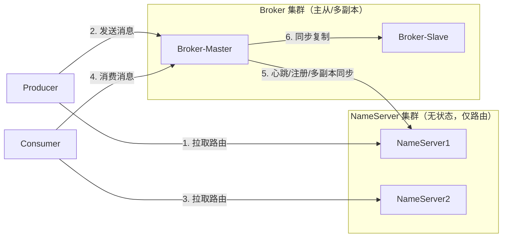
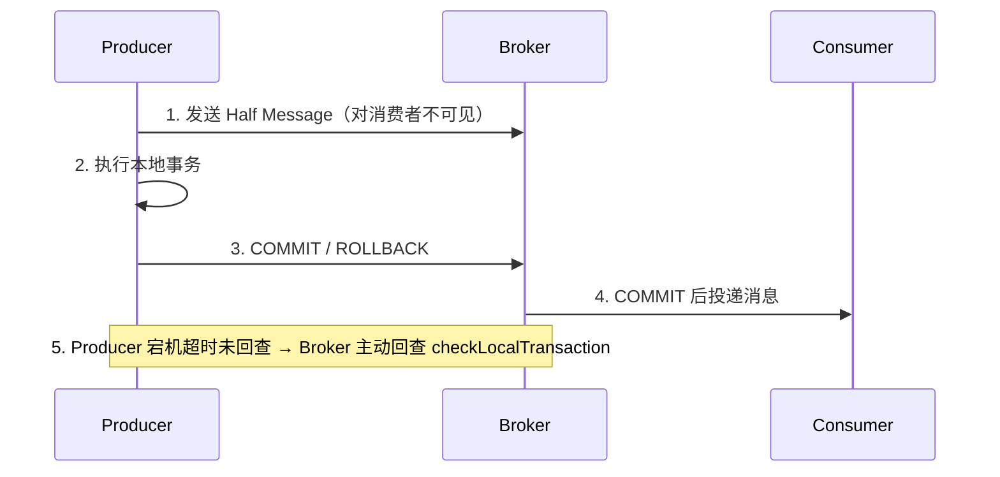

# RocketMQ（业务级可靠消息队列）

> 国内电商/金融业务消息的事实标准：事务消息、延迟消息、顺序消息、消息轨迹一应俱全。本文是**实用篇**——架构、存储模型、事务半消息、顺序消费、生产排障一条龙；与「源码系列/rocketMq」互补（那边偏源码解析）。
> 开源参考：[apache/rocketmq](https://github.com/apache/rocketmq)（Java，Apache 2.0，阿里开源捐给 Apache，国内 Java 业务消息首选）。

---

## 〇、本体介绍（它是什么 / 适用场景 / 核心概念）

**它是什么**：RocketMQ 是阿里开源的**分布式消息队列**，主打「业务级可靠」：事务消息、延迟消息、顺序消息、消息轨迹、死信重试等能力开箱即用，是国内电商/金融/互联网业务系统的消息事实标准。

**解决什么痛点**：业务解耦需要「发消息和本地事务保持一致」（事务消息）、下单 30 分钟未支付自动关单（延迟消息）、订单状态必须有序推进（顺序消息）、消息全链路可追踪（轨迹）。这些是 Kafka 原生薄弱、RocketMQ 原生强项。

**核心概念**：NameServer、Broker、Producer/Consumer、Topic/MessageQueue（队列）、CommitLog/ConsumeQueue/IndexFile、事务消息（半消息+回查）、延迟消息（18 级）、顺序消息（MessageListenerOrderly）、消费组、重试队列/死信队列（%DLQ%）、消息轨迹。

**适用场景**：订单/交易/支付等业务解耦、事务消息、延迟任务、顺序消息、金融级可靠投递。
**不适用**：日志流/埋点大数据管道（选 Kafka）、云原生多租户弹性场景（选 Pulsar）。

---

## 一、核心架构：NameServer + Broker + Client



### 组件职责

| 组件 | 职责 | 特点 |
|------|------|------|
| **NameServer** | 注册中心：管理 Broker 路由、Topic 元数据 | 无状态、可集群，客户端直接连即可 |
| **Broker** | 消息存储与收发：CommitLog + ConsumeQueue | 主从复制（同步/异步），可多副本 |
| **Producer / Consumer** | 生产/消费客户端 | 客户端从 NameServer 拉路由，直连 Broker |
| **MessageQueue** | 一个 Topic 拆成 N 个队列 | 队列 = 并行度单位，类似 Kafka 分区 |

> 与 Kafka 的关键差异：Kafka 元数据在 ZK/KRaft（强一致），RocketMQ 的 NameServer **无状态、弱一致**（Broker 主动注册，客户端容错重试），部署更简单。

---

## 二、存储模型（性能核心）

```
store/
├── commitlog/      # 所有 Topic 消息顺序写一个文件（1G 滚动），零碎片
├── consumequeue/   # 按 Topic-队列维度建索引：8B偏移 + 4B长度 + 8B tag hashcode
├── index/          # 按 key 的哈希索引（支持按业务 key 查消息）
└── checkpoint      # 刷盘检查点
```

1. **CommitLog 顺序写**：所有消息 append 到 CommitLog（磁盘顺序写），这是高吞吐的根本。
2. **ConsumeQueue 稀疏索引**：每个条目固定 20 字节（偏移/长度/tag 哈希），可按数组下标快速定位 CommitLog 位置。
3. **IndexFile**：按业务 key 建哈希索引，用于消息轨迹查询。
4. **刷盘策略**：`SYNC_FLUSH`（每条 fsync，强可靠低吞吐）vs `ASYNC_FLUSH`（默认，批量刷盘）。
5. **零拷贝**：消费读时 Broker 用 mmap + sendfile，避免用户态拷贝。

---

## 三、四大杀手锏能力（面试高频）

### 3.1 事务消息（半消息机制）—— RocketMQ 的灵魂



- 解决「本地事务提交」与「消息发送」的一致性（分布式事务的一种落地）。
- 回查：Producer 挂了，Broker 定期反向问事务状态，杜绝「事务成功但消息没发」。
- 生产要求：事务方法内**不要写非事务性副作用**，回查必须幂等。

### 3.2 延迟消息

- 内置 **18 个延迟级别**：1s / 5s / 10s / 30s / 1m / 2m / 3m / 4m / 5m / 6m / 7m / 8m / 9m / 10m / 20m / 30m / 1h / 2h。
- 实现：消息投递到 `SCHEDULE_TOPIC_XXXX` 特殊主题，到期后按时间戳转投到真实主题。
- 场景：下单未支付自动关单、订单超时提醒、延迟重试。
- 局限：只支持预置 18 级；任意秒级延迟需自研时间轮或依赖外部调度。

### 3.3 顺序消息

- **分区有序（推荐）**：`MessageQueueSelector` 按业务 key（如订单号）选择固定队列 → 该 key 消息全落同一队列。
- **消费端顺序**：用 `MessageListenerOrderly`（队列锁 + 单线程处理），保证单队列消费有序。
- **全局有序**：单队列（吞吐受限），一般不用。
- 与 Kafka 同理：顺序 + 幂等是配套（rebalance 可能带来少量重复）。

### 3.4 消息轨迹与重试/死信

- **消息轨迹**：开启 `msgTraceTopic`，记录生产/存储/消费时间戳，控制台可视化「消息发没发出去、卡在哪」。
- **重试**：消费失败自动重试（默认 16 次，指数退避）；进入 `%RETRY%` 队列。
- **死信**：重试耗尽进 `%DLQ%` 死信队列，人工排查/重放，防毒消息阻塞消费。
- **去重**：`RETRY_TIMES` / 业务幂等键兜底。

---

## 四、RocketMQ vs Kafka（面试必考对比）

| 维度 | RocketMQ | Kafka |
|------|----------|-------|
| 定位 | 业务级可靠消息 | 日志流/大数据管道 |
| 事务消息 | ✅ 半消息+回查（原生强） | 事务 API（弱） |
| 延迟消息 | ✅ 18 级内置 | ❌ 需外部实现 |
| 顺序消息 | ✅ 队列有序 | 分区有序 |
| 消息轨迹 | ✅ 内置 | ❌ 无内建 |
| 存储模型 | CommitLog 全局顺序写 + ConsumeQueue | 分区日志 Segment |
| 元数据 | NameServer（无状态，弱一致） | ZK/KRaft（强一致） |
| 消息回溯 | 按时间/偏移回溯 | 任意 offset 回放（更强） |
| 消费模型 | 推拉结合（Push/Pull） | 纯 Pull |
| 生态 | 国内 Java 业务 | 大数据/流处理生态最大 |
| 选型 | 电商/交易/金融业务 | 日志/埋点/管道/CDC |

**口诀**：业务消息选 RocketMQ（事务/延迟/轨迹全），数据管道选 Kafka（吞吐/生态）。

---

## 五、生产实践与避坑

### 5.1 高可用部署

- **NameServer**：≥2 台，无状态，前端 LB 或客户端配置多地址。
- **Broker**：主从部署（Dledger 主从切换或传统主从），`brokerRole` 配 MASTER/SLAVE；建议 `flushDiskType=ASYNC_FLUSH` + 同步复制折中。
- **多副本**：Dledger 模式（基于 Raft）实现自动主从切换，替代手动切换。

### 5.2 常见坑

1. **事务消息回查接口不幂等** → 重复提交/状态错乱；回查必须按本地事务状态幂等返回。
2. **消费失败无限重试** → 不可重试异常（参数非法）应捕获后**手动确认**或快速转死信，别让毒消息耗光重试 16 次。
3. **顺序消费用错 Listener** → 顺序消费必须 `MessageListenerOrderly`，普通 `Concurrently` 会并发处理破坏顺序。
4. **延迟级别记错** → 只有 18 个固定级别，且只能「从创建时刻开始」延迟，不能指定任意时间。
5. **Broker 磁盘满** → 监控 `store/commitlog` 与磁盘水位；消息量大要设 `retention` 策略定期清理。
6. **NameServer 单点** → 生产必须 ≥2 台 + 监控，NameServer 挂了已建连接还能跑，但新 topic/扩容会失败。
7. **消费组重复消费** → 客户端实例配了不同 `group` 导致重复消费/消息两遍处理；消费必须幂等。
8. **queue 数不可随意减少** → 减少 queue 会丢消息（offset 溢出），扩容只增不减（类似 Kafka 分区）。

### 5.3 性能调优速查

- Producer：`sendMsgTimeout`、批量发送、`retryTimesWhenSendFailed` 合理配置；业务允许用 `ONE_WAY` 发送。
- Consumer：`consumeThreadMin/Max`（默认 20，可调高）、`pullBatchSize`（默认 32，攒批）、`consumeMessageBatchMaxSize`。
- Broker：`maxTransferBytesOnMessageInDisk`、`osPageCacheBusyTimeOutMills`；压测时关注页缓存命中率。

---

## 面试高频问题（20+ 条）

1. **RocketMQ 架构组成？** NameServer（路由注册，无状态）、Broker（存储收发，主从）、Producer、Consumer；Topic 拆 Queue，Queue 是并行度单位。

2. **NameServer 和 ZK 区别？** NameServer 无状态、不持久化、弱一致（Broker 主动注册，客户端容错）；ZK 强一致但部署重、选主期间不可用。RocketMQ 用 NameServer 换简单和可用性。

3. **事务消息原理？** 先发半消息（消费者不可见）→ 执行本地事务 → COMMIT/ROLLBACK → 超时未回查则由 Broker 反向回查 Producer 本地事务状态；保证「本地事务」和「发消息」原子一致。

4. **半消息为什么消费者看不到？** 半消息先投递到特殊主题（RMQ_SYS_TRANS_HALF_TOPIC），COMMIT 后才转投真实 Topic；回查失败的消息定期清除。

5. **延迟消息怎么实现？** 发送时设置 `DELAY` 延迟级别（18 级），Broker 把消息先放 `SCHEDULE_TOPIC_XXXX`，时间到按消息的存根转投真实 Topic。

6. **延迟级别有哪 18 个？** 1s/5s/10s/30s/1m~10m（每分钟一个）/20m/30m/1h/2h，共 18 级；任意秒级需自研。

7. **顺序消息怎么保证？** 发送端按业务 key 选队列（MessageQueueSelector）保证同 key 同队列；消费端 `MessageListenerOrderly` 单线程 + 队列锁消费。全局有序=单队列。

8. **消息不丢怎么保证？** 生产：同步发送+重试（或事务消息）；Broker：同步刷盘/主从同步复制；消费：先处理再确认（ConsumeStatus.CONSUME_SUCCESS），失败进重试/死信。

9. **消息重复消费？** at-least-once 语义；消费端幂等（唯一键去重表/Redis SETNX/状态机），与 Kafka 相同思路。

10. **消息堆积怎么处理？** 看 consumer lag（mqadmin consumerProgress）→ 扩容消费者（受 queue 数限制，不够先扩 queue）→ 批量消费/异步化 → 优化消费逻辑 → 严重时旁路追平（新 topic 搬运并行消费）。

11. **死信队列是什么？** 消费重试超过最大次数（默认 16）进入 `%DLQ%+group` 死信队列；人工排查根因后重放，避免毒消息阻塞消费。

12. **CommitLog/ConsumeQueue 关系？** CommitLog 顺序存全量消息（高性能写），ConsumeQueue 是每个队列的稀疏索引（20B 定长条目）指向 CommitLog 偏移，读按索引定位。

13. **刷盘策略？** SYNC_FLUSH（每条 fsync 强可靠）vs ASYNC_FLUSH（默认，攒批刷盘吞吐高）；消息可同步复制到从 Broker 再确认。

14. **RocketMQ 与 Kafka 存储差异？** RocketMQ 全局 CommitLog 顺序写 + 索引分离；Kafka 按分区 Segment 存储 + 稀疏索引。都是顺序写盘+零拷贝。

15. **消息轨迹怎么实现？** 开启轨迹后生产/消费端上报埋点到 `RMQ_SYS_TRACE_TOPIC`，控制台可视化「生产时间→存储→消费」各环节，定位丢/慢/重。

16. **Push 和 Pull 消费？** 原生 Pull（自主控制拉取）；Push 是「长轮询 + 客户端线程池」的封装（拉长轮询），本质还是拉。

17. **Broker 主从切换？** 传统模式手动切；Dledger 模式（Raft）自动选主，推荐生产使用，兼顾可靠与自动容灾。

18. **Topic 队列数怎么定？** 队列数 ≈ 目标 TPS ÷ 单队列消费能力 × 余量；消费者并行度 ≤ 队列数，扩容先加队列再加实例（队列只能增不宜减）。

19. **RocketMQ 和 Kafka 怎么选？** 国内业务系统（事务/延迟/轨迹/顺序）选 RocketMQ；日志埋点/大数据管道/流处理/CDC 选 Kafka；都想要多租户弹性选 Pulsar。

20. **消息幂等与去重谁来做？** 中间件保证 at-least-once，**去重永远在下游**：业务唯一键 + 去重表/Redis/状态机；RocketMQ 的 msgId 只能辅助，不能作为跨应用幂等键。

21. **Broker 宕机消息会丢吗？** 主从复制 + 刷盘策略决定：同步复制 + SYNC_FLUSH 最稳；异步复制 + 异步刷盘可能丢最近少量消息（需要可容忍）。

22. **消费慢导致消息堆积，为什么不直接加消费者？** 消费并行度受 queue 数上限约束；queue 不够要先扩 queue 再扩消费者，且扩 queue 是重操作，规划时留余量。

---

## 六、与其他板块的关系

- 和「**源码系列/rocketMq**」：本篇讲能力与选型；源码篇讲存储/顺序消费/事务等实现细节。
- 和「**基础知识/MQ**」：MQ.md 收录了 RocketMQ 存储目录、事务半消息、顺序消费两把锁等精华，可与本篇对照。
- 和「**基础知识/中间件/分布式事务Seata**」：RocketMQ 事务消息是「消息最终一致性」型分布式事务；Seata 是「AT/TCC」型，两者按场景互补。
- 和「**基础知识/中间件/RabbitMQ**」「**Kafka**」「**ApachePulsar**」：同属消息家族，选型见对比表。
- 和「**场景设计/幂等设计**」：消费幂等设计与通用幂等设计一脉相承。

---

## 七、速查表

| 项 | 结论 |
|----|------|
| 类型 | 分布式消息队列（业务级） |
| 核心 | NameServer（路由） + Broker（CommitLog 存储） + 队列 |
| 杀手锏 | 事务消息（半消息+回查）/ 延迟 18 级 / 顺序消息 / 轨迹 |
| 吞吐 | 50 万+ msg/s |
| 堆积 | 强（CommitLog 磁盘 + 索引） |
| 刷盘 | SYNC_FLUSH / ASYNC_FLUSH；主从同步/异步复制 |
| 许可证 | Apache 2.0 |
| 一句话 | 「国内业务消息的标准答案」——事务、延迟、顺序、轨迹全都有 |
